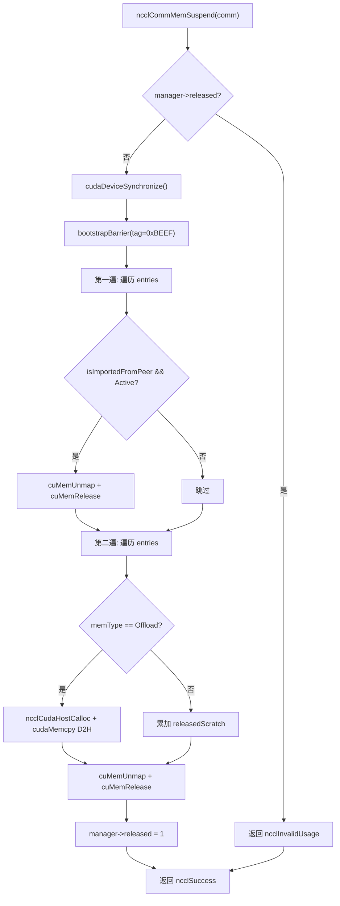
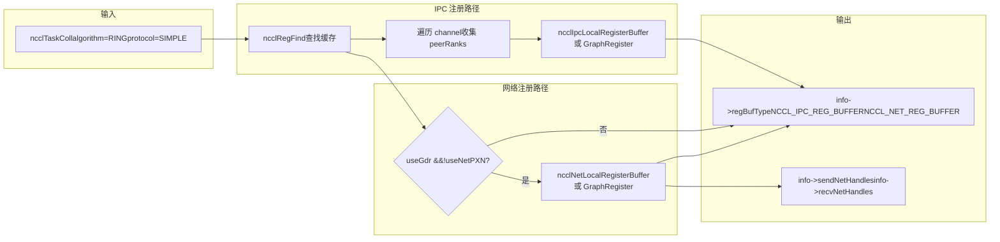
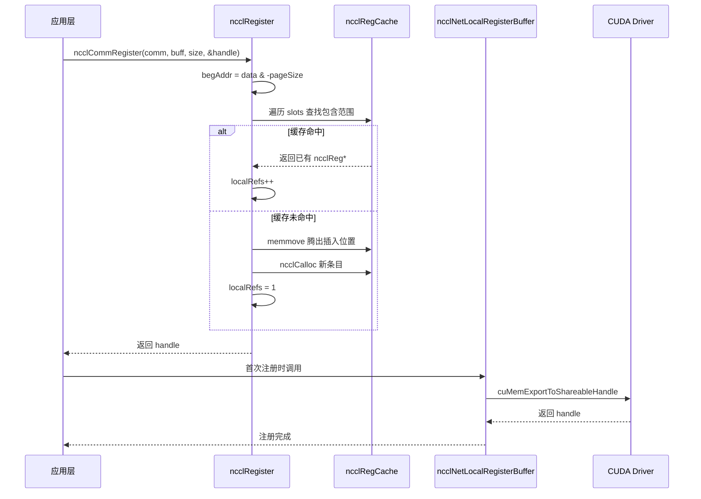

# Capítulo 18: Alocação de memória e gerenciamento de memória de vídeo: allocator, cache de registro e otimização de memória registrada pelo usuário

No capítulo anterior, vimos como o subsistema RAS opera de forma independente do plano de dados no plano de controle, usando hash para versionamento e contagem de referências para proteger o ciclo de vida. Este capítulo entra no terceiro pilar do NCCL — o gerenciamento de memória. O limite superior do desempenho de comunicação muitas vezes não depende do algoritmo em si, mas de "se os dados podem ser lidos e escritos diretamente pela placa de rede". Para isso, o NCCL construiu um mecanismo de três camadas: na camada inferior, usa`ncclSpace`e`ncclShadowPool`para gerenciar o espaço de endereços e objetos sombra; na camada intermediária, usa`ncclMemManager`para rastrear a importação/exportação de memória dinâmica e suspensão/restauração; na camada superior, usa`ncclCommRegister`para registrar buffers do usuário no cache, evitando fixar memória repetidamente a cada comunicação. Este capítulo desmontará essas três camadas de mecanismos, respondendo "por que é necessário registrar memória antes da comunicação NCCL" e "como o cache de registro afeta o desempenho".

# 18.1 ncclSpace: dividindo o espaço de endereços em segmentos alternados cheio/vazio

## Modelo intuitivo

Imagine uma linha infinita de numeração de vagas de estacionamento, começando em 0 e estendendo-se para a direita. Algumas vagas têm carros estacionados (alocadas), outras estão vazias (não alocadas).`ncclSpace`é o "caderno de registro de status das vagas" dessa linha de numeração — ele não registra cada vaga, apenas os "pontos de fronteira onde o status muda". Sem ele, ao gerenciar intervalos de endereços virtuais de memória simétrica, o NCCL teria que manter um bit de marcação para cada byte, com custo de memória proporcional ao espaço de endereços, o que é completamente inaceitável.

## Estrutura de dados e layout de memória

`ncclSpace`A definição é extremamente minimalista[FACT:src/include/allocator.h:20-24]：

```c
struct ncclSpace {
  int count;        // cuts[] 中有效元素个数
  int capacity;     // cuts[] 已分配容量
  int64_t* cuts;    // 升序排列的边界点数组
};
```

A percepção central está claramente escrita nos comentários do código-fonte[FACT:src/allocator.cc:151-153]：`cuts[]`divide o eixo dos inteiros não negativos em segmentos alternados de "cheio" e "vazio", com os pontos de corte em ordem crescente, e o segmento após o último ponto de corte é necessariamente vazio (fronteira não alocada). A partir disso, pode-se derivar a fórmula para determinar se o`i`º segmento está cheio:

```
isFull(i) = (i%2 != ncuts%2)
```

O significado desta fórmula é: o estado cheio/vazio do segmento é determinado conjuntamente pela "paridade do índice do segmento" e pela "paridade do número total de pontos de corte". Quando`ncuts`é par, o segmento 0 (antes de`cuts[0]`) está vazio; quando`ncuts`é ímpar, o segmento 0 está cheio. Essa invariante permeia todo o módulo.

## Passo a passo: como uma alocação altera cuts[]

Cenário: inicialmente`ncclSpace`está vazio (`count=0`), chama-se`ncclSpaceTryAlloc(a, limit=1000, size=100, align=1, &outOffset)`。

**Primeiro passo: localizar o primeiro segmento vazio** [FACT:src/allocator.cc:209]。`i = a->count % 2`, neste momento`count=0`, então`i=0`, começa a varredura a partir do segmento 0.

**Segundo passo: calcular as fronteiras do segmento** [FACT:src/allocator.cc:212-213]。`i==0`quando`lo=0`；`i==a->count`quando`hi=limit=1000`. Portanto, o segmento vazio é`[0, 1000)`。

**Terceiro passo: alinhar e verificar a capacidade** [FACT:src/allocator.cc:214-215]。`off = alignUp(0, 1) = 0`，`0 + 100 <= 1000`é verdadeiro, alocação bem-sucedida.

**Quarto passo: inserir pontos de corte** [FACT:src/allocator.cc:217-223]. Como`i==0`(inserção no início), segue o caminho lento`insertSegment(a, 0, 0, 100)`。`insertSegment`insere dois pontos de corte em`index=0`, e então executa a "filtragem de valores duplicados adjacentes"`lo=0, hi=100` [FACT:src/allocator.cc:172-174]. A lógica de filtragem é engenhosa: ela usa dois cursores de leitura e escrita para varrer, e ao encontrar valores duplicados, retrocede o cursor de escrita, removendo pares de valores duplicados — porque duplicatas em pares significam que um segmento vazio está entre dois segmentos cheios e pode ser mesclado. Mas zeros à esquerda são um caso especial e podem ser removidos individualmente[FACT:src/allocator.cc:185-203]Após a alocação[FACT:src/allocator.cc:182-184]。

. Neste momento`cuts = [0, 100]`，`count=2`, o segmento 0 (`isFull(0) = (0%2 != 2%2) = false`, vazio) está vazio; o segmento 1 (`[0,0)`) está cheio. Correto.`[0,100)`Quinto passo: liberação

**. Chama-se** [FACT:src/allocator.cc:239-267]. Primeiro verifica se`ncclSpaceFree(a, 0, 100)`é verdadeiro`cuts[count-1] <= offset`, ou seja,[FACT:src/allocator.cc:231-237]é falso, continua. Localiza o primeiro segmento cheio`100 <= 0`, então`i = 1 - count%2 = 1 - 0 = 1` [FACT:src/allocator.cc:246]，`cuts[1]=100 > 0`. Verifica`i=1`。`lo = cuts[0] = 0`，`hi = cuts[1] = 100`falso,`offset < lo || hi < offset+size` [FACT:src/allocator.cc:252]，`0<0`falso, passa. Como`100<100`e`lo==offset`, nenhum dos dois caminhos rápidos é satisfeito (o primeiro requer`offset+size==hi`, o segundo requer`offset+size != hi`), segue o caminho lento`lo != offset`. Após a inserção`insertSegment(a, 1, 0, 100)` [FACT:src/allocator.cc:264], após a filtragem torna-se`cuts = [0, 0, 100, 100]`. Retorna ao estado inicial.`[]`，`count=0`Esse design de "inserir e depois filtrar" evita lógica complexa de mesclagem de segmentos durante alocação/liberação, concentrando a complexidade em

em um único lugar.`insertSegment`Considerações de design e armadilhas em produção

## Por que usar int64_t em vez de size_t?

**Porque**gerencia "deslocamentos" e não "ponteiros", e os deslocamentos podem ser negativos (embora na prática não sejam), além de precisar ser consistente com a largura de`ncclSpace`do CUDA. Usar tipo com sinal facilita a detecção de estouro durante a depuração.`CUdeviceptr`Armadilha de desempenho

**O comentário afirma diretamente "This could be binary search, but since allocate is linear there's no point"**：`ncclSpaceFree`. Isso significa que tanto alocação quanto liberação são varreduras O(n). Se um domínio de comunicação alocar e liberar frequentemente muitos segmentos pequenos,[FACT:src/allocator.cc:245]irá inflar, tornando cada operação mais lenta. Em ambientes de produção, deve-se reutilizar buffers já registrados o máximo possível, em vez de registrar/desregistrar repetidamente.`cuts[]`Risco de estouro no alinhamento

**pode estourar quando**：`alignUp(lo, align)`está próximo de`lo`e`INT64_MAX`é grande. O código-fonte não faz verificação explícita, porque`align`é garantido pelo chamador dentro de um intervalo razoável.`limit` 由调用方保证在合理范围内。

# 18.2 ncclShadowPool: gerenciamento de emparelhamento entre objetos de dispositivo e sombras de host

## Modelo intuitivo

Kernels de GPU são executados no dispositivo e não podem acessar diretamente objetos C++ na memória do host (por exemplo,`ncclDevComm`metadados em).`ncclShadowPool`Funciona como um "tradutor": aloca um bloco de memória de dispositivo para cada objeto do lado do dispositivo, ao mesmo tempo que aloca um bloco correspondente de memória "sombra" no lado do host, e mantém uma tabela de mapeamento "endereço de dispositivo → endereço de host". Quando o host precisa modificar a configuração de algum objeto de dispositivo, primeiro altera a sombra no host e depois copia para o dispositivo. Sem ele, cada vez que um kernel precisasse ler metadados teria que puxar do host via`cudaMemcpy`o que resultaria em latência inaceitavelmente alta.

## Estruturas de dados e layout de memória

Dois structs principais[FACT:src/allocator.cc:272-277]：

```c
struct ncclShadowPage {   // 最多 64 个对象的连续块
  struct ncclShadowPage* next;
  int objSize;
  uint64_t freeMask;      // 位图，1=空闲，0=已占用
  void* devObjs;
};
struct ncclShadowObject {
  struct ncclShadowObject* next;
  void* devObj;
  void* hostObj;
  struct ncclShadowPage* page;  // null 表示直接分配在 CUDA mempool
};
```

`ncclShadowPool`em si[FACT:src/include/allocator.h:42-47]：

```c
struct ncclShadowPool {
  int count, hbits;                       // 对象数、哈希位数
  struct ncclShadowObject** table;        // 哈希桶数组
  cudaMemPool_t memPool;                  // 可选的 CUDA 内存池
  struct ncclShadowPage* pages;           // 页链表
};
```

**Pontos-chave de design:`freeMask`é uint64_t**portanto, no máximo 64 objetos por página. Isso não foi escolhido aleatoriamente — 64 bits correspondem exatamente à largura de uma linha de cache,`popFirstOneBit`pode-se usar uma única instrução`__builtin_ctzll`para encontrar o primeiro slot livre, sem necessidade de loop.

**Estratégia de crescimento da tabela hash**: comentário no código-fonte "Maintain 2:1 object:bucket ratio"[FACT:src/allocator.cc:368]ou seja, expande quando o número de objetos excede o dobro do número de buckets. Inicial`hbits=4`(16 buckets)[FACT:src/allocator.cc:363], dobrando a cada vez.

## Passo a passo: como uma alocação escolhe entre página ou conexão direta

Cenário:`ncclShadowPoolAlloc(pool, size=1024, &devObj, &hostObj, stream)`。

**Primeiro passo: inicialização preguiçosa** [FACT:src/allocator.cc:347-366]. Se`hbits==0`, primeiro consulta se o dispositivo suporta pool de memória[FACT:src/allocator.cc:352], se suportar cria`cudaMemPool_t`, define`maxSize`como parâmetro`SHADOW_MEMPOOL_MAX_SIZE`(padrão 1GB)[FACT:src/allocator.cc:359]. Em seguida, aloca a tabela hash com 16 buckets.

**Segundo passo: verificar se precisa expandir** [FACT:src/allocator.cc:369-386]. Se`count+1 > 2<<hbits`, aloca array de buckets com o dobro do tamanho, percorre a tabela antiga reinserindo (`hashInsert`usa`ncclHashPointer`para calcular o índice do bucket[FACT:src/allocator.cc:333-337]), libera a tabela antiga.

**Terceiro passo: decidir entre caminho de página ou caminho direto** [FACT:src/allocator.cc:390]. Condição de decisão`(64<<10)/size >= 3`, ou seja, quando`size <= 21845`segue o caminho de página. Para`size=1024`，`65536/1024=64 >= 3`, segue o caminho de página.

**Quarto passo: calcular o tamanho do objeto dentro da página** [FACT:src/allocator.cc:391-392]。`shift = max(0, log2Down(1024)+1-4) = max(0, 10+1-4) = 7`。`pageObjSize = ((1024 + 127) >> 7) << 7 = 1024`. Ou seja, o tamanho do objeto dentro da página é alinhado a potências de 2 até múltiplos de 128 bytes.

**Quinto passo: localizar ou criar página** [FACT:src/allocator.cc:393-415]. Percorre a lista encadeada`pool->pages`, procura a página com`objSize == pageObjSize`. Se não existir, cria nova página:`pageSize = min(65536, 64*1024) = 65536`，`freeMask = uint64_t(-1) >> (64 - 65536/1024) = uint64_t(-1) >> 0 = 全 1`(todos os 64 slots vazios)[FACT:src/allocator.cc:400]. Usa`cudaMallocFromPoolAsync`ou`cudaMalloc`para alocar memória de dispositivo[FACT:src/allocator.cc:403-404], e`cudaMemsetAsync`zera[FACT:src/allocator.cc:405]。

**Sexto passo: obter slot da página** [FACT:src/allocator.cc:408-412]。`popFirstOneBit(&page->freeMask)`encontra o primeiro bit livre,`devObj = page->devObjs + slot * pageObjSize`. Se`freeMask`se torna 0 (página cheia), remove a página da lista de páginas livres[FACT:src/allocator.cc:411]。

**Sétimo passo: alocar objeto sombra no host** [FACT:src/allocator.cc:423-428]。`malloc(sizeof(ncclShadowObject) + alignof(max_align_t)-1 + size)`, note que aqui foi alocado`alignof(max_align_t)-1`bytes adicionais para preenchimento de alinhamento.`hostObj = alignUp((char*)(obj+1), alignof(max_align_t))`, ou seja, após o cabeçalho do objeto alinha ao limite máximo de alinhamento. Em seguida`memset(hostObj, 0, size)`zera.

**Oitavo passo: inserir na tabela hash e atualizar contadores** [FACT:src/allocator.cc:429-430]。

## Controle de concorrência e interação com hardware

`ncclShadowPool`em si**não possui lock**. Isso significa que só pode ser usado em contexto single-thread, ou o chamador deve garantir exclusão mútua. Pelo uso real no NCCL, é chamado principalmente durante a fase de inicialização do domínio de comunicação, quando é single-thread.

`cudaMallocFromPoolAsync`e`cudaFreeAsync`são operações assíncronas, dependem do parâmetro`stream`para garantir a ordem[FACT:src/allocator.cc:403,459]。`ncclShadowPoolDestruct`é chamado após liberar todos os recursos`cudaStreamSynchronize(stream)` [FACT:src/allocator.cc:333-337], garantindo que todas as liberações assíncronas sejam concluídas antes de destruir o pool de memória.

## Guia de armadilhas em produção

**Armadilha 1: desperdício de memória causado pelo alinhamento do tamanho do objeto dentro da página**。`pageObjSize`alinhado a potências de 2, se`size=1000`，`shift = log2Down(1000)+1-4 = 9+1-4 = 6`，`pageObjSize = ((1000+63)>>6)<<6 = 1024`. Cada objeto desperdiça 24 bytes, 64 objetos por página desperdiçam 1536 bytes. Para muitos objetos pequenos, esse custo não é desprezível.

**Armadilha 2:`ncclShadowPoolFree`comportamento quando o objeto não é encontrado** [FACT:src/allocator.cc:442-445]. Retorna`ncclInternalError`e imprime aviso, mas**não libera nenhum recurso**. Se o chamador ignorar o valor de retorno, causará vazamento de memória. Código de produção deve verificar o valor de retorno.

**Armadilha 3:`ncclShadowPoolDestruct`em`freeMask==0`a página de** [FACT:src/allocator.cc:301-306]é reciclada`freeMask`. Note que aqui`pool->pages`é definido como 1 (não todos 1), significando que apenas o primeiro slot é marcado como vazio. Isso serve para recolocar a "página cheia" na lista encadeada

# , mas os outros slots da página ainda estão ocupados — na verdade esses objetos estão prestes a ser liberados, então essa operação é segura. Mas se houver acesso concorrente durante o processo de destruição, lerá estado inconsistente.

## 18.3 ncclMemManager: contagem de referências e suspensão/restauração de memória dinâmica

Modelo intuitivo`ncclMemManager`Tarefas de treinamento podem durar dias, durante os quais a GPU pode ser preemptada por outras tarefas, ou pode ser necessário fazer checkpoint.

## Funciona como um "gerente de memória": registra toda a memória alocada dinamicamente (scratch/offload), quando necessário "suspende" a memória da GPU (desmapeia páginas físicas, mantém endereços virtuais), faz backup dos dados para a CPU, e na restauração realoca páginas físicas, remapeia e restaura os dados. Sem ele, após preempção a tarefa só poderia recomeçar do zero, desperdiçando horas de progresso de treinamento.

`ncclMemManager`Estruturas de dados e layout de memória[FACT:src/mem_manager.cc:32-60]：

| Campos principais de | (inferidos do código de inicialização) | Campo |
| --- | --- | --- |
| `entries` | `ncclDynMemEntry*` | Tipo |
| `numEntries` | `int` | Significado |
| `released` | `int` | Cabeça da lista de entradas de memória dinâmica |
| `refCount` | `int` | Comprimento da lista |
| `totalPersist` | `size_t` | 0=ativo, 1=suspenso |
| `totalScratch` | `size_t` | Contagem de referências (múltiplos comms podem compartilhar) |
| `totalOffload` | `size_t` | Total de memória persistente (atômico) |
| `cpuBackupUsage` | `size_t` | Total de memória scratch (atômico) |
| `lock` | `std::mutex` | Total de memória offload (atômico) |
| `initialized` | `int` | Total de memória de backup na CPU |

**Protege a lista entries**：`lock`Flag atômica, evita acesso a mutex já destruído`std::mutex`Design-chave do layout de memória`ncclMemManager`é um`ncclCalloc`, mas[FACT:src/mem_manager.cc:39]é alocado com`~mutex()` [FACT:src/mem_manager.cc:120](estilo C), então é obrigatório usar placement new para construir explicitamente

**, e chamar explicitamente no destrutor**. Esta é uma armadilha clássica de programação mista C/C++.`totalPersist`Divisão de trabalho entre variáveis atômicas e locks`entries`: campos de estatística (`lock`etc.) são atualizados com operações atômicas, não precisam de lock;`ncclCommMemStats`a lista encadeada é protegida por[FACT:src/mem_manager.cc:1117-1130]. Assim consultas estatísticas (

## Passo a Passo: Fluxo completo de suspensão e retomada

**Fluxo de suspensão** `ncclCommMemSuspend` [FACT:src/mem_manager.cc:418-540]：

**Primeiro passo: Verificações prévias** [FACT:src/mem_manager.cc:419-430]. Verifica se o gerenciador de memória está desabilitado, se comm está vazio, se já está suspenso.

**Segundo passo: Sincronização de dispositivo e barrier** [FACT:src/mem_manager.cc:440-441]。`cudaDeviceSynchronize()`Garante que todas as operações da GPU foram concluídas, então`bootstrapBarrier`Garante que todos os ranks estão sincronizados. A barrier tag é`0xBEEF`。

**Terceiro passo: Primeira varredura — unmap de todos os buffers importados de peers** [FACT:src/mem_manager.cc:444-465]. Para cada`isImportedFromPeer && state==Active`entrada de`cuMemUnmap`, chama[FACT:src/mem_manager.cc:451]para desmapear[FACT:src/mem_manager.cc:456], libera o handle`Released`。

**, o estado muda para** [FACT:src/mem_manager.cc:468-526]Quarto passo: Segunda varredura — offload da memória local`ncclMemOffload`. Pula entradas importadas de peers e já liberadas. Para o tipo[FACT:src/mem_manager.cc:484], primeiro aloca backup na CPU`cudaMemcpy`, então[FACT:src/mem_manager.cc:492]copia da GPU para a CPU`ncclMemScratch`. Para o tipo[FACT:src/mem_manager.cc:508-513]，`cuMemUnmap` [FACT:src/mem_manager.cc:516]，`cuMemRelease` [FACT:src/mem_manager.cc:519], apenas acumula estatísticas. Então fecha o shareable FD`Released`。

**, o estado muda para** [FACT:src/mem_manager.cc:528]。

**Quinto passo: Marcar como suspenso** `ncclCommMemResume` [FACT:src/mem_manager.cc:550-942]：

**Fluxo de retomada** [FACT:src/mem_manager.cc:577-668]Primeiro passo: Restaurar memória local`!isImportedFromPeer && state==Released`. Para cada`cuMemCreate` [FACT:src/mem_manager.cc:599]，`ncclCuMemMapAndSetAccess`entrada de[FACT:src/mem_manager.cc:602], remapeia[FACT:src/mem_manager.cc:610-626]para o mesmo endereço virtual[FACT:src/mem_manager.cc:632-643], restaura permissões de acesso peer[FACT:src/mem_manager.cc:646-658]。

**, para tipo offload restaura dados do backup na CPU** [FACT:src/mem_manager.cc:671-679], reexporta o FABRIC handle`0xBEEF`。

**Segundo passo: Sincronização barrier** [FACT:src/mem_manager.cc:688-816]. A tag ainda é[FACT:src/mem_manager.cc:689-696]Terceiro passo: Trocar informações de novos handles`bootstrapAllGather`. Conta quantos buffers locais cada rank precisa broadcastar[FACT:src/mem_manager.cc:710], usa[FACT:src/mem_manager.cc:724-728]para trocar contagens`bootstrapSend`, calcula offsets`bootstrapRecv`, então primeiro[FACT:src/mem_manager.cc:783]）。

**depois** [FACT:src/mem_manager.cc:822-911]（comentário explícito「send first, then receive to avoid deadlock」`isImportedFromPeer && state==Released`Quarto passo: Reimportar buffers de peers[FACT:src/mem_manager.cc:829-835]. Para cada[FACT:src/mem_manager.cc:853-859]entrada de[FACT:src/mem_manager.cc:866]，`cuMemImportFromShareableHandle`, busca informações de handle correspondentes nos resultados da troca[FACT:src/mem_manager.cc:873]. Tipo POSIX FD precisa verificar se hostHash é igual[FACT:src/mem_manager.cc:878], então obtém o FD via proxy`ncclCuMemMapAndSetAccess`importa[FACT:src/mem_manager.cc:893]。

**. Tipo FABRIC importa diretamente** [FACT:src/mem_manager.cc:916-928]. Então`0xCAFE`remapeia`0xBEEF`Quinto passo: Barrier final

## . A tag é

**, distinta das**：`ncclMemManagerDestroy`anteriores.`refCount` [FACT:src/mem_manager.cc:76]Controle de concorrência e interação com hardware[FACT:src/mem_manager.cc:81]Contagem de referências protege o ciclo de vida

**decrementa primeiro**, se ainda for maior que 0 apenas limpa o ponteiro do comm atual`COMPILER_ATOMIC_LOAD(&manager->initialized, memory_order_acquire)` [FACT:src/mem_manager.cc:136,242,338,358], sem liberar recursos. Isso permite que múltiplos comms compartilhem o mesmo gerenciador de memória (como no cenário split_share).`memory_order_release`Flag atômica initialized[FACT:src/mem_manager.cc:87]: todas as operações verificam antes

**, para evitar acessar mutex já destruído. Na destruição usa**：`cuMemCreate`/`cuMemMap`/`cuMemUnmap`/`cuMemRelease`store 0

## , garantindo que escritas anteriores sejam visíveis para outras threads.

**Uso da API CUDA VMM** [FACT:src/mem_manager.cc:1014-1018]é a API de gerenciamento de memória virtual do CUDA, que permite separar memória física de endereço virtual. Esta é a base da suspensão/retomada — na suspensão faz unmap das páginas físicas mas mantém o endereço virtual, na retomada remapeia para o mesmo endereço virtual, assim todos os relacionamentos de ponteiros já estabelecidos não precisam ser modificados.`refCount > 1`Guia de armadilhas em produção`ncclInvalidUsage`Armadilha 1: Domínio de comunicação split_share não suporta suspensão

**. Se** [FACT:src/mem_manager.cc:853-859], retorna diretamente`hostHash`. Porque quando múltiplos comms compartilham o gerenciador de memória, suspender um comm afeta a memória dos outros.

**Armadilha 2: POSIX FD inválido entre nós** [FACT:src/mem_manager.cc:635]. Descritores de arquivo POSIX só são válidos dentro do mesmo nó, devem ser ignorados na retomada entre nós. O código-fonte usa`cudaMemcpy`comparação para determinar se é o mesmo nó.`cpuBackup`Armadilha 3: Manter backup quando restauração de dados offload falha

**. Se`ncclMemUntrackDynamic`restaurar da CPU para GPU falhar, o código-fonte imprime aviso e mantém**, sem liberar. Isso é para dar ao chamador uma chance de retentar, mas se não retentar haverá vazamento de memória da CPU.[FACT:src/mem_manager.cc:302]Armadilha 4:[FACT:src/mem_manager.cc:311-327]risco de use-after-free em`info`. O código-fonte, com o lock adquirido, encontra a entrada, salva informações necessárias, libera a entrada`info`, então atualiza estatísticas fora do lock



aponta para memória de stack do chamador, e o chamador lê fora do lock, é preciso garantir que o ciclo de vida de

# cubra toda a função.

## Copiar

A figura acima mostra o fluxo de controle do processo de suspensão. Note dois ramos críticos: a primeira varredura processa apenas buffers importados de peers, a segunda varredura processa apenas buffers locais, a ordem não pode ser invertida — primeiro deve-se desreferenciar a memória dos peers, depois liberar a memória local.`ncclRegister`18.4 Cache de registro: como ncclRegister evita pin repetido

## Modelo intuitivo

`ncclRegCache`A placa de rede precisa ler e escrever diretamente na memória da GPU (GPUDirect RDMA), primeiro deve "registrar" esta memória — informar à placa de rede "este endereço você pode acessar diretamente". O processo de registro envolve pin de páginas, estabelecimento de mapeamento IOMMU, com custo alto (nível de milissegundos). Se cada AllReduce registrar novamente, a latência de comunicação de mensagens pequenas seria completamente dominada pelo custo de registro.`slots`é um "cache de registro": registra os intervalos de endereços já registrados em um array ordenado, na próxima vez que encontrar um buffer igual ou contido, reutiliza diretamente, sem registrar novamente.`ncclReg*`。`ncclReg`Estrutura de dados e layout de memória

| o núcleo de | é um array ordenado | , cada elemento é |
| --- | --- | --- |
| `begAddr` | `uintptr_t` | campos-chave de |
| `endAddr` | `uintptr_t` | (inferidos do uso): |
| `localRefs` | `int` | Campo |
| `graphRefs` | `int` | Tipo |
| `state` | `int` | Significado |
| `netHandleHead` | `ncclRegNetHandles*` | Endereço inicial alinhado à página |
| `ipcInfos` | `ncclIpcInfo**` | Matriz de informações IPC |

**Alinhamento de página**：`begAddr = (uintptr_t)data & -pageSize` [FACT:src/register/register.cc:31]，`endAddr = ((uintptr_t)data + size + pageSize - 1) & -pageSize` [FACT:src/register/register.cc:32]。`-pageSize`é`pageSize`o complemento de dois, equivalente a «alinhar para baixo ao múltiplo de pageSize». A razão para isso é: a granularidade mínima de registro é a página, mesmo que se registre apenas 1 byte, é necessário registrar a página inteira.

## Step-by-Step Walkthrough: como um registro atinge o cache

Cenário:`ncclCommRegister(comm, buff=0x7f0000001000, size=4096, &handle)`。

**Primeiro passo: verificação de parâmetros e alinhamento de página** [FACT:src/register/register.cc:18-24]。`CommCheck`valida a eficácia de comm. Suponha`pageSize=4096`，`begAddr = 0x7f0000001000 & -4096 = 0x7f0000001000`，`endAddr = (0x7f0000001000 + 4096 + 4095) & -4096 = 0x7f0000002000`。

**Segundo passo: verificação de memória do sistema** [FACT:src/register/register.cc:36-64]. Se`ncclCuMemEnable()`, consulta o intervalo de endereços e o tipo de memória. Se`memType == CU_MEMORYTYPE_HOST`, indica que é memória CPU, pula o registro[FACT:src/register/register.cc:58-61]. Caso contrário, verifica se há segmento Sysmem[FACT:src/register/register.cc:50-55]。

**Terceiro passo: percorrer o cache para encontrar a posição de inserção** [FACT:src/register/register.cc:66-89]. Loop`slot`a partir de 0:

- Se`slot == population`(chegou ao fim) ou`begAddr < slots[slot]->begAddr`(o endereço atual está antes da entrada do cache), indica que é necessário criar uma nova entrada[FACT:src/register/register.cc:67]。
- Se`slots[slot]->begAddr <= begAddr && slots[slot]->endAddr >= endAddr`, indica que o buffer atual está completamente contido em uma entrada existente, incrementa diretamente o contador de referências[FACT:src/register/register.cc:83-87]。

**Quarto passo: criar nova entrada** [FACT:src/register/register.cc:68-82]. Se o cache estiver cheio, expande (inicial 32, depois dobra)[FACT:src/register/register.cc:70]. Usa`memmove`em`slot`posição para abrir espaço[FACT:src/register/register.cc:73]，`ncclCalloc`aloca nova entrada[FACT:src/register/register.cc:74], define`begAddr`/`endAddr`, de acordo com`isGraph`define`graphRefs`ou`localRefs`como 1[FACT:src/register/register.cc:78-79]，`population++`, retorna handle.

**Quinto passo: desregistro** [FACT:src/register/register.cc:172-195]。`commDeregister`primeiro encontra o slot correspondente ao handle[FACT:src/register/register.cc:180], decrementa o contador de referências[FACT:src/register/register.cc:185-186]. Se ainda houver referências, retorna diretamente[FACT:src/register/register.cc:187]. Caso contrário, chama`regCleanup`limpa todos os registros subjacentes[FACT:src/register/register.cc:188], libera a entrada, usa`memmove`para preencher o buraco[FACT:src/register/register.cc:190]，`population--`。

## Reflexões de design e armadilhas em produção

**Por que usar array ordenado em vez de tabela hash?**Porque a consulta de registro é uma consulta de «inclusão de intervalo», não correspondência exata. O array ordenado suporta busca binária (embora o código-fonte use varredura linear), e tem boa localidade de memória. A tabela hash não consegue lidar eficientemente com consultas do tipo «este endereço está contido em algum intervalo maior».

**`regCleanup`Design dos bits de estado** [FACT:src/register/register.cc:95-134]。`state`é uma máscara de bits, cada bit corresponde a um tipo de registro (NET/NVLS/COLLNET/IPC). Na limpeza, verifica bit a bit, limpando apenas os registros concluídos. Esse design permite situações em que parte do registro é bem-sucedida e parte falha — por exemplo, o registro de rede é bem-sucedido mas o registro IPC falha, na limpeza apenas a parte de rede é limpa.

**Armadilha em produção: o cache de registro não percebe a liberação de memória**. Se o usuário registra um buffer e depois, sem desregistrar,`cudaFree`ele, a entrada ainda permanece no cache. A próxima alocação pode reutilizar o mesmo endereço, causando acerto no cache mas a memória real já é inválida. A convenção do NCCL é: registro e desregistro devem ser pareados, o usuário é responsável por garantir que a memória não seja liberada durante o registro.

**`ncclCommRegister`Condições de skip** [FACT:src/register/register.cc:150-159]. Se`LocalRegister=0`ou`P2pUsesMemcpy=1`, retorna diretamente`NULL`handle. Isso significa que em certas configurações (por exemplo, P2P via memcpy em vez de RDMA), o registro é completamente ignorado. O chamador deve verificar se o handle é NULL.

# 18.5 Registro de comunicação coletiva: como coll_reg escolhe a estratégia de registro para diferentes algoritmos

## Modelo intuitivo

Diferentes algoritmos de comunicação coletiva seguem caminhos de transmissão diferentes: NVLS usa NVLink SHARP, Ring usa P2P ou rede, Tree usa topologia em árvore. Cada caminho requer um modo de registro diferente: NVLS precisa registrar no hardware NVLS, rede precisa registrar na placa de rede, IPC precisa registrar na GPU remota.`coll_reg.cc`é o «roteador de estratégia de registro»: ele decide quais funções de registro chamar com base no algoritmo, protocolo e tipo de buffer. Sem ele, cada algoritmo teria que implementar sua própria lógica de registro, com código duplicado e propenso a erros.

## Step-by-Step Walkthrough: decisão de registro do algoritmo Ring

Cenário:`ncclRegisterCollBuffers(comm, info, outRegBufSend, outRegBufRecv, cleanupQueue, regNeedConnect)`, onde`info->algorithm == NCCL_ALGO_RING`，`info->protocol == NCCL_PROTO_SIMPLE`。

**Primeiro passo: verificações prévias** [FACT:src/register/coll_reg.cc:155-157]. Define`regBufType = NCCL_REGULAR_BUFFER`，`regNeedConnect = true`. Se`LocalRegister=0`e não for registro de grafo persistente, sai diretamente.

**Segundo passo: entrar no ramo Ring** [FACT:src/register/coll_reg.cc:338]. Inicializa`recvRegRecord`/`sendRegRecord`como NULL, aloca`sendNetConns`/`sendNetHandles`/`recvNetConns`/`recvNetHandles`/`srecvNetHandles`array[FACT:src/register/coll_reg.cc:356-360]。

**Terceiro passo: buscar registro existente** [FACT:src/register/coll_reg.cc:351-355]。`ncclRegFind`procura no cache os buffers recv/send. Se recv não for encontrado e não for registro de grafo persistente, sai[FACT:src/register/coll_reg.cc:352]. Se for entre nós e send não for encontrado e não for registro de grafo persistente, sai[FACT:src/register/coll_reg.cc:354]。

**Quarto passo: percorrer todos os channels para coletar peers** [FACT:src/register/coll_reg.cc:362-393]. Para cada channel, verifica`ring.prev`e`ring.next`. Se o flag de conexão contém`NCCL_DIRECT_NIC`, registra em`recvNetConns`/`sendNetConns` [FACT:src/register/coll_reg.cc:370-379]. Se contém`NCCL_P2P_READ | NCCL_P2P_WRITE`, adiciona o peer ao`peerRanks`array[FACT:src/register/coll_reg.cc:382-391]。

**Quinto passo: registro IPC** [FACT:src/register/coll_reg.cc:394-407]. Se`nPeers > 0 && comm->isAllDirectP2p`, primeiro tenta registro de grafo[FACT:src/register/coll_reg.cc:395-399], se falhar tenta registro local[FACT:src/register/coll_reg.cc:400-403]. Se bem-sucedido, define`regBufType = NCCL_IPC_REG_BUFFER` [FACT:src/register/coll_reg.cc:406]。

**Sexto passo: registro de rede** [FACT:src/register/coll_reg.cc:409-457]. Verifica`!comm->useNetPXN && comm->useGdr && netDeviceType != UNPACK`e não AllReduce com PreMulSum/SumPostDiv[FACT:src/register/coll_reg.cc:415-418]. Primeiro tenta registro de grafo[FACT:src/register/coll_reg.cc:419-430], se falhar registro local[FACT:src/register/coll_reg.cc:431-442]. Se bem-sucedido, define`regBufType |= NCCL_NET_REG_BUFFER`, salva o array de handles[FACT:src/register/coll_reg.cc:445-452]。

**Sétimo passo: ajustar número de canais** [FACT:src/register/coll_reg.cc:551-554]. Se apenas registro IPC e nó único e número de canais entre 17-24, reduz para 16. Isso é para corresponder às características de largura de banda após o registro IPC.

## Reflexões de design e armadilhas em produção

**Por que a ordem de registro de NVLS e Ring é inversa?**O ramo NVLS primeiro tenta registro de grafo e depois registro local[FACT:src/register/coll_reg.cc:86-94], enquanto o ramo Ring primeiro local e depois grafo[FACT:src/register/coll_reg.cc:395-403]. Isso porque o registro de grafo do NVLS tem maior probabilidade de sucesso (o hardware NVLS tem otimização para buffers persistentes), enquanto o registro local do Ring é mais leve.

**`isMloPartBufRdmaCapable`Decisão global de** [FACT:src/register/coll_reg.cc:14-37]. Os comentários enfatizam "A decisão de registro deve ser global, usando garantias de todo o comunicador"[FACT:src/register/coll_reg.cc:20]. Isso significa que mesmo que o buffer de um rank suporte RDMA, se houver um rank no domínio de comunicação que não suporte, todo o domínio de comunicação não será registrado. Isso evita inconsistências causadas por alguns ranks registrados e outros não.

**Armadilha de produção: degradação silenciosa quando o registro falha**。`ncclRegisterCollBuffers`não gera erro quando o registro falha, apenas não define`regBufType`o bit correspondente. Isso significa que a comunicação ainda funciona, apenas com desempenho reduzido. Em ambiente de produção, se o desempenho ficar abaixo do esperado, deve-se verificar`NCCL_REG`os logs para confirmar se o registro foi bem-sucedido.



A figura acima mostra dois caminhos de registro paralelos no algoritmo Ring: o caminho IPC lida com conexões P2P no mesmo nó, e o caminho de rede lida com conexões RDMA entre nós. Os dois caminhos são executados independentemente e, no final, ambos convergem para`info->regBufType`。

# 18.6 Armadilhas de produção e cadeia de recuperação de falhas

## Armadilha 1: Interação entre cache de registro e pool de memória

Ao usar`ncclMemAlloc`para alocar memória, a camada inferior utiliza a API CUDA VMM[FACT:src/allocator.cc:38-94]. Esse modo de alocação cria memória física com a flag`gpuDirectRDMACapable`[FACT:src/allocator.cc:54], o que significa que ela suporta RDMA nativamente. Mas quando`ncclMemFree`é liberado, se o gerenciador de memória já foi destruído, ele segue o caminho de fallback`cudaFree`[FACT:src/allocator.cc:130-132]. Isso pode fazer com que a memória alocada via VMM seja liberada incorretamente com`cudaFree`. Em ambiente de produção, é obrigatório garantir que`ncclMemAlloc`/`ncclMemFree`sejam usados em pares, e não liberar após o gerenciador de memória ser destruído.

## Armadilha 2: Requisições de comunicação durante a suspensão

`ncclCommMemSuspend`Durante a execução, o que acontece se novas requisições de comunicação chegarem? O código-fonte chama`cudaDeviceSynchronize()` [FACT:src/mem_manager.cc:440]antes de suspender, garantindo que todas as operações de GPU já enfileiradas sejam concluídas. Porém, se houver requisições de comunicação do lado host sendo enfileiradas, não há proteção explícita. Em ambiente de produção, deve-se parar todas as threads de comunicação antes de suspender, ou usar semântica de group para garantir que a operação de suspensão seja serializada com outras operações.

## Armadilha 3: Compatibilidade do handle FABRIC

`ncclMemAlloc`No CUDA 12.3+, tenta-se usar o handle FABRIC[FACT:src/allocator.cc:60-71]. Se`cuMemCreate`retornar`CUDA_ERROR_NOT_PERMITTED`ou`CUDA_ERROR_NOT_SUPPORTED`, há fallback para POSIX FD[FACT:src/allocator.cc:63-65]. Mas na recuperação, se o tipo do handle for FABRIC mas a exportação falhar, ocorre erro direto e unmap[FACT:src/mem_manager.cc:649-655]. Isso significa que, em ambientes mistos (algumas GPUs suportam FABRIC, outras não), a suspensão/recuperação pode falhar.

## Armadilha 4: Vazamento de contagem de referência

`ncclRegister`Cada acerto no cache incrementa a contagem de referência[FACT:src/register/register.cc:84-85]. Se o chamador registrar N vezes mas desregistrar apenas M vezes (M < N), a contagem de referência nunca chegará a zero,`regCleanup`nunca será chamado, e os recursos de registro subjacentes vazarão. O código de produção deve parear estritamente`ncclCommRegister`/`ncclCommDeregister`。



# Reflexões e autoavaliação deste capítulo

Q1: Se removermos de`ncclSpaceFree`a verificação`if (a->count == 0 || a->cuts[a->count - 1] <= offset)`de[FACT:src/allocator.cc:231-237], em quais cenários ocorreria acesso fora dos limites?

**Análise de referência**: Essa verificação tem duas funções. Primeiro,`a->count == 0`evita acesso a array vazio`cuts[-1]`. Segundo,`a->cuts[a->count-1] <= offset`evita que`offset`ultrapasse o intervalo já alocado. Se for removida, quando`count == 0`,`a->cuts[a->count - 1]`lerá`cuts[-1]`, o que é comportamento indefinido, podendo ler metadados do heap ou causar segmentation fault. De forma mais sutil, mesmo que`count > 0`, se`offset`for maior que o último ponto de corte, o loop subsequente`while (a->cuts[i] <= offset) i += 2`[FACT:src/allocator.cc:247]incrementará`i`continuamente até ultrapassar os limites, porque`cuts[]`não contém elementos maiores que`offset`. O cenário de disparo em produção é: o chamador passa um offset que nunca foi alocado (por exemplo, o buffer é liberado externamente e free é chamado novamente), ou`ncclSpace`é modificado concorrentemente causando estado inconsistente. A correção é manter essa verificação e, ao retornar erro, imprimir`offset`e`count`para facilitar a investigação.

Q2: `ncclMemManagerDestroy`Em`refCount`, se[FACT:src/mem_manager.cc:78-83]após decrementar ainda for maior que 0, apenas o ponteiro do comm atual é limpo sem liberar recursos`ncclMemTrack`. Se nesse momento outro comm estiver chamando

**, o que acontecerá?**：`ncclMemTrack`Análise de referência`manager->initialized` [FACT:src/mem_manager.cc:136]Primeiro verifica`refCount > 0`. Como`initialized = 0`não define`manager->lock`, a verificação passa. Depois, ele obtém`entries`e modifica a lista encadeada[FACT:src/mem_manager.cc:188-192]. Isso é seguro, porque`refCount > 0`significa que pelo menos mais um comm mantém uma referência, e o gerenciador de memória não será destruído. O risco real está em: se o último comm chamar`ncclMemManagerDestroy`quando`refCount`decrementar para 0, ele definirá`initialized = 0` [FACT:src/mem_manager.cc:87]e liberará todos os recursos. Se nesse momento outra thread estiver em`ncclMemTrack`e já tiver passado pela verificação`initialized`mas ainda não tiver adquirido o lock, ela acessará`manager->lock`já liberado, causando use-after-free. O código-fonte mitiga esse problema com o pareamento`memory_order_acquire`/`release`, mas, estritamente falando, ainda existe uma janela de corrida. Em ambiente de produção, deve-se garantir que todas as threads de comunicação tenham parado antes de destruir o gerenciador de memória.

Q3: Em`ncclCommMemResume`, buffers peer do tipo POSIX FD são ignorados ao cruzar nós[FACT:src/mem_manager.cc:853-859]. Se todos os buffers peer forem ignorados,`restoredPeerCount`será 0, mas`manager->released`ainda será definido como 0[FACT:src/mem_manager.cc:913]. Que consequências isso causa?

**Análise de referência**：`manager->released = 0`indica que o gerenciador de memória considera a recuperação concluída. Mas, se buffers peer foram ignorados, seus`state`ainda são`ncclDynMemStateReleased`，`handle`ainda é 0. Comunicações posteriores que acessarem esses buffers dispararão erros CUDA (acesso a endereço virtual não mapeado). Mais grave ainda,`ncclCommMemStats`consulta`ncclStatGpuMemSuspended`retornará 0 (ativo)[FACT:src/mem_manager.cc:1130], mas na prática parte da memória não foi recuperada. A raiz desse problema é: POSIX FD entre nós não deveria ser importado de forma alguma — antes da suspensão, esses buffers não deveriam existir em`entries`Em. A abordagem correta é marcar as entradas de POSIX FD entre nós como irrecuperáveis no momento da suspensão, ou retornar um erro na retomada em vez de ignorar silenciosamente. Em ambientes de produção, se POSIX FD for usado entre nós, deve-se usar o handle FABRIC ou garantir que a suspensão/retomada ocorra apenas dentro de um único nó.

O gerenciamento de memória é o pilar invisível do desempenho do NCCL:`ncclSpace`Usa um array minimalista de pontos de corte para gerenciar o espaço de endereçamento,`ncclShadowPool`Usa bitmap de 64 bits e tabela hash para gerenciar o pareamento de objetos de dispositivo/host,`ncclMemManager`Usa contagem de referência e a API CUDA VMM para implementar suspensão e retomada,`ncclRegister`Usa um array ordenado para armazenar em cache os resultados de registro e evitar pinagem repetida. Essas quatro camadas de mecanismos sustentam em conjunto a garantia de desempenho fundamental de que "não é necessário registrar novamente a memória antes da comunicação". No próximo capítulo entraremos no comunicador do lado do dispositivo e na compatibilidade de ABI, para ver como`devcomm`mapear esses layouts de memória do lado do host em estruturas acessíveis pelo kernel da GPU.

A figura acima mostra a sequência temporal do registro: em caso de acerto no cache, apenas incrementa-se a contagem de referência, sem chamar o registro de baixo nível; somente em caso de falha no cache cria-se uma nova entrada e dispara-se o registro de baixo nível. Até aqui, o mecanismo de gerenciamento de memória do lado do host já está claro. Mas a comunicação ocorre, em última instância, na GPU, e o kernel precisa acessar diretamente os endereços e o estado de conexão do rank remoto. No próximo capítulo entraremos no comunicador do lado do dispositivo e na compatibilidade de ABI, para ver como o devcomm mapeia os metadados do ncclComm do lado do host em estruturas acessíveis pelo lado do dispositivo, e como a ABI versionada garante a compatibilidade entre kernels novos e antigos e a biblioteca.
