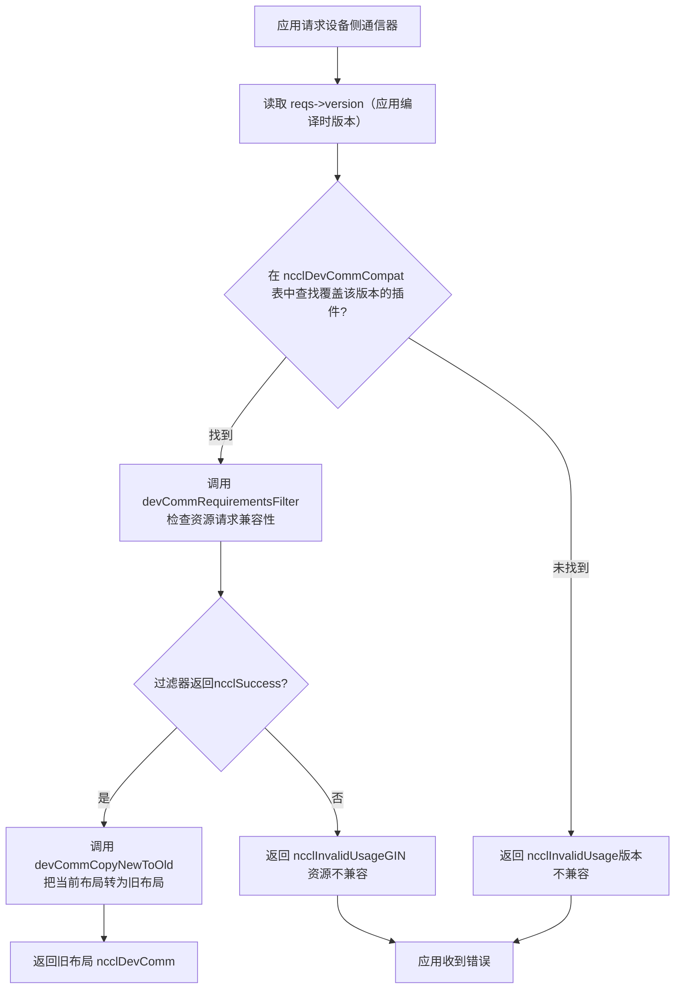
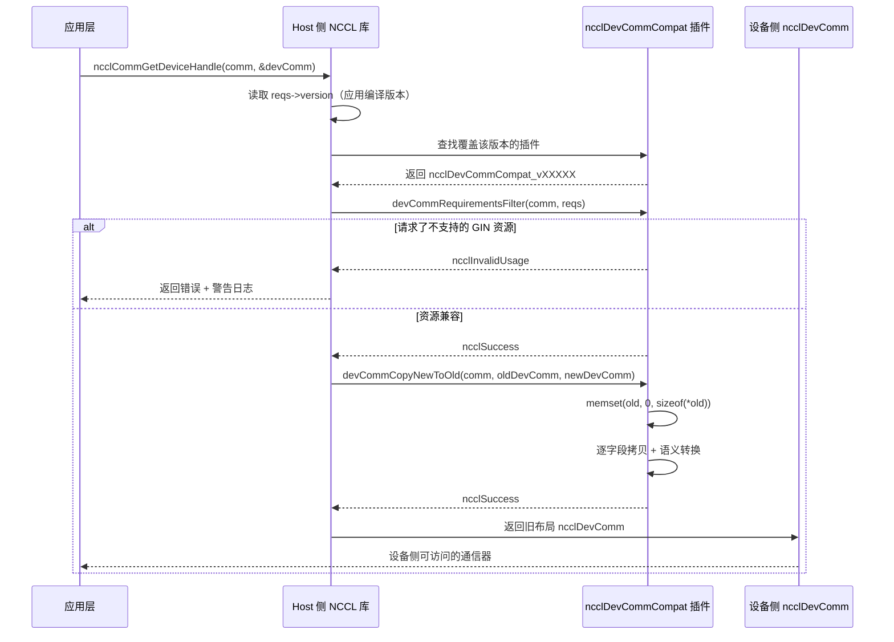

# Capítulo 19: Domínio de comunicação do lado do dispositivo e compatibilidade de ABI: o contrato de comunicação entre devcomm e kernel

No capítulo anterior vimos que o ncclMemManager do lado do host gerencia o ciclo de vida dos buffers de comunicação com contagem de referência e a API CUDA VMM. Mas o local onde a comunicação realmente ocorre é o kernel da GPU — as threads dentro do kernel precisam saber: qual é o meu rank? Em qual endereço virtual está o buffer do rank remoto? A conexão está pronta? Essas informações estão na estrutura ncclComm do lado do host, mas o kernel não pode desreferenciar ponteiros do host diretamente. Se o NCCL fizesse o kernel obter esses metadados toda vez por meio de passagem de parâmetros ou consulta à memória global, então cada comunicação pagaria custos extras de latência e largura de banda. Pior ainda: uma vez que o código do kernel é compilado, os deslocamentos dos campos que ele acessa ficam fixos — se o layout do ncclComm mudar após uma atualização da biblioteca, kernels antigos lerão dados incorretos. Esse é o problema central que o devcomm resolve: mapear os metadados críticos do domínio de comunicação do lado do host, com um layout de memória estável e versionado, em estruturas acessíveis pelo lado do dispositivo. Os arquivos devcomm_v22902.cc, devcomm_v22907.cc, devcomm_v23000.cc e devcomm_v23100.cc no diretório src/devcomm são as implementações concretas dessa ABI versionada. Cada arquivo corresponde a um intervalo de versões do NCCL, define o layout de memória exato do ncclDevComm nesse intervalo e a lógica de cópia de campos entre versões novas e antigas. Este capítulo decomporá, em sequência: como são as estruturas de dados centrais do comunicador do lado do dispositivo, como funcionam o registro e o mecanismo de correspondência da ABI versionada, como é feita a conversão em nível de campo entre versões novas e antigas, e quais são os limites e armadilhas desse mecanismo em ambientes de produção.

# I. Estrutura central do comunicador do lado do dispositivo: o layout de memória do ncclDevComm

## Modelo intuitivo

Imagine`ncclDevComm`como um "cartão de posto de trabalho": a cada inicialização de kernel da GPU, recebe-se um cartão no qual está impresso "você é o rank 3, há 8 ranks no total, seu grupo LSA tem 4 ranks, o endereço base do buffer remoto está em 0x7f...". Esse cartão precisa ser pequeno o suficiente (para caber nos parâmetros do kernel) e, ao mesmo tempo, conter todas as informações críticas. Se esse cartão não existisse, o kernel só poderia depender da passagem repetida de parâmetros pelo lado do host, tendo que remontar tudo a cada comunicação — alta latência e propenso a erros.

## Estrutura de dados e layout de memória

Tomando`ncclDevComm_v23000`como exemplo, sua definição completa está em[FACT:src/devcomm/devcomm_v23000.cc:25-62]：

```c
struct ncclDevComm_v23000 {
  unsigned int magic;          // 偏移 0，魔数校验
  unsigned int version;        // 偏移 4，版本号

  int rank, nRanks;            // 偏移 8, 12
  uint32_t nRanks_rcp32;       // 偏移 16，nRanks 的倒数（定点数）
  int lsaRank, lsaSize;        // 偏移 20, 24
  uint32_t lsaSize_rcp32;      // 偏移 28

  ncclDevCommWindowTable_t windowTable;  // 偏移 32
  ncclWindow_t resourceWindow;           // 偏移 40
  ncclResourceWindow_vidmem_v23000_t resourceWindow_inlined;  // 偏移 48
  ncclGinBarrierHandle_t hybridWorldGinBarrier;  // 偏移 112
  ...
};
```

[FACT:src/devcomm/devcomm_v23000.cc:64-93]Usa uma série de`static_assert`para fixar o deslocamento de cada campo. Isso não é decoração — é um contrato de tempo de compilação para compatibilidade de ABI. Se o deslocamento de algum campo se mover devido a mudanças na estratégia de alinhamento do compilador, a compilação falhará, em vez de produzir em tempo de execução um desalinhamento de memória difícil de depurar.

Motivações de design de alguns campos-chave:

> **[Design Inference & Architectural Trade-offs]**
> **`nRanks_rcp32`e`lsaSize_rcp32`**: isto é`nRanks`e`lsaSize`o recíproco de , representado em ponto fixo de 32 bits. Quando o kernel realiza a operação de divisão para calcular o deslocamento de rank para buffer, a divisão inteira da GPU é muito lenta; usar a multiplicação pelo recíproco seguida de deslocamento pode acelerar significativamente. Este é um caso típico de "trocar espaço por tempo" — armazenar 4 bytes a mais para economizar dezenas de ciclos de clock por divisão.

**`resourceWindow_inlined`**: este é um descritor de janela inline, do tipo`ncclResourceWindow_vidmem_v23000_t`. Observe[FACT:src/devcomm/devcomm_v23000.cc:11-18]sua definição em :

```c
typedef struct ncclResourceWindow_vidmem_v23000 {
  char reserved1[8];
  char* lsaFlatBase;
  char reserved2[8];
  uint32_t stride4G;
  uint32_t mcOffset4K;
  char reserved3[32];  // NOTE: shrunk from 40 in 2.30u1 to reclaim 8 bytes
} ncclResourceWindow_vidmem_v23000_t;
```

Aqui,`reserved1`、`reserved2`、`reserved3`é**campo de preenchimento**, usado como placeholder. Por que o preenchimento é necessário? Porque o layout de`ncclDevComm_v23000`deve manter offsets consistentes com uma "versão de referência"; mesmo que alguns campos não sejam mais usados na versão atual, eles devem ser mantidos como placeholders para garantir que os offsets dos campos subsequentes não mudem.[FACT:src/devcomm/devcomm_v23000.cc:11-18]O comentário de deixa claro: 2.30u1 reduziu`reserved3`de 40 bytes para 32 bytes, liberando 8 bytes para`hybridWorldGinBarrier`. Esta é uma**reorganização de layout**— ao reduzir a área de preenchimento, novos campos são inseridos sem alterar o tamanho total.

[FACT:src/devcomm/devcomm_v23000.cc:11-18]O`static_assert`de confirma ainda mais:`lsaFlatBase`、`stride4G`、`mcOffset4K`os offsets dos três campos devem ser consistentes com o`ncclWindow_vidmem`da "versão atual", e o tamanho total da estrutura é de 64 bytes. Isso significa que`resourceWindow_inlined`é**binariamente compatível**entre v23000 e a versão atual — pode-se fazer memcpy diretamente.

## A família de estruturas versionadas

Comparando`ncclDevComm_v22902` [FACT:src/devcomm/devcomm_v22902.cc:38-62]e`ncclDevComm_v22907` [FACT:src/devcomm/devcomm_v22907.cc:13-41], pode-se ver a evolução dos campos:

| Campo | v22902 | v22907 | v23000 |
| --- | --- | --- | --- |
| `magic`/`version` | Nenhum | Nenhum | Sim (offset 0/4) |
| `ginContextCount` | uint8_t | uint32_t | uint32_t |
| `ginNetDeviceTypes` | `[4]` | `[NCCL_GIN_MAX_CONNECTIONS]` | `[NCCL_GIN_MAX_CONNECTIONS]` |
| `ginIsRailed` | Nenhum | bool | Dividido em`ginConnectionsRailed` + `ginContextsRailed` |
| `hybridWorldGinBarrier` | Nenhum | Nenhum | Sim (offset 112) |
| Tamanho da estrutura | 200 | 224 | 240 |

> **[Design Inference & Architectural Trade-offs]**
> Este caminho de evolução revela a estratégia de versionamento da NCCL:**adicionar campos apenas quando necessário, e aproveitar ao máximo a área de preenchimento**. De v22902 para v22907, foram adicionados campos relacionados ao GIN, como`ginSignalBase`、`ginCounterBase`、`ginContextBase`、`ginIsRailed`; de v22907 para v23000, foram adicionados o campo de verificação`magic`/`version`e`hybridWorldGinBarrier`, ao mesmo tempo que`ginIsRailed`foi dividido em dois flags mais precisos.

---

# II. Registro e correspondência de ABI versionada: a estrutura ncclDevCommCompat

## Modelo intuitivo

Pense na ABI versionada como um conjunto de "plugins de tradução": quando uma aplicação é compilada com NCCL 2.29.2, mas em tempo de execução é vinculada à biblioteca 2.31.0, a biblioteca precisa saber "qual layout de`ncclDevComm`o kernel 2.29.2 espera", e então traduzir o`ncclDevComm`da versão atual para o layout antigo. Cada intervalo de versão corresponde a um plugin de tradução, registrado em uma tabela global.

## Estrutura central: ncclDevCommCompat

Cada`devcomm_vXXXXX.cc`arquivo define, no final, uma estrutura`ncclDevCommCompat`. Tomando v23000 como exemplo[FACT:src/devcomm/devcomm_v23000.cc:192-199]：

```c
struct ncclDevCommCompat ncclDevCommCompat_v23000 = {
  NCCL_VERSION(2, 30, 0),               // minVersion
  NCCL_VERSION(2, 30, 7),               // maxVersion
  nullptr,                              // commPropertiesFilter
  ncclDevCommRequirementsFilter_v23000, // devCommRequirementsFilter
  ncclDevCommCopyNewToOld_v23000,       // devCommCopyNewToOld
  ncclDevCommCopyOldToNew_v23000,       // devCommCopyOldToNew
};
```

Significado dos seis campos:

1. **`minVersion` / `maxVersion`**: o intervalo de versões sob responsabilidade deste plugin. v23000 cobre de 2.30.0 a 2.30.7.

2. **`commPropertiesFilter`**: filtro opcional, usado para ajustar os flags de capacidade expostos a versões antigas em`ncclCommProperties`. v23000 define como`nullptr`, indicando que nenhum filtro é necessário.

3. **`devCommRequirementsFilter`**: verifica se os recursos do lado do dispositivo solicitados pela aplicação são compatíveis com a versão antiga. A implementação de v23000,[FACT:src/devcomm/devcomm_v23000.cc:95-98], apenas copia`ginType`de`comm->sharedRes`para`reqs`。

4. **`devCommCopyNewToOld`**: copia o`ncclDevComm`da versão atual para o layout antigo.

5. **`devCommCopyOldToNew`**: copia o layout antigo de volta para a versão atual.

## Divisão dos intervalos de versão

Intervalos de versão dos quatro arquivos:

| Arquivo | minVersion | maxVersion | Observação |
| --- | --- | --- | --- |
| `devcomm_v22902.cc` | 2.29.2 | 2.29.3 | A implementação versionada mais antiga |
| `devcomm_v22907.cc` | 2.29.5 | 2.29.7 | Adiciona campos GIN, mas não oferece compatibilidade retroativa com GIN |
| `devcomm_v23000.cc` | 2.30.0 | 2.30.7 | Adiciona verificação de magic/version |
| `devcomm_v23100.cc` | 2.31.0 | Versão atual | Todos os filtros são nullptr, indicando compatibilidade total |

[FACT:src/devcomm/devcomm_v23100.cc:10-17]Todos os callbacks do plugin v23100 de`nullptr`são`ncclDevComm`, o que significa que, a partir de 2.31.0, o layout de

> **[Design Inference & Architectural Trade-offs]**
> 〔Inferência de design e trade-offs arquiteturais〕

## Observe que há "lacunas" nos intervalos de versão entre v22902 e v22907 (2.29.4 e 2.29.6 não têm plugins correspondentes). Isso pode ocorrer porque essas versões não foram lançadas, ou porque seus layouts são completamente idênticos aos das versões adjacentes e podem ser reutilizados.

Fluxo de correspondência`ncclCommGetDeviceHandle`Quando a aplicação chama

ou uma API semelhante, a NCCL precisa:`reqs->version`）。

1. Ler o número de versão da NCCL embutido em tempo de compilação da aplicação (via`ncclDevCommCompat`2. Procurar na tabela global de

o plugin que cobre essa versão.`devCommCopyNewToOld`3. Se encontrado, chamar o

do plugin para converter o layout atual para o layout antigo.

4. Se não encontrado, retornar erro ou usar o comportamento padrão.



---

# Copiar

## III. Conversão em nível de campo: como os layouts novo e antigo se convertem mutuamente

Modelo intuitivo`ncclDevComm`A conversão de versão é como "traduzir": o`rank`da nova versão é um artigo em chinês moderno, e o layout da versão antiga é um texto em chinês clássico. O tradutor precisa corresponder campo a campo — alguns campos correspondem diretamente (`rank`para`ginConnectionStride > 1`), alguns campos precisam de "tradução livre" (`ginConnectionsRailed = true`traduzido para

## ), e alguns campos não existem na versão antiga (são simplesmente descartados).

Conversão NewToOld: da versão atual para a versão antiga`ncclDevCommCopyNewToOld_v23000`Tomando[FACT:src/devcomm/devcomm_v23000.cc:114-152]：

```c
static ncclResult_t ncclDevCommCopyNewToOld_v23000(ncclComm_t comm, void* oldDevComm,
                                                   struct ncclDevComm const* newDevComm) {
  struct ncclDevComm_v23000* old = (struct ncclDevComm_v23000*)oldDevComm;

  memset(old, '\0', sizeof(*old));  // 先清零，防止未初始化字段泄露
  old->magic = newDevComm->magic;
  old->version = newDevComm->version;
  old->rank = newDevComm->rank;
  ...
  old->ginConnectionsRailed = (newDevComm->ginConnectionStride > 1);
  old->ginStrongLegacySignals = newDevComm->ginStrongLegacySignals;
  old->ginContextsRailed = (newDevComm->ginContextStride > 1);
  ...
}
```

Copiar

1. **`memset`Passos principais:** [FACT:src/devcomm/devcomm_v23000.cc:118]Zerar

2. **: esta é uma proteção de segurança — a estrutura antiga pode ter campos que não existem na nova versão; zerar evita que memória não inicializada vaze para o lado do dispositivo.**：`rank`、`nRanks`、`lsaRank`Cópia direta de campos

3. **e outros são atribuídos diretamente.**Conversão de janela inline`ncclDevCommCopyResourceWindowNewToOld_v23000` [FACT:src/devcomm/devcomm_v23000.cc:100-105]: chama`lsaFlatBase`、`stride4G`、`mcOffset4K`。

4. **, copiando campo a campo**：`ginConnectionsRailed = (newDevComm->ginConnectionStride > 1)` [FACT:src/devcomm/devcomm_v23000.cc:142]Conversão semântica`ginConnectionStride`. A nova versão usa

5. **(um passo inteiro) para indicar se está railed; a versão antiga usa um valor booleano. Quando o passo é maior que 1, isso indica que a conexão está railed.**：`memcpy`Cópia de arrays`ginNetDeviceTypes`copia os arrays`ginHandles`e[FACT:src/devcomm/devcomm_v23000.cc:135-136]。

## Conversão OldToNew: da versão antiga para a versão atual

A conversão reversa está em[FACT:src/devcomm/devcomm_v23000.cc:154-190]：

```c
static ncclResult_t ncclDevCommCopyOldToNew_v23000(ncclComm_t comm, struct ncclDevComm* newDevComm,
                                                   void const* oldDevComm) {
  struct ncclDevComm_v23000 const* old = (struct ncclDevComm_v23000 const*)oldDevComm;

  newDevComm->magic = old->magic;
  ...
  newDevComm->ginConnectionStride = old->ginConnectionsRailed ? old->lsaSize : 1;
  newDevComm->ginContextStride = old->ginContextsRailed ? old->lsaSize : 1;
  ...
}
```

> **[Design Inference & Architectural Trade-offs]**
> Observe a conversão semântica de[FACT:src/devcomm/devcomm_v23000.cc:180-181]: se na versão antiga`ginConnectionsRailed`for verdadeiro, então na nova versão`ginConnectionStride`é definido como`lsaSize`；caso contrário, define como 1. Aqui usa-se`lsaSize`como passo, porque no modo railed cada rank dentro de um grupo LSA compartilha uma conexão GIN, e o passo é igual ao tamanho do grupo LSA.

## Tratamento especial do v22902

`ncclDevCommCopyOldToNew_v22902` [FACT:src/devcomm/devcomm_v22902.cc:149-167]Há um comentário importante:

```c
// Note: this callback will be used with v22907 as well because, prior to 2.30.0, ncclDevComm was unversioned,
// so v22902 and v22907 variants are indistinguishable.
```

> **[Design Inference & Architectural Trade-offs]**
> Isso significa que antes da 2.30.0,`ncclDevComm`não tem o`magic`/`version`campo, então a biblioteca não consegue distinguir se uma estrutura antiga é v22902 ou v22907. Portanto, o`devCommCopyOldToNew`do v22907 é definido como`nullptr` [FACT:src/devcomm/devcomm_v22907.cc:128], e na prática usa-se a versão do v22902. Como nenhum dos dois suporta compatibilidade retroativa do GIN, as diferenças nos campos relacionados ao GIN não afetam a corretude.

## Versionamento da janela de recursos

`ncclWindow_vidmem_v22902`A definição de`devcomm_v22902.h`está em[FACT:src/devcomm/devcomm_v22902.cc:141](o conteúdo desse arquivo não é fornecido neste capítulo), mas a partir de[FACT:src/devcomm/devcomm_v22902.cc:164]e`ncclDevCommCopyResourceWindow_v22902`pode-se ver que o v22902 usa`devcomm_v22902.h`para conversão de janela. Essa função é declarada em

[FACT:src/devcomm/devcomm_v23000.cc:11-18], e a implementação concreta não é mostrada no código-fonte deste capítulo.`static_assert`O

---

# do

## valida que o layout de janela do v23000 é consistente com a versão atual, então a função de conversão do v23000 pode copiar campo a campo diretamente.

Quatro, filtragem de capacidades e verificação de recursos: evitando que kernels antigos acessem recursos não suportados`ncclDevComm`Modelo intuitivo

## A conversão de versão não é apenas "mover campos" — também é necessário verificar se a versão antiga suporta os recursos solicitados pela aplicação. Por exemplo, um kernel compilado com 2.29.2 solicita recursos GIN, mas no layout de

`ncclCommPropertiesFilter_v22907` [FACT:src/devcomm/devcomm_v22907.cc:69-77]：

```c
static ncclResult_t ncclCommPropertiesFilter_v22907(ncclComm_t comm, struct ncclCommProperties* props) {
  // We don't provide backwards compatibility for GIN with 2.29.7.  If a communicator needs it, we indicate that
  // the Device API is not available.
  props->deviceApiSupport = (props->deviceApiSupport && ncclTeamLsa(comm).nRanks == comm->nRanks);
  props->ginType = NCCL_GIN_TYPE_NONE;
  props->railedGinType = NCCL_GIN_TYPE_NONE;
  return ncclSuccess;
}
```

commPropertiesFilter: filtragem de flags de capacidade

1. **`deviceApiSupport`Copiar**Três operações:

2. **`ginType`Rebaixar**: se o número de ranks do grupo LSA não for igual ao número total de ranks (ou seja, existe comunicação entre nós), desabilita a API de dispositivo. Isso porque o GIN da 2.29.7 não suporta comunicação entre nós.

3. **`railedGinType`Definir como NONE**: informa explicitamente à aplicação que "esta versão não suporta GIN".

`ncclCommPropertiesFilter_v22902` [FACT:src/devcomm/devcomm_v22902.cc:86-96]Definir como NONE

```c
// v22902 ncclCommProperties is _almost_ compatible with newer ones, with the exception of ginType, which in that
// version was based on uint_8, not an int.
((struct ncclCommProperties_v22902*)props)->ginType = NCCL_GIN_TYPE_NONE_v22902;
```

[FACT:src/devcomm/devcomm_v22902.cc:13-17]Similar, mas com um detalhe a mais:

```c
typedef enum : uint8_t {
  NCCL_GIN_TYPE_NONE_v22902 = 0,
  NCCL_GIN_TYPE_PROXY_v22902 = 2,
  NCCL_GIN_TYPE_GDAKI_v22902 = 3,
} ncclGinType_t_v22902;
```

Define o enum de tipo GIN do v22902:`uint8_t`Copiar`ginType`Note que este é do tipo`int`, enquanto na nova versão`props`é`ncclCommProperties_v22902*`. Portanto, o filtro do v22902 precisa converter`uint8_t`forçadamente para`ginType`。[FACT:src/devcomm/devcomm_v22902.cc:35-36], e então escrever no`static_assert`do tipo`ginType`O

## de

`ncclDevCommRequirementsFilter_v22907` [FACT:src/devcomm/devcomm_v22907.cc:79-98]valida que

```c
static ncclResult_t ncclDevCommRequirementsFilter_v22907(ncclComm_t comm, ncclDevCommRequirements_t* reqs) {
  bool requestedGinResources =
    reqs->ginSignalCount > 0 || reqs->ginCounterCount > 0 || reqs->barrierCount > 0 || reqs->railGinBarrierCount > 0;
  struct ncclDevResourceRequirements* node = reqs->resourceRequirementsList;
  while (!requestedGinResources && node != nullptr) {
    requestedGinResources = node->ginSignalCount > 0 || node->ginCounterCount > 0;
    node = node->next;
  }
  if (requestedGinResources && (reqs->ginConnectionType != NCCL_GIN_CONNECTION_NONE || reqs->ginForceEnable)) {
    // 打印警告并返回错误
    return ncclInvalidUsage;
  }
  return ncclSuccess;
}
```

devCommRequirementsFilter: verificação de solicitação de recursos

1. **Verifica se a aplicação solicitou recursos GIN:**：`reqs->ginSignalCount`、`ginCounterCount`、`barrierCount`、`railGinBarrierCount`Copiar

2. **A lógica tem duas etapas:**Verificar a solicitação de nível superior`resourceRequirementsList`Se qualquer um for maior que 0, indica que recursos GIN foram solicitados.`ginSignalCount`Percorrer a lista encadeada de requisitos de recursos`ginCounterCount`。

: se não houver solicitação no nível superior, continua percorrendo a lista encadeada`ginConnectionType`, verificando`NONE`e`ginForceEnable`de cada nó`ncclInvalidUsage`Se de fato recursos GIN foram solicitados, e

`ncclDevCommRequirementsFilter_v22902` [FACT:src/devcomm/devcomm_v22902.cc:98-126]não é`barrierCount`ou

```c
// Prior to 2.29.4, a non-zero barrierCount did not imply GIN, but it does since.
if (reqs->barrierCount) {
  reqs->lsaBarrierCount = std::max(reqs->lsaBarrierCount, reqs->barrierCount);
  reqs->barrierCount = 0;
}
// Strangely, neither did railGinBarrierCount.
reqs->railGinBarrierCount = 0;
```

> **[Design Inference & Architectural Trade-offs]**
> É mais complexo; além da verificação de GIN, também trata a mudança semântica de`barrierCount`:`barrierCount`Copiar`barrierCount`〔Inferência de design e trade-offs de arquitetura〕`lsaBarrierCount`Antes da 2.29.4,`barrierCount`indicava apenas LSA barrier, sem implicar requisito de GIN. A partir da 2.29.4,`railGinBarrierCount`。

implica requisito de GIN. Para compatibilidade com versões antigas, o filtro converte



---

# , e zera

## e

**O diagrama de sequência abaixo mostra a interação completa desde a solicitação da aplicação até a conversão de versão:**Copiar`ncclGinPut`）。

**Cinco, guia de prevenção de armadilhas em produção e cadeia de recuperação de falhas**：`ncclDevCommRequirementsFilter_v22902` [FACT:src/devcomm/devcomm_v22902.cc:98-126]Armadilha um: conflito entre solicitação de recursos GIN e kernel de versão antiga`ginForceEnable`Cenário`ginSignalCount > 0`: a aplicação é compilada com NCCL 2.29.2, mas em tempo de execução faz link com a biblioteca 2.31.0. A aplicação chama APIs do lado do dispositivo relacionadas a GIN no kernel (como`ncclInvalidUsage`O que acontece

```
The application was compiled with too old version of NCCL. It was compiled with NCCL version 2.29.2, but is
running with NCCL library version 2.31.0. Because of its use of GIN device kernels, it needs to be recompiled,
preferably with the same NCCL version that it will be running with.
```

**ou**, retorna`ncclDevComm_v22902`, e imprime um aviso:`ginContextCount`、`ginNetDeviceTypes`、`ginHandles`Copiar

**Causa raiz**: no layout de

## da 2.29.2, os campos GIN (

**etc.) são incompatíveis com o layout da 2.31.0. Se a conversão for forçada, o kernel lerá offsets errados, causando comportamento indefinido.**Prática correta`ncclTeamLsa(comm).nRanks != comm->nRanks`）。

**: a aplicação deve ser recompilada com a mesma versão (ou uma versão compatível) do NCCL da biblioteca em tempo de execução. Se não for possível recompilar, deve-se evitar usar APIs GIN no kernel.**：`ncclCommPropertiesFilter_v22907` [FACT:src/devcomm/devcomm_v22907.cc:69-77]Armadilha dois: API de dispositivo silenciosamente desabilitada durante comunicação entre nós`props->deviceApiSupport`Cenário`false`: a aplicação é compilada com 2.29.7, e o domínio de comunicação contém ranks entre nós (

**O que acontece**Define

**como**. Se a aplicação verificar essa flag, saberá que a API de dispositivo não está disponível; mas se não verificar e chamar diretamente a API do lado do dispositivo, obterá comportamento indefinido.`ncclCommProperties.deviceApiSupport`Causa raiz`false`: o GIN da 2.29.7 não suporta comunicação entre nós. Apenas ranks dentro de um grupo LSA (Local SHARP Aggregation) podem usar a API do lado do dispositivo.

## Prática correta

**: a aplicação deve verificar**：`ncclDevCommCopyNewToOld_v23000` [FACT:src/devcomm/devcomm_v23000.cc:118]após a inicialização; se for`memset(old, '\0', sizeof(*old))`。

**, fazer fallback para a API do lado do host.**Armadilha três: memset para zerar e vazamento de campos não inicializados`ginSignalBase`、`ginCounterBase`Cenário

**Executa**：Se o desenvolvedor implementar manualmente a conversão de versão e esquecer de zerar, o kernel pode ler valores aleatórios, manifestando-se como erros intermitentes — difíceis de reproduzir e depurar.

**Prática correta**：Sempre zerar toda a estrutura de destino antes da conversão. Todas as implementações de`CopyNewToOld`do NCCL seguem este padrão[FACT:src/devcomm/devcomm_v22902.cc:132] [FACT:src/devcomm/devcomm_v22907.cc:104] [FACT:src/devcomm/devcomm_v23000.cc:118]。

## Armadilha quatro: falha de correspondência causada por lacunas no intervalo de versões

**Cenário**：A aplicação é compilada com NCCL 2.29.4. Consultando a tabela de intervalos de versão:

| Arquivo | minVersion | maxVersion |
| --- | --- | --- |
| v22902 | 2.29.2 | 2.29.3 |
| v22907 | 2.29.5 | 2.29.7 |

2.29.4 não tem plugin correspondente.

> **[Design Inference & Architectural Trade-offs]**
> **O que acontece**： Se a lógica de correspondência buscar estritamente por intervalo, 2.29.4 falhará na correspondência, retornando erro. Mas na implementação real, pode haver uma estratégia de "correspondência mais próxima" — 2.29.4 pode ser roteado para o plugin v22902 ou v22907.

**Prática correta**：A aplicação deve usar, sempre que possível, o mesmo número de versão principal da biblioteca em tempo de execução. Se for necessário cruzar versões, deve-se testar se o intervalo de versão alvo tem um plugin compatível correspondente.

## Cadeia de recuperação de falhas

Quando a conversão de versão falha, a cadeia de recuperação de erros do NCCL:

1. **O filtro retorna erro**：`devCommRequirementsFilter`retorna`ncclInvalidUsage`。

2. **A API de nível superior captura o erro**：`ncclCommGetDeviceHandle`verifica o valor de retorno, se não for`ncclSuccess`, não preenche a estrutura`devComm`.

3. **Tratamento pela aplicação**：A aplicação deve verificar o valor de retorno; se falhar, recorrer à API do lado host ou encerrar a comunicação.

4. **Registro de logs**：O NCCL imprime logs de nível`WARN`, incluindo versão de compilação e versão de tempo de execução, ajudando a localizar o problema.

> **[Design Inference & Architectural Trade-offs]**
> Atualmente o NCCL não fornece um mecanismo de "degradação automática" — se a conversão de versão falhar, não recorrerá automaticamente à API do lado host. A aplicação precisa implementar sua própria lógica de fallback.

---

# Reflexão de design

**Por que usar estruturas versionadas em vez de uma "ABI estável"?**

> **[Design Inference & Architectural Trade-offs]**
> Uma alternativa é projetar um layout`ncclDevComm`que "nunca muda", com todos os novos campos acessados via ponteiros indiretos. Mas isso traz dois problemas: primeiro, o acesso indireto aumenta a latência (o kernel precisa de desreferência adicional); segundo, não é possível aproveitar a área de preenchimento para otimizar o layout. O NCCL escolhe estruturas versionadas como um trade-off entre "desempenho" e "compatibilidade" — o kernel dentro de cada intervalo de versão obtém o layout ótimo, e a compatibilidade entre versões é garantida pela camada de conversão.

**Por que o`devCommCopyOldToNew`de v22907 é definido como nullptr?**

[FACT:src/devcomm/devcomm_v22902.cc:153-155]O comentário de`ncclDevComm`explica o motivo: antes de 2.30.0,

**não tinha campo de versão, então os layouts antigos de v22902 e v22907 não podem ser distinguidos. Como nenhum dos dois suporta compatibilidade retroativa do GIN, a diferença no campo GIN não afeta a correção, então a função de conversão de v22902 é reutilizada.`nRanks_rcp32`Por que**

> **[Design Inference & Architectural Trade-offs]**
> 〔Inferência de design e trade-offs de arquitetura〕`1/nRanks`A precisão da divisão de ponto flutuante da GPU pode não ser suficiente para representar precisamente`nRanks`, especialmente quando

---

# não é uma potência de 2. O ponto fixo (decimal representado por inteiro de 32 bits) pode fornecer precisão suficiente, e a multiplicação inteira é mais rápida que a de ponto flutuante.

Resumo do capítulo`src/devcomm`Este capítulo desmontou a implementação da ABI versionada no diretório

1. **`ncclDevComm`:**O layout de memória de`static_assert`：Cada versão tem deslocamentos de campo precisos, verificados em tempo de compilação com`rank`、`nRanks`、`nRanks_rcp32`、`lsaRank`、`lsaSize`、`windowTable`、`resourceWindow`. Campos-chave incluem

2. **etc.**Registro da ABI versionada`ncclDevCommCompat`：Cada intervalo de versão corresponde a uma estrutura`minVersion`、`maxVersion`, contendo

3. **, função de filtro e função de conversão.**：`CopyNewToOld`Conversão em nível de campo`CopyOldToNew`e`ginConnectionStride > 1`copiam campo a campo, e tratam mudanças semânticas (como`ginConnectionsRailed = true`）。

4. **convertido para**：`commPropertiesFilter`Filtragem de capacidade`devCommRequirementsFilter`ajusta os flags de capacidade expostos a versões antigas,

5. **verifica se a solicitação de recurso é compatível com versões antigas.**Armadilhas de produção

：Conflito entre solicitações de recurso GIN e kernels de versões antigas, API de dispositivo desabilitada durante comunicação entre nós, necessidade de zerar com memset, falha de correspondência causada por lacunas no intervalo de versões.`nccl_device`No próximo capítulo entraremos na API do lado do dispositivo e fusão de kernels, vendo como o cabeçalho

# organiza as funções do lado do dispositivo, e como a fusão de kernels combina múltiplas operações de comunicação coletiva em um único kernel para execução.

Reflexões e autoavaliação do capítulo`ncclDevCommCopyNewToOld_v23000`Q1: Se removermos`memset(old, '\0', sizeof(*old))`de

**, em que cenário o kernel leria dados incorretos? Analise com base nas diferenças de campos entre v22902 e v23000.**：

`ncclDevComm_v22902`Análise de referência[FACT:src/devcomm/devcomm_v22902.cc:84]O tamanho da estrutura de`ncclDevComm_v23000`é 200 bytes[FACT:src/devcomm/devcomm_v23000.cc:95-98], enquanto`ginSignalBase`é 240 bytes`ginCounterBase`. Em v22902 há`ginContextBase`（deslocamento 176）、

（deslocamento 184）、`memset`（deslocamento 204）etc., campos que não existem ou têm semântica diferente em v23000.`old`Se removermos`ginSignalBase`、`ginCounterBase`, ao converter de v23000 para v22902,

- os campos da estrutura
- que não existem em v23000 (como
- ) manterão valores de lixo da pilha. Se o kernel ler esses campos (por exemplo, o caminho de código GIN do kernel antigo), obterá valores aleatórios, causando:

`memset`Endereço base do sinal incorreto, operações GIN escrevem em local de memória errado.`CopyNewToOld`Endereço base do contador incorreto, causando overflow ou underflow do contador.[FACT:src/devcomm/devcomm_v22902.cc:132] [FACT:src/devcomm/devcomm_v22907.cc:104] [FACT:src/devcomm/devcomm_v23000.cc:118]。

Em casos extremos, pode disparar acesso ilegal à memória, causando crash do kernel.`ncclDevCommCompat`plugin. Analise como o NCCL pode lidar com essa situação e como a aplicação deve contorná-la.

**Análise de referência**：

Tabela de intervalos de versão:

- v22902：2.29.2 - 2.29.3
- v22907：2.29.5 - 2.29.7
- v23000：2.30.0 - 2.30.7
- v23100: 2.31.0 - atual

2.29.4 cai na lacuna entre v22902 e v22907. Possíveis formas de tratamento:

1. **Correspondência mais próxima**: O NCCL pode escolher o maior intervalo menor ou igual à versão solicitada, ou seja, v22902. Mas o`maxVersion`de v22902 é 2.29.3, o que, estritamente falando, não cobre 2.29.4.

2. **Retornar erro**: Se a lógica de correspondência for estritamente por intervalo, 2.29.4 falhará na correspondência, retornando`ncclInvalidUsage`。

3. **Correspondência para cima**: Escolher o menor intervalo maior ou igual à versão solicitada, ou seja, v22907. Mas o`minVersion`de v22907 é 2.29.5, que também não cobre 2.29.4.

> **[Design Inference & Architectural Trade-offs]**
> Na implementação real, o NCCL pode ter uma estratégia de "tolerância a falhas" — se não encontrar uma correspondência exata, tentar usar o plugin de um intervalo adjacente. Mas isso não é uma garantia confiável.

Métodos de contorno para a aplicação:

- Usar o mesmo número de versão principal da biblioteca de runtime (por exemplo, 2.31.x).
- Se for necessário cruzar versões, testar se o intervalo da versão de destino tem um plugin compatível correspondente.
- Após a inicialização, verificar`ncclCommProperties.deviceApiSupport`, se for`false`, recorrer à API do lado host.

Q3: `ncclDevCommRequirementsFilter_v22902`Há um trecho de lógica em`if (reqs->barrierCount) { reqs->lsaBarrierCount = std::max(reqs->lsaBarrierCount, reqs->barrierCount); reqs->barrierCount = 0; }`. Explique por que essa conversão é necessária e o que aconteceria se não fosse convertida.

**Análise de referência**：

[FACT:src/devcomm/devcomm_v22902.cc:117-121]O comentário de explica: "Prior to 2.29.4, a non-zero barrierCount did not imply GIN, but it does since."

Antes de 2.29.4,`barrierCount`indicava apenas o número de LSA barriers, não implicando requisito de GIN. A partir de 2.29.4,`barrierCount`implica requisito de GIN (ou seja, solicitar barrier significa que recursos de GIN são necessários).

Quando a aplicação é compilada com 2.29.2, ela pode ter definido`barrierCount > 0`para indicar requisito de LSA barrier, mas não sabia que isso implicaria requisito de GIN. Se a biblioteca NCCL (2.31.0) processar diretamente segundo a nova semântica, considerará que a aplicação solicitou recursos de GIN, e então`ncclDevCommRequirementsFilter_v22902`detectará a solicitação de GIN e retornará`ncclInvalidUsage`— isso é um falso positivo.

A lógica de conversão converte`barrierCount`em`lsaBarrierCount`(tomando o máximo dos dois), e zera`barrierCount`. Assim:

- `lsaBarrierCount`preserva o requisito de barrier da aplicação.
- `barrierCount = 0`evita o falso positivo de requisito de GIN.
- `railGinBarrierCount = 0`Da mesma forma, porque em versões antigas ele também não implicava requisito de GIN.

Se não houver conversão, quando a aplicação for compilada com 2.29.2 e tiver definido`barrierCount > 0`, será erroneamente rejeitada, não podendo usar a API de dispositivo.

Até aqui, vimos claramente como o devcomm mapeia com segurança os metadados críticos do domínio de comunicação do lado host para o lado do dispositivo por meio de ABI versionada, permitindo que o kernel obtenha rank, endereço e estado de conexão sem ponteiros do host. Esse mecanismo resolve o problema básico de acesso do kernel ao domínio de comunicação, mas a capacidade do lado do dispositivo vai muito além disso. Quando o usuário deseja chamar primitivas de comunicação diretamente em seu próprio kernel, ou até fundir comunicação e computação no mesmo kernel, são necessárias APIs de dispositivo de nível superior e técnicas de fusão de kernel. O próximo capítulo aprofundará o diretório nccl_device e exemplos relacionados, explorando como APIs de dispositivo como ncclBarrier, ncclLsaBarrier, ncclGinBarrier permitem que kernels do usuário participem da comunicação, e como a fusão de kernel pode reduzir a sobrecarga de inicialização, levando o NCCL de biblioteca a modelo de programação.
