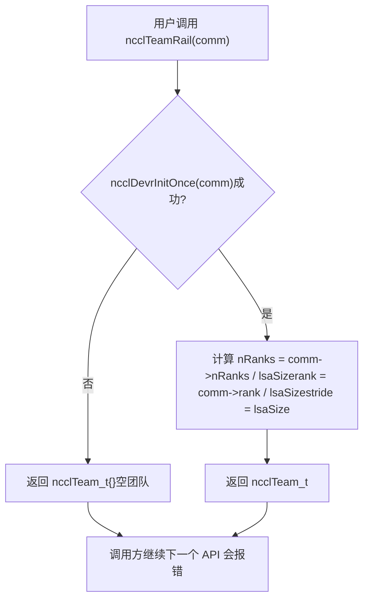
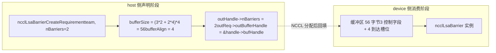
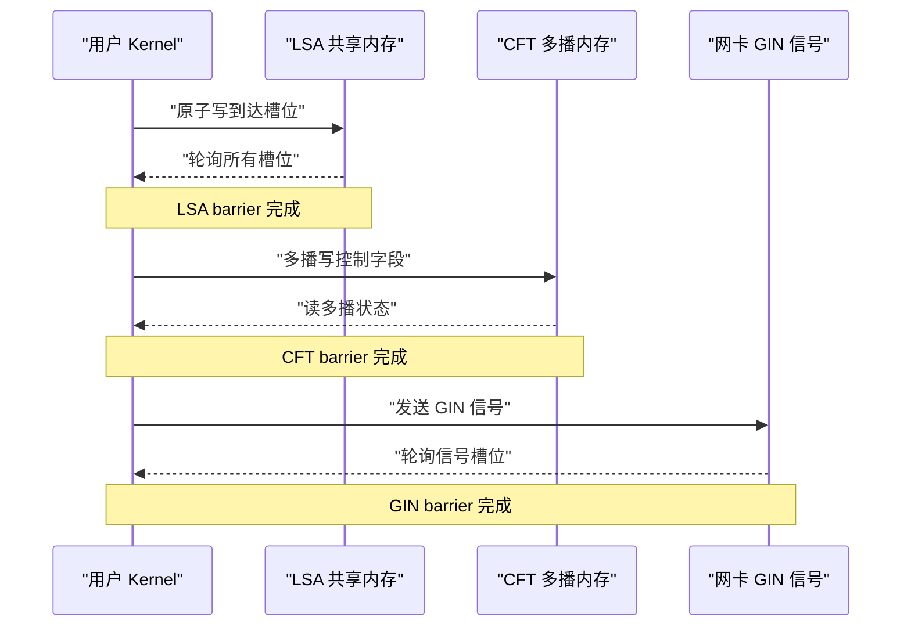
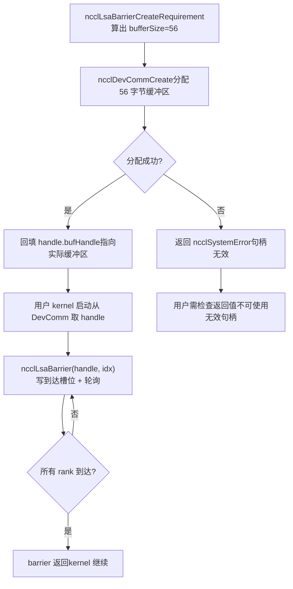
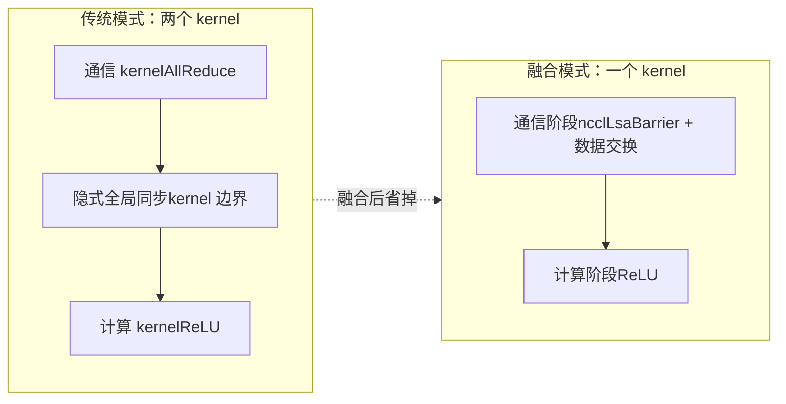

# Capítulo 20: APIs nativas do lado do dispositivo e fusão de operadores: práticas de nccl_device e kernel fusion

No capítulo anterior, vimos como o devcomm mapeia os metadados do ncclComm do lado host para o lado dispositivo de forma versionada, permitindo que o kernel leia rank, endereços e estado de conexão. Mas "conseguir ler metadados" e "conseguir iniciar comunicação" são duas coisas diferentes. Se houver apenas metadados, o kernel do usuário pode, no máximo, calcular endereços por conta própria e escrever flags por conta própria; assim que envolver sincronização entre ranks ou transmissão de sinais entre máquinas, ainda será necessário voltar ao lado host para chamar APIs coletivas como ncclAllReduce — e cada chamada dessas significa uma inicialização de kernel e uma ida e volta host-device. O diretório src/nccl_device que este capítulo vai destrinchar é justamente a chave para a NCCL passar de "uma biblioteca chamada" para "um modelo programável". O que ele oferece não é um novo algoritmo de comunicação coletiva, mas um conjunto de primitivas do lado dispositivo: permitir que o próprio kernel do usuário chame internamente operações de sincronização como ncclBarrier, ncclLsaBarrier, ncclGinBarrier, colocando "comunicação" e "computação" no mesmo kernel e eliminando a sobrecarga intermediária de inicialização. O material de código-fonte deste capítulo concentra-se na declaração de requisitos no lado host (CreateRequirement) e na abstração de equipe (Team) desse conjunto de primitivas, que é justamente a entrada da API do lado dispositivo. Um pré-requisito fundamental para entender este capítulo: a filosofia de design da API do lado dispositivo é "o lado host declara os requisitos de recursos, o lado dispositivo consome os recursos". O lado host não cria a barreira diretamente, mas informa à NCCL "preciso de nBarriers barreiras, a equipe tem team.nRanks membros"; com base nisso, a NCCL calcula quantos buffers e quantos sinais GIN são necessários e então instancia esses recursos no lado dispositivo. Essa separação "declaração-consumo" é a razão fundamental pela qual o código do lado dispositivo consegue funcionar sem ponteiros do host.

# I. Abstração de Team: o sistema de coordenadas da API do lado dispositivo

## Modelo intuitivo

Imagine a estrutura organizacional de uma empresa multinacional. Para enviar um e-mail, primeiro você precisa saber "para quem enviar" — para a empresa inteira (World), para colegas do mesmo escritório (LSA) ou para uma equipe entre escritórios da mesma linha de negócios (Rail).`ncclTeam_t`é justamente o descritor desse "escopo de destinatários". Sem a abstração de Team, cada API do lado dispositivo teria que recalcular por conta própria "qual é a minha posição nesse domínio de comunicação e quantos somos no total", o que tornaria o código repetitivo e extremamente propenso a erros.

## Estrutura de dados e layout de memória

`ncclTeam_t`é o sistema de coordenadas da API do lado dispositivo; seus três campos definem uma**progressão aritmética**：

| campo | significado | analogia |
| --- | --- | --- |
| `nRanks` | número total de membros na equipe | quantas pessoas há no grupo |
| `rank` | número do rank atual dentro da equipe | meu número no grupo |
| `stride` | passo dos membros adjacentes da equipe no world | qual é a diferença de matrícula entre duas pessoas adjacentes no grupo |

`stride`é o campo mais facilmente ignorado, mas o mais crítico. Na equipe World,`stride = 1`, porque todos os ranks estão dispostos de forma contígua; mas na equipe Rail,`stride = lsaSize`, porque os ranks no mesmo rail aparecem no world a cada`lsaSize`posições.

[FACT:src/nccl_device/core.cc:13-19]mostra a construção da equipe World: basta pegar`comm->nRanks`e`comm->rank`，`stride`fixado em 1. Esta é a única equipe que não precisa de`ncclDevrInitOnce`, porque todas as suas informações estão no lado host em`comm`.

[FACT:src/nccl_device/core.cc:22-33]é a equipe LSA. Observe o`ncclDevrInitOnce(comm)`em L26 — esta é a entrada idempotente para a inicialização de recursos do lado dispositivo. Os comentários em L23-25 são muito importantes:**aqui o erro é deliberadamente ignorado**, porque, se a inicialização falhar, a team retornada é um "valor lixo", mas a próxima chamada de API que realmente precisar de recursos acionará novamente`ncclDevrInitOnce`e reportará o erro. Esta é uma estratégia de "erro adiado", evitando lançar erros pesados em operações leves como consulta de equipe.

## Walkthrough orientado por cenário: transformação de coordenadas de World para Rail

Suponha uma máquina com 8 GPUs,`lsaSize = 4`(um domínio LSA a cada 4 GPUs),`nRanks = 8`. Vejamos como`ncclTeamRail`é construída:

[FACT:src/nccl_device/core.cc:70-79]em,`nRanks = 8 / 4 = 2`，`rank = comm->rank / 4`，`stride = 4`. Se o rank atual for 5, então seu`rank = 5 / 4 = 1`，`stride = 4`na equipe Rail é, o que significa que os membros da equipe Rail são os ranks 1 e 5 no world.

Vejamos agora`ncclTeamRankToWorld`a fórmula de conversão:

[FACT:src/nccl_device/core.cc:82-84]de`comm->rank + (rank - team.rank) * team.stride`é um**deslocamento relativo**cálculo: primeiro calcule o deslocamento do rank alvo em relação ao rank atual dentro da equipe`(rank - team.rank)`, depois multiplique pelo passo`stride`, e some ao número world do rank atual. Esta fórmula é universal para todas as equipes, porque`stride`já codifica o padrão de disposição da equipe.

`ncclTeamRankToLsa`é diferente:

[FACT:src/nccl_device/core.cc:87-92]usa`comm->devrState.lsaSelf + (rank - team.rank) * team.stride`. Observe que aqui se usa`lsaSelf`em vez de`comm->rank`— porque o número LSA só é conhecido após a inicialização dos recursos do lado dispositivo e pode ser diferente do world rank.

Esta figura revela o caminho de execução da estratégia de "erro adiado": quando a inicialização falha, retorna-se uma equipe vazia, mas não se interrompe o chamador; o erro será exposto na próxima API que realmente precisar de recursos (como`ncclLsaBarrierCreateRequirement`).

## Reflexões de design e armadilhas

**Por que`ncclTeamWorld`não chama`ncclDevrInitOnce`？**Porque as informações da equipe World vêm completamente do lado host`comm`, não requer nenhum recurso do lado do dispositivo. Se for chamado à força, fará com que uma operação de consulta puramente no host dependa da inicialização do lado do dispositivo, aumentando pontos de falha desnecessários.

**Pontos problemáticos**：`ncclTeamRankToLsa`Retorna em caso de falha de inicialização`-1`（[FACT:src/nccl_device/core.cc:87-92]), enquanto`ncclTeamRankToWorld`nunca falha. Se o chamador misturar essas duas funções e não verificar o valor de retorno, pode obter`-1`ao falhar a inicialização do LSA e usá-lo como um rank válido, causando acesso fora dos limites. Em código de produção,`ncclTeamRankToLsa`o valor de retorno deve ser tratado como uma operação que pode falhar.

---

# II. Declaração de requisitos de Barrier: como o lado host "reserva" recursos do dispositivo

## Modelo intuitivo

A alocação de recursos da API do lado do dispositivo é como**reservar uma sala de reunião**: você não pode simplesmente invadir a sala de reunião para começar a reunião, precisa primeiro enviar uma solicitação à recepção (lado host`CreateRequirement`) — "quero realizar 3 reuniões, cada uma com 8 participantes". A recepção calcula com base nisso o tamanho do espaço necessário (`bufferSize`), quantas cadeiras são necessárias (`ginSignalCount`), e então fornece o número da sala (`outBufferHandle`). Sem esse mecanismo de reserva, o kernel do lado do dispositivo não saberia onde está seu buffer de barrier nem qual seu tamanho, não podendo ler e escrever com segurança.

## Estrutura de dados e layout de memória

Os três barriers`CreateRequirement`funções compartilham o mesmo padrão:**zerar a estrutura de requisitos → preencher tamanho/alinhamento do buffer → preencher ponteiro do handle de saída**. Mas seus tipos de recursos são diferentes:

| Tipo de Barrier | Tipo de recurso | Fórmula de tamanho | Alinhamento |
| --- | --- | --- | --- |
| LSA Barrier | Buffer | `(3*n + n*team.nRanks) * sizeof(uint32_t)` | `alignof(uint32_t)` |
| CFT Barrier | Buffer | `(3*n + n*team.nRanks) * NCCL_CFT_BARRIER_GRAN` | `NCCL_CFT_BARRIER_ALIGN` |
| GIN Barrier | Sinal GIN | `n * team.nRanks`sinais | Não envolve buffer |

Vejamos primeiro a fórmula de tamanho do LSA Barrier:

[FACT:src/nccl_device/lsa_barrier.cc:14-22]O`(3 * nBarriers + nBarriers * team.nRanks) * sizeof(uint32_t)`pode ser decomposto em duas partes:

- `3 * nBarriers`: cada barrier precisa de 3`uint32_t`campos de controle ([INFERENCE] geralmente são "contagem de chegada", "rodada", "flag de status").
- `nBarriers * team.nRanks`: cada barrier precisa reservar para cada membro da equipe um`uint32_t`slot de chegada.

Portanto, o tamanho total de um único barrier é`3 + team.nRanks`de`uint32_t`. Essa fórmula é completamente idêntica em LSA e CFT, apenas CFT usa`NCCL_CFT_BARRIER_GRAN`como unidade de granularidade (possivelmente para alinhar a limites maiores).

O GIN Barrier é completamente diferente:

[FACT:src/nccl_device/gin_barrier.cc:14-20]não aloca buffer, mas define`ginSignalCount = nBarriers * team.nRanks`, e aponta`outGinSignalStart`para o`signal0`dentro do handle. Isso porque o GIN barrier usa o caminho de sinal de rede, não precisando de buffer de memória compartilhada, mas sim de slots de sinal reconhecíveis pela placa de rede.

## Walkthrough orientado por cenário: uma reserva completa de LSA Barrier

Suponha que o usuário queira criar 2 barriers em uma equipe LSA de 4 GPUs:

1. **Chamar** `ncclLsaBarrierCreateRequirement(team, 2, &handle, &req)`。

2. **zerar**：`memset(outReq, 0, sizeof(*outReq))`（[FACT:src/nccl_device/lsa_barrier.cc:14-22]) — garante que campos não definidos tenham valores determinísticos, evitando que o chamador leia lixo da pilha.

3. **Registrar a quantidade de barriers**：`outHandle->nBarriers = 2`（[FACT:src/nccl_device/lsa_barrier.cc:14-22]）。

4. **Calcular o tamanho do buffer**：`(3*2 + 2*4) * 4 = (6 + 8) * 4 = 56`bytes ([FACT:src/nccl_device/lsa_barrier.cc:14-22]）。

5. **Definir alinhamento**：`alignof(uint32_t) = 4`（[FACT:src/nccl_device/lsa_barrier.cc:14-22]）。

6. **Preencher o ponteiro do handle**：`outReq->outBufferHandle = &outHandle->bufHandle`（[FACT:src/nccl_device/lsa_barrier.cc:14-22]) — permite que o NCCL, após realmente alocar o buffer, escreva o endereço de volta no handle.

Este diagrama de fluxo de dados mostra a separação entre "declaração" e "consumo": o lado host apenas calcula tamanho e ponteiro, a alocação real do buffer e a instanciação ocorrem dentro do NCCL, e o kernel do lado do dispositivo recebe o handle já preenchido.

## Reflexões de design e pontos problemáticos

**Por que usar`memset`para zerar todo o`outReq`？**Porque`ncclDevResourceRequirements_t`é uma estrutura com múltiplos campos, e diferentes tipos de barrier preenchem apenas parte deles. O zeramento garante que campos não utilizados (como`ginSignalCount`não usado pelo LSA barrier) sejam 0, e o NCCL internamente usa isso para determinar "este recurso não é necessário". Se não fosse zerado, valores aleatórios na pilha poderiam ser erroneamente interpretados como "precisa de recurso GIN", disparando o problema de falso positivo mencionado no capítulo anterior.

**Pontos problemáticos**：`outReq->outBufferHandle = &outHandle->bufHandle`entregou o endereço de campos internos do handle ao NCCL. Isso significa que`outHandle`deve permanecer válido até que o NCCL conclua a alocação do buffer (não pode ser recolhido da pilha ou movido). Se o usuário colocar`outHandle`em um escopo que será liberado prematuramente, o NCCL escreverá em um ponteiro selvagem ao preencher de volta.

> **[Design Inference & Architectural Trade-offs]**
> **Diferença de granularidade do CFT Barrier**：[FACT:src/nccl_device/cft_barrier.cc:13-21]usa`NCCL_CFT_BARRIER_GRAN`e`NCCL_CFT_BARRIER_ALIGN`em vez de`sizeof(uint32_t)`e`alignof(uint32_t)`do LSA. Isso indica que o barrier do CFT (possivelmente Cross-Fabric Team ou equipe cross-domain similar) precisa de granularidade de alinhamento maior, possivelmente porque precisa atravessar regiões de memória multicast, e o hardware tem requisitos mais rigorosos de alinhamento de endereço.

---

# III. Divisão semântica dos três Barriers: o que LSA, CFT e GIN gerenciam cada um

## Modelo intuitivo

Os três barriers são como três "apitos de reunião" de escopos diferentes:

- **LSA Barrier**: reunião de colegas no mesmo escritório, via memória compartilhada, o mais rápido.
- **CFT Barrier**: reunião entre escritórios mas no mesmo prédio, via memória multicast, velocidade média.
- **GIN Barrier**: reunião entre cidades ou até países, via sinal de rede, o mais lento mas com maior cobertura.

Escolher o tipo errado de barrier não causa erro, mas traz enorme perda de desempenho — usar GIN barrier para sincronização no mesmo escritório é como enviar um documento para a mesa ao lado por correio internacional.

## Comparação de estrutura de dados e layout de memória

Do ponto de vista da declaração de requisitos do lado host, as necessidades de recursos dos três são completamente distintas:

| Dimensão | LSA Barrier | CFT Barrier | GIN Barrier |
| --- | --- | --- | --- |
| Precisa de`comm`parâmetro | Não | Não | Sim |
| Buffer | Sim | Sim | Não |
| Sinal GIN | Não | Não | Sim |
| Unidade de tamanho | `uint32_t` | `NCCL_CFT_BARRIER_GRAN` | Quantidade de sinais |
| Campo do handle de saída | `bufHandle` | `bufHandle` | `signal0` |

Note que o GIN Barrier é o único que precisa do`comm`parâmetro:

[FACT:src/nccl_device/gin_barrier.cc:14-20]A assinatura da função inclui`ncclComm_t comm`, enquanto as assinaturas de LSA e CFT têm apenas`ncclTeam_t team`. Isso ocorre porque os sinais GIN precisam ser vinculados a conexões de rede específicas, e as informações da conexão de rede estão em`comm`.

## Walkthrough orientado por cenário: alocação de sinais do GIN Barrier

[FACT:src/nccl_device/gin_barrier.cc:14-20]é mais simples que o LSA, mas a semântica é mais sutil:

1. **Zerar**：`memset(outReq, 0, sizeof(*outReq))`（L16）。

2. **Definir o número de sinais**：`outReq->ginSignalCount = nBarriers * team.nRanks`(L17) — cada barrier precisa alocar um slot de sinal para cada membro da equipe.

3. **Preencher o ponteiro inicial do sinal**：`outReq->outGinSignalStart = &outHandle->signal0`(L18) — observe que aqui não é definido`bufferSize`, porque o GIN barrier não usa buffer de memória compartilhada.

> **[Design Inference & Architectural Trade-offs]**
> `signal0`O nome sugere que o handle pode conter um grupo de campos de sinal contíguos (`signal0`, `signal1`, ...），`outGinSignalStart`aponta para o primeiro, e a NCCL sabe a partir daí onde começar a alocar`nBarriers * team.nRanks`sinais.

## Controle de concorrência e interação com hardware

Os mecanismos de controle de concorrência dos três tipos de barrier são completamente diferentes:

- **LSA Barrier**: operações atômicas baseadas em memória compartilhada.`3 + team.nRanks`de`uint32_t`, o slot de chegada usa adição atômica ou escrita atômica para marcar "eu cheguei", e o campo de controle usa leitura atômica para verificar "se todos chegaram". Esta é uma sincronização puramente dentro da GPU, sem envolver rede.
- **CFT Barrier**: baseado em memória multicast (multimem). [INFERENCE] A memória multicast permite que uma única operação de escrita atualize simultaneamente a visão de múltiplos ranks, então o CFT barrier pode usar menos campos de controle para alcançar uma sincronização mais ampla.
- **GIN Barrier**: baseado em sinais de rede.`ginSignalCount`sinais são enviados pela placa de rede, e o receptor faz polling nos slots de sinal. Este é o único barrier que envolve hardware entre máquinas.

Este diagrama de sequência mostra os níveis de interação de hardware dos três tipos de barrier: de sincronização puramente dentro da GPU, para memória multicast, e depois para sinais de placa de rede, com latência aumentando sucessivamente e cobertura também se ampliando sucessivamente.

## Reflexões de design e armadilhas

**Por que LSA e CFT não precisam do parâmetro`comm`?**Porque seus recursos (memória compartilhada, memória multicast) já foram vinculados à equipe na fase`ncclDevrInitOnce`,`team`por si só já implica a informação de localização do recurso. Já os sinais GIN precisam alocar dinamicamente recursos de rede, e devem acessar o estado da conexão de rede através de`comm`.

**Armadilhas**: O`ginSignalCount`do GIN Barrier é`nBarriers * team.nRanks`, se a equipe for muito grande (como 1024 ranks) e houver muitos barriers (como 100), o número total de sinais chegará a 102400. Os slots de sinal da placa de rede são um recurso limitado, e uma solicitação excessiva pode causar falha em`ncclDevrInitOnce`. O código de produção deve solicitar com base no número mínimo de barriers realmente necessário, em vez de solicitar uma grande quantidade de uma vez para reserva.

---

# Quatro, da declaração de requisitos ao consumo no lado do dispositivo: ciclo de vida completo

## Modelo intuitivo

`CreateRequirement`é apenas "fazer o pedido", o verdadeiro "envio" e "recebimento" acontecem dentro da NCCL e no kernel do lado do dispositivo. Todo o ciclo de vida é como**compras online**: você faz o pedido (CreateRequirement) → o vendedor prepara o estoque (NCCL aloca recursos) → a entrega chega (recursos vinculados ao DevComm) → você assina e usa (o kernel do lado do dispositivo chama o barrier).

## Estruturas de dados e layout de memória: evolução dos campos do handle

Tomando`ncclLsaBarrierHandle_t`como exemplo, ele passa por três estágios no ciclo de vida:

| Estágio | `nBarriers` | `bufHandle` | Outros campos |
| --- | --- | --- | --- |
| Após CreateRequirement | Já definido | Endereço já preenchido, mas conteúdo não alocado | Não definido |
| Após alocação pela NCCL | Já definido | Aponta para o buffer real | Já definido |
| Uso no lado do dispositivo | Somente leitura | Somente leitura | Somente leitura |

[FACT:src/nccl_device/lsa_barrier.cc:14-22]define`nBarriers`，[FACT:src/nccl_device/lsa_barrier.cc:14-22]preenche`bufHandle`o endereço de . Entre essas duas operações, a NCCL internamente completa a alocação real do buffer.

## Walkthrough orientado por cenário: um uso completo do barrier

1. **Declaração no lado do host**: o usuário chama`ncclLsaBarrierCreateRequirement(team, 2, &handle, &req)`, obtendo`req.bufferSize = 56`。

2. **Submissão no lado do host**: o usuário entrega`req`para`ncclDevCommCreate`(conteúdo do capítulo anterior), a NCCL aloca um buffer de 56 bytes e escreve o endereço em`handle.bufHandle`。

3. **Inicialização no lado do dispositivo**: quando o kernel do usuário inicia, ele obtém`handle`do DevComm, e usa`bufHandle`para localizar o buffer.

4. **Sincronização no lado do dispositivo**: o kernel chama`ncclLsaBarrier(handle, barrierIndex)`, escreve a marca de chegada no slot correspondente do buffer e faz polling nos outros slots.

5. **Conclusão no lado do dispositivo**: após todos os ranks chegarem, o barrier retorna e o kernel continua a execução.

Este diagrama de decisão mostra o caminho completo da declaração ao uso, e o ramo de erro em caso de falha na alocação. Observe que`ncclLsaBarrierCreateRequirement`em si sempre retorna`ncclSuccess`（[FACT:src/nccl_device/lsa_barrier.cc:14-22]), a falha real ocorre na fase subsequente de alocação de recursos.

## Controle de concorrência e interação com hardware

O núcleo do controle de concorrência do barrier no lado do dispositivo é**operações atômicas + barreiras de memória**. Tomando o LSA barrier como exemplo:

- **Fase de chegada**: cada rank usa escrita atômica (ou adição atômica) para atualizar seu próprio slot de chegada. Esta etapa deve usar semântica release, garantindo que todas as operações de memória antes do barrier sejam visíveis para os outros ranks.
- **Fase de polling**: cada rank usa leitura atômica (ou leitura volatile) para verificar todos os slots. Esta etapa deve usar semântica acquire, garantindo que, após ver "todos chegaram", possa ler os dados escritos por outros antes do barrier.
- **Fase de reset**: após a conclusão do barrier, os slots precisam ser resetados para uso futuro. O controle de concorrência desta etapa é o mais sutil — se o reset for muito rápido, pode sobrescrever a marca de um rank que ainda não leu.

> **[Design Inference & Architectural Trade-offs]**
> `3 * nBarriers`Esses campos de controle provavelmente servem para lidar com esse tipo de problema de "rodada": um campo registra a rodada atual, um campo registra a contagem de chegadas e um campo serve como flag de reset. Assim, múltiplas barriers podem reutilizar o mesmo conjunto de slots sem confundir as rodadas.

## Guia de prevenção de armadilhas em produção

**Armadilha 1: Gerenciamento do ciclo de vida do handle**。`outReq->outBufferHandle = &outHandle->bufHandle`O endereço dos campos internos do handle foi entregue ao NCCL. Se o usuário destruir`ncclDevCommCreate`antes do retorno de`outHandle`, o NCCL escreverá de volta em memória já liberada. A abordagem correta é vincular o ciclo de vida de`outHandle`ao DevComm, e não ao escopo da função que o criou.

**Armadilha 2: O produto entre quantidade de barriers e tamanho da equipe**。`bufferSize = (3*n + n*team.nRanks) * sizeof(uint32_t)`Em,`n*team.nRanks`o item domina o tamanho em equipes grandes. 1024 ranks e 100 barriers exigem`100*1024*4 = 409600`bytes, cerca de 400KB. Se cada rank solicitar essa quantidade, a pressão de memória de vídeo não pode ser ignorada. Deve-se solicitar com base na quantidade de barriers realmente usadas em concorrência, e não na quantidade total de barriers.

**Armadilha 3: Esgotamento de sinais do GIN barrier**. Sinais GIN são recursos da placa de rede e têm quantidade limitada. Se vários DevComm solicitarem muitos sinais GIN ao mesmo tempo, os slots da placa de rede podem se esgotar. O código de produção deve verificar, quando a criação do DevComm falhar, se a causa é falta de sinais GIN, e considerar reduzir`nBarriers`ou mudar para LSA barrier.

**Armadilha 4: Exposição tardia de falhas de inicialização**。`ncclTeamLsa`Funções como`ncclDevrInitOnce`retornam uma equipe vazia quando[FACT:src/nccl_device/core.cc:22-33]falha, sem reportar erro. Se o código do usuário não verificar o valor de retorno das APIs subsequentes, pode continuar operando sobre uma equipe vazia, causando erros difíceis de localizar. Recomenda-se verificar explicitamente a validade da equipe no primeiro uso da API do lado do dispositivo (como`team.nRanks > 0`）。

---

# V. Fusão de kernels: por que colocar comunicação e computação em um único kernel

## Modelo intuitivo

No modo tradicional, um "AllReduce + função de ativação" exige dois kernels: um para comunicação e outro para computação. Entre os dois kernels há uma sincronização global implícita — o kernel de comunicação precisa terminar completamente para que o kernel de computação possa começar. Isso é como**uma corrida de revezamento**: o primeiro corredor precisa entregar o bastão ao segundo, e no instante da passagem ambos esperam. A fusão de kernels faz com que o mesmo kernel execute tanto a comunicação quanto a computação, como**uma pessoa correndo enquanto troca de sapatos**, eliminando a espera da passagem.

## Estruturas de dados e layout de memória

O ponto-chave da fusão de kernels é: primitivas de comunicação (como barrier) e lógica de computação compartilham os mesmos registradores e memória compartilhada do kernel. Isso significa:

- **Pressão de registradores**: operações atômicas e loops de polling das primitivas de comunicação ocupam registradores, comprimindo o orçamento de registradores da lógica de computação.
- **Competição por memória compartilhada**: se o buffer do LSA barrier for colocado na memória compartilhada, competirá com a demanda de memória compartilhada da lógica de computação.
- **Impacto na Occupancy**: a occupancy de um kernel fundido geralmente é menor que a de um kernel puramente computacional, porque as primitivas de comunicação exigem recursos adicionais.

> **[Design Inference & Architectural Trade-offs]**
> O design da API do lado do dispositivo (declarar recursos no host, consumir no device) existe justamente para aliviar essas pressões: os recursos são pré-alocados no host, e o kernel no device só precisa ler e escrever, sem alocação dinâmica, reduzindo o uso de registradores.

## Walkthrough orientado por cenário: o fluxo de execução de um kernel fundido

Suponha que o usuário queira escrever um kernel fundido de "AllReduce + ReLU":

1. **Preparação no host**: chamar`ncclLsaBarrierCreateRequirement`para solicitar barrier, chamar`ncclDevCommCreate`para alocar recursos.

2. **Inicialização do kernel**: o kernel do usuário recebe o DevComm e o handle de barrier como parâmetros.

3. **Fase de comunicação**: dentro do kernel, chamar`ncclLsaBarrier`para sincronizar todos os ranks, e então cada rank troca dados (por leitura e escrita direta na memória simétrica).

4. **Fase de computação**: após a sincronização, o kernel aplica ReLU diretamente nos dados locais, sem necessidade de inicializar outro kernel.

5. **Conclusão**: o kernel termina, e o host não precisa esperar por nenhum kernel de comunicação adicional.

Esta imagem comparativa mostra o ganho central da fusão: eliminar a sincronização global implícita na fronteira entre kernels. No modo tradicional, o custo dessa sincronização é a latência de duas inicializações de kernel mais o esvaziamento do pipeline da GPU.

## Reflexões de design e armadilhas

**Por que a API do lado do dispositivo não oferece diretamente um "AllReduce fundido"?**Porque a forma concreta da fusão depende da lógica de computação do usuário. O NCCL oferece**primitivas**(barrier, sinais, acesso a memória simétrica), e não**produtos prontos**(AllReduce+ReLU fundido). O usuário precisa combinar essas primitivas por conta própria para implementar um kernel fundido que atenda às suas necessidades. Essa é a diferença essencial entre um "modelo de programação" e uma "biblioteca".

**Pontos de armadilha**：A depuração de kernels fusionados é muito mais difícil do que a de kernels separados. Se a lógica de barreira tiver bugs, pode causar travamento do kernel (deadlock), e um travamento de kernel na GPU não é tão fácil de diagnosticar quanto um travamento de processo no host. Recomenda-se adicionar um mecanismo de timeout no kernel fusionado, ou validar a lógica de barreira primeiro com uma equipe de pequena escala.

**Pontos problemáticos**：A queda de occupancy do kernel fusionado pode causar perda de desempenho computacional maior do que o ganho obtido com a economia de comunicação. Antes de decidir pela fusão, deve-se medir o tempo ponta a ponta antes e depois da fusão, em vez de olhar apenas para a redução da latência de comunicação.

# Reflexões e autoavaliação deste capítulo

Q1: Se removermos a chamada`ncclTeamLsa`de L26 em`ncclDevrInitOnce`e retornarmos diretamente`comm->devrState.lsaSize`e`lsaSelf`, em quais cenários o kernel do lado do dispositivo leria informações incorretas do time?

**Análise de referência**：`ncclDevrInitOnce`é a entrada idempotente para a inicialização de recursos do lado do dispositivo. Se ela for removida,`comm->devrState.lsaSize`e`lsaSelf`podem ainda estar com valores iniciais (geralmente 0 ou indefinidos). No cenário de primeiro uso da API do lado do dispositivo, quando o usuário chamar`ncclTeamLsa`, obterá um time vazio de`nRanks = 0`. Se posteriormente o usuário não verificar a validade do time e usar esse time diretamente para chamar`ncclLsaBarrierCreateRequirement`, será calculado`bufferSize = (3*n + n*0) * 4 = 12n`bytes — menor do que o necessário, porque o item`n*team.nRanks`se torna 0. Isso causará estouro de buffer: o runtime da barreira tentará escrever`team.nRanks`slots de chegada, mas o buffer alocou apenas`3n`espaços de`uint32_t`. Mais sutil ainda, se`lsaSelf`também for 0,`ncclTeamRankToLsa`retornará um número de rank incorreto, fazendo com que os slots de chegada da barreira sejam escritos no lugar errado, podendo nunca esperar todos os ranks chegarem, causando travamento do kernel. Esse é exatamente o caso que a estratégia de "retornar valores lixo, o próximo API reporta erro" mencionada nos comentários de L23-25 visa prevenir — mas com a premissa de que o próximo API realmente reporte erro, em vez de usar silenciosamente o tamanho errado.

Q2：`ncclLsaBarrierCreateRequirement`A fórmula de tamanho é`(3*nBarriers + nBarriers*team.nRanks) * sizeof(uint32_t)`. Se o time tiver 8 ranks e o usuário solicitar 1 barreira, o buffer terá 44 bytes. Suponha que na implementação da barreira os "3 campos de controle" sejam "contador de chegada", "rodada" e "flag de reset". Deduza: quando 8 ranks chegarem simultaneamente, se o "contador de chegada" usar operação`++`não atômica, o que acontecerá?

**Análise de referência**: Uma operação`++`não atômica na GPU é um processo de três etapas "ler-modificar-escrever", não uma operação atômica. Quando 8 ranks executam`count++`simultaneamente, pode ocorrer que vários ranks leiam o mesmo valor antigo (por exemplo, todos leem 0) e depois todos escrevam 1. No final,`count`aumentou apenas 1 em vez de 8, fazendo com que a barreira pense para sempre que "ainda não chegaram todos", e todos os ranks entrem em loop infinito na fase de polling. É por isso que os slots de chegada da barreira LSA devem usar operações atômicas (como`atomicAdd`) ou cada rank escrever em seu próprio slot independente (o item`nBarriers * team.nRanks`é exatamente para reservar um slot independente para cada rank). Se for adotada a abordagem de "cada rank escreve em seu próprio slot", não é necessário incremento atômico, apenas escrita atômica + barreira de memória, porque cada slot tem apenas um escritor. Isso também explica por que a fórmula de tamanho tem o item`nBarriers * team.nRanks`— é trocar espaço por atomicidade, evitando competição entre múltiplos escritores.

Q3：`ncclGinBarrierCreateRequirement`precisa do parâmetro`comm`enquanto`ncclLsaBarrierCreateRequirement`não precisa. Se forçarmos adicionar o parâmetro`comm`também à barreira LSA (supondo que seja para unificar a interface), que problemas de design isso introduziria? Por outro lado, se removermos o parâmetro`comm`da barreira GIN, em quais cenários ela falharia?

**Análise de referência**: O problema de adicionar o parâmetro`comm`à barreira LSA é introduzir dependências desnecessárias. Os recursos da barreira LSA (memória compartilhada) já estão vinculados ao time na fase`ncclDevrInitOnce`, e`team`por si só já implica a localização do recurso. Adicionar`comm`faria uma operação puramente de time depender do estado do domínio de comunicação, aumentando os pontos de falha (por exemplo, quando`comm`é inválido, a barreira LSA também não pode ser criada), além de violar o princípio do "menor privilégio". Por outro lado, remover o parâmetro`comm`da barreira GIN causaria falha, porque o sinal GIN precisa ser vinculado a uma conexão de rede específica. O`ncclGinBarrierCreateRequirement`de`ginSignalCount`precisa saber para qual placa de rede e qual QP (Queue Pair) enviar o sinal, e essas informações estão no estado da camada de transporte de rede de`comm`. Sem`comm`, o NCCL não consegue determinar para qual slot de placa de rede o sinal deve ser alocado, nem garantir que o sinal seja roteado corretamente para o rank de destino. Isso reflete um princípio de design da API do lado do dispositivo:**a declaração de requisitos de recursos depende apenas do contexto que ela realmente precisa**— LSA precisa apenas da topologia do time, GIN precisa da conexão de rede.

---

A API do lado do dispositivo e a fusão de kernels transformam o NCCL de "uma biblioteca que você chama" em "um modelo que você programa".`ncclTeam_t`fornece o sistema de coordenadas,`CreateRequirement`fornece o mecanismo de reserva de recursos, e os três tipos de barreira cobrem todo o escopo de sincronização, da memória compartilhada aos sinais de rede. Mas declarar recursos e escrever o kernel fusionado não significa que o desempenho será bom — o número de barreiras, o tamanho do time e a granularidade da fusão, cada escolha afeta o desempenho ponta a ponta. No próximo capítulo entraremos na prática de ajuste de desempenho, para ver como os parâmetros de tuning afetam a seleção de algoritmos e como validar o efeito do tuning com benchmarks reais.

Até aqui, percorremos todo o processo desde o mapeamento de metadados do devcomm até as primitivas do lado do dispositivo do nccl_device, e vimos como o NCCL, através do modelo de "declaração no host, consumo no device", permite que o kernel do usuário chame diretamente operações de sincronização do tipo barrier, fundindo comunicação e computação no mesmo kernel. Mas, depois de dominar esses mecanismos, surge naturalmente uma questão mais prática: quando o desempenho de uma tarefa real de treinamento não atinge o esperado, como determinar se o problema é escolha inadequada de algoritmo, incompatibilidade de protocolo ou configuração irracional do número de canais? O próximo capítulo encadeará os mecanismos dos 20 capítulos anteriores em uma metodologia de tuning operacional, combinando relatórios de desempenho, modelo de custo e variáveis de ambiente para oferecer um caminho de investigação do fenômeno à causa raiz.
