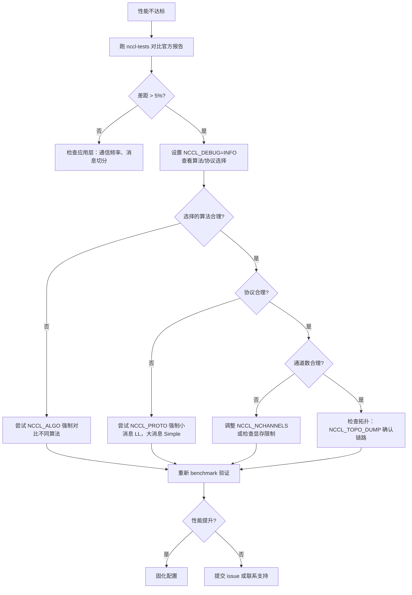

# Capítulo 21: Prática de tuning de desempenho: operação de tuning, ferramentas de benchmark e metodologia de tuning

No capítulo anterior, vimos como kernels personalizados do usuário podem cooperar com as primitivas de comunicação do NCCL através da API do lado do dispositivo, chegando até a fundir comunicação e computação no mesmo kernel. Isso abriu a possibilidade do NCCL como modelo de programação, mas também trouxe uma questão prática: quando o desempenho da comunicação não é o esperado, por onde começar? O NCCL expõe centenas de NCCL_PARAM, mas o que realmente determina o caminho de uma comunicação coletiva são apenas três botões: algoritmo (Algo), protocolo (Proto) e número de canais (nChannels). Este capítulo encadeia os mecanismos dos 20 capítulos anteriores em um caminho de investigação operacional — primeiro observar o relatório de desempenho para localizar o fenômeno, depois ler o modelo de custo para entender como o próprio NCCL escolhe, e por fim usar variáveis de ambiente e benchmark para validar suas hipóteses.

# 21.1 Relatório de desempenho: primeiro estabeleça a linha de base do "normal"

O primeiro passo do tuning não é alterar parâmetros, mas saber como é o "normal". Se você nem sabe qual é a largura de banda de pico do sistema atual, qualquer ajuste de parâmetros é um chute às cegas.

O NCCL oficial publica em`docs/perf`dados de desempenho de referência, cuja posição é muito clara — não é uma garantia de nível de produto, mas um ponto de referência para alinhar expectativas.

[FACT:docs/perf/README.md:3-14]

```
NCCL publishes reference performance data to:

1. Provide reference points that help users align performance expectations.
2. Help users validate their system setup.
3. Reduce repeated requests to the NCCL team for basic performance numbers.

These results are references, and NOT product-level guarantees that the same
performance is achievable on every system. Performance depends on a complex
combination of software versions, system configuration, hardware, and operating
conditions, including factors outside NCCL's control. A difference within 5% is
generally considered acceptable variance due to differences in the underlying
systems.
```

Há duas informações-chave aqui que iniciantes costumam ignorar:

Primeiro,**diferenças dentro de 5% são flutuações normais**. Isso significa que, quando você mede 3% abaixo do oficial, não se apresse em ajustar parâmetros — primeiro confirme se é ruído de medição, jitter do clock da GPU ou interferência de tarefas vizinhas.

Segundo,**o oficial publica apenas largura de banda de pico, não latência**。

[FACT:docs/perf/README.md:24-24]

```
We publish peak bandwidth for a selection of commonly used platforms. We do not
currently publish latency because it is typically more sensitive to factors
outside NCCL's control.
```

> **[Design Inference & Architectural Trade-offs]**
> Por que a latência não é publicada? Porque a latência é extremamente sensível ao estado do sistema — frequência da CPU, estado do link PCIe, versão de firmware da placa de rede e até a política de energia da BIOS podem afetá-la. A largura de banda tende à saturação em mensagens grandes e é relativamente estável; a latência, em mensagens pequenas, é formada pela sobreposição de inúmeros pequenos elos, e qualquer oscilação em um deles é amplificada. Portanto, no tuning,**mensagens grandes olham para largura de banda, mensagens pequenas olham para latência**, e esses são dois caminhos distintos de investigação.

[FACT:docs/perf/README.md:24-24]

```
If your workload differs significantly from the published results, open an
issue in the [NCCL repository](https://github.com/NVIDIA/nccl/issues) or contact
NVIDIA Support. We will try our best to help.
```

**Primeiro item da ordem de investigação**: execute primeiro um benchmark padrão (como`nccl-tests`do`all_reduce_perf`), e compare o resultado com o relatório oficial. Se a diferença estiver dentro de 5%, a configuração do sistema está ok e o gargalo de desempenho está na sua camada de aplicação (por exemplo, frequência de comunicação, forma de divisão de mensagens); se a diferença for significativa, então entre no tuning de parâmetros do NCCL.

# 21.2 Modelo de custo: como o próprio NCCL escolhe algoritmo e protocolo

Para ajustar parâmetros, primeiro é preciso entender como o NCCL escolhe por padrão. Internamente, ele tem um "modelo de custo" (cost model), que é essencialmente uma consulta em tabela + cálculo por fórmula: dado o tamanho da mensagem, o tipo de topologia e o número de ranks, estima o tempo de cada combinação de "algoritmo × protocolo" e escolhe a menor.

## Modelo intuitivo

Pense no modelo de custo como um aplicativo de navegação. Você insere origem e destino (tamanho da mensagem, topologia), ele estima internamente o tempo de cada rota (combinação de algoritmo/protocolo) e recomenda a mais rápida. A estimativa da navegação é baseada em dados históricos e classe da via; a estimativa do NCCL é baseada em uma tabela de parâmetros de latência/largura de banda codificada de forma fixa.

Sem esse modelo, o NCCL só poderia usar um único algoritmo fixo para todos os cenários — mensagens pequenas ficariam mais lentas por overhead de inicialização excessivo, mensagens grandes ficariam mais lentas por utilização insuficiente de largura de banda, e o sistema teria desempenho ruim nos dois extremos.

## Estrutura de dados: tabela do modelo e contexto de tuning

O núcleo do modelo de custo é o array`modelMap`, em que cada elemento corresponde a uma combinação de "algoritmo/protocolo/kernel simétrico".

[FACT:src/tuning/cost_model.cc:230-277]

```
static struct ncclTuningModelEntry_t modelMap[] = {
    /*
Initialize default, static models here
{mod_init, mod_sim, mod_final, enabled}
Enable order: Broadcast, Reduce, AllGather, ReduceScatter, AllReduce
*/
  {ncclTuningTreeModelInit, ncclTuningTreeModelSim, nullptr, {0, 0, 0, 0, 1}},       // Tree/LL
  {ncclTuningTreeModelInit, ncclTuningTreeModelSim, nullptr, {0, 0, 0, 0, 1}},       // Tree/LL128
  {ncclTuningTreeModelInit, ncclTuningTreeModelSim, nullptr, {0, 0, 0, 0, 1}},       // Tree/Simple
  {ncclTuningRingModelInit, ncclTuningRingModelSim, nullptr, {1, 1, 1, 1, 1}},       // Ring/LL
  ...
```

Cada entrada tem quatro campos:`mod_init`(função de inicialização),`mod_sim`(função de simulação),`mod_final`(função de limpeza),`enabled`(flags de habilitação de cada uma das 5 funções).`enabled`A ordem do array`{Broadcast, Reduce, AllGather, ReduceScatter, AllReduce}`é

> **[Design Inference & Architectural Trade-offs]**
> 〔Inferência de design e trade-offs arquiteturais〕**Observação-chave:**（`{0,0,0,0,1}`Tree é habilitado apenas em AllReduce`{1,1,1,1,1}`). Isso ocorre porque a vantagem do algoritmo Tree está na fase de redução do AllReduce, que pode ser paralelizada, mas para operações como AllGather/ReduceScatter, que são essencialmente pipeline em anel, o Ring é mais natural.

Os parâmetros específicos do modelo estão em`ncclTunerConstants_t`, incluindo a latência base e a largura de banda para cada topologia.

[FACT:src/tuning/cost_model.cc:142-152]

```
static const ncclTunerConstants_t ncclTunerConstantsDefaults = {
    // baseLatencies
  {
    {6.8, 14.0, 8.4},  // Tree
    {6.6, 14.0, 8.4},  // Ring
    {0, 0, 0},         // Collnet Direct
    {0, 0, 0},         // Collnet Chain
    {0, 0, 0},         // NVLS
    {0, 0, 0},         // NVLS Tree
    {8.0, 8.0, 8.0}    // PAT
  },
```

Cada algoritmo tem três valores de latência base, correspondentes aos três protocolos LL / LL128 / Simple. Por exemplo, o Ring`{6.6, 14.0, 8.4}`significa: latência base do protocolo LL de 6,6 microssegundos, LL128 de 14,0, Simple de 8,4. Esses números são valores empíricos medidos pela NVIDIA em hardware real.

A latência de hardware é fornecida separadamente por tipo de topologia (NVLink / PCI / NET).

[FACT:src/tuning/cost_model.cc:153-184]

```
    // hwLatencies
  {
    /* NVLINK */
    {
      {0.6, 1.25, 4.0}, // Tree (LL/LL128/Simple)
      {0.6, 1.9, 3.4},  // Ring (LL/LL128/Simple)
      ...
    },
    /* PCI */
    {
      {1.0, 1.9, 4.0}, // Tree (LL/LL128/Simple)
      {1.0, 2.5, 5.7}, // Ring (LL/LL128/Simple)
      ...
    },
    /* NET */
    {
      {5.0, 8.5, 14},   // Tree (LL/LL128/Simple)
      {2.7, 4.0, 14.0}, // Ring (LL/LL128/Simple)
      ...
    },
  },
```

Comparando, é possível ver a diferença entre topologias: no NVLink, a latência por salto do Ring/Simple é de 3,4 microssegundos, no PCI é de 5,7, no NET é de 14,0. É por isso que a comunicação entre máquinas é lenta — cada salto custa 10 microssegundos a mais.

Os parâmetros de largura de banda são fornecidos por geração de arquitetura de GPU.

[FACT:src/tuning/cost_model.cc:183-183]

```
    // llMaxBws
  {
    {39.0, 39.0, 20.4}, /* Volta-N1/Intel-N2/Intel-N4) */
    {87.7, 22.5 /*avg of ring & tree*/, 19.0}, /* Ampere-N1/AMD-N2/AMD-N4) */
    {141.0, 45.0 /*avg of ring & tree*/, 35.0}, /* Hopper-N1/AMD-N2/AMD-N4) */
    {2 * 141.2, 2 * 45.0 /*avg of ring & tree*/, 2 * 35.0}, /* Blackwell-N1/AMD-N2/AMD-N4) */
  },
```

Cada linha corresponde a uma geração de arquitetura, e os três valores são a largura de banda máxima do protocolo LL nos cenários de uma máquina (N1), duas máquinas (N2) e quatro máquinas (N4). Hopper em uma máquina: 141 GB/s, Blackwell dobra para 282 GB/s — isso explica por que o mesmo algoritmo tem desempenho muito melhor em placas novas.

## Contexto de ajuste: estado por comm

Cada domínio de comunicação (communicator) mantém uma cópia de`ncclTuningContext_t`, que armazena o estado de ajuste desse comm.

[FACT:src/include/tuning.h:81-95]

```
struct ncclTuningContext_t {
  // Persistant tuning parameters tied to a communicator.
  ncclTunerConstants_t tuningConstants;
  // State of the tuning models
  // Forced function is set via env var
  int forced[NCCL_NUM_FUNCTIONS];
  // Disabled tuning models are not execute and excluded from implemetation selection.
  int enabled[NCCL_TUNING_COUNT][NCCL_NUM_FUNCTIONS];
  // Store of model contexts per communicator.
  float generalLatencies[NCCL_NUM_FUNCTIONS][NCCL_NUM_ALGORITHMS][NCCL_NUM_PROTOCOLS];
  float generalBandwidths[NCCL_NUM_FUNCTIONS][NCCL_NUM_ALGORITHMS][NCCL_NUM_PROTOCOLS];

  ssize_t threadThresholds[NCCL_NUM_ALGORITHMS][NCCL_NUM_PROTOCOLS];
  int maxThreads[NCCL_NUM_ALGORITHMS][NCCL_NUM_PROTOCOLS];
};
```

Quatro campos principais:

- `forced[NCCL_NUM_FUNCTIONS]`: marca quais funções tiveram algoritmo/protocolo forçados por variáveis de ambiente. Este é o ponto de aplicação de`NCCL_ALGO`/`NCCL_PROTO`.
- `enabled[NCCL_TUNING_COUNT][NCCL_NUM_FUNCTIONS]`: tabela booleana bidimensional, que marca se um determinado modelo está habilitado para uma determinada função. Modelos desabilitados não participam da seleção.
- `generalLatencies` / `generalBandwidths`: array tridimensional, que armazena a latência e a largura de banda estimadas por «função × algoritmo × protocolo». Esta é a origem da grande tabela impressa por`ncclTuningInit`.
- `threadThresholds` / `maxThreads`: limiares relacionados ao número de threads, que determinam quantas threads cada block usa.

## Walkthrough orientado por cenário: uma seleção de algoritmo de AllReduce

Suponha que você chame`ncclAllReduce`, tamanho da mensagem 1MB, 8 GPUs em uma máquina NVLink. Internamente, o NCCL construirá um`ncclTuningInput_t`, e então chamará`ncclTuningCompute`。

[FACT:src/tuning/tuning.cc:180-202]

```
ncclResult_t ncclTuningCompute(struct ncclTuningInput_t* const input, struct ncclTuningResult_t* const result) {
  ncclResult_t ret = ncclSuccess;
  TRACE(NCCL_TUNING, ...);
  struct ncclTuningResultList_t tunings;
  tunings.head = nullptr;
  struct ncclTuningResult_t bestTuning = NCCL_TUNING_RESULT_INIT;
  // Set tuning to Ring/Simple for single rank case
  if (input->comm->nRanks tuningMask & (1ULL forced = input->comm->tuningContext.forced[input->func];
  NCCLCHECKGOTO(getModelEntry(id, &model), ret, not_valid);
  if (model == nullptr) {
    ret = ncclInternalError;
    goto not_valid;
  }
  if (input->comm->tuningContext.enabled[id][input->func] == 0) {
    goto not_valid;
  }
  if (model->model != nullptr) {
    NCCLCHECKGOTO(model->model(input, result), ret, not_valid);
    if (result->timeUs timeUs = NCCL_TUNING_IGNORE;
  result->valid = 0;
  goto exit;
}
```

Observe o tratamento da tag`not_valid`: qualquer falha em uma etapa (modelo inexistente, desabilitado, simulação retornando tempo não positivo) definirá`timeUs`como`NCCL_TUNING_IGNORE`、`valid`e definirá como 0. Esse candidato é excluído da seleção subsequente.

Quarto passo: entre todos os candidatos válidos, escolher o de menor tempo.

[FACT:src/tuning/tuning.cc:155-173]

```
static ncclResult_t ncclTuningSelectBestTuning(struct ncclTuningResultList_t* tunings,
                                               struct ncclTuningResult_t* const bestTuning) {
  bestTuning->timeUs = FLT_MAX;
  float bestSelectionTimeUs = FLT_MAX;
  struct ncclTuningResultListNode* node = tunings->head;
  while (node != nullptr) {
    const struct ncclTuningResult_t& tuning = node->result;
    float selectionTimeUs = tuning.selectionTimeUs > 0.0f ? tuning.selectionTimeUs : tuning.timeUs;
    TRACE(NCCL_TUNING, "A/P/S %s/%s/%s, time: %f, selection time: %f", ...);
    if (selectionTimeUs next;
  }
  return ncclSuccess;
}
```

Aqui há um detalhe: a seleção usa`selectionTimeUs`, se for maior que 0, usa-se ele; caso contrário, recorre-se a`timeUs`。`selectionTimeUs`é o «tempo de seleção», que pode incluir termos de penalidade adicionais (por exemplo, alguns algoritmos têm custo extra em cenários específicos). Isso dá ao modelo de custo a capacidade de separar «tempo estimado» e «tempo de seleção».

## Fluxograma

```mermaid
flowchart TD
    start["ncclTuningCompute(input, result)"] --> check_ranks{"comm->nRanks |是| single["bestTuning = Ring/SimplenChannels = 0"]
    check_ranks -->|否| all["ncclTuningComputeAllTunings()"]
    all --> loop{"遍历 i in NCCL_TUNING_COUNT"}
    loop -->|mask 未命中| skip["tuning.valid = 0continue"]
    loop -->|mask 命中| expand["ncclTuningExpandId(i, ...)"]
    expand --> sim["ncclTuningComputeTuning()→ ncclTuningCostModelSimModel()"]
    sim --> sim_check{"enabled[id][func] != 0且 model->model != nullptr?"}
    sim_check -->|否| invalid["timeUs = NCCL_TUNING_IGNOREvalid = 0"]
    sim_check -->|是| push["ncclTuningResultListPushFront()"]
    skip --> loop
    invalid --> loop
    push --> loop
    loop -->|遍历结束| tuner_check{"comm->tuner != NULL?"}
    tuner_check -->|是| plugin["tuner->getCollInfo()覆盖 generalTable"]
    tuner_check -->|否| select["ncclTuningSelectBestTuning()"]
    plugin --> select
    select --> channels["ncclTuningGetChannels()"]
    channels --> eff{"CTAPolicy & EFFICIENCY且 NCCL_ALGO/NCCL_PROTO 未设置?"}
    eff -->|是| nvls["尝试 NVLS 覆盖ncclNvlsRegResourcesQuery()"]
    eff -->|否| done["*result = bestTuning"]
    nvls --> done
    single --> done
```

Este diagrama desenha completamente o caminho de decisão da entrada até o resultado final, incluindo curto-circuito de rank único, filtragem por máscara, desabilitação de modelo, intervenção de plugin tuner, sobrescrita por CTAPolicy e todos os outros ramos.

# 21.3 Variáveis de ambiente: os três botões que realmente afetam o desempenho

Entendendo o modelo de custo, fica claro como as variáveis de ambiente intervêm.`NCCL_ALGO`、`NCCL_PROTO`、`NCCL_SYM_KERNEL`Essas três variáveis, após serem analisadas por`parseList`, modificam diretamente a tabela`enabled`, desabilitando todos os candidatos que não atendem à intenção do usuário.

## Sintaxe de análise

`parseList`A sintaxe suportada por

[FACT:src/tuning/cost_model.cc:14-32]

```
// Parse a map of prefixes to a list of elements. The first prefix is
// optional and, if not present, the list of elements will be applied
// to all prefixes. Only the first list of elements can lack a
// prefix. Prefixes (if present) are followed by a colon. Lists of
// elements are comma delimited. Mappings of prefix to the lists of
// elements are semi-colon delimited.
//
// For example:
//
//     NCCL_ALGO="ring,collnetdirect;allreduce:tree,collnetdirect;broadcast:ring"
// Enable ring and collnetdirect for all functions, then select tree
// and collnetdirect for allreduce and ring for broadcast.
//
//     NCCL_PROTO="LL,Simple;allreduce:^LL"
// Enable LL and Simple for all functions, but everything except LL
// for allreduce.
//
//     NCCL_PROTO="^LL128;allreduce:LL128"
// Enable everything but LL128, but only LL128 for allreduce.
```

Copiar

1. **Três usos:**：`NCCL_ALGO="ring,tree"`Lista global

2. **— todas as funções usam apenas ring e tree.**：`NCCL_ALGO="ring;allreduce:tree"`Por prefixo de função

3. **— padrão ring, mas allreduce usa tree.**：`NCCL_PROTO="^LL128"`Sintaxe de exclusão

`^`— tudo habilitado exceto LL128.

[FACT:src/tuning/cost_model.cc:59-67]

```
    int unset, set;
    if (elemList[0] == '^') {
      unset = 1;
      set = 0;
      elemList++;
    } else {
      unset = 0;
      set = 1;
    }
```

é a chave — ele indica «unset», ou seja, excluir uma opção do padrão totalmente habilitado.`^`Copiar`unset=1`、`set=0`Ao analisar para`unset`,`set`。

[FACT:src/tuning/cost_model.cc:69-96]

```
    bool foundPrefix = false;
    for (int p = 0; p minCompCap, comm->maxCompCap, comm->graphs[algo].typeInter,
                          comm->graphs[algo].typeIntra, comm->nRanks, f, algo, comm->minDriverVersion)) {
        comm->tuningContext.enabled[i][f] = 0;
      }
      //  Check the user env vars only for functions that have a forced configuration and not already disabled.
      if (comm->tuningContext.forced[f] == 0 || comm->tuningContext.enabled[i][f] == 0) continue;
      comm->tuningContext.enabled[i][f] = 0;
      TRACE(NCCL_TUNING, "a/p/s %s/%s/%s enabled %d/%d/%d", ...);
      if (((algo != NCCL_ALGO_UNDEF && algoEnable[f * NCCL_NUM_ALGORITHMS + algo] != 0) &&
           (proto != NCCL_PROTO_UNDEF && protoEnable[f * NCCL_NUM_PROTOCOLS + proto] != 0)) ||
          (symKernelId != ncclSymkKernelId_Count && symKernelIdEnable[f * ncclSymkKernelId_Count + symKernelId] != 0)) {
        comm->tuningContext.enabled[i][f] = 1;
      }
    }
```

Há um trecho de lógica crítica em

1. **, que trata a interação entre a imposição do usuário e as variáveis de ambiente e capacidades da plataforma.**Copiar`isLL128Enabled`A ordem desta lógica é importante:`protoEnable == 2`Primeiro tratar a capacidade da plataforma LL128

2. **: se a plataforma não suporta LL128 (**retorna 0) e o usuário não exigiu explicitamente (`forced[f] != 0`), desabilita diretamente.`enabled[i][f] = 0`), em seguida, verifica se o usuário permite essa combinação — se permitir, reativa.

`protoEnable`O valor de tem três estados: 0 (excluído pelo usuário), 1 (habilitado pelo usuário), 2 (não mencionado pelo usuário, habilitado por padrão). Esse design de três estados permite distinguir entre "exigência explícita do usuário" e "padrão da plataforma".

## Mecanismo de cache para leitura de variáveis de ambiente

Todas as`NCCL_PARAM`macros acabam passando por`ncclLoadParam`。

[FACT:src/misc/param.cc:78-108]

```
int64_t ncclLoadParam(char const* env, int64_t deftVal, int64_t uninitialized, int64_t* cache, int8_t* noCache) {
  static std::mutex mutex;
  std::lock_guard lock(mutex);

  // noCache is only load/stored within the mutex, no need for atomic
  if (*noCache == /*uninitialized*/ -1) ncclGetCachePolicy(env, noCache);

  if (COMPILER_ATOMIC_LOAD(cache, std::memory_order_relaxed) != uninitialized) {
    return COMPILER_ATOMIC_LOAD(cache, std::memory_order_relaxed);
  }

  // Read the environment variable
  const char* str = ncclGetEnv(env);
  int64_t value = deftVal;

  if (str && strlen(str) > 0) {
    errno = 0;
    char* end = nullptr;
    value = strtoll(str, &end, 0);
    // Preserve numeric-prefix parsing while rejecting non-numeric values.
    if (errno || end == str) {
      value = deftVal;
      ATTN("Invalid value %s for %s, using default %lld.", str, env, (long long)deftVal);
    } else {
      INFO(NCCL_ENV, "%s set by environment to %lld.", env, (long long)value);
    }
  }

  if (*noCache == /*cache*/ 0) COMPILER_ATOMIC_STORE(cache, value, std::memory_order_relaxed);
  return value;
}
```

Este trecho de código tem vários designs que merecem atenção:

**Mutex global**：`static std::mutex mutex`protege todo o processo de leitura. Isso significa que a primeira leitura de todos os parâmetros é serial. Por que usar lock em vez de lock-free? Porque a leitura de parâmetros só ocorre na fase de inicialização, não está no caminho crítico, o custo do lock é desprezível, e a correção é mais importante.

**Verificação dupla**: primeiro lê atomicamente`cache`, se já inicializado, retorna diretamente. Isso evita entrar no lock a cada leitura de parâmetro — embora o lock em si quase não tenha contenção após a inicialização, a leitura atômica é mais rápida.

**Estratégia de cache**：`noCache`O flag determina se o valor lido deve ser escrito de volta em`cache`. Alguns parâmetros (como os que precisam de resposta dinâmica) podem desabilitar o cache, relendo a variável de ambiente a cada vez.

**Tratamento de erros**：`strtoll`Quando a análise falha, usa o valor padrão e imprime`ATTN`aviso. Observe`end == str`o julgamento — se a string não começar com um número,`end`será igual a`str`, indicando que nenhum número foi analisado.

## Suporte a arquivo de configuração

As variáveis de ambiente não precisam ser definidas necessariamente pelo shell; o NCCL suporta leitura a partir de arquivo de configuração.

[FACT:src/misc/param.cc:52-67]

```
static void initEnvFunc() {
  char confFilePath[1024];
  const char* userFile = std::getenv("NCCL_CONF_FILE");
  if (userFile && strlen(userFile) > 0) {
    snprintf(confFilePath, sizeof(confFilePath), "%s", userFile);
    setEnvFile(confFilePath);
  } else {
    const char* userDir = userHomeDir();
    if (userDir) {
      snprintf(confFilePath, sizeof(confFilePath), "%s/.nccl.conf", userDir);
      setEnvFile(confFilePath);
    }
  }
  snprintf(confFilePath, sizeof(confFilePath), "/etc/nccl.conf");
  setEnvFile(confFilePath);
}
```

Ordem de carregamento:`NCCL_CONF_FILE`arquivo especificado (se definido) →`~/.nccl.conf` → `/etc/nccl.conf`. O que é carregado depois sobrescreve o que foi carregado antes (porque`setEnvFile`chama`ncclOsSetEnv`）。

[FACT:src/misc/param.cc:69-72]

```
void initEnv() {
  static std::once_flag once;
  std::call_once(once, initEnvFunc);
}
```

`std::call_once`garante que o arquivo de configuração seja carregado apenas uma vez, mesmo que vários threads chamem pela primeira vez simultaneamente`ncclGetEnv`。

# 21.4 Número de canais: o botão de desempenho subestimado

O algoritmo e o protocolo determinam "como ir", o número de canais determina "quantos caminhos abrir". Muitas pessoas, ao fazer tuning, prestam atenção apenas aos dois primeiros e ignoram o número de canais — mas em cenários de mensagens grandes, o número de canais costuma ser a chave para determinar a utilização da largura de banda.

## De onde vem o número de canais

`ncclTuningCompute`Após selecionar o melhor algoritmo/protocolo, chama`ncclTuningGetChannels`para calcular o número de canais.

[FACT:src/tuning/tuning.cc:233-235]

```
  if (bestTuning.algo != NCCL_ALGO_UNDEF && bestTuning.proto != NCCL_PROTO_UNDEF) {
    NCCLCHECKGOTO(ncclTuningGetChannels(input, &bestTuning), ret, exit);
  }
```

A lógica de cálculo do número de canais não está no material fonte deste capítulo, mas é possível ver seu papel a partir dos campos de`ncclTuningResult_t`.

[FACT:src/include/tuning.h:42-55]

```
struct ncclTuningResult_t {
  int id;
  int valid;
  float timeUs;
  float selectionTimeUs;
  int algo;
  int proto;
  int symKernelId;
  int ceMethodId;
  int nChannels;
  int maxChannels;
  int nWarps;
  int forced;
};
```

`nChannels`é o número final de canais usados,`maxChannels`é o limite superior.`nWarps`é o número de warps por block.

## Sobrescrita do número de canais pelo CTAPolicy

Há um trecho de lógica especial que trata da`NCCL_CTA_POLICY_EFFICIENCY`estratégia.

[FACT:src/tuning/tuning.cc:236-257]

```
  // NCCL_CTA_POLICY_EFFICIENCY requires user (non-symmetric) buffer registration (currently unsupported with MNNVL).
  // Run after GetChannels so bestTuning.nChannels is valid. Skip when a tuner plugin owns selection
  // (same as pre-rearch). The NVLS-bit guard keeps this bias inside the candidate set: a per-call
  // algSelection may have narrowed tuningMask, so EFFICIENCY must not resurrect NVLS when excluded.
  if (input->comm->tuner == NULL && (input->CTAPolicy & NCCL_CTA_POLICY_EFFICIENCY) &&
      ncclGetEnv("NCCL_ALGO") == NULL && ncclGetEnv("NCCL_PROTO") == NULL && !input->comm->MNNVL &&
      (input->tuningMask & (1ull regBuff && (input->func == ncclFuncAllGather || input->func == ncclFuncReduceScatter)) {
      if ((input->comm->nNodes > 1 && input->collNetSupport && input->nvlsSupport) ||
          (input->comm->nNodes == 1 && input->nvlsSupport)) {
        int recChannels;
        NCCLCHECKGOTO(ncclNvlsRegResourcesQuery(input->comm, input->func, &recChannels), ret, exit);
        if (recChannels comm->tuningContext.maxThreads[bestTuning.algo][bestTuning.proto] / WARP_SIZE;
        }
      }
    }
  }
```

As condições de guarda deste código são muito densas e merecem ser interpretadas uma a uma:

1. `input->comm->tuner == NULL`: só entra neste trecho quando não há plugin tuner. Quando o plugin tem o poder de escolha, o NCCL não interfere.

2. `input->CTAPolicy & NCCL_CTA_POLICY_EFFICIENCY`: o usuário definiu a estratégia de prioridade de eficiência.

3. `ncclGetEnv("NCCL_ALGO") == NULL && ncclGetEnv("NCCL_PROTO") == NULL`: o usuário não forçou algoritmo/protocolo. Se forçou, respeita a escolha do usuário.

4. `!input->comm->MNNVL`: cenário MNNVL não suportado.

5. `input->tuningMask & (1ull << (NCCL_ALGO_NVLS * NCCL_NUM_PROTOCOLS + NCCL_PROTO_SIMPLE))`: NVLS/Simple está no conjunto de candidatos. Essa guarda impede "ressuscitar" opções excluídas.

Após atender às condições, consulta o número de canais que os recursos registrados do NVLS podem suportar; se não exceder a seleção atual, muda para o algoritmo NVLS.

> **[Design Inference & Architectural Trade-offs]**
> Por que a estratégia EFFICIENCY favorece NVLS? Porque o NVLS (NVLink SHARP) utiliza o hardware do switch para fazer redução, podendo reduzir a sobrecarga de computação e comunicação da GPU, sendo mais eficiente em operações como AllGather/ReduceScatter. Mas seu número de canais é limitado pelos recursos de hardware, então é necessário`ncclNvlsRegResourcesQuery`consultar a quantidade realmente disponível.

## Lógica de fallback do kernel simétrico

O kernel simétrico (symmetric kernel) é um recurso mais recente; quando não está disponível, é preciso fazer fallback para o kernel genérico.

[FACT:src/tuning/tuning.cc:258-298]

```
  if ((bestTuning.symKernelId != ncclSymkKernelId_Count ||
       (input->tuningMask & NCCL_TUNING_MASK_SYM_KERNELS && bestTuning.symKernelId == ncclSymkKernelId_Count)) &&
      bestTuning.algo == NCCL_ALGO_UNDEF && bestTuning.proto == NCCL_PROTO_UNDEF) {
    bool isLLKernel = (1 comm->intraRanks > 1 && !ncclParamSingleProcMemRegEnable();
    bool needFallback = bestTuning.symKernelId != ncclSymkKernelId_Count ? false : true;

    // General kernel tuning structs if fallback is needed
    struct ncclTuningResult_t generalTuning = NCCL_TUNING_RESULT_INIT;
    struct ncclTuningInput_t generalInput = *input;
    generalInput.tuningMask = NCCL_TUNING_MASK_GENERAL_KERNELS;

    // Fallback logic for symmetric LL kernels:
    // - If both src and dst are registered, we don't fall back if a symmetric kernel is available.
    // - Otherwise, we have to fall back to generl kernel if running the selected symmetric LL kernel is
    //   not possible (if the buffers are not registered and we manage multiple GPUs).
    // - If the user forced a symmetric kernel via NCCL_SYM_KERNEL or requested preference for using
    //   symmetric kernels even without symmetric buffers via NCCL_SYM_NOWIN_ENABLE, we respect that.
    // - Otherwise, we query the general cost model and if it selects a non-LL proto, we pick that.
    if (bestTuning.symKernelId != ncclSymkKernelId_Count) {
      if (input->winRegType == ncclSymSendRegRecvReg) {
        needFallback = false;
      } else if (isLLKernel) {
        needFallback = isOneThreadMultiGpus && input->winRegType == ncclSymSendNonregRecvNonreg;
        if (!needFallback && !result->forced) {
          needFallback = !ncclParamSymNoWinEnable() && input->winRegType == ncclSymSendNonregRecvNonreg;
          if (!needFallback) {
            NOWARN(ncclTuningCompute(&generalInput, &generalTuning), NCCL_TUNING);
            needFallback = (generalTuning.proto != NCCL_PROTO_LL);
          }
        }
      }
    }
```

Árvore de decisão de fallback:

- Se os buffers de envio e recepção estiverem ambos registrados (`ncclSymSendRegRecvReg`), não faz fallback.
- Se for kernel LL e single-thread gerenciar múltiplas GPUs e o buffer não estiver registrado, faz fallback.
- Se o usuário não definiu`NCCL_SYM_NOWIN_ENABLE`e o buffer não estiver registrado, faz fallback.
- Caso contrário, consulta o modelo de custo genérico; se ele escolher um protocolo não-LL, faz fallback.

> **[Design Inference & Architectural Trade-offs]**
> O núcleo dessa lógica é: o kernel LL simétrico precisa de registro de buffer para aproveitar suas vantagens. Quando não registrado, a vantagem do kernel LL (baixa latência) pode ser anulada pela sobrecarga extra de tradução de endereço, então o fallback para o kernel genérico é mais vantajoso.

## Tratamento de erro quando não há combinação disponível

Se todos os candidatos forem excluídos, o NCCL reporta erro e fornece informações de diagnóstico.

[FACT:src/tuning/tuning.cc:308-329]

```
  if ((bestTuning.algo == NCCL_ALGO_UNDEF || bestTuning.proto == NCCL_PROTO_UNDEF) &&
      bestTuning.symKernelId == ncclSymkKernelId_Count && bestTuning.ceMethodId == ncclCeMethodId_Count) {
    char ncclAlgoEnvStr[1024] = "";
    char ncclProtoEnvStr[1024] = "";
    char ncclSymKernelIdEnvStr[1024] = "";
    const char* symKernelIdEnv = ncclGetEnv("NCCL_SYM_KERNEL");
    if (symKernelIdEnv) {
      snprintf(ncclSymKernelIdEnvStr, 1023, " NCCL_SYM_KERNEL was set to %s.", symKernelIdEnv);
    }
    const char* algoEnv = ncclGetEnv("NCCL_ALGO");
    if (algoEnv) {
      snprintf(ncclAlgoEnvStr, 1023, " NCCL_ALGO was set to %s.", algoEnv);
    }
    const char* protoEnv = ncclGetEnv("NCCL_PROTO");
    if (protoEnv) {
      snprintf(ncclProtoEnvStr, 1023, " NCCL_PROTO was set to %s.", protoEnv);
    }
    WARN("No algorithm/protocol nor symKernelId available for function %s with datatype %s.%s%s%s",
         ncclFuncToString(input->func), ncclDatatypeToString(input->datatype), ncclAlgoEnvStr, ncclProtoEnvStr,
         ncclSymKernelIdEnvStr);
    ret = (algoEnv || protoEnv || symKernelIdEnv) ? ncclInvalidUsage : ncclInternalError;
  }
```

A escolha do código de erro tem critério: se o usuário definiu a variável de ambiente (`algoEnv || protoEnv || symKernelIdEnv`), retorna`ncclInvalidUsage`— isso é um problema de configuração do usuário; caso contrário, retorna`ncclInternalError`— isso é um problema interno do NCCL (todos os candidatos foram excluídos inesperadamente).

# 21.5 Guia para evitar armadilhas em produção

## Armadilha 1: erro de digitação em variável de ambiente causa fallback silencioso

`parseList`Ao encontrar um token não reconhecido, retorna`ncclInvalidUsage`, mas se você escreveu`NCCL_ALGO=RING`(maiúsculo),`strcasecmp`fará a correspondência corretamente. O realmente perigoso é erro de digitação, como`NCCL_ALGO=rnig`。

[FACT:src/tuning/cost_model.cc:87-91]

```
        if (e == nelems) {
          WARN("Unrecognized element token \"%s\" when parsing \"%s\"", elem, str);
          ret = ncclInvalidUsage;
          goto fail;
        }
```

Aqui será impresso WARN e retornado erro. Mas se você não habilitou`NCCL_DEBUG=WARN`, talvez não veja esse aviso.**Recomendação**: ao fazer tuning, sempre defina`NCCL_DEBUG=WARN`ou`NCCL_DEBUG=INFO`, para garantir que possa ver o resultado da análise de configuração.

## Armadilha 2: interação entre NCCL_ALGO e NCCL_PROTO

Se você definir`NCCL_ALGO=tree`mas não definir`NCCL_PROTO`, o NCCL escolherá o melhor protocolo sob o algoritmo Tree. Mas se você definir simultaneamente`NCCL_ALGO=tree`e`NCCL_PROTO=LL`, e a combinação Tree/LL estiver desabilitada em algumas funções (por exemplo, Tree só é habilitado em AllReduce), será acionado o erro "nenhuma combinação disponível".

[FACT:src/tuning/cost_model.cc:379-383]

```
      if (((algo != NCCL_ALGO_UNDEF && algoEnable[f * NCCL_NUM_ALGORITHMS + algo] != 0) &&
           (proto != NCCL_PROTO_UNDEF && protoEnable[f * NCCL_NUM_PROTOCOLS + proto] != 0)) ||
          (symKernelId != ncclSymkKernelId_Count && symKernelIdEnable[f * ncclSymkKernelId_Count + symKernelId] != 0)) {
        comm->tuningContext.enabled[i][f] = 1;
      }
```

Somente quando algoritmo e protocolo**simultaneamente**forem permitidos, a combinação é habilitada. Isso é lógica AND, não OR.

## Armadilha 3: limitação de plataforma do LL128

LL128 não é suportado em todas as plataformas.`isLL128Enabled`Verificou a capacidade de computação, a versão do driver e o tipo de conexão.

[FACT:src/tuning/cost_model.cc:119-139]

```
static int isLL128Enabled(int minCompCap, int maxCompCap, int interType, int intraType, int nRanks, int func, int algo,
                          int minDriverVersion) {
  int ret = 1;
  if (ncclParamLl128C2c() && minCompCap >= 90 && (!RUBIN_AND_LATER(minCompCap) || minDriverVersion >= 13030)) {
    // Rubin, Blackwell, and Hopper: Enable LL128 for all P2C and PXN if CUDA supports it.
    ret &= (interType = 90)
      INFO(
        NCCL_GRAPH | NCCL_TUNING,
        "Disabling LL128 over all PxN connections (PXB and C2C). This ensures that no C2C link will be used by LL128.");
  }
  ret &= (intraType = 90);
  ret &= !(minCompCap comm, input->func, &recChannels), ret, exit);
        if (recChannels comm->tuningContext.maxThreads[bestTuning.algo][bestTuning.proto] / WARP_SIZE;
        }
```

O número de canais do NVLS é determinado pela consulta de recursos de hardware do`ncclNvlsRegResourcesQuery`, não é definido arbitrariamente. Se os recursos de hardware forem insuficientes, o número de canais será limitado.

# 21.6 Fluxo de decisão de ajuste fino

Conectando o conteúdo anterior, obtém-se um fluxo de solução de problemas acionável.



A ideia central deste fluxo é:**primeiro localizar, depois ajustar parâmetros, e por fim validar**. Não saia configurando variáveis de ambiente aleatoriamente.

# Resumo do capítulo

Este capítulo dividiu o caminho de ajuste fino do NCCL em quatro níveis:

1. **Linha de base**: Use o relatório de desempenho oficial para estabelecer expectativas, dentro de 5% é flutuação normal, mensagens grandes olham para largura de banda, mensagens pequenas olham para latência.

2. **Modelo de custo**: Internamente, o NCCL usa a tabela`modelMap`+ parâmetros de latência/largura de banda para estimar o tempo de cada combinação e escolher a menor. Entender este modelo é o pré-requisito para o ajuste de parâmetros.

3. **Variáveis de ambiente**：`NCCL_ALGO`、`NCCL_PROTO`、`NCCL_SYM_KERNEL`após análise pelo`parseList`modificam a tabela`enabled`, forçando ou excluindo combinações específicas. A sintaxe suporta três modos: global, por função e exclusão.

4. **Número de canais**: Calculado pelo`ncclTuningGetChannels`, influenciado por recursos de hardware e CTAPolicy.

# Reflexões e autoavaliação deste capítulo

Q1: Se removermos a lógica de curto-circuito de rank único no`ncclTuningCompute`(ramo`input->comm->nRanks <= 1`), o que acontecerá? Em quais cenários isso causaria problemas?

**Análise de referência**：

O curto-circuito de rank único em[FACT:src/tuning/tuning.cc:191-200]：

```cpp
  // Set tuning to Ring/Simple for single rank case
  if (input->comm->nRanks 
Q2: `parseList`Em`forced[p] = 1`qual é a função desta linha de código ([FACT:src/tuning/cost_model.cc:83])? Se removê-la,`NCCL_ALGO=ring`qual seria a mudança no comportamento de ?

**Análise de referência**：

`forced[p] = 1`Em[FACT:src/tuning/cost_model.cc:80-85]：

```cpp
        for (e = 0; e
