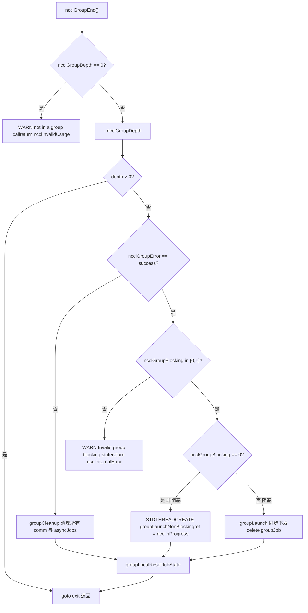

# Capítulo 22: Solução de problemas em produção e armadilhas: deadlocks comuns, timeouts, incompatibilidade de versões e planos de solução

No capítulo anterior, organizamos a ordem de solução de problemas de ajuste de desempenho e os botões-chave, mas falhas do NCCL em produção geralmente não são desempenho insuficiente, mas sim o programa travando ou falhando diretamente. A raiz dessas falhas geralmente não é um erro em alguma função, mas a quebra da ordem de chamadas, do ciclo de vida ou do contrato de versão. Este capítulo foca em quatro tipos mais típicos de armadilhas: deadlock causado por uso indevido da semântica de group, erro silencioso causado por falta de validação de parâmetros, incompatibilidade de versão ABI, e os limites de timeout e retry. Vamos seguir quatro pistas — src/group.cc, src/misc/argcheck.cc, src/include/checks.h e contrib/nccl_ep/nccl_ep.cc — para ver como o NCCL internamente bloqueia o erro antes que ele aconteça.

# Uso indevido da semântica de Group: Por que "esquecer um GroupEnd" causa travamento

## Modelo intuitivo: Group é um "carrinho de compras", não um "botão de acelerar"

Imagine o`ncclGroupStart()` / `ncclGroupEnd()`como um carrinho de compras online: você coloca vários itens (várias chamadas de comunicação) no carrinho e finalmente faz o checkout de uma vez (`ncclGroupEnd`). Se você apenas coloca e não faz o checkout, o carrinho fica eternamente suspenso — o contador`ncclGroupDepth`mantido internamente pelo NCCL não zera, e todas as chamadas de comunicação subsequentes pensarão que "ainda está acumulando pedido", nunca realmente enviando o kernel, e então todo o processo trava.

> **[Design Inference & Architectural Trade-offs]**
> Esta é a forma de deadlock mais comum em produção: o código, em algum ramo de exceção,`return`, pulou`ncclGroupEnd`, e`ncclGroupDepth`é`thread_local`, não é limpo automaticamente quando a função retorna.

## Estrutura de dados: estado do group em thread_local

A NCCL coloca todo o estado do group em armazenamento local de thread; esta é a chave para entender o deadlock.

[FACT:src/group.cc:34-34]

```cpp
thread_local int ncclGroupDepth = 0; // depth of ncclGroupStart nesting
thread_local ncclResult_t ncclGroupError = ncclSuccess;
thread_local struct ncclComm* ncclGroupCommHead[ncclGroupTaskTypeNum] = {nullptr};
thread_local struct ncclComm* ncclGroupCommPreconnectHead = nullptr;
thread_local struct ncclIntruQueue ncclAsyncJobs;
thread_local int ncclGroupBlocking = -1; /* default mode */
```

Interpretação campo a campo:

- `ncclGroupDepth`: profundidade de aninhamento.`ncclGroupStart`incrementa,`ncclGroupEnd`decrementa; somente quando chega a 0 é que o envio é realmente disparado. Suportar aninhamento é uma conveniência de design, mas também significa que "esquecer um End" fará a profundidade permanecer em 1 para sempre.
- `ncclGroupError`: erros de group acumulados nesta thread. Assim que uma chamada falha, as`ncclGroupEnd`subsequentes seguem diretamente o caminho de falha.
- `ncclGroupCommHead[]`: cabeças de lista de domínios de comunicação agrupadas por tipo de tarefa (collective / rawTask / mgmtTask / symRegister).
- `ncclAsyncJobs`: fila de tarefas assíncronas pendentes de execução (por exemplo, preconnect, symmetric register).
- `ncclGroupBlocking`：`-1`significa "ainda não encontrou nenhum domínio de comunicação",`0`significa não bloqueante,`1`significa bloqueante. Este campo é o núcleo da detecção posterior de "uso misto de bloqueante e não bloqueante".

> **[Design Inference & Architectural Trade-offs]**
> Usar`thread_local`em vez de variáveis globais tem um motivo direto: a NCCL permite que múltiplas threads mantenham contextos de group independentes, sem interferência mútua. O custo é que — quando a thread termina, esses estados não são limpos automaticamente; se a thread terminar no meio de um group, o estado vaza.

## Passo a passo: a cadeia completa de validação de um GroupEnd

Cenário: a aplicação chama`ncclGroupEnd()`, e neste momento`ncclGroupDepth`é 1.

Primeiro passo, verificar se realmente está em um group:

[FACT:src/group.cc:1048-1052]

```cpp
  if (ncclGroupDepth == 0) {
    WARN("ncclGroupEnd: not in a group call.");
    ret = ncclInvalidUsage;
    goto exit;
  }
```

Se o usuário não chamou`ncclGroupStart`e chamou diretamente`ncclGroupEnd`, aqui será impresso "not in a group call" e retornará`ncclInvalidUsage`. Este é o erro mais amigável — reporta imediatamente, sem travar.

Segundo passo, decrementar a profundidade e determinar se é o nível mais externo:

[FACT:src/group.cc:1061-1063]

```cpp
  if ((--ncclGroupDepth) > 0) goto exit;

  if ((ret = ncclGroupError) != ncclSuccess) goto fail;
```

Se houver vários níveis de aninhamento, o`End`interno apenas decrementa a profundidade e retorna, sem disparar o envio. Somente o nível mais externo continua. Ao mesmo tempo, verifica erros acumulados.

Terceiro passo, validar a consistência do modo de bloqueio. Este é o ponto de detecção de "uso misto de bloqueante e não bloqueante":

[FACT:src/group.cc:1095-1101]

```cpp
  if (hasCommHead || !ncclIntruQueueEmpty(&groupJob->asyncJobs) || ncclGroupCommPreconnectHead != nullptr) {
    /* make sure ncclGroupBlocking has been set. */
    if (ncclGroupBlocking != 0 && ncclGroupBlocking != 1) {
      WARN("Invalid group blocking state %d", ncclGroupBlocking);
      ret = ncclInternalError;
      goto fail;
    }
```

`ncclGroupBlocking`deve estar entre`{0, 1}`. Se ainda for`-1`, significa que no group não há nem domínio de comunicação nem tarefa assíncrona, e logicamente não deveria chegar aqui.

Quarto passo, ramificar conforme o modo de bloqueio. Não bloqueante segue o envio assíncrono por thread; bloqueante segue o envio síncrono:

[FACT:src/group.cc:1102-1134]

```cpp
    if (ncclGroupBlocking == 0) {
      /* nonblocking group */
      if (!ncclIntruQueueEmpty(&groupJob->asyncJobs)) {
        ncclAsyncJob* job = ncclIntruQueueHead(&groupJob->asyncJobs);
        do {
          NCCLCHECKGOTO(ncclCommSetAsyncError(job->comm, ncclInProgress), ret, fail);
          if (job->comm->groupJob == NULL) {
            job->comm->groupJob = groupJob;
            groupJob->groupRefCount++;
          }
          job = job->next;
        } while (job);
      }
      ...
      groupJob->base.func = groupLaunchNonBlocking;
      STDTHREADCREATE_GOTO(groupJob->base.thread, ncclAsyncJobMain, ret, fail, &groupJob->base);
      groupJob->nonBlockingInit = true;
      ret = ncclInProgress;
    }
```

Observe`groupRefCount++`e`ret = ncclInProgress`: no modo não bloqueante,`ncclGroupEnd`retorna imediatamente`ncclInProgress`, e o envio real ocorre em uma thread em segundo plano. O chamador deve posteriormente usar`ncclCommGetAsyncError`para polling, ou usar`ncclGroupJobComplete`para aguardar.

## Uso misto de bloqueante e não bloqueante: por que é proibido

Voltando a`ncclAsyncLaunch`, veja a detecção de uso misto:

[FACT:src/group.cc:55-64]

```cpp
    /* check if there are blocking and nonblocking comms at the same time in group. */
    if (comm->destroyFlag) {
      ncclGroupBlocking = 1;
    } else if (ncclGroupBlocking == -1) {
      /* first met communicator */
      ncclGroupBlocking = comm->config.blocking;
    } else if (ncclGroupBlocking != comm->config.blocking) {
      WARN("Blocking and nonblocking communicators are not allowed in the same group.");
      ret = ncclInvalidArgument;
    }
```

> **[Design Inference & Architectural Trade-offs]**
> Por que proibir o uso misto? Porque a semântica de envio de um domínio de comunicação bloqueante é "quando a chamada retorna, o kernel já foi submetido", enquanto a não bloqueante é "quando a chamada retorna, a tarefa já foi enfileirada, mas não submetida". Se ambos estiverem no mesmo group,`ncclGroupEnd`não consegue fornecer uma semântica de retorno unificada — afinal, espera ou não espera? A NCCL opta por rejeitar diretamente, expondo o problema na fronteira da API.

## Armadilhas em produção: três cenários reais

**Cenário um: ramo de exceção esquece o GroupEnd.**O código, entre`ncclGroupStart`e`ncclGroupEnd`, lança uma exceção ou faz um`return`，`ncclGroupDepth`antecipado, parando em 1. Todas as chamadas de comunicação subsequentes entram no estado de "acumular pedidos", nunca enviando. Método de investigação: imprimir`ncclGroupEnd`antes de`ncclGroupDepth`, ou usar`gdb`para observar essa variável thread_local.

**Cenário dois: usar o mesmo comm entre threads.**Como o estado do group é`thread_local`, depois que a thread A chama`ncclGroupStart`, a thread B chamar`ncclAllReduce`não entrará no group de A. Se A e B operarem o mesmo comm, ocorrerá a desordem de "parte das chamadas dentro do group, parte fora do group". A NCCL não detecta esse caso, porque assume que um comm é operado por apenas uma thread em qualquer momento.

**Cenário três: interação entre CUDA graph capture e group.**Veja a detecção em`doLaunches`:

[FACT:src/group.cc:448-455]

```cpp
    if (capturingYes && capturingNo) {
      // We have entered barriers but are aborting without leaving them. Thus
      // these comms are permanently trashed. We need a good mechanism for
      // tracking and reporting that.
      WARN("Either none or all communicators in a ncclGroup() can be CUDA graph captured.");
      result = ncclInvalidUsage;
      goto failure;
    }
```

O comentário é direto: uma vez que se entra na barrier e se desiste no meio, esses comms ficam "permanentemente corrompidos". Portanto, a regra é — todos os domínios de comunicação em um group devem estar todos em capture, ou todos fora dele. O uso misto causa inconsistência no estado do comm, e atualmente a NCCL não tem um bom mecanismo de recuperação.



# Validação de parâmetros e erros silenciosos: como o ArgCheck bloqueia chamadas que "parecem normais"

## Modelo intuitivo: ArgCheck é a "segurança do aeroporto"

A validação de parâmetros é como a segurança do aeroporto: ela não serve para fazer você voar mais rápido, mas consegue bloquear aquilo que "parece bagagem, mas na verdade é material perigoso". Sem ela, um ponteiro com dispositivo errado faria o kernel da GPU ler dados inválidos, ou pior — corromper silenciosamente a memória de vídeo de outra pessoa.

## Estrutura de dados: modo de validação e fila global de verificação

A validação de parâmetros da NCCL não é "verificar tudo sempre", mas por modo. O núcleo é`comm->checkMode`：

[FACT:src/misc/argcheck.cc:227-251]

```cpp
  if (info->comm->checkMode != ncclCheckModeDefault) {
    if ((info->coll == ncclFuncSend || info->coll == ncclFuncRecv)) {
      if (info->count > 0) NCCLCHECK(CudaPtrCheck(info->recvbuff, info->comm, "buff", info->opName));
    } else if (info->coll == ncclFuncPutSignal || info->coll == ncclFuncSignal || info->coll == ncclFuncWaitSignal) {
      // One-sided RMA ops specify the remote destination via peerWin, not sendbuff/recvbuff,
      // so the standard CUDA pointer checks do not apply here.
      INFO(NCCL_COLL, "%s : skipping sendbuff/recvbuff pointer check (one-sided RMA uses peerWin)", info->opName);
    } else {
      // Check CUDA device pointers
      if (info->coll != ncclFuncBroadcast || info->comm->rank == info->root) {
        NCCLCHECK(CudaPtrCheck(info->sendbuff, info->comm, "sendbuff", info->opName));
      }
      if (info->coll != ncclFuncReduce || info->comm->rank == info->root) {
        NCCLCHECK(CudaPtrCheck(info->recvbuff, info->comm, "recvbuff", info->opName));
      }
    }

    if (info->comm->checkMode == ncclCheckModeDebugGlobal) {
      struct ncclArgsInfo* argsInfo;
      NCCLCHECK(ncclCalloc(&argsInfo, 1));
      argsInfo->info = *info;
      argsInfo->next = NULL;
      ncclIntruQueueEnqueue(&info->comm->argsInfoQueue, argsInfo);
    }
  }
```

Três modos:

- `ncclCheckModeDefault`: faz apenas as verificações mais baratas (intervalo de root, intervalo de datatype, intervalo de op), sem tocar na API CUDA.
- Modo não padrão: chama`CudaPtrCheck`, o que realmente chama`cudaPointerGetAttributes`, com custo de desempenho.
- `ncclCheckModeDebugGlobal`: além das verificações locais, também coloca`ncclInfo`em`argsInfoQueue`, e ao final do group, fazer uma verificação de consistência global entre ranks.

> **[Design Inference & Architectural Trade-offs]**
> Este design é um trade-off entre desempenho e correção:`cudaPointerGetAttributes`é uma chamada CUDA síncrona; chamá-la a cada comunicação no hot path desaceleraria significativamente mensagens pequenas. Portanto, o modo padrão faz apenas verificações de "custo zero", deixando a validação cara de ponteiros para o modo de depuração.

## Passo a passo: as três camadas de defesa do CudaPtrCheck

Cenário: o usuário passa um`sendbuff`, e o NCCL o valida no modo de depuração.

Primeira camada: o ponteiro é válido?

[FACT:src/misc/argcheck.cc:12-18]

```cpp
ncclResult_t CudaPtrCheck(const void* pointer, struct ncclComm* comm, const char* ptrname, const char* opname) {
  cudaPointerAttributes attr;
  cudaError_t err = cudaPointerGetAttributes(&attr, pointer);
  if (err != cudaSuccess || attr.devicePointer == NULL) {
    WARN("%s : %s %p is not a valid pointer", opname, ptrname, pointer);
    return ncclInvalidArgument;
  }
```

`cudaPointerGetAttributes`retorna erro para ponteiros inválidos, ou`devicePointer`é NULL. Isso bloqueia "passou um endereço de pilha host" ou "passou um ponteiro já liberado".

Segunda camada: o dispositivo corresponde?

[FACT:src/misc/argcheck.cc:19-26]

```cpp
#if CUDART_VERSION >= 10000
  if (attr.type == cudaMemoryTypeDevice && attr.device != comm->cudaDev) {
#else
  if (attr.memoryType == cudaMemoryTypeDevice && attr.device != comm->cudaDev) {
#endif
    WARN("%s : %s allocated on device %d mismatchs with NCCL device %d", opname, ptrname, attr.device, comm->cudaDev);
    return ncclInvalidArgument;
  }
```

Esta é a armadilha mais sutil: o ponteiro é um ponteiro GPU válido, mas pertence a outra GPU. Em máquinas multi-GPU, se o usuário esquecer`cudaSetDevice`, é muito fácil passar o errado. O NCCL rejeita explicitamente aqui.

Terceira camada: integridade do objeto de domínio de comunicação:

[FACT:src/misc/argcheck.cc:38-45]

```cpp
ncclResult_t CommCheck(struct ncclComm* comm, const char* opname, const char* ptrname) {
  NCCLCHECK(PtrCheck(comm, opname, ptrname));
  if (comm->startMagic != NCCL_MAGIC || comm->endMagic != NCCL_MAGIC) {
    WARN("Error: corrupted comm object detected");
    return ncclInvalidArgument;
  }
  return ncclSuccess;
}
```

`startMagic` / `endMagic`são valores sentinela colocados no início e no fim da struct`ncclComm`. Se o usuário passar um ponteiro selvagem, ou se o comm já foi liberado, o magic não corresponde. Esta é a técnica clássica de "detecção de corrupção de memória" — cercar a struct com duas sentinelas, de modo que qualquer escrita fora dos limites possa corromper uma delas.

## Verificação de consistência global: a validação entre ranks do registrationCheck

Esta é a validação mais "pesada" do NCCL, acionada apenas em`ncclCheckModeDebugGlobal`. Ela verifica se o estado de registro de memória simétrica é consistente em todos os ranks.

[FACT:src/misc/argcheck.cc:95-111]

```cpp
  NCCLCHECKGOTO(bootstrapAllGather(comm->bootstrap, bufInfo, sizeof(struct symBufInfo) * 2), ret, fail);

  cmpBufInfo[0] = bufInfo[0];
  cmpBufInfo[1] = bufInfo[1];
  for (int r = 1; r nRanks; r++) {
    int infoIdx = r * 2;
    if (cmpBufInfo[0].isSymRegistered != bufInfo[infoIdx].isSymRegistered ||
        cmpBufInfo[1].isSymRegistered != bufInfo[infoIdx + 1].isSymRegistered) {
      if (comm->rank == 0) {
        WARN("Coll %s size %ld symmetric registration check failed on rank %d: sendReg %d recvReg %d mismatch with "
             "rank 0 sendReg %d recvReg %d",
             info->opName, size, r, bufInfo[infoIdx].isSymRegistered, bufInfo[infoIdx + 1].isSymRegistered,
             cmpBufInfo[0].isSymRegistered, cmpBufInfo[1].isSymRegistered);
      }
      ret = ncclInvalidArgument;
      goto fail;
    }
```

Ela usa o`allGather`do bootstrap para coletar o`(isSymRegistered, bigOffset, userOffset)`de cada rank e então compara rank a rank. Se o send buffer do rank 0 registrou memória simétrica e o rank 3 não registrou, ocorrerá erro aqui.

> **[Design Inference & Architectural Trade-offs]**
> Por que essa verificação é importante? Memória simétrica (symmetric memory) exige que todos os ranks usem o mesmo conjunto de endereços virtuais para acessar os buffers. Se o buffer de algum rank não estiver registrado, o endereço calculado no kernel estará errado, lendo lixo ou acessando fora dos limites. Esse tipo de erro se manifesta em tempo de execução como "resultado ocasionalmente incorreto", extremamente difícil de diagnosticar. O NCCL opta por bloqueá-lo na fronteira da API ao custo de um allGather.

## Armadilhas em produção

**Armadilha 1: no modo padrão, erros de ponteiro não são reportados.**Se o usuário não habilitar o modo de depuração e passar um ponteiro de dispositivo errado, o NCCL não reportará erro na fase de`ArgsCheck`, mas só descobrirá durante a execução do kernel — nesse momento, talvez já tenha corrompido a memória de outro rank. Recomenda-se usar`NCCL_DEBUG=WARN`com`checkMode`para depuração durante o desenvolvimento.

**Armadilha 2:`ncclCheckModeDebugGlobal`o custo do allGather.**Cada comunicação faz um bootstrap allGather; em cenários de mensagens pequenas e alta frequência, isso se torna um gargalo. Esse modo serve apenas para depuração, não para produção.

**Armadilha 3: o ciclo de vida do userRedOp.**Veja este trecho:

[FACT:src/misc/argcheck.cc:220-225]

```cpp
  int opIx = int(ncclUserRedOpMangle(info->comm, info->op)) - int(ncclNumOps);
  if (ncclNumOps op &&
      (info->comm->userRedOpCapacity comm->userRedOps[opIx].freeNext != -1)) {
    WARN("%s : reduction operation %d unknown to this communicator", info->opName, info->op);
    return ncclInvalidArgument;
  }
```

O reduction op definido pelo usuário é registrado no comm. Se o usuário passar um op "que já foi registrado mas foi liberado",`freeNext != -1`detectará que ele já foi reciclado. Esta é uma verificação para prevenir "handles de op pendentes".

# Macros de propagação de erro: como a família NCCLCHECK garante que "erros não se percam"

## Modelo intuitivo: macros de propagação de erro são um "bastão de revezamento"

O tratamento de erros do NCCL depende de um conjunto de macros em revezamento: a função de baixo nível retorna`ncclResult_t`, a camada superior verifica com`NCCLCHECK`e retorna imediatamente se não for sucesso. É como uma corrida de revezamento — o bastão (código de erro) deve ser passado até o fim; se qualquer trecho o deixar cair, toda a corrente se rompe.

## Estrutura de dados: visão geral da família de macros

[FACT:src/include/checks.h:148-166]

```cpp
#define NCCLCHECK(call) \
  do { \
    ncclResult_t RES = call; \
    if (RES != ncclSuccess && RES != ncclInProgress) { \
      /* Print the back trace*/ \
      if (ncclDebugNoWarn == 0) INFO_LOC(NCCL_ALL, "-> %d", RES); \
      return RES; \
    } \
  } while (0)

#define NCCLCHECKGOTO(call, RES, label) \
  do { \
    RES = call; \
    if (RES != ncclSuccess && RES != ncclInProgress) { \
      /* Print the back trace*/ \
      if (ncclDebugNoWarn == 0) INFO_LOC(NCCL_ALL, "-> %d", RES); \
      goto label; \
    } \
  } while (0)
```

Detalhes importantes:`ncclInProgress`é considerado "não erro". Este é o núcleo da comunicação não bloqueante —`ncclGroupEnd`retornar`ncclInProgress`significa "tarefa submetida, ainda não concluída"; o chamador deve continuar fazendo polling em vez de tratar como erro.

`NCCLCHECK`diretamente`return`，`NCCLCHECKGOTO`salta para`label`. Este último é usado em cenários que precisam limpar recursos.

## Caminho de limpeza: NCCLCHECKIGNORE preserva o primeiro erro

[FACT:src/include/checks.h:168-177]

```cpp
// Report failure but continue - useful for cleanup paths where we want to
// attempt all cleanup steps. Preserves the first error in RES.
#define NCCLCHECKIGNORE(call, RES) \
  do { \
    ncclResult_t TMPRES = call; \
    if (TMPRES != ncclSuccess && TMPRES != ncclInProgress) { \
      if (ncclDebugNoWarn == 0) INFO_LOC(NCCL_ALL, "-> %d", TMPRES); \
      if (RES == ncclSuccess) RES = TMPRES; \
    } \
  } while (0)
```

O comentário deixa claro: no caminho de limpeza, deve-se "tentar todas as etapas de limpeza" e não ser interrompido pelo primeiro erro. Mas o código de erro deve preservar o primeiro — porque o primeiro erro geralmente é a causa raiz com maior valor diagnóstico.

## Espera e aborto: a verificação de abortFlag do NCCLWAIT

[FACT:src/include/checks.h:196-205]

```cpp
#define NCCLWAIT(call, cond, abortFlagPtr) \
  do { \
    uint32_t* tmpAbortFlag = (abortFlagPtr); \
    ncclResult_t RES = call; \
    if (RES != ncclSuccess && RES != ncclInProgress) { \
      if (ncclDebugNoWarn == 0) INFO_LOC(NCCL_ALL, "-> %d", RES); \
      return ncclInternalError; \
    } \
    if (COMPILER_ATOMIC_LOAD(tmpAbortFlag, std::memory_order_acquire)) NEQCHECK(*tmpAbortFlag, 0); \
  } while (!(cond))
```

Este é o template de espera por polling: a cada iteração, chama`call`(avança o progresso), verifica`cond`(se foi satisfeito) e também verifica`abortFlag`(se foi abortado).`abortFlag`usa`memory_order_acquire`para carregar, garantindo ver o sinal de aborto escrito por outras threads.

> **[Design Inference & Architectural Trade-offs]**
> Este design resolve um problema clássico: quando um rank falha, outros ranks podem ainda estar esperando indefinidamente pelos seus dados.`abortFlag`é o mecanismo de propagação do sinal de aborto entre ranks — uma vez definido, todos os loops de espera sairão.

## Macros seguras para criação de threads e alocação de memória

[FACT:src/include/checks.h:237-256]

```cpp
#define STDTHREADCREATE_IMPL(var, func, error_action, ...) \
  do { \
    try { \
      (var) = std::thread(func, __VA_ARGS__); \
    } catch (const std::exception& e) { \
      WARN("Thread creation failed: %s", e.what()); \
      error_action; \
    } \
  } while (0)

#define STDTHREADCREATE(var, func, ...) STDTHREADCREATE_IMPL(var, func, return ncclSystemError, __VA_ARGS__)

#define STDTHREADCREATE_GOTO(var, func, RES, label, ...) \
  STDTHREADCREATE_IMPL( \
    var, func, \
    do { \
      RES = ncclSystemError; \
      goto label; \
    } while (0), \
    __VA_ARGS__)
```

`std::thread`Uma falha na construção lança exceção (por exemplo, número de threads acima do limite). Esta macro converte a exceção em`ncclSystemError`, evitando que a exceção atravesse a fronteira da API C.

[FACT:src/include/checks.h:258-275]

```cpp
#define NEW_NOTHROW(var, x) \
  do { \
    (var) = new (std::nothrow) x{}; \
    if (!(var)) { \
      WARN("Allocation failed"); \
      return ncclSystemError; \
    } \
  } while (0)
```

`new (std::nothrow)`retorna nullptr em caso de falha de alocação em vez de lançar exceção. Esta é a prática padrão de código C++ na fronteira da API C.

## Armadilhas em produção

**Armadilha 1:`ncclInProgress`é erroneamente tratado como sucesso.**Algum código de usuário escreve`if (ret == ncclSuccess)`para julgar sucesso, mas no modo não bloqueante o retorno é`ncclInProgress`. A forma correta é`if (ret == ncclSuccess || ret == ncclInProgress)`, ou usar`ncclCommGetAsyncError`para consultar.

**Armadilha 2:`NCCLCHECK`Usado no destruidor.**Se usado no destruidor`NCCLCHECK`, o erro irá diretamente`return`, pulando a limpeza subsequente. Deve-se usar`NCCLCHECKIGNORE`。

# Incompatibilidade de versão ABI: o design baseado em size do nccl_ep

## Modelo intuitivo: ABI é o "padrão da tomada"

ABI (Interface Binária de Aplicação) é como o padrão de tomada elétrica: se a biblioteca e o chamador tiverem entendimentos diferentes sobre "como a estrutura se parece", será como enfiar um plugue americano numa tomada europeia — na melhor das hipóteses não funciona, na pior queima tudo.`contrib/nccl_ep`Usa um design engenhoso: cada estrutura que cruza a fronteira começa com o campo`size`.

## Estrutura de dados: verificação dupla size + magic

[FACT:contrib/nccl_ep/nccl_ep.cc:70-76]

```cpp
// Size-based ABI versioning: every cross-boundary struct starts with a `size`
// field set by the caller to sizeof(struct). The library checks that against
// its own known size; any mismatch means caller and library are from different
// releases. Strict equality for now — see nccl_ep.h for the planned future
// relaxation (all-zero-trailing-bytes escape hatch).
// Immediately after `size` there is a `magic` field pre-filled by NCCL_EP_*_INIT
// to catch unininitialized structures.
```

Pontos-chave do design:

- `size`O campo é preenchido pelo chamador com`sizeof(struct)`, e a biblioteca verifica se é igual ao size que ela conhece.
- `magic`O campo é pré-preenchido pela macro`NCCL_EP_*_INIT`, usada para capturar estruturas "não inicializadas".
- Atualmente é igualdade estrita; futuramente planeja-se suportar um modo mais flexível onde "se a cauda for toda zero, um size menor é permitido".

## Passo a Passo: o fluxo de verificação do EP_REQUIRE_STRUCT

[FACT:contrib/nccl_ep/nccl_ep.cc:77-80]

```cpp
#define EP_REQUIRE_STRUCT(ptr) \
    do { \
        assert( \
            (ptr) != nullptr && (ptr)->size == sizeof(*(ptr)) && \
```

Esta macro é chamada em pontos de entrada como`ncclEpDispatch`、`ncclEpCombine`:

[FACT:contrib/nccl_ep/nccl_ep.cc:2827-2830]

```cpp
    EP_REQUIRE_STRUCT(inputs);
    EP_REQUIRE_STRUCT(outputs);
    EP_OPTIONAL_LAYOUT_INFO(layout_info);
    EP_OPTIONAL_STRUCT(config);
```

`inputs`e`outputs`são parâmetros obrigatórios, use`EP_REQUIRE_STRUCT`；`layout_info`e`config`são parâmetros opcionais, use`EP_OPTIONAL_*`。

## Leitura de campos segura em termos de versão: layoutInfoRecvTopkIdxKind

Esta é a parte mais engenhosa — como ler campos com segurança quando "a estrutura do chamador pode ser menor".

[FACT:contrib/nccl_ep/nccl_ep.cc:139-144]

```cpp
// Safe field reader for ncclEpLayoutInfo_t::recv_topk_idx_kind. Returns AUTO
// when the caller's struct (size) does not cover the field, preserving the
// pre-flag default.
static inline ncclEpExpertIdKind_t layoutInfoRecvTopkIdxKind(const ncclEpLayoutInfo_t* lip) {
    if (lip == nullptr) return NCCL_EP_EXPERT_ID_AUTO;
    constexpr size_t field_end = offsetof(ncclEpLayoutInfo_t, recv_topk_idx_kind) + sizeof(ncclEpExpertIdKind_t);
    if (lip->size recv_topk_idx_kind;
}
```

A lógica é: se o`size`do chamador for menor que "o offset onde o campo termina", significa que o chamador usa uma versão antiga da estrutura, este campo não existe, retorna o valor padrão`AUTO`. Caso contrário, lê normalmente.

> **[Design Inference & Architectural Trade-offs]**
> Esta é a técnica padrão de compatibilidade ABI: novos campos só podem ser adicionados no final da estrutura, e na leitura usa-se`size`para determinar se o campo existe. Assim, chamadores antigos usam a estrutura antiga, e a nova biblioteca também consegue processar corretamente.

## Verificação de número de versão: aviso brando em vez de rejeição rígida

[FACT:contrib/nccl_ep/nccl_ep.cc:1393-1400]

```cpp
    if (in_config->version != NCCL_EP_API_VERSION) {
        fprintf(
            stderr,
            "NCCL EP WARN: ncclEpGroupConfig_t.version=%u, library API_VERSION=%u; "
            "behavior may differ across versions.\n",
            in_config->version,
            (unsigned)NCCL_EP_API_VERSION);
    }
```

Note que aqui é`WARN`e não`return error`. A incompatibilidade de número de versão é apenas um aviso, porque a verificação de`size`já garante a segurança do layout de memória. O número de versão é mais um indicativo de que "o comportamento pode ser diferente".

## Armadilhas em produção

**Armadilha 1: esquecer de inicializar com a macro INIT.**Se o usuário manualmente`memset`a estrutura para 0,`magic`será 0,`EP_REQUIRE_STRUCT`falhará. É obrigatório usar a macro`NCCL_EP_*_INIT`.

**Armadilha 2: misturar bibliotecas dinâmicas entre versões.**Se a aplicação está linkada à nova versão de`libnccl_ep.so`, mas o header é da versão antiga,`sizeof(struct)`ficará inconsistente,`EP_REQUIRE_STRUCT`reportará erro imediatamente. Esta é a intenção do design — falhar rápido é melhor que erro silencioso.

**Armadilha 3:`EP_OPTIONAL_LAYOUT_INFO`verificação de intervalo.**Veja este trecho:

[FACT:contrib/nccl_ep/nccl_ep.cc:114-123]

```cpp
            if ((ptr)->size size > sizeof(*(ptr))) { \
                fprintf( \
                    stderr, \
                    "NCCL EP: ncclEpLayoutInfo_t size out of supported range: " \
                    "got %u, expected [%zu, %zu]\n", \
                    (ptr)->size, \
                    kNcclEpLayoutInfoMinSize, \
                    sizeof(*(ptr))); \
                return ncclInvalidArgument; \
            } \
```

`layout_info`permite que size esteja no intervalo`[min, sizeof]`, o que é mais flexível que a igualdade estrita de`EP_REQUIRE_STRUCT`. A razão é que`layout_info`é um parâmetro opcional, e historicamente os campos sofreram adições e remoções.

```mermaid
flowchart TD
    entry["ncclEpDispatch(inputs, outputs, layout_info, config)"] --> req_inputs{"EP_REQUIRE_STRUCT(inputs)size == sizeof?"}
    req_inputs -->|否| err_size["assert 失败 / 返回错误"]
    req_inputs -->|是| req_outputs{"EP_REQUIRE_STRUCT(outputs)"}
    req_outputs -->|否| err_size
    req_outputs -->|是| opt_layout{"layout_info != nullptr?"}
    opt_layout -->|否| skip_layout["跳过 layout 校验"]
    opt_layout -->|是| range_check{"size in [min, sizeof]?"}
    range_check -->|否| err_range["fprintf size out of rangereturn ncclInvalidArgument"]
    range_check -->|是| magic_check{"magic == NCCL_EP_MAGIC?"}
    magic_check -->|否| err_magic["fprintf magic mismatchreturn ncclInvalidArgument"]
    magic_check -->|是| read_field["layoutInfoRecvTopkIdxKindsize  read_field
    read_field --> proceed["继续执行 dispatch 逻辑"]
```

# Timeout, retry e abort: do NCCLWAIT ao timeout_cycles do nccl_ep

## Modelo intuitivo: timeout é o "fusível"

Em comunicação distribuída, um rank travado faz todos os ranks esperarem indefinidamente. O mecanismo de timeout é como um fusível: em condições normais não age, mas assim que a corrente fica anormal ele queima, evitando que todo o sistema se queime.

## Estrutura de dados: abortFlag e timeout_cycles

O núcleo do NCCL usa`abortFlag`para propagar o sinal de abort. Veja a transmissão em`ncclAsyncLaunch`:

[FACT:src/group.cc:49-52]

```cpp
    job->abortFlag = comm->abortFlag;
    job->abortFlagDev = comm->abortFlagDev;
    job->childAbortFlag = comm->childAbortFlag;
    job->childAbortFlagDev = comm->childAbortFlagDev;
```

Cada job mantém um ponteiro para o abortFlag do comm. Quando o group detecta um erro:

[FACT:src/group.cc:118-126]

```cpp
        if (!job->destroyFlag &&
            (COMPILER_ATOMIC_LOAD(groupAbortFlag, std::memory_order_acquire) || errorJobAbortFlag == true)) {
          COMPILER_ATOMIC_STORE(job->abortFlag, uint32_t(1), std::memory_order_release);
          COMPILER_ATOMIC_STORE(job->abortFlagDev, uint32_t(1), std::memory_order_release);
          if (job->childAbortFlag) {
            COMPILER_ATOMIC_STORE(job->childAbortFlag, uint32_t(1), std::memory_order_release);
            COMPILER_ATOMIC_STORE(job->childAbortFlagDev, uint32_t(1), std::memory_order_release);
          }
        }
```

Assim que`groupAbortFlag`ou`errorJobAbortFlag`for verdadeiro, o abortFlag de todos os jobs é setado para 1.`memory_order_release`garante que as escritas anteriores sejam visíveis para outras threads.

## O design de timeout do nccl_ep: ciclos de clock da GPU

`nccl_ep`usa um timeout mais refinado — em unidades de ciclos de clock da GPU.

[FACT:contrib/nccl_ep/nccl_ep.cc:1558-1591]

```cpp
    // Resolve timeout_cycles: env var > config field > compile-time default
    {
        int dev;
        int clock_khz_int;
        CUDA_CHECK(cudaGetDevice(&dev));
        CUDA_CHECK(cudaDeviceGetAttribute(&clock_khz_int, cudaDevAttrClockRate, dev));
        uint64_t clock_khz = static_cast(clock_khz_int);

        uint64_t resolved = NUM_TIMEOUT_CYCLES;
        const char* source = "compile-time default";
        const uint64_t env_ms = static_cast(ep_group->env.timeout_ms.value.ul);
        // Only a positive timeout overrides the default.
        const bool have_env_ms = ep_group->env.timeout_ms.is_set && env_ms > 0;

        if (have_env_ms) {
            resolved = clock_khz * 1000ULL * env_ms / 1000ULL;
            source = "NCCL_EP_TIMEOUT_MS env var";
            ...
        } else if (ep_group->config.timeout_ns != 0) {
            resolved = clock_khz * 1000ULL * (ep_group->config.timeout_ns / 1000000ULL) / 1000ULL;
            source = "config.timeout_ns";
        }

        ep_group->timeout_cycles = resolved;
```

A prioridade é: variável de ambiente`NCCL_EP_TIMEOUT_MS`> campo de configuração`timeout_ns`> valor padrão de compilação. A fórmula de conversão é`clock_khz * 1000 * ms / 1000`, ou seja, converte milissegundos em ciclos de clock.

> **[Design Inference & Architectural Trade-offs]**
> Por que usar ciclos de clock em vez de milissegundos? Porque o loop de espera dentro do kernel da GPU não pode chamar APIs de tempo do sistema, só pode ler o registrador`clock64()`. Usando ciclos de clock para julgar timeout, o kernel pode comparar diretamente, sem intervenção do host.

## Flag de erro assíncrono: memória host-pinned

[FACT:contrib/nccl_ep/nccl_ep.cc:1767-1778]

```cpp
    // Allocate mask buffer and async error flag for active-mask support
    if (ep_group->config.enable_mask && ep_group->config.algorithm == NCCL_EP_ALGO_LOW_LATENCY) {
        size_t mask_bytes = ep_group->nRanks * sizeof(int);
        CUDA_CHECK(cudaMalloc(reinterpret_cast(&ep_group->mask_buffer), mask_bytes));
        // Initialize all ranks as active (1 = active, 0 = masked/failed)
        std::vector all_active(ep_group->nRanks, 1);
        CUDA_CHECK(
            cudaMemcpyAsync(ep_group->mask_buffer, all_active.data(), mask_bytes, cudaMemcpyHostToDevice, stream));
        CUDA_CHECK(
            cudaHostAlloc(reinterpret_cast(&ep_group->async_error_flag), sizeof(int), cudaHostAllocMapped));
        *ep_group->async_error_flag = 0;
    }
```

`async_error_flag`usa`cudaHostAllocMapped`para alocar, que é memória host-pinned e mapeada no espaço de endereços do dispositivo. O kernel da GPU pode escrever nela, o host pode lê-la, sem cópia explícita.

## Leitura de erro assíncrono: carga atômica

[FACT:contrib/nccl_ep/nccl_ep.cc:4312-4321]

```cpp
ncclResult_t ncclEpGetAsyncError(ncclEpGroup_t ep_group, int* error_out) {
    EP_HOST_ASSERT(ep_group != nullptr);
    if (!ep_group->config.enable_mask) {
        return ncclInvalidUsage;
    }
    EP_HOST_ASSERT(ep_group->async_error_flag != nullptr && "ncclEpGetAsyncError: enable_mask must be true");
    EP_HOST_ASSERT(error_out != nullptr);
    *error_out = __atomic_load_n(ep_group->async_error_flag, __ATOMIC_ACQUIRE);
    return ncclSuccess;
}
```

Usa`__atomic_load_n`com`__ATOMIC_ACQUIRE`, garantindo que o valor lido seja o mais recente escrito pela GPU, e não um valor antigo em cache.

## Armadilhas em produção

**Armadilha 1: timeout configurado muito curto causando falso positivo.**Se`NCCL_EP_TIMEOUT_MS`for configurado muito pequeno, jitter normal de rede será erroneamente julgado como timeout. Recomenda-se configurar de acordo com o RTT real da rede, geralmente não menos que 10 segundos.

**Armadilha 2: abortFlag não limpo após ser setado.**Assim que o abortFlag é setado para 1, o comm entra no estado "abortado". Se o usuário quiser continuar usando este comm, deve primeiro limpar o abortFlag. O`ncclCommAbort`do NCCL faz essa limpeza.

**Armadilha 3:`ncclEpMaskClean`pré-condição de**Veja este trecho:

[FACT:contrib/nccl_ep/nccl_ep.cc:4262-4266]

```cpp
    EP_HOST_ASSERT(ep_group->config.algorithm == NCCL_EP_ALGO_LOW_LATENCY);
    EP_HOST_ASSERT(
        ep_group->rdma_buffer != nullptr &&
        "ncclEpMaskClean: rdma_buffer not yet allocated; create at least one LL handle first");
    EP_HOST_ASSERT(ep_group->sync_buffer != nullptr && ep_group->sync_window != nullptr);
```

`ncclEpMaskClean`exige que`rdma_buffer`já esteja alocado. Se o usuário criou o group mas ainda não criou nenhum LL handle,`rdma_buffer`é nullptr (porque LL é alocado de forma lazy), e aqui o assert falhará.

# Resumo do capítulo

Este capítulo encadeia quatro tipos de armadilhas em produção:

1. **Uso incorreto da semântica de Group**：`ncclGroupDepth`é thread_local, esquecer`ncclGroupEnd`causará travamento permanente; domínios de comunicação bloqueantes e não bloqueantes não podem ser misturados; a captura de CUDA graph deve ser tudo ou nada.

2. **Validação de parâmetros**：`ArgsCheck`Validação por modo, o modo padrão faz apenas verificações de custo zero;`CudaPtrCheck`Três camadas de defesa bloqueiam ponteiros inválidos, dispositivos incorretos e comm corrompido;`registrationCheck`Realiza verificação de consistência de memória simétrica entre ranks.

3. **Propagação de erros**：`NCCLCHECK`A família garante que erros não sejam perdidos;`ncclInProgress`não é um erro;`NCCLCHECKIGNORE`Usado no caminho de limpeza para preservar o primeiro erro;`NCCLWAIT`Verifica abortFlag durante o polling.

4. **Versão da ABI**：`nccl_ep`Projetado com base em size, cada struct que cruza a fronteira começa com`size`no início, junto com`magic`para capturar não inicialização; novos campos só podem ser adicionados no final, e na leitura usa-se`size`para determinar se existe.

5. **Timeout e aborto**: O núcleo usa`abortFlag`para propagar o aborto;`nccl_ep`Usa ciclos de clock da GPU para timeout,`async_error_flag`usa memória host-pinned para implementar notificação assíncrona GPU→host.

# Reflexões e autoavaliação deste capítulo

Q1: Se em`ncclGroupEndInternal`o`if ((--ncclGroupDepth) > 0) goto exit;`（[FACT:src/group.cc:1061]) for alterado para`if (ncclGroupDepth > 0) goto exit;`(sem decremento), o que aconteceria? Quais seriam as consequências em cenários de group aninhado?

**Análise de referência**：

O código original`--ncclGroupDepth`decrementa primeiro e depois verifica. Se for alterado para não decrementar:

```cpp
if (ncclGroupDepth > 0) goto exit;  // 错误版本
```

Então a cada`ncclGroupEnd`a profundidade nunca diminuirá. Suponha que o usuário escreva:

```cpp
ncclGroupStart();  // depth = 1
ncclGroupStart();  // depth = 2
ncclAllReduce(...);
ncclGroupEnd();    // 原版: depth = 1, 返回; 错误版: depth = 2, 返回
ncclGroupEnd();    // 原版: depth = 0, 触发下发; 错误版: depth = 2, 返回
```

Na versão com erro, na segunda vez`ncclGroupEnd`o`ncclGroupDepth`ainda é 2,`> 0`é verdadeiro, diretamente`goto exit`, nunca dispara o envio. Todas as chamadas de comunicação permanecem no estado de "acumular pedidos", e o processo trava.

O mais sutil é:`ncclGroupDepth`é thread_local, não é redefinido pelo retorno da função. Mesmo que o código subsequente não chame mais a API de group, todas as comunicações nessa thread ficarão inválidas.

Essa alteração também quebraria`ncclGroupStart`a semântica de pareamento——`ncclGroupStart`incrementa,`ncclGroupEnd`não decrementa, a profundidade só aumenta e nunca diminui, eventualmente transbordando (embora o overflow de int exija 2 bilhões de chamadas, na prática é mais provável um travamento lógico).

Q2: `CudaPtrCheck`Em`attr.type == cudaMemoryTypeDevice && attr.device != comm->cudaDev`（[FACT:src/misc/argcheck.cc:20]) essa verificação, se removermos`attr.type == cudaMemoryTypeDevice`essa condição, qual seria o problema? Em quais cenários haveria falso positivo?

**Resposta de referência**：

`cudaPointerAttributes.type`tem três valores possíveis:`cudaMemoryTypeDevice`(memória de dispositivo),`cudaMemoryTypeHost`(memória de host),`cudaMemoryTypeManaged`(memória unificada).

Se removermos`attr.type == cudaMemoryTypeDevice`a condição, torna-se:

```cpp
if (attr.device != comm->cudaDev) {  // 错误版本
```

Então, para memória host ou memória managed,`attr.device`pode ser -1 ou 0, e não corresponde a`comm->cudaDev`, gerando falso positivo de "dispositivo incompatível".

Cenário específico: o usuário passa um ponteiro alocado por`cudaMallocManaged`. O`attr.device`da memória managed geralmente é o dispositivo no momento da alocação, mas se a memória for migrada para outro dispositivo,`attr.device`pode mudar. Mais comum é memória host (por exemplo,`cudaHostAlloc`memória pinned alocada),`attr.device`é -1, e não é igual a nenhum`cudaDev`, gerando falso positivo.

O NCCL permite memória host como buffer de comunicação (através de`cudaMemcpy`intermediário), portanto é necessário distinguir "memória de dispositivo mas dispositivo errado" de "memória não de dispositivo". O primeiro é erro, o segundo é legal.

Q3: `layoutInfoRecvTopkIdxKind`（[FACT:contrib/nccl_ep/nccl_ep.cc:139-144]) usa`lip->size < field_end`para determinar se o campo existe. Se a nova versão inserir um campo no meio do struct (em vez do final), como essa verificação falharia? Por que o design da ABI determina que novos campos só podem ser adicionados no final?

**Análise de referência**：

Suponha que o struct original seja:

```c
struct ncclEpLayoutInfo_t {
    unsigned int size;
    unsigned int magic;
    ncclEpExpertIdKind_t recv_topk_idx_kind;  // offset = 8
};
```

`field_end = offsetof(recv_topk_idx_kind) + sizeof(...) = 8 + 4 = 12`。

Se a nova versão inserir um campo entre`magic`e`recv_topk_idx_kind`:

```c
struct ncclEpLayoutInfo_t {
    unsigned int size;
    unsigned int magic;
    unsigned int new_field;                    // 新插入
    ncclEpExpertIdKind_t recv_topk_idx_kind;  // offset 变成 12
};
```

Nesse momento`field_end = 12 + 4 = 16`. O`size`do chamador antigo é 12 (tamanho do struct antigo),`12 < 16`é verdadeiro, a função retorna`AUTO`——mas o chamador antigo na verdade tem o campo`recv_topk_idx_kind`, apenas com offset diferente. Isso faria com que o`recv_topk_idx_kind`definido pelo chamador antigo fosse ignorado.

Pior ainda, se o chamador antigo escrever`recv_topk_idx_kind`no offset antigo (8), a nova biblioteca ler no novo offset (12), lerá`new_field`o valor, completamente desordenado.

Portanto, a regra de ferro do design da ABI é:**novos campos só podem ser adicionados no final do struct**. Assim, o`size`do chamador antigo é menor que o`field_end`do novo campo, e a função retorna corretamente o valor padrão; o`size`do novo chamador cobre o novo campo, lendo normalmente. Inserir campos no meio quebraria todas as verificações de versão baseadas em`offsetof`.

Este capítulo analisou quatro tipos típicos de armadilhas em ambientes de produção e seus mecanismos internos de defesa. Essas condições de contorno nos lembram que a operação estável do NCCL não depende apenas da implementação central, mas também da adaptação e extensão do ecossistema ao redor. No próximo capítulo, voltaremos ao ecossistema e extensões, para ver como projetos periféricos como nccl4py, nccl4rust, nccl_ep, nccl_ubx levam as capacidades do NCCL a um público mais amplo.
