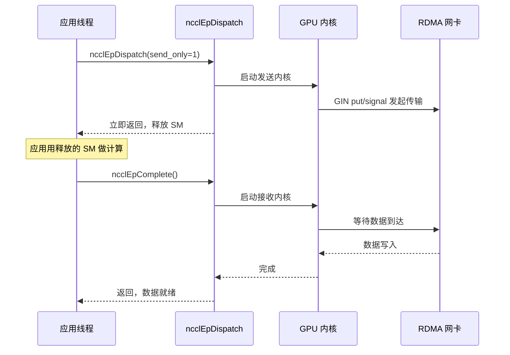
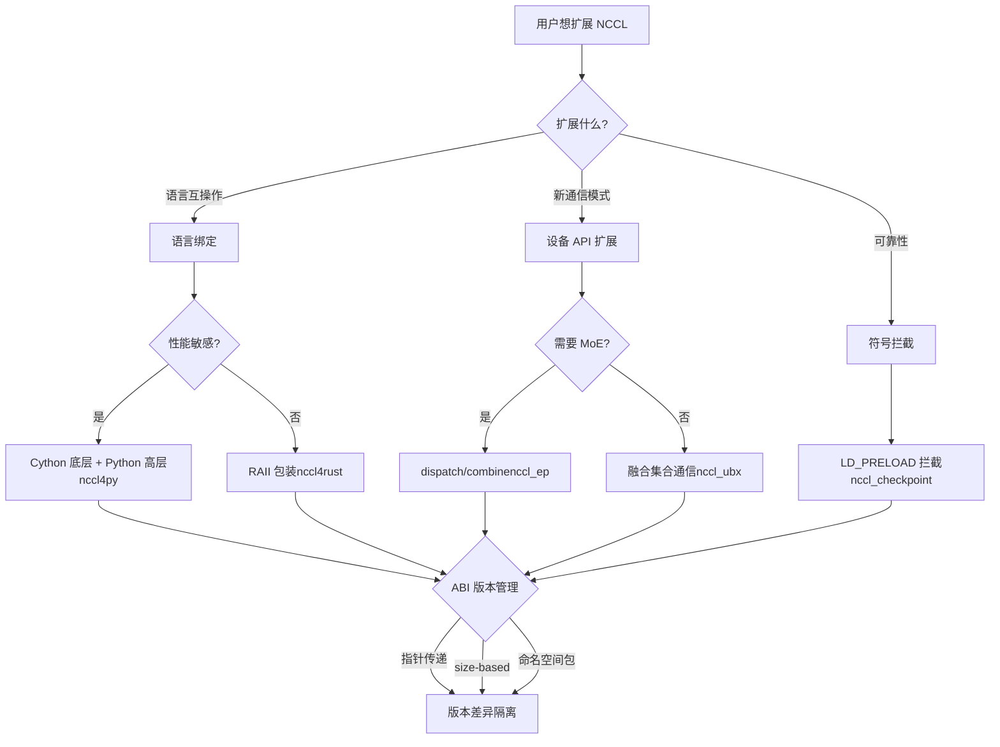

# Capítulo 23: Extensões do ecossistema: nccl4py, nccl4rust, nccl_ep, nccl_ubx e outros projetos periféricos

No capítulo anterior, investigamos falhas típicas do NCCL em ambientes de produção — uso incorreto da semântica de group, incompatibilidade no número de ranks, interação com streams, conflitos de versão ABI e timeouts de rede. A maioria desses problemas ocorre em cenários de uso direto da C ABI, enquanto frameworks modernos de treinamento de grandes modelos geralmente não chamam a C ABI diretamente, mas reutilizam as capacidades do NCCL por meio de bindings em linguagens como Python e Rust, ou com o auxílio de projetos de extensão voltados para cenários como MoE e comunicação de ultra-larga largura de banda. Esses projetos periféricos ficam nos diretórios bindings/ e contrib/, com posicionamento experimental e mantidos pela comunidade, sem herdar a garantia de qualidade de release da biblioteca principal. Este capítulo analisa um a um nccl4py, nccl4rust, nccl_ep, nccl_ubx e nccl_checkpoint, observando como eles constroem um ecossistema rico fora do núcleo por três caminhos: bindings de linguagem, extensão da API de dispositivo e interceptação de símbolos.

# nccl4py: bindings Cython e design de pacote de namespace

## Modelo intuitivo: traduzir a C ABI para algo que Python entende

Imagine que o núcleo do NCCL é um diplomata que só fala C, e um script de treinamento em Python é um estagiário que só fala Python. nccl4py é esse tradutor — ele não muda o que o diplomata diz (o comportamento do NCCL), apenas traduz «`ncclAllReduce(sendbuff, recvbuff, count, ...)`» para «`nccl.all_reduce(tensor)`». Sem essa camada de tradução, cada framework Python teria que escrever seus próprios bindings ctypes, o que seria trabalho repetitivo e propenso a erros.

## Estrutura em camadas: base em Cython + camada superior em Python

O design do nccl4py tem duas camadas: a base são os bindings Cython (`nccl/bindings/cynccl.pxd`), e a camada superior é a API Python (`nccl.core`). O README deixa explícita essa divisão em camadas[FACT:bindings/nccl4py/README.md:4-4]：

> `nccl4py provides low-level Cython bindings and a high-level Python API`

Os bindings Cython são distribuídos com o wheel na forma de arquivos`.pxd`, para que outras extensões Cython possam diretamente`cimport` [FACT:bindings/nccl4py/README.md:39-43]：

```cython
from nccl.bindings cimport cynccl
```

> **[Design Inference & Architectural Trade-offs]**
> Por que expor a camada Cython e não apenas a camada Python? Porque alguns frameworks (como DeepSpeed e Megatron) têm seus loops principais em Cython, e passar pelo interpretador Python a cada chamada tem custo alto demais. Diretamente`cimport cynccl`permite que extensões Cython chamem funções do NCCL com overhead próximo de zero, como em C. Esse é um design típico de “exposição em camadas” — a camada superior para usuários comuns, a camada inferior para cenários sensíveis a desempenho.

## Pacote de namespace: múltiplas distribuições compartilham o prefixo`nccl`de prefixo

Este é o design mais engenhoso do nccl4py.`nccl`é um pacote de namespace implícito PEP 420[FACT:bindings/nccl4py/README.md:50-51]：

> `nccl` is a PEP 420 implicit namespace package. nccl4py provides `nccl.bindings` and `nccl.core`; other NCCL extension distributions can provide additional `nccl.*` subpackages.

> **[Design Inference & Architectural Trade-offs]**
> Em pacotes Python tradicionais,`nccl/__init__.py`“possui” todo o namespace`nccl`. Se os bindings Python de nccl4py e nccl_ep quiserem ambos fornecer`nccl.xxx`, haverá conflito — quem instalar primeiro vence. Pacotes de namespace PEP 420 resolvem esse problema: sem`__init__.py`, múltiplas distribuições podem colocar subpacotes cada uma no diretório`nccl/`, e o sistema de importação do Python irá mesclá-los. Assim, nccl4py fornece`nccl.bindings`e`nccl.core`, nccl_ep fornece`nccl.ep`, e ambos podem coexistir[FACT:contrib/nccl_ep/README.md:80-82]。

Esse design é crucial para a expansão do ecossistema: no futuro, qualquer terceiro que queira adicionar`nccl.monitoring`、`nccl.profiling`não precisará alterar o código do nccl4py.

## Seleção de versão do CUDA: mecanismo de extra

Na instalação, use`nccl4py[cu12]`ou`nccl4py[cu13]`para selecionar a versão principal do CUDA[FACT:bindings/nccl4py/README.md:13-17]. O README explica o motivo: extras instalam as dependências correspondentes de runtime do NCCL e CUDA Python[FACT:bindings/nccl4py/README.md:19]. Wheels já publicados não precisam de`CUDA_HOME`nem do CUDA Toolkit local, mas compilar a partir do código-fonte exige[FACT:bindings/nccl4py/README.md:20-21]。

> **[Design Inference & Architectural Trade-offs]**
> Esta é a prática padrão do ecossistema Python para lidar com a fragmentação de versões do CUDA. As ABIs do CUDA 12 e 13 são incompatíveis, e não dá para usar um único wheel para todos os casos. Usar extra permite que o pip escolha a dependência binária correta de acordo com o ambiente do usuário, evitando descobrir a incompatibilidade de versão apenas em tempo de execução.

## Evitando armadilhas em produção

**Armadilha 1: conflito entre pacote de namespace e`__init__.py`.**Se algum pacote de terceiros colocar`nccl/`sob`__init__.py`, o mecanismo de pacote de namespace PEP 420 será quebrado, causando falha na importação de`nccl.core`. Método de diagnóstico:`python -c "import nccl; print(nccl.__path__)"`, se reportar`AttributeError`, isso indica que`nccl`não é um pacote de namespace.

**Armadilha 2: deriva de versão da ABI do Cython.** `cynccl.pxd`é uma API experimental[FACT:bindings/nccl4py/README.md:32-32], e quando o NCCL é atualizado,`.pxd`pode mudar. Extensões Cython que dependem de`cimport cynccl`devem corresponder estritamente à versão do nccl4py, caso contrário a resolução de símbolos em tempo de compilação falhará.

# nccl4rust: ownership RAII e limites do lado do dispositivo

## Modelo intuitivo: deixe o compilador gerenciar o ciclo de vida para você

Em C, você`ncclCommInitRank`obtém um communicator e, ao terminar, deve`ncclCommDestroy`. Esquecer de destruir causa vazamento; destruir cedo demais causa crash. O mecanismo RAII (Resource Acquisition Is Initialization) do Rust faz o compilador chamar automaticamente o destrutor quando a variável sai do escopo — como um cartão de quarto de hotel: ao fazer o check-out, o sistema liquida automaticamente, sem precisar ir manualmente à recepção.

O valor central do nccl4rust é aplicar essa semântica de ownership sobre a ABI C do NCCL.

## Estrutura em camadas: cinco crates com responsabilidades distintas

A tabela Layout do README lista cinco crates[FACT:contrib/nccl4rust/README.md:20-28]：

| Path | Purpose |
| --- | --- |
| `crates/nccl-sys` | ABI host bruta gerada pelo bindgen |
| `crates/nccl` | Wrapper host no estilo Rust + ownership RAII |
| `crates/nccl-device-sys` | `no_std`Declarações de dispositivo CUDA-Oxide |
| `crates/nccl-device` | Tipagem`DevComm`、`Team`、`Window`Wrapper |
| `shim/` | Shim puramente C-ABI, usando apenas headers públicos |

> **[Design Inference & Architectural Trade-offs]**
> Essa divisão é intencional. O README explica a motivação[FACT:contrib/nccl4rust/README.md:30-32]: aplicações host podem usar apenas`nccl`sem precisar do compilador Rust para GPU; kernels CUDA-Oxide usam`nccl-device`; consumidores que precisam da ABI bruta podem escolher o`-sys`crate. Esse "layering sob demanda" permite que diferentes usuários paguem apenas o custo de compilação que necessitam.

## Decisão de design chave: passar o comunicador de dispositivo por ponteiro em vez de por valor

Esta é a decisão de design mais digna de estudo no nccl4rust. A seção Host/device ownership boundary do README[FACT:contrib/nccl4rust/README.md:211-219]：

> `ncclDevCommCreate` produces a versioned public structure in host memory. The host `DeviceCommunicator` wrapper owns that structure and destroys it before its parent communicator. CUDA-Oxide remains responsible for allocating device memory, copying those bytes, and keeping the copy alive while kernels execute. Kernels construct `nccl_device::DevComm` from a pointer to that device copy. Using a pointer rather than a by-value Rust mirror keeps the versioned C struct layout out of the kernel argument ABI.

> **[Design Inference & Architectural Trade-offs]**
> Por que não espelhar structs C com structs Rust? Porque`ncclDevComm_t`é versionado — diferentes versões do NCCL podem ter campos diferentes. Se os parâmetros do kernel fossem passados por valor como um espelho Rust, a ABI do kernel ficaria vinculada ao layout da struct de uma versão específica do NCCL. Assim que o NCCL atualizasse a struct, todos os kernels já compilados precisariam ser recompilados. Passar por ponteiro transmite apenas um endereço; o kernel acessa via ponteiro, e mudanças de layout não afetam a ABI. Isso segue a mesma linha de raciocínio da`ncclEpLayoutInfo_t`ABI baseada em size discutida no capítulo anterior —**isolar diferenças de versão atrás de um ponteiro**。

## Fronteira de segurança: o que é unsafe

A seção Current API contracts do README lista seis contratos[FACT:contrib/nccl4rust/README.md:230-249], dos quais os principais são:

- O crate`-sys`bruto apenas espelha a ABI C, sem adicionar validação de ownership ou lifetime[FACT:contrib/nccl4rust/README.md:232-233]
- Os wrappers atuais de comunicação coletiva e ponto a ponto aceitam ponteiros de dispositivo brutos, declarados como`unsafe` [FACT:contrib/nccl4rust/README.md:42-45]
- Métodos de tradução de ponteiros retornam ponteiros de dispositivo brutos, incapazes de validar limites de offset, alinhamento, pertencimento a peer, aliasing ou lifetime de janela[FACT:contrib/nccl4rust/README.md:242-244]

> **[Design Inference & Architectural Trade-offs]**
> Esta é a dificuldade fundamental de fazer bindings Rust para NCCL: muitos contratos de API do NCCL exigem que "o buffer permaneça válido até a conclusão da CUDA stream", mas o sistema de tipos do Rust não consegue expressar esse evento assíncrono de "conclusão da stream". Portanto, esses métodos só podem ser`unsafe`, devolvendo a responsabilidade ao chamador. O README também aponta a direção de melhoria[FACT:contrib/nccl4rust/README.md:44-45]: uma abstração de buffer stream-aware poderia codificar esses requisitos em uma API segura. Isso é trabalho futuro.

## Lado do dispositivo: CUDA-Oxide e o shim LTOIR

O desafio central no lado do dispositivo é: a API de dispositivo do NCCL é um template C++, enquanto o código de dispositivo Rust (CUDA-Oxide) precisa de uma ABI C. A solução é um shim C++[FACT:contrib/nccl4rust/README.md:26]：

> `shim/` — CUDA C++ C-ABI shim built exclusively from public `nccl.h` and `nccl_device.h`

O shim é compilado para LTOIR (representação intermediária do LLVM) e linkado junto com o PTX Rust para formar o cubin[FACT:contrib/nccl4rust/README.md:165-167]. O README descreve o fluxo de build[FACT:contrib/nccl4rust/README.md:158-163]：

```bash
make device \
  NCCL_INCLUDE_DIR="$NCCL_INCLUDE_DIR" \
  CUDA_HOME="$CUDA_HOME" \
  ARCH=90
```

> **[Design Inference & Architectural Trade-offs]**
> LTOIR é o formato intermediário de otimização em tempo de link da NVIDIA. Usar LTOIR em vez de compilar diretamente para cubin permite que o shim e os kernels Rust façam otimizações cross-language em tempo de link — por exemplo, inlining de funções do shim nos kernels Rust. Esta é a tecnologia chave para programação híbrida "template C++ + kernel Rust".

## Armadilhas em produção

**Armadilha 1: A versão do NCCL deve corresponder exatamente.**O README exige explicitamente`Matching NCCL 2.31 headers and runtime` [FACT:contrib/nccl4rust/README.md:80-81], porque o protótipo inicializa diretamente campos que diferem em versões anteriores da API de dispositivo do NCCL. Incompatibilidade entre headers e`libnccl.so`versão causa desalinhamento de campos do comunicador de dispositivo.

**Armadilha 2: CUDA graph e comunicador de dispositivo.**O comunicador de dispositivo é uma estrutura versionada em memória host; após ser copiada para o dispositivo, o kernel a acessa via ponteiro. Se o CUDA graph capturar e embutir o ponteiro de dispositivo nos parâmetros do kernel, recriar o comunicador depois invalidará os ponteiros no graph. Isso tem a mesma origem do problema de realocação de buffer RDMA do nccl_ep.

**Armadilha 3: Inicialização segura não pode ser misturada com group bruto.**O README alerta[FACT:contrib/nccl4rust/README.md:238-239]: chamadas de inicialização segura e de gerenciamento que produzem saída não podem ser misturadas com o estado de`nccl-sys`group bruto, porque a camada de wrapper não consegue observar o estado do group bruto. A mistura faz com que a lógica de polling da camada de wrapper entre em conflito com a semântica do group bruto.

# nccl_ep: primitivas de dispatch/combine para paralelismo de especialistas

## Modelo intuitivo: o "centro de triagem" do MoE

No modelo MoE (Mixture of Experts), cada token precisa ser roteado para os top-k especialistas. Os especialistas estão distribuídos em GPUs diferentes, então os tokens precisam ser transferidos entre GPUs — isso é o dispatch. Após os especialistas computarem, os resultados precisam ser enviados de volta para a GPU onde o token original estava — isso é o combine. O nccl_ep é o motor de comunicação desse "centro de triagem".

Sem ele, cada framework MoE teria que implementar sua própria lógica de comunicação dispatch/combine, de forma repetitiva e difícil de otimizar. O nccl_ep transforma isso em uma primitiva padrão do ecossistema NCCL.

## Dois algoritmos: LL e HT

O README descreve dois algoritmos[FACT:contrib/nccl_ep/README.md:36-40]：

- **Low-Latency (LL)**: batch pequeno, sensível à latência (inferência LLM). Usa comunicação all-to-all ponto a ponto direta.
- **High-Throughput (HT)**: treinamento com batch grande e prefill de inferência. Usa comunicação hierárquica — agregação intra-nó via NVLink, inter-nó via RDMA. Aproveita o pipeline warp-specialized e TMA do Hopper.

> **[Design Inference & Architectural Trade-offs]**
> A divisão entre esses dois algoritmos reflete os diferentes gargalos de inferência e treinamento MoE. Na inferência, o batch é pequeno e a latência é o principal problema, então o LL usa ponto a ponto direto para evitar overhead de agregação. No treinamento, o batch é grande e a largura de banda é o principal problema, então o HT usa agregação hierárquica para reduzir o tráfego entre nós. Este é um design típico de "escolher o algoritmo com base nas características da carga de trabalho".

## Estrutura de dados central: ncclEpGroupConfig_t

Esta é a estrutura de configuração do EP, com muitos campos[FACT:contrib/nccl_ep/README.md:339-362]. Campos-chave:

- `size`e`version`: verificação de versão ABI, mesma origem do ABI baseado em size discutido no capítulo anterior[FACT:contrib/nccl_ep/README.md:340-341]
- `algorithm`: HT ou LL[FACT:contrib/nccl_ep/README.md:342]
- `max_dispatch_tokens_per_rank`: número máximo de tokens que um único rank pode despachar[FACT:contrib/nccl_ep/README.md:344]
- `rdma_buffer_size`: tamanho do buffer RDMA no modo LL[FACT:contrib/nccl_ep/README.md:356-356]
- `alloc`: alocador de memória de dispositivo personalizado[FACT:contrib/nccl_ep/README.md:359]

> **[Design Inference & Architectural Trade-offs]**
> `rdma_buffer_size`O`NCCL_EP_AUTO`A semântica de[FACT:contrib/nccl_ep/README.md:396-406]merece análise aprofundada. O README explica`ncclEpCreateGroup`: No modo AUTO, o buffer não é alocado em`ncclEpInitHandle`, mas sim na primeira`(layout, num_topk)`de acordo com o[FACT:contrib/nccl_ep/README.md:396-406]：

real. Quando handles subsequentes precisarem de buffers maiores, haverá realocação coletiva. Esse design de "alocação preguiçosa" evita que o usuário precise adivinhar o tamanho do buffer, mas introduz três restrições`(layout, num_topk)`1. Todos os ranks devem usar o mesmo`ncclEpInitHandle`

chamada sincronizada`send_only`2. A realocação descarta o conteúdo do buffer antigo,

dados temporariamente armazenados serão perdidos

**3. A captura de CUDA graph grava o ponteiro base do RDMA, e após a realocação é necessário recapturar**Esta é uma das armadilhas de produção mais importantes deste capítulo.

## A alocação preguiçosa de

`ncclEpTensor_t`troca por facilidade de uso, mas transfere a complexidade de "quando realocar" para o usuário.[FACT:contrib/nccl_ep/README.md:310-332]Descritores de tensor: duas formas, estática e dinâmica

**é um tipo de valor leve**. O README mostra dois usos:`NCCL_EP_TENSOR_INIT_INLINE`）[FACT:contrib/nccl_ep/README.md:806-809]：

```c
ncclEpTensor_t expert_counters = { NCCL_EP_TENSOR_INIT_INLINE,
                                   .ndim = 1, .datatype = ncclInt32,
                                   .data = expert_counters_data,
                                   .sizes = expert_counters_dims };
```

**(na pilha,**cópia`ncclEpTensorAlloc`）[FACT:contrib/nccl_ep/README.md:793-798]：

```c
ncclEpTensor_t* topk_idx = nullptr;
{
    size_t dims[2] = { num_tokens, top_k };
    ncclEpTensorAlloc(&topk_idx, 2, ncclInt64, dims, /*config=*/NULL);
    cudaMalloc(&topk_idx->data, num_tokens * top_k * sizeof(int64_t));
}
```

> **[Design Inference & Architectural Trade-offs]**
> cópia`sizes`〔Inferência de design e trade-offs arquiteturais〕`sizes`A diferença entre as duas formas está na propriedade do array[FACT:contrib/nccl_ep/README.md:325-326]. O`sizes`do descritor estático é um array na pilha pertencente ao chamador, que deve viver mais que o descritor`ncclEpTensorDestroy`. O[FACT:contrib/nccl_ep/README.md:514-514]do descritor dinâmico é uma cópia no heap pertencente à biblioteca, liberada por`ncclEpTensor_t*`. A estrutura pública mantém o ponteiro[FACT:contrib/nccl_ep/README.md:514-514], então as duas formas podem ser misturadas na mesma chamada

## . Esse design permite zero alocação no heap para cenários simples e conveniência de gerenciamento pela biblioteca para cenários complexos.

Modos de execução: síncrono e em estágios[FACT:contrib/nccl_ep/README.md:701-741]A seção Execution Modes do README

**descreve dois modos:**Modo síncrono[FACT:contrib/nccl_ep/README.md:705-709]。

**(padrão): ocupa recursos da GPU durante toda a operação, incluindo o tempo de espera pelo recebimento de dados**Modo em estágios[FACT:contrib/nccl_ep/README.md:718-726](apenas LL): a operação é dividida em duas fases, send e receive`send_only = 1`. Iniciada com`ncclEpComplete`, a transferência de dados é iniciada e os recursos da GPU são liberados; a aplicação pode usar esses recursos para computação e, por fim, usar[FACT:contrib/nccl_ep/README.md:728-741]。



cópia`send_only`Este diagrama de sequência mostra o valor central do modo em estágios:`ncclEpComplete`após iniciar com

## , retorna imediatamente, os recursos de SM são liberados para computação, e quando a aplicação terminar outro trabalho, chama

**para aguardar a conclusão do recebimento. Este é o padrão clássico de "sobreposição computação-comunicação".`ncclEpInitHandle`Evitando armadilhas em produção**Armadilha 1:`ncclEpInitHandle`A coletividade condicional de[FACT:contrib/nccl_ep/README.md:396-406]. No modo AUTO,

**é uma chamada coletiva condicional`ncclEpInitHandle`。**. Se um rank disparar realocação devido a um layout diferente, os outros ranks devem participar sincronizadamente. A falta de sincronização causa deadlock ou corrupção de dados.[FACT:contrib/nccl_ep/README.md:396-406]Armadilha 2: proibido`cudaStreamBeginCapture`durante a captura de CUDA graph`cudaStreamEndCapture`O README alerta explicitamente`ncclEpInitHandle`: No modo AUTO, não se pode chamar

**entre**e[FACT:contrib/nccl_ep/README.md:299-303]. Porque a realocação altera o endereço base do RDMA, e a captura do graph já gravou o ponteiro antigo.`NCCL_EP_DISABLE_GUARD=1`Armadilha 3: overhead do guard.

# O README menciona

## : O EP adiciona guard aos buffers de comunicação internos por padrão, para evitar que chamadas adjacentes de dispatch/combine corrompam dados entre si. Usuários avançados que já garantem que operações consecutivas não competem podem usar

A comunicação coletiva comum apenas move dados. Mas em modelos reais, antes do AllReduce geralmente é necessário fazer adição residual, e depois RMSNorm. Se essas operações forem feitas separadamente, os dados precisam percorrer a memória de vídeo várias vezes. A ideia do nccl_ubx é: fundir a adição residual, RMSNorm e quantização mxfp8 no kernel de comunicação coletiva[FACT:contrib/nccl_ubx/README.md:6-9]. Como uma empresa de mudanças que não só carrega caixas, mas também ajuda a empacotar e desempacotar, tudo em uma única viagem.

## Pré-requisito de hardware: é obrigatório ter NVLink multicast

O README exige explicitamente SM 9.0+ (Hopper/Blackwell), e o caminho do kernel MC requer hardware NVLink multicast[FACT:contrib/nccl_ubx/README.md:24-24]. SM 8.0 (A100) não é suportado, porque Ampere não tem hardware NVLink multicast,`multimem.*`e o PTX inline não consegue montar para arch 8.0[FACT:contrib/nccl_ubx/README.md:24-24]。

> **[Design Inference & Architectural Trade-offs]**
> Isso explica por que o ubx é "experimental" — ele depende da capacidade de NVLink multicast introduzida apenas no Hopper.`multimem.*`A instrução permite que uma GPU, com uma única instrução, escreva dados em endereços simétricos de múltiplas GPUs; essa é a base da comunicação coletiva acelerada por hardware. Sem esse hardware, a otimização central do ubx não se sustenta.

## Alocador simétrico: transformando tensores PyTorch em janelas NCCL

O núcleo do ubx é um alocador simétrico personalizado[FACT:contrib/nccl_ubx/README.md:11-14]：

> A central piece of the design is a custom symmetric allocator that provides zero-copy collective input/output buffers while remaining easy to plug into existing PyTorch code: tensors are ordinary `torch.Tensor` instances backed by an NCCL-managed symmetric window.

> **[Design Inference & Architectural Trade-offs]**
> Este é o ponto mais engenhoso do ubx. A memória simétrica do NCCL exige que todos os ranks usem o mesmo conjunto de endereços virtuais para acessar os buffers (conforme explicado no capítulo 14). Mas usuários de PyTorch estão acostumados a usar`torch.Tensor`. O ubx faz com que`torch.Tensor`o armazenamento subjacente de seja diretamente uma janela simétrica do NCCL, assim o código do usuário não precisa mudar, mas a comunicação coletiva pode ser zero-copy — os buffers de entrada e saída são a própria memória simétrica, sem necessidade de cópias adicionais.

## Variantes de comunicação coletiva e seleção automática

A tabela Available collectives do README[FACT:contrib/nccl_ubx/README.md:90-90]：

| Op | Variants | Auto-select |
| --- | --- | --- |
| AllReduce | `mc`, `uc`, `lamport`, `auto` | Lamport ≤ 0.25 MB, else MC |
| AllToAll | `uc`, `lamport`, `auto` | Lamport ≤ 0.25 MB, else UC |
| AllGather | `mc` | — |

> **[Design Inference & Architectural Trade-offs]**
> As diferenças entre as três variantes:`mc`usa hardware NVLink multicast,`uc`usa unicast comum,`lamport`é um algoritmo de baixa latência. A seleção automática usa o limite de 0.25 MB — mensagens pequenas usam Lamport de baixa latência, mensagens grandes usam MC/UC de alta largura de banda. Esse limiar é semelhante à lógica de tuning do núcleo do NCCL, mas o ubx simplificou para um limiar fixo.

## Operações fundidas: residual + RMSNorm

O README menciona[FACT:contrib/nccl_ubx/README.md:103-103]：

> `SymmAllocator.allreduce_mc()` and `allreduce_lamport()` accept optional `gamma`/`residual_in` parameters to fuse residual addition + RMSNorm into the same kernel.

> **[Design Inference & Architectural Trade-offs]**
> Este é o principal atrativo do ubx. O fluxo tradicional é: AllReduce → adição residual → RMSNorm, três leituras e escritas na memória de vídeo. Após a fusão, um único kernel conclui tudo, economizando 2/3 da largura de banda de memória de vídeo. Para treinamento de modelos grandes limitados por largura de banda, isso é um ganho real de velocidade.

## MoE token dispatch + quantização mxfp8

O README descreve`a2av_token_bf16_mxfp8` [FACT:contrib/nccl_ubx/README.md:103-103]：

> a single GPU kernel that routes bf16 tokens to remote ranks while quantizing them to mxfp8 (E8M0 scale per 32 elements) on the fly.

> **[Design Inference & Architectural Trade-offs]**
> Este kernel funde "roteamento + quantização". bf16 tem 16 bits, mxfp8 tem 8 bits; após a quantização, o volume de dados cai pela metade, e a necessidade de largura de banda para transmissão entre nós também cai pela metade. Quantizar antes da transmissão é melhor do que quantizar depois — o que se economiza é largura de banda de rede, não largura de banda de memória de vídeo. Esta é uma otimização crucial para inferência de MoE.

## Evitando armadilhas em produção

**Armadilha um:`TORCH_CUDA_ARCH_LIST`deve obrigatoriamente ter o`a`sufixo.**O README enfatiza[FACT:contrib/nccl_ubx/README.md:47-56]: use o`a`sufixo para garantir acesso ao conjunto completo de instruções`multimem.*`. Algumas variantes específicas de aceleração não estão disponíveis em`9.0`/`10.0`comum; kernels futuros que usarem essas variantes terão degradação silenciosa de desempenho ou falha de montagem.

**Armadilha dois:`UBX_BUILD_TIMEOUT`o custo de runtime de**O README explica[FACT:contrib/nccl_ubx/README.md:47-56]: definir como 1 fará o kernel compilar um timeout de spinloop, aumentando o custo de runtime (verificações extras de`clock64()`e`printf`no timeout). Ative apenas ao investigar travamentos.

**Armadilha três:`NCCL_NVLS_ENABLE=0`a degradação de**O README lista esta variável de ambiente[FACT:contrib/nccl_ubx/README.md:202]: definir como 0 permite executar sem NVLink multicast. Mas o caminho do kernel MC deixa de funcionar, restando apenas as variantes UC/Lamport, com queda acentuada de desempenho.

# nccl_checkpoint: interceptação via LD_PRELOAD e replay de estado

## Modelo intuitivo: tirar um snapshot do domínio de comunicação

Uma tarefa de treinamento roda por horas e de repente precisa migrar para outra máquina, ou salvar o estado para recuperação. Checkpoints comuns salvam apenas os pesos do modelo e o estado do otimizador, mas o estado do domínio de comunicação NCCL (numeração de rank, conexões, buffers) não pode ser serializado diretamente. A ideia do nccl_checkpoint é: interceptar todas as chamadas NCCL, registrar as etapas de inicialização e, na recuperação, reproduzir essas etapas[FACT:contrib/nccl_checkpoint/README.md:3-7]。

Como gravar cada passo da montagem de um móvel e, após a mudança, remontá-lo seguindo a gravação, em vez de tentar transportar o móvel já montado inteiro.

## Mecanismo central: interceptação de símbolos via LD_PRELOAD

A seção Design do README[FACT:contrib/nccl_checkpoint/README.md:17-20]：

> The application is launched with `LD_PRELOAD=/path/to/libnccl-checkpoint-shim.so` in the environment. This allows the library to intercept all calls to NCCL functions to capture all resource initialization steps.

> **[Design Inference & Architectural Trade-offs]**
> `LD_PRELOAD`é um mecanismo do linker dinâmico do Linux: carregar o`.so`especificado antes que a aplicação carregue normalmente as bibliotecas compartilhadas. Se esse`.so`definir símbolos com o mesmo nome do NCCL (por exemplo,`ncclCommInitRank`), o linker dinâmico dará prioridade à versão em`.so`. Assim, o shim pode interceptar todas as chamadas NCCL, registrar os parâmetros e depois reproduzi-los na recuperação.

## Fluxo de checkpoint

O exemplo em Python do README[FACT:contrib/nccl_checkpoint/README.md:44-58]mostra o fluxo completo:

```python
nccl_checkpoint.checkpoint_prepare()
drv.cuCheckpointProcessLock(os.getpid(), None)
drv.cuCheckpointProcessCheckpoint(os.getpid(), None)
# CRIU dump happens here.
drv.cuCheckpointProcessRestore(os.getpid(), None)
drv.cuCheckpointProcessUnlock(os.getpid(), None)
nccl_checkpoint.checkpoint_restore()
```

> **[Design Inference & Architectural Trade-offs]**
> O fluxo divide-se em quatro passos:

1. `checkpoint_prepare()`: destruir todos os communicators, permitindo que o CUDA Checkpoint e o CRIU façam dump seguro do estado do processo[FACT:contrib/nccl_checkpoint/README.md:25-27]

2. `cuCheckpointProcessLock/Checkpoint`: o driver CUDA bloqueia o processo e faz o checkpoint

3. CRIU dump: ferramentas externas fazem dump da memória do processo e dos descritores de ficheiro para o disco

4. `cuCheckpointProcessRestore/Unlock` + `checkpoint_restore()`: restaurar o processo, reproduzir a configuração NCCL[FACT:contrib/nccl_checkpoint/README.md:29-31]

## Redis KVS: rendezvous entre máquinas

O README explica porque é necessário o Redis[FACT:contrib/nccl_checkpoint/README.md:33-38]：

> Because it is useful to restore on different hardware, IP addresses may have changed. There is no convenient way to directly inform the NCCL Checkpoint library of all peer addresses during the restore process, so the library depends on a temporary Redis Key-Value store to be made available.

> **[Design Inference & Architectural Trade-offs]**
> Na recuperação pode haver mudança de máquina e o IP muda. A reconstrução do domínio de comunicação NCCL precisa de conhecer os novos endereços de todos os peers. Mas o shim não consegue saber diretamente esses endereços, por isso usa-se um Redis KVS para rendezvous — todos os processos escrevem os novos endereços no KVS e leem do KVS os endereços dos outros processos. É como depois de mudar de casa combinar trocar os novos endereços num quadro de mensagens público.

O README indica que o Redis só é necessário na fase de arranque da recuperação[FACT:contrib/nccl_checkpoint/README.md:221-221]，`checkpoint_restore()`depois do retorno já pode ser desligado.

## Limitações: três não suportados

A secção Limitations do README[FACT:contrib/nccl_checkpoint/README.md:119-129]lista três limitações:

1. `ncclWinGetUserPtr()`o ponteiro retornado é inválido após a recuperação[FACT:contrib/nccl_checkpoint/README.md:125-126]

2. Não suporta captura de CUDA graph[FACT:contrib/nccl_checkpoint/README.md:136-136]

3. Não suporta device API——`ncclDevComm`objetos e o dispositivo visível`ncclWindow_t`valores não podem ser recuperados[FACT:contrib/nccl_checkpoint/README.md:136-136]

> **[Design Inference & Architectural Trade-offs]**
> A terceira limitação é a mais grave. A device API é a nova direção do NCCL (DevComm abordado no capítulo 19), mas o checkpoint não a suporta. Isto significa que aplicações que usam device API (por exemplo nccl_ep, nccl_ubx) não podem ser recuperadas com checkpoint. É o reflexo da fragmentação do ecossistema — as novas funcionalidades avançam depressa, mas as ferramentas de fiabilidade não acompanham.

## Evitar armadilhas em produção

**Armadilha um:`NCCL_CHECKPOINT_KVS_PATH`definir antes do checkpoint, não pode ser alterado na recuperação.**O README avisa[FACT:contrib/nccl_checkpoint/README.md:221-221]: esta variável de ambiente não é usada na fase de preparação do checkpoint, mas será capturada no checkpoint e não pode ser facilmente modificada na recuperação. Por isso tem de ser definida antes do checkpoint, e o endereço do Redis no ambiente de recuperação tem de corresponder.

**Armadilha dois:`NCCL_CHECKPOINT_KVS_TIMEOUT`cobre apenas o Redis rendezvous do shim.**O README explica[FACT:contrib/nccl_checkpoint/README.md:221-221]: por omissão 300 segundos. Assim que a reprodução do communicator entra na fase de estabelecimento de transporte NCCL, as chamadas de transporte NCCL subjacentes usam o seu próprio comportamento e podem precisar de diagnóstico específico do transporte. Ou seja, o timeout só protege a fase Redis; um bloqueio na fase de estabelecimento de transporte tem de ser investigado com`NCCL_DEBUG`.

**Armadilha três: a versão do NCCL tem de corresponder.**O README exige NCCL 2.31.0 ou mais recente[FACT:contrib/nccl_checkpoint/README.md:158], e recomenda que`NCCL_SRC`a versão do NCCL no caminho corresponda exatamente à versão da biblioteca NCCL em runtime[FACT:contrib/nccl_checkpoint/README.md:156-158]. Uma incompatibilidade de versões provoca desalinhamento do layout das estruturas na reprodução.

# Reflexão de design: três modos de extensão do ecossistema

Revendo estes cinco projetos, é possível resumir três modos de extensão do ecossistema NCCL:

**Modo um: bindings de linguagem (nccl4py, nccl4rust).**O desafio central é a propriedade e o ciclo de vida. A ABI de C não tem semântica de propriedade, a camada de binding tem de a compensar. O nccl4py usa camadas Cython, o nccl4rust usa RAII +`unsafe`fronteira. O ponto comum é:**isolar as diferenças de versão atrás de ponteiros**——o nccl4rust passa DevComm por ponteiro, o nccl4py isola versões com pacotes de namespace.

**Modo dois: extensão da device API (nccl_ep, nccl_ubx).**O desafio central é a gestão de versões da ABI e o ciclo de vida dos recursos. O nccl_ep usa ABI baseada em size (detalhado no capítulo anterior), o nccl_ubx usa alocador simétrico. O ponto comum é:**alocação preguiçosa + realocação coletiva**——o RDMA buffer do nccl_ep e o pool simétrico do nccl_ubx são alocados a pedido, mas a realocação exige sincronização de todos os ranks.

**Modo três: interceção de símbolos (nccl_checkpoint).**O desafio central é a captura e reprodução de estado. Usa`LD_PRELOAD`para intercetar todas as chamadas NCCL, registar os passos de inicialização e reproduzir na recuperação. Este modo não altera o núcleo do NCCL, mas consegue adicionar capacidade de checkpoint de forma transparente a aplicações existentes.

> **[Design Inference & Architectural Trade-offs]**
> A restrição comum aos três modos é**a compatibilidade de versões do NCCL**. Todos os projetos exigem correspondência exata da versão do NCCL, porque a ABI do NCCL está em evolução. Isto reflete uma tensão fundamental do ecossistema NCCL: o núcleo itera rapidamente, mas os projetos em volta precisam de estabilidade. ABI baseada em size, passagem por ponteiro e pacotes de namespace são todos meios técnicos para mitigar esta tensão.



Este diagrama de decisão mostra o caminho de escolha para estender o NCCL. Independentemente do caminho seguido, no fim há sempre que enfrentar o problema central da gestão de versões da ABI, e os três meios técnicos (passagem por ponteiro, ABI baseada em size, pacotes de namespace) isolam as diferenças de versão atrás de interfaces estáveis.

# Resumo do capítulo

Este capítulo analisou cinco projetos periféricos do ecossistema NCCL:

- **nccl4py**Usar Cython em camadas + pacotes de namespace PEP 420, permitindo que o ecossistema Python se estenda sem conflitos`nccl.*`subpacotes.
- **nccl4rust**Usar propriedade RAII + passar o comunicador de dispositivo por ponteiro, isolando o layout versionado da struct C fora da ABI do kernel.
- **nccl_ep**Usar algoritmos duplos LL/HT + alocação preguiçosa de buffers RDMA, fornecendo primitivas dispatch/combine para MoE, mas introduzindo restrições de chamadas coletivas condicionais e invalidação de CUDA graph.
- **nccl_ubx**Usar alocador simétrico + fusão de kernels, incorporando adição residual, RMSNorm e quantização mxfp8 nos kernels de comunicação coletiva, mas dependendo do hardware NVLink multicast do Hopper+.
- **nccl_checkpoint**Usar`LD_PRELOAD`interceptação de símbolos + rendezvous com Redis, implementando checkpoint de domínio de comunicação entre máquinas, mas sem suporte a API de dispositivo e CUDA graph.

# Reflexões e autoavaliação deste capítulo

Q1: No modo`rdma_buffer_size = NCCL_EP_AUTO`do nccl_ep, se o rank 0 chamar primeiro`ncclEpInitHandle`e disparar realocação de buffer, enquanto o rank 1, por ter layout diferente, não disparar realocação, o que acontece? Analise combinando com as restrições de[FACT:contrib/nccl_ep/README.md:396-406].

**Análise de referência**: O README afirma explicitamente[FACT:contrib/nccl_ep/README.md:396-406]：`All ranks must call ncclEpInitHandle in lockstep with the same (layout, num_topk)`. No modo AUTO,`ncclEpInitHandle`é uma chamada coletiva condicional — se a realocação é disparada depende de o`(layout, num_topk)`daquele handle precisar de espaço maior que o buffer atual.

Se o layout do rank 0 precisar de um buffer maior e disparar realocação, enquanto o layout do rank 1 não precisar, então o rank 0 executará a operação coletiva "deregister window → free → ncclMemAlloc → register"[FACT:contrib/nccl_ep/README.md:396-406], enquanto o rank 1 não. Isso causa dois problemas:

1. **Operações coletivas incompatíveis**: O window deregister/register do NCCL é uma operação coletiva que exige a participação de todos os ranks. A execução unilateral do rank 0 fará com que o rank 1 referencie o handle de janela antigo em comunicações subsequentes, enquanto o rank 0 já trocou para uma nova janela, causando falha de comunicação ou corrupção de dados.

2. **Base inconsistente**: Após a realocação, o endereço base RDMA do rank 0 muda, enquanto o do rank 1 não. Embora o README diga "recorded layout offsets on every live handle are pure offsets relative to the group's rdma_buffer and resolve correctly against the new base"[FACT:contrib/nccl_ep/README.md:396-406], isso só é válido sob a premissa de que todos os ranks realocaram. O endereço base do rank 1 não mudou, o do rank 0 mudou, e a resolução de endereços entre ranks ficará desalinhada.

A abordagem correta é: todos os ranks usarem o mesmo`(layout, num_topk)`para chamar sincronizadamente`ncclEpInitHandle`, garantindo decisões de realocação consistentes. Se isso não puder ser garantido, deve-se usar o modo explícito`rdma_buffer_size > 0`, alocando um buffer suficientemente grande de uma vez em`ncclEpCreateGroup`, evitando realocação em tempo de execução[FACT:contrib/nccl_ep/README.md:396-406]。

Q2: Por que nccl4rust passa`ncclDevComm_t`por ponteiro em vez de por valor para o kernel de dispositivo? Se fosse alterado para passagem por valor, o que aconteceria após o NCCL atualizar o layout da struct? Analise combinando com[FACT:contrib/nccl4rust/README.md:211-219].

**Análise de referência**: O README afirma explicitamente[FACT:contrib/nccl4rust/README.md:217-219]：`Kernels construct nccl_device::DevComm from a pointer to that device copy. Using a pointer rather than a by-value Rust mirror keeps the versioned C struct layout out of the kernel argument ABI.`

`ncclDevComm_t`é uma struct pública versionada, e diferentes versões do NCCL podem ter campos diferentes. Se passada por valor:

1. **A ABI do kernel vincula o layout da struct**: Quando parâmetros de kernel são passados por valor, o compilador incorpora o layout de bytes de toda a struct na convenção de chamada do kernel. Após o NCCL atualizar a struct (adicionar campos, alterar ordem de campos, alterar alinhamento), kernels já compilados ainda interpretarão os parâmetros pelo layout antigo, causando desalinhamento de campos.

2. **Todos os kernels precisam ser recompilados**: Cada atualização do NCCL exige recompilar todos os kernels que usam o comunicador de dispositivo. Para tarefas de treinamento implantadas em muitas máquinas, isso é um enorme fardo operacional.

3. **Incompatibilidade entre versões**: Se o lado host criar o comunicador com o novo NCCL e o kernel do lado dispositivo for compilado com o NCCL antigo, a passagem por valor fará o kernel ler campos errados.

Com passagem por ponteiro, passa-se apenas um endereço de 8 bytes, e o kernel acessa a struct através do ponteiro. Quando o NCCL atualiza o layout da struct, desde que o lado host crie o comunicador com a nova versão e copie para o dispositivo, o kernel acessará o novo layout através do ponteiro. O kernel em si não precisa ser recompilado, pois seu parâmetro é apenas um endereço. Isso isola as diferenças de versão atrás do ponteiro —**o ponteiro é estável, o conteúdo apontado pelo ponteiro pode mudar**。

Isso é a mesma filosofia de design da ABI baseada em tamanho do nccl_ep: usar uma camada de indireção para isolar detalhes de versão voláteis atrás de uma interface estável.

Q3: nccl_checkpoint usa`LD_PRELOAD`para interceptar chamadas NCCL, mas se a aplicação linkar simultaneamente nccl4py e nccl_checkpoint, e a ligação Cython do nccl4py chamar diretamente o símbolo de`libnccl.so`,`LD_PRELOAD`consegue interceptar? Analise a ordem de resolução de símbolos.

**Análise de referência**: Isso depende da ordem de resolução de símbolos.`LD_PRELOAD`é o mecanismo: o linker dinâmico, antes de carregar as bibliotecas compartilhadas das quais a aplicação depende normalmente, carrega primeiro`LD_PRELOAD`o`.so`especificado por`LD_PRELOAD`Quando a aplicação (ou as bibliotecas das quais depende) referencia um símbolo, o linker dinâmico procura na ordem de "primeiro carregado, primeiro resolvido" —`.so`de`libnccl.so`。

tem prioridade sobre`ncclCommInitRank`Portanto, em teoria, quando o binding Cython do nccl4py chama`libnccl-checkpoint-shim.so`o linker dinâmico encontrará primeiro o símbolo de mesmo nome em

intercepção bem-sucedida. Mas há alguns casos limite:

1. **Direto`dlopen` + `dlsym`**: se o nccl4py usar`dlopen("libnccl.so")`e depois`dlsym`para obter o ponteiro de função,`LD_PRELOAD`não consegue interceptar, porque`dlsym`procura o símbolo diretamente no`.so`especificado, sem passar pela tabela global de símbolos. O README menciona que aplicações C usam`dlsym`para resolver`ncclCheckpointPrepare` [FACT:contrib/nccl_checkpoint/README.md:109-109]mas isso é para resolver os símbolos do próprio checkpoint, não os símbolos do NCCL.

2. **Momento de binding de símbolos**: se o nccl4py vincular os símbolos do NCCL antes de`LD_PRELOAD`entrar em vigor (por exemplo, em`__attribute__((constructor))`), a intercepção pode falhar. Mas em condições normais`LD_PRELOAD`entra em vigor na inicialização do processo, antes de qualquer código do usuário.

3. **`RTLD_DEEPBIND`**: se o nccl4py usar`dlopen`especificando`RTLD_DEEPBIND`a procura de símbolos será resolvida prioritariamente dentro de`libnccl.so`contornando`LD_PRELOAD`Esta é uma armadilha comum.

4. **Linkagem estática**: se o nccl4py vincular estaticamente o NCCL,`LD_PRELOAD`é completamente ineficaz, porque os símbolos já foram resolvidos em tempo de compilação.

Portanto, a conclusão é:**Em cenários normais de linkagem dinâmica,`LD_PRELOAD`consegue interceptar as chamadas do nccl4py**, mas se o nccl4py usar`dlopen` + `RTLD_DEEPBIND`ou linkagem estática, a intercepção falhará. Em uso de produção, deve-se usar`LD_DEBUG=bindings`para verificar o binding de símbolos, confirmando que as chamadas do NCCL são interceptadas pelo shim.

No próximo capítulo, voltar-nos-emos para a evolução arquitetural e direções futuras, para ver como o NCCL evolui de uma biblioteca de comunicação coletiva para um motor de comunicação programável.

Esses projetos periféricos, por meio de bindings de linguagem, extensões de API de dispositivo e intercepção de símbolos, demonstram como as capacidades centrais do NCCL são reutilizadas em diferentes cenários. E a restrição central que atravessa todos os projetos é a compatibilidade de versão da ABI do NCCL — ABI baseada em tamanho, passagem de ponteiros e pacotes de namespace são todos meios técnicos de isolar diferenças de versão atrás de interfaces estáveis. Compreender esses meios é o pré-requisito para usar com segurança esses projetos periféricos. Quando esses projetos de extensão continuamente testam os limites do núcleo, o próprio NCCL também evolui silenciosamente: de operações coletivas fixas para um motor de comunicação programável, de host proxy para envio direto pela GPU, de buffers registrados para memória simétrica. No próximo capítulo, com base nos vestígios de evolução no código-fonte, discutiremos como essas mudanças remodelarão a forma de comunicação das camadas superiores.
