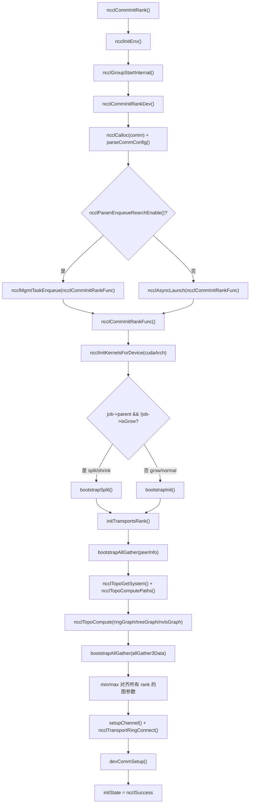
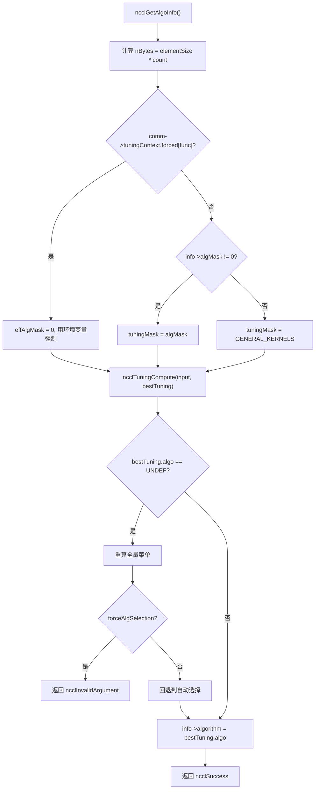
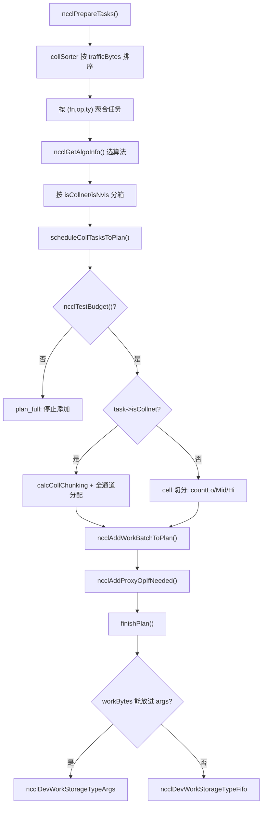

# Capítulo 25: Revisão panorâmica e reflexões: a jornada final de um AllReduce e a essência do design

No capítulo anterior, com base nos vestígios de evolução no código-fonte, vislumbramos a tendência arquitetural do NCCL de operações de conjunto fixas para programável, de host proxy para envio direto pela GPU, de buffers registrados para memória simétrica. Agora, é hora de colocar essas tendências de volta em um fluxo de execução concreto para verificá-las. Este capítulo não introduz nenhum código novo, mas reconecta a cadeia ponta a ponta do Capítulo 3 ao Capítulo 10 — começando pela linha de chamada ncclAllReduce, até a escrita do resultado de volta na memória de vídeo. Após a leitura, você deverá ser capaz de responder claramente: por quais funções um AllReduce realmente passa? Em qual arquivo e em qual linha está cada função? Qual capítulo consultar ao encontrar problemas?

# I. Inicialização: como o domínio de comunicação "cresce"

## Modelo intuitivo

Imagine o domínio de comunicação como um "grupo de chat". Quando você chama`ncclCommInitRank`é como "solicitar entrada no grupo de chat", e o NCCL precisa neste momento determinar completamente a lista de membros do grupo (peerInfo), quem se conecta a quem por qual linha (grafo de topologia) e quantos pipelines cada linha abre (channel).**Se este passo estiver errado, toda a comunicação posterior estará errada**— como se alguém não tivesse sido incluído no grupo de chat, e suas mensagens nunca chegassem a uma pessoa.

## Estruturas de dados e layout de memória

A estrutura central do domínio de comunicação é`ncclComm`, e sua inicialização é dividida em duas partes:`commAlloc`é responsável por "alocar o esqueleto",`initTransportsRank`é responsável por "preencher a carne".

`commAlloc`O mais notável em**é o design de**contagem de referência de recursos compartilhados`ncclSharedResources`. Quando um subdomínio de comunicação (gerado por split/shrink) reutiliza recursos do domínio pai, ele não copia uma instância, mas compartilha o mesmo

[FACT:src/init.cc:533-555]

```cpp
if (parent == NULL || !parent->shareResources) {
    struct ncclSharedResources* sharedRes;
    NEW_NOTHROW(sharedRes, ncclSharedResources);
    sharedRes->owner = comm;
    ...
    comm->sharedRes = sharedRes;
    sharedRes->refCount = 1;
    NCCLCHECK(ncclNetInit(comm));
    NCCLCHECK(ncclRmaInit(comm));
    NCCLCHECK(ncclGinInit(comm));
} else {
    comm->sharedRes = parent->sharedRes;
    ncclAtomicRefCountIncrement(&parent->sharedRes->refCount);
    NCCLCHECK(ncclNetInitFromParent(comm, parent));
    NCCLCHECK(ncclRmaInitFromParent(comm, parent));
}
```

Copiar`refCount`A intenção deste código é clara: recursos "pesados" como plugins de rede, RMA e GIN são inicializados apenas uma vez, e os subdomínios de comunicação os emprestam diretamente.

usa operações atômicas para incrementar, garantindo que não haja liberação duplicada em multithread.`commAlloc`Outro ponto-chave é**a inicialização de**canais em`id = -1`. Todos os canais são primeiro marcados como "não inicializados" (`setupChannel`), e somente depois

[FACT:src/init.cc:607-608]

```cpp
// Mark channels as non initialized.
for (int c = 0; c channels[c].id = -1;
```

Copiar`-1`Este`id == -1`é um valor sentinela. Se qualquer código usar erroneamente um canal não inicializado,

## exporá o problema imediatamente, em vez de ler um monte de memória aleatória.

Passo a passo: de ncclCommInitRank a initTransportsRank`ncclCommInitRank`Após o usuário chamar

1. `ncclCommInitRank`, o fluxo de execução real é assim:`ncclInitEnv`primeiro chama`ncclGroupStartInternal`para carregar o plugin de ambiente, depois chama

para entrar na semântica de group (isso é para suportar "inicializar múltiplos domínios de comunicação em um único group").`ncclCommInitRankDev`2. Em seguida, chama`comm`, que faz validação de parâmetros, aloca a estrutura**, analisa a config, e então**：

[FACT:src/init.cc:2923-2929]

```cpp
if (ncclParamEnqueueRearchEnable()) {
    NCCLCHECKGOTO(ncclMgmtTaskEnqueue((struct ncclAsyncJob*)job, ncclCommInitRankFunc, ncclCommInitJobFree, comm), res, fail);
} else {
    NCCLCHECKGOTO(ncclAsyncLaunch((struct ncclAsyncJob*)job, ncclCommInitRankFunc, NULL, ncclCommInitJobFree, comm), res, fail);
}
```

Copiar`ncclParamEnqueueRearchEnable()`Observe o branch`ncclAsyncLaunch`aqui — este é um vestígio da "refatoração de enqueue" em andamento no NCCL. Por padrão, segue`ncclMgmtTaskEnqueue`, e com a refatoração habilitada, segue`ncclCommInitRankFunc`。

3. `ncclCommInitRankFunc`. Ambos os caminhos eventualmente chamam

[FACT:src/init.cc:2119-2127]

```cpp
timers[TIMER_INIT_TOTAL] = clockNano();
CUDACHECKGOTO(cudaSetDevice(cudaDev), res, fail);
CUDACHECKGOTO(cudaDeviceGetAttribute(&maxSharedMem, cudaDevAttrMaxSharedMemoryPerBlockOptin, cudaDev), res, fail);
CUDACHECKGOTO(cudaDeviceGetAttribute(&archMajor, cudaDevAttrComputeCapabilityMajor, cudaDev), res, fail);
CUDACHECKGOTO(cudaDeviceGetAttribute(&archMinor, cudaDevAttrComputeCapabilityMinor, cudaDev), res, fail);
cudaArch = 100 * archMajor + 10 * archMinor;

timers[TIMER_INIT_KERNELS] = clockNano();
NCCLCHECKGOTO(ncclInitKernelsForDevice(cudaArch, maxSharedMem, &maxLocalSizeBytes), res, fail);
```

`cudaArch = 100 * archMajor + 10 * archMinor`Copiar

4. Em seguida, dependendo se é uma inicialização normal ou split/shrink/grow, segue caminhos de bootstrap diferentes:

[FACT:src/init.cc:2136-2191]

```cpp
if (job->parent && !job->isGrow) {
    // SPLIT/SHRINK: use bootstrapSplit
    ...
    NCCLCHECKGOTO(bootstrapSplit(comm->commHash, comm, job->parent, job->color, job->key, parentRanks), res, fail);
} else {
    // GROW or NORMAL INIT: use bootstrapInit
    ...
    NCCLCHECKGOTO(bootstrapInit(job->nId, (struct ncclBootstrapHandle*)job->commId, comm, job->parent), res, fail);
}
```

5. Por fim, chama`initTransportsRank`, que é a função mais pesada de toda a inicialização (cerca de 800 linhas). Internamente, ela realiza dois AllGather:

- **AllGather1**: troca`ncclPeerInfo`(informações do dispositivo de cada rank, host hash, pid hash, GPU UUID, etc.):

[FACT:src/init.cc:1236-1239]

```cpp
NCCLCHECKGOTO(ncclCalloc(&comm->peerInfo, nranks + 1), ret, fail); // Extra rank to represent CollNet root
NCCLCHECKGOTO(fillInfo(comm, comm->peerInfo + rank, comm->commHash), ret, fail);
NCCLCHECKGOTO(bootstrapAllGather(comm->bootstrap, comm->peerInfo, sizeof(struct ncclPeerInfo)), ret, fail);
COMPILER_ATOMIC_STORE(&comm->peerInfoValid, true, std::memory_order_release);
```

Atenção à`nranks + 1`esta alocação — a posição extra é para o CollNet root.`peerInfoValid`usa semântica release para armazenar, garantindo que quando outras threads virem este flag, o conteúdo de peerInfo já esteja visível.

- **AllGather3**: troca os resultados do cálculo de topologia (estrutura ring/tree calculada por cada rank, largura de banda, número de canais, etc.), e então pega o**valor mínimo**de todos os ranks para alinhar:

[FACT:src/init.cc:1687-1703]

```cpp
for (int i = 0; i nChannels = std::min(allGather3Data[i].graphInfo[a].nChannels, graphs[a]->nChannels);
        graphs[a]->sameChannels = std::min(allGather3Data[i].graphInfo[a].sameChannels, graphs[a]->sameChannels);
        graphs[a]->bwIntra = std::min(allGather3Data[i].graphInfo[a].bwIntra, graphs[a]->bwIntra);
        graphs[a]->bwInter = std::min(allGather3Data[i].graphInfo[a].bwInter, graphs[a]->bwInter);
        graphs[a]->typeIntra = std::max(allGather3Data[i].graphInfo[a].typeIntra, graphs[a]->typeIntra);
        graphs[a]->typeInter = std::max(allGather3Data[i].graphInfo[a].typeInter, graphs[a]->typeInter);
        graphs[a]->crossNic = std::max(allGather3Data[i].graphInfo[a].crossNic, graphs[a]->crossNic);
    }
    ...
}
```

Largura de banda pega o min, tipo pega o max — este é o "princípio do barril": o desempenho de todo o domínio de comunicação é determinado pelo rank mais lento. Se não houver alinhamento, ranks diferentes podem calcular escolhas de algoritmo diferentes, causando deadlock na comunicação.

## Fluxograma de inicialização



## Reflexões de design e armadilhas

**Por que a inicialização precisa ser assíncrona?**Porque a inicialização multi-rank requer sincronização entre processos (bootstrap); se executada de forma síncrona, bloquearia a thread chamadora. Após tornar assíncrona, o usuário pode inicializar múltiplos domínios de comunicação simultaneamente no group, avançando em paralelo.

**Armadilhas**：`initTransportsRank`No final há uma barreira intra-node:

[FACT:src/init.cc:1968-1971]

```cpp
/* Local intra-node barrier */
NCCLCHECKGOTO(bootstrapIntraNodeBarrier(comm->bootstrap, comm->localRankToRank, comm->localRank, comm->localRanks, comm->localRankToRank[0]), ret, fail);
```

Esta barreira garante que todos os ranks da mesma máquina completaram a alocação de recursos antes de continuar. Se algum rank travar em`devCommSetup`(por exemplo, memória de GPU insuficiente), os outros ranks ficarão esperando indefinidamente aqui. Em ambiente de produção, ao encontrar "inicialização travada", a primeira coisa a verificar é se o`devCommSetup`de algum rank falhou.

# II. Enfileiramento de tarefas: da chamada de API ao objeto de tarefa interno

## Modelo intuitivo

O usuário chama`ncclAllReduce`como fazer um pedido em um restaurante.`ncclEnqueueCheck`é o garçom, que traduz seu pedido para uma "ordem de serviço" que a cozinha entende (`ncclTaskColl`), e a coloca no`comm->planner`"pool de pedidos".**Sem esta camada, o NCCL não conseguiria mesclar múltiplas chamadas em um único lançamento de kernel**— cada pedido acenderia o fogo separadamente, com eficiência extremamente baixa.

## Estruturas de dados e layout de memória

O núcleo do enfileiramento de tarefas é`ncclKernelPlanner`, que fica pendurado em`comm->planner`. Os campos principais incluem:

- `collSorter`: fila de tarefas de comunicação coletiva ordenada por tamanho de tráfego
- `collTaskQueue`: fila de tarefas final ordenada
- `peers[]`: fila de send/recv de cada peer (para P2P)
- `wipPlan`: kernel plan em construção

Os campos principais do objeto de tarefa`ncclTaskColl`são preenchidos em`collTaskAppend`:

[FACT:src/enqueue/enqueue.cc:2800-2847]

```cpp
struct ncclTaskColl* t = ncclMemoryPoolAlloc(&comm->memPool_ncclTaskColl, &comm->memPermanent);
t->func = info->coll;
t->sendbuff = info->sendbuff;
t->recvbuff = info->recvbuff;
t->count = info->count;
t->root = info->root;
t->datatype = info->datatype;
size_t elementSize = ncclTypeSize(t->datatype);
if (t->func == ncclFuncAllGather || t->func == ncclFuncBroadcast) {
    t->count *= elementSize;
    t->datatype = ncclInt8;
    elementSize = 1;
}
t->trafficBytes = t->count * elementSize * ncclFuncTrafficPerByte(t->func, comm->nRanks);
...
t->aggIsolate = ncclCollConfigNeedAggIsolate(&info->collConfig) || info->collConfig.CTAPolicy != comm->config.CTAPolicy;
NCCL_CONFIG_SET(t, minCTAs, ncclParamMinCTAs(), info->collConfig.minCTAs, comm->config.minCTAs, 1, MAXCHANNELS);
NCCL_CONFIG_SET(t, maxCTAs, ncclParamMaxCTAs(), (std::min(info->collConfig.maxCTAs, comm->config.maxCTAs)), comm->config.maxCTAs, 1, MAXCHANNELS);
...
planner->nTasksColl += 1;
ncclTaskCollSorterInsert(&planner->collSorter, t, t->trafficBytes);
```

Atenção a alguns detalhes:

1. **Tratamento especial de AllGather/Broadcast**: multiplica count pelo tamanho do elemento, muda datatype para`ncclInt8`. Isso porque a semântica dessas duas operações é "transportar bytes", não precisa se importar com o tipo original.

2. **`trafficBytes`Cálculo de**：`ncclFuncTrafficPerByte`retorna quantas vezes cada byte precisa ser transmitido. AllReduce retorna 2 (reduce + broadcast), AllGather retorna nRanks:

[FACT:src/enqueue/enqueue.cc:123-134]

```cpp
static inline int ncclFuncTrafficPerByte(ncclFunc_t func, int nRanks) {
  switch (func) {
  case ncclFuncAllReduce:
    return 2;
  case ncclFuncAllGather:
    return nRanks;
  case ncclFuncReduceScatter:
    return nRanks;
  default:
    return 1;
  }
}
```

3. **`NCCL_CONFIG_SET`Macro**: esta é a resolução de configuração em três níveis "env > per-call > comm". Variáveis de ambiente têm a maior prioridade, seguida pelo config da chamada individual, e por último o valor padrão no nível do domínio de comunicação.

## Passo a passo: o caminho de enfileiramento de ncclAllReduce

1. `ncclEnqueueCheck`Primeiro faz a validação do domínio de comunicação e entrada no group:

[FACT:src/enqueue/enqueue.cc:3478-3495]

```cpp
ncclResult_t ncclEnqueueCheck(struct ncclInfo* info) {
  ncclResult_t ret = CommCheck(info->comm, info->opName, "comm");
  if (ret != ncclSuccess) return ncclGroupErrCheck(ret);
  if (info->comm->revokedFlag) {
    WARN("%s: communicator was revoked", info->opName);
    return ncclGroupErrCheck(ncclInvalidUsage);
  }
  ...
  NCCLCHECK(ncclGroupStartInternal());
  ret = ncclSuccess;
  int devOld = -1;
  NCCLCHECKGOTO(ncclCommEnsureReady(info->comm), ret, fail);
```

2. Em seguida chama`taskAppend`, que despacha de acordo com o tipo de operação:

[FACT:src/enqueue/enqueue.cc:3337-3348]

```cpp
static ncclResult_t taskAppend(struct ncclComm* comm, struct ncclInfo* info) {
  ncclFunc_t collAPI = info->coll;
  bool hasLaunchCompletionEvent = ncclInfoHasLaunchCompletionEvent(info);

  if (ncclParamEnqueueRearchEnable()) {
    NCCLCHECK(rawTaskAppend(comm, info));
  } else if (info->coll == ncclFuncSend || info->coll == ncclFuncRecv) {
    NCCLCHECK(p2pTaskAppend(comm, info, info->coll, collAPI, (void*)info->recvbuff, info->count, info->datatype, info->root, true));
  } else if (info->coll == ncclFuncPutSignal || info->coll == ncclFuncSignal || info->coll == ncclFuncWaitSignal) {
    NCCLCHECK(rmaTaskAppend(comm, info));
  } else {
    ...
  }
}
```

Para AllReduce, segue o último branch`else`, e finalmente chama`collTaskAppend`。

3. `collTaskAppend`para inserir a tarefa em`collSorter`, ordenando por`trafficBytes`. O objetivo da ordenação é fazer o escalonador priorizar tarefas grandes, evitando que tarefas pequenas fragmentem os recursos de canal.

## Fluxo de dados do enfileiramento de tarefas

```mermaid
flowchart LR
    api["ncclAllReduce()"] --> info["ncclInfo 填充"]
    info --> enq["ncclEnqueueCheck()"]
    enq --> check["CommCheck + ncclCommEnsureReady()"]
    check --> append["taskAppend()"]
    append --> coll["collTaskAppend()"]
    coll --> task["ncclTaskColl 分配"]
    task --> sorter["ncclTaskCollSorterInsert(collSorter)"]
    sorter --> prepare["ncclPrepareTasks()"]
    prepare --> algo["ncclGetAlgoInfo() 选算法"]
    algo --> schedule["scheduleCollTasksToPlan()"]
    schedule --> plan["ncclKernelPlan"]
```



## Reflexões de design e armadilhas

**Por que usar`ncclMemoryPoolAlloc`em vez de`malloc`？**Porque os objetos de tarefa têm ciclo de vida curto e são alocados com frequência. O pool de memória evita o custo de syscall de`malloc/free`a cada vez. Atenção: o segundo parâmetro de`ncclMemoryPoolAlloc`é`&comm->memPermanent`— isso significa que os objetos de tarefa só são liberados uniformemente quando o domínio de comunicação é destruído, e não individualmente por tarefa.

**Armadilhas**：`ncclPrepareTasks`Há uma lógica de "agregação" em

[FACT:src/enqueue/enqueue.cc:506-512]

```cpp
// We aggregate operations that are within 4X size of each other.
while (aggEnd != nullptr && aggEnd->trafficBytes trafficBytes && !aggBeg->aggIsolate && !aggEnd->aggIsolate) {
    agg.count += aggEnd->count;
    agg.trafficBytes += aggEnd->trafficBytes;
    aggEnd = aggEnd->next;
}
```

Copiar`aggIsolate`Esta agregação serve para tornar a seleção de algoritmo mais estável — se cada tarefa pequena escolhesse seu algoritmo individualmente, poderia escolher um monte de algoritmos diferentes, causando fragmentação de kernel. Mas o flag

# impede a agregação, usado para aquelas tarefas que "devem ser escalonadas individualmente" (como as com per-call config).

## III. Seleção de algoritmo: como o modelo de custo escolhe a solução ótima

Modelo intuitivo**A seleção de algoritmo é como um aplicativo de navegação escolhendo rotas. O "modelo de custo" do NCCL (módulo tuning) estima o tempo de cada combinação de algoritmo/protocolo para um dado tamanho de mensagem e topologia, e então escolhe o mais rápido.**。

## Sem o modelo de custo, o NCCL só poderia fixar um conjunto de algoritmos, desperdiçando largura de banda em mensagens pequenas e latência em mensagens grandes

Estruturas de dados e layout de memória`ncclGetAlgoInfo`：

[FACT:src/enqueue/enqueue.cc:2159-2185]

```cpp
ncclResult_t ncclGetAlgoInfo(struct ncclComm* comm, struct ncclTaskColl* info, int collNetSupport, int nvlsSupport,
                             int numPipeOps, ncclSimInfo_t* simInfo) {
  size_t elementSize = ncclTypeSize(info->datatype);
  size_t nBytes = elementSize * ncclFuncMaxSendRecvCount(info->func, comm->nRanks, info->count);
  info->algorithm = NCCL_ALGO_UNDEF;
  info->protocol = NCCL_PROTO_UNDEF;
  struct ncclTuningInput_t input;
  input.comm = comm;
  input.tuningMask = NCCL_TUNING_MASK_GENERAL_KERNELS;
  uint64_t effAlgMask = comm->tuningContext.forced[info->func] ? 0 : info->algMask;
  if (effAlgMask != 0) {
    input.tuningMask = effAlgMask & NCCL_TUNING_MASK_GENERAL_KERNELS;
  }
  input.CTAPolicy = info->CTAPolicy;
  input.func = info->func;
  input.redOp = info->opHost;
  input.devRedOp = info->opDev.op;
  input.datatype = info->datatype;
  input.nBytes = nBytes;
  input.numPipeOps = numPipeOps;
  input.collNetSupport = collNetSupport;
  input.nvlsSupport = nvlsSupport;
  input.count = info->count;
  NCCLCHECK(ncclGetRegBuff(comm, info, &input.regBuff));
  ...
}
```

Copiar`effAlgMask`Atenção à lógica de`comm->tuningContext.forced[info->func]`: se a variável de ambiente forçar um algoritmo (`algMask`diferente de zero), ignora o

do usuário e usa o da variável de ambiente. Esta é a manifestação da prioridade "env > per-call".`ncclTuningCompute`Em seguida chama

[FACT:src/enqueue/enqueue.cc:2213-2224]

```cpp
} else {
    NCCLCHECK(ncclTuningCompute(&input, &bestTuning));
}
INFO(NCCL_TUNING, "Best tuning, algorithm, %s, protocol, %s", ncclAlgoToString(bestTuning.algo), ncclProtoToString(bestTuning.proto));
info->algorithm = bestTuning.algo;
info->protocol = bestTuning.proto;
info->nWarps = bestTuning.nWarps;
if (simInfo) simInfo->estimatedTime = bestTuning.timeUs;
TRACE(NCCL_COLL, "%ld Bytes -> Algo %d proto %d time %f", nBytes, info->algorithm, info->protocol, bestTuning.timeUs);
info->nMaxChannels = bestTuning.maxChannels == 0 ? info->nMaxChannels : bestTuning.maxChannels;
```

## Passo a passo: seleção de algoritmo para um AllReduce

Suponha 8 GPUs em um único nó, tamanho de mensagem 1MB, AllReduce:

1. `nBytes = 1MB`，`numPipeOps`é o número de tarefas já existentes no plano atual.

2. `collNetSupport`e`nvlsSupport`são determinados por`ncclGetCollNetSupport`e`ncclNvlsTransportEnabled`.

3. `ncclTuningCompute`Percorre todas as combinações disponíveis de (algo, proto) e estima o tempo com o modelo de custo.

4. Para o cenário de 1MB em nó único, geralmente NVLS ou Tree+LL128 vencem.

5. O resultado é escrito de volta em`info->algorithm`、`info->protocol`、`info->nWarps`。

## Diagrama de decisão da seleção de algoritmo



## Reflexões de design e armadilhas

**Por que a seleção de algoritmo precisa ser "alinhada entre ranks"?**Porque se ranks diferentes escolherem algoritmos diferentes, os padrões de comunicação não correspondem e ocorre deadlock. Então`initTransportsRank`usa min/max para alinhar todos os parâmetros do grafo, garantindo que a entrada do modelo de custo seja consistente em cada rank.

**Pontos de armadilha**：`ncclGetAlgoInfo`há uma lógica de "recálculo" — se o usuário especificou`algMask`mas nenhum algoritmo corresponde, primeiro recalcula silenciosamente o menu completo e depois decide se é erro rígido ou fallback suave:

[FACT:src/enqueue/enqueue.cc:2192-2208]

```cpp
NOWARN(ncclTuningCompute(&input, &bestTuning), NCCL_TUNING);
if (bestTuning.algo == NCCL_ALGO_UNDEF) {
    input.tuningMask = NCCL_TUNING_MASK_GENERAL_KERNELS;
    bestTuning = NCCL_TUNING_RESULT_INIT;
    bestTuning.maxChannels = 0;
    NCCLCHECK(ncclTuningCompute(&input, &bestTuning));
    if (info->forceAlgSelection) {
        WARN("algSelection: no algorithm in the selected set is available for %s", ncclFuncToString(info->func));
        return ncclInvalidArgument;
    }
    INFO(NCCL_TUNING, "algSelection: selected set unavailable for %s; falling back to automatic selection", ncclFuncToString(info->func));
}
```

`NOWARN`A macro suprime temporariamente o aviso, porque "nenhum algoritmo corresponde" pode ser uma situação normal (o conjunto escolhido pelo usuário realmente não está disponível). Só reporta erro quando`forceAlgSelection`for verdadeiro.

# Quatro, agendamento de tarefas e construção do kernel plan

## Modelo intuitivo

O agendamento de tarefas é como distribuir um monte de pedidos entre várias linhas de montagem.`scheduleCollTasksToPlan`decide quantos canais cada tarefa usa, quantos dados cada canal processa e, por fim, gera um`ncclKernelPlan`— esta é a "ordem de serviço" a ser passada para a GPU.

## Estruturas de dados e layout de memória

`ncclKernelPlan`Campos principais de :

- `channelMask`: quais canais este plano usa (bitmap)
- `workBytes`: número total de bytes de todas as estruturas work
- `nWorkBatches`: número de work batches
- `kernelArgs`: parâmetros de lançamento do kernel
- `workStorageType`: onde os dados de work são armazenados (args/fifo/persistent)

`finishPlan`decide o local de armazenamento dos dados de work:

[FACT:src/enqueue/enqueue.cc:244-255]

```cpp
// If we can fit everything into the kernel args we do so.
if (sizeof(ncclDevKernelArgs) + batchBytes + workBytes workArgsBytes) {
    plan->workStorageType = ncclDevWorkStorageTypeArgs;
}
plan->kernelArgsSize = sizeof(struct ncclDevKernelArgs) + batchBytes;
plan->kernelArgsSize += (plan->workStorageType == ncclDevWorkStorageTypeArgs) ? workBytes : 0;
plan->kernelArgsSize = alignUp(plan->kernelArgsSize, 16);
plan->kernelArgs = (struct ncclDevKernelArgs*)ncclMemoryStackAlloc(&comm->memScoped, plan->kernelArgsSize, /*align=*/16);
plan->kernelArgs->comm = comm->devComm;
plan->kernelArgs->channelMask = plan->channelMask;
plan->kernelArgs->workStorageType = plan->workStorageType;
```

Trade-offs dos três tipos de armazenamento:

- **Args**: o mais rápido, mas o tamanho dos parâmetros do kernel é limitado (geralmente 4KB)
- **Fifo**: buffer circular, adequado para tamanhos médios
- **Persistent**: alocação de memória de vídeo independente, adequada para cenários de CUDA Graph

## Passo a passo: alocação de canais de scheduleCollTasksToPlan

1. Primeiro estime quantas tarefas este plano pode acomodar:

[FACT:src/enqueue/enqueue.cc:654-687]

```cpp
do {
    size_t workBytes = 0;
    struct ncclTaskColl* task = ncclIntruQueueHead(&planner->collTaskQueue);
    struct ncclWorkList* workNode = ncclIntruQueueHead(&planner->collWorkQueue);
    while (task != nullptr) {
        int nBatches = divUp(nPlanColls, 4); // Rough guess: 4 colls per batch.
        if (!ncclTestBudget(budget, nBatches, workBytes + workNode->size)) goto plan_full;
        bool taskAggIsolate = task->aggIsolate;
        if (taskAggIsolate && nPlanColls > 0) goto plan_full;
        nPlanColls += 1;
        workBytes += workNode->size;
        int kind = 2 * task->isCollnet + task->isNvls;
        trafficBytes[kind] += std::max(MinTrafficPerChannel, task->trafficBytes);
        ...
    }
plan_full:;
} while (0);
```

2. Depois distribua os canais para as tarefas por fluxo. Para tarefas que não são CollNet, divida em unidades de "cell":

[FACT:src/enqueue/enqueue.cc:742-759]

```cpp
int trafficPerByte = ncclFuncTrafficPerByte(task->func, comm->nRanks);
if (task->protocol == NCCL_PROTO_LL) trafficPerByte *= 4;
size_t cellSize = divUp(divUp(MinTrafficPerChannel, (size_t)trafficPerByte), 16) * 16;
int elementsPerCell = cellSize / elementSize;
size_t cells = divUp(task->count * elementSize, cellSize);
size_t trafficPerElement = elementSize * trafficPerByte;
size_t trafficPerCell = cellSize * trafficPerByte;
size_t cellsPerChannel = std::min(cells, divUp(trafficPerChannel, trafficPerCell));
size_t cellsLo;
if (channelId + 1 == nMaxChannels[kind]) {
    cellsLo = cells;
} else {
    cellsLo = std::min(cells, divUp((trafficPerChannel - currentTraffic), trafficPerCell));
}
int nMidChannels = (cells - cellsLo) / cellsPerChannel;
size_t cellsHi = (cells - cellsLo) % cellsPerChannel;
int nChannels = (cellsLo != 0 ? 1 : 0) + nMidChannels + (cellsHi != 0 ? 1 : 0);
```

Este trecho de código divide os dados em três segmentos "baixo/médio/alto":`countLo`、`countMid`、`countHi`. O segmento baixo e o alto são canais de borda, e o segmento médio é o canal intermediário. Essa divisão serve para tornar a quantidade de dados processada por cada canal o mais uniforme possível.

3. Por fim, chame`calcCollChunking`para calcular o tamanho do chunk de cada canal:

[FACT:src/enqueue/enqueue.cc:2228-2275]

```cpp
static ncclResult_t calcCollChunking(struct ncclComm* comm, struct ncclTaskColl* info, int nChannels, size_t nBytes,
                                     uint32_t* outChunkSize, uint32_t* outDirectFlags, struct ncclProxyOp* proxyOp) {
  ncclPattern_t pattern;
  size_t grainSize = ncclProtoGrainSize(info->protocol);
  switch (info->func) {
  case ncclFuncAllReduce:
    pattern = info->algorithm == NCCL_ALGO_NVLS           ? ncclPatternNvls :
              info->algorithm == NCCL_ALGO_NVLS_TREE      ? ncclPatternNvlsTree :
              info->algorithm == NCCL_ALGO_COLLNET_DIRECT ? ncclPatternCollnetDirect :
              info->algorithm == NCCL_ALGO_COLLNET_CHAIN  ? ncclPatternCollnetChain :
              info->algorithm == NCCL_ALGO_TREE           ? ncclPatternTreeUpDown :
                                                            ncclPatternRingTwice;
    break;
  ...
  }
  int stepSize = comm->buffSizes[info->protocol] / NCCL_STEPS;
  int chunkSteps = (info->protocol == NCCL_PROTO_SIMPLE && info->algorithm == NCCL_ALGO_RING) ? info->chunkSteps : 1;
  int sliceSteps = (info->protocol == NCCL_PROTO_SIMPLE && info->algorithm == NCCL_ALGO_RING) ? info->sliceSteps : 1;
  int chunkSize = stepSize * chunkSteps;
  if (info->protocol == NCCL_PROTO_LL) chunkSize /= 2;
  if (info->protocol == NCCL_PROTO_LL128) chunkSize = (chunkSize / NCCL_LL128_LINEELEMS) * NCCL_LL128_DATAELEMS;
  ...
}
```

## Fluxograma de agendamento



## Reflexões de design e armadilhas

**Por que tarefas CollNet são tratadas separadamente?**Porque CollNet usa switches de rede para fazer redução, e a lógica de alocação de canais é completamente diferente de ring/tree comuns. Tarefas CollNet ocupam diretamente todos os canais disponíveis, enquanto tarefas comuns precisam ser divididas por fluxo.

**Pontos de armadilha**：`ncclTestBudget`A estimativa de usa uma fórmula aproximada`nBatches = divUp(nPlanColls, 4)`— assume que a cada 4 operações coletivas é gerado um batch. Essa estimativa pode ser imprecisa, então depois há uma verificação exata:

[FACT:src/enqueue/enqueue.cc:711-714]

```cpp
// Ensure room for worst case of one new batch per channel
if (!ncclTestBudget(budget, plan->nWorkBatches + nChannels, plan->workBytes + workNode->size)) {
    return ncclSuccess;
}
```

Se a verificação exata falhar, retorna diretamente (sem erro), deixando a camada superior abrir um novo plano.

# Cinco, lançamento de kernel e execução no lado do dispositivo

## Modelo intuitivo

O lançamento de kernel é como entregar a ordem de serviço para a fábrica.`ncclLaunchKernel`traduz`ncclKernelPlan`em parâmetros de lançamento de kernel CUDA e então chama`cuLaunchKernelEx`. O kernel no lado do dispositivo, ao receber a ordem de serviço, executa a movimentação de dados de acordo com o algoritmo.

## Estruturas de dados e layout de memória

`ncclLaunchKernel`Passos principais de :

[FACT:src/enqueue/enqueue.cc:1886-1909]

```cpp
ncclResult_t ncclLaunchKernel(struct ncclComm* comm, struct ncclKernelPlan* plan) {
  ncclResult_t ret = ncclSuccess;
  struct ncclKernelPlanner* planner = &comm->planner;
  int nChannels = countOneBits(plan->channelMask);
  void* sym = plan->kernelFn;
  dim3 grid = {(unsigned)nChannels, 1, 1};
  dim3 block = {(unsigned)plan->threadPerBlock, 1, 1};
  int smem = plan->isSymColl ? plan->kernelDynSmem : ncclShmemDynamicSize(comm->cudaArch);
  cudaStream_t launchStream = planner->streams->stream;
  ...
  void* extra[] = {CU_LAUNCH_PARAM_BUFFER_POINTER, plan->kernelArgs, CU_LAUNCH_PARAM_BUFFER_SIZE, &plan->kernelArgsSize, CU_LAUNCH_PARAM_END};
  ...
  CUfunction fn;
  CUDACHECKGOTO(cudaGetFuncBySymbol(&fn, sym), ret, do_return);
```

Atenção`grid.x = nChannels`— um block por canal.`block.x = plan->threadPerBlock`— o número de threads por block é determinado pela tarefa.

## Passo a passo: do plano ao lançamento do kernel

1. Primeiro chame`uploadWork`para escrever os dados de work no local de destino (args/fifo/persistent):

[FACT:src/enqueue/enqueue.cc:1365-1407]

```cpp
static ncclResult_t uploadWork(struct ncclComm* comm, struct ncclKernelPlan* plan) {
  if (plan->isSymColl || plan->isCeColl || plan->isRma) return ncclSuccess;
  size_t workBytes = plan->workBytes;
  size_t batchBytes = plan->nWorkBatches * sizeof(struct ncclDevWorkBatch);
  void* fifoBufHost;
  uint32_t fifoCursor, fifoMask;
  switch (plan->workStorageType) {
  case ncclDevWorkStorageTypeArgs:
    plan->kernelArgs->workBuf = nullptr;
    fifoBufHost = (void*)plan->kernelArgs;
    fifoCursor = sizeof(ncclDevKernelArgs) + batchBytes;
    fifoMask = ~0u;
    break;
  case ncclDevWorkStorageTypeFifo:
    fifoBufHost = comm->workFifoBuf;
    fifoCursor = comm->workFifoProduced;
    fifoMask = comm->workFifoBytes - 1;
    NCCLCHECK(waitWorkFifoAvailable(comm, fifoCursor + workBytes));
    plan->kernelArgs->workBuf = comm->workFifoBufDev;
    break;
  ...
  }
}
```

2. Depois construa os atributos de lançamento CUDA. Para sm90+, a dimensão de cluster é definida:

[FACT:src/enqueue/enqueue.cc:1929-1936]

```cpp
if (clusterSize) {
    // Grid dimension must be divisible by clusterSize
    if (grid.x % clusterSize) clusterSize = 1;
    launchAttrs[attrs].id = CU_LAUNCH_ATTRIBUTE_CLUSTER_DIMENSION;
    launchAttrs[attrs++].value.clusterDim = {clusterSize, 1, 1};
    launchAttrs[attrs].id = CU_LAUNCH_ATTRIBUTE_CLUSTER_SCHEDULING_POLICY_PREFERENCE;
    launchAttrs[attrs++].value.clusterSchedulingPolicyPreference = CU_CLUSTER_SCHEDULING_POLICY_SPREAD;
}
```

3. Por fim, chame`cuLaunchKernelEx`：

[FACT:src/enqueue/enqueue.cc:1992]

```cpp
CUCHECKGOTO(cuLaunchKernelEx(&launchConfig, fn, nullptr, extra), ret, do_return);
```

## Lado do dispositivo: execução de runRing

Após receber a ordem de serviço, o kernel no lado do dispositivo chama a especialização correspondente de`RunWorkColl`de acordo com o algoritmo. Tomando Ring AllReduce como exemplo:

[FACT:src/device/all_reduce.h:14-83]

```cpp
template 
__device__ __forceinline__ void runRing(int tid, int nthreads, struct ncclDevWorkColl* work) {
  ncclRing* ring = &ncclShmem.channel.ring;
  int ringIx = ring->index;
  const int nranks = ncclShmem.comm.nRanks;
  ssize_t gridOffset;
  ssize_t channelCount;
  ssize_t chunkCount;
  ncclCollCbdPart(work, ncclShmem.channelId, Proto::Id, sizeof(T), (ssize_t*)nullptr, &gridOffset, &channelCount, &chunkCount);
  const ssize_t loopCount = nranks * chunkCount;
  ...
  Primitives, 1, Proto, 0> prims(tid, nthreads, &ring->prev, &ring->next, work->sendbuff, work->recvbuff, work->redOpArg, 0, 0, 0, work);

  for (ssize_t elemOffset = 0; elemOffset  int { return r - (r >= nranks ? nranks : 0); };

    // step 0: push data to next GPU
    chunk = modRanks(ringIx + nranks - 1);
    chunkOffset = chunk * chunkCount;
    offset = gridOffset + elemOffset + chunkOffset;
    nelem = (int)min(chunkCount, remCount - chunkOffset);
    prims.directSend(offset, offset, nelem);

    // k-2 steps: reduce and copy to next GPU
    for (int j = 2; j >Plan: ncclLaunchPrepare()
    Plan->>Plan: scheduleCollTasksToPlan()
    Plan->>Plan: finishPlan() 分配 kernelArgs
    Host->>Plan: ncclLaunchKernelBefore_NoUncapturedCuda()
    Plan->>Plan: uploadWork() 写 work 数据
    Host->>CUDA: cuLaunchKernelEx(fn, grid, block, smem)
    CUDA->>Kernel: 启动 nChannels 个 block
    Kernel->>Kernel: runRing() 执行 Ring AllReduce
    Host->>Plan: ncclLaunchKernelAfter_NoCuda()
    Plan->>Proxy: hostStreamPlanTask() + uploadProxyOps()
    Proxy->>Proxy: ncclProxyStart() 推进网络 I/O
    Kernel-->>Host: kernel 完成
    Host->>Plan: ncclLaunchFinish()
    Plan->>Plan: reclaimPlan() 释放资源
```

## Reflexões de design e armadilhas

**Por que usar`cuLaunchKernelEx`em vez de`cudaLaunchKernel`？**Porque é necessário definir atributos de lançamento (dimensão de cluster, mem sync domain, launch completion event). Esses atributos só são suportados no CUDA 12.0+.

**Pontos de armadilha**：`uploadWork`O tratamento do modo persistent é muito complexo — ele precisa alocar memória de vídeo, copiar dados, registrar eventos e ainda funcionar corretamente no modo de captura do CUDA Graph:

[FACT:src/enqueue/enqueue.cc:1445-1478]

```cpp
CUDACHECKGOTO(cudaThreadExchangeStreamCaptureMode(&mode), result, fail);
NCCLCHECKGOTO(ncclStrongStreamAcquire(ncclCudaGraphNone(comm->config.graphUsageMode), &comm->sharedRes->deviceStream, /*concurrent=*/false, &deviceStream), result, fail);
if (comm->memPool) {
    CUDACHECKGOTO(cudaMallocAsync(&fifoBufDev, workBytes, comm->memPool, deviceStream), result, fail);
} else {
    CUDACHECKGOTO(cudaMalloc(&fifoBufDev, workBytes), result, fail);
}
plan->workBufPersistent = fifoBufDev;
plan->kernelArgs->workBuf = fifoBufDev;
CUDACHECKGOTO(cudaMemcpyAsync(fifoBufDev, fifoBufHost, workBytes, cudaMemcpyDefault, deviceStream), result, fail);
cudaEvent_t memcpyDone;
CUDACHECKGOTO(cudaEventCreateWithFlags(&memcpyDone, cudaEventDisableTiming), result, fail);
CUDACHECKGOTO(cudaEventRecord(memcpyDone, deviceStream), result, fail);
```

`cudaThreadExchangeStreamCaptureMode`é para alternar temporariamente para o modo relaxed durante a captura, permitindo alocação de memória de vídeo. Após a cópia, registra-se o evento, e posteriormente via`ncclCommPollEventCallbacks`é recuperado.

# Seis, Guia de prevenção de armadilhas em produção

## Armadilha 1: Inicialização travada

**Sintoma**：`ncclCommInitRank`fica preso sem retornar.

**Diagnóstico**: Ver`NCCL_DEBUG=INFO`logs, encontrar o último rank impresso. Se todos os ranks imprimiram "Init START" mas não "Init COMPLETE", significa que está travado em`initTransportsRank`.

**Causas comuns**：

- Algum rank`devCommSetup`falhou (memória de vídeo insuficiente, erro CUDA)
- rede bootstrap inacessível (firewall, porta ocupada)
- versões do NCCL inconsistentes entre ranks

**Base no código-fonte**：`initTransportsRank`no final, a barreira intra-node espera por todos os ranks locais:

[FACT:src/init.cc:1968-1971]

```cpp
/* Local intra-node barrier */
NCCLCHECKGOTO(bootstrapIntraNodeBarrier(comm->bootstrap, comm->localRankToRank, comm->localRank, comm->localRanks, comm->localRankToRank[0]), ret, fail);
```

## Armadilha 2: Estouro do FIFO de work

**Sintoma**: após o kernel iniciar, trava, ou reporta`ncclInternalError`。

**Causa**：`waitWorkFifoAvailable`está esperando espaço no FIFO, mas o consumidor (kernel) não avança.

[FACT:src/enqueue/enqueue.cc:1333-1349]

```cpp
static ncclResult_t waitWorkFifoAvailable(struct ncclComm* comm, uint32_t desiredProduced) {
  bool hasRoom = (desiredProduced - comm->workFifoConsumed) workFifoBytes;
  if (!hasRoom) {
    while (true) {
      // Check abort flag to break deadlock when abort is signaled
      if (COMPILER_ATOMIC_LOAD(comm->abortFlag, std::memory_order_acquire)) {
        return ncclInternalError;
      }
      NCCLCHECK(ncclCommPollEventCallbacks(comm, /*waitSome=*/true));
      hasRoom = (desiredProduced - comm->workFifoConsumed) workFifoBytes;
      if (hasRoom) break;
      std::this_thread::yield();
    }
  }
  return ncclSuccess;
}
```

Atenção à verificação do abort flag — este é o único canal de escape. Se o abort também não estiver definido, entra em loop infinito.

**Prevenção**: Aumentar`NCCL_WORK_FIFO_BYTES`, ou reduzir o número de operações em um único group.

## Armadilha 3: Falha na captura do CUDA Graph

**Sintoma**: ao chamar NCCL durante a captura do CUDA Graph, reporta "operation not permitted".

**Causa**: no modo de captura, certas operações CUDA não podem ser feitas (como`cudaMalloc`). O NCCL usa`cudaThreadExchangeStreamCaptureMode`para alternar temporariamente o modo, mas nem todas as operações podem ser contornadas.

**Base no código-fonte**：`uploadWork`do branch persistent:

[FACT:src/enqueue/enqueue.cc:1445]

```cpp
CUDACHECKGOTO(cudaThreadExchangeStreamCaptureMode(&mode), result, fail);
```

**Prevenção**: Usar`NCCL_GRAPH_MIXING_SUPPORT=1`para habilitar o modo misto de graph, ou pré-alocar o work buffer.

# Resumo do capítulo

Neste capítulo, refizemos todo o caminho completo de um AllReduce:

1. **Inicialização**：`ncclCommInitRank` → `ncclCommInitRankFunc` → `initTransportsRank`, estabelecer domínio de comunicação, buscar topologia, alinhar parâmetros do grafo.

2. **Enfileiramento de tarefas**：`ncclEnqueueCheck` → `taskAppend` → `collTaskAppend`, traduzir chamadas de API em`ncclTaskColl`。

3. **Seleção de algoritmo**：`ncclGetAlgoInfo` → `ncclTuningCompute`, usar modelo de custo para escolher o melhor (algo, proto).

4. **Agendamento de tarefas**：`ncclPrepareTasks` → `scheduleCollTasksToPlan` → `finishPlan`, distribuir tarefas para canais, gerar`ncclKernelPlan`。

5. **Inicialização do Kernel**：`ncclLaunchKernel` → `cuLaunchKernelEx`, traduzir o plan em parâmetros de lançamento CUDA.

6. **Execução no lado do dispositivo**：`runRing` / `runTreeUpDown` / `runNvls`, executar movimentação de dados conforme o algoritmo.

# Reflexões e autoavaliação do capítulo

Q1: Se removermos`initTransportsRank`a lógica de alinhamento min/max após AllGather3 (L1690-L1698), em qual cenário isso causaria deadlock de comunicação? Por quê?

**Análise de referência**: Este trecho garante que todos os ranks cheguem a um consenso sobre`nChannels`、`bwIntra`、`bwInter`e outros parâmetros de cada algoritmo. Se removido, cada rank calcularia o resultado usando sua topologia local. Considere um cluster heterogêneo: rank 0 em uma máquina com 8 GPUs NVLink, rank 8 em uma máquina com 4 GPUs PCIe. rank 0 calcula que o ring tem 8 canais, rank 8 calcula 4. Quando executam Ring AllReduce, rank 0 esperará que rank 8 envie dados em 8 canais, mas rank

Até aqui, completamos a revisão do caminho completo de um AllReduce. Da inicialização, busca de topologia, seleção de algoritmo, enfileiramento de tarefas, inicialização do kernel, até a execução no lado do dispositivo e transmissão de rede, cada etapa corresponde à análise aprofundada dos capítulos anteriores. Este mapa do caminho não é apenas o esqueleto para entender o NCCL, mas também um índice para solucionar problemas: falha na inicialização consulte os capítulos 3 e 4, algoritmo errado consulte o capítulo 5, erro no enfileiramento de tarefas consulte os capítulos 6 e 7, falha na inicialização do kernel consulte o capítulo 8, travamento no lado do dispositivo consulte os capítulos 9 e 10, problemas de rede consulte os capítulos 12 e 13. À medida que o NCCL evolui para comunicação programável, GPU direct e memória simétrica, este caminho continuará se estendendo — e você já dominou o método para rastreá-lo.
