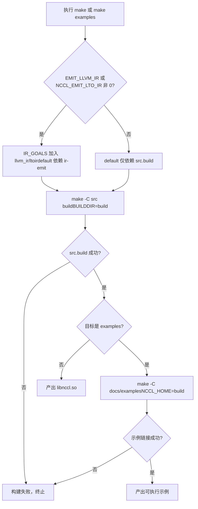
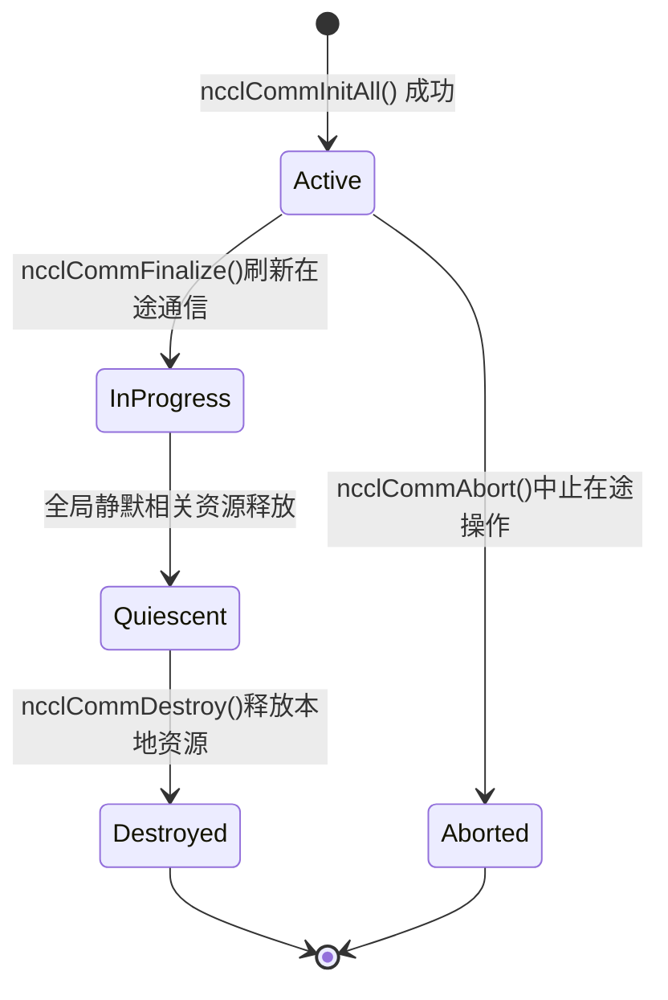

# Глава 1: Запуск и наблюдаемые явления: взгляд на внешнее поведение через один AllReduce

Прежде чем углубляться в любой код ядра, мы сначала запустим NCCL и понаблюдаем за его внешним поведением. В этой главе мы не читаем ядро, а делаем только одно: создаём проверяемую систему отсчёта — любой последующий анализ внутренних механизмов в конечном итоге должен объяснять внешнее поведение, наблюдаемое здесь.

# 1.1 Взгляд на инженерную структуру NCCL через точку входа сборки

## Интуитивная модель

Система сборки подобна строительным чертежам здания: она не определяет, кто в нём будет жить, но определяет, какие есть комнаты и куда открываются двери. Если точка входа сборки запутана, вы не сможете сделать даже первый шаг — «запустить». NCCL предоставляет две точки входа сборки — Makefile и CMake; понимание их различий — первый шаг к пониманию инженерной организации этого проекта.

## Структура двух точек входа сборки

Верхнеуровневый`Makefile`— это чрезвычайно тонкий слой диспетчеризации: он сам не компилирует ни одного исходного файла, а перенаправляет работу в Makefile каждого подкаталога.

[FACT:Makefile:44-45]определяет`src.%`шаблонные правила, перенаправляющие`src.build`、`src.install`и другие цели в`src/Makefile`：

```
src.%:
	${MAKE} -C src $* BUILDDIR=${ABSBUILDDIR}
```

[FACT:Makefile:47-48]определяет`examples`цель, которая зависит от`src.build`, а затем переходит в`docs/examples`каталог для сборки примеров:

```
examples: src.build
	${MAKE} -C docs/examples NCCL_HOME=${ABSBUILDDIR}
```

Обратите внимание на зависимости: сборка примеров зависит от завершения`src.build`, поскольку примерам требуется линковка с библиотекой NCCL, а`NCCL_HOME`переменная окружения передаёт каталог артефактов сборки в Makefile примеров. Это и есть ограничение порядка сборки: «сначала библиотека, потом примеры».

[FACT:Makefile:29]перечислены все цели, доступные для очистки:

```
TARGETS := src pkg nccl4py ir
```

[FACT:Makefile:30]используя синтаксис подстановки ссылок GNU Make`${TARGETS:%=%.clean}`развернуть`src pkg nccl4py ir`в`src.clean pkg.clean nccl4py.clean ir.clean`, определив все цели очистки за один раз. Это распространённый в Makefile приём «правила, управляемые данными» — чтобы добавить новый модуль, достаточно добавить одно слово в`TARGETS`.

## Точка входа CMake: откуда берётся номер версии

Точка входа CMake гораздо сложнее, чем Makefile, поскольку ей приходится обрабатывать кроссплатформенность, определение версии CUDA, выбор архитектуры и т. д. Мы сосредоточимся только на частях, непосредственно связанных с «запуском».

[FACT:CMakeLists.txt:5-11]показывает источник номера версии — он не жёстко закодирован в CMakeLists.txt, а извлекается регулярным выражением после чтения из`makefiles/version.mk`:

```cmake
file(READ ${CMAKE_SOURCE_DIR}/makefiles/version.mk VERSION_CONTENT)
string(REGEX REPLACE ".*NCCL_MAJOR[ ]*:=[ ]*([0-9]+).*" "\\1" NCCL_MAJOR "${VERSION_CONTENT}")
...
math(EXPR NCCL_VERSION_CODE "(${NCCL_MAJOR} * 10000) + (${NCCL_MINOR} * 100) + ${NCCL_PATCH}")
```

> **[Design Inference & Architectural Trade-offs]**
> Централизованное размещение номера версии в`version.mk`позволяет двум системам сборки, Makefile и CMake, использовать один и тот же источник версии, избегая классической инженерной ловушки «несоответствия номеров версий в двух системах сборки».`NCCL_VERSION_CODE`формула расчёта`MAJOR*10000 + MINOR*100 + PATCH`согласована с макросом`NCCL_VERSION`в заголовочном файле.

[FACT:CMakeLists.txt:14-20]внедряет эти номера версий через`add_compile_definitions`во все исходные файлы C++:

```cmake
add_compile_definitions(
    NCCL_USE_CMAKE
    NCCL_MAJOR=${NCCL_MAJOR}
    NCCL_MINOR=${NCCL_MINOR}
    NCCL_PATCH=${NCCL_PATCH}
    NCCL_VERSION_CODE=${NCCL_VERSION_CODE}
)
```

[FACT:CMakeLists.txt:24-25]объявляет языки проекта как CUDA, CXX, C:

```cmake
project(NCCL VERSION ${NCCL_MAJOR}.${NCCL_MINOR}.${NCCL_PATCH}
        LANGUAGES CUDA CXX C)
```

## Выбор архитектуры CUDA: почему значение по умолчанию такое сложное

[FACT:CMakeLists.txt:140-171]— это большой фрагмент логики, определяющей`CMAKE_CUDA_ARCHITECTURES`в зависимости от версии CUDA. Рассмотрим CUDA 12.8 и выше:

```cmake
elseif(${CUDA_MAJOR} EQUAL 12)
    if(${CUDA_MINOR} LESS 8)
        set(CMAKE_CUDA_ARCHITECTURES "50;60;61;70;80;90")
    else()
        set(CMAKE_CUDA_ARCHITECTURES "50;60;61;70;80;90;100;120")
    endif()
```

> **[Design Inference & Architectural Trade-offs]**
> Мотивация этой логики такова: PTX новых архитектур (например, 100, 120) распознаётся только более новыми инструментальными цепочками CUDA; если принудительно указать новую архитектуру для старой CUDA, компиляция сразу завершится ошибкой. Поэтому список архитектур по умолчанию должен динамически корректироваться в зависимости от версии CUDA. Для читателя это означает:**Если вы не зададите`CMAKE_CUDA_ARCHITECTURES`явно, результат компиляции будет содержать fatbin с длинным списком архитектур, и время компиляции заметно возрастёт**. В производственной среде обычно явно указывают целевую архитектуру для ускорения сборки.

## Схема принятия решений по процессу сборки

Приведённая ниже схема показывает полный путь принятия решений от выполнения`make`до получения запускаемого примера:



Ключевое ветвление на этой схеме зависит от того, является ли`IR_GOALS`непустым — это определяет, запускает ли сборка по умолчанию дополнительную генерацию LLVM IR. Читателям, которые хотят только «запустить», достаточно оставить`EMIT_LLVM_IR=0`, чтобы пойти по кратчайшему пути.

# 1.2 Предварительные условия минимальной работающей программы

## Интуитивная модель

Написать программу на NCCL — это как организовать многостороннюю телефонную конференцию. Сначала нужно убедиться: сколько человек участвует (число устройств), кто каждый из них (rank), по какой линии они говорят (stream). Если не хватает хотя бы одного, конференция не состоится. В этом разделе на примере`01_communicators`мы ясно увидим, как эти три предварительных условия выглядят в коде.

## Структуры данных: три массива хранят всё состояние

[FACT:docs/examples/01_communicators/01_multiple_devices_single_process/c/main.cc:88-92]определяет ключевые переменные примера:

```c
int num_gpus;                 // Number of available CUDA devices
ncclComm_t *comms = NULL;     // Array of NCCL communicators (one per GPU)
cudaStream_t *streams = NULL; // Array of CUDA streams (one per GPU)
int *devices = NULL;          // Array of device IDs to use
```

Здесь отражена суть модели программирования NCCL с одним процессом и несколькими GPU:**на каждый GPU — один домен связи, один stream, один номер устройства**. Длина всех трёх массивов равна`num_gpus`, индекс`i`соответствует`i`-му GPU.

`ncclComm_t`в заголовочном файле определён как непрозрачный указатель.[FACT:src/nccl.h.in:36]показывает его реальный тип:

```c
typedef struct ncclComm* ncclComm_t;
```

> **[Design Inference & Architectural Trade-offs]**
> «Непрозрачный указатель» (opaque pointer) — классический приём сокрытия информации в языке C: заголовочный файл предоставляет только тип указателя`struct ncclComm*`, пользовательский код не может получить доступ к внутренним полям структуры, и все операции должны выполняться через функции API. Так NCCL может свободно изменять внутреннее устройство`ncclComm`, не нарушая ABI. Для начинающих читателей это можно понять так: «вы получаете дескриптор чёрного ящика, и работать с ним можно только через официальный интерфейс».

## Пошагово: от обнаружения устройств до создания домена связи

**Шаг первый: обнаружение числа устройств.** [FACT:docs/examples/01_communicators/01_multiple_devices_single_process/c/main.cc:96-104]вызывает`cudaGetDeviceCount`и проверяет, равно ли оно 0:

```c
CUDACHECK(cudaGetDeviceCount(&num_gpus));

if (num_gpus == 0) {
    fprintf(stderr, "ERROR: No CUDA devices found on this system\n");
    ...
    return 1;
}
```

Что делает этот шаг: запрашивает у среды выполнения CUDA, «сколько GPU на этой машине». Если возвращается 0, значит доступных устройств нет, и программа сразу завершается — это самое первое защитное условие.

**Шаг второй: выделение памяти хоста и заполнение списка устройств.** [FACT:docs/examples/01_communicators/01_multiple_devices_single_process/c/main.cc:114-121]выделяет три массива и проверяет успешность выделения:

```c
devices = (int *)malloc(num_gpus * sizeof(int));
comms = (ncclComm_t *)malloc(num_gpus * sizeof(ncclComm_t));
streams = (cudaStream_t *)malloc(num_gpus * sizeof(cudaStream_t));

if (!devices || !comms || !streams) {
    fprintf(stderr, "ERROR: Failed to allocate memory for device arrays\n");
    return 1;
}
```

[FACT:docs/examples/01_communicators/01_multiple_devices_single_process/c/main.cc:126-136]в цикле заполняет`devices[i] = i`и печатает свойства каждого устройства:

```c
for (int i = 0; i >CUDA: cudaGetDeviceCount(&num_gpus)
    CUDA-->>App: num_gpus = N
    loop i in 0..N-1
        App->>CUDA: cudaSetDevice(devices[i])
        App->>CUDA: cudaStreamCreate(&streams[i])
        CUDA-->>App: streams[i]
    end
    App->>NCCL: ncclCommInitAll(comms, N, devices)
    Note over NCCL: 内部为每个设备建立通信域分配 rank 0..N-1
    NCCL-->>App: comms[0..N-1]
    loop i in 0..N-1
        App->>NCCL: ncclCommUserRank(comms[i], &rank)
        NCCL-->>App: rank = i
        App->>NCCL: ncclCommCount(comms[i], &size)
        NCCL-->>App: size = N
    end
```

Эта диаграмма последовательности раскрывает ключевой момент:`ncclCommInitAll`— это**синхронный блокирующий вызов**, внутри он выполняет всю координацию между устройствами, и к моменту возврата все домены связи уже готовы.

## Проектное размышление: зачем нужен ncclCommInitAll

> **[Design Inference & Architectural Trade-offs]**
> В многопроцессном сценарии каждый процесс управляет только одной GPU, используя`ncclCommInitRank`для индивидуальной инициализации. Но в сценарии с одним процессом и несколькими GPU, если позволить пользователю вручную вызывать`ncclCommInitRank`для каждой карты, придётся решать «синхронизацию между несколькими rank» — а в одном процессе только один поток, невозможно одновременно продвигать инициализацию нескольких rank, возникнет взаимоблокировка.`ncclCommInitAll`Библиотека инкапсулирует эту координацию внутри себя, используя внутренние механизмы (обычно многопоточность или конечный автомат) для завершения синхронизированной инициализации всех rank, предоставляя пользователю простой синхронный вызов. Это и есть фундаментальная причина существования «удобной функции».

# 1.3 Полное внешнее поведение одного AllReduce

## Интуитивная модель

AllReduce — наиболее часто используемая операция в коллективных коммуникациях: каждый участник вносит свою порцию данных, все получают сумму всех данных. Как при подсчёте общего балла за групповую работу — каждый сообщает свой результат, и в итоге у каждого оказывается общий балл всей группы. В этом разделе мы проследим`03_collectives/01_allreduce`пример, чтобы увидеть полное внешнее поведение одного AllReduce от вызова до проверки результата.

## Структуры данных: буферы данных и инициализация

[FACT:docs/examples/03_collectives/01_allreduce/c/main.cc:59-63]определены ключевые переменные:

```c
int num_gpus = 0;
ncclComm_t *comms;
cudaStream_t *streams;
float **sendbuff;
float **recvbuff;
```

Обратите внимание,`sendbuff`и`recvbuff`— это`float**`— указатель на массив указателей. Каждый`sendbuff[i]`— это адрес памяти устройства на`i`-й GPU.

[FACT:docs/examples/03_collectives/01_allreduce/c/main.cc:99]определён масштаб данных:

```c
const size_t size = 32 * 1024 * 1024; // 32M floats for demonstration
```

32M float, по 4 байта каждый, то есть 128 MB отправляющего буфера и 128 MB принимающего буфера, по одной копии на каждую карту.

[FACT:docs/examples/03_collectives/01_allreduce/c/main.cc:101-120]— это цикл инициализации для каждого устройства:

```c
for (int i = 0; i  **[Design Inference & Architectural Trade-offs]**
> Основное противоречие: коллективная коммуникация требует одновременного участия всех rank, но в однопоточной среде вы можете вызывать`ncclAllReduce`только по одному. Если первый вызов`ncclAllReduce`блокируется в ожидании других rank, а вызовы других rank ещё не отправлены, возникнет взаимоблокировка. Механизм Group работает так:`ncclGroupStart`все последующие вызовы после`ncclGroupEnd`только «регистрируются», не запускаются фактически; только при

**все зарегистрированные операции提交提交提交提交提交提交提交提交提交提交提交提交提交提交提交提交提交提交提交提交提交提交提交提交提交提交提交提交提交提交提交提交提交提交提交提交提交提交提交提交提交提交提交提交提交提交提交提交提交提交提交提交提交提交提交提交提交提交提交提交提交提交提交提交提交提交提交提交提交提交提交提交提交提交提交提交提交提交提交提交提交提交提交提交提交提交提交提交提交提交提交提交提交提交提交提交提交提交提交提交提交提交提交提交提交提交提交提交提交提交提交提交提交提交提交提交提交提交提交提交提交提交提交提交提交提交提交提交提交提交提交提交提交提交提交提交提交提交提交提交提交提交提交提交提交提交提交提交提交提交提交提交提交提交提交提交提交提交提交提交提交提交提交提交提交提交提交提交提交提交提交提交提交提交提交提交提交提交提交提交提交提交提交提交提交提交提交提交提交提交提交提交提交提交提交提交提交提交提交提交提交提交提交提交提交提交提交提交提交提交提交提交提交提交提交提交提交提交提交提交提交提交提交提交提交提交提交提交提交提交提交提交提交提交提交提交提交提交提交提交提交提交提交提交提交提交提交提交提交提交提交提交提交提交提交提交提交提交提交提交提交提交提交提交提交提交提交提交提交提交提交提交提交提交提交提交提交提交提交提交提交提交提交提交提交提交提交提交提交提交提交提交提交提交提交提交提交提交提交提交提交提交提交提交提交提交提交提交提交提交提交提交提交提交提交提交提交提交提交提交提交提交提交提交提交提交提交提交提交提交提交提交提交提交提交提交提交提交提交提交提交提交提交提交提交提交提交提交提交提交提交提交提交提交提交提交提交提交提交提交提交提交提交提交提交提交提交提交提交提交提交提交提交提交提交提交提交提交提交提交提交提交提交提交提交提交提交提交提交提交提交提交提交提交提交提交提交提交提交提交提交提交提交提交提交提交提交提交提交提交提交提交提交提交提交提交提交提交提交提交提交提交提交提交提交提交提交提交提交提交提交提交提交提交提交提交提交提交提交提交提交提交提交提交提交提交提交提交提交提交提交提交提交提交提交提交提交提交提交提交提交提交提交提交提交提交提交提交提交提交提交提交提交提交提交提交提交提交提交提交提交提交提交提交提交提交提交提交提交提交提交提交提交提交提交提交提交提交提交提交提交提交提交提交提交提交提交提交提交提交提交提交提交提交提交提交提交提交提交提交提交提交提交提交提交提交提交提交提交提交提交提交提交提交提交提交提交提交提交提交提交提交提交提交提交提交提交提交提交提交提交提交提交提交提交提交提交提交提交提交提交提交提交提交提交提交提交提交提交提交提交提交提交提交提交提交提交提交提交提交提交提交提交提交提交提交提交提交提交提交提交提交提交提交提交提交提交提交提交提交提交提交提交提交提交提交提交提交提交提交提交提交提交提交提交提交提交提交提交提交提交提交提交提交提交提交提交提交提交提交提交提交提交提交提交提交提交提交提交提交提交提交提交提交提交提交提交提交提交提交提交提交提交提交提交提交提交提交提交提交提交提交提交提交提交提交提交提交提交提交提交提交提交提交提交提交提交提交提交提交提交提交提交提交提交提交提交提交提交提交提交提交提交提交提交提交提交提交提交提交提交提交提交提交提交提交提交提交提交提交提交提交提交提交提交提交提交提交提交提交提交提交提交提交提交提交提交提交提交提交提交提交提交提交提交提交提交提交提交提交提交提交提交提交提交提交提交提交提交提交提交提交提交提交提交提交提交提交提交提交提交提交提交提交提交提交提交提交提交提交提交提交提交提交提交提交提交提交提交提交提交提交提交提交提交提交提交提交提交提交提交提交提交提交提交提交提交提交提交提交提交提交提交提交提交提交提交提交提交提交提交提交提交提交提交提交提交提交提交提交提交提交提交提交提交提交提交提交提交提交提交提交提交提交提交提交提交提交提交提交提交提交提交提交提交提交提交提交提交提交提交提交提交提交提交提交提交提交提交提交提交提交提交提交提交提交提交提交提交提交提交提交提交提交提交提交提交提交提交提交提交提交提交提交提交提交提交提交提交提交提交提交提交提交提交提交提交提交提交提交提交提交提交提交提交提交提交提交提交提交提交提交提交提交提交提交提交提交提交提交提交提交提交提交提交提交提交提交提交提交提交提交提交提交提交提交提交提交提交提交提交提交提交提交提交提交提交提交提交提交提交提交提交提交提交提交提交提交提交提交提交提交提交提交提交提交提交提交提交提交提交提交提交提交提交提交提交提交提交提交提交提交提交提交提交提交提交提交提交提交提交提交提交提交提交提交提交提交提交提交提交提交提交提交提交提交提交提交提交提交提交提交提交提交提交提交提交提交提交提交提交提交提交提交提交提交提交提交提交提交提交提交提交提交提交提交提交提交提交提交提交提交提交提交提交提交提交提交提交提交提交提交提交提交提交提交提交提交提交提交提交提交提交提交提交提交提交提交提交提交提交提交提交提交提交提交提交提交提交提交提交提交提交提交提交提交提交提交提交提交提交提交提交提交提交提交提交提交提交提交提交提交提交提交提交提交提交提交提交提交提交提交提交提交提交提交提交提交提交提交提交提交提交提交提交提交提交提交提交提交提交提交提交提交提交提交提交提交提交提交提交提交提交提交提交提交提交提交提交提交提交提交提交提交提交提交提交提交提交提交提交提交提交提交提交提交提交提交提交提交提交提交提交提交提交提交提交提交提交提交提交提交提交提交提交提交提交提交提交提交提交提交提交提交提交提交提交提交提交提交提交提交提交提交提交提交提交提交提交提交提交提交提交提交提交提交提交提交提交提交提交提交提交提交提交提交提交提交提交提交提交提交提交提交提交提交提交提交提交提交提交提交提交提交提交提交提交提交提交提交提交提交提交提交提交提交提交提交提交提交提交提交提交提交提交提交提交提交提交提交提交提交提交提交提交提交提交提交提交提交提交提交提交提交提交提交提交提交提交提交提交提交提交提交提交提交提交提交提交提交提交提交提交提交提交提交提交提交提交提交提交提交提交提交提交提交提交提交提交提交提交提交提交提交提交提交提交提交提交提交提交提交提交提交提交提交提交提交提交提交提交提交提交提交提交提交提交提交提交提交提交提交提交提交提交提交提交提交提交提交提交提交提交提交提交提交提交提交提交提交提交提交提交提交提交提交提交提交提交提交提交提交提交提交提交提交提交提交提交提交提交提交提交提交提交提交提交提交提交提交提交提交提交提交提交提交提交提交提交提交提交提交提交提交提交提交提交提交提交提交提交提交提交提交提交提交提交提交提交提交提交提交提交提交提交提交提交提交提交提交提交提交提交提交提交提交提交提交提交提交提交提交提交提交提交提交提交提交提交提交提交提交提交提交提交提交提交提交提交提交提交提交提交提交提交提交提交提交提交提交提交提交提交提交提交提交提交提交提交提交提交提交提交提交提交提交提交提交提交提交提交提交提交提交提交提交提交提交提交提交提交提交提交提交提交提交提交提交提交提交提交提交提交提交提交提交提交提交提交提交提交提交提交提交提交提交提交提交提交提交提交提交提交提交提交提交提交提交提交提交提交提交提交提交提交提交提交提交提交提交提交提交提交提交提交提交提交提交提交提交提交提交提交提交提交提交提交提交提交提交提交提交提交提交提交提交提交提交提交提交提交提交提交提交提交提交提交提交提交提交提交提交提交提交提交提交提交提交提交提交提交提交提交提交提交提交提交提交提交提交提交提交提交提交提交提交提交提交提交提交提交提交提交提交提交提交提交提交提交提交提交提交提交提交提交提交提交提交提交提交提交提交提交提交提交提交提交提交提交提交提交提交提交提交提交提交提交提交提交提交提交提交提交提交提交提交提交提交提交提交提交提交提交提交提交提交提交提交提交提交提交提交提交提交提交提交提交提交提交提交提交提交提交提交提交提交提交提交提交提交提交提交提交提交提交提交提交提交提交提交提交提交提交提交提交提交提交提交提交提交提交提交提交提交提交提交提交提交提交提交提交提交提交提交提交提交提交提交提交提交提交提交提交提交提交提交提交提交提交提交提交提交提交提交提交提交提交提交提交提交提交提交提交提交提交提交提交提交提交提交提交提交提交提交提交提交提交提交提交提交提交提交提交提交提交提交提交提交提交提交提交提交提交提交提交提交提交提交提交提交提交提交提交提交提交提交提交提交提交提交提交提交提交提交提交提交提交提交提交提交提交提交提交提交提交提交提交提交提交提交提交提交提交提交提交提交提交提交提交提交提交提交提交提交提交提交提交提交提交提交提交提交提交提交提交提交提交提交提交提交提交提交提交提交提交提交提交提交提交提交提交提交提交提交提交提交提交提交提交提交提交提交提交提交提交提交提交提交提交提交提交提交提交提交提交提交提交提交提交提交提交提交提交提交提交提交提交提交提交提交提交提交提交提交提交提交提交提交提交提交提交提交提交提交提交提交提交提交提交提交提交提交提交提交提交提交提交提交提交提交提交提交提交提交提交提交提交提交提交提交提交提交提交提交提交提交提交提交提交提交提交提交提交提交提交提交提交提交提交提交提交提交提交提交提交提交提交提交提交提交提交提交提交提交提交提交提交提交提交提交提交提交提交提交提交提交提交提交提交提交提交提交提交提交提交提交提交提交提交提交提交提交提交提交提交提交提交提交提交提交提交提交提交提交提交提交提交提交提交提交提交提交提交提交提交提交提交提交提交提交提交提交提交提交提交提交提交提交提交提交提交提交提交提交提交提交提交提交提交提交提交提交提交提交提交提交提交提交提交提交提交提交提交提交提交提交提交提交提交提交提交提交提交提交提交提交提交提交提交提交提交提交提交提交提交提交提交提交提交提交提交提交提交提交提交提交提交提交提交提交提交提交提交提交提交提交提交提交提交提交提交提交提交提交提交提交提交提交提交提交提交提交提交提交提交提交提交提交提交提交提交提交提交提交提交提交提交提交提交提交提交提交提交提交提交提交提交提交提交提交提交提交提交提交提交提交提交提交提交提交提交提交提交提交提交提交提交提交提交提交提交提交提交提交提交提交提交提交提交提交提交提交提交提交提交提交提交提交提交提交提交提交提交提交提交提交提交提交提交提交提交提交提交提交提交提交提交提交提交提交提交提交提交提交提交提交提交提交提交提交提交提交提交提交提交提交提交提交提交提交提交提交提交提交提交提交提交提交提交提交提交提交提交提交提交提交提交提交提交提交提交提交提交提交提交提交提交提交提交提交提交提交提交提交提交提交提交提交提交提交提交提交提交提交提交提交提交提交提交提交提交提交提交提交提交提交提交提交提交提交提交提交提交提交提交提交提交提交提交提交提交提交提交提交提交提交提交提交提交提交提交提交提交提交提交提交提交提交提交提交提交提交提交提交提交提交提交提交提交提交提交提交提交提交提交提交提交提交提交提交提交提交提交提交提交提交提交提交提交提交提交提交提交提交提交提交提交提交提交提交提交提交提交提交提交提交提交提交提交提交提交提交提交提交提交提交提交提交提交提交提交提交提交提交提交提交提交提交提交提交提交提交提交提交提交提交提交提交提交提交提交提交提交提交提交提交提交提交提交提交提交提交提交提交提交提交提交提交提交提交提交提交提交提交提交提交提交提交提交提交提交提交提交提交提交提交提交提交提交提交提交提交提交提交提交提交提交提交提交提交提交提交提交提交提交提交提交提交提交提交提交提交提交提交提交提交提交提交提交提交提交提交提交提交提交提交提交提交提交提交提交提交提交提交提交提交提交提交提交提交提交提交提交提交提交提交提交提交提交提交提交提交提交提交提交提交提交提交提交提交提交提交提交提交提交提交提交提交提交提交提交提交提交提交提交提交提交提交提交提交提交提交提交提交提交提交提交提交提交提交提交提交提交提交提交提交提交提交提交提交提交提交提交提交提交提交提交提交提交提交提交提交提交提交提交提交提交提交提交提交提交提交提交提交提交提交提交提交提交提交提交提交提交提交提交提交提交提交提交提交提交提交提交提交提交提交提交提交提交提交提交提交提交提交提交提交提交提交提交提交提交提交提交提交提交提交提交提交提交提交提交提交提交提交提交提交提交提交提交提交提交提交提交提交提交提交提交提交提交提交提交提交提交提交提交提交提交提交提交提交提交提交提交提交提交提交提交提交提交提交提交提交提交提交提交提交提交提交提交提交提交提交提交提交提交提交提交提交提交提交提交提交提交提交提交提交提交提交提交提交提交提交提交提交提交提交提交提交提交提交提交提交提交提交提交提交提交提交提交提交提交提交提交提交提交提交提交提交提交提交提交提交提交提交提交提交提交提交提交提交提交提交提交提交提交提交提交提交提交提交提交提交提交提交提交提交提交提交提交提交提交提交提交提交提交提交提交提交提交提交提交提交提交提交提交提交提交提交提交提交提交提交提交提交提交提交提交提交提交提交提交提交提交提交提交提交提交提交提交提交提交提交提交提交提交提交提交提交提交提交提交提交提交提交提交提交提交提交提交提交提交提交提交提交提交提交提交提交提交提交提交提交提交提交提交提交提交提交提交提交提交提交提交提交提交提交提交提交提交提交提交提交提交提交提交提交提交提交提交提交提交提交提交提交提交提交提交提交提交提交提交提交提交提交提交提交提交提交提交提交提交提交提交提交提交提交提交提交提交提交提交提交提交提交提交提交提交提交提交提交提交提交提交提交提交提交提交提交提交提交提交提交提交提交提交提交提交提交提交提交提交提交提交提交提交提交提交提交提交提交提交提交提交提交提交提交提交提交提交提交提交提交提交提交提交提交提交提交提交提交提交提交提交提交提交提交提交提交提交提交提交提交提交提交提交提交提交提交提交提交提交提交提交提交提交提交提交提交提交提交提交提交提交提交提交提交提交提交提交提交提交提交提交提交提交提交提交提交提交提交提交提交提交提交提交提交提交提交提交提交提交提交提交提交提交提交提交提交提交提交提交提交提交提交提交提交提交提交提交提交提交提交提交提交提交提交提交提交提交提交提交提交提交提交提交提交提交提交提交提交提交提交提交提交提交提交提交提交提交提交提交提交提交提交提交提交提交提交提交提交提交提交提交提交提交提交提交提交提交提交提交提交提交提交提交提交提交提交提交提交提交提交提交提交提交提交提交提交提交提交提交提交提交提交提交提交提交提交提交提交提交提交提交提交提交提交提交提交提交提交提交提交提交提交提交提交提交提交提交提交提交提交提交提交提交提交提交提交提交提交提交提交提交提交提交提交提交提交提交提交提交提交提交提交提交提交提交提交提交提交提交提交提交提交提交提交提交提交提交提交提交提交提交提交提交提交提交提交提交提交提交提交** [FACT:docs/examples/03_collectives/01_allreduce/c/main.cc:139-142]：

```c
for (int i = 0; i 首元素=0"]
        r0["recvbuff[0]"]
    end
    subgraph dev1["GPU 1 (rank 1)"]
        s1["sendbuff[1]首元素=1"]
        r1["recvbuff[1]"]
    end
    subgraph dev2["GPU 2 (rank 2)"]
        s2["sendbuff[2]首元素=2"]
        r2["recvbuff[2]"]
    end
    s0 -->|ncclAllReducencclFloat ncclSum| reduce["归约求和0+1+2=3"]
    s1 -->|ncclAllReducencclFloat ncclSum| reduce
    s2 -->|ncclAllReducencclFloat ncclSum| reduce
    reduce -->|广播结果| r0
    reduce -->|广播结果| r1
    reduce -->|广播结果| r2
```

这张图展示了 AllReduce 的两个阶段：先归约（reduce），再广播（broadcast）。每个 rank 的 `recvbuff` 最终都得到相同的结果。

## 设计思考：为什么用 Group 而不是逐个调用

> **[Design Inference & Architectural Trade-offs]**
> 如果去掉 `ncclGroupStart`/`ncclGroupEnd`，代码会变成：

```c
for (int i = 0; i  **[Design Inference & Architectural Trade-offs]**
> 为什么销毁要分两步？`ncclCommFinalize` 是**全局操作**——它需要所有 rank 都参与，确保没有在途的通信。`ncclCommDestroy` 是**本地操作**——它只释放本进程的资源，不阻塞。这个设计让"等待所有 rank 静默"和"释放本地资源"解耦：前者可能耗时较长（要等网络对端），后者是纯本地操作。如果只有一个 `ncclCommDestroy`，它就必须同时承担这两个职责，要么阻塞太久，要么无法保证全局静默。

## 销毁顺序的完整链条

[FACT:docs/examples/01_communicators/01_multiple_devices_single_process/c/main.cc:221-249] 展示了完整的清理顺序，注释 [FACT:docs/examples/01_communicators/01_multiple_devices_single_process/c/main.cc:218-219] 强调：

```c
// IMPORTANT: Proper cleanup is critical for NCCL applications
// Resources must be cleaned up in the correct order to avoid issues
```

顺序是：

1. 同步所有 stream（[FACT:docs/examples/01_communicators/01_multiple_devices_single_process/c/main.cc:224-227]）

2. Finalize + Destroy коммуникационного домена ([FACT:docs/examples/01_communicators/01_multiple_devices_single_process/c/main.cc:233-240]）

3. Уничтожить CUDA stream ([FACT:docs/examples/01_communicators/01_multiple_devices_single_process/c/main.cc:246-249]）

4. Освободить память хоста ([FACT:docs/examples/01_communicators/01_multiple_devices_single_process/c/main.cc:253-255]）

## Конечный автомат коммуникационного домена

`ncclCommFinalize`В документации явно упоминаются переходы состояний, что соответствует критериям допуска конечного автомата:



Ключевой переход этого конечного автомата —`InProgress -> Quiescent`: он запускается событием «глобальной тишины», а не прямым вызовом какой-либо функции. Это означает, что после возврата`ncclCommFinalize`коммуникационный домен может всё ещё находиться в состоянии`InProgress`, и требуется опрос`ncclCommGetAsyncError`, чтобы узнать, когда произойдёт переход в`Quiescent`。

## Проектное размышление: почему порядок уничтожения нельзя менять

> **[Design Inference & Architectural Trade-offs]**
> Что произойдёт, если сначала уничтожить CUDA stream, а потом коммуникационный домен? Коммуникационный домен может внутренне хранить ссылку на stream (например, для уведомления о завершении асинхронных операций). Если stream будет уничтожен первым, коммуникационный домен при Finalize обратится к уже уничтоженному stream, что приведёт к неопределённому поведению. Аналогично, если сначала освободить память хоста (`comms`массив), а потом уничтожить коммуникационный домен,`ncclCommDestroy`получит висячий указатель. Именно поэтому порядок должен быть таким: «сначала синхронизация, затем уничтожение коммуникационного домена, затем уничтожение stream, и наконец освобождение памяти хоста» —**зависимости определяют, что порядок уничтожения должен быть обратным порядку создания**。

# 1.5 Руководство по избеганию проблем в production

## Проблема первая: забыли Group и получили взаимную блокировку

Это самая распространённая ошибка новичков. В сценарии с одним процессом и несколькими GPU, если просто вызывать`ncclAllReduce`в цикле без Group, программа заблокируется при первом же вызове. Симптомы: программа зависает, загрузка CPU близка к 0, никакого вывода.

Метод диагностики: с помощью`gdb`подключиться к процессу и посмотреть, не остановился ли стек на логике ожидания внутри NCCL. Если да, проверить, не пропущен ли`ncclGroupStart`/`ncclGroupEnd`。

## Проблема вторая: забыли синхронизировать stream и читаете результат

[FACT:src/nccl.h.in:854-856]Явно указано, что`ncclGroupEnd`гарантирует только постановку в очередь, но не завершение. Если пропустить синхронизацию stream для[FACT:docs/examples/03_collectives/01_allreduce/c/main.cc:139-142]и сразу прочитать`recvbuff`, будут прочитаны незавершённые данные.

Симптомы: результат то правильный, то неправильный, или читаются одни нули. Это происходит потому, что`cudaMemcpy`по умолчанию синхронна, но синхронизирует она**текущий stream**, а AllReduce может выполняться в другом stream. Метод диагностики: добавить`cudaStreamSynchronize`перед чтением результата; если проблема исчезнет, значит это та самая ошибка.

## Проблема третья: неправильный порядок уничтожения приводит к segmentation fault

Если до`ncclCommDestroy`выполнить`cudaFree`для`sendbuff`/`recvbuff`, коммуникационный домен при Finalize может всё ещё обращаться к этим буферам, что приведёт к segmentation fault или повреждению данных.

Симптомы: программа падает на этапе завершения или периодически читает мусорные данные. Метод диагностики: проверить порядок кода очистки, убедиться, что уничтожение коммуникационного домена происходит до освобождения всех ресурсов CUDA.

## Проблема четвёртая: путаница между номером устройства и rank

[FACT:docs/examples/01_communicators/01_multiple_devices_single_process/c/main.cc:198-200]Есть одна проверка:

```c
if (device != devices[i]) {
    printf(" [WARNING: Expected device %d]", devices[i]);
}
```

> **[Design Inference & Architectural Trade-offs]**
> rank и device — это два разных понятия. rank — это логический номер внутри коммуникационного домена (от 0 до nRanks-1), device — это физический номер GPU. В использовании по умолчанию`ncclCommInitAll`,`devices[i] = i`, поэтому rank и device совпадают. Но если передать пользовательский`devlist`(например,`{2, 0, 1}`), то rank 0 будет соответствовать device 2. Путаница между этими понятиями приведёт к отправке данных на неправильный GPU.

# Итоги главы

В этой главе мы выполнили три задачи:

1. **Точка входа сборки**: разобрались в механизме перенаправления Makefile, источнике номера версии в CMake и логике выбора архитектуры CUDA. Ключевой вывод:`make examples`сначала собирает библиотеку, затем примеры,`NCCL_HOME`передавая каталог с результатами сборки примерам.

2. **Три элемента минимально работающей программы**: количество устройств (`cudaGetDeviceCount`), rank (автоматически распределяется`ncclCommInitAll`), stream (по одному на каждый GPU).`ncclCommInitAll`— это удобная точка входа для одного процесса с несколькими GPU, она инкапсулирует синхронизированную инициализацию нескольких rank внутри библиотеки.

3. **Полное внешнее поведение одного AllReduce**: от`ncclGroupStart`, оборачивающего несколько вызовов`ncclAllReduce`, до отправки`ncclGroupEnd`, затем ожидания завершения`cudaStreamSynchronize`и наконец проверки результата. Механизм Group — ключ к избеганию взаимной блокировки в сценарии с одним потоком и несколькими GPU.

4. **Жизненный цикл коммуникационного домена**：`ncclCommFinalize`(глобальная тишина) +`ncclCommDestroy`(локальное освобождение) — двухфазное уничтожение, а также ограничение порядка: «сначала синхронизация, затем уничтожение коммуникационного домена, затем уничтожение stream, и наконец освобождение памяти хоста».

# Вопросы для размышления и самопроверки в этой главе

Q1: Если убрать ncclGroupStart/ncclGroupEnd из[FACT:docs/examples/03_collectives/01_allreduce/c/main.cc:130-136]и заменить на прямой циклический вызов ncclAllReduce, что произойдёт в сценарии с одним процессом и несколькими GPU? Почему?

**Справочный разбор**: произойдёт взаимная блокировка. В заголовочном файле[FACT:src/nccl.h.in:844-864]объясняется причина: вызовы коллективной коммуникации могут выполнять межпроцессорную синхронизацию и требуют одновременного участия всех rank. В одном потоке при первом вызове`ncclAllReduce(comms[0], ...)`в первой итерации цикла NCCL должен дождаться, пока другие rank также инициируют AllReduce, чтобы продолжить. Но вызовы других rank ещё не выполнены в цикле (поскольку текущий поток заблокирован на первом вызове), поэтому первый вызов никогда не дождётся других rank — взаимная блокировка.

Механизм Group разделяет «инициацию» и «выполнение»:`ncclGroupStart`все вызовы после`ncclGroupEnd`только регистрируются, а при

все зарегистрированные операции отправляются вместе, позволяя им выполняться параллельно. Это принципиально устраняет взаимную блокировку в одном потоке.`gdb`attach смотрит стек, остановится на внутренней логике ожидания NCCL, загрузка CPU близка к 0.

Q2: [FACT:docs/examples/03_collectives/01_allreduce/c/main.cc:139-142]Можно ли заменить cudaStreamSynchronize на cudaDeviceSynchronize? В чём семантическая разница между ними? В каких сценариях такая замена вызовет проблемы?

**Справочный разбор**: можно использовать`cudaDeviceSynchronize`для замены, но семантика различается.`cudaStreamSynchronize(streams[i])`ожидает завершения операций только в указанном stream;`cudaDeviceSynchronize`ожидает завершения операций во**всех**stream на текущем устройстве.

В сценарии одного процесса с несколькими GPU`cudaDeviceSynchronize`синхронизирует только текущее устройство (определяемое`cudaSetDevice`), поэтому его нужно использовать в цикле с`cudaSetDevice(i)`. Если опустить`cudaSetDevice`，`cudaDeviceSynchronize`, синхронизируется только устройство по умолчанию (обычно device 0), а AllReduce на других устройствах может ещё не завершиться.

Заголовочный файл[FACT:src/nccl.h.in:854-856]подчёркивает, что`ncclGroupEnd`гарантирует только постановку в очередь, но не завершение, поэтому синхронизация обязательна. Использование`cudaStreamSynchronize`точнее, поскольку оно ожидает только связанные stream и не будет ошибочно ждать несвязанные операции. Проблема использования`cudaDeviceSynchronize`в том, что если на устройстве есть другие несвязанные долго выполняющиеся kernel, они будут ошибочно ожидаться, что снижает производительность.

Q3: [FACT:docs/examples/01_communicators/01_multiple_devices_single_process/c/main.cc:233-240]Порядок уничтожения

**таков: "сначала Finalize всех коммуникационных доменов, затем Destroy всех коммуникационных доменов". Если изменить на "для каждого коммуникационного домена сначала Finalize, затем Destroy" (то есть выполнять обе операции в одном цикле), какие проблемы возникнут?**Справочный разбор

```c
ncclGroupStart();
for (i) ncclCommFinalize(comms[i]);
ncclGroupEnd();
for (i) ncclCommDestroy(comms[i]);
```

`ncclCommFinalize`Копировать

```c
for (i) {
    ncclCommFinalize(comms[i]);
    ncclCommDestroy(comms[i]);
}
```

Копировать`ncclCommFinalize(comms[0])`первой итерации

будет блокироваться в ожидании тишины всех rank, но Finalize других коммуникационных доменов ещё не инициирован, что приведёт к взаимоблокировке — это та же категория проблем, что и взаимоблокировка в Q1.[FACT:src/nccl.h.in:309-309]Кроме того, заголовочный файл`ncclCommFinalize`указывает, что`ncclInProgress`при возврате коммуникационный домен может всё ещё находиться в состоянии`ncclSuccess`, и нужно дождаться глобальной тишины, чтобы перейти в`ncclCommDestroy`. Если сразу после этого выполнить`ncclCommGetAsyncError`, можно освободить локальные ресурсы до полной тишины коммуникационного домена, что приведёт к неопределённому поведению. Правильный подход — после Finalize опрашивать

для подтверждения состояния, а затем Destroy.
