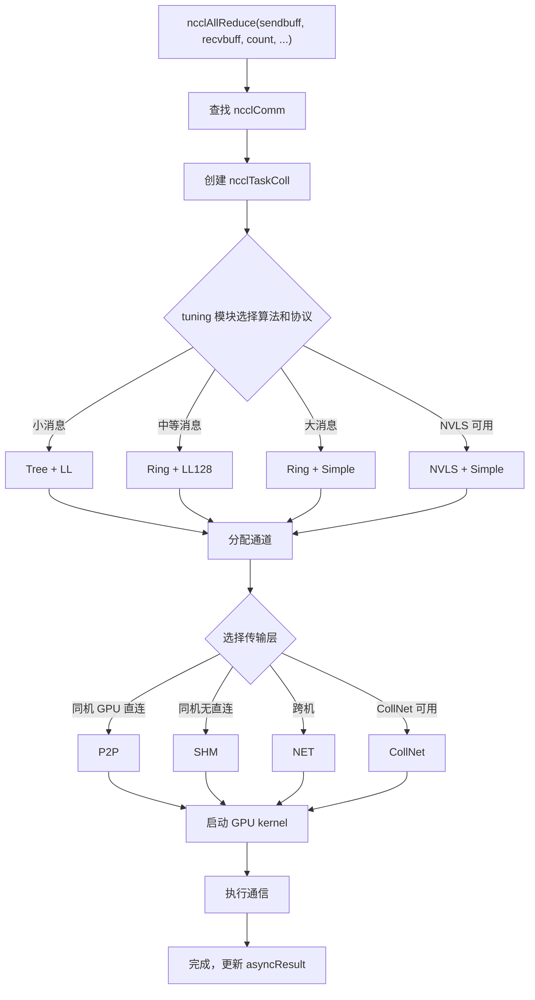

# Следующая глава: Глава 2 →

# Прогресс книги: Глава 2 / 25

Глава 2: Базовая абстрактная модель: коммуникационные операторы, топология, алгоритмы, протоколы и транспортный уровень

# В предыдущей главе мы запустили NCCL и наблюдали внешнее поведение трёх API: ncclCommInitRank, ncclAllReduce, ncclCommDestroy. Но внешнее поведение — лишь вершина айсберга: что на самом деле происходит на GPU, когда ncclAllReduce возвращает управление? По какому пути идут данные? Почему один и тот же AllReduce показывает огромную разницу в производительности на разных машинах? Чтобы ответить на эти вопросы, необходимо сначала построить общий словарь NCCL. В этой главе мы последовательно разберём пять ключевых абстракций: коммуникационный домен (ncclComm), канал (channel), алгоритм (algorithm), протокол (protocol), транспортный уровень (transport). Эти пять концепций проходят через всю книгу, и анализ каждой последующей главы будет их использовать. Поняв отношения между ними, вы поймёте скелет NCCL.

## 2.1 Коммуникационный домен ncclComm: коммуникационный контекст процесса

Интуитивная модель`ncclComm`Представьте`nRanks`как «групповой чат»: каждый процесс, присоединившись к групповому чату, получает ID группы, и после этого все сообщения отправляются в этой группе. Сколько человек в группе (`rank`), кто я (`channels`), по какому маршруту (`config`), по каким правилам (

) — всё это записано в объекте группового чата.`ncclComm`Без

## NCCL не знал бы, «кто с кем общается» и «куда отправляются данные» — при каждом вызове API пришлось бы заново согласовывать список rank и пересоздавать соединения, что неприемлемо по накладным расходам.

`ncclComm`Структура данных и разметка памяти`src/include/comm.h`— самая ключевая структура во всём NCCL, определена в

**. Она чрезвычайно большая (почти 300 строк), рассмотрим ключевые поля, сгруппированные по функциям.**

[FACT:src/include/comm.h:576-580]Идентификация и стражи жизненного цикла`startMagic`，[FACT:src/include/comm.h:879-881]определяет`endMagic`определяет[FACT:src/include/comm.h:883-885]. Эти два поля — не секретные ключи, а стражи обнаружения выхода за границы памяти. В`static_assert`：

```c
static_assert(offsetof(struct ncclComm, startMagic) == 0, "startMagic must be the first field of ncclComm");
static_assert(offsetof(struct ncclComm, endMagic) == sizeof(struct ncclComm) - sizeof(uint64_t),
              "endMagic must be the last field of ncclComm");
```

> **[Design Inference & Architectural Trade-offs]**
> 〔Проектные предположения и архитектурные компромиссы〕`startMagic`Эти два утверждения на этапе компиляции гарантируют, что`endMagic`находится по начальному адресу структуры,`ncclComm`— в конце. Во время выполнения можно быстро определить, валиден ли указатель

**, проверив, не изменены ли эти два магических числа — это очень полезно при отладке багов типа «обращение дикого указателя к уничтоженному коммуникационному домену» в многопоточной среде.**

[FACT:src/include/comm.h:628-629]Rank и информация о топологии`rank`определяет`nRanks`и[FACT:src/include/comm.h:644-652]— мой номер в коммуникационном домене и общее число участников.`node`определяет поля, связанные с узлом:`nNodes`(номер узла, на котором я нахожусь),`localRank`(общее число узлов),`localRanks`(номер внутри узла),`rankToNode`、`rankToLocalRank`、`localRankToRank`。

> **[Design Inference & Architectural Trade-offs]**
> Эти три таблицы сопоставления являются основой топологически-осведомлённых алгоритмов. Например, алгоритму Ring необходимо знать, «находится ли мой следующий rank на том же узле», чтобы решить, использовать NVLink или сеть. Без этих таблиц сопоставления при каждом выборе алгоритма потребовалось бы повторно запрашивать топологический граф, что привело бы к огромным накладным расходам.

**Каналы и буферы**

[FACT:src/include/comm.h:593-593]определяет`channels[MAXCHANNELS]`— это массив всех каналов в коммуникационном домене.[FACT:src/include/comm.h:674-676]определяет количество каналов:`nChannels`(количество каналов соединения),`collChannels`(количество каналов постановки в очередь коллективных операций),`nvlsChannels`(количество каналов NVLS).

[FACT:src/include/comm.h:691-693]определяет размеры буферов:`buffSizes[NCCL_NUM_PROTOCOLS]`(размер буфера для каждого протокола),`p2pChunkSize`(размер блока P2P),`nvlsChunkSize`(размер блока NVLS).

> **[Design Inference & Architectural Trade-offs]**
> `buffSizes`Индекс массива — это значение перечисления протокола (LL/LL128/Simple), что означает, что каждый протокол имеет независимую конфигурацию размера буфера. Протоколу LL требуется маленький буфер для снижения задержки, протоколу Simple требуется большой буфер для повышения пропускной способности — этот массив позволяет сосуществовать обоим требованиям.

**Рабочие очереди и FIFO**

[FACT:src/include/comm.h:719-728]определяет поля, связанные с рабочим FIFO:`workFifoBytes`(размер FIFO, степень двойки),`workFifoBuf`(буфер FIFO на стороне хоста),`workFifoBufDev`(буфер FIFO на стороне устройства),`workFifoProduced`(количество произведённых байт),`workFifoConsumed`(количество потреблённых байт).

> **[Design Inference & Architectural Trade-offs]**
> Это типичный кольцевой буфер производитель-потребитель. Сторона хоста (производитель) записывает дескрипторы работы в FIFO, GPU kernel (потребитель) читает и выполняет их.`workFifoBytes`должен быть степенью двойки, чтобы можно было использовать битовую маску вместо операции взятия по модулю, ускоряя вычисление индекса.

**Внутрипроцессный барьер синхронизации**

[FACT:src/include/comm.h:731-731]определяет механизм синхронизации нескольких коммуникационных доменов внутри процесса:

```c
struct ncclComm* intraComm0; // leader of intra-process comms (self possible)
struct ncclComm* intraNext; // next of intra-process comms, intraComm0 is head
int intraRank;
int intraRanks;
uint32_t intraBarrierPhase;
char intraPad1[64 - sizeof(uint64_t)];
uint64_t intraBarrierCounter; // only used if this is intraComm0
char intraPad2[64 - sizeof(uint64_t)];
uint64_t intraBarrierGate; // only used if this is intraComm0
```

Обратите внимание`intraPad1`и`intraPad2`имеют размер`64 - sizeof(uint64_t)`, то есть 56 байт. Вместе с предыдущим полем`uint64_t`, каждая группа полей занимает ровно 64 байта — это одна кэш-линия (Cache Line).

> **[Design Inference & Architectural Trade-offs]**
> Это типичная**техника заполнения кэш-линии (Cache Line Padding)**.`intraBarrierCounter`и`intraBarrierGate`часто читаются и записываются несколькими потоками; если они разделяют одну кэш-линию, это приведёт к**ложному разделению (False Sharing)**: изменение`intraBarrierCounter`одним потоком приведёт к инвалидации`intraBarrierGate`в кэше другого потока, что вызовет резкое падение производительности. Разделение их на разные кэш-линии с помощью 56-байтового заполнения — стандартный приём высокопроизводительного параллельного программирования.

**Состояние асинхронной ошибки**

[FACT:src/include/comm.h:705-705]определяет`asyncResult`— это поле записывает состояние асинхронных операций коммуникационного домена. В предыдущей главе мы упоминали, что при возврате`ncclCommFinalize`коммуникационный домен может всё ещё находиться в состоянии`ncclInProgress`, и это отслеживается именно через это поле.

## Сценарный Walkthrough: от ncclCommInitRank до заполнения структуры

Когда пользователь вызывает`ncclCommInitRank(&comm, nranks, commId, rank)`, внутри NCCL выделяется структура`ncclComm`и заполняется поле за полем. Проследим этот процесс и посмотрим, как устанавливаются ключевые поля:

**Шаг первый: выделение и обнуление**

NCCL использует`ncclCalloc`для выделения`ncclComm`, гарантируя, что все поля изначально равны 0. В этот момент`startMagic`и`endMagic`устанавливаются в`NCCL_MAGIC`（[FACT:src/include/comm.h:563-569]определяется как`0x0280028002800280`, в комментарии сказано "Nickel atomic number is 28").

**Шаг второй: заполнение идентификационной информации**

`rank`、`nRanks`、`cudaDev`получается из параметров и CUDA API.`commHash`получается хешированием`ncclCommId`, используется для проверки согласованности при последующей сетевой коммуникации.

**Шаг третий: построение топологического графа**

NCCL вызывает модуль топологического зондирования, перечисляет все GPU, сетевые карты, PCI-коммутаторы, строит поле`topo`([FACT:src/include/comm.h:595-595]). Этот топологический граф определяет последующий выбор алгоритма и планирование путей.

**Шаг четвёртый: инициализация каналов**

`channels[MAXCHANNELS]`Массив`id`инициализируется по одному элементу. Для каждого канала`peers`устанавливается в индекс массива,`devPeers`и указатели

**выделяются.**

Шаг пятый: установление транспортных соединений`setup`На основе топологического графа NCCL для каждой пары rank выбирает транспортный уровень (P2P/SHM/NET), вызывает соответствующие`connect`и`channels[i].peers[j]`колбэки. Информация о соединении хранится в

**.**

Шаг шестой: установка магического числа`endMagic`Наконец,`NCCL_MAGIC`устанавливается в

## , отмечая завершение инициализации структуры.

**Размышления о дизайне и подводные камни в production`ncclComm`Почему**

> **[Design Inference & Architectural Trade-offs]**
> `ncclComm`〔Проектные предположения и архитектурные компромиссы〕

**содержит почти 300 полей, потому что он несёт всё состояние коммуникационного домена. Философия дизайна NCCL — «одна инициализация, многократное использование»: при инициализации вычисляется и сохраняется вся возможная полезная информация, во время выполнения происходит прямое обращение к таблице, избегая повторных вычислений. Цена — большее потребление памяти (около нескольких КБ на коммуникационный домен), но по сравнению с памятью GPU и пропускной способностью сети эта память ничтожна.**

> **[Design Inference & Architectural Trade-offs]**
> `ncclComm`〔Проектные предположения и архитектурные компромиссы〕`ncclComm`не является потокобезопасным. Если два потока одновременно вызывают`ncclAllReduce`，`workFifoProduced`для одного и того же

**, поля вроде**

`ncclCommDestroy`будут конкурировать, что приведёт к повреждению данных. Правильный подход — каждый поток использует独立的 коммуникационный домен, либо внешняя блокировка сериализует вызовы.`startMagic`Подводный камень второй: доступ после уничтожения`endMagic`После освобождения памяти структуры

**, если какой-либо поток всё ещё держит указатель и обращается к нему, он прочитает освобождённую память.**

и`intraBarrierCounter`могут помочь обнаружить такую ситуацию — если магическое число не совпадает, значит указатель недействителен.`intraBarrierGate`Подводный камень третий: ложное разделение кэш-линий

# В многопроцессном сценарии (один rank на процесс),

## и

заполнение особенно важно. Если опустить заполнение, операции барьера нескольких процессов будут мешать друг другу, что приведёт к росту задержки синхронизации с наносекунд до микросекунд.`channel`Это «конвейерная лента» NCCL — данные одной коллективной операции разбиваются на несколько частей, каждая из которых независимо передаётся по отдельному каналу, что обеспечивает параллельное продвижение и повышает эффективность использования пропускной способности.

Без каналов все данные могли бы идти только по одному пути, несколько физических линий между GPU (несколько сетевых карт, несколько групп NVLink) не могли бы использоваться одновременно, и эффективность использования пропускной способности значительно снизилась бы.

## Структуры данных и размещение в памяти

`ncclChannel`Определено в[FACT:src/include/comm.h:169-191]：

```c
struct ncclChannel {
  struct ncclChannelPeer** peers;
  struct ncclDevChannelPeer** devPeers;
  /* devPeer pointer array used for host side access */
  struct ncclDevChannelPeer** devPeersHostPtr;
  struct ncclRing ring;
  int* devRingUserRanks;
  struct ncclTree tree;

  struct ncclTree collnetChain;
  struct ncclDirect collnetDirect;

  struct ncclNvls nvls;

  int id; // index of this channel
  uint32_t workFifoProduced; // +1 successor of last used work fifo byte

  /* comm split sharable resources */
  struct ncclChannelPeer* collnetPeers;
  struct ncclDevChannelPeer* collnetDevPeers;
  struct ncclChannelPeer* nvlsPeers;
  struct ncclDevChannelPeer* nvlsDevPeers;
};
```

**Разбор ключевых полей**

- `peers` / `devPeers`: указывает на информацию о соединениях всех rank в данном канале.`peers`— это представление на стороне хоста,`devPeers`— представление на стороне устройства (прямой доступ из GPU kernel).
- `ring`: описание топологии алгоритма Ring — предшественник и преемник каждого rank.
- `tree`: описание топологии алгоритма Tree — родительский узел и список дочерних узлов.
- `collnetChain` / `collnetDirect`: два варианта топологии алгоритма CollNet.
- `nvls`: описание топологии NVLink SHARP.
- `id`: индекс канала, от 0 до`nChannels-1`。
- `workFifoProduced`: указатель производства рабочего FIFO данного канала.

> **[Design Inference & Architectural Trade-offs]**
> Обратите внимание`ring`、`tree`、`collnetChain`、`collnetDirect`、`nvls`Эти пять полей**параллельны**— один и тот же канал может одновременно хранить описания топологии нескольких алгоритмов. Во время выполнения выбор алгоритма определяет, какое поле использовать. Такая конструкция позволяет переключать алгоритмы без пересоздания канала — достаточно переключить читаемое поле.

**Вычисление количества каналов**

Количество каналов определено в`ncclComm`([FACT:src/include/comm.h:674-676]）：

```c
int nChannels; // connection nChannels
int collChannels; // enqueue nChannels
int nvlsChannels; // enqueue nChannels
```

> **[Design Inference & Architectural Trade-offs]**
> `nChannels`— это фактически установленное количество соединений,`collChannels`— количество каналов, используемых при постановке коллективной операции в очередь,`nvlsChannels`— количество каналов, выделенных для NVLS. Эти три значения могут различаться — например, некоторые каналы используются только для P2P, а не для коллективных операций.

**Планирование P2P-каналов**

[FACT:src/include/channel.h:21-33]Определяет`ncclP2pChannelBaseForRound`функцию, используемую для вычисления базового адреса канала, используемого в каждом round при P2P-коммуникации:

```c
inline uint8_t ncclP2pChannelBaseForRound(struct ncclComm* comm, int p2pRound) {
  int base;
  if (comm->nNodes > 1) {
    int localSize = comm->p2pSchedGroupSize;
    int groupDelta = p2pRound / localSize;
    int localDelta = p2pRound % localSize;
    base = groupDelta * divUp(localSize, NCCL_MAX_DEV_WORK_P2P_PER_BATCH);
    base += localDelta / NCCL_MAX_DEV_WORK_P2P_PER_BATCH;
  } else {
    base = p2pRound;
  }
  return reverseBits(base, log2Up(comm->p2pnChannels));
}
```

> **[Design Inference & Architectural Trade-offs]**
> Логика этой функции такова: в многоузловом сценарии P2P-коммуникация планируется по «группам», и rank внутри каждой группы используют соседние каналы; в одноузловом сценарии каждый round напрямую отображается на один канал.`reverseBits`— это операция битового реверса, используемая для перемешивания распределения каналов и предотвращения концентрации горячих точек.

## Сценарный Walkthrough: как AllReduce распределяет каналы

Предположим, 8 rank и 4 канала, выполняется одна операция AllReduce. Данные разбиваются на 4 части, каждая часть обрабатывается одним каналом.

**Шаг первый: выбор алгоритма**

Модуль tuning NCCL выбирает алгоритм (например, Ring) и протокол (например, Simple) на основе размера сообщения и топологии.

**Шаг второй: распределение каналов**

`ncclTaskColl`Структура ([FACT:src/include/comm.h:212-273]) создаётся, при этом поле`nChannels`устанавливается в 4 (поля[FACT:src/include/comm.h:254-254]）。`channelLo`и`channelHi`([FACT:src/include/comm.h:256-257]) отмечают диапазон каналов, используемых данной задачей.

**Шаг третий: разбиение данных**

Каждый канал отвечает за`count / nChannels`элементов. Канал 0 обрабатывает элементы с 0 по count/4-1, канал 1 обрабатывает элементы с count/4 по count/2-1, и так далее.

**Шаг четвёртый: параллельное выполнение**

GPU kernel четырёх каналов запускаются одновременно, каждый выполняет Ring AllReduce на своём срезе данных. Поскольку между каналами нет зависимостей по данным, они могут выполняться полностью параллельно.

**Шаг пятый: объединение результатов**

После завершения всех каналов в recv buffer каждого rank находится полный результат AllReduce.

## Управление параллелизмом и взаимодействие с оборудованием

**Отображение каналов на ресурсы GPU**

> **[Design Inference & Architectural Trade-offs]**
> Каждый канал обычно привязывается к отдельному CUDA stream или аппаратной очереди GPU. Так kernel разных каналов могут параллельно выполняться на GPU, полностью используя ресурсы SM (потоковых мультипроцессоров).

**Отображение каналов на сетевые устройства**

В сценарии с несколькими сетевыми картами разные каналы могут привязываться к разным сетевым картам. Например, 4 канала и 2 сетевые карты: каналы 0 и 1 идут через сетевую карту A, каналы 2 и 3 — через сетевую карту B. Так пропускная способность обеих сетевых карт может быть использована.

**Выбор количества каналов**

> **[Design Inference & Architectural Trade-offs]**
> Количество каналов — не всегда чем больше, тем лучше. Увеличение числа каналов приводит к:

- большему количеству накладных расходов на запуск kernel
- большему количеству накладных расходов на установление соединений
- более сложной синхронизации

Модуль tuning NCCL автоматически выбирает оптимальное количество каналов в зависимости от размера сообщения. Для маленьких сообщений используется небольшое количество каналов (снижение накладных расходов), для больших сообщений — много каналов (повышение пропускной способности).

## Руководство по избеганию проблем в production

**Сценарий проблемы первый: неправильная настройка количества каналов**

> **[Design Inference & Architectural Trade-offs]**
> Если вручную задать`NCCL_NCHANNELS`слишком большим, в сценарии с маленькими сообщениями накладные расходы на запуск kernel превысят выгоду, и производительность наоборот снизится. Рекомендуется позволить NCCL выбирать автоматически, если нет явной необходимости в тонкой настройке.

**Сценарий проблемы второй: несоответствие каналов и топологии**

> **[Design Inference & Architectural Trade-offs]**
> Если количество каналов превышает количество физических линий, часть каналов будет совместно использовать линии, и настоящий параллелизм не будет достигнут. Например, 2 сетевые карты и 8 каналов: фактически только 2 канала могут передавать одновременно, остальные 6 стоят в очереди.

**Сценарий проблемы третий: конфликт P2P-каналов**

`ncclP2pChannelBaseForRound`Если операция`reverseBits`реализована неправильно, это приведёт к отображению нескольких round на один и тот же канал и вызовет сериализацию.[FACT:src/include/channel.h:32-32]Операция`reverseBits(base, log2Up(comm->p2pnChannels))`обеспечивает равномерное распределение каналов.

# 2.3 Алгоритм algorithm: топологическая организация Tree/Ring/CollNet/NVLS/PAT

## Интуитивная модель

Из Пекина в Шанхай можно добраться на высокоскоростном поезде, самолёте или автомобиле — каждый способ подходит для разных расстояний и количества людей. Алгоритмы NCCL — это те же «способы передвижения»: Ring подходит для стабильной пропускной способности при больших сообщениях, Tree — для низкой задержки при малых сообщениях, CollNet использует разгрузку сетевой карты, NVLS использует аппаратное ускорение NVLink SHARP, PAT — это параллелизованный вариант NVLS.

Без выбора алгоритма NCCL мог бы использовать только один фиксированный режим связи, не адаптируясь к разным размерам сообщений и топологиям, что значительно снизило бы производительность.

## Структуры данных и компоновка памяти

**Алгоритм Ring**

Ядро алгоритма Ring — это`ncclRing`структура (в`src/include/comm.h`через`channels[i].ring`ссылается).[FACT:src/include/collectives.h:81-116]определяет`RingAlgorithm`базовый класс:

```c
class RingAlgorithm {
protected:
  int refCount;
  int nRanks;
  int nStepsPerLoop;
  int chunkSteps;
  int sliceSteps;
  ssize_t sliceSize;
  ssize_t loopSize;
  ssize_t channelSize;
  uint8_t* sendbuff;
  uint8_t* recvbuff;
  void* sendMhandle;
  void* recvMhandle;
  void* srecvMhandle;

public:
  virtual void getNextSendAddr(int curStep, uint8_t** sendbuffOut, size_t* sizeOut, void** mhandleOut) = 0;
  virtual void getNextRecvAddr(int curStep, uint8_t** recvbuffOut, size_t* sizeOut, void** mhandleOut) = 0;
  int incRefCount() {
    return (int)COMPILER_ATOMIC_ADD_FETCH(&refCount, 1, std::memory_order_relaxed);
  }
  int decRefCount() {
    return (int)COMPILER_ATOMIC_SUB_FETCH(&refCount, 1, std::memory_order_release);
  }
  RingAlgorithm() {
    refCount = 0;
  }
  virtual ~RingAlgorithm() {};
};
```

**Разбор ключевых полей**

- `refCount`: счётчик ссылок, используется для совместного использования объекта алгоритма proxy-потоком и GPU kernel.
- `nRanks`: количество узлов в кольце.
- `nStepsPerLoop`: количество шагов за цикл. AllReduce —`2*(nRanks-1)*chunkSteps`（[FACT:src/include/collectives.h:218-218]）。
- `chunkSteps` / `sliceSteps`: количество блочных шагов и шагов нарезки, управляют гранулярностью конвейера.
- `sliceSize` / `loopSize` / `channelSize`: размер среза, размер цикла, размер канала.
- `sendbuff` / `recvbuff`: указатели буферов отправки и приёма.
- `sendMhandle` / `recvMhandle` / `srecvMhandle`: дескриптор памяти, используется для регистрации в сети.

**Атомарные операции со счётчиком ссылок**

[FACT:src/include/collectives.h:106-108]демонстрирует`incRefCount`и`decRefCount`：

```c
int incRefCount() {
  return (int)COMPILER_ATOMIC_ADD_FETCH(&refCount, 1, std::memory_order_relaxed);
}
int decRefCount() {
  return (int)COMPILER_ATOMIC_SUB_FETCH(&refCount, 1, std::memory_order_release);
}
```

> **[Design Inference & Architectural Trade-offs]**
> `incRefCount`использует`memory_order_relaxed`— увеличение счётчика ссылок не требует синхронизации, достаточно обеспечить атомарность.`decRefCount`использует`memory_order_release`— при уменьшении счётчика ссылок необходимо гарантировать видимость предыдущих записей для других потоков (поскольку это может вызвать уничтожение объекта).

**RingARAlgorithm: реализация Ring для AllReduce**

[FACT:src/include/collectives.h:118-234]определяет`RingARAlgorithm`, наследуется от`RingAlgorithm`. Ключевые методы —`getNextSendAddr`и`getNextRecvAddr`。

[FACT:src/include/collectives.h:126-167]из`getNextSendAddr`логика:

```c
void getNextSendAddr(int curStep, uint8_t** sendbuffOut, size_t* sizeOut, void** mhandleOut) {
  int curLoop = curStep / nStepsPerLoop;
  int curLoopStage = (curStep % nStepsPerLoop) / chunkSteps;
  int chunkStage = curLoopStage % nRanks;
  int sliceStage = (curStep % chunkSteps) / sliceSteps;
  ssize_t elemOffset = curLoop * loopSize;
  ssize_t remSize = channelSize - elemOffset;
  // ... 计算 chunkOffset, sliceOffset, curSliceSize ...
  if (remSize  **[Design Inference & Architectural Trade-offs]**
> Ядро этого кода —**вычисление адреса**: по текущему номеру шага`curStep`вычисляется, какой срез какого блока данных нужно отправить.`chunkId`Вычисление`(ringIndex + nRanks - 1 - chunkStage) % nRanks`реализует обратное распространение по кольцу — каждый rank получает данные от предшественника, обрабатывает и отправляет преемнику.

**Алгоритм PAT**

PAT (Parallel Aggregated Tree) — параллелизованный вариант NVLS.[FACT:src/include/collectives.h:416-423]определяет`ncclPatStep`：

```c
struct ncclPatStep {
  int recvDim, sendDim, recvOffset, sendOffset, stepOffset, postRecv, postSend, nelem, last, flags;
  // PAT algo computation thread step number; -1 while the slot is free.
  int step;
  // This PAT group's offset within the shared NVLS slot.
  int nvlsOffset;
  size_t inpIx, outIx;
};
```

[FACT:src/include/collectives.h:425-435]определяет`ncclPatPeer`：

```c
struct ncclPatPeer {
  uint64_t step;
  struct ncclConnInfo* conn;
  struct ncclConnFifo* connFifo;
  void* buff;
  uint64_t* headPtr;
  uint64_t* tailPtr;
  uint64_t stepCache;
  long long int accSize;
  int connStepSize;
};
```

> **[Design Inference & Architectural Trade-offs]**
> Ключевая идея алгоритма PAT —**агрегация нескольких малых шагов в один большой шаг**, что снижает накладные расходы на синхронизацию.`ncclPatStep`описывает измерения отправки/приёма, смещения, количество элементов и другую информацию для одного шага агрегации.`ncclPatPeer`описывает состояние соединения и указатели буферов для партнёрского узла.

## Сценарный Walkthrough: эволюция шагов Ring AllReduce

Предположим 4 rank (0, 1, 2, 3), каждый rank имеет 4 элемента, выполняется Ring AllReduce.

**Фаза Reduce-Scatter**

- Шаг 0: rank 0 отправляет элемент 0 rank 1, rank 1 отправляет элемент 1 rank 2, rank 2 отправляет элемент 2 rank 3, rank 3 отправляет элемент 3 rank 0.
- Шаг 1: каждый rank складывает полученный элемент с соответствующим локальным элементом, затем отправляет следующему rank.
- Шаг 2: продолжается накопление и передача.
- Шаг 3: теперь каждый rank обладает полным результатом редукции (rank 0 имеет результат для элемента 3, rank 1 — для элемента 0, и т.д.).

**Фаза AllGather**

- Шаги 4-6: каждый rank распространяет свой результат редукции по кольцу, в итоге все rank получают полный результат.

[FACT:src/include/collectives.h:218-218]В`nStepsPerLoop = 2 * (nRanks - 1) * chunkSteps`точно соответствует этому процессу: Reduce-Scatter требует`(nRanks-1)*chunkSteps`шагов, AllGather также требует`(nRanks-1)*chunkSteps`шагов, всего`2*(nRanks-1)*chunkSteps`шагов.

## Проектные размышления и подводные камни в продакшене

**Почему Ring и Tree сосуществуют?**

> **[Design Inference & Architectural Trade-offs]**
> Алгоритм Ring обеспечивает высокую утилизацию пропускной способности (каждый канал передаёт данные), но задержка линейно растёт с числом rank. Задержка алгоритма Tree логарифмическая, но утилизация пропускной способности низкая (работают лишь некоторые каналы). NCCL автоматически выбирает в зависимости от размера сообщения: малые сообщения — Tree (чувствительность к задержке), большие — Ring (чувствительность к пропускной способности).

**Подводный камень первый: неверный выбор алгоритма**

> **[Design Inference & Architectural Trade-offs]**
> Если вручную принудительно использовать Ring для малых сообщений, задержка значительно возрастёт. Рекомендуется позволить модулю tuning выбирать автоматически, если только нет явных данных профилирования в поддержку ручного вмешательства.

**Подводный камень второй: отсутствие аппаратной поддержки NVLS**

NVLS требует特定ной аппаратной поддержки (NVLink SHARP). Если аппаратура не поддерживает, но код принудительно использует NVLS, произойдёт откат к Ring или Tree, но возможны колебания производительности.[FACT:src/include/comm.h:755-755]В`nvlsSupport`поле

**Подводный камень третий: конфигурация фактора агрегации алгоритма PAT**

В алгоритме PAT`aggFactor`определяет, сколько шагов агрегируется.[FACT:src/include/collectives.h:537-560]демонстрирует`aggFactor`логику вычисления:

```c
aggFactor = 1;
size_t channelSize = end - offset;
while (stepSize / (channelSize * sizeof(T) * aggFactor) >= 2 && aggFactor  1 && aggFactor  **[Design Inference & Architectural Trade-offs]**
> `aggFactor`Слишком малое`stepSize`、`channelSize`、`nranks`приводит к большим накладным расходам на синхронизацию, слишком большое — к пузырям конвейера. NCCL автоматически вычисляет оптимальное значение на основе

# 2.4 Протокол protocol: три стратегии перемещения данных LL/LL128/Simple

## Интуитивная модель

Отправка посылки может быть выбрана как «экспресс-доставка в пределах города», «доставка на следующий день» или «обычная доставка» — скорость и стоимость различаются. Протоколы NCCL — это такие «способы отправки»: LL (Low Latency) подходит для передачи малых сообщений с низкой задержкой, LL128 подходит для передачи средних сообщений с выравниванием по 128 байт, Simple подходит для передачи больших сообщений с высокой пропускной способностью.

Без выбора протокола NCCL мог бы использовать только одну фиксированную стратегию перемещения данных, не имея возможности балансировать между задержкой и пропускной способностью.

## Структуры данных и компоновка памяти

**Перечисление протоколов**

[FACT:src/include/comm.h:55-57]определяет пороги потоков, связанные с протоколами:

```c
#define NCCL_LL_THREAD_THRESHOLD 8
#define NCCL_LL128_THREAD_THRESHOLD 8
#define NCCL_SIMPLE_THREAD_THRESHOLD 64
```

> **[Design Inference & Architectural Trade-offs]**
> Эти пороги определяют, сколько потоков использует каждый протокол. LL и LL128 используют 8 потоков (низкая задержка, достаточно небольшого числа потоков), Simple использует 64 потока (высокая пропускная способность, требуется больше потоков для параллельного перемещения данных).

**Буферы протоколов**

[FACT:src/include/comm.h:691-691]определяет`buffSizes[NCCL_NUM_PROTOCOLS]`— каждый протокол имеет независимый размер буфера.

**Структуры FIFO, связанные с протоколами**

[FACT:src/include/comm.h:59-83]определяет`ncclSendMem`и`ncclRecvMem`：

```c
struct ncclSendMem {
  union {
    struct {
      uint64_t head;
      char pad1[CACHE_LINE_SIZE - sizeof(uint64_t)];
      void* ptrExchange;
      uint64_t redOpArgExchange[2];
      char pad2[CACHE_LINE_SIZE - sizeof(void*) - 2 * sizeof(uint64_t)];
      int offsFifo[NCCL_STEPS];
    };
    char pad3[MEM_ALIGN];
  };
};

struct ncclRecvMem {
  union {
    struct {
      uint64_t tail;
      char pad1[CACHE_LINE_SIZE - sizeof(uint64_t)];
      struct ncclConnFifo connFifo[NCCL_STEPS];
      int flush; // For GDRCopy-based flush
    };
    char pad4[MEM_ALIGN];
  };
};
```

> **[Design Inference & Architectural Trade-offs]**
> `ncclSendMem`и`ncclRecvMem`— это структуры разделяемой памяти для отправки и приёма.`head`и`tail`— это указатели чтения и записи кольцевого буфера,`pad1`гарантирует, что они находятся в разных строках кэша.`connFifo`Массив хранит информацию о соединении для каждого шага (режим, смещение, размер, указатель), определён в[FACT:src/include/collectives.h:72-77]：

```c
struct ncclConnFifo {
  int mode;
  ssize_t offset;
  ssize_t size;
  void* ptr;
};
```

**Логика выбора протокола**

> **[Design Inference & Architectural Trade-offs]**
> Выбор протокола выполняется модулем tuning, учитываются следующие факторы:

- Размер сообщения: для малых сообщений используется LL, для средних — LL128, для больших — Simple.
- Топология: соединения NVLink подходят для LL128, сетевые соединения подходят для Simple.
- Аппаратные возможности: некоторые архитектуры GPU имеют оптимизации для特定ных протоколов.

## Сценарий-ориентированный Walkthrough: перемещение данных по протоколу LL

Предположим, что для передачи 1 КБ данных используется протокол LL.

**Шаг первый: запись данных в буфер отправки**

Хост-сторона записывает данные в`sendbuff`, затем обновляет`ncclSendMem.head`указатель, уведомляя GPU kernel о наличии новых данных.

**Шаг второй: GPU kernel читает данные**

GPU kernel опрашивает`head`указатель, обнаружив новые данные, читает их из`sendbuff`.

**Шаг третий: передача данных**

GPU kernel отправляет данные целевому rank через NVLink или сеть.

**Шаг четвёртый: целевой rank принимает данные**

GPU kernel целевого rank записывает данные в`recvbuff`, затем обновляет`ncclRecvMem.tail`указатель.

**Шаг пятый: хост-сторона читает данные**

Хост-сторона опрашивает`tail`указатель, обнаружив новые данные, читает их из`recvbuff`.

## Управление конкурентностью и взаимодействие с аппаратным обеспечением

**Механизм низкой задержки протокола LL**

> **[Design Inference & Architectural Trade-offs]**
> Протокол LL использует**опрос (Polling)**вместо прерываний для обнаружения поступления данных. GPU kernel постоянно читает`head`указатель и при обнаружении изменения немедленно обрабатывает его. Это даёт меньшую задержку, чем метод с прерываниями, но занимает вычислительные ресурсы GPU.

**Выравнивание по 128 байт в протоколе LL128**

> **[Design Inference & Architectural Trade-offs]**
> Протокол LL128 требует выравнивания данных по 128 байт, чтобы каждая передача точно заполняла одну строку кэша. Преимущества выравнивания:

- Уменьшение частичной записи в строку кэша (Partial Cache Line Write)
- Повышение эффективности использования пропускной способности памяти
- Упрощение логики обработки на аппаратном уровне

**Пакетная передача в протоколе Simple**

> **[Design Inference & Architectural Trade-offs]**
> Протокол Simple использует**пакетную передачу**режим: накопление определённого объёма данных и их одновременная отправка, что уменьшает число синхронизаций. Это подходит для сценариев с большими сообщениями, поскольку накладные расходы на синхронизацию распределяются на большой объём данных.

## Руководство по избежанию проблем в production

**Сценарий проблемы первый: несоответствие протокола и размера сообщения**

> **[Design Inference & Architectural Trade-offs]**
> Если принудительно использовать протокол LL для передачи больших сообщений, производительность резко упадёт.  Поскольку цель дизайна протокола LL — низкая задержка, а не высокая пропускная способность. Для больших сообщений следует использовать протокол Simple.

**Сценарий проблемы второй: проблема выравнивания LL128**

> **[Design Inference & Architectural Trade-offs]**
> Если данные не выровнены по 128 байт, протокол LL128 откатится к LL или Simple, что приведёт к нестабильной производительности.  Рекомендуется обеспечить выравнивание буфера отправки и буфера приёма по 128 байт.

**Сценарий проблемы третий: накладные расходы на переключение протокола**

> **[Design Inference & Architectural Trade-offs]**
> Динамическое переключение протокола во время выполнения влечёт дополнительные накладные расходы.  NCCL определяет протокол при инициализации и не переключает его во время выполнения. Если переключение необходимо, требуется повторная инициализация коммуникационного домена.

# 2.5 Транспортный уровень transport: P2P/SHM/NET/CollNet — низкоуровневые каналы перемещения данных

## Интуитивная модель

Из точки A в точку B можно дойти пешком, доехать на велосипеде, на метро или на такси — транспортный уровень NCCL — это такие разные «способы передвижения». Верхний уровень не заботится о том, как именно осуществляется доставка, его интересует только возможность доставки. P2P — это «пешком» (прямое соединение GPU на одной машине), SHM — «на велосипеде» (разделяемая память), NET — «на метро» (сеть), CollNet — «на такси» (разгрузка на сетевую карту).

Без абстракции транспортного уровня верхние алгоритмы должны были бы писать разный код для каждого типа физического канала, что исключало бы повторное использование.

## Структуры данных и компоновка памяти

**Перечисление транспортного уровня**

[FACT:src/include/transport.h:18-23]определяет типы транспортного уровня:

```c
#define NTRANSPORTS 4
#define TRANSPORT_UNDEFINED -1
#define TRANSPORT_P2P 0
#define TRANSPORT_SHM 1
#define TRANSPORT_NET 2
#define TRANSPORT_COLLNET 3
```

**Интерфейс транспортного уровня**

[FACT:src/include/transport.h:129-146]определяет`ncclTransportComm`— коммуникационный интерфейс транспортного уровня:

```c
struct ncclTransportComm {
  ncclResult_t (*setup)(struct ncclComm* comm, struct ncclTopoGraph* graph, struct ncclPeerInfo*, struct ncclPeerInfo*,
                        struct ncclConnect*, struct ncclConnector*, int channelId, int connIndex);
  ncclResult_t (*connect)(struct ncclComm* comm, struct ncclConnect*, int nranks, int rank, struct ncclConnector*);
  ncclResult_t (*free)(struct ncclComm* comm, struct ncclConnector*);
  ncclResult_t (*proxySharedInit)(struct ncclProxyConnection* connection, struct ncclProxyState* proxyState,
                                  int nChannels);
  ncclResult_t (*proxySetup)(struct ncclProxyConnection* connection, struct ncclProxyState* proxyState, void* reqBuff,
                             int reqSize, void* respBuff, int respSize, int* done);
  ncclResult_t (*proxyConnect)(struct ncclProxyConnection* connection, struct ncclProxyState* proxyState, void* reqBuff,
                               int reqSize, void* respBuff, int respSize, int* done);
  ncclResult_t (*proxyFree)(struct ncclProxyConnection* connection, struct ncclProxyState* proxyState);
  ncclResult_t (*proxyProgress)(struct ncclProxyState* proxyState, struct ncclProxyArgs*);
  ncclResult_t (*proxyRegister)(struct ncclProxyConnection* connection, struct ncclProxyState* proxyState,
                                void* reqBuff, int reqSize, void* respBuff, int respSize, int* done);
  ncclResult_t (*proxyDeregister)(struct ncclProxyConnection* connection, struct ncclProxyState* proxyState,
                                  void* reqBuff, int reqSize, int* done);
};
```

**Разбор ключевых callback-функций**

- `setup`: подготовительная работа перед установкой соединения, обмен параметрами соединения.
- `connect`: фактическая установка соединения.
- `free`: освобождение ресурсов соединения.
- `proxySharedInit`：Инициализация общих ресурсов потока proxy.
- `proxySetup` / `proxyConnect`：Установление соединения на стороне потока proxy.
- `proxyProgress`：Поток proxy продвигает передачу данных.
- `proxyRegister` / `proxyDeregister`：Регистрация и отмена регистрации памяти.

**Структура транспортного уровня**

[FACT:src/include/transport.h:148-154]определяет`ncclTransport`：

```c
struct ncclTransport {
  const char name[8];
  ncclResult_t (*canConnect)(int*, struct ncclComm* comm, struct ncclTopoGraph* graph, struct ncclPeerInfo*,
                             struct ncclPeerInfo*);
  struct ncclTransportComm send;
  struct ncclTransportComm recv;
};
```

> **[Design Inference & Architectural Trade-offs]**
> `name`— это имя транспортного уровня (например, "P2P", "SHM", "NET"),`canConnect`определяет, можно ли использовать этот транспортный уровень между двумя rank,`send`и`recv`— это интерфейсы связи для направлений отправки и приёма соответственно.

**Экземпляры транспортного уровня**

[FACT:src/include/transport.h:36-36]объявляет четыре экземпляра транспортного уровня:

```c
extern struct ncclTransport p2pTransport;
extern struct ncclTransport shmTransport;
extern struct ncclTransport netTransport;
extern struct ncclTransport collNetTransport;
```

[FACT:src/include/transport.h:36-36]определяет массив транспортных уровней:

```c
extern struct ncclTransport* ncclTransports[];
```

**Информация о равноправных узлах**

[FACT:src/include/transport.h:46-74]определяет`ncclPeerInfo`— метаданные, которыми обмениваются rank:

```c
struct ncclPeerInfo {
  int rank;
  int cudaDev;
  int nvmlDev;
  int gdrSupport;
  uint64_t hostHash;
  uint64_t pidHash;
  dev_t shmDev;
  int64_t busId;
  cudaUUID_t gpuUuid;
  struct ncclComm* comm;
  int cudaCompCap;
  int gpuCftSupport;
  size_t totalGlobalMem;
  // MNNVL support
  nvmlGpuFabricInfoV_t fabricInfo;
  int fabricHandleSupport;
  int cuMemSupport;
  int version;
  uint64_t supportedGinTypeBitMask;
  bool crossNicSupport;
  bool rmaPluginAvailable;
  bool cuMemGdrSupport;
  int mloPart; // MLOPart partition index, or -1 if not an MLOPart GPU
  int cudaDriverVersion;
  bool gpuCftMulticastSupport;
  bool gpuCftCountedSupport;
  uint32_t gitVersionHash;
};
```

> **[Design Inference & Architectural Trade-offs]**
> Эти поля используются для определения того, какой транспортный уровень можно использовать между двумя rank:

- `hostHash`одинаковые → один и тот же хост → можно использовать P2P или SHM
- `hostHash`разные → разные хосты → необходимо использовать NET
- `gdrSupport`→ поддерживается ли GPUDirect RDMA
- `cudaCompCap`→ вычислительная способность GPU, влияет на выбор протокола

## Сценарный Walkthrough: установление P2P-соединения

Предположим, что два rank находятся на одном хосте, NCCL выбирает транспортный уровень P2P.

**Шаг первый: обмен PeerInfo**

Два rank обмениваются через bootstrap-канал`ncclPeerInfo`, подтверждая, что они на одном хосте и GPU поддерживает P2P.

**Шаг второй: вызов canConnect**

[FACT:src/include/transport.h:148-154]обратный вызов`canConnect`вызывается, проверяется топология для подтверждения наличия NVLink или PCIe-соединения между двумя GPU.

**Шаг третий: вызов setup**

`p2pTransport.send.setup`и`p2pTransport.recv.setup`вызываются, подготавливаются параметры соединения (например, IPC-дескрипторы).

**Шаг четвёртый: вызов connect**

`p2pTransport.send.connect`и`p2pTransport.recv.connect`вызываются, соединение фактически устанавливается.

**Шаг пятый: регистрация памяти**

Если требуется RDMA, вызывается`proxyRegister`для регистрации буферов отправки и приёма.

## Управление конкурентностью и взаимодействие с оборудованием

**Транспортный уровень P2P**

> **[Design Inference & Architectural Trade-offs]**
> P2P использует механизм CUDA IPC (Inter-Process Communication), позволяющий одному GPU напрямую обращаться к памяти другого GPU. Для этого требуется:

- Оба GPU находятся в одном домене PCIe или NVLink
- Операционная система поддерживает CUDA IPC
- Достаточные права доступа

**Транспортный уровень SHM**

> **[Design Inference & Architectural Trade-offs]**
> SHM использует разделяемую память хоста в качестве промежуточного звена. Когда между двумя GPU нет прямого соединения, данные сначала копируются в память хоста, а затем в целевой GPU. Это медленнее, чем P2P, но обеспечивает лучшую совместимость.

**Транспортный уровень NET**

> **[Design Inference & Architectural Trade-offs]**
> NET использует сетевые устройства (InfiniBand или RoCE) для передачи данных. Для этого требуется:

- Поддержка GPUDirect RDMA сетевым устройством (опционально, но рекомендуется)
- Правильная конфигурация сети (IP-адрес, маска подсети и т.д.)
- Достаточная пропускная способность сети

**Транспортный уровень CollNet**

> **[Design Inference & Architectural Trade-offs]**
> CollNet использует возможности разгрузки коллективных операций сетевой карты (например, NVIDIA SHARP). Сетевая карта напрямую выполняет операции редукции, снижая вычислительную нагрузку на GPU. Для этого требуется:

- Сетевая карта с поддержкой SHARP
- Правильная конфигурация SHARP

## Руководство по избежанию проблем в production

**Сценарий проблемы первый: P2P недоступен**

> **[Design Inference & Architectural Trade-offs]**
> Если между двумя GPU нет NVLink и топология PCIe не поддерживает P2P, NCCL переключается на SHM. Это приводит к снижению производительности. Можно через`NCCL_P2P_DISABLE=1`принудительно отключить P2P и наблюдать за изменением производительности.

**Сценарий проблемы второй: ошибка конфигурации сети**

> **[Design Inference & Architectural Trade-offs]**
> Если IP-адрес сетевого устройства настроен неправильно, транспортный уровень NET не может установить соединение. Типичные ошибки включают: неверная маска подсети, отсутствие маршрута в таблице маршрутизации, блокировка брандмауэром. Рекомендуется использовать`ibstat`и`ibping`для проверки соединения InfiniBand.

**Сценарий проблемы третий: GPUDirect RDMA не включён**

> **[Design Inference & Architectural Trade-offs]**
> Если`gdrSupport`равно 0, транспортный уровень NET переключается в режим «сначала копирование в память хоста, затем отправка», задержка значительно возрастает. Проверьте, загружен ли модуль`nvidia-peermem`, и поддерживает ли драйвер сетевой карты GPUDirect.

# 2.6 Как комбинируются пять компонентов: полный жизненный цикл одной коммуникации

## Диаграмма взаимосвязей



## Полный жизненный цикл

**Этап первый: вызов API**

Пользователь вызывает`ncclAllReduce`, передавая буфер отправки, буфер приёма, количество элементов, тип данных, операцию редукции, домен коммуникации, CUDA stream.

**Этап второй: создание задачи**

NCCL создаёт структуру`ncclTaskColl`([FACT:src/include/comm.h:212-273]), заполняет поля`func`（AllReduce）、`sendbuff`、`recvbuff`、`count`、`datatype`、`opHost`и т.д.

**Этап третий: выбор алгоритма и протокола**

Модуль Tuning выбирает алгоритм (Ring/Tree/NVLS) и протокол (LL/LL128/Simple) на основе размера сообщения, топологии, возможностей оборудования. Результат выбора записывается в поля`ncclTaskColl`и`algorithm`структуры`protocol`([FACT:src/include/comm.h:227-227]）。

**Этап четвёртый: распределение каналов**

На основе алгоритма и протокола определяется количество используемых каналов и диапазон каналов.`nChannels`、`channelLo`、`channelHi`Поле[FACT:src/include/comm.h:254-257]）。

**устанавливается (**

Этап пятый: выбор транспортного уровня`channels[i].peers[j]`На основе топологии для каждой пары rank выбирается транспортный уровень (P2P/SHM/NET/CollNet). Информация о соединении хранится в

**.**

Этап шестой: запуск Kernel`ncclKernelPlan`（[FACT:src/include/comm.h:357-410]NCCL создаёт

**Этап семь: выполнение коммуникации**

GPU kernel читает рабочий FIFO, выполняет передачу данных и операции редукции. Потоки Proxy асинхронно продвигают сетевой ввод-вывод.

**Этап восемь: завершение**

После завершения всех каналов,`asyncResult`устанавливается в`ncclSuccess`. Пользователь может через`ncclCommGetAsyncError`запросить состояние.

## Размышления о дизайне

**Почему нужен набор из пяти компонентов?**

> **[Design Inference & Architectural Trade-offs]**
> Эти пять абстракций решают проблемы разных измерений:

- `ncclComm`: решает вопрос «кто с кем общается».
- `channel`: решает вопрос «как распараллелить».
- `algorithm`: решает вопрос «какую топологию использовать».
- `protocol`: решает вопрос «какую стратегию использовать».
- `transport`: решает вопрос «по какому физическому каналу идти».

Они ортогонально комбинируются, позволяя NCCL адаптироваться к различным конфигурациям оборудования и размерам сообщений без необходимости писать специализированный код для каждой комбинации.

**Гибкость комбинирования**

> **[Design Inference & Architectural Trade-offs]**
> Количество комбинаций набора из пяти компонентов:

- Алгоритмы: 5 видов (Tree/Ring/CollNet/NVLS/PAT)
- Протоколы: 3 вида (LL/LL128/Simple)
- Транспортные уровни: 4 вида (P2P/SHM/NET/CollNet)

# Вопросы для размышления и самопроверки в этой главе

Q1: Если в[FACT:src/include/comm.h:731-731]заменить`intraPad1[64 - sizeof(uint64_t)]`на`intraPad1[0]`(то есть убрать заполнение кэш-линии), какие проблемы производительности возникнут в многопроцессном сценарии? Почему?

**Справочный анализ**：

После удаления заполнения`intraBarrierPhase`、`intraBarrierCounter`、`intraBarrierGate`три поля будут плотно расположены в памяти и, скорее всего, будут совместно использовать одну кэш-линию (обычно 64 байта).

В многопроцессном сценарии каждый процесс имеет свою копию`ncclComm`, но`intraComm0`и`intraBarrierCounter`лидера коммуникационного домена, на который указывает`intraBarrierGate`, будут читаться и записываться всеми процессами. Когда процесс A вызывает`ncclCommIntraBarrierIn`для обновления`intraBarrierCounter`（[FACT:src/include/comm.h:943-959]), это приведёт к инвалидации кэш-линии`intraBarrierGate`процесса B. Процесс B в`ncclCommIntraBarrierOut`опрашивает`intraBarrierGate`（[FACT:src/include/comm.h:962-977]), и при каждой инвалидации кэша требуется повторная загрузка из памяти, задержка возрастает с наносекунд до микросекунд.

Это и есть проблема**ложного разделения (False Sharing)**. Заполнение 56 байтами гарантирует, что каждое поле занимает отдельную кэш-линию, устраняя ложное разделение.

Q2: Если в[FACT:src/include/collectives.h:106-108]заменить`incRefCount`с`memory_order_relaxed`на`memory_order_seq_cst`, какое будет влияние? Почему автор выбрал`relaxed`？

**Справочный анализ**：

`memory_order_seq_cst`принудительно обеспечивает глобальную последовательную согласованность, при каждом увеличении счётчика ссылок требуется вставка барьера памяти, что приводит к снижению производительности.

`incRefCount`требует только атомарности, без синхронизации других операций с памятью. Поскольку увеличение счётчика ссылок не вызывает уничтожение объекта и не зависит от записей других потоков.`memory_order_relaxed`как раз удовлетворяет этой потребности — обеспечивает только атомарность, без вставки барьеров.

Для сравнения,`decRefCount`（[FACT:src/include/collectives.h:109-111]) использует`memory_order_release`, поскольку уменьшение счётчика ссылок может вызвать уничтожение объекта, и необходимо гарантировать видимость предыдущих записей для других потоков.

Это классическое применение модели памяти C++: выбор наиболее слабого порядка памяти в соответствии с семантикой операции, максимизация производительности при гарантии корректности.

Q3: Если в[FACT:src/include/channel.h:32-32]заменить`reverseBits(base, log2Up(comm->p2pnChannels))`на прямой возврат`base % comm->p2pnChannels`, в каких сценариях это приведёт к снижению производительности? Почему?

**Справочный анализ**：

`reverseBits`— это операция битового реверса, используемая для перемешивания распределения каналов. Прямое взятие по модулю приведёт к регулярности в распределении каналов: round 0 использует канал 0, round 1 использует канал 1, ..., round N использует канал N%p2pnChannels.

В многоузловом сценарии, если P2P-коммуникация нескольких rank выполняется одновременно, регулярное распределение каналов приведёт к концентрации горячих точек — некоторые каналы используются несколькими rank одновременно, в то время как другие простаивают. Это вызовет перегрузку каналов и снизит общую утилизацию пропускной способности.

`reverseBits`перемешивает распределение каналов, заставляя разные round использовать кажущиеся случайными каналы, равномерно распределяя нагрузку. Это классический приём**балансировки нагрузки**.

Кроме того,`reverseBits`— это чисто битовая операция, быстрее операции взятия по модулю (взятие по модулю требует инструкции деления, битовые операции требуют всего нескольких инструкций).

---

В следующей главе мы углубимся во внутреннюю реализацию`ncclCommInitRank`, чтобы увидеть, как NCCL, начиная с пустой структуры`ncclComm`, постепенно строит топологический граф, инициализирует каналы, устанавливает транспортные соединения и в конечном итоге создаёт работоспособный коммуникационный домен. Ментальная модель набора из пяти компонентов, построенная в этой главе, будет шаг за шагом реализована в следующей главе.

Эти пять абстракций не существуют изолированно: коммуникационный домен — это контейнер, канал — единица параллельного выполнения, алгоритм определяет, как данные редуцируются, протокол определяет, как данные кодируются, транспортный уровень отвечает за то, как данные перемещаются. Их комбинация — 5 измерений, каждое с 3-4 вариантами — составляет пространство поиска для настройки производительности NCCL. Итак, как именно этот объект коммуникационного домена строится с нуля? В следующей главе мы углубимся в цепочку вызовов ncclCommInitRank, чтобы увидеть, как NCCL на этапе инициализации выполняет обнаружение устройств, обнаружение топологии и распределение каналов, и раскроем время присваивания таких ключевых полей, как comm->rank, comm->nRanks, comm->channels.
