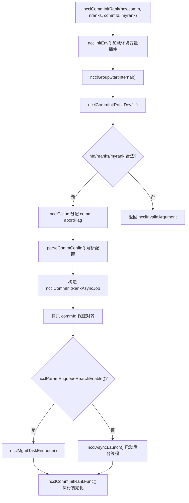
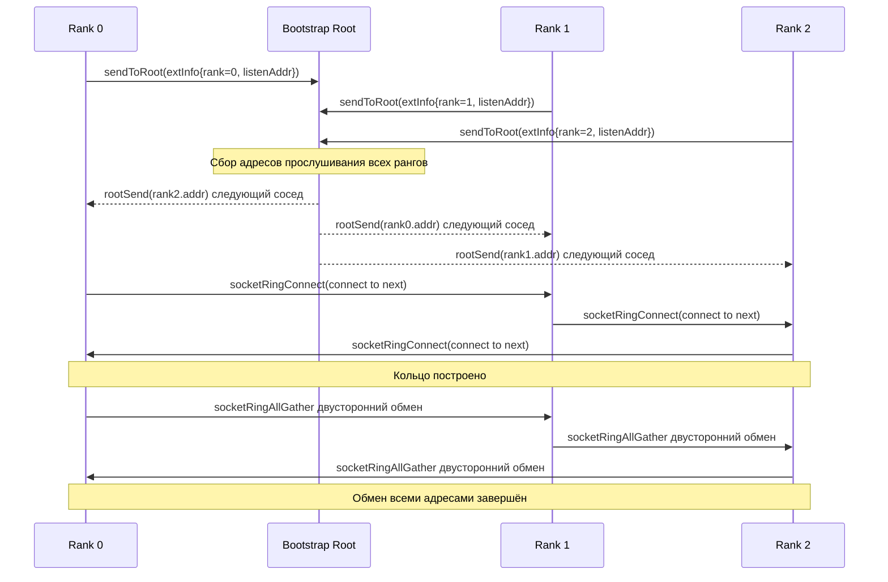
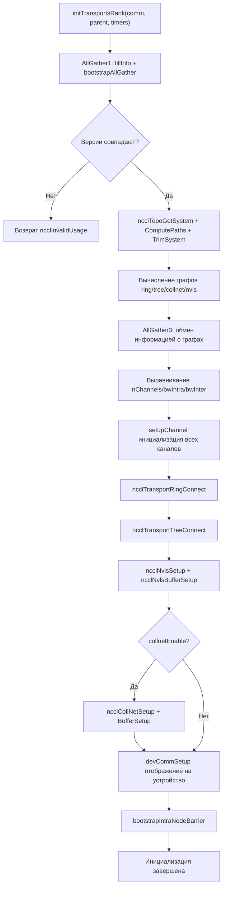

# Глава 3: Вход в инициализацию: как ncclCommInitRank формирует коммуникационный домен

# Глава 3: Вход в инициализацию: как ncclCommInitRank превращает группу изолированных процессов в коммуникационный домен

В предыдущей главе мы установили пять ключевых абстракций, проходящих через всю книгу: ncclComm, channel, algorithm, protocol и transport, которые вместе образуют общий словарь «одна коммуникация = несколько channel × один algorithm × один protocol × несколько transport». Теперь мы ответим на более фундаментальный вопрос: как этот объект ncclComm вообще создаётся с нуля? Когда вы вызываете ncclCommInitRank, NCCL должен за несколько сотен миллисекунд выполнить ряд сложных операций: убедиться, что все rank на месте, обменяться информацией об устройствах, исследовать топологию машины, вычислить пути передачи данных, выделить память GPU и хоста и, наконец, упаковать всё это в объект ncclComm. В этой главе мы пройдём по этой цепочке вызовов от точки входа API вплоть до последнего капилляра initTransportsRank.

# 3.1 Точка входа API: синхронная оболочка и асинхронное ядро ncclCommInitRank

## Интуитивная модель

`ncclCommInitRank`Внешне это «создание домена коммуникации», но на самом деле он делает «запуск фоновой задачи и (по умолчанию) ожидание её завершения». Это как заказ еды в ресторане: само действие заказа (вызов API) мгновенно возвращает управление, но приготовление блюда на кухне (настоящая инициализация) происходит в фоне. Режим по умолчанию — «блокирующий» — просто заставляет вас ждать у стойки, пока блюдо будет готово, а «неблокирующий» даёт вам номерок, и вы можете пока заняться другими делами.

Без этого асинхронного дизайна NCCL во время инициализации не смог бы взаимодействовать с захватом CUDA Graph, параллельной инициализацией нескольких доменов коммуникации и другими сценариями — вся инициализация превратилась бы в последовательные блокирующие операции, которые нельзя перекрыть с пользовательским кодом.

## Структуры данных и размещение в памяти

Сначала посмотрим на саму точку входа API.`ncclCommInitRank`Это чрезвычайно тонкая синхронная оболочка:

[FACT:src/init.cc:2946-2970]

Она делает четыре вещи: вызывает`ncclInitEnv()`загружает плагин переменных окружения, включает метки производительности NVTX, читает текущий номер устройства CUDA, затем вызывает`ncclGroupStartInternal()`входит в семантику group и, наконец, делегирует фактическую работу`ncclCommInitRankDev`。

Обратите внимание на`ncclGroupStartInternal()` / `ncclGroupEndInternal()`эту пару вызовов — даже если вы инициализируете только один домен коммуникации, NCCL оборачивает его в семантику group. Это делается для единообразной обработки сценария «пользователь инициализирует несколько доменов коммуникации внутри одного group», чтобы не писать два набора кода для одного и нескольких доменов.

Настоящая проверка параметров и выделение объекта происходят в`ncclCommInitRankDev`:

[FACT:src/init.cc:2851-2943]

Эта функция — «главный диспетчерский пульт» всей цепочки. Сначала она проверяет параметры (`nId`диапазон,`nranks`/`myrank`корректность), затем выделяет`ncclComm`саму структуру, а также три поля, связанных с механизмом прерывания:`abortFlag`(атомарный флаг на стороне хоста),`abortFlagDev`(копия в фиксированной памяти, видимая со стороны устройства),`abortFlagRefCount`(счётчик ссылок, поскольку дочерние домены коммуникации, полученные через split, могут разделять abortFlag родительского домена).

Здесь есть один примечательный момент —`comm->startMagic = comm->endMagic = NCCL_MAGIC`：

[FACT:src/init.cc:2886-2886]

эта пара magic-значений, как «пломбы», зажата в начале и конце`ncclComm`структуры. Любая запись за границы или повреждение структуры нарушит эту пару magic, и последующие операции смогут обнаружить затирание памяти, проверив их. Это дешёвая, но эффективная защита целостности памяти.

## Step-by-Step Walkthrough

Когда`ncclCommInitRankDev`доходит до конца, она создаёт`ncclCommInitRankAsyncJob`и запускает асинхронную задачу:

[FACT:src/init.cc:2896-2929]

`job`Структура несёт все параметры, необходимые для инициализации. Обратите внимание, что`job->commId`это**копия**, а не прямая ссылка на переданный пользователем`commId`：

[FACT:src/init.cc:2903-2910]

Почему копия? Комментарий в исходном коде даёт ответ:`ncclUniqueId`и`ncclBootstrapHandle`имеют разные требования к выравниванию, и переданный пользователем массив может быть не выровнен по границе, необходимой для`ncclBootstrapHandle`. Копирование во вновь выделенную память гарантирует выравнивание. Это типичная «ловушка совместимости ABI» — пользователь видит`ncclUniqueId`, а внутри это должно использоваться как`ncclBootstrapHandle`, оба имеют одинаковый размер, но разное выравнивание.

Наконец, в зависимости от значения`ncclParamEnqueueRearchEnable()`задача либо попадает в очередь управления, либо запускается напрямую через`ncclAsyncLaunch`:

[FACT:src/init.cc:2922-2929]

`ncclAsyncLaunch`создаёт новый поток для выполнения`ncclCommInitRankFunc`. Если режим блокирующий (по умолчанию), вызывающая сторона ждёт завершения этого потока в`ncclGroupEndInternal()`; если режим неблокирующий, вызывающая сторона немедленно возвращает управление, а пользователь впоследствии опрашивает состояние через`ncclCommGetAsyncError`.

## Размышления о дизайне

Ключевая идея дизайна здесь — «синхронный API + асинхронная реализация». Почему бы не заставить`ncclCommInitRank`напрямую синхронно выполнять всю инициализацию? Потому что NCCL должен поддерживать неблокирующий режим`ncclCommInitRankConfig`, а неблокирующий режим требует выполнения инициализации в фоновом потоке. Если бы синхронный и асинхронный пути были двумя наборами кода, затраты на сопровождение удвоились бы. Всё идёт через асинхронный путь, а синхронный путь — это просто «запустить и сразу ждать», код существует в одном экземпляре.


```

# 3.2 Bootstrap: первый канал управления между rank

## Интуитивная модель

Bootstrap — это «групповой чат перед совещанием» в NCCL. Прежде чем начнётся正式ная коммуникация, все rank должны сначала установить канал управления, чтобы обменяться метаданными: «кто я, на какой я машине, какая у меня модель GPU, какой у меня адрес сетевой карты». Без bootstrap rank — это группа незнакомцев, не способных координировать никакую коммуникацию.

Если bootstrap завершается неудачей или по тайм-ауту, инициализация всего домена коммуникации зависает — это одна из самых распространённых причин зависания NCCL в производственной среде.

## Структуры данных и размещение в памяти

Основное состояние Bootstrap хранится в`bootstrapState`структуре:

[FACT:src/bootstrap.cc:527-546]

В этой структуре есть несколько ключевых полей, которые стоит рассмотреть подробнее:

- `ring`: объединение (union), которое либо является дескриптором сетевого устройства (`net.sendComm`/`net.recvComm`), либо парой сокетов (`socket.send`/`socket.recv`). Это соответствует двум режимам bootstrap: режиму по умолчанию на основе сокетов и режиму на основе сетевого устройства`NCCL_OOB_NET_ENABLE`.
- `listen`: информация о стороне прослушивания, также имеющая две формы — сетевую и сокетную.
- `peerP2pAddresses` / `peerProxyAddresses`: массив P2P-адресов и proxy-адресов всех рангов, заполняемый через ring allgather.
- `unexpectedConnections`: связанный список, кэширующий соединения, которые «получены, но ещё не сопоставлены». Это ключевое проектное решение протокола bootstrap — поскольку принимающая сторона не может заранее знать, кто подключится первым, несопоставленные соединения необходимо сначала сохранить.
- `asyncSendQueue` + `asyncSendLock` + `asyncSendCond`: очередь асинхронной отправки и её примитивы синхронизации, используемые для параллельной отправки в режиме TLS-шифрования.

`bootstrapState`Распределение`bootstrapInit`происходит в начале

[FACT:src/bootstrap.cc:769-776]

Обратите внимание на строку`comm->bootstrap = state`— состояние bootstrap привязывается к коммуникационному домену, и все последующие операции bootstrap обращаются к нему через`comm->bootstrap`.

## Step-by-Step Walkthrough

`bootstrapInit`— это основная функция bootstrap. Разберём её в порядке выполнения:

**Шаг первый: определение значения magic.**magic — это «пароль» для bootstrap-связи; только ранги с одинаковым magic могут соединяться друг с другом.

[FACT:src/bootstrap.cc:778-788]

При обычной инициализации (`handles != NULL`) magic берётся из первого handle; при split/grow (`parent != NULL`) magic выводится через`hashCombine(parent->magic, parent->childCount)`. Это гарантирует уникальный magic для каждого подчинённого коммуникационного домена.

**Шаг второй: создание слушающего сокета.**Каждому рангу нужны две точки прослушивания: одна для соединений с соседями по ring (`STATE_LISTEN(state, socket)`), другая для соединений с root (`listenSockRoot`）：

[FACT:src/bootstrap.cc:797-831]

Здесь есть ключевое разделение обязанностей: слушающий сокет ring использует`comm->magic`, а слушающий сокет root использует`BOOTSTRAP_HANDLE(handles, curr_root)->magic`. Почему? Потому что root — глобальный координатор, к нему подключаются все ранги, поэтому он использует единый magic; а соседи по ring соединяются попарно, и им достаточно собственного magic коммуникационного домена.

**Шаг третий: разнесённое по времени подключение.**Когда количество рангов велико, одновременное подключение всех рангов к root вызывает шторм соединений. NCCL использует`NCCL_UID_STAGGER_RATE`и`NCCL_UID_STAGGER_THRESHOLD`для управления разнесением по времени:

[FACT:src/bootstrap.cc:833-843]

Когда число рангов, за которые отвечает некоторый root, превышает порог (по умолчанию 256), каждый ранг вычисляет задержку в микросекундах на основе своего локального ID под этим root, а затем выполняет sleep. Это простой, но эффективный механизм ограничения скорости типа «token bucket».

**Шаг четвёртый: отправка root своей информации о соединении.**Каждый ранг отправляет root свой адрес прослушивания:

[FACT:src/bootstrap.cc:845-867]

Получив информацию от всех рангов, root выполняет «кольцевое сопоставление» — отправляет адрес ранга i рангу i-1, а адрес ранга i+1 — рангу i. Так каждый ранг узнаёт своих соседей по ring спереди и сзади.

**Шаг пятый: установка ring-соединений.**Каждый ранг подключается к своему «следующему» соседу и одновременно принимает подключение от «предыдущего» соседа:

[FACT:src/bootstrap.cc:885-894]

Здесь`socketRingConnect`внутри использует`bootstrapConcurrent`— в режиме TLS-шифрования connect и accept должны выполняться параллельно, иначе возникнет взаимоблокировка (поскольку TLS-рукопожатие требует одновременного участия обеих сторон). В нешифрованном режиме connect и accept выполняются последовательно.

**Шаг шестой: AllGather всех адресов.**После установки ring через`ringAllInfo`выполняется allgather всех P2P-адресов, proxy-адресов и UDS-адресов всех рангов:

[FACT:src/bootstrap.cc:934-938]

`ringAllInfo`внутри вызывает`bootstrapAllGather`, который в режиме сокетов использует`socketRingAllGather`— двунаправленный алгоритм ring allgather, требующий всего N/2 шагов для N рангов:

[FACT:src/bootstrap.cc:1363-1412]

Этот двунаправленный алгоритм — ключевая оптимизация производительности bootstrap. Традиционный однонаправленный ring allgather требует N-1 шагов, двунаправленная версия вдвое сокращает число шагов. На каждом шаге данные одновременно отправляются и принимаются в двух направлениях, а`socketDoubleSendRecv`упаковывает 4 операции (2 отправки и 2 приёма) в один системный вызов.

## Управление параллелизмом и взаимодействие с нижним уровнем

Управление параллелизмом в Bootstrap имеет несколько уровней:

**Первый уровень: проверка abort.**Все блокирующие циклы периодически проверяют abortFlag:

[FACT:src/bootstrap.cc:150-159]

`BOOTSTRAP_N_CHECK_ABORT`Значение

**установлено в 10000, что означает проверку флага abort каждые 10000 итераций цикла. Это число — компромисс между производительностью и отзывчивостью: слишком частая проверка снижает производительность, слишком редкая — увеличивает задержку реакции на abort.**Второй уровень: очередь асинхронной отправки.`bootstrapSend`В режиме TLS-шифрования

[FACT:src/bootstrap.cc:1161-1217]

не может выполняться синхронно (поскольку TLS-рукопожатие требует участия принимающей стороны), поэтому NCCL помещает операции отправки в отдельный поток:`bootstrapAsyncSendMain`Здесь есть изящный механизм гарантии порядка.

[FACT:src/bootstrap.cc:1124-1152]

Зачем нужно гарантировать порядок отправки для одной и той же пары (peer, tag)? В комментариях к исходному коду это объясняется предельно ясно: получатель сопоставляет соединения по (peer, tag), и если два сообщения, отправленных одному и тому же (peer, tag), прибудут в обратном порядке, получатель сопоставит их неправильно. Во время инициализации NVLS несколько раз выполняется широковещательная рассылка одному и тому же peer с одним и тем же tag, поэтому эта гарантия порядка необходима.

**Третий уровень: очередь неожиданных соединений.**Получатель не может предсказать, кто подключится первым, поэтому`socketAccept`помещает несовпадающие соединения в`unexpectedConnections`связанный список:

[FACT:src/bootstrap.cc:1276-1300]

Эта архитектура решает классическую проблему распределённых систем: несколько рангов могут одновременно инициировать соединение с вами, но ваш`bootstrapRecv`порядок вызовов фиксирован. Если несовпадающие соединения просто отбрасывать, отправитель получит тайм-аут; если блокироваться в ожидании, может возникнуть взаимоблокировка. Помещение в очередь — самый безопасный подход.

## Руководство по избежанию проблем в production

**Проблема первая: тайм-аут bootstrap приводит к зависанию инициализации.**Если какой-либо ранг из-за проблем с сетью не может подключиться к root, все остальные ранги будут бесконечно ждать на`ncclSocketAccept`или`ncclSocketRecv`. В NCCL нет встроенного механизма тайм-аута bootstrap, единственный путь к спасению — abortFlag. В production рекомендуется установить`NCCL_UID_STAGGER_RATE`для смягчения шторма подключений в крупномасштабных кластерах.

**Проблема вторая:`NCCL_COMM_ID`конфликтует с несколькими handle.**Когда пользователь устанавливает`NCCL_COMM_ID`переменную окружения, NCCL принудительно понижает`nId`до 1:

[FACT:src/init.cc:2912-2921]

Это означает, что`ncclCommInitRankScalable`функция нескольких handle будет молча отключена. Если вы используете scalable-инициализацию и при этом установили`NCCL_COMM_ID`, поведение будет отличаться от ожидаемого.

**Проблема третья: взаимоблокировка в режиме TLS.**В режиме TLS-шифрования, если connect и accept не выполняются параллельно, обе стороны застрянут на TLS-рукопожатии.`bootstrapConcurrent`Именно для решения этой проблемы:

[FACT:src/bootstrap.cc:648-669]

В нешифрованном режиме выполняется последовательно (сначала send, затем recv), в шифрованном режиме запускается поток для обработки send, а основной поток обрабатывает recv.



# 3.3 commAlloc: каркас памяти коммуникационного домена

## Интуитивная модель

`commAlloc`— это "сдача черновой отделки" коммуникационного домена: он выделяет память под структуру, инициализирует все поля безопасными значениями по умолчанию, создаёт необходимые объекты CUDA и примитивы синхронизации, но ещё не заполняет топологию, конфигурацию каналов, транспортные соединения — всё то, что относится к "чистовой отделке". Если представить`ncclComm`как здание, то`commAlloc`— это закладка фундамента и возведение каркаса,`initTransportsRank`— это внутренняя отделка.

Без инициализации`commAlloc`последующий код, обращающийся к неинициализированным полям, приведёт к непредсказуемому поведению — например, если`comm->channels[c].id`содержит случайное значение, логика инициализации каналов неправильно определит состояние канала.

## Структуры данных и разметка памяти

`commAlloc`сигнатура и проверка в начале:

[FACT:src/init.cc:512-526]

Сначала проверяется корректность`ndev`и`rank`, затем создаются два стека памяти (`memPermanent`и`memScoped`), устанавливаются`rank`и`nRanks`. Эти два стека памяти — инфраструктура управления памятью NCCL:`memPermanent`используется для выделений, время жизни которых совпадает с коммуникационным доменом,`memScoped`используется для временных выделений.

Далее — обнаружение устройств CUDA:

[FACT:src/init.cc:528-531]

`cudaGetDevice`получает номер текущего устройства,`ncclCudaCompCap`получает вычислительную способность. Комментарий в исходном коде говорит прямо: "Try to create a CUDA object right away. If there is something wrong with the device we're on, better know it early." — выявить проблемы с устройством как можно раньше, чтобы не обнаружить их на поздних этапах инициализации.

Затем — выделение или наследование общих ресурсов:

[FACT:src/init.cc:533-555]

Здесь есть важное ветвление: если`parent == NULL || !parent->shareResources`, создаётся новый`ncclSharedResources`; иначе наследуются общие ресурсы родительского коммуникационного домена и увеличивается счётчик ссылок.`ncclSharedResources`содержит потоки устройства, хостовые потоки, события запуска, scratch-события и т.д. — эти ресурсы в сценарии split могут переиспользоваться дочерними коммуникационными доменами, что позволяет избежать повторного создания.

Обратите внимание на строку`sharedRes->refCount = 1`— начальный счётчик ссылок равен 1, он увеличивается при каждом совместном использовании через split, и реальное уничтожение происходит только при освобождении последней ссылки.

Далее — инициализация сети, RMA, GIN:

[FACT:src/init.cc:547-549]

Эти три подсистемы отвечают соответственно за сетевую передачу, удалённый доступ к памяти и сетевые коммуникации, инициируемые GPU. Порядок их инициализации имеет значение —`ncclNetInit`должен предшествовать`ncclRmaInit`, поскольку RMA зависит от сетевого плагина.

Инициализация менеджера памяти:

[FACT:src/init.cc:567-576]

Здесь также есть два пути: общий и новый.`ncclMemManager`отвечает за управление пулом памяти CUDA и кэшем регистраций.

Маркер инициализации каналов:

[FACT:src/init.cc:607-608]

Эта строка устанавливает для всех каналов`id`значение -1, что означает "не инициализирован". Последующий`setupChannel`проверит это значение, чтобы решить, нужна ли инициализация.

Конструирование очередей прерываний:

[FACT:src/init.cc:619-632]

NCCL использует интрузивные очереди (intrusive queue) для управления различными задачами. На этапе`commAlloc`все эти очереди конструируются пустыми и впоследствии используются напрямую при постановке задач в очередь.

Создание пула памяти CUDA:

[FACT:src/init.cc:636-652]

Если устройство поддерживает пул памяти (`cudaDevAttrMemoryPoolsSupported`), создаётся пул памяти типа pinned, а порог освобождения устанавливается в максимальное значение (`~uint64_t(0)`), что означает "никогда не освобождать автоматически". Это делается для того, чтобы среда выполнения CUDA не освобождала память без ведома NCCL.

## Step-by-Step Walkthrough

Давайте проследим конкретный сценарий инициализации: одна машина, 8 GPU, один ранг на процесс, нормальная инициализация.

1. `commAlloc(comm, NULL, 8, rank)`вызывается,`parent == NULL`。

2. Проверка пройдена,`comm->rank = rank`，`comm->nRanks = 8`。

3. `cudaGetDevice`возвращает номер текущего устройства,`comm->compCap`устанавливается.

4. Создаётся новый`ncclSharedResources`, счётчик ссылок равен 1.

5. `ncclNetInit`Инициализация сетевого плагина (возможно, Socket или IB).

6. `ncclMemManagerInit`Создание менеджера памяти.

7. `getBusId`Получение ID шины PCI,`ncclNvmlDeviceGetHandleByPciBusId`Получение дескриптора NVML.

8. `dmaBufSupported`Проверка поддержки DMA-BUF.

9. Выделение`connectSend` / `connectRecv`массива битовой карты.

10. Все каналы`id`устанавливаются в -1.

11. Построение всех очередей прерываний.

12. Создание пула памяти CUDA.

## Размышления о дизайне

`commAlloc`Самым интересным дизайнерским решением в  является принцип "раннего отказа". Он вызывает`cudaGetDevice`в начале функции, а не ждёт, пока информация об устройстве понадобится позже. Преимущество в том, что если с устройством есть проблемы (например, оно занято другим процессом), ошибка проявится на раннем этапе инициализации, а не после выделения большого объёма памяти.

Ещё одно дизайнерское решение — инициализация`preconnectNext`:

[FACT:src/init.cc:598-598]

`reinterpret_cast<struct ncclComm*>(0x1)`— это сигнальное значение, используемое для отметки состояния "следующее предсоединение". Такой приём с использованием недопустимого значения указателя в качестве маркера состояния часто встречается в системном программировании — он экономит память по сравнению с дополнительным булевым полем, но требует осторожности, чтобы не разыменовать его.

# 3.4 initTransportsRank: обнаружение топологии и распределение каналов

## Интуитивная модель

`initTransportsRank`— это "сердце" инициализации. Он выполняет три основные задачи: через два AllGather обменивается информацией об устройствах и топологии всех rank'ов; на основе этой информации вычисляет структуры графов для алгоритмов ring/tree/collnet/nvls; и наконец устанавливает все транспортные соединения. Если сравнить коммуникационный домен с транспортной системой города,`initTransportsRank`— это процесс планирования всех дорог, развязок и автобусных маршрутов.

Без этого шага NCCL не знал бы, по какому пути должны идти данные — он мог бы отправить данные в объезд или вообще не найти достижимого пути.

## Структуры данных и размещение в памяти

`initTransportsRank`В  очень много локальных переменных, рассмотрим ключевые:

[FACT:src/init.cc:1163-1179]

Здесь из`comm->graphs`массива извлекаются различные структуры графов и создаются псевдонимы.`graphs`Массив индексируется по алгоритму, обратите внимание, что`nvlsGraph`используется дважды (NVLS и NVLSTree совместно используют одну и ту же структуру графа).

Две ключевые временные структуры:

[FACT:src/init.cc:1181-1206]

`graphInfo`хранит информацию о графе для одного rank'а для определённого алгоритма (число каналов, пропускная способность, тип и т.д.),`allGatherInfo`— это единица данных AllGather, содержащая информацию о графах всех алгоритмов плюс информацию о топологическом rank'е.

## Step-by-Step Walkthrough

**Этап первый: AllGather1 — обмен информацией об устройствах.**

[FACT:src/init.cc:1234-1239]

Каждый rank вызывает`fillInfo`заполняет свой`ncclPeerInfo`, затем обменивается через`bootstrapAllGather`.`fillInfo`Заполняемая информация включает: номер rank'а, номер устройства CUDA, номер устройства NVML, версию NCCL, git hash, хеш хоста, хеш процесса, UUID GPU, ID шины, размер видеопамяти, версию драйвера и т.д.

[FACT:src/init.cc:888-982]

Обратите внимание на`info->hostHash = getHostHash() + commHash`и`info->pidHash = getPidHash() + commHash`— к host hash и pid hash добавлен commHash. Это делается для различения разных коммуникационных доменов на одной машине.

После завершения AllGather каждый rank обходит информацию всех peer'ов и вычисляет глобальные свойства:

[FACT:src/init.cc:1250-1303]

Этот цикл делает многое: обнаруживает несовпадение версий, подсчитывает количество узлов, вычисляет пересечение`cuMemSupport`, обнаруживает, используют ли несколько rank'ов один и тот же GPU, вычисляет пересечение масок типов GIN и т.д. Обратите внимание на способ подсчёта`nNodes`— при каждом обнаружении другого hostHash счётчик увеличивается, что предполагает, что rank'и расположены последовательно по узлам.

**Этап второй: обнаружение топологии.**

[FACT:src/init.cc:1390-1403]

Эти шесть шагов — ядро процесса обнаружения топологии:`ncclTopoGetSystem`перечисляет системные устройства и строит граф топологии,`ncclTopoComputePaths`вычисляет пути от GPU к NIC,`ncclTopoTrimSystem`удаляет недостижимые устройства, снова вычисляет пути,`ncclTopoSearchInit`инициализирует состояние поиска и, наконец, выводит топологию.

**Этап третий: вычисление графов.**

[FACT:src/init.cc:1421-1468]

Последовательно вычисляются пять графов: ring, tree, collnet chain, collnet direct, nvls. Каждый граф имеет свои ограничения по pattern и числу каналов. Обратите внимание на`treeGraph->minChannels = ringGraph->nChannels`— число каналов для tree ограничено так, чтобы совпадать с ring, это делается для выравнивания каналов между разными алгоритмами.

**Этап четвёртый: AllGather3 — обмен информацией о графах.**

[FACT:src/init.cc:1490-1533]

Каждый rank записывает свою информацию о графах в`allGather3Data[rank]`, затем снова`bootstrapAllGather`. На этот раз обмениваемая информация включает: pattern/nChannels/bwIntra/bwInter/typeIntra/typeInter/crossNic для каждого алгоритма, архитектуру CPU, число каналов P2P, число сетевых устройств, число устройств CollNet и т.д.

После завершения AllGather3 каждый rank обходит информацию о графах всех peer'ов и выравнивает, беря минимальные/максимальные значения:

[FACT:src/init.cc:1687-1703]

Обратите внимание на стратегию выравнивания:`nChannels`、`sameChannels`、`bwIntra`、`bwInter`берётся минимум,`typeIntra`、`typeInter`、`crossNic`берётся максимум. Почему? Потому что число каналов и пропускная способность ограничены самым слабым звеном, а тип и crossNic нужно объединять, чтобы обеспечить совместимость.

**Этап пятый: установка транспортных соединений.**

[FACT:src/init.cc:1811-1892]

Здесь есть две ветви:`runtimeConn`если истинно, выполняется только настройка каналов без соединений (соединения откладываются до времени выполнения), иначе все соединения устанавливаются немедленно. Порядок соединений: ring → tree → NVLS → PAT → NVLS tree → CollNet.

## Управление параллелизмом и взаимодействие с оборудованием

`initTransportsRank`В  есть несколько заслуживающих внимания точек параллелизма/взаимодействия с оборудованием:

**Настройка привязки к CPU:**

[FACT:src/init.cc:1406-1412]

NCCL привязывает текущий поток к ядрам CPU, близким к GPU, обеспечивая выделение памяти хоста на локальном узле NUMA. Это снижает задержку при кросс-NUMA доступе.

**Инициализация NVLS:**

[FACT:src/init.cc:1419-1419]

`ncclNvlsInit`Проверка поддержки NVLink SHARP. NVLS позволяет коммутатору напрямую выполнять операцию reduce, значительно снижая задержку AllReduce.

**Создание прокси-потоков:**

[FACT:src/init.cc:1780-1786]

Прокси-потоки отвечают за асинхронное продвижение сетевого ввода-вывода. Они создаются в`initTransportsRank`, после чего все сетевые операции выполняются через прокси.

## Руководство по избежанию проблем в production

**Проблема первая: несовпадение количества сетевых устройств.**Если количество локальных сетевых карт различается у разных rank, NCCL выдаст ошибку:

[FACT:src/init.cc:1576-1596]

Если только не установлено`NCCL_IGNORE_NET_MISMATCH=1`. Это часто встречается в гетерогенных кластерах — на некоторых узлах 8 сетевых карт, на других только 4. Игнорирование несовпадения может привести к снижению производительности, так как количество каналов будет ограничено самым слабым узлом.

**Проблема вторая: несколько rank используют один и тот же GPU.**Если UUID GPU у двух rank совпадают, NCCL откажется инициализироваться:

[FACT:src/init.cc:1291-1296]

Если только не установлено`NCCL_MULTI_RANK_GPU_ENABLE=1`. Эта проверка предотвращает проблемы производительности из-за ошибочной конфигурации пользователя.

**Проблема третья: недостаточное количество узлов CollNet.**CollNet требует как минимум`NCCL_COLLNET_NODE_THRESHOLD`узлов для включения:

[FACT:src/init.cc:1720-1728]

Порог по умолчанию — 2. В одноузловой среде CollNet автоматически отключается.



# 3.5 NCCL_PARAM: магия системы переменных окружения на этапе компиляции

## Интуитивная модель

`NCCL_PARAM`— это "фабрика переключателей конфигурации" NCCL. Она использует макрос для генерации функции на этапе компиляции, которая при первом вызове во время выполнения считывает переменную окружения и кэширует результат. Это как выключатель света дома — вы щёлкаете (вызываете функцию), свет загорается (возвращается значение конфигурации), после чего состояние переключателя запоминается, и не нужно щёлкать каждый раз заново.

Без этого механизма NCCL пришлось бы в каждом месте использования конфигурации вручную вызывать`getenv`и разбирать строку, код стал бы чрезвычайно многословным и подверженным ошибкам.

## Структура данных и размещение в памяти

`NCCL_PARAM`Определение макроса:

[FACT:src/include/param.h:22-31]

Этот макрос после раскрытия генерирует функцию`ncclParam##name()`, внутри которой три статических переменных:

- `uninitialized = INT64_MIN`: сигнальное значение, означающее "ещё не инициализировано".
- `noCache`: трёхсостоятельный флаг, -1 означает не инициализировано, 0 означает кэшировать, 1 означает не кэшировать.
- `cache`: кэшированное значение, изначально`uninitialized`。

Логика функции: если`cache`всё ещё`uninitialized`, вызвать`ncclLoadParam`для загрузки; иначе напрямую вернуть`cache`。`COMPILER_EXPECT(..., false)`сообщает компилятору, что эта ветка выполняется редко, оптимизируя горячий путь.

`ncclLoadParam`Реализация:

[FACT:src/misc/param.cc:78-108]

Она использует мьютекс для защиты всего процесса загрузки, сначала проверяет`noCache`стратегию, затем проверяет, действителен ли кэш, после чего считывает переменную окружения и разбирает её. При неудаче разбора используется значение по умолчанию и выводится предупреждение.

## Step-by-Step Walkthrough

На примере`NCCL_PARAM(BuffSize, "BUFFSIZE", -2)`:

[FACT:src/init.cc:1007-1007]

После раскрытия макроса генерируется:

```cpp
int64_t ncclParamBuffSize() {
  constexpr int64_t uninitialized = INT64_MIN;
  static int8_t noCache = -1;
  static_assert(-2 != uninitialized, "...");
  static int64_t cache = uninitialized;
  if (COMPILER_EXPECT(COMPILER_ATOMIC_LOAD(&cache, std::memory_order_relaxed) == uninitialized, false)) {
    return ncclLoadParam("NCCL_BUFFSIZE", -2, uninitialized, &cache, &noCache);
  }
  return cache;
}
```

При первом вызове,`cache == uninitialized`, входит в`ncclLoadParam`. Она считывает`NCCL_BUFFSIZE`переменную окружения, если не установлена, возвращает значение по умолчанию -2. Затем в соответствии с`noCache`стратегией решает, кэшировать ли.

`noCache`Стратегия определяется`ncclParamIsCacheDisabled`:

[FACT:src/misc/param.cc:74-76]

Если имя переменной окружения соответствует некоторому шаблону (например, заканчивается на`_`), то не кэшировать, считывать заново каждый раз. Это позволяет пользователю динамически изменять некоторые конфигурации во время выполнения.

## Размышления о дизайне

Изящество этого дизайна в "абстракции с нулевой стоимостью": на горячем пути только одна атомарная загрузка и сравнение, без блокировок, без разбора строк. Холодный путь (первая загрузка) только платит полную цену.`COMPILER_EXPECT`подсказывает компилятору разместить горячий путь в начале кэша инструкций, дополнительно повышая производительность.

Ещё один аспект дизайна —`noCache`трёхсостоятельный дизайн. -1 означает "ещё не решено", 0 означает "кэшировать", 1 означает "не кэшировать". Это решение принимается только один раз при первой загрузке и больше не меняется.

## Руководство по избежанию проблем в production

**Проблема первая: опечатка в переменной окружения.**Если пользователь написал`NCCL_BUFSIZE`вместо`NCCL_BUFFSIZE`, NCCL не выдаст ошибку, а просто использует значение по умолчанию. Рекомендуется использовать`NCCL_DEBUG=ENV`для просмотра всех распознанных переменных окружения.

**Проблема вторая:`NCCL_CONF_FILE`порядок загрузки.**NCCL последовательно загружает`$NCCL_CONF_FILE`(или`~/.nccl.conf`) и`/etc/nccl.conf`：

[FACT:src/misc/param.cc:52-67]

Файл, загруженный позже, перезаписывает загруженный ранее. Если оба файла устанавливают одну и ту же переменную,`/etc/nccl.conf`значение вступит в силу.

**Проблема третья:`noCache`потокобезопасность переменной.**Комментарий в исходном коде говорит "noCache is only load/stored within the mutex, no need for atomic":

[FACT:src/misc/param.cc:74-76]

Это означает, что`noCache`чтение и запись защищены мьютексом, атомарные операции не нужны. Но`cache`чтение безблокировочное (горячий путь), поэтому используется атомарная загрузка.

# 3.6 devCommSetup: отображение коммуникационного домена на устройство

## Интуитивная модель

`devCommSetup`— это "проекция коммуникационного домена на сторону устройства". GPU kernel выполняется на устройстве и не может напрямую обращаться к`ncclComm`структуре в памяти хоста. Поэтому NCCL нужно скопировать ключевые поля коммуникационного домена в память, доступную устройству, формируя`ncclDevComm`. Это как скопировать корпоративную телефонную книгу и положить на рабочее место каждого сотрудника — сотруднику не нужно каждый раз бежать к стойке регистрации, чтобы узнать телефон коллеги.

Без`devCommSetup`GPU kernel не смог бы узнать свой rank, конфигурацию каналов, размер буфера и другую информацию, и ядро коллективной коммуникации вообще не могло бы запуститься.

## Структура данных и размещение в памяти

`devCommSetup`Использует временную структуру`ncclKernelCommAndChannels`для упаковки данных, которые нужно скопировать на устройство:

[FACT:src/init.cc:712-746]

Эта структура содержит`ncclDevComm`(коммуникационный домен на стороне устройства) и массив каналов. Функция сначала заполняет временную структуру данными со стороны хоста, затем одним`cudaMemcpyAsync`на устройство.

Заполнение ключевых полей:

[FACT:src/init.cc:734-746]

Обратите внимание на`comm->devComm = &devCommAndChans->comm`— на стороне хоста`comm->devComm`указывает на`ncclDevComm`в памяти устройства. При последующем запуске ядра`comm->devComm`будет передан как параметр.

Заполнение информации о каналах:

[FACT:src/init.cc:829-843]

Указатели peers, ring, tree, collnetChain, collnetDirect, nvls каждого канала копируются на сторону устройства. Обратите внимание`ring.userRanks`требуется дополнительный`cudaMemcpyAsync`, поскольку это массив.

## Step-by-Step Walkthrough

1. Получение потока устройства:`ncclStrongStreamAcquire`Получается strong stream, чтобы обеспечить упорядоченное выполнение последующих асинхронных копирований.

2. Выделение памяти устройства:`ncclCudaCallocAsync`Выделяется`devCommAndChans`。

3. Заполнение временной структуры на стороне хоста: устанавливаются rank, nRanks, node, nNodes, abortFlag, buffSizes и т. д.

4. Выделение и копирование`rankToLocalRank`массива.

5. Вычисление`workFifoBytes`: определяется в зависимости от состояния CC (Confidential Computing).

6. Выделение буфера workFifo: в режиме GDR используется`ncclGdrCudaCalloc`, иначе используется`ncclCudaHostCalloc`。

7. Выделение счётчиков profiler.

8. Выделение счётчиков прогресса (если включено).

9. Заполнение информации о каналах.

10. Однократное копирование на устройство:`ncclCudaMemcpyAsync(devCommAndChans, &tmpCommAndChans, 1, deviceStream)`。

11. Освобождение strong stream и синхронизация.

## Размышления о дизайне

`devCommSetup`Самое примечательное в этом дизайне — «пакетное копирование». NCCL не вызывает`cudaMemcpy`отдельно для каждого поля, а упаковывает все поля во временную структуру и выполняет всё одним`cudaMemcpyAsync`. Это значительно сокращает количество вызовов CUDA API и накладные расходы на синхронизацию.

Ещё один аспект дизайна —`workFifoBytes`обработка CC:

[FACT:src/init.cc:750-763]

В режиме CC (Confidential Computing)`workFifoBytes`устанавливается в 0, поскольку копирование GDR в режиме CC недоступно. Это изящная деградация, обусловленная аппаратным ограничением.

## Руководство по избеганию проблем в production

**Проблема первая:`devCommSetup`должен вызываться до barrier.**Комментарий в исходном коде объясняет причину:

[FACT:src/init.cc:1950-1952]

Если вызвать после barrier, некоторые потоки могут уже начать запуск ядра NCCL, а память устройства ещё не выделена полностью, что приведёт к взаимоблокировке.

**Проблема вторая:`workFifoBytes`должно быть степенью двойки.**Если это не так, NCCL выдаст предупреждение и использует значение по умолчанию:

[FACT:src/init.cc:757-762]

# Вопросы для размышления и самопроверки по этой главе

Q1: Если убрать логику обнаружения «несколько rank используют один и тот же GPU» в[FACT:src/init.cc:1291-1296], в каких сценариях это приведёт к проблемам? Почему NCCL по умолчанию отклоняет такую конфигурацию?

**Разбор ответа**：

Этот код проверяет, совпадают ли GPU UUID двух rank на одном хосте. Если совпадают и`NCCL_MULTI_RANK_GPU_ENABLE=0`(по умолчанию), возвращается`ncclInvalidUsage`。

После удаления этой проверки несколько rank будут совместно использовать один GPU. Это приведёт к:

1. **Конфликтам P2P-передачи**: P2P-передача NCCL предполагает, что каждый rank монопольно владеет одним GPU. Если два rank совместно используют GPU, они одновременно записывают данные в один и тот же буфер одного и того же GPU, что приводит к гонкам данных и неверным результатам.

2. **Конфликтам распределения каналов**：`comm->channels`Ресурсы каналов (буферы, FIFO) в

3. **распределяются по rank. Rank, совместно использующие GPU, будут конкурировать за одни и те же ресурсы.**Катастрофическому падению производительности

: даже если нет проблем с корректностью, два rank, совместно использующие вычислительную мощность и пропускную способность памяти одного GPU, приведут к резкому снижению производительности.`NCCL_MULTI_RANK_GPU_ENABLE=1`NCCL по умолчанию отклоняет такую конфигурацию ради «быстрого отказа» — вместо того чтобы позволить пользователю потратить часы на отладку ошибочной конфигурации, лучше сразу выдать явную ошибку при инициализации.

предназначен для тех пользователей, которые точно знают, что делают (например, в сценариях MPS), как аварийный выход.[FACT:src/bootstrap.cc:1129-1134]Q2: Если убрать логику ожидания «более ранней отправки с тем же (peer, tag)» в

**, в каких сценариях это приведёт к ошибке сопоставления на стороне получателя?**：

Разбор ответа

Этот код в потоке асинхронной отправки ожидает, пока в очереди не останется более ранних отправок тому же (peer, tag).`socketAccept`После удаления этого ожидания две отправки одному и тому же (peer, tag) могут выполняться параллельно, и порядок их прибытия к получателю становится неопределённым. Получатель в

[FACT:src/bootstrap.cc:1291-1292]

сопоставляет соединения по (peer, tag):`bootstrapSend`Если отправитель A вызвал

раньше, но прибыл позже, а отправитель B вызвал позже, но прибыл раньше, получатель примет сообщение B за ответ на A. Это приведёт к смещению данных — получатель будет думать, что получил ответ на первый запрос, хотя на самом деле это ответ на второй.

Комментарий в исходном коде явно указывает на этот сценарий: «NVLS setup broadcasts to the same peers with the same tag several times during init». Во время инициализации NVLS несколько раз выполняется широковещательная рассылка одним и тем же peer с одним и тем же tag; если порядок нарушится, конфигурация NVLS полностью собьётся.

Цена этой гарантии порядка: отправки с одним и тем же (peer, tag) сериализуются. Но отправки с разными (peer, tag) по-прежнему выполняются параллельно, поэтому общая пропускная способность не страдает.[FACT:src/init.cc:1691-1697]Q3: Если в

**изменить стратегию выравнивания с «nChannels берётся min, typeIntra берётся max» на «всё берётся min» или «всё берётся max», к каким проблемам это приведёт в каждом случае?**：

Разбор ответа`nChannels`、`sameChannels`、`bwIntra`、`bwInter`Текущая стратегия:`typeIntra`、`typeInter`、`crossNic`берётся min,

**берётся max.**：`typeIntra`Если всё брать по min`typeInter`Взятие min приведёт к тому, что тип передачи некоторых rank будет понижен. Например, rank A поддерживает P2P (typeIntra=P2P), rank B поддерживает только SHM (typeIntra=SHM), после взятия min все rank используют SHM. Но значение перечисления SHM может быть меньше, чем у P2P, и взятие min выберет неправильный тип. Фактически`typeIntra`это битовая маска или перечисление, взятие max нужно для выбора типа с "наибольшими возможностями".

**Если везде брать max**：`nChannels`Взятие max приведёт к тому, что некоторым rank будет назначено больше каналов, чем они могут поддерживать. Например, rank A поддерживает только 4 канала, rank B поддерживает 8, после взятия max все rank попытаются использовать 8 каналов, rank A потерпит неудачу или производительность упадёт.`bwIntra`Взятие max приведёт к слишком оптимистичной оценке пропускной способности, и модуль tuning может выбрать неподходящий алгоритм.

Суть этой стратегии выравнивания такова:**ресурсные ограничения берут пересечение (min), перечисления возможностей берут объединение (max)**. Количество каналов и пропускная способность — это ограничения "верхнего предела", необходимо брать наиболее консервативное значение; тип передачи — это перечисление "возможностей", взятие максимума гарантирует, что все rank смогут найти совместимый способ передачи.

В следующей главе мы углубимся в обнаружение топологии и поиск по графу, чтобы увидеть, как NCCL перечисляет GPU, сетевые карты, PCI-коммутаторы в машине, строит полный граф топологии и ищет на этом графе оптимальные структуры ring и tree. Установленные в этой главе bootstrap-коммуникация, каркас памяти commAlloc, основной поток initTransportsRank будут поочерёдно раскрыты в следующей главе с деталями топологии.

На этом мы полностью прошли цепочку вызовов ncclCommInitRank и увидели весь процесс построения объекта ncclComm с нуля. Но в процессе инициализации есть один ключевой этап, который мы лишь бегло пропустили: как NCCL обнаруживает GPU и сетевые карты внутри машины и на основе этого решает, по какому пути должны идти данные? Именно этому посвящена следующая глава — обнаружение топологии и поиск по графу. Мы разберём, как src/graph/topo.cc перечисляет устройства PCI/NVLink/сетевые карты и строит граф топологии, как src/graph/search.cc ищет на этом графе оптимальный путь, а также как src/graph/rings.cc и trees.cc конкретизируют результаты поиска в топологии алгоритмов Ring и Tree. Поняв этот механизм, вы сможете осознать, почему NCCL способен автоматически выбирать подходящий алгоритм на разных машинах.
