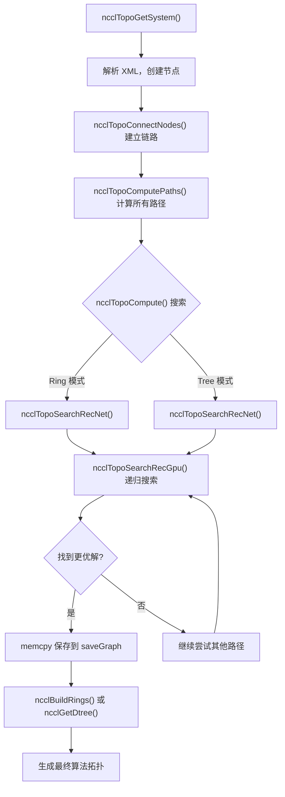
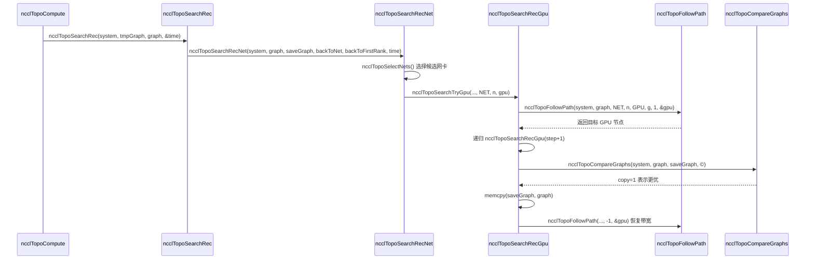

# Глава 4: Обнаружение топологии и поиск по графу: как NCCL "видит" физические взаимосвязи многоGPU-систем

В предыдущей главе мы, следуя по цепочке вызовов ncclCommInitRank, спускались слой за слоем и увидели момент заполнения поля comm->topo, но не раскрыли его внутреннюю структуру. Итак, как же NCCL "видит" GPU и сетевые карты в машине и организует их в пригодную для использования топологическую информацию? В этой главе мы разберём три ключевых этапа этого процесса: topo.cc отвечает за перечисление физических устройств в граф, search.cc ищет на этом графе оптимальный путь, а rings.cc и trees.cc конкретизируют результаты поиска в две топологии алгоритмов — Ring и Tree. Только поняв взаимодействие этих трёх компонентов, можно осознать, почему NCCL способен автоматически выбирать подходящий алгоритм на разных машинах.

# Граф топологии: рисуем машину как "схему метро"

## Интуитивная модель

Представьте, что вы курьер, только что прибывший в незнакомый город. Вам нужно доставить посылку из точки A в точку B, но вы не знаете, какой путь самый быстрый. Вам нужна карта — на ней отмечены все станции (GPU, сетевые карты, CPU, PCI-коммутаторы) и связи между станциями (NVLink, PCIe, сеть). Граф топологии NCCL — это и есть такая карта.

Без этой карты NCCL может лишь слепо предполагать, что "пропускная способность между всеми GPU одинакова"; на машине с 8 GPU, полностью соединёнными через NVLink, это, возможно, ещё сойдёт, но как только встречается сложная топология с跨 NUMA,跨 PCI-коммутаторами, смесью NVLink + PCIe, будет выбран неверный путь, и данные, которые должны были идти по NVLink, попадут в медленный PCIe, а производительность упадёт вдвое.

## Структуры данных и размещение в памяти

Ядром графа топологии является`ncclTopoSystem`, он хранит все устройства, сгруппированные по типам узлов. Типы узлов определены в`topoNodeTypeStr`массиве:

[FACT:src/graph/topo.cc:33-35]

```c
const char* topoNodeTypeStr[] = {"GPU", "PCI", "NVS", "CPU", "NIC", "NET", "GIN", "RMA", "DEV", "CXB"};
const char* topoLinkTypeStr[] = {"LOC", "NVL", "", "C2C", "PCI", "", "", "", "", "SYS", "NET"};
const char* topoPathTypeStr[] = {"LOC", "NVL", "NVB", "C2C", "PIX", "PXB", "P2C", "PXN", "PHB", "SYS", "NET", "DIS"};
```

Эти три массива определяют строковые представления типов узлов, типов связей и типов путей соответственно. Обратите внимание на`topoPathTypeStr`порядок — он одновременно служит ранжированием качества путей: чем меньше индекс, тем быстрее путь.`LOC`(локальный) самый быстрый,`DIS`(разрыв) самый медленный. Этот порядок впоследствии будет неоднократно использоваться при поиске для сравнения путей по качеству.

Каждый узел представлен`ncclTopoNode`и при создании инициализирует различные поля в зависимости от типа. Рассмотрим узел GPU:

[FACT:src/graph/topo.cc:105-141]

```c
ncclResult_t ncclTopoCreateNode(struct ncclTopoSystem* system, struct ncclTopoNode** node, int type, uint64_t id) {
  if (system->nodes[type].count == NCCL_TOPO_MAX_NODES) {
    WARN("Error : tried to create too many nodes of type %d", type);
    return ncclInternalError;
  }
  struct ncclTopoNode* n = system->nodes[type].nodes + system->nodes[type].count;
  system->nodes[type].count++;
  n->type = type;
  n->id = id;
  if (type == GPU) {
    n->gpu.dev = NCCL_TOPO_UNDEF;
    n->gpu.rank = NCCL_TOPO_UNDEF;
    n->gpu.cudaCompCap = NCCL_TOPO_UNDEF;
    n->gpu.mloPart = NCCL_TOPO_UNDEF;
  } else if (type == CPU) {
    ...
```

Здесь есть несколько ключевых моментов дизайна. Во-первых, узлы хранятся в предварительно выделенном массиве (`system->nodes[type].nodes`), а не в связном списке. Это означает, что узлы расположены в памяти непрерывно, что обеспечивает дружественность к кэшу при обходе. Во-вторых,`NCCL_TOPO_MAX_NODES`— это жёсткий верхний предел, при превышении которого выдаётся ошибка — это сделано для предотвращения бесконтрольного роста при аномалиях топологии. В-третьих, каждый узел имеет поле`id`, которое является 64-битным целым числом, где старшие 32 бита — это systemId (идентифицирует, какой это хост), а младшие 32 бита — localId (номер устройства внутри хоста).

Связи между узлами представлены`ncclTopoLink`.`ncclTopoConnectNodes`отвечает за установление двунаправленных соединений:

[FACT:src/graph/topo.cc:179-204]

```c
ncclResult_t ncclTopoConnectNodes(struct ncclTopoNode* node, struct ncclTopoNode* remNode, int type, float bw) {
  // Aggregate links into higher bw for NVLink
  struct ncclTopoLink* link;
  for (link = node->links; link - node->links != NCCL_TOPO_MAX_LINKS && link->remNode; link++) {
    if (link->remNode == remNode && link->type == type) break;
  }
  if (link - node->links == NCCL_TOPO_MAX_LINKS) {
    WARN("Error : too many Topo links (max %d)", NCCL_TOPO_MAX_LINKS);
    return ncclInternalError;
  }
  if (link->remNode == NULL) node->nlinks++;
  link->type = type;
  link->remNode = remNode;
  link->bw += bw;

  // Sort links in BW descending order
  struct ncclTopoLink linkSave;
  memcpy(&linkSave, link, sizeof(struct ncclTopoLink));
  while (link != node->links) {
    if ((link - 1)->bw >= linkSave.bw) break;
    memcpy(link, link - 1, sizeof(struct ncclTopoLink));
    link--;
  }
  memcpy(link, &linkSave, sizeof(struct ncclTopoLink));
  return ncclSuccess;
}
```

Эта функция делает три вещи. Во-первых, ищет, существует ли уже связь с тем же целевым узлом и того же типа — если существует, то пропускная способность суммируется (`link->bw += bw`). Это обрабатывает случай, когда несколько NVLink подключены к одному GPU: 4 NVLink по 25 ГБ/с каждый, после агрегации получается 100 ГБ/с. Во-вторых, если не найдено, добавляется новая связь. В-третьих, после вставки связи сортируются по убыванию пропускной способности, чтобы при последующем обходе в первую очередь встречались высокоскоростные связи.

> **[Design Inference & Architectural Trade-offs]**
> Мотивация сортировки по убыванию пропускной способности заключается в том, чтобы алгоритм поиска как можно раньше обнаруживал высокоскоростные пути и быстрее сходился к лучшему решению. Поиск имеет ограничение по времени (далее мы увидим`NCCL_SEARCH_TIMEOUT`), и сортировка позволяет потратить ограниченный временной бюджет на более перспективные пути.

## Пошаговое рассмотрение на конкретном сценарии

Теперь рассмотрим конкретный сценарий: сервер с 8 картами A100, каждая карта полностью соединена через NVLink, плюс 4 сетевые карты Mellanox ConnectX-6, установленные в слоты PCIe. При инициализации NCCL`ncclTopoGetSystem`вызывается, он читает информацию об устройствах из XML-файла (сгенерированного`nvidia-topologyd`или самим NCCL), а затем строит граф топологии.

Первый шаг — разбор узла CPU.`ncclTopoAddCpu`читает из XML архитектуру, производителя и модель CPU и создаёт узел CPU:

[FACT:src/graph/topo.cc:806-875]

```c
ncclResult_t ncclTopoAddCpu(struct ncclXmlNode* xmlCpu, struct ncclTopoSystem* system) {
  int numaId;
  NCCLCHECK(xmlGetAttrInt(xmlCpu, "numaid", &numaId));
  int systemId;
  NCCLCHECK(ncclGetSystemId(system, xmlCpu, &systemId));
  struct ncclTopoNode* cpu;
  NCCLCHECK(ncclTopoCreateNode(system, &cpu, CPU, NCCL_TOPO_ID(systemId, numaId)));
  ...
  for (int s = 0; s nSubs; s++) {
    struct ncclXmlNode* node = xmlCpu->subs[s];
    if (strcmp(node->name, "pci") == 0) NCCLCHECK(ncclTopoAddPci(node, system, cpu, systemId, numaId));
    if (strcmp(node->name, "nic") == 0) {
      ...
    }
  }
  return ncclSuccess;
}
```

Узел CPU является корнем дерева топологии. Под каждым CPU находятся поддерево PCI и узлы NIC.`ncclTopoAddPci`рекурсивно обрабатывает дерево PCI, при обнаружении GPU создаёт узел GPU, при обнаружении NIC создаёт узел NIC.

Второй шаг — добавление соединений NVLink. Обратите внимание, что`ncclTopoAddGpu`читает только базовые атрибуты GPU, и в комментарии явно указано "Do not go any further, nvlinks will be added in a second pass":

[FACT:src/graph/topo.cc:590-598]

```c
ncclResult_t ncclTopoAddGpu(struct ncclXmlNode* xmlGpu, struct ncclTopoSystem* system, struct ncclTopoNode* gpu) {
  NCCLCHECK(xmlGetAttrInt(xmlGpu, "rank", &gpu->gpu.rank));
  NCCLCHECK(xmlGetAttrInt(xmlGpu, "sm", &gpu->gpu.cudaCompCap));
  NCCLCHECK(xmlGetAttrInt(xmlGpu, "dev", &gpu->gpu.dev));
  NCCLCHECK(xmlGetAttrInt(xmlGpu, "gdr", &gpu->gpu.gdrSupport));
  NCCLCHECK(xmlGetAttrIntDefault(xmlGpu, "mlopart", &gpu->gpu.mlopart, NCCL_TOPO_UNDEF));
  // Do not go any further, nvlinks will be added in a second pass
  return ncclSuccess;
}
```

Почему нужно два прохода? Потому что NVLink — это соединение между GPU, и для установления связи необходимо, чтобы оба узла GPU уже существовали. Первый проход создаёт все узлы, второй проход`ncclTopoAddNvLinks`соединяет их.

Третий шаг — обработка сетевых устройств.`ncclTopoAddNic`обходит дочерние узлы net/gin/rma под NIC и вызывает соответствующие функции добавления. Рассмотрим`ncclTopoAddNet`в качестве примера:

[FACT:src/graph/topo.cc:461-503]

```c
static ncclResult_t ncclTopoAddNet(struct ncclXmlNode* xmlNet, struct ncclXmlNode* parent,
                                   struct ncclTopoSystem* system, struct ncclTopoNode* nic, int systemId) {
  int dev;
  NCCLCHECK(xmlGetAttrInt(xmlNet, "dev", &dev));
  int64_t netId = NCCL_TOPO_ID(systemId, dev);
  struct ncclTopoNode* net;
  NCCLCHECK(ncclTopoCreateNode(system, &net, NET, netId));
  net->net.dev = dev;
  int mbps;
  NCCLCHECKNOWARN(xmlGetAttrIntDefault(xmlNet, "speed", &mbps, 0), NCCL_GRAPH);
  if (mbps net.bw = mbps / 8000.0;
  ...
  NCCLCHECK(ncclTopoConnectNodes(nic, net, LINK_NET, net->net.bw));
  NCCLCHECK(ncclTopoConnectNodes(net, nic, LINK_NET, net->net.bw));
  return ncclSuccess;
}
```

Обратите внимание на преобразование`mbps / 8000.0`: mbps — это мегабиты в секунду, деление на 8000 даёт ГБ/с (поскольку 1 ГБ/с = 8000 Мбит/с). Если сетевая карта сообщает speed = -1 (так бывает у некоторых виртуальных сетевых карт), то по умолчанию принимается 10000 Мбит/с = 1.25 ГБ/с.

Четвёртый шаг — завершающая обработка.`ncclTopoGetSystemFromXml`после завершения добавления всех узлов и связей выполняет несколько операций очистки:

[FACT:src/graph/topo.cc:1080-1088]

```c
  NCCLCHECK(ncclTopoAddNvLinks(topNode, *topoSystem, NULL, 0));
  NCCLCHECK(ncclTopoAddC2c(topNode, *topoSystem, NULL, 0));
  NCCLCHECK(ncclTopoAddPciLinks(topNode, *topoSystem, NULL, 0));

  NCCLCHECK(ncclTopoFlattenBcmSwitches(*topoSystem));
  NCCLCHECK(ncclTopoConnectCpus(*topoSystem));
  NCCLCHECK(ncclTopoSortSystem(*topoSystem));
```

`ncclTopoFlattenBcmSwitches`обрабатывает особый случай коммутаторов Broadcom Gen4 PCIe — они представляются как двухуровневые коммутаторы, но на самом деле имеют полную пропускную способность, и их нужно "сплющить", чтобы не вводить в заблуждение алгоритм поиска.`ncclTopoConnectCpus`соединяет все узлы CPU друг с другом (доступ через NUMA идёт по связям SYS).`ncclTopoSortSystem`сортирует связи так, чтобы нисходящие связи PCI шли первыми, что удобно для обхода.

## Размышления о дизайне и подводные камни в продакшене

> **[Design Inference & Architectural Trade-offs]**
> **Почему используется XML в качестве промежуточного формата?**Потому что обнаружение топологии требует межпроцессного обмена — каждый rank обнаруживает только свои управляемые GPU, затем через bootstrap обменивается XML и в конце объединяет их в полную топологию. XML — это самоописывающий текстовый формат, удобный для отладки (можно сделать dump и посмотреть) и совместимый по версиям.

**Подводный камень первый:`ncclTopoGetNode`не выдаёт ошибку, когда узел не найден.**Посмотрим на эту функцию:

[FACT:src/graph/topo.cc:95-103]

```c
ncclResult_t ncclTopoGetNode(struct ncclTopoSystem* system, struct ncclTopoNode** node, int type, uint64_t id) {
  for (int i = 0; i nodes[type].count; i++) {
    if (system->nodes[type].nodes[i].id == id) {
      *node = system->nodes[type].nodes + i;
      return ncclSuccess;
    }
  }
  return ncclSuccess;
}
```

Если не найдено, она возвращает`ncclSuccess`но`*node`остаётся неизменным (вызывающий обычно инициализирует его как NULL). Вызывающий должен сам проверить`*node == NULL`. Такой дизайн легко приводит к пропуску проверки — если вызывающий забудет проверить, последующее разыменование приведёт к краху.

**Подводный камень второй:`ncclTopoConnectNodes`накопление пропускной способности может привести к переполнению.**Если между одной и той же парой узлов существует множество связей (например, в сценарии NVSwitch),`link->bw += bw`может накопить очень большое значение. Хотя точности float достаточно, если количество связей аномально велико, логика сортировки может дать сбой.

**Подводный камень третий:`ncclTopoRemoveNode`коррекция указателей.**При удалении узла все связи, указывающие на удаляемый узел, должны быть удалены, а указатели на узлы, находящиеся после удаляемого, должны быть сдвинуты вперёд:

[FACT:src/graph/topo.cc:143-177]

```c
ncclResult_t ncclTopoRemoveNode(struct ncclTopoSystem* system, int type, int index) {
  struct ncclTopoNode* delNode = system->nodes[type].nodes + index;
  for (int t = 0; t paths[t] != nullptr) {
      WARN("Cannot remove topology node %d/%lx while paths are computed", type, delNode->id);
      return ncclInternalError;
    }
    for (int n = 0; n nodes[t].count; n++) {
      struct ncclTopoNode* node = system->nodes[t].nodes + n;
      if (node == delNode) continue;
      for (int l = 0; l nlinks; l++) {
        while (l nlinks && node->links[l].remNode == delNode) {
          memmove(node->links + l, node->links + l + 1, (node->nlinks - l - 1) * sizeof(struct ncclTopoLink));
          node->nlinks--;
        }
        if (l nlinks && node->links[l].remNode->type == type && node->links[l].remNode >= delNode) {
          node->links[l].remNode--;
        }
      }
    }
  }
  ...
```

Здесь есть тонкий момент:`node->links[l].remNode--`корректирует указатели. Поскольку узлы хранятся в непрерывном массиве, после удаления одного узла адреса всех последующих узлов сдвигаются на один`sizeof(struct ncclTopoNode)`. Поэтому все указатели на узлы, находящиеся после удаляемого, должны быть уменьшены на единицу. Эта операция в`memmove`выполняется раньше, порядок критичен.

# Поиск пути: поиск "оптимального маршрута" на графе

## Интуитивная модель

Одной карты недостаточно — нужен ещё алгоритм навигации. Поиск пути в NCCL делится на два уровня: первый — предобработка, вычисление кратчайших путей между всеми парами узлов (BFS); второй — поиск по графу, перебор различных структур Ring/Tree на результатах предобработки для нахождения варианта с наибольшей пропускной способностью.

Без поиска пути NCCL мог бы лишь жёстко задавать фиксированный порядок вроде "GPU 0 соединён с GPU 1, GPU 1 с GPU 2...", что на неоднородной топологии привело бы к выбору медленных маршрутов.

## Структуры данных и layout памяти

Ключевая структура данных поиска пути — это`ncclTopoLinkList`, она хранит полный путь от некоторого исходного узла до целевого:

```c
struct ncclTopoLinkList {
  struct ncclTopoLink* list[NCCL_TOPO_MAX_HOPS];  // 路径上的链路
  int count;      // 跳数
  float bw;       // 瓶颈带宽
  int type;       // 路径类型（PATH_LOC, PATH_NVL, ...）
  int capacity;   // list 数组的容量
};
```

У каждого узла есть массив`paths[type]`, хранящий пути ко всем узлам данного типа. Например,`paths[NET]`для GPU-узла хранит пути ко всем сетевым картам.

Вычисление путей выполняет`ncclTopoSetPaths`, представляющая собой BFS:

[FACT:src/graph/paths.cc:52-147]

```c
static ncclResult_t ncclTopoSetPaths(struct ncclTopoNode* baseNode, struct ncclTopoSystem* system) {
  if (baseNode->paths[baseNode->type] == NULL) {
    NCCLCHECK(ncclCalloc(baseNode->paths + baseNode->type, system->nodes[baseNode->type].count));
    for (int i = 0; i nodes[baseNode->type].count; i++) baseNode->paths[baseNode->type][i].type = PATH_DIS;
  }

  // breadth-first search to set all paths to that node in the system
  struct ncclTopoNodeList nodeList;
  struct ncclTopoNodeList nextNodeList = {{0}, 0};
  nodeList.count = 1;
  nodeList.list[0] = baseNode;
  ...
  while (nodeList.count) {
    nextNodeList.count = 0;
    for (int n = 0; n type, baseNode->id, &path));
      for (int l = 0; l nlinks; l++) {
        struct ncclTopoLink* link = node->links + l;
        struct ncclTopoNode* remNode = link->remNode;
        ...
        float bw = std::min(path->bw, link->bw);
        ...
        // Update if better path type, OR same type with higher bw, OR same type/bw with strickly fewer hops.
        if (newType type || (newType == remPath->type && remPath->bw type && remPath->bw == bw && remPath->count > (path->count + 1))) {
          ...
          remPath->bw = bw;
          remPath->type = newType;
          ...
        }
      }
    }
    memcpy(&nodeList, &nextNodeList, sizeof(nodeList));
  }
  return ncclSuccess;
}
```

BFS стартует из`baseNode`и расширяется послойно. При достижении нового узла вычисляется узкое место пропускной способности пути (`std::min(path->bw, link->bw)`) и тип пути. Для вычисления типа пути есть несколько особых правил:

- Если путь проходит через два PCI-коммутатора, тип повышается до`PATH_PXB`
- Если путь проходит через CPU, тип повышается до`PATH_PHB`
- Если путь проходит через узел DEV и является NVLink, тип повышается до`PATH_NVB`

Условие обновления — "лучший путь": лучший тип, или тот же тип, но выше пропускная способность, или тот же тип и пропускная способность, но меньше число переходов.

## Пошаговый разбор на основе сценариев

Теперь рассмотрим второй уровень поиска.`ncclTopoCompute`— точка входа, она перебирает различные комбинации параметров и вызывает`ncclTopoSearchRec`для поиска.

Ядро поиска — рекурсивная функция`ncclTopoSearchRecGpu`. Она стартует с некоторого GPU и пытается перейти к следующему GPU, пока не обойдёт все GPU, образуя путь:

[FACT:src/graph/search.cc:639-756]

```c
ncclResult_t ncclTopoSearchRecGpu(struct ncclTopoSystem* system, struct ncclTopoGraph* graph,
                                  struct ncclTopoGraph* saveGraph, struct ncclTopoNode* gpu, int step, int backToNet,
                                  int backToFirstRank, int forcedOrder, int* time) {
  if ((*time) nChannels++;
    NCCLCHECKGOTO(ncclTopoCompareGraphs(system, graph, saveGraph, ©), ret, exit);
    if (copy) {
      memcpy(saveGraph, graph, sizeof(struct ncclTopoGraph));
      if (graph->nChannels == graph->maxChannels) *time = -1;
    }
    if (graph->nChannels maxChannels) {
      NCCLCHECKGOTO(ncclTopoSearchRec(system, graph, saveGraph, time), ret, exit);
    }
    graph->nChannels--;
    ret = ncclSuccess;
    goto exit;
  }
  graph->intra[graph->nChannels * ngpus + step] = gpu->gpu.rank;
  g = gpu - system->nodes[GPU].nodes;
  if (step == backToNet) {
    // first get back to NIC
    ...
  } else if (graph->pattern == NCCL_TOPO_PATTERN_NVLS) {
    ...
  } else if (step nodes[GPU].count - 1) {
    // Go to next GPU
    ...
  } else if (step == backToFirstRank) {
    // Find first GPU and loop back to it
    ...
  } else {
    // Next path
    NCCLCHECKGOTO(ncclTopoSearchRecGpu(system, graph, saveGraph, gpu, ngpus, -1, -1, forcedOrder, time), ret, exit);
  }
  ...
}
```

У этой функции есть несколько ключевых ветвлений:

1. **`step == ngpus`**: все GPU пройдены, сформирован полный путь. Здесь инкрементируется`nChannels`, текущий граф сравнивается с сохранённым оптимальным графом, и если он лучше — сохраняется. Затем рекурсивно вызывается`ncclTopoSearchRec`для попытки поиска следующего channel.

2. **`step == backToNet`**: нужно вернуться к сетевой карте. Это происходит в режиме Ring (последний GPU должен соединиться обратно с исходной сетевой картой) или в режиме Tree (первый GPU должен подключиться к сетевой карте).

3. **`step < ngpus - 1`**: продолжаем идти к следующему GPU. Здесь вызывается`ncclTopoSearchNextGpuSort`для сортировки кандидатов GPU.

4. **`step == backToFirstRank`**: в режиме Ring последний GPU должен соединиться обратно с первым GPU.

5. **`else`**: путь завершён, переход к следующему раунду.

`ncclTopoSearchNextGpuSort`определяет порядок перебора следующих GPU:

[FACT:src/graph/search.cc:254-327]

```c
ncclResult_t ncclTopoSearchNextGpuSort(struct ncclTopoSystem* system, struct ncclTopoGraph* graph,
                                       struct ncclTopoNode* gpu, int* next, int* countPtr, int sortNet) {
  const uint64_t flag = 1ULL nChannels);
  int ngpus = system->nodes[GPU].count;
  struct ncclTopoLinkList* paths = gpu->paths[GPU];
  ...
  for (int i = 1; i nodes[GPU].nodes[g].used & flag) continue;
    scores[count].g = g;
    scores[count].startIndex = i;
    scores[count].intraNhops = paths[g].count;
    scores[count].intraBw = paths[g].bw;
    if (netPaths) {
      scores[count].interNhops = netPaths[g].count;
      scores[count].interPciBw = gpuPciBw(system->nodes[GPU].nodes + g);
      scores[count].interBw = netPaths[g].bw;
    }
    count++;
  }

  // Sort GPUs
  qsort(scores, count, sizeof(struct ncclGpuScore), cmpScore);
  ...
}
```

Она оценивает каждый GPU-кандидат, правило сортировки: сначала сравнивается interBw (пропускная способность до сетевой карты), затем interPciBw, затем interNhops, затем intraBw, и наконец intraNhops. Этот приоритет отражает цель оптимизации NCCL: межмашинная коммуникация — узкое место, поэтому предпочтение отдаётся GPU с высокой пропускной способностью до сетевой карты.

## Проектные соображения и подводные камни в продакшене

**Почему у поиска есть таймаут?**Посмотрим на эти константы:

[FACT:src/graph/search.cc:329-330]

```c
#define NCCL_SEARCH_GLOBAL_TIMEOUT (1ULL count, bw, &step));
  if (step count) goto rewind;
  // Enough bandwidth : return destination node.
  graph->nHops += mult * path->count;
  *node = system->nodes[type2].nodes + index2;
  return ncclSuccess;
rewind:
  // Not enough bandwidth : rewind and exit.
  NCCLCHECK(followPath(path, node1, step, -bw, &step));
  return ncclSuccess;
}
```

`followPath`изменяет`bw`каждой связи на пути (вычитает использованную пропускную способность). Если поиск не удался, необходимо вызвать`followPath`для восстановления с помощью`-bw`. Этот паттерн "вычитание-восстановление" в рекурсивном поиске легко приводит к ошибкам — если какая-то ветвь забудет восстановить, последующий поиск увидит неверную пропускную способность.

**Подводный камень второй:`ncclTopoCompareGraphs`логика сравнения очень тонкая.**Она в первую очередь сравнивает`nChannels * bwIntra`, но есть ещё куча особых случаев:

[FACT:src/graph/search.cc:446-477]

```c
ncclResult_t ncclTopoCompareGraphs(struct ncclTopoSystem* system, struct ncclTopoGraph* graph,
                                   struct ncclTopoGraph* refGraph, int* copy) {
  // 1. Try to get the same nChannels between Rings and Trees
  if (graph->nChannels minChannels) return ncclSuccess;
  const bool evenReference = refGraph->nChannels > 0 && !(refGraph->nChannels & 1);
  const bool evenReferenceIsBetter = refGraph->nChannels * refGraph->bwIntra >= graph->nChannels * graph->bwIntra;
  // Favor an even number of channels when aggregate bandwidth is equal or better.
  if (graph->pattern != NCCL_TOPO_PATTERN_NVLS && evenReference && (graph->nChannels & 1) &&
      graph->nChannels nodes[NET].count && evenReferenceIsBetter)
    return ncclSuccess;
  ...
```

> **[Design Inference & Architectural Trade-offs]**
> Почему предпочитаются чётные channel? Потому что алгоритм Ring на чётных channel лучше спаривается — каждый channel можно разделить на две половины, одна по часовой стрелке, другая против, что снижает перегрузку сети.

# Ring и Tree: превращение результатов поиска в топологию алгоритма

## Интуитивная модель

Алгоритм поиска находит набор путей, но алгоритму нужен явный порядок "кто кому отправляет". Ring выстраивает все rank в кольцо, каждый rank принимает от предыдущего и отправляет следующему. Tree — это дерево, данные текут от корня вниз или собираются от листьев вверх.

Без этих двух модулей алгоритм поиска просто нашёл бы кучу путей и не смог бы сообщить GPU-ядру, как конкретно отправлять данные.

## Структуры данных и layout памяти

Построение Ring выполняет`ncclBuildRings`:

[FACT:src/graph/rings.cc:29-74]

```c
ncclResult_t ncclBuildRings(int nrings, int* rings, int rank, int nranks, int* prev, int* next) {
  ncclResult_t ret = ncclSuccess;
  uint64_t* rankFound;
  int rankFoundSize = DIVUP(nranks, 64);
  NCCLCHECK(ncclCalloc(&rankFound, rankFoundSize));

  for (int r = 0; r  0 so it has to be our child 1, not 0.
    *d1 = nranks > 1 ? bit >> 1 : -1;
    return ncclSuccess;
  }

  up = (rank ^ bit) | (bit = nranks) up = (rank ^ bit);
  *parentChildType = (rank > 1;
  // down0 is always within bounds
  down0 = lowbit == 0 ? -1 : rank - lowbit;

  down1 = lowbit == 0 ? -1 : rank + lowbit;
  // Make sure down1 is within bounds
  while (down1 >= nranks) {
    down1 = lowbit == 0 ? -1 : rank + lowbit;
    lowbit >>= 1;
  }
  *d0 = down0;
  *d1 = down1;

  return ncclSuccess;
}
```

Эта функция строит двоичное дерево с помощью битовых операций. Основная идея: найти младший ненулевой бит rank`bit`, родитель —`(rank ^ bit) | (bit << 1)`, левый потомок —`rank - (bit >> 1)`, правый потомок —`rank + (bit >> 1)`. ASCII-диаграмма в комментариях наглядно показывает эту структуру.

## Пошаговый разбор на основе сценариев

Возьмём пример Ring с 8 картами. Предположим, результаты поиска дают для каждого ранга`next`указатель:

```
rank 0 -> rank 1
rank 1 -> rank 2
...
rank 7 -> rank 0
```

`ncclBuildRings`Начиная с ранга 0, последовательно посещаем 1, 2, ..., 7 и возвращаемся к 0. Сгенерированный`rings[0..7] = {0, 1, 2, 3, 4, 5, 6, 7}`。

Для Tree,`ncclGetBtree`для каждого ранга вычисляем родительский и дочерние узлы. Возьмём ранг 1:

- `bit`= 1 (младший ненулевой бит — бит 0)
- `up = (1 ^ 1) | (1 << 1) = 0 | 2 = 2`
- `up >= nranks`? 2 < 8, поэтому`up = 2`
- `parentChildType = (1 < 2) ? 0 : 1 = 0`(это первый ребёнок родительского узла)
- `lowbit = 0`, поэтому`down0 = -1`
- `down1 = -1`

Таким образом, родительский узел ранга 1 — ранг 2, дочерних узлов нет. Это соответствует структуре дерева из комментария: ранг 1 — лист.

## Размышления о дизайне и подводные камни в продакшене

> **[Design Inference & Architectural Trade-offs]**
> **Почему в Tree используются битовые операции вместо явного построения дерева?**Потому что каждому рангу нужно знать только своего родителя и дочерние узлы, а не глобальную структуру дерева. Битовые операции позволяют вычислить эту информацию за O(1), избегая накладных расходов на хранение и синхронизацию всего дерева.

**Подводный камень первый:`ncclBuildRings`проверка может быть пропущена.**Если`next`массив содержит цикл (например, rank 0 -> rank 1 -> rank 0), цикл завершится после`nranks`итераций, но`current != rank`проверка поймает эту проблему. Однако если длина цикла恰好 является`nranks`делителем и не включает все ранги,`rankFound`проверка поймает.

**Подводный камень второй:`ncclGetDtree`обработка нечётных рангов.**Для нечётного числа рангов второе дерево использует "сдвиг", а не "зеркальное отражение":

[FACT:src/graph/trees.cc:90-112]

```c
ncclResult_t ncclGetDtree(int nranks, int rank, int* s0, int* d0_0, int* d0_1, int* parentChildType0, int* s1,
                          int* d1_0, int* d1_1, int* parentChildType1) {
  // First tree ... use a btree
  ncclGetBtree(nranks, rank, s0, d0_0, d0_1, parentChildType0);
  // Second tree ... mirror or shift
  if (nranks % 2 == 1) {
    // shift
    int shiftrank = (rank - 1 + nranks) % nranks;
    ...
  } else {
    // mirror
    int u, d0, d1;
    ncclGetBtree(nranks, nranks - 1 - rank, &u, &d0, &d1, parentChildType1);
    *s1 = u == -1 ? -1 : nranks - 1 - u;
    ...
  }
  return ncclSuccess;
}
```

Double Tree (двойное дерево) — это реализация алгоритма Tree в NCCL: два дерева работают одновременно, одно отвечает за первую половину данных, другое — за вторую, повышая эффективность использования пропускной способности. При нечётном числе рангов зеркальное отражение приводит к неполному отображению рангов, поэтому используется сдвиг.

# Взаимодействие трёх компонентов: от топологии к алгоритму

Теперь свяжем три модуля вместе. Весь процесс можно представить одной схемой:



Эта схема показывает полный процесс от обнаружения топологии до генерации алгоритма. Обратите внимание:`ncclTopoSearchRecGpu`— это рекурсивная функция, которая последовательно перебирает различные порядки GPU, пока не истечёт таймаут или не будет найдено оптимальное решение.

Рассмотрим более детальную временную диаграмму, показывающую взаимодействие модулей в процессе поиска:



Эта временная диаграмма показывает основной цикл поиска: выбор сетевого адаптера -> попытка GPU -> рекурсивный поиск -> сравнение результатов -> восстановление пропускной способности.

# Итоги главы

В этой главе разобраны три этапа топологической осведомлённости NCCL:

1. **Обнаружение топологии**（`topo.cc`): чтение информации об устройствах из XML, создание узлов GPU/CPU/PCI/NIC, установление связей NVLink/PCIe/сеть, формирование полной топологической карты.

2. **Поиск путей**（`search.cc` + `paths.cc`): сначала с помощью BFS предвычисляются кратчайшие пути между всеми парами узлов, затем рекурсивным поиском перебираются различные структуры Ring/Tree для нахождения方案 с наибольшей пропускной способностью.

3. **Генерация топологии алгоритма**（`rings.cc` + `trees.cc`): преобразование результатов поиска в конкретный порядок рангов; Ring использует`ncclBuildRings`для генерации кольца, Tree использует`ncclGetBtree`для генерации бинарного дерева.

# Вопросы для размышления и самопроверки

Q1: Если в`ncclTopoConnectNodes`накопление пропускной способности`link->bw += bw`заменить на`link->bw = std::max(link->bw, bw)`, в каких сценариях это приведёт к снижению производительности? Почему?

**Разбор ответа**: Накопление пропускной способности обрабатывает случай нескольких параллельных линий. Например, 4 линии NVLink по 25 ГБ/с каждая: при накоплении получается 100 ГБ/с, при взятии max — только 25 ГБ/с. В`ncclTopoSetPaths`пропускная способность пути равна`std::min(path->bw, link->bw)`, и если пропускная способность линии занижена, вся пропускная способность пути будет занижена. Это приведёт к тому, что`ncclTopoCompareGraphs`выберет неправильный граф — возможно, вариант с большим числом каналов, но меньшей пропускной способностью каждого канала, что на практике даст худшую производительность. Конкретный сценарий: 8 карт A100, полностью соединённых через NVLink, между каждой парой GPU — 4 линии NVLink. Накопление даёт 100 ГБ/с, взятие max — 25 ГБ/с. Алгоритм поиска будет считать, что NVLink и PCIe Gen4 x16 (около 25 ГБ/с) имеют одинаковую пропускную способность, и может выбрать путь через PCIe.

Q2: `ncclTopoSearchRecGpu`В`(*time)--`выполняется на входе в функцию. Если поиск превышает таймаут (`*time <= 0`), функция сразу возвращается. В каких случаях такой дизайн приведёт к зацикливанию поиска? Как это исправить?

**Разбор ответа**：`(*time)--`уменьшается на входе; если`*time`начальное значение равно 0 или отрицательно, функция сразу возвращается, не выполняя уменьшение. Но если`*time`— большое положительное число, при каждой рекурсии оно уменьшается и в конечном итоге достигнет 0. Проблема в том, что если глубина рекурсии в некоторой ветви велика, но после каждого уменьшения`*time`всё ещё больше 0, поиск продолжается. Реальный риск — это`ncclTopoSearchRec`в`goto search`цикл — если`time`не сбрасывается корректно в цикле, возможен бесконечный цикл. Посмотрим`ncclTopoCompute`в`globalTimeout`логику:`globalTimeout -= time`выполняется на каждой`search`метке; если`globalTimeout`становится отрицательным, происходит`goto done`. Но если`time`сбрасывается в`NCCL_SEARCH_TIMEOUT`，`globalTimeout`может никогда не стать отрицательным. Способ исправления — гарантировать, что`globalTimeout`уменьшается после каждого поиска и имеет жёсткий верхний предел.

Q3: `ncclTopoFollowPath`при неудаче поиска вызывается`followPath(path, node1, step, -bw, &step)`для восстановления пропускной способности. Если некоторая рекурсивная ветвь возвращается до восстановления (например,`NCCLCHECKGOTO`переход к`exit`), что произойдёт? Как обнаружить такую проблему?

**Разбор ответа**: Если восстановление пропущено, пропускная способность линий на пути останется в состоянии вычтенной. Последующий поиск будет видеть неверную пропускную способность и может упустить оптимальное решение. Метод обнаружения: в`ncclTopoCompute`结束后，遍历所有链路，检查带宽是否与初始值一致。如果发现不一致，说明有恢复遗漏。修复方法：使用 RAII 风格的守卫对象，在析构时自动恢复带宽。或者，在每次搜索前保存所有链路的带宽快照，搜索后恢复。NCCL 当前的做法是在每个`ncclTopoFollowPath`调用点手动配对正向和反向调用，这容易出错。一个更健壮的设计是把带宽扣减和恢复封装成一个函数，确保成对出现。

下一章我们将深入 tuning 模块，看 NCCL 如何根据拓扑搜索结果和消息大小，在 Ring、Tree、CollNet 等算法之间做出最终选择。本章建立的拓扑图、路径搜索结果和算法模板，将成为 tuning 模块的输入。

通过 topo.cc 的图构建、search.cc 的路径搜索以及 rings.cc 和 trees.cc 的拓扑生成，NCCL 实现了用通用图结构描述任意拓扑、用可配置搜索算法找到最优解、用简单模板生成最终算法的设计哲学。这套机制让 NCCL 能在从 2 卡工作站到 10000 卡集群的各种机器上自动选到合适的算法。然而，拓扑图只是提供了算法的候选路径，具体到一次通信该走哪条路、用哪种协议，还需要更精细的决策。下一章我们将聚焦 src/tuning 目录，看看 tuning 模块如何结合代价模型与算法估计，在 Ring/Tree/NVLS/PAT 以及 LL/LL128/Simple 之间做出最终选择。
