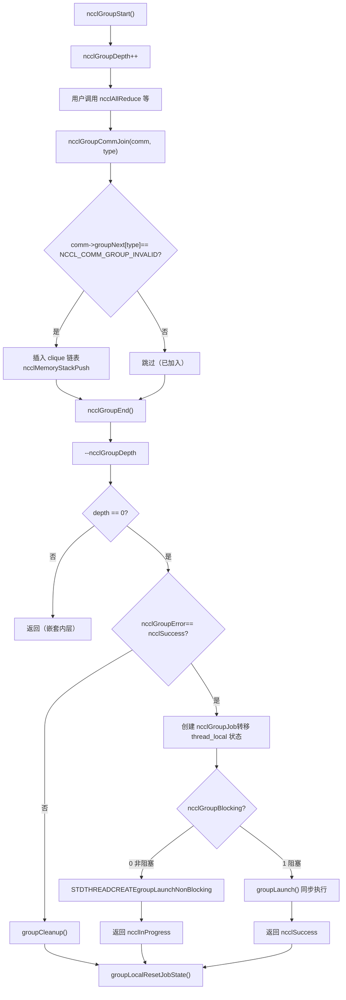
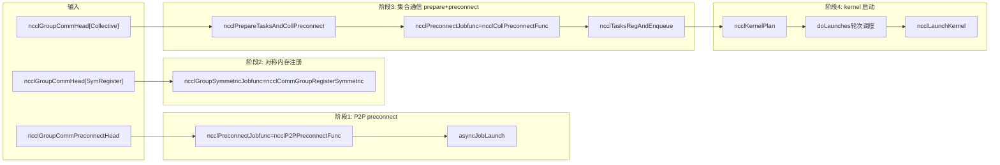

# Глава 7: Планировщик задач: как task_sched организует порядок выполнения нескольких каналов и ядер

В предыдущей главе мы проследили путь ncclAllReduce вплоть до ncclTaskColl — объект описания задачи уже лежит в comm->planner. Но описание задачи — это лишь «наряд», оно ещё не стало ядром, реально выполняющимся на GPU. В этой главе мы ответим на три вопроса: как несколько вызовов API накапливаются и отправляются вместе? Как накопленные задачи распределяются по нескольким каналам? Чем гарантируются порядок и зависимости между несколькими ядрами? Сначала дадим общую ментальную модель. Представьте NCCL как ресторан: ncclGroupStart/ncclGroupEnd — это «корзина», пользователь бросает в неё несколько блюд (несколько вызовов коллективной коммуникации); ncclGroupEnd — это «оформление заказа», и только тогда кухня начинает готовить по заказу. А doLaunches — это «диспетчер подачи блюд», он решает, какие блюда подать первыми, а какие можно готовить параллельно. Без семантики группы каждое блюдо заказывается отдельно, и кухне приходится заново разжигать огонь (запускать ядро) для каждого блюда, что даёт огромные накладные расходы; без циклического планирования doLaunches ядра нескольких каналов запускались бы в неправильном порядке, что нарушило бы зависимости по данным.

# I. Глобальное состояние семантики Group: thread_local переменные и модель «корзины»

## Интуитивная модель

`ncclGroupStart`и`ncclGroupEnd`Все вызовы коммуникации между ними не запускают ядро немедленно, а «накапливаются». Где накапливаются? Накапливаются в**потоколокальных (thread_local)**глобальных переменных. Почему thread_local? Потому что NCCL предполагает, что вызовы групп внутри одного потока последовательны, у разных потоков свои независимые корзины, которые не мешают друг другу. Если бы это состояние было глобальными переменными, а не thread_local, два потока, одновременно вызывающие`ncclGroupStart`, затаптывали бы друг друга, что привело бы к отправке задач одного потока`ncclGroupEnd`другого потока — это катастрофично.

## Структуры данных и размещение в памяти

Сначала посмотрим на определение глобального состояния группы.

[FACT:src/group.cc:34-34]

```cpp
thread_local int ncclGroupDepth = 0; // depth of ncclGroupStart nesting
thread_local ncclResult_t ncclGroupError = ncclSuccess;
thread_local struct ncclComm* ncclGroupCommHead[ncclGroupTaskTypeNum] = {nullptr};
thread_local struct ncclComm* ncclGroupCommPreconnectHead = nullptr;
thread_local struct ncclIntruQueue ncclAsyncJobs;
thread_local int ncclGroupBlocking = -1; /* default mode */
```

Разберём по полям:

- **`ncclGroupDepth`**: глубина вложенности.`ncclGroupStart`можно вызывать вложенно (хотя это нечасто), каждый раз`ncclGroupStart`увеличивает на единицу,`ncclGroupEnd`уменьшает на единицу. Реальная отправка происходит только когда счётчик доходит до 0. Это как вложенные корзины — вы открываете подкорзину внутри корзины, и реальный заказ оформляется только при расчёте на самом внешнем уровне.
- **`ncclGroupError`**: если любая из вызовов внутри группы завершается ошибкой, ошибка записывается здесь,`ncclGroupEnd`обрабатывается единообразно. Это позволяет избежать несогласованного состояния, когда «после неудачи одного вызова последующие вызовы продолжают добавлять вещи в корзину».
- **`ncclGroupCommHead[ncclGroupTaskTypeNum]`**: головы связанных списков коммуникационных доменов, сгруппированных по типу задачи.`ncclGroupTaskTypeNum`— это количество типов задач (коллективная коммуникация, примитивные задачи, управляющие задачи, симметричная регистрация и т.д.). Для каждого типа — свой связанный список, узлами списка являются`ncclComm`, связанные через`comm->groupNext[type]`. Почему по типам? Потому что у разных типов задач разное время отправки и разные зависимости — задачи коллективной коммуникации требуют предварительного preconnect, управляющие задачи (например, destroy) должны выполняться последними.
- **`ncclGroupCommPreconnectHead`**: связанный список коммуникационных доменов, требующих предварительного подключения. Предварительное подключение — это «заранее установить сетевые соединения», чтобы избежать задержки из-за установки соединения в момент запуска ядра.
- **`ncclAsyncJobs`**: очередь асинхронных задач. Некоторые задачи (например,`ncclCommInitRank`) асинхронны, они помещаются в эту очередь и единообразно запускаются во время`ncclGroupEnd`.
- **`ncclGroupBlocking`**: флаг режима блокировки.`-1`означает, что ещё не определено,`0`означает неблокирующий,`1`обозначает блокировку. В одной группе не допускается смешивание блокирующих и неблокирующих коммуникационных доменов, иначе будет ошибка.

Здесь есть ключевой дизайн:`ncclGroupCommHead`— это**массив**, каждый элемент — это связный список. Узлы списка связываются через`comm->groupNext[type]`, а не через отдельную структуру узла списка. Это означает, что в структуре`ncclComm`должно быть зарезервировано поле массива`groupNext`. Такой дизайн «интрузивного связного списка» позволяет избежать дополнительного выделения памяти, но ценой является увеличение размера структуры`ncclComm`.

## Пошаговое прохождение, управляемое сценарием

**Сценарий**: пользователь вызывает`ncclGroupStart()`, затем дважды подряд вызывает`ncclAllReduce`(для двух разных коммуникационных доменов commA и commB), и наконец вызывает`ncclGroupEnd()`。

**Шаг первый:`ncclGroupStart`что делает?**

[FACT:src/include/group.h:63-66]

```cpp
inline ncclResult_t ncclGroupStartInternal() {
  ncclGroupDepth++;
  return ncclSuccess;
}
```

Чрезвычайно просто: глубина увеличивается на единицу. Нет выделения памяти, нет блокировок, нет системных вызовов. Именно поэтому`ncclGroupStart`практически не имеет накладных расходов.

**Шаг второй:`ncclAllReduce`что происходит при вызове внутри группы?**

`ncclAllReduce`внутри вызывает`ncclGroupCommJoin(comm, ncclGroupTaskTypeCollective)`, добавляя коммуникационный домен в связный список группы.

[FACT:src/include/group.h:80-116]

```cpp
inline void ncclGroupCommJoin(struct ncclComm* comm, int type) {
  if (comm->groupNext[type] == reinterpret_cast(NCCL_COMM_GROUP_INVALID)) {
    // Insert comm into ncclGroupCommHead adjacent to sibling comms. This preserves
    // the users program order yet insures siblings occur consecutively. This
    // is required by doLaunches() in "group.cc".
    struct ncclComm** pp = &ncclGroupCommHead[type];
    while (*pp != nullptr && comm->intraComm0 != (*pp)->intraComm0) pp = &(*pp)->groupNext[type];

    // didn't find its clique, we need to insert it with ascending order based on commHash
    if (*pp == nullptr) {
      pp = &ncclGroupCommHead[type];
      while (*pp != nullptr && (*pp)->commHash commHash) pp = &(*pp)->groupNext[type];
    }
    comm->groupNext[type] = *pp;
    *pp = comm;
    // Comms gets a new memory stack scope upon joining. Each task batched for
    // this comm is allocated there.
    if (type == ncclGroupTaskTypeCollective || type == ncclGroupTaskTypeRawTask) {
      // Initialize planner
      ncclMemoryStackPush(&comm->memScoped);
      ncclKernelPlanner::Peer* tmp = comm->planner.peers;
      ncclIntruQueue* tmpRmaQueues = comm->planner.rmaTaskQueues;
      int numRmaCtx = comm->config.numRmaCtx;
      memset(&comm->planner, 0, sizeof(comm->planner));
      comm->planner.peers = tmp;
      comm->planner.bcast_info.minBcastPeer = INT_MAX;
      comm->planner.bcast_info.maxBcastPeer = INT_MIN;
      comm->planner.rmaTaskQueues = tmpRmaQueues;
      if (comm->planner.rmaTaskQueues != NULL) {
        for (int i = 0; i planner.rmaTaskQueues[i]);
        }
      }
    }
  }
  ncclGroupBlocking = comm->config.blocking;
}
```

В этом коде есть несколько тонкостей:

1. **Проверка идемпотентности**：`if (comm->groupNext[type] == NCCL_COMM_GROUP_INVALID)`гарантирует, что один и тот же коммуникационный домен добавляется в одну и ту же группу только один раз. Если пользователь дважды вызвал`ncclAllReduce`для одного и того же comm, второй раз он не будет повторно добавлен в связный список, но задача будет добавлена в`comm->planner`.

2. **Сортировка clique**：`intraComm0`— это идентификатор «глобальной сущности». Если несколько коммуникационных доменов принадлежат одной глобальной сущности (например, получены путём разделения через`ncclCommSplit`), их`intraComm0`совпадают, и они называются clique. Код сначала по`intraComm0`находит clique и вставляет comm рядом с соседними узлами того же clique. Если clique не найден, вставка выполняется по возрастанию`commHash`. Эта сортировка нужна для того, чтобы`doLaunches`мог корректно обрабатывать barrier-синхронизацию внутри clique.

3. **Область памяти стека**：`ncclMemoryStackPush(&comm->memScoped)`выделяет для этого comm новую область памяти стека внутри группы. Все задачи, выделенные для этого comm (`ncclTaskColl`и т. д.), выделяются из этого стека.`ncclGroupCommLeave`при вызове`ncclMemoryStackPop`освобождает всю память задач за один раз — это классическая оптимизация «пакетное выделение, пакетное освобождение», позволяющая избежать накладных расходов на отдельный`malloc/free`для каждой задачи.

4. **Сброс planner**：`memset(&comm->planner, 0, sizeof(comm->planner))`очищает planner, но сохраняет указатели`peers`и`rmaTaskQueues`(сначала сохраняются во временные переменные, после memset восстанавливаются). Зачем сохранять? Потому что это предварительно выделенные массивы, и их не нужно каждый раз выделять заново.`bcast_info`min/max сбрасываются в`INT_MAX/INT_MIN`, что используется для последующей оптимизации объединения broadcast-задач.

**Шаг третий:`ncclGroupEnd`что делает?**

[FACT:src/group.cc:1039-1164]

`ncclGroupEndInternal`— это ядро. Разберём по частям:

[FACT:src/group.cc:1048-1061]

```cpp
if (ncclGroupDepth == 0) {
  WARN("ncclGroupEnd: not in a group call.");
  ret = ncclInvalidUsage;
  goto exit;
}
// ...
if ((--ncclGroupDepth) > 0) goto exit;
```

Сначала проверяется глубина, затем уменьшается на единицу. Если после уменьшения она всё ещё больше 0, значит, мы всё ещё находимся во вложенной внутренней группе, и происходит прямой возврат без отправки. Продолжение выполняется только при уменьшении до 0.

[FACT:src/group.cc:1063]

```cpp
if ((ret = ncclGroupError) != ncclSuccess) goto fail;
```

Если хотя бы один вызов внутри группы завершился ошибкой, происходит прямой переход к очистке fail.

[FACT:src/group.cc:1084-1093]

```cpp
NEW_NOTHROW_GOTO(groupJob, ncclGroupJob, ret, fail);
ncclIntruQueueConstruct(&groupJob->asyncJobs);
groupJob->groupRefCount = 0;
groupJob->nonBlockingInit = false;
memcpy(groupJob->groupCommHead, ncclGroupCommHead, sizeof(ncclGroupCommHead));
groupJob->groupCommPreconnectHead = ncclGroupCommPreconnectHead;
groupJob->groupError = ncclSuccess;
groupJob->abortFlag = false;
groupJob->joined = false;
ncclIntruQueueTransfer(&groupJob->asyncJobs, &ncclAsyncJobs);
```

Создаётся`ncclGroupJob`, и состояние группы из thread_local «переносится» в объект job.`ncclIntruQueueTransfer`целиком переносит очередь`ncclAsyncJobs`в`groupJob->asyncJobs`. Этот шаг критичен: состояние thread_local является «временным», а объект job — «постоянным» и может удерживаться асинхронным потоком.

[FACT:src/group.cc:1095-1147]

```cpp
if (hasCommHead || !ncclIntruQueueEmpty(&groupJob->asyncJobs) || ncclGroupCommPreconnectHead != nullptr) {
  /* make sure ncclGroupBlocking has been set. */
  if (ncclGroupBlocking != 0 && ncclGroupBlocking != 1) {
    WARN("Invalid group blocking state %d", ncclGroupBlocking);
    ret = ncclInternalError;
    goto fail;
  }
  if (ncclGroupBlocking == 0) {
    /* nonblocking group */
    // ... 设置 async error 为 ncclInProgress，创建线程执行 groupLaunchNonBlocking
    groupJob->base.func = groupLaunchNonBlocking;
    STDTHREADCREATE_GOTO(groupJob->base.thread, ncclAsyncJobMain, ret, fail, &groupJob->base);
    groupJob->nonBlockingInit = true;
    ret = ncclInProgress;
  } else {
    /* blocking group */
    int savedDev;
    CUDACHECKGOTO(cudaGetDevice(&savedDev), ret, fail);
    NCCLCHECKGOTO(groupLaunch(&groupJob->base, internalSimInfoPtr), ret, fail);
    CUDACHECKGOTO(cudaSetDevice(savedDev), ret, fail);
    if (simInfo) memcpy((void*)simInfo, (void*)internalSimInfoPtr, realSize);
    delete groupJob;
  }
} else {
  // Free when not needed (single rank case)
  delete groupJob;
}
```

Блокирующий режим: вызов`groupLaunch`напрямую в текущем потоке, синхронное завершение. Неблокирующий режим: создаётся поток для выполнения`groupLaunchNonBlocking`, немедленно возвращается`ncclInProgress`. Пользователь в дальнейшем через`ncclCommGetAsyncError`запрашивает прогресс.

Обратите внимание на сохранение и восстановление`cudaGetDevice`/`cudaSetDevice`:`groupLaunch`внутри переключает устройство CUDA (поскольку разные comm могут находиться на разных GPU), а после выполнения восстанавливает исходное устройство пользователя. Это предотвращает ситуацию, когда «после внутреннего переключения устройства в NCCL оно не переключилось обратно», из-за чего последующие вызовы CUDA у пользователя выполняются на неправильном устройстве.

## Размышления о дизайне и подводные камни в продакшене

**Подводный камень 1: смешивание блокирующих и неблокирующих коммуникационных доменов**。`ncclAsyncLaunch`содержит проверку:

[FACT:src/group.cc:55-64]

```cpp
/* check if there are blocking and nonblocking comms at the same time in group. */
if (comm->destroyFlag) {
  ncclGroupBlocking = 1;
} else if (ncclGroupBlocking == -1) {
  /* first met communicator */
  ncclGroupBlocking = comm->config.blocking;
} else if (ncclGroupBlocking != comm->config.blocking) {
  WARN("Blocking and nonblocking communicators are not allowed in the same group.");
  ret = ncclInvalidArgument;
}
```

Почему смешивание не допускается? Потому что блокирующая группа выполняется синхронно в текущем потоке, а неблокирующая группа — асинхронно в отдельном потоке. При смешивании невозможно определить,`ncclGroupEnd`должен вернуться синхронно или вернуть`ncclInProgress`. В продакшене, если пользователь случайно поместит блокирующий и неблокирующий comm в одну группу, он получит`ncclInvalidArgument`, но к этому моменту состояние группы уже загрязнено, и необходимо заново`ncclGroupStart`。

**Подводный камень 2:`ncclGroupError`распространение**. Если какой-либо вызов внутри группы завершается неудачей,`ncclGroupError`устанавливается,`ncclGroupEnd`переходит в ветку fail и выполняет`groupCleanup`。`groupCleanup`проходит по всем comm, освобождает память plan в planner, сбрасывает planner, очищает rawTaskQueue. Если этот шаг выполнен не полностью, при следующем`ncclGroupStart`в planner останутся старые данные, что приведёт к повторной отправке задач или утечке памяти.

[FACT:src/group.cc:514-607]

```cpp
static void groupCleanup(struct ncclComm** groupCommHeadPtr,
                         struct ncclIntruQueue* asyncJobsPtr,
                         ncclResult_t error) {
  struct ncclComm* comm;
  for (int type = 0; type groupNext[type];
      (void)ncclGroupCommLeave(comm, type);
      // We don't know if preconnect succeeded or happened at all, so clear
      // the flags that let `taskAppend()` skip over checking if preconnect
      // is needed.
      if (type == ncclGroupTaskTypeCollective || type == ncclGroupTaskTypeRawTask) {
        comm->preconnectNext = reinterpret_cast(0x1);
        for (int i = 0; i nRanks; i++) {
          comm->connectSend[i] = 0UL;
          comm->connectRecv[i] = 0UL;
        }
        // Reclaim abandoned kernel plan memory.
        while (!ncclIntruQueueEmpty(&comm->planner.planQueue)) {
          struct ncclKernelPlan* plan = ncclIntruQueueDequeue(&comm->planner.planQueue);
          if (!plan->persistent) {
            while (!ncclIntruQueueEmpty(&plan->proxyOpQueue)) {
              struct ncclProxyOp* pxop = ncclIntruQueueDequeue(&plan->proxyOpQueue);
              ncclMemoryPoolFree(&comm->memPool_ncclProxyOp, pxop);
            }
            ncclMemoryPoolFree(&comm->memPool_ncclKernelPlan, plan);
          }
        }
        // Reset comm->planner to empty.
        // ...
      }
      // ...
    }
  }
  // ...
}
```

Обратите внимание на строку`comm->preconnectNext = reinterpret_cast<struct ncclComm*>(0x1)`. Это «сторожевое значение», означающее «этот comm нужно переподключить через preconnect». Почему? Потому что при cleanup неизвестно, был ли preconnect успешным, поэтому принудительно заставляем проверить заново в следующий раз.`0x1`это значение очень хитрое — оно не является допустимым указателем, но может использоваться как маркер «неинициализировано».`ncclGroupCommPreconnect`проверяет`if (comm->preconnectNext == reinterpret_cast<struct ncclComm*>(0x1))`, чтобы определить, нужно ли добавлять в связный список preconnect.

---

# Во-вторых, подготовка задач:`ncclPrepareTasks`как превратить описание задачи в планируемую единицу

## Интуитивная модель

`ncclPrepareTasks`Это этап «подготовки ингредиентов». Блюда в корзине (описание задачи) ещё сырые — их нужно сначала помыть, нарезать и подготовить (определить алгоритм, протокол, разбиение по channel), прежде чем ставить на плиту (запускать kernel). Если пропустить этот шаг и сразу запустить kernel, kernel не будет знать, как разбивать данные и по какому пути идти, и сразу упадёт.

## Пошаговое прохождение на основе сценариев

`ncclPrepareTasks`В`groupLaunchLegacy`вызывается:

[FACT:src/group.cc:705-746]

```cpp
static ncclResult_t ncclPrepareTasksAndCollPreconnect(
  struct ncclComm* comm, ncclSimInfo_t* simInfo,
  struct ncclIntruQueue* asyncCollJobs) {
  if (ncclParamSingleProcMemRegEnable()) {
    // 单进程内存注册模式：把 prepare 和 preconnect 合并成一个异步 job
    struct ncclPrepareTasksAndCollPreconnectJob* job;
    NEW_NOTHROW(job, ncclPrepareTasksAndCollPreconnectJob);
    job->base.func = ncclPrepareTasksAndCollPreconnectFunc;
    // ...
    ncclIntruQueueEnqueue(asyncCollJobs, &job->base);
  } else {
    bool needConnect = false;
    bool algoNeedConnect[NCCL_NUM_ALGORITHMS];
    memset(algoNeedConnect, 0, sizeof(bool) * NCCL_NUM_ALGORITHMS);

    CUDACHECK(cudaSetDevice(comm->cudaDev));
    NCCLCHECK(ncclPrepareTasks(comm, algoNeedConnect, &needConnect, simInfo));

    if (comm->cuMemSupport && needConnect) {
      // 创建 preconnect job
      struct ncclPreconnectJob* job;
      NEW_NOTHROW(job, ncclPreconnectJob);
      job->base.func = ncclCollPreconnectFunc;
      // ...
      ncclIntruQueueEnqueue(asyncCollJobs, &job->base);
    }
  }
  return ncclSuccess;
}
```

`ncclPrepareTasks`Возвращает две вещи:`algoNeedConnect`массив (какие алгоритмы требуют установления соединения) и`needConnect`флаг (нужно ли соединение). Если`needConnect`истинно и поддерживается cuMem, создаётся preconnect job и выполняется асинхронно.

`ncclPrepareTasks`Что происходит внутри? Он обходит`comm->planner`задачи, для каждой определяет алгоритм и протокол, затем вызывает`taskAppend`чтобы добавить задачу в plan планировщика. Эта логика уже была раскрыта в предыдущей главе, здесь не повторяется.

Ключевые моменты:`ncclPrepareTasks`вызывается**по одному comm за раз**но preconnect выполняется**пакетно по clique**Почему? Смотрим комментарий в`groupLaunchLegacy`:

[FACT:src/group.cc:818-834]

```cpp
do {
  // We need to preconnect connections for collectives clique by clique to avoid
  // race condition for split shared comms which can connect the same connections
  // at the same time.
  comm = cliqueHead;
  do {
    NCCLCHECKGOTO(ncclPrepareTasksAndCollPreconnect(comm, simInfo, &asyncCollJobs), ret, fail);
    comm = comm->groupNext[ncclGroupTaskTypeCollective];
  } while (comm != nullptr && comm->intraComm0 == cliqueHead->intraComm0);
  // connect
  NCCLCHECKGOTO(asyncJobLaunch(&asyncCollJobs, groupAbortFlag), ret, fail);
  // ...
  cliqueHead = comm;
} while (cliqueHead != nullptr);
```

Комментарий говорит ясно:**preconnect выполняется по одному clique за раз, чтобы избежать гонки, когда split shared comms одновременно подключаются к одной и той же группе соединений**. Если два comm были split из одного родительского comm, они могут разделять некоторые соединения. При параллельном preconnect два потока могут одновременно попытаться установить одно и то же соединение, что приведёт к дублированию соединений или несогласованности их состояния. Последовательное выполнение по clique гарантирует, что в каждый момент времени соединения устанавливает только один clique.

## Управление конкурентностью и взаимодействие с нижним уровнем

`asyncJobLaunch`является ядром запуска асинхронных задач:

[FACT:src/group.cc:609-678]

```cpp
static ncclResult_t asyncJobLaunch(struct ncclIntruQueue* asyncJobsMain,
                                   volatile bool* groupAbortFlag) {
  ncclResult_t ret = ncclSuccess;
  bool jobsDone = false;
  bool errorJobAbortFlag = false;

  if (!ncclIntruQueueEmpty(asyncJobsMain)) {
    struct ncclAsyncJob* job = ncclIntruQueueHead(asyncJobsMain);
    if (job->next == nullptr) {
      // 只有一个 job，直接在当前线程执行，避免线程创建开销
      job->isThreadMain = true;
      ncclAsyncJobMain(job);
      job->state = ncclGroupJobJoined;
      return job->result;
    }
    // 多个 job，每个创建一个线程
    do {
      STDTHREADCREATE(job->thread, ncclAsyncJobMain, job);
      job = job->next;
    } while (job != nullptr);

    do {
      jobsDone = true;
      job = ncclIntruQueueHead(asyncJobsMain);
      do {
        ncclGroupJobState_t state = COMPILER_ATOMIC_LOAD(&job->state, std::memory_order_acquire);
        if (state == ncclGroupJobRunning) {
          jobsDone = false;
        } else if (state == ncclGroupJobDone) {
          int err;
          if ((err = ncclThreadJoin(job->thread)) != ncclSuccess) {
            WARN("asyncJobLaunch: failed to join thread for job");
            ret = ncclSystemError;
          }
          job->state = ncclGroupJobJoined;
          if (job->result != ncclSuccess && ret == ncclSuccess) {
            ret = job->result;
            errorJobAbortFlag = true;
          }
        } else {
          // safety check
          if (state != ncclGroupJobJoined) {
            WARN("Async job state is %d, expected %d", state, ncclGroupJobJoined);
            if (ret == ncclSuccess) ret = ncclInternalError;
            errorJobAbortFlag = true;
          }
        }

        if (!job->destroyFlag &&
            (COMPILER_ATOMIC_LOAD(groupAbortFlag, std::memory_order_acquire) || errorJobAbortFlag == true)) {
          COMPILER_ATOMIC_STORE(job->abortFlag, uint32_t(1), std::memory_order_release);
          COMPILER_ATOMIC_STORE(job->abortFlagDev, uint32_t(1), std::memory_order_release);
          if (job->childAbortFlag) {
            COMPILER_ATOMIC_STORE(job->childAbortFlag, uint32_t(1), std::memory_order_release);
            COMPILER_ATOMIC_STORE(job->childAbortFlagDev, uint32_t(1), std::memory_order_release);
          }
        }

        job = job->next;
      } while (job != nullptr);
      // Let preconnect threads progress.
      if (jobsDone == false) std::this_thread::sleep_for(std::chrono::microseconds(1));
    } while (jobsDone == false);

    if (ret != ncclSuccess) goto fail;
  }

exit:
  return ret;
fail:
  goto exit;
}
```

В этом коде есть несколько ключевых решений:

1. **Оптимизация для одного job**: если в очереди только один job, поток не создаётся, выполнение идёт в текущем потоке. Это избегает накладных расходов на создание и join потока. Для группы с одним comm это обычная ситуация.

2. **Атомарный конечный автомат**：`job->state`— это атомарная переменная с тремя состояниями:`ncclGroupJobRunning`、`ncclGroupJobDone`、`ncclGroupJobJoined`. После выполнения рабочий поток с помощью`COMPILER_ATOMIC_STORE(..., std::memory_order_release)`устанавливает`Done`; главный поток с помощью`COMPILER_ATOMIC_LOAD(..., std::memory_order_acquire)`читает. Пара release/acquire гарантирует, что все записи в память рабочего потока видимы главному потоку.

3. **Ожидание в цикле + микро-сон**: главный поток опрашивает состояние всех job, и если какой-то job ещё выполняется, после`sleep_for(1us)`продолжает опрос. Почему 1 микросекунда, а не условная переменная? Потому что preconnect — короткая задача (обычно от десятков микросекунд до нескольких миллисекунд), и накладные расходы на пробуждение условной переменной могут быть больше, чем ожидание в цикле. Сон в 1 микросекунду избегает траты CPU на чистое вращение.

4. **Распространение ошибок и abort**: если любой job завершается неудачей,`errorJobAbortFlag`устанавливается, и для всех последующих job`abortFlag`атомарно устанавливается в 1. Рабочий поток во время выполнения проверяет`abortFlag`и, обнаружив abort, досрочно завершается. Это механизм «быстрого отказа», который не даёт другим job продолжать бессмысленно работать после неудачи одного job.

## Mermaid-диаграмма: поток управления отправкой group



---

# Три,`doLaunches`: циклическое планирование для нескольких channel и нескольких kernel

## Интуитивная модель

`doLaunches`— это «диспетчер подачи блюд». На кухне (GPU) есть несколько плит (channel), и каждое блюдо (kernel plan) нужно подавать по порядку. Но блюда разных comm могут подаваться параллельно, а блюда одного comm должны подаваться строго по порядку. Диспетчер должен гарантировать: comm внутри одного clique продвигаются синхронно (через barrier), а разные clique могут продвигаться независимо.

## Структуры данных и разметка памяти

`doLaunches`Основные структуры данных`ncclKernelPlan`— это`comm->planner.unlaunchedPlansHead`。

[FACT:src/group.cc:427-503]

```cpp
ncclResult_t doLaunches(struct ncclComm* head, int taskType) {
  ncclResult_t result = ncclSuccess;
  struct ncclComm* cliqueHead = head;
  struct ncclComm* cliqueNextHead;
  bool useBarrier = ncclParamLaunchMode == ncclLaunchModeGroup;
  // This outer loop iterates over cliques of comms which are siblings of the
  // same global entity. We calculate a clique as all comms which have the same
  // `intraComm0` value.
  do {
    struct ncclComm* comm = cliqueHead;
    bool capturingYes = false, capturingNo = false;
    do {
      (ncclCudaGraphValid(comm->planner.capturingGraph) ? capturingYes : capturingNo) = true;
      CUDACHECKGOTO(cudaSetDevice(comm->cudaDev), result, failure);
      NCCLCHECKGOTO(ncclLaunchPrepare(comm), result, failure);
      if (useBarrier) ncclCommIntraBarrierIn(comm, 1);
      comm = comm->groupNext[taskType];
    } while (comm != nullptr && comm != reinterpret_cast(NCCL_COMM_GROUP_INVALID) &&
             comm->intraComm0 == cliqueHead->intraComm0);
    cliqueNextHead = comm;

    if (capturingYes && capturingNo) {
      // We have entered barriers but are aborting without leaving them. Thus
      // these comms are permanently trashed. We need a good mechanism for
      // tracking and reporting that.
      WARN("Either none or all communicators in a ncclGroup() can be CUDA graph captured.");
      result = ncclInvalidUsage;
      goto failure;
    }

    while (true) {
      // Iterate rounds of launches for clique.
      bool moreRounds = false;
      comm = cliqueHead;
      do {
        // Iterate clique members.
        struct ncclComm* next = comm->groupNext[taskType];
        if (useBarrier) {
          // Barrier reduction result tells us if this was the final round.
          moreRounds = 0 != ncclCommIntraBarrierOut(comm);
        } else {
          moreRounds |= comm->planner.unlaunchedPlansHead != nullptr;
        }
        if (moreRounds) {
          // Pop next unlaunched kernel
          struct ncclKernelPlan* plan = comm->planner.unlaunchedPlansHead;
          if (plan != nullptr) {
            comm->planner.unlaunchedPlansHead = plan->next;
            CUDACHECKGOTO(cudaSetDevice(comm->cudaDev), result, failure);
            NCCLCHECKGOTO(ncclLaunchKernelBefore_NoUncapturedCuda(comm, plan), result, failure);
            if (plan->isCeColl) {
              NCCLCHECKGOTO(ncclLaunchCeColl(comm, plan), result, failure);
            } else if (plan->isRma) {
              NCCLCHECKGOTO(ncclLaunchRma(comm, plan), result, failure);
            } else {
              NCCLCHECKGOTO(ncclLaunchKernel(comm, plan), result, failure);
            }
          }
          // Barrier reduction input indicates if we require further rounds.
          if (useBarrier) ncclCommIntraBarrierIn(comm, comm->planner.unlaunchedPlansHead != nullptr ? 1 : 0);
          if (plan != nullptr) {
            NCCLCHECKGOTO(ncclLaunchKernelAfter_NoCuda(comm, plan), result, failure);
          }
        } else {
          // Final round.
          CUDACHECKGOTO(cudaSetDevice(comm->cudaDev), result, failure);
          NCCLCHECKGOTO(ncclLaunchFinish(comm), result, failure);
        }
        comm = next;
      } while (comm != reinterpret_cast(NCCL_COMM_GROUP_INVALID) && comm != cliqueNextHead);
      if (!moreRounds) break;
    }
    cliqueHead = cliqueNextHead;
  } while (cliqueHead != nullptr && cliqueHead != reinterpret_cast(NCCL_COMM_GROUP_INVALID));
failure:
  return result;
}
```

## Пошаговое прохождение на основе сценариев

**Сценарий**: два comm (commA и commB) принадлежат одному clique (`intraComm0`одинаков), у каждого comm есть 3 kernel plan, ожидающих запуска.

**Первый уровень цикла: обход clique**

Внешний`do-while`обходит все clique.`cliqueHead`— это первый comm текущего clique. Внутренний`do-while`обходит все comm внутри clique (`comm->intraComm0 == cliqueHead->intraComm0`）。

Для каждого comm:

- `cudaSetDevice(comm->cudaDev)`: переключиться на GPU, соответствующий этому comm.
- `ncclLaunchPrepare(comm)`: подготовиться к запуску, включая настройку CUDA-потока, проверку ресурсов и т. д.
- `ncclCommIntraBarrierIn(comm, 1)`: войти в barrier с начальным значением 1.

**Второй уровень цикла: циклическое планирование**

`while (true)`Цикл выполняет «раунды». В каждом раунде каждый comm внутри clique запускает один kernel plan.

Ключ в вычислении`moreRounds`:

- **Есть режим с barrier**（`useBarrier == true`）：`moreRounds = 0 != ncclCommIntraBarrierOut(comm)`。`ncclCommIntraBarrierOut`— это**операция редукции barrier между comm**. Она ждёт, пока все comm внутри clique вызовут`ncclCommIntraBarrierIn`, затем возвращает результат редукции всех входных значений (здесь — логическое ИЛИ). Если у любого comm ещё есть незапущенные plan, результат редукции равен 1,`moreRounds`равно true, и выполняется следующий раунд. Если у всех comm нет незапущенных plan, результат редукции равен 0,`moreRounds`равно false, и происходит переход к final round.
- **Режим без barrier**：`moreRounds |= comm->planner.unlaunchedPlansHead != nullptr`. Напрямую проверять, есть ли у каждого comm ещё незапущенный plan. Обратите внимание, здесь используется`|=`, если хотя бы у одного comm ещё есть plan,`moreRounds`принимает значение true.

Зачем нужен barrier? Потому что comm внутри clique — это «братья», они могут совместно использовать ресурсы GPU или сетевые соединения. Если один comm запустил 3 kernel, а другой — только 1, то comm, завершивший запуск раньше, войдёт в`ncclLaunchFinish`, освободит ресурсы, а другой comm всё ещё использует эти ресурсы, что приведёт к use-after-free. Barrier гарантирует, что все comm внутри clique продвигаются синхронно: либо все запускают N-й раунд, либо все переходят в final round.

**Ветка запуска kernel**

[FACT:src/group.cc:477-483]

```cpp
if (plan->isCeColl) {
  NCCLCHECKGOTO(ncclLaunchCeColl(comm, plan), result, failure);
} else if (plan->isRma) {
  NCCLCHECKGOTO(ncclLaunchRma(comm, plan), result, failure);
} else {
  NCCLCHECKGOTO(ncclLaunchKernel(comm, plan), result, failure);
}
```

Три типа plan:

- `isCeColl`: коллективная коммуникация CollNet (использование сетевой карты для разгрузки при коллективной коммуникации).
- `isRma`: задачи RMA (Remote Memory Access).
- По умолчанию: обычный GPU kernel.

Для каждого типа функция запуска различается, но все следуют шаблону «Before -> Launch -> After»:

- `ncclLaunchKernelBefore_NoUncapturedCuda`: подготовка перед запуском (установка параметров kernel, загрузка на устройство и т.д.).
- `ncclLaunchKernel`: фактический запуск kernel (`cudaLaunchKernel`）。
- `ncclLaunchKernelAfter_NoCuda`: очистка после запуска (обновление состояния, освобождение временных ресурсов).

**Final round**

Когда`moreRounds`равно false, выполняется`ncclLaunchFinish(comm)`. Этот шаг выполняет финальную очистку: освобождение памяти plan, обновление состояния comm, уведомление proxy-потока и т.д.

## Управление конкурентностью и взаимодействие с оборудованием

`ncclCommIntraBarrierIn/Out`— это примитив синхронизации comm внутри clique. Его реализация включает атомарные операции и активное ожидание.`In`записывает значение в разделяемую память,`Out`ожидает, пока все comm выполнят запись, затем считывает результат редукции. Этот barrier является**межпроцессным**(если comm находятся в разных процессах), в основе может использоваться разделяемая память или сеть.

Почему используется barrier, а не простая «проверка, есть ли у всех comm ещё plan»? Потому что «проверка» неатомарна: когда commA проверяет, у commB ещё есть plan, commA решает продолжить; но commB сразу после проверки commA запускает последний plan и переходит в final round. CommA всё ещё запускает kernel, а commB уже освободил разделяемые ресурсы. Barrier превращает «проверку» и «решение» в одну атомарную операцию, устраняя эту гонку.

## Руководство по избежанию проблем в production

**Проблема 1: смешанное использование CUDA graph capture**。

[FACT:src/group.cc:448-455]

```cpp
if (capturingYes && capturingNo) {
  // We have entered barriers but are aborting without leaving them. Thus
  // these comms are permanently trashed. We need a good mechanism for
  // tracking and reporting that.
  WARN("Either none or all communicators in a ncclGroup() can be CUDA graph captured.");
  result = ncclInvalidUsage;
  goto failure;
}
```

Если часть comm внутри clique находится в режиме CUDA graph capture, а другая часть — нет, сразу возникает ошибка. В комментарии сказано «these comms are permanently trashed» — потому что они уже вошли в barrier, но не вышли, состояние barrier этих comm навсегда остаётся несогласованным, и в дальнейшем их нельзя использовать. Это**неисправимая ошибка**, пользователь должен пересоздать коммуникационный домен. В production, если пользователь смешивает comm с graph capture и без него, он получит`ncclInvalidUsage`, но более серьёзно то, что comm уже повреждён.

**Проблема 2:`useBarrier`зависимость конфигурации**。`useBarrier = ncclParamLaunchMode == ncclLaunchModeGroup`. Если пользователь установил`NCCL_LAUNCH_MODE=GROUP`, используется путь с barrier; иначе используется путь без barrier. На пути без barrier`moreRounds`накапливается с помощью`|=`, но каждый comm принимает решение независимо. Если у commA ещё есть plan, а у commB нет, commB перейдёт в final round и выполнит`ncclLaunchFinish`, тогда как commA всё ещё запускает kernel. В некоторых сценариях это безопасно (между comm нет разделяемых ресурсов), но если совместно используются proxy-потоки или сетевые соединения, это может привести к проблемам. Поэтому по умолчанию рекомендуется режим с barrier.

---

# Четыре:`groupLaunchLegacy`полная цепочка выполнения

## Пошаговое руководство, управляемое сценариями

`groupLaunchLegacy`— это полный процесс отправки в блокирующем режиме. Выполняется по порядку:

**Этап 1: P2P preconnect**

[FACT:src/group.cc:756-774]

```cpp
if (!simInfo && groupCommPreconnectHeadMain != nullptr) {
  struct ncclComm* comm = groupCommPreconnectHeadMain;
  do {
    struct ncclPreconnectJob* job;
    NEW_NOTHROW_GOTO(job, ncclPreconnectJob, ret, fail);
    job->base.func = ncclP2PPreconnectFunc;
    // ...
    ncclIntruQueueEnqueue(asyncJobsMain, (struct ncclAsyncJob*)job);
    struct ncclComm* next = comm->preconnectNext;
    comm->preconnectNext = reinterpret_cast(0x1);
    comm = next;
  } while (comm != nullptr);
}
NCCLCHECKGOTO(asyncJobLaunch(asyncJobsMain, groupAbortFlag), ret, fail);
```

Для каждого comm, которому нужен preconnect, создаётся`ncclP2PPreconnectFunc`job, затем выполняется пакетный запуск.`ncclP2PPreconnectFunc`внутри вызывает`ncclTransportP2pSetup`для установления P2P-соединения.

**Этап 2: регистрация симметричной памяти**

[FACT:src/group.cc:778-808]

```cpp
// only loop through sym alloc and register tasks
for (int type = ncclGroupTaskTypeSymRegister; type destroyFlag && job->comm && !job->comm->config.blocking &&
      groupCommHeadMain[ncclGroupTaskTypeCollective] == nullptr) {
    (void)ncclCommSetAsyncError(job->comm, ret);
  }
  if (job->destructor) job->destructor((void*)job);
}

for (int type = 0; type groupNext[type];
    // Poll for callbacks sent to us from other threads.
    if (comm->reclaimSteps == GROUP_MAX_RECLAIM_STEPS) {
      NCCLCHECKGOTO(ncclCommPollCallbacks(comm, /*waitSome=*/false), ret, fail);
      comm->reclaimSteps = 0;
    } else {
      comm->reclaimSteps++;
    }
    (void)ncclGroupCommLeave(comm, type);
    if (!comm->config.blocking) {
      (void)ncclCommSetAsyncError(comm, ret);
    }
    groupCommHeadMain[type] = next;
  }
}
```

Очистка асинхронных job, затем обход всех comm и вызов`ncclGroupCommLeave`. Обратите внимание на счётчик`reclaimSteps`: каждые`GROUP_MAX_RECLAIM_STEPS`(10) вызовов group, опрос callbacks один раз. Это делается для того, чтобы избежать накладных расходов на опрос callbacks при каждом group, и в то же время гарантировать, что callbacks не будут бесконечно накапливаться.

## Диаграмма Mermaid:`groupLaunchLegacy`поток данных



---

# Пять,`groupLaunchEnqueueRearch`: планировщик новой архитектуры

## Интуитивная модель

`groupLaunchEnqueueRearch`— это новая архитектура планирования, разрабатываемая в NCCL. Она разделяет подготовку задач, планирование и запуск на более детальные этапы, управляемые через асинхронную очередь job. В настоящее время модули планировщика и лаунчера «ещё не реализованы», происходит откат к legacy`doLaunches`。

[FACT:src/group.cc:991-996]

```cpp
// Schedule and launch tasks. Scheduler and launcher module of the enqueue framework
// is not yet implemented and falls back to the legacy launcher: a single phased
// doLaunches over the clique, run here on the user's thread.
if (!simInfo && groupCommHeadMain[ncclGroupTaskTypeRawTask] != nullptr) {
  NCCLCHECKGOTO(doLaunches(groupCommHeadMain[ncclGroupTaskTypeRawTask], ncclGroupTaskTypeRawTask), ret, fail);
}
```

Процесс выполнения новой архитектуры:

1. **Управление задачами**：`ncclMgmtTaskJobFunc`Обработка`mgmtTaskQueue`задач в (например, destroy).

2. **Подготовка задач**：`ncclTaskPrepareJobFunc`Вызов`ncclTaskPrepare`。

3. **Планирование и запуск**: откат к`doLaunches`。

Новая архитектура использует`ncclGroupJobLaunch`вместо`asyncJobLaunch`, добавлены более строгие проверки состояния:

[FACT:src/group.cc:113-116]

```cpp
} else {
  /* safety check */
  assert(state == ncclGroupJobJoined);
}
```

legacy-версия использует`WARN`вместо`assert`, новая архитектура использует`assert`. Это показывает, что новая архитектура предъявляет более высокие требования к корректности конечного автомата.

## Размышления о дизайне

Мотивация новой архитектуры —**развязка**: legacy`groupLaunchLegacy`объединяет все этапы в одной функции, что затрудняет поддержку и расширение. Новая архитектура разбивает каждый этап на независимые типы job, связывая их через очередь. Но поскольку планировщик и лаунчер ещё не реализованы, это пока лишь «фреймворк на перспективу».

`ncclParamEnqueueRearchEnable()`управляет выбором между новой архитектурой и legacy:

[FACT:src/group.cc:1031-1033]

```cpp
static ncclResult_t groupLaunch(struct ncclAsyncJob* job_, ncclSimInfo_t* simInfo = NULL) {
  return ncclParamEnqueueRearchEnable() ? groupLaunchEnqueueRearch(job_, simInfo) : groupLaunchLegacy(job_, simInfo);
}
```

Пользователь может переключаться через переменную окружения`NCCL_ENQUEUE_REARCH_ENABLE`. В production рекомендуется оставлять значение по умолчанию (legacy), так как новая архитектура всё ещё в разработке.

---

# Шесть, неблокирующий group и асинхронная обработка ошибок

## Пошаговое руководство на основе сценариев

Ядро неблокирующего group —`ncclGroupJobComplete`и`ncclGroupJobAbort`：

[FACT:src/group.cc:1166-1190]

```cpp
ncclResult_t ncclGroupJobComplete(struct ncclGroupJob* groupJob) {
  ncclResult_t ret = ncclSuccess;
  if (groupJob && groupJob->nonBlockingInit) {
    if (!COMPILER_ATOMIC_EXCHANGE(&groupJob->joined, true, std::memory_order_acq_rel)) {
      ret = ncclAsyncJobComplete(&groupJob->base);
    }
    if (ncclAtomicRefCountDecrement(&groupJob->groupRefCount) == 0) {
      delete groupJob;
    }
  }
  return ret;
}

ncclResult_t ncclGroupJobAbort(struct ncclGroupJob* groupJob) {
  if (groupJob && groupJob->nonBlockingInit) {
    if (!COMPILER_ATOMIC_EXCHANGE(&groupJob->joined, true, std::memory_order_acq_rel)) {
      COMPILER_ATOMIC_STORE(&groupJob->abortFlag, true, std::memory_order_relaxed);
      ncclAsyncJobComplete(&groupJob->base);
    }
    if (ncclAtomicRefCountDecrement(&groupJob->groupRefCount) == 0) {
      delete groupJob;
    }
  }
  return ncclSuccess;
}
```

Ключевые решения:

1. **`joined`Атомарный флаг**: используется`COMPILER_ATOMIC_EXCHANGE`для гарантии того, что только один поток может выполнить логику join. Если два потока одновременно вызовут`ncclGroupJobComplete`, только один действительно выполнит join, другой просто пропустит. Это предотвращает double-join.

2. **Счётчик ссылок**：`groupRefCount`отслеживает, сколько comm связано с этим group job. Каждый comm в`ncclGroupEndInternal`увеличивает счётчик ссылок:

[FACT:src/group.cc:1108-1111]

```cpp
if (job->comm->groupJob == NULL) {
  job->comm->groupJob = groupJob;
  groupJob->groupRefCount++;
}
```

Только когда все comm вызовут`ncclGroupJobComplete`или`ncclGroupJobAbort`, счётчик ссылок уменьшится до 0, и group job будет удалён. Это гарантирует, что жизненный цикл group job покрывает все связанные comm.

3. **Семантика abort**：`ncclGroupJobAbort`сначала устанавливает`abortFlag`, затем выполняет join. Рабочий поток во время выполнения проверяет`abortFlag`, и если обнаружен abort, досрочно завершается. Это «кооперативная отмена» — не принудительное убийство потока, а позволение потоку самому проверить флаг и выйти.

## Руководство по избеганию проблем в production

**Проблема 3: запрос ошибок неблокирующего group**. Неблокирующий group возвращает`ncclInProgress`, пользователю нужно через`ncclCommGetAsyncError`запрашивать прогресс. Если пользователь забудет запросить и сразу вызовет следующую коммуникацию, может возникнуть ошибка`ncclInProgress`. Что ещё серьёзнее, если group job всё ещё выполняется, а пользователь вызовет`ncclCommDestroy`, это приведёт к use-after-free. NCCL предотвращает это с помощью`comm->groupJob`указателя и счётчика ссылок:`ncclCommDestroy`сначала проверяет`comm->groupJob`, и если есть незавершённый group job, будет ждать или сообщит об ошибке.

**Проблема 4:`ncclGroupJobComplete`возвращаемое значение**. Если выполнение group job завершилось неудачей,`ncclAsyncJobComplete`возвращает код ошибки. Но`ncclGroupJobComplete`возвращает этот код ошибки только при первом вызове, последующие вызовы возвращают`ncclSuccess`(поскольку`joined`уже true). Пользователь обязан проверить возвращаемое значение при первом вызове, иначе информация об ошибке будет потеряна.

---

# Итоги главы

В этой главе мы разобрали полную цепочку планирования NCCL от «описания задачи» до «запуска kernel»:

1. **Семантика Group**：`ncclGroupStart/ncclGroupEnd`через thread_local переменные накапливает задачи,`ncclGroupEnd`при вызове единообразно отправляет. В блокирующем режиме выполняется синхронно, в неблокирующем создаётся поток для асинхронного выполнения.

2. **Подготовка задач**：`ncclPrepareTasks`определяет алгоритм/протокол,`ncclPrepareTasksAndCollPreconnect`выполняет preconnect по одному clique, избегая гонок при split comms.

3. **Планирование раундов**：`doLaunches`группирует по clique, синхронизирует comm внутри clique через barrier, в каждом раунде запускается один kernel plan, пока все plan не будут запущены.

4. **Асинхронные задачи**：`asyncJobLaunch`управляет асинхронными job через атомарный конечный автомат и busy-wait, поддерживает быстрый отказ и abort.

5. **Новая архитектура**：`groupLaunchEnqueueRearch`— это разрабатываемый новый фреймворк планирования, в настоящее время происходит откат к legacy`doLaunches`。

В следующей главе мы перейдём к последней миле запуска kernel:`ncclLaunchKernel`как превратить`ncclKernelPlan`в реально исполняемый на GPU kernel, и как device-side читает`DevComm`метаданные.

# Вопросы для размышления и самопроверки к этой главе

Q1: Если из`ncclGroupCommJoin`убрать`ncclMemoryStackPush(&comm->memScoped)`, что произойдёт? В каких сценариях это приведёт к утечке памяти или повреждению данных?

**Справочный разбор**：`ncclMemoryStackPush`для comm в group

На этом описание задачи превратилось в исполняемый план запуска: семантика group объединяет несколько вызовов API в одну отправку, разбиение по channel распределяет задачи по нескольким потокам выполнения, а планирование раундов doLaunches обеспечивает порядок и зависимости между kernel. Но план — это всего лишь план. Как описание задачи на стороне host превращается в grid на GPU? В следующей главе мы углубимся в ncclLaunchKernel, рассмотрим подготовку параметров, выбор варианта kernel и вызов cudaLaunchKernel, завершив последний прыжок с host на device.
