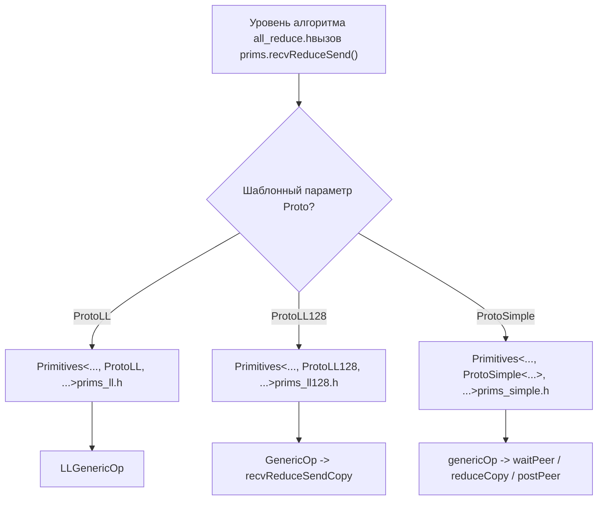
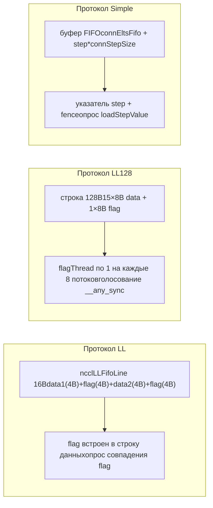

# Глава 9: Примитивы устройств: низкоуровневые протоколы LL, LL128 и Simple

# Глава 9: Примитивы коммуникации на стороне устройства: реализация перемещения данных в трёх протоколах LL, LL128, Simple

В предыдущей главе мы проследили, как на стороне хоста один AllReduce транслируется в __global__ kernel, и увидели, что точка входа на стороне устройства ncclKernelMain выполняет диспетчеризацию в соответствии с алгоритмом и протоколом. Но диспетчеризация — это лишь выбор инструмента; реальную производительность определяет то, как эти инструменты выполняют перемещение данных. В этой главе мы углубимся в три набора примитивов перемещения данных в src/device: LL, LL128 и Simple, разберём реализацию перемещения данных в каждом из них и поймём компромиссы между задержкой и пропускной способностью у разных протоколов.

# Почему для одного и того же AllReduce нужны три набора примитивов перемещения данных

Сначала построим интуитивную модель. Представьте конвейерный завод: сырьё (пользовательские данные) поступает с одного конца, готовая продукция выходит с другого, а между ними несколько рабочих мест (rank) должны обмениваться полуфабрикатами. Есть три способа передачи полуфабрикатов:

- **LL（Low Latency）**: как два человека, передающие друг другу записку из рук в руки: в момент передачи другой сразу понимает «это тебе». Почти нулевые накладные расходы на рукопожатие. Но записка очень маленькая, за раз можно передать только 8 байт полезных данных. Подходит для маленьких сообщений.
- **LL128**: заменить записку на стикер размером 128 байт, за раз передаётся 120 байт полезных данных, но требуется, чтобы стикер был выровнен по 16 байт, иначе сначала нужно «переразложить» его в разделяемой памяти. Подходит для сообщений среднего размера.
- **Simple**: как почтомат: сначала положить посылку в ячейку (буфер FIFO), затем отправить уведомление «в ячейке номер N есть товар». Накладные расходы на рукопожатие велики, но за раз можно переместить много. Подходит для больших сообщений.

> **[Design Inference & Architectural Trade-offs]**
> Что было бы, если бы существовал только один набор примитивов? Если использовать только LL, большие сообщения задушат пропускную способность из-за того, что «для каждого сообщения нужно ждать подтверждения flag от другой стороны»; если использовать только Simple, маленькие сообщения приведут к взрыву задержки из-за фиксированных накладных расходов «запись в FIFO + отправка уведомления + ожидание уведомления». Именно здесь корень того, почему кривая производительности NCCL имеет заметные переломы около 8KB и 128KB.

Все три набора примитивов используют один и тот же шаблонный каркас`Primitives<T, RedOp, Fan, Direct, Proto, P2p, isNetOffload>`, через`Proto`этот параметр шаблона специализируются три версии[FACT:src/device/primitives.h:117-117]。`ProtoLL`、`ProtoLL128`、`ProtoSimple`три структуры, каждая из которых несёт связанные с протоколом константы и методы вычислений[FACT:src/device/primitives.h:25-75], код алгоритма вызывает только`prims.send()`、`prims.recvReduceSend()`такой унифицированный интерфейс и не заботится о том, какой протокол лежит в основе.



Этот рисунок объясняет, «почему для одной и той же логики AllReduce нужны три набора примитивов перемещения данных»: уровень алгоритма не зависит от протокола, а различия протоколов инкапсулированы в`Primitives`трёх специализациях.

# LL: перемещение с нулевым рукопожатием, где flag встроен в строку данных

## Интуитивная модель

Ключевая идея LL:**упаковать «данные» и признак «готовы ли данные» в одну и ту же 16-байтовую единицу чтения-записи**. Принимающей стороне не нужно дополнительное «уведомительное сообщение»: достаточно опрашивать поле flag в строке данных; если flag совпадает, значит данные пришли. Это как при отправке письма напечатать «подпись получателя» прямо на конверте: почтальон, увидев подпись, сразу понимает, доставлять или нет, и не нужно отправлять отдельную квитанцию.

Без этого дизайна принимающей стороне пришлось бы сначала ждать уведомления «данные записаны», а затем возвращаться к чтению данных — два обращения к памяти, задержка удваивается.

## Структуры данных и раскладка памяти

Единица перемещения данных в LL —`union ncclLLFifoLine`, из`storeLL`ассемблера видно её раскладку[FACT:src/device/prims_ll.h:154-158]：

```
st.volatile.global.v4.u32 [%0], {%1,%2,%3,%4};
// 写入 4 个 u32：data1, flag, data2, flag
```

один`ncclLLFifoLine`занимает 16 байт и расположен как`[data1(4B) | flag(4B) | data2(4B) | flag(4B)]`. Полезных данных только 8 байт (data1 + data2), остальные 8 байт — это целиком flag. Именно поэтому`ProtoLL::calcBytePerGrain()`возвращает`sizeof(uint64_t)`— «One 16-byte line has 8-bytes of data»[FACT:src/device/primitives.h:55-57]。

Ключевые поля (`Primitives`специализация LL)[FACT:src/device/prims_ll.h:20-42]：

| Поле | Тип | Назначение |
| --- | --- | --- |
| `recvStep[i]` / `sendStep[i]` | `uint64_t[MaxRecv/MaxSend]` | счётчик шагов для каждого peer, определяет смещение буфера и значение flag |
| `recvBuff[i]` / `sendBuff[i]` | `ncclLLFifoLine*` | указывает на базовый адрес FIFO-буфера каждого peer |
| `recvConnHeadPtr` | `volatile uint64_t*` | глобальный указатель на стороне приёма «до какого шага уже потреблено» |
| `sendConnHeadPtr` | `volatile uint64_t*` | глобальный указатель на стороне отправки «до какого шага уже потребил удалённый peer» |
| `sendConnHeadCache` | `uint64_t` | кэширует последнее прочитанное значение head, чтобы не читать глобальную память каждый раз |

Смещение буфера вычисляется как`recvOffset(i) = (recvStep[i] % NCCL_STEPS) * stepLines`вычисляется[FACT:src/device/prims_ll.h:44-46]，`NCCL_STEPS`— это число слотов кольцевого буфера,`stepLines`— число строк на слот. Значение flag вычисляется как`recvFlag(i) = NCCL_LL_FLAG(recvStep[i] + 1)`вычисляется[FACT:src/device/prims_ll.h:56-58], обратите внимание`+1`— потому что начальное значение flag равно 0, и flag первого шага должен быть 1, чтобы отличаться от «не записано».

## Сценарный Walkthrough: один recvReduceSend

Предположим, rank 0 в Ring AllReduce выполняет`recvReduceSend`: принимает данные от предыдущего rank, выполняет reduce с локальными данными, затем отправляет следующему rank. Цепочка вызовов —`recvReduceSend(inpIx, eltN)` → `LLGenericOp<1, 1, Input, -1>(inpIx, -1, eltN, false)` [FACT:src/device/prims_ll.h:403-405]。

**Шаг первый: ожидание доступности буфера отправки.** `waitSend`проверяет`sendConnHeadCache + NCCL_STEPS < sendConnHead + 1` [FACT:src/device/prims_ll.h:73-89]. Смысл таков: если прогресс потребления удалённой стороны (head) слишком отстаёт от меня, значит кольцевой буфер почти заполнен и нужно ждать.`NCCL_STEPS`— общее число слотов буфера,`sendConnHead + 1`— слот, который я собираюсь занять. Во время ожидания опрашивается`*sendConnHeadPtr`обновляется кэш и периодически вызывается`checkAbort`проверка, не был ли выполнен abort[FACT:src/device/prims_ll.h:73-89]。

**Шаг второй: загрузка локальных данных.** `DataLoader::loadBegin`обрабатывает проблему выравнивания[FACT:src/device/prims_ll.h:200-216]. Когда`sizeof(T) <= 2`(например, half или int8), исходный адрес может быть не выровнен по 4 байта, поэтому сначала выполняется чтение с выравниванием по 4 байта в`u4[0..2]`, запоминается`misalign`, а затем в`loadFinish`с помощью`__funnelshift_r`выполняется побайтовый сдвиг и собирается правильное 64-битное значение[FACT:src/device/prims_ll.h:218-225]. Это типичный приём «выровненное чтение + пересборка сдвигом», позволяющий избежать штрафа за невыровненный доступ.

**Шаг третий: чтение данных удалённой стороны и ожидание flag.** `readLL`— это ядро[FACT:src/device/prims_ll.h:108-122]：

```cpp
do {
  asm volatile("ld.volatile.global.v4.u32 {%0,%1,%2,%3}, [%4];" ...);
  if (checkAbort(abort, 1, spins)) break;
} while ((flag1 != flag) || (flag2 != flag));
```

Оно использует`ld.volatile.global.v4.u32`За один раз читается 16 байт (4 u32), затем проверяется, что оба поля flag равны ожидаемым значениям.`volatile`Ключевое слово гарантирует, что компилятор не оптимизирует это чтение или не закэширует его в регистре — поскольку удалённая сторона может записать новые данные в любой момент. Оба flag должны совпадать, потому что записывающая сторона`storeLL`за один раз записывает 4 u32, что теоретически может быть разбито на две записи по 8 байт; совпадение обоих flag гарантирует целостность 16 байт.

**Четвёртый шаг: reduce и отправка.**После получения peerData,`applyReduce(redOp, peerData, data)`выполняется редукция[FACT:src/device/prims_ll.h:279]. Затем`storeLL(sendPtr(i) + offset, data, sendFlag(i))`результат записывается в буфер отправки[FACT:src/device/prims_ll.h:295-296]. Обратите внимание на порядок отправки: сначала отправляется`i=1..MaxSend`(обычно сетевой peer), последним отправляется`i=0`(обычно локальный peer)[FACT:src/device/prims_ll.h:291-297]. Комментарий очень ясно говорит: «Send : inter-node, then intra-node, then local» — сначала отправляется медленный (сетевой), чтобы он летел в фоне, затем быстрый (локальный), так локальный peer не будет ждать сеть.

**Пятый шаг: продвинуть step и post.** `incRecv(i)`Инкрементируется шаг приёма[FACT:src/device/prims_ll.h:91-93]，`postRecv()`значение`recvConnHead`записывается обратно в глобальный указатель[FACT:src/device/prims_ll.h:94-97], уведомляя удалённую сторону «я уже потребил этот шаг». На стороне отправки`incSend`есть специальная логика[FACT:src/device/prims_ll.h:99-106]：

```cpp
if ((sendStep[i] & NCCL_LL_CLEAN_MASK) == NCCL_LL_CLEAN_MASK) {
  for (int o = offset; o  *head) { ... }
}
```

В режиме DirectRead для sendrecv отправитель может вернуться только после того, как получатель полностью прочитает данные. Если получатель по какой-то причине не продвигает tail, отправитель попадёт в взаимоблокировку. Это ожидание должно выполняться после`barrier()`, иначе возможна гонка с post-потоком.

**Ловушка 3:`roundUp`вызываемый скачок step.** `loadRecvConn`и`loadSendConn`содержат`step = roundUp(step, SlicePerChunk * StepPerSlice)` [FACT:src/device/prims_simple.h:486, 533]. Это выравнивает step по границе slice, но если step предыдущего шага не выровнен, пропущенные слоты не будут корректно инициализированы. В коде в`loadRecvConn`добавлена строка`*connStepPtr = step`для возврата credit[FACT:src/device/prims_simple.h:489]。

# Сравнение и выбор трёх наборов примитивов



| Измерение | LL | LL128 | Simple |
| --- | --- | --- | --- |
| Коэффициент полезной нагрузки | 50% | 93.75% | ~100% |
| Способ синхронизации | flag встроен, опрос | flagThread + warp-голосование | указатель step + fence |
| Требования к выравниванию | Нет (есть перестановка со сдвигом) | 16 байт | Нет |
| Подходящий размер сообщения | Малый (< 8KB) | Средний (8KB ~ 128KB) | Большой (> 128KB) |
| Разметка буфера | `ncclLLFifoLine[]` | `uint64_t[]`по 128B line | `T[]` FIFO |
| Поддержка Direct | Нет (`PrimitivesWithoutDirect`деградация) | Нет (то же самое) | Полная поддержка |

И LL, и LL128 наследуют`PrimitivesWithoutDirect` [FACT:src/device/prims_ll.h:9-10, src/device/prims_ll128.h:13-14], поскольку их разметка буфера не поддерживает прямое чтение и запись в память партнёра. Simple же полностью реализует режим Direct, поддерживая P2P-соединение и NVLS.

# Размышления о дизайне

> **[Design Inference & Architectural Trade-offs]**
> **Почему flag в LL дублируется дважды?**Потому что запись в глобальную память GPU не гарантирует атомарности.`storeLL`При записи 16 байт аппаратное обеспечение может разбить её на две записи по 8 байт. Если разместить только один flag, получатель может решить, что данные готовы, когда записана лишь половина. Два flag располагаются в первой и второй половине 16 байт, и только после завершения обеих записей оба flag совпадут.

**Почему Simple резервирует один warp?** [FACT:src/device/prims_simple.h:625-626]В комментарии сказано: «For send operations, we need an extra warp to overlap the threadfence and the copy».`fence_acq_rel_sys()`— дорогостоящая операция, и если все потоки будут ждать завершения fence, прежде чем продолжить, это приведёт к большим потерям времени. Выделяется один warp специально для fence, а остальные warp могут продолжать переносить следующую партию данных.

> **[Design Inference & Architectural Trade-offs]**
> **Почему продвижение step в LL128 выполняется в конце GenericOp, а не в recvReduceSendCopy?**Потому что перенос в LL128 выполняется на уровне warp, и несколько warp могут параллельно обрабатывать разные slice. Если продвигать step в`recvReduceSendCopy`, каждый warp продвинет его по разу, что приведёт к многократному продвижению step. Размещение в конце`GenericOp`обеспечивает единое продвижение, гарантируя, что каждый slice продвигается только один раз.

# Итоги главы

В этой главе подробно рассмотрены реализации трёх наборов примитивов переноса:

1. **LL**: с помощью 16-байтного`ncclLLFifoLine`flag встраивается в строку данных, и получателю достаточно опрашивать совпадение flag, чтобы подтвердить готовность данных. Полезная нагрузка 50%, подходит для малых сообщений. Ключевое —`readLL`в`ld.volatile.global.v4.u32`и`storeLL`в`st.volatile.global.v4.u32`。

2. **LL128**: flag сосредоточены в последних 8 байтах каждых 128 байт, полезная нагрузка повышается до 93.75%. С помощью`flagThread`(1 на каждые 8 потоков) проверяется flag,`__any_sync`выполняется warp-голосование. При невыровненности выполняется переразметка через разделяемую память.

3. **Simple**: высокая пропускная способность для больших сообщений достигается за счёт FIFO-буфера + уведомления через указатель step.`flags`битовые флаги кодируют роль,`waitPeer`опрашивает step,`postPeer`обновляет step и выполняет fence. Полная поддержка режима Direct.

Все три набора примитивов используют один и тот же шаблонный каркас, специализируемый через`Proto`шаблонные параметры. Алгоритмический уровень вызывает только унифицированный интерфейс и не заботится о нижележащем протоколе. Вот ответ на вопрос «почему для одной и той же логики AllReduce нужны три набора примитивов переноса»: для разных размеров сообщений нужны разные стратегии синхронизации и разметки буфера, и три набора примитивов оптимизированы соответственно для малых, средних и больших сообщений.

# Вопросы для размышления и самопроверки в этой главе

Q1: Если убрать логику cleanup в`incSend`([FACT:src/device/prims_ll.h:99-106]), в каких сценариях возникнет повреждение данных? Почему?

**Справочный разбор**: логика cleanup при`sendStep[i] & NCCL_LL_CLEAN_MASK == NCCL_LL_CLEAN_MASK`записывает все строки всего slice текущим flag (данные заполняются 0). Если её убрать, то при заворачивании step к границе`NCCL_LL_CLEAN_MASK`flag некоторых строк может остаться значением предыдущего раунда. Если flag предыдущего раунда случайно совпадёт с flag, ожидаемым получателем в текущем раунде, получатель ошибочно решит, что данные готовы, и прочитает остаточные данные предыдущего раунда. Это типичная проблема ABA. Условие срабатывания — длительная работа (step превышает`NCCL_LL_CLEAN_MASK`циклов) и случайное заворачивание flag к тому же значению. Такие баги крайне трудно воспроизвести, поскольку требуется точное выравнивание step.

Q2: В деструкторе протокола Simple ожидание в режиме NetRegMode ([FACT:src/device/prims_simple.h:794-804]) и ожидание в режиме DirectRead ([FACT:src/device/prims_simple.h:814-824]) — от чего каждое защищает? Если убрать одно из них, что произойдёт в сценарии с высокой конкуренцией?

**Справочный разбор**: NetRegMode ожидает, пока proxy-поток установит`connFifo[prevStep].size`в -1, что означает завершение отправки сетевой картой. Если убрать это ожидание, следующий kernel может перезаписать буфер отправки, который в данный момент читается сетевой картой через DMA, что приведёт к чтению сетевой картой грязных данных. DirectRead ожидает, пока принимающая сторона продвинет tail (`*tail > *head`), что означает завершение чтения прямого буфера принимающей стороной. Если убрать это ожидание, отправляющая сторона может перезаписать буфер до того, как принимающая сторона закончит чтение, что приведёт к чтению принимающей стороной новых данных вместо старых. В сценариях с высокой конкуренцией оба ожидания необходимы; удаление любого из них приведёт к гонке данных. Разница в том, что NetRegMode защищает от «чтения сетевой картой», а DirectRead — от «чтения удалённым GPU».

Q3: LL128`loadRegsBegin`при невыровненности идёт через переупаковку в разделяемой памяти ([FACT:src/device/prims_ll128.h:115-141]), насколько этот путь медленнее выровненного? Почему NCCL не требует от пользователя обязательного выравнивания буфера по 16 байт?

**Справочный разбор**: Невыровненный путь добавляет три шага: запись в разделяемую память,`__syncwarp()`, чтение из разделяемой памяти. Пропускная способность разделяемой памяти высока, но`__syncwarp()`является точкой синхронизации, которая блокирует warp до завершения записи всеми потоками. Грубая оценка: невыровненный путь медленнее выровненного на 20-40%, в зависимости от конфликтов банков разделяемой памяти. NCCL не требует обязательного выравнивания, потому что пользователь может передать буфер с произвольным смещением (например, срез тензора), а принудительное выравнивание ограничило бы гибкость API. Стратегия NCCL — «при выравнивании идти по быстрому пути, при невыравненности идти по медленному пути, но гарантировать корректность». В продакшене рекомендуется по возможности выделять буферы с выравниванием по 16 байт, чтобы идти по быстрому пути.

Итак, мы уже освоили механизмы перемещения данных трёх примитивов — LL, LL128 и Simple; они предоставляют алгоритмам верхнего уровня гибкие средства настройки производительности. В следующей главе мы углубимся в ядра алгоритмов коллективных коммуникаций и посмотрим, как AllReduce, AllGather, ReduceScatter и другие вызывают эти примитивы, а также как алгоритмы Ring, Tree, CollNet и другие организуют потоки данных, в конечном итоге выполняя сквозную коллективную коммуникацию.
