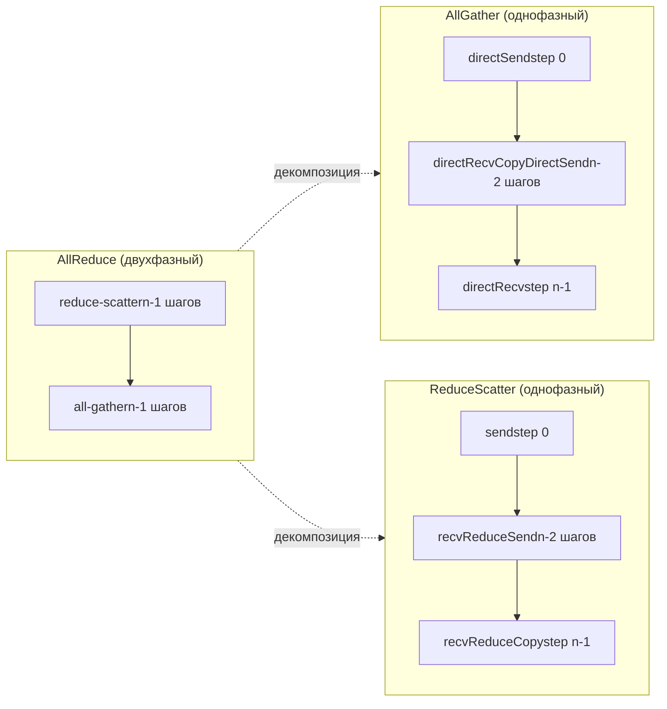
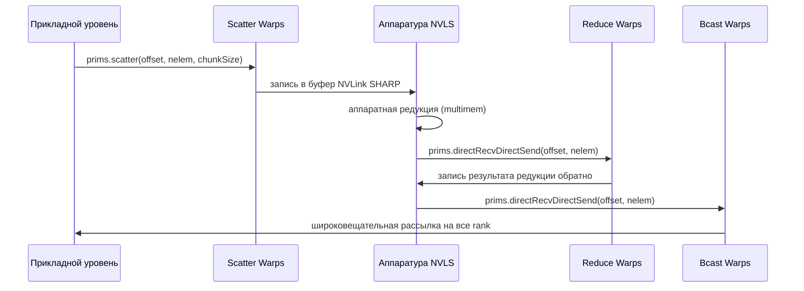

# Глава 10: Ядра коллективных операций: архитектура AllReduce, AllGather и ReduceScatter

# Глава 10: Ядра алгоритмов коллективных коммуникаций: реализация AllReduce, AllGather, ReduceScatter на устройстве

В предыдущей главе мы разобрали три протокольных примитива — LL, LL128 и Simple; они являются «двигателями» перемещения данных, но сам двигатель не знает, что перемещать, куда и в каком порядке. Рассматриваемая в этой главе группа файлов ядер алгоритмов в src/device — это «коробка передач»: они переводят семантику коллективных коммуникаций AllReduce, AllGather, ReduceScatter в последовательность вызовов примитивов вроде prims.directSend, prims.directRecvReduceDirectSend. Основное противоречие этой главы можно сформулировать одной фразой: почему для одного и того же AllReduce нужны четыре совершенно разные реализации на стороне устройства — Ring, Tree, CollNet, NVLS? Ответ кроется в соответствии между «топологией потока данных» и «аппаратными возможностями». Ring использует минимальную пропускную способность сети для двухфазного конвейера, Tree с древовидной редукцией снижает задержку до log(n), а CollNet/NVLS выгружают редукцию на сетевую карту или коммутатор NVLink. В этой главе мы разберём каждую по очереди.

# 10.1 Ring AllReduce: как двухфазный конвейер реализуется внутри kernel

## Интуитивная модель: «эстафета» на кольцевом конвейере

Представьте n рабочих, стоящих в кругу, у каждого в руках ящик сырья. Цель AllReduce — чтобы каждый в итоге получил «готовый продукт, смешанный из всего сырья». Алгоритм Ring действует в две фазы: первая фаза (reduce-scatter) — каждый передаёт ящик по кольцу, на каждой остановке подмешивая своё сырьё; после n-1 остановок у каждого оказывается ровно одна «полностью смешанная» порция готового продукта, но лишь доля 1/n; вторая фаза (all-gather) — эти доли готового продукта снова идут по кольцу, и каждый дополняет все доли.

Без Ring самый простой подход — каждый rank отправляет данные root, root выполняет редукцию и затем рассылает — пропускная способность сети root становится узким местом, и чем больше n, тем медленнее. Изящество Ring в том, что:**Объём отправки и приёма для каждого ранга составляет 2(n-1)/n от объёма данных, что равномерно распределяется по всем каналам независимо от n**。

## Структуры данных и размещение в памяти

Ключевое состояние алгоритма Ring находится в`ncclRing`структуре (определена в device.h, в этой главе не рассматривается),`runRing`берём только два её поля:

- `ring->index`: логическая позиция данного ранга в кольце, используется для вычисления «какой chunk обрабатывать на шаге j».
- `ring->prev` / `ring->next`: номера предшествующего и последующего рангов, используются как параметры recv/send peer для конструктора`Primitives`

Ключевые параметры разбиения на блоки вычисляются`ncclCollCbdPart`([FACT:src/device/all_reduce.h:21-22]）：

```
ncclCollCbdPart(work, ncclShmem.channelId, Proto::Id, sizeof(T), (ssize_t*)nullptr, &gridOffset, &channelCount, &chunkCount);
```

Эта функция разбивает данные всего коммуникационного домена по каналам и возвращает три значения:`gridOffset`(начальное смещение данных, за которые отвечает данный канал, во всём буфере),`channelCount`(общее количество элементов, за которые отвечает данный канал),`chunkCount`(количество элементов в chunk, приходящемся на каждый ранг).`chunkCount`— это гранулярность алгоритма Ring: на каждом шаге передаётся один chunk.

`loopCount = nranks * chunkCount`（[FACT:src/device/all_reduce.h:23]) обозначает объём данных, обрабатываемых за «полный оборот». Внешний цикл`for (elemOffset = 0; elemOffset < channelCount; elemOffset += loopCount)`（[FACT:src/device/all_reduce.h:34]) означает: если объём данных канала превышает то, что можно обработать за один оборот, выполняется несколько оборотов.

## Пошаговый разбор: полный поток вызовов одного Ring AllReduce

Сценарий: 4 ранга (nranks=4), для данного ранга`ringIx=0`，`chunkCount=100`，`channelCount=400`(ровно один оборот).

**Шаг 0: отправить «свой chunk» следующему GPU**（[FACT:src/device/all_reduce.h:42-47]）

```
chunk = modRanks(ringIx + nranks - 1);   // = 3
chunkOffset = chunk * chunkCount;         // = 300
offset = gridOffset + elemOffset + chunkOffset;
nelem = min(chunkCount, remCount - chunkOffset);
prims.directSend(offset, offset, nelem);
```

`modRanks`— это лямбда, выполняющая вычитание по модулю nranks ([FACT:src/device/all_reduce.h:40]）。`ringIx + nranks - 1`обозначает «номер предыдущего chunk для данного ранга». Почему на шаге 0 отправляется chunk 3? Потому что на фазе reduce-scatter алгоритма Ring каждый ранг сначала отправляет ту часть данных, которую он «не должен сохранять» (то есть chunk предшествующего ранга).`directSend`только отправляет, не принимает, так как в этот момент ещё не получено никаких данных.

**Шаги с 1 по nranks-2: приём, редукция и пересылка одновременно**（[FACT:src/device/all_reduce.h:50-56]）

```
for (int j = 2; j вычисление chunkCount/loopCount"] --> loop{"elemOffset |нет| done["возврат"]
    loop -->|да| s0["step 0: directSendchunk = ringIx-1"]
    s0 --> mid{"j от 2 до nranks-1?"}
    mid -->|да| s1["directRecvReduceDirectSendchunk = ringIx-j"]
    s1 --> mid
    mid -->|нет| s2["step nranks-1directRecvReduceCopyDirectSendpostOp=true"]
    s2 --> ag{"j от 1 до nranks-2?"}
    ag -->|да| s3["directRecvCopyDirectSendчистая пересылка"]
    s3 --> ag
    ag -->|нет| s4["directRecvприём последнего блока"]
    s4 --> loop
```

## Размышления о дизайне: почему порядок chunk в Ring идёт «в обратную сторону»

Обратите внимание на закономерность нумерации chunk: на шаге 0 отправляется`ringIx-1`, на шаге j обрабатывается`ringIx-j`, на последнем шаге обрабатывается`ringIx+0`. Это**против часовой стрелки**продвижение. Почему? Потому что каждый ранг в Ring сохраняет только «тот chunk, за редукцию которого он отвечает» (то есть`ringIx+0`), остальные chunk просто проходят мимо. Продвижение против часовой стрелки гарантирует: когда некоторый chunk, совершив полный оборот, возвращается в начальную точку, ровно завершаются nranks редукций, давая окончательный результат. Если бы продвижение было по часовой стрелке, chunk завершал бы редукцию на неправильном ранге.

## Производственные подводные камни:`remCount < loopCount`ловушка выравнивания при

[FACT:src/device/all_reduce.h:38]Есть одна легко упускаемая строка кода:

```
if (remCount = 256) nthreadsSplit += 64;
} else {
  nthreadsSplit = (nthreads * 7 / (10 * WARP_SIZE)) * WARP_SIZE;
}
```

Протокол Simple делит пополам; протоколы LL/LL128 делят в соотношении 7:3, потому что «приём данных от 3 источников с выполнением reduce» вычислительно интенсивнее, чем «отправка 3 получателям», поэтому группе reduce выделяется больше потоков.

Затем`tid < nthreadsSplit`потоков выполняют reduce-подъём ([FACT:src/device/all_reduce.h:175-202]), остальные потоки выполняют broadcast-спуск ([FACT:src/device/all_reduce.h:203-224]). Две группы различаются смещением`Proto::MaxGroupWidth`для своих коммуникационных групп ([FACT:src/device/all_reduce.h:189]для`0 * Proto::MaxGroupWidth`и[FACT:src/device/all_reduce.h:210]для`1 * Proto::MaxGroupWidth`）。

## Проектное решение: почему корневой узел Tree требует особой обработки

Корневой узел древовидного reduce — это «точка сбора»: объём приёма равен числу дочерних узлов, объём отправки равен нулю (в фазе reduce). Если корневой узел также пойдёт по общему`directRecvReduceDirectSend`, он попытается отправить`tree->up`(-1), что приведёт к выходу за границы. Поэтому необходима отдельная ветвь`if (tree->up == -1)`. Аналогично и проверка`tree->down[0] == -1`для листового узла.

## Производственные грабли: проблема «горячего корня» в алгоритме Tree

Корневой узел Tree несёт весь трафик reduce; если GPU, на котором находится корневой узел, оказывается медленным узлом (например, из-за ограниченной пропускной способности PCIe), весь AllReduce замедляется. Ответ NCCL:**для каждого channel выбирается свой корень**, что распределяет нагрузку корневого узла по нескольким рангам. Именно поэтому`runTreeSplit`в ветви корневого узла используется`FanSymmetric<NCCL_MAX_TREE_ARITY_TOP>`（[FACT:src/device/all_reduce.h:168]) — он должен одновременно обрабатывать reduce от нескольких дочерних узлов. Если в производственной среде наблюдается неравномерная производительность Tree AllReduce, проверьте равномерность распределения корневых узлов по channel.

# 10.3 AllGather и ReduceScatter: «половинные» варианты Ring

## Интуитивная модель: AllReduce, разделённый на две половины

AllGather и ReduceScatter по сути представляют собой две фазы AllReduce, каждая из которых выделена в отдельный API. AllGather выполняет только «сбор» — каждый ранг вносит свою порцию данных, в итоге все получают все данные. ReduceScatter выполняет только «reduce + scatter» — все вносят данные, после reduce каждый получает свою порцию.

Без этих двух отдельных API пользователю при необходимости «сначала reduce, затем gather» или «сначала gather, затем reduce» пришлось бы вызывать AllReduce и вручную нарезать данные, теряя половину пропускной способности.

## Реализация AllGather через Ring

`all_gather.h`в`runRing`（[FACT:src/device/all_gather.h:14-88]) проще, чем AllReduce: нет reduce, только копирование и пересылка.

**Шаг 0: отправить свои данные следующему GPU**（[FACT:src/device/all_gather.h:51-60]）

```
rankDest = ringRanks[0];
offset = dataOffset + rankDest * count;
if ((inputBuf + dataOffset == outputBuf + offset) || isNetOffload) {
  prims.directSend(dataOffset, offset, nelem);
} else {
  prims.directCopySend(dataOffset, offset, nelem);
}
```

Здесь есть проверка in-place: если`inputBuf + dataOffset == outputBuf + offset`, значит вход и выход — одна и та же память (in-place AllGather), тогда сразу`directSend`; иначе нужно`directCopySend`(сначала скопировать в выход, затем отправить).

**Средние nranks-2 шагов: чистая пересылка**（[FACT:src/device/all_gather.h:62-67]）

```
prims.directRecvCopyDirectSend(offset, offset, nelem);
```

**Последний шаг: принять последний блок**（[FACT:src/device/all_gather.h:69-74]）

```
prims.directRecv(offset, nelem);
```

## isNetOffload: один warp управляет сетью + несколько warp параллельно копируют

[FACT:src/device/all_gather.h:28-36]имеет специальную ветвь:

```
if (isNetOffload) {
  workNthreads = WARP_SIZE;
  chunkCount = NCCL_MAX_NET_SIZE;
} else {
  workNthreads = nthreads;
}
```

Когда`isNetOffload=true`(режим одного RPN + сетевой регистрации), только 1 warp управляет коммуникацией Ring, остальные warp параллельно выполняют «копирование исходных данных в целевой buffer» ([FACT:src/device/all_gather.h:76-82]). Это делается для того, чтобы при не-in-place AllGather перекрыть затраты на копирование и коммуникацию.

В конце есть`barrier_sync(14, nthreads)`（[FACT:src/device/all_gather.h:87]), и комментарий объясняет это предельно ясно: необходимо дождаться завершения всех warp, иначе следующая work может переиспользовать outputBuf и вызвать гонку. Используется barrier 14, чтобы обойти собственный barrier prims и`__syncthreads()`。

## Реализация ReduceScatter через Ring

`reduce_scatter.h`в`runRing`（[FACT:src/device/reduce_scatter.h:14-56]) — это выделенная фаза reduce-scatter из AllReduce:

**Шаг 0: отправить свои данные следующему GPU**（[FACT:src/device/reduce_scatter.h:39-42]）

```
rankDest = ringRanks[nranks - 1];
offset = dataOffset + rankDest * count;
prims.send(offset, nelem);
```

**Средние nranks-2 шагов: приём, reduce и пересылка одновременно**（[FACT:src/device/reduce_scatter.h:44-49]）

```
prims.recvReduceSend(offset, nelem);
```

**Последний шаг: принять и выполнить reduce, получив окончательный результат**（[FACT:src/device/reduce_scatter.h:61-64]）

```
prims.recvReduceCopy(offset, dataOffset, nelem, /*postOp=*/true);
```

Обратите внимание на последний шаг`recvReduceCopy`есть два offset:`offset`(источник приёма) и`dataOffset`(локальный ввод), результат редукции записывается в`dataOffset`。

## Сравнительная схема потоков данных



## Подводные камни в продакшене: границы определения in-place

[FACT:src/device/all_gather.h:55]определение in-place`inputBuf + dataOffset == outputBuf + offset`зависит от точного равенства указателей. Если переданные пользователем sendbuff и recvbuff имеют смещение, но логически являются одной и той же областью памяти, это определение не сработает, что приведёт к`directCopySend`пути — хотя и корректному, но с дополнительным копированием. В продакшене рекомендуется при in-place AllGather убедиться, что sendbuff и recvbuff полностью совпадают.

# 10.4 CollNet и NVLS: выгрузка редукции на аппаратное обеспечение

## Интуитивная модель: пусть «коммутатор» поможет вычислить

Ring и Tree — это «GPU сам вычисляет редукцию». CollNet и NVLS используют другой подход: выгрузка операции редукции на сетевую карту (CollNet) или коммутатор NVLink (NVLS). GPU только отправляет данные, аппаратное обеспечение выполняет редукцию и затем рассылает результат обратно. Это как переход от «каждый рабочий сам смешивает ингредиенты» к «отправить ингредиенты в центральный смеситель, смеситель смешает и раздаст».

Без аппаратной выгрузки операция редукции занимает ресурсы SM GPU, и задержку редукции невозможно скрыть.

## Разделение потоков в CollNet Direct

`RunWorkColl<ncclFuncAllReduce, ..., NCCL_ALGO_COLLNET_DIRECT, ...>`в`run`（[FACT:src/device/all_reduce.h:249-386]) разделяет потоки на четыре группы:

```
const int nThreadsScatter = WARP_SIZE + ((hasUp && hasDn) ? COLLNET_COPY_THREADS : ...);
const int nThreadsGather = ((hasUp && hasDn) ? COLLNET_COPY_THREADS : ...);
const int nThreadsBcast = WARP_SIZE + ((hasUp && hasDn) ? COLLNET_COPY_THREADS : ...);
const int nThreadsReduce = work->nWarps * WARP_SIZE - nThreadsScatter - nThreadsGather - nThreadsBcast;
```

Четыре группы потоков отвечают соответственно за: Scatter (распределение данных по rail'ам), Reduce (редукция и отправка в сеть), Gather (сбор с rail'ов), Bcast (широковещательная рассылка после получения из сети).`COLLNET_COPY_THREADS = 96`（[FACT:src/device/all_reduce.h:250]) — это фиксированное количество потоков копирования.

## netRegUsed: раскладка буферов в режиме сетевой регистрации

[FACT:src/device/all_reduce.h:280-288]есть ключевое ветвление:

```
if (work->netRegUsed) {
  offsetBase = bid * chunkSize;
  maxNelems = size;
  peerOffset = nChannels * chunkSize;
} else {
  offsetBase = bid * direct->nHeads * chunkSize;
  maxNelems = direct->nHeads * chunkSize;
  peerOffset = chunkSize;
}
```

`netRegUsed`в режиме буферы располагаются последовательно по channel (`bid * chunkSize`), смещение peer равно`nChannels * chunkSize`; в нерегистрируемом режиме — по head (`bid * nHeads * chunkSize`), смещение peer равно`chunkSize`. Это различие обусловлено тем, что режим сетевой регистрации требует непрерывности буферов для DMA сетевой карты.

## Распределение warp в NVLS

`RunWorkColl<ncclFuncAllReduce, ..., NCCL_ALGO_NVLS, ...>`в`run`（[FACT:src/device/all_reduce.h:391-523]) использует более тонкое распределение warp:

```
const int bcastWarps = hasOut ? (work->regUsed ? ((totalWarps - 2) >> 1) - 1 : 2) : 0;
const int reduceWarps = work->regUsed ? (totalWarps - bcastWarps - 2) : (hasOut ? 3 : nranks regUsed ? 1 : (totalWarps - reduceWarps - bcastWarps + 1) >> 1;
const int gatherWarps = work->regUsed ? 1 : (totalWarps - reduceWarps - bcastWarps) >> 1;
```

`regUsed`в режиме scatter/gather занимают всего по 1 warp (поскольку аппаратное обеспечение NVLS напрямую работает с зарегистрированной памятью), reduce занимает большую часть; в нерегистрируемом режиме scatter/gather занимают примерно по половине, reduce корректируется в зависимости от числа rank'ов (≤6 использует 7 warp, иначе 5 warp).

## Схема временных взаимодействий



## Подводные камни в продакшене: ловушка`direct->out == -1`в CollNet

[FACT:src/device/reduce_scatter.h:521]содержит строку:

```
if (direct->out == -1) __trap();
```

Если out-соединение CollNet не установлено (-1), прямой`__trap()`приводит к падению kernel. Это защитное программирование — CollNet зависит от сетевой карты, если инициализация сетевой карты не удалась, out будет -1, и продолжение выполнения приведёт к неопределённому поведению. В продакшене, если видите kernel trap, проверьте, нормально ли инициализирована сетевая карта CollNet.

# 10.5 Broadcast и Reduce: две простейшие коллективные операции

## Broadcast: веерная рассылка от root

`broadcast.h`в`runRing`（[FACT:src/device/broadcast.h:14-64]) логика довольно прямолинейна: root-узел отправляет данные, остальные узлы пересылают, последний узел только принимает.

```
if (rank == root) {
  if (inputBuf == outputBuf || isNetOffload) {
    prims.directSend(offset, offset, nelem);
  } else {
    prims.directCopySend(offset, offset, nelem);
  }
} else if (nextRank == root) {
  prims.directRecv(offset, nelem);
} else {
  prims.directRecvCopyDirectSend(offset, offset, nelem);
}
```

Три ветви: root отправляет, предшественник root принимает, промежуточные узлы пересылают. Обратите внимание, что`nextRank == root`проверяет «следующий узел данного узла — это root», то есть данный узел является последним в кольце — он только принимает и не отправляет.

## Reduce: схождение к root

`reduce.h`в`runRing`（[FACT:src/device/reduce.h:14-53]) — обратная операция к Broadcast:

```
if (prevRank == root) {
  prims.send(offset, nelem);
} else if (rank == root) {
  prims.recvReduceCopy(offset, offset, nelem, /*postOp=*/true);
} else {
  prims.recvReduceSend(offset, nelem);
}
```

`prevRank == root`Узел

## только отправляет (он предшественник root), root только принимает и выполняет редукцию, промежуточные узлы принимают, редуцируют и пересылают.

Размышления о дизайне: почему Broadcast/Reduce тоже используют Ring**Broadcast и Reduce теоретически могут использовать Tree для меньшей задержки, но NCCL выбирает Ring потому что:**объём данных этих двух операций обычно невелик, реализация Ring проще, и можно переиспользовать кодовый путь Ring из AllReduce

## . Сложность Tree (выбор корневого узла, разделение потоков) при малых сообщениях не даёт заметного выигрыша.

Подводные камни в продакшене: узкое место пропускной способности root-узла в Broadcast**Root-узел Broadcast должен отправить все данные; если root — медленный узел, весь Broadcast замедляется. Ответ NCCL:**Broadcast также поддерживает несколько channel, root каждого channel может быть разным`work->root`. Но обратите внимание, что

# является глобальным, все channel используют один и тот же root — это определяется семантикой Broadcast (только один источник). В продакшене, если Broadcast медленный, проверьте пропускную способность сети root-узла.

10.6 Матрица выбора алгоритма: специализация шаблона RunWorkColl`RunWorkColl`Все ядра алгоритмов регистрируются через специализацию шаблона[FACT:src/device/all_reduce.h:228-788](

| ). Каждая специализация соответствует комбинации «функция × алгоритм × протокол»: | Функция | Алгоритм | Протокол |
| --- | --- | --- | --- |
| AllReduce | RING | SIMPLE | [FACT:src/device/all_reduce.h:230-233] |
| AllReduce | TREE | SIMPLE | [FACT:src/device/all_reduce.h:238-244] |
| AllReduce | COLLNET_DIRECT | SIMPLE | [FACT:src/device/all_reduce.h:249-386] |
| AllReduce | NVLS | SIMPLE | [FACT:src/device/all_reduce.h:391-523] |
| AllReduce | NVLS_TREE | SIMPLE | [FACT:src/device/all_reduce.h:528-634] |
| AllReduce | COLLNET_CHAIN | SIMPLE | [FACT:src/device/all_reduce.h:639-759] |
| AllReduce | RING | LL | [FACT:src/device/all_reduce.h:764-766] |
| AllReduce | TREE | LL | [FACT:src/device/all_reduce.h:771-773] |
| AllReduce | RING | LL128 | [FACT:src/device/all_reduce.h:778-780] |
| AllReduce | TREE | LL128 | [FACT:src/device/all_reduce.h:785-787] |

Место специализации**CollNet и NVLS поддерживают только протокол SIMPLE**. Поскольку эти два алгоритма полагаются на аппаратную разгрузку, а механизм низколатентной синхронизации LL/LL128 несовместим с аппаратной разгрузкой — задержка аппаратной редукции намного больше, чем опрос флагов в LL, и использование LL лишь увеличивает накладные расходы.

## Внутренняя логика выбора протокола

- **LL**: малые сообщения (< 8KB), приоритет низкой задержки. Поддерживаются и Ring, и Tree.
- **LL128**: средние сообщения (8KB - 1MB), выравнивание по 128 байт. Поддерживаются и Ring, и Tree.
- **SIMPLE**: большие сообщения (> 1MB), приоритет пропускной способности. Поддерживаются все алгоритмы.

## Производственные подводные камни: ограничения комбинаций протокола и алгоритма

Если пользователь принудительно указывает`NCCL_PROTO=LL`, но алгоритм — CollNet, NCCL на этапе tuning откатится к SIMPLE. В производственной среде, если обнаружено, что настройка протокола не действует, проверьте, поддерживает ли алгоритм этот протокол.

# Размышления о дизайне: почему одна и та же логика AllReduce требует стольких реализаций

Оглядываясь на эту главу, AllReduce имеет шесть алгоритмических реализаций: Ring, Tree, CollNet Direct, CollNet Chain, NVLS, NVLS Tree. Это не избыточность, а**оптимальные решения для различных аппаратных топологий и размеров сообщений**：

- **Ring**: универсальный, подходит для больших сообщений, наивысшая утилизация пропускной способности.
- **Tree**: подходит для крупномасштабных кластеров, задержка O(log n).
- **CollNet**: подходит для кластеров с сетевыми картами, поддерживающими редукцию, разгружает вычисления GPU.
- **NVLS**: подходит для полносвязного NVLink в пределах одного узла, аппаратная многоадресная редукция.

Модуль tuning в NCCL (глава 5) автоматически выбирает на основе размера сообщения, числа рангов, топологии. Реализация на стороне устройства должна лишь гарантировать «корректность каждой комбинации», логика выбора — на стороне хоста.

# Итоги главы

В этой главе разобраны`src/device`шесть файлов ядер алгоритмов:

1. **Ring AllReduce**（[FACT:src/device/all_reduce.h:14-83]): двухэтапный конвейер, reduce-scatter + all-gather, каждый этап по n-1 шагов.

2. **Tree AllReduce**（[FACT:src/device/all_reduce.h:86-225]): древовидная редукция, задержка O(log n),`runTreeSplit`использует разделение потоков для реализации конвейера редукция-широковещание.

3. **AllGather**（[FACT:src/device/all_gather.h:14-88]): Ring одноэтапный, поддерживает in-place и netOffload.

4. **ReduceScatter**（[FACT:src/device/reduce_scatter.h:14-56]): Ring одноэтапный, представляет собой этап reduce-scatter в AllReduce.

5. **Broadcast/Reduce**（[FACT:src/device/broadcast.h:14-64]、[FACT:src/device/reduce.h:14-53]): простейший вариант Ring.

6. **CollNet/NVLS**（[FACT:src/device/all_reduce.h:247-635]): аппаратная разгрузка, поддерживает только протокол SIMPLE.

# Вопросы для размышления и самопроверки к этой главе

Q1: На этапе reduce-scatter в Ring AllReduce шаг 0 использует`directSend`, промежуточные шаги используют`directRecvReduceDirectSend`, последний шаг использует`directRecvReduceCopyDirectSend`. Если убрать`postOp=true`на последнем шаге, в каких сценариях возникнет ошибочный результат?

**Разбор ответа**：`postOp=true`запускает пост-операцию (например, деление при вычислении среднего). На примере`ncclAvg`редукция — это суммирование, postOp — деление на nranks. Если убрать`postOp`, последний шаг выполнит только редукцию без деления, в recvbuff будет храниться «сумма», а не «среднее». На этапе reduce-scatter каждый ранг сохраняет только финальный результат одного чанка, и этот чанк как раз`ringIx+0`（[FACT:src/device/all_reduce.h:60]). Если postOp отсутствует, сумма этого чанка не делится на nranks, и последующий этап all-gather распространит эту ошибочную «сумму» на все ранги. Замечание: postOp нужен только на последнем шаге, поскольку только этот шаг даёт результат «полной редукции»; редукция на промежуточных шагах — это частичная сумма, postOp не нужен. В производственной среде, если обнаружено, что результат AllReduce завышен в nranks раз, проверьте корректность передачи postOp.

Q2: `runTreeSplit`В протоколах LL/LL128 потоки разделяются в соотношении 7:3 ([FACT:src/device/all_reduce.h:163]), а в протоколе Simple — 1:1 ([FACT:src/device/all_reduce.h:157]). Что произойдёт, если принудительно изменить LL-протокол на 1:1?

**Разбор ответа**: группа редукции в LL/LL128 должна принимать данные максимум от 3 дочерних узлов и выполнять редукцию ([FACT:src/device/all_reduce.h:187]в`FanAsymmetric<NCCL_MAX_TREE_ARITY, 1>`), вычисления интенсивны; группа широковещания только копирует и пересылает ([FACT:src/device/all_reduce.h:208]в`FanAsymmetric<1, NCCL_MAX_TREE_ARITY>`), вычисления лёгкие. Разделение 7:3 даёт группе редукции достаточно потоков для обработки 3-путевой редукции, а группе широковещания потоков меньше, но достаточно. При изменении на 1:1 группе редукции не хватит потоков, редукция станет узким местом; группа широковещания будет иметь избыток потоков, что расточительно. Что ещё серьёзнее — опрос флагов в LL-протоколе является активным ожиданием, и больше потоков увеличит конкуренцию за флаги. В производственной среде, если обнаружена аномальная производительность Tree AllReduce под LL-протоколом, проверьте, не изменены ли вычисления`nthreadsSplit`.

Q3: В режиме`isNetOffload`AllGather только 1 warp управляет Ring-коммуникацией ([FACT:src/device/all_gather.h:32]), остальные warp выполняют параллельное копирование ([FACT:src/device/all_gather.h:76-82]). Если убрать финальный`barrier_sync(14, nthreads)`（[FACT:src/device/all_gather.h:87]), в каких сценариях возникнет гонка данных?

**Разбор ответа**：`barrier_sync`Гарантирует, что все warp'ы (включая коммуникационные warp'ы и warp'ы копирования) завершат текущую work, прежде чем перейти к следующей work. Если убрать это, коммуникационный warp может начать коммуникацию следующей work, пока warp копирования ещё не дописал outputBuf, а следующая work может повторно использовать тот же outputBuf. Конкретный сценарий: два последовательных AllGather, warp копирования первого ещё дописывает хвост outputBuf, а коммуникационный warp второго уже начал записывать новые данные в outputBuf, что приводит к перезаписи данных первого. В комментарии ясно сказано: «otherwise, we can have contention if next work will use the outputBuf in this work». Использование barrier 14 вместо стандартного barrier необходимо, чтобы избежать внутренних barrier'ов prims и`__syncthreads()`, предотвращая взаимную блокировку. В production-среде, если обнаружены периодические ошибки в результатах AllGather, проверьте,`isNetOffload`не оптимизирован ли barrier на пути.

На этом мы завершили рассмотрение того, как алгоритмические ядра на стороне устройства организуют поток данных. Каждый алгоритм через`Primitives`вызывает примитивы из предыдущей главы; алгоритмический уровень заботится только о том, «кто кому отправляет, какой chunk, reduce или copy». В следующей главе мы углубимся в абстракцию транспортного уровня и посмотрим, как P2P, SHM, NET, NVLS унифицируются в единый интерфейс, а также как proxy-потоки на стороне host взаимодействуют с kernel'ами на стороне устройства для выполнения межмашинной коммуникации.

Ключевая закономерность: все алгоритмы вызывают примитивы через шаблонный класс Primitives; алгоритм отвечает только за «топологию потока данных», примитивы отвечают за «перемещение данных». Такая слоистость позволяет новым алгоритмам реализовывать только логику топологии, не заботясь о низкоуровневой синхронизации. Но как бы ни менялась топология, данные в конечном итоге должны передаваться по физическим каналам. В следующей главе мы углубимся в каталог src/transport и посмотрим, как NCCL с помощью единого интерфейса transport скрывает различия между P2P, SHM, NET, NVLS, а также семантику setup/connect/send/recv каждого transport. Это основа для понимания межмашинной коммуникации.
