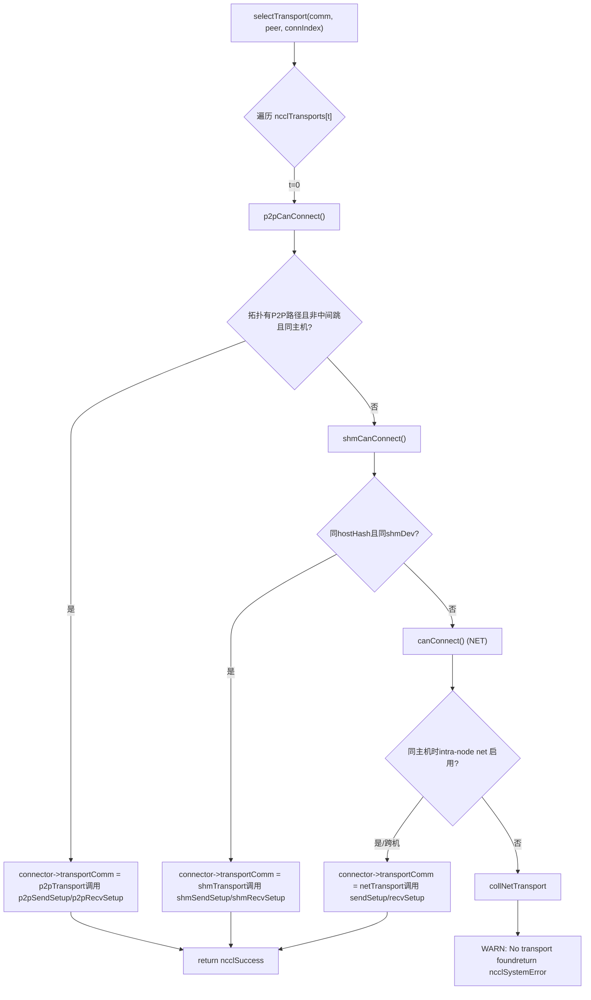
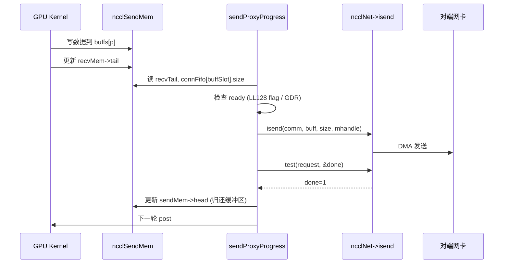

# Глава 11: Абстракция транспортного уровня: как P2P, SHM, NET, NVLS унифицируются в едином интерфейсе

В предыдущей главе мы углубились в алгоритмические ядра и увидели, как Ring AllReduce разбивает данные и выполняет двухфазную редукцию, а Tree AllReduce с помощью древовидной структуры снижает задержку — но эти алгоритмы определяют лишь логическое представление «кто кому отправляет, какой chunk». Данные в конечном итоге должны пройти через реальные физические каналы: NVLink, PCIe, разделяемую память или сетевую карту. В этой главе мы разберём каталог src/transport и посмотрим, как NCCL с помощью единого интерфейса ncclTransport маскирует четыре физических канала P2P, SHM, NET, NVLS под одним обликом, завершая последнюю милю от алгоритмической топологии до физической передачи.

# I. Единый интерфейс: как ncclTransport скрывает четыре физических канала

## Интуитивная модель

Представьте логистическую компанию: независимо от того, отправляет ли клиент городскую курьерскую доставку (P2P), передачу внутри здания (SHM), междугороднюю перевозку (NET) или выделенную линию (NVLS), на стойке заполняется только одна «транспортная накладная». Эта накладная и есть`ncclTransport`структура — она определяет, что каждый способ доставки должен предоставлять`canConnect`、`setup`、`connect`、`free`и другие фиксированные действия. Без этого слоя абстракции верхнеуровневым алгоритмам пришлось бы писать четыре набора`if-else`для определения, по какому каналу идти, и при добавлении нового оборудования пришлось бы менять все алгоритмы.

## Структуры данных и layout памяти

NCCL использует глобальный массив для регистрации всех transport'ов, порядок в котором определяет приоритет:

[FACT:src/transport.cc:15-20]

```c
struct ncclTransport* ncclTransports[NTRANSPORTS] = {
  &p2pTransport,
  &shmTransport,
  &netTransport,
  &collNetTransport,
};
```

Порядок в массиве определяет порядок выбора: P2P в приоритете, затем SHM, затем NET, и наконец CollNet. Каждый transport описывается структурой`ncclTransport`, которая содержит указатель на функцию`canConnect`и два`ncclTransportComm`(по одному для send/recv). На примере P2P:

[FACT:src/transport/p2p.cc:1493-1498]

```c
struct ncclTransport p2pTransport = {"P2P",
                                     p2pCanConnect,
                                     {p2pSendSetup, p2pSendConnect, p2pSendFree, NULL, p2pSendProxySetup, NULL,
                                      p2pSendProxyFree, NULL, p2pProxyRegister, p2pProxyDeregister},
                                     {p2pRecvSetup, p2pRecvConnect, p2pRecvFree, NULL, p2pRecvProxySetup, NULL,
                                      p2pRecvProxyFree, NULL, p2pProxyRegister, p2pProxyDeregister}};
```

`ncclTransportComm`Порядок полей — это фиксированные «слоты жизненного цикла»:`setup`(подготовка ресурсов),`connect`(обмен информацией о соединении),`free`(освобождение),`proxySharedInit`(инициализация общего proxy),`proxySetup`、`proxyConnect`、`proxyFree`、`proxyProgress`、`proxyRegister`、`proxyDeregister`. Обратите внимание, что слот`proxyProgress`у P2P —`NULL`— потому что P2P работает через прямой доступ GPU к памяти удалённого узла и не требует host proxy-потока для перемещения данных; а у NET`proxyProgress`—`sendProxyProgress`/`recvProxyProgress`, потому что I/O сетевой карты должен управляться host-потоком.

## Сценарный Walkthrough: как при установке соединения выбирается transport

Когда NCCL нужно установить соединение для некоторого peer'а некоторого channel, вызывается`selectTransport`：

[FACT:src/transport.cc:23-44]

```c
template 
static ncclResult_t selectTransport(struct ncclComm* comm, struct ncclTopoGraph* graph, struct ncclConnect* connect,
                                    int channelId, int peer, int connIndex, int* transportType) {
  struct ncclPeerInfo* myInfo = comm->peerInfo + comm->rank;
  struct ncclPeerInfo* peerInfo = comm->peerInfo + peer;
  struct ncclConnector* connector = (type == 1) ? comm->channels[channelId].peers[peer]->send + connIndex :
                                                  comm->channels[channelId].peers[peer]->recv + connIndex;
  for (int t = 0; t send : &transport->recv;
    int ret = 0;
    NCCLCHECK(transport->canConnect(&ret, comm, graph, myInfo, peerInfo));
    if (ret) {
      connector->transportComm = transportComm;
      NCCLCHECK(transportComm->setup(comm, graph, myInfo, peerInfo, connect, connector, channelId, connIndex));
      if (transportType) *transportType = t;
      return ncclSuccess;
    }
  }
  WARN("No transport found for rank %d[%lx] -> rank %d[%lx]", myInfo->rank, myInfo->busId, peerInfo->rank,
       peerInfo->busId);
  return ncclSystemError;
}
```

`type==1`обозначает направление send,`type==0`обозначает направление recv. Цикл поочерёдно опрашивает каждый transport`canConnect`: возвращает`ret=1`означает «я могу выполнить эту работу», немедленно устанавливает`connector->transportComm`на соответствующее направление этого transport и вызывает его`setup`. Если все transport вернули 0, выводится предупреждение и возвращается`ncclSystemError`。

`canConnect`логика определения отражает «границы владений» каждого transport. На примере P2P:

[FACT:src/transport/p2p.cc:129-157]

```c
ncclResult_t p2pCanConnect(int* ret, struct ncclComm* comm, struct ncclTopoGraph* graph, struct ncclPeerInfo* info1,
                           struct ncclPeerInfo* info2) {
  initCeOperation();
  int intermediateRank;
  int isCrossClique;
  NCCLCHECK(ncclTopoCheckP2p(comm, comm->topo, info1->rank, info2->rank, ret, NULL, &intermediateRank, NULL,
                             &isCrossClique));
  if (*ret == 0) return ncclSuccess;
  if (intermediateRank != -1) {
    if (useMemcpy) *ret = 0;
    return ncclSuccess;
  }
  if (!isCrossClique) {
    int useNet = 0;
    NCCLCHECK(ncclTopoCheckNet(comm->topo, info1->rank, info2->rank, &useNet));
    if (useNet) {
      *ret = 0;
      return ncclSuccess;
    }
  }
  if (info1->hostHash != comm->peerInfo[comm->rank].hostHash || info1->hostHash != info2->hostHash) {
    return ncclSuccess;
  }
  ...
```

Цепочка определения P2P: сначала спрашиваем топологию «есть ли P2P-путь между двумя rank»; если есть промежуточные переходы (`intermediateRank != -1`) и включён CE memcpy, то отказываемся от P2P в пользу SHM/NET; если топология рекомендует идти через сеть (`useNet`), тоже отказываемся; в конце проверяем, находятся ли они на одном хосте. Определение SHM проще:

[FACT:src/transport/shm.cc:61-83]

```c
static ncclResult_t shmCanConnect(int* ret, struct ncclComm* comm, struct ncclTopoGraph* graph,
                                  struct ncclPeerInfo* info1, struct ncclPeerInfo* info2) {
  *ret = 0;
  initShmLocality();
  if (ncclParamShmDisable() == 1) return ncclSuccess;
  int useNet = 0;
  NCCLCHECK(ncclTopoCheckNet(comm->topo, info1->rank, info2->rank, &useNet));
  if (useNet) return ncclSuccess;
  if (info1->hostHash != info2->hostHash) return ncclSuccess;
  if (info1->shmDev != info2->shmDev) return ncclSuccess;
  *ret = 1;
  return ncclSuccess;
}
```

SHM требует один и тот же хост (`hostHash`совпадает) и совместное использование одного и того же`/dev/shm`（`shmDev`совпадает, используется для межконтейнерной коммуникации). NET же почти всегда возвращает 1, и только на одном хосте проверяет, отключён ли intra-node net:

[FACT:src/transport/net.cc:160-168]

```c
static ncclResult_t canConnect(int* ret, struct ncclComm* comm, struct ncclTopoGraph* graph, struct ncclPeerInfo* info1,
                               struct ncclPeerInfo* info2) {
  *ret = 1;
  if (info1->hostHash == info2->hostHash) {
    NCCLCHECK(ncclTopoCheckNet(comm->topo, info1->rank, info2->rank, ret));
  }
  return ncclSuccess;
}
```

NET — это «подстраховка»: если раньше никто не взялся, он берётся. У NVLS`canConnect`сразу возвращает 0:

[FACT:src/transport/nvls.cc:21-26]

```c
ncclResult_t nvlsCanConnect(int* ret, struct ncclComm* comm, struct ncclTopoGraph* graph, struct ncclPeerInfo* info1,
                            struct ncclPeerInfo* info2) {
  // This transport cannot be used for p2p
  *ret = 0;
  return ncclSuccess;
}
```

NVLS не идёт по обычному пути peer-to-peer соединения, он через`ncclNvlsSetup`отдельно создаёт multicast-группу, поэтому`canConnect`всегда возвращает 0.



## Соображения по проектированию

> **[Design Inference & Architectural Trade-offs]**
> Почему используется «порядок массива + голосование canConnect», а не явная таблица маршрутизации? Потому что топология динамична: на одной и той же машине из-за`NCCL_P2P_DISABLE`, изоляции контейнеров, доступности CUDA IPC и других факторов P2P может стать недоступным, и тогда происходит автоматическая деградация до SHM или NET. Механизм голосования позволяет каждому transport самому решать «могу ли я это делать», а для добавления нового transport достаточно добавить один элемент в массив, не меняя логику выбора. Это и есть проявление принципа открытости-закрытости в системном программировании.

# II. P2P: четыре формы прямого соединения GPU на одном хосте

## Интуитивная модель

P2P — это «передача вещей напрямую между соседями»: GPU 0 напрямую читает и пишет память GPU 1, не проходя через CPU или сетевую карту. Без P2P коммуникация между несколькими GPU на одном хосте была бы вынуждена идти через память хоста, что удвоило бы задержку и вдвое сократило пропускную способность.

## Структуры данных и размещение в памяти

Внутри P2P есть четыре формы, различаемые по`enum p2pType`:

[FACT:src/transport/p2p.cc:19-24]

```c
enum p2pType {
  P2P_DIRECT,
  P2P_INTERMEDIATE,
  P2P_IPC,
  P2P_CUMEM
};
```

- `P2P_DIRECT`: разные GPU в одном процессе, доступ напрямую через указатель (самый быстрый).
- `P2P_INTERMEDIATE`: между двумя GPU нет прямого соединения, требуется пересылка через промежуточный GPU.
- `P2P_IPC`: межпроцессное взаимодействие, импорт памяти удалённой стороны через традиционный`cudaIpcOpenMemHandle`.
- `P2P_CUMEM`: межпроцессное взаимодействие, импорт через cuMem API (`cuMemExportToShareableHandle`), поддерживает более тонкое управление памятью.

Основная структура ресурсов:

[FACT:src/transport/p2p.cc:79-94]

```c
struct p2pResources {
  enum p2pType type;
  union {
    struct ncclSendMem* sendDevMem;
    struct ncclRecvMem* recvDevMem;
  };
  void* sendMemIpc;
  int sendMemSameProc;
  void* recvMemIpc;
  int recvMemSameProc;
  // CE memcpy support
  struct p2pShmProxyInfo proxyInfo;
  struct p2pShm* shm;
  struct p2pShm* devShm;
  ncclShmIpcDesc_t desc;
};
```

`sendDevMem`/`recvDevMem`— это union: отправитель заботится только о`sendDevMem`, получатель заботится только о`recvDevMem`, общая память используется совместно.`sendMemIpc`/`recvMemIpc`хранит импортированный дескриптор удалённой памяти,`sendMemSameProc`/`recvMemSameProc`отмечает, находится ли он в том же процессе (определяет, использовать ли при освобождении`ncclCuMemFreeAddr`или`cudaIpcCloseMemHandle`）。

Структура информации о соединении`p2pConnectInfo`обменивается через bootstrap:

[FACT:src/transport/p2p.cc:38-44]

```c
struct p2pConnectInfo {
  int rank;
  int read;
  struct ncclP2pBuff p2pBuff;
  // Used by CE memcpy
  ncclShmIpcDesc_t desc;
};
static_assert(sizeof(struct p2pConnectInfo) transportResources = resources;
  int useRead, intermediateRank;
  NCCLCHECK(p2pGetInfo(comm, myInfo, peerInfo, &useRead, &intermediateRank));
  if (useMemcpy) useRead = 0;
  ...
  int sendSize = sizeof(struct ncclSendMem);
  if (info->read) sendSize += comm->buffSizes[NCCL_PROTO_SIMPLE];
  ALIGN_SIZE(sendSize, CUDA_IPC_MIN);
  ...
```

Ключевые моменты:`sendSize`в режиме P2P Read нужно дополнительно добавить размер буфера протокола SIMPLE — потому что в режиме чтения SIMPLE buffer отправителя напрямую читается получателем и должен быть размещён вместе с`ncclSendMem`в одной и той же разделяемой памяти.`ALIGN_SIZE(sendSize, CUDA_IPC_MIN)`гарантирует выравнивание размера до минимальной гранулярности CUDA IPC.

Затем в зависимости от`intermediateRank`и отношений процессов выбирается форма:

[FACT:src/transport/p2p.cc:416-437]

```c
  if (intermediateRank == -1) {
    info->rank = myInfo->rank;
    if (P2P_SAME_PID(myInfo, peerInfo) && ncclParamP2pDirectDisable() == 0 && useMemcpy == 0) {
      resources->type = P2P_DIRECT;
      ...
    } else {
      if (ncclCuMemEnable()) {
        resources->type = P2P_CUMEM;
        ...
      } else {
        resources->type = P2P_IPC;
        ...
      }
    }
    send->conn.flags |= info->read ? NCCL_P2P_READ : NCCL_P2P_WRITE;
  } else {
    resources->type = P2P_INTERMEDIATE;
    info->rank = intermediateRank;
    ...
  }
```

`P2P_SAME_PID`макрос определяет один и тот же хост и процесс:

[FACT:src/transport/p2p.cc:334-335]

```c
#define P2P_SAME_PID(MYINFO, PEERINFO) \
  ((MYINFO->hostHash == PEERINFO->hostHash) && (MYINFO->pidHash == PEERINFO->pidHash))
```

Если тот же процесс, direct не отключён и memcpy не включён, то это самый быстрый`P2P_DIRECT`— напрямую берётся указатель удалённой стороны. Иначе идёт IPC/CUMEM.

Затем через прокси-поток выделяется разделяемый буфер:

[FACT:src/transport/p2p.cc:457-468]

```c
  NCCLCHECK(ncclProxyConnect(comm, TRANSPORT_P2P, 1, info->rank, &send->proxyConn));
  if (useMemcpy) {
    NCCLCHECK(ncclProxyCallBlocking(comm, &send->proxyConn, ncclProxyMsgSetup, NULL, 0, &resources->proxyInfo,
                                    sizeof(struct p2pShmProxyInfo)));
    memcpy(&info->desc, &resources->proxyInfo.desc, sizeof(ncclShmIpcDesc_t));
  } else {
    NCCLCHECK(ncclProxyCallBlocking(comm, &send->proxyConn, ncclProxyMsgSetup, &req, sizeof(struct ncclP2pRequest),
                                    &info->p2pBuff, sizeof(struct ncclP2pBuff)));
    NCCLCHECK(p2pMap(comm, &send->proxyConn, myInfo, comm->peerInfo + info->rank, &info->p2pBuff,
                     (void**)&resources->sendDevMem, &resources->sendMemIpc));
    resources->sendMemSameProc = P2P_SAME_PID(myInfo, (comm->peerInfo + info->rank));
  }
```

`ncclProxyCallBlocking`— это синхронный RPC: host-поток отправляет сообщение прокси-потоку, прокси-поток вызывает`p2pSendProxySetup`для выделения разделяемого буфера и возвращает`ncclP2pBuff`(включая IPC-дескриптор). Затем`p2pMap`отображает буфер удалённой стороны в локальное адресное пространство.

`p2pMap`— это основная функция отображения:

[FACT:src/transport/p2p.cc:349-390]

```c
static ncclResult_t p2pMap(struct ncclComm* comm, struct ncclProxyConnector* proxyConn, struct ncclPeerInfo* myInfo,
                           struct ncclPeerInfo* peerInfo, struct ncclP2pBuff* p2pBuff, void** devMem, void** ipcPtr) {
  if (P2P_SAME_PID(myInfo, peerInfo)) {
    if (peerInfo->cudaDev != myInfo->cudaDev) {
      cudaError_t err = cudaDeviceEnablePeerAccess(peerInfo->cudaDev, 0);
      ...
      if (ncclCuMemEnable()) {
        NCCLCHECK(ncclCuMemAllocAddr(devMem, &p2pBuff->ipcDesc.memHandle, p2pBuff->size));
        CUCHECK(cuMemRelease(p2pBuff->ipcDesc.memHandle));
        *ipcPtr = *devMem;
        ...
      } else {
        *devMem = p2pBuff->directPtr;
        *ipcPtr = NULL;
      }
    } else {
      *devMem = p2pBuff->directPtr;
      *ipcPtr = NULL;
    }
  } else {
    NCCLCHECK(ncclP2pImportShareableBuffer(comm, peerInfo->rank, p2pBuff->size, &p2pBuff->ipcDesc, devMem,
                                           p2pBuff->directPtr, ncclMemOffload));
    *ipcPtr = *devMem;
  }
  return ncclSuccess;
}
```

Один процесс, разные GPU: сначала`cudaDeviceEnablePeerAccess`открывает P2P-канал, затем напрямую используется`directPtr`(поскольку адресное пространство в одном процессе общее). Межпроцессное взаимодействие: вызывается`ncclP2pImportShareableBuffer`для импорта дескриптора удалённой памяти.

## Управление конкурентностью и взаимодействие с оборудованием

Синхронизация P2P опирается на`ncclSendMem`/`ncclRecvMem`в`head`/`tail`указатель. Отправитель пишет`head`и сообщает получателю «докуда я записал», получатель пишет`tail`и сообщает отправителю «докуда я прочитал». Это типичный lock-free producer-consumer:

[FACT:src/transport/p2p.cc:571-576]

```c
  } else {
    send->conn.tail = &remDevMem->tail;
    send->conn.head = &resources->sendDevMem->head;
    send->conn.ptrExchange = &resources->sendDevMem->ptrExchange;
    send->conn.redOpArgExchange = resources->sendDevMem->redOpArgExchange;
  }
```

`head`указывает на локальный`sendDevMem`，`tail`указывает на удалённый`remDevMem`. GPU kernel через чтение и запись этих двух указателей реализует меж-GPU синхронизацию без участия CPU.

## Руководство по избежанию проблем в продакшене

**Проблема 1: P2P Read и memcpy взаимоисключающи.**смотрит`p2pSendConnect`：

[FACT:src/transport/p2p.cc:551-559]

```c
  for (int p = 0; p read && p == NCCL_PROTO_SIMPLE) {
      /* For P2P Read the SIMPLE buffer is local (ncclSendMem) */
      if (resources->sendDevMem == NULL) return ncclInternalError; // We should not use read + memcpy
      send->conn.buffs[p] = (char*)(resources->sendDevMem + 1);
    } else {
      send->conn.buffs[p] = buff;
      buff += comm->buffSizes[p];
    }
  }
```

Если`read=1`но`sendDevMem==NULL`, сразу возвращается`ncclInternalError`. Если в продакшене видна эта ошибка, проверьте, не установлены ли одновременно`NCCL_P2P_READ_ENABLE=1`и`NCCL_P2P_USE_CUDA_MEMCPY=1`— эти две семантики конфликтуют.

**Проблема 2: порядок освобождения при межпроцессном взаимодействии.** `p2pSendFree`в зависимости от`sendMemSameProc`определяет способ освобождения:

[FACT:src/transport/p2p.cc:624-651]

```c
ncclResult_t p2pSendFree(struct ncclComm* comm, struct ncclConnector* send) {
  struct p2pResources* resources = (struct p2pResources*)send->transportResources;
  if (resources) {
    if (ncclCuMemEnable()) {
      if (resources->sendMemIpc) {
        if (resources->sendMemSameProc) {
          NCCLCHECK(ncclCuMemFreeAddr(resources->sendMemIpc, comm->memManager));
        } else {
          NCCLCHECK(ncclCudaFree(resources->sendMemIpc, comm->memManager));
        }
      }
      ...
```

В одном процессе используется`ncclCuMemFreeAddr`(освобождается только адресное отображение, не физическая память), в межпроцессном —`ncclCudaFree`(освобождение физической памяти). Перепутав порядок, вы получите утечку памяти или use-after-free.

# III. SHM: спор о том, «кто предоставляет память» в разделяемой памяти

## Интуитивная модель

SHM — это «две процесса используют одну общую доску» — отправитель пишет, получатель читает. Но у кого находится доска? У отправителя (sender-side), и получатель прибегает читать; или у получателя (receiver-side), и отправитель прибегает писать? Именно эту проблему решает параметр`NCCL_SHM_LOCALITY`.

## Структуры данных и размещение в памяти

[FACT:src/transport/shm.cc:28-34]

```c
struct shmSendResources {
  struct ncclRecvMem* remHostMem;
  struct ncclRecvMem* devRemHostMem;
  ncclShmIpcDesc_t remDesc;
  struct ncclSendMem* hostMem;
  struct ncclSendMem* devHostMem;
};

struct shmRecvResources {
  struct ncclSendMem* remHostMem;
  struct ncclSendMem* devRemHostMem;
  ncclShmIpcDesc_t remDesc;
  struct ncclRecvMem* hostMem;
  struct ncclRecvMem* devHostMem;
};
```

Обратите внимание, что`hostMem`и`devHostMem`появляются парами:`hostMem`— это указатель на стороне host,`devHostMem`— указатель на стороне устройства (через UVA или отображение cuMem).`remHostMem`/`devRemHostMem`— это локальное отображение разделяемой памяти удалённой стороны.

## Сценарный Walkthrough: выбор locality для SHM

`shmSendSetup`В зависимости от locality определяется, сколько памяти выделять:

[FACT:src/transport/shm.cc:88-119]

```c
static ncclResult_t shmSendSetup(struct ncclComm* comm, struct ncclTopoGraph* graph, struct ncclPeerInfo* myInfo,
                                 struct ncclPeerInfo* peerInfo, struct ncclConnect* connectInfo,
                                 struct ncclConnector* send, int channelId, int connIndex) {
  struct shmSendResources* resources;
  struct shmConnectInfo* info = (struct shmConnectInfo*)connectInfo;
  size_t shmSize = sizeof(struct ncclSendMem);
  struct shmRequest req;

  NCCLCHECK(ncclCalloc(&resources, 1));
  send->transportResources = resources;

  if (shmLocality == SHM_SEND_SIDE) {
    for (int p = 0; p buffSizes[p];
  }
  req.size = shmSize;
  if (myInfo->hostHash == peerInfo->hostHash && myInfo->pidHash == peerInfo->pidHash) req.legacy = true;
  else req.legacy = false;

  NCCLCHECK(ncclProxyConnect(comm, TRANSPORT_SHM, 1, myInfo->rank, &send->proxyConn));
  NCCLCHECK(ncclProxyCallBlocking(comm, &send->proxyConn, ncclProxyMsgSetup, (void*)&req, sizeof(struct shmRequest),
                                  (void*)info, sizeof(struct shmConnectInfo)));

  info->rank = comm->rank;
  resources->hostMem = (struct ncclSendMem*)info->buf.hptr;
  resources->devHostMem = (struct ncclSendMem*)info->buf.dptr;
  ...
```

`shmLocality == SHM_SEND_SIDE`отправитель выделяет буфер данных (`shmSize`плюс все протокольные буферы); иначе выделяется только`ncclSendMem`управляющая структура.`req.legacy`отмечает, находится ли всё в одном процессе — внутри процесса можно использовать традиционный`mmap`, для межпроцессного взаимодействия нужен cuMem или`/dev/shm`файл.

`shmSendConnect`в зависимости от locality определяет, указывает ли`buffs`на локальную или удалённую сторону:

[FACT:src/transport/shm.cc:153-176]

```c
static ncclResult_t shmSendConnect(struct ncclComm* comm, struct ncclConnect* connectInfo, int nranks, int rank,
                                   struct ncclConnector* send) {
  struct shmConnectInfo* info = (struct shmConnectInfo*)connectInfo;
  struct shmSendResources* resources = (struct shmSendResources*)send->transportResources;
  char* buff;

  NCCLCHECK(ncclShmImportShareableBuffer(comm, info->rank, &info->desc, (void**)&resources->remHostMem,
                                         (void**)&resources->devRemHostMem, &resources->remDesc));

  buff = shmLocality == SHM_SEND_SIDE ? (char*)(resources->devHostMem + 1) : (char*)(resources->devRemHostMem + 1);
  for (int p = 0; p conn.buffs[p] = buff;
    buff += comm->buffSizes[p];
  }
  send->conn.tail = &resources->devRemHostMem->tail;
  send->conn.head = &resources->devHostMem->head;
  send->conn.stepSize = comm->buffSizes[NCCL_PROTO_SIMPLE] / NCCL_STEPS;
  ...
```

`SHM_SEND_SIDE`：`buffs`указывает на локальный`devHostMem`(отправитель пишет в свою память);`SHM_RECV_SIDE`：`buffs`указывает на удалённый`devRemHostMem`(отправитель пишет в память получателя).`head`всегда указывает на локальную сторону,`tail`всегда указывает на удалённую сторону — потому что отправитель обновляет`head`, а получатель обновляет`tail`。

## Проектные соображения

> **[Design Inference & Architectural Trade-offs]**
> Почему по умолчанию`SHM_RECV_SIDE`? Потому что получателю обычно нужно скопировать данные из разделяемой памяти в собственную видеопамять GPU; если разделяемая память находится локально у получателя, путь копирования короче (локальная память → локальный GPU), что позволяет избежать跨NUMA-доступа. Хотя запись отправителем в удалённую память добавляет одну кросс-узловую запись, отправитель обычно является вычислительно-интенсивным GPU, и операция записи может выполняться асинхронно.

## Руководство по избеганию проблем в production

**Проблема: между контейнерами`/dev/shm`не разделяется.** `shmCanConnect`Проверьте`info1->shmDev != info2->shmDev`：

[FACT:src/transport/shm.cc:76-78]

```c
  TRACE(NCCL_INIT | NCCL_SHM, "peer1 shmDev %lx peer2 shmDev %lx", info1->shmDev, info2->shmDev);
  if (info1->shmDev != info2->shmDev) return ncclSuccess;
```

Если два контейнера смонтировали разные`/dev/shm`，`shmDev`разные, SHM автоматически деградирует до NET. Если в production обнаружено, что связь между хостами идёт по сети, проверьте, одинаково ли смонтированы`/dev/shm`в контейнерах.

# IV. NET: таблица отображения сетевой передачи и прогресс прокси

## Интуитивная модель

NET — это «междугородняя доставка» — данные упаковываются и передаются сетевой карте, которая по оптоволокну доставляет их на удалённую сторону. Но сетевая карта не понимает адреса видеопамяти GPU, нужна «таблица отображения адресов», которая транслирует виртуальные адреса GPU в физические адреса, понятные сетевой карте. Эта таблица и есть`connectMap`。

## Структуры данных и размещение в памяти

[FACT:src/transport/net.cc:73-86]

```c
struct connectMapMem {
  char* gpuPtr;
  char* cpuPtr;
  ssize_t size;
  ncclIpcDesc ipcDesc;
  ncclShmIpcDesc_t attachDesc;
  ncclShmIpcDesc_t createDesc;
};

struct connectMap {
  int sameProcess;
  int shared;
  int cudaDev;
  // First 3 bits of offsets determine the mem bank. 001 is host mem, 011 is dev mem, 101 is shared host mem and 111
  // is shared dev mem.
  struct connectMapMem mems[NCCL_NET_MAP_MEMS];
  // Offsets. 3 MSBs indicate mem bank, 111 indicates NULL.
  struct {
    uint32_t sendMem;
    uint32_t recvMem;
    uint32_t buffs[NCCL_NUM_PROTOCOLS];
  } offsets;
};
```

`connectMap`— это система «банков памяти»:`mems`массив имеет 5 слотов (`NCCL_NET_MAP_MEMS=5`), соответствующих host mem, dev mem, shared host mem, shared dev mem, GDC mem.`offsets`каждое поле — 32-битное целое, старшие 3 бита кодируют «какой банк», младшие 29 бит кодируют «смещение внутри банка».

Макрос декодирования:

[FACT:src/transport/net.cc:36-46]

```c
#define NCCL_NET_MAP_OFFSET_BANK(mapStruct, offsetName) ((mapStruct)->offsets.offsetName >> 30)

#define NCCL_NET_MAP_OFFSET_NULL(mapStruct, offsetName) (((mapStruct)->offsets.offsetName >> 29) == 0)

#define NCCL_NET_MAP_GET_POINTER(mapStruct, cpuOrGpu, offsetName) \
  (NCCL_NET_MAP_OFFSET_NULL(mapStruct, offsetName) ? \
     NULL : \
     (mapStruct)->mems[NCCL_NET_MAP_OFFSET_BANK(mapStruct, offsetName)].cpuOrGpu##Ptr + \
       ((mapStruct)->offsets.offsetName & NCCL_NET_MAP_MASK_OFFSET))

#define NCCL_NET_MAP_DEV_MEM(mapStruct, offsetName) (((mapStruct)->offsets.offsetName & NCCL_NET_MAP_MASK_DEVMEM) != 0)
```

`NCCL_NET_MAP_GET_POINTER(map, gpu, sendMem)`после раскрытия: берутся`offsets.sendMem`старшие 2 бита как индекс банка, к`mems[bank].gpuPtr`добавляется смещение из младших 29 бит, получается фактический указатель. Эта схема кодирования упаковывает «какая область памяти + смещение внутри области» в одно 32-битное целое, экономя размер передачи`connectMap`.

## Сценарный Walkthrough: установление отображения в sendProxyConnect

`sendProxyConnect`— самая сложная функция NET, отвечающая за установление соединения с сетевой картой, выделение буферов, регистрацию памяти:

[FACT:src/transport/net.cc:858-1041]

```c
static ncclResult_t sendProxyConnect(struct ncclProxyConnection* connection, struct ncclProxyState* proxyState,
                                     void* reqBuff, int reqSize, void* respBuff, int respSize, int* done) {
  struct sendNetResources* resources = (struct sendNetResources*)(connection->transportResources);
  ...
  if (resources->shared) {
    // Shared buffers
    ...
    if (resources->maxRecvs > 1 && ncclParamNetSharedComms()) {
      // Connect or reuse connection for a netdev/remote rank.
      ...
      if (comms->sendComm[resources->channelId] == NULL &&
          comms->activeConnect[resources->channelId] == (resources->tpLocalRank + 1)) {
        ret = proxyState->ncclNet->connect(proxyState->netContext, resources->netDev, req->handle,
                                           comms->sendComm + resources->channelId, &resources->netDeviceHandle);
      }
      ...
```

`maxRecvs > 1`включает «разделяемое соединение»: несколько channel переиспользуют одно соединение с сетевой картой, уменьшая число соединений.`activeConnect`массив гарантирует, что соединение инициирует только один local rank, избегая дублирования.

Затем выделяются буферы и выполняется регистрация:

[FACT:src/transport/net.cc:933-956]

```c
  if (resources->shared == 0) {
    // Only allocate dedicated buffers for ring/tree, not for p2p
    for (int p = 0; p useGdr ? 1 : 0, proxyState->buffSizes[p],
                               buffs[p]);
      resources->buffSizes[p] = proxyState->buffSizes[p];
    }
  } else {
    // Get shared buffers
    int bank = resources->useGdr ? NCCL_NET_MAP_SHARED_DEVMEM : NCCL_NET_MAP_SHARED_HOSTMEM;
    struct connectMapMem* mapMem = map->mems + bank;
    NCCLCHECK(sharedNetBuffersInit(proxyState, resources->useGdr, resources->tpLocalRank, 0, map->sameProcess,
                                   proxyState->p2pnChannels, &mapMem->gpuPtr, &mapMem->cpuPtr, &mapMem->size,
                                   &mapMem->ipcDesc));
    resources->buffSizes[NCCL_PROTO_SIMPLE] = mapMem->size;
    ...
```

`NCCL_NET_MAP_ADD_POINTER`макрос регистрирует буфер в`connectMap`：

[FACT:src/transport/net.cc:48-62]

```c
#define NCCL_NET_MAP_ADD_POINTER(mapStruct, shared, dev, memSize, offsetName) \
  do { \
    int bank = NCCL_NET_MAP_MASK_USED + (dev) * NCCL_NET_MAP_MASK_DEVMEM + (shared) * NCCL_NET_MAP_MASK_SHARED; \
    if ((shared) == 0) { \
      if (dev) { \
        (mapStruct)->offsets.offsetName = bank + (mapStruct)->mems[NCCL_NET_MAP_DEVMEM].size; \
        (mapStruct)->mems[NCCL_NET_MAP_DEVMEM].size += memSize; \
      } else { \
        (mapStruct)->offsets.offsetName = bank + (mapStruct)->mems[NCCL_NET_MAP_HOSTMEM].size; \
        (mapStruct)->mems[NCCL_NET_MAP_HOSTMEM].size += memSize; \
      } \
    } else { \
      (mapStruct)->offsets.offsetName = bank; \
    } \
  } while (0);
```

Неразделяемый буфер:`size`текущего банка записывается как смещение в`offsets`, затем`size += memSize`— это bump allocator. Разделяемый буфер: напрямую записывается номер банка, смещение равно 0 (потому что разделяемый буфер целиком является одним банком).

Наконец, память регистрируется для сетевой карты:

[FACT:src/transport/net.cc:1004-1035]

```c
  for (int p = 0; p buffers[p] = NCCL_NET_MAP_GET_POINTER(map, cpu, buffs[p]);
    if (resources->buffers[p]) {
#if CUDA_VERSION >= 11070
      int type = NCCL_NET_MAP_DEV_MEM(map, buffs[p]) ? NCCL_PTR_CUDA : NCCL_PTR_HOST;
      if (type == NCCL_PTR_CUDA && resources->useDmaBuf) {
        int dmabuf_fd;
        size_t dmaBufSize = resources->buffSizes[p];
        ALIGN_SIZE(dmaBufSize, ncclOsGetPageSize());
        CUCHECK(cuMemGetHandleForAddressRange((void*)&dmabuf_fd, (CUdeviceptr)resources->buffers[p], dmaBufSize,
                                              CU_MEM_RANGE_HANDLE_TYPE_DMA_BUF_FD,
                                              getHandleForAddressRangeFlags(resources->useGdr)));
        NCCLCHECK(proxyState->ncclNet->regMrDmaBuf(resources->netSendComm, resources->buffers[p],
                                                   resources->buffSizes[p], type, 0ULL, dmabuf_fd,
                                                   &resources->mhandles[p]));
        (void)close(dmabuf_fd);
      } else
#endif
      {
        NCCLCHECK(proxyState->ncclNet->regMr(resources->netSendComm, resources->buffers[p], resources->buffSizes[p],
                                             NCCL_NET_MAP_DEV_MEM(map, buffs[p]) ? NCCL_PTR_CUDA : NCCL_PTR_HOST,
                                             &resources->mhandles[p]));
      }
      ...
```

Приоритетно используется путь DMA-BUF (`cuMemGetHandleForAddressRange`получает fd, передаёт плагину сетевой карты), при неудаче происходит откат к`regMr`(традиционный nv_peermem GDR).

## Управление конкурентностью и взаимодействие с оборудованием: трёхступенчатый конвейер sendProxyProgress

`sendProxyProgress`— это движок перемещения данных NET, использующий трёхступенчатую схему «post → transmit → done»:

[FACT:src/transport/net.cc:1324-1491]

```c
static ncclResult_t sendProxyProgress(struct ncclProxyState* proxyState, struct ncclProxyArgs* args) {
  ...
  if (args->state == ncclProxyOpProgress) {
    int p = args->protocol;
    int maxDepth = std::min(NCCL_STEPS, NCCL_SHARED_STEPS / args->nsubs);
    for (int s = 0; s nsubs; s++) {
      struct ncclProxySubArgs* sub = args->subs + s;
      ...
      // Post buffers to the GPU
      if (sub->posted nsteps && sub->posted done + maxDepth) {
        ...
        if (resources->shared) {
          ...
          volatile uint64_t* sendHead = resources->gdcSync ? resources->gdcSync : &resources->sendMem->head;
          sub->posted += args->sliceSteps;
          *sendHead = sub->base + sub->posted - NCCL_STEPS;
          if (resources->gdcSync) wc_store_fence(); // Flush out WC write
        } else {
          sub->posted += args->sliceSteps;
        }
        ...
        continue;
      }
      // Check whether we received data from the GPU and send it to the network
      if (sub->transmitted posted && sub->transmitted done + NCCL_STEPS) {
        ...
        if (connFifo[buffSlot].size != -1 && (*recvTail > tail || p == NCCL_PROTO_LL)) {
          ...
          if (ready) {
            ...
            NCCLCHECK(proxyState->ncclNet->isend(resources->netSendComm, buff, size, resources->tpRank,
                                                 sub->sendMhandle, phandle, sub->requests + buffSlot));
            ...
```

- **post**: прокси-поток обновляет`sendMem->head`, сообщая GPU «буфер готов, можно писать данные».
- **transmit**: проверяется, продвинулся ли`recvMem->tail`(GPU закончил запись), проверяется`connFifo[buffSlot].size != -1`(размер данных заполнен), затем вызывается`ncclNet->isend`для инициирования асинхронной отправки.
- **done**: вызывается`ncclNet->test`для проверки завершения отправки, обновляется`sendMem->head`и возвращается буфер.

`wc_store_fence()`— это барьер объединения записей — в сценарии GDRCopy после записи CPU в`gdcSync`необходимо сбросить буфер объединения записей, иначе GPU не увидит обновление.

## Руководство по избеганию проблем в production

**Проблема 1: проверка flag протокола LL128.**Когда данные находятся в sysmem (не GDR), прокси-поток должен построчно проверять flag LL128:

[FACT:src/transport/net.cc:1388-1403]

```c
          if (p == NCCL_PROTO_LL128) {
            ready = resources->useGdr;
            if (!ready) {
              uint64_t flag = sub->base + sub->transmitted + 1;
              int nFifoLines = DIVUP(connFifo[buffSlot].size, sizeof(uint64_t) * NCCL_LL128_LINEELEMS);
              volatile uint64_t* lines = (volatile uint64_t*)buff;
              ready = 1;
              for (int i = 0; i  0 && p == NCCL_PROTO_SIMPLE && needFlush) {
            struct recvNetResources* resources = (struct recvNetResources*)(subGroup->connection->transportResources);
            if (resources->gdcFlush) {
#if defined(__x86_64__)
              asm volatile("mfence" ::: "memory");
              asm volatile("mov (%0), %%eax" ::"l"(resources->gdcFlush) : "%eax", "memory");
#else
              std::atomic_thread_fence(std::memory_order_seq_cst);
              uint64_t dummy;
              NCCLCHECK(ncclGdrCudaRead(resources->gdrDesc, &dummy, resources->gdcFlush, sizeof(dummy)));
#endif
            }
```

`mfence`гарантирует, что чтение при опросе CQE не будет переупорядочено перед чтением flush;`mov (%0), %%eax`принудительно инициирует одно чтение PCIe, заставляя CPU приостановиться до тех пор, пока все предыдущие posted write по PCIe (включая DMA сетевой карты) не будут зафиксированы. Это ключевой момент в сценарии GDRCopy для предотвращения ситуации «сетевая карта сообщила о завершении записи, но данные всё ещё находятся в буфере PCIe». Если убрать этот фрагмент, принимающая сторона может прочитать устаревшие данные.



# Пять. NVLS: группы многоадресной рассылки и привязка памяти UC/MC

## Интуитивная модель

NVLS — это «радиостанция»: один rank записывает данные в группу многоадресной рассылки, а аппаратное обеспечение автоматически копирует их всем подписчикам. Традиционному AllReduce требуется N-1 попарных передач, а NVLS достаточно 1 многоадресной записи + 1 многоадресного чтения. Без NVLS задержка крупномасштабного AllReduce линейно растёт с числом rank'ов.

## Структуры данных и разметка памяти

Ядро NVLS — это привязка «памяти UC (одноадресной)» и «памяти MC (многоадресной)».`nvlsAllocBindUc`Выделение памяти UC и привязка к группе MC:

[FACT:src/transport/nvls.cc:225-277]

```c
static ncclResult_t nvlsAllocBindUc(struct ncclComm* comm, const struct ncclMcPartition* partition, size_t size,
                                    struct ncclNvlsUcSegment* outUc) {
  CUmemAllocationProp ucprop;
  ...
  ucprop.type = CU_MEM_ALLOCATION_TYPE_PINNED;
  ucprop.location.type = CU_MEM_LOCATION_TYPE_DEVICE;
  ucprop.location.id = comm->cudaDev;
  ucprop.requestedHandleTypes = ncclCuMemHandleType;
  CUCHECKGOTO(cuMemGetAllocationGranularity(&ucgran, &ucprop, CU_MEM_ALLOC_GRANULARITY_RECOMMENDED), ret, fail);
  ALIGN_SIZE(ucsize, ucgran);
  CUCHECKGOTO(cuMemAddressReserve((CUdeviceptr*)&ucptr, ucsize, ucgran, 0U, 0), ret, fail);
  CUCHECKGOTO(cuMemCreate(&ucHandle, ucsize, &ucprop, 0), ret, fail1);
  CUCHECKGOTO(cuMemMap((CUdeviceptr)ucptr, ucsize, 0, ucHandle, 0), ret, fail2);
  CUCHECKGOTO(cuMemSetAccess((CUdeviceptr)ucptr, ucsize, &comm->nvlsResources->accessDesc, 1), ret, fail3);
  CUDACHECKGOTO(cudaMemset(ucptr, 0, ucsize), ret, fail3);
  NCCLCHECKGOTO(ncclMemTrack(comm->memManager, ucptr, ucsize, ucHandle, ncclCuMemHandleType, ncclMemPersist), ret,
                fail3);
  NCCLCHECKGOTO(bootstrapIntraNodeBarrier(comm->bootstrap, comm->localRankToRank, comm->localRank, comm->localRanks,
                                          comm->localRankToRank[0]),
                ret, fail3);
  NCCLCHECKGOTO(ncclMcPartitionBindMem(partition, 0 /*offsetInPartition*/, ucHandle, 0 /*memOffset*/, ucsize), ret,
                fail3);
  ...
```

Процесс:`cuMemCreate`выделение физической памяти →`cuMemMap`отображение в виртуальный адрес →`cuMemSetAccess`настройка прав доступа GPU →`ncclMcPartitionBindMem`привязка физической памяти UC к указанному смещению в группе MC. После привязки любой rank, записывающий по адресу MC, заставляет аппаратное обеспечение скопировать данные во всю привязанную память UC.

Обратите внимание`bootstrapIntraNodeBarrier`перед`cuMulticastBindMem`— в комментарии сказано, что это делается для «mitigate the possible hang in cuMulticastBindMem during abort». Это защита на аппаратном уровне: если какой-либо rank прервётся в процессе привязки, остальные rank'и могут зависнуть в`cuMulticastBindMem`.

## Сценарный Walkthrough: разметка буфера в ncclNvlsBufferSetup

[FACT:src/transport/nvls.cc:279-368]

```c
ncclResult_t ncclNvlsBufferSetup(struct ncclComm* comm) {
  ...
  nvlsStepSize = comm->nvlsChunkSize;
  buffSize = nvlsStepSize * NCCL_STEPS;
  nvlsPerRankSize = nChannels * 2 * buffSize;
  nvlsTotalSize = nvlsPerRankSize * nHeads;
  ...
  if (resources->dataUc.ptr == NULL) {
    NCCLCHECKGOTO(nvlsAllocBindUc(comm, &resources->dataPartition, nvlsTotalSize, &resources->dataUc), res, fail);
  }
  ...
  for (int h = 0; h nRanks + 1 + h;
    for (int c = 0; c channels + c;
      struct ncclChannelPeer* peer = channel->peers[nvlsPeer];

      // Reduce UC -> MC
      peer->send[1].conn.buffs[NCCL_PROTO_SIMPLE] = (char*)resources->dataUc.ptr + (h * 2 * nChannels + c) * buffSize;
      peer->recv[0].conn.buffs[NCCL_PROTO_SIMPLE] =
        (char*)resources->dataPartition.ptr + (h * 2 * nChannels + c) * buffSize;

      // Broadcast MC -> UC
      peer->recv[1].conn.buffs[NCCL_PROTO_SIMPLE] =
        (char*)resources->dataUc.ptr + ((h * 2 + 1) * nChannels + c) * buffSize;
      peer->send[0].conn.buffs[NCCL_PROTO_SIMPLE] =
        (char*)resources->dataPartition.ptr + ((h * 2 + 1) * nChannels + c) * buffSize;
      ...
```

Разметка буфера: каждый head имеет`2 * nChannels`буферов (половина для reduce, половина для broadcast).`send[1]`и`recv[0]`— это направление reduce (UC → MC),`recv[1]`и`send[0]`— направление broadcast (MC → UC).`dataUc.ptr`— это локальная память UC,`dataPartition.ptr`— адрес отображения группы MC.

## Размышления о дизайне

> **[Design Inference & Architectural Trade-offs]**
> Почему`canConnect`в NVLS возвращает 0? Потому что NVLS — это не попарная передача, а модель многоадресной рассылки «один-ко-многим».`selectTransport`Цикл в`ncclNvlsSetup`предназначен для попарных соединений, а установление соединений NVLS идёт по независимому пути`ncclTransports`. Помещение NVLS в массив`free`нужно лишь для унификации интерфейса`nvlsSendFree`/`nvlsRecvFree`(

## ), фактическая логика соединений полностью независима.

**Руководство по избеганию проблем в продакшене**Ловушка: MNNVL не поддерживает регистрацию буфера NVLS.`ncclNvlsSetup`：

Смотрите
