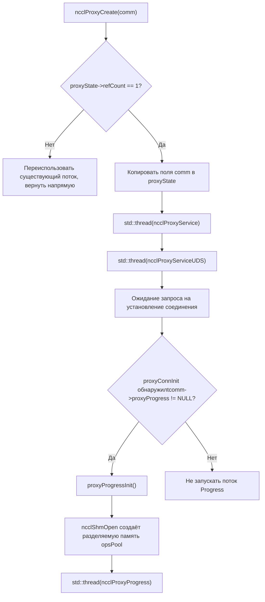
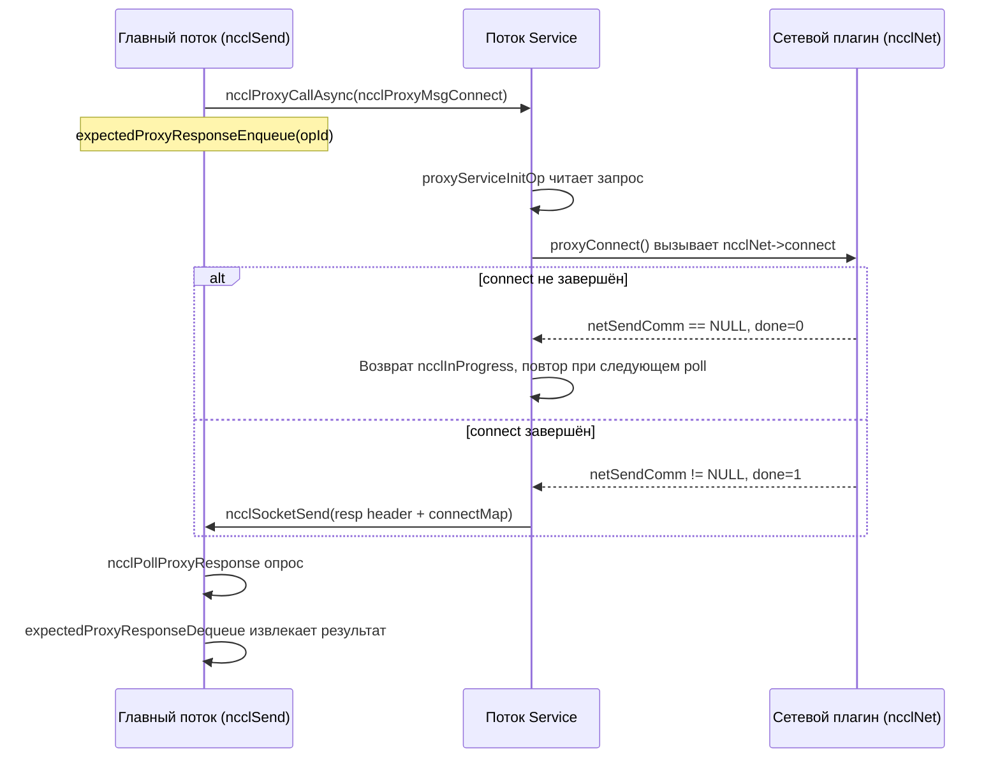
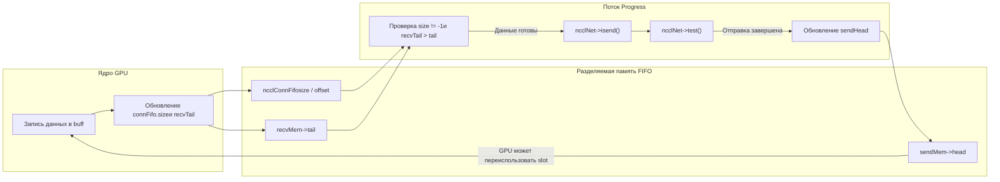

# Глава 12: Прокси-потоки и асинхронный I/O: координация сетевых операций на хосте

# Прогресс книги: Глава 12 / 25

Глава 12: Асинхронное планирование прокси-потоков: как proxy.cc развязывает I/O и выполнение ядра`src/proxy.cc`В предыдущей главе мы разобрали уровень абстракции transport и увидели, как NCCL с помощью единого интерфейса скрывает различия P2P/SHM/NET/NVLS. Но транспортный уровень отвечает лишь на вопрос «по какому каналу идут данные» и пока не отвечает на вопрос «как данные управляются асинхронно». Если GPU-ядро будет напрямую блокироваться в ожидании сети, вычислительные блоки будут загублены I/O. Эта глава сосредоточена на`src/include/proxy.h`и

# , и мы посмотрим, как NCCL с помощью отдельного host-потока выносит сетевой I/O из пути выполнения ядра, образуя с GPU отношение производителя-потребителя.

## 12.1 Зачем нужны прокси-потоки: начнём с вопроса «кто ждёт сеть»

Представьте ресторан: кухня (GPU kernel) только готовит блюда, а официант (proxy-поток) доставляет их гостям (сетевому партнёру). Если заставить повара самому разносить блюда, ему придётся останавливать готовку на каждом рейсе, и скорость выдачи резко упадёт. Proxy в NCCL — это тот самый выделенный официант: kernel только записывает данные в разделяемый буфер и читает из него, а всю грязную работу по сетевому приёму-передаче выполняет proxy-поток на стороне хоста.

> **[Design Inference & Architectural Trade-offs]**
> Что за катастрофа произошла бы без proxy? GPU kernel — это массово-параллельная SIMT-модель; блокировка одного warp на сетевом опросе приведёт к потере вычислительной мощности всего SM; что ещё более фатально — сетевой приём-передача включает системные вызовы socket, опрос verbs, отправку DMA-дескрипторов, и эти операции в принципе невозможно выполнить в device-коде. Поэтому NCCL обязан вынести сетевой ввод-вывод на хост, а kernel и proxy обмениваются сигналами «данные готовы» через FIFO в разделяемой памяти.

## Разделение обязанностей двух типов потоков

NCCL запускает на стороне хоста два типа proxy-потоков с совершенно разными обязанностями:

- **Поток Service**（`ncclProxyService`): обрабатывает запросы плоскости управления — установление соединений, регистрацию памяти, запросы FD. Он слушает socket, принимает RPC-запросы от локального rank и асинхронно продвигает операции setup/connect и т.д.
- **Поток Progress**（`ncclProxyProgress`): обрабатывает плоскость данных — фактически управляет сетевым приёмом-передачей. Он извлекает proxy op из пула разделяемой памяти и вызывает`proxyProgress`callback транспорта для продвижения перемещения данных.

[FACT:src/include/proxy.h:343-345]отображает`ncclProxyState`одновременно владеет`thread`(Service) и`threadUDS`(UDS-сервис), а дескриптор потока Progress скрыт в`progressState.thread`[FACT:src/include/proxy.h:261-261]。

## Установление отношения «производитель-потребитель»

[FACT:src/proxy.cc:2130-2166]в`ncclProxyCreate`— это место рождения потока: когда`refCount == 1`(создание первого comm), он копирует ключевые поля comm в`proxyState`, затем запускает поток Service и поток UDS. Обратите внимание: поток Progress здесь не запускается — он лениво запускается`proxyProgressInit`только при установлении соединения, впервые требующего proxy progress[FACT:src/proxy.cc:1523-1524]。



Эта схема фиксирует реальную ветвь запуска потока: только когда`tcomm->proxyProgress`не пуст (т.е. данному транспорту требуется продвижение плоскости данных), поток Progress будет создан.

# 12.2 Структуры данных и разметка памяти: пул разделяемой памяти и пул op

## Панорама ключевых структур

Модель конкурентности proxy построена на двух блоках разделяемой памяти; понимание их разметки памяти — предпосылка понимания всего механизма.

**Первый блок:`ncclProxyOpsPool`**（[FACT:src/include/proxy.h:218-226]). Это «почтовый ящик для доставки задач» между главным потоком и потоком Progress, разделяемый между процессами через`/dev/shm`

| Поле | Тип | Назначение |
| --- | --- | --- |
| `ops[]` | `ncclProxyOp[]` | Предварительно выделенный массив op, размер`MAX_OPS_PER_PEER * NCCL_MAX_LOCAL_RANKS` |
| `nextOps` | `volatile int` | Индекс головы списка ожидающих обработки op, -1 означает пусто |
| `nextOpsEnd` | `volatile int` | Индекс хвоста списка ожидающих обработки op |
| `freeOps[]` | `volatile int[]` | Голова списка свободных op для каждого local rank |
| `syncObjectsInitialized` | `int` | Отмечает, инициализированы ли mutex/cond |
| `mutex` / `cond` | `std::mutex` / `std::condition_variable` | Примитивы межпроцессной синхронизации |

`MAX_OPS_PER_PEER`определение[FACT:src/include/proxy.h:218-226]— это`2 * MAXCHANNELS * 2 * NCCL_MAX_DEV_WORK_P2P_PER_BATCH`. Комментарий объясняет, почему множитель 2: каждая p2p work содержит один send и один recv proxy op, поэтому нужно умножить на 2; ещё умножение на 2 — чтобы хранить два полных раунда операций, иначе невозможно «доставить половину, освободить половину».

**Второй блок:`ncclProxyArgs`**（[FACT:src/include/proxy.h:174-209]). Это «описание op времени выполнения», используемое внутри потока Progress, выделяется из`ncclProxyPool`, не разделяется между процессами.

Ключевые поля:

- `subs[NCCL_PROXY_MAX_SUBS]`: массив подопераций,`NCCL_PROXY_MAX_SUBS = MAXCHANNELS` [FACT:src/include/proxy.h:55-55]. Однотипные операции нескольких channel агрегируются в несколько sub одного args.
- `progress`: указатель на функцию, указывающий на`proxyProgress`callback транспорта[FACT:src/include/proxy.h:176-176]。
- `next` / `nextPeer` / `proxyAppendPtr`: три указателя связного списка, образующие сложные отношения организации op.
- `state`：`ncclProxyOpNone` / `ncclProxyOpReady` / `ncclProxyOpProgress`трёхсостоянийный[FACT:src/include/proxy.h:48-52]。

## Многоуровневый дизайн пула памяти

`ncclProxyPool` [FACT:src/proxy.cc:50-53]— это единица пакетного выделения, каждый pool содержит`PROXYARGS_ALLOCATE_SIZE`(т.е.`NCCL_MAX_OPS`) штук`ncclProxyArgs`。`allocateArgs` [FACT:src/proxy.cc:207-231]логика выделения заслуживает подробного рассмотрения:

```c
if (state->pool == NULL) {
    struct ncclProxyPool* newPool;
    NCCLCHECK(ncclCalloc(&newPool, 1));
    struct ncclProxyArgs* newElems = newPool->elems;
    for (int i = 0; i pool = newElems;
    newPool->next = state->pools;
    state->pools = newPool;
}
elem = state->pool;
state->pool = state->pool->next;
```

[FACT:src/proxy.cc:207-231]

> **[Design Inference & Architectural Trade-offs]**
> Мотивация дизайна здесь такова:`ncclProxyArgs`структура очень большая (содержит`subs[MAXCHANNELS]`массив, каждый sub в свою очередь имеет`requests[NCCL_STEPS]`), и если выделять каждый op отдельным malloc, это вызовет серьёзную фрагментацию памяти и накладные расходы на выделение. Пакетное выделение + повторное использование списка свободных элементов сводят стоимость выделения практически к нулю. Комментарий «Make sure we allocate the memory close to the network thread» намекает, что это для NUMA-аффинности — pool создаётся при первом выделении в потоке Progress и естественно оказывается близко к CPU, на котором выполняется этот поток.

## Ложное разделение и атомарные переменные

`ncclProxyOpsPool`в`nextOps`、`nextOpsEnd`、`freeOps[]`все являются`volatile int`. Они одновременно читаются и записываются главным потоком и потоком Progress, но NCCL не защищает все обращения блокировками — вместо этого используются атомарные операции + порядок памяти для гарантии корректности.

Посмотрим`ncclLocalOpAppend`логику взятия свободного op из freeOps[FACT:src/proxy.cc:503-513]：

```c
int freeOp = -1;
while (freeOp == -1) {
  freeOp = COMPILER_ATOMIC_EXCHANGE(&pool->freeOps[tpLocalRank], -1, std::memory_order_acquire);
  if (freeOp == -1) std::this_thread::yield();
}
```

Главный поток использует`atomic_exchange`чтобы`freeOps[tpLocalRank]`устанавливается в -1 и возвращается старое значение — это «вытесняющее получение»: кто первым успешно выполнит exchange, тот получает весь список свободных элементов. Когда поток Progress возвращает op, он использует цикл CAS[FACT:src/proxy.cc:898-907]：

```c
oldFree = COMPILER_ATOMIC_LOAD(&pool->freeOps[i], std::memory_order_acquire);
do {
  pool->ops[freeOpEnd[i]].next = oldFree;
} while (!COMPILER_ATOMIC_COMPARE_EXCHANGE(&pool->freeOps[i], &oldFree, newFree,
                                           std::memory_order_release,
                                           std::memory_order_acquire));
```

> **[Design Inference & Architectural Trade-offs]**
> Здесь используется acquire/release, а не seq_cst, потому что нужно гарантировать только видимость «записи указателя next узла списка» для получающей стороны, а не глобальный порядок.`freeOps[]`Каждый элемент массива соответствует одному local rank, естественным образом распределён по разным строкам кэша, что уменьшает ложное разделение.

# 12.3 Плоскость управления: установление соединений и механизм RPC

## Интуитивная модель

> **[Design Inference & Architectural Trade-offs]**
> Поток Service похож на «стойку регистрации»: когда локальному rank нужно установить сетевое соединение, он не подключается напрямую сам, а отправляет RPC-запрос потоку Service, который выполняет setup/connect вместо него. Почему так? Потому что установление сетевого соединения (особенно создание QP в verbs, регистрация памяти) может блокироваться, а некоторые ресурсы (например, listen socket) должны удерживаться единственным потоком. Централизация плоскости управления в потоке Service позволяет главному потоку неблокирующе продолжать заниматься другими делами.

## Кодирование RPC-запросов

`ncclProxyCallAsync` [FACT:src/proxy.cc:1369-1394]— это отправитель RPC. Он через socket последовательно отправляет: type, указатель connection, reqSize, respSize, reqBuff, opId.

```c
NCCLCHECKGOTO(ncclSocketSend(sock, &type, sizeof(int)), ret, error);
NCCLCHECKGOTO(ncclSocketSend(sock, &proxyConn->connection, sizeof(void*)), ret, error);
NCCLCHECKGOTO(ncclSocketSend(sock, &reqSize, sizeof(int)), ret, error);
NCCLCHECKGOTO(ncclSocketSend(sock, &respSize, sizeof(int)), ret, error);
if (reqSize) NCCLCHECKGOTO(ncclSocketSend(sock, reqBuff, reqSize), ret, error);
NCCLCHECKGOTO(ncclSocketSend(sock, &opId, sizeof(opId)), ret, error);
NCCLCHECK(expectedProxyResponseEnqueue(sharedProxyState, opId, respSize));
```

[FACT:src/proxy.cc:1369-1394]

Обратите внимание на последний шаг: после отправки запроса сразу регистрируется opId в`expectedResponses`очередь. Это ключевой момент асинхронного RPC — вызывающая сторона не ждёт ответа, а сначала регистрирует «я ожидаю ответ с этим opId», после чего использует`ncclPollProxyResponse`для опроса.

## Реализация очереди ответов через связный список

`expectedProxyResponseEnqueue` [FACT:src/proxy.cc:97-117]использует односвязный список для хранения op, ожидающих ответа.`expectedProxyResponseStore` [FACT:src/proxy.cc:67-95]при получении ответа сопоставляет по opId, копирует данные ответа через memcpy в предварительно выделенный`respBuff`, помечает`done = true`。`expectedProxyResponseDequeue` [FACT:src/proxy.cc:119-141]при опросе находит завершённые ответы и удаляет их.

Здесь есть деталь:`expectedProxyResponseStore`проверяет,`respSize`совпадает ли с[FACT:src/proxy.cc:72-75], и если не совпадает, сообщает`ncclInternalError`. Это защитное программирование — если запрашивающая и отвечающая стороны по-разному понимают размер ответа, это означает нарушение протокола, и нужно немедленно завершиться с ошибкой, а не молча продолжать.

## Главный цикл потока Service

`ncclProxyService` [FACT:src/proxy.cc:1789-2016]по сути представляет собой цикл poll. Он использует`pollfds`массив для управления всеми соединениями, включая listen socket и socket каждого peer.

```c
while (stop == PROXY_RUNNING || npeers > 0) {
    if (COMPILER_ATOMIC_LOAD(proxyState->abortFlag, std::memory_order_acquire) != 0) stop = PROXY_ABORT;
    int ret = 0;
    const int timeout = asyncOpCount ? 0 : 500;
    ...
    ret = poll(activePollfds, nfds_to_poll, timeout);
```

[FACT:src/proxy.cc:1842-1863]

`timeout`Выбор  очень продуман: если есть асинхронные op в процессе выполнения (`asyncOpCount > 0`), timeout устанавливается в 0 (неблокирующий опрос), потому что нужно часто вызывать`proxyProgressAsync`для их продвижения; иначе устанавливается 500ms, чтобы избежать холостого вращения и сжигания CPU. Комментарий «never let proxy service thread blocks in poll, or it cannot receive abortFlag»[FACT:src/proxy.cc:1847-1847]поясняет, почему нельзя блокироваться бесконечно — необходимо периодически просыпаться для проверки abortFlag.

## Продвижение асинхронных op

`proxyProgressAsync` [FACT:src/proxy.cc:1626-1700]— это ядро продвижения асинхронных операций потоком Service. Он в зависимости от типа op распределяет их по различным callback транспорта:

```c
if (op->type == ncclProxyMsgSetup) {
    res = op->connection->tcomm->proxySetup(op->connection, proxyState, op->reqBuff, op->reqSize, op->respBuff,
                                            op->respSize, &done);
} else if (op->type == ncclProxyMsgConnect) {
    res = op->connection->tcomm->proxyConnect(...);
} else if (op->type == ncclProxyMsgInit) {
    res = proxyConnInit(peer, connectionPool, proxyState, ...);
}
```

[FACT:src/proxy.cc:1631-1664]

Каждый callback имеет выходной параметр`done`. Если`done == 0`, это означает, что операция ещё не завершена (например, сетевое соединение всё ещё в трёхстороннем рукопожатии), возвращается`ncclInProgress`, и в следующей итерации цикла продвижение продолжается. Если`done == 1`, то отправителю посылается заголовок ответа + тело ответа[FACT:src/proxy.cc:1681-1689]。



Эта диаграмма последовательности фиксирует`sendProxyConnect`в`*done = 0; return ncclInProgress`реальную ветвь[FACT:src/transport/net.cc:913-916]。

# 12.4 Плоскость данных: как поток Progress управляет сетевым приёмом и передачей

## Интуитивная модель

Поток Progress — это «оператор конвейера»: он следит за FIFO в разделяемом буфере, и как только GPU записал данные (в FIFO size != -1), немедленно вызывает`isend`для отправки данных; как только сеть завершила приём данных, обновляет recvTail, уведомляя GPU о возможности чтения. Весь процесс GPU и proxy синхронизируются через указатели head/tail в FIFO, без необходимости в каких-либо блокировках.

## Доставка op: от главного потока к потоку Progress

Главный поток в`ncclProxySaveOp` [FACT:src/proxy.cc:591-761]в зависимости от pattern определяет, какие proxy op нужны, затем через`SaveProxy` → `ncclLocalOpAppend`записывает op в разделяемый пул памяти.

`ncclLocalOpAppend` [FACT:src/proxy.cc:488-554]Процесс:

1. Из`proxyOps->freeOp`или`pool->freeOps[tpLocalRank]`взять свободный слот op.

2. `memcpy(op, proxyOp, sizeof(struct ncclProxyOp))`Скопировать содержимое op в разделяемую память[FACT:src/proxy.cc:515-515]。

3. Присоединить op к`proxyOps->nextOps`хвосту связного списка.

4. Если накопленное количество op достигает`MAX_OPS_PER_PEER`, инициировать пакетную доставку[FACT:src/proxy.cc:525-551]。

Логика пакетной доставки очень тонкая: она не может просто отправить все op, потому что «несколько op с одинаковым opCount должны доставляться вместе, иначе нарушится sub-агрегация proxyArgs». Поэтому она находит последнюю границу изменения opCount и доставляет только до неё[FACT:src/proxy.cc:529-548]。

Доставка выполняется через`ncclProxyPost` [FACT:src/proxy.cc:476-486], который захватывает блокировку, обновляет`pool->nextOps`、`notify_one`и пробуждает поток Progress.

## Главный цикл потока Progress

`ncclProxyProgress` [FACT:src/proxy.cc:951-1011]Структура:

```c
do {
    int idle = 1;
    ncclResult_t ret = progressOps(proxyState, state, state->active, &idle);
    ...
    if (idle || !state->active || (++proxyOpAppendCounter == ncclParamProgressAppendOpFreq())) {
      int added = 0;
      proxyOpAppendCounter = 0;
      ret = ncclProxyGetPostedOps(proxyState, &added);
      ...
    }
    lastIdle = idle;
    stopv = state->stop.load(std::memory_order_acquire);
} while ((stopv == 0 || (stopv == 1 && state->active)) &&
         COMPILER_ATOMIC_LOAD(proxyState->abortFlag, std::memory_order_acquire) == 0);
```

[FACT:src/proxy.cc:976-1009]

Здесь стоит отметить одну оптимизацию производительности:`proxyOpAppendCounter`счётчик[FACT:src/proxy.cc:974-974]. Комментарий объясняет[FACT:src/proxy.cc:969-973]: слишком частый вызов`ncclProxyGetPostedOps`приводит к регрессу производительности при обмене малыми сообщениями, поэтому каждые`ProgressAppendOpFreq`(по умолчанию 8) раз, прежде чем извлечь новый op.

## Агрегация op: ProxyAppend

`ProxyAppend` [FACT:src/proxy.cc:437-474]Определяет, нужно ли «добавить в sub существующего args» или «создать новый args». Критерий —`connection->shared && args->opCount == op->opCount` [FACT:src/proxy.cc:443-443]— несколько операций channel одного соединения с одинаковым opCount агрегируются.

> **[Design Inference & Architectural Trade-offs]**
> Ценность агрегации: однотипные операции нескольких channel объединяются в один args, поток Progress за один цикл продвигает все channel, что снижает накладные расходы на вызовы функций и инвалидацию кэша.`ncclProxyOpToArgs` [FACT:src/proxy.cc:368-435]При добавлении sub проверяется`sliceSteps`、`chunkSteps`、`protocol`、`dtype`、`redOp`、`coll`на согласованность[FACT:src/proxy.cc:401-406], при несовпадении выдаётся ошибка — это защита от ошибочной агрегации.

## sendProxyProgress: четырёхфазный конечный автомат отправляющей стороны

`sendProxyProgress` [FACT:src/transport/net.cc:1324-1491]— ядро отправляющей стороны. Он продвигается по sub поочерёдно, у каждого sub четыре счётчика:`posted`、`transmitted`、`done`。

**Фаза первая: инициализация Ready** [FACT:src/transport/net.cc:1326-1339]

```c
sub->base = ROUNDUP(resources->step, args->chunkSteps);
resources->step = sub->base + sub->nsteps;
sub->posted = sub->transmitted = sub->done = 0;
```

`base`— начальный номер step,`ROUNDUP`обеспечивает выравнивание по`chunkSteps`。`resources->step`накопление, резервируя место для следующего op.

**Фаза вторая: отправка буфера на GPU** [FACT:src/transport/net.cc:1355-1376]

```c
if (sub->posted nsteps && sub->posted done + maxDepth) {
    int buffSlot = (sub->base + sub->posted) % NCCL_STEPS;
    if (resources->shared) {
        ...
        *sendHead = sub->base + sub->posted - NCCL_STEPS;
    } else {
        sub->posted += args->sliceSteps;
    }
}
```

`maxDepth`— глубина конвейера[FACT:src/transport/net.cc:1343-1343], ограничивает число одновременно in-flight step. В режиме shared proxy через обновление`sendHead`сообщает GPU «этот slot можно записывать».

**Фаза третья: проверка готовности GPU, инициирование isend** [FACT:src/transport/net.cc:1378-1452]

```c
if (sub->transmitted posted && sub->transmitted done + NCCL_STEPS) {
    int buffSlot = (sub->base + sub->transmitted) % NCCL_STEPS;
    volatile uint64_t* recvTail = &resources->recvMem->tail;
    uint64_t tail = sub->base + sub->transmitted;
    if (connFifo[buffSlot].size != -1 && (*recvTail > tail || p == NCCL_PROTO_LL)) {
        int size = connFifo[buffSlot].size;
        ...
        NCCLCHECK(proxyState->ncclNet->isend(resources->netSendComm, buff, size, resources->tpRank,
                                             sub->sendMhandle, phandle, sub->requests + buffSlot));
        if (sub->requests[buffSlot] != NULL) {
            sub->transmitted += args->sliceSteps;
        }
    }
}
```

Ключевое условие здесь —`connFifo[buffSlot].size != -1 && *recvTail > tail`— после записи данных GPU обновляет size и recvTail FIFO, proxy инициирует isend только при выполнении обоих условий. Для протокола LL, поскольку он имеет семантику «zero-copy», ждать recvTail не нужно.

**Фаза четвёртая: проверка завершения отправки, обновление sendHead** [FACT:src/transport/net.cc:1455-1481]

```c
if (sub->done transmitted) {
    int buffSlot = (sub->base + sub->done) % NCCL_STEPS;
    NCCLCHECK(proxyState->ncclNet->test(sub->requests[buffSlot], &done, &size));
    if (done) {
        connFifo[buffSlot].size = -1;
        std::atomic_thread_fence(std::memory_order_seq_cst);
        sub->done += args->sliceSteps;
        if (resources->shared == 0) {
            volatile uint64_t* sendHead = resources->gdcSync ? resources->gdcSync : &resources->sendMem->head;
            *sendHead = sub->base + sub->done;
        }
    }
}
```

`test`После возврата done сначала сбрасывает FIFO size в -1, вставляет seq_cst fence, затем обновляет sendHead, уведомляя GPU «этот slot можно переиспользовать». Роль fence — предотвратить переупорядочивание сброса size и обновления head: если head обновится первым, GPU может начать запись при старом значении size.

## recvProxyProgress: четырёхфазный цикл принимающей стороны

`recvProxyProgress` [FACT:src/transport/net.cc:1493-1788]Сложнее, так как включает группировку sub (при совместном использовании одного recvComm несколькими sub применяется multirecv).

**Фаза первая: группировка по recvComm при Ready** [FACT:src/transport/net.cc:1495-1538]

```c
for (int s = 0; s nsubs; s++) {
    ...
    if (groupSize == maxRecvs) {
        groupSize = 0;
    } else if (s > 0) {
        int next;
        for (next = s; next nsubs; next++) {
            struct recvNetResources* nextRes = ...;
            if (nextRes->netRecvComm == recvComm) break;
        }
        if (next == args->nsubs) {
            groupSize = 0;
        } else if (s != next) {
            // swap subs
        }
    }
    groupSize++;
    ...
    for (int i = 0; i  **[Design Inference & Architectural Trade-offs]**
> Этот фрагмент кода ставит рядом sub, использующие один и тот же`recvComm`, и записывает`groupSize`. Зачем группировать? Потому что`irecv`поддерживает приём нескольких buffer за раз (multirecv), объединение запросов одного comm в один вызов значительно снижает накладные расходы плагина.

**Фаза вторая: инициирование irecv** [FACT:src/transport/net.cc:1543-1631]

```c
if (subCount) {
    uint64_t step = subGroup->posted;
    void** requestPtr = subGroup->requests + (step % NCCL_STEPS);
    bool ignoreCompletion = ncclParamNetOptionalRecvCompletion() &&
                            ((args->protocol == NCCL_PROTO_LL128) || (args->protocol == NCCL_PROTO_LL)) &&
                            (subCount == 1);
    if (ignoreCompletion) *requestPtr = (void*)NCCL_NET_OPTIONAL_RECV_COMPLETION;
    NCCLCHECK(proxyState->ncclNet->irecv(resources->netRecvComm, subCount, ptrs, sizes, tags, mhandles, phandles,
                                         requestPtr));
    if (*requestPtr) {
        subGroup->recvRequestsCache[step % NCCL_STEPS] = *requestPtr;
        subGroup->recvRequestsSubCount = subCount;
        for (int i = 0; i groupSize; i++) {
            sub->posted += args->sliceSteps;
        }
    }
}
```

`ignoreCompletion`Оптимизация[FACT:src/transport/net.cc:1608-1610]: для приёма одного buffer по протоколам LL/LL128 уведомление о завершении опционально (так как данные сами несут flag), проверку completion можно пропустить.

**Фаза третья: проверка завершения приёма, обновление recvTail** [FACT:src/transport/net.cc:1634-1743]

```c
NCCLCHECK(proxyState->ncclNet->test(subGroup->requests[step % NCCL_STEPS], &done, sizes));
if (done) {
    for (int i = 0; i groupSize; i++) {
        struct ncclProxySubArgs* sub = subGroup + i;
        int buffSlot = (sub->base + sub->received) % NCCL_STEPS;
        connFifo[buffSlot].size = -1;
        sub->received += args->sliceSteps;
    }
    ...
}
```

После завершения приёма сбрасывается FIFO size, затем начинается фаза flush (в сценариях GDRDMA flush необходим для гарантии видимости данных).

**Фаза четвёртая: ожидание потребления GPU, обновление done** [FACT:src/transport/net.cc:1745-1779]

```c
if (sub->transmitted > sub->done) {
    volatile uint64_t* sendHead = &resources->sendMem->head;
    uint64_t done = *sendHead;
    while (done > sub->base + sub->done && sub->transmitted > sub->done) {
        if (subGroup->recvRequestsCache[sub->done % NCCL_STEPS]) {
            if (proxyState->ncclNet->irecvConsumed) {
                NCCLCHECK(proxyState->ncclNet->irecvConsumed(resources->netRecvComm, subGroup->recvRequestsSubCount,
                                                             subGroup->recvRequestsCache[sub->done % NCCL_STEPS]));
            }
            subGroup->recvRequestsCache[sub->done % NCCL_STEPS] = NULL;
        }
        sub->done += args->sliceSteps;
    }
}
```

Здесь чтением`sendHead`определяется, потребил ли GPU данные.`irecvConsumed`— callback для плагина, уведомляющий «buffer этого запроса на приём потреблён, можно переиспользовать».

## Полная картина потока данных



Эта диаграмма потока данных показывает замкнутый контур GPU и proxy через FIFO и указатели head/tail: GPU пишет данные → обновляет tail → proxy обнаруживает и инициирует isend → test подтверждает завершение → обновляет head → GPU переиспользует slot.

# 12.5 Управление конкурентностью, барьеры памяти и взаимодействие с аппаратурой

## Порядок памяти lock-free FIFO

Синхронизация между proxy и GPU полностью опирается на`ncclConnFifo`и указатели head/tail, без каких-либо блокировок. Это требует крайне осторожного контроля порядка памяти.

На отправляющей стороне proxy после возврата`test`done[FACT:src/transport/net.cc:1460-1473]：

```c
connFifo[buffSlot].size = -1;
std::atomic_thread_fence(std::memory_order_seq_cst);
...
*sendHead = sub->base + sub->done;
```

seq_cst fence гарантирует, что обновление head станет видимым только после того, как сброс size станет видимым для GPU. При обратном порядке GPU может увидеть новый head при старом size и ошибочно решить, что в slot есть данные.

На принимающей стороне proxy перед обновлением recvTail[FACT:src/transport/net.cc:1731-1736]：

```c
if (step nsteps) {
    std::atomic_thread_fence(std::memory_order_seq_cst);
    volatile uint64_t* recvTail = resources->gdcSync ? resources->gdcSync : &resources->recvMem->tail;
    *recvTail = sub->base + sub->transmitted;
}
```

Тот же принцип: сначала fence гарантирует видимость записи данных, затем обновление tail уведомляет GPU о возможности чтения.

## Механизм flush в GDRCOPY

При использовании GDRDMA NIC пишет напрямую в память GPU, но операция записи может ещё не быть зафиксирована на шине PCIe. Proxy должен активно выполнить flush, чтобы гарантировать видимость данных. См. логику flush в`recvProxyProgress`[FACT:src/transport/net.cc:1664-1709]：

```c
if (totalSize > 0 && p == NCCL_PROTO_SIMPLE && needFlush) {
    if (resources->gdcFlush) {
#if defined(__x86_64__)
        asm volatile("mfence" ::: "memory");
        asm volatile("mov (%0), %%eax" ::"l"(resources->gdcFlush) : "%eax", "memory");
#else
        std::atomic_thread_fence(std::memory_order_seq_cst);
        uint64_t dummy;
        NCCLCHECK(ncclGdrCudaRead(resources->gdrDesc, &dummy, resources->gdcFlush, sizeof(dummy)));
#endif
    } else {
        // iflush 路径
        NCCLCHECK(proxyState->ncclNet->iflush(resources->netRecvComm, subCount, ptrs, sizes, mhandles,
                                              subGroup->requests + (step % NCCL_STEPS)));
    }
}
```

Комментарии для пути x86 просто великолепны[FACT:src/transport/net.cc:1668-1674]：`mfence`Предотвращает переупорядочивание загрузки CQE-poll перед загрузкой flush;`mov (%0), %%eax`Принудительное чтение PCIe заставляет CPU приостановиться до тех пор, пока все предыдущие PCIe posted write (включая NIC DMA) не будут зафиксированы в endpoint. Это управление порядком памяти на аппаратном уровне, более надёжное, чем любой программный fence.

## Взаимодействие атомарных переменных с stop/abort

Условия выхода потока Progress[FACT:src/proxy.cc:1007-1009]：

```c
stopv = state->stop.load(std::memory_order_acquire);
} while ((stopv == 0 || (stopv == 1 && state->active)) &&
         COMPILER_ATOMIC_LOAD(proxyState->abortFlag, std::memory_order_acquire) == 0);
```

`stop == 1`Но`state->active != NULL`продолжает работу — это для «изящной остановки»: уже отправленные op должны быть завершены, иначе GPU никогда не дождётся данных. Только`stop == 2`(abort) или`abortFlag != 0`вызывают принудительный выход.

`ncclProxyProgressDestroy` [FACT:src/proxy.cc:1039-1065]Процедура остановки:

```c
std::lock_guard lock(state->opsPool->mutex);
state->stop.store(1, std::memory_order_release);
state->opsPool->cond.notify_one();
state->thread.join();
```

Сначала блокировка, затем store stop, потом notify — это стандартный шаблон для предотвращения lost wakeup. Поток Progress при`pool->cond.wait`удерживает блокировку и проверяет предикат[FACT:src/proxy.cc:850-851], гарантируя, что пробуждение не будет пропущено.

# 12.6 Руководство по избеганию проблем в production и цепочка восстановления после сбоев

## Проблема первая: утечка соединений приводит к невозможности выхода потока Service

`ncclProxyService`Условие основного цикла —`stop == PROXY_RUNNING || npeers > 0` [FACT:src/proxy.cc:1842-1842]. Комментарий объясняет[FACT:src/proxy.cc:1843-1845]: даже если локальный comm abort, пока есть peer-соединения, поток proxy не может завершиться, иначе возможен segfault.

**Сценарий диагностики**: если какой-то rank упал, не уведомив партнёра, поток Service партнёра навсегда застрянет в цикле`npeers > 0`. В этом случае нужно полагаться на`abortFlag`или механизм таймаута. В production, если процесс завис в`ncclProxyService`, сначала проверьте, не завершился ли аварийно какой-либо peer rank.

## Проблема вторая: несоответствие очереди ответов приводит к утечке памяти

`expectedProxyResponseStore`При несовпадении opId возвращается`ncclInternalError` [FACT:src/proxy.cc:93-94]. Но если ответ приходит, когда запрашивающая сторона уже отказалась от него (например, по таймауту), этот ответ навсегда останется в очереди,`respBuff`утечка.

**Меры защиты**：`expectedProxyResponseFree` [FACT:src/proxy.cc:55-65]При`ncclProxyDestroy`очищается вся очередь[FACT:src/proxy.cc:2226-2226]. Но это крайняя мера, в нормальной работе остатков быть не должно.

## Проблема третья: в shared-режиме head инициализируется отрицательным значением

`sendProxyConnect`В[FACT:src/transport/net.cc:999-1000]：

```c
// Don't give credits yet in shared mode.
(resources->gdcSync ? *resources->gdcSync : resources->sendMem->head) = (map->shared ? -NCCL_STEPS : 0);
```

В shared-режиме head инициализируется`-NCCL_STEPS`, что означает, что у GPU изначально нет credit для записи. Proxy должен постепенно увеличивать head на этапе post, чтобы «выдавать credit». Если забыть об этой инициализации, GPU ошибочно решит, что есть credit, и запишет в неготовый slot, что приведёт к повреждению данных.

## Проблема четвёртая: проверка flag в протоколе LL128

`sendProxyProgress`В[FACT:src/transport/net.cc:1388-1403]：

```c
if (p == NCCL_PROTO_LL128) {
    ready = resources->useGdr;
    if (!ready) {
        uint64_t flag = sub->base + sub->transmitted + 1;
        int nFifoLines = DIVUP(connFifo[buffSlot].size, sizeof(uint64_t) * NCCL_LL128_LINEELEMS);
        volatile uint64_t* lines = (volatile uint64_t*)buff;
        ready = 1;
        for (int i = 0; i в`sendProxyProgress`при`sub->done == sub->nsteps`(то есть не уведомлять GPU об освобождении slot), в каких сценариях возникнет взаимоблокировка? Почему?`sendHead`Справочный разбор

**— единственный критерий, по которому GPU определяет, какие slot можно переиспользовать. См.**：`sendHead`Копирование[FACT:src/transport/net.cc:1469-1473]：

```c
if (resources->shared == 0) {
    volatile uint64_t* sendHead = resources->gdcSync ? resources->gdcSync : &resources->sendMem->head;
    *sendHead = sub->base + sub->done;
}
```

, в не-shared — 0). GPU kernel при`-NCCL_STEPS`проверяет`waitSend`и только тогда считает, что есть credit для записи. Если head не продвигается, GPU, заполнив`head + NCCL_STEPS > step`slot, навсегда заблокируется в ожидании credit, а proxy, в свою очередь, ждёт новых данных от GPU для isend — классическая взаимоблокировка производителя-потребителя. В shared-режиме это ещё серьёзнее, так как начальный head отрицательный, и у GPU изначально нет credit.`NCCL_STEPS`слотов, после чего навсегда блокируется в ожидании credit, а proxy в свою очередь ждёт, пока GPU запишет новые данные, чтобы выполнить isend — классическая взаимоблокировка производителя-потребителя. В режиме shared это ещё серьёзнее, поскольку начальное значение head отрицательное, и у GPU изначально нет credit.

Q2: `ncclLocalOpAppend`При накоплении op достигает`MAX_OPS_PER_PEER`запускается пакетная отправка, но код намеренно «не отправляет все op последнего opCount». Если изменить на простую отправку всех op, какой механизм будет нарушен?

**Справочный анализ**: см.[FACT:src/proxy.cc:525-548]комментарии и логику:

```c
// Do not post last operations as we could have more coming with the same opCount, and posting
// them in different batches would break proxyArgs aggregation with subs.
uint64_t lastOpCount = pool->ops[proxyOps->nextOpsEnd].opCount;
int lastOp = -1;
...
for (int op = proxyOps->nextOps; op != proxyOps->nextOpsEnd; op = pool->ops[op].next) {
    ops++;
    if (pool->ops[op].opCount != lastOpCount) {
        lastOp = op;
        toSend = ops;
    }
}
```

`ProxyAppend`логика агрегации[FACT:src/proxy.cc:443-443]зависит от`args->opCount == op->opCount`для определения, добавлять ли sub. Если несколько channel op с одинаковым opCount разделены на две пакетные отправки, первая партия создаст args, а когда прибудет вторая партия,`args->opCount`уже не равно opCount нового op (поскольку args мог быть продвинут), что приводит к разделению sub, которые должны были быть агрегированы, на независимые args. Это не только снижает производительность, но и может нарушить`ncclProxyOpToArgs`в`nChannels`/`nPeers`логику взятия min[FACT:src/proxy.cc:399-400], что приводит к неверному вычислению количества каналов.

Q3: `recvProxyProgress`фаза Ready будет переупорядочивать и группировать sub по`recvComm`. Если убрать эту логику группировки и позволить каждому sub независимо вызывать`irecv`, какие последствия будут на сетевой карте`maxRecvs > 1`?

**Справочный анализ**: см.[FACT:src/transport/net.cc:1495-1538]логику группировки и[FACT:src/transport/net.cc:1613-1614]вызов multirecv:

```c
NCCLCHECK(proxyState->ncclNet->irecv(resources->netRecvComm, subCount, ptrs, sizes, tags, mhandles, phandles,
                                     requestPtr));
```

`maxRecvs`— это объявленное плагином сетевой карты «максимальное количество буферов, которое может принять один irecv»[FACT:src/transport/net.cc:1525-1525]. Когда`maxRecvs > 1`, плагин (например, IB) поддерживает приём нескольких буферов одним WQE, что значительно снижает накладные расходы на doorbell и обработку CQE. Если убрать группировку и каждый sub будет вызывать irecv отдельно,`subCount`всегда будет равно 1, плагин деградирует до режима одного буфера, пропускная способность снизится. Что ещё важнее,`recvRequestsCache`и`irecvConsumed`механизмы[FACT:src/transport/net.cc:1616-1617]разработаны для multirecv — в режиме одного буфера эта логика кэширования перестанет работать, что может привести к утечке запросов.

Итак, мы поняли, как proxy-поток отделяет сетевой I/O от выполнения kernel, позволяя вычислениям на GPU и коммуникации действительно работать параллельно. Но proxy — лишь драйвер, конкретная реализация низкоуровневой сетевой передачи всё ещё не раскрыта. В следующей главе мы углубимся в`net_ib`, чтобы увидеть, как NCCL инкапсулирует verbs API для реализации передачи InfiniBand, и как GPUDirect RDMA позволяет сетевой карте напрямую читать и записывать память GPU.
