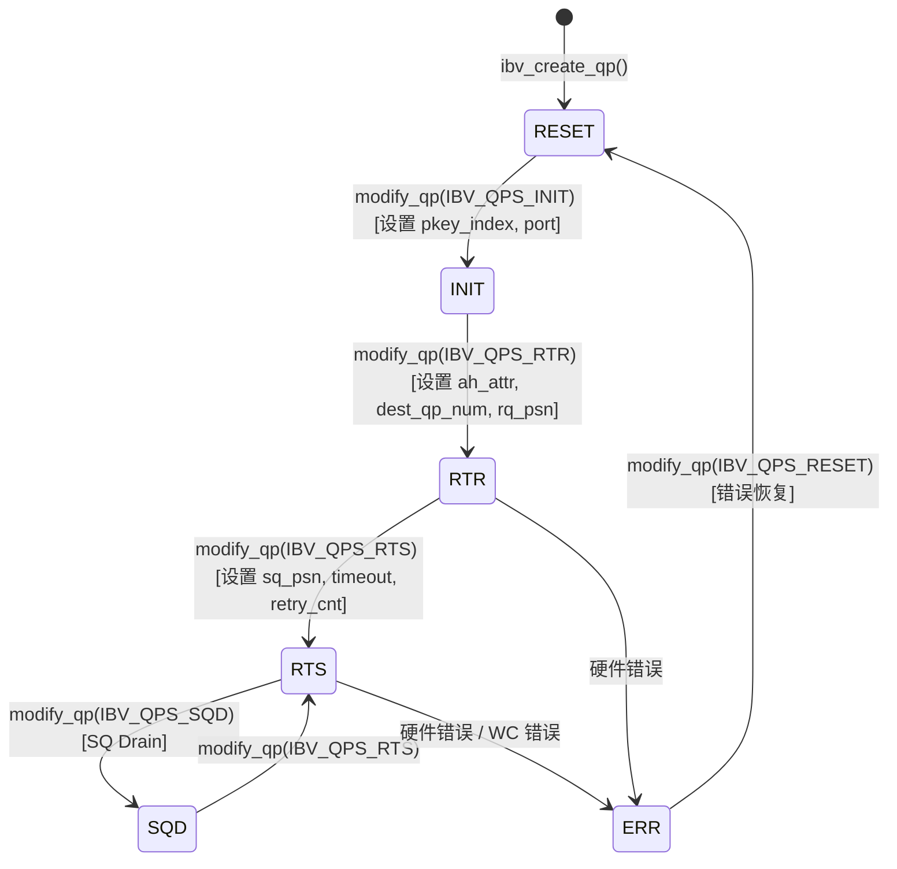

# Глава 13: Передача по сети InfiniBand: как net_ib инкапсулирует verbs и GPUDirect RDMA

В предыдущей главе мы увидели, как proxy-поток отделяет сетевой I/O от GPU kernel, позволяя вычислениям и коммуникации действительно работать параллельно. Но proxy — лишь «драйвер» — он вызывает абстрактные интерфейсы ncclNet->isend/irecv, но не знает, что под ними: TCP, InfiniBand или что-то ещё. В этой главе мы приоткроем эту абстракцию и заглянем в src/transport/net_ib и src/misc/ibvwrap.cc, чтобы увидеть, как NCCL инкапсулирует библиотеку libibverbs в подключаемую таблицу символов, как создаёт Queue Pair (QP), и как GPUDirect RDMA позволяет сетевой карте обходить host-память и напрямую читать и записывать память GPU.

# 13.1 Почему NCCL не вызывает libibverbs напрямую

## Интуитивная модель: таблица символов — это «подключаемая розетка»

Представьте, что вы купили импортный электроприбор, и форма вилки не подходит к вашей розетке. У вас два варианта: либо разобрать прибор и перепаять провод (напрямую`#include <infiniband/verbs.h>`и слинковать`-libverbs`), либо купить универсальный переходник (динамическая загрузка символов во время выполнения). NCCL выбрал второй вариант.

> **[Design Inference & Architectural Trade-offs]**
> Основной мотив этого выбора —**гибкость развёртывания**: NCCL как библиотека загружается верхнеуровневыми фреймворками, такими как PyTorch, TensorFlow, и не может предполагать, что в среде выполнения обязательно установлен`libibverbs.so`. Если жёстко слинковать на этапе компиляции, то на машине без драйвера InfiniBand вся библиотека NCCL не сможет загрузиться — даже если вы хотите использовать NVLink только для внутримашинной коммуникации. Через`dlopen`во время выполнения + разрешение символов NCCL может изящно деградировать на машинах без IB.

Если бы этого слоя инкапсуляции не было, система столкнулась бы с катастрофой:**задача чистого NVLink-обучения на одной машине просто упала бы из-за отсутствия драйвера IB**. Это чрезвычайно распространено в облачных средах и на машинах разработчиков.

## Структуры данных и размещение в памяти: контейнер таблицы символов

Основная структура данных —`ncclIbvSymbols`, определена в`ibvsymbols.h`(этот файл не включён в материалы главы, но его структуру можно вывести из способа использования). Это чистый контейнер указателей на функции, каждое поле соответствует функции libibverbs:

```c
struct ncclIbvSymbols {
  int (*ibv_internal_fork_init)(void);
  struct ibv_device** (*ibv_internal_get_device_list)(int* num_devices);
  int (*ibv_internal_modify_qp)(struct ibv_qp*, struct ibv_qp_attr*, int);
  // ... 数十个函数指针
};
```

Глобально существует только один экземпляр, вместе с`std::once_flag`обеспечивается потокобезопасная инициализация:

[FACT:src/misc/ibvwrap.cc:26-29]

```c
static std::once_flag initOnceFlag;
static ncclResult_t initResult;
struct ncclIbvSymbols ibvSymbols;
```

Здесь дизайн очень сдержан:`initOnceFlag`— это`std::once_flag`，`initResult`Кэширование результатов инициализации,`ibvSymbols`— это глобальная таблица символов. Все три имеют статический период хранения, жизненный цикл которых охватывает весь процесс.

> **[Design Inference & Architectural Trade-offs]**
> Почему используется`std::once_flag`а не`pthread_once`? Потому что C++ код NCCL уже зависит от`<mutex>`и`<thread>`, использование стандартной библиотеки более согласовано.`call_once`Семантика  заключается в следующем: независимо от того, сколько потоков одновременно вызывают`wrap_ibv_symbols()`, лямбда выполняется только один раз, остальные потоки блокируются в ожидании, а затем все получают один и тот же`initResult`. Это гораздо безопаснее, чем ручная реализация двойной проверки блокировки (DCLP) — DCLP имеет известную ловушку переупорядочивания в модели памяти C++.

## Пошагово: полный процесс разрешения символов

Когда NCCL впервые требуется IB-передача, вызывается`wrap_ibv_symbols()`：

[FACT:src/misc/ibvwrap.cc:26-29]

```c
ncclResult_t wrap_ibv_symbols(void) {
  std::call_once(initOnceFlag, []() { initResult = buildIbvSymbols(&ibvSymbols); });
  return initResult;
}
```

`buildIbvSymbols`Определено в`ibvsymbols.cc`(не включено в эту главу), его задача — использовать`dlopen("libibverbs.so")`для открытия библиотеки, затем для каждого имени функции вызвать`dlsym`для заполнения указателя. Если какой-либо символ не найден, соответствующее поле остаётся NULL.

Этот дизайн "допускающий NULL" пронизывает весь слой инкапсуляции. Смотрим на`CHECK_NOT_NULL`макрос:

[FACT:src/misc/ibvwrap.cc:26-29]

```c
#define CHECK_NOT_NULL(container, internal_name) \
  if (container.internal_name == NULL) { \
    WARN("lib wrapper not initialized."); \
    return ncclInternalError; \
  }
```

Каждая функция-обёртка перед вызовом проверяет, не пуст ли соответствующий символ. Это означает:**Если в какой-либо старой версии libibverbs отсутствует какая-либо новая функция, NCCL не упадёт при загрузке, а сообщит об ошибке только при фактическом использовании этой функции**. Это ключ к постепенной деградации.

## Размышления о дизайне: тройная ответственность макросов-обёрток

`ibvwrap.cc`В  определено 7 макросов, они не являются простым синтаксическим сахаром, а несут тройную ответственность:

1. **Защита от нулевых указателей**：`CHECK_NOT_NULL`перехватывает неинициализированные

2. **Нормализация кодов ошибок**: преобразование различных соглашений об ошибках libibverbs (возврат -1, возврат errno, возврат NULL-указателя) в единый`ncclResult_t`

3. **Логирование**: при ошибке`WARN`выводит имя функции и errno

Смотрим на`IBV_PTR_CHECK_ERRNO`этот самый сложный макрос:

[FACT:src/misc/ibvwrap.cc:38-45]

```c
#define IBV_PTR_CHECK_ERRNO(container, internal_name, call, retval, error_retval, name) \
  CHECK_NOT_NULL(container, internal_name); \
  retval = container.call; \
  if (retval == error_retval) { \
    WARN("Call to " name " failed with error %s", strerror(errno)); \
    return ncclSystemError; \
  } \
  return ncclSuccess;
```

После раскрытия он делает четыре вещи: проверяет, что символ не пуст, выполняет вызов, записывает возвращаемое значение в`retval`(обычно возвращается через параметр-указатель`ibv_pd*`и т.д.), проверяет, равно ли оно значению ошибки. Обратите внимание на`strerror(errno)`— функции libibverbs, возвращающие указатель (например,`ibv_alloc_pd`), при ошибке возвращают NULL и устанавливают`errno`, поэтому здесь чтение`errno`корректно.

А`IBV_INT_CHECK`используется для функций, возвращающих int:

[FACT:src/misc/ibvwrap.cc:84-91]

```c
#define IBV_INT_CHECK(container, internal_name, call, error_retval, name) \
  CHECK_NOT_NULL(container, internal_name); \
  int ret = container.call; \
  if (ret == error_retval) { \
    WARN("Call to " name " failed"); \
    return ncclSystemError; \
  } \
  return ncclSuccess;
```

Здесь не читается`errno`, потому что такие функции (например,`ibv_fork_init`) напрямую возвращают -1 при ошибке, и информация об ошибке уже потеряна.

> **[Design Inference & Architectural Trade-offs]**
> Такой подход "для каждой функции свой макрос" выглядит громоздким, но он необходим: соглашения об ошибках API libibverbs крайне неоднородны — некоторые возвращают 0/-1, некоторые возвращают значение errno, некоторые возвращают указатель. Если насильно унифицировать, можно потерять информацию об ошибке. NCCL выбирает "точный перевод", оставляя сложность на уровне инкапсуляции, чтобы верхний уровень`net_ib.cc`должен был только проверять`ncclSuccess`。

# 13.2 ibvcore.h: ABI-контракт без зависимости от заголовочных файлов

## Интуитивная модель: переводчик со своим словарём

`ibvcore.h`— это необычный файл — он заново определяет основные структуры, перечисления, константы libibverbs**.**Почему? Потому что NCCL должен использовать эти типы без`#include <infiniband/verbs.h>`.

> **[Design Inference & Architectural Trade-offs]**
> Это решает реальную инженерную проблему:`infiniband/verbs.h`содержимое различается в разных дистрибутивах и версиях драйверов. Если NCCL включает его напрямую, на этапе компиляции он привязывается к определённой версии. А определяя собственное "минимально необходимое подмножество", NCCL может не требовать IB-заголовков при компиляции и загружать библиотеку любой версии во время выполнения через`dlopen`.

Если бы этого слоя не было, катастрофа была бы такой:**на машинах без установленного`libibverbs-dev`невозможно скомпилировать NCCL**. Хотя фактически во время выполнения может быть`rdma-core`предоставлен файл библиотеки.

## Разметка памяти ключевых структур

Мы разберём несколько структур, наиболее важных для понимания RDMA.

**`ibv_gid`: глобальный идентификатор**

[FACT:src/include/ibvcore.h:58-64]

```c
union ibv_gid {
	uint8_t			raw[16];
	struct {
		uint64_t	subnet_prefix;
		uint64_t	interface_id;
	} global;
};
```

GID — это "IP-адрес" InfiniBand, 16 байт. К нему можно обращаться как к массиву из 16 байт, так и как к двум 64-битным целым. В сценарии RoCE (RDMA over Converged Ethernet) GID фактически является адресом IPv6 — именно поэтому`ibvGetGidStr`используется`inet_ntop(AF_INET6, ...)`для форматирования:

[FACT:src/include/ibvwrap.h:102-108]

```c
static inline const char* ibvGetGidStr(union ibv_gid* gid, char* gidStr, size_t strLen) {
  static_assert(sizeof(union ibv_gid) == sizeof(struct in6_addr),
                "the sizeof struct ibv_gid must be the size of struct in6_addr");
  return inet_ntop(AF_INET6, gid->raw, gidStr, strLen);
}
```

`static_assert`на этапе компиляции гарантирует, что`ibv_gid`и`in6_addr`имеют одинаковый размер, чтобы`inet_ntop`мог корректно интерпретировать эти 16 байт.

**`ibv_mr`: дескриптор регистрации памяти**

[FACT:src/include/ibvcore.h:402-410]

```c
struct ibv_mr {
	struct ibv_context     *context;
	struct ibv_pd	       *pd;
	void		       *addr;
	size_t			length;
	uint32_t		handle;
	uint32_t		lkey;
	uint32_t		rkey;
};
```

Это ядро GPUDirect RDMA.`addr`— это начальный адрес зарегистрированной памяти (может быть память хоста или адрес GPU-памяти, отображённой в хост),`length`— длина.`lkey`(local key) и`rkey`(remote key) — это "ключи", используемые сетевой картой для проверки прав доступа — отправитель включает`lkey`в WQE, получатель проверяет с помощью`rkey`.

> **[Design Inference & Architectural Trade-offs]**
> Почему требуется регистрация? Потому что сетевая карта при DMA использует физические адреса, а`addr`— виртуальный адрес. Процесс регистрации заставляет драйвер "закрепить" (pin) таблицу страниц этого виртуального адреса, установить отображение IOMMU и вернуть`lkey/rkey`в качестве дескриптора для последующих ссылок. Регистрация дорогостояща (включает обход таблицы страниц и программирование IOMMU), поэтому NCCL кэширует MR, чтобы избежать регистрации при каждой передаче.

**`ibv_send_wr`: рабочий запрос на отправку**

[FACT:src/include/ibvcore.h:704-738]

```c
struct ibv_send_wr {
	uint64_t		wr_id;
	struct ibv_send_wr     *next;
	struct ibv_sge	       *sg_list;
	int			num_sge;
	enum ibv_wr_opcode	opcode;
	int			send_flags;
	uint32_t		imm_data;
	union {
		struct {
			uint64_t	remote_addr;
			uint32_t	rkey;
		} rdma;
		// ...
	} wr;
};
```

Это описание "что я хочу, чтобы сделала сетевая карта".`wr_id`— это пользовательская метка (возвращается как есть при завершении),`sg_list`— это список scatter-gather,`opcode`определяет тип операции (RDMA_WRITE, SEND и т.д.),`wr.rdma.remote_addr`и`wr.rdma.rkey`Указывают целевой адрес и ключ доступа удалённой стороны.

`ibv_sge`Описывает участок локальной памяти:

[FACT:src/include/ibvcore.h:698-702]

```c
struct ibv_sge {
	uint64_t		addr;
	uint32_t		length;
	uint32_t		lkey;
};
```

Обратите внимание, что`addr`— это`uint64_t`, а не указатель — поскольку WQE считывается аппаратурой сетевой карты и должен быть в фиксированном 64-битном формате.

## Встроенные функции: быстрый путь в обход таблицы символов

Некоторые функции NCCL выбирает реализовывать встроенными, а не через таблицу символов. Например,`ibv_post_send`：

[FACT:src/include/ibvcore.h:1099-1101]

```c
static inline int ibv_post_send(struct ibv_qp *qp, struct ibv_send_wr *wr, struct ibv_send_wr **bad_wr) {
  return qp->context->ops.post_send(qp, wr, bad_wr);
}
```

Она вызывается напрямую через указатель на функцию`qp->context->ops.post_send`. Это классический дизайн libibverbs:`ibv_context`содержит структуру`ops`, включающую указатели на все функции операций, заполняемые конкретным драйвером.

> **[Design Inference & Architectural Trade-offs]**
> Почему`post_send`идёт через`ops`, а не через таблицу символов? Потому что`post_send`— это**горячая функция на пути данных**, вызываемая при каждой отправке. Если бы она шла через глобальную таблицу символов, разрешаемую`dlsym`, это добавило бы одну дополнительную косвенную адресацию. А через`qp->context->ops`компилятор может выполнить лучшую оптимизацию, и этот указатель фиксируется при создании QP. Для сравнения,`ibv_modify_qp`— это функция пути управления, вызываемая редко, и таблица символов для неё не имеет значения.

Обёртка NCCL`wrap_ibv_post_send`также является встроенной:

[FACT:src/include/ibvwrap.h:77-85]

```c
static inline ncclResult_t wrap_ibv_post_send(struct ibv_qp* qp, struct ibv_send_wr* wr, struct ibv_send_wr** bad_wr) {
  int ret = qp->context->ops.post_send(
    qp, wr, bad_wr);
  if (ret != IBV_SUCCESS) {
    WARN("ibv_post_send() failed with error %s, Bad WR %p, First WR %p", strerror(ret), wr, *bad_wr);
    return ncclSystemError;
  }
  return ncclSuccess;
}
```

Обратите внимание, что`IBV_SUCCESS`определена как 0:

[FACT:src/include/ibvwrap.h:23-25]

```c
typedef enum ibv_return_enum {
  IBV_SUCCESS = 0,
} ibv_return_t;
```

## Проектное размышление: «определение версии» для совместимости ABI

`ibvcore.h`содержит изящный код определения версии ABI:

[FACT:src/include/ibvcore.h:81]

```c
static void *__VERBS_ABI_IS_EXTENDED = ((uint8_t *)NULL) - 1;
```

Это «магический указатель» — значение`(uint8_t*)0 - 1`, то есть`0xFFFFFFFFFFFFFFFF`. Он используется как маркерное значение поля`ibv_context.abi_compat`:

[FACT:src/include/ibvcore.h:1072-1081]

```c
static inline struct verbs_context *verbs_get_ctx(struct ibv_context *ctx)
{
	if (ctx->abi_compat != __VERBS_ABI_IS_EXTENDED)
		return NULL;
	return (struct verbs_context *)(((uintptr_t)ctx) -
					offsetof(struct verbs_context,
						 context));
}
```

Если`abi_compat`равно этому магическому значению, значит базовая библиотека поддерживает расширенный ABI, и тогда с помощью приёма`container_of`можно из`ibv_context`вывести, что последним полем внешней`verbs_context`。`verbs_context`является`ibv_context`：

[FACT:src/include/ibvcore.h:1068-1069]

```c
	size_t   sz;			/* Must be immediately before struct ibv_context */
	struct ibv_context context;	/* Must be last field in the struct */
```

> **[Design Inference & Architectural Trade-offs]**
> Это классический приём реализации «наследования» на языке C:`verbs_context`«наследует»`ibv_context`, и благодаря размещению базового класса в конце можно с помощью`container_of`из указателя на базовый класс вывести указатель на производный класс.`sz`Поле`sz`хранит размер структуры для совместимости версий — новая версия библиотеки может расширять структуру, а старый код через проверку

`verbs_get_ctx_op`определяет, существует ли некоторое поле.

[FACT:src/include/ibvcore.h:1083-1086]

```c
#define verbs_get_ctx_op(ctx, op) ({ \
	struct verbs_context *__vctx = verbs_get_ctx(ctx); \
	(!__vctx || (__vctx->sz op) ? NULL : __vctx; })
```

дополнительно инкапсулирует эту проверку:`ibv_query_port_ex`Копировать

[FACT:src/include/ibvcore.h:1121-1132]

```c
static inline int ibv_query_port_ex(struct ibv_context *context,
				    uint8_t port_num,
				    struct ibv_port_attr *port_attr)
{
	struct verbs_context *vctx = verbs_get_ctx_op(context, query_port);
        if (vctx) {
          return vctx->query_port(context, port_num, port_attr, sizeof(*port_attr));
        }
        return -1;
}
```

:`query_port`Копировать`wrap_ibv_query_port`Если базовая библиотека не поддерживает расширенный

[FACT:src/misc/ibvwrap.cc:156-171]

```c
ncclResult_t wrap_ibv_query_port(struct ibv_context* context, uint8_t port_num, struct ibv_port_attr* port_attr) {
#ifndef NCCL_BUILD_RDMA_CORE
  // First try and query the extended port attributes (e.g. active_speed_ex)
  if (ibv_query_port_ex(context, port_num, port_attr) != 0) {
    // Fall back to the original attribute API call, but zero all members first
    memset(port_attr, 0, sizeof(*port_attr));
    IBV_INT_CHECK_RET_ERRNO(ibvSymbols, ibv_internal_query_port, ibv_internal_query_port(context, port_num, port_attr),
                            0, "ibv_query_port");
  }
#else
  IBV_INT_CHECK_RET_ERRNO(ibvSymbols, ibv_internal_query_port, ibv_internal_query_port(context, port_num, port_attr), 0,
                          "ibv_query_port");
#endif
  return ncclSuccess;
}
```

откатывается к старому API:`memset(port_attr, 0, sizeof(*port_attr))`Копировать`active_speed_ex`Обратите внимание на

# — перед откатом выполняется обнуление, поскольку старый API не заполняет новые поля вроде

## , и без обнуления можно было бы прочитать мусорные значения из стека.

13.3 Конечный автомат QP и искусство повторных попыток в modify_qp

Интуитивная модель: QP — это полный процесс «телефонного звонка»**Queue Pair (QP) — базовая единица RDMA-связи, включающая очередь отправки (SQ) и очередь приёма (RQ). Установить QP — как позвонить по телефону: сначала набрать номер (RESET→INIT), дождаться ответа (INIT→RTR), убедиться, что обе стороны слышат друг друга (RTR→RTS), и только затем можно разговаривать.**Если конечный автомат QP даёт сбой, катастрофа такова:`ibv_modify_qp`сетевая карта не может установить соединение, вся межмашинная связь терпит неудачу, задача обучения зависает или падает

## . А переходы состояний QP как раз наиболее подвержены проблемам — дрожание сети, изменение GID, ошибки межрельсовых соединений приводят к сбою

[FACT:src/include/ibvcore.h:636-645]

```c
enum ibv_qp_state {
	IBV_QPS_RESET,
	IBV_QPS_INIT,
	IBV_QPS_RTR,
	IBV_QPS_RTS,
	IBV_QPS_SQD,
	IBV_QPS_SQE,
	IBV_QPS_ERR,
	IBV_QPS_UNKNOWN
};
```

Перечисление состояний и переходы`ibvQpStateName`Копировать

[FACT:src/misc/ibvwrap.cc:263-293]

```c
static void ibvQpStateName(enum ibv_qp_state state, char* msg, const size_t len) {
  switch (state) {
  case (IBV_QPS_RESET):
    snprintf(msg, len, "RESET");
    break;
  case (IBV_QPS_INIT):
    snprintf(msg, len, "INIT");
    break;
  // ...
  }
}
```

переводит перечисление в читаемые строки для журналов:



> **[Design Inference & Architectural Trade-offs]**
> Копировать`IBV_QPS_SQD`〔Проектные предположения и архитектурные компромиссы〕`IBV_QPS_SQE`Обратите внимание на состояния

## (SQ Drained) и

`wrap_ibv_modify_qp`(SQ Error). SQD используется для изящного завершения — сначала опустошается очередь отправки, затем выполняется переход. SQE означает ошибку очереди отправки. NCCL на нормальном пути не переходит в эти два состояния самостоятельно, но при обработке ошибок их необходимо распознавать.

[FACT:src/misc/ibvwrap.cc:360-385]

```c
ncclResult_t wrap_ibv_modify_qp(struct ibv_qp* qp, struct ibv_qp_attr* attr, int attr_mask) {
  char qpMsg[1024];
  int ret = 0, attempts = 0;
  int maxCnt = (int)ncclParamIbMQpRetryCnt() + 1; // number of attempts = number of retry + 1
  int timeOut = (int)ncclParamIbMQpRetryTimeout();
  CHECK_NOT_NULL(ibvSymbols, ibv_internal_modify_qp);
  do {
    if (attempts > 0) {
      unsigned int sleepTime = timeOut * attempts;
      ibvModifyQpLog(qp, attr->qp_state, attr, attr_mask, qpMsg, sizeof(qpMsg));
      INFO(NCCL_NET, "Call to ibv_modify_qp failed with %d %s, %s, retrying %d/%d after %u msec of sleep", ret,
           strerror(ret), qpMsg, attempts, maxCnt, sleepTime);
      // sleep before retrying
      std::this_thread::sleep_for(std::chrono::milliseconds(sleepTime));
    }
    ret = ibvSymbols.ibv_internal_modify_qp(qp, attr, attr_mask);
    attempts++;
  } while (IBV_MQP_RETRY_ERRNO_ALL(ret) && attempts qp_state, attr, attr_mask, qpMsg, sizeof(qpMsg));
    WARN("Call to ibv_modify_qp failed with %d %s, %s", ret, strerror(ret), qpMsg);
    printIbModifyQpHint(ret);
    return ncclSystemError;
  }
  return ncclSuccess;
}
```

— самая сложная функция этой главы, реализующая полноценный механизм повторных попыток:

**Копировать**。`maxCnt = IbMQpRetryCnt() + 1`Пошаговый разбор:`timeOut`Шаг первый: чтение параметров

**, по умолчанию 34 повторные попытки, то есть максимум 35 попыток.**по умолчанию 100 миллисекунд.`attempts == 0`Шаг второй: вход в цикл повторных попыток`sleepTime = timeOut * attempts`. В первый раз**, без sleep, вызов выполняется сразу. Затем при каждой неудаче**— это

**линейная задержка**。`IBV_MQP_RETRY_ERRNO_ALL(ret)`: 1-я повторная попытка ждёт 100 мс, 2-я — 200 мс, 34-я — 3400 мс.

[FACT:src/misc/ibvwrap.cc:107-109]

```c
#define IBV_ERR_EQ(e, code) (e == code || e == (-code))
#define IBV_MQP_RETRY_ERRNO(e) (IBV_ERR_EQ(e, ETIMEDOUT))
#define IBV_MQP_RETRY_ERRNO_ALL(e) (ncclParamIbMQpRetryAll() ? (e != 0) : IBV_MQP_RETRY_ERRNO(e))
```

определяет, продолжать ли:`ETIMEDOUT`Копировать`IBV_ERR_EQ`По умолчанию повторные попытки выполняются только для`ETIMEDOUT`.`-ETIMEDOUT`одновременно сопоставляет положительные и отрицательные значения, поскольку разные драйверы могут возвращать`NCCL_IB_MQP_RETRY_ALL=1`или

**. Если установлен**。`ibvModifyQpLog`, повторные попытки выполняются для любой ненулевой ошибки.

[FACT:src/misc/ibvwrap.cc:297-339]

```c
static void ibvModifyQpLog(struct ibv_qp* qp, enum ibv_qp_state qpState, struct ibv_qp_attr* userAttr, int userFlag,
                           char* msg, size_t msgLen) {
  // ...
  char nextState[32], currState[32];
  ibvQpStateName(qp->state, currState, sizeof(currState));
  ibvQpStateName(qpState, nextState, sizeof(nextState));
  char devName[IBV_SYSFS_NAME_MAX] = "";
  snprintf(devName, sizeof(devName), "%s",
           (qp->pd->context) ? wrap_ibv_get_device_name(qp->pd->context->device) : "N/A");
  // ...
}
```

собирает имя устройства, номер порта, текущее состояние, целевое состояние, локальный/удалённый GID:`QP_ATTR`Копировать

[FACT:src/misc/ibvwrap.cc:295]

```c
#define QP_ATTR(attr, userAttr, userFlag, mask) ((userFlag & mask) ? (userAttr) : (attr))
```

:`attr_mask`Копировать`query_qp`Он предпочитает использовать атрибуты, переданные пользователем (если в`query_qp`установлен соответствующий бит), иначе откатывается к текущим атрибутам, полученным через

**. Так даже при сбое**。`printIbModifyQpHint`можно получить часть информации из пользовательских параметров.

[FACT:src/misc/ibvwrap.cc:341-358]

```c
static void printIbModifyQpHint(int status) {
  switch (status) {
  case ETIMEDOUT:
    INFO(NCCL_NET, "HINT: In many cases this error indicates that the NICs are not cross-rail connected.");
    INFO(NCCL_NET, "HINT: To confirm, set NCCL_CROSS_NIC=0 to disable cross-rail communication ...");
    return;
  case EINVAL:
    INFO(NCCL_NET, "HINT: In many cases this error indicates that an incorrect GID index is forced by "
                   "NCCL_IB_GID_INDEX, or that a NIC's GID changed mid-run.");
    // ...
  }
}
```

> **[Design Inference & Architectural Trade-offs]**
> Копировать`ETIMEDOUT`〔Проектные предположения и архитектурные компромиссы〕`EINVAL`Эта подсказка — кристаллизация производственного опыта.

## Управление параллелизмом и взаимодействие с оборудованием

`wrap_ibv_modify_qp`сам по себе не блокируется — он предполагает, что вызывающая сторона гарантирует, что один и тот же QP не будет одновременно изменяться несколькими потоками. В NCCL это выполняется: установка QP происходит на этапе инициализации одним потоком.

> **[Design Inference & Architectural Trade-offs]**
> Но в цикле повторных попыток`std::this_thread::sleep_for`заслуживает внимания. Он уступает CPU, но не освобождает никаких блокировок (поскольку их и не было). При вызове этой функции в прокси-потоке sleep блокирует продвижение прокси — если установка QP застрянет, вся коммуникация остановится. Именно поэтому по умолчанию число повторных попыток равно 34, а общее время составляет около 60 секунд — достаточно для покрытия кратковременных сетевых колебаний, но без бесконечного ожидания.

# 13.4 Регистрация памяти: вход в GPUDirect RDMA

## Интуитивная модель: выдать сетевой карте «пропуск»

Чтобы сетевая карта могла напрямую читать и записывать память, она должна сначала «познакомиться» с этим участком памяти. Регистрация памяти (`ibv_reg_mr`) — это выдача сетевой карте пропуска: ей сообщается физический диапазон адресов этой памяти и возвращается`lkey`(локальный ключ) и`rkey`(удалённый ключ). После этого при выполнении DMA сетевая карта обращается по этому ключу.

Если регистрация памяти отсутствует, катастрофа такова:**сетевая карта не может получить доступ ни к какой памяти, RDMA полностью не работает**. Более скрытая проблема: если зарегистрирована память хоста, но требуется доступ к памяти GPU, сетевая карта прочитает неверные данные или вызовет ошибку защиты.

## Три пути регистрации

NCCL инкапсулирует три функции регистрации памяти, соответствующие разным сценариям использования:

**Путь первый: обычная регистрация**

[FACT:src/misc/ibvwrap.cc:198-201]

```c
ncclResult_t wrap_ibv_reg_mr(struct ibv_mr** ret, struct ibv_pd* pd, void* addr, size_t length, int access) {
  IBV_PTR_CHECK_ERRNO(ibvSymbols, ibv_internal_reg_mr, ibv_internal_reg_mr(pd, addr, length, access), *ret, NULL,
                      "ibv_reg_mr");
}
```

Это стандартный путь,`addr`— виртуальный адрес,`access`— флаги прав доступа (`IBV_ACCESS_LOCAL_WRITE | IBV_ACCESS_REMOTE_WRITE`и т. д.).

**Путь второй: регистрация с указанием IOVA**

[FACT:src/misc/ibvwrap.cc:211-219]

```c
ncclResult_t wrap_ibv_reg_mr_iova2(struct ibv_mr** ret, struct ibv_pd* pd, void* addr, size_t length, uint64_t iova,
                                   int access) {
  if (ibvSymbols.ibv_internal_reg_mr_iova2 == NULL) {
    return ncclInternalError;
  }
  if (ret == NULL) return ncclSuccess; // Assume dummy call
  IBV_PTR_CHECK_ERRNO(ibvSymbols, ibv_internal_reg_mr_iova2, ibv_internal_reg_mr_iova2(pd, addr, length, iova, access),
                      *ret, NULL, "ibv_reg_mr_iova2");
}
```

`iova`(I/O Virtual Address) позволяет указать адрес, видимый сетевой карте. Это полезно в сценариях, требующих фиксированного отображения адресов. Обратите внимание, что при`ret == NULL`сразу возвращается успех — это «пробный вызов», который лишь проверяет наличие функции, но не выполняет реальную регистрацию.

**Путь третий: регистрация DMA-BUF (ключевой для GPUDirect RDMA)**

[FACT:src/misc/ibvwrap.cc:222-227]

```c
ncclResult_t wrap_ibv_reg_dmabuf_mr(struct ibv_mr** ret, struct ibv_pd* pd, uint64_t offset, size_t length,
                                    uint64_t iova, int fd, int access) {
  IBV_PTR_CHECK_ERRNO(ibvSymbols, ibv_internal_reg_dmabuf_mr,
                      ibv_internal_reg_dmabuf_mr(pd, offset, length, iova, fd, access), *ret, NULL,
                      "ibv_reg_dmabuf_mr");
}
```

Это ядро GPUDirect RDMA.`fd`— это файловый дескриптор DMA-BUF, представляющий участок памяти GPU. NCCL через`cuMemGetHandleForAddressRange`и подобные CUDA API получает этот fd, а затем передаёт его в`ibv_reg_dmabuf_mr`. Драйвер сетевой карты через механизм DMA-BUF напрямую отображает память GPU без копирования через память хоста.

> **[Design Inference & Architectural Trade-offs]**
> DMA-BUF — это фреймворк совместного использования буферов в ядре Linux. Драйвер GPU (например, nvidia.ko от NVIDIA) экспортирует видеопамять как DMA-BUF, драйвер сетевой карты (например, mlx5) импортирует его и устанавливает отображение IOMMU. Весь процесс выполняется в ядре, в пользовательском пространстве передаётся лишь один fd. Это и есть низкоуровневый механизм «прямого чтения и записи видеопамяти GPU сетевой картой».

## Прямая регистрация против инкапсулированной регистрации

Обратите внимание, что есть две «direct»-версии:

[FACT:src/misc/ibvwrap.cc:203-209]

```c
struct ibv_mr* wrap_direct_ibv_reg_mr(struct ibv_pd* pd, void* addr, size_t length, int access) {
  if (ibvSymbols.ibv_internal_reg_mr == NULL) {
    WARN("lib wrapper not initialized.");
    return NULL;
  }
  return ibvSymbols.ibv_internal_reg_mr(pd, addr, length, access);
}
```

[FACT:src/misc/ibvwrap.cc:229-236]

```c
struct ibv_mr* wrap_direct_ibv_reg_dmabuf_mr(struct ibv_pd* pd, uint64_t offset, size_t length, uint64_t iova, int fd,
                                             int access) {
  if (ibvSymbols.ibv_internal_reg_dmabuf_mr == NULL) {
    errno = EOPNOTSUPP; // ncclIbDmaBufSupport() requires this errno being set
    return NULL;
  }
  return ibvSymbols.ibv_internal_reg_dmabuf_mr(pd, offset, length, iova, fd, access);
}
```

Они напрямую возвращают`ibv_mr*`вместо`ncclResult_t`и не выводят лог WARN. Почему?

> **[Design Inference & Architectural Trade-offs]**
> Потому что эти две функции используются для**проверки возможностей**。`ncclIbDmaBufSupport()`вызывает`wrap_direct_ibv_reg_dmabuf_mr`для проверки, поддерживает ли сетевая карта DMA-BUF. В случае неудачи он ожидает получить`errno == EOPNOTSUPP`чтобы определить «не поддерживается», а не «ошибка». Если здесь выводить WARN, на машинах без поддержки DMA-BUF логи будут заспамлены. Поэтому direct-версии перекладывают ответственность за обработку ошибок на вызывающую сторону.

## Флаги прав доступа

[FACT:src/include/ibvcore.h:365-372]

```c
enum ibv_access_flags {
	IBV_ACCESS_LOCAL_WRITE		= 1,
	IBV_ACCESS_REMOTE_WRITE		= (1(device ptr)"]
    end
    subgraph Host["Host 进程"]
        dmabuf["DMA-BUF fd(cuMemGetHandleForAddressRange)"]
        mr["ibv_mr{addr, lkey, rkey}"]
        wr["ibv_send_wr{opcode=RDMA_WRITE,sg_list, wr.rdma.remote_addr, rkey}"]
    end
    subgraph NIC["网卡 mlx5"]
        qp["ibv_qp(SQ + RQ)"]
        wqe["WQE(硬件工作队列元素)"]
    end
    buf -->|导出| dmabuf
    dmabuf -->|ibv_reg_dmabuf_mr| mr
    mr -->|填充 sge.lkey| wr
    wr -->|ibv_post_send| qp
    qp -->|DMA 读取| wqe
    wqe -->|PCIe P2P| buf
    wqe -->|网络| remote["对端 GPU 显存(remote_addr + rkey)"]
```

Каждый узел на схеме соответствует реальному типу в исходном коде:`ibv_mr`из[FACT:src/include/ibvcore.h:402-410]，`ibv_send_wr`из[FACT:src/include/ibvcore.h:704-738]，`ibv_qp`из[FACT:src/include/ibvcore.h:787-802]。

# 13.5 Завершение работы и диагностика ошибок

## Интуитивная модель: квитанция о доставке

RDMA асинхронен — после`post_send`вы не узнаете результат немедленно. Когда сетевая карта завершает операцию, она помещает Work Completion (WC) в Completion Queue (CQ), словно курьер опускает квитанцию в ваш почтовый ящик. Вам нужно активно`poll_cq`чтобы забрать её.

Если диагностика WC отсутствует, катастрофа такова:**при сбое связи вы знаете только «произошёл сбой», но не знаете «почему»**. Кодов ошибок RDMA более 20, и каждый соответствует своей первопричине.

## Структура WC

[FACT:src/include/ibvcore.h:349-363]

```c
struct ibv_wc {
	uint64_t		wr_id;
	enum ibv_wc_status	status;
	enum ibv_wc_opcode	opcode;
	uint32_t		vendor_err;
	uint32_t		byte_len;
	uint32_t		imm_data;	/* in network byte order */
	uint32_t		qp_num;
	uint32_t		src_qp;
	int			wc_flags;
	uint16_t		pkey_index;
	uint16_t		slid;
	uint8_t			sl;
	uint8_t			dlid_path_bits;
};
```

`wr_id`— это метка, которую вы заполняете при post,`status`— статус завершения,`opcode`— тип операции,`byte_len`— фактическое число переданных байт.`qp_num`и`src_qp`используются для идентификации того, какой QP завершил операцию, в сценариях с несколькими QP.

## Перевод кодов состояния

`ibvWcStatusStr`переводит перечисление состояний в строки:

[FACT:src/misc/ibvwrap.cc:415-464]

```c
const char* ibvWcStatusStr(enum ibv_wc_status status) {
  switch (status) {
  case IBV_WC_SUCCESS:
    return "IBV_WC_SUCCESS";
  case IBV_WC_LOC_LEN_ERR:
    return "IBV_WC_LOC_LEN_ERR";
  // ... 20 多个 case
  default:
    return "UNKNOWN_STATUS";
  }
}
```

Значения этих кодов состояния:

| Код состояния | Значение | Частая первопричина |
| --- | --- | --- |
| `IBV_WC_SUCCESS` | Успех | — |
| `IBV_WC_LOC_LEN_ERR` | Ошибка локальной длины | Длина SGE превышает диапазон MR |
| `IBV_WC_LOC_ACCESS_ERR` | Ошибка локального доступа | Недействительный lkey или недостаточно прав |
| `IBV_WC_REM_ACCESS_ERR` | Ошибка удалённого доступа | Недействительный rkey или MR на противоположной стороне уже дерегистрирован |
| `IBV_WC_RETRY_EXC_ERR` | Исчерпаны повторные попытки | Сеть недоступна или QP на противоположной стороне не готов |
| `IBV_WC_RNR_RETRY_EXC_ERR` | Исчерпаны повторные попытки RNR | У удалённой стороны нет post recv |
| `IBV_WC_RESP_TIMEOUT_ERR` | Тайм-аут ответа | Удалённая сторона не отвечает |

> **[Design Inference & Architectural Trade-offs]**
> `IBV_WC_RNR_RETRY_EXC_ERR`(Receiver Not Ready) — одна из наиболее распространённых проблем в производственной среде. Она означает, что отправитель отправил данные, но получатель не выполнил предварительный post достаточного количества recv buffer. В NCCL это обычно происходит на этапе установления соединения — состояния QP обеих сторон не синхронизированы: одна сторона уже начала отправку, а другая ещё не готова к приёму.

## Трансляция opcode

`ibvWcOpcodeStr`и`ibvWrOpcodeStr`соответственно транслируют opcode завершения и opcode запроса:

[FACT:src/misc/ibvwrap.cc:467-488]

```c
const char* ibvWcOpcodeStr(enum ibv_wc_opcode opcode) {
  switch (opcode) {
  case IBV_WC_SEND:
    return "IBV_WC_SEND";
  case IBV_WC_RDMA_WRITE:
    return "IBV_WC_RDMA_WRITE";
  case IBV_WC_RDMA_READ:
    return "IBV_WC_RDMA_READ";
  // ...
  }
}
```

Обратите внимание, что`IBV_WC_RECV`имеет значение`1 << 7`：

[FACT:src/include/ibvcore.h:329-342]

```c
enum ibv_wc_opcode {
	IBV_WC_SEND,
	IBV_WC_RDMA_WRITE,
	IBV_WC_RDMA_READ,
	IBV_WC_COMP_SWAP,
	IBV_WC_FETCH_ADD,
	IBV_WC_BIND_MW,
	IBV_WC_RECV			= 1  **[Design Inference & Architectural Trade-offs]**
> Почему`IBV_WC_RECV`равно`1 << 7`, а не порядковому значению? Потому что завершение приёма и завершение отправки — это два разных типа операций, и использование старших битов для различения позволяет коду с помощью`opcode & IBV_WC_RECV`быстро определить, «является ли это завершением приёма». Это соглашение API-дизайна libibverbs.

## Опрос CQ

`wrap_ibv_poll_cq`является встроенной:

[FACT:src/include/ibvwrap.h:60-69]

```c
static inline ncclResult_t wrap_ibv_poll_cq(struct ibv_cq* cq, int num_entries, struct ibv_wc* wc, int* num_done) {
  int done = cq->context->ops.poll_cq(cq, num_entries,
                                      wc);
  if (done  **[Design Inference & Architectural Trade-offs]**
> `poll_cq`— это**busy polling**— она не блокируется, а немедленно возвращает управление. Поток proxy в NCCL будет многократно вызывать её в цикле, пока не получит событие завершения. Это ключ к низкой задержке: по сравнению с управлением по прерываниям, busy polling позволяет избежать накладных расходов на переключение контекста прерывания. Цена — высокая загрузка CPU, но в сценариях высокопроизводительных вычислений это приемлемо.

# 13.6 Руководство по избеганию проблем в производственной среде

## Проблема первая: тайм-аут соединения между rail

**Симптом**：`ibv_modify_qp`возвращает`ETIMEDOUT`, после 34 повторных попыток происходит сбой.

**Корневая причина**: В многоrail-сети каждый GPU обычно привязан к определённому NIC. Если GPU 0 ранга A привязан к NIC 0, GPU 0 ранга B привязан к NIC 1, а NIC 0 и NIC 1 находятся не в одном rail (то есть подключены к разным коммутаторам), то установление QP завершится тайм-аутом.

**Диагностика**: Исходный код уже даёт подсказку:

[FACT:src/misc/ibvwrap.cc:343-347]

```c
  case ETIMEDOUT:
    INFO(NCCL_NET, "HINT: In many cases this error indicates that the NICs are not cross-rail connected.");
    INFO(NCCL_NET, "HINT: To confirm, set NCCL_CROSS_NIC=0 to disable cross-rail communication ...");
    return;
```

Установка`NCCL_CROSS_NIC=0`может принудительно включить связь в пределах одного rail. Если это решает проблему, значит, дело действительно в跨 rail.

**Цепочка восстановления**: Механизм повторных попыток NCCL (34 раза, линейная задержка) даёт сети достаточно времени на восстановление. Но если корневая причина — ошибка конфигурации топологии, повторные попытки бесполезны, необходимо исправить конфигурацию`NCCL_IB_HCA`или`NCCL_CROSS_NIC`.

## Проблема вторая: ошибка индекса GID

**Симптом**：`ibv_modify_qp`возвращает`EINVAL`。

**Корневая причина**：`NCCL_IB_GID_INDEX`принудительно указан несуществующий индекс GID, либо во время работы GID сетевой карты изменился (например, RoCE-карта повторно получила IP).

**Диагностика**：

[FACT:src/misc/ibvwrap.cc:341-358]

```c
  case EINVAL:
    INFO(NCCL_NET, "HINT: In many cases this error indicates an incorrect GID index is forced by "
                   "NCCL_IB_GID_INDEX, or that a NIC's GID changed mid-run.");
    INFO(NCCL_NET, "HINT: To confirm, set NCCL_IB_GID_INDEX=-1 to enable automatic detection and check "
                   "'dmesg | grep -i gid' for GID changes ...");
    return;
```

Установка`NCCL_IB_GID_INDEX=-1`включает автоматическое обнаружение. Также проверьте, есть ли в`dmesg`события изменения GID.

## Проблема третья: отсутствие поддержки DMA-BUF приводит к откату на копирование через host

**Симптом**: GPUDirect RDMA не работает, производительность ниже ожидаемой.

**Корневая причина**: Драйвер сетевой карты или ядро не поддерживают DMA-BUF,`wrap_direct_ibv_reg_dmabuf_mr`возвращает NULL и устанавливает`errno = EOPNOTSUPP`：

[FACT:src/misc/ibvwrap.cc:229-236]

```c
struct ibv_mr* wrap_direct_ibv_reg_dmabuf_mr(struct ibv_pd* pd, uint64_t offset, size_t length, uint64_t iova, int fd,
                                             int access) {
  if (ibvSymbols.ibv_internal_reg_dmabuf_mr == NULL) {
    errno = EOPNOTSUPP; // ncclIbDmaBufSupport() requires this errno being set
    return NULL;
  }
  return ibvSymbols.ibv_internal_reg_dmabuf_mr(pd, offset, length, iova, fd, access);
}
```

Обратите внимание на комментарий:`ncclIbDmaBufSupport()`полагается на этот`errno`для определения поддержки. Если здесь не установить`EOPNOTSUPP`, верхний уровень ошибочно воспримет это как «ошибку», а не «отсутствие поддержки».

**Диагностика**: Проверьте версию ядра (требуется 5.12+), версию драйвера сетевой карты, а также загружен ли модуль`nvidia-peermem`. Если поддержки действительно нет, NCCL откатится на промежуточное копирование через память host — производительность снизится, но функциональность сохранится.

## Проблема четвёртая: кэш MR и утечка памяти

> **[Design Inference & Architectural Trade-offs]**
> Регистрация памяти — дорогостоящая операция (связана с программированием IOMMU), NCCL кэширует`ibv_mr`. Но при неправильной стратегии кэширования возникают две проблемы: во-первых, утечка памяти (MR никогда не дерегистрируется), во-вторых, инвалидация кэша (память освобождена, но MR всё ещё указывает на старый адрес).

`wrap_ibv_dereg_mr`— это точка входа для дерегистрации:

[FACT:src/misc/ibvwrap.cc:238-241]

```c
ncclResult_t wrap_ibv_dereg_mr(
  struct ibv_mr* mr) {
  IBV_INT_CHECK_RET_ERRNO(ibvSymbols, ibv_internal_dereg_mr, ibv_internal_dereg_mr(mr), 0, "ibv_dereg_mr");
}
```

> **[Design Inference & Architectural Trade-offs]**
> В производственной среде, если задача обучения часто создаёт/уничтожает коммуникационные домены, а MR не дерегистрируются должным образом, это приводит к разрастанию таблицы отображений IOMMU и в конечном итоге вызывает сбой`ibv_reg_mr`(возвращает`ENOMEM`). Метод диагностики — мониторинг количества отображений в`/sys/kernel/debug/iommu`.

# Размышления о дизайне: почему слой инкапсуляции такой «толстый»

Оглядываясь на эту главу,`ibvwrap.cc`содержит 509 строк,`ibvcore.h`содержит 1134 строки. Для слоя инкапсуляции, который «просто вызывает libibverbs», это довольно большой объём. Почему?

> **[Design Inference & Architectural Trade-offs]**
> Три причины:

**Первая — сложность обработки ошибок**. Соглашения об ошибках в API libibverbs крайне неоднородны, NCCL приходится писать макрос для каждого соглашения и правильно использовать его в каждой функции. Это не избыточное проектирование, а необходимая цена «достоверного перевода».

**Вторая — бремя совместимости ABI**。`ibvcore.h`переопределяет все структуры, а также обрабатывает определение версии`verbs_context`. Это делается для того, чтобы не зависеть от заголовочных файлов IB на этапе компиляции и быть совместимым с любой версией во время выполнения.

**Третья — ценность диагностической информации**。`ibvModifyQpLog`、`printIbModifyQpHint`、`ibvWcStatusStr`эти функции не вызываются на нормальном пути, но при диагностике сбоев их ценность огромна. NCCL предпочитает «заранее встроить» диагностическую информацию в слой инкапсуляции, а не собирать её临时 при возникновении ошибки.

Цена такой «толстой инкапсуляции» — большой объём кода и высокие затраты на сопровождение. Но выгода в том, что верхний уровень`net_ib.cc`может быть написан с использованием единого интерфейса`ncclResult_t`, не заботясь о различных причудах libibverbs. Это типичный дизайн «изоляции сложности».

# Итоги главы

В этой главе мы углубились в уровень инкапсуляции транспорта InfiniBand в NCCL, ключевые моменты:

1. **Инкапсуляция таблицы символов**：`ncclIbvSymbols`Через`dlopen` + `dlsym`загрузка libibverbs во время выполнения, в сочетании с`std::once_flag`обеспечивается потокобезопасная инициализация. Это позволяет NCCL загружаться даже на машинах без драйвера IB.

2. **Контракт ABI**：`ibvcore.h`Переопределены основные типы libibverbs, через`__VERBS_ABI_IS_EXTENDED`магический указатель и`verbs_context`из`container_of`приём реализовано определение версии.

3. **Конечный автомат QP**：`wrap_ibv_modify_qp`Реализовано 34 линейных отката с повторными попытками, для`ETIMEDOUT`и`EINVAL`выдаются диагностические подсказки.

4. **GPUDirect RDMA**：`wrap_ibv_reg_dmabuf_mr`Через механизм DMA-BUF сетевой адаптер напрямую отображает память GPU,`wrap_direct_ibv_reg_dmabuf_mr`используется для определения возможностей.

5. **Диагностика ошибок**：`ibvWcStatusStr`、`ibvWcOpcodeStr`、`ibvWrOpcodeStr`Преобразование аппаратных кодов ошибок в читаемые строки — ключевой инструмент для производственной диагностики.

# Вопросы для размышления и самопроверки в этой главе

В1: Если в`wrap_ibv_symbols`заменить`std::call_once`на обычную`if (initResult == ncclSuccess) return initResult;`двойную проверку с блокировкой, в каких сценариях конкурентности возникнут проблемы?

**Справочный разбор**: Смотрите[FACT:src/misc/ibvwrap.cc:26-29]：

```c
ncclResult_t wrap_ibv_symbols(void) {
  std::call_once(initOnceFlag, []() { initResult = buildIbvSymbols(&ibvSymbols); });
  return initResult;
}
```

Если заменить на наивную двойную проверку с блокировкой, проблема в**переупорядочивании памяти**。`buildIbvSymbols`заполнит`ibvSymbols`различные поля, затем запишет`initResult`. Без барьера памяти CPU или компилятор может переупорядочить`initResult = ncclSuccess`до `

Итак, мы увидели, как NCCL через net_ib инкапсулирует libibverbs в подключаемый транспортный уровень и использует GPUDirect RDMA для прямого доступа сетевого адаптера к памяти GPU. Этот механизм решает проблемы задержки и пропускной способности при межмашинной коммуникации. Но внутримашинная коммуникация не менее важна — в следующей главе мы перейдём к симметричной памяти и NVLS, чтобы увидеть, как NCCL использует многоадресную рассылку NVLink для аппаратно-ускоренной коллективной коммуникации. Тогда вы обнаружите, что механизм RDMA из этой главы и NVLS дополняют друг друга: первый отвечает за межмашинную связь, второй — за внутримашинную.
