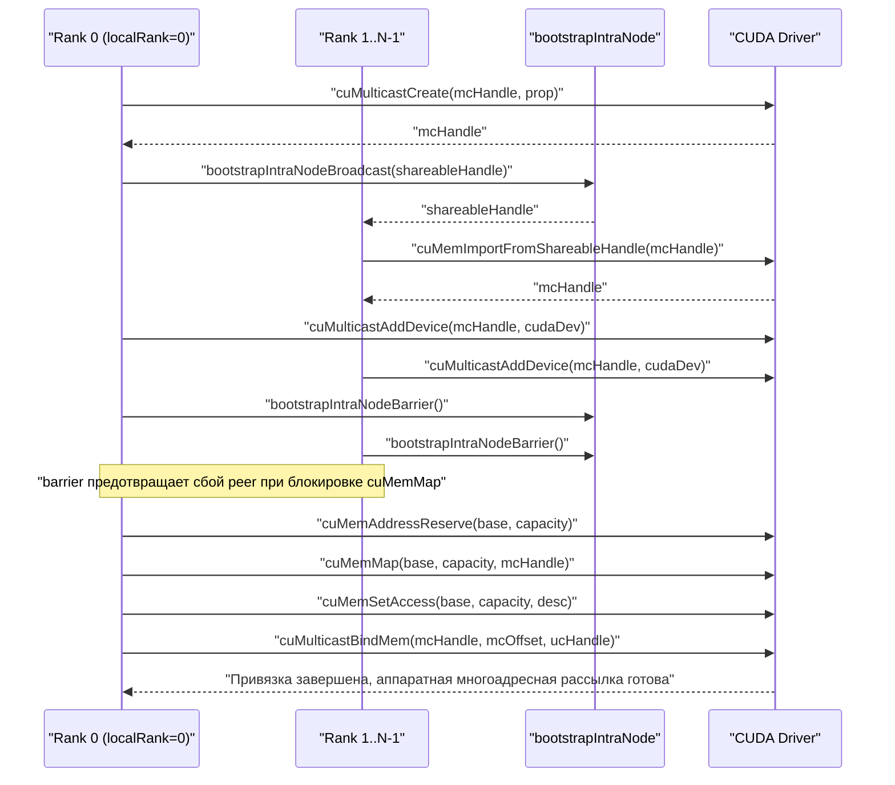
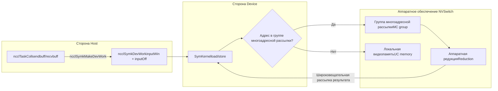

# Глава 14: Симметричная память и многоадресная рассылка NVLS: масштабирование в NVLink

# Глава 14: Симметричная память и NVLS: многоадресное ускорение и прямая адресация на устройстве LSA

В предыдущей главе мы проследили за одним межмашинным AllReduce и увидели, как данные из памяти GPU через сетевой адаптер достигают GPU на другом конце — этот путь решает задачу коммуникации между машинами. Но в современных AI-кластерах объём коммуникации между GPU внутри одной машины и даже внутри одного домена NVLink также огромен — синхронизация градиентов при параллельном обучении по данным, обмен активациями при тензорном параллелизме, подавляющее большинство происходит внутри машины. Если внутримашинная коммуникация всё ещё идёт по межмашинному маршруту GPU→память→сетевой адаптер→сетевой адаптер на другом конце→память→GPU, это равносильно отправке посылки внутри города авиапочтой — задержка тратится впустую. В этой главе мы разберём именно два инструмента, которые NCCL подготовил для внутримашинной коммуникации: симметричную память и NVLS. Первый позволяет каждому rank использовать один и тот же набор виртуальных адресов для доступа к буферам всех rank, второй использует возможности многоадресной рассылки аппаратного обеспечения NVSwitch для выполнения редукции. В сочетании они позволяют снизить задержку коллективной коммуникации для малых сообщений почти до аппаратного предела.

# 14.1 Симметричная память: пусть "3-й ряд, 5-е место" указывает на одно и то же место в доме каждого

## Интуитивная модель

Представьте класс, которому нужно обменяться тетрадями. Традиционный подход: каждый нумерует свои тетради, затем кричит "Чжан Сан, моя 5-я тетрадь тебе; Ли Сы, моя 8-я тетрадь тебе" — каждому нужно запоминать "чья тетрадь где лежит, какая по счёту". Это обычная коммуникация: адреса**относительные, приватные**, чтобы обратиться к данным на другом конце, нужно сначала знать отображение адресов на том конце.

Симметричная память предлагает другой подход: весь класс договаривается, что координата "3-й ряд, 5-е место" в доме каждого указывает на одно и то же физическое место. Тогда Чжан Сану, чтобы взять 5-ю тетрадь Ли Сы, достаточно сказать "дом Ли Сы, 3-й ряд, 5-е место" — никакого преобразования адресов не нужно. Это и есть суть симметричной памяти:**буферы каждого rank отображаются на одинаковые виртуальные адреса в адресном пространстве всех rank**。

> **[Design Inference & Architectural Trade-offs]**
> Что за катастрофа была бы с внутримашинной коллективной коммуникацией без симметричной памяти? Каждый rank при обращении к буферу на другом конце проходил бы через "преобразование адресов" — поиск в таблице, вычисление смещения, возможно, ещё и межпроцессную коммуникацию для подтверждения отображения. Для малых сообщений (несколько КБ) накладные расходы на это преобразование могли бы превысить стоимость передачи самих данных. Симметричная память полностью устраняет эти накладные расходы — именно в этом коренная причина того, что она "значительно снижает задержку для малых сообщений".

## Структуры данных и разметка памяти

Тип регистрации симметричной памяти описывается`ncclSymRegType_t`,`ncclGetSymRegType`в зависимости от того, имеют ли окна send/recv флаг`NCCL_WIN_COLL_SYMMETRIC`, состояние регистрации делится на четыре категории.

[FACT:src/sym_kernels.cc:395-412]

```c
ncclResult_t ncclGetSymRegType(struct ncclDevrWindow* sendWin, struct ncclDevrWindow* recvWin,
                               ncclSymRegType_t* winRegType) {
  bool isSendSymmReg = false;
  bool isRecvSymmReg = false;
  if (sendWin && (sendWin->winFlags & NCCL_WIN_COLL_SYMMETRIC)) isSendSymmReg = true;
  if (recvWin && (recvWin->winFlags & NCCL_WIN_COLL_SYMMETRIC)) isRecvSymmReg = true;
  // determine the registration type
  if (!isSendSymmReg && !isRecvSymmReg) {
    *winRegType = ncclSymSendNonregRecvNonreg;
  } else if (isSendSymmReg && !isRecvSymmReg) {
    *winRegType = ncclSymSendRegRecvNonreg;
  } else if (!isSendSymmReg && isRecvSymmReg) {
    *winRegType = ncclSymSendNonregRecvReg;
  } else if (isSendSymmReg && is isRecvSymmReg) {
    *winRegType = ncclSymSendRegRecvReg;
  }
  return ncclSuccess;
}
```

Эти четыре состояния определяют, по какому пути пойдёт последующее ядро: полностью симметричная регистрация (`SendRegRecvReg`) идёт по самому быстрому пути LSA, полностью нерегистрированная (`SendNonregRecvNonreg`) идёт по обычному пути, смешанное состояние требует особой обработки.`winFlags`в`NCCL_WIN_COLL_SYMMETRIC`бит — это отметка "зарегистрировано ли это окно симметрично".

Точка входа инициализации симметричной памяти —`ncclSymkInitOnce`, она делает одну ключевую вещь: определяет, поддерживает ли текущий домен коммуникации многоадресную рассылку LSA (`hasLsaMultimem`）。

[FACT:src/sym_kernels.cc:185-196]

```c
ncclResult_t ncclSymkInitOnce(struct ncclComm* comm) {
  // ncclTeamLsa() below calls this internally but drops the error code so we do it here.
  NCCLCHECK(ncclDevrInitOnce(comm));

  struct ncclSymkState* symk = &comm->symkState;
  if (!symk->initialized) {
    symk->initialized = true;
    struct ncclDevCommRequirements reqs = NCCL_DEV_COMM_REQUIREMENTS_INITIALIZER;
    // Disable LSA multicast for cross-clique since NVLS isn't available across cliques
    symk->hasLsaMultimem =
      ncclNvlsSymmetricMultimemEnabled(comm) && ncclTeamLsa(comm).nRanks > 2 && !comm->p2pCrossClique;
    reqs.lsaMultimem = symk->hasLsaMultimem;
```

`hasLsaMultimem`Три условия должны выполняться одновременно: симметричная многоадресная рассылка NVLS включена, число рангов в команде LSA больше 2 (два ранга быстрее соединяются напрямую точка-точка, многоадресная рассылка не нужна), и нет пересечения clique (при пересечении clique многоадресная рассылка NVSwitch недоступна). Это решение напрямую определяет,`reqs.lsaMultimem`будет ли установлен флаг, что в свою очередь влияет на распределение ресурсов коммуникатора на стороне устройства.

## Пошаговое руководство, управляемое сценарием

Предположим, мы инициируем AllReduce, размер сообщения 4 КБ, 8 рангов находятся в одном домене NVLink.`ncclSymkMask`определит, какие ядра доступны.

[FACT:src/sym_kernels.cc:304-352]

```c
uint32_t ncclSymkMask(struct ncclComm* comm, ncclFunc_t coll, int /*ncclDevRedOp_t*/ red, ncclDataType_t ty,
                      size_t nElts, bool symAligned16B) {
  uint32_t kmask = kernelMask_coll(coll);

  bool hasSTMC = comm->symkState.hasLsaMultimem;
  bool hasLDMC = false;
  if (comm->symkState.hasLsaMultimem) {
    switch (ty) {
    case ncclInt32:
    ...
      hasLDMC = red == ncclDevSum || red == ncclDevMinMax || red == ncclDevSumPostDiv;
      break;
    ...
    }
  }
  if (!hasSTMC) kmask &= ~kernelMask_STMC;
  if (!hasLDMC) kmask &= ~kernelMask_LDMC;
```

Шаг первый:`kernelMask_coll`в зависимости от типа коллективной операции (AllReduce) извлекается набор кандидатов ядер`kernelMask_AR`. Шаг второй: проверяется`hasLsaMultimem`, если многоадресная рассылка поддерживается, то далее проверяется, поддерживают ли тип данных и операция редукции LDMC (Load-Multicast). Шаг третий: с помощью битовой маски удаляются неподдерживаемые функции —`kmask &= ~kernelMask_STMC`все ядра, не поддерживающие STMC, исключаются.

Затем ограничение по размеру:

[FACT:src/sym_kernels.cc:336-342]

```c
  size_t nBytes = alignUp(nElts * ncclTypeSize(ty), NCCL_SYM_KERNEL_CELL_SIZE);
  size_t nBusBytes = (coll == ncclFuncAllReduce ? 1 : comm->nRanks) * nBytes;
  // LL kernels use 32-bit ints to track element counts and indices.
  if (nBusBytes >= (size_t(2) = 32 * (size_t(2) nRanks;
  kmask &= needGin ? kernelMask_Gin : ~kernelMask_Gin;
  return kmask;
```

TMA требует достаточного объёма SMEM (`ncclSymkTmaAvailable`проверяется`maxSharedMemOptin`) и 16-байтового выравнивания. GIN же нужен только тогда, когда «число рангов в команде LSA меньше общего числа рангов» — то есть GIN имеет смысл только тогда, когда коммуникационный домен выходит за границы LSA (требуется передача по сети). Если весь коммуникационный домен находится внутри LSA, ядра GIN исключаются.

## Управление параллелизмом и взаимодействие с оборудованием

Разрешение адресов симметричной памяти в конечном итоге выполняется на стороне устройства.`ncclSymkMakeDevWork`транслирует описание задачи со стороны хоста в рабочие элементы, читаемые на стороне устройства.

[FACT:src/sym_kernels.cc:380-393]

```c
ncclResult_t ncclSymkMakeDevWork(struct ncclComm* comm, struct ncclTaskColl* task, struct ncclSymkDevWork* outDevWork) {
  outDevWork->rootRank = task->root;
  outDevWork->redOpArg = task->opDev.scalarArg;
  outDevWork->nElts = task->count;
  outDevWork->inputWin = task->sendWin ? task->sendWin->vidmem : nullptr;
  outDevWork->inputOff =
    task->sendWin ? (uint8_t*)task->sendbuff - (uint8_t*)task->sendWin->userPtr : (size_t)task->sendbuff;
  outDevWork->outputWin = task->recvWin ? task->recvWin->vidmem : nullptr;
  outDevWork->outputOff =
    task->recvWin ? (uint8_t*)task->recvbuff - (uint8_t*)task->recvWin->userPtr : (size_t)task->recvbuff;
  outDevWork->sChannelId = 0xffff;
  outDevWork->nChannels = 0;
  return ncclSuccess;
}
```

Обратите внимание на вычисление`inputOff`: если sendWin существует (окно симметричной регистрации), смещение равно`sendbuff - sendWin->userPtr`— это**смещение внутри окна**, сторона устройства получает`inputWin`(базовый адрес окна) плюс`inputOff`и может вычислить фактический адрес. Если sendWin не существует, смещение — это непосредственно`sendbuff`абсолютный адрес. Такая конструкция позволяет ядру на стороне устройства использовать одну и ту же логику для обработки зарегистрированных и незарегистрированных буферов.

`ncclSymkInitOnce`также инициализирует ресурсные требования, связанные с GIN, включая inbox, outbox, буфер аккумуляции и rail signal.

[FACT:src/sym_kernels.cc:208-251]

```c
    struct ncclDevResourceRequirements ginInboxRailReq = {};
    struct ncclDevResourceRequirements ginOutboxReq = {};
    struct ncclDevResourceRequirements rsGinAccumReq = {};
    struct ncclDevResourceRequirements railSignalReq = {};
    if (ncclParamSymGinKernelsEnable() && ncclTeamLsa(comm).nRanks nRanks) {
      int maxBlocks;
      size_t bufSize;
      getRequirements_gin(comm, &maxBlocks, &bufSize);

      maxBlocks = std::max(maxBlocks, comm->config.minCTAs);
      maxBlocks = std::min(maxBlocks, comm->config.maxCTAs);
      if (ncclParamSymCTAs() >= 1) maxBlocks = ncclParamSymCTAs();
      maxBlocks = std::min(maxBlocks, ncclSymkMaxBlocks);
      symk->maxGinInboxBlocks = maxBlocks;
      symk->kcomm.rsGinAccumBytesPerBlock = ncclSymkRsGinAccumBytesPerBlock();

      rsGinAccumReq.bufferSize = (size_t)maxBlocks * symk->kcomm.rsGinAccumBytesPerBlock;
      rsGinAccumReq.bufferAlign = 128;
      rsGinAccumReq.outBufferHandle = &symk->kcomm.rsGinAccumBuf;
      ...
      uint32_t railSignalCount = ncclTeamRail(comm).nRanks * ncclSymkMaxBlocks;
      ...
      reqs.barrierCount = ncclSymkMaxBlocks;
      reqs.ginConnectionType = NCCL_GIN_CONNECTION_RAIL;
      reqs.ginStrongSignalsRequired = true;
      reqs.ginVaSignalsRequired = true;
    }
```

`getRequirements_gin`с помощью модели настройки вычисляет необходимое число блоков и размер буфера, затем они ограничиваются до диапазона`[minCTAs, maxCTAs]`.`rsGinAccumBytesPerBlock`— это размер буфера аккумуляции на каждый блок, выровненный до 128 байт — это размер строки кэша, чтобы избежать ложного совместного использования.

```mermaid
flowchart TD
    start["ncclSymkMask(comm, coll, red, ty, nElts)"] --> coll{"Тип коллектива?"}
    coll -->|AllGather| mask_ag["kmask = kernelMask_AG"]
    coll -->|AllReduce| mask_ar["kmask = kernelMask_AR"]
    coll -->|ReduceScatter| mask_rs["kmask = kernelMask_RS"]
    mask_ag --> check_stmc{"hasLsaMultimem?"}
    mask_ar --> check_stmc
    mask_rs --> check_stmc
    check_stmc -->|Нет| clear_stmc["kmask &= ~kernelMask_STMC"]
    check_stmc -->|Да| check_ldmc{"Тип данных + редукция поддерживают LDMC?"}
    clear_stmc --> size_check
    check_ldmc -->|Нет| clear_ldmc["kmask &= ~kernelMask_LDMC"]
    check_ldmc -->|Да| size_check
    clear_ldmc --> size_check
    size_check{"nBusBytes >= 2GB?"} -->|Да| clear_ll["kmask &= ~kernelMask_LL"]
    size_check -->|Нет| tma_check
    clear_ll --> tma_check{"TMA доступна и выравнивание 16B?"}
    tma_check -->|Нет| clear_tma["kmask &= ~kernelMask_Tma"]
    tma_check -->|Да| gin_check
    clear_tma --> gin_check{"Нужен GIN? LSA rank |Нет| clear_gin["kmask &= ~kernelMask_Gin"]
    gin_check -->|Да| done
    clear_gin --> done["Возврат kmask"]
```

Этот рисунок полностью описывает`ncclSymkMask`цепочку принятия решений: начиная от типа коллективной операции, последовательно проходя пять фильтров — поддержка многоадресной рассылки, тип данных, границы размера, доступность TMA, потребность в GIN, — и в итоге возвращается битовая маска. Каждый фильтр может исключить группу ядер, что как раз и отражает принцип NCCL «выбор оптимального ядра под сценарий».

## Руководство по избеганию проблем в production

**Проблема 1: при пересечении clique многоадресная рассылка молча отключается.** `hasLsaMultimem`Третье условие`!comm->p2pCrossClique`— это`ncclNvlsSymmetricMultimemEnabled`. Если ваш кластер настроен с MNNVL (Multi-Node NVLink), но некоторые ранги пересекают clique, многоадресная рассылка будет отключена, и производительность незаметно деградирует до обычного пути. При диагностике смотрите вывод логов

**.** `ncclSymkMask`Проблема 2: неявное требование 16-байтового выравнивания.`if (!symAligned16B) kmask &= ~kernelMask_Tma;`В`cudaMalloc`— если пользовательский буфер не выровнен по 16 байтам, ядро TMA исключается. TMA — самый быстрый движок копирования на Hopper/Blackwell, и его потеря означает снижение производительности. В production буферы, передаваемые пользователем, часто происходят из

**, естественно выровнены; но если они происходят из пользовательского аллокатора или среза, можно наткнуться на проблему.**Проблема 3: граница 2 ГБ.`ncclInvalidArgument`。

---

# Ядра LL используют 32-битные индексы, и при превышении 2 ГБ байтов на шине они исключаются. Для обучения больших моделей градиент одного AllReduce может превысить это значение, и тогда NCCL автоматически переключится на протокол STMC или Simple. Это не баг, но если вы вручную указали протокол LL, вы получите

## 14.2 NVLS: пусть аппаратное обеспечение NVSwitch выполняет редукцию за вас

Интуитивная модель

Традиционный AllReduce — это «программная редукция»: каждый GPU отправляет данные соседу, сосед выполняет сложение, затем пересылает дальше — данные перемещаются между GPU туда-сюда, а сложение выполняется на SM. Это как если бы 8 человек передавали записку для вычисления суммы: каждый должен прочитать, сложить и передать дальше.**NVLS предлагает другой подход: микросхема NVSwitch имеет встроенные возможности**。Вы записываете данные по адресу многоадресной рассылки, NVSwitch автоматически транслирует их всем участникам и выполняет сложение на аппаратном уровне. Это как если бы 8 человек записали числа на одной доске, а доска автоматически показала сумму — GPU записывает один раз, читает один раз, а все промежуточные пересылки и сложения выполняются аппаратурой коммутатора.

Без NVLS пропускная способность внутриузлового AllReduce ограничивалась бы соединениями точка-точка между GPU, и SM тратили бы множество циклов на сложение. NVLS перекладывает обе эти задачи на аппаратуру, позволяя SM заниматься другими вычислениями.

## Структуры данных и layout памяти

Ядро NVLS — это**группа многоадресной рассылки (MC group)**。`ncclMcGroup`Структура описывает всё состояние группы многоадресной рассылки.

[FACT:src/transport/multicast.cc:72-77]

```c
struct ncclMcGroup {
  CUmemGenericAllocationHandle handle;  // the MC object
  char* base;                          // mapped MC VA base
  size_t capacity;                      // total mapped VA size
  int dev;                           // local device, for unbind
};
```

Четыре поля:`handle`— это дескриптор объекта многоадресной рассылки CUDA,`base`— базовый адрес виртуальной памяти многоадресной рассылки,`capacity`— общий размер отображения,`dev`— номер локального устройства (используется для отвязки). Обратите внимание: здесь нет блокировки — создание и уничтожение группы многоадресной рассылки происходят на этапах инициализации/уничтожения, а не на горячем пути.

Группа многоадресной рассылки разбивается на несколько**разделов (partition)**, каждый раздел — это неизменяемый срез.`ncclMcPartition`Описывает один раздел.

[FACT:src/transport/multicast.cc:162-170]

```c
  // A partition is self-sufficient for binds: it carries the group's handle, device and
  // bind granularity alongside its own extent.
  for (int i = 0; i base + outPartitions[i].offset;
    outPartitions[i].mcHandle = mcHandle;
    outPartitions[i].minGranularity = minGran;
    outPartitions[i].dev = comm->cudaDev;
  }
```

Каждый раздел несёт собственный`offset`、`size`、`ptr`, а также`mcHandle`、`minGranularity`、`dev`группы, к которой он принадлежит. Такая «самодостаточная» конструкция позволяет передавать раздел в функцию привязки независимо, без необходимости обращаться к информации о группе.

## Пошаговое руководство на основе сценария

Предположим, 8 рангов должны создать домен NVLS.`ncclMcGroupBuildPartitions`Отвечает за создание группы многоадресной рассылки и разбиение на разделы.

[FACT:src/transport/multicast.cc:79-121]

```c
ncclResult_t ncclMcGroupBuildPartitions(struct ncclComm* comm, const struct ncclMcRequest* requests, int nRequests,
                                        struct ncclMcGroup** outGroup, struct ncclMcPartition* outPartitions) {
  ...
  mcprop.numDevices = comm->localRanks;
  mcprop.handleTypes = ncclCuMemHandleType;
  mcprop.flags = 0;
  mcprop.size = 0;
  for (int i = 0; i  recGran ? requests[i].alignment : recGran;
    ALIGN_SIZE(capacity, align);
    size_t slice = requests[i].size;
    ALIGN_SIZE(slice, recGran);
    outPartitions[i].offset = capacity;
    outPartitions[i].size = slice;
    capacity += slice;
  }
```

Шаг первый: суммировать размеры всех запросов, чтобы получить общий размер группы многоадресной рассылки. Шаг второй: запросить у CUDA рекомендуемую и минимальную гранулярность — это аппаратное ограничение, адрес и размер объекта многоадресной рассылки должны быть кратны гранулярности. Шаг третий: bump-аллокация — каждому запросу выделяется блок, смещение и размер выравниваются по рекомендуемой гранулярности.`ALIGN_SIZE(capacity, align)`Гарантирует, что начальное смещение каждого среза является допустимым смещением для привязки.

Далее — создание и импорт между рангами:

[FACT:src/transport/multicast.cc:125-146]

```c
  if (comm->localRank == 0) {
    NCCLCHECKGOTO(ncclMcCreate(comm, &mcprop, comm->localRank, comm->localRanks, &mcHandle, shareableHandle), ret,
                  fail);
    mcCreated = 1;
    NCCLCHECKGOTO(bootstrapIntraNodeBroadcast(comm->bootstrap, comm->localRankToRank, comm->localRank, comm->localRanks,
                                              0, shareableHandle, NVLS_HANDLE_SIZE),
                  ret, fail);
  } else {
    NCCLCHECKGOTO(bootstrapIntraNodeBroadcast(comm->bootstrap, comm->localRankToRank, comm->localRank, comm->localRanks,
                                              0, shareableHandle, NVLS_HANDLE_SIZE),
                  ret, fail);
    NCCLCHECKGOTO(ncclMcImport(comm, shareableHandle, comm->localRankToRank[0], &mcHandle), ret, fail);
    mcCreated = 1;
  }
  CUCHECKGOTO(cuMulticastAddDevice(mcHandle, comm->cudaDev), ret, fail);

  // cuMemMap of an MC object blocks until every device has been added. This
  // abort-aware barrier makes a peer failing before cuMulticastAddDevice trip the
  // abort flag here instead of stranding survivors in the blocking cuMemMap.
  NCCLCHECKGOTO(bootstrapIntraNodeBarrier(comm->bootstrap, comm->localRankToRank, comm->localRank, comm->localRanks,
                                          comm->localRankToRank[0]),
                ret, fail);
```

localRank 0 создаёт объект многоадресной рассылки, затем через bootstrap транслирует shareable handle; остальные ранги принимают handle и импортируют его.`cuMulticastAddDevice`Добавляет локальное устройство в группу многоадресной рассылки. Обратите внимание на барьер — в комментарии чётко сказано:`cuMemMap`Блокируется до тех пор, пока все устройства не присоединятся; если какой-либо peer откажет до`cuMulticastAddDevice`, выжившие зависнут в`cuMemMap`. Этот барьер позволяет захватить отказ через флаг abort до блокировки.

Наконец, отображение и установка прав доступа:

[FACT:src/transport/multicast.cc:148-155]

```c
  // Reserve and map the whole MC VA once; each consumer slice is a view into it.
  CUCHECKGOTO(cuMemAddressReserve(&base, capacity, recGran, 0U, 0), ret, fail);
  CUCHECKGOTO(cuMemMap(base, capacity, 0, mcHandle, 0), ret, fail);
  mapped = 1;
  desc.flags = CU_MEM_ACCESS_FLAGS_PROT_READWRITE;
  desc.location.type = CU_MEM_LOCATION_TYPE_DEVICE;
  desc.location.id = comm->cudaDev;
  CUCHECKGOTO(cuMemSetAccess(base, capacity, &desc, 1), ret, fail);
```

Вся многоадресная VA резервируется и отображается только один раз, каждый потребительский срез — это представление данной VA. Это дизайн «одно отображение, множество срезов» — экономит ресурсы по сравнению с созданием отдельного объекта многоадресной рассылки для каждого потребителя.

## Управление конкурентностью и взаимодействие с аппаратурой

Привязка — ключевая операция NVLS.`ncclMcPartitionBindMem`Привязывает дескриптор памяти UC (одноадресной) к определённому смещению в группе многоадресной рассылки.

[FACT:src/transport/multicast.cc:200-225]

```c
ncclResult_t ncclMcPartitionBindMem(const struct ncclMcPartition* partition, size_t offsetInPartition,
                                    CUmemGenericAllocationHandle mem, size_t memOffset, size_t bindSize) {
  // A bind overrunning its partition would corrupt the next consumer's partition; fail
  // cleanly instead (possible when UC rounding exceeds the MC-rounded partition).
  if (offsetInPartition + bindSize > partition->size) {
    WARN("NVLS MC bind of size %zu at slice offset %zu exceeds slice size %zu (UC/MC granularity mismatch)", bindSize,
         offsetInPartition, partition->size);
    return ncclInternalError;
  }
  size_t mcOffset = partition->offset + offsetInPartition;
  ...
  CUresult err = CUPFN(cuMulticastBindMem(partition->mcHandle, mcOffset, mem, memOffset, bindSize, 0 /*flags*/));
  if (err != CUDA_SUCCESS) {
    ...
    WARN("Failed to bind NVLink SHARP (NVLS) Multicast memory of size %zu at MC group %llx offset %zu : CUDA error %d "
         "'%s'.\nThis is usually caused by a system or configuration error in the Fabric Manager or NVSwitches.\n"
         "Disable NVLS (NCCL_NVLS_ENABLE=0) if you wish to avoid this error in the future.",
         bindSize, partition->mcHandle, mcOffset, err, errStr);
    return ncclUnhandledCudaError;
  }
  return ncclSuccess;
}
```

Первая линия защиты — проверка границ:`offsetInPartition + bindSize > partition->size`выдаёт ошибку. В комментарии объясняется причина — гранулярность памяти UC может быть больше, чем у раздела MC; если после выравнивания UC выйдет за границы раздела MC, это затронет раздел следующего потребителя. Это типичная ловушка «несовпадения двух гранулярностей».

`cuMulticastBindMem`— это аппаратный вызов, в комментарии сказано, что он «blocks until all ranks have been added to the group» — это самое проблемное место NVLS. Если Fabric Manager настроен неправильно или прошивка NVSwitch имеет проблемы, здесь произойдёт зависание или возврат ошибки. В сообщении об ошибке пользователю напрямую рекомендуется`NCCL_NVLS_ENABLE=0`, это стандартный аварийный выход для продакшена.

Существует также вариант «попытки привязки», используемый для регистрации пользовательских буферов:

[FACT:src/transport/multicast.cc:237-268]

```c
ncclResult_t ncclMcPartitionTryBindAddr(const struct ncclMcPartition* partition, size_t offsetInPartition,
                                        CUdeviceptr address, size_t bindSize, enum ncclMcBindStatus* outStatus) {
  const char* errStr = NULL;

  *outStatus = ncclMcBindStatusTransient;
  if (offsetInPartition + bindSize > partition->size) {
    ...
    return ncclInternalError;
  }
  size_t mcOffset = partition->offset + offsetInPartition;
  CUresult err = CUPFN(cuMulticastBindAddr(partition->mcHandle, mcOffset, address, bindSize, 0 /*flags*/));
  if (err == CUDA_SUCCESS) {
    *outStatus = ncclMcBindStatusOk;
    return ncclSuccess;
  }

  (void)pfn_cuGetErrorString(err, &errStr);
  // Only an outright rejection of the input is a property of the buffer. Anything else,
  // notably OUT_OF_MEMORY, may succeed later, so it must not be reported as permanent.
  if (err == CUDA_ERROR_INVALID_VALUE || err == CUDA_ERROR_NOT_SUPPORTED || err == CUDA_ERROR_NOT_PERMITTED) {
    *outStatus = ncclMcBindStatusNoSupport;
    ...
  } else {
    WARN("NVLS Multicast bind of size %zu at MC group %llx offset %zu dev %d failed transiently: CUDA error %d '%s'.\n"
         "The buffer is left unregistered for this operation and will be retried; repeated occurrences indicate "
         "sustained resource pressure.",
         bindSize, partition->mcHandle, mcOffset, partition->dev, err, errStr);
  }
  return ncclSuccess;
}
```

Здесь есть изящная классификация ошибок:`CUDA_ERROR_INVALID_VALUE`、`NOT_SUPPORTED`、`NOT_PERMITTED`классифицируется как`ncclMcBindStatusNoSupport`— это**постоянный отказ**, означающий, что данный буфер сам по себе не поддерживает привязку к многоадресной рассылке. А другие ошибки (особенно`OUT_OF_MEMORY`) классифицируются как`ncclMcBindStatusTransient`— это**временный отказ**, можно повторить попытку. Это различие критически важно: если считать OOM постоянным отказом, можно ошибочно отказаться от регистрации, которая могла бы успешно завершиться; если считать ошибку параметра временным отказом, можно бесконечно повторять попытки.

## Руководство по избеганию проблем в продакшене

**Проблема 1: неправильная конфигурация Fabric Manager приводит к зависанию`cuMulticastBindMem`Это самая классическая производственная проблема NVLS. В сообщении об ошибке явно указывается на Fabric Manager или NVSwitch. Шаги диагностики: сначала**убедиться, что проблема исчезла, затем проверить логи Fabric Manager и версию прошивки NVSwitch.`NCCL_NVLS_ENABLE=0`Проблема 2: несовпадение гранулярности UC/MC.

**Проверка границ в** `ncclMcPartitionBindMem`поймает эту проблему, но если вы видите предупреждение «UC/MC granularity mismatch», это означает, что размер UC какого-то запроса после выравнивания вышел за пределы раздела MC. Обычно это происходит, когда размер запроса близок к границе гранулярности.

**Проблема 3: утечка ресурсов после неудачного создания группы многоадресной рассылки.** `ncclMcGroupBuildPartitions`В пути отказа`CUCALL`используется`CUCHECK`：

[FACT:src/transport/multicast.cc:179-184]

```c
fail:
  // Best-effort (CUCALL) so a failing cleanup op cannot skip releasing the MC handle.
  if (mapped) CUCALL(cuMemUnmap(base, capacity));
  if (base) CUCALL(cuMemAddressFree(base, capacity));
  if (mcCreated) CUCALL(cuMemRelease(mcHandle));
  return ret;
```

Комментарий объясняет причину: если сама операция cleanup завершится неудачно, нельзя из-за этого пропускать освобождение MC handle — MC slot является дефицитным ресурсом, а утечка приведёт к сбою последующего создания. Это типичный пример проектирования по принципу «путь очистки должен быть best-effort».



Эта диаграмма последовательности описывает полный процесс от создания мультикаст-группы до привязки. Ключевой момент — это barrier: он разделяет «отказ peer» и «блокировку cuMemMap», предотвращая зависание выживших.

---

# 14.3 Объединение симметричной памяти и NVLS: как LSA-указатели разрешаются на стороне устройства

## Интуитивная модель

Симметричная память решает проблему «согласованности адресов», NVLS решает проблему «аппаратной редукции». Но для их реального взаимодействия нужен ещё один ключевой механизм:**Как сторона устройства узнаёт, что некоторый адрес является симметричным и может использовать путь мультикаста?**

Ответ — в LSA (Load-Store Accessible) указателях. LSA — сокращение от «доступный для загрузки-сохранения», что означает: память, на которую указывает этот указатель, GPU может напрямую адресовать обычными инструкциями load/store — независимо от того, физически она локальная или удалённая. Если адрес попадает в мультикаст-группу, load/store будет перехвачен аппаратурой NVSwitch и широковещательно разослан.

## Структуры данных и раскладка памяти

`ncclSymkDevWork`— это рабочий дескриптор на стороне устройства, который несёт ключевую информацию о симметричной памяти.

[FACT:src/sym_kernels.cc:380-393]

```c
ncclResult_t ncclSymkMakeDevWork(struct ncclComm* comm, struct ncclTaskColl* task, struct ncclSymkDevWork* outDevWork) {
  outDevWork->rootRank = task->root;
  outDevWork->redOpArg = task->opDev.scalarArg;
  outDevWork->nElts = task->count;
  outDevWork->inputWin = task->sendWin ? task->sendWin->vidmem : nullptr;
  outDevWork->inputOff =
    task->sendWin ? (uint8_t*)task->sendbuff - (uint8_t*)task->sendWin->userPtr : (size_t)task->sendbuff;
  outDevWork->outputWin = task->recvWin ? task->recvWin->vidmem : nullptr;
  outDevWork->outputOff =
    task->recvWin ? (uint8_t*)task->recvbuff - (uint8_t*)task->recvWin->userPtr : (size_t)task->recvbuff;
  outDevWork->sChannelId = 0xffff;
  outDevWork->nChannels = 0;
  return ncclSuccess;
}
```

`inputWin`— это виртуальный адрес окна на стороне устройства (`vidmem`），`inputOff`— это смещение буфера внутри окна. Получив эти два значения, kernel на стороне устройства вычисляет`inputWin + inputOff`и получает фактический адрес. Если этот адрес попадает в мультикаст-группу, аппаратура автоматически обработает широковещание.

`ncclSymkInitOnce`также устанавливает LSA barrier и ресурсы LLA2A (Low-Latency All-to-All).

[FACT:src/sym_kernels.cc:197-206]

```c
    reqs.lsaBarrierCount = ncclSymkMaxBlocks;
    reqs.ginStrongSignalsRequired = false;
    reqs.ginVaSignalsRequired = false;

    struct ncclDevResourceRequirements lla2aReq;
    ncclLLA2ACreateRequirement(ncclSymkMaxBlocks,
                               ncclLLA2ACalcSlots(ncclTeamLsa(comm).nRanks * ncclSymkMaxThreads, ncclSymkLLMaxEltSize),
                               &symk->kcomm.lsaLLA2A, &lla2aReq);
    lla2aReq.next = reqs.resourceRequirementsList;
    reqs.resourceRequirementsList = &lla2aReq;
```

`lsaBarrierCount`устанавливается в`ncclSymkMaxBlocks`— по одному слоту barrier на каждый block. LLA2A — сокращение от low-latency all-to-all, используется для быстрого обмена данными внутри LSA-домена.`ncclLLA2ACalcSlots`вычисляет необходимое количество слотов на основе числа rank'ов, числа потоков и максимального размера элемента.

## Пошаговый разбор на основе сценария

Предположим, что один AllReduce использует`AllReduce_AGxLLMC_R`kernel (AllGather + LL + MC + Reduce). Рабочий процесс этого kernel таков:

1. **Этап AllGather**: каждый rank записывает свои данные в мультикаст-группу, аппаратура NVSwitch широковещательно рассылает их всем rank'ам.

2. **Этап Reduce**: каждый rank читает данные всех rank'ов из мультикаст-группы и выполняет редукцию локально.

`ncclSymkMask`проверяет, доступен ли этот kernel.`kernelMask_LL`содержит`AllReduce_AGxLLMC_R`, но только при условии, что`hasLsaMultimem`истинно (иначе`kernelMask_STMC`очищается, а`AllReduce_AGxLLMC_R`принадлежит множеству STMC).

Подождите, здесь есть деталь:`kernelMask_STMC`содержит`AllReduce_AGxLLMC_R`? Смотрим исходный код:

[FACT:src/sym_kernels.cc:17-21]

```c
constexpr uint32_t kernelMask_STMC =
  1 nvlsChannels;
    size_t creditSize = nChannels * 2 * memSize * nHeads;
    int nvlsStepSize = comm->nvlsChunkSize;

    NCCLCHECKGOTO(ncclCalloc(&comm->nvlsResources, 1), res, fail);
    comm->nvlsResources->inited = false;
    comm->nvlsResources->refCount = 1;
    comm->nvlsResources->nChannels = nChannels;
    comm->nvlsResources->nHeads = nHeads;
    comm->nvlsResources->chunkSize = comm->nvlsChunkSize;
    comm->nvlsResources->treeMaxChunkSize = comm->nvlsTreeMaxChunkSize;
    resources = comm->nvlsResources;

    for (int c = 0; c accessDesc, 0, sizeof(resources->accessDesc));
    resources->accessDesc.flags = CU_MEM_ACCESS_FLAGS_PROT_READWRITE;
    resources->accessDesc.location.type = CU_MEM_LOCATION_TYPE_DEVICE;
    resources->accessDesc.location.id = comm->cudaDev;
    resources->dev = comm->cudaDev;

    // Build the single shared MC group for this NVLS domain. The data slice is
    // reserved here but bound later by ncclNvlsBufferSetup.
    {
      size_t buffSize = nvlsStepSize * NCCL_STEPS;
      size_t dataSize = nChannels * 2 * buffSize * nHeads;
      size_t ubSize = ncclNvlsUbSize(comm);
      struct ncclMcRequest requests[3] = {{creditSize, 0}, {dataSize, 0}, {ubSize, 0}};
      struct ncclMcPartition partitions[3];
      NCCLCHECKGOTO(ncclMcGroupBuildPartitions(comm, requests, 3, &resources->mcGroup, partitions), res, fail);
      resources->creditPartition = partitions[0];
      resources->dataPartition = partitions[1];
      if (ubSize) {
        resources->ubPartition = partitions[2];
        NCCLCHECKGOTO(ncclMcArenaInit(comm, &resources->ubArena, &resources->ubPartition), res, fail);
        resources->ubEnabled = true;
      }
      NCCLCHECKGOTO(nvlsAllocBindUc(comm, &resources->creditPartition, creditSize, &resources->creditUc), res, fail);
    }
```

Мультикаст-группа разбивается на три раздела:`creditPartition`(credit),`dataPartition`(data),`ubPartition`(user buffer). Раздел credit используется для синхронизации — каждый channel имеет независимые указатели head/tail, разделяемые через мультикаст-группу.

Инициализация credit происходит в последующем цикле:

[FACT:src/transport/nvls.cc:456-491]

```c
    for (int h = 0; h nRanks + 1 + h;
      for (int c = 0; c channels + c;
        char* mem = NULL;
        struct ncclChannelPeer* peer = channel->peers[nvlsPeer];

        // Reduce UC -> MC
        mem = (char*)resources->creditUc.ptr + (h * 2 * nChannels + c) * memSize;
        peer->send[1].transportComm = &nvlsTransport.send;
        peer->send[1].conn.buffs[NCCL_PROTO_SIMPLE] = NULL;
        peer->send[1].conn.head = (uint64_t*)mem;
        peer->send[1].conn.tail = (uint64_t*)(mem + memSize / 2);
        peer->send[1].conn.stepSize = nvlsStepSize;
        mem = (char*)resources->creditPartition.ptr + (h * 2 * nChannels + c) * memSize;
        peer->recv[0].transportComm = &nvlsTransport.recv;
        peer->recv[0].conn.buffs[NCCL_PROTO_SIMPLE] = NULL;
        peer->recv[0].conn.head = (uint64_t*)mem;
        peer->recv[0].conn.tail = (uint64_t*)(mem + memSize / 2);
        peer->recv[0].conn.stepSize = nvlsStepSize;
        peer->recv[0].conn.flags |= NCCL_NVLS_MIN_POLL;
```

Каждая комбинация head и channel имеет независимую область credit.`head`и`tail`— это 64-битные указатели,`memSize`равен 64 байтам (`size_t memSize = 64;`), поэтому head и tail занимают по 32 байта — ровно половину cache line.`NCCL_NVLS_MIN_POLL`флаг заставляет получателя использовать режим минимального опроса, снижая нагрузку на CPU.

## Руководство по избежанию проблем в production

**Проблема 1: конкуренция head/tail в разделе credit.**Несколько channel'ов совместно используют одну мультикаст-группу, но каждый channel имеет независимую область credit. Если число channel'ов настроено неправильно (например,`nvlsCTAs`задано слишком большим), область credit раздувается, занимая ценное мультикаст-адресное пространство.`ncclNvlsChannels`автоматически подстраивает число channel'ов в зависимости от архитектуры GPU и числа узлов:

[FACT:src/transport/nvls.cc:100-133]

```c
  if (comm->config.nvlsCTAs != NCCL_CONFIG_UNDEF_INT) {
    channels = comm->config.nvlsCTAs;
  } else if (channels == 0 && comm->compCap >= 100) {
    // Use a reduced number of channels for single node/MNNVL domain on Blackwell and above.
    // comm->nNodes is not yet initialized at this point so we need to use local information.
    bool multiNode = false;
    if (comm->MNNVL) {
      multiNode = (comm->clique.size nRanks);
    } else {
      int i;
      for (i = 1; i nRanks; i++) {
        if (comm->peerInfo[i].hostHash != comm->peerInfo[0].hostHash) break;
      }
      multiNode = (i nRanks);
    }
    if (multiNode) {
      channels = RUBIN_AND_LATER(comm->compCap) ? /*RUBIN=*/64 : /*SM100=*/32;
    } else {
      channels = RUBIN_AND_LATER(comm->compCap) ? /*RUBIN=*/48 : /*SM100=*/24;
    }
  } else if (channels == 0) {
    channels = /*SM90=*/16;
  }
```

Обратите внимание, что`comm->nNodes`на этом этапе ещё не инициализирован, поэтому код использует`peerInfo[i].hostHash`для ручного определения многоузловости. Это классическая ловушка порядка инициализации — нельзя полагаться на поле, которое ещё не вычислено.

**Проблема 2: MNNVL не поддерживает регистрацию NVLS buffer.** [FACT:src/transport/nvls.cc:516-517]

```c
  // MNNVL does not support NVLS buffer registration
  if (!comm->MNNVL && comm->nvlsResources->nvlsShmemHandle == NULL) {
```

В среде MNNVL (Multi-Node NVLink) регистрация пользовательского буфера пропускается. Если ваш кластер использует MNNVL и полагается на UB-регистрацию для повышения производительности, вы обнаружите, что регистрация не вступила в силу. Это аппаратное ограничение, а не bug.

**Проблема 3: подсчёт ссылок на разделяемые ресурсы.** `ncclNvlsSetup`Поддержка разделения ресурсов NVLS между родительским и дочерним коммуникационными доменами:

[FACT:src/transport/nvls.cc:380-392]

```c
  if (nvlsShare) {
    /* reuse NVLS resources */
    comm->nvlsChannels = std::min(comm->nvlsChannels, parent->nvlsResources->nChannels);
    /* Inherit chunk sizes from the shared resource since we're reusing the parent's
     * NVLS buffers, which were allocated and laid out based on these values. */
    comm->nvlsChunkSize = parent->nvlsResources->chunkSize;
    comm->nvlsTreeMaxChunkSize = parent->nvlsResources->treeMaxChunkSize;
    for (int c = 0; c nvlsChannels; c++) {
      NCCLCHECKGOTO(initNvlsChannel(comm, c, parent, true), res, fail);
    }

    comm->nvlsResources = parent->nvlsResources;
    ncclAtomicRefCountIncrement(&parent->nvlsResources->refCount);
  }
```

Дочерний коммуникационный домен повторно использует ресурсы родительского домена, счётчик ссылок увеличивается на единицу.`ncclNvlsFree`Только когда счётчик ссылок уменьшается до нуля, ресурс действительно освобождается. Если управление счётчиком ссылок работает неправильно, это приведёт к преждевременному освобождению ресурса или утечке. Обратите внимание, что`nvlsChunkSize`и`nvlsTreeMaxChunkSize`должны наследовать значения родительского коммуникационного домена — потому что буферы размещаются в соответствии с этими значениями, и их изменение приведёт к ошибкам вычисления адресов.



Эта диаграмма потока данных показывает полный путь от задачи на стороне host до выполнения на стороне устройства. Ключевое ветвление — это`lsa{"地址在多播组内?"}`— если да, используется аппаратная многоадресная рассылка и редукция NVSwitch; если нет, используется локальная видеопамять. Это решение автоматически принимается аппаратным обеспечением на основе диапазона адресов и не требует вмешательства программного обеспечения.

---

# 14.4 Размышления о проектировании: почему симметричная память снижает задержку малых сообщений

Вернёмся к ключевому вопросу в начале этой главы: почему симметричная память значительно снижает задержку малых сообщений?

**Во-первых, устраняются накладные расходы на трансляцию адресов.**В традиционной коммуникации каждый rank при доступе к буферу удалённой стороны должен выполнять поиск по таблице и вычисление смещения. Симметричная память позволяет всем rank использовать один и тот же набор адресов, и kernel на стороне устройства напрямую вычисляет`base + offset`. Для малых сообщений накладные расходы на эту трансляцию составляют очень высокую долю.

**Во-вторых, устраняется обмен управляющими сообщениями.**Традиционная коммуникация требует обмена управляющей информацией типа «в какой твой буфер я буду писать». При симметричной памяти адреса заранее согласованы и не требуют согласования во время выполнения.

**В-третьих, становится возможной аппаратная многоадресная рассылка.**Только когда адреса симметричны, NVSwitch может использовать один и тот же набор адресов для многоадресной рассылки. Если адреса каждого rank различаются, аппаратное обеспечение не может знать, куда выполнять широковещательную рассылку.

**В-четвёртых, снижается нагрузка на редукцию в SM.**NVLS перекладывает сложение на NVSwitch, и SM нужно только инициировать одну запись и одно чтение. Для малых сообщений накладные расходы на инструкции SM являются основным источником задержки.

Сочетание этих четырёх факторов снижает задержку малых сообщений с «микросекундного» до «субмикросекундного» уровня.

> **[Design Inference & Architectural Trade-offs]**
> С инженерной точки зрения дизайн симметричной памяти отражает одну из ключевых философий NCCL:**перекладывать сложность на этап инициализации, делая горячий путь максимально простым**. Согласование адресов, создание групп многоадресной рассылки, распределение credit — всё это выполняется при инициализации, а во время выполнения kernel должен выполнять только простейшее вычисление адресов и load/store. Такой дизайн «тяжёлая инициализация, лёгкое выполнение» является универсальным шаблоном для высокопроизводительных коммуникационных библиотек.

---

# Резюме главы

В этой главе разобраны два столпа внутриузловой коммуникации NCCL:

1. **Симметричная память**: через`ncclSymkInitOnce`и`ncclSymkMask`создаются буферы с согласованными адресами, позволяя каждому rank использовать один и тот же набор адресов для доступа к данным всех rank.`ncclSymkMakeDevWork`Преобразует задачи на стороне host в рабочие элементы на стороне устройства,`inputWin + inputOff`— это ключевая формула разрешения адресов.

2. **Многоадресная рассылка NVLS**: через`ncclMcGroupBuildPartitions`создаётся группа многоадресной рассылки,`ncclMcPartitionBindMem`привязывает память UC к группе многоадресной рассылки,`cuMulticastBindMem`— это аппаратный вызов. Группа многоадресной рассылки разбивается на три раздела: credit, data и ub, которые используются соответственно для синхронизации, передачи данных и регистрации пользовательских буферов.

3. **Разрешение указателей LSA**: сторона устройства автоматически определяет по диапазону адресов, использовать ли путь многоадресной рассылки, без необходимости программной трансляции.`NCCL_NVLS_MIN_POLL`Флаг оптимизирует накладные расходы на опрос.

4. **Обработка ошибок**：`ncclMcPartitionTryBindAddr`Различает постоянные и временные сбои,`ncclMcGroupBuildPartitions`путь fail в`CUCALL`использует

# для гарантии освобождения ресурсов.

Вопросы для размышления и самопроверки в этой главе`ncclMcPartitionBindMem`Q1: Если убрать проверку границ`if (offsetInPartition + bindSize > partition->size)`в

**, в каких сценариях возникнет выход за границы памяти? Почему эту проверку нельзя заменить утверждением «гранулярность UC и MC одинакова»?**Справочный разбор[FACT:src/transport/multicast.cc:200-208]：
