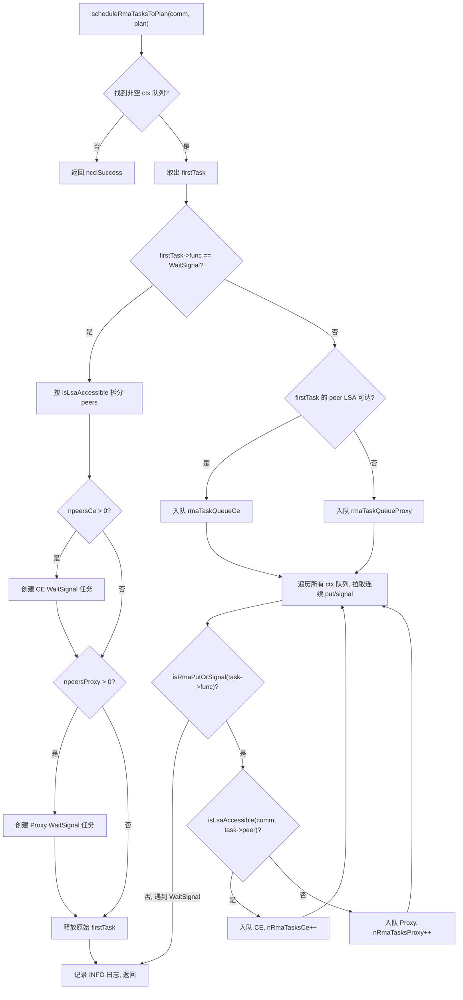
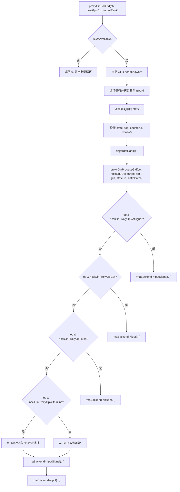

# Следующая глава: Глава 15 →

# Прогресс по книге: Глава 15 / 25

Глава 15: RMA и GIN: эволюция удалённого доступа к памяти и прямого взаимодействия GPU с сетью

# В предыдущей главе мы увидели, что симметричная память позволяет каждому rank использовать один и тот же набор адресов для доступа к буферам всех rank, а NVLS с помощью возможностей многоадресной рассылки NVSwitch доводит аппаратно-ускоренную редукцию до предела. Но коллективная коммуникация — это не всё: когда приложению требуются двухточечные операции с удалённой памятью или когда GPU kernel должен напрямую инициировать сетевые запросы, на сцену выходят RMA и GIN. RMA предоставляет удалённый доступ к памяти с семантикой put/get, а GIN позволяет GPU обходить прокси-потоки host и напрямую взаимодействовать с сетью. В этой главе в порядке «сначала RMA, затем GIN» последовательно разбираются структуры данных, логика планирования, управление конкурентностью и производственные ловушки этих двух механизмов.

## Двухканальная модель RMA: разделение обязанностей между CE и Proxy

Представьте систему международной курьерской доставки: городская доставка (ранги, достижимые через LSA) может быть выполнена непосредственно местным курьером, тогда как междугородняя доставка (ранги, недостижимые через LSA) должна быть передана авиационному грузовому агенту. RMA в NCCL — это именно такая модель: одна и та же операция put, в зависимости от того, находится ли целевой ранг в команде LSA (Load-Store Accessible), маршрутизируется по двум совершенно разным путям выполнения: путь CE (Copy Engine, движок копирования) и путь Proxy (прокси-поток).

Без этого механизма разделения все операции RMA шли бы через прокси-поток, и тогда put внутри одного узла также проходил бы через промежуточный хост-поток, что добавляло бы лишнюю задержку на往返 между хостом и устройством. И наоборот, если бы все операции шли через CE, межмашинные операции не могли бы использовать асинхронные возможности сетевого плагина.

## Структуры данных и разметка памяти

Основной структурой планирования RMA является`ncclRmaArgs`, которая фиксирует результат разделения задач RMA в плане. Ключевые поля включают:

| Поле | Значение |
| --- | --- |
| `func` | Тип операции (PutSignal / Signal / WaitSignal) |
| `nRmaTasks` | Общее количество задач |
| `nRmaTasksProxy` | Количество задач, идущих по пути proxy |
| `nRmaTasksCe` | Количество задач, идущих по пути CE |

Внутри каждого плана поддерживаются две интрузивные очереди:`rmaTaskQueueCe`и`rmaTaskQueueProxy`, в которых хранятся задачи соответствующих путей.[FACT:src/rma/rma.cc:166-171]

Логика определения, достижим ли ранг через LSA, довольно прямолинейна — перебор массива`lsaRankList`с линейным поиском.[FACT:src/rma/rma.cc:34-41]Этот поиск выполняется один раз для каждого peer при планировании задач, сложность O(lsaSize), и для типичной небольшой команды LSA (обычно 2-8 рангов) накладные расходы пренебрежимо малы.

## Пошаговый процесс планирования

Когда приложение вызывает операцию RMA put, задача попадает в`planner->rmaTaskQueues[ctx]`。`scheduleRmaTasksToPlan`, который отвечает за распределение задач из очереди по планам.[FACT:src/rma/rma.cc:141-296]

Шаг первый: найти первую непустую очередь контекста. NCCL поддерживает несколько контекстов RMA (настраиваемых через`numRmaCtx`), каждый контекст имеет независимую очередь.[FACT:src/rma/rma.cc:148-155]

Шаг второй: извлечь первую задачу и определить тип операции. Если это WaitSignal, применяется специальная логика разделения; если Put/Signal — логика пакетного объединения.[FACT:src/rma/rma.cc:163-168]

Для задач WaitSignal планировщик должен разделить список peers на две группы по достижимости через LSA: группу CE и группу Proxy.[FACT:src/rma/rma.cc:187-204]После разделения создаются две новые структуры`ncclTaskRma`, каждая из которых содержит массив peers соответствующей группы.[FACT:src/rma/rma.cc:207-246]Исходная задача освобождается.[FACT:src/rma/rma.cc:251]

Для задач Put/Signal логика сложнее — планировщик обходит очереди всех контекстов и извлекает все последовательные задачи put/signal в один план, останавливаясь только при встрече с WaitSignal.[FACT:src/rma/rma.cc:279-295]Цель этого дизайна ясно описана в комментариях: позволить одному запуску ядра охватить put/signal всех контекстов, чтобы proxy мог инициировать все асинхронные запросы за один раз до любой блокирующей операции, а путь CE — пакетно отправить копирования и сигналы всех контекстов.[FACT:src/rma/rma.cc:270-278]

## Параллельное выполнение и синхронизация потоков

После завершения планирования`ncclLaunchRma`в соответствии с полем`func`распределяется в`ncclRmaPut`или`ncclRmaWaitSignal`。[FACT:src/rma/rma.cc:109-131]

На примере`ncclRmaPut`, когда в плане одновременно присутствуют задачи proxy и CE, оба пути должны выполняться параллельно. Подход NCCL таков: записать событие во входном потоке, заставить поток CE ждать этого события, затем одновременно запустить операции в обоих потоках и, наконец, записать ещё одно событие в потоке CE, чтобы входной поток ждал его.[FACT:src/rma/rma.cc:80-96]Эта цепочка событий гарантирует: операции CE не начнутся до того, как зависимости входного потока будут готовы, а последующие операции входного потока не начнутся до завершения CE.

Если есть только задачи proxy или только задачи CE, соответствующая операция запускается непосредственно во входном потоке без дополнительной синхронизации потоков.[FACT:src/rma/rma.cc:97-101]

## Размышления о дизайне и производственные ловушки

**Ловушка первая: статичность определения достижимости через LSA.** `isLsaAccessible`При планировании запрашивается`comm->devrState.lsaRankList`, и этот список не меняется после инициализации коммуникационного домена. Если в процессе работы топология изменится (например, деградация из-за сбоя NVLink), список LSA не обновится автоматически, что может привести к тому, что операции, которые должны идти через proxy, по-прежнему пойдут по пути CE, вызвав неисправимую ошибку.

**Ловушка вторая: гарантия FIFO при пакетном объединении.**Логика пакетного объединения извлекает только последовательные задачи put/signal и останавливается при встрече с WaitSignal.[FACT:src/rma/rma.cc:283]Это гарантирует порядок FIFO внутри каждого контекста, но задачи из разных контекстов могут быть объединены в один план. Если приложение зависит от порядка операций между контекстами, необходимо явно использовать WaitSignal для установки барьера.

**Ловушка третья: путь утечки памяти.**В ветке WaitSignal, если`npeersProxy == 0`, код освобождает`peersProxy`、`nsignalsProxy`、`signalIdxsProxy`три массива.[FACT:src/rma/rma.cc:239-244]Но если`npeersCe == 0`и`npeersProxy > 0`，`peersCe`и другие массивы были выделены через`ncclMemoryStackAlloc`, их не нужно освобождать вручную (стековый аллокатор回收 их统一).[FACT:src/rma/rma.cc:176-178]Эта асимметрия может сбивать читателя с толку, но на самом деле она корректна — память, выделенная в стеке, управляется`comm->memScoped`единообразно.

# Контекст RMA Proxy: сигналы, очереди и неблокирующий кольцевой буфер

## Интуитивная модель

Контекст Proxy похож на «сортировочный центр почты»: GPU кладёт отправляемые пакеты (put-запросы) во входящий ящик (кольцевой буфер), поток proxy забирает пакеты из ящика и передаёт курьерской компании (сетевому плагину), а курьерская компания после доставки ставит печать на квитанции (сигнале). В течение всего процесса GPU и поток proxy обмениваются данными через неблокирующие структуры данных, избегая дорогостоящей конкуренции за блокировки.

## Структуры данных и разметка памяти

`ncclRmaProxyCtx`— это структура-хозяин контекста proxy, её ключевые поля включают:

**Область сигналов (signalsDev)**: блок памяти, выделенный на GPU, размером`nRanks * numRmaSig * sizeof(uint64_t)`。[FACT:src/rma/rma_proxy.cc:120-123]Каждый rank имеет`numRmaSig`слотов сигналов для приёма сигналов от этого rank. Эта память при регистрации в сетевом плагине помечается флагами`NCCL_NET_MR_FLAG_FORCE_SO`(принудительный строгий порядок) и`NCCL_NET_MR_FLAG_SIGNAL_NEVER_RESET`(сигнал никогда не сбрасывается).[FACT:src/rma/rma_proxy.cc:125-127]Флаг строгого порядка гарантирует отношение порядка между put и signal — если put отправлен раньше signal, сеть должна гарантировать, что signal будет записан только после прибытия данных put.

**Область порядковых номеров (opSeqs/readySeqs/doneSeqs)**: по одной группе на каждый rank, выделяется через`allocMemCPUAccessible`это может быть память GDR (GPU Direct RDMA) или обычная host-память.[FACT:src/rma/rma_proxy.cc:132-137]Эти три порядковых номера отслеживают соответственно: номер отправленной операции, номер готовой операции, номер завершённой операции.

**Неблокирующий кольцевой буфер (circularBuffers)**: массив указателей размером`nRanks * queueSize`по одной независимой кольцевой очереди на каждый rank.[FACT:src/rma/rma_proxy.cc:163-164]Сопутствующие массивы`pis`(Producer Index) и`cis`(Consumer Index) содержат по`nRanks`элементов каждый.[FACT:src/rma/rma_proxy.cc:165-166]Размер очереди должен быть степенью двойки, чтобы зацикливание индекса можно было реализовать побитовым И`& (queueSize - 1)`вместо взятия по модулю.[FACT:src/rma/rma_proxy.cc:156-160]

**Очередь InProgress**: по одному интрузивному связному списку на каждый peer, хранящему дескрипторы, отправленные сетевому плагину, но ещё не завершённые.[FACT:src/rma/rma_proxy.cc:170-175]Это очередь с одним потребителем, доступ к ней имеет только поток proxy, атомарные операции не требуются.

## Пошагово: от создания контекста до продвижения прогресса

**Создание контекста**：`ncclRmaProxyCreateContext`Сначала через RMA-плагин создаётся сетевой контекст.[FACT:src/rma/rma_proxy.cc:229]Затем вызывается`ncclRmaProxyCtxAlloc`для выделения сигналов, порядковых номеров, кольцевых буферов и других ресурсов.[FACT:src/rma/rma_proxy.cc:231]Далее вызывается`ncclRmaProxyCtxAllocGraph`для выделения ресурсов, необходимых для режима захвата графа — сигналов, доступных CPU, flush-буферов, персистентных очередей.[FACT:src/rma/rma_proxy.cc:232]

Режим захвата графа существует потому, что CUDA Graph требует, чтобы все операции были воспроизводимы. В обычном режиме сигналы находятся в памяти GPU, и proxy читает их через GDR; в режиме захвата графа сигналы находятся в памяти, доступной CPU, и proxy может читать и записывать их напрямую, избегая недетерминированности GDR.[FACT:src/rma/rma_proxy.cc:184-190]

**Поток прогресса**：`ncclRmaProxyProgressThread`— это главный цикл proxy.[FACT:src/rma/rma_proxy.cc:354-389]Он определяет поведение по состоянию`rmaProgress`слова состояния:

- `rmaProgress == 1`: режим нормального продвижения, обход всех контекстов proxy с вызовом`ncclRmaProxyProgress`。[FACT:src/rma/rma_proxy.cc:361-372]
- `rmaProgress == 2`: режим паузы, используется для回收 ресурсов. После подтверждения паузы поток ожидает условную переменную.[FACT:src/rma/rma_proxy.cc:373-378]
- `rmaProgress == -1`: сигнал выхода, поток возвращается.[FACT:src/rma/rma_proxy.cc:379-380]
- `rmaProgress == 0`: ожидание в простое.[FACT:src/rma/rma_proxy.cc:381-382]

Если`ncclRmaProxyProgress`возвращает ошибку, поток записывает код ошибки в`asyncResult`, устанавливает`rmaProgress = -2`и затем завершается.[FACT:src/rma/rma_proxy.cc:365-369]Этот код ошибки будет прочитан главным потоком при последующем вызове`ncclCommGetAsyncError`.

## Управление конкурентностью и порядок памяти

Модель конкурентности RMA proxy — «один производитель — один потребитель»: GPU kernel является производителем, поток proxy — потребителем. PI кольцевого буфера обновляется GPU, CI обновляется proxy. Поскольку это один производитель и один потребитель, операции CAS не нужны, требуется лишь правильный порядок памяти.

Флаг строгого порядка области сигналов`NCCL_NET_MR_FLAG_FORCE_SO`является ключевым.[FACT:src/rma/rma_proxy.cc:127]Без этого флага сетевой плагин может переупорядочить put и signal, что приведёт к тому, что принимающая сторона увидит сигнал до прибытия данных и прочитает грязные данные.

`NCCL_NET_MR_FLAG_SIGNAL_NEVER_RESET`Флаг сообщает сетевому плагину: сигнал после записи никогда не будет сброшен.[FACT:src/rma/rma_proxy.cc:127]Это позволяет плагину оптимизировать путь записи сигнала — не требуется обнуление перед каждой записью.

## Производственные ловушки

**Ловушка первая: размер очереди не является степенью двойки.**Если пользователь через`NCCL_RMA_PROXY_QUEUE_SIZE`задал значение, не являющееся степенью двойки, код откатывается к значению по умолчанию и печатает INFO-лог.[FACT:src/rma/rma_proxy.cc:156-159]Этот откат происходит молча (только уровень INFO), и в производственной среде его легко не заметить. Если пользователь ожидал большую очередь для поглощения всплесков трафика, а фактически используется значение по умолчанию, это может привести к обратному давлению.

**Ловушка вторая: цепочка откатов при неудачной регистрации DMA-BUF.** `ncclRmaProxyRegMrSym`Для регистрации памяти CUDA существует три уровня отката: сначала попытка DMA-BUF в режиме DataDirect, при неудаче — DMA-BUF без DataDirect, и только при повторной неудаче — откат к обычному`regMrSym`。[FACT:src/rma/rma_proxy.cc:76-108]В комментариях особо предупреждается: если один MR перешёл на путь без DataDirect, все остальные MR также должны это сделать, смешанное использование нарушит гарантии порядка GIN.[FACT:src/gin/gin_host_proxy.cc:429-430]Это ограничение явно не проверяется в пути RMA и является потенциальной скрытой проблемой.

**Ловушка третья: задержка распространения ошибки потока прогресса.**Когда`ncclRmaProxyProgress`возвращает ошибку, поток устанавливает`asyncResult`и завершается.[FACT:src/rma/rma_proxy.cc:366-369]但主线程可能正在执行一个长时间的 kernel，不会立即检查`asyncResult`。在这段时间内，后续的 RMA 操作会继续入队但不会被处理，直到主线程发现错误。这是异步错误传播的固有延迟，应用需要定期调用`ncclCommGetAsyncError`来缩短这个窗口。

# GIN 架构：GPU 直接发起网络请求

## 直觉模型

传统模式下，GPU 要发送网络数据，必须经过"GPU → host 内存 → proxy 线程 → 网卡"的路径。GIN（GPU-Initiated Networking）的目标是让 GPU 直接写网卡的发送队列，就像 CPU 直接写网卡的 MMIO 寄存器一样。这需要网卡支持 GPU 发起的 doorbell 写入，以及一套 GPU 和 proxy 线程之间的通信协议。

## 数据结构与内存布局

GIN 的核心数据结构是`ginProxyHostGpuCtx`，它代表一个 GPU-host 通信上下文：

| 字段 | 类型 | 含义 |
| --- | --- | --- |
| `queues` | `ncclGinProxyGfd_t*` | GFD 队列，大小`nRanks * queueSize` |
| `pis` | `uint32_t*` | 生产者索引（GPU 写） |
| `cis` | `uint32_t*` | 消费者索引（proxy 写） |
| `cisShadow` | `uint32_t*` | CI 的影子副本（proxy 本地） |
| `sis` | `uint32_t*` | 已见索引（proxy 本地） |
| `states` | `ginProxyGfdState*` | 每个 GFD 槽的状态 |
| `inlines` | `uint64_t*` | 内联数据缓冲区 |

GFD（GIN Forwarding Descriptor）是 GPU 写给 proxy 的请求描述符。每个 GFD 由多个 qword 组成，包含操作类型、源地址、目标地址、大小、信号信息等。[FACT:src/gin/gin_host_proxy.cc:158-163]

`queues`数组的内存分配有一个关键细节：它通过`allocMemCPUAccessible`分配，但传入了`forceHost=true`参数。[FACT:src/gin/gin_host_proxy.cc:564]这意味着队列本身在 host 内存中，GPU 通过 PCIe 写入。而`cis`数组则分配在 GPU 可访问内存中（可能是 GDR），因为 proxy 需要频繁更新它。[FACT:src/gin/gin_host_proxy.cc:565-566]

`cisShadow`和`sis`是 proxy 线程的本地副本，避免每次都读取可能位于 GPU 内存的`cis`。[FACT:src/gin/gin_host_proxy.cc:44-47]只有当`cisShadow`前进时，才批量更新`cis`。

## Step-by-Step：GFD 的轮询与处理

`ncclGinProxyProgress`是 GIN proxy 的主循环。[FACT:src/gin/gin_host_proxy.cc:648-669]

第一步：对每个 context，先调用`proxyGinPollCompletions`检查已提交请求的完成状态。[FACT:src/gin/gin_host_proxy.cc:653]

第二步：对每个 target rank，批量轮询 GFD。`pollBatch`控制每次最多处理多少个 GFD。[FACT:src/gin/gin_host_proxy.cc:654-655]

第三步：`proxyGinPollGfd`检查队列头部是否有新的 GFD。判断依据是 GFD 头部的 flag 位是否非零。[FACT:src/gin/gin_host_proxy.cc:176-182]如果有，先拷贝第一个 qword（头部），然后等待其余 qword 就绪。[FACT:src/gin/gin_host_proxy.cc:194-202]拷贝完成后，把队列中的 GFD 清零，防止重复处理。[FACT:src/gin/gin_host_proxy.cc:206-208]

第四步：`proxyGinProcessGfd`根据操作类型分发到不同的处理路径。[FACT:src/gin/gin_host_proxy.cc:246-340]

## 完成轮询与计数器更新

`proxyGinPollCompletions`负责检查已提交请求的完成状态。[FACT:src/gin/gin_host_proxy.cc:113-156]

对每个 target rank，从`cisShadow`到`sis`遍历所有已见但未消费的 GFD 状态。[FACT:src/gin/gin_host_proxy.cc:117]如果状态未完成，调用`rmaBackend->test`检查。[FACT:src/gin/gin_host_proxy.cc:122]如果完成且操作带有计数器标志，更新计数器值。[FACT:src/gin/gin_host_proxy.cc:132-141]

计数器更新使用原子加载和原子存储，但注释解释了为什么不需要原子加法：GPU kernel 不允许在有未完成操作时重置计数器，因此不存在竞争。[FACT:src/gin/gin_host_proxy.cc:133-135]

CI 的更新有一个"允许空洞"的机制：只有当`state->done && i == cisShadow[targetRank]`时才推进 CI。[FACT:src/gin/gin_host_proxy.cc:145-151]这确保了 CI 是单调递增的，即使某些 GFD 先完成，也不会跳过未完成的 GFD。

## 并发控制与内存屏障

GIN proxy 的并发模型比 RMA proxy 更复杂，因为存在多个 proxy 线程（由`GIN_PROXY_NTHREADS`控制）。[FACT:src/gin/gin_host.cc:90]

`ncclGinProgress`中，每个线程负责一组连接：线程 t 处理连接 t, t+proxyNthreads, t+2*proxyNthreads, ...。[FACT:src/gin/gin_host.cc:72]这个分配方式确保了每个连接只被一个线程处理，避免了连接级别的竞争。

devComms 链表的修改需要写锁保护。`ginProgressWriteLock`先设置`writePending`标志，然后获取写锁。[FACT:src/gin/gin_host.cc:43-47]进度线程在每次循环开始时检查`writePending`，如果为真则让出 CPU。[FACT:src/gin/gin_host.cc:63-66]这个设计避免了进度线程在持有读锁时被写锁阻塞。

`writePending`使用`std::atomic<bool>`，但注释指出这个逻辑假设只有一个写者。[FACT:src/gin/gin_host.cc:43-47]在 NCCL 的使用场景中，只有主线程会修改 devComms 链表，所以这个假设成立。

## 生产陷阱

**陷阱一：GFD 队列的内存位置。** `queues`被强制分配在 host 内存中（`forceHost=true`），[FACT:src/gin/gin_host_proxy.cc:564]这意味着 GPU 写入 GFD 需要经过 PCIe 总线。如果 GFD 写入频率很高（小消息场景），PCIe 带宽可能成为瓶颈。相比之下，`cis`分配在 GPU 可访问内存中，因为 proxy 需要频繁更新它。[FACT:src/gin/gin_host_proxy.cc:565-566]

**陷阱二：内联数据的重建。**当 GFD 带有内联数据时，proxy 需要从多个 qword 中重建内联值。[FACT:src/gin/gin_host_proxy.cc:298-305]Логика восстановления определяет, какие qword читать, в зависимости от size: при size ≤ 4 читается только младшие 32 бита, при size > 4 читаются младшие 64 бита, при size > 6 дополнительно читаются старшие 16 бит. Эта логика сегментации должна строго соответствовать логике записи на стороне GPU; любое несоответствие приведёт к повреждению данных.

**Ловушка третья: многопоточный прогресс и распределение соединений.**Если для разных rank заданы разные`GIN_PROXY_NTHREADS`, после AllGather с взятием минимума некоторые потоки могут не получить ни одного соединения.[FACT:src/gin/gin_host.cc:181-183]В комментарии указано, что эти потоки будут простаивать в цикле stride, что не вызовет проблем с корректностью, но приведёт к бесполезному расходу ресурсов CPU.

# Выбор бэкенда GIN и совместимость версий

## Интуитивная модель

GIN поддерживает несколько бэкендов: Proxy (программная эмуляция на основе плагина RMA), GDAKI (GPU Direct Async Kernel Initiated), GPI (GPU-Initiated), EFA GDA (GPU Direct Async для AWS EFA). Это как один API с несколькими реализациями — программная эмуляция обладает наилучшей совместимостью, но посредственной производительностью, аппаратно-разгруженная версия имеет наилучшую производительность, но требует поддержки特定ных сетевых карт.

## Матрица версий бэкендов

Для каждого бэкенда существует массив совместимости версий, индекс — номер версии бэкенда, значение — минимальная требуемая версия NCCL для этой версии.[FACT:src/gin/gin_host.cc:27-33]

| Бэкенд | Версия 0 | Версия 1 | Версия 2 | Версия 3 |
| --- | --- | --- | --- | --- |
| Proxy | 0 | 2.30.3 | 2.30.5 | 2.32.0 |
| GDAKI | 0 | 2.30.3 | 2.30.5 | - |
| GPI | 0 | 2.30.5 | - | - |
| EFA GDA | 0 | 2.31.0 | 2.32.0 | - |

Логика выбора версии: перебираем массив версий, находим первую запись, требующая версия которой выше текущей версии кода устройства; предыдущая версия и есть доступная версия.[FACT:src/gin/gin_host.cc:300-304]

## Процесс выбора бэкенда

`ncclGinDevCommSetup`Перебираем все активные бэкенды, пытаясь создать DevComm с каждым бэкендом.[FACT:src/gin/gin_host.cc:427-442]Критерии выбора включают: соответствие запрошенного типа GIN (или отсутствие указания), удовлетворение требований к возможностям сигналов.[FACT:src/gin/gin_host.cc:430-435]

`ncclGinValidateSignalRequest`Проверяются две возможности: сильный сигнал (`supportsStrongSignals`) и VA-сигнал (`supportsVASignals`）。[FACT:src/gin/gin_host.cc:230-243]Если запрос требует сильный сигнал, но бэкенд его не поддерживает, этот бэкенд пропускается.

## Установка соединения и вычисление stride

`ncclGinConnectOnce`Устанавливаем соединение GIN.[FACT:src/gin/gin_host.cc:92-228]

Тип соединения определяет stride: в режиме FULL stride равен 1 (соединение со всеми rank), в режиме RAIL stride равен`contiguousRanksPerHost`(соединение только с rank того же rail).[FACT:src/gin/gin_host.cc:139-145]

В`ginDevCommSetupWithBackend`логика проверки stride очень строгая:

- Запрошенный stride не может быть равен 0.[FACT:src/gin/gin_host.cc:318-323]
- Запрошенный stride не может быть больше stride rail team.[FACT:src/gin/gin_host.cc:324-330]
- Запрошенный stride должен быть кратен уже подключённому stride.[FACT:src/gin/gin_host.cc:331-337]

Мотивация этих ограничений: иерархический барьер предполагает, что GIN как минимум подключён на уровне RAIL.[FACT:src/gin/gin_host.cc:325]Если stride не удовлетворяет этим условиям, путь связи между некоторыми rank может отсутствовать.

## Производственные ловушки

**Ловушка первая: несоответствие версий бэкенда.**Если версия кода устройства ниже минимальной требуемой версии бэкенда,`backendVersion`останется на более низком значении.[FACT:src/gin/gin_host.cc:301-303]Это может привести к недоступности некоторых новых функций (например, сигнал никогда не сбрасывается), но не вызовет ошибок. Однако если версия кода устройства выше всех известных версий,`backendVersion`примет максимальное значение, что может вызвать неопределённое поведение.

**Ловушка вторая: границы проверки stride.**Если`requestedStride % connectedStride != 0`, создание завершается неудачей.[FACT:src/gin/gin_host.cc:331-337]Эта проверка предполагает, что connectedStride является степенью двойки (1 для режима FULL,`contiguousRanksPerHost`для режима RAIL). Если`contiguousRanksPerHost`не является степенью двойки (например, 3), проверка кратности может отклонить допустимый stride.

# Вопросы для размышления и самопроверки к этой главе

Q1: В`scheduleRmaTasksToPlan`в ветке WaitSignal, если убрать строку`plan->rmaArgs->nRmaTasks = (npeersCe > 0 ? 1 : 0) + (npeersProxy > 0 ? 1 : 0)`и заменить её прямым присваиванием 1, в каких сценариях это приведёт к проблемам?

**Разбор ответа**: Смотрим[FACT:src/rma/rma.cc:248]。`nRmaTasks`записывает фактическое количество поставленных в очередь задач. Если все peers достижимы через LSA (`npeersProxy == 0`), фактически в очередь ставится только 1 задача CE,`nRmaTasks`должно быть равно 1. Если все peers недостижимы (`npeersCe == 0`), фактически в очередь ставится только 1 задача Proxy,`nRmaTasks`также должно быть равно 1. Но если peers распределены смешанно, обе задачи ставятся в очередь,`nRmaTasks`должно быть равно 2.

Если заменить эту строку на`plan->rmaArgs->nRmaTasks = 1`, в сценарии смешанного распределения`nRmaTasks`занизит фактическое количество задач. Последующая проверка`ncclRmaWaitSignal`в`plan->rmaArgs->nRmaTasksProxy > 0 && plan->rmaArgs->nRmaTasksCe > 0`всё ещё будет работать корректно (поскольку используются`nRmaTasksProxy`и`nRmaTasksCe`），[FACT:src/rma/rma.cc:47]), но любой код, полагающийся на`nRmaTasks`для оценки ресурсов или ведения статистики в логах, получит неверный результат. Что ещё серьёзнее, если последующий код использует`nRmaTasks`для выделения массивов или вычисления числа итераций цикла, это может привести к переполнению буфера или пропуску задач.

Q2: В`proxyGinPollGfd`, если переместить`hostGpuCtx->sis[targetRank]++`после вызова`proxyGinProcessGfd`, в каком сценарии конкурентного доступа это приведёт к повторной обработке GFD?

**Разбор ответа**: Смотрим[FACT:src/gin/gin_host_proxy.cc:228]。`sis`— это "индекс просмотренного", обозначающий количество GFD, которые proxy уже увидел и начал обрабатывать.`proxyGinPollGfd`увеличивается сразу после копирования GFD,`sis`, затем возвращается 1, означающая успех. Вызывающий`ncclGinProxyProgress`в цикле вызывает`proxyGinPollGfd`, и если возвращается 1, продолжает обработку следующего GFD.[FACT:src/gin/gin_host_proxy.cc:648-669]

Если переместить`sis++`после`proxyGinProcessGfd`, то во время выполнения`proxyGinProcessGfd`(которое может включать асинхронные вызовы сетевого плагина),`sis`всё ещё указывает на текущий GFD. Если в этот момент GPU записывает новый GFD в тот же слот (поскольку очередь кольцевая,`pis`мог уже выполнить обёртывание),`proxyGinPollGfd`снова увидит этот слот, но`sis`не продвинулся, что приведёт к повторной обработке одного и того же слота.

Что ещё опаснее,`proxyGinPollGfd`После копирования GFD очередь GFD очищается.[FACT:src/gin/gin_host_proxy.cc:206-208]Если`sis`не продвинулась, следующая операция опроса увидит обнулённый GFD (flag равен 0),`isGfdAvailable`вернёт false, что приведёт к потере GFD. Это заставит сторону GPU ожидать запрос, который никогда не будет обработан, и в конечном итоге приведёт к взаимоблокировке.

Q3: В`ncclRmaProxyProgressThread`, если`rmaProgress == 2`в ветке забыли вызвать`rmaProxyState->cond.notify_one()`, в каком сценарии это приведёт к бессрочной блокировке главного потока?

**Справочный разбор**: Смотрим[FACT:src/rma/rma_proxy.cc:373-378]。`rmaProgress == 2`— это состояние "запроса на паузу", используемое для освобождения ресурсов. Главный поток устанавливает`rmaProgress = 2`, после чего ожидает подтверждения паузы от потока прогресса. Поток прогресса ожидает в`cond.wait(lock)`, и главный поток должен вызвать`cond.notify_one()`, чтобы разбудить его.[FACT:src/rma/rma_proxy.cc:377]

Если поток прогресса после установки`rmaProgress = 0`забыл`notify_one()`, главный поток будет бесконечно ожидать переменную условия. Но что ещё важнее, пока поток прогресса ожидает в`cond.wait(lock)`, главный поток должен сначала захватить блокировку, чтобы установить`rmaProgress = 2`. Если поток прогресса не освободил блокировку до`wait`, главный поток не сможет захватить блокировку, что приведёт к взаимоблокировке.

Правильный порядок таков: поток прогресса устанавливает`rmaProgress = 0`, вызывает`notify_one()`для пробуждения главного потока, затем вызывает`cond.wait(lock)`для освобождения блокировки и ожидания. После пробуждения главный поток захватывает блокировку, устанавливает`rmaProgress = 2`, вызывает`notify_one()`для пробуждения потока прогресса, а затем ожидает подтверждения от потока прогресса. После пробуждения поток прогресса устанавливает`rmaProgress = 0`, снова`notify_one()`, затем`wait`. Отсутствие любого`notify_one()`шага в этом протоколе рукопожатия приведёт к бессрочной блокировке.

От семантики put/get в RMA до инициируемой GPU сетевой коммуникации в GIN — мы прошли ключевой этап эволюции NCCL в сторону универсального движка удалённого доступа к памяти. Но как бы изящен ни был механизм, в конечном итоге он должен взаимодействовать с внешними сетевыми бэкендами, стратегиями тюнинга и сборщиками производительности через систему плагинов. Следующая глава погрузит нас в мир плагинов и покажет, как NCCL без изменения ядра динамически загружает расширения net, tuner, profiler, env и на примере google-fastsocket и google-CoMMA раскрывает ключевые моменты реализации расширяемости экосистемы.
