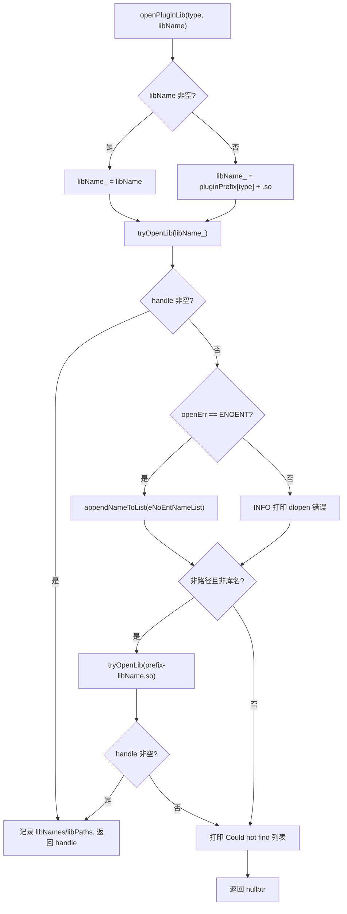
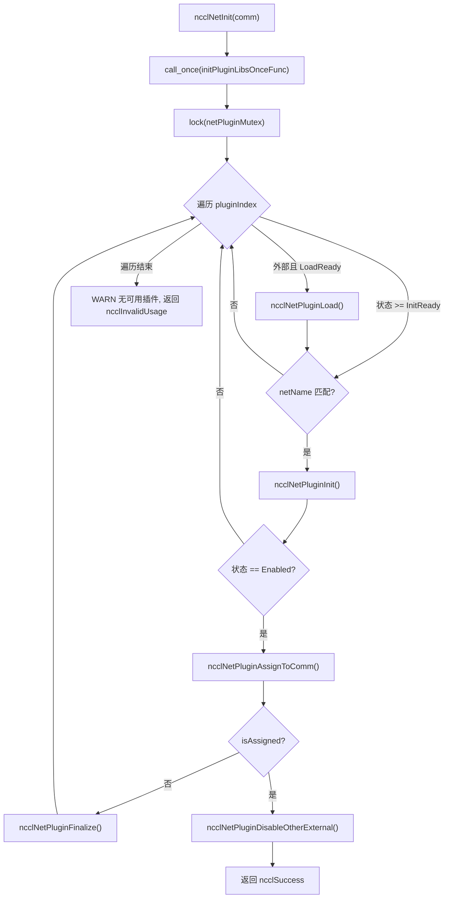
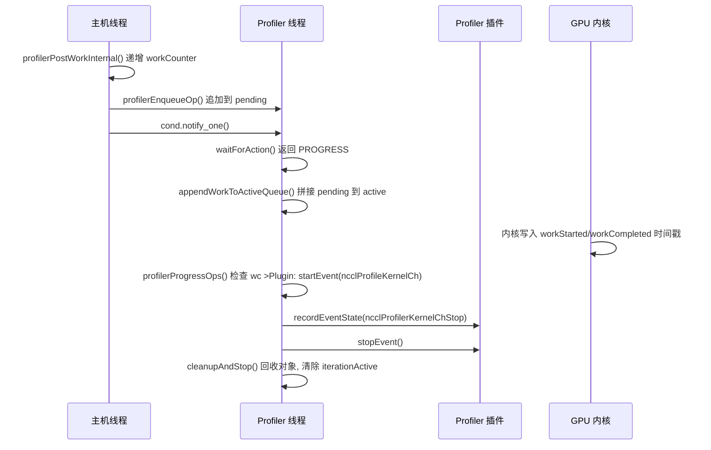

# Глава 16: Экосистема плагинов и переменные окружения: как net, tuner, profiler, env расширяют поведение NCCL

В предыдущей главе мы увидели, как NCCL через RMA и GIN расширяет коммуникационные возможности от коллективных операций до точечного удалённого доступа, позволяя даже GPU напрямую инициировать сетевые запросы. Такая эволюция в сторону нового оборудования и сценариев с низкой задержкой предъявляет более высокие требования к гибкости коммуникационного движка: если для каждой адаптации к новой сети, новой стратегии тюнинга или новому инструменту сбора данных приходилось бы перекомпилировать ядро, NCCL было бы трудно успевать за изменениями экосистемы. В этой главе разбираются каталоги src/plugin и plugins и даётся ответ на ключевой вопрос: как NCCL без перекомпиляции ядра заменяет сетевой бэкенд, стратегию тюнинга, сборщик производительности и источник конфигурации.

# 16.1 Загрузчик плагинов: как plugin_open.cc превращает .so в usable бэкенд

## Интуитивная модель

Представьте`plugin_open.cc`как "кадровое агентство" NCCL: у него есть список вакансий (NET, GIN, RMA, TUNER, PROFILER, ENV), каждой вакансии соответствует имя библиотеки-кандидата. Когда NCCL нужен человек на определённую позицию, агентство в фиксированном порядке идёт на рынок талантов (динамический компоновщик) искать человека, находит — подписывает контракт (`dlopen`), не находит — фиксирует "такого человека нет", и в итоге возвращает дескриптор. Без этого посредника NCCL мог бы только жёстко зашивать сетевой бэкенд в бинарник, и любому производителю сетевых карт для подключения пришлось бы менять исходный код NCCL — именно эту катастрофу и призвана устранить система плагинов.

## Структуры данных и размещение в памяти

Всё состояние загрузчика — это шесть параллельных массивов, индексом служит перечисление типа плагина:

```
static char* libNames[NUM_LIBS];              // 已加载库的名字
char* ncclPluginLibPaths[NUM_LIBS];           // 库的绝对路径
static void* libHandles[NUM_LIBS];            // dlopen 返回的句柄
static const char* pluginNames[NUM_LIBS];     // 日志用的人类可读名
static const char* pluginPrefix[NUM_LIBS];    // 库名前缀
static const char* pluginFallback[NUM_LIBS];  // 找不到时的提示
static unsigned long subsys[NUM_LIBS];        // 日志子系统位掩码
```

Индексы этих семи массивов должны строго соответствовать друг другу,`pluginNames[type]`、`pluginPrefix[type]`、`subsys[type]`описывает один и тот же тип плагина.[FACT:src/plugin/plugin_open.cc:18-29]определяет`NUM_LIBS = 6`, порядок типов —`{"NET", "GIN", "RMA", "TUNER", "PROFILER", "ENV"}`, префикс —`{"libnccl-net", "libnccl-gin", "libnccl-rma", "libnccl-tuner", "libnccl-profiler", "libnccl-env"}`。

> **[Design Inference & Architectural Trade-offs]**
> Здесь используются параллельные массивы, а не массив структур, чтобы`openPluginLib`— эта единственная функция могла обслуживать сразу шесть типов плагинов: тип служит только индексом, логика полностью переиспользуется. Цена — при добавлении нового типа плагина придётся синхронно менять шесть массивов, и компилятор не поможет проверить пропущенное изменение.

`subsys`Массив определяет принадлежность логов: NET/GIN/RMA все привязаны к`NCCL_INIT | NCCL_NET`, TUNER — к`NCCL_INIT | NCCL_TUNING`, PROFILER — только к`NCCL_INIT`, ENV — к`NCCL_INIT | NCCL_ENV`。[FACT:src/plugin/plugin_open.cc:26-29]Так при`NCCL_DEBUG_SUBSYS=NET`будут видны только логи сетевых плагинов, и они не утонут в логах тюнинга.

## Пошаговый разбор: полное путешествие одного`ncclOpenNetPluginLib("mlx5")`вызова

Предположим, пользователь установил`NCCL_NET_PLUGIN=mlx5`, при инициализации NCCL вызывается`ncclOpenNetPluginLib("mlx5")`, который напрямую перенаправляет в`openPluginLib(ncclPluginTypeNet, "mlx5")`。[FACT:src/plugin/plugin_open.cc:132-134]

**Шаг первый: построение имени библиотеки-кандидата.**Поскольку передан непустой`libName`, выполняется ветка`snprintf(libName_, MAX_STR_LEN, "%s", libName)`,`libName_`превращается в`"mlx5"`。[FACT:src/plugin/plugin_open.cc:85-89]Обратите внимание, что в этот момент это ещё не допустимое имя файла библиотеки — нет ни префикса, ни`.so`суффикса.

**Шаг второй: первая попытка открытия.** `tryOpenLib("mlx5", ...)`вызывается.[FACT:src/plugin/plugin_open.cc:91]После входа в`tryOpenLib`сначала проверяется,`name`пусто ли или имеет нулевую длину, затем есть специальная ветка: если имя начинается с`STATIC_PLUGIN`, то`name`устанавливается в`nullptr`。[FACT:src/plugin/plugin_open.cc:37-39]Это страж для плагинов, статически слинкованных в NCCL —`dlopen(nullptr)`в Linux возвращает дескриптор главной программы, что позволяет`dlsym`находить символы плагина в таблице символов главной программы.

Затем вызывается`ncclOsDlopen(name)`。[FACT:src/plugin/plugin_open.cc:41]поскольку`"mlx5"`не является ни путём, ни допустимым именем библиотеки,`dlopen`произойдёт сбой. После сбоя код берёт`ncclOsDlerror()`строку ошибки и выполняет точную проверку: если строка ошибки одновременно содержит`name`и`"No such file or directory"`, то`*err`устанавливается в`ENOENT`。[FACT:src/plugin/plugin_open.cc:42-55]Смысл этой проверки — различить «файл вообще не существует» и «файл существует, но загрузка не удалась» — в первом случае просто неверное имя-кандидат, и следует молча попробовать следующее имя-кандидат; во втором случае это реальная ошибка, и следует записать её в лог.

**Шаг третий: обработка после первой неудачи.**Возвращаемся к`openPluginLib`，`libHandles[type]`пусто, и`openErr == ENOENT`, поэтому`"mlx5"`добавляется к`eNoEntNameList`。[FACT:src/plugin/plugin_open.cc:97-101]Этот список в итоге сложится в строку лога «Could not find: mlx5 libnccl-net-mlx5.so».

**Шаг четвёртый: вторая попытка — добавление префикса.**Код проверяет,`libName`не является ли путь (не содержит`/`) и не является ли именем библиотеки (не начинается с`lib`, не заканчивается на`.so`).[FACT:src/plugin/plugin_open.cc:105-107] `"mlx5"`Условие выполняется, поэтому собирается`"libnccl-net-mlx5.so"`и предпринимается повторная попытка.[FACT:src/plugin/plugin_open.cc:108]На этот раз`dlopen`успешно,`libHandles[type]`присваивается,`libNames[type]`записывается имя библиотеки,`ncclPluginLibPaths[type]`через`getLibPath`получается абсолютный путь, функция возвращает дескриптор.[FACT:src/plugin/plugin_open.cc:110-115]

**Шаг пятый: получение абсолютного пути.** `getLibPath`В Linux с помощью`dlinfo(handle, RTLD_DI_LINKMAP, &lm)`извлекается`link_map`, затем`strdup(lm->l_name)`。[FACT:src/plugin/plugin_open.cc:65-69]Этот путь будет появляться во всех последующих логах, позволяя пользователю сразу увидеть, какой именно файл был загружен — при диагностике в продакшене вопроса «почему загрузился не тот плагин» эта строка лога является первоисточником.

Весь поток принятия решений выглядит так:



## Размышления о дизайне и подводные камни в продакшене

> **[Design Inference & Architectural Trade-offs]**
> **Порядок имён-кандидатов — это приоритет.**Сначала пробуется «голое» имя, заданное пользователем, затем имя с префиксом. Это означает, что если в текущем каталоге случайно окажется файл с именем`mlx5`, он будет загружен в первую очередь — это потенциальная поверхность атаки; в продакшене следует избегать помещения в`LD_LIBRARY_PATH`исполняемых файлов с тем же именем, что и у плагина.

**`STATIC_PLUGIN`Семантика**Когда`NCCL_NET_PLUGIN=STATIC_PLUGIN`,`tryOpenLib`обнуляет имя,`dlopen(nullptr)`открывает главную программу,`dlsym`ищет в таблице символов главной программы такие символы, как`ncclNet_v12`.[FACT:src/plugin/plugin_open.cc:37-39]Это позволяет статически слинковать плагин в бинарник NCCL, избавляя от необходимости развёртывать`.so`, ценой потери возможности замены во время выполнения.

**Подсчёт ссылок и выгрузка.** `ncclClosePluginLib`Только при`libHandles[type] == handle`действительно выполняется`dlclose`, и очищаются путь и имя.[FACT:src/plugin/plugin_open.cc:176-186]Эта проверка на равенство предотвращает ошибочное закрытие уже заменённого дескриптора. Плагины GIN и RMA через`ncclGetGinPluginLib`/`ncclGetNetPluginLib`переиспользуют дескриптор библиотеки NET, реализуя это повторным`dlopen`того же имени библиотеки для увеличения счётчика ссылок.[FACT:src/plugin/plugin_open.cc:156-164]Это семантика подсчёта ссылок`dlopen`— одна и та же библиотека открыта дважды, и требуется`dlclose`дважды, чтобы действительно выгрузить её.

# 16.2 net.cc: конечный автомат и жизненный цикл сетевых плагинов

## Интуитивная модель

`net.cc`— это «диспетчерский центр» сетевых плагинов. Он поддерживает массив библиотек плагинов, каждая из которых имеет собственное состояние (не загружена, ошибка загрузки, ожидает загрузки, ожидает инициализации, включена). Когда рождается новый коммуникационный домен (communicator), диспетчерский центр перебирает все плагины-кандидаты, пытаясь инициализировать их по очереди; первый успешный «назначается» этому коммуникационному домену, а все остальные внешние плагины отключаются. Без этого конечного автомата NCCL не смог бы справиться с такими реальными проблемами, как «плагин загружен, но устройство недоступно», «какой выбрать, когда сосуществуют несколько плагинов», «как безопасно выгрузить при уничтожении коммуникационного домена».

## Структуры данных и размещение в памяти

Основная структура —`netPluginLib_t`：

| Поле | Тип | Значение |
| --- | --- | --- |
| `name` | `char[255]` | Имя библиотеки плагина |
| `dlHandle` | `void*` | Дескриптор dlopen |
| `ncclNet` | `ncclNet_t*` | Таблица сетевых функций |
| `ncclNetVer` | `int` | Номер версии сетевого API |
| `ncclCollNet` | `ncclCollNet_t*` | Таблица функций выгрузки коллективных операций |
| `ncclNetPluginState` | Перечисление | Состояние сетевого плагина |
| `ncclCollNetPluginState` | Перечисление | Состояние плагина CollNet |
| `ncclNetPluginRefCount` | `int` | Счётчик ссылок |
| `netPhysDevs`/`netVirtDevs` | `int` | Число физических/виртуальных устройств |
| `collNetPhysDevs`/`collNetVirtDevs` | `int` | Число устройств CollNet |

[FACT:src/plugin/net.cc:63-76]определяет эти поля. Обратите внимание, что`ncclNet`и`ncclCollNet`— это две отдельные таблицы функций, и состояния — тоже два отдельных перечисления: один плагин может предоставлять сетевые функции, но не предоставлять выгрузку CollNet.

Перечисление состояний имеет пять значений:`Disabled = -2`(ошибка инициализации),`LoadFailed = -1`(ошибка загрузки),`LoadReady = 0`(ожидает загрузки),`InitReady = 1`(загружен, ожидает инициализации),`Enabled = 2`(включён).[FACT:src/plugin/net.cc:54-60]Отрицательные значения обозначают состояния ошибки, так что сравнение вида «состояние >= InitReady» естественно выражает «как минимум загружен».

Глобальное состояние — это три переменные:`pluginCount`хранит общее число плагинов,`netPluginLibs[NCCL_NET_MAX_PLUGINS]`— это массив плагинов,`netPluginMutex`защищает конкурентный доступ,`initPluginLibsOnceFlag`гарантирует, что инициализация выполняется только один раз.[FACT:src/plugin/net.cc:78-81]

## Пошаговый разбор: полное путешествие одного`ncclNetInit(comm)`вызова

**Шаг первый: однократная инициализация.** `std::call_once(initPluginLibsOnceFlag, initPluginLibsOnceFunc)`гарантирует, что список плагинов строится только один раз.[FACT:src/plugin/net.cc:360] `initPluginLibsOnceFunc`Читается переменная окружения`NCCL_NET_PLUGIN`, и если она не задана, по умолчанию добавляется`"libnccl-net.so"`, затем регистрируются два встроенных плагина`ncclNetIb`и`ncclNetSocket`。[FACT:src/plugin/net.cc:288-340]

Разбор переменных окружения использует`strtok_r`с разделением по запятым, поддерживая несколько имён плагинов.[FACT:src/plugin/net.cc:303-324]Есть проверка ёмкости: число внешних плагинов не может превышать`NCCL_NET_MAX_PLUGINS - NCCL_NET_NUM_INTERNAL_PLUGINS`, избыточные игнорируются с записью в лог.[FACT:src/plugin/net.cc:307-311]Встроенных плагинов фиксированно 2 (IB и Socket), поэтому внешних плагинов максимум`NCCL_NET_MAX_PLUGINS - 2`.

**Шаг второй: обход под блокировкой.** `std::lock_guard<std::mutex> lock(netPluginMutex)`защищает весь процесс обхода.[FACT:src/plugin/net.cc:361]Для каждого индекса плагина сначала проверяется, является ли он внешним и находится ли в состоянии`LoadReady`, и если да, вызывается`ncclNetPluginLoad`。[FACT:src/plugin/net.cc:364-367]

**Шаг третий: загрузка плагина.** `ncclNetPluginLoad`Вызывается`ncclOpenNetPluginLib`для получения дескриптора, затем от старшей версии к младшей последовательно пробуются`getNcclNet_v12`до`getNcclNet_v6`, и первая версия, вернувшая непустой результат, принимается.[FACT:src/plugin/net.cc:103-112]Массив версий`ncclNetVersion`и массив указателей на функции`getNcclNet`упорядочены по убыванию, что гарантирует приоритетное использование новейшего API.[FACT:src/plugin/net.cc:41-43]

Если ни одна версия не даёт`ncclNet`, значит эта библиотека не является допустимым сетевым плагином. Тогда проверяется,`NCCL_NET_PLUGIN`задана ли явно: если задана, выводится предупреждение уровня`ATTN`(пользователь явно потребовал, но получил отказ); если не задана, используется`INFO`级别（只是默认尝试失败）。[FACT:src/plugin/net.cc:115-125]Это различие очень важно — если пользователь явно настроил сбой, он должен его увидеть.

**Шаг четвёртый: инициализация плагина.**Возвращаемся к`ncclNetInit`, для состояния`>= InitReady`и с именем, совпадающим с`comm->config.netName`, вызываем у плагина`ncclNetPluginInit`。[FACT:src/plugin/net.cc:369-372] `ncclNetPluginInit`и делаем две вещи: вызываем у плагина функцию`init`для создания контекста коммуникационного домена, а также при первой инициализации вызываем`devices`для определения количества устройств.[FACT:src/plugin/net.cc:186-236]

Обратите внимание на условие вызова`init`:`pluginLib->ncclNetPluginState >= ncclNetPluginStateInitReady`。[FACT:src/plugin/net.cc:190]комментарий явно указывает, что «каждый новый коммуникационный домен должен вызвать init для установки правильного контекста».[FACT:src/plugin/net.cc:189]Но определение устройств выполняется только при`== InitReady`один раз.[FACT:src/plugin/net.cc:201]Это различие — «init вызывается каждый раз, devices только один раз» — является оптимизацией производительности: определение устройств может быть очень медленным, но контекст должен быть независимым для каждого коммуникационного домена.

**Шаг пятый: распределение и отключение.**После успешной инициализации вызывается`ncclNetPluginAssignToComm`, который присваивает`ncclNet`плагина`comm->ncclNet`, увеличивает счётчик ссылок, устанавливает`comm->netPluginIndex`。[FACT:src/plugin/net.cc:238-255], а после успешного распределения немедленно вызывается`ncclNetPluginDisableOtherExternal`для отключения всех остальных внешних плагинов.[FACT:src/plugin/net.cc:377-380]

> **[Design Inference & Architectural Trade-offs]**
> В логике отключения есть ключевое условие: только когда распределённый плагин является внешним плагином (`pluginIndex >= pluginCount - NCCL_NET_NUM_INTERNAL_PLUGINS`), отключаются другие внешние плагины.[FACT:src/plugin/net.cc:257-259]Если распределён встроенный IB-плагин, внешние плагины остаются как есть — это оставляет пространство для выбора в последующих коммуникационных доменах.



## Управление конкурентностью и взаимодействие с оборудованием

`netPluginMutex`защищает все чтения и записи`netPluginLibs`.`ncclNetInit`、`ncclNetFinalize`Все блокируются.[FACT:src/plugin/net.cc:361][FACT:src/plugin/net.cc:411-416]Но`ncclNetGetDevCount`и другие функции в комментариях говорят, что «блокировка не нужна, так как вызывающий уже находится внутри блокировки`ncclTopoGetSystem`».[FACT:src/plugin/net.cc:418-429]Это соглашение «блокировка удерживается верхним уровнем», которое снижает накладные расходы на вложенные блокировки, но ценой является то, что вызывающий должен соблюдать соглашение.

`ncclGpuGdrSupport`демонстрирует прямое взаимодействие плагина с оборудованием: он выделяет 2 МБ GPU-буфера, через`listen`/`connect`/`accept`плагина устанавливает loopback-соединение, затем пытается`regMr`зарегистрировать память GPU.[FACT:src/plugin/net.cc:464-535]Если регистрация успешна, это означает, что сетевая карта поддерживает GPUDirect RDMA. Результат этого зондирования кэшируется в`gdrSupportMatrix[32]`, индексируется по номеру CUDA-устройства.[FACT:src/plugin/net.cc:478-480]

> **[Design Inference & Architectural Trade-offs]**
> Обратите внимание, что`gdrSupportMatrix`является`static`и разделяется между коммуникационными доменами.[FACT:src/plugin/net.cc:478]Это означает, что несколько коммуникационных доменов в одном процессе будут повторно использовать результаты зондирования, избегая повторного дорогостоящего зондирования. Но размер массива жёстко задан как 32, и на машинах с более чем 32 GPU произойдёт выход за границы — это неявное предположение о верхнем пределе.

## Руководство по избеганию проблем в production

**Проблема первая: плагин успешно загружен, но количество устройств равно нулю.** `ncclNetPluginInit`Проверяется`devices(&ndev) != ncclSuccess || ndev <= 0`и происходит переход к ветке отказа.[FACT:src/plugin/net.cc:202]После отказа вызывается`finalize`для очистки уже установленного контекста, количество устройств сбрасывается в`NCCL_UNDEF_DEV_COUNT`, состояние устанавливается в`Disabled`。[FACT:src/plugin/net.cc:229-234]Если не выполнить эту очистку, последующие коммуникационные домены увидят плагин «инициализирован, но без устройств», что приведёт к трудно диагностируемым ошибкам.

> **[Design Inference & Architectural Trade-offs]**
> **Проблема вторая:`init`успешно, но`devices`завершается неудачей.**Код использует флаг`initCompleted`для отслеживания того, был ли`init`успешным.[FACT:src/plugin/net.cc:178-184][FACT:src/plugin/net.cc:198]В ветке отказа только если`initCompleted`истинно, вызывается`finalize`。[FACT:src/plugin/net.cc:230]Это предотвращает вызов`finalize`для неинициализированного контекста — многие плагины в`finalize`не проверяют нулевой указатель, и ошибочный вызов приведёт к краху.

**Проблема третья: счётчик ссылок при уничтожении коммуникационного домена.** `ncclNetPluginFinalize`Сначала вызывается`finalize`плагина, затем уменьшается счётчик ссылок, и наконец, когда счётчик ссылок достигает нуля и плагин является внешним, выгружается библиотека.[FACT:src/plugin/net.cc:342-355] `ncclNetPluginUnload`Проверяется, что`dlHandle`не пуст и счётчик ссылок равен нулю, только тогда действительно`dlclose`。[FACT:src/plugin/net.cc:84-101]После выгрузки поля сбрасываются, но`name`сохраняется для повторного использования при перезагрузке.[FACT:src/plugin/net.cc:84-101]

# 16.3 tuner.cc и profiler.cc: различные контракты стратегических и наблюдательных плагинов

## Интуитивная модель

Плагин Tuner похож на «настройку предпочтений маршрута в навигаторе» — он не меняет то, как едет машина, а только то, какой путь выбрать. Плагин Profiler похож на «видеорегистратор» — он не вмешивается в вождение, а только записывает происходящее. Общее у них то, что оба подключаются через таблицу функций; различие в том, что Tuner — это лёгкий стратегический объект «один экземпляр на коммуникационный домен», а Profiler требует отдельного потока для асинхронного потребления событий, генерируемых GPU.

## tuner.cc: минималистичный глобальный синглтон

Состояние Tuner чрезвычайно простое: один мьютекс, один счётчик ссылок, один дескриптор библиотеки, один указатель на символ, одна переменная состояния.[FACT:src/plugin/tuner.cc:24-37]Нет массива плагинов, нет сосуществования нескольких плагинов — глобально существует только один tuner.

`ncclTunerPluginLoad`Логика такова: «загрузить при первом обращении, повторно использовать в дальнейшем»: если состояние`LoadSuccess`, символ напрямую присваивается`comm->tuner`и счётчик ссылок увеличивается.[FACT:src/plugin/tuner.cc:53-57]Иначе читается переменная окружения`NCCL_TUNER_PLUGIN`, и если она равна`"none"`, происходит немедленный отказ.[FACT:src/plugin/tuner.cc:59-63]

> **[Design Inference & Architectural Trade-offs]**
> Согласование версий идёт от v6 к v2, перебирая по одной.[FACT:src/plugin/tuner.cc:75-87]Обратите внимание, что здесь нет v1 — структура таблицы функций tuner API стала стабильной только начиная с v2.

> **[Design Inference & Architectural Trade-offs]**
> Интересная деталь: если`ncclOpenTunerPluginLib`возвращает пусто, код пытается`ncclGetNetPluginLib(ncclPluginTypeTuner)`。[FACT:src/plugin/tuner.cc:65-70]Это означает, что tuner может быть упакован в библиотеку net-плагина — это снижает сложность развёртывания: один`.so`одновременно предоставляет сетевые функции и функции настройки.

## profiler.cc: поток асинхронного потребления событий

Profiler — самый сложный плагин в этой главе, потому что ему нужно обрабатывать события, асинхронно генерируемые GPU. Основная структура —`ncclProfilerThread`：

| поле | тип | назначение |
| --- | --- | --- |
| `thread` | `std::thread` | поток потребления |
| `mutex` | `std::mutex` | защита очереди |
| `cond` | `condition_variable` | пробуждение при появлении новой работы |
| `condIterationInactive` | `condition_variable` | ожидание завершения итерации |
| `stop` | `int` | флаг остановки |
| `refCount` | `int` | счётчик ссылок коммуникационного домена |
| `cudaDev` | `int` | привязанное CUDA-устройство |
| `abortFlag` | `volatile uint32_t*` | флаг прерывания |
| `iterationActive` | `bool` | идёт ли итерация |
| `pending`/`pendingTail` | связный список | ожидающая обработки работа |
| `active`/`activeTail` | связный список | обрабатываемая работа |
| `opStack`/`opPool` | пул памяти | распределение рабочих объектов |
| `inflight`/`maxInflightSeen`/`maxInflight` | `size_t` | наблюдение обратного давления |
| `droppedOps` | `uint64_t` | счётчик неудачных распределений |

[FACT:src/plugin/profiler.cc:38-69]определяет эту структуру. Обратите внимание, что`pending`и`active`— это два независимых связных списка: производитель добавляет в`pending`, поток потребления под блокировкой присоединяет`pending`к`active`, затем вне блокировки обходит`active`。[FACT:src/plugin/profiler.cc:56-59]

`iterationActive`Флаг является ключом к корректности конкурентности: поток потребления под блокировкой устанавливает`true`, затем освобождает блокировку для вызова callback плагина; поток уничтожения должен дождаться, пока этот флаг вернётся в`false`только тогда можно демонтировать состояние коммуникационного домена.[FACT:src/plugin/profiler.cc:52-55]

## Пошаговый разбор: генерация и потребление одного события KernelCh

**Шаг первый: постановка в очередь на стороне хоста.**Когда план ядра (kernel plan) отправлен,`ncclProfilerPostPlanWork`выполняется обход коллективных задач в плане, и для каждой задачи, у которой включён`ncclProfileKernelCh`, по диапазону каналов вызывается`profilerPostWorkInternal`。[FACT:src/plugin/profiler.cc:1315-1331]

`profilerPostWorkInternal`сначала увеличивается`comm->profiler.workCounter[channelId]`, затем вызывается`profilerEnqueueOp`。[FACT:src/plugin/profiler.cc:1259-1266]Комментарий подчёркивает, что это увеличение должно происходить «ровно один раз на каждый вызов, даже если выделение не удалось», чтобы сохранять синхронизацию с ядром устройства.[FACT:src/plugin/profiler.cc:1259-1266]

**Шаг второй: выделение рабочего объекта.** `profilerEnqueueOp`Под блокировкой из пула памяти выделяется`ncclProfilerWorkOp`, заполняются номер канала, счётчик работы, маска активации, дескриптор события задачи, контекст коммуникационного домена и другие поля.[FACT:src/plugin/profiler.cc:1199-1223]При неудачном выделении увеличивается`droppedOps`и записывается лог, но**не**откатывается`workCounter`— это ключ к сохранению синхронизации с устройством.[FACT:src/plugin/profiler.cc:1202-1207]

После успешного выделения объект добавляется в конец`pending`связанного списка, увеличивается`inflight`, обновляется`maxInflightSeen`, пробуждается поток-потребитель.[FACT:src/plugin/profiler.cc:1225-1239]

**Шаг третий: ожидание потока-потребителя.** `ncclProfilerThreadFunc`В цикле вызывается`waitForAction`。[FACT:src/plugin/profiler.cc:1074-1077] `waitForAction`под блокировкой ожидается условная переменная, пока`pending`или`active`не станет непустым, либо не поступит сигнал остановки/прерывания.[FACT:src/plugin/profiler.cc:1017-1031]

После пробуждения он вызывает`appendWorkToActiveQueue`, чтобы`pending`присоединить к`active`хвосту, устанавливает`iterationActive = true`, возвращает`NCCL_PROFILER_THREAD_PROGRESS`。[FACT:src/plugin/profiler.cc:1017-1031]

**Шаг четвёртый: обработка работы.** `profilerProgressOps`Вне**блокировки**выполняется обход`active`связанного списка.[FACT:src/plugin/profiler.cc:958-999]Для каждого рабочего объекта проверяется, записало ли устройство временную метку запуска:`wc <= op->workStarted[ch].data[slot].counter`。[FACT:src/plugin/profiler.cc:972]Обратите внимание, используется`<=`, а не`==`, потому что устройство циклически перезаписывает`MAX_PROFILER_EVENTS_PER_CHANNEL`слотов, и при отставании хоста устройство могло уже перезаписать этот слот.[FACT:src/plugin/profiler.cc:969-971]

Если условие запуска выполнено, вызывается`ncclProfilerStartKernelChEvent`для уведомления плагина.[FACT:src/plugin/profiler.cc:973]Затем проверяется условие завершения, и если оно выполнено, сначала генерируется событие фазы, а затем вызывается`ncclProfilerStopKernelChEvent`。[FACT:src/plugin/profiler.cc:978-985]

Завершённые рабочие объекты извлекаются из связанного списка и собираются в`recycled`список.[FACT:src/plugin/profiler.cc:987-991]

**Шаг пятый: переработка и публикация.** `cleanupAndStop`Под блокировкой выполняется переработка`recycled`списка, публикуется новый`activeTail`, очищается`iterationActive`и уведомляются ожидающие.[FACT:src/plugin/profiler.cc:1036-1050]



## Управление конкурентностью и обратное давление

`NCCL_PROFILER_DEFAULT_MAX_INFLIGHT`определяется как`MAXCHANNELS * MAX_PROFILER_EVENTS_PER_CHANNEL * 4`。[FACT:src/plugin/profiler.cc:32-32]Это «мягкий предел» — его превышение не блокирует постановку в очередь, а лишь пишет лог.[FACT:src/plugin/profiler.cc:1233-1238]Комментарий поясняет, что постановка в очередь сохраняется, чтобы события KernelCh сопоставлялись с событиями их родительских задач.[FACT:src/plugin/profiler.cc:32-32]

Логирование срабатывает по степеням двойки:`(pt->inflight & (pt->inflight - 1)) == 0`。[FACT:src/plugin/profiler.cc:1233]Это гарантирует, что лог пишется только когда inflight равен 1, 2, 4, 8..., что предотвращает засорение вывода.

Стратегия отката потока-потребителя находится в`updateProgressInterval`: при прогрессе повтор немедленно, при отсутствии прогресса — начиная с 1 микросекунды с удвоением, максимум 10 микросекунд.[FACT:src/plugin/profiler.cc:1054-1057]Этот дизайн балансирует задержку и загрузку CPU.

## Руководство по избежанию проблем в продакшене

**Проблема первая: утечка работы при уничтожении.** `ncclProfilerThreadDestroy`Сначала ожидается, пока`iterationActive`станет ложным, затем вызывается`profilerPurgeByContext`для очистки всей ожидающей работы, ссылающейся на контекст этого коммуникационного домена.[FACT:src/plugin/profiler.cc:1162-1169]Если не выполнить эту очистку, обратный вызов плагина получит указатель на уже уничтоженный контекст, что приведёт к use-after-free.

**Проблема вторая: опустошение при остановке.**Когда получен сигнал остановки, но`active`непуст, возвращается`NCCL_PROFILER_THREAD_CLEANUP_AND_STOP`，`cleanupAndStop`с параметром`drainStuck`равным истине, и вся оставшаяся работа немедленно перерабатывается.[FACT:src/plugin/profiler.cc:1029][FACT:src/plugin/profiler.cc:1036-1050]Комментарий говорит, что ядра этой работы никогда не запустятся, поэтому она просто отбрасывается.[FACT:src/plugin/profiler.cc:1034-1035]

**Проблема третья: привязка к устройству CUDA.**При запуске потока-потребителя вызывается`cudaSetDevice(pt->cudaDev)`。[FACT:src/plugin/profiler.cc:1054-1057]Комментарий поясняет: сам поток только читает закреплённую память хоста, но плагин может выполнять зависящие от контекста вызовы драйвера, поэтому привязка выполняется защитно.[FACT:src/plugin/profiler.cc:1054-1057]При неудачной привязке только пишется лог без прерывания, так как сам поток не зависит от CUDA.[FACT:src/plugin/profiler.cc:1065-1070]

# 16.4 Официальные примеры: ключевые моменты реализации google-fastsocket и google-CoMMA

## Интуитивная модель

Официальные примеры — это «референсная реализация» API плагинов.`google-fastsocket`Показывает, как заменить ядерный TCP пользовательским сетевым стеком;`google-CoMMA`Показывает, как реализовать плагин profiler для сбора метрик производительности коммуникаций. Их существование доказывает, что API плагинов достаточно выразителен для реальных потребностей.

## google-fastsocket: замена сетевого бэкенда

> **[Design Inference & Architectural Trade-offs]**
> FastSocket — это открытый пользовательский сетевой стек от Google, который через`AF_FABRIC`семейство адресов обходит ядерный стек TCP/IP. Как плагин NCCL net, он должен реализовать`ncclNet_t`все функции:`init`、`devices`、`getProperties`、`listen`、`connect`、`accept`、`regMr`、`isend`、`irecv`、`test`、`closeSend`и т.д.

Ключевой момент реализации — возвращаемый`getProperties`:`ptrSupport`: если FastSocket поддерживает GPUDirect RDMA, следует установить`NCCL_PTR_HOST|NCCL_PTR_CUDA`; иначе можно установить только`NCCL_PTR_HOST`, и NCCL перед отправкой скопирует данные GPU в память хоста.[FACT:plugins/net/README.md:245-245]

`connect`и`accept`«неблокирующий» контракт — основная сложность реализации плагина: они должны немедленно вернуть управление, установив`sendComm`/`recvComm`в`NULL`, чтобы NCCL повторял вызов до успеха.[FACT:plugins/net/README.md:299-311]Это требует, чтобы плагин внутри поддерживал конечный автомат соединения, помещая длительное рукопожатие в фон.

## google-CoMMA: реализация плагина profiler

> **[Design Inference & Architectural Trade-offs]**
> CoMMA (Collective Memory Monitoring Agent) — это сборщик метрик производительности коммуникаций от Google. Как плагин profiler, он реализует`ncclProfiler_t`таблицу функций:`init`、`finalize`、`startEvent`、`stopEvent`、`recordEventState`。

`init`Принимает`ncclProfilerEventMask`указатель, плагин через запись в эту маску выбирает, на какие события подписываться.[FACT:src/plugin/profiler.cc:341]Поддерживаемые NCCL типы событий включают Group, Coll, P2p, ProxyOp, ProxyStep, ProxyCtrl, KernelCh, KernelPhase, NetPlugin и другие.[FACT:src/plugin/profiler.cc:285-307]

`startEvent`Возвращает дескриптор события, который впоследствии`stopEvent`и`recordEventState`используют для связывания событий.[FACT:src/plugin/profiler.cc:392][FACT:src/plugin/profiler.cc:400-407]Плагин может использовать дескриптор для хранения собственного состояния, реализации сопоставления событий и подсчёта длительности.

## Размышления о дизайне

**Почему у плагинов net есть согласование версий, а у tuner/profiler — нет?**Поскольку net API затрагивает код на стороне устройства (`ncclNetDeviceHandle`), несоответствие версий приведёт к падению ядра; тогда как tuner/profiler — чисто хостовые, несоответствие версий в худшем случае приведёт к отсутствию функциональности.[FACT:src/plugin/net.cc:153-176]демонстрирует,`ncclNetCheckDeviceVersion`как проверить тип и версию устройства, при несоответствии вернуть`ncclInternalError`。

**Почему profiler требует отдельного потока?**Поскольку callback profiler может блокироваться (например, запись в файл, сетевой запрос), вызов его в хостовом потоке замедлит коммуникацию.[FACT:src/plugin/profiler.cc:950-952]Комментарий явно указывает: "callback плагина может блокироваться, поэтому его нельзя вызывать, удерживая блокировку".

# 16.5 Руководство по избеганию проблем в production и цепочка восстановления после сбоев

## Проблема первая: несоответствие версий плагина приводит к падению ядра

`ncclNetCheckDeviceVersion`Проверить`props.netDeviceType`и`props.netDeviceVersion`。[FACT:src/plugin/net.cc:153-176]Если плагин сообщает`NCCL_NET_DEVICE_UNPACK`версию, несовместимую с`NCCL_NET_DEVICE_UNPACK_VERSION`при компиляции NCCL, вернуть`ncclInternalError`и выдать предупреждение.[FACT:src/plugin/net.cc:153-176]Эта проверка вызывается в`ncclNetPluginAssignToComm`при неудаче плагин не будет назначен коммуникационному домену.[FACT:src/plugin/net.cc:241]

**Цепочка восстановления**: несоответствие версий →`ncclNetCheckDeviceVersion`возвращает ошибку →`ncclNetPluginAssignToComm`возвращает`isAssigned = false` → `ncclNetInit`продолжает попытки со следующим плагином → в итоге может откатиться к встроенному Socket-плагину.

## Проблема вторая: поток profiler не может завершиться

Если плагин profiler блокируется в`stopEvent`потребительский поток застрянет в`profilerProgressOps`,`iterationActive`всегда истинно,`ncclProfilerThreadDestroy`будет ждать вечно.[FACT:src/plugin/profiler.cc:1166]Это реальный риск взаимной блокировки.

> **[Design Inference & Architectural Trade-offs]**
> **Цепочка восстановления**：`comm->abortFlag`установлен →`waitForAction`обнаруживает прерывание → возвращает`CLEANUP_AND_STOP` → `cleanupAndStop`опустошает очередь.[FACT:src/plugin/profiler.cc:1017-1031]Но если поток уже застрял в callback плагина, флаг прерывания не может его прервать — это ответственность реализатора плагина, callback должен иметь таймаут.

## Проблема третья: утечка счётчика ссылок плагина tuner

`ncclTunerPluginLoad`При успехе увеличивает`tunerPluginRefCount`。[FACT:src/plugin/tuner.cc:98] `ncclTunerPluginUnload`при истинности`comm->tunerPluginLoaded`уменьшает.[FACT:src/plugin/tuner.cc:111-123]Если какой-либо коммуникационный домен загрузил tuner, но при уничтожении`tunerPluginLoaded`был случайно обнулён, счётчик ссылок никогда не обнулится, библиотека плагина никогда не выгрузится.

# Вопросы для размышления и самопроверки в этой главе

Q1: Если в`ncclNetPluginLoad`цикл "попыток от старшей версии к младшей" заменить на "попытку только старшей версии", в каком сценарии это приведёт к невозможности загрузки ранее работоспособного плагина?

**Справочный разбор**: Смотреть[FACT:src/plugin/net.cc:108-112]. Цикл перебирает`NCCL_NET_VERSION_COUNT`версий, от v12 до v6, первый вернувший непустой результат принимается. Если пытаться только с v12, то старый плагин, реализующий только v11, не загрузится.

> **[Design Inference & Architectural Trade-offs]**
> Этот дизайн обеспечивает обратную совместимость: после обновления ядра NCCL до поддержки v12 оно всё ещё может загружать плагины, предоставляющие только v11. Авторам плагинов рекомендуется предоставлять символы нескольких версий (см.[FACT:plugins/net/README.md:35-37]), чтобы один и тот же`.so`мог обслуживать несколько версий NCCL.

Если убрать попытки понижения версии, после обновления NCCL у пользователя старые плагины внезапно станут недоступны, придётся откатываться к встроенному Socket-плагину, производительность резко упадёт. Именно в этом смысл согласования версий.

Q2: В`profilerProgressOps`если заменить`wc <= op->workStarted[ch].data[slot].counter`на`wc == op->workStarted[ch].data[slot].counter`, в каком сценарии высокой конкурентности событие никогда не сработает?

**Справочный разбор**: Смотреть[FACT:src/plugin/profiler.cc:969-972]. Комментарий явно указывает, что устройство оборачивается вокруг`MAX_PROFILER_EVENTS_PER_CHANNEL`слотов. Если скорость потребления хостом отстаёт от скорости производства устройством, устройство могло уже счётчиком`wc + N`перезаписать слот`wc % MAX_PROFILER_EVENTS_PER_CHANNEL`。

В этот момент`op->workStarted[ch].data[slot].counter`имеет значение`wc + N`, а`op->workCounter`равно`wc`. Использование`==`для проверки не сработает, событие никогда не сработает, рабочий объект навсегда останется в`active`связном списке,`inflight`только растёт и не уменьшается, в итоге исчерпается пул памяти.

Использование`<=`корректно обработает эту ситуацию: пока счётчик, записанный устройством, не меньше ожидаемого значения, событие считается готовым. Это типичное условие корректности "кольцевого буфера производитель-потребитель".

Q3: Если в`ncclProfilerThreadDestroy`убрать цикл ожидания, пока`iterationActive`станет ложным, в какой временной последовательности это приведёт к тому, что плагин profiler обратится к уже освобождённому контексту коммуникационного домена?

**Справочный разбор**: Смотреть[FACT:src/plugin/profiler.cc:1162-1166]. Комментарий указывает, что`ncclProfilerPluginFinalize`сразу после возврата`ncclProfilerThreadDestroy`уничтожит`profilerContext`。

коммуникационного домена. Потребительский поток в`profilerProgressOps`при вызове callback плагина передаёт`op->profilerContext`。[FACT:src/plugin/profiler.cc:938]Если поток уничтожения не дождётся, пока`iterationActive`станет ложным, и вернётся,`ncclProfilerPluginFinalize`освободит контекст, а потребительский поток может как раз использовать этот контекст для вызова плагина — use-after-free.

`iterationActive`Протокол рукопожатия таков: потребительский поток под блокировкой устанавливает`true`затем отпускает блокировку для вызова плагина, поток уничтожения под блокировкой ждёт его возврата к`false`。[FACT:src/plugin/profiler.cc:1028][FACT:src/plugin/profiler.cc:1054-1057]Этот протокол гарантирует, что во время callback плагина контекст всегда действителен.

После удаления ожидания поток уничтожения может вернуться, как только потребительский поток только что вошёл в callback плагина, что приведёт к получению плагином висячего указателя. Это типичная гонка "жизненный цикл и конкурентный доступ".

Система плагинов превратила NCCL из закрытой в открытую: сетевые бэкенды, стратегии тюнинга, сборщики производительности, источники конфигурации — всё можно заменить без изменения кода ядра. Но плагины также вносят новые поверхности отказов — несоответствие версий, гонки жизненного цикла, утечки счётчика ссылок. В следующей главе мы перейдём к подсистеме RAS и диагностики, чтобы увидеть, как NCCL обнаруживает сбои, отслеживает прогресс и обеспечивает самовосстановление в длительных задачах обучения.

Система плагинов провела чёткую границу между основным коммуникационным путём NCCL и заменяемыми компонентами; четыре типа плагинов — net, tuner, profiler, env — каждый через механизм регистрации и счётчика ссылок безопасно вмешивается в поведение во время выполнения. Но расширяемый коммуникационный движок должен не только гибко заменять компоненты, но и стабильно работать при длительном обучении — когда сетевые карты или GPU выходят из строя, как NCCL обнаруживает, отслеживает и запускает восстановление? В следующей главе мы перейдём к механизмам RAS и диагностики, чтобы увидеть, как систематически обеспечивается надёжность в production-среде.
