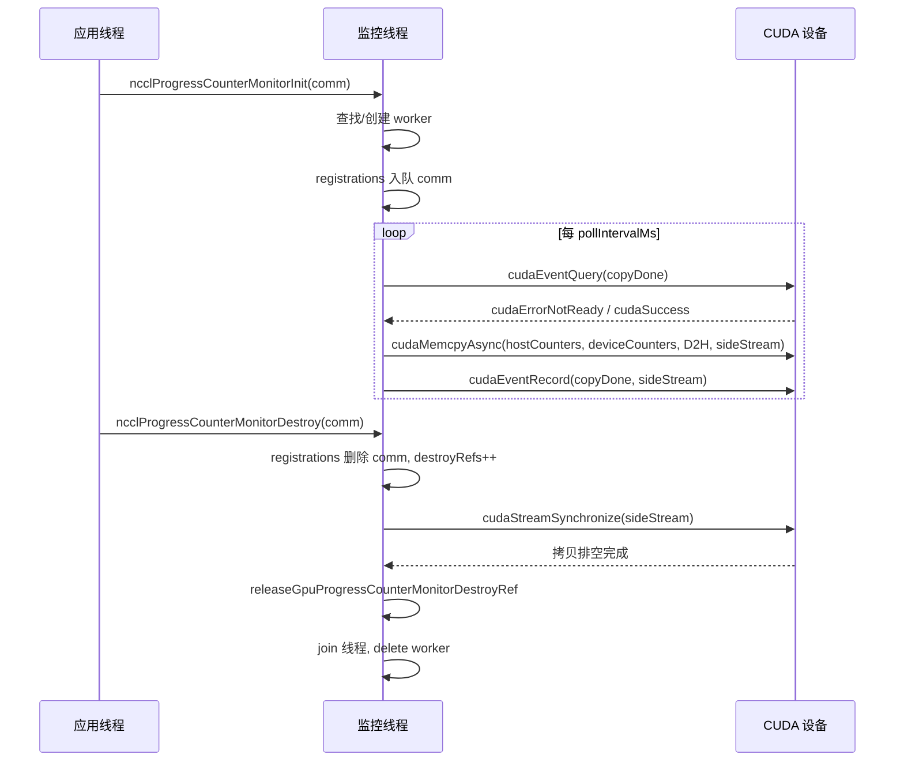
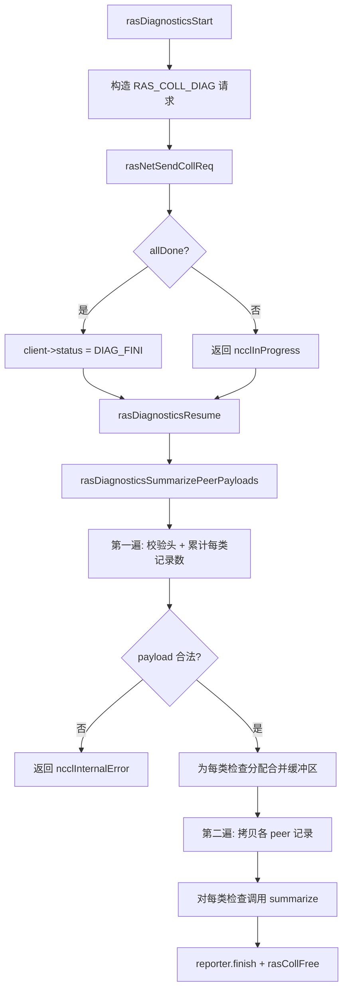

# Глава 17: Механизмы RAS и отказоустойчивость: обнаружение сбоев канала, heartbeat и плавная деградация

В предыдущей главе мы увидели, как система плагинов позволяет провести чёткую границу между основным путём коммуникации и заменяемыми компонентами, что даёт возможность заменять сетевой бэкенд, стратегии настройки и сборщики производительности без изменения основного кода. Но расширяемость — лишь одно из измерений производственной пригодности. Другой, не менее сложный вопрос: когда один AllReduce уже работает 72 часа, а сетевая карта на какой-то машине тихо вышла из строя, на каком основании NCCL может это обнаружить, изолировать и продолжить работу? Подсистема RAS — это именно тот водораздел, который переводит NCCL от «работает» к «пригоден для производства». В этой главе мы разберём устройство механизмов обнаружения сбоев, мониторинга прогресса и самовосстановления.

# 17.1 Общее управление RAS: глобальный координатор с одним потоком RAS на процесс

## Интуитивная модель

Представьте RAS как «дежурную комнату» всего задания. Каждый процесс NCCL (каждый rank) при инициализации открывает свою дежурную комнату, в которой сидит выделенный поток. Все коммуникационные домены (communicator) при создании, уничтожении и диагностических запросах должны сначала зарегистрироваться в дежурной комнате; дежурные комнаты, в свою очередь, через отдельную сеть RAS сообщают друг другу, «кто ещё жив, а кто уже мёртв».

Без этой дежурной комнаты NCCL мог бы полагаться только на тайм-ауты самого пути коммуникации для обнаружения сбоев — но тайм-ауты на пути коммуникации медленны и подвержены ложным срабатываниям (одно сетевое колебание может быть принято за смерть узла). RAS выносит «обнаружение сбоев» с плоскости данных на плоскость управления, используя независимый лёгкий heartbeat и диагностический канал для определения состояния здоровья.

## Структуры данных и размещение в памяти

Ключевое состояние RAS разбросано по глобальным переменным`ras.cc`, разберём их по порядку:

| Переменная | Тип | Назначение |
| --- | --- | --- |
| `rasInitMutex` | `std::mutex` | Защита инициализации синглтона RAS |
| `rasInitialized` | `bool` | Флаг инициализации |
| `rasInitRefCount` | `int` | Счётчик ссылок, равный числу активных comm |
| `rasNetListeningSocket` | `struct ncclSocket` | Слушающий сокет сети RAS |
| `rasNotificationPipe[2]` | `ncclSocketPairDescriptor` | Канал уведомлений от локального потока к потоку RAS |
| `rasPfds` | `struct pollfd*` | Массив poll главного цикла событий |
| `ncclComms` | `struct ncclComm**` | Массив указателей на все коммуникационные домены |

[FACT:src/ras/ras.cc:49-61]определяет эти глобальные состояния. Обратите внимание, что`rasInitRefCount`использует`ncclAtomicRefCountIncrement`для увеличения/уменьшения[FACT:src/ras/ras.cc:129], а`rasInitialized`защищён обычным bool с двойной проверкой блокировки[FACT:src/ras/ras.cc:103-105]— это типичный паттерн «инициализация один раз, далее только чтение».

`ncclComms`Стратегия выделения массива`RAS_INCREMENT * 8`заслуживает внимания: он не растёт по требованию, а каждый раз расширяется на[FACT:src/ras/ras.cc:139-140](то есть на 32 слота)`nullptr`. В массиве допускаются[FACT:src/ras/ras.cc:135-137]。

## пустые ячейки (при уничтожении comm они обнуляются), новый comm повторно использует первую пустую ячейку

**Сценарий пошагового разбора: от инициализации comm до запуска потока RAS`ncclRasCommInit`Шаг первый:**вызывается.[FACT:src/ras/ras.cc:101]Это первая RAS-функция, вызываемая при инициализации каждого comm`rasInitialized`. Сначала она проверяет

, и если не инициализировано, входит в критическую секцию:`rasNetListeningSocket`1. Инициализирует[FACT:src/ras/ras.cc:108-109]

адресом интерфейса bootstrap-сети, порт устанавливается в 0, чтобы ядро назначило случайный[FACT:src/ras/ras.cc:113]

2. Слушает этот сокет[FACT:src/ras/ras.cc:118]

3. Создаёт локальный канал уведомлений[FACT:src/ras/ras.cc:120]

4. Инициализирует диагностическую подсистему`rasThreadMain`5. Запускает поток[FACT:src/ras/ras.cc:121]

6. Регистрирует`atexit(rasTerminate)`для гарантии очистки при завершении процесса[FACT:src/ras/ras.cc:126]

**Шаг второй: регистрация comm.**Независимо от того, первая ли это инициализация, указатель`comm`записывается в массив`ncclComms`, а[FACT:src/ras/ras.cc:142]устанавливается в false`ncclCommsSorted`— поскольку порядок массива изменился, предыдущая сортировка становится недействительной.[FACT:src/ras/ras.cc:143]Шаг третий: обратное заполнение порта.

**В конце функция копирует**(включая назначенный ядром порт) обратно в`rasNetListeningSocket.addr`, чтобы вызывающая сторона знала, на каком порту слушает сеть RAS.`myRank->addr` [FACT:src/ras/ras.cc:146]Главный цикл событий: мультиплексирование на основе poll

## — это сердце потока RAS

`rasThreadMain`. Сначала он регистрирует три фиксированных fd: канал уведомлений, слушающий сокет сети RAS, слушающий сокет клиента[FACT:src/ras/ras.cc:633]. Затем входит в бесконечный цикл:[FACT:src/ras/ras.cc:641-652]Копировать

```
for (int64_t nextWakeup = 0;;) {
  // 计算超时
  timeoutMs = min(..., 1000);
  nEvents = poll(rasPfds, nRasPfds, timeoutMs);
  // 处理事件
  for (pollIdx...) { ... }
  // 处理各类超时
  rasSocksHandleTimeouts(now, &nextWakeup);
  rasConnsHandleTimeouts(now, &nextWakeup);
  rasNetHandleTimeouts(now, &nextWakeup);
  rasCollsHandleTimeouts(now, &nextWakeup);
}
```

[FACT:src/ras/ras.cc:655-728]жёстко ограничен 1000 мс`timeoutMs`— даже если[FACT:src/ras/ras.cc:664]очень далеко, нужно просыпаться раз в секунду, чтобы обеспечить своевременность проверки тайм-аутов.`nextWakeup`Логика диспетчеризации событий использует значение fd для маршрутизации

: если это канал уведомлений, вызывается[FACT:src/ras/ras.cc:684-715]; если слушающий сокет — accept; иначе выполняется обход`rasLocalHandle`и`rasSocketsHead`списков для поиска соответствующего socket и его обработки.`rasClientsHead`Механизм локальных уведомлений: pipe + структура фиксированной длины

## Локальный поток NCCL и поток RAS общаются через socketpair. Структура уведомления

имеет фиксированную длину`rasNotification`и использует[FACT:src/ras/ras.cc:35-46]для гарантии, что она не превышает`static_assert`— это необходимо для обеспечения атомарности записи (POSIX гарантирует атомарность записей меньше PIPE_BUF).`PIPE_BUF` [FACT:src/ras/ras.cc:47]Отправитель

использует`rasLocalNotify`для сериализации записей от нескольких пользовательских потоков`rasNotificationMutex`, затем выполняет запись в цикле до полного завершения[FACT:src/ras/ras.cc:224-237]. Получатель[FACT:src/ras/ras.cc:224-237]также читает в цикле до заполнения всей структуры`rasLocalHandle`, при чтении EOF возвращает[FACT:src/ras/ras.cc:247-256]Три типа уведомлений:`ncclSystemError` [FACT:src/ras/ras.cc:251-253]。

(новый rank присоединился),`RAS_ADD_RANKS`(запуск диагностики),`RAS_RUN_DIAG`(завершение)`RAS_TERMINATE`Приём и передача сообщений: префикс длины + инкрементальный прогресс[FACT:src/ras/ras.cc:28-32]。

## Проводной формат сообщений RAS — «4 байта длины + тело сообщения»

. При отправке[FACT:src/ras/ras_internal.h:110-117]сначала отправляет длину, затем тело сообщения`rasConnSendMsg`, используя[FACT:src/ras/ras.cc:362-390]для отслеживания прогресса, что поддерживает продолжение с места частичной отправки при следующем вызове. При приёме`meta->offset`сначала принимает длину, выделяет буфер по длине, затем принимает тело сообщения`rasMsgRecv`Здесь есть деталь:[FACT:src/ras/ras.cc:393-412]。

выделяет структуру`rasMsgAlloc`, поле`rasMsgMeta`находится в конце структуры, смещение вычисляется через`msg`. При освобождении смещение вычисляется в обратном порядке`offsetof` 计算偏移 [FACT:src/ras/ras.cc:313-319]。释放时反向计算 [FACT:src/ras/ras.cc:323-328]. Такая компоновка с «вынесением метаданных вперёд» позволяет сообщению нести локальную информацию — прогресс отправки, время постановки в очередь и т. п., — не занимая место в линейном формате.

## Проектные соображения

> **[Design Inference & Architectural Trade-offs]**
> **Почему используется poll, а не epoll?**Сложность O(n) у poll приемлема в сценарии RAS — число RAS-соединений намного меньше числа соединений плоскости данных, а сам поток RAS не является критическим путём производительности. К тому же poll лучше переносим между платформами (совместимость с Windows).

> **[Design Inference & Architectural Trade-offs]**
> **Почему для уведомления используется канал, а не условная переменная?**Канал бесшовно интегрируется в цикл poll, позволяя потоку RAS использовать единый`poll`ожидание всех источников событий. Если бы использовалась условная переменная, потребовался бы дополнительный механизм для пробуждения poll.

```mermaid
flowchart TD
    start["rasThreadMain 启动"] --> reg_pipe["注册通知管道 fd"]
    reg_pipe --> reg_net["注册 RAS 网络监听 fd"]
    reg_net --> reg_client["注册客户端监听 fd"]
    reg_client --> poll["poll(rasPfds, timeout check{"nEvents == -1?"}
    check -->|"是且非 EINTR"| log_err["记录 poll 错误并继续"]
    check -->|"否"| dispatch["遍历 revents 分发事件"]
    log_err --> dispatch
    dispatch --> is_pipe{"fd == 通知管道?"}
    is_pipe -->|"是"| local_handle["rasLocalHandle()"]
    is_pipe -->|"否"| is_net{"fd == RAS 监听?"}
    is_net -->|"是"| accept_net["rasNetAcceptNewSocket()"]
    is_net -->|"否"| is_client{"fd == 客户端监听?"}
    is_client -->|"是"| accept_client["rasClientAcceptNewSocket()"]
    is_client -->|"否"| find_sock["遍历 rasSocketsHead 找匹配 socket"]
    find_sock --> sock_loop["rasSockEventLoop(sock, pollIdx)"]
    local_handle --> terminate{"terminate?"}
    terminate -->|"是"| cleanup["rasThreadCleanup() 并退出"]
    terminate -->|"否"| timeouts
    sock_loop --> timeouts["rasSocksHandleTimeouts / rasConnsHandleTimeouts / rasNetHandleTimeouts / rasCollsHandleTimeouts"]
    accept_net --> timeouts
    accept_client --> timeouts
    timeouts --> poll
```

# 17.2 Мониторинг прогресса: перенос счётчиков GPU на хост с помощью DMA

## Интуитивная модель

Мониторинг прогресса похож на «тахометр» на приборной панели автомобиля. Он не участвует в управлении (не участвует в коммуникации), но постоянно копирует внутренние счётчики прогресса GPU в память хоста, позволяя хосту определить, «застрял ли этот домен коммуникации». Без него при зависании AllReduce вы увидите лишь «программа не возвращает управление», но не узнаете, вычисляет ли GPU, ждёт ли сеть или это полный дедлок.

## Структуры данных и компоновка памяти

Каждому устройству CUDA соответствует один`ncclGpuProgressCounterMonitor`рабочий поток[FACT:src/ras/progress_monitor.cc:35-52]：

| Поле | Тип | Назначение |
| --- | --- | --- |
| `cudaDev` | `int` | Привязанный номер устройства CUDA |
| `thread` | `std::thread` | Рабочий поток |
| `mutex` / `cv` | `std::mutex` / `condition_variable` | Защита изменяемого состояния и пробуждение |
| `running` / `shouldStop` | `bool` | Флаг жизненного цикла потока |
| `copyInFlight` | `bool` | Есть ли DMA-копирование в процессе |
| `copyStallWarned` | `bool` | Был ли уже сигнал о текущем зависании |
| `copyStartNs` | `uint64_t` | Время начала текущего копирования |
| `sideStream` | `cudaStream_t` | Выделенный неблокирующий поток |
| `copyDone` | `cudaEvent_t` | Событие завершения копирования |
| `warningMutex` | `std::mutex` | Защита временной метки оповещения |
| `lastStaleWarnNs` / `lastErrorWarnNs` | `uint64_t` | Временная метка ограничения частоты |
| `destroyRefs` | `int` | Счётчик ссылок для уничтожения |
| `registrations` | Интрузивная очередь | Список comm, зарегистрированных для данного устройства |

[FACT:src/ras/progress_monitor.cc:59-62]Определён порядок блокировок:`gpuProgressCounterMonitorsMu`предшествует`ncclGpuProgressCounterMonitor::mutex`. Это ключевое соглашение для избежания дедлоков.

Глобальный массив`gpuProgressCounterMonitors[kRasMaxCudaDevices]`индексируется по номеру устройства[FACT:src/ras/progress_monitor.cc:59-62]。

## Пошаговый разбор на сценарии: одно копирование счётчика

**Шаг первый: регистрация.** `ncclProgressCounterMonitorInit`вызывается[FACT:src/ras/progress_monitor.cc:319]. Если`deviceCountersBlock`пуст, сразу возвращаемся (данный comm не участвует в мониторинге)[FACT:src/ras/progress_monitor.cc:323]. Иначе под глобальной блокировкой ищем или создаём worker для этого устройства[FACT:src/ras/progress_monitor.cc:328-335], затем ставим comm в очередь`registrations` [FACT:src/ras/progress_monitor.cc:339]。

**Шаг второй: запуск рабочего потока.** `createGpuProgressCounterMonitor`создаёт worker, устанавливает`cudaSetDevice`, создаёт`sideStream`（`cudaStreamNonBlocking`) и`copyDone`событие[FACT:src/ras/progress_monitor.cc:280-282], после запуска потока ждёт не более 2000 мс подтверждения, что`running`стало true[FACT:src/ras/progress_monitor.cc:287-303]。

**Шаг третий: циклическое копирование.** `progressCounterMonitorLoop`Сначала привязываем устройство, устанавливаем режим relaxed для захвата потока (чтобы не мешать graph capture приложения)[FACT:src/ras/progress_monitor.cc:97-121], затем входим в основной цикл:

1. Ожидание`pollIntervalMs`(по умолчанию 1000 мс)[FACT:src/ras/progress_monitor.cc:132-136]

2. Если предыдущее копирование ещё в процессе, с помощью`cudaEventQuery`проверяем[FACT:src/ras/progress_monitor.cc:140]. Если`cudaErrorNotReady`и превышен порог stale (по умолчанию 5000 мс), выдаём оповещение с ограничением частоты[FACT:src/ras/progress_monitor.cc:141-154]

3. Обходим все зарегистрированные comm, для каждого вызываем`cudaMemcpyAsync`копируя`deviceCountersBlock`в`hostCountersBlock` [FACT:src/ras/progress_monitor.cc:170-185]

4. Если хоть одно копирование успешно, записываем`copyDone`событие и устанавливаем`copyInFlight` [FACT:src/ras/progress_monitor.cc:194-202]

## Управление параллелизмом и ограничение частоты

Ограничение частоты оповещений реализуется через`progressCounterMonitorShouldWarn`[FACT:src/ras/progress_monitor.cc:78-87]: под защитой`warningMutex`проверяется, превышает ли время с последнего оповещения`warnIntervalNs`, и только тогда обновляется и возвращается true. По умолчанию`staleWarnSec`равно 600 секундам[FACT:src/ras/progress_monitor.cc:27], то есть одно оповещение данного типа не чаще раза в 10 минут.

Параметры имеют нижнюю границу: минимальный интервал poll — 50 мс[FACT:src/ras/progress_monitor.cc:29], минимальный порог stale — 1000 мс[FACT:src/ras/progress_monitor.cc:30]. Это предотвращает холостое вращение CPU из-за слишком агрессивных настроек пользователя.

## Уничтожение: подсчёт ссылок + синхронизация потока

`ncclProgressCounterMonitorDestroy`Логика уничтожения — один из самых изящных примеров параллельного проектирования в этой главе[FACT:src/ras/progress_monitor.cc:352-354]：

1. Под глобальной блокировкой + блокировкой worker удаляем comm из`registrations`[FACT:src/ras/progress_monitor.cc:368]

2. Если удаление успешно,`destroyRefs++`и устанавливаем`haveDestroyRef` [FACT:src/ras/progress_monitor.cc:371-372]

3. Если список регистраций опустел, удаляем из глобального массива и устанавливаем`shouldStop` [FACT:src/ras/progress_monitor.cc:373-376]

4. После освобождения блокировки`cudaStreamSynchronize(g->sideStream)`опустошаем возможные копирования, всё ещё ссылающиеся на буфер данного comm[FACT:src/ras/progress_monitor.cc:393]

5. Наконец`releaseGpuProgressCounterMonitorDestroyRef`уменьшаем счётчик ссылок; когда он достигает нуля и очередь пуста, присоединяем поток и удаляем[FACT:src/ras/progress_monitor.cc:219-246]

> **[Design Inference & Architectural Trade-offs]**
> **Почему нужен`destroyRefs`？**Потому что`cudaStreamSynchronize`выполняется вне блокировки, и в это время другой поток может также уничтожать тот же worker. Подсчёт ссылок гарантирует, что только последний уничтожающий действительно выполнит join и delete.



## Производственные подводные камни

**Камень 1:`cudaSetDevice`сбой приводит к молчаливому отказу мониторинга.**Если при запуске потока`cudaSetDevice`завершается неудачей, worker устанавливает`shouldStop`и выходит[FACT:src/ras/progress_monitor.cc:97-107], но зарегистрировавший его comm по-прежнему считает, что мониторинг работает. В этом случае зеркала счётчиков останутся устаревшими до тех пор, пока сбой не проявится на этапе Init. При диагностике следует проверить, есть ли в логах`NCCL_RAS`сообщение "progress-counter mirrors will remain stale".

**Камень 2: конфликт с graph capture.**Если поток мониторинга вызывает CUDA API, когда приложение выполняет stream capture, это загрязнит захватываемый граф. В коде используется`cudaThreadExchangeStreamCaptureMode(cudaStreamCaptureModeRelaxed)`для обхода[FACT:src/ras/progress_monitor.cc:110-111], это необходимая защита.

# 17.3 Фреймворк диагностики: таблично-управляемая диспетчеризация проверок

## Интуитивная модель

Фреймворк диагностики похож на «комплексный медосмотр» в больнице. Каждая проверка (модель GPU, состояние ECC, здоровье NVLink, ошибки XID и т. д.) — это отдельное «отделение», а фреймворк собирает результаты проверок со всех rank и сводит их в один отчёт. Без него эксплуатация могла бы только вручную перебирать машины через`nvidia-smi`, что совершенно неосуществимо на кластере из тысячи GPU.

## Структура данных: таблица диспетчеризации проверок

В основе лежит статическая таблица диспетчеризации`rasDiagnosticsChecks` [FACT:src/ras/diagnostics.cc:63-77], каждая запись которой привязывает ID проверки и два колбэка:`collectLocal`(локальный сбор) и`summarize`(сводка). Всего 11 проверок: модель GPU, версия драйвера CUDA, ECC, NVLink, окружение NCCL, топология RDMA, режим IOMMU, ATS, XID/SXID, версия драйвера NVIDIA, путь.

`rasDiagnosticsGetCheck`Выполняется тройная проверка: диапазон ID, соответствие ID записи, ненулевой указатель обратного вызова[FACT:src/ras/diagnostics.cc:104-128]. Это защитное программирование — предотвращает вызов нулевого указателя из-за ошибочного изменения записи.

## Сценарно-ориентированный разбор: полный жизненный цикл одной диагностики

**Шаг первый: построение локальной полезной нагрузки.** `rasDiagnosticsCollectLocalPeerPayload`Сначала записывается заголовок peer[FACT:src/ras/diagnostics.cc:226-227], затем выполняется обход таблицы диспетчеризации, для каждой записи вызывается`rasDiagnosticsAppendCheckPayload` [FACT:src/ras/diagnostics.cc:229-231]。

`rasDiagnosticsAppendCheckPayload`Вызов`collectLocal`Получение`rasDiagnosticsLocalData`, с помощью`ncclUniquePtr`Захват владения records[FACT:src/ras/diagnostics.cc:191-192], проверка метаданных[FACT:src/ras/diagnostics.cc:193], если число записей равно 0, пропуск[FACT:src/ras/diagnostics.cc:194], иначе запись заголовка проверки + данных записей[FACT:src/ras/diagnostics.cc:196-201]。

**Шаг второй: инициирование коллективной коммуникации.** `rasDiagnosticsStart`Построение`RAS_COLL_DIAG`Запрос[FACT:src/ras/diagnostics.cc:532-537], через`rasNetSendCollReq`Отправка[FACT:src/ras/diagnostics.cc:539], состояние клиента устанавливается в`RAS_CLIENT_DIAG_FINI` [FACT:src/ras/diagnostics.cc:541]。

**Шаг третий: объединение ответов.** `rasCollDiagMerge`Полезные нагрузки каждого peer добавляются в коллективный буфер[FACT:src/ras/diagnostics.cc:310-337]. Обратите внимание на множество проверок переполнения: верхний предел числа peer[FACT:src/ras/diagnostics.cc:320-324], верхний предел общего размера[FACT:src/ras/diagnostics.cc:325-328]。

**Шаг четвёртый: сводка.** `rasDiagnosticsSummarizePeerPayloads`Представляет собой двухпроходное сканирование[FACT:src/ras/diagnostics.cc:399]：

- Первый проход: проверка заголовка каждого peer и заголовка проверки, накопление числа записей и байтов для каждого типа проверки[FACT:src/ras/diagnostics.cc:418-470]
- Выделение объединённого буфера для каждого типа проверки[FACT:src/ras/diagnostics.cc:472-476]
- Второй проход: копирование записей каждого peer в соответствующий буфер[FACT:src/ras/diagnostics.cc:479-497]
- Наконец, для каждого типа проверки вызывается`summarize` [FACT:src/ras/diagnostics.cc:499-506]

## Состояние клиента и отмена

Состояние диагностики хранится в`rasDiagnosticsClientState`внутри[FACT:src/ras/diagnostics.cc:242-245], привязано к`rasClient->diagnostics`.`rasDiagnosticsCancelTarget`При закрытии сокета клиента reporter заменяется на noop[FACT:src/ras/diagnostics.cc:286-293], чтобы предотвратить запись в уже закрытый сокет после завершения асинхронной диагностики[FACT:src/ras/diagnostics.cc:48-52]。

## Размышления о дизайне

> **[Design Inference & Architectural Trade-offs]**
> **Почему используется двухпроходное сканирование?**Поскольку полезная нагрузка имеет переменную длину, только первый проход позволяет вычислить, какой размер буфера необходим для каждого типа проверки. Однопроходное сканирование либо требует динамического роста (множественные realloc), либо избыточного предварительного выделения. Двухпроходное сканирование обеспечивает детерминированность за счёт одной точной аллокации.

**Почему в заголовке проверки присутствует`recordStride`？** [FACT:src/ras/diagnostics.cc:197]Поскольку структуры записей разных проверок имеют разный размер, при сводке необходимо знать шаг для корректного копирования и проверки.`rasDiagnosticsAccountCheckRecords`Принудительное обеспечение единообразия stride для одной проверки[FACT:src/ras/diagnostics.cc:381-385]。



# 17.4 Управление пирами: сортированный массив + хеш-синхронизация

## Интуитивная модель

`peers.cc`Поддерживается «список всего класса». Каждый поток RAS хранит полностью идентичный список, содержащий адрес, PID и управляемые GPU каждого процесса NCCL. Когда присоединяется новый участник или кто-то «теряет связь», изменения широковещательно рассылаются по сети RAS. Список использует хеш-значение в качестве версии, что позволяет избежать полной синхронизации каждый раз.

## Структуры данных и компоновка памяти

Два основных массива:

- `rasPeers`: все известные peer, отсортированные по адресу[FACT:src/ras/peers.cc:18-19]. Включает мёртвые peer.
- `rasDeadPeers`: адреса мёртвых peer, хранятся отдельно[FACT:src/ras/peers.cc:37-38]。

**Почему мёртвые peer хранятся отдельно?** [FACT:src/ras/peers.cc:25-28]Комментарий в объясняет это достаточно ясно:`rasPeers`В крупном масштабе практически статичен и очень велик, тогда как`rasDeadPeers`динамичен и гораздо меньше. Раздельное хранение позволяет избежать передачи огромного массива при каждой синхронизации.`rasPeers`Структура

`rasPeerInfo`Поле[FACT:src/ras/ras_internal.h:110-117]：

| Тип | Описание | Сетевой адрес (ключ сортировки) |
| --- | --- | --- |
| `addr` | `ncclSocketAddress` | Идентификатор процесса |
| `pid` | `ncclPid_t` | Битовая маска устройств CUDA (подвержена влиянию CUDA_VISIBLE_DEVICES) |
| `cudaDevs` | `uint64_t` | Битовая маска устройств NVML (не подвержена влиянию) |
| `nvmlDevs` | `uint64_t` | Извлекается из comm, вычитается commHash для независимости от коммуникационного домена |
| `hostHash` / `pidHash` | `uint64_t` | Два хеша |

и`rasPeersHash`являются ядром синхронизации`rasDeadPeersHash`Сценарно-ориентированный разбор: присоединение нового rank[FACT:src/ras/peers.cc:21][FACT:src/ras/peers.cc:37-38]。

## Шаг первый: преобразование.

**Преобразование массива** `rasRanksConvertToPeers`в`rasRankInit`. Сначала сортировка по адресу + cudaDev`rasPeerInfo` [FACT:src/ras/peers.cc:104], пропуск пустых адресов[FACT:src/ras/peers.cc:114], объединение многопроцессных GPU с одинаковым адресом (побитовое OR масок)[FACT:src/ras/peers.cc:127-130]Шаг второй: обновление локального массива.[FACT:src/ras/peers.cc:134-139]。

**Представляет собой самый сложный алгоритм слияния в этой главе** `rasPeersUpdate`. Сначала вычисляется размер нового массива[FACT:src/ras/peers.cc:197], затем выполняется слияние двух отсортированных массивов[FACT:src/ras/peers.cc:202-229]. Ключевой момент: в процессе слияния[FACT:src/ras/peers.cc:244-361]преобразуется в «разность» — сохраняются только действительно новые биты GPU`rankPeers`, в конце удаляются записи, не вносящие вклада[FACT:src/ras/peers.cc:301-308]. Таким образом объём широковещательных данных минимизируется.[FACT:src/ras/peers.cc:393-402]Шаг третий: распространение.

**Распространение вдоль** `rasNetUpdatePeers`и`rasNextLink`двух направлений`rasPrevLink`, затем перестроение соединений[FACT:src/ras/peers.cc:430-450]Шаг четвёртый: отправка обновления.[FACT:src/ras/peers.cc:443-444]。

**Сначала проверяется хеш** `rasConnSendPeersUpdate`: если удалённая сторона уже знает текущий хеш, пропуск. В сообщении передаются[FACT:src/ras/peers.cc:500-508]и`peersHash`, если после объединения на принимающей стороне хеш всё ещё не совпадает, выполняется обратная отправка`deadPeersHash` [FACT:src/ras/peers.cc:521-524]Объявление и распространение мёртвых peer[FACT:src/ras/peers.cc:608-653]。

## Добавление адреса в

`rasPeerDeclareDead`, после сортировки пересчёт хеша`rasDeadPeers`Обработка широковещательного сообщения о мёртвом peer[FACT:src/ras/peers.cc:793-812]。`rasMsgHandleBCDeadPeer`: если локально неизвестен, разрыв соединения и объявление смерти, иначе пометка[FACT:src/ras/ras.cc:578-591]Прекращение повторной широковещательной рассылки.`*pDone = true`Слияние старого и нового списков мёртвых peer с помощью сортировки слиянием

`rasDeadPeersUpdate`. Обратите внимание на использование[FACT:src/ras/peers.cc:838-893]вместо`memmove`, поскольку источник и назначение могут перекрываться.`memcpy` [FACT:src/ras/peers.cc:855]Перестроение соединений: избежание гонки дублирующихся подключений

## Перестроение канальных соединений после обновления peer

`rasLinkReinitConns`. Ключевая стратегия: инициирование соединения со стороны с меньшим адресом[FACT:src/ras/peers.cc:680], что предотвращает одновременное инициирование с обеих сторон и дублирование.[FACT:src/ras/peers.cc:706-711]Вычисление индекса следующего peer с пропуском мёртвых peer

`rasLinkCalculatePeer`. Для fallback также есть дополнительная оптимизация: пропуск peer, находящихся на том же узле, что и предыдущий fallback[FACT:src/ras/peers.cc:743-785], что позволяет избежать ожидания по одному при отказе целого узла.[FACT:src/ras/peers.cc:743-785]Производственные подводные камни

## Подводный камень 1: ловушка порядка байтов при сравнении адресов.

**Сортировка по семейству адресов → адресу → порту** `ncclSocketsCompare`. В комментарии указано, что нельзя просто выполнить[FACT:src/ras/peers.cc:960-990]для всей структуры, поскольку порядок расположения в памяти отличается от ожидаемого порядка сортировки`memcmp`. IPv4-адрес и порт в сетевом порядке байтов можно сравнивать побайтово, но поле семейства адресов — нет.[FACT:src/ras/peers.cc:957-959]

**Проблема 2:`myPeerIdx`не работает.**При росте массива`myPeerIdx`изменится[FACT:src/ras/peers.cc:22-23]。`rasPeersUpdate`синхронно обновлять его в процессе слияния[FACT:src/ras/peers.cc:312][FACT:src/ras/peers.cc:358], если обновление не удалось, откатиться к бинарному поиску[FACT:src/ras/peers.cc:374-388]。

> **[Design Inference & Architectural Trade-offs]**
> **Проблема 3: хеш-коллизии приводят к пропуску синхронизации.**Хеш используется только для определения "нужна ли синхронизация", а не для корректности . Даже если хеш-коллизия приведёт к пропуску синхронизации, последующий обмен keep-alive всё равно будет содержать хеш, и в конечном итоге произойдёт сходимость.

```mermaid
flowchart LR
    subgraph 输入
        ranks["rasRankInit[]"]
    end
    subgraph 转换
        convert["rasRanksConvertToPeers: 排序+合并同地址"]
        rankPeers["rasPeerInfo[] (rankPeers)"]
    end
    subgraph 合并
        update["rasPeersUpdate: 归并到 rasPeers"]
        diff["rankPeers 改造为差异"]
        hash["重算 rasPeersHash"]
    end
    subgraph 传播
        send["rasConnSendPeersUpdate: 带哈希"]
        recv["rasMsgHandlePeersUpdate: 合并+回发"]
        reinit["rasLinkReinitConns: 重建连接"]
    end
    ranks --> convert --> rankPeers --> update
    update --> diff --> hash
    hash --> send --> recv --> reinit
```



# 17.5 Размышления о дизайне: граница между RAS и основным коммуникационным путём

Самое ключевое проектное решение подсистемы RAS —**полная развязка с плоскостью данных**. Потоки RAS не участвуют в перемещении данных коллективных коммуникаций, они занимаются только тремя вещами: поддержанием списка peer'ов, проверкой здоровья соединений и выполнением диагностики. Такая развязка даёт несколько преимуществ:

1. **Изоляция сбоев**: падение потока RAS не приведёт напрямую к сбою коммуникации (хотя и потеряется способность обнаружения сбоев)

2. **Отсутствие потерь производительности**: heartbeat и трафик синхронизации RAS идут по отдельной сети, не занимая пропускную способность плоскости данных

3. **Наблюдаемость**: диагностика и мониторинг могут выполняться параллельно с коммуникацией

Цена —**согласованность состояния**: состояние comm, видимое RAS, может отставать от плоскости данных.`ncclRasCommInit`и`ncclRasCommFini`через`ncclCommsMutex`защищают[FACT:src/ras/ras.cc:77-77], но поток RAS при чтении делает только снимок, без гарантий строгой согласованности.

Ещё одно ключевое проектное решение —**многоуровневые таймауты**。`ras_internal.h`определяет целый набор констант таймаутов[FACT:src/ras/ras_internal.h:214-249]: интервал keep-alive 1 секунда, порог предупреждения 5 секунд, порог ошибки 20 секунд, порог смерти peer'а 60 секунд. Такая многоуровневость позволяет системе предпринимать разные действия при разной степени серьёзности — сначала предупредить, затем попытаться использовать резервное соединение, и только в конце объявить о смерти.

# 17.6 Краткое содержание главы

В этой главе разобраны четыре ключевых модуля подсистемы NCCL RAS:

- **`ras.cc`**: одноэлементный поток RAS + цикл событий poll, приём локальных уведомлений через канал, обмен сообщениями с другими rank'ами через отдельную сеть
- **`progress_monitor.cc`**: по одному рабочему потоку на устройство, перенос счётчиков прогресса GPU на хост через DMA, с предупреждениями об ограничении скорости и уничтожением по подсчёту ссылок
- **`diagnostics.cc`**: управляемая таблицей структура диспетчеризации проверок, двухпроходное сканирование для агрегации диагностических payload'ов от каждого rank'а
- **`peers.cc`**: управление списком peer'ов через отсортированный массив + хеш-синхронизацию, мёртвые peer'ы хранятся отдельно для экономии пропускной способности

# Вопросы для размышления и самопроверки по главе

Q1：`rasLocalNotify`записывает через`rasNotificationMutex`сериализованно, но`rasLocalHandle`при чтении нет соответствующей блокировки. Почему это безопасно? Если убрать`static_assert(sizeof(struct rasNotification) <= PIPE_BUF)`, в каких сценариях возникнут проблемы?

**Эталонный разбор**: безопасность обеспечивается гарантией атомарности записи в канал в POSIX — запись размером меньше`PIPE_BUF`атомарна[FACT:src/ras/ras.cc:47]。`rasLocalNotify`циклическая запись[FACT:src/ras/ras.cc:224-237]при выполнении за одну операцию записи не будет чередоваться с другими записями.`rasLocalHandle`циклическое чтение[FACT:src/ras/ras.cc:247-256]может прочитать частичные данные, но поскольку запись атомарна, прочитанное обязательно будет префиксом полного сообщения, и при следующем чтении достаточно дополнить.

После удаления`static_assert`, если`rasNotification`превышает`PIPE_BUF`, запись может быть разбита на несколько неатомарных операций. При конкурентной записи двух потоков их байты могут чередоваться, что приведёт к тому, что поток RAS прочитает искажённые данные, склеенные из двух уведомлений.`msg.type`может прийти от потока A, а`msg.addRanks.ranks`от потока B, что вызовет ветку неизвестного типа`rasLocalHandle`или, что хуже, разыменование дикого указателя.[FACT:src/ras/ras.cc:267-269]выполняется после освобождения блокировки

Q2：`ncclProgressCounterMonitorDestroy`. Что произойдёт, если во время синхронизации другой поток также вызовет Destroy для уничтожения того же comm?`cudaStreamSynchronize` [FACT:src/ras/progress_monitor.cc:381-400]Как предотвратить проблему?`destroyRefs`Эталонный разбор

**— это счётчик ссылок, предотвращающий слишком раннее удаление worker'а. После удаления comm первым потоком**：`destroyRefs`, в этот момент`destroyRefs++` [FACT:src/ras/progress_monitor.cc:371]. Когда второй поток попытается удалить тот же comm,`haveDestroyRef = true`вернёт nullptr (уже удалён),`ncclIntruQueueDelete`останется false`haveDestroyRef`, и синхронизация и освобождение будут пропущены.[FACT:src/ras/progress_monitor.cc:368]После завершения

первым потоком вызывается`cudaStreamSynchronize`, уменьшая`releaseGpuProgressCounterMonitorDestroyRef` [FACT:src/ras/progress_monitor.cc:402]до 0, и только когда очередь регистрации пуста, поток действительно join'ится и delete'ится`destroyRefs`Если бы не было[FACT:src/ras/progress_monitor.cc:225]。

, первый поток мог бы во время синхронизации быть освобождён вторым потоком через`destroyRefs`worker, что привело бы к use-after-free. Заметьте, что`delete g`уменьшает`releaseGpuProgressCounterMonitorDestroyRef`под глобальной блокировкой + блокировкой worker'а, гарантируя атомарность проверки[FACT:src/ras/progress_monitor.cc:222-225]на пустоту и`registrations`При первом проходе сканирования проверяется`destroyRefs == 0`. Если какой-то вредоносный или повреждённый peer отправит

Q3：`rasDiagnosticsSummarizePeerPayloads`и`checkHeader->payloadBytes != checkHeader->nRecords * checkHeader->recordStride` [FACT:src/ras/diagnostics.cc:451-454], пройдёт ли эта проверка? Что произойдёт дальше?`recordStride = 0`Эталонный разбор`nRecords = 0`будет перехвачен первым условием

**, вернётся**：`recordStride <= 0`. Так что[FACT:src/ras/diagnostics.cc:451]не пройдёт.`ncclInternalError`Но если`recordStride = 0`и

, то`recordStride > 0`, проверка пройдёт.`nRecords = 0`для`payloadBytes = 0`сразу возвращает успех`rasDiagnosticsAccountCheckRecords`, не обновляя`nRecords == 0`. При последующем выделении[FACT:src/ras/diagnostics.cc:378]не выделяет`combined`, при копировании`recordsBytes == 0`ложно, пропускается[FACT:src/ras/diagnostics.cc:473]. В итоге`payloadBytes > 0`получает[FACT:src/ras/diagnostics.cc:490], и реализации summarize каждой проверки должны обрабатывать пустой ввод.`summarize`Настоящий риск — в проверке`records = nullptr, recordsBytes = 0`— это предотвращает

обход проверки равенства через целочисленное переполнение. Если убрать эту проверку, злоумышленник может сконструировать`nRecords > INT_MAX / recordStride`, произведение переполнится в 0, станет равным[FACT:src/ras/diagnostics.cc:453], после прохождения проверки`nRecords * recordStride`накопит огромный`nRecords = 2^31, recordStride = 2`, что приведёт к выходу за границы при последующем выделении или копировании.`payloadBytes = 0`RAS даёт NCCL способность к обнаружению сбоев и самовосстановлению при длительном обучении, но он опирается на управляющую сеть, независимую от плоскости данных. В следующей главе мы перейдём к подсистеме управления памятью и посмотрим, как NCCL оптимизирует выделение видеопамяти и накладные расходы на регистрацию RDMA через allocator, кэш регистраций и регистрацию пользовательских буферов — это третья опора помимо производительности и надёжности.`rasDiagnosticsAccountCheckRecords` 会累计一个巨大的 `nRecords`，导致后续分配或拷贝越界。

RAS 让 NCCL 在长时间训练中具备了故障感知与自愈能力，但它依赖的是一套独立于数据面的控制网络。下一章我们将进入内存管理子系统，看 NCCL 如何通过 allocator、注册缓存和用户缓冲区注册来优化显存分配与 RDMA 注册开销——这是性能与可靠性之外的第三个支柱。

Сквозной принцип проектирования всей главы: разделение плоскости управления и плоскости данных, версионирование состояния через хеши, многоуровневая обработка тайм-аутов, защита жизненного цикла через подсчёт ссылок при конкурентности. Эти принципы позволяют RAS обнаруживать сбои и самовосстанавливаться, не снижая производительность связи. А другой ключевой опорой производительности связи — управлению памятью — также требуются тонкие инженерные компромиссы: почему перед связью NCCL необходимо регистрировать память? Как кэш регистрации влияет на производительность? В следующей главе мы углубимся в allocator, кэш регистрации и регистрацию пользовательских буферов, чтобы раскрыть ответы на эти вопросы.
