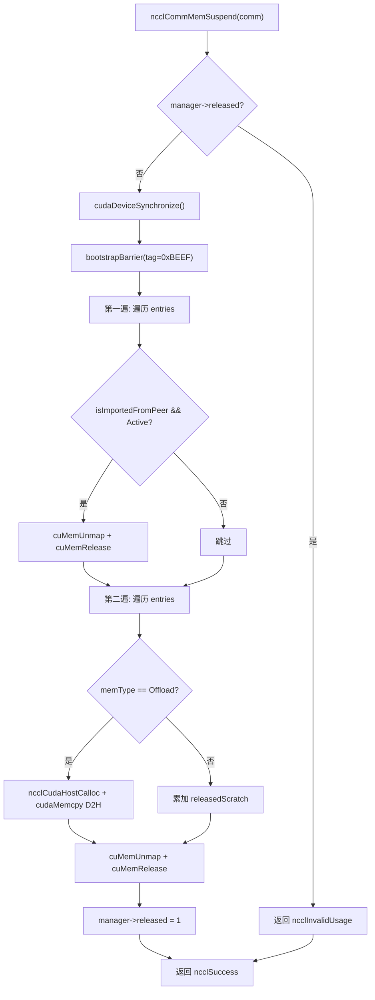
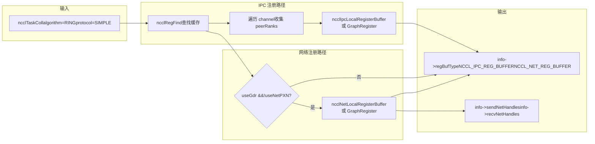
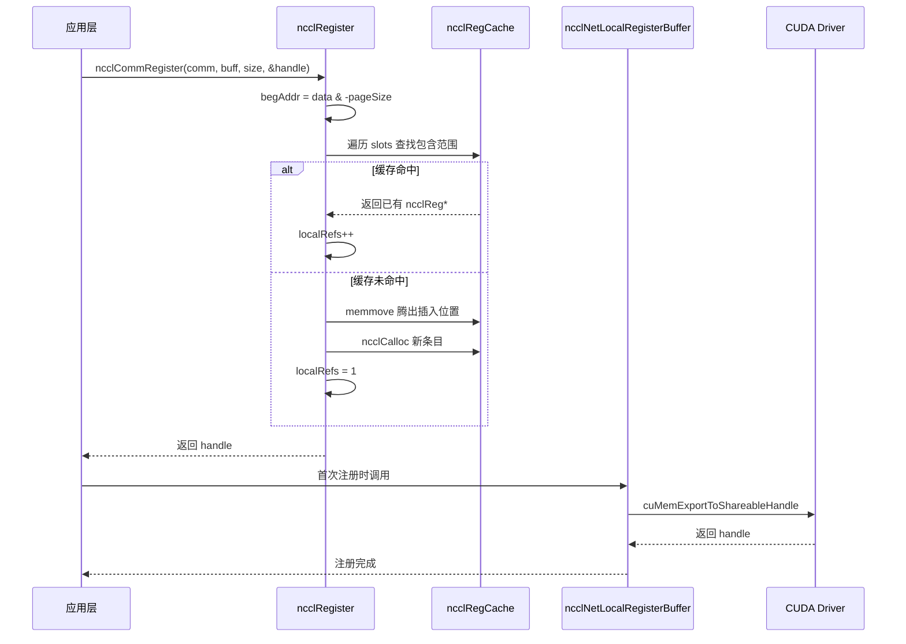

# Глава 18: Распределение памяти и управление видеопамятью: allocator, кэш регистрации и оптимизация пользовательской регистрации памяти

В предыдущей главе мы увидели, как подсистема RAS работает на плоскости управления независимо от плоскости данных, используя хеши для версионирования и подсчёт ссылок для защиты жизненного цикла. В этой главе мы переходим к третьей опоре NCCL — управлению памятью. Верхний предел производительности связи часто зависит не от самого алгоритма, а от того, «может ли сетевой адаптер напрямую читать и записывать данные». Для этого NCCL построил трёхуровневый механизм: на нижнем уровне с помощью`ncclSpace`и`ncclShadowPool`управляют адресным пространством и теневыми объектами, на среднем уровне с помощью`ncclMemManager`отслеживают импорт-экспорт динамической памяти и приостановку-возобновление, на верхнем уровне с помощью`ncclCommRegister`регистрируют пользовательские буферы в кэше, чтобы избежать повторного pin-а памяти при каждой связи. В этой главе мы пошагово разберём эти три механизма и ответим на вопросы «почему перед связью NCCL необходимо регистрировать память» и «как кэш регистрации влияет на производительность».

# 18.1 ncclSpace: разрезание адресного пространства на чередующиеся полные/пустые сегменты

## Интуитивная модель

Представьте бесконечно длинную линию нумерации парковочных мест, начинающуюся с 0 и уходящую вправо. Некоторые места заняты машинами (выделены), некоторые пусты (не выделены).`ncclSpace`— это «журнал состояния парковочных мест» для этой линии нумерации: он не записывает каждое место, а только «граничные точки, где состояние переключается». Без него NCCL при управлении диапазонами виртуальных адресов симметричной памяти должен был бы поддерживать бит флага для каждого байта, а накладные расходы памяти были бы пропорциональны адресному пространству, что совершенно неприемлемо.

## Структура данных и размещение в памяти

`ncclSpace`определяется предельно минималистично[FACT:src/include/allocator.h:20-24]：

```c
struct ncclSpace {
  int count;        // cuts[] 中有效元素个数
  int capacity;     // cuts[] 已分配容量
  int64_t* cuts;    // 升序排列的边界点数组
};
```

Ключевая идея ясно написана в комментарии к исходному коду[FACT:src/allocator.cc:151-153]：`cuts[]`разрезает ось неотрицательных целых чисел на чередующиеся «полные» и «пустые» сегменты, точки разреза упорядочены по возрастанию, а сегмент после последней точки разреза обязательно пуст (невыделенный фронт). Отсюда можно вывести формулу для определения, заполнен ли`i`-й сегмент:

```
isFull(i) = (i%2 != ncuts%2)
```

Смысл этой формулы: состояние заполненности/пустоты сегмента определяется совместно «чётностью индекса сегмента» и «чётностью общего числа точек разреза». Когда`ncuts`чётно, сегмент 0 (до`cuts[0]`) пуст; когда`ncuts`нечётно, сегмент 0 полон. Этот инвариант пронизывает весь модуль.

## Пошаговый разбор: как одно выделение изменяет cuts[]

Сценарий: изначально`ncclSpace`пуст (`count=0`), вызывается`ncclSpaceTryAlloc(a, limit=1000, size=100, align=1, &outOffset)`。

**Шаг 1: найти первый пустой сегмент** [FACT:src/allocator.cc:209]。`i = a->count % 2`, в этот момент`count=0`, поэтому`i=0`, сканирование начинается с сегмента 0.

**Шаг 2: вычислить границы сегмента** [FACT:src/allocator.cc:212-213]。`i==0`при`lo=0`；`i==a->count`при`hi=limit=1000`. Значит, пустой сегмент —`[0, 1000)`。

**Шаг 3: выравнивание и проверка ёмкости** [FACT:src/allocator.cc:214-215]。`off = alignUp(0, 1) = 0`，`0 + 100 <= 1000`выполняется, выделение успешно.

**Шаг 4: вставить точки разреза** [FACT:src/allocator.cc:217-223]. Поскольку`i==0`(вставка в начало), идём по медленному пути`insertSegment(a, 0, 0, 100)`。`insertSegment`в`index=0`вставляются две точки разреза`lo=0, hi=100` [FACT:src/allocator.cc:172-174], затем выполняется «фильтрация соседних дубликатов»[FACT:src/allocator.cc:185-203]. Логика фильтрации очень изящна: она сканирует двумя курсорами — чтения и записи, при встрече дубликата откатывает курсор записи, удаляя парные дубликаты — потому что парный дубликат означает, что пустой сегмент зажат между двумя полными и может быть объединён. Но ведущие нули — особый случай, их можно удалить отдельно[FACT:src/allocator.cc:182-184]。

После выделения`cuts = [0, 100]`，`count=2`. В этот момент`isFull(0) = (0%2 != 2%2) = false`, сегмент 0 (`[0,0)`, пустой) пуст; сегмент 1 (`[0,100)`) полон. Верно.

**Шаг 5: освобождение** [FACT:src/allocator.cc:239-267]. Вызывается`ncclSpaceFree(a, 0, 100)`. Сначала проверяется`cuts[count-1] <= offset`, выполняется ли[FACT:src/allocator.cc:231-237], то есть`100 <= 0`ложно, продолжаем. Находится первый полный сегмент`i = 1 - count%2 = 1 - 0 = 1` [FACT:src/allocator.cc:246]，`cuts[1]=100 > 0`, поэтому`i=1`。`lo = cuts[0] = 0`，`hi = cuts[1] = 100`. Проверяется`offset < lo || hi < offset+size` [FACT:src/allocator.cc:252]，`0<0`ложно,`100<100`ложно, проходит. Поскольку`lo==offset`и`offset+size==hi`, оба быстрых пути не выполняются (первый требует`offset+size != hi`, второй требует`lo != offset`), идём по медленному пути`insertSegment(a, 1, 0, 100)` [FACT:src/allocator.cc:264]. После вставки`cuts = [0, 0, 100, 100]`, после фильтрации становится`[]`，`count=0`. Возврат в исходное состояние.

Этот дизайн «вставка с последующей фильтрацией» позволяет избежать сложной логики объединения сегментов при выделении/освобождении, концентрируя сложность в одном месте —`insertSegment`.

## Размышления о дизайне и подводные камни в продакшене

**Почему используется int64_t, а не size_t?**Потому что`ncclSpace`управляет «смещениями», а не «указателями», смещение может быть отрицательным (хотя на практике этого не происходит), и требуется согласованность с шириной`CUdeviceptr`в CUDA. Использование знакового типа облегчает обнаружение выхода за границы при отладке.

**Ловушка производительности**：`ncclSpaceFree`Комментарий прямо говорит: «This could be binary search, but since allocate is linear there's no point»[FACT:src/allocator.cc:245]. Это означает, что и выделение, и освобождение — это O(n) сканирование. Если какой-то домен связи часто выделяет и освобождает множество мелких сегментов,`cuts[]`будет разрастаться, и каждая операция будет замедляться. В продакшене следует по возможности переиспользовать уже зарегистрированные буферы, а не многократно регистрировать/отменять регистрацию.

**Риск переполнения при выравнивании**：`alignUp(lo, align)`при`lo`близком к`INT64_MAX`и большом`align`может переполниться. В исходном коде нет явной проверки, потому что`limit`гарантируется вызывающей стороной в разумных пределах.

# 18.2 ncclShadowPool: управление сопоставлением объектов устройств и их хостовых теней

## Интуитивная модель

Ядра GPU выполняются на устройстве и не могут напрямую обращаться к C++ объектам в памяти хоста (например, к метаданным в`ncclDevComm`).`ncclShadowPool`работает как «переводчик»: для каждого объекта на стороне устройства он выделяет блок видеопамяти, одновременно выделяет соответствующий блок «теневой» памяти на стороне хоста и поддерживает таблицу сопоставления «адрес устройства → адрес хоста». Когда хосту нужно изменить конфигурацию какого-либо объекта устройства, он сначала изменяет хостовую тень, а затем копирует её на устройство. Без него каждому ядру для чтения метаданных пришлось бы извлекать их с хоста через`cudaMemcpy`, что дало бы неприемлемо высокую задержку.

## Структуры данных и разметка памяти

Две ключевые структуры[FACT:src/allocator.cc:272-277]：

```c
struct ncclShadowPage {   // 最多 64 个对象的连续块
  struct ncclShadowPage* next;
  int objSize;
  uint64_t freeMask;      // 位图，1=空闲，0=已占用
  void* devObjs;
};
struct ncclShadowObject {
  struct ncclShadowObject* next;
  void* devObj;
  void* hostObj;
  struct ncclShadowPage* page;  // null 表示直接分配在 CUDA mempool
};
```

`ncclShadowPool`сам[FACT:src/include/allocator.h:42-47]：

```c
struct ncclShadowPool {
  int count, hbits;                       // 对象数、哈希位数
  struct ncclShadowObject** table;        // 哈希桶数组
  cudaMemPool_t memPool;                  // 可选的 CUDA 内存池
  struct ncclShadowPage* pages;           // 页链表
};
```

**Ключевые проектные решения:`freeMask`имеет тип uint64_t**, поэтому на страницу приходится максимум 64 объекта. Это выбрано не случайно — 64 бита как раз равны ширине одной кэш-линии,`popFirstOneBit`можно одной инструкцией`__builtin_ctzll`найти первый свободный слот без цикла.

**Стратегия роста хеш-таблицы**: комментарий в исходном коде «Maintain 2:1 object:bucket ratio»[FACT:src/allocator.cc:368], то есть расширение происходит, когда число объектов превышает число корзин вдвое. Начальное значение`hbits=4`(16 корзин)[FACT:src/allocator.cc:363], каждый раз удваивается.

## Пошаговый разбор: как при одном выделении выбирается страница или прямое подключение

Вводная ситуация:`ncclShadowPoolAlloc(pool, size=1024, &devObj, &hostObj, stream)`。

**Шаг первый: ленивая инициализация** [FACT:src/allocator.cc:347-366]. Если`hbits==0`, сначала проверяется, поддерживает ли устройство пул памяти[FACT:src/allocator.cc:352]; если да, создаётся`cudaMemPool_t`, параметр`maxSize`устанавливается в значение`SHADOW_MEMPOOL_MAX_SIZE`(по умолчанию 1 ГБ)[FACT:src/allocator.cc:359]. Затем выделяется хеш-таблица на 16 корзин.

**Шаг второй: проверка необходимости расширения** [FACT:src/allocator.cc:369-386]. Если`count+1 > 2<<hbits`, выделяется массив корзин двойного размера, выполняется обход старой таблицы с повторной вставкой (`hashInsert`с использованием`ncclHashPointer`вычисляется индекс корзины[FACT:src/allocator.cc:333-337]), старая таблица освобождается.

**Шаг третий: выбор между страничным и прямым путём** [FACT:src/allocator.cc:390]. Условие`(64<<10)/size >= 3`, то есть при`size <= 21845`выбирается страничный путь. Для`size=1024`，`65536/1024=64 >= 3`выбирается страничный путь.

**Шаг четвёртый: вычисление размера объекта внутри страницы** [FACT:src/allocator.cc:391-392]。`shift = max(0, log2Down(1024)+1-4) = max(0, 10+1-4) = 7`。`pageObjSize = ((1024 + 127) >> 7) << 7 = 1024`. То есть размер объекта внутри страницы выравнивается по степени двойки до кратного 128 байтам.

**Шаг пятый: поиск или создание страницы** [FACT:src/allocator.cc:393-415]. Выполняется обход списка`pool->pages`в поисках страницы с`objSize == pageObjSize`. Если её нет, создаётся новая страница:`pageSize = min(65536, 64*1024) = 65536`，`freeMask = uint64_t(-1) >> (64 - 65536/1024) = uint64_t(-1) >> 0 = 全 1`(все 64 слота пусты)[FACT:src/allocator.cc:400]. С помощью`cudaMallocFromPoolAsync`или`cudaMalloc`выделяется видеопамять[FACT:src/allocator.cc:403-404], и`cudaMemsetAsync`обнуляется[FACT:src/allocator.cc:405]。

**Шаг шестой: получение слота из страницы** [FACT:src/allocator.cc:408-412]。`popFirstOneBit(&page->freeMask)`находится первый свободный бит,`devObj = page->devObjs + slot * pageObjSize`. Если`freeMask`становится равным 0 (страница заполнена), страница удаляется из списка свободных[FACT:src/allocator.cc:411]。

**Шаг седьмой: выделение хостового теневого объекта** [FACT:src/allocator.cc:423-428]。`malloc(sizeof(ncclShadowObject) + alignof(max_align_t)-1 + size)`, обратите внимание, что здесь дополнительно выделено`alignof(max_align_t)-1`байт для выравнивающего заполнения.`hostObj = alignUp((char*)(obj+1), alignof(max_align_t))`, то есть после заголовка объекта выполняется выравнивание до максимальной границы выравнивания. Затем`memset(hostObj, 0, size)`обнуляется.

**Шаг восьмой: вставка в хеш-таблицу и обновление счётчиков** [FACT:src/allocator.cc:429-430]。

## Управление конкурентностью и взаимодействие с оборудованием

`ncclShadowPool`сам по себе**не имеет блокировок**. Это означает, что его можно использовать только в однопоточном контексте либо вызывающая сторона должна обеспечить взаимное исключение. Судя по реальному использованию в NCCL, он вызывается в основном на этапе инициализации коммуникационного домена, когда выполнение однопоточное.

`cudaMallocFromPoolAsync`и`cudaFreeAsync`— асинхронные операции, зависящие от параметра`stream`, который гарантирует порядок[FACT:src/allocator.cc:403,459]。`ncclShadowPoolDestruct`вызывается после освобождения всех ресурсов`cudaStreamSynchronize(stream)` [FACT:src/allocator.cc:333-337], что гарантирует завершение всех асинхронных освобождений до уничтожения пула памяти.

## Руководство по избеганию проблем в продакшене

**Проблема 1: потери памяти из-за выравнивания размера объектов внутри страницы**。`pageObjSize`выравнивается по степени двойки; если`size=1000`，`shift = log2Down(1000)+1-4 = 9+1-4 = 6`，`pageObjSize = ((1000+63)>>6)<<6 = 1024`. На каждый объект тратится впустую 24 байта, на 64 объекта в странице — 1536 байт. При большом количестве мелких объектов эти накладные расходы нельзя игнорировать.

**Проблема 2: поведение`ncclShadowPoolFree`, когда объект не найден** [FACT:src/allocator.cc:442-445]. Он возвращает`ncclInternalError`и выводит предупреждение, но**не освобождает никаких ресурсов**. Если вызывающая сторона игнорирует возвращаемое значение, это приведёт к утечке памяти. Производственный код обязан проверять возвращаемое значение.

**Проблема 3: в`ncclShadowPoolDestruct`страница с`freeMask==0`перерабатывается** [FACT:src/allocator.cc:301-306]. Обратите внимание, что здесь`freeMask`устанавливается в 1 (а не все единицы), что означает пометку только первого слота как свободного. Это делается для того, чтобы вернуть «заполненную страницу» в список`pool->pages`, но остальные слоты внутри страницы по-прежнему заняты — фактически эти объекты вот-вот будут освобождены, поэтому такая операция безопасна. Однако если во время деструктора происходит конкурентный доступ, можно прочитать несогласованное состояние.

# 18.3 ncclMemManager: подсчёт ссылок и приостановка/восстановление динамической памяти

## Интуитивная модель

Обучающая задача может выполняться несколько дней, в течение которых GPU может быть вытеснен другими задачами или потребуется создание контрольной точки.`ncclMemManager`работает как «управляющий памятью»: он регистрирует всю динамически выделенную память (scratch/offload), при необходимости «приостанавливает» память GPU (отменяет отображение физических страниц, сохраняя виртуальные адреса), создаёт резервную копию данных на CPU, а при восстановлении заново выделяет физические страницы, повторно отображает их и восстанавливает данные. Без него после вытеснения задачи пришлось бы начинать с нуля, теряя многочасовой прогресс обучения.

## Структуры данных и разметка памяти

`ncclMemManager`ключевые поля (выведены из кода инициализации)[FACT:src/mem_manager.cc:32-60]：

| Поле | Тип | Значение |
| --- | --- | --- |
| `entries` | `ncclDynMemEntry*` | Голова списка записей динамической памяти |
| `numEntries` | `int` | Длина списка |
| `released` | `int` | 0=активна, 1=приостановлена |
| `refCount` | `int` | Счётчик ссылок (может совместно использоваться несколькими comm) |
| `totalPersist` | `size_t` | Общий объём постоянной памяти (атомарный) |
| `totalScratch` | `size_t` | Общий объём scratch-памяти (атомарный) |
| `totalOffload` | `size_t` | Общий объём offload-памяти (атомарный) |
| `cpuBackupUsage` | `size_t` | Общий объём резервной памяти CPU |
| `lock` | `std::mutex` | Защищает список entries |
| `initialized` | `int` | Атомарный флаг, предотвращающий доступ к уже уничтоженному мьютексу |

**Ключевые проектные решения по разметке памяти**：`lock`является`std::mutex`, но`ncclMemManager`выделяется с помощью`ncclCalloc`(в стиле C), поэтому необходимо явно сконструировать[FACT:src/mem_manager.cc:39]через placement new, а при уничтожении явно вызвать`~mutex()` [FACT:src/mem_manager.cc:120]. Это классическая ловушка смешанного программирования на C/C++.

**Разделение обязанностей между атомарными переменными и блокировками**: статистические поля (`totalPersist`и т. д.) обновляются атомарными операциями и не требуют блокировки;`entries`список защищается`lock`. Таким образом, статистические запросы (`ncclCommMemStats`) могут без блокировки читать[FACT:src/mem_manager.cc:1117-1130], тогда как операции со списком обязаны удерживать блокировку.

## Пошаговое руководство: полный процесс приостановки и возобновления

**Процесс приостановки** `ncclCommMemSuspend` [FACT:src/mem_manager.cc:418-540]：

**Шаг первый: предварительные проверки** [FACT:src/mem_manager.cc:419-430]. Проверяется, отключён ли менеджер памяти, пуст ли comm, не приостановлен ли уже.

**Шаг второй: синхронизация устройства и barrier** [FACT:src/mem_manager.cc:440-441]。`cudaDeviceSynchronize()`Убедиться, что все операции GPU завершены, затем`bootstrapBarrier`Убедиться, что все rank синхронизированы. Тег barrier —`0xBEEF`。

**Шаг третий: первый проход — unmap всех буферов, импортированных от peer** [FACT:src/mem_manager.cc:444-465]. Для каждой записи`isImportedFromPeer && state==Active`вызывается`cuMemUnmap`для снятия отображения[FACT:src/mem_manager.cc:451], освобождается handle[FACT:src/mem_manager.cc:456], состояние меняется на`Released`。

**Шаг четвёртый: второй проход — offload локальной памяти** [FACT:src/mem_manager.cc:468-526]. Пропускаются peer-импортированные и уже освобождённые записи. Для типа`ncclMemOffload`сначала выделяется CPU-бэкап[FACT:src/mem_manager.cc:484], затем`cudaMemcpy`копирование с GPU на CPU[FACT:src/mem_manager.cc:492]. Для типа`ncclMemScratch`только накапливается статистика. Затем закрывается shareable FD[FACT:src/mem_manager.cc:508-513]，`cuMemUnmap` [FACT:src/mem_manager.cc:516]，`cuMemRelease` [FACT:src/mem_manager.cc:519], состояние меняется на`Released`。

**Шаг пятый: отметка о приостановке** [FACT:src/mem_manager.cc:528]。

**Процесс возобновления** `ncclCommMemResume` [FACT:src/mem_manager.cc:550-942]：

**Шаг первый: восстановление локальной памяти** [FACT:src/mem_manager.cc:577-668]. Для каждой записи`!isImportedFromPeer && state==Released`повторно`cuMemCreate` [FACT:src/mem_manager.cc:599]，`ncclCuMemMapAndSetAccess`отображается на тот же виртуальный адрес[FACT:src/mem_manager.cc:602], восстанавливаются права доступа peer[FACT:src/mem_manager.cc:610-626], для offload-типа данные восстанавливаются из CPU-бэкапа[FACT:src/mem_manager.cc:632-643], повторно экспортируется FABRIC handle[FACT:src/mem_manager.cc:646-658]。

**Шаг второй: синхронизация barrier** [FACT:src/mem_manager.cc:671-679]. Тег по-прежнему`0xBEEF`。

**Шаг третий: обмен информацией о новых handle** [FACT:src/mem_manager.cc:688-816]. Подсчитывается, сколько локальных буферов у каждого rank нужно broadcast[FACT:src/mem_manager.cc:689-696], с помощью`bootstrapAllGather`обмениваются счётчики[FACT:src/mem_manager.cc:710], вычисляются смещения[FACT:src/mem_manager.cc:724-728], затем сначала`bootstrapSend`потом`bootstrapRecv`(комментарий явно указывает «send first, then receive to avoid deadlock»[FACT:src/mem_manager.cc:783]）。

**Шаг четвёртый: повторный импорт peer-буферов** [FACT:src/mem_manager.cc:822-911]. Для каждой записи`isImportedFromPeer && state==Released`в результатах обмена ищется соответствующая информация о handle[FACT:src/mem_manager.cc:829-835]. Для типа POSIX FD нужно проверить, совпадает ли hostHash[FACT:src/mem_manager.cc:853-859], затем через proxy получить FD[FACT:src/mem_manager.cc:866]，`cuMemImportFromShareableHandle`импорт[FACT:src/mem_manager.cc:873]. Тип FABRIC импортируется напрямую[FACT:src/mem_manager.cc:878]. Затем`ncclCuMemMapAndSetAccess`повторное отображение[FACT:src/mem_manager.cc:893]。

**Шаг пятый: финальный barrier** [FACT:src/mem_manager.cc:916-928]. Тег —`0xCAFE`, отличается от предыдущего`0xBEEF`.

## Управление конкурентностью и взаимодействие с оборудованием

**Защита жизненного цикла через подсчёт ссылок**：`ncclMemManagerDestroy`Сначала уменьшается`refCount` [FACT:src/mem_manager.cc:76], если всё ещё больше 0, то только очищается указатель текущего comm[FACT:src/mem_manager.cc:81], ресурсы не освобождаются. Это позволяет нескольким comm совместно использовать один менеджер памяти (например, в сценарии split_share).

**Атомарный флаг initialized**: перед всеми операциями проверяется`COMPILER_ATOMIC_LOAD(&manager->initialized, memory_order_acquire)` [FACT:src/mem_manager.cc:136,242,338,358], чтобы предотвратить доступ к уже уничтоженному mutex. При уничтожении используется`memory_order_release`сохранение 0[FACT:src/mem_manager.cc:87], чтобы гарантировать видимость предыдущих записей для других потоков.

**Использование CUDA VMM API**：`cuMemCreate`/`cuMemMap`/`cuMemUnmap`/`cuMemRelease`— это API управления виртуальной памятью CUDA, позволяющий разделить физическую память и виртуальные адреса. Это основа приостановки/возобновления — при приостановке физические страницы unmap-ятся, но виртуальные адреса сохраняются, при возобновлении выполняется повторное отображение на те же виртуальные адреса, так что все установленные связи указателей не требуют изменений.

## Руководство по избеганию проблем в продакшене

**Проблема 1: коммуникационный домен split_share не поддерживает приостановку** [FACT:src/mem_manager.cc:1014-1018]. Если`refCount > 1`, сразу возвращается`ncclInvalidUsage`. Поскольку при совместном использовании менеджера памяти несколькими comm приостановка одного comm влияет на память других comm.

**Проблема 2: недействительность POSIX FD между узлами** [FACT:src/mem_manager.cc:853-859]. Дескрипторы файлов POSIX действительны только в пределах одного узла, при возобновлении между узлами их необходимо пропускать. В исходном коде используется`hostHash`сравнение для определения нахождения на одном узле.

**Проблема 3: сохранение бэкапа при неудачном восстановлении offload-данных** [FACT:src/mem_manager.cc:635]. Если`cudaMemcpy`восстановление с CPU на GPU завершается неудачей, исходный код выводит предупреждение и сохраняет`cpuBackup`, не освобождая. Это делается, чтобы дать вызывающей стороне возможность повторить попытку, но если повторной попытки не будет, произойдёт утечка CPU-памяти.

**Проблема 4:`ncclMemUntrackDynamic`риск use-after-free в**. Исходный код под блокировкой находит запись, сохраняет необходимую информацию, освобождает запись[FACT:src/mem_manager.cc:302], затем вне блокировки обновляет статистику[FACT:src/mem_manager.cc:311-327]. Этот порядок правильный, но если`info`указатель указывает на стековую память вызывающей стороны, и вызывающая сторона читает вне блокировки, необходимо убедиться, что`info`жизненный цикл покрывает всю функцию.



На диаграмме выше показан поток управления процессом приостановки. Обратите внимание на две ключевые ветви: первый проход обрабатывает только буферы, импортированные от peer, второй проход обрабатывает только локальные буферы, порядок нельзя менять местами — сначала необходимо снять ссылки на память peer, затем освободить локальную память.

# 18.4 Кэш регистрации: как ncclRegister избегает повторного pin

## Интуитивная модель

Сетевой адаптер должен напрямую читать и записывать память GPU (GPUDirect RDMA), для этого необходимо сначала «зарегистрировать» эту память — сообщить адаптеру «по этому адресу ты можешь обращаться напрямую». Процесс регистрации включает pin страниц, установление отображений IOMMU, накладные расходы очень велики (миллисекундного уровня). Если при каждом AllReduce выполнять повторную регистрацию, задержка коммуникации малых сообщений будет полностью перекрыта накладными расходами регистрации.`ncclRegister`— это «кэш регистрации»: он записывает уже зарегистрированные диапазоны адресов в упорядоченный массив, при следующей встрече с тем же или вложенным буфером просто переиспользует, не повторяя регистрацию.

## Структура данных и размещение в памяти

`ncclRegCache`В основе лежит упорядоченный массив`slots`, каждый элемент —`ncclReg*`。`ncclReg`ключевые поля (выведены из использования):

| Поле | Тип | Значение |
| --- | --- | --- |
| `begAddr` | `uintptr_t` | Выровненный по странице начальный адрес |
| `endAddr` | `uintptr_t` | Выровненный по странице конечный адрес |
| `localRefs` | `int` | Локальный счётчик ссылок |
| `graphRefs` | `int` | Счётчик ссылок графа |
| `state` | `int` | Биты состояния регистрации (NET/NVLS/COLLNET/IPC) |
| `netHandleHead` | `ncclRegNetHandles*` | Связный список сетевых handle |
| `ipcInfos` | `ncclIpcInfo**` | Массив информации IPC |

**Выравнивание по страницам**：`begAddr = (uintptr_t)data & -pageSize` [FACT:src/register/register.cc:31]，`endAddr = ((uintptr_t)data + size + pageSize - 1) & -pageSize` [FACT:src/register/register.cc:32]。`-pageSize`равно`pageSize`дополнению до двух, что эквивалентно «выравниванию вниз до кратного pageSize». Причина этого в том, что минимальная гранулярность регистрации — это страница: даже если регистрируется 1 байт, регистрируется целая страница.

## Пошаговый разбор: как одна регистрация попадает в кэш

Вводный сценарий:`ncclCommRegister(comm, buff=0x7f0000001000, size=4096, &handle)`。

**Шаг 1: Проверка параметров и выравнивание по страницам** [FACT:src/register/register.cc:18-24]。`CommCheck`проверяет корректность comm. Предположим,`pageSize=4096`，`begAddr = 0x7f0000001000 & -4096 = 0x7f0000001000`，`endAddr = (0x7f0000001000 + 4096 + 4095) & -4096 = 0x7f0000002000`。

**Шаг 2: Проверка системной памяти** [FACT:src/register/register.cc:36-64]. Если`ncclCuMemEnable()`, запрашивается диапазон адресов и тип памяти. Если`memType == CU_MEMORYTYPE_HOST`, это означает, что память CPU, и регистрация пропускается[FACT:src/register/register.cc:58-61]. Иначе проверяется, есть ли сегмент Sysmem[FACT:src/register/register.cc:50-55]。

**Шаг 3: Обход кэша для поиска позиции вставки** [FACT:src/register/register.cc:66-89]. Цикл`slot`начинается с 0:

- Если`slot == population`(достигнут конец) или`begAddr < slots[slot]->begAddr`(текущий адрес находится перед записью кэша), это означает, что нужно создать новую запись[FACT:src/register/register.cc:67]。
- Если`slots[slot]->begAddr <= begAddr && slots[slot]->endAddr >= endAddr`, это означает, что текущий буфер полностью содержится в существующей записи, и счётчик ссылок просто увеличивается[FACT:src/register/register.cc:83-87]。

**Шаг 4: Создание новой записи** [FACT:src/register/register.cc:68-82]. Если кэш заполнен, выполняется расширение (начальный размер 32, затем удвоение)[FACT:src/register/register.cc:70]. С помощью`memmove`в`slot`освобождается место[FACT:src/register/register.cc:73]，`ncclCalloc`выделяется новая запись[FACT:src/register/register.cc:74], устанавливается`begAddr`/`endAddr`, в зависимости от`isGraph`устанавливается`graphRefs`или`localRefs`в 1[FACT:src/register/register.cc:78-79]，`population++`, возвращается handle.

**Шаг 5: Дерегистрация** [FACT:src/register/register.cc:172-195]。`commDeregister`сначала находится slot, соответствующий handle[FACT:src/register/register.cc:180], уменьшается счётчик ссылок[FACT:src/register/register.cc:185-186]. Если ссылки ещё остались, сразу возвращается[FACT:src/register/register.cc:187]. Иначе вызывается`regCleanup`для очистки всех нижележащих регистраций[FACT:src/register/register.cc:188], освобождается запись, с помощью`memmove`заполняется пустота[FACT:src/register/register.cc:190]，`population--`。

## Размышления о дизайне и подводные камни в продакшене

**Почему используется упорядоченный массив, а не хеш-таблица?**Потому что запрос регистрации — это запрос «включения диапазона», а не точного совпадения. Упорядоченный массив поддерживает бинарный поиск (хотя в исходном коде используется линейное сканирование) и обладает хорошей локальностью памяти. Хеш-таблица не может эффективно обрабатывать такие запросы, как «содержится ли этот адрес в некотором более крупном диапазоне».

**`regCleanup`Дизайн битов состояния** [FACT:src/register/register.cc:95-134]。`state`представляет собой битовую маску, каждый бит которой соответствует типу регистрации (NET/NVLS/COLLNET/IPC). При очистке проверяется каждый бит, и очищаются только завершённые регистрации. Такой дизайн допускает ситуацию, когда часть регистраций успешна, а часть неудачна — например, сетевая регистрация успешна, но регистрация IPC не удалась; при очистке очищается только сетевая часть.

**Производственная ловушка: кэш регистраций не отслеживает освобождение памяти**. Если пользователь регистрирует буфер, а затем без дерегистрации`cudaFree`его, запись в кэше всё равно сохраняется. При следующем выделении может быть повторно использован тот же адрес, что приведёт к попаданию в кэш, хотя фактическая память уже недействительна. Соглашение NCCL таково: регистрация и дерегистрация должны быть парными, и пользователь обязан гарантировать, что память не освобождается во время регистрации.

**`ncclCommRegister`Условие пропуска** [FACT:src/register/register.cc:150-159]. Если`LocalRegister=0`или`P2pUsesMemcpy=1`, сразу возвращается`NULL`handle. Это означает, что при некоторых конфигурациях (например, P2P через memcpy, а не RDMA) регистрация полностью пропускается. Вызывающая сторона должна проверять, равен ли handle NULL.

# 18.5 Регистрация коллективных коммуникаций: как coll_reg выбирает стратегию регистрации для разных алгоритмов

## Интуитивная модель

Разные алгоритмы коллективных коммуникаций используют разные пути передачи: NVLS идёт через NVLink SHARP, Ring идёт через P2P или сеть, Tree идёт через древовидную топологию. Каждому пути нужен свой способ регистрации: NVLS требует регистрации в аппаратуре NVLS, сеть требует регистрации в сетевой карте, IPC требует регистрации на GPU-партнёре.`coll_reg.cc`— это «маршрутизатор стратегий регистрации»: он в зависимости от алгоритма, протокола и типа буфера решает, какие функции регистрации вызывать. Без него каждому алгоритму пришлось бы реализовывать логику регистрации самостоятельно, что привело бы к дублированию кода и ошибкам.

## Пошаговый разбор: решение о регистрации для алгоритма Ring

Вводный сценарий:`ncclRegisterCollBuffers(comm, info, outRegBufSend, outRegBufRecv, cleanupQueue, regNeedConnect)`, где`info->algorithm == NCCL_ALGO_RING`，`info->protocol == NCCL_PROTO_SIMPLE`。

**Шаг 1: Предварительные проверки** [FACT:src/register/coll_reg.cc:155-157]. Устанавливается`regBufType = NCCL_REGULAR_BUFFER`，`regNeedConnect = true`. Если`LocalRegister=0`и это не регистрация постоянного графа, происходит немедленный выход.

**Шаг 2: Вход в ветку Ring** [FACT:src/register/coll_reg.cc:338]. Инициализируется`recvRegRecord`/`sendRegRecord`как NULL, выделяется массив`sendNetConns`/`sendNetHandles`/`recvNetConns`/`recvNetHandles`/`srecvNetHandles`[FACT:src/register/coll_reg.cc:356-360]。

**Шаг 3: Поиск существующих записей регистрации** [FACT:src/register/coll_reg.cc:351-355]。`ncclRegFind`в кэше ищутся буферы recv/send. Если recv не найден и это не регистрация постоянного графа, выход[FACT:src/register/coll_reg.cc:352]. Если это межузловой случай, send не найден и это не регистрация постоянного графа, выход[FACT:src/register/coll_reg.cc:354]。

**Шаг 4: Обход всех channel для сбора peer** [FACT:src/register/coll_reg.cc:362-393]. Для каждого channel проверяются`ring.prev`и`ring.next`. Если флаг соединения содержит`NCCL_DIRECT_NIC`, записывается в`recvNetConns`/`sendNetConns` [FACT:src/register/coll_reg.cc:370-379]. Если содержит`NCCL_P2P_READ | NCCL_P2P_WRITE`, peer добавляется в массив`peerRanks`[FACT:src/register/coll_reg.cc:382-391]。

**Шаг 5: Регистрация IPC** [FACT:src/register/coll_reg.cc:394-407]. Если`nPeers > 0 && comm->isAllDirectP2p`, сначала предпринимается попытка регистрации графа[FACT:src/register/coll_reg.cc:395-399], при неудаче — локальная регистрация[FACT:src/register/coll_reg.cc:400-403]. Если успешно, устанавливается`regBufType = NCCL_IPC_REG_BUFFER` [FACT:src/register/coll_reg.cc:406]。

**Шаг 6: Сетевая регистрация** [FACT:src/register/coll_reg.cc:409-457]. Проверяется`!comm->useNetPXN && comm->useGdr && netDeviceType != UNPACK`и отсутствие PreMulSum/SumPostDiv для AllReduce[FACT:src/register/coll_reg.cc:415-418]. Сначала предпринимается попытка регистрации графа[FACT:src/register/coll_reg.cc:419-430], при неудаче — локальная регистрация[FACT:src/register/coll_reg.cc:431-442]. Если успешно, устанавливается`regBufType |= NCCL_NET_REG_BUFFER`, сохраняется массив handle[FACT:src/register/coll_reg.cc:445-452]。

**Шаг 7: Корректировка числа каналов** [FACT:src/register/coll_reg.cc:551-554]. Если зарегистрирован только IPC, система одноузловая и число каналов находится в диапазоне 17–24, оно снижается до 16. Это делается для соответствия характеристикам пропускной способности после регистрации IPC.

## Размышления о дизайне и подводные камни в продакшене

**Почему порядок регистрации у NVLS и Ring противоположен?**В ветке NVLS сначала предпринимается попытка регистрации графа, затем локальная регистрация[FACT:src/register/coll_reg.cc:86-94], а в ветке Ring сначала локальная, затем граф[FACT:src/register/coll_reg.cc:395-403]. Это связано с тем, что регистрация графа для NVLS более вероятно успешна (аппаратура NVLS оптимизирована для постоянных буферов), а локальная регистрация для Ring более легковесна.

**`isMloPartBufRdmaCapable`Глобальное решение** [FACT:src/register/coll_reg.cc:14-37]. Комментарий подчёркивает: «Решение о регистрации должно быть глобальным, с использованием гарантий на уровне всего коммуникатора»[FACT:src/register/coll_reg.cc:20]. Это означает, что даже если буфер некоторого ранга поддерживает RDMA, но хотя бы один ранг в коммуникационном домене не поддерживает его, весь коммуникационный домен не регистрируется. Это делается во избежание несогласованности, вызванной регистрацией части рангов и отсутствием регистрации у других.

**Производственная ловушка: тихая деградация при неудачной регистрации**。`ncclRegisterCollBuffers`При неудачной регистрации ошибка не выдаётся, просто не устанавливается`regBufType`соответствующий бит. Это означает, что коммуникация всё ещё работает, но производительность снижается. В производственной среде, если производительность не соответствует ожиданиям, следует проверить`NCCL_REG`журналы, чтобы убедиться в успешности регистрации.



На рисунке выше показаны два параллельных пути регистрации в алгоритме Ring: путь IPC обрабатывает P2P-соединения внутри узла, сетевой путь обрабатывает межузловые RDMA-соединения. Оба пути выполняются независимо и в конечном итоге сводятся к`info->regBufType`。

# 18.6 Производственные подводные камни и цепочка восстановления после сбоев

## Ловушка 1: взаимодействие кэша регистрации и пула памяти

При использовании`ncclMemAlloc`для выделения памяти в основе задействуется CUDA VMM API[FACT:src/allocator.cc:38-94]. Физическая память, создаваемая таким способом выделения, имеет флаг`gpuDirectRDMACapable`[FACT:src/allocator.cc:54], что означает её естественную поддержку RDMA. Но при освобождении`ncclMemFree`, если менеджер памяти уже уничтожен, используется`cudaFree`путь отката[FACT:src/allocator.cc:130-132]. Это может привести к тому, что память, выделенная через VMM, будет ошибочно освобождена с помощью`cudaFree`. В производственной среде необходимо обеспечить парное использование`ncclMemAlloc`/`ncclMemFree`и не освобождать память после уничтожения менеджера памяти.

## Ловушка 2: коммуникационные запросы во время приостановки

`ncclCommMemSuspend`Что произойдёт, если во время выполнения`cudaDeviceSynchronize()` [FACT:src/mem_manager.cc:440]поступят новые коммуникационные запросы? В исходном коде перед приостановкой вызывается

## , что гарантирует завершение всех поставленных в очередь операций GPU. Но если коммуникационные запросы со стороны host в данный момент ставятся в очередь, явной защиты нет. В производственной среде следует остановить все коммуникационные потоки перед приостановкой или использовать семантику group, чтобы гарантировать последовательное выполнение операции приостановки относительно других операций.

`ncclMemAlloc`Ловушка 3: совместимость FABRIC handle[FACT:src/allocator.cc:60-71]На CUDA 12.3+ предпринимается попытка использовать FABRIC handle`cuMemCreate`. Если`CUDA_ERROR_NOT_PERMITTED`возвращает`CUDA_ERROR_NOT_SUPPORTED`или[FACT:src/allocator.cc:63-65], происходит откат к POSIX FD[FACT:src/mem_manager.cc:649-655]. Но при восстановлении, если тип handle — FABRIC, но экспорт не удался, сразу выдаётся ошибка и выполняется unmap

## . Это означает, что в смешанной среде (часть GPU поддерживает FABRIC, часть — нет) приостановка/восстановление может завершиться неудачей.

`ncclRegister`Ловушка 4: утечка счётчика ссылок[FACT:src/register/register.cc:84-85]Каждое попадание в кэш увеличивает счётчик ссылок`regCleanup`. Если вызывающая сторона зарегистрировала N раз, но отменила регистрацию только M раз (M < N), счётчик ссылок никогда не обнулится,`ncclCommRegister`/`ncclCommDeregister`。



# Копировать

Вопросы для размышления и самопроверки по этой главе`ncclSpaceFree`Q1: Если в`if (a->count == 0 || a->cuts[a->count - 1] <= offset)`убрать проверку[FACT:src/allocator.cc:231-237]

**, в каких сценариях возникнет выход за границы?**Разбор ответа`a->count == 0`: эта проверка выполняет две функции. Во-первых,`cuts[-1]`предотвращает доступ к пустому массиву`a->cuts[a->count-1] <= offset`. Во-вторых,`offset`предотвращает выход`count == 0`за пределы выделенного диапазона. Если её убрать, то при`a->cuts[a->count - 1]``cuts[-1]`будет прочитано`count > 0`, что является неопределённым поведением — можно прочитать метаданные кучи или вызвать segmentation fault. Что ещё более скрыто: даже если`offset`, но`while (a->cuts[i] <= offset) i += 2`больше последней точки разбиения, последующий цикл[FACT:src/allocator.cc:247]`i`будет продолжать увеличивать`cuts[]`до выхода за границы, поскольку в`offset`не существует элемента, большего`ncclSpace`. В производственной среде это может сработать в случае: вызывающая сторона передала смещение, которое никогда не выделялось (например, повторный вызов free после освобождения буфера извне), или`offset`было изменено параллельно, что привело к несогласованности состояния. Способ исправления — сохранить эту проверку и при возврате ошибки выводить`count`и

Q2: `ncclMemManagerDestroy`для облегчения диагностики.`refCount`В[FACT:src/mem_manager.cc:78-83], если после уменьшения`ncclMemTrack`всё ещё больше 0, очищается только указатель текущего comm без освобождения ресурсов

**. Что произойдёт, если в этот момент другой comm вызывает**：`ncclMemTrack`?`manager->initialized` [FACT:src/mem_manager.cc:136]Разбор ответа`refCount > 0`Сначала проверяется`initialized = 0`. Поскольку при`manager->lock`не устанавливается`entries`, проверка проходит. Затем он получает[FACT:src/mem_manager.cc:188-192]и модифицирует связный список`refCount > 0``ncclMemManagerDestroy`. Это безопасно, поскольку`refCount`означает, что как минимум один comm всё ещё держит ссылку, и менеджер памяти не будет уничтожен. Реальный риск заключается в следующем: если последний comm при вызове`initialized = 0` [FACT:src/mem_manager.cc:87]уменьшает`ncclMemTrack`до 0, он устанавливает`initialized`и освобождает все ресурсы. Если в этот момент другой поток в`manager->lock`уже прошёл проверку`memory_order_acquire`/`release`, но ещё не захватил блокировку, он обратится к уже освобождённому

, что приведёт к use-after-free. Исходный код смягчает эту проблему парным использованием`ncclCommMemResume`, но строго говоря, окно гонки всё ещё существует. В производственной среде следует убедиться, что все коммуникационные потоки остановлены до уничтожения менеджера памяти.[FACT:src/mem_manager.cc:853-859]Q3: В`restoredPeerCount`peer-буферы типа POSIX FD пропускаются при межузловой передаче`manager->released`. Если все peer-буферы пропущены,[FACT:src/mem_manager.cc:913]равно 0, но

**всё равно устанавливается в 0**：`manager->released = 0`. Каковы последствия?`state`Разбор ответа`ncclDynMemStateReleased`，`handle`означает, что менеджер памяти считает восстановление завершённым. Но если какие-то peer-буферы были пропущены, их`ncclCommMemStats`по-прежнему`ncclStatGpuMemSuspended`по-прежнему 0. Последующая коммуникация при обращении к этим буферам вызовет ошибку CUDA (доступ к немаппированному виртуальному адресу). Что ещё серьёзнее,[FACT:src/mem_manager.cc:1130]запрос`entries`中。Правильный подход — пометить записи POSIX FD как невосстанавливаемые при приостановке, либо возвращать ошибку при возобновлении вместо молчаливого пропуска. В производственной среде, если используются POSIX FD и они跨节点, следует перейти на FABRIC handle или убедиться, что приостановка/возобновление происходят только в пределах одного узла.

Управление памятью — невидимая опора производительности NCCL:`ncclSpace`использует минималистичный массив точек разбиения для управления адресным пространством,`ncclShadowPool`использует 64-битные битовые карты и хеш-таблицы для управления парами устройство/хост-объектов,`ncclMemManager`использует подсчёт ссылок и CUDA VMM API для реализации приостановки и возобновления,`ncclRegister`использует упорядоченный массив для кэширования результатов регистрации, чтобы избежать повторного pin. Эти четыре уровня механизмов совместно обеспечивают ключевую гарантию производительности — «не требуется повторная регистрация памяти перед коммуникацией». В следующей главе мы перейдём к устройство-стороннему коммуникатору и совместимости ABI и посмотрим, как`devcomm`отображает эти host-сторонние раскладки памяти в структуры, доступные из GPU kernel.

На рисунке выше показана временная последовательность регистрации: при попадании в кэш только увеличивается счётчик ссылок, без вызова нижележащей регистрации; при промахе кэша создаётся новая запись и запускается нижележащая регистрация. На этом host-сторонний механизм управления памятью становится ясен. Но коммуникация в конечном итоге происходит на GPU, и kernel должен напрямую обращаться к адресам и состоянию соединений удалённых rank. В следующей главе мы перейдём к устройство-стороннему коммуникатору и совместимости ABI и посмотрим, как devcomm отображает метаданные host-стороннего ncclComm в структуры, доступные на устройстве, а также как версионированный ABI обеспечивает совместимость новых и старых kernel с библиотекой.
