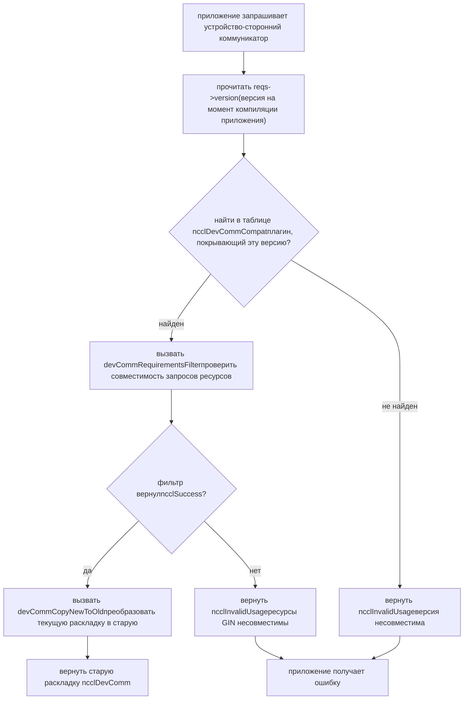
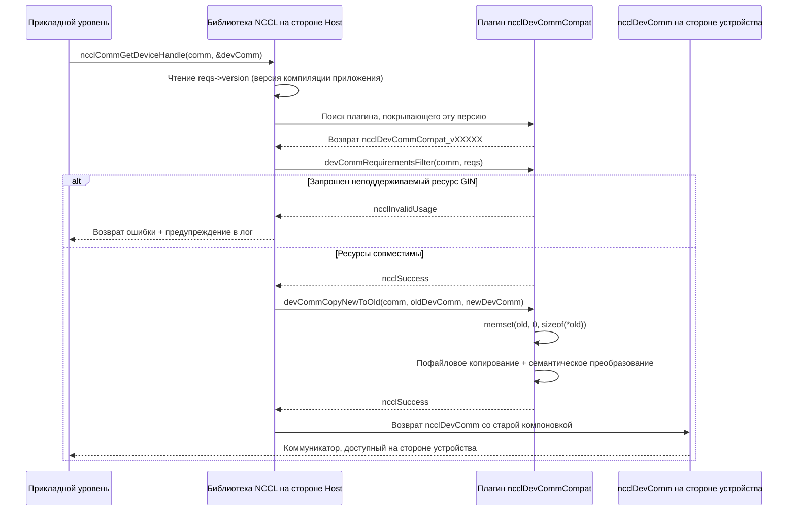

# Глава 19: Устройство-сторонний коммуникационный ABI: архитектура и структуры devComm

# Глава 19: Устройство-сторонний домен коммуникации и совместимость ABI: коммуникационный контракт между devcomm и kernel

В предыдущей главе мы видели, как host-сторонний ncclMemManager с помощью подсчёта ссылок и CUDA VMM API управляет жизненным циклом коммуникационных буферов. Но коммуникация реально происходит в GPU kernel — потоки внутри kernel должны знать: какой я rank? По какому виртуальному адресу находится буфер удалённого rank? Готово ли соединение? Эта информация находится в host-сторонней структуре ncclComm, но kernel не может напрямую разыменовывать host-указатели. Если бы NCCL заставляла kernel каждый раз получать эти метаданные через параметры или запросы к глобальной памяти, каждая коммуникация несла бы дополнительные накладные расходы по задержке и пропускной способности. Хуже того, как только код kernel скомпилирован, смещения полей, к которым он обращается, фиксируются — если после обновления библиотеки раскладка ncclComm изменится, старый kernel прочитает неверные данные. Это и есть основная проблема, которую решает devcomm: отобразить ключевые метаданные host-стороннего домена коммуникации в стабильной, версионированной раскладке памяти в структуры, доступные на устройстве. Файлы devcomm_v22902.cc, devcomm_v22907.cc, devcomm_v23000.cc, devcomm_v23100.cc в каталоге src/devcomm — это конкретные реализации данного версионированного ABI. Каждый файл соответствует диапазону версий NCCL и определяет точную раскладку памяти ncclDevComm в этом диапазоне, а также логику копирования полей между новыми и старыми версиями. В этой главе мы последовательно разберём: как выглядят ключевые структуры данных устройство-стороннего коммуникатора, как работает механизм регистрации и сопоставления версионированного ABI, как выполняется пофайловое преобразование между новыми и старыми версиями, а также границы и подводные камни этого механизма в производственной среде.

# I. Ключевая структура устройство-стороннего коммуникатора: раскладка памяти ncclDevComm

## Интуитивная модель

Представьте`ncclDevComm`как «карточку рабочего места»: при запуске каждого GPU kernel выдаётся карточка, на которой напечатано «ты rank 3, всего 8 rank, в твоей LSA-группе 4 rank, базовый адрес буфера удалённой стороны — 0x7f...». Эта карточка должна быть достаточно маленькой (чтобы поместиться в параметры kernel) и при этом содержать всю ключевую информацию. Если бы этой карточки не было, kernel мог бы полагаться только на повторяющуюся передачу параметров с host-стороны, и каждая коммуникация требовала бы повторной сборки — высокая задержка, подверженность ошибкам.

## Структуры данных и раскладка памяти

На примере`ncclDevComm_v23000`— её полное определение находится в[FACT:src/devcomm/devcomm_v23000.cc:25-62]：

```c
struct ncclDevComm_v23000 {
  unsigned int magic;          // 偏移 0，魔数校验
  unsigned int version;        // 偏移 4，版本号

  int rank, nRanks;            // 偏移 8, 12
  uint32_t nRanks_rcp32;       // 偏移 16，nRanks 的倒数（定点数）
  int lsaRank, lsaSize;        // 偏移 20, 24
  uint32_t lsaSize_rcp32;      // 偏移 28

  ncclDevCommWindowTable_t windowTable;  // 偏移 32
  ncclWindow_t resourceWindow;           // 偏移 40
  ncclResourceWindow_vidmem_v23000_t resourceWindow_inlined;  // 偏移 48
  ncclGinBarrierHandle_t hybridWorldGinBarrier;  // 偏移 112
  ...
};
```

[FACT:src/devcomm/devcomm_v23000.cc:64-93]использует последовательность`static_assert`чтобы жёстко зафиксировать смещение каждого поля. Это не украшение — это контракт времени компиляции для совместимости ABI. Если смещение какого-либо поля сместится из-за изменения стратегии выравнивания компилятора, компиляция завершится ошибкой, а не приведёт к трудноотлаживаемому смещению памяти во время выполнения.

Мотивация дизайна нескольких ключевых полей:

> **[Design Inference & Architectural Trade-offs]**
> **`nRanks_rcp32`и`lsaSize_rcp32`**: это`nRanks`и`lsaSize`обратной величины, представленной 32-битным числом с фиксированной запятой. Когда в ядре выполняется операция деления для вычисления смещения от ранга к буферу, целочисленное деление на GPU работает очень медленно, и использование умножения на обратную величину с последующим сдвигом позволяет значительно ускорить процесс. Это типичный пример «обмена пространства на время» — сохраняем дополнительные 4 байта, чтобы сэкономить десятки тактов на каждое деление.

**`resourceWindow_inlined`**: это встроенный дескриптор окна, тип которого —`ncclResourceWindow_vidmem_v23000_t`. Обратите внимание на[FACT:src/devcomm/devcomm_v23000.cc:11-18]его определение в:

```c
typedef struct ncclResourceWindow_vidmem_v23000 {
  char reserved1[8];
  char* lsaFlatBase;
  char reserved2[8];
  uint32_t stride4G;
  uint32_t mcOffset4K;
  char reserved3[32];  // NOTE: shrunk from 40 in 2.30u1 to reclaim 8 bytes
} ncclResourceWindow_vidmem_v23000_t;
```

Здесь`reserved1`、`reserved2`、`reserved3`— это**поле-заполнитель**, используемое для резервирования места. Зачем нужно заполнение? Потому что`ncclDevComm_v23000`макет должен сохранять смещения, согласованные с некоторой «базовой версией», и даже если некоторые поля больше не используются в текущей версии, их нужно сохранить в качестве заполнителей, чтобы смещения последующих полей не изменились.[FACT:src/devcomm/devcomm_v23000.cc:11-18]Комментарий в явно указывает: 2.30u1 уменьшил`reserved3`с 40 байт до 32 байт, освободив 8 байт для`hybridWorldGinBarrier`. Это**перекомпоновка макета**— путём уменьшения области заполнения новые поля вставляются без изменения общего размера.

[FACT:src/devcomm/devcomm_v23000.cc:11-18]В`static_assert`дополнительно подтверждается:`lsaFlatBase`、`stride4G`、`mcOffset4K`смещения трёх полей должны совпадать с`ncclWindow_vidmem`«текущей версии», и размер всей структуры должен составлять 64 байта. Это означает, что`resourceWindow_inlined`между v23000 и текущей версией является**бинарно совместимым**— можно напрямую выполнять memcpy.

## Семейство версионированных структур

Сравнивая`ncclDevComm_v22902` [FACT:src/devcomm/devcomm_v22902.cc:38-62]и`ncclDevComm_v22907` [FACT:src/devcomm/devcomm_v22907.cc:13-41], можно увидеть эволюцию полей:

| Поле | v22902 | v22907 | v23000 |
| --- | --- | --- | --- |
| `magic`/`version` | Нет | Нет | Есть (смещение 0/4) |
| `ginContextCount` | uint8_t | uint32_t | uint32_t |
| `ginNetDeviceTypes` | `[4]` | `[NCCL_GIN_MAX_CONNECTIONS]` | `[NCCL_GIN_MAX_CONNECTIONS]` |
| `ginIsRailed` | Нет | bool | Разделён на`ginConnectionsRailed` + `ginContextsRailed` |
| `hybridWorldGinBarrier` | Нет | Нет | Есть (смещение 112) |
| Размер структуры | 200 | 224 | 240 |

> **[Design Inference & Architectural Trade-offs]**
> Этот путь эволюции раскрывает стратегию версионирования NCCL:**добавлять поля только при необходимости и по возможности использовать область заполнения**. От v22902 до v22907 были добавлены`ginSignalBase`、`ginCounterBase`、`ginContextBase`、`ginIsRailed`и другие поля, связанные с GIN; от v22907 до v23000 были добавлены`magic`/`version`поле проверки и`hybridWorldGinBarrier`, а также`ginIsRailed`было разделено на два более точных флаговых бита.

---

# II. Регистрация и сопоставление версионированного ABI: структура ncclDevCommCompat

## Интуитивная модель

Представьте версионированный ABI как набор «плагинов-переводчиков»: когда приложение скомпилировано с NCCL 2.29.2, но во время выполнения компонуется с библиотекой 2.31.0, библиотеке нужно знать, «какой макет`ncclDevComm`ожидает ядро 2.29.2», а затем перевести текущую версию`ncclDevComm`в старый макет. Каждому диапазону версий соответствует один плагин-переводчик, зарегистрированный в глобальной таблице.

## Ключевая структура: ncclDevCommCompat

В конце каждого файла`devcomm_vXXXXX.cc`определяется структура`ncclDevCommCompat`. Рассмотрим v23000 в качестве примера[FACT:src/devcomm/devcomm_v23000.cc:192-199]：

```c
struct ncclDevCommCompat ncclDevCommCompat_v23000 = {
  NCCL_VERSION(2, 30, 0),               // minVersion
  NCCL_VERSION(2, 30, 7),               // maxVersion
  nullptr,                              // commPropertiesFilter
  ncclDevCommRequirementsFilter_v23000, // devCommRequirementsFilter
  ncclDevCommCopyNewToOld_v23000,       // devCommCopyNewToOld
  ncclDevCommCopyOldToNew_v23000,       // devCommCopyOldToNew
};
```

Значение шести полей:

1. **`minVersion` / `maxVersion`**: диапазон версий, за который отвечает этот плагин. v23000 покрывает 2.30.0–2.30.7.

2. **`commPropertiesFilter`**: необязательный фильтр, используемый для настройки флагов возможностей, предоставляемых`ncclCommProperties`старым версиям. В v23000 установлено значение`nullptr`, что означает отсутствие необходимости фильтрации.

3. **`devCommRequirementsFilter`**: проверяет, совместимы ли запрошенные приложением ресурсы на стороне устройства со старой версией. Реализация v23000[FACT:src/devcomm/devcomm_v23000.cc:95-98]просто копирует`ginType`из`comm->sharedRes`в`reqs`。

4. **`devCommCopyNewToOld`**: копирует текущую версию`ncclDevComm`в макет старой версии.

5. **`devCommCopyOldToNew`**: копирует макет старой версии обратно в текущую версию.

## Разделение диапазонов версий

Диапазоны версий четырёх файлов:

| Файл | minVersion | maxVersion | Примечание |
| --- | --- | --- | --- |
| `devcomm_v22902.cc` | 2.29.2 | 2.29.3 | Самая ранняя версионированная реализация |
| `devcomm_v22907.cc` | 2.29.5 | 2.29.7 | Добавлены поля GIN, но обратная совместимость с GIN не обеспечивается |
| `devcomm_v23000.cc` | 2.30.0 | 2.30.7 | Добавлена проверка magic/version |
| `devcomm_v23100.cc` | 2.31.0 | Текущая версия | Все фильтры равны nullptr, что означает полную совместимость |

[FACT:src/devcomm/devcomm_v23100.cc:10-17]В плагине v23100 для`nullptr`все обратные вызовы равны`ncclDevComm`, это означает, что начиная с 2.31.0 макет

> **[Design Inference & Architectural Trade-offs]**
> 〔Проектные выводы и архитектурные компромиссы〕

## Обратите внимание, что между v22902 и v22907 в диапазоне версий есть «пробел» (для 2.29.4 и 2.29.6 нет соответствующих плагинов). Возможно, эти версии не были выпущены, или их макет полностью совпадает с соседними версиями и может быть переиспользован.

Процесс сопоставления`ncclCommGetDeviceHandle`Когда приложение вызывает

или аналогичный API, NCCL необходимо:`reqs->version`）。

1. Считать номер версии NCCL, встроенный во время компиляции приложения (через`ncclDevCommCompat`2. Найти в глобальной таблице

плагин, покрывающий эту версию.`devCommCopyNewToOld`3. Если найден, вызвать

плагина, чтобы преобразовать текущий макет в старый.

4. Если не найден, вернуть ошибку или использовать поведение по умолчанию.



---

# Копировать

## III. Преобразование на уровне полей: как старый и новый макеты преобразуются друг в друга

Интуитивная модель`ncclDevComm`Преобразование версий похоже на «перевод»: новая версия`rank`— это статья на современном китайском языке, а макет старой версии — на классическом китайском. Переводчик должен сопоставлять поля по одному — некоторые поля соответствуют напрямую (`rank`соответствует`ginConnectionStride > 1`), некоторые требуют «вольного перевода» (`ginConnectionsRailed = true`переводится в

## ), а некоторые в старой версии отсутствуют (просто отбрасываются).

Преобразование NewToOld: из текущей версии в старую`ncclDevCommCopyNewToOld_v23000`Рассмотрим[FACT:src/devcomm/devcomm_v23000.cc:114-152]：

```c
static ncclResult_t ncclDevCommCopyNewToOld_v23000(ncclComm_t comm, void* oldDevComm,
                                                   struct ncclDevComm const* newDevComm) {
  struct ncclDevComm_v23000* old = (struct ncclDevComm_v23000*)oldDevComm;

  memset(old, '\0', sizeof(*old));  // 先清零，防止未初始化字段泄露
  old->magic = newDevComm->magic;
  old->version = newDevComm->version;
  old->rank = newDevComm->rank;
  ...
  old->ginConnectionsRailed = (newDevComm->ginConnectionStride > 1);
  old->ginStrongLegacySignals = newDevComm->ginStrongLegacySignals;
  old->ginContextsRailed = (newDevComm->ginContextStride > 1);
  ...
}
```

Копировать

1. **`memset`Ключевые шаги:** [FACT:src/devcomm/devcomm_v23000.cc:118]Обнуление

2. **: это мера безопасности — в старой структуре могут быть поля, отсутствующие в новой версии; обнуление предотвращает утечку неинициализированной памяти на сторону устройства.**：`rank`、`nRanks`、`lsaRank`Прямое копирование полей

3. **и т. д. присваиваются напрямую.**Преобразование встроенного окна`ncclDevCommCopyResourceWindowNewToOld_v23000` [FACT:src/devcomm/devcomm_v23000.cc:100-105]: вызывается`lsaFlatBase`、`stride4G`、`mcOffset4K`。

4. **, выполняется пофайловое копирование**：`ginConnectionsRailed = (newDevComm->ginConnectionStride > 1)` [FACT:src/devcomm/devcomm_v23000.cc:142]Семантическое преобразование`ginConnectionStride`. Новая версия использует

5. **(целочисленный шаг), чтобы указать, является ли соединение railed; старая версия использует булево значение. Когда шаг больше 1, это означает, что соединение является railed.**：`memcpy`Копирование массивов`ginNetDeviceTypes`копирует`ginHandles`и[FACT:src/devcomm/devcomm_v23000.cc:135-136]。

## массивы

Преобразование OldToNew: из старой версии в текущую[FACT:src/devcomm/devcomm_v23000.cc:154-190]：

```c
static ncclResult_t ncclDevCommCopyOldToNew_v23000(ncclComm_t comm, struct ncclDevComm* newDevComm,
                                                   void const* oldDevComm) {
  struct ncclDevComm_v23000 const* old = (struct ncclDevComm_v23000 const*)oldDevComm;

  newDevComm->magic = old->magic;
  ...
  newDevComm->ginConnectionStride = old->ginConnectionsRailed ? old->lsaSize : 1;
  newDevComm->ginContextStride = old->ginContextsRailed ? old->lsaSize : 1;
  ...
}
```

> **[Design Inference & Architectural Trade-offs]**
> 〔Проектные выводы и архитектурные компромиссы〕[FACT:src/devcomm/devcomm_v23000.cc:180-181]Обратите внимание на семантическое преобразование`ginConnectionsRailed`: если в старой версии`ginConnectionStride`истинно, то в новой версии`lsaSize`; иначе установить в 1. Здесь используется`lsaSize`в качестве шага, потому что в режиме railed каждый rank внутри группы LSA разделяет одно GIN-соединение, и шаг равен размеру группы LSA.

## специальная обработка v22902

`ncclDevCommCopyOldToNew_v22902` [FACT:src/devcomm/devcomm_v22902.cc:149-167]есть важное примечание:

```c
// Note: this callback will be used with v22907 as well because, prior to 2.30.0, ncclDevComm was unversioned,
// so v22902 and v22907 variants are indistinguishable.
```

> **[Design Inference & Architectural Trade-offs]**
> Это означает, что до 2.30.0`ncclDevComm`отсутствует`magic`/`version`поле, поэтому библиотека не может различить, является ли старая структура v22902 или v22907. Следовательно, для v22907`devCommCopyOldToNew`установлено в`nullptr` [FACT:src/devcomm/devcomm_v22907.cc:128], фактически используется версия v22902. Поскольку обе версии не поддерживают обратную совместимость GIN, различия в полях, связанных с GIN, не влияют на корректность.

## Версионирование окон ресурсов

`ncclWindow_vidmem_v22902`Определение находится в`devcomm_v22902.h`(содержимое этого файла не предоставлено в данной главе), но из[FACT:src/devcomm/devcomm_v22902.cc:141]и[FACT:src/devcomm/devcomm_v22902.cc:164]видно, что v22902 использует`ncclDevCommCopyResourceWindow_v22902`для преобразования окна. Эта функция объявлена в`devcomm_v22902.h`, конкретная реализация не показана в исходном коде данной главы.

[FACT:src/devcomm/devcomm_v23000.cc:11-18]в`static_assert`подтверждает, что компоновка окна v23000 совпадает с текущей версией, поэтому функция преобразования v23000 может быть скопирована напрямую поле за полем.

---

# IV. Фильтрация возможностей и проверка ресурсов: предотвращение доступа старых ядер к неподдерживаемым функциям

## Интуитивная модель

Преобразование версий — это не просто «перемещение полей» — необходимо также проверить, поддерживает ли старая версия функции, запрашиваемые приложением. Например, ядро, скомпилированное с 2.29.2, запрашивает ресурс GIN, но в компоновке`ncclDevComm`версии 2.29.2 поля GIN неполны, и прямое преобразование приведёт к тому, что ядро прочитает мусорные данные. Поэтому необходим «фильтр», который перехватывает такие запросы перед преобразованием.

## commPropertiesFilter: фильтрация флагов возможностей

`ncclCommPropertiesFilter_v22907` [FACT:src/devcomm/devcomm_v22907.cc:69-77]：

```c
static ncclResult_t ncclCommPropertiesFilter_v22907(ncclComm_t comm, struct ncclCommProperties* props) {
  // We don't provide backwards compatibility for GIN with 2.29.7.  If a communicator needs it, we indicate that
  // the Device API is not available.
  props->deviceApiSupport = (props->deviceApiSupport && ncclTeamLsa(comm).nRanks == comm->nRanks);
  props->ginType = NCCL_GIN_TYPE_NONE;
  props->railedGinType = NCCL_GIN_TYPE_NONE;
  return ncclSuccess;
}
```

Три операции:

1. **`deviceApiSupport`Понижение версии**: если количество рангов в группе LSA не равно общему количеству рангов (то есть присутствует межнодовая коммуникация), API устройства отключается. Это связано с тем, что GIN версии 2.29.7 не поддерживает межнодовую работу.

2. **`ginType`Установить в NONE**: явно сообщить приложению, что «данная версия не поддерживает GIN».

3. **`railedGinType`Установить в NONE**: аналогично вышеуказанному.

`ncclCommPropertiesFilter_v22902` [FACT:src/devcomm/devcomm_v22902.cc:86-96]Аналогично, но с одной дополнительной деталью:

```c
// v22902 ncclCommProperties is _almost_ compatible with newer ones, with the exception of ginType, which in that
// version was based on uint_8, not an int.
((struct ncclCommProperties_v22902*)props)->ginType = NCCL_GIN_TYPE_NONE_v22902;
```

[FACT:src/devcomm/devcomm_v22902.cc:13-17]Определено перечисление типов GIN для v22902:

```c
typedef enum : uint8_t {
  NCCL_GIN_TYPE_NONE_v22902 = 0,
  NCCL_GIN_TYPE_PROXY_v22902 = 2,
  NCCL_GIN_TYPE_GDAKI_v22902 = 3,
} ncclGinType_t_v22902;
```

Обратите внимание, что это`uint8_t`тип, тогда как в новой версии`ginType`является`int`. Поэтому фильтр v22902 должен`props`привести к типу`ncclCommProperties_v22902*`, затем записать в`uint8_t`типа`ginType`。[FACT:src/devcomm/devcomm_v22902.cc:35-36]из`static_assert`подтвердил`ginType`по смещению 34, размер структуры составляет 40 байт.

## devCommRequirementsFilter: проверка запросов ресурсов

`ncclDevCommRequirementsFilter_v22907` [FACT:src/devcomm/devcomm_v22907.cc:79-98]Проверяет, запрашивает ли приложение ресурсы GIN:

```c
static ncclResult_t ncclDevCommRequirementsFilter_v22907(ncclComm_t comm, ncclDevCommRequirements_t* reqs) {
  bool requestedGinResources =
    reqs->ginSignalCount > 0 || reqs->ginCounterCount > 0 || reqs->barrierCount > 0 || reqs->railGinBarrierCount > 0;
  struct ncclDevResourceRequirements* node = reqs->resourceRequirementsList;
  while (!requestedGinResources && node != nullptr) {
    requestedGinResources = node->ginSignalCount > 0 || node->ginCounterCount > 0;
    node = node->next;
  }
  if (requestedGinResources && (reqs->ginConnectionType != NCCL_GIN_CONNECTION_NONE || reqs->ginForceEnable)) {
    // 打印警告并返回错误
    return ncclInvalidUsage;
  }
  return ncclSuccess;
}
```

Логика состоит из двух шагов:

1. **Проверка запросов верхнего уровня**：`reqs->ginSignalCount`、`ginCounterCount`、`barrierCount`、`railGinBarrierCount`Любое значение больше 0 означает, что ресурсы GIN запрошены.

2. **Обход связного списка требований к ресурсам**: если на верхнем уровне запрос отсутствует, продолжить обход`resourceRequirementsList`связанный список, проверка каждого узла`ginSignalCount`и`ginCounterCount`。

если ресурс GIN действительно запрошен, и`ginConnectionType`не является`NONE`или`ginForceEnable`истинно, то возвращается`ncclInvalidUsage`и выводится предупреждение о необходимости перекомпиляции приложения.

`ncclDevCommRequirementsFilter_v22902` [FACT:src/devcomm/devcomm_v22902.cc:98-126]более сложный: помимо проверки GIN, также обрабатывается`barrierCount`изменение семантики:

```c
// Prior to 2.29.4, a non-zero barrierCount did not imply GIN, but it does since.
if (reqs->barrierCount) {
  reqs->lsaBarrierCount = std::max(reqs->lsaBarrierCount, reqs->barrierCount);
  reqs->barrierCount = 0;
}
// Strangely, neither did railGinBarrierCount.
reqs->railGinBarrierCount = 0;
```

> **[Design Inference & Architectural Trade-offs]**
> До версии 2.29.4`barrierCount`обозначал только барьер LSA и не подразумевал потребность в GIN. Начиная с версии 2.29.4`barrierCount`подразумевает потребность в GIN. Для совместимости со старыми версиями фильтр преобразует`barrierCount`в`lsaBarrierCount`, и обнулить`barrierCount`и`railGinBarrierCount`。

Приведённая ниже диаграмма последовательности демонстрирует полный процесс взаимодействия от запроса приложения до преобразования версии:



---

# Пять. Руководство по избеганию проблем в production и цепочка восстановления после сбоев

## Ловушка первая: конфликт запросов ресурсов GIN со старыми версиями kernel

**Сценарий**: Приложение скомпилировано с NCCL 2.29.2, но во время выполнения слинковано с библиотекой 2.31.0. Приложение вызывает в kernel API со стороны устройства, связанные с GIN (например,`ncclGinPut`）。

**Что произойдёт**：`ncclDevCommRequirementsFilter_v22902` [FACT:src/devcomm/devcomm_v22902.cc:98-126]Обнаружено`ginForceEnable`или`ginSignalCount > 0`, возвращается`ncclInvalidUsage`, и выводится предупреждение:

```
The application was compiled with too old version of NCCL. It was compiled with NCCL version 2.29.2, but is
running with NCCL library version 2.31.0. Because of its use of GIN device kernels, it needs to be recompiled,
preferably with the same NCCL version that it will be running with.
```

**Первопричина**: в компоновке версии 2.29.2`ncclDevComm_v22902`поля GIN (`ginContextCount`、`ginNetDeviceTypes`、`ginHandles`и т.д.) несовместимы с компоновкой версии 2.31.0. При принудительном преобразовании ядро будет читать по неверному смещению, что приведёт к неопределённому поведению.

**Правильный подход**: приложение должно быть перекомпилировано с той же (или совместимой) версией NCCL, что и библиотека времени выполнения. Если перекомпиляция невозможна, следует избегать использования GIN API в ядре.

## Ловушка вторая: API устройства молча отключается при межузловой коммуникации

**Сценарий**: приложение скомпилировано с версией 2.29.7, домен коммуникации содержит межузловые ранги (`ncclTeamLsa(comm).nRanks != comm->nRanks`）。

**Что произойдёт**：`ncclCommPropertiesFilter_v22907` [FACT:src/devcomm/devcomm_v22907.cc:69-77]установить`props->deviceApiSupport`в значение`false`. Если приложение проверяет этот флаг, оно узнает, что API устройства недоступен; но если не проверяет и напрямую вызывает API на стороне устройства, это приведёт к неопределённому поведению.

**Первопричина**: GIN версии 2.29.7 не поддерживает межузловую работу. Использовать API на стороне устройства могут только ранги внутри группы LSA (Local SHARP Aggregation).

**Правильный подход**: приложение должно после инициализации проверить`ncclCommProperties.deviceApiSupport`, если равно`false`, откатиться к API на стороне хоста.

## Ловушка третья: обнуление через memset и утечка неинициализированных полей

**Сценарий**：`ncclDevCommCopyNewToOld_v23000` [FACT:src/devcomm/devcomm_v23000.cc:118]Перед копированием выполнить`memset(old, '\0', sizeof(*old))`。

**Почему это необходимо**: в старой структуре могут быть поля, отсутствующие в новой версии (например,`ginSignalBase`、`ginCounterBase`в v22902). Если не обнулить, эти поля сохранят мусорные значения со стека, которые ядро может ошибочно интерпретировать как валидные данные.

**Подводный камень**：Если разработчик вручную реализует преобразование версий и забудет обнулить память, ядро может прочитать случайные значения, что проявится в виде перемежающихся ошибок — которые трудно воспроизвести и отладить.

**Правильный подход**：Всегда обнуляйте всю целевую структуру перед преобразованием. Все реализации`CopyNewToOld`в NCCL следуют этому шаблону[FACT:src/devcomm/devcomm_v22902.cc:132] [FACT:src/devcomm/devcomm_v22907.cc:104] [FACT:src/devcomm/devcomm_v23000.cc:118]。

## Ловушка четвёртая: сбой сопоставления из-за пробелов в диапазонах версий

**Сценарий**：Приложение скомпилировано с NCCL 2.29.4. Просмотр таблицы диапазонов версий:

| Файл | minVersion | maxVersion |
| --- | --- | --- |
| v22902 | 2.29.2 | 2.29.3 |
| v22907 | 2.29.5 | 2.29.7 |

Для 2.29.4 нет соответствующего плагина.

> **[Design Inference & Architectural Trade-offs]**
> **Что произойдёт**： Если логика сопоставления строго следует поиску по диапазону, 2.29.4 не найдёт совпадения и вернёт ошибку. Но в реальной реализации может быть стратегия «ближайшего совпадения» — 2.29.4 может быть направлен к плагину v22902 или v22907.

**Правильный подход**: Приложение должно по возможности использовать тот же мажорный номер версии, что и библиотека времени выполнения. Если необходимо跨 версии, следует проверить, есть ли в целевом диапазоне версий соответствующий совместимый плагин.

## Цепочка восстановления после сбоя

Когда преобразование версии завершается неудачей, цепочка восстановления ошибок NCCL:

1. **Фильтр возвращает ошибку**：`devCommRequirementsFilter`возвращает`ncclInvalidUsage`。

2. **API верхнего уровня перехватывает ошибку**：`ncclCommGetDeviceHandle`проверяет возвращаемое значение, и если оно не`ncclSuccess`, не заполняет`devComm`структуру.

3. **Обработка приложением**: Приложение должно проверить возвращаемое значение и в случае неудачи откатиться к API на стороне хоста или прекратить通信.

4. **Ведение журнала**：NCCL выводит журнал уровня`WARN`, содержащий версию компиляции и версию времени выполнения, что помогает локализовать проблему.

> **[Design Inference & Architectural Trade-offs]**
> В настоящее время NCCL не предоставляет механизм «автоматической деградации» — если преобразование версии завершается неудачей, автоматического отката к API на стороне хоста не происходит. Приложение должно само реализовать логику отката.

---

# Размышления о дизайне

**Почему используются версионированные структуры, а не «стабильный ABI»?**

> **[Design Inference & Architectural Trade-offs]**
> Альтернативой было бы спроектировать «никогда не меняющуюся»`ncclDevComm`раскладку, где все новые поля доступны через косвенные указатели. Но это порождает две проблемы: во-первых, косвенный доступ увеличивает задержку (ядру требуется дополнительное разыменование), во-вторых, невозможно использовать заполняющую область для оптимизации раскладки. NCCL выбрал версионированные структуры как компромисс между «производительностью» и «совместимостью» — ядро в каждом диапазоне версий получает оптимальную раскладку, а при переходе между версиями совместимость обеспечивается слоем преобразования.

**Почему у v22907`devCommCopyOldToNew`установлен в nullptr?**

[FACT:src/devcomm/devcomm_v22902.cc:153-155]Комментарий к`ncclDevComm`объясняет причину: до 2.30.0 у

**не было поля версии, поэтому старые раскладки v22902 и v22907 невозможно различить. Поскольку ни одна из них не поддерживает обратную совместимость GIN, различия в полях GIN не влияют на корректность, поэтому используется функция преобразования от v22902.`nRanks_rcp32`Почему**

> **[Design Inference & Architectural Trade-offs]**
> 〔Предположения о дизайне и архитектурные компромиссы〕`1/nRanks`Точности деления с плавающей запятой на GPU может быть недостаточно для точного представления`nRanks`, особенно когда

---

# не является степенью двойки. Числа с фиксированной запятой (дробные числа, представленные 32-битными целыми) могут обеспечить достаточную точность, к тому же целочисленное умножение быстрее умножения с плавающей запятой.

Итоги главы`src/devcomm`В этой главе разобрана реализация версионированного ABI в каталоге

1. **`ncclDevComm`:**раскладка памяти`static_assert`：каждая версия имеет точные смещения полей, проверяемые на этапе компиляции с помощью`rank`、`nRanks`、`nRanks_rcp32`、`lsaRank`、`lsaSize`、`windowTable`、`resourceWindow`. Ключевые поля включают

2. **и т.д.**Регистрация версионированного ABI`ncclDevCommCompat`：каждому диапазону версий соответствует структура`minVersion`、`maxVersion`, содержащая

3. **, функцию-фильтр и функцию преобразования.**：`CopyNewToOld`Пофайловое преобразование`CopyOldToNew`и`ginConnectionStride > 1`выполняют пофайловое копирование и обрабатывают семантические изменения (например,`ginConnectionsRailed = true`）。

4. **преобразуется в**：`commPropertiesFilter`Фильтрация возможностей`devCommRequirementsFilter`корректирует флаги возможностей, предоставляемые старым версиям,

5. **проверяет совместимость запросов ресурсов со старыми версиями.**Производственные ловушки

: конфликт запросов ресурсов GIN с ядрами старых версий, отключение API устройства при меж节点通信, необходимость обнуления через memset, сбой сопоставления из-за пробелов в диапазонах версий.`nccl_device`В следующей главе мы перейдём к API на стороне устройства и слиянию ядер и рассмотрим, как

# Заголовочные файлы организуют функции на стороне устройства, а также как слияние ядер объединяет несколько операций коллективной связи в одно ядро для выполнения.

Вопросы для размышления и самопроверки по этой главе`ncclDevCommCopyNewToOld_v23000`Q1: Если убрать`memset(old, '\0', sizeof(*old))`из

**, в каких сценариях ядро прочитает некорректные данные? Проанализируйте с учётом различий полей между v22902 и v23000.**：

`ncclDevComm_v22902`Справочный разбор[FACT:src/devcomm/devcomm_v22902.cc:84]Размер структуры`ncclDevComm_v23000`составляет 200 байт[FACT:src/devcomm/devcomm_v23000.cc:95-98], а`ginSignalBase`— 240 байт`ginCounterBase`. В v22902 есть`ginContextBase`(смещение 176),

(смещение 184),`memset`(смещение 204) и другие поля, которых нет в v23000 или которые имеют иную семантику.`old`Если убрать`ginSignalBase`、`ginCounterBase`, то при преобразовании из v23000 в v22902 поля структуры

- , отсутствующие в v23000 (например,
- ), сохранят мусорные значения со стека. Если ядро случайно прочитает эти поля (например, в коде GIN старого ядра), оно получит случайные значения, что приведёт к:
- Неверному базовому адресу сигнала — операции GIN будут записывать в неправильные области памяти.

`memset`Неверному базовому адресу счётчика — это приведёт к переполнению или опустошению счётчика.`CopyNewToOld`В экстремальных случаях это может вызвать недопустимый доступ к памяти и падение ядра.[FACT:src/devcomm/devcomm_v22902.cc:132] [FACT:src/devcomm/devcomm_v22907.cc:104] [FACT:src/devcomm/devcomm_v23000.cc:118]。

Обнуление гарантирует, что все поля, которым явно не присвоены значения, равны 0 — это безопасное значение по умолчанию. Все реализации`ncclDevCommCompat`Плагин. Проанализируйте, как NCCL может обрабатывать эту ситуацию, и как приложение должно этого избегать.

**Справочный анализ**：

Таблица диапазонов версий:

- v22902：2.29.2 - 2.29.3
- v22907：2.29.5 - 2.29.7
- v23000：2.30.0 - 2.30.7
- v23100: 2.31.0 - текущая

2.29.4 попадает в промежуток между v22902 и v22907. Возможные способы обработки:

1. **Ближайшее совпадение**: NCCL может выбрать максимальный диапазон, меньший или равный запрошенной версии, то есть v22902. Но у v22902`maxVersion`— 2.29.3, что строго говоря не покрывает 2.29.4.

2. **Возврат ошибки**: если логика сопоставления строго следует диапазонам, 2.29.4 не найдёт совпадения и вернёт`ncclInvalidUsage`。

3. **Совпадение вверх**: выбрать минимальный диапазон, больший или равный запрошенной версии, то есть v22907. Но у v22907`minVersion`— 2.29.5, что также не покрывает 2.29.4.

> **[Design Inference & Architectural Trade-offs]**
> В реальной реализации у NCCL может быть стратегия «отказоустойчивости» — если точное совпадение не найдено, попытаться использовать плагин из соседнего диапазона. Но это не является надёжной гарантией.

Способы обхода для приложения:

- Использовать тот же номер мажорной версии, что и у runtime-библиотеки (например, 2.31.x).
- При необходимости跨版本, проверить, есть ли для целевого диапазона версий соответствующий совместимый плагин.
- После инициализации проверить`ncclCommProperties.deviceApiSupport`, и если он равен`false`, откатиться к host-side API.

Q3: `ncclDevCommRequirementsFilter_v22902`Внутри есть фрагмент логики:`if (reqs->barrierCount) { reqs->lsaBarrierCount = std::max(reqs->lsaBarrierCount, reqs->barrierCount); reqs->barrierCount = 0; }`. Объясните, зачем нужно это преобразование и что произойдёт, если его не выполнить.

**Справочный анализ**：

[FACT:src/devcomm/devcomm_v22902.cc:117-121]Комментарий в объясняет: «Prior to 2.29.4, a non-zero barrierCount did not imply GIN, but it does since.»

До 2.29.4`barrierCount`обозначал только количество LSA barrier и не подразумевал потребность в GIN. Начиная с 2.29.4`barrierCount`подразумевает потребность в GIN (то есть запрос barrier означает необходимость ресурсов GIN).

Когда приложение компилируется с 2.29.2, оно может установить`barrierCount > 0`для обозначения потребности в LSA barrier, но не знает, что это подразумевает потребность в GIN. Если библиотека NCCL (2.31.0) обработает это напрямую по новой семантике, она решит, что приложение запросило ресурсы GIN, и затем`ncclDevCommRequirementsFilter_v22902`обнаружит запрос GIN и вернёт`ncclInvalidUsage`— это ложное срабатывание.

Логика преобразования переводит`barrierCount`в`lsaBarrierCount`(берётся максимум из двух) и обнуляет`barrierCount`. Таким образом:

- `lsaBarrierCount`сохраняет потребность приложения в barrier.
- `barrierCount = 0`избегает ложного срабатывания потребности в GIN.
- `railGinBarrierCount = 0`Аналогично, поскольку в старой версии он также не подразумевает потребность в GIN.

Если не выполнять преобразование, то когда приложение скомпилировано с 2.29.2 и установило`barrierCount > 0`, оно будет ошибочно отклонено и не сможет использовать device API.

На этом мы увидели, как devcomm через версионированный ABI безопасно отображает ключевые метаданные host-side коммуникационного домена на device side, позволяя kernel получать rank, адреса и состояние соединений без host-указателей. Этот механизм решает базовую проблему доступа kernel к коммуникационному домену, но возможности device side этим не ограничиваются. Когда пользователь хочет напрямую вызывать коммуникационные примитивы в своём kernel или даже объединить коммуникацию и вычисления в одном kernel, требуются более высокоуровневые device-side API и технологии слияния ядер. В следующей главе мы углубимся в каталог nccl_device и связанные примеры, чтобы изучить, как device-side API, такие как ncclBarrier, ncclLsaBarrier, ncclGinBarrier, позволяют пользовательскому kernel участвовать в коммуникации, а также как слияние ядер снижает накладные расходы на запуск, продвигая NCCL от библиотеки к модели программирования.
