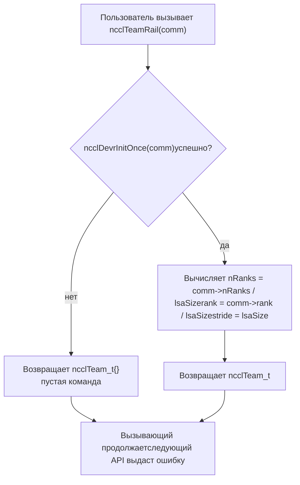
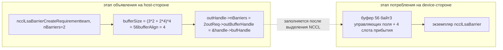
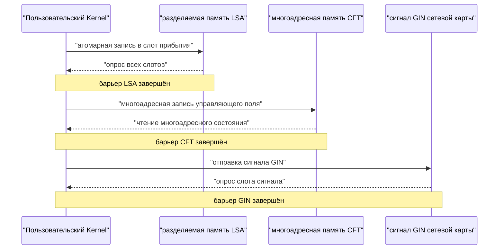
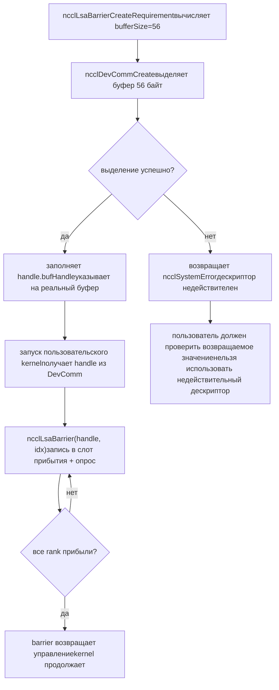
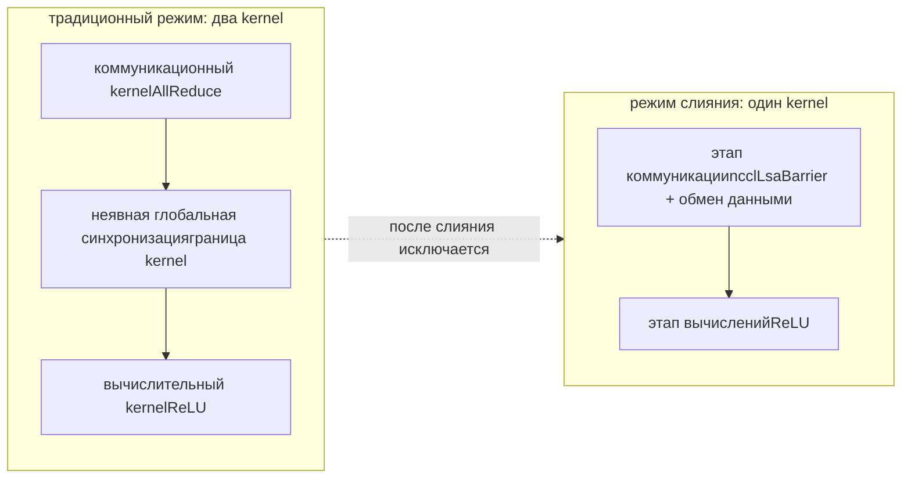

# Глава 20: Нативные API устройств и слияние ядер: вызов коммуникаций из CUDA-ядер

# Глава 20: Нативные API на стороне устройства и слияние операторов: практика nccl_device и kernel fusion

В предыдущей главе мы увидели, как devcomm версионированно отображает метаданные host-стороннего ncclComm на устройство, позволяя ядру читать rank, адреса и состояние соединений. Но «иметь возможность читать метаданные» и «иметь возможность инициировать коммуникацию» — это две разные вещи. Если есть только метаданные, пользовательское ядро в лучшем случае сможет само вычислить адреса и записать флаги; как только дело доходит до синхронизации между rank'ами или передачи сигналов между машинами, всё равно придётся возвращаться на host-сторону и вызывать коллективные API вроде ncclAllReduce — а каждый такой вызов означает запуск ядра и往返 между host и устройством. Каталог src/nccl_device, который мы разбираем в этой главе, — это как раз ключевой шаг NCCL от «библиотеки, которую вызывают» к «модели, которую можно программировать». Он предоставляет не новые алгоритмы коллективной коммуникации, а набор примитивов на стороне устройства: позволяя пользовательскому ядру изнутри вызывать такие операции синхронизации, как ncclBarrier, ncclLsaBarrier, ncclGinBarrier, тем самым упаковывая «коммуникацию» и «вычисления» в одно ядро и устраняя промежуточные накладные расходы на запуск. Исходные материалы этой главы сосредоточены на объявлении требований на host-стороне (CreateRequirement) и абстракции команды (Team) для этой группы примитивов — это и есть вход в API на стороне устройства. Ключевая предпосылка для понимания этой главы: философия дизайна API на стороне устройства — «host-сторона объявляет требования к ресурсам, device-сторона потребляет ресурсы». Host-сторона не создаёт барьер напрямую, а сообщает NCCL: «мне нужно nBarriers барьеров, в команде team.nRanks участников», NCCL на основе этого вычисляет, сколько нужно буферов и сколько GIN-сигналов, а затем на device-стороне инстанцирует эти ресурсы. Такое разделение «объявление-потребление» — фундаментальная причина, по которой код на стороне устройства может работать без указателей host.

# I. Абстракция Team: система координат API на стороне устройства

## Интуитивная модель

Представьте организационную структуру транснациональной компании. Чтобы отправить письмо, сначала нужно знать «кому» — всей компании (World), коллегам в том же офисе (LSA) или команде той же бизнес-линии в разных офисах (Rail).`ncclTeam_t`— это дескриптор «диапазона получателей». Без абстракции Team каждый API на стороне устройства должен был бы заново вычислять «какой я по счёту в этом коммуникационном домене и сколько всего участников», код дублировался бы и был крайне подвержен ошибкам.

## Структура данных и layout в памяти

`ncclTeam_t`— это система координат API на стороне устройства, её три поля определяют**арифметическую прогрессию**：

| Поле | Значение | Аналогия |
| --- | --- | --- |
| `nRanks` | Общее число участников в команде | Сколько человек в группе |
| `rank` | Номер текущего rank в команде | Мой порядковый номер в группе |
| `stride` | Шаг между соседними участниками команды в world | На сколько отличаются номера студентов у двух соседних человек в группе |

`stride`— самое легко упускаемое, но самое ключевое поле. В команде World`stride = 1`, потому что все rank'и расположены подряд; но в команде Rail`stride = lsaSize`, потому что rank'и на одном rail появляются в world только каждые`lsaSize`штук.

[FACT:src/nccl_device/core.cc:13-19]показывает построение команды World: напрямую берётся`comm->nRanks`и`comm->rank`，`stride`фиксируется равным 1. Это единственная команда, которой не нужен`ncclDevrInitOnce`, потому что вся её информация находится в host-стороннем`comm`.

[FACT:src/nccl_device/core.cc:22-33]— это команда LSA. Обратите внимание на`ncclDevrInitOnce(comm)`в L26 — это идемпотентная точка входа для инициализации ресурсов на стороне устройства. Комментарии в L23-25 крайне важны:**здесь ошибка намеренно игнорируется**, потому что если инициализация не удалась, возвращённая team — это «мусорное значение», но следующий API-вызов, которому действительно нужны ресурсы, снова вызовет`ncclDevrInitOnce`и сообщит об ошибке. Это стратегия «отложенного сообщения об ошибке», позволяющая избежать выброса тяжёлых ошибок на такой лёгкой операции, как запрос команды.

## Сценарный Walkthrough: преобразование координат от World к Rail

Предположим, машина с 8 GPU,`lsaSize = 4`(каждые 4 GPU — один домен LSA),`nRanks = 8`. Посмотрим, как`ncclTeamRail`строится:

[FACT:src/nccl_device/core.cc:70-79]в`nRanks = 8 / 4 = 2`，`rank = comm->rank / 4`，`stride = 4`. Если текущий rank — 5, то его`rank = 5 / 4 = 1`，`stride = 4`в команде Rail означает, что члены команды Rail — это rank 1 и rank 5 в world.

Теперь посмотрим на`ncclTeamRankToWorld`формулу пересчёта:

[FACT:src/nccl_device/core.cc:82-84]у`comm->rank + (rank - team.rank) * team.stride`— это**относительное смещение**Вычисление: сначала вычисляется смещение целевого rank относительно текущего rank внутри команды`(rank - team.rank)`, затем умножается на шаг`stride`, прибавляется world-номер текущего rank. Эта формула универсальна для всех команд, потому что`stride`уже кодирует закон расположения команды.

`ncclTeamRankToLsa`же отличается:

[FACT:src/nccl_device/core.cc:87-92]использует`comm->devrState.lsaSelf + (rank - team.rank) * team.stride`. Обратите внимание, что здесь используется`lsaSelf`, а не`comm->rank`— потому что номер LSA становится известен только после инициализации ресурсов на стороне устройства и может отличаться от world rank.

Эта диаграмма раскрывает путь выполнения стратегии «отложенного сообщения об ошибке»: при неудачной инициализации возвращается пустая команда, но вызывающая сторона не прерывается; ошибка будет выявлена на следующем API, которому действительно нужны ресурсы (например,`ncclLsaBarrierCreateRequirement`).

## Размышления о дизайне и подводные камни

**Почему`ncclTeamWorld`не вызывает`ncclDevrInitOnce`？**Потому что информация команды World полностью берётся с host-стороны`comm`, не требует никаких ресурсов на стороне устройства. Принудительный вызов заставит чисто host-операцию запроса зависеть от инициализации на стороне устройства, что добавит ненужные точки отказа.

**Подводные камни**：`ncclTeamRankToLsa`при ошибке инициализации возвращает`-1`（[FACT:src/nccl_device/core.cc:87-92]), а`ncclTeamRankToWorld`никогда не завершается ошибкой. Если вызывающий код смешивает эти две функции и не проверяет возвращаемое значение, при ошибке инициализации LSA он может получить`-1`и использовать его как допустимый rank, что приведёт к выходу за границы. В production-коде следует обрабатывать возвращаемое значение`ncclTeamRankToLsa`как операцию, которая может завершиться ошибкой.

---

# II. Объявление требований Barrier: как host-сторона «резервирует» ресурсы устройства

## Интуитивная модель

Распределение ресурсов на стороне устройства через API похоже на**бронирование переговорной комнаты**: нельзя просто ворваться в переговорную и начать совещание, сначала нужно подать заявку на ресепшене (host-сторона`CreateRequirement`) — «Мне нужно провести 3 встречи, по 8 человек в каждой». Ресепшен на основании этого вычисляет, какой площади помещение потребуется (`bufferSize`), сколько стульев нужно (`ginSignalCount`), а затем выдаёт вам номер помещения (`outBufferHandle`). Без этого механизма бронирования kernel на стороне устройства не знал бы, где находится его буфер barrier и какого он размера, и не мог бы безопасно читать и записывать.

## Структуры данных и разметка памяти

Три функции`CreateRequirement`для трёх barrier используют один и тот же шаблон:**обнулить структуру требований → заполнить размер/выравнивание буфера → заполнить указатель на выходной дескриптор**. Но типы их ресурсов различаются:

| Тип Barrier | Тип ресурса | Формула размера | Выравнивание |
| --- | --- | --- | --- |
| LSA Barrier | Буфер | `(3*n + n*team.nRanks) * sizeof(uint32_t)` | `alignof(uint32_t)` |
| CFT Barrier | Буфер | `(3*n + n*team.nRanks) * NCCL_CFT_BARRIER_GRAN` | `NCCL_CFT_BARRIER_ALIGN` |
| GIN Barrier | GIN-сигнал | `n * team.nRanks`сигналов | Буфер не задействован |

Сначала рассмотрим формулу размера LSA Barrier:

[FACT:src/nccl_device/lsa_barrier.cc:14-22]в`(3 * nBarriers + nBarriers * team.nRanks) * sizeof(uint32_t)`можно разложить на две части:

- `3 * nBarriers`: каждому barrier требуется 3 управляющих поля`uint32_t`([INFERENCE] обычно это «счётчик прибытий», «номер раунда», «флаг состояния»).
- `nBarriers * team.nRanks`: каждому barrier нужно зарезервировать по одному слоту прибытия`uint32_t`для каждого участника команды.

Таким образом, общий размер одного barrier составляет`3 + team.nRanks`штук`uint32_t`. Эта формула полностью совпадает для LSA и CFT, только CFT использует`NCCL_CFT_BARRIER_GRAN`в качестве единицы гранулярности (возможно, для выравнивания на более крупную границу).

GIN Barrier же полностью отличается:

[FACT:src/nccl_device/gin_barrier.cc:14-20]не выделяет буфер, а устанавливает`ginSignalCount = nBarriers * team.nRanks`и направляет`outGinSignalStart`на`signal0`внутри дескриптора. Это связано с тем, что GIN barrier использует путь сетевых сигналов, ему не нужен буфер разделяемой памяти, а нужны слоты сигналов, распознаваемые сетевой картой.

## Сценарный Walkthrough: полное бронирование одного LSA Barrier

Предположим, пользователь хочет создать 2 barrier в команде LSA из 4 GPU:

1. **Вызов** `ncclLsaBarrierCreateRequirement(team, 2, &handle, &req)`。

2. **Обнуление**：`memset(outReq, 0, sizeof(*outReq))`（[FACT:src/nccl_device/lsa_barrier.cc:14-22]) — гарантирует, что неустановленные поля имеют определённые значения, и вызывающий код не прочитает мусор со стека.

3. **Запись количества barrier**：`outHandle->nBarriers = 2`（[FACT:src/nccl_device/lsa_barrier.cc:14-22]）。

4. **Вычисление размера буфера**：`(3*2 + 2*4) * 4 = (6 + 8) * 4 = 56`байт ([FACT:src/nccl_device/lsa_barrier.cc:14-22]）。

5. **Установка выравнивания**：`alignof(uint32_t) = 4`（[FACT:src/nccl_device/lsa_barrier.cc:14-22]）。

6. **Заполнение указателя на дескриптор**：`outReq->outBufferHandle = &outHandle->bufHandle`（[FACT:src/nccl_device/lsa_barrier.cc:14-22]) — чтобы NCCL после фактического выделения буфера записал адрес обратно в дескриптор.

Эта диаграмма потока данных демонстрирует разделение «объявления» и «потребления»: host-сторона только вычисляет размер и указатели, фактическое выделение буфера и создание экземпляра происходят внутри NCCL, а kernel на стороне устройства получает уже заполненный дескриптор.

## Проектные соображения и подводные камни

**Почему используется`memset`для обнуления всего`outReq`？**Потому что`ncclDevResourceRequirements_t`— это многоfield-структура, и разные типы barrier заполняют лишь часть её полей. Обнуление гарантирует, что неиспользуемые поля (например,`ginSignalCount`, не используемое LSA barrier) равны 0, и NCCL внутри на основании этого определяет, что «этот ресурс не нужен». Без обнуления случайные значения со стека могут быть восприняты как «нужен GIN-ресурс», что вызовет проблему ложных срабатываний, упомянутую в предыдущей главе.

**Подводные камни**：`outReq->outBufferHandle = &outHandle->bufHandle`передаёт NCCL адрес внутреннего поля дескриптора. Это означает, что`outHandle`должен оставаться действительным до завершения выделения буфера NCCL (не может быть собран сборщиком мусора со стека или перемещён). Если пользователь поместит`outHandle`в область видимости, которая будет освобождена раньше времени, NCCL при обратной записи запишет в висячий указатель.

> **[Design Inference & Architectural Trade-offs]**
> **Различие в гранулярности CFT Barrier**：[FACT:src/nccl_device/cft_barrier.cc:13-21]использует`NCCL_CFT_BARRIER_GRAN`и`NCCL_CFT_BARRIER_ALIGN`вместо`sizeof(uint32_t)`и`alignof(uint32_t)`из LSA. Это указывает на то, что barrier CFT (возможно, Cross-Fabric Team или подобная кросс-доменная команда) требует более крупной гранулярности выравнивания, вероятно, из-за необходимости пересекать области многоадресной памяти, где аппаратное обеспечение предъявляет более строгие требования к выравниванию адресов.

---

# III. Семантическое разделение трёх Barrier: за что отвечают LSA, CFT и GIN

## Интуитивная модель

Три barrier похожи на три «сбора по свистку» разного масштаба:

- **LSA Barrier**: сбор коллег в одном офисе, через разделяемую память, самый быстрый.
- **CFT Barrier**: сбор в разных офисах, но в одном здании, через многоадресную память, средний.
- **GIN Barrier**: сбор в разных городах и даже странах, через сетевые сигналы, самый медленный, но с самым широким охватом.

Выбор неправильного типа barrier не приведёт к ошибке, но вызовет огромные потери производительности — использовать GIN barrier для синхронизации в одном офисе — всё равно что отправлять файл на соседний стол международной курьерской службой.

## Сравнение структур данных и разметки памяти

С точки зрения объявления требований на host-стороне, потребности в ресурсах у всех трёх совершенно различны:

| Измерение | LSA Barrier | CFT Barrier | GIN Barrier |
| --- | --- | --- | --- |
| Требуется параметр`comm` | Нет | Нет | Да |
| Буфер | Есть | Есть | Нет |
| GIN-сигнал | Нет | Нет | Есть |
| Единица размера | `uint32_t` | `NCCL_CFT_BARRIER_GRAN` | Количество сигналов |
| Поле выходного дескриптора | `bufHandle` | `bufHandle` | `signal0` |

Обратите внимание, что GIN Barrier — единственный, которому требуется параметр`comm`:

[FACT:src/nccl_device/gin_barrier.cc:14-20]сигнатура функции включает`ncclComm_t comm`, тогда как сигнатуры LSA и CFT содержат только`ncclTeam_t team`. Это связано с тем, что сигнал GIN должен быть привязан к конкретному сетевому соединению, а информация о сетевом соединении находится в`comm`.

## Сценарий-ориентированный Walkthrough: распределение сигналов GIN Barrier

[FACT:src/nccl_device/gin_barrier.cc:14-20]логика проще, чем у LSA, но семантика более тонкая:

1. **обнуление**：`memset(outReq, 0, sizeof(*outReq))`（L16）。

2. **установка количества сигналов**：`outReq->ginSignalCount = nBarriers * team.nRanks`(L17) — каждый barrier должен выделить один слот сигнала для каждого члена команды.

3. **заполнение начального указателя сигналов**：`outReq->outGinSignalStart = &outHandle->signal0`(L18) — обратите внимание, здесь не устанавливается`bufferSize`, поскольку GIN barrier не использует буфер разделяемой памяти.

> **[Design Inference & Architectural Trade-offs]**
> `signal0`это имя предполагает, что в дескрипторе может быть набор последовательных полей сигналов (`signal0`, `signal1`, ...），`outGinSignalStart`указывает на первый, и NCCL на основе этого знает, откуда начинать выделение`nBarriers * team.nRanks`сигналов.

## Управление конкурентностью и взаимодействие с оборудованием

Механизмы управления конкурентностью у трёх типов barrier полностью различаются:

- **LSA Barrier**: атомарные операции на основе разделяемой памяти.`3 + team.nRanks`из`uint32_t`, для отметки прибытия в слот используется атомарное сложение или атомарная запись «я прибыл», а управляющее поле проверяется атомарным чтением «все ли прибыли». Это чисто внутри-GPU синхронизация, не затрагивающая сеть.
- **CFT Barrier**: на основе многоадресной памяти (multimem). [INFERENCE] Многоадресная память позволяет одной операции записи одновременно обновлять представление нескольких rank, поэтому CFT barrier может реализовать более широкую синхронизацию с меньшим числом управляющих полей.
- **GIN Barrier**: на основе сетевых сигналов.`ginSignalCount`сигналов отправляются через сетевой адаптер, получатель опрашивает слоты сигналов. Это единственный barrier, затрагивающий межмашинное оборудование.

Эта временная диаграмма показывает уровни взаимодействия с оборудованием для трёх типов barrier: от чисто внутри-GPU синхронизации к многоадресной памяти и далее к сигналам сетевого адаптера; задержка последовательно возрастает, а охват также последовательно расширяется.

## Проектные соображения и подводные камни

**Почему LSA и CFT не требуют`comm`параметра?**Потому что их ресурсы (разделяемая память, многоадресная память) уже на этапе`ncclDevrInitOnce`привязаны к команде,`team`сам по себе неявно содержит информацию о расположении ресурсов. А сигналы GIN требуют динамического выделения сетевых ресурсов, поэтому необходимо через`comm`обращаться к состоянию сетевого соединения.

**Подводные камни**: у GIN Barrier`ginSignalCount`равно`nBarriers * team.nRanks`, и если команда большая (например, 1024 rank) и barrier'ов много (например, 100), общее количество сигналов достигнет 102400. Слоты сигналов сетевого адаптера — ограниченный ресурс, чрезмерный запрос может привести к`ncclDevrInitOnce`сбою. Производственный код должен запрашивать минимально необходимое количество barrier'ов, а не запрашивать большое количество про запас.

---

# IV. От объявления требования до потребления на стороне устройства: полный жизненный цикл

## Интуитивная модель

`CreateRequirement`это лишь «размещение заказа», реальная «отправка» и «получение» происходят внутри NCCL и в kernel на стороне устройства. Весь жизненный цикл похож на**онлайн-покупки**: вы размещаете заказ (CreateRequirement) → продавец готовит товар (NCCL выделяет ресурсы) → курьер доставляет (ресурсы привязываются к DevComm) → вы подписываете и используете (kernel на стороне device вызывает barrier).

## Структуры данных и размещение в памяти: эволюция полей дескриптора

На примере`ncclLsaBarrierHandle_t`, он проходит три этапа в жизненном цикле:

| Этап | `nBarriers` | `bufHandle` | Другие поля |
| --- | --- | --- | --- |
| После CreateRequirement | Установлено | Адрес заполнен, но содержимое не выделено | Не установлено |
| После выделения NCCL | Установлено | Указывает на фактический буфер | Установлено |
| Использование на стороне Device | Только чтение | Только чтение | Только чтение |

[FACT:src/nccl_device/lsa_barrier.cc:14-22]устанавливает`nBarriers`，[FACT:src/nccl_device/lsa_barrier.cc:14-22]заполняет`bufHandle`адрес. Между этими двумя операциями NCCL внутри выполняет фактическое выделение буфера.

## Сценарий-ориентированный Walkthrough: полное использование barrier

1. **Объявление на стороне Host**: пользователь вызывает`ncclLsaBarrierCreateRequirement(team, 2, &handle, &req)`, получает`req.bufferSize = 56`。

2. **Отправка на стороне Host**: пользователь передаёт`req`в`ncclDevCommCreate`(содержание предыдущей главы), NCCL выделяет буфер размером 56 байт и записывает адрес в`handle.bufHandle`。

3. **Инициализация на стороне Device**: при запуске пользовательского kernel из DevComm извлекается`handle`, с помощью`bufHandle`определяется местоположение буфера.

4. **Синхронизация на стороне Device**: kernel вызывает`ncclLsaBarrier(handle, barrierIndex)`, записывает метку прибытия в соответствующий слот буфера, опрашивает остальные слоты.

5. **Завершение на стороне Device**: после прибытия всех rank barrier возвращает управление, kernel продолжает выполнение.

Эта диаграмма решений показывает полный путь от объявления до использования, а также ветвь ошибки при сбое выделения. Обратите внимание, что`ncclLsaBarrierCreateRequirement`сам по себе всегда возвращает`ncclSuccess`（[FACT:src/nccl_device/lsa_barrier.cc:14-22]), реальный сбой происходит на последующем этапе выделения ресурсов.

## Управление конкурентностью и взаимодействие с оборудованием

Ядро управления конкурентностью barrier на стороне устройства —**атомарные операции + барьеры памяти**. На примере LSA barrier:

- **Этап прибытия**: каждый rank с помощью атомарной записи (или атомарного сложения) обновляет свой слот прибытия. На этом шаге обязательно должна использоваться семантика release, гарантирующая, что все операции с памятью до barrier видны другим rank.
- **Этап опроса**: каждый rank с помощью атомарного чтения (или volatile-чтения) проверяет все слоты. На этом шаге обязательно должна использоваться семантика acquire, гарантирующая, что после обнаружения «все прибыли» можно прочитать данные, записанные другими до их barrier.
- **Этап сброса**: после завершения barrier необходимо сбросить слоты для следующего использования. Управление конкурентностью на этом шаге наиболее тонкое — если сбросить слишком рано, можно перезаписать метки rank, которые ещё не прочитали их.

> **[Design Inference & Architectural Trade-offs]**
> `3 * nBarriers`Несколько управляющих полей, вероятно, предназначены для обработки таких «раундов»: одно поле записывает текущий раунд, одно поле записывает счётчик достижений, одно поле служит флагом сброса. Таким образом, несколько барьеров могут повторно использовать один и тот же набор слотов без путаницы раундов.

## Руководство по избеганию проблем в production

**Проблема 1: управление жизненным циклом дескриптора**。`outReq->outBufferHandle = &outHandle->bufHandle`Адрес внутреннего поля дескриптора передаётся в NCCL. Если пользователь`ncclDevCommCreate`уничтожил его до возврата`outHandle`, то при обратной записи NCCL произойдёт запись в освобождённую память. Правильный подход — привязать жизненный цикл`outHandle`к DevComm, а не к области видимости функции, создавшей его.

**Проблема 2: произведение количества барьеров на размер команды**。`bufferSize = (3*n + n*team.nRanks) * sizeof(uint32_t)`В`n*team.nRanks`элемент при больших командах начинает доминировать по размеру. 1024 ранга, 100 барьеров требуют`100*1024*4 = 409600`байт, примерно 400 КБ. Если каждый ранг запрашивает столько, нагрузка на видеопамять становится недопустимой. Следует запрашивать память по фактическому количеству одновременно используемых барьеров, а не по общему количеству барьеров.

**Проблема 3: исчерпание сигналов GIN barrier**. Сигналы GIN — это ресурс сетевой карты, их количество ограничено. Если несколько DevComm одновременно запрашивают большое количество сигналов GIN, слоты сетевой карты могут быть исчерпаны. В production-коде при неудачном создании DevComm следует проверить, не вызвано ли это нехваткой сигналов GIN, и рассмотреть возможность уменьшения`nBarriers`или перехода на LSA barrier.

**Проблема 4: отложенное проявление ошибок инициализации**。`ncclTeamLsa`Функции вроде`ncclDevrInitOnce`при неудаче[FACT:src/nccl_device/core.cc:22-33]возвращают пустую команду (`team.nRanks > 0`）。

---

# ), не сообщая об ошибке. Если пользовательский код не проверяет возвращаемые значения последующих API, он может продолжать работу с пустой командой, что приводит к трудно локализуемым ошибкам. Рекомендуется при первом использовании device-side API явно проверять валидность команды (например,

## V. Слияние ядер: зачем запихивать коммуникацию и вычисления в одно ядро

Интуитивная модель**В традиционной модели один «AllReduce + функция активации» требует двух ядер: одно для коммуникации, одно для вычислений. Между двумя ядрами происходит неявная глобальная синхронизация — коммуникационное ядро должно полностью завершиться, прежде чем вычислительное ядро сможет начать. Это как**эстафета**: первый бегун должен передать палочку второму, и в момент передачи оба ждут. Слияние ядер позволяет одному и тому же ядру выполнять и коммуникацию, и вычисления, как**человек, который бежит и одновременно меняет обувь

## , устраняя ожидание при передаче.

Структуры данных и раскладка памяти

- **Ключевой момент слияния ядер: коммуникационные примитивы (такие как barrier) и вычислительная логика разделяют регистры и разделяемую память одного ядра. Это означает:**Давление на регистры
- **: атомарные операции и циклы опроса коммуникационных примитивов занимают регистры, урезая бюджет регистров для вычислительной логики.**Конкуренция за разделяемую память
- **: если буфер LSA barrier размещён в разделяемой памяти, он будет конкурировать с потребностями вычислительной логики в разделяемой памяти.**Влияние на Occupancy

> **[Design Inference & Architectural Trade-offs]**
> 〔Проектные предположения и архитектурные компромиссы〕

## Дизайн device-side API (объявление ресурсов на host-стороне, потребление на device-стороне) как раз направлен на смягчение этих нагрузок: ресурсы предварительно выделяются на host-стороне, device-side ядру нужно только читать и писать, без динамического запроса, что снижает занятость регистров.

Сценарный Walkthrough: поток выполнения слитого ядра

1. **Предположим, пользователь хочет написать слитое ядро «AllReduce + ReLU»:**Подготовка на host-стороне`ncclLsaBarrierCreateRequirement`: вызов`ncclDevCommCreate`для запроса barrier, вызов

2. **для выделения ресурсов.**Запуск ядра

3. **: пользовательское ядро принимает DevComm и дескриптор barrier в качестве параметров.**Фаза коммуникации`ncclLsaBarrier`: внутри ядра вызывается

4. **для синхронизации всех рангов, затем ранги обмениваются данными (через прямое чтение/запись симметричной памяти).**Фаза вычислений

5. **: после завершения синхронизации ядро напрямую выполняет ReLU над локальными данными, без дополнительного запуска ядра.**Завершение

Копировать

## Эта сравнительная диаграмма показывает ключевую выгоду слияния: устранение неявной глобальной синхронизации на границе ядер. В традиционной модели цена этой синхронизации — задержка двух запусков ядер плюс опустошение конвейера GPU.

**Проектные размышления и подводные камни**Почему device-side API не предоставляет напрямую «слитый AllReduce»?**Потому что конкретная форма слияния зависит от вычислительной логики пользователя. NCCL предоставляет**примитивы**(barrier, сигналы, доступ к симметричной памяти), а не**готовые решения

**(слитый AllReduce+ReLU). Пользователь должен сам комбинировать эти примитивы, чтобы реализовать слитое ядро, соответствующее его потребностям. Это принципиальное различие между «моделью программирования» и «библиотекой».**：Отладка объединённого kernel значительно сложнее, чем раздельного. Если в логике барьера есть ошибка, это может привести к зависанию kernel (взаимоблокировке), а зависание GPU kernel диагностировать не так просто, как зависание host-процесса. Рекомендуется добавить в объединённый kernel механизм тайм-аута или сначала проверить логику барьера на небольшой команде.

**Подводные камни**：Снижение occupancy объединённого kernel может привести к потерям производительности вычислений, превышающим выигрыш от экономии на коммуникации. Прежде чем принимать решение об объединении, следует измерить сквозное время до и после объединения, а не только снижение задержки коммуникации.

# Вопросы для размышления и самопроверки в этой главе

Q1: Если убрать из`ncclTeamLsa`в L26 вызов`ncclDevrInitOnce`и напрямую вернуть`comm->devrState.lsaSize`и`lsaSelf`, в каких сценариях device-side kernel прочитает некорректную информацию о команде?

**Разбор ответа**：`ncclDevrInitOnce`— это идемпотентная точка входа для инициализации device-side ресурсов. Если её убрать,`comm->devrState.lsaSize`и`lsaSelf`могут остаться начальными значениями (обычно 0 или неопределёнными). В сценарии первого использования device-side API пользовательский вызов`ncclTeamLsa`вернёт`nRanks = 0`пустую команду. Если в дальнейшем пользователь не проверит валидность команды и напрямую вызовет с этой командой`ncclLsaBarrierCreateRequirement`, будет вычислено`bufferSize = (3*n + n*0) * 4 = 12n`байт — меньше, чем реально необходимо, поскольку`n*team.nRanks`становится равным 0. Это приведёт к переполнению буфера: во время работы барьера будет предпринята попытка записать`team.nRanks`слотов прибытия, но в буфере выделено только`3n`места для`uint32_t`. Что ещё более скрыто: если`lsaSelf`также равно 0,`ncclTeamRankToLsa`вернёт неправильный номер rank, из-за чего слот прибытия барьера будет записан не туда, и, возможно, никогда не дождётся прибытия всех rank, что приведёт к зависанию kernel. Именно это и должна предотвращать стратегия, описанная в комментариях к L23-25 — «вернуть мусорное значение, следующий API сообщит об ошибке», — но при условии, что следующий API действительно сообщит об ошибке, а не будет молча использовать неправильный размер.

Q2：`ncclLsaBarrierCreateRequirement`Формула размера имеет вид`(3*nBarriers + nBarriers*team.nRanks) * sizeof(uint32_t)`. Если в команде 8 rank, пользователь запрашивает 1 барьер, буфер составляет 44 байта. Предположим, что в реализации барьера «3 управляющих поля» — это «счётчик прибытий», «раунд» и «флаг сброса». Проследите: что произойдёт, когда 8 rank одновременно прибудут, если «счётчик прибытий» использует неатомарную`++`операцию?

**Разбор ответа**: неатомарная`++`на GPU — это три шага «чтение-изменение-запись», а не атомарная операция. Когда 8 rank одновременно выполняют`count++`, может возникнуть ситуация, при которой несколько rank прочитают одно и то же старое значение (например, все прочитают 0), а затем все запишут обратно 1. В итоге`count`увеличится только на 1, а не на 8, из-за чего барьер всегда будет считать, что «ещё не все собрались», и все rank зациклятся на этапе опроса. Именно поэтому слот прибытия LSA barrier должен использовать атомарные операции (например,`atomicAdd`) или каждый rank должен писать в свой отдельный слот (пункт`nBarriers * team.nRanks`как раз резервирует отдельный слот для каждого rank). Если применить схему «каждый rank пишет в свой слот», атомарное сложение не нужно — достаточно атомарной записи + барьера памяти, поскольку у каждого слота только один писатель. Это также объясняет, почему в формуле размера есть пункт`nBarriers * team.nRanks`— он обменивает пространство на атомарность, избегая конкуренции нескольких писателей.

Q3：`ncclGinBarrierCreateRequirement`требует`comm`параметра, а`ncclLsaBarrierCreateRequirement`— нет. Если принудительно добавить`comm`параметр и в LSA barrier (предположим, для унификации интерфейса), какие проблемы проектирования это вызовет? И наоборот, если убрать`comm`параметр у GIN barrier, в каких сценариях это приведёт к сбою?

**Разбор ответа**: Проблема добавления`comm`параметра в LSA barrier — это внесение ненужной зависимости. Ресурсы LSA barrier (разделяемая память) уже привязаны к команде на этапе`ncclDevrInitOnce`,`team`сам по себе подразумевает расположение ресурсов. Добавление`comm`заставит чисто командную операцию зависеть от состояния коммуникационного домена, увеличит число точек отказа (например, при недействительном`comm`LSA barrier также не сможет быть создан) и нарушит принцип «минимальных привилегий». И наоборот, удаление`comm`параметра у GIN barrier приведёт к сбою, потому что GIN-сигнал должен быть привязан к конкретному сетевому соединению.`ncclGinBarrierCreateRequirement`В`ginSignalCount`нужно знать, на какой сетевой адаптер и какой QP (Queue Pair) отправлять сигнал; эта информация находится в состоянии сетевого транспортного уровня`comm`. Без`comm`NCCL не сможет определить, в слот какого сетевого адаптера должен быть направлен сигнал, и не сможет гарантировать корректную маршрутизацию сигнала к целевому rank. Это отражает один из принципов проектирования device-side API:**объявление потребности в ресурсах зависит только от того контекста, который действительно необходим**— LSA нужна только топология команды, GIN нужно сетевое соединение.

---

Device-side API и объединение с kernel превращают NCCL из «библиотеки, которую вы вызываете» в «модель, на которой вы программируете».`ncclTeam_t`предоставляет систему координат,`CreateRequirement`предоставляет механизм резервирования ресурсов, а три типа барьеров охватывают весь диапазон синхронизации от разделяемой памяти до сетевых сигналов. Но объявить ресурсы и написать объединённый kernel — ещё не значит получить хорошую производительность: количество барьеров, размер команды, гранулярность объединения — каждый из этих выборов влияет на сквозную производительность. В следующей главе мы перейдём к практической настройке производительности и посмотрим, как параметры tuning влияют на выбор алгоритма и как с помощью реальных benchmark проверить эффект от настройки.

Итак, мы прошли весь путь от сопоставления метаданных devcomm до примитивов на стороне устройства nccl_device и увидели, как NCCL через модель «объявление на хосте, потребление на устройстве» позволяет пользовательскому ядру напрямую вызывать барьерные синхронизационные операции, объединяя коммуникацию и вычисления в одном ядре. Но после освоения этих механизмов естественно возникает более практичный вопрос: когда производительность реальной задачи обучения не соответствует требованиям, как определить, вызвано ли это неправильным выбором алгоритма, несоответствием протокола или нерациональной конфигурацией числа каналов? В следующей главе механизмы первых 20 глав будут объединены в практическую методологию тюнинга, которая на основе отчётов о производительности, модели стоимости и переменных окружения даст путь диагностики от симптома к первопричине.
