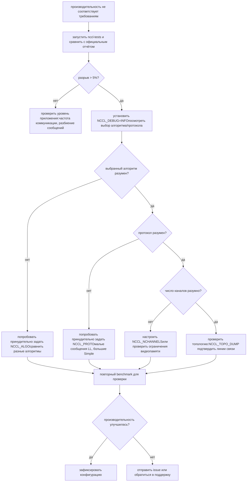

# Глава 21: Практика тюнинга производительности: методология бенчмаркинга и анализ узких мест

# Глава 21: Практика тюнинга производительности: практические приёмы tuning, инструменты benchmark и методология тюнинга

В предыдущей главе мы увидели, как пользовательское ядро через API на стороне устройства взаимодействует с коммуникационными примитивами NCCL и даже объединяет коммуникацию и вычисления в одном ядре. Это открывает возможность использования NCCL как модели программирования, но также порождает практический вопрос: когда производительность коммуникации ниже ожидаемой, с чего начать? NCCL предоставляет сотни NCCL_PARAM, но реально определяют, по какому пути пойдёт коллективная коммуникация, всего три регулятора: алгоритм (Algo), протокол (Proto) и число каналов (nChannels). В этой главе механизмы первых 20 глав объединяются в практический путь диагностики — сначала посмотреть отчёт о производительности, чтобы локализовать симптом, затем прочитать модель стоимости, чтобы понять, как выбирает сам NCCL, и наконец с помощью переменных окружения и benchmark проверить вашу гипотезу.

# 21.1 Отчёт о производительности: сначала建立 базовую линию «нормы»

Первый шаг тюнинга — не менять параметры, а знать, как выглядит «норма». Если вы даже не знаете, какова пиковая пропускная способность текущей системы, любой тюнинг — это слепое угадывание.

NCCL официально публикует эталонные данные о производительности в`docs/perf`, и их назначение совершенно ясно — это не гарантия продуктного уровня, а опорная точка для согласования ожиданий.

[FACT:docs/perf/README.md:3-14]

```
NCCL publishes reference performance data to:

1. Provide reference points that help users align performance expectations.
2. Help users validate their system setup.
3. Reduce repeated requests to the NCCL team for basic performance numbers.

These results are references, and NOT product-level guarantees that the same
performance is achievable on every system. Performance depends on a complex
combination of software versions, system configuration, hardware, and operating
conditions, including factors outside NCCL's control. A difference within 5% is
generally considered acceptable variance due to differences in the underlying
systems.
```

Здесь есть две ключевые вещи, которые новички легко упускают:

Во-первых,**различия в пределах 5% считаются нормальными колебаниями**. Это означает, что если вы измерили на 3% ниже официального значения, не спешите менять параметры — сначала убедитесь, что это не шум измерения, дрожание тактовой частоты GPU или помехи от соседних задач.

Во-вторых,**официально публикуется только пиковая пропускная способность, но не задержка**。

[FACT:docs/perf/README.md:24-24]

```
We publish peak bandwidth for a selection of commonly used platforms. We do not
currently publish latency because it is typically more sensitive to factors
outside NCCL's control.
```

> **[Design Inference & Architectural Trade-offs]**
> Почему задержка не публикуется? Потому что задержка чрезвычайно чувствительна к состоянию системы — частота CPU, состояние канала PCIe, версия прошивки сетевой карты и даже политика питания BIOS влияют на неё. Пропускная способность на больших сообщениях стремится к насыщению и относительно стабильна; задержка на малых сообщениях складывается из бесчисленных мельчайших звеньев, и дрожание любого из них усиливается. Поэтому при тюнинге**для больших сообщений смотрят на пропускную способность, для малых — на задержку**, это два разных пути диагностики.

[FACT:docs/perf/README.md:24-24]

```
If your workload differs significantly from the published results, open an
issue in the [NCCL repository](https://github.com/NVIDIA/nccl/issues) or contact
NVIDIA Support. We will try our best to help.
```

**Первое правило порядка диагностики**: сначала запустите стандартный benchmark (например,`nccl-tests`из`all_reduce_perf`), сравните результат с официальным отчётом. Если расхождение в пределах 5%, значит с конфигурацией системы всё в порядке, а узкое место производительности находится на уровне вашего приложения (например, частота коммуникации, способ разбиения сообщений); если расхождение значительно, только тогда переходите к тюнингу параметров NCCL.

# 21.2 Модель стоимости: как NCCL сам выбирает алгоритм и протокол

Чтобы тюнинговать параметры, сначала нужно понять, как NCCL выбирает по умолчанию. Внутри у него есть «модель стоимости» (cost model), по сути это таблица поиска + вычисление по формулам: для заданного размера сообщения, типа топологии и числа рангов оценивается время каждого сочетания «алгоритм × протокол», и выбирается наименьшее.

## Интуитивная модель

Представьте модель стоимости как навигатор. Вы вводите начальную и конечную точки (размер сообщения, топология), он внутренне оценивает время для каждого маршрута (сочетания алгоритм/протокол) и рекомендует самый быстрый. Оценка навигатора основана на исторических данных и классах дорог, оценка NCCL — на жёстко закодированной таблице параметров задержки/пропускной способности.

Без этой модели NCCL мог бы использовать один фиксированный алгоритм для всех сценариев — малые сообщения замедлялись бы из-за слишком больших накладных расходов на запуск, большие — из-за недостаточного использования пропускной способности, и система плохо работала бы на обоих полюсах.

## Структура данных: таблица модели и контекст тюнинга

Ядро модели стоимости — массив`modelMap`, каждый элемент соответствует одному сочетанию «алгоритм/протокол/симметричное ядро».

[FACT:src/tuning/cost_model.cc:230-277]

```
static struct ncclTuningModelEntry_t modelMap[] = {
    /*
Initialize default, static models here
{mod_init, mod_sim, mod_final, enabled}
Enable order: Broadcast, Reduce, AllGather, ReduceScatter, AllReduce
*/
  {ncclTuningTreeModelInit, ncclTuningTreeModelSim, nullptr, {0, 0, 0, 0, 1}},       // Tree/LL
  {ncclTuningTreeModelInit, ncclTuningTreeModelSim, nullptr, {0, 0, 0, 0, 1}},       // Tree/LL128
  {ncclTuningTreeModelInit, ncclTuningTreeModelSim, nullptr, {0, 0, 0, 0, 1}},       // Tree/Simple
  {ncclTuningRingModelInit, ncclTuningRingModelSim, nullptr, {1, 1, 1, 1, 1}},       // Ring/LL
  ...
```

Каждая запись имеет четыре поля:`mod_init`(функция инициализации),`mod_sim`(функция моделирования),`mod_final`(функция очистки),`enabled`(флаги включения для каждого из 5 функций).`enabled`Порядок массива`{Broadcast, Reduce, AllGather, ReduceScatter, AllReduce}`—

> **[Design Inference & Architectural Trade-offs]**
> 〔Проектные предположения и архитектурные компромиссы〕**Ключевое наблюдение:**（`{0,0,0,0,1}`Tree включён только для AllReduce`{1,1,1,1,1}`). Это связано с тем, что преимущество алгоритма Tree заключается в том, что фаза редукции AllReduce может выполняться параллельно, но для таких операций, как AllGather/ReduceScatter, которые по своей сути являются кольцевым конвейером, Ring более естественен.

Конкретные параметры модели находятся в`ncclTunerConstants_t`, включая базовую задержку и пропускную способность для каждой топологии.

[FACT:src/tuning/cost_model.cc:142-152]

```
static const ncclTunerConstants_t ncclTunerConstantsDefaults = {
    // baseLatencies
  {
    {6.8, 14.0, 8.4},  // Tree
    {6.6, 14.0, 8.4},  // Ring
    {0, 0, 0},         // Collnet Direct
    {0, 0, 0},         // Collnet Chain
    {0, 0, 0},         // NVLS
    {0, 0, 0},         // NVLS Tree
    {8.0, 8.0, 8.0}    // PAT
  },
```

Каждый алгоритм имеет три значения базовой задержки, соответствующие трём протоколам LL / LL128 / Simple. Например, для Ring`{6.6, 14.0, 8.4}`означает: базовая задержка протокола LL — 6.6 микросекунды, LL128 — 14.0, Simple — 8.4. Эти числа — эмпирические значения, измеренные NVIDIA на реальном оборудовании.

Аппаратная задержка указывается отдельно по типу топологии (NVLink / PCI / NET).

[FACT:src/tuning/cost_model.cc:153-184]

```
    // hwLatencies
  {
    /* NVLINK */
    {
      {0.6, 1.25, 4.0}, // Tree (LL/LL128/Simple)
      {0.6, 1.9, 3.4},  // Ring (LL/LL128/Simple)
      ...
    },
    /* PCI */
    {
      {1.0, 1.9, 4.0}, // Tree (LL/LL128/Simple)
      {1.0, 2.5, 5.7}, // Ring (LL/LL128/Simple)
      ...
    },
    /* NET */
    {
      {5.0, 8.5, 14},   // Tree (LL/LL128/Simple)
      {2.7, 4.0, 14.0}, // Ring (LL/LL128/Simple)
      ...
    },
  },
```

При сравнении сразу видны различия топологий: задержка на каждый переход для Ring/Simple на NVLink составляет 3.4 микросекунды, на PCI — 5.7, на NET — 14.0. Вот почему межмашинная коммуникация медленная — каждый переход требует дополнительных 10 микросекунд.

Параметры пропускной способности приводятся по поколениям архитектуры GPU.

[FACT:src/tuning/cost_model.cc:183-183]

```
    // llMaxBws
  {
    {39.0, 39.0, 20.4}, /* Volta-N1/Intel-N2/Intel-N4) */
    {87.7, 22.5 /*avg of ring & tree*/, 19.0}, /* Ampere-N1/AMD-N2/AMD-N4) */
    {141.0, 45.0 /*avg of ring & tree*/, 35.0}, /* Hopper-N1/AMD-N2/AMD-N4) */
    {2 * 141.2, 2 * 45.0 /*avg of ring & tree*/, 2 * 35.0}, /* Blackwell-N1/AMD-N2/AMD-N4) */
  },
```

Каждая строка соответствует одному поколению архитектуры, три значения — это максимальная пропускная способность протокола LL в сценариях одной машины (N1), двух машин (N2) и четырёх машин (N4). Hopper на одной машине — 141 GB/s, Blackwell удваивается до 282 GB/s — это объясняет, почему на новых картах тот же алгоритм показывает гораздо лучшие результаты.

## Контекст настройки: состояние per-comm

Каждый коммуникационный домен (communicator) хранит`ncclTuningContext_t`, сохраняющий состояние настройки этого comm.

[FACT:src/include/tuning.h:81-95]

```
struct ncclTuningContext_t {
  // Persistant tuning parameters tied to a communicator.
  ncclTunerConstants_t tuningConstants;
  // State of the tuning models
  // Forced function is set via env var
  int forced[NCCL_NUM_FUNCTIONS];
  // Disabled tuning models are not execute and excluded from implemetation selection.
  int enabled[NCCL_TUNING_COUNT][NCCL_NUM_FUNCTIONS];
  // Store of model contexts per communicator.
  float generalLatencies[NCCL_NUM_FUNCTIONS][NCCL_NUM_ALGORITHMS][NCCL_NUM_PROTOCOLS];
  float generalBandwidths[NCCL_NUM_FUNCTIONS][NCCL_NUM_ALGORITHMS][NCCL_NUM_PROTOCOLS];

  ssize_t threadThresholds[NCCL_NUM_ALGORITHMS][NCCL_NUM_PROTOCOLS];
  int maxThreads[NCCL_NUM_ALGORITHMS][NCCL_NUM_PROTOCOLS];
};
```

Четыре ключевых поля:

- `forced[NCCL_NUM_FUNCTIONS]`: отмечает, для каких функций алгоритм/протокол принудительно задан переменными окружения. Это точка применения`NCCL_ALGO`/`NCCL_PROTO`.
- `enabled[NCCL_TUNING_COUNT][NCCL_NUM_FUNCTIONS]`: двумерная булева таблица, отмечающая, включена ли определённая модель для определённой функции. Отключённые модели не участвуют в выборе.
- `generalLatencies` / `generalBandwidths`: трёхмерный массив, хранящий оценочные задержку и пропускную способность по «функция × алгоритм × протокол». Это источник той большой таблицы, которую печатает`ncclTuningInit`.
- `threadThresholds` / `maxThreads`: пороги, связанные с числом потоков, определяющие, сколько потоков использовать на каждый block.

## Сценарный Walkthrough: выбор алгоритма для одного AllReduce

Предположим, вы вызываете`ncclAllReduce`, размер сообщения 1MB, 8 карт на одной машине NVLink. Внутри NCCL будет создан`ncclTuningInput_t`, затем вызывается`ncclTuningCompute`。

[FACT:src/tuning/tuning.cc:180-202]

```
ncclResult_t ncclTuningCompute(struct ncclTuningInput_t* const input, struct ncclTuningResult_t* const result) {
  ncclResult_t ret = ncclSuccess;
  TRACE(NCCL_TUNING, ...);
  struct ncclTuningResultList_t tunings;
  tunings.head = nullptr;
  struct ncclTuningResult_t bestTuning = NCCL_TUNING_RESULT_INIT;
  // Set tuning to Ring/Simple for single rank case
  if (input->comm->nRanks tuningMask & (1ULL forced = input->comm->tuningContext.forced[input->func];
  NCCLCHECKGOTO(getModelEntry(id, &model), ret, not_valid);
  if (model == nullptr) {
    ret = ncclInternalError;
    goto not_valid;
  }
  if (input->comm->tuningContext.enabled[id][input->func] == 0) {
    goto not_valid;
  }
  if (model->model != nullptr) {
    NCCLCHECKGOTO(model->model(input, result), ret, not_valid);
    if (result->timeUs timeUs = NCCL_TUNING_IGNORE;
  result->valid = 0;
  goto exit;
}
```

Обратите внимание на обработку метки`not_valid`: любой сбой на любом шаге (модель не существует, отключена, симуляция возвращает неположительное время) приводит к установке`timeUs`в`NCCL_TUNING_IGNORE`、`valid`и установке 0. Этот кандидат исключается из последующего выбора.

Шаг четвёртый: из всех допустимых кандидатов выбирается наименее затратный по времени.

[FACT:src/tuning/tuning.cc:155-173]

```
static ncclResult_t ncclTuningSelectBestTuning(struct ncclTuningResultList_t* tunings,
                                               struct ncclTuningResult_t* const bestTuning) {
  bestTuning->timeUs = FLT_MAX;
  float bestSelectionTimeUs = FLT_MAX;
  struct ncclTuningResultListNode* node = tunings->head;
  while (node != nullptr) {
    const struct ncclTuningResult_t& tuning = node->result;
    float selectionTimeUs = tuning.selectionTimeUs > 0.0f ? tuning.selectionTimeUs : tuning.timeUs;
    TRACE(NCCL_TUNING, "A/P/S %s/%s/%s, time: %f, selection time: %f", ...);
    if (selectionTimeUs next;
  }
  return ncclSuccess;
}
```

Здесь есть деталь: для выбора используется`selectionTimeUs`, если оно больше 0, используется оно, иначе происходит откат к`timeUs`。`selectionTimeUs`— это «время выбора», которое может включать дополнительные штрафы (например, некоторые алгоритмы в определённых сценариях требуют дополнительных затрат). Это даёт модели стоимости возможность разделять «оценочное время» и «время выбора».

## Блок-схема

```mermaid
flowchart TD
    start["ncclTuningCompute(input, result)"] --> check_ranks{"comm->nRanks |да| single["bestTuning = Ring/SimplenChannels = 0"]
    check_ranks -->|нет| all["ncclTuningComputeAllTunings()"]
    all --> loop{"перебор i in NCCL_TUNING_COUNT"}
    loop -->|mask не совпал| skip["tuning.valid = 0continue"]
    loop -->|mask совпал| expand["ncclTuningExpandId(i, ...)"]
    expand --> sim["ncclTuningComputeTuning()→ ncclTuningCostModelSimModel()"]
    sim --> sim_check{"enabled[id][func] != 0и model->model != nullptr?"}
    sim_check -->|нет| invalid["timeUs = NCCL_TUNING_IGNOREvalid = 0"]
    sim_check -->|да| push["ncclTuningResultListPushFront()"]
    skip --> loop
    invalid --> loop
    push --> loop
    loop -->|перебор завершён| tuner_check{"comm->tuner != NULL?"}
    tuner_check -->|да| plugin["tuner->getCollInfo()переопределяет generalTable"]
    tuner_check -->|нет| select["ncclTuningSelectBestTuning()"]
    plugin --> select
    select --> channels["ncclTuningGetChannels()"]
    channels --> eff{"CTAPolicy & EFFICIENCYи NCCL_ALGO/NCCL_PROTO не заданы?"}
    eff -->|да| nvls["попытка переопределения NVLSncclNvlsRegResourcesQuery()"]
    eff -->|нет| done["*result = bestTuning"]
    nvls --> done
    single --> done
```

Эта диаграмма полностью отображает путь принятия решений от входа до конечного результата, включая короткое замыкание для одного rank, фильтрацию по маске, отключение моделей, вмешательство плагина tuner, переопределение CTAPolicy и все остальные ветви.

# 21.3 Переменные окружения: три ручки, реально влияющие на производительность

Поняв модель стоимости, становится ясно, как вмешиваются переменные окружения.`NCCL_ALGO`、`NCCL_PROTO`、`NCCL_SYM_KERNEL`Эти три переменные после разбора через`parseList`напрямую изменяют таблицу`enabled`, отключая все кандидаты, не соответствующие намерениям пользователя.

## Синтаксис разбора

`parseList`Поддерживаемый синтаксис сложнее, чем представляет большинство людей.

[FACT:src/tuning/cost_model.cc:14-32]

```
// Parse a map of prefixes to a list of elements. The first prefix is
// optional and, if not present, the list of elements will be applied
// to all prefixes. Only the first list of elements can lack a
// prefix. Prefixes (if present) are followed by a colon. Lists of
// elements are comma delimited. Mappings of prefix to the lists of
// elements are semi-colon delimited.
//
// For example:
//
//     NCCL_ALGO="ring,collnetdirect;allreduce:tree,collnetdirect;broadcast:ring"
// Enable ring and collnetdirect for all functions, then select tree
// and collnetdirect for allreduce and ring for broadcast.
//
//     NCCL_PROTO="LL,Simple;allreduce:^LL"
// Enable LL and Simple for all functions, but everything except LL
// for allreduce.
//
//     NCCL_PROTO="^LL128;allreduce:LL128"
// Enable everything but LL128, but only LL128 for allreduce.
```

Три способа использования:

1. **Глобальный список**：`NCCL_ALGO="ring,tree"`— все функции используют только ring и tree.

2. **По префиксу функции**：`NCCL_ALGO="ring;allreduce:tree"`— по умолчанию ring, но allreduce использует tree.

3. **Синтаксис исключения**：`NCCL_PROTO="^LL128"`— включено всё, кроме LL128.

`^`Префикс

[FACT:src/tuning/cost_model.cc:59-67]

```
    int unset, set;
    if (elemList[0] == '^') {
      unset = 1;
      set = 0;
      elemList++;
    } else {
      unset = 0;
      set = 1;
    }
```

При разборе до`^`,`unset=1`、`set=0`. Затем для совпадающего prefix весь список сначала заполняется`unset`(полное исключение), а затем перечисленные элементы устанавливаются в`set`。

[FACT:src/tuning/cost_model.cc:69-96]

```
    bool foundPrefix = false;
    for (int p = 0; p minCompCap, comm->maxCompCap, comm->graphs[algo].typeInter,
                          comm->graphs[algo].typeIntra, comm->nRanks, f, algo, comm->minDriverVersion)) {
        comm->tuningContext.enabled[i][f] = 0;
      }
      //  Check the user env vars only for functions that have a forced configuration and not already disabled.
      if (comm->tuningContext.forced[f] == 0 || comm->tuningContext.enabled[i][f] == 0) continue;
      comm->tuningContext.enabled[i][f] = 0;
      TRACE(NCCL_TUNING, "a/p/s %s/%s/%s enabled %d/%d/%d", ...);
      if (((algo != NCCL_ALGO_UNDEF && algoEnable[f * NCCL_NUM_ALGORITHMS + algo] != 0) &&
           (proto != NCCL_PROTO_UNDEF && protoEnable[f * NCCL_NUM_PROTOCOLS + proto] != 0)) ||
          (symKernelId != ncclSymkKernelId_Count && symKernelIdEnable[f * ncclSymkKernelId_Count + symKernelId] != 0)) {
        comm->tuningContext.enabled[i][f] = 1;
      }
    }
```

Копировать

1. **Порядок этой логики важен:**Сначала обрабатывается возможность платформы LL128`isLL128Enabled`: если платформа не поддерживает LL128 (`protoEnable == 2`возвращает 0) и пользователь явно не запросил (

2. **), то сразу отключается.**Затем обрабатывается пользовательское принуждение`forced[f] != 0`: если эта функция принудительно задана (`enabled[i][f] = 0`), затем проверяется, разрешает ли пользователь эту комбинацию — если разрешает, она снова включается.

`protoEnable`Значение имеет три состояния: 0 (исключено пользователем), 1 (включено пользователем), 2 (не упомянуто пользователем, включено по умолчанию). Этот трёхсостоянийный дизайн позволяет различать «явное требование пользователя» и «платформенное значение по умолчанию».

## Механизм кэширования чтения переменных окружения

Все`NCCL_PARAM`макросы в конечном итоге проходят через`ncclLoadParam`。

[FACT:src/misc/param.cc:78-108]

```
int64_t ncclLoadParam(char const* env, int64_t deftVal, int64_t uninitialized, int64_t* cache, int8_t* noCache) {
  static std::mutex mutex;
  std::lock_guard lock(mutex);

  // noCache is only load/stored within the mutex, no need for atomic
  if (*noCache == /*uninitialized*/ -1) ncclGetCachePolicy(env, noCache);

  if (COMPILER_ATOMIC_LOAD(cache, std::memory_order_relaxed) != uninitialized) {
    return COMPILER_ATOMIC_LOAD(cache, std::memory_order_relaxed);
  }

  // Read the environment variable
  const char* str = ncclGetEnv(env);
  int64_t value = deftVal;

  if (str && strlen(str) > 0) {
    errno = 0;
    char* end = nullptr;
    value = strtoll(str, &end, 0);
    // Preserve numeric-prefix parsing while rejecting non-numeric values.
    if (errno || end == str) {
      value = deftVal;
      ATTN("Invalid value %s for %s, using default %lld.", str, env, (long long)deftVal);
    } else {
      INFO(NCCL_ENV, "%s set by environment to %lld.", env, (long long)value);
    }
  }

  if (*noCache == /*cache*/ 0) COMPILER_ATOMIC_STORE(cache, value, std::memory_order_relaxed);
  return value;
}
```

В этом коде есть несколько заслуживающих внимания решений:

**Глобальная мьютекс-блокировка**：`static std::mutex mutex`защищает весь процесс чтения. Это означает, что первое чтение всех параметров является последовательным. Почему используется блокировка, а не lock-free? Потому что чтение параметров происходит только на этапе инициализации, а не на горячем пути, накладные расходы блокировки можно игнорировать, а корректность важнее.

**Двойная проверка**: сначала атомарное чтение`cache`, если уже инициализировано, возврат напрямую. Это избегает входа в блокировку при каждом чтении параметра — хотя сама блокировка после инициализации почти не конкурирует, атомарное чтение быстрее.

**Стратегия кэширования**：`noCache`Флаг определяет, записывать ли прочитанное значение обратно в`cache`. Некоторые параметры (например, требующие динамического отклика) могут отключать кэширование и каждый раз перечитывать переменную окружения.

**Обработка ошибок**：`strtoll`При неудачном разборе используется значение по умолчанию и выводится предупреждение`ATTN`. Обратите внимание на проверку`end == str`— если строка с самого начала не является числом,`end`будет равно`str`, что означает, что число вообще не было разобрано.

## Поддержка файлов конфигурации

Переменные окружения не обязательно задавать из shell, NCCL поддерживает чтение из файла конфигурации.

[FACT:src/misc/param.cc:52-67]

```
static void initEnvFunc() {
  char confFilePath[1024];
  const char* userFile = std::getenv("NCCL_CONF_FILE");
  if (userFile && strlen(userFile) > 0) {
    snprintf(confFilePath, sizeof(confFilePath), "%s", userFile);
    setEnvFile(confFilePath);
  } else {
    const char* userDir = userHomeDir();
    if (userDir) {
      snprintf(confFilePath, sizeof(confFilePath), "%s/.nccl.conf", userDir);
      setEnvFile(confFilePath);
    }
  }
  snprintf(confFilePath, sizeof(confFilePath), "/etc/nccl.conf");
  setEnvFile(confFilePath);
}
```

Порядок загрузки:`NCCL_CONF_FILE`указанный файл (если задан) →`~/.nccl.conf` → `/etc/nccl.conf`. Загруженное позже перекрывает загруженное ранее (поскольку`setEnvFile`вызывает`ncclOsSetEnv`）。

[FACT:src/misc/param.cc:69-72]

```
void initEnv() {
  static std::once_flag once;
  std::call_once(once, initEnvFunc);
}
```

`std::call_once`гарантирует, что файл конфигурации загружается только один раз, даже если несколько потоков одновременно впервые вызывают`ncclGetEnv`。

# 21.4 Количество каналов: недооценённая ручка производительности

Алгоритм и протокол определяют «как идти», количество каналов определяет «сколько дорог открыть». Многие при тюнинге обращают внимание только на первые два, игнорируя количество каналов — но в сценариях с большими сообщениями количество каналов часто является ключом к определению утилизации пропускной способности.

## Откуда берётся количество каналов

`ncclTuningCompute`После выбора лучшего алгоритма/протокола вызывается`ncclTuningGetChannels`для вычисления количества каналов.

[FACT:src/tuning/tuning.cc:233-235]

```
  if (bestTuning.algo != NCCL_ALGO_UNDEF && bestTuning.proto != NCCL_PROTO_UNDEF) {
    NCCLCHECKGOTO(ncclTuningGetChannels(input, &bestTuning), ret, exit);
  }
```

Логика вычисления количества каналов отсутствует в исходных материалах этой главы, но из полей`ncclTuningResult_t`можно увидеть его назначение.

[FACT:src/include/tuning.h:42-55]

```
struct ncclTuningResult_t {
  int id;
  int valid;
  float timeUs;
  float selectionTimeUs;
  int algo;
  int proto;
  int symKernelId;
  int ceMethodId;
  int nChannels;
  int maxChannels;
  int nWarps;
  int forced;
};
```

`nChannels`— это окончательно используемое количество каналов,`maxChannels`— это верхний предел.`nWarps`— это количество warp на блок.

## Переопределение количества каналов политикой CTAPolicy

Есть специальная логика обработки стратегии`NCCL_CTA_POLICY_EFFICIENCY`.

[FACT:src/tuning/tuning.cc:236-257]

```
  // NCCL_CTA_POLICY_EFFICIENCY requires user (non-symmetric) buffer registration (currently unsupported with MNNVL).
  // Run after GetChannels so bestTuning.nChannels is valid. Skip when a tuner plugin owns selection
  // (same as pre-rearch). The NVLS-bit guard keeps this bias inside the candidate set: a per-call
  // algSelection may have narrowed tuningMask, so EFFICIENCY must not resurrect NVLS when excluded.
  if (input->comm->tuner == NULL && (input->CTAPolicy & NCCL_CTA_POLICY_EFFICIENCY) &&
      ncclGetEnv("NCCL_ALGO") == NULL && ncclGetEnv("NCCL_PROTO") == NULL && !input->comm->MNNVL &&
      (input->tuningMask & (1ull regBuff && (input->func == ncclFuncAllGather || input->func == ncclFuncReduceScatter)) {
      if ((input->comm->nNodes > 1 && input->collNetSupport && input->nvlsSupport) ||
          (input->comm->nNodes == 1 && input->nvlsSupport)) {
        int recChannels;
        NCCLCHECKGOTO(ncclNvlsRegResourcesQuery(input->comm, input->func, &recChannels), ret, exit);
        if (recChannels comm->tuningContext.maxThreads[bestTuning.algo][bestTuning.proto] / WARP_SIZE;
        }
      }
    }
  }
```

Условия-охранники в этом коде очень плотные, стоит разобрать их по порядку:

1. `input->comm->tuner == NULL`: этот участок выполняется только при отсутствии плагина tuner. Когда плагин имеет право выбора, NCCL не вмешивается.

2. `input->CTAPolicy & NCCL_CTA_POLICY_EFFICIENCY`: пользователь установил стратегию приоритета эффективности.

3. `ncclGetEnv("NCCL_ALGO") == NULL && ncclGetEnv("NCCL_PROTO") == NULL`: пользователь не форсировал алгоритм/протокол. Если форсировал, уважается выбор пользователя.

4. `!input->comm->MNNVL`: сценарий MNNVL не поддерживается.

5. `input->tuningMask & (1ull << (NCCL_ALGO_NVLS * NCCL_NUM_PROTOCOLS + NCCL_PROTO_SIMPLE))`: NVLS/Simple входит в набор кандидатов. Этот охранник предотвращает «воскрешение» исключённых опций.

После выполнения условий запрашивается количество каналов, которое могут поддержать зарегистрированные ресурсы NVLS, и если оно не превышает текущий выбор, происходит переключение на алгоритм NVLS.

> **[Design Inference & Architectural Trade-offs]**
> Почему стратегия EFFICIENCY отдаёт предпочтение NVLS? Потому что NVLS (NVLink SHARP) использует аппаратное обеспечение коммутатора для редукции, что позволяет снизить вычислительные и коммуникационные накладные расходы GPU и повысить эффективность в таких операциях, как AllGather/ReduceScatter. Но количество его каналов ограничено аппаратными ресурсами, поэтому требуется`ncclNvlsRegResourcesQuery`для запроса фактически доступного объёма.

## Логика отката симметричного ядра

Симметричное ядро (symmetric kernel) — относительно новая функция, и когда оно недоступно, требуется откат к универсальному ядру.

[FACT:src/tuning/tuning.cc:258-298]

```
  if ((bestTuning.symKernelId != ncclSymkKernelId_Count ||
       (input->tuningMask & NCCL_TUNING_MASK_SYM_KERNELS && bestTuning.symKernelId == ncclSymkKernelId_Count)) &&
      bestTuning.algo == NCCL_ALGO_UNDEF && bestTuning.proto == NCCL_PROTO_UNDEF) {
    bool isLLKernel = (1 comm->intraRanks > 1 && !ncclParamSingleProcMemRegEnable();
    bool needFallback = bestTuning.symKernelId != ncclSymkKernelId_Count ? false : true;

    // General kernel tuning structs if fallback is needed
    struct ncclTuningResult_t generalTuning = NCCL_TUNING_RESULT_INIT;
    struct ncclTuningInput_t generalInput = *input;
    generalInput.tuningMask = NCCL_TUNING_MASK_GENERAL_KERNELS;

    // Fallback logic for symmetric LL kernels:
    // - If both src and dst are registered, we don't fall back if a symmetric kernel is available.
    // - Otherwise, we have to fall back to generl kernel if running the selected symmetric LL kernel is
    //   not possible (if the buffers are not registered and we manage multiple GPUs).
    // - If the user forced a symmetric kernel via NCCL_SYM_KERNEL or requested preference for using
    //   symmetric kernels even without symmetric buffers via NCCL_SYM_NOWIN_ENABLE, we respect that.
    // - Otherwise, we query the general cost model and if it selects a non-LL proto, we pick that.
    if (bestTuning.symKernelId != ncclSymkKernelId_Count) {
      if (input->winRegType == ncclSymSendRegRecvReg) {
        needFallback = false;
      } else if (isLLKernel) {
        needFallback = isOneThreadMultiGpus && input->winRegType == ncclSymSendNonregRecvNonreg;
        if (!needFallback && !result->forced) {
          needFallback = !ncclParamSymNoWinEnable() && input->winRegType == ncclSymSendNonregRecvNonreg;
          if (!needFallback) {
            NOWARN(ncclTuningCompute(&generalInput, &generalTuning), NCCL_TUNING);
            needFallback = (generalTuning.proto != NCCL_PROTO_LL);
          }
        }
      }
    }
```

Дерево решений отката:

- Если и буфер отправки, и буфер приёма зарегистрированы (`ncclSymSendRegRecvReg`), откат не выполняется.
- Если это ядро LL, и один поток управляет несколькими GPU, и буферы не зарегистрированы, выполняется откат.
- Если пользователь не установил`NCCL_SYM_NOWIN_ENABLE`и буферы не зарегистрированы, выполняется откат.
- В противном случае запрашивается универсальная модель стоимости, и если она выбирает не-LL протокол, выполняется откат.

> **[Design Inference & Architectural Trade-offs]**
> Суть этой логики в том, что симметричному LL-ядру для реализации преимуществ необходима регистрация буферов. Без регистрации преимущество LL-ядра (низкая задержка) может быть скомпенсировано дополнительными накладными расходами на преобразование адресов, поэтому откат к универсальному ядру выгоднее.

## Обработка ошибок при отсутствии доступных комбинаций

Если все кандидаты исключены, NCCL выдаёт ошибку и предоставляет диагностическую информацию.

[FACT:src/tuning/tuning.cc:308-329]

```
  if ((bestTuning.algo == NCCL_ALGO_UNDEF || bestTuning.proto == NCCL_PROTO_UNDEF) &&
      bestTuning.symKernelId == ncclSymkKernelId_Count && bestTuning.ceMethodId == ncclCeMethodId_Count) {
    char ncclAlgoEnvStr[1024] = "";
    char ncclProtoEnvStr[1024] = "";
    char ncclSymKernelIdEnvStr[1024] = "";
    const char* symKernelIdEnv = ncclGetEnv("NCCL_SYM_KERNEL");
    if (symKernelIdEnv) {
      snprintf(ncclSymKernelIdEnvStr, 1023, " NCCL_SYM_KERNEL was set to %s.", symKernelIdEnv);
    }
    const char* algoEnv = ncclGetEnv("NCCL_ALGO");
    if (algoEnv) {
      snprintf(ncclAlgoEnvStr, 1023, " NCCL_ALGO was set to %s.", algoEnv);
    }
    const char* protoEnv = ncclGetEnv("NCCL_PROTO");
    if (protoEnv) {
      snprintf(ncclProtoEnvStr, 1023, " NCCL_PROTO was set to %s.", protoEnv);
    }
    WARN("No algorithm/protocol nor symKernelId available for function %s with datatype %s.%s%s%s",
         ncclFuncToString(input->func), ncclDatatypeToString(input->datatype), ncclAlgoEnvStr, ncclProtoEnvStr,
         ncclSymKernelIdEnvStr);
    ret = (algoEnv || protoEnv || symKernelIdEnv) ? ncclInvalidUsage : ncclInternalError;
  }
```

Выбор кода ошибки имеет значение: если пользователь установил переменную окружения (`algoEnv || protoEnv || symKernelIdEnv`), возвращается`ncclInvalidUsage`— это проблема конфигурации пользователя; иначе возвращается`ncclInternalError`— это внутренняя проблема NCCL (все кандидаты были неожиданно исключены).

# 21.5 Руководство по избежанию проблем в продакшене

## Проблема первая: опечатка в переменной окружения приводит к тихому откату

`parseList`при встрече с нераспознанным токеном возвращает`ncclInvalidUsage`, но если вы написали`NCCL_ALGO=RING`(в верхнем регистре),`strcasecmp`корректно сопоставится. По-настоящему опасно, например,`NCCL_ALGO=rnig`。

[FACT:src/tuning/cost_model.cc:87-91]

```
        if (e == nelems) {
          WARN("Unrecognized element token \"%s\" when parsing \"%s\"", elem, str);
          ret = ncclInvalidUsage;
          goto fail;
        }
```

Здесь будет выведено WARN и возвращена ошибка. Но если у вас не включён`NCCL_DEBUG=WARN`, вы можете не увидеть это предупреждение.**Рекомендация**: при тюнинге всегда устанавливайте`NCCL_DEBUG=WARN`или`NCCL_DEBUG=INFO`, чтобы гарантированно видеть результаты разбора конфигурации.

## Проблема вторая: взаимодействие NCCL_ALGO и NCCL_PROTO

Если вы установили`NCCL_ALGO=tree`, но не установили`NCCL_PROTO`, NCCL выберет оптимальный протокол для алгоритма Tree. Но если вы одновременно установили`NCCL_ALGO=tree`и`NCCL_PROTO=LL`, а комбинация Tree/LL отключена для некоторых функций (например, Tree включён только для AllReduce), это вызовет ошибку «нет доступных комбинаций».

[FACT:src/tuning/cost_model.cc:379-383]

```
      if (((algo != NCCL_ALGO_UNDEF && algoEnable[f * NCCL_NUM_ALGORITHMS + algo] != 0) &&
           (proto != NCCL_PROTO_UNDEF && protoEnable[f * NCCL_NUM_PROTOCOLS + proto] != 0)) ||
          (symKernelId != ncclSymkKernelId_Count && symKernelIdEnable[f * ncclSymkKernelId_Count + symKernelId] != 0)) {
        comm->tuningContext.enabled[i][f] = 1;
      }
```

Только когда алгоритм и протокол**одновременно**разрешены, комбинация включается. Это логика AND, а не OR.

## Проблема третья: платформенные ограничения LL128

LL128 поддерживается не на всех платформах.`isLL128Enabled`Проверены вычислительная способность, версия драйвера, тип подключения.

[FACT:src/tuning/cost_model.cc:119-139]

```
static int isLL128Enabled(int minCompCap, int maxCompCap, int interType, int intraType, int nRanks, int func, int algo,
                          int minDriverVersion) {
  int ret = 1;
  if (ncclParamLl128C2c() && minCompCap >= 90 && (!RUBIN_AND_LATER(minCompCap) || minDriverVersion >= 13030)) {
    // Rubin, Blackwell, and Hopper: Enable LL128 for all P2C and PXN if CUDA supports it.
    ret &= (interType = 90)
      INFO(
        NCCL_GRAPH | NCCL_TUNING,
        "Disabling LL128 over all PxN connections (PXB and C2C). This ensures that no C2C link will be used by LL128.");
  }
  ret &= (intraType = 90);
  ret &= !(minCompCap comm, input->func, &recChannels), ret, exit);
        if (recChannels comm->tuningContext.maxThreads[bestTuning.algo][bestTuning.proto] / WARP_SIZE;
        }
```

Количество каналов NVLS определяется запросом`ncclNvlsRegResourcesQuery`к аппаратным ресурсам, а не устанавливается произвольно. Если аппаратных ресурсов недостаточно, количество каналов будет ограничено.

# 21.6 Процесс принятия решений по настройке

Объединив предыдущий материал, получаем практический процесс диагностики.



Основная идея этого процесса:**сначала локализовать, затем настроить параметры, и наконец проверить**. Не начинайте сразу беспорядочно устанавливать переменные окружения.

# Резюме главы

В этой главе путь настройки NCCL разбит на четыре уровня:

1. **Базовая линия**: используйте официальные отчёты о производительности для формирования ожиданий; отклонение в пределах 5% — нормальное колебание; для больших сообщений смотрите на пропускную способность, для малых — на задержку.

2. **Модель стоимости**: Внутри NCCL использует таблицу`modelMap`+ параметры задержки/пропускной способности для оценки времени каждой комбинации и выбирает минимальную. Понимание этой модели — предпосылка для настройки параметров.

3. **Переменные окружения**：`NCCL_ALGO`、`NCCL_PROTO`、`NCCL_SYM_KERNEL`после разбора через`parseList`изменяют таблицу`enabled`, принудительно включая или исключая определённые комбинации. Синтаксис поддерживает три режима: глобальный, по функциям и исключение.

4. **Количество каналов**: вычисляется`ncclTuningGetChannels`, зависит от аппаратных ресурсов и CTAPolicy.

# Вопросы для размышления и самопроверки к этой главе

Q1: Если убрать логику короткого замыкания для одного ранга (`ncclTuningCompute`ветку`input->comm->nRanks <= 1`) в

**, что произойдёт? В каких сценариях это приведёт к проблемам?**：

Справочный анализ[FACT:src/tuning/tuning.cc:191-200]：

```cpp
  // Set tuning to Ring/Simple for single rank case
  if (input->comm->nRanks 
Q2: `parseList`Поэтому это короткое замыкание — не просто оптимизация, а гарантия корректности: в сценарии с одним рангом должно быть определённое значение по умолчанию.`forced[p] = 1`В[FACT:src/tuning/cost_model.cc:83]какова роль строки кода`NCCL_ALGO=ring`(

**)? Если её убрать,**：

`forced[p] = 1`как изменится поведение[FACT:src/tuning/cost_model.cc:80-85]：

```cpp
        for (e = 0; e
