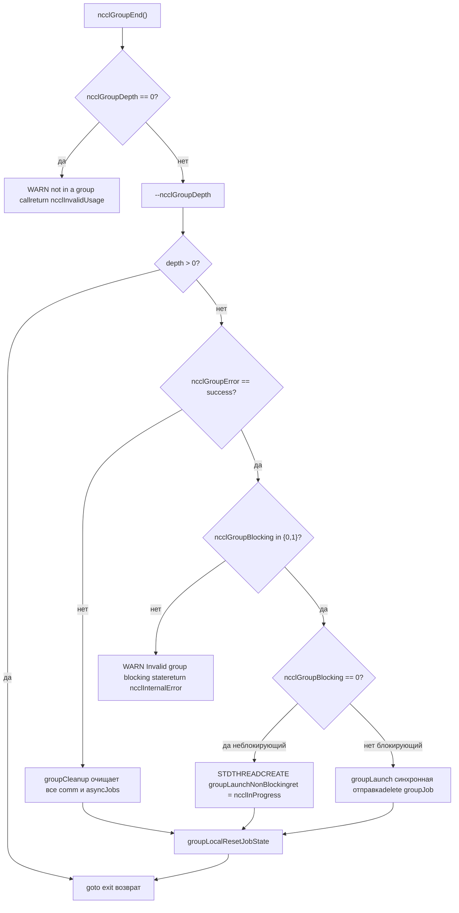

# Глава 22: Производственный траблшутинг: распространенные ловушки и диагностика зависаний

# Глава 22: Глава 22: Производственная диагностика и подводные камни: типичные взаимоблокировки, тайм-ауты, несовпадение версий и решения по диагностике

Официальный источник: NVIDIA/nccl

# Версия: Commit @12df1a11

## Прогресс книги: Глава 22 / 25

Глава 22: Производственная диагностика и подводные камни: типичные взаимоблокировки, тайм-ауты, несовпадение версий и решения по диагностике`ncclGroupStart()` / `ncclGroupEnd()`В предыдущей главе мы разобрали порядок диагностики и ключевые ручки для настройки производительности, но сбои NCCL в производственной среде зачастую связаны не с недостаточной производительностью, а с тем, что программа просто зависает или падает. Корень этих сбоев обычно не в том, что какая-то функция написана неправильно, а в нарушении порядка вызовов, жизненного цикла или версионных контрактов. Эта глава сосредоточена на четырёх наиболее типичных подводных камнях: взаимоблокировки из-за неправильного использования семантики group, тихие ошибки из-за отсутствия проверки параметров, несовпадение версий ABI, а также границы тайм-аутов и повторных попыток. Мы проследим по четырём линиям — src/group.cc, src/misc/argcheck.cc, src/include/checks.h и contrib/nccl_ep/nccl_ep.cc — и увидим, как NCCL внутренне блокирует ошибку ещё до её возникновения.`ncclGroupEnd`Неправильное использование семантики Group: почему "забыли написать GroupEnd" приводит к зависанию`ncclGroupDepth`Интуитивная модель: Group — это "корзина покупок", а не "переключатель ускорения"

> **[Design Inference & Architectural Trade-offs]**
> Это наиболее распространённая форма взаимоблокировки в продакшене: код в некоторой ветке обработки исключения`return`, пропустил`ncclGroupEnd`, а`ncclGroupDepth`является`thread_local`и не очищается автоматически при возврате из функции.

## Структура данных: thread_local состояние группы

NCCL хранит всё состояние группы в thread-local storage — это ключ к пониманию взаимоблокировки.

[FACT:src/group.cc:34-34]

```cpp
thread_local int ncclGroupDepth = 0; // depth of ncclGroupStart nesting
thread_local ncclResult_t ncclGroupError = ncclSuccess;
thread_local struct ncclComm* ncclGroupCommHead[ncclGroupTaskTypeNum] = {nullptr};
thread_local struct ncclComm* ncclGroupCommPreconnectHead = nullptr;
thread_local struct ncclIntruQueue ncclAsyncJobs;
thread_local int ncclGroupBlocking = -1; /* default mode */
```

Разбор по полям:

- `ncclGroupDepth`: глубина вложенности.`ncclGroupStart`увеличивается,`ncclGroupEnd`уменьшается, и только при уменьшении до 0 действительно запускается отправка. Поддержка вложенности — это удобство дизайна, но она также означает, что «пропущенный End» навсегда оставит глубину на 1.
- `ncclGroupError`: накопленная этим потоком ошибка группы. Как только один вызов завершается неудачей, последующие`ncclGroupEnd`сразу пойдут по пути ошибки.
- `ncclGroupCommHead[]`: головы связных списков коммуникационных доменов, сгруппированных по типу задачи (collective / rawTask / mgmtTask / symRegister).
- `ncclAsyncJobs`: очередь асинхронных задач, ожидающих выполнения (например, preconnect, symmetric register).
- `ncclGroupBlocking`：`-1`означает «ещё не встретился ни один коммуникационный домен»,`0`означает неблокирующий,`1`означает блокирующий. Это поле — ядро последующего обнаружения «смешанного использования блокирующего и неблокирующего режимов».

> **[Design Inference & Architectural Trade-offs]**
> Использование`thread_local`вместо глобальной переменной имеет прямую мотивацию: NCCL позволяет нескольким потокам иметь независимые контексты группы, не мешая друг другу. Цена — при завершении потока это состояние не очищается автоматически; если поток завершается в середине группы, состояние утекает.

## Пошагово: полная цепочка проверок одного GroupEnd

Сценарий: приложение вызывает`ncclGroupEnd()`, в этот момент`ncclGroupDepth`равно 1.

Шаг первый: проверка, действительно ли мы внутри группы:

[FACT:src/group.cc:1048-1052]

```cpp
  if (ncclGroupDepth == 0) {
    WARN("ncclGroupEnd: not in a group call.");
    ret = ncclInvalidUsage;
    goto exit;
  }
```

Если пользователь не вызвал`ncclGroupStart`и сразу вызвал`ncclGroupEnd`, здесь будет напечатано "not in a group call" и возвращено`ncclInvalidUsage`. Это самая дружелюбная ошибка — немедленное сообщение об ошибке, без зависания.

Шаг второй: уменьшение глубины и определение, является ли это самым внешним уровнем:

[FACT:src/group.cc:1061-1063]

```cpp
  if ((--ncclGroupDepth) > 0) goto exit;

  if ((ret = ncclGroupError) != ncclSuccess) goto fail;
```

Если вложено несколько уровней, внутренний`End`только уменьшает глубину и возвращается, не запуская отправку. Только самый внешний уровень продолжает. Одновременно проверяется накопленная ошибка.

Шаг третий: проверка согласованности режима блокировки. Это точка обнаружения «смешанного использования блокирующего и неблокирующего режимов»:

[FACT:src/group.cc:1095-1101]

```cpp
  if (hasCommHead || !ncclIntruQueueEmpty(&groupJob->asyncJobs) || ncclGroupCommPreconnectHead != nullptr) {
    /* make sure ncclGroupBlocking has been set. */
    if (ncclGroupBlocking != 0 && ncclGroupBlocking != 1) {
      WARN("Invalid group blocking state %d", ncclGroupBlocking);
      ret = ncclInternalError;
      goto fail;
    }
```

`ncclGroupBlocking`должен находиться между`{0, 1}`. Если он всё ещё`-1`, это означает, что в группе нет ни коммуникационного домена, ни асинхронной задачи, и логически мы не должны были сюда попасть.

Шаг четвёртый: ветвление в зависимости от режима блокировки. Неблокирующий идёт через асинхронную отправку в потоке, блокирующий — через синхронную отправку:

[FACT:src/group.cc:1102-1134]

```cpp
    if (ncclGroupBlocking == 0) {
      /* nonblocking group */
      if (!ncclIntruQueueEmpty(&groupJob->asyncJobs)) {
        ncclAsyncJob* job = ncclIntruQueueHead(&groupJob->asyncJobs);
        do {
          NCCLCHECKGOTO(ncclCommSetAsyncError(job->comm, ncclInProgress), ret, fail);
          if (job->comm->groupJob == NULL) {
            job->comm->groupJob = groupJob;
            groupJob->groupRefCount++;
          }
          job = job->next;
        } while (job);
      }
      ...
      groupJob->base.func = groupLaunchNonBlocking;
      STDTHREADCREATE_GOTO(groupJob->base.thread, ncclAsyncJobMain, ret, fail, &groupJob->base);
      groupJob->nonBlockingInit = true;
      ret = ncclInProgress;
    }
```

Обратите внимание на`groupRefCount++`и`ret = ncclInProgress`: в неблокирующем режиме`ncclGroupEnd`немедленно возвращает`ncclInProgress`, а реальная отправка выполняется в фоновом потоке. Вызывающая сторона должна впоследствии опрашивать с помощью`ncclCommGetAsyncError`или ожидать с помощью`ncclGroupJobComplete`.

## Смешанное использование блокирующего и неблокирующего режимов: почему это запрещено

Вернёмся к`ncclAsyncLaunch`, посмотрим на обнаружение смешивания:

[FACT:src/group.cc:55-64]

```cpp
    /* check if there are blocking and nonblocking comms at the same time in group. */
    if (comm->destroyFlag) {
      ncclGroupBlocking = 1;
    } else if (ncclGroupBlocking == -1) {
      /* first met communicator */
      ncclGroupBlocking = comm->config.blocking;
    } else if (ncclGroupBlocking != comm->config.blocking) {
      WARN("Blocking and nonblocking communicators are not allowed in the same group.");
      ret = ncclInvalidArgument;
    }
```

> **[Design Inference & Architectural Trade-offs]**
> Почему смешивание запрещено? Потому что семантика отправки блокирующего коммуникационного домена — «при возврате из вызова kernel уже отправлен», а неблокирующего — «при возврате из вызова задача уже в очереди, но ещё не отправлена». Если оба находятся в одной группе,`ncclGroupEnd`не может дать единую семантику возврата — ждать или не ждать? NCCL выбирает прямой отказ, вынося проблему на границу API.

## Продакшен-грабли: три реальных сценария

**Сценарий первый: пропущен GroupEnd в ветке обработки исключения.**Код между`ncclGroupStart`и`ncclGroupEnd`бросает исключение или досрочно`return`，`ncclGroupDepth`останавливается на 1. Все последующие вызовы коммуникации переходят в состояние «накопления заказов» и никогда не отправляются. Метод диагностики: перед`ncclGroupEnd`напечатать`ncclGroupDepth`, или с помощью`gdb`наблюдать за этой thread_local переменной.

**Сценарий второй: использование одного и того же comm из разных потоков.**Поскольку состояние группы является`thread_local`, после вызова`ncclGroupStart`потоком A вызов`ncclAllReduce`потоком B не войдёт в группу A. Если A и B работают с одним и тем же comm, возникнет путаница «часть вызовов внутри группы, часть вне группы». NCCL не обнаруживает эту ситуацию, так как предполагает, что один comm в любой момент времени используется только одним потоком.

**Сценарий третий: взаимодействие CUDA graph capture и группы.**Посмотрим на проверку в`doLaunches`:

[FACT:src/group.cc:448-455]

```cpp
    if (capturingYes && capturingNo) {
      // We have entered barriers but are aborting without leaving them. Thus
      // these comms are permanently trashed. We need a good mechanism for
      // tracking and reporting that.
      WARN("Either none or all communicators in a ncclGroup() can be CUDA graph captured.");
      result = ncclInvalidUsage;
      goto failure;
    }
```

Комментарий говорит прямо: как только мы вошли в barrier и затем отказались на полпути, эти comm оказываются «навсегда повреждёнными». Поэтому правило таково — все коммуникационные домены в одной группе должны либо все быть в capture, либо все не быть. Смешивание приводит к несогласованности состояния comm, и у NCCL на данный момент нет хорошего механизма восстановления.



# Проверка параметров и тихие ошибки: как ArgCheck блокирует «выглядящие нормально» вызовы

## Интуитивная модель: ArgCheck — это «досмотр в аэропорту»

Проверка параметров похожа на досмотр в аэропорту: она не отвечает за то, чтобы вы летели быстрее, но она блокирует то, что «выглядит как багаж, а на самом деле опасный груз». Без неё указатель с неправильным устройством заставит GPU kernel читать мусорные данные или, что хуже, — тихо испортит чужую видеопамять.

## Структура данных: режимы проверки и глобальная очередь проверок

Проверка параметров NCCL — это не «проверять всё каждый раз», а разделение по режимам. Ядро —`comm->checkMode`：

[FACT:src/misc/argcheck.cc:227-251]

```cpp
  if (info->comm->checkMode != ncclCheckModeDefault) {
    if ((info->coll == ncclFuncSend || info->coll == ncclFuncRecv)) {
      if (info->count > 0) NCCLCHECK(CudaPtrCheck(info->recvbuff, info->comm, "buff", info->opName));
    } else if (info->coll == ncclFuncPutSignal || info->coll == ncclFuncSignal || info->coll == ncclFuncWaitSignal) {
      // One-sided RMA ops specify the remote destination via peerWin, not sendbuff/recvbuff,
      // so the standard CUDA pointer checks do not apply here.
      INFO(NCCL_COLL, "%s : skipping sendbuff/recvbuff pointer check (one-sided RMA uses peerWin)", info->opName);
    } else {
      // Check CUDA device pointers
      if (info->coll != ncclFuncBroadcast || info->comm->rank == info->root) {
        NCCLCHECK(CudaPtrCheck(info->sendbuff, info->comm, "sendbuff", info->opName));
      }
      if (info->coll != ncclFuncReduce || info->comm->rank == info->root) {
        NCCLCHECK(CudaPtrCheck(info->recvbuff, info->comm, "recvbuff", info->opName));
      }
    }

    if (info->comm->checkMode == ncclCheckModeDebugGlobal) {
      struct ncclArgsInfo* argsInfo;
      NCCLCHECK(ncclCalloc(&argsInfo, 1));
      argsInfo->info = *info;
      argsInfo->next = NULL;
      ncclIntruQueueEnqueue(&info->comm->argsInfoQueue, argsInfo);
    }
  }
```

Три режима:

- `ncclCheckModeDefault`: выполняются только самые дешёвые проверки (диапазон root, диапазон datatype, диапазон op), без обращения к CUDA API.
- Не-дефолтный режим: вызывается`CudaPtrCheck`, что действительно вызывает`cudaPointerGetAttributes`, с накладными расходами на производительность.
- `ncclCheckModeDebugGlobal`: помимо локальных проверок, ещё и`ncclInfo`помещается в`argsInfoQueue`, по завершении группы выполняется глобальная проверка согласованности между рангами.

> **[Design Inference & Architectural Trade-offs]**
> Эта архитектура — компромисс между производительностью и корректностью:`cudaPointerGetAttributes`— это синхронный вызов CUDA, и его вызов при каждой коммуникации на горячем пути значительно замедлит передачу малых сообщений. Поэтому в режиме по умолчанию выполняется только «нулевая по стоимости» проверка, а дорогостоящая валидация указателей оставлена для режима отладки.

## Пошагово: три уровня защиты CudaPtrCheck

Сценарий: пользователь передаёт`sendbuff`, и NCCL проверяет его в режиме отладки.

Первый уровень — действителен ли указатель:

[FACT:src/misc/argcheck.cc:12-18]

```cpp
ncclResult_t CudaPtrCheck(const void* pointer, struct ncclComm* comm, const char* ptrname, const char* opname) {
  cudaPointerAttributes attr;
  cudaError_t err = cudaPointerGetAttributes(&attr, pointer);
  if (err != cudaSuccess || attr.devicePointer == NULL) {
    WARN("%s : %s %p is not a valid pointer", opname, ptrname, pointer);
    return ncclInvalidArgument;
  }
```

`cudaPointerGetAttributes`Для недействительного указателя вернётся ошибка, либо`devicePointer`будет NULL. Это отсекает случаи «передан адрес из стека хоста» или «передан уже освобождённый указатель».

Второй уровень — совпадает ли устройство:

[FACT:src/misc/argcheck.cc:19-26]

```cpp
#if CUDART_VERSION >= 10000
  if (attr.type == cudaMemoryTypeDevice && attr.device != comm->cudaDev) {
#else
  if (attr.memoryType == cudaMemoryTypeDevice && attr.device != comm->cudaDev) {
#endif
    WARN("%s : %s allocated on device %d mismatchs with NCCL device %d", opname, ptrname, attr.device, comm->cudaDev);
    return ncclInvalidArgument;
  }
```

Это самая скрытая ловушка: указатель действителен для GPU, но принадлежит другому GPU. На многокартовой машине, если пользователь забыл`cudaSetDevice`, легко передать не тот указатель. NCCL здесь явно отклоняет.

Третий уровень — целостность объекта коммуникационного домена:

[FACT:src/misc/argcheck.cc:38-45]

```cpp
ncclResult_t CommCheck(struct ncclComm* comm, const char* opname, const char* ptrname) {
  NCCLCHECK(PtrCheck(comm, opname, ptrname));
  if (comm->startMagic != NCCL_MAGIC || comm->endMagic != NCCL_MAGIC) {
    WARN("Error: corrupted comm object detected");
    return ncclInvalidArgument;
  }
  return ncclSuccess;
}
```

`startMagic` / `endMagic`— это сигнальные значения, размещённые в начале и конце структуры`ncclComm`. Если пользователь передал дикий указатель или comm уже освобождён, magic не совпадёт. Это классический приём «обнаружения повреждения памяти» — структура зажимается двумя сигнальными значениями, и любая запись за границы может повредить одно из них.

## Глобальная проверка согласованности: кросс-ранговая валидация registrationCheck

Это самая «тяжёлая» проверка в NCCL, срабатывает только при`ncclCheckModeDebugGlobal`. Она проверяет — согласовано ли состояние регистрации симметричной памяти на всех рангах.

[FACT:src/misc/argcheck.cc:95-111]

```cpp
  NCCLCHECKGOTO(bootstrapAllGather(comm->bootstrap, bufInfo, sizeof(struct symBufInfo) * 2), ret, fail);

  cmpBufInfo[0] = bufInfo[0];
  cmpBufInfo[1] = bufInfo[1];
  for (int r = 1; r nRanks; r++) {
    int infoIdx = r * 2;
    if (cmpBufInfo[0].isSymRegistered != bufInfo[infoIdx].isSymRegistered ||
        cmpBufInfo[1].isSymRegistered != bufInfo[infoIdx + 1].isSymRegistered) {
      if (comm->rank == 0) {
        WARN("Coll %s size %ld symmetric registration check failed on rank %d: sendReg %d recvReg %d mismatch with "
             "rank 0 sendReg %d recvReg %d",
             info->opName, size, r, bufInfo[infoIdx].isSymRegistered, bufInfo[infoIdx + 1].isSymRegistered,
             cmpBufInfo[0].isSymRegistered, cmpBufInfo[1].isSymRegistered);
      }
      ret = ncclInvalidArgument;
      goto fail;
    }
```

Она через bootstrap-механизм`allGather`собирает`(isSymRegistered, bigOffset, userOffset)`каждого ранга, а затем сравнивает по рангам. Если send buffer ранга 0 зарегистрирован в симметричной памяти, а ранг 3 — нет, здесь будет ошибка.

> **[Design Inference & Architectural Trade-offs]**
> Почему эта проверка важна? Симметричная память (symmetric memory) требует, чтобы все ранги обращались к буферам по одному и тому же набору виртуальных адресов. Если буфер какого-то ранга не зарегистрирован, вычисленный в kernel адрес будет неверным, что приведёт к чтению мусора или выходу за границы. Такая ошибка во время выполнения проявляется как «результат иногда неверен», и её крайне сложно отладить. NCCL предпочитает заблокировать её на границе API ценой одного allGather.

## Подводные камни в продакшене

**Камень первый: в режиме по умолчанию ошибки указателей не сообщаются.**Если пользователь не включил режим отладки и передал указатель на неправильное устройство, NCCL не сообщит об ошибке на этапе`ArgsCheck`, а обнаружит её только при выполнении kernel — к этому моменту может быть уже испорчена память другого ранга. Рекомендуется на этапе разработки использовать`NCCL_DEBUG=WARN`вместе с`checkMode`для отладки.

**Камень второй:`ncclCheckModeDebugGlobal`накладные расходы allGather в**При каждой коммуникации выполняется bootstrap allGather, что в сценариях с малыми сообщениями и высокой частотой становится узким местом. Этот режим подходит только для отладки, но не для продакшена.

**Камень третий: жизненный цикл userRedOp.**Посмотрите на этот фрагмент:

[FACT:src/misc/argcheck.cc:220-225]

```cpp
  int opIx = int(ncclUserRedOpMangle(info->comm, info->op)) - int(ncclNumOps);
  if (ncclNumOps op &&
      (info->comm->userRedOpCapacity comm->userRedOps[opIx].freeNext != -1)) {
    WARN("%s : reduction operation %d unknown to this communicator", info->opName, info->op);
    return ncclInvalidArgument;
  }
```

Пользовательский reduction op регистрируется на comm. Если пользователь передал op, который «когда-то был зарегистрирован, но уже освобождён»,`freeNext != -1`обнаружит, что он уже собран сборщиком мусора. Это проверка для предотвращения «висячих дескрипторов op».

# Макросы распространения ошибок: как семейство NCCLCHECK гарантирует «непотерю ошибок»

## Интуитивная модель: макросы распространения ошибок — это «эстафетная палочка»

Обработка ошибок в NCCL опирается на эстафету макросов: функция нижнего уровня возвращает`ncclResult_t`, верхний уровень проверяет через`NCCLCHECK`и при неуспехе немедленно возвращает. Это как эстафетный бег — палочка (код ошибки) должна быть передана до конца, и если хоть одна передача сорвана, вся цепочка рвётся.

## Структуры данных: полная картина семейства макросов

[FACT:src/include/checks.h:148-166]

```cpp
#define NCCLCHECK(call) \
  do { \
    ncclResult_t RES = call; \
    if (RES != ncclSuccess && RES != ncclInProgress) { \
      /* Print the back trace*/ \
      if (ncclDebugNoWarn == 0) INFO_LOC(NCCL_ALL, "-> %d", RES); \
      return RES; \
    } \
  } while (0)

#define NCCLCHECKGOTO(call, RES, label) \
  do { \
    RES = call; \
    if (RES != ncclSuccess && RES != ncclInProgress) { \
      /* Print the back trace*/ \
      if (ncclDebugNoWarn == 0) INFO_LOC(NCCL_ALL, "-> %d", RES); \
      goto label; \
    } \
  } while (0)
```

Ключевые детали:`ncclInProgress`рассматривается как «не ошибка». Это ядро неблокирующей коммуникации —`ncclGroupEnd`возвращает`ncclInProgress`, означая «задача отправлена, но ещё не завершена», и вызывающая сторона должна продолжать опрос, а не обрабатывать это как ошибку.

`NCCLCHECK`напрямую`return`，`NCCLCHECKGOTO`переходит к`label`. Последний используется в сценариях, требующих освобождения ресурсов.

## Путь очистки: NCCLCHECKIGNORE сохраняет первую ошибку

[FACT:src/include/checks.h:168-177]

```cpp
// Report failure but continue - useful for cleanup paths where we want to
// attempt all cleanup steps. Preserves the first error in RES.
#define NCCLCHECKIGNORE(call, RES) \
  do { \
    ncclResult_t TMPRES = call; \
    if (TMPRES != ncclSuccess && TMPRES != ncclInProgress) { \
      if (ncclDebugNoWarn == 0) INFO_LOC(NCCL_ALL, "-> %d", TMPRES); \
      if (RES == ncclSuccess) RES = TMPRES; \
    } \
  } while (0)
```

Комментарий говорит ясно: на пути очистки нужно «попытаться выполнить все шаги очистки», и первый ошибкой нельзя прерываться. Но код ошибки должен сохранить первую — потому что первая ошибка обычно является наиболее диагностически ценной первопричиной.

## Ожидание и прерывание: проверка abortFlag в NCCLWAIT

[FACT:src/include/checks.h:196-205]

```cpp
#define NCCLWAIT(call, cond, abortFlagPtr) \
  do { \
    uint32_t* tmpAbortFlag = (abortFlagPtr); \
    ncclResult_t RES = call; \
    if (RES != ncclSuccess && RES != ncclInProgress) { \
      if (ncclDebugNoWarn == 0) INFO_LOC(NCCL_ALL, "-> %d", RES); \
      return ncclInternalError; \
    } \
    if (COMPILER_ATOMIC_LOAD(tmpAbortFlag, std::memory_order_acquire)) NEQCHECK(*tmpAbortFlag, 0); \
  } while (!(cond))
```

Это шаблон ожидания с опросом: в каждом цикле вызывается`call`(продвижение прогресса), проверяется`cond`(выполнено ли условие), а также проверяется`abortFlag`(не прервано ли).`abortFlag`использует`memory_order_acquire`загрузку, чтобы гарантировать видимость сигнала прерывания, записанного другим потоком.

> **[Design Inference & Architectural Trade-offs]**
> Эта архитектура решает классическую проблему: когда один ранг даёт сбой, другие ранги могут продолжать бесконечно ждать его данных.`abortFlag`— это механизм распространения сигнала прерывания между рангами: как только он установлен, все циклы ожидания завершаются.

## Безопасные макросы для создания потоков и выделения памяти

[FACT:src/include/checks.h:237-256]

```cpp
#define STDTHREADCREATE_IMPL(var, func, error_action, ...) \
  do { \
    try { \
      (var) = std::thread(func, __VA_ARGS__); \
    } catch (const std::exception& e) { \
      WARN("Thread creation failed: %s", e.what()); \
      error_action; \
    } \
  } while (0)

#define STDTHREADCREATE(var, func, ...) STDTHREADCREATE_IMPL(var, func, return ncclSystemError, __VA_ARGS__)

#define STDTHREADCREATE_GOTO(var, func, RES, label, ...) \
  STDTHREADCREATE_IMPL( \
    var, func, \
    do { \
      RES = ncclSystemError; \
      goto label; \
    } while (0), \
    __VA_ARGS__)
```

`std::thread`При неудаче конструктор выбрасывает исключение (например, превышено число потоков). Этот макрос преобразует исключение в`ncclSystemError`, предотвращая проникновение исключения через границу C API.

[FACT:src/include/checks.h:258-275]

```cpp
#define NEW_NOTHROW(var, x) \
  do { \
    (var) = new (std::nothrow) x{}; \
    if (!(var)) { \
      WARN("Allocation failed"); \
      return ncclSystemError; \
    } \
  } while (0)
```

`new (std::nothrow)`При неудаче выделения возвращает nullptr вместо исключения. Это стандартная практика C++-кода на границе C API.

## Подводные камни в продакшене

**Камень первый:`ncclInProgress`ошибочно принимается за успех.**Некоторые пользователи пишут`if (ret == ncclSuccess)`для проверки успеха, но в неблокирующем режиме возвращается`ncclInProgress`. Правильный подход —`if (ret == ncclSuccess || ret == ncclInProgress)`, либо использовать`ncclCommGetAsyncError`для запроса.

**Камень второй:`NCCLCHECK`используется в деструкторе.**Если использовать в деструкторе`NCCLCHECK`, ошибка сразу`return`, пропуская последующую очистку. Следует использовать`NCCLCHECKIGNORE`。

# Несовпадение версий ABI: дизайн nccl_ep на основе size

## Интуитивная модель: ABI — это «стандарт розетки»

ABI (двоичный интерфейс приложения) похож на стандарт электрической розетки: если библиотека и вызывающая сторона по-разному понимают, «как выглядит структура», это как вставить американскую вилку в европейскую розетку — в лучшем случае не работает, в худшем — сгорает.`contrib/nccl_ep`Использует хитрый дизайн: каждая структура, пересекающая границу, начинается с поля`size`.

## Структура данных: двойная проверка size + magic

[FACT:contrib/nccl_ep/nccl_ep.cc:70-76]

```cpp
// Size-based ABI versioning: every cross-boundary struct starts with a `size`
// field set by the caller to sizeof(struct). The library checks that against
// its own known size; any mismatch means caller and library are from different
// releases. Strict equality for now — see nccl_ep.h for the planned future
// relaxation (all-zero-trailing-bytes escape hatch).
// Immediately after `size` there is a `magic` field pre-filled by NCCL_EP_*_INIT
// to catch unininitialized structures.
```

Ключевые моменты дизайна:

- `size`Поле заполняется вызывающей стороной`sizeof(struct)`, библиотека проверяет, равно ли оно известному ей size.
- `magic`Поле предварительно заполняется макросом`NCCL_EP_*_INIT`, чтобы отлавливать «неинициализированные» структуры.
- Сейчас требуется строгое равенство, в будущем планируется поддержка «мягкого» режима: если хвост заполнен нулями, допускается меньший size.

## Пошагово: процесс проверки EP_REQUIRE_STRUCT

[FACT:contrib/nccl_ep/nccl_ep.cc:77-80]

```cpp
#define EP_REQUIRE_STRUCT(ptr) \
    do { \
        assert( \
            (ptr) != nullptr && (ptr)->size == sizeof(*(ptr)) && \
```

Этот макрос вызывается в таких точках входа, как`ncclEpDispatch`、`ncclEpCombine`:

[FACT:contrib/nccl_ep/nccl_ep.cc:2827-2830]

```cpp
    EP_REQUIRE_STRUCT(inputs);
    EP_REQUIRE_STRUCT(outputs);
    EP_OPTIONAL_LAYOUT_INFO(layout_info);
    EP_OPTIONAL_STRUCT(config);
```

`inputs`и`outputs`— обязательные параметры, используются`EP_REQUIRE_STRUCT`；`layout_info`и`config`— необязательные параметры, используются`EP_OPTIONAL_*`。

## Безопасное по версиям чтение полей: layoutInfoRecvTopkIdxKind

Это самая изящная часть — как безопасно читать поле, когда «структура вызывающей стороны может быть меньше».

[FACT:contrib/nccl_ep/nccl_ep.cc:139-144]

```cpp
// Safe field reader for ncclEpLayoutInfo_t::recv_topk_idx_kind. Returns AUTO
// when the caller's struct (size) does not cover the field, preserving the
// pre-flag default.
static inline ncclEpExpertIdKind_t layoutInfoRecvTopkIdxKind(const ncclEpLayoutInfo_t* lip) {
    if (lip == nullptr) return NCCL_EP_EXPERT_ID_AUTO;
    constexpr size_t field_end = offsetof(ncclEpLayoutInfo_t, recv_topk_idx_kind) + sizeof(ncclEpExpertIdKind_t);
    if (lip->size recv_topk_idx_kind;
}
```

Логика такова: если`size`вызывающей стороны меньше «смещения конца этого поля», значит вызывающая сторона использует старую версию структуры, этого поля не существует, возвращается значение по умолчанию`AUTO`. Иначе — обычное чтение.

> **[Design Inference & Architectural Trade-offs]**
> Это стандартный приём совместимости ABI: новые поля можно добавлять только в конец структуры, а при чтении с помощью`size`определяется, существует ли поле. Так старые вызывающие стороны используют старую структуру, а новая библиотека всё равно обрабатывает корректно.

## Проверка номера версии: мягкое предупреждение, а не жёсткий отказ

[FACT:contrib/nccl_ep/nccl_ep.cc:1393-1400]

```cpp
    if (in_config->version != NCCL_EP_API_VERSION) {
        fprintf(
            stderr,
            "NCCL EP WARN: ncclEpGroupConfig_t.version=%u, library API_VERSION=%u; "
            "behavior may differ across versions.\n",
            in_config->version,
            (unsigned)NCCL_EP_API_VERSION);
    }
```

Обратите внимание, здесь`WARN`, а не`return error`. Несовпадение номера версии — лишь предупреждение, потому что проверка`size`уже гарантирует безопасность раскладки памяти. Номер версии скорее подсказывает, что «поведение может отличаться».

## Подводные камни в продакшене

**Камень первый: забыли инициализировать макросом INIT.**Если пользователь вручную обнулит структуру`memset`,`magic`будет равно 0,`EP_REQUIRE_STRUCT`завершится ошибкой. Обязательно использовать макрос`NCCL_EP_*_INIT`.

**Камень второй: смешивание динамических библиотек разных версий.**Если приложение слинковано с новой версией`libnccl_ep.so`, но заголовочный файл старой версии,`sizeof(struct)`будет несовпадать,`EP_REQUIRE_STRUCT`немедленно выдаст ошибку. Это задумано — быстрое падение лучше тихой ошибки.

**Камень третий:`EP_OPTIONAL_LAYOUT_INFO`проверка диапазона.**Посмотрите на этот фрагмент:

[FACT:contrib/nccl_ep/nccl_ep.cc:114-123]

```cpp
            if ((ptr)->size size > sizeof(*(ptr))) { \
                fprintf( \
                    stderr, \
                    "NCCL EP: ncclEpLayoutInfo_t size out of supported range: " \
                    "got %u, expected [%zu, %zu]\n", \
                    (ptr)->size, \
                    kNcclEpLayoutInfoMinSize, \
                    sizeof(*(ptr))); \
                return ncclInvalidArgument; \
            } \
```

`layout_info`допускает size в диапазоне`[min, sizeof]`, это мягче, чем строгое равенство в`EP_REQUIRE_STRUCT`. Причина в том, что`layout_info`— необязательный параметр, и исторически поля то добавлялись, то убирались.

```mermaid
flowchart TD
    entry["ncclEpDispatch(inputs, outputs, layout_info, config)"] --> req_inputs{"EP_REQUIRE_STRUCT(inputs)size == sizeof?"}
    req_inputs -->|нет| err_size["assert не выполнен / возврат ошибки"]
    req_inputs -->|да| req_outputs{"EP_REQUIRE_STRUCT(outputs)"}
    req_outputs -->|нет| err_size
    req_outputs -->|да| opt_layout{"layout_info != nullptr?"}
    opt_layout -->|нет| skip_layout["пропустить проверку layout"]
    opt_layout -->|да| range_check{"size in [min, sizeof]?"}
    range_check -->|нет| err_range["fprintf size out of rangereturn ncclInvalidArgument"]
    range_check -->|да| magic_check{"magic == NCCL_EP_MAGIC?"}
    magic_check -->|нет| err_magic["fprintf magic mismatchreturn ncclInvalidArgument"]
    magic_check -->|да| read_field["layoutInfoRecvTopkIdxKindsize  read_field
    read_field --> proceed["продолжить выполнение логики dispatch"]
```

# Тайм-аут, повтор и прерывание: от NCCLWAIT до timeout_cycles в nccl_ep

## Интуитивная модель: тайм-аут — это «предохранитель»

В распределённой коммуникации зависание одного rank приводит к бесконечному ожиданию всех остальных. Механизм тайм-аута похож на предохранитель: в норме не срабатывает, но при аномальном токе перегорает, предотвращая сгорание всей системы.

## Структура данных: abortFlag и timeout_cycles

Ядро NCCL использует`abortFlag`для распространения сигнала прерывания. Посмотрите на передачу в`ncclAsyncLaunch`:

[FACT:src/group.cc:49-52]

```cpp
    job->abortFlag = comm->abortFlag;
    job->abortFlagDev = comm->abortFlagDev;
    job->childAbortFlag = comm->childAbortFlag;
    job->childAbortFlagDev = comm->childAbortFlagDev;
```

Каждый job хранит указатель abortFlag у comm. Когда group обнаруживает ошибку:

[FACT:src/group.cc:118-126]

```cpp
        if (!job->destroyFlag &&
            (COMPILER_ATOMIC_LOAD(groupAbortFlag, std::memory_order_acquire) || errorJobAbortFlag == true)) {
          COMPILER_ATOMIC_STORE(job->abortFlag, uint32_t(1), std::memory_order_release);
          COMPILER_ATOMIC_STORE(job->abortFlagDev, uint32_t(1), std::memory_order_release);
          if (job->childAbortFlag) {
            COMPILER_ATOMIC_STORE(job->childAbortFlag, uint32_t(1), std::memory_order_release);
            COMPILER_ATOMIC_STORE(job->childAbortFlagDev, uint32_t(1), std::memory_order_release);
          }
        }
```

Как только`groupAbortFlag`или`errorJobAbortFlag`истинны, abortFlag всех job устанавливается в 1.`memory_order_release`гарантирует видимость предыдущих записей для других потоков.

## Дизайн тайм-аута в nccl_ep: такты GPU

`nccl_ep`использует более точный тайм-аут — в единицах тактов GPU.

[FACT:contrib/nccl_ep/nccl_ep.cc:1558-1591]

```cpp
    // Resolve timeout_cycles: env var > config field > compile-time default
    {
        int dev;
        int clock_khz_int;
        CUDA_CHECK(cudaGetDevice(&dev));
        CUDA_CHECK(cudaDeviceGetAttribute(&clock_khz_int, cudaDevAttrClockRate, dev));
        uint64_t clock_khz = static_cast(clock_khz_int);

        uint64_t resolved = NUM_TIMEOUT_CYCLES;
        const char* source = "compile-time default";
        const uint64_t env_ms = static_cast(ep_group->env.timeout_ms.value.ul);
        // Only a positive timeout overrides the default.
        const bool have_env_ms = ep_group->env.timeout_ms.is_set && env_ms > 0;

        if (have_env_ms) {
            resolved = clock_khz * 1000ULL * env_ms / 1000ULL;
            source = "NCCL_EP_TIMEOUT_MS env var";
            ...
        } else if (ep_group->config.timeout_ns != 0) {
            resolved = clock_khz * 1000ULL * (ep_group->config.timeout_ns / 1000000ULL) / 1000ULL;
            source = "config.timeout_ns";
        }

        ep_group->timeout_cycles = resolved;
```

Приоритет таков: переменная окружения`NCCL_EP_TIMEOUT_MS`> поле конфигурации`timeout_ns`> значение по умолчанию на этапе компиляции. Формула преобразования —`clock_khz * 1000 * ms / 1000`, то есть перевод миллисекунд в такты.

> **[Design Inference & Architectural Trade-offs]**
> Почему такты, а не миллисекунды? Потому что цикл ожидания внутри GPU kernel не может вызывать системные API времени, он может читать только регистр`clock64()`. Используя такты для определения тайм-аута, kernel может сравнивать напрямую, без участия host.

## Флаг асинхронной ошибки: host-pinned память

[FACT:contrib/nccl_ep/nccl_ep.cc:1767-1778]

```cpp
    // Allocate mask buffer and async error flag for active-mask support
    if (ep_group->config.enable_mask && ep_group->config.algorithm == NCCL_EP_ALGO_LOW_LATENCY) {
        size_t mask_bytes = ep_group->nRanks * sizeof(int);
        CUDA_CHECK(cudaMalloc(reinterpret_cast(&ep_group->mask_buffer), mask_bytes));
        // Initialize all ranks as active (1 = active, 0 = masked/failed)
        std::vector all_active(ep_group->nRanks, 1);
        CUDA_CHECK(
            cudaMemcpyAsync(ep_group->mask_buffer, all_active.data(), mask_bytes, cudaMemcpyHostToDevice, stream));
        CUDA_CHECK(
            cudaHostAlloc(reinterpret_cast(&ep_group->async_error_flag), sizeof(int), cudaHostAllocMapped));
        *ep_group->async_error_flag = 0;
    }
```

`async_error_flag`выделяется через`cudaHostAllocMapped`, это память host-pinned, отображённая в адресное пространство устройства. GPU kernel может в неё писать, host — читать, без явного копирования.

## Чтение асинхронной ошибки: атомарная загрузка

[FACT:contrib/nccl_ep/nccl_ep.cc:4312-4321]

```cpp
ncclResult_t ncclEpGetAsyncError(ncclEpGroup_t ep_group, int* error_out) {
    EP_HOST_ASSERT(ep_group != nullptr);
    if (!ep_group->config.enable_mask) {
        return ncclInvalidUsage;
    }
    EP_HOST_ASSERT(ep_group->async_error_flag != nullptr && "ncclEpGetAsyncError: enable_mask must be true");
    EP_HOST_ASSERT(error_out != nullptr);
    *error_out = __atomic_load_n(ep_group->async_error_flag, __ATOMIC_ACQUIRE);
    return ncclSuccess;
}
```

Используется`__atomic_load_n`с`__ATOMIC_ACQUIRE`, чтобы гарантировать чтение самого свежего значения, записанного GPU, а не устаревшего из кэша.

## Подводные камни в продакшене

**Камень первый: слишком короткий тайм-аут вызывает ложные срабатывания.**Если`NCCL_EP_TIMEOUT_MS`задан слишком малым, нормальные сетевые колебания будут ошибочно приняты за тайм-аут. Рекомендуется задавать исходя из реального сетевого RTT, как правило, не менее 10 секунд.

**Камень второй: abortFlag установлен, но не очищен.**Как только abortFlag установлен в 1, comm переходит в состояние «прервано». Если пользователь хочет продолжить использовать этот comm, нужно сначала очистить abortFlag. В NCCL`ncclCommAbort`выполняет эту очистку.

**Камень третий:`ncclEpMaskClean`предусловие.**Посмотрите на этот фрагмент:

[FACT:contrib/nccl_ep/nccl_ep.cc:4262-4266]

```cpp
    EP_HOST_ASSERT(ep_group->config.algorithm == NCCL_EP_ALGO_LOW_LATENCY);
    EP_HOST_ASSERT(
        ep_group->rdma_buffer != nullptr &&
        "ncclEpMaskClean: rdma_buffer not yet allocated; create at least one LL handle first");
    EP_HOST_ASSERT(ep_group->sync_buffer != nullptr && ep_group->sync_window != nullptr);
```

`ncclEpMaskClean`требует, чтобы`rdma_buffer`был выделен. Если пользователь создал group, но ещё не создал ни одного LL handle,`rdma_buffer`равен nullptr (поскольку LL выделяется лениво), здесь assert завершится ошибкой.

# Итоги главы

В этой главе собраны четыре типа подводных камней в продакшене:

1. **Неправильное использование семантики Group**：`ncclGroupDepth`является thread_local, пропуск`ncclGroupEnd`приводит к永久ному зависанию; блокирующие и неблокирующие коммуникационные домены нельзя смешивать; захват CUDA graph должен быть полностью или не быть вовсе.

2. **Проверка параметров**：`ArgsCheck`Проверка по режимам, в режиме по умолчанию выполняются только проверки с нулевой стоимостью;`CudaPtrCheck`Три уровня защиты блокируют недействительные указатели, неверные устройства, повреждённый comm;`registrationCheck`Выполняется проверка согласованности симметричной памяти между рангами.

3. **Распространение ошибок**：`NCCLCHECK`Семейство гарантирует, что ошибки не теряются;`ncclInProgress`не является ошибкой;`NCCLCHECKIGNORE`используется для сохранения первой ошибки в пути очистки;`NCCLWAIT`проверка abortFlag в цикле опроса.

4. **Версия ABI**：`nccl_ep`Используется дизайн на основе size, каждое пересекающее границу структуры начинается с`size`, в сочетании с`magic`для обнаружения неинициализированных данных; новые поля можно добавлять только в конец, при чтении используется`size`для определения наличия.

5. **Тайм-аут и прерывание**: ядро использует`abortFlag`для распространения прерывания;`nccl_ep`используется тактовая частота GPU для тайм-аута,`async_error_flag`используется host-pinned память для реализации асинхронного уведомления GPU→host.

# Вопросы для размышления и самопроверки в этой главе

Q1: Если в`ncclGroupEndInternal`изменить`if ((--ncclGroupDepth) > 0) goto exit;`（[FACT:src/group.cc:1061]) на`if (ncclGroupDepth > 0) goto exit;`(без декремента), что произойдёт? Каковы будут последствия в сценарии с вложенными группами?

**Справочный анализ**：

Исходный код`--ncclGroupDepth`сначала уменьшает, затем проверяет. Если изменить на отсутствие декремента:

```cpp
if (ncclGroupDepth > 0) goto exit;  // 错误版本
```

Тогда каждый раз`ncclGroupEnd`не будет уменьшать глубину. Предположим, пользователь написал:

```cpp
ncclGroupStart();  // depth = 1
ncclGroupStart();  // depth = 2
ncclAllReduce(...);
ncclGroupEnd();    // 原版: depth = 1, 返回; 错误版: depth = 2, 返回
ncclGroupEnd();    // 原版: depth = 0, 触发下发; 错误版: depth = 2, 返回
```

В ошибочной версии при втором`ncclGroupEnd`значение`ncclGroupDepth`всё ещё равно 2,`> 0`выполняется, напрямую`goto exit`, и отправка никогда не сработает. Все коммуникационные вызовы остаются в состоянии "накопления", процесс зависает.

Что ещё более скрыто:`ncclGroupDepth`является thread_local и не сбрасывается при возврате из функции. Даже если последующий код больше не вызывает group API, все коммуникации в этом потоке перестанут работать.

Это изменение также нарушит семантику парности`ncclGroupStart`——`ncclGroupStart`увеличивается,`ncclGroupEnd`не уменьшается, глубина только растёт и в конечном итоге переполнится (хотя для переполнения int требуется 2 миллиарда вызовов, на практике более вероятно логическое зависание).

Q2: `CudaPtrCheck`В`attr.type == cudaMemoryTypeDevice && attr.device != comm->cudaDev`（[FACT:src/misc/argcheck.cc:20]) эта проверка, если убрать`attr.type == cudaMemoryTypeDevice`это условие, какие проблемы возникнут? В каких сценариях будет ложное срабатывание?

**Справочный ответ**：

`cudaPointerAttributes.type`имеет три возможных значения:`cudaMemoryTypeDevice`(память устройства),`cudaMemoryTypeHost`(память хоста),`cudaMemoryTypeManaged`(унифицированная память).

Если убрать`attr.type == cudaMemoryTypeDevice`условие, получится:

```cpp
if (attr.device != comm->cudaDev) {  // 错误版本
```

Тогда для памяти хоста или managed-памяти`attr.device`может быть -1 или 0, что не совпадает с`comm->cudaDev`, и будет ложное сообщение "несовпадение устройства".

Конкретный сценарий: пользователь передаёт указатель, выделенный`cudaMallocManaged`. Для managed-памяти`attr.device`обычно является устройством на момент выделения, но если память мигрировала на другое устройство,`attr.device`может измениться. Чаще встречается память хоста (например, pinned-память, выделенная`cudaHostAlloc`),`attr.device`равно -1 и не равно никакому`cudaDev`, что вызовет ложное срабатывание.

NCCL допускает использование памяти хоста в качестве коммуникационного буфера (через`cudaMemcpy`промежуточную передачу), поэтому необходимо различать "память устройства, но устройство не то" и "не память устройства". Первое — ошибка, второе — допустимо.

Q3: `layoutInfoRecvTopkIdxKind`（[FACT:contrib/nccl_ep/nccl_ep.cc:139-144]) используется`lip->size < field_end`для определения наличия поля. Если новая версия вставляет поле в середину структуры (а не в конец), как это нарушит проверку? Почему дизайн ABI требует добавлять новые поля только в конец?

**Справочный анализ**：

Предположим, исходная структура:

```c
struct ncclEpLayoutInfo_t {
    unsigned int size;
    unsigned int magic;
    ncclEpExpertIdKind_t recv_topk_idx_kind;  // offset = 8
};
```

`field_end = offsetof(recv_topk_idx_kind) + sizeof(...) = 8 + 4 = 12`。

Если новая версия между`magic`и`recv_topk_idx_kind`вставляет поле:

```c
struct ncclEpLayoutInfo_t {
    unsigned int size;
    unsigned int magic;
    unsigned int new_field;                    // 新插入
    ncclEpExpertIdKind_t recv_topk_idx_kind;  // offset 变成 12
};
```

В этом случае`field_end = 12 + 4 = 16`. У старого вызывающего`size`равно 12 (размер старой структуры),`12 < 16`выполняется, функция возвращает`AUTO`——но у старого вызывающего на самом деле есть поле`recv_topk_idx_kind`, просто с другим смещением. Это приведёт к тому, что установленное старым вызывающим`recv_topk_idx_kind`будет проигнорировано.

Хуже того, если старый вызывающий записал`recv_topk_idx_kind`по старому смещению (8), а новая библиотека читает по новому смещению (12), будет прочитано значение`new_field`, полная путаница.

Поэтому железное правило дизайна ABI:**новые поля можно добавлять только в конец структуры**. Тогда у старого вызывающего`size`меньше`field_end`нового поля, функция корректно возвращает значение по умолчанию; у нового вызывающего`size`покрывает новое поле, чтение работает нормально. Вставка поля в середину нарушит все проверки версий на основе`offsetof`.

В этой главе разобраны четыре типичные ошибки в производственной среде и их внутренние механизмы защиты. Эти граничные условия напоминают нам, что стабильная работа NCCL зависит не только от основной реализации, но и от адаптации и расширения окружающей экосистемы. В следующей главе мы перейдём к экосистеме и расширениям и посмотрим, как такие периферийные проекты, как nccl4py, nccl4rust, nccl_ep, nccl_ubx, несут возможности NCCL более широкому кругу пользователей.
