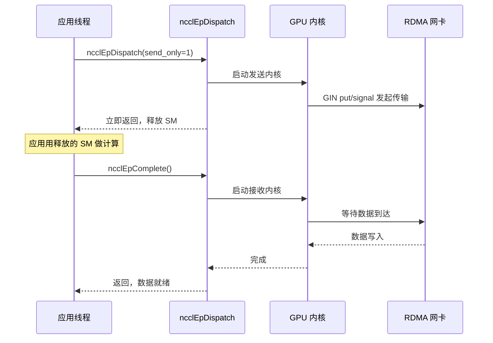
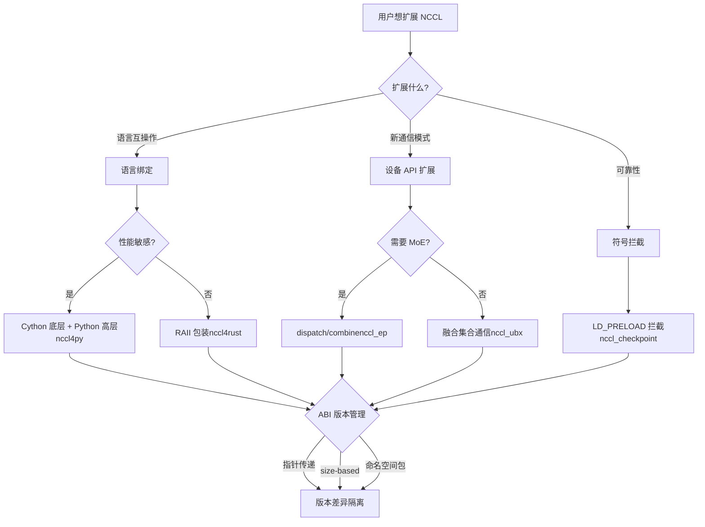

# Глава 23: Расширение экосистемы: nccl4py, nccl4rust, nccl_ep, nccl_ubx и другие периферийные проекты

В предыдущей главе мы разобрали типичные сбои NCCL в производственной среде — неправильное использование семантики group, несоответствие числа rank, взаимодействие с stream, конфликты версий ABI и сетевые таймауты. Большинство этих проблем возникает при прямом использовании C ABI, тогда как современные фреймворки обучения больших моделей часто не вызывают C ABI напрямую, а используют привязки к Python, Rust и другим языкам либо задействуют расширенные проекты для сценариев MoE, сверхширокополосной связи и т.п., чтобы переиспользовать возможности NCCL. Эти сопутствующие проекты находятся в каталогах bindings/ и contrib/, позиционируются как экспериментальные, поддерживаемые сообществом, и не наследуют гарантии качества выпуска основной библиотеки. В этой главе мы последовательно разберём nccl4py, nccl4rust, nccl_ep, nccl_ubx и nccl_checkpoint и посмотрим, как они через языковые привязки, расширения device API и перехват символов строят богатую экосистему вокруг ядра.

# nccl4py: привязки Cython и дизайн namespace-пакета

## Интуитивная модель: перевод C ABI на язык, понятный Python

Представьте, что ядро NCCL — это дипломат, говорящий только на C, а скрипт обучения на Python — стажёр, говорящий только на Python. nccl4py — это переводчик: он не меняет то, что говорит дипломат (поведение NCCL), а лишь переводит «`ncclAllReduce(sendbuff, recvbuff, count, ...)`» в «`nccl.all_reduce(tensor)`». Без этого слоя перевода каждому Python-фреймворку пришлось бы писать собственные привязки ctypes — повторная работа и источник ошибок.

## Слоистая структура: низкоуровневый Cython + высокоуровневый Python

Дизайн nccl4py двухслойный: нижний уровень — привязки Cython (`nccl/bindings/cynccl.pxd`), верхний — Python API (`nccl.core`). В README явно указано это разделение[FACT:bindings/nccl4py/README.md:4-4]：

> `nccl4py provides low-level Cython bindings and a high-level Python API`

Привязки Cython распространяются в составе wheel в виде файлов`.pxd`, чтобы другие расширения Cython могли напрямую`cimport` [FACT:bindings/nccl4py/README.md:39-43]：

```cython
from nccl.bindings cimport cynccl
```

> **[Design Inference & Architectural Trade-offs]**
> Почему стоит открывать слой Cython, а не только Python? Потому что в некоторых фреймворках (например, DeepSpeed, Megatron) основной цикл написан на Cython, и накладные расходы на интерпретатор Python при каждом вызове слишком велики. Прямой`cimport cynccl`позволяет расширениям Cython вызывать функции NCCL почти с нулевыми накладными расходами, как в C. Это типичный дизайн «слоистого раскрытия» — высокий уровень для обычных пользователей, низкий для сценариев, чувствительных к производительности.

## Namespace-пакет: несколько дистрибутивов совместно используют префикс`nccl`

Это самое остроумное решение в nccl4py.`nccl`— это неявный namespace-пакет PEP 420[FACT:bindings/nccl4py/README.md:50-51]：

> `nccl` is a PEP 420 implicit namespace package. nccl4py provides `nccl.bindings` and `nccl.core`; other NCCL extension distributions can provide additional `nccl.*` subpackages.

> **[Design Inference & Architectural Trade-offs]**
> В традиционных Python-пакетах`nccl/__init__.py`«владеет» всем пространством имён`nccl`. Если Python-привязки nccl4py и nccl_ep захотят предоставить`nccl.xxx`, возникнет конфликт — победит тот, кто установился первым. Namespace-пакеты PEP 420 решают эту проблему: без`__init__.py`несколько дистрибутивов могут каждый помещать подпакеты в каталог`nccl/`, а система импорта Python объединит их. Так nccl4py предоставляет`nccl.bindings`и`nccl.core`, nccl_ep предоставляет`nccl.ep`, и оба могут сосуществовать[FACT:contrib/nccl_ep/README.md:80-82]。

Этот дизайн критически важен для расширения экосистемы: в будущем любой третьей стороне, желающей добавить`nccl.monitoring`、`nccl.profiling`, не придётся менять код nccl4py.

## Выбор версии CUDA: механизм extra

При установке используйте`nccl4py[cu12]`или`nccl4py[cu13]`для выбора основной версии CUDA[FACT:bindings/nccl4py/README.md:13-17]. В README объясняется причина: extras устанавливают соответствующий NCCL runtime и зависимости CUDA Python[FACT:bindings/nccl4py/README.md:19]. Опубликованные wheel не требуют`CUDA_HOME`или локального CUDA Toolkit, но для сборки из исходников требуется[FACT:bindings/nccl4py/README.md:20-21]。

> **[Design Inference & Architectural Trade-offs]**
> Это стандартный подход экосистемы Python к фрагментации версий CUDA. ABI CUDA 12 и 13 несовместимы, один wheel не может покрыть всё. Использование extra позволяет pip выбрать правильные бинарные зависимости в соответствии с окружением пользователя и избежать обнаружения несоответствия версий только во время выполнения.

## Производственные подводные камни

**Камень первый: конфликт namespace-пакета с`__init__.py`.**Если какой-либо сторонний пакет поместил`nccl/`под`__init__.py`, механизм namespace-пакета PEP 420 будет нарушен, что приведёт к сбою импорта`nccl.core`. Метод диагностики:`python -c "import nccl; print(nccl.__path__)"`, если выдаёт`AttributeError`значит`nccl`не является namespace-пакетом.

**Камень второй: дрейф версий Cython ABI.** `cynccl.pxd`— экспериментальный API[FACT:bindings/nccl4py/README.md:32-32], при обновлении NCCL`.pxd`может измениться. Расширения Cython, зависящие от`cimport cynccl`, должны строго соответствовать версии nccl4py, иначе разрешение символов на этапе компиляции завершится неудачей.

# nccl4rust: владение RAII и границы на стороне устройства

## Интуитивная модель: пусть компилятор управляет жизненным циклом за вас

В C вы`ncclCommInitRank`получаете communicator, а после использования обязаны`ncclCommDestroy`. Забыли уничтожить — утечка, уничтожили раньше времени — падение. Механизм RAII (Resource Acquisition Is Initialization) в Rust заставляет компилятор автоматически вызывать деструктор, когда переменная выходит из области видимости — как карта от гостиничного номера: при выезде система автоматически рассчитывается, не нужно вручную идти на ресепшн.

Основная ценность nccl4rust заключается в том, чтобы наложить эту семантику владения на C ABI NCCL.

## Слоистая структура: пять крейтов, каждый выполняет свою задачу

Таблица Layout в README перечисляет пять крейтов[FACT:contrib/nccl4rust/README.md:20-28]：

| Path | Purpose |
| --- | --- |
| `crates/nccl-sys` | Сырой host ABI, сгенерированный bindgen |
| `crates/nccl` | Обёртка host в стиле Rust + RAII-владение |
| `crates/nccl-device-sys` | `no_std`Объявления устройств CUDA-Oxide |
| `crates/nccl-device` | Типизированная`DevComm`、`Team`、`Window`обёртка |
| `shim/` | Чистый C-ABI шим, использующий только публичные заголовочные файлы |

> **[Design Inference & Architectural Trade-offs]**
> Это разделение намеренное. README объясняет мотивацию[FACT:contrib/nccl4rust/README.md:30-32]: host-приложение может использовать только`nccl`без компилятора Rust для GPU; ядра CUDA-Oxide используют`nccl-device`; потребители, которым нужен сырой ABI, могут выбрать`-sys`крейт. Такое «слоистое по требованию» разделение позволяет разным пользователям платить только за те затраты на компиляцию, которые им нужны.

## Ключевое проектное решение: передача device-коммуникатора по указателю, а не по значению

Это самое ценное для изучения проектное решение nccl4rust. Раздел Host/device ownership boundary в README[FACT:contrib/nccl4rust/README.md:211-219]：

> `ncclDevCommCreate` produces a versioned public structure in host memory. The host `DeviceCommunicator` wrapper owns that structure and destroys it before its parent communicator. CUDA-Oxide remains responsible for allocating device memory, copying those bytes, and keeping the copy alive while kernels execute. Kernels construct `nccl_device::DevComm` from a pointer to that device copy. Using a pointer rather than a by-value Rust mirror keeps the versioned C struct layout out of the kernel argument ABI.

> **[Design Inference & Architectural Trade-offs]**
> Почему бы не зеркалировать C-структуры в Rust-структурах? Потому что`ncclDevComm_t`версионируется — в разных версиях NCCL поля могут отличаться. Если параметры ядра передавать по значению как Rust-зеркало, то ABI ядра окажется привязан к layout структуры конкретной версии NCCL. Как только NCCL обновит структуру, все уже скомпилированные ядра придётся перекомпилировать. При передаче по указателю передаётся только адрес, ядро обращается через указатель, и изменение layout не влияет на ABI. Это та же идея, что и`ncclEpLayoutInfo_t`size-based ABI, о котором говорилось в предыдущей главе —**изолировать различия версий за указателем**。

## Границы безопасности: что является unsafe

Раздел Current API contracts в README перечисляет шесть контрактов[FACT:contrib/nccl4rust/README.md:230-249], среди которых ключевые:

- Сырой`-sys`крейт только зеркалирует C ABI, не добавляя проверок владения или времени жизни[FACT:contrib/nccl4rust/README.md:232-233]
- Текущие обёртки коллективных коммуникаций и точка-точка принимают сырые указатели устройств и объявлены как`unsafe` [FACT:contrib/nccl4rust/README.md:42-45]
- Методы трансляции указателей возвращают сырые указатели устройств и не могут проверить границы смещений, выравнивание, членство в peer, алиасинг или время жизни окна[FACT:contrib/nccl4rust/README.md:242-244]

> **[Design Inference & Architectural Trade-offs]**
> Это фундаментальная трудность привязки Rust к NCCL: многие контракты API NCCL требуют, чтобы «буфер оставался действительным до завершения CUDA stream», но система типов Rust не может выразить это асинхронное событие «завершение stream». Поэтому такие методы могут быть только`unsafe`, возвращая ответственность вызывающему. README также указывает направление улучшения[FACT:contrib/nccl4rust/README.md:44-45]: stream-aware абстракция буфера могла бы закодировать эти требования в безопасный API. Это будущая работа.

## Сторона устройства: CUDA-Oxide и LTOIR-шим

Ключевая задача на стороне устройства: device API NCCL — это C++ шаблоны, а Rust-код устройства (CUDA-Oxide) требует C ABI. Решение — C++ шим[FACT:contrib/nccl4rust/README.md:26]：

> `shim/` — CUDA C++ C-ABI shim built exclusively from public `nccl.h` and `nccl_device.h`

Шим компилируется в LTOIR (промежуточное представление LLVM) и вместе с Rust PTX линкуется в cubin[FACT:contrib/nccl4rust/README.md:165-167]. README описывает процесс сборки[FACT:contrib/nccl4rust/README.md:158-163]：

```bash
make device \
  NCCL_INCLUDE_DIR="$NCCL_INCLUDE_DIR" \
  CUDA_HOME="$CUDA_HOME" \
  ARCH=90
```

> **[Design Inference & Architectural Trade-offs]**
> LTOIR — это промежуточный формат NVIDIA для оптимизации на этапе компоновки. Использование LTOIR вместо прямой компиляции в cubin нужно, чтобы шим и Rust-ядра могли проходить кросс-языковую оптимизацию на этапе компоновки — например, встраивание функций шима в Rust-ядра. Это ключевая технология гибридного программирования «C++ шаблоны + Rust ядра».

## Производственные подводные камни

**Подводный камень первый: версия NCCL должна точно совпадать.**README явно требует`Matching NCCL 2.31 headers and runtime` [FACT:contrib/nccl4rust/README.md:80-81], потому что прототип напрямую инициализирует поля, которые различаются в ранних версиях device API NCCL. Несовпадение версий заголовочных файлов и`libnccl.so`приведёт к смещению полей device-коммуникатора.

**Подводный камень второй: CUDA graph и device-коммуникатор.**Device-коммуникатор — это версионированная структура в host-памяти; после копирования на устройство ядро обращается к ней через указатель. Если при захвате CUDA graph указатель устройства будет зашит в параметры ядра, то последующее пересоздание коммуникатора сделает указатель в graph недействительным. Это та же проблема, что и перераспределение RDMA buffer в nccl_ep.

**Подводный камень третий: безопасную инициализацию нельзя смешивать с сырой group.**README предупреждает[FACT:contrib/nccl4rust/README.md:238-239]: безопасная инициализация и управляющие вызовы, создающие вывод, нельзя смешивать с сырым`nccl-sys`состоянием group, потому что слой обёртки не видит сырое состояние group. Смешивание приведёт к конфликту между логикой опроса в слое обёртки и семантикой сырой group.

# nccl_ep: примитивы dispatch/combine для экспертного параллелизма

## Интуитивная модель: «сортировочный центр» MoE

В моделях MoE (Mixture of Experts) каждый token должен быть маршрутизирован к top-k экспертам. Эксперты распределены по разным GPU, поэтому token необходимо передавать между GPU — это и есть dispatch. После вычислений экспертами результаты нужно вернуть на GPU, где находится исходный token — это combine. nccl_ep — это коммуникационный движок этого «сортировочного центра».

Без него каждый фреймворк MoE должен был бы сам реализовывать коммуникационную логику dispatch/combine, что приводило бы к дублированию и сложностям оптимизации. nccl_ep делает это стандартным примитивом в экосистеме NCCL.

## Два алгоритма: LL и HT

README описывает два алгоритма[FACT:contrib/nccl_ep/README.md:36-40]：

- **Low-Latency (LL)**: малый batch, чувствительность к задержке (инференс LLM). Используется прямая точка-точка all-to-all коммуникация.
- **High-Throughput (HT)**: большой batch для обучения и префилл-фазы инференса. Используется иерархическая коммуникация — агрегация внутри узла через NVLink, между узлами через RDMA. Задействуются warp-specialized pipeline и TMA архитектуры Hopper.

> **[Design Inference & Architectural Trade-offs]**
> Разделение этих двух алгоритмов отражает различные узкие места инференса и обучения MoE. При инференсе batch мал, основное противоречие — задержка, поэтому LL использует прямую точка-точку, избегая накладных расходов на агрегацию. При обучении batch велик, основное противоречие — пропускная способность, поэтому HT использует иерархическую агрегацию для снижения межузлового трафика. Это типичный дизайн «выбор алгоритма по характеристикам рабочей нагрузки».

## Ключевая структура данных: ncclEpGroupConfig_t

Это структура конфигурации EP, содержит множество полей[FACT:contrib/nccl_ep/README.md:339-362]. Ключевые поля:

- `size`и`version`: проверка версии ABI, имеет тот же источник, что и size-based ABI из предыдущей главы[FACT:contrib/nccl_ep/README.md:340-341]
- `algorithm`: HT или LL[FACT:contrib/nccl_ep/README.md:342]
- `max_dispatch_tokens_per_rank`: максимальное количество token для dispatch на один rank[FACT:contrib/nccl_ep/README.md:344]
- `rdma_buffer_size`: размер RDMA-буфера в режиме LL[FACT:contrib/nccl_ep/README.md:356-356]
- `alloc`: пользовательский аллокатор памяти устройства[FACT:contrib/nccl_ep/README.md:359]

> **[Design Inference & Architectural Trade-offs]**
> `rdma_buffer_size`Семантика`NCCL_EP_AUTO`заслуживает глубокого анализа. README объясняет[FACT:contrib/nccl_ep/README.md:396-406]: в режиме AUTO буфер не выделяется при`ncclEpCreateGroup`, а выделяется при первом`ncclEpInitHandle`в соответствии с фактическим`(layout, num_topk)`. При последующих handle, требующих большего буфера, происходит коллективное перераспределение. Этот дизайн «ленивого выделения» избавляет пользователя от угадывания размера буфера, но вводит три ограничения[FACT:contrib/nccl_ep/README.md:396-406]：

1. Все rank должны использовать одинаковый`(layout, num_topk)`синхронный вызов`ncclEpInitHandle`

2. Перераспределение уничтожает содержимое старого буфера,`send_only`временно сохранённые данные будут потеряны

3. Захват CUDA graph фиксирует базовый указатель RDMA, после перераспределения необходимо повторно выполнить захват

**Это одна из важнейших производственных ловушек данной главы.**Ленивое выделение обеспечивает удобство использования, но перекладывает сложность «когда перераспределять» на пользователя.

## Дескрипторы тензоров: статическая и динамическая формы

`ncclEpTensor_t`— это лёгкий value-тип[FACT:contrib/nccl_ep/README.md:310-332]. README демонстрирует два способа использования:

**Статический дескриптор**(на стеке,`NCCL_EP_TENSOR_INIT_INLINE`）[FACT:contrib/nccl_ep/README.md:806-809]：

```c
ncclEpTensor_t expert_counters = { NCCL_EP_TENSOR_INIT_INLINE,
                                   .ndim = 1, .datatype = ncclInt32,
                                   .data = expert_counters_data,
                                   .sizes = expert_counters_dims };
```

**Динамический дескриптор**(в куче,`ncclEpTensorAlloc`）[FACT:contrib/nccl_ep/README.md:793-798]：

```c
ncclEpTensor_t* topk_idx = nullptr;
{
    size_t dims[2] = { num_tokens, top_k };
    ncclEpTensorAlloc(&topk_idx, 2, ncclInt64, dims, /*config=*/NULL);
    cudaMalloc(&topk_idx->data, num_tokens * top_k * sizeof(int64_t));
}
```

> **[Design Inference & Architectural Trade-offs]**
> Разница между двумя формами заключается во владении массивом`sizes`. У статического дескриптора`sizes`— это стековый массив, принадлежащий вызывающему, который должен жить дольше дескриптора[FACT:contrib/nccl_ep/README.md:325-326]. У динамического дескриптора`sizes`— это кучевая копия, принадлежащая библиотеке, освобождаемая через`ncclEpTensorDestroy`. Публичная структура хранит указатель[FACT:contrib/nccl_ep/README.md:514-514], поэтому обе формы можно смешивать в одном вызове`ncclEpTensor_t*`. Этот дизайн обеспечивает нулевое выделение в куче для простых сценариев и удобство управления библиотекой для сложных.[FACT:contrib/nccl_ep/README.md:514-514]Режимы выполнения: синхронный и поэтапный

## Раздел Execution Modes в README

описывает два режима:[FACT:contrib/nccl_ep/README.md:701-741]Синхронный режим

**(по умолчанию): занимает ресурсы GPU на протяжении всей операции, включая время ожидания приёма данных**Поэтапный режим[FACT:contrib/nccl_ep/README.md:705-709]。

**(только LL): операция разбивается на две фазы — send и receive**. Инициируется через[FACT:contrib/nccl_ep/README.md:718-726], после запуска передачи данных ресурсы GPU освобождаются, приложение может использовать их для вычислений, затем завершается через`send_only = 1`копирование`ncclEpComplete`Эта временная диаграмма демонстрирует ключевую ценность поэтапного режима:[FACT:contrib/nccl_ep/README.md:728-741]。



для ожидания завершения приёма. Это классический паттерн «перекрытия вычислений и коммуникации».`send_only`Производственные ловушки`ncclEpComplete`Ловушка первая:

## условная коллективность

**. В режиме AUTO`ncclEpInitHandle`является условным коллективным вызовом**. Если какой-либо rank из-за различий в layout triggers перераспределение, остальные rank должны синхронно участвовать. Отсутствие синхронизации приведёт к взаимоблокировке или повреждению данных.`ncclEpInitHandle`Ловушка вторая: запрет[FACT:contrib/nccl_ep/README.md:396-406]во время захвата CUDA graph

**README явно предупреждает`ncclEpInitHandle`。**: в режиме AUTO нельзя вызывать[FACT:contrib/nccl_ep/README.md:396-406]между`cudaStreamBeginCapture`и`cudaStreamEndCapture`. Поскольку перераспределение изменяет базовый адрес RDMA, а захват graph уже зафиксировал старый указатель.`ncclEpInitHandle`Ловушка третья: накладные расходы guard.

**README упоминает**: EP по умолчанию добавляет guard к внутренним коммуникационным буферам, предотвращая взаимное повреждение данных соседними вызовами dispatch/combine. Продвинутые пользователи, уже гарантирующие отсутствие конкуренции последовательных операций, могут отключить его через[FACT:contrib/nccl_ep/README.md:299-303]для возврата накладных расходов. Но неправильное отключение приведёт к тихому повреждению данных.`NCCL_EP_DISABLE_GUARD=1`nccl_ubx:融合集合通信与对称分配器

# Интуитивная модель: передать «упаковку и распаковку до и после переезда» той же компании-перевозчику

## 直觉模型：把「搬家前后的打包拆包」也交给搬家公司

Обычные коллективные коммуникации только перемещают данные. Но в реальных моделях перед AllReduce часто требуется сложение с остатком, а после — RMSNorm. Если выполнять эти операции раздельно, данные будут совершать несколько лишних проходов по видеопамяти. Идея nccl_ubx: объединить сложение с остатком, RMSNorm и квантизацию mxfp8 в ядро коллективной коммуникации[FACT:contrib/nccl_ubx/README.md:6-9]. Как служба переезда, которая не только перевозит коробки, но и помогает упаковать и распаковать — всё за один раз.

## Аппаратное требование: обязательна поддержка NVLink multicast

README явно требует SM 9.0+ (Hopper/Blackwell), а путь ядра MC требует аппаратной поддержки NVLink multicast[FACT:contrib/nccl_ubx/README.md:24-24]. SM 8.0 (A100) не поддерживается, так как Ampere не имеет аппаратной поддержки NVLink multicast,`multimem.*`встроенный PTX не может быть ассемблирован для arch 8.0[FACT:contrib/nccl_ubx/README.md:24-24]。

> **[Design Inference & Architectural Trade-offs]**
> Это объясняет, почему ubx является «экспериментальным» — он зависит от возможности NVLink multicast, появившейся только в Hopper.`multimem.*`Инструкция позволяет одному GPU одной инструкцией записывать данные по симметричным адресам нескольких GPU — это основа аппаратно-ускоренных коллективных коммуникаций. Без этого оборудования ключевая оптимизация ubx не работает.

## Симметричный аллокатор: превращение тензоров PyTorch в окна NCCL

Ядро ubx — пользовательский симметричный аллокатор[FACT:contrib/nccl_ubx/README.md:11-14]：

> A central piece of the design is a custom symmetric allocator that provides zero-copy collective input/output buffers while remaining easy to plug into existing PyTorch code: tensors are ordinary `torch.Tensor` instances backed by an NCCL-managed symmetric window.

> **[Design Inference & Architectural Trade-offs]**
> Это самое остроумное место в ubx. Симметричная память NCCL требует, чтобы все ранги использовали один и тот же набор виртуальных адресов для доступа к буферам (об этом говорилось в главе 14). Но пользователи PyTorch привыкли использовать`torch.Tensor`. ubx позволяет`torch.Tensor`базовому хранилищу напрямую быть симметричным окном NCCL, так что пользовательский код не нужно менять, но коллективные коммуникации могут работать с нулевым копированием — входные и выходные буферы и есть сама симметричная память, дополнительное копирование не требуется.

## Варианты коллективных коммуникаций и автоматический выбор

Таблица Available collectives в README[FACT:contrib/nccl_ubx/README.md:90-90]：

| Op | Variants | Auto-select |
| --- | --- | --- |
| AllReduce | `mc`, `uc`, `lamport`, `auto` | Lamport ≤ 0.25 MB, else MC |
| AllToAll | `uc`, `lamport`, `auto` | Lamport ≤ 0.25 MB, else UC |
| AllGather | `mc` | — |

> **[Design Inference & Architectural Trade-offs]**
> Различия трёх вариантов:`mc`использует аппаратную поддержку NVLink multicast,`uc`использует обычный unicast,`lamport`— алгоритм с низкой задержкой. Автоматический выбор разделяется по порогу 0.25 MB — для малых сообщений используется низкая задержка Lamport, для больших — высокая пропускная способность MC/UC. Этот порог похож на логику тюнинга ядра NCCL, но в ubx он упрощён до фиксированного порога.

## Объединённые операции: residual + RMSNorm

README упоминает[FACT:contrib/nccl_ubx/README.md:103-103]：

> `SymmAllocator.allreduce_mc()` and `allreduce_lamport()` accept optional `gamma`/`residual_in` parameters to fuse residual addition + RMSNorm into the same kernel.

> **[Design Inference & Architectural Trade-offs]**
> Это ключевое преимущество ubx. Традиционный процесс: AllReduce → сложение с остатком → RMSNorm, три чтения и записи видеопамяти. После объединения всё выполняется одним ядром, экономия пропускной способности видеопамяти составляет 2/3. Для обучения больших моделей, ограниченного пропускной способностью, это реальное ускорение.

## MoE token dispatch + квантизация mxfp8

README описывает`a2av_token_bf16_mxfp8` [FACT:contrib/nccl_ubx/README.md:103-103]：

> a single GPU kernel that routes bf16 tokens to remote ranks while quantizing them to mxfp8 (E8M0 scale per 32 elements) on the fly.

> **[Design Inference & Architectural Trade-offs]**
> Это ядро объединяет «маршрутизацию + квантизацию». bf16 — 16 бит, mxfp8 — 8 бит, после квантизации объём данных уменьшается вдвое, потребность в пропускной способности при передаче между узлами уменьшается вдвое. Квантизация перед передачей лучше, чем после — экономится пропускная способность сети, а не видеопамяти. Это ключевая оптимизация для инференса MoE.

## Производственные подводные камни

**Подводный камень первый:`TORCH_CUDA_ARCH_LIST`обязательно должен иметь суффикс`a`.**README подчёркивает[FACT:contrib/nccl_ubx/README.md:47-56]: используйте`a`суффикс, чтобы обеспечить доступ к полному`multimem.*`набору инструкций. Некоторые варианты, специально предназначенные для ускорения, недоступны на обычном`9.0`/`10.0`, и будущие ядра при использовании этих вариантов будут молча снижать производительность или не смогут ассемблироваться.

**Подводный камень второй:`UBX_BUILD_TIMEOUT`накладные расходы во время выполнения.**README поясняет[FACT:contrib/nccl_ubx/README.md:47-56]: установка в 1 приведёт к компиляции тайм-аута spinloop на стороне ядра, что увеличит накладные расходы во время выполнения (дополнительная`clock64()`проверка и при тайм-ауте`printf`). Включайте только при отладке зависаний.

**Подводный камень третий:`NCCL_NVLS_ENABLE=0`деградация.**README перечисляет эту переменную окружения[FACT:contrib/nccl_ubx/README.md:202]: установка в 0 позволяет работать без NVLink multicast. Но путь ядра MC перестанет работать, останутся только варианты UC/Lamport, производительность значительно упадёт.

# nccl_checkpoint: перехват LD_PRELOAD и воспроизведение состояния

## Интуитивная модель: сделать снимок коммуникационного домена

Задача обучения работала несколько часов, и вдруг нужно мигрировать на другую машину или сохранить состояние для восстановления. Обычный чекпоинт сохраняет только веса модели и состояние оптимизатора, но состояние коммуникационного домена NCCL (номера рангов, соединения, буферы) невозможно напрямую сериализовать. Идея nccl_checkpoint: перехватить все вызовы NCCL, записать шаги инициализации, а при восстановлении воспроизвести эти шаги[FACT:contrib/nccl_checkpoint/README.md:3-7]。

Как записать каждый шаг сборки мебели, чтобы после переезда собрать её заново по записи, а не пытаться перевезти собранную мебель целиком.

## Ключевой механизм: перехват символов через LD_PRELOAD

Раздел Design в README[FACT:contrib/nccl_checkpoint/README.md:17-20]：

> The application is launched with `LD_PRELOAD=/path/to/libnccl-checkpoint-shim.so` in the environment. This allows the library to intercept all calls to NCCL functions to capture all resource initialization steps.

> **[Design Inference & Architectural Trade-offs]**
> `LD_PRELOAD`— это механизм динамического компоновщика Linux: перед нормальной загрузкой разделяемых библиотек приложением сначала загружается указанный`.so`. Если в этом`.so`определены символы с теми же именами, что и в NCCL (например,`ncclCommInitRank`), динамический компоновщик отдаст приоритет версии из`.so`. Так shim может перехватывать все вызовы NCCL, записывать параметры, а затем воспроизводить их при восстановлении.

## Процесс чекпоинта

Пример на Python в README[FACT:contrib/nccl_checkpoint/README.md:44-58]展示了完整流程：

```python
nccl_checkpoint.checkpoint_prepare()
drv.cuCheckpointProcessLock(os.getpid(), None)
drv.cuCheckpointProcessCheckpoint(os.getpid(), None)
# CRIU dump happens here.
drv.cuCheckpointProcessRestore(os.getpid(), None)
drv.cuCheckpointProcessUnlock(os.getpid(), None)
nccl_checkpoint.checkpoint_restore()
```

> **[Design Inference & Architectural Trade-offs]**
> 流程分四步：

1. `checkpoint_prepare()`：销毁所有 communicator，让 CUDA Checkpoint 和 CRIU 能安全 dump 进程状态[FACT:contrib/nccl_checkpoint/README.md:25-27]

2. `cuCheckpointProcessLock/Checkpoint`：CUDA 驱动锁定进程并做检查点

3. CRIU dump：外部工具把进程内存和文件描述符 dump 到磁盘

4. `cuCheckpointProcessRestore/Unlock` + `checkpoint_restore()`：恢复进程，重放 NCCL 配置[FACT:contrib/nccl_checkpoint/README.md:29-31]

## Redis KVS：跨机器 rendezvous

README 解释了为什么需要 Redis[FACT:contrib/nccl_checkpoint/README.md:33-38]：

> Because it is useful to restore on different hardware, IP addresses may have changed. There is no convenient way to directly inform the NCCL Checkpoint library of all peer addresses during the restore process, so the library depends on a temporary Redis Key-Value store to be made available.

> **[Design Inference & Architectural Trade-offs]**
> 恢复时可能换机器，IP 变了。NCCL 通信域重建需要知道所有 peer 的新地址。但 shim 没法直接知道这些地址，所以用一个 Redis KVS 做 rendezvous——所有进程把新地址写到 KVS，从 KVS 读其他进程的地址。这就像搬家后大家约定在一个公共留言板上交换新地址。

README 说明 Redis 只在恢复引导阶段需要[FACT:contrib/nccl_checkpoint/README.md:221-221]，`checkpoint_restore()`返回后就可以停掉。

## 限制：三个不支持

README 的 Limitations 一节[FACT:contrib/nccl_checkpoint/README.md:119-129]列了三个限制：

1. `ncclWinGetUserPtr()`返回的指针在恢复后无效[FACT:contrib/nccl_checkpoint/README.md:125-126]

2. 不支持 CUDA graph 捕获[FACT:contrib/nccl_checkpoint/README.md:136-136]

3. 不支持设备 API——`ncclDevComm`对象和设备可见的`ncclWindow_t`值无法恢复[FACT:contrib/nccl_checkpoint/README.md:136-136]

> **[Design Inference & Architectural Trade-offs]**
> 第三个限制最严重。设备 API 是 NCCL 新方向（第 19 章讲的 DevComm），但 checkpoint 不支持。这意味着用设备 API 的应用（比如 nccl_ep、nccl_ubx）无法用 checkpoint 恢复。这是生态碎片化的体现——新特性跑得快，但可靠性工具跟不上。

## 生产避坑

**坑一：`NCCL_CHECKPOINT_KVS_PATH`在检查点前设置，恢复时不可改。**README 警告[FACT:contrib/nccl_checkpoint/README.md:221-221]：这个环境变量在检查点准备阶段不用，但会被捕获进检查点，恢复时无法轻易修改。所以必须在检查点前就设好，且恢复环境里 Redis 地址要匹配。

**坑二：`NCCL_CHECKPOINT_KVS_TIMEOUT`只覆盖 shim 的 Redis rendezvous。**README 说明[FACT:contrib/nccl_checkpoint/README.md:221-221]：默认 300 秒。一旦 communicator 重放进入 NCCL 传输建立阶段，底层 NCCL 传输调用用它们自己的行为，可能需要传输特定的诊断。也就是说，超时只保护 Redis 阶段，传输建立阶段挂死要靠`NCCL_DEBUG`排查。

**坑三：NCCL 版本必须匹配。**README 要求 NCCL 2.31.0 或更新[FACT:contrib/nccl_checkpoint/README.md:158]，且建议`NCCL_SRC`路径里的 NCCL 版本精确匹配运行时 NCCL 库版本[FACT:contrib/nccl_checkpoint/README.md:156-158]。版本不匹配会导致重放时结构体布局错位。

# 设计思考：生态扩展的三种模式

回顾这五个项目，可以归纳出 NCCL 生态扩展的三种模式：

**模式一：语言绑定（nccl4py、nccl4rust）。**核心挑战是所有权和生命周期。C 的 ABI 没有所有权语义，绑定层要自己补。nccl4py 用 Cython 分层，nccl4rust 用 RAII +`unsafe`边界。共同点是：**把版本差异隔离在指针背后**——nccl4rust 用指针传 DevComm，nccl4py 用命名空间包隔离版本。

**模式二：设备 API 扩展（nccl_ep、nccl_ubx）。**核心挑战是 ABI 版本管理和资源生命周期。nccl_ep 用 size-based ABI（上一章详述），nccl_ubx 用对称分配器。共同点是：**惰性分配 + 集体重分配**——nccl_ep 的 RDMA buffer 和 nccl_ubx 的对称池都是按需分配，但重分配需要所有 rank 同步。

**模式三：符号拦截（nccl_checkpoint）。**核心挑战是状态捕获和重放。用`LD_PRELOAD`拦截所有 NCCL 调用，记录初始化步骤，恢复时重放。这种模式不改 NCCL 核心，但能透明地给现有应用加检查点能力。

> **[Design Inference & Architectural Trade-offs]**
> 三种模式的共同约束是**NCCL 版本兼容性**。所有项目都要求精确匹配的 NCCL 版本，因为 NCCL 的 ABI 在演进。这反映了 NCCL 生态的一个根本张力：核心快速迭代，但周边项目需要稳定性。size-based ABI、指针传递、命名空间包都是缓解这个张力的技术手段。



这张决策图展示了扩展 NCCL 的选择路径。无论走哪条路，最终都要面对 ABI 版本管理这个核心问题，而三种技术手段（指针传递、size-based ABI、命名空间包）都是把版本差异隔离在稳定接口背后。

# 本章小结

本章剖析了 NCCL 生态的五个周边项目：

- **nccl4py**Использование многоуровневой архитектуры Cython + пространства имён PEP 420 позволяет экосистеме Python расширяться без конфликтов`nccl.*`подпакеты.
- **nccl4rust**Использование владения RAII + передача указателя на коммуникатор устройства изолирует версионированную компоновку структур C за пределами ABI ядра.
- **nccl_ep**Использование двойного алгоритма LL/HT + ленивое выделение буферов RDMA предоставляет примитивы dispatch/combine для MoE, но вводит ограничения условных коллективных вызовов и недействительности CUDA graph.
- **nccl_ubx**Использование симметричного аллокатора + слияние ядер позволяет включить сложение остатков, RMSNorm и квантование mxfp8 в ядра коллективной коммуникации, но зависит от аппаратной поддержки NVLink multicast на Hopper+.
- **nccl_checkpoint**Использование`LD_PRELOAD`перехвата символов + Redis rendezvous реализует контрольные точки домена коммуникации между машинами, но не поддерживает device API и CUDA graph.

# Вопросы для размышления и самопроверки в этой главе

Q1: В режиме`rdma_buffer_size = NCCL_EP_AUTO`nccl_ep, если rank 0 сначала вызвал`ncclEpInitHandle`и вызвал перераспределение буфера, а rank 1 из-за другого layout не вызвал перераспределение, что произойдёт? Проанализируйте с учётом ограничений[FACT:contrib/nccl_ep/README.md:396-406].

**Справочный анализ**: README явно указывает[FACT:contrib/nccl_ep/README.md:396-406]：`All ranks must call ncclEpInitHandle in lockstep with the same (layout, num_topk)`. В режиме AUTO`ncclEpInitHandle`является условным коллективным вызовом — срабатывание перераспределения зависит от того, требует ли`(layout, num_topk)`данного handle большего пространства, чем текущий буфер.

Если layout rank 0 требует большего буфера и вызывает перераспределение, а layout rank 1 не требует, то rank 0 выполнит коллективную операцию «deregister window → free → ncclMemAlloc → register»[FACT:contrib/nccl_ep/README.md:396-406], а rank 1 — нет. Это приводит к двум проблемам:

1. **Несогласованность коллективных операций**: window deregister/register в NCCL — коллективные операции, требующие участия всех rank. Одностороннее выполнение rank 0 приведёт к тому, что rank 1 в последующей коммуникации будет ссылаться на старый дескриптор окна, тогда как rank 0 уже переключился на новое окно, что вызовет сбой коммуникации или искажение данных.

2. **Несогласованность базовых адресов**: после перераспределения базовый адрес RDMA rank 0 изменился, а rank 1 — нет. Хотя README утверждает, что «recorded layout offsets on every live handle are pure offsets relative to the group's rdma_buffer and resolve correctly against the new base»[FACT:contrib/nccl_ep/README.md:396-406], это справедливо только при условии, что все rank выполнили перераспределение. Базовый адрес rank 1 не изменился, а rank 0 — изменился, поэтому разрешение адресов между rank будет смещённым.

Правильный подход: все rank должны использовать одинаковый`(layout, num_topk)`синхронный вызов`ncclEpInitHandle`, чтобы гарантировать согласованность решения о перераспределении. Если это невозможно гарантировать, следует использовать явный режим`rdma_buffer_size > 0`, при`ncclEpCreateGroup`однократно выделить достаточно большой буфер, чтобы избежать перераспределения во время выполнения[FACT:contrib/nccl_ep/README.md:396-406]。

Q2: Почему nccl4rust передаёт`ncclDevComm_t`в ядро устройства через указатель, а не по значению? Если изменить на передачу по значению, что произойдёт после обновления компоновки структуры NCCL? Проанализируйте с учётом[FACT:contrib/nccl4rust/README.md:211-219].

**Справочный анализ**: README явно указывает[FACT:contrib/nccl4rust/README.md:217-219]：`Kernels construct nccl_device::DevComm from a pointer to that device copy. Using a pointer rather than a by-value Rust mirror keeps the versioned C struct layout out of the kernel argument ABI.`

`ncclDevComm_t`— это версионированная публичная структура, поля которой могут различаться в разных версиях NCCL. Если передавать по значению:

1. **ABI ядра привязывается к компоновке структуры**: при передаче параметров ядра по значению компилятор встраивает байтовую компоновку всей структуры в соглашение о вызовах ядра. После обновления структуры NCCL (добавление полей, изменение порядка полей, изменение выравнивания) уже скомпилированное ядро по-прежнему разбирает параметры по старой компоновке, что приводит к смещению полей.

2. **Необходимость перекомпиляции всех ядер**: каждое обновление NCCL требует перекомпиляции всех ядер, использующих коммуникатор устройства. Для задач обучения, развёрнутых на большом количестве машин, это огромная операционная нагрузка.

3. **Несовместимость между версиями**: если на стороне host коммуникатор создан с новой версией NCCL, а ядро на стороне устройства скомпилировано со старой версией NCCL, передача по значению приведёт к тому, что ядро прочитает неверные поля.

При передаче по указателю передаётся только 8-байтовый адрес, и ядро обращается к структуре через указатель. При обновлении компоновки структуры NCCL, если на стороне host коммуникатор создан с новой версией и скопирован на устройство, ядро через указатель обратится к новой компоновке. Само ядро не требует перекомпиляции, так как его параметр — всего лишь адрес. Это изолирует различия версий за указателем —**указатель стабилен, а содержимое, на которое он указывает, может меняться**。

Это та же философия проектирования, что и size-based ABI в nccl_ep: использовать уровень косвенности для изоляции изменчивых деталей версий за стабильным интерфейсом.

Q3: nccl_checkpoint использует`LD_PRELOAD`для перехвата вызовов NCCL, но если приложение одновременно линкует nccl4py и nccl_checkpoint, а Cython-биндинг nccl4py напрямую вызывает символ`libnccl.so`,`LD_PRELOAD`сможет ли перехватить? Проанализируйте порядок разрешения символов.

**Справочный анализ**: это зависит от порядка разрешения символов.`LD_PRELOAD`的机制是：动态链接器在加载应用正常依赖的共享库之前，先加载`LD_PRELOAD`指定的`.so`。当应用（或它依赖的库）引用一个符号时，动态链接器按「先加载先解析」的顺序查找——`LD_PRELOAD`的`.so`优先于`libnccl.so`。

所以理论上，nccl4py 的 Cython 绑定调用`ncclCommInitRank`时，动态链接器会先找到`libnccl-checkpoint-shim.so`里的同名符号，拦截成功。

但有几个边界情况：

1. **直接`dlopen` + `dlsym`**：如果 nccl4py 用`dlopen("libnccl.so")`然后`dlsym`拿函数指针，`LD_PRELOAD`拦截不到，因为`dlsym`直接在指定的`.so`里找符号，不走全局符号表。README 提到 C 应用用`dlsym`解析`ncclCheckpointPrepare` [FACT:contrib/nccl_checkpoint/README.md:109-109]，但那是解析 checkpoint 自己的符号，不是 NCCL 符号。

2. **符号绑定时机**：如果 nccl4py 在`LD_PRELOAD`生效前就绑定了 NCCL 符号（比如在`__attribute__((constructor))`里），拦截可能失效。但正常情况`LD_PRELOAD`在进程启动时就生效，早于任何用户代码。

3. **`RTLD_DEEPBIND`**：如果 nccl4py 用`dlopen`时指定`RTLD_DEEPBIND`，符号查找会优先在`libnccl.so`内部解析，绕过`LD_PRELOAD`。这是常见的坑。

4. **静态链接**：如果 nccl4py 静态链接了 NCCL，`LD_PRELOAD`完全无效，因为符号已经在编译期解析。

所以结论是：**正常动态链接场景下`LD_PRELOAD`能拦截 nccl4py 的调用**，但如果 nccl4py 用了`dlopen` + `RTLD_DEEPBIND`或静态链接，拦截会失效。生产使用时应该用`LD_DEBUG=bindings`验证符号绑定，确认 NCCL 调用被 shim 拦截。

下一章我们将转向架构演进与未来方向，看看 NCCL 如何从集合通信库演进为可编程通信引擎。

这些周边项目通过语言绑定、设备 API 扩展和符号拦截，展示了 NCCL 核心能力在不同场景下的复用方式。而贯穿所有项目的核心约束是 NCCL ABI 版本兼容性——size-based ABI、指针传递、命名空间包都是把版本差异隔离在稳定接口背后的技术手段。理解这些手段，是安全使用这些周边项目的前提。当这些扩展项目不断试探核心的边界，NCCL 自身也在悄然演进：从固定集合操作走向可编程通信引擎，从 host proxy 走向 GPU 直发，从注册缓冲区走向对称内存。下一章我们将基于源码中的演进痕迹，探讨这些变化将如何重塑上层框架的通信方式。
