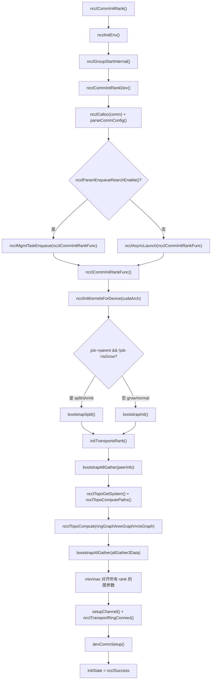
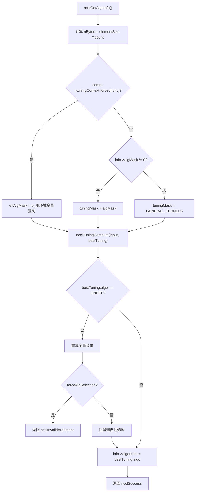
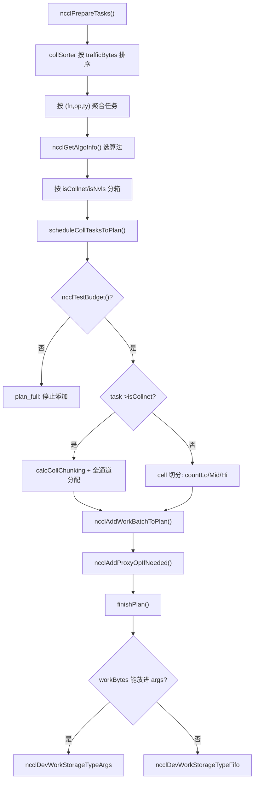

# Глава 25: Панорамный обзор и ретроспектива: полное путешествие одного AllReduce

# Глава 25: Панорамный обзор и размышления: окончательное путешествие одного AllReduce и суть дизайна

В предыдущей главе, основываясь на следах эволюции в исходном коде, мы рассмотрели тенденции архитектуры NCCL: от фиксированных коллективных операций к программируемости, от host proxy к прямой отправке с GPU, от регистрируемых буферов к симметричной памяти. Теперь пришло время проверить эти тенденции в конкретном потоке выполнения. Эта глава не вводит новый код, а заново связывает сквозной путь от главы 3 до главы 10 — от строки вызова ncclAllReduce до записи результата в память GPU. После прочтения вы должны чётко ответить: через какие функции проходит один AllReduce? В каком файле и на какой строке находится каждая функция? Какую главу смотреть при возникновении проблемы?

# I. Инициализация: как «вырастает» коммуникационный домен

## Интуитивная модель

Представьте коммуникационный домен как «групповой чат». Вы вызываете`ncclCommInitRank`— это «заявка на вступление в групповой чат», и NCCL должен в этот момент определить список участников (peerInfo), кто с кем по какой линии (топология), сколько конвейеров на каждую линию (channel).**Если на этом шаге ошибка, вся последующая коммуникация будет ошибочной**— как будто кого-то не добавили в групповой чат, и ваше сообщение всегда не дойдёт до одного человека.

## Структуры данных и размещение в памяти

Основная структура коммуникационного домена —`ncclComm`, её инициализация делится на два этапа:`commAlloc`отвечает за «выделение скелета»,`initTransportsRank`отвечает за «наполнение плотью».

`commAlloc`В**наиболее примечателен дизайн**счётчика ссылок на разделяемые ресурсы`ncclSharedResources`. Когда подчинённый коммуникационный домен (созданный через split/shrink) переиспользует ресурсы родительского, он не копирует их, а разделяет один и тот же

[FACT:src/init.cc:533-555]

```cpp
if (parent == NULL || !parent->shareResources) {
    struct ncclSharedResources* sharedRes;
    NEW_NOTHROW(sharedRes, ncclSharedResources);
    sharedRes->owner = comm;
    ...
    comm->sharedRes = sharedRes;
    sharedRes->refCount = 1;
    NCCLCHECK(ncclNetInit(comm));
    NCCLCHECK(ncclRmaInit(comm));
    NCCLCHECK(ncclGinInit(comm));
} else {
    comm->sharedRes = parent->sharedRes;
    ncclAtomicRefCountIncrement(&parent->sharedRes->refCount);
    NCCLCHECK(ncclNetInitFromParent(comm, parent));
    NCCLCHECK(ncclRmaInitFromParent(comm, parent));
}
```

Копировать`refCount`Намерение этого кода ясно: такие «тяжёлые ресурсы», как сетевые плагины, RMA, GIN, инициализируются только один раз, а подчинённые коммуникационные домены просто заимствуют их.

использует атомарные операции для увеличения, гарантируя, что при многопоточности не будет повторного освобождения.`commAlloc`Ещё один ключевой момент —**в**инициализация каналов`id = -1`. Все каналы сначала помечаются как «неинициализированные» (`setupChannel`), и только последующий

[FACT:src/init.cc:607-608]

```cpp
// Mark channels as non initialized.
for (int c = 0; c channels[c].id = -1;
```

Копировать`-1`Этот`id == -1`— сигнальное значение. Если какой-либо код ошибочно использует неинициализированный канал,

## немедленно выявит проблему, а не прочитает случайный участок памяти.

Пошагово: от ncclCommInitRank до initTransportsRank`ncclCommInitRank`После вызова пользователем

1. `ncclCommInitRank`фактический поток выполнения таков:`ncclInitEnv`сначала вызывает`ncclGroupStartInternal`для загрузки плагина окружения, затем вызывает

для входа в семантику group (это необходимо для поддержки «инициализации нескольких коммуникационных доменов в одной group»).`ncclCommInitRankDev`2. Затем вызывается`comm`, который выполняет проверку параметров, выделяет структуру**, разбирает config, а затем**：

[FACT:src/init.cc:2923-2929]

```cpp
if (ncclParamEnqueueRearchEnable()) {
    NCCLCHECKGOTO(ncclMgmtTaskEnqueue((struct ncclAsyncJob*)job, ncclCommInitRankFunc, ncclCommInitJobFree, comm), res, fail);
} else {
    NCCLCHECKGOTO(ncclAsyncLaunch((struct ncclAsyncJob*)job, ncclCommInitRankFunc, NULL, ncclCommInitJobFree, comm), res, fail);
}
```

Копировать`ncclParamEnqueueRearchEnable()`Обратите внимание на ветку`ncclAsyncLaunch`— это след正在进行 рефакторинга enqueue в NCCL. По умолчанию идёт`ncclMgmtTaskEnqueue`, при включённом рефакторинге —`ncclCommInitRankFunc`。

3. `ncclCommInitRankFunc`. Оба пути в конечном итоге вызывают

[FACT:src/init.cc:2119-2127]

```cpp
timers[TIMER_INIT_TOTAL] = clockNano();
CUDACHECKGOTO(cudaSetDevice(cudaDev), res, fail);
CUDACHECKGOTO(cudaDeviceGetAttribute(&maxSharedMem, cudaDevAttrMaxSharedMemoryPerBlockOptin, cudaDev), res, fail);
CUDACHECKGOTO(cudaDeviceGetAttribute(&archMajor, cudaDevAttrComputeCapabilityMajor, cudaDev), res, fail);
CUDACHECKGOTO(cudaDeviceGetAttribute(&archMinor, cudaDevAttrComputeCapabilityMinor, cudaDev), res, fail);
cudaArch = 100 * archMajor + 10 * archMinor;

timers[TIMER_INIT_KERNELS] = clockNano();
NCCLCHECKGOTO(ncclInitKernelsForDevice(cudaArch, maxSharedMem, &maxLocalSizeBytes), res, fail);
```

`cudaArch = 100 * archMajor + 10 * archMinor`Копировать

4. Затем, в зависимости от того, является ли это обычной инициализацией или split/shrink/grow, выбирается不同的 путь bootstrap:

[FACT:src/init.cc:2136-2191]

```cpp
if (job->parent && !job->isGrow) {
    // SPLIT/SHRINK: use bootstrapSplit
    ...
    NCCLCHECKGOTO(bootstrapSplit(comm->commHash, comm, job->parent, job->color, job->key, parentRanks), res, fail);
} else {
    // GROW or NORMAL INIT: use bootstrapInit
    ...
    NCCLCHECKGOTO(bootstrapInit(job->nId, (struct ncclBootstrapHandle*)job->commId, comm, job->parent), res, fail);
}
```

5. В конце вызывается`initTransportsRank`, это самая тяжёлая функция во всей инициализации (около 800 строк). Внутри неё выполняется два AllGather:

- **AllGather1**: обмен`ncclPeerInfo`(информация об устройстве каждого rank, host hash, pid hash, GPU UUID и т.д.):

[FACT:src/init.cc:1236-1239]

```cpp
NCCLCHECKGOTO(ncclCalloc(&comm->peerInfo, nranks + 1), ret, fail); // Extra rank to represent CollNet root
NCCLCHECKGOTO(fillInfo(comm, comm->peerInfo + rank, comm->commHash), ret, fail);
NCCLCHECKGOTO(bootstrapAllGather(comm->bootstrap, comm->peerInfo, sizeof(struct ncclPeerInfo)), ret, fail);
COMPILER_ATOMIC_STORE(&comm->peerInfoValid, true, std::memory_order_release);
```

Обратите внимание на`nranks + 1`это выделение — дополнительная позиция предназначена для CollNet root.`peerInfoValid`сохраняется с семантикой release, чтобы гарантировать, что при виде этого флага другими потоками содержимое peerInfo уже было видимым.

- **AllGather3**: обмен результатами вычисления топологии (структура ring/tree, пропускная способность, количество каналов и т.д., вычисленные каждым rank), затем берётся**минимальное значение**по всем rank для выравнивания:

[FACT:src/init.cc:1687-1703]

```cpp
for (int i = 0; i nChannels = std::min(allGather3Data[i].graphInfo[a].nChannels, graphs[a]->nChannels);
        graphs[a]->sameChannels = std::min(allGather3Data[i].graphInfo[a].sameChannels, graphs[a]->sameChannels);
        graphs[a]->bwIntra = std::min(allGather3Data[i].graphInfo[a].bwIntra, graphs[a]->bwIntra);
        graphs[a]->bwInter = std::min(allGather3Data[i].graphInfo[a].bwInter, graphs[a]->bwInter);
        graphs[a]->typeIntra = std::max(allGather3Data[i].graphInfo[a].typeIntra, graphs[a]->typeIntra);
        graphs[a]->typeInter = std::max(allGather3Data[i].graphInfo[a].typeInter, graphs[a]->typeInter);
        graphs[a]->crossNic = std::max(allGather3Data[i].graphInfo[a].crossNic, graphs[a]->crossNic);
    }
    ...
}
```

Пропускная способность берётся по min, тип — по max, это «принцип бочки»: производительность всей коммуникационной области определяется самым медленным rank. Без выравнивания разные rank могут выбрать разные алгоритмы, что приведёт к взаимоблокировке при коммуникации.

## Блок-схема инициализации



## Размышления о дизайне и подводные камни

**Почему инициализация должна быть асинхронной?**Поскольку многоранговая инициализация требует межпроцессной синхронизации (bootstrap), синхронное выполнение заблокировало бы вызывающий поток. После асинхронизации пользователь может одновременно инициализировать несколько коммуникационных областей в группе, продвигая их параллельно.

**Подводные камни**：`initTransportsRank`В конце есть intra-node barrier:

[FACT:src/init.cc:1968-1971]

```cpp
/* Local intra-node barrier */
NCCLCHECKGOTO(bootstrapIntraNodeBarrier(comm->bootstrap, comm->localRankToRank, comm->localRank, comm->localRanks, comm->localRankToRank[0]), ret, fail);
```

Этот barrier гарантирует, что все rank на одной машине завершили выделение ресурсов, прежде чем продолжить. Если какой-то rank застрял в`devCommSetup`(например, из-за нехватки видеопамяти), остальные rank будут ждать здесь вечно. При столкновении с «зависанием инициализации» в продакшене первое, что нужно проверить — не провалился ли`devCommSetup`у какого-то rank.

# II. Постановка задач в очередь: от вызова API до внутреннего объекта задачи

## Интуитивная модель

Пользователь вызывает`ncclAllReduce`— это как заказать еду в ресторане.`ncclEnqueueCheck`— это официант, который переводит ваш заказ в понятный кухне «рабочий лист» (`ncclTaskColl`), помещая его в`comm->planner`этот «пул заказов».**Без этого слоя NCCL не смог бы объединять несколько вызовов в один запуск kernel**— каждый заказ готовился бы на отдельном огне, что крайне неэффективно.

## Структуры данных и размещение в памяти

Ядро постановки задач в очередь — это`ncclKernelPlanner`, который привязан к`comm->planner`. Ключевые поля включают:

- `collSorter`: очередь задач коллективной коммуникации, отсортированная по объёму трафика
- `collTaskQueue`: итоговая отсортированная очередь задач
- `peers[]`: очереди send/recv для каждого peer (используется в P2P)
- `wipPlan`: строящийся план kernel

Ключевые поля объекта задачи`ncclTaskColl`заполняются в`collTaskAppend`:

[FACT:src/enqueue/enqueue.cc:2800-2847]

```cpp
struct ncclTaskColl* t = ncclMemoryPoolAlloc(&comm->memPool_ncclTaskColl, &comm->memPermanent);
t->func = info->coll;
t->sendbuff = info->sendbuff;
t->recvbuff = info->recvbuff;
t->count = info->count;
t->root = info->root;
t->datatype = info->datatype;
size_t elementSize = ncclTypeSize(t->datatype);
if (t->func == ncclFuncAllGather || t->func == ncclFuncBroadcast) {
    t->count *= elementSize;
    t->datatype = ncclInt8;
    elementSize = 1;
}
t->trafficBytes = t->count * elementSize * ncclFuncTrafficPerByte(t->func, comm->nRanks);
...
t->aggIsolate = ncclCollConfigNeedAggIsolate(&info->collConfig) || info->collConfig.CTAPolicy != comm->config.CTAPolicy;
NCCL_CONFIG_SET(t, minCTAs, ncclParamMinCTAs(), info->collConfig.minCTAs, comm->config.minCTAs, 1, MAXCHANNELS);
NCCL_CONFIG_SET(t, maxCTAs, ncclParamMaxCTAs(), (std::min(info->collConfig.maxCTAs, comm->config.maxCTAs)), comm->config.maxCTAs, 1, MAXCHANNELS);
...
planner->nTasksColl += 1;
ncclTaskCollSorterInsert(&planner->collSorter, t, t->trafficBytes);
```

Обратите внимание на несколько деталей:

1. **Особая обработка AllGather/Broadcast**: count умножается на размер элемента, datatype меняется на`ncclInt8`. Это потому, что семантика этих двух операций — «перемещение байтов», и исходный тип не важен.

2. **`trafficBytes`вычисление**：`ncclFuncTrafficPerByte`возвращает, сколько раз нужно передать каждый байт. AllReduce возвращает 2 (reduce + broadcast), AllGather возвращает nRanks:

[FACT:src/enqueue/enqueue.cc:123-134]

```cpp
static inline int ncclFuncTrafficPerByte(ncclFunc_t func, int nRanks) {
  switch (func) {
  case ncclFuncAllReduce:
    return 2;
  case ncclFuncAllGather:
    return nRanks;
  case ncclFuncReduceScatter:
    return nRanks;
  default:
    return 1;
  }
}
```

3. **`NCCL_CONFIG_SET`макрос**: это трёхуровневый разбор конфигурации «env > per-call > comm». Переменные окружения имеют наивысший приоритет, затем config отдельного вызова, и в конце — значения по умолчанию уровня коммуникационной области.

## Пошагово: путь постановки в очередь ncclAllReduce

1. `ncclEnqueueCheck`Сначала выполняется проверка коммуникационной области и вход в group:

[FACT:src/enqueue/enqueue.cc:3478-3495]

```cpp
ncclResult_t ncclEnqueueCheck(struct ncclInfo* info) {
  ncclResult_t ret = CommCheck(info->comm, info->opName, "comm");
  if (ret != ncclSuccess) return ncclGroupErrCheck(ret);
  if (info->comm->revokedFlag) {
    WARN("%s: communicator was revoked", info->opName);
    return ncclGroupErrCheck(ncclInvalidUsage);
  }
  ...
  NCCLCHECK(ncclGroupStartInternal());
  ret = ncclSuccess;
  int devOld = -1;
  NCCLCHECKGOTO(ncclCommEnsureReady(info->comm), ret, fail);
```

2. Затем вызывается`taskAppend`, который диспетчеризует по типу операции:

[FACT:src/enqueue/enqueue.cc:3337-3348]

```cpp
static ncclResult_t taskAppend(struct ncclComm* comm, struct ncclInfo* info) {
  ncclFunc_t collAPI = info->coll;
  bool hasLaunchCompletionEvent = ncclInfoHasLaunchCompletionEvent(info);

  if (ncclParamEnqueueRearchEnable()) {
    NCCLCHECK(rawTaskAppend(comm, info));
  } else if (info->coll == ncclFuncSend || info->coll == ncclFuncRecv) {
    NCCLCHECK(p2pTaskAppend(comm, info, info->coll, collAPI, (void*)info->recvbuff, info->count, info->datatype, info->root, true));
  } else if (info->coll == ncclFuncPutSignal || info->coll == ncclFuncSignal || info->coll == ncclFuncWaitSignal) {
    NCCLCHECK(rmaTaskAppend(comm, info));
  } else {
    ...
  }
}
```

Для AllReduce идёт последняя ветка`else`, в итоге вызывается`collTaskAppend`。

3. `collTaskAppend`для вставки задачи в`collSorter`, с сортировкой по`trafficBytes`. Цель сортировки — чтобы планировщик в первую очередь обрабатывал крупные задачи, избегая фрагментации ресурсов каналов мелкими задачами.

## Поток данных постановки задач в очередь


## Размышления о дизайне и подводные камни

**Почему используется`ncclMemoryPoolAlloc`а не`malloc`？**Потому что объекты задач имеют короткий жизненный цикл и часто выделяются. Пул памяти избегает накладных расходов системного вызова`malloc/free`каждый раз. Обратите внимание, что второй параметр`ncclMemoryPoolAlloc`— это`&comm->memPermanent`— это означает, что объекты задач освобождаются централизованно только при уничтожении коммуникационной области, а не по отдельности для каждой задачи.

**Подводные камни**：`ncclPrepareTasks`Внутри есть логика «агрегации», объединяющая задачи близкого размера (в пределах 4 раз):

[FACT:src/enqueue/enqueue.cc:506-512]

```cpp
// We aggregate operations that are within 4X size of each other.
while (aggEnd != nullptr && aggEnd->trafficBytes trafficBytes && !aggBeg->aggIsolate && !aggEnd->aggIsolate) {
    agg.count += aggEnd->count;
    agg.trafficBytes += aggEnd->trafficBytes;
    aggEnd = aggEnd->next;
}
```

Эта агрегация нужна для более стабильного выбора алгоритма — если бы каждый мелкий задача выбирала алгоритм отдельно, мог бы получиться набор разных алгоритмов, приводящий к фрагментации kernel. Но флаг`aggIsolate`блокирует агрегацию, используется для тех задач, которые «должны планироваться отдельно» (например, с per-call config).

# III. Выбор алгоритма: как модель стоимости находит оптимальное решение

## Интуитивная модель

Выбор алгоритма похож на выбор маршрута в навигаторе. «Модель стоимости» NCCL (модуль tuning) оценивает время выполнения каждой комбинации алгоритм/протокол при заданном размере сообщения и топологии, затем выбирает самую быструю.**Без модели стоимости NCCL мог бы только жёстко зашить один алгоритм, тратя впустую пропускную способность на малых сообщениях и задержку на больших**。

## Структуры данных и размещение в памяти

Точка входа выбора алгоритма — это`ncclGetAlgoInfo`：

[FACT:src/enqueue/enqueue.cc:2159-2185]

```cpp
ncclResult_t ncclGetAlgoInfo(struct ncclComm* comm, struct ncclTaskColl* info, int collNetSupport, int nvlsSupport,
                             int numPipeOps, ncclSimInfo_t* simInfo) {
  size_t elementSize = ncclTypeSize(info->datatype);
  size_t nBytes = elementSize * ncclFuncMaxSendRecvCount(info->func, comm->nRanks, info->count);
  info->algorithm = NCCL_ALGO_UNDEF;
  info->protocol = NCCL_PROTO_UNDEF;
  struct ncclTuningInput_t input;
  input.comm = comm;
  input.tuningMask = NCCL_TUNING_MASK_GENERAL_KERNELS;
  uint64_t effAlgMask = comm->tuningContext.forced[info->func] ? 0 : info->algMask;
  if (effAlgMask != 0) {
    input.tuningMask = effAlgMask & NCCL_TUNING_MASK_GENERAL_KERNELS;
  }
  input.CTAPolicy = info->CTAPolicy;
  input.func = info->func;
  input.redOp = info->opHost;
  input.devRedOp = info->opDev.op;
  input.datatype = info->datatype;
  input.nBytes = nBytes;
  input.numPipeOps = numPipeOps;
  input.collNetSupport = collNetSupport;
  input.nvlsSupport = nvlsSupport;
  input.count = info->count;
  NCCLCHECK(ncclGetRegBuff(comm, info, &input.regBuff));
  ...
}
```

Обратите внимание на логику`effAlgMask`: если переменная окружения принудительно задаёт алгоритм (`comm->tuningContext.forced[info->func]`ненулевой), то пользовательский`algMask`игнорируется, используется значение из переменной окружения. Это проявление приоритета «env > per-call».

Затем вызывается`ncclTuningCompute`для получения оптимального результата:

[FACT:src/enqueue/enqueue.cc:2213-2224]

```cpp
} else {
    NCCLCHECK(ncclTuningCompute(&input, &bestTuning));
}
INFO(NCCL_TUNING, "Best tuning, algorithm, %s, protocol, %s", ncclAlgoToString(bestTuning.algo), ncclProtoToString(bestTuning.proto));
info->algorithm = bestTuning.algo;
info->protocol = bestTuning.proto;
info->nWarps = bestTuning.nWarps;
if (simInfo) simInfo->estimatedTime = bestTuning.timeUs;
TRACE(NCCL_COLL, "%ld Bytes -> Algo %d proto %d time %f", nBytes, info->algorithm, info->protocol, bestTuning.timeUs);
info->nMaxChannels = bestTuning.maxChannels == 0 ? info->nMaxChannels : bestTuning.maxChannels;
```

## Step-by-Step: выбор алгоритма для одного AllReduce

Предположим, 8 GPU на одном узле, размер сообщения 1MB, AllReduce:

1. `nBytes = 1MB`，`numPipeOps`— это количество задач, уже присутствующих в текущем plan.

2. `collNetSupport`и`nvlsSupport`определяются`ncclGetCollNetSupport`и`ncclNvlsTransportEnabled`.

3. `ncclTuningCompute`Перебираются все доступные комбинации (algo, proto), время оценивается с помощью модели стоимости.

4. Для сценария 1MB на одном узле обычно побеждает NVLS или Tree+LL128.

5. Результат записывается обратно в`info->algorithm`、`info->protocol`、`info->nWarps`。

## Диаграмма принятия решений по выбору алгоритма



## Размышления о дизайне и подводные камни

**Почему выбор алгоритма должен быть "согласован между rank'ами"?**Потому что если разные rank'и выберут разные алгоритмы, шаблоны коммуникации не совпадут, что приведёт к взаимоблокировке. Поэтому в`initTransportsRank`с помощью min/max выравниваются все параметры графа, чтобы входные данные модели стоимости для каждого rank'а были одинаковыми.

**Подводные камни**：`ncclGetAlgoInfo`В`algMask`есть логика "пересчёта" — если пользователь указал

[FACT:src/enqueue/enqueue.cc:2192-2208]

```cpp
NOWARN(ncclTuningCompute(&input, &bestTuning), NCCL_TUNING);
if (bestTuning.algo == NCCL_ALGO_UNDEF) {
    input.tuningMask = NCCL_TUNING_MASK_GENERAL_KERNELS;
    bestTuning = NCCL_TUNING_RESULT_INIT;
    bestTuning.maxChannels = 0;
    NCCLCHECK(ncclTuningCompute(&input, &bestTuning));
    if (info->forceAlgSelection) {
        WARN("algSelection: no algorithm in the selected set is available for %s", ncclFuncToString(info->func));
        return ncclInvalidArgument;
    }
    INFO(NCCL_TUNING, "algSelection: selected set unavailable for %s; falling back to automatic selection", ncclFuncToString(info->func));
}
```

`NOWARN`Копировать`forceAlgSelection`Макрос временно подавляет предупреждение, потому что "ни один алгоритм не подошёл" может быть нормальной ситуацией (выбранный пользователем набор действительно недоступен). Ошибка выдаётся только когда

# истинно.

## Четыре. Планирование задач и построение kernel plan

Интуитивная модель`scheduleCollTasksToPlan`Планирование задач похоже на распределение кучи заказов по нескольким конвейерам.`ncclKernelPlan`Определяет, сколько каналов использует каждая задача и сколько данных обрабатывает каждый канал, в итоге генерируя

## — это и есть "наряд-заказ", который нужно передать GPU.

`ncclKernelPlan`Структуры данных и размещение в памяти

- `channelMask`Ключевые поля
- `workBytes`: какие каналы использует этот plan (битовая карта)
- `nWorkBatches`: общий размер в байтах всех структур work
- `kernelArgs`: количество work batch
- `workStorageType`: параметры запуска kernel

`finishPlan`: где хранятся данные work (args/fifo/persistent)

[FACT:src/enqueue/enqueue.cc:244-255]

```cpp
// If we can fit everything into the kernel args we do so.
if (sizeof(ncclDevKernelArgs) + batchBytes + workBytes workArgsBytes) {
    plan->workStorageType = ncclDevWorkStorageTypeArgs;
}
plan->kernelArgsSize = sizeof(struct ncclDevKernelArgs) + batchBytes;
plan->kernelArgsSize += (plan->workStorageType == ncclDevWorkStorageTypeArgs) ? workBytes : 0;
plan->kernelArgsSize = alignUp(plan->kernelArgsSize, 16);
plan->kernelArgs = (struct ncclDevKernelArgs*)ncclMemoryStackAlloc(&comm->memScoped, plan->kernelArgsSize, /*align=*/16);
plan->kernelArgs->comm = comm->devComm;
plan->kernelArgs->channelMask = plan->channelMask;
plan->kernelArgs->workStorageType = plan->workStorageType;
```

Копировать

- **Args**Компромиссы трёх типов хранения:
- **Fifo**: самый быстрый, но размер параметров kernel ограничен (обычно 4KB)
- **Persistent**: кольцевой буфер, подходит для средних размеров

## : отдельное выделение видеопамяти, подходит для сценариев CUDA Graph

Step-by-Step: распределение каналов в scheduleCollTasksToPlan

[FACT:src/enqueue/enqueue.cc:654-687]

```cpp
do {
    size_t workBytes = 0;
    struct ncclTaskColl* task = ncclIntruQueueHead(&planner->collTaskQueue);
    struct ncclWorkList* workNode = ncclIntruQueueHead(&planner->collWorkQueue);
    while (task != nullptr) {
        int nBatches = divUp(nPlanColls, 4); // Rough guess: 4 colls per batch.
        if (!ncclTestBudget(budget, nBatches, workBytes + workNode->size)) goto plan_full;
        bool taskAggIsolate = task->aggIsolate;
        if (taskAggIsolate && nPlanColls > 0) goto plan_full;
        nPlanColls += 1;
        workBytes += workNode->size;
        int kind = 2 * task->isCollnet + task->isNvls;
        trafficBytes[kind] += std::max(MinTrafficPerChannel, task->trafficBytes);
        ...
    }
plan_full:;
} while (0);
```

Копировать

[FACT:src/enqueue/enqueue.cc:742-759]

```cpp
int trafficPerByte = ncclFuncTrafficPerByte(task->func, comm->nRanks);
if (task->protocol == NCCL_PROTO_LL) trafficPerByte *= 4;
size_t cellSize = divUp(divUp(MinTrafficPerChannel, (size_t)trafficPerByte), 16) * 16;
int elementsPerCell = cellSize / elementSize;
size_t cells = divUp(task->count * elementSize, cellSize);
size_t trafficPerElement = elementSize * trafficPerByte;
size_t trafficPerCell = cellSize * trafficPerByte;
size_t cellsPerChannel = std::min(cells, divUp(trafficPerChannel, trafficPerCell));
size_t cellsLo;
if (channelId + 1 == nMaxChannels[kind]) {
    cellsLo = cells;
} else {
    cellsLo = std::min(cells, divUp((trafficPerChannel - currentTraffic), trafficPerCell));
}
int nMidChannels = (cells - cellsLo) / cellsPerChannel;
size_t cellsHi = (cells - cellsLo) % cellsPerChannel;
int nChannels = (cellsLo != 0 ? 1 : 0) + nMidChannels + (cellsHi != 0 ? 1 : 0);
```

Копировать`countLo`、`countMid`、`countHi`Этот код разбивает данные на три сегмента "низкий/средний/высокий":

. Низкий и высокий сегменты — это граничные каналы, средний сегмент — промежуточные каналы. Такое разбиение нужно, чтобы объём данных, обрабатываемых каждым каналом, был как можно более равномерным.`calcCollChunking`3. В конце вызывается

[FACT:src/enqueue/enqueue.cc:2228-2275]

```cpp
static ncclResult_t calcCollChunking(struct ncclComm* comm, struct ncclTaskColl* info, int nChannels, size_t nBytes,
                                     uint32_t* outChunkSize, uint32_t* outDirectFlags, struct ncclProxyOp* proxyOp) {
  ncclPattern_t pattern;
  size_t grainSize = ncclProtoGrainSize(info->protocol);
  switch (info->func) {
  case ncclFuncAllReduce:
    pattern = info->algorithm == NCCL_ALGO_NVLS           ? ncclPatternNvls :
              info->algorithm == NCCL_ALGO_NVLS_TREE      ? ncclPatternNvlsTree :
              info->algorithm == NCCL_ALGO_COLLNET_DIRECT ? ncclPatternCollnetDirect :
              info->algorithm == NCCL_ALGO_COLLNET_CHAIN  ? ncclPatternCollnetChain :
              info->algorithm == NCCL_ALGO_TREE           ? ncclPatternTreeUpDown :
                                                            ncclPatternRingTwice;
    break;
  ...
  }
  int stepSize = comm->buffSizes[info->protocol] / NCCL_STEPS;
  int chunkSteps = (info->protocol == NCCL_PROTO_SIMPLE && info->algorithm == NCCL_ALGO_RING) ? info->chunkSteps : 1;
  int sliceSteps = (info->protocol == NCCL_PROTO_SIMPLE && info->algorithm == NCCL_ALGO_RING) ? info->sliceSteps : 1;
  int chunkSize = stepSize * chunkSteps;
  if (info->protocol == NCCL_PROTO_LL) chunkSize /= 2;
  if (info->protocol == NCCL_PROTO_LL128) chunkSize = (chunkSize / NCCL_LL128_LINEELEMS) * NCCL_LL128_DATAELEMS;
  ...
}
```

## Копировать


```

## Копировать

**Размышления о дизайне и подводные камни**Почему задачи CollNet обрабатываются отдельно?

**Потому что CollNet использует сетевые коммутаторы для редукции, и логика распределения каналов полностью отличается от обычных ring/tree. Задачи CollNet напрямую занимают все доступные каналы, тогда как обычные задачи требуют разбиения по трафику.**：`ncclTestBudget`Подводные камни`nBatches = divUp(nPlanColls, 4)`В

[FACT:src/enqueue/enqueue.cc:711-714]

```cpp
// Ensure room for worst case of one new batch per channel
if (!ncclTestBudget(budget, plan->nWorkBatches + nChannels, plan->workBytes + workNode->size)) {
    return ncclSuccess;
}
```

— предполагается, что каждые 4 коллективные операции порождают один batch. Эта оценка может быть неточной, поэтому далее следует точная проверка:

# Копировать

## Если точная проверка не проходит, происходит прямой возврат (без ошибки), и верхний уровень создаёт новый plan.

Пять. Запуск kernel и выполнение на стороне устройства`ncclLaunchKernel`Интуитивная модель`ncclKernelPlan`Запуск kernel похож на передачу наряда-заказа на фабрику.`cuLaunchKernelEx`Переводит

## в параметры запуска CUDA kernel, затем вызывается

`ncclLaunchKernel`. Kernel на стороне устройства, получив наряд-заказ, выполняет перемещение данных согласно алгоритму.

[FACT:src/enqueue/enqueue.cc:1886-1909]

```cpp
ncclResult_t ncclLaunchKernel(struct ncclComm* comm, struct ncclKernelPlan* plan) {
  ncclResult_t ret = ncclSuccess;
  struct ncclKernelPlanner* planner = &comm->planner;
  int nChannels = countOneBits(plan->channelMask);
  void* sym = plan->kernelFn;
  dim3 grid = {(unsigned)nChannels, 1, 1};
  dim3 block = {(unsigned)plan->threadPerBlock, 1, 1};
  int smem = plan->isSymColl ? plan->kernelDynSmem : ncclShmemDynamicSize(comm->cudaArch);
  cudaStream_t launchStream = planner->streams->stream;
  ...
  void* extra[] = {CU_LAUNCH_PARAM_BUFFER_POINTER, plan->kernelArgs, CU_LAUNCH_PARAM_BUFFER_SIZE, &plan->kernelArgsSize, CU_LAUNCH_PARAM_END};
  ...
  CUfunction fn;
  CUDACHECKGOTO(cudaGetFuncBySymbol(&fn, sym), ret, do_return);
```

Ключевые шаги`grid.x = nChannels`Копировать`block.x = plan->threadPerBlock`Обратите внимание на

## — один block на каждый канал.

— количество потоков в каждом block определяется задачей.`uploadWork`Step-by-Step: от plan к запуску kernel

[FACT:src/enqueue/enqueue.cc:1365-1407]

```cpp
static ncclResult_t uploadWork(struct ncclComm* comm, struct ncclKernelPlan* plan) {
  if (plan->isSymColl || plan->isCeColl || plan->isRma) return ncclSuccess;
  size_t workBytes = plan->workBytes;
  size_t batchBytes = plan->nWorkBatches * sizeof(struct ncclDevWorkBatch);
  void* fifoBufHost;
  uint32_t fifoCursor, fifoMask;
  switch (plan->workStorageType) {
  case ncclDevWorkStorageTypeArgs:
    plan->kernelArgs->workBuf = nullptr;
    fifoBufHost = (void*)plan->kernelArgs;
    fifoCursor = sizeof(ncclDevKernelArgs) + batchBytes;
    fifoMask = ~0u;
    break;
  case ncclDevWorkStorageTypeFifo:
    fifoBufHost = comm->workFifoBuf;
    fifoCursor = comm->workFifoProduced;
    fifoMask = comm->workFifoBytes - 1;
    NCCLCHECK(waitWorkFifoAvailable(comm, fifoCursor + workBytes));
    plan->kernelArgs->workBuf = comm->workFifoBufDev;
    break;
  ...
  }
}
```

для записи данных work в целевое место (args/fifo/persistent):

[FACT:src/enqueue/enqueue.cc:1929-1936]

```cpp
if (clusterSize) {
    // Grid dimension must be divisible by clusterSize
    if (grid.x % clusterSize) clusterSize = 1;
    launchAttrs[attrs].id = CU_LAUNCH_ATTRIBUTE_CLUSTER_DIMENSION;
    launchAttrs[attrs++].value.clusterDim = {clusterSize, 1, 1};
    launchAttrs[attrs].id = CU_LAUNCH_ATTRIBUTE_CLUSTER_SCHEDULING_POLICY_PREFERENCE;
    launchAttrs[attrs++].value.clusterSchedulingPolicyPreference = CU_CLUSTER_SCHEDULING_POLICY_SPREAD;
}
```

2. Затем конструируются атрибуты запуска CUDA. Для sm90+ устанавливается размерность cluster:`cuLaunchKernelEx`：

[FACT:src/enqueue/enqueue.cc:1992]

```cpp
CUCHECKGOTO(cuLaunchKernelEx(&launchConfig, fn, nullptr, extra), ret, do_return);
```

## 3. В конце вызывается

Копировать`RunWorkColl`Сторона устройства: выполнение runRing

[FACT:src/device/all_reduce.h:14-83]

```cpp
template 
__device__ __forceinline__ void runRing(int tid, int nthreads, struct ncclDevWorkColl* work) {
  ncclRing* ring = &ncclShmem.channel.ring;
  int ringIx = ring->index;
  const int nranks = ncclShmem.comm.nRanks;
  ssize_t gridOffset;
  ssize_t channelCount;
  ssize_t chunkCount;
  ncclCollCbdPart(work, ncclShmem.channelId, Proto::Id, sizeof(T), (ssize_t*)nullptr, &gridOffset, &channelCount, &chunkCount);
  const ssize_t loopCount = nranks * chunkCount;
  ...
  Primitives, 1, Proto, 0> prims(tid, nthreads, &ring->prev, &ring->next, work->sendbuff, work->recvbuff, work->redOpArg, 0, 0, 0, work);

  for (ssize_t elemOffset = 0; elemOffset  int { return r - (r >= nranks ? nranks : 0); };

    // step 0: push data to next GPU
    chunk = modRanks(ringIx + nranks - 1);
    chunkOffset = chunk * chunkCount;
    offset = gridOffset + elemOffset + chunkOffset;
    nelem = (int)min(chunkCount, remCount - chunkOffset);
    prims.directSend(offset, offset, nelem);

    // k-2 steps: reduce and copy to next GPU
    for (int j = 2; j >Plan: ncclLaunchPrepare()
    Plan->>Plan: scheduleCollTasksToPlan()
    Plan->>Plan: finishPlan() выделение kernelArgs
    Host->>Plan: ncclLaunchKernelBefore_NoUncapturedCuda()
    Plan->>Plan: uploadWork() запись данных work
    Host->>CUDA: cuLaunchKernelEx(fn, grid, block, smem)
    CUDA->>Kernel: запуск nChannels блоков
    Kernel->>Kernel: runRing() выполнение Ring AllReduce
    Host->>Plan: ncclLaunchKernelAfter_NoCuda()
    Plan->>Proxy: hostStreamPlanTask() + uploadProxyOps()
    Proxy->>Proxy: ncclProxyStart() продвижение сетевого ввода-вывода
    Kernel-->>Host: ядро завершено
    Host->>Plan: ncclLaunchFinish()
    Plan->>Plan: reclaimPlan() освобождение ресурсов
```

## Диаграмма последовательности запуска kernel

**Копировать`cuLaunchKernelEx`Размышления о дизайне и подводные камни`cudaLaunchKernel`？**Почему используется

**а не**：`uploadWork`Обработка persistent-режима здесь очень сложна — требуется выделить видеопамять, скопировать данные, записать события, а также корректно работать в режиме захвата CUDA Graph:

[FACT:src/enqueue/enqueue.cc:1445-1478]

```cpp
CUDACHECKGOTO(cudaThreadExchangeStreamCaptureMode(&mode), result, fail);
NCCLCHECKGOTO(ncclStrongStreamAcquire(ncclCudaGraphNone(comm->config.graphUsageMode), &comm->sharedRes->deviceStream, /*concurrent=*/false, &deviceStream), result, fail);
if (comm->memPool) {
    CUDACHECKGOTO(cudaMallocAsync(&fifoBufDev, workBytes, comm->memPool, deviceStream), result, fail);
} else {
    CUDACHECKGOTO(cudaMalloc(&fifoBufDev, workBytes), result, fail);
}
plan->workBufPersistent = fifoBufDev;
plan->kernelArgs->workBuf = fifoBufDev;
CUDACHECKGOTO(cudaMemcpyAsync(fifoBufDev, fifoBufHost, workBytes, cudaMemcpyDefault, deviceStream), result, fail);
cudaEvent_t memcpyDone;
CUDACHECKGOTO(cudaEventCreateWithFlags(&memcpyDone, cudaEventDisableTiming), result, fail);
CUDACHECKGOTO(cudaEventRecord(memcpyDone, deviceStream), result, fail);
```

`cudaThreadExchangeStreamCaptureMode`предназначен для временного переключения в relaxed-режим в режиме захвата, что позволяет выделять видеопамять. После завершения копирования записывается событие, которое впоследствии освобождается через`ncclCommPollEventCallbacks`.

# VI. Руководство по избежанию проблем в production

## Проблема 1: Зависание при инициализации

**Симптом**：`ncclCommInitRank`зависает и не возвращает управление.

**Диагностика**: посмотрите`NCCL_DEBUG=INFO`логи, найдите последний rank, который вывел сообщение. Если все rank вывели "Init START", но не вывели "Init COMPLETE", значит зависание произошло в`initTransportsRank`.

**Типичные причины**：

- Сбой`devCommSetup`на каком-либо rank (нехватка видеопамяти, ошибка CUDA)
- Недоступность bootstrap-сети (firewall, занятый порт)
- Несовпадение версий NCCL на разных rank

**Основание в исходном коде**：`initTransportsRank`В конце

[FACT:src/init.cc:1968-1971]

```cpp
/* Local intra-node barrier */
NCCLCHECKGOTO(bootstrapIntraNodeBarrier(comm->bootstrap, comm->localRankToRank, comm->localRank, comm->localRanks, comm->localRankToRank[0]), ret, fail);
```

## Проблема 2: Переполнение work FIFO

**Симптом**: зависание после запуска kernel или ошибка`ncclInternalError`。

**Причина**：`waitWorkFifoAvailable`ожидает места в FIFO, но потребитель (kernel) не продвигается.

[FACT:src/enqueue/enqueue.cc:1333-1349]

```cpp
static ncclResult_t waitWorkFifoAvailable(struct ncclComm* comm, uint32_t desiredProduced) {
  bool hasRoom = (desiredProduced - comm->workFifoConsumed) workFifoBytes;
  if (!hasRoom) {
    while (true) {
      // Check abort flag to break deadlock when abort is signaled
      if (COMPILER_ATOMIC_LOAD(comm->abortFlag, std::memory_order_acquire)) {
        return ncclInternalError;
      }
      NCCLCHECK(ncclCommPollEventCallbacks(comm, /*waitSome=*/true));
      hasRoom = (desiredProduced - comm->workFifoConsumed) workFifoBytes;
      if (hasRoom) break;
      std::this_thread::yield();
    }
  }
  return ncclSuccess;
}
```

Обратите внимание на проверку abort flag — это единственный путь к спасению. Если abort также не установлен, возникнет бесконечный цикл.

**Как избежать**: увеличьте`NCCL_WORK_FIFO_BYTES`или уменьшите количество операций в одной группе.

## Проблема 3: Сбой захвата CUDA Graph

**Симптом**: при вызове NCCL во время захвата CUDA Graph возникает ошибка "operation not permitted".

**Причина**: в режиме захвата нельзя выполнять некоторые операции CUDA (например,`cudaMalloc`). NCCL использует`cudaThreadExchangeStreamCaptureMode`для временного переключения режима, но не все операции можно обойти.

**Основание в исходном коде**：`uploadWork`ветка persistent в

[FACT:src/enqueue/enqueue.cc:1445]

```cpp
CUDACHECKGOTO(cudaThreadExchangeStreamCaptureMode(&mode), result, fail);
```

**Как избежать**: используйте`NCCL_GRAPH_MIXING_SUPPORT=1`для включения гибридного режима graph или предварительно выделите work buffer.

# Итоги главы

В этой главе мы заново прошли полный путь одного AllReduce:

1. **Инициализация**：`ncclCommInitRank` → `ncclCommInitRankFunc` → `initTransportsRank`, создание коммуникационного домена, поиск топологии, согласование параметров графа.

2. **Постановка задачи в очередь**：`ncclEnqueueCheck` → `taskAppend` → `collTaskAppend`, преобразование вызова API в`ncclTaskColl`。

3. **Выбор алгоритма**：`ncclGetAlgoInfo` → `ncclTuningCompute`, выбор оптимальной пары (algo, proto) с помощью модели стоимости.

4. **Планирование задач**：`ncclPrepareTasks` → `scheduleCollTasksToPlan` → `finishPlan`, распределение задач по каналам, генерация`ncclKernelPlan`。

5. **Запуск kernel**：`ncclLaunchKernel` → `cuLaunchKernelEx`, преобразование plan в параметры запуска CUDA.

6. **Выполнение на устройстве**：`runRing` / `runTreeUpDown` / `runNvls`, выполнение перемещения данных согласно алгоритму.

# Вопросы для размышления и самопроверки

Q1: Если убрать логику выравнивания min/max после AllGather3 в`initTransportsRank`(L1690-L1698), в каких сценариях это приведёт к взаимоблокировке коммуникации? Почему?

**Разбор ответа**: этот фрагмент логики гарантирует, что все rank приходят к согласию по таким параметрам, как`nChannels`、`bwIntra`、`bwInter`для каждого алгоритма. Если его убрать, каждый rank будет вычислять результат на основе своей локальной топологии. Рассмотрим гетерогенный кластер: rank 0 на машине с 8 GPU NVLink, rank 8 на машине с 4 GPU PCIe. Rank 0 вычислит 8 каналов для ring, rank 8 — 4. При выполнении Ring AllReduce rank 0 будет ждать, пока rank 8 отправит данные по 8 каналам, но rank

На этом мы завершили обзор полного пути одного AllReduce. От инициализации, поиска топологии, выбора алгоритма, постановки задач в очередь, запуска kernel до выполнения на устройстве и сетевой передачи — каждый этап соответствует углублённому анализу из предыдущих глав. Эта схема пути — не только скелет для понимания NCCL, но и индекс для диагностики проблем: при сбое инициализации смотрите главы 3 и 4, при неверном выборе алгоритма — главу 5, при ошибках постановки задач в очередь — главы 6 и 7, при сбое запуска kernel — главу 8, при зависании на устройстве — главы 9 и 10, при сетевых проблемах — главы 12 и 13. По мере развития NCCL в сторону программируемой коммуникации, GPU-инициируемых операций и симметричной памяти этот путь будет продолжать расширяться — а вы уже освоили метод его отслеживания.
