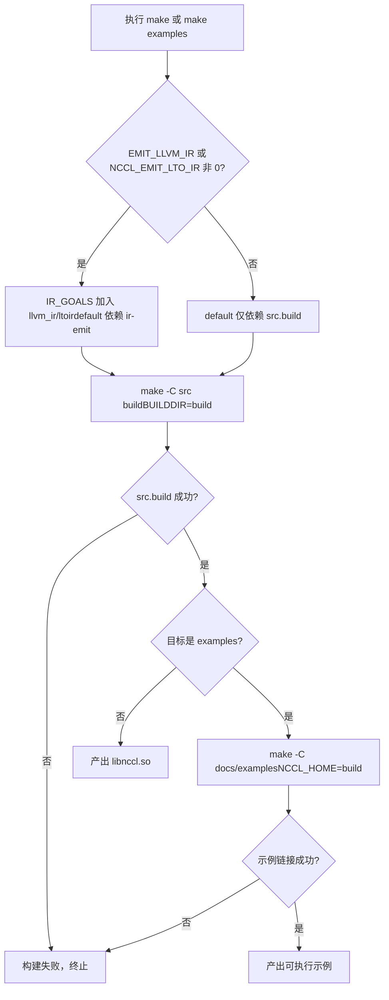
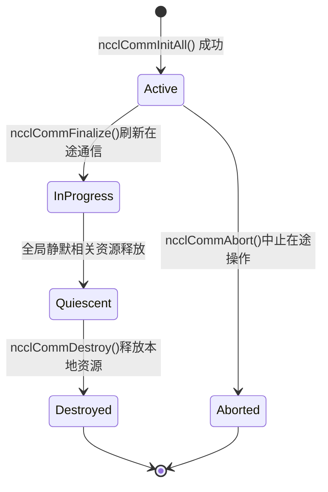

# 第 1 章：執行與現象：從一個 AllReduce 開始看外部行為

在深入任何核心程式碼之前，我們先把 NCCL 跑起來，觀察它對外暴露的行為。這一章不讀核心，只做一件事：建立一個可驗證的參照系——任何後續的內部機制分析，最終都要能解釋這裡看到的外部行為。

# 1.1 從建置入口看 NCCL 的工程結構

## 直覺模型

建置系統就像一棟大樓的施工圖紙：它不決定樓裡住誰，但決定了有哪些房間、門朝哪開。如果建置入口混亂，你連「跑起來」這第一步都邁不出去。NCCL 同時提供 Makefile 和 CMake 兩套建置入口，理解它們的差異，是理解這個專案工程組織的第一步。

## 兩套建置入口的結構

頂層`Makefile`是一個極薄的排程層，它本身不編譯任何原始檔，而是把工作轉發給各個子目錄的 Makefile。

[FACT:Makefile:44-45]定義了`src.%`模式規則，把`src.build`、`src.install`等目標轉發給`src/Makefile`：

```
src.%:
	${MAKE} -C src $* BUILDDIR=${ABSBUILDDIR}
```

[FACT:Makefile:47-48]定義了`examples`目標，它依賴`src.build`，然後進入`docs/examples`目錄建置範例：

```
examples: src.build
	${MAKE} -C docs/examples NCCL_HOME=${ABSBUILDDIR}
```

注意這裡的依賴關係：範例的建置依賴`src.build`先完成，因為範例需要連結 NCCL 函式庫，而`NCCL_HOME`環境變數把建置產物目錄傳給範例的 Makefile。這就是「先有函式庫，再有範例」的建置順序約束。

[FACT:Makefile:29]列出了所有可清理的目標集合：

```
TARGETS := src pkg nccl4py ir
```

[FACT:Makefile:30]用 GNU Make 的替換引用語法`${TARGETS:%=%.clean}`把`src pkg nccl4py ir`展開成`src.clean pkg.clean nccl4py.clean ir.clean`，一次性定義所有清理目標。這是 Makefile 裡常見的「用資料驅動規則」技巧——新增一個模組只需往`TARGETS`裡加一個詞。

## CMake 入口：版本號從哪來

CMake 入口比 Makefile 複雜得多，因為它要處理跨平台、CUDA 版本探測、架構選擇等。我們只關注與「跑起來」直接相關的部分。

[FACT:CMakeLists.txt:5-11]展示了版本號的來源——它不是硬編碼在 CMakeLists.txt 裡，而是從`makefiles/version.mk`讀取後用正則提取：

```cmake
file(READ ${CMAKE_SOURCE_DIR}/makefiles/version.mk VERSION_CONTENT)
string(REGEX REPLACE ".*NCCL_MAJOR[ ]*:=[ ]*([0-9]+).*" "\\1" NCCL_MAJOR "${VERSION_CONTENT}")
...
math(EXPR NCCL_VERSION_CODE "(${NCCL_MAJOR} * 10000) + (${NCCL_MINOR} * 100) + ${NCCL_PATCH}")
```

> **[Design Inference & Architectural Trade-offs]**
> 把版本號集中放在`version.mk`裡，讓 Makefile 和 CMake 兩套建置系統共享同一個版本源，避免「兩套建置系統版本號不一致」這個經典工程陷阱。`NCCL_VERSION_CODE`的計算公式`MAJOR*10000 + MINOR*100 + PATCH`與標頭檔裡的`NCCL_VERSION`巨集保持一致。

[FACT:CMakeLists.txt:14-20]把這些版本號透過`add_compile_definitions`注入到所有 C++ 原始碼檔案：

```cmake
add_compile_definitions(
    NCCL_USE_CMAKE
    NCCL_MAJOR=${NCCL_MAJOR}
    NCCL_MINOR=${NCCL_MINOR}
    NCCL_PATCH=${NCCL_PATCH}
    NCCL_VERSION_CODE=${NCCL_VERSION_CODE}
)
```

[FACT:CMakeLists.txt:24-25]宣告了專案語言為 CUDA、CXX、C：

```cmake
project(NCCL VERSION ${NCCL_MAJOR}.${NCCL_MINOR}.${NCCL_PATCH}
        LANGUAGES CUDA CXX C)
```

## CUDA 架構選擇：為什麼預設值這麼複雜

[FACT:CMakeLists.txt:140-171]是一大段根據 CUDA 版本決定`CMAKE_CUDA_ARCHITECTURES`的邏輯。以 CUDA 12.8 及以上為例：

```cmake
elseif(${CUDA_MAJOR} EQUAL 12)
    if(${CUDA_MINOR} LESS 8)
        set(CMAKE_CUDA_ARCHITECTURES "50;60;61;70;80;90")
    else()
        set(CMAKE_CUDA_ARCHITECTURES "50;60;61;70;80;90;100;120")
    endif()
```

> **[Design Inference & Architectural Trade-offs]**
> 這段邏輯的設計動機是：新架構（如 100、120）的 PTX 只有較新的 CUDA 工具鏈才認識，如果對舊 CUDA 強行指定新架構，編譯會直接失敗。所以預設架構列表必須隨 CUDA 版本動態調整。對讀者而言，這意味著：**如果你不顯式設定`CMAKE_CUDA_ARCHITECTURES`，編譯產物會包含一長串架構的 fatbin，編譯時間會顯著變長**。生產環境通常顯式指定目標架構來加速建置。

## 建置流程決策圖

下面這張圖展示了從執行`make`到產出可執行範例的完整決策路徑：



這張圖的關鍵分支在於`IR_GOALS`是否非空——它決定了預設建置是否額外觸發 LLVM IR 生成。對只想「跑起來」的讀者，保持`EMIT_LLVM_IR=0`即可走最短路徑。

# 1.2 最小可執行程序的前置條件

## 直覺模型

寫一個 NCCL 程式，就像組織一場多方電話會議。你需要先確認：有幾個人參加（裝置數）、每個人是誰（rank）、用什麼線路通話（stream）。缺任何一樣，會議都開不起來。這一節我們透過`01_communicators`範例，看清楚這三個前置條件在程式碼裡長什麼樣。

## 資料結構：三個陣列承載全部狀態

[FACT:docs/examples/01_communicators/01_multiple_devices_single_process/c/main.cc:88-92]定義了範例的核心變數：

```c
int num_gpus;                 // Number of available CUDA devices
ncclComm_t *comms = NULL;     // Array of NCCL communicators (one per GPU)
cudaStream_t *streams = NULL; // Array of CUDA streams (one per GPU)
int *devices = NULL;          // Array of device IDs to use
```

這裡體現了 NCCL 單行程多卡程式設計模型的核心：**每個 GPU 一個通訊域、一個 stream、一個裝置號**。三個陣列的長度都是`num_gpus`，下標`i`對應第`i`個 GPU。

`ncclComm_t`在標頭檔裡被定義為不透明指標。[FACT:src/nccl.h.in:36]給出了它的真實型別：

```c
typedef struct ncclComm* ncclComm_t;
```

> **[Design Inference & Architectural Trade-offs]**
> 「不透明指標」（opaque pointer）是 C 語言裡實現資訊隱藏的經典手法：標頭檔只暴露`struct ncclComm*`這個指標型別，使用者程式碼無法存取結構體內部的欄位，所有操作必須透過 API 函式完成。這樣 NCCL 就能在不破壞 ABI 的前提下自由修改`ncclComm`的內部佈局。對小白讀者，可以理解為「你拿到的是一個黑盒句柄，只能透過官方介面操作它」。

## Step-by-Step：從裝置探測到通訊域建立

**第一步：探測裝置數。** [FACT:docs/examples/01_communicators/01_multiple_devices_single_process/c/main.cc:96-104]呼叫`cudaGetDeviceCount`並檢查是否為 0：

```c
CUDACHECK(cudaGetDeviceCount(&num_gpus));

if (num_gpus == 0) {
    fprintf(stderr, "ERROR: No CUDA devices found on this system\n");
    ...
    return 1;
}
```

這一步在幹什麼：向 CUDA 執行時詢問「這台機器上有幾張 GPU」。如果回傳 0，說明沒有可用裝置，程式直接退出——這是最前置的守衛條件。

**第二步：分配宿主記憶體並填充裝置列表。** [FACT:docs/examples/01_communicators/01_multiple_devices_single_process/c/main.cc:114-121]分配三個陣列並檢查分配是否成功：

```c
devices = (int *)malloc(num_gpus * sizeof(int));
comms = (ncclComm_t *)malloc(num_gpus * sizeof(ncclComm_t));
streams = (cudaStream_t *)malloc(num_gpus * sizeof(cudaStream_t));

if (!devices || !comms || !streams) {
    fprintf(stderr, "ERROR: Failed to allocate memory for device arrays\n");
    return 1;
}
```

[FACT:docs/examples/01_communicators/01_multiple_devices_single_process/c/main.cc:126-136]用迴圈填充`devices[i] = i`，並列印每個裝置的屬性：

```c
for (int i = 0; i >CUDA: cudaGetDeviceCount(&num_gpus)
    CUDA-->>App: num_gpus = N
    loop i in 0..N-1
        App->>CUDA: cudaSetDevice(devices[i])
        App->>CUDA: cudaStreamCreate(&streams[i])
        CUDA-->>App: streams[i]
    end
    App->>NCCL: ncclCommInitAll(comms, N, devices)
    Note over NCCL: 内部为每个设备建立通信域分配 rank 0..N-1
    NCCL-->>App: comms[0..N-1]
    loop i in 0..N-1
        App->>NCCL: ncclCommUserRank(comms[i], &rank)
        NCCL-->>App: rank = i
        App->>NCCL: ncclCommCount(comms[i], &size)
        NCCL-->>App: size = N
    end
```

這張時序圖揭示了關鍵點：`ncclCommInitAll`是一個**同步阻塞呼叫**，它內部會完成所有裝置間的協調，回傳時所有通訊域都已就緒。

## 設計思考：為什麼需要 ncclCommInitAll

> **[Design Inference & Architectural Trade-offs]**
> 多進程場景下，每個進程只管理一張 GPU，用`ncclCommInitRank`各自初始化即可。但單進程多卡場景下，如果讓使用者手動為每張卡呼叫`ncclCommInitRank`，就必須處理「多個 rank 之間的同步」——而單進程裡只有一個執行緒，無法同時推進多個 rank 的初始化，會死鎖。`ncclCommInitAll`把這種協調封裝在函式庫內部，用內部機制（通常是多執行緒或狀態機）完成所有 rank 的同步初始化，對使用者暴露成一個簡單的同步呼叫。這就是「便捷函式」存在的根本原因。

# 1.3 一次 AllReduce 的完整外部行為

## 直覺模型

AllReduce 是集合通訊裡最常用的操作：每個參與者貢獻一份資料，所有人拿到所有資料的總和。就像小組作業算總分——每個人報上自己的分數，最後每個人手裡都有一份全班總分。這一節我們追蹤`03_collectives/01_allreduce`範例，看一次 AllReduce 從呼叫到結果驗證的完整外部行為。

## 資料結構：資料緩衝區與初始化

[FACT:docs/examples/03_collectives/01_allreduce/c/main.cc:59-63]定義了核心變數：

```c
int num_gpus = 0;
ncclComm_t *comms;
cudaStream_t *streams;
float **sendbuff;
float **recvbuff;
```

注意`sendbuff`和`recvbuff`是`float**`——指向指標陣列的指標。每個`sendbuff[i]`是第`i`張 GPU 上的裝置記憶體位址。

[FACT:docs/examples/03_collectives/01_allreduce/c/main.cc:99]定義了資料規模：

```c
const size_t size = 32 * 1024 * 1024; // 32M floats for demonstration
```

32M 個 float，每個 4 位元組，即 128 MB 的發送緩衝和 128 MB 的接收緩衝，每張卡各一份。

[FACT:docs/examples/03_collectives/01_allreduce/c/main.cc:101-120]是每個裝置的初始化迴圈：

```c
for (int i = 0; i  **[Design Inference & Architectural Trade-offs]**
> 核心矛盾在於：集合通訊需要所有 rank 同時參與，但單執行緒裡你只能一個一個呼叫`ncclAllReduce`。如果第一個`ncclAllReduce`呼叫就阻塞等待其他 rank，而其他 rank 的呼叫還沒發出，就會死鎖。Group 機制的作用是：`ncclGroupStart`之後的所有呼叫只做「登記」，不實際啟動；`ncclGroupEnd`時才把所有登記的操作一起提交，讓它們能並發推進。這就像點外送時先把所有菜加進購物車，最後一起結算，而不是一道菜一道菜地下單。

**第二步：同步 stream。** [FACT:docs/examples/03_collectives/01_allreduce/c/main.cc:139-142]：

```c
for (int i = 0; i 首元素=0"]
        r0["recvbuff[0]"]
    end
    subgraph dev1["GPU 1 (rank 1)"]
        s1["sendbuff[1]首元素=1"]
        r1["recvbuff[1]"]
    end
    subgraph dev2["GPU 2 (rank 2)"]
        s2["sendbuff[2]首元素=2"]
        r2["recvbuff[2]"]
    end
    s0 -->|ncclAllReducencclFloat ncclSum| reduce["归约求和0+1+2=3"]
    s1 -->|ncclAllReducencclFloat ncclSum| reduce
    s2 -->|ncclAllReducencclFloat ncclSum| reduce
    reduce -->|广播结果| r0
    reduce -->|广播结果| r1
    reduce -->|广播结果| r2
```

這張圖展示了 AllReduce 的兩個階段：先歸約（reduce），再廣播（broadcast）。每個 rank 的`recvbuff`最終都得到相同的結果。

## 設計思考：為什麼用 Group 而不是逐個呼叫

> **[Design Inference & Architectural Trade-offs]**
> 如果去掉`ncclGroupStart`/`ncclGroupEnd`，程式碼會變成：

```c
for (int i = 0; i  **[Design Inference & Architectural Trade-offs]**
> 為什麼銷毀要分兩步？`ncclCommFinalize`是**全域操作**——它需要所有 rank 都參與，確保沒有在途的通訊。`ncclCommDestroy`是**本地操作**——它只釋放本進程的資源，不阻塞。這個設計讓「等待所有 rank 靜默」和「釋放本地資源」解耦：前者可能耗時較長（要等網路對端），後者是純本地操作。如果只有一個`ncclCommDestroy`，它就必須同時承擔這兩個職責，要麼阻塞太久，要麼無法保證全域靜默。

## 銷毀順序的完整鏈條

[FACT:docs/examples/01_communicators/01_multiple_devices_single_process/c/main.cc:221-249]展示了完整的清理順序，註解[FACT:docs/examples/01_communicators/01_multiple_devices_single_process/c/main.cc:218-219]強調：

```c
// IMPORTANT: Proper cleanup is critical for NCCL applications
// Resources must be cleaned up in the correct order to avoid issues
```

順序是：

1. 同步所有 stream（[FACT:docs/examples/01_communicators/01_multiple_devices_single_process/c/main.cc:224-227]）

2. Finalize + Destroy 通訊域（[FACT:docs/examples/01_communicators/01_multiple_devices_single_process/c/main.cc:233-240]）

3. 銷毀 CUDA stream（[FACT:docs/examples/01_communicators/01_multiple_devices_single_process/c/main.cc:246-249]）

4. 釋放宿主記憶體（[FACT:docs/examples/01_communicators/01_multiple_devices_single_process/c/main.cc:253-255]）

## 通訊域狀態機

`ncclCommFinalize`的文件明確提到了狀態轉換，這符合狀態機的准入條件：



這個狀態機的關鍵轉換是`InProgress -> Quiescent`：它由「全域靜默」這個事件觸發，而不是由某個函式呼叫直接觸發。這意味著`ncclCommFinalize`返回後，通訊域可能還處於`InProgress`狀態，需要輪詢`ncclCommGetAsyncError`才能知道何時進入`Quiescent`。

## 設計思考：為什麼銷毀順序不能顛倒

> **[Design Inference & Architectural Trade-offs]**
> 如果先銷毀 CUDA stream 再銷毀通訊域，會出什麼問題？通訊域內部可能持有對 stream 的參考（比如用於非同步操作的完成通知）。如果 stream 先被銷毀，通訊域在 Finalize 時存取已銷毀的 stream，會導致未定義行為。同理，如果先釋放宿主記憶體（`comms`陣列）再銷毀通訊域，`ncclCommDestroy`就拿到了野指標。這就是為什麼順序必須是「先同步、再銷毀通訊域、再銷毀 stream、最後釋放宿主記憶體」——**依賴關係決定了銷毀順序必須與建立順序相反**。

# 1.5 生產避坑指南

## 坑一：忘記 Group 導致死鎖

這是新手最常踩的坑。在單行程多卡場景下，如果直接迴圈呼叫`ncclAllReduce`而不加 Group，程式會在第一次呼叫時死鎖。症狀是：程式卡住不動，CPU 佔用率接近 0，沒有任何輸出。

排查方法：用`gdb`attach 到行程，看堆疊是否停在 NCCL 內部的等待邏輯上。如果是，檢查是否遺漏了`ncclGroupStart`/`ncclGroupEnd`。

## 坑二：忘記同步 stream 就讀結果

[FACT:src/nccl.h.in:854-856]明確說明`ncclGroupEnd`只保證入列，不保證完成。如果省略[FACT:docs/examples/03_collectives/01_allreduce/c/main.cc:139-142]的 stream 同步，直接讀取`recvbuff`，會讀到未完成的資料。

症狀是：結果時對時錯，或者讀到全 0。這是因為`cudaMemcpy`預設是同步的，但它同步的是**當前 stream**，而 AllReduce 可能在其他 stream 上執行。排查方法：在讀取結果前加`cudaStreamSynchronize`，如果問題消失，就是這個坑。

## 坑三：銷毀順序錯誤導致段錯誤

如果在`ncclCommDestroy`之前就`cudaFree`了`sendbuff`/`recvbuff`，通訊域在 Finalize 時可能還在存取這些緩衝區，導致段錯誤或資料損壞。

症狀是：程式在退出階段崩潰，或者偶發地讀到垃圾資料。排查方法：檢查清理程式碼的順序，確保通訊域銷毀在所有 CUDA 資源釋放之前。

## 坑四：裝置號與 rank 混淆

[FACT:docs/examples/01_communicators/01_multiple_devices_single_process/c/main.cc:198-200]有一個驗證：

```c
if (device != devices[i]) {
    printf(" [WARNING: Expected device %d]", devices[i]);
}
```

> **[Design Inference & Architectural Trade-offs]**
> rank 和 device 是兩個不同的概念。rank 是通訊域內的邏輯編號（0 到 nRanks-1），device 是實體 GPU 編號。在`ncclCommInitAll`的預設用法裡，`devices[i] = i`，所以 rank 和 device 恰好相等。但如果傳入自訂的`devlist`（比如`{2, 0, 1}`），rank 0 就對應 device 2。混淆這兩個概念會導致資料發到錯誤的 GPU 上。

# 本章小結

本章我們完成了三件事：

1. **建置入口**：理解了 Makefile 的轉發機制和 CMake 的版本號來源、CUDA 架構選擇邏輯。關鍵結論是`make examples`會先建置函式庫再建置範例，`NCCL_HOME`把建置產物目錄傳給範例。

2. **最小可執行程式的三要素**：裝置數（`cudaGetDeviceCount`）、rank（由`ncclCommInitAll`自動分配）、stream（每個 GPU 一個）。`ncclCommInitAll`是單行程多卡的便捷入口，它把多 rank 同步初始化封裝在函式庫內部。

3. **一次 AllReduce 的完整外部行為**：從`ncclGroupStart`包裹多個`ncclAllReduce`呼叫，到`ncclGroupEnd`提交，再到`cudaStreamSynchronize`等待完成，最後驗證結果。Group 機制是單執行緒多卡場景避免死鎖的關鍵。

4. **通訊域生命週期**：`ncclCommFinalize`（全域靜默）+`ncclCommDestroy`（本地釋放）的兩階段銷毀，以及「先同步、再銷毀通訊域、再銷毀 stream、最後釋放宿主記憶體」的順序約束。

# 本章思考與自測

Q1: 如果把[FACT:docs/examples/03_collectives/01_allreduce/c/main.cc:130-136]的 ncclGroupStart/ncclGroupEnd 去掉，改成直接迴圈呼叫 ncclAllReduce，在單行程多卡場景下會發生什麼？為什麼？

**參考解析**：會發生死鎖。標頭檔[FACT:src/nccl.h.in:844-864]解釋了原因：集合通訊呼叫可能執行 inter-CPU 同步，需要所有 rank 同時參與。在單執行緒裡，第一次迴圈迭代呼叫`ncclAllReduce(comms[0], ...)`時，NCCL 需要等待其他 rank 也發起 AllReduce 才能推進。但其他 rank 的呼叫還在迴圈裡沒執行到（因為當前執行緒被阻塞在第一次呼叫上），於是第一次呼叫永遠等不到其他 rank，死鎖。

Group 機制的作用是把「發起」和「執行」分離：`ncclGroupStart`之後的所有呼叫只做登記，`ncclGroupEnd`時才把所有登記的操作一起提交，讓它們能並行推進。這從根本上避免了單執行緒死鎖。

驗證方法：去掉 Group 後執行程式，用`gdb`attach 看堆疊，會停在 NCCL 內部的等待邏輯上，CPU 佔用率接近 0。

Q2: [FACT:docs/examples/03_collectives/01_allreduce/c/main.cc:139-142]的 cudaStreamSynchronize 能否用 cudaDeviceSynchronize 替代？兩者在語意上有什麼區別？在什麼場景下這個替代會出問題？

**參考解析**：可以用`cudaDeviceSynchronize`替代，但語意不同。`cudaStreamSynchronize(streams[i])`只等待指定 stream 上的操作完成；`cudaDeviceSynchronize`等待當前裝置上**所有**stream 的操作完成。

在單行程多卡場景下，`cudaDeviceSynchronize`只同步當前裝置（由`cudaSetDevice`決定），所以需要配合`cudaSetDevice(i)`迴圈使用。如果省略`cudaSetDevice`，`cudaDeviceSynchronize`只會同步預設裝置（通常是 device 0），其他裝置的 AllReduce 可能還沒完成。

標頭檔[FACT:src/nccl.h.in:854-856]強調`ncclGroupEnd`只保證入列不保證完成，所以同步是必須的。用`cudaStreamSynchronize`更精確，因為它只等待相關 stream，不會誤等無關操作。用`cudaDeviceSynchronize`的問題是：如果裝置上有其他無關的長時間執行 kernel，會被誤等，降低效能。

Q3: [FACT:docs/examples/01_communicators/01_multiple_devices_single_process/c/main.cc:233-240]的銷毀順序是「先 Finalize 所有通訊域，再 Destroy 所有通訊域」。如果改成「對每個通訊域先 Finalize 再 Destroy」（即在一個迴圈裡完成兩個操作），會有什麼問題？

**參考解析**：會破壞 Group 語意。當前的寫法是：

```c
ncclGroupStart();
for (i) ncclCommFinalize(comms[i]);
ncclGroupEnd();
for (i) ncclCommDestroy(comms[i]);
```

`ncclCommFinalize`被 Group 包裹，意味著所有通訊域的 Finalize 會一起提交，能並行推進。如果改成：

```c
for (i) {
    ncclCommFinalize(comms[i]);
    ncclCommDestroy(comms[i]);
}
```

第一次迭代的`ncclCommFinalize(comms[0])`會阻塞等待所有 rank 靜默，但其他通訊域的 Finalize 還沒發起，導致死鎖——這與 Q1 的死鎖是同一類問題。

另外，標頭檔[FACT:src/nccl.h.in:309-309]說明`ncclCommFinalize`返回時通訊域可能還處於`ncclInProgress`狀態，需要等待全域靜默才能進入`ncclSuccess`。如果緊接著就`ncclCommDestroy`，可能在通訊域還沒完全靜默時就釋放本地資源，導致未定義行為。正確做法是 Finalize 後輪詢`ncclCommGetAsyncError`確認狀態，再 Destroy。

這些外部行為構成了後續所有原始碼分析的參照系。第 2 章我們將建立核心心智模型：通訊域、通道、演算法、協定、傳輸層這五件套，看看 NCCL 內部是如何組織這些概念的。
