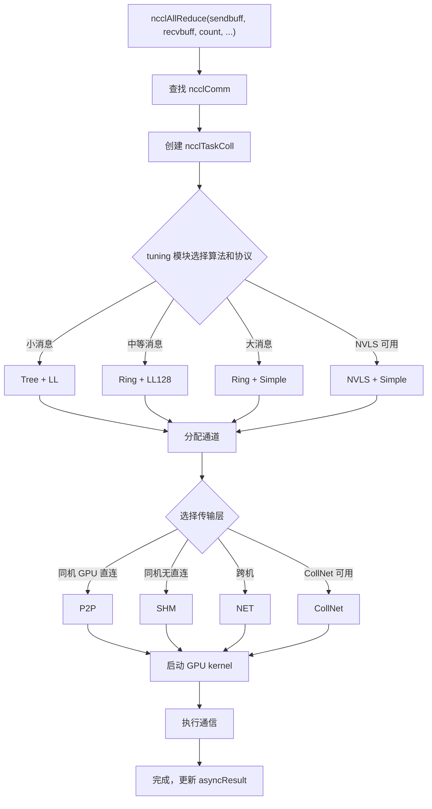

# 第 2 章：核心抽象模型：通訊算子、拓撲、演算法、協定與傳輸層

上一章我們讓 NCCL 跑了起來，觀察了 ncclCommInitRank、ncclAllReduce、ncclCommDestroy 三個 API 的外部行為。但外部行為只是冰山一角——當 ncclAllReduce 返回時，GPU 上到底發生了什麼？資料走了哪條路？為什麼同樣的 AllReduce 在不同機器上效能差異巨大？要回答這些問題，必須先建立 NCCL 的公共詞彙表。本章將逐一拆解五個核心抽象：通訊域（ncclComm）、通道（channel）、演算法（algorithm）、協定（protocol）、傳輸層（transport）。這五個概念貫穿全書，後續每一章的分析都會用到它們。理解它們之間的關係，就理解了 NCCL 的骨架。

# 2.1 通訊域 ncclComm：一個行程的通訊上下文

## 直覺模型

把`ncclComm`想像成一個「群聊」：每個行程加入群聊後拿到一個群 ID，之後所有訊息都在這個群裡發。群裡有幾個人（`nRanks`）、我是誰（`rank`）、走什麼線路（`channels`）、用什麼規則（`config`），全都記在這個群聊物件裡。

如果沒有`ncclComm`，NCCL 就不知道「誰和誰通訊」「資料發到哪裡去」——每次呼叫 API 都得重新協商 rank 列表、重建連線，開銷無法承受。

## 資料結構與記憶體佈局

`ncclComm`是整個 NCCL 最核心的結構體，定義在`src/include/comm.h`中。它極其龐大（近 300 行），我們按功能分組來看關鍵欄位。

**身分標識與生命週期哨兵**

[FACT:src/include/comm.h:576-580]定義了`startMagic`，[FACT:src/include/comm.h:879-881]定義了`endMagic`。這兩個欄位不是安全金鑰，而是記憶體越界檢測哨兵。在[FACT:src/include/comm.h:883-885]處有兩個`static_assert`：

```c
static_assert(offsetof(struct ncclComm, startMagic) == 0, "startMagic must be the first field of ncclComm");
static_assert(offsetof(struct ncclComm, endMagic) == sizeof(struct ncclComm) - sizeof(uint64_t),
              "endMagic must be the last field of ncclComm");
```

> **[Design Inference & Architectural Trade-offs]**
> 這兩個斷言在編譯期強制`startMagic`位於結構體首位址、`endMagic`位於末尾。執行時可以透過檢查這兩個魔數是否被篡改，快速判斷`ncclComm`指標是否有效——這在多執行緒環境下排查「野指標存取已銷毀通訊域」類 bug 時非常有用。

**Rank 與拓撲資訊**

[FACT:src/include/comm.h:628-629]定義了`rank`和`nRanks`——我在通訊域中的編號和總參與者數。[FACT:src/include/comm.h:644-652]定義了節點相關欄位：`node`（我所在節點編號）、`nNodes`（總節點數）、`localRank`（節點內編號）、`localRanks`（節點內 GPU 數），以及三張映射表`rankToNode`、`rankToLocalRank`、`localRankToRank`。

> **[Design Inference & Architectural Trade-offs]**
> 這三張映射表是拓撲感知演算法的基礎。比如 Ring 演算法需要知道「我的下一個 rank 是否在同一節點內」來決定走 NVLink 還是網路。如果沒有這些映射表，每次演算法選擇都要重新查詢拓撲圖，開銷巨大。

**通道與緩衝區**

[FACT:src/include/comm.h:593-593]定義了`channels[MAXCHANNELS]`——這是通信域內所有通道的陣列。[FACT:src/include/comm.h:674-676]定義了通道數量：`nChannels`（連接通道數）、`collChannels`（集合通信入隊通道數）、`nvlsChannels`（NVLS 通道數）。

[FACT:src/include/comm.h:691-693]定義了緩衝區大小：`buffSizes[NCCL_NUM_PROTOCOLS]`（每種協議的緩衝區大小）、`p2pChunkSize`（P2P 塊大小）、`nvlsChunkSize`（NVLS 塊大小）。

> **[Design Inference & Architectural Trade-offs]**
> `buffSizes`陣列的索引就是協議枚舉值（LL/LL128/Simple），這意味著每種協議有獨立的緩衝區大小配置。LL 協議需要小緩衝區以降低延遲，Simple 協議需要大緩衝區以提高頻寬——這個陣列讓兩種需求共存。

**工作佇列與 FIFO**

[FACT:src/include/comm.h:719-728]定義了工作 FIFO 相關欄位：`workFifoBytes`（FIFO 大小，2 的冪）、`workFifoBuf`（主機側 FIFO 緩衝區）、`workFifoBufDev`（裝置側 FIFO 緩衝區）、`workFifoProduced`（已生產位元組數）、`workFifoConsumed`（已消費位元組數）。

> **[Design Inference & Architectural Trade-offs]**
> 這是一個典型的生產者-消費者環形緩衝區。主機側（生產者）把工作描述寫入 FIFO，GPU kernel（消費者）讀取並執行。`workFifoBytes`必須是 2 的冪，這樣可以用位元遮罩代替取模運算，加速索引計算。

**行程內同步屏障**

[FACT:src/include/comm.h:731-731]定義了行程內多通信域同步機制：

```c
struct ncclComm* intraComm0; // leader of intra-process comms (self possible)
struct ncclComm* intraNext; // next of intra-process comms, intraComm0 is head
int intraRank;
int intraRanks;
uint32_t intraBarrierPhase;
char intraPad1[64 - sizeof(uint64_t)];
uint64_t intraBarrierCounter; // only used if this is intraComm0
char intraPad2[64 - sizeof(uint64_t)];
uint64_t intraBarrierGate; // only used if this is intraComm0
```

注意`intraPad1`和`intraPad2`的大小是`64 - sizeof(uint64_t)`，即 56 位元組。加上前面的`uint64_t`欄位，每個欄位組恰好佔 64 位元組——這是一個快取行（Cache Line）。

> **[Design Inference & Architectural Trade-offs]**
> 這是典型的**快取行填充（Cache Line Padding）**技術。`intraBarrierCounter`和`intraBarrierGate`會被多個執行緒高頻讀寫，如果它們共享同一個快取行，會導致**偽共享（False Sharing）**：一個執行緒修改`intraBarrierCounter`會使另一個執行緒的`intraBarrierGate`快取失效，造成效能急劇下降。用 56 位元組填充把它們隔開到不同快取行，是高效能並發程式設計的標準手法。

**非同步錯誤狀態**

[FACT:src/include/comm.h:705-705]定義了`asyncResult`——這個欄位記錄通信域的非同步操作狀態。上一章我們提到`ncclCommFinalize`返回時通信域可能還處於`ncclInProgress`狀態，就是透過這個欄位追蹤的。

## 場景驅動 Walkthrough：從 ncclCommInitRank 到結構體填充

當使用者呼叫`ncclCommInitRank(&comm, nranks, commId, rank)`時，NCCL 內部會分配一個`ncclComm`結構體並逐欄位填充。我們跟隨這個流程看關鍵欄位如何被設定：

**第一步：分配與清零**

NCCL 使用`ncclCalloc`分配`ncclComm`，確保所有欄位初始為 0。此時`startMagic`和`endMagic`被設定為`NCCL_MAGIC`（[FACT:src/include/comm.h:563-569]定義為`0x0280028002800280`，註解說 "Nickel atomic number is 28"）。

**第二步：填充身份資訊**

`rank`、`nRanks`、`cudaDev`從參數和 CUDA API 取得。`commHash`由`ncclCommId`雜湊得到，用於後續網路通信中的一致性校驗。

**第三步：建構拓撲圖**

NCCL 呼叫拓撲探測模組枚舉所有 GPU、網卡、PCI 交換器，建構`topo`欄位（[FACT:src/include/comm.h:595-595]）。這個拓撲圖決定了後續演算法選擇和路徑規劃。

**第四步：初始化通道**

`channels[MAXCHANNELS]`陣列被逐個初始化。每個通道的`id`被設定為陣列索引，`peers`和`devPeers`指標被分配。

**第五步：建立傳輸連接**

根據拓撲圖，NCCL 為每對 rank 選擇傳輸層（P2P/SHM/NET），呼叫對應的`setup`和`connect`回呼。連接資訊存儲在`channels[i].peers[j]`中。

**第六步：設定魔數**

最後，`endMagic`被設定為`NCCL_MAGIC`，標記結構體初始化完成。

## 設計思考與生產踩坑

**為什麼`ncclComm`這麼大？**

> **[Design Inference & Architectural Trade-offs]**
> `ncclComm`包含近 300 個欄位，因為它承載了一個通信域的全部狀態。NCCL 的設計哲學是「一次初始化，多次複用」——初始化時把所有可能用到的資訊都算好存下來，執行時直接查表，避免重複計算。代價是記憶體佔用較大（每個通信域約幾 KB），但相比 GPU 顯存和網路頻寬，這點記憶體微不足道。

**踩坑場景一：多執行緒共享通信域**

> **[Design Inference & Architectural Trade-offs]**
> `ncclComm`不是執行緒安全的。如果兩個執行緒同時對同一個`ncclComm`呼叫`ncclAllReduce`，`workFifoProduced`等欄位會競爭，導致資料損壞。 正確做法是每個執行緒使用獨立的通信域，或者用外部鎖串行化呼叫。

**踩坑場景二：銷毀後存取**

`ncclCommDestroy`釋放結構體記憶體後，如果還有執行緒持有指標並存取，會讀到已釋放記憶體。`startMagic`和`endMagic`可以幫助檢測這種情況——如果魔數不匹配，說明指標已失效。

**踩坑場景三：快取行偽共享**

在多行程場景下（每個行程一個 rank），`intraBarrierCounter`和`intraBarrierGate`的填充尤為重要。如果省略填充，多個行程的屏障操作會互相干擾，導致同步延遲從奈秒級上升到微秒級。

# 2.2 通道 channel：把一次通信切成多條流水線

## 直覺模型

搬家時不止開一條傳送帶，而是同時開好幾條，每條負責一部分箱子，整體搬得更快。`channel`就是 NCCL 的「傳送帶」——把一次集合通訊的資料切分成多份，每條通道獨立搬運一份，並行推進以提高頻寬利用率。

如果沒有 channel，所有資料只能走一條路徑，GPU 之間的多條物理鏈路（多張網卡、多組 NVLink）無法同時利用，頻寬利用率會大幅下降。

## 資料結構與記憶體佈局

`ncclChannel`定義在[FACT:src/include/comm.h:169-191]：

```c
struct ncclChannel {
  struct ncclChannelPeer** peers;
  struct ncclDevChannelPeer** devPeers;
  /* devPeer pointer array used for host side access */
  struct ncclDevChannelPeer** devPeersHostPtr;
  struct ncclRing ring;
  int* devRingUserRanks;
  struct ncclTree tree;

  struct ncclTree collnetChain;
  struct ncclDirect collnetDirect;

  struct ncclNvls nvls;

  int id; // index of this channel
  uint32_t workFifoProduced; // +1 successor of last used work fifo byte

  /* comm split sharable resources */
  struct ncclChannelPeer* collnetPeers;
  struct ncclDevChannelPeer* collnetDevPeers;
  struct ncclChannelPeer* nvlsPeers;
  struct ncclDevChannelPeer* nvlsDevPeers;
};
```

**關鍵欄位解析**

- `peers` / `devPeers`：指向該通道內所有 rank 的連接資訊。`peers`是主機側視圖，`devPeers`是裝置側視圖（GPU kernel 直接存取）。
- `ring`：Ring 演算法的拓撲描述——每個 rank 的前驅和後繼。
- `tree`：Tree 演算法的拓撲描述——父節點和子節點列表。
- `collnetChain` / `collnetDirect`：CollNet 演算法的兩種變體拓撲。
- `nvls`：NVLink SHARP 的拓撲描述。
- `id`：通道索引，從 0 到`nChannels-1`。
- `workFifoProduced`：該通道的工作 FIFO 生產指標。

> **[Design Inference & Architectural Trade-offs]**
> 注意`ring`、`tree`、`collnetChain`、`collnetDirect`、`nvls`這五個欄位是**並列**的——同一個通道可以同時持有多種演算法的拓撲描述。執行時根據演算法選擇決定使用哪個欄位。這種設計讓演算法切換不需要重建通道，只需切換讀取的欄位。

**通道數量計算**

通道數量在`ncclComm`中定義（[FACT:src/include/comm.h:674-676]）：

```c
int nChannels; // connection nChannels
int collChannels; // enqueue nChannels
int nvlsChannels; // enqueue nChannels
```

> **[Design Inference & Architectural Trade-offs]**
> `nChannels`是實際建立的連接數，`collChannels`是集合通訊入隊時使用的通道數，`nvlsChannels`是 NVLS 專用通道數。三者可能不同——比如某些通道只用於 P2P 不用於集合通訊。

**P2P 通道排程**

[FACT:src/include/channel.h:21-33]定義了`ncclP2pChannelBaseForRound`函式，用於計算 P2P 通訊中每個 round 使用的通道基址：

```c
inline uint8_t ncclP2pChannelBaseForRound(struct ncclComm* comm, int p2pRound) {
  int base;
  if (comm->nNodes > 1) {
    int localSize = comm->p2pSchedGroupSize;
    int groupDelta = p2pRound / localSize;
    int localDelta = p2pRound % localSize;
    base = groupDelta * divUp(localSize, NCCL_MAX_DEV_WORK_P2P_PER_BATCH);
    base += localDelta / NCCL_MAX_DEV_WORK_P2P_PER_BATCH;
  } else {
    base = p2pRound;
  }
  return reverseBits(base, log2Up(comm->p2pnChannels));
}
```

> **[Design Inference & Architectural Trade-offs]**
> 這個函式的邏輯是：多節點場景下，P2P 通訊按「組」排程，每組內的 rank 使用相鄰通道；單節點場景下，每個 round 直接映射到一個通道。`reverseBits`是位反轉操作，用於打散通道分配，避免熱點集中。

## 場景驅動 Walkthrough：一次 AllReduce 如何分配通道

假設 8 個 rank、4 個通道，執行一次 AllReduce。資料被切成 4 份，每份由一個通道負責。

**第一步：演算法選擇**

NCCL 的 tuning 模組根據訊息大小和拓撲選擇演算法（比如 Ring）和協定（比如 Simple）。

**第二步：通道分配**

`ncclTaskColl`結構體（[FACT:src/include/comm.h:212-273]）被建立，其中`nChannels`欄位被設定為 4（[FACT:src/include/comm.h:254-254]）。`channelLo`和`channelHi`欄位（[FACT:src/include/comm.h:256-257]）標記該任務使用的通道範圍。

**第三步：資料切分**

每個通道負責`count / nChannels`個元素。通道 0 處理第 0 到 count/4-1 個元素，通道 1 處理第 count/4 到 count/2-1 個元素，以此類推。

**第四步：並行執行**

4 個通道的 GPU kernel 同時啟動，各自在自己的資料切片上執行 Ring AllReduce。由於通道之間沒有資料依賴，可以完全並行。

**第五步：結果合併**

所有通道完成後，每個 rank 的 recv buffer 中就是完整的 AllReduce 結果。

## 並發控制與硬體互動

**通道與 GPU 資源的映射**

> **[Design Inference & Architectural Trade-offs]**
> 每個通道通常綁定到一個獨立的 CUDA stream 或 GPU 硬體佇列。這樣不同通道的 kernel 可以在 GPU 上並發執行，充分利用 SM（串流多處理器）資源。

**通道與網路裝置的映射**

在多網卡場景下，不同通道可以綁定到不同網卡。比如 4 個通道、2 張網卡，通道 0 和 1 走網卡 A，通道 2 和 3 走網卡 B。這樣兩張網卡的頻寬都能被利用。

**通道數量的選擇**

> **[Design Inference & Architectural Trade-offs]**
> 通道數量不是越多越好。通道數增加會帶來：

- 更多 kernel 啟動開銷
- 更多連接建立開銷
- 更複雜的同步

NCCL 的 tuning 模組會根據訊息大小自動選擇最優通道數。小訊息用少量通道（減少開銷），大訊息用多通道（提高頻寬）。

## 生產避坑指南

**踩坑場景一：通道數配置不當**

> **[Design Inference & Architectural Trade-offs]**
> 如果手動設定`NCCL_NCHANNELS`過大，小訊息場景下 kernel 啟動開銷會超過收益，效能反而下降。 建議讓 NCCL 自動選擇，除非有明確的調優需求。

**踩坑場景二：通道與拓撲不匹配**

> **[Design Inference & Architectural Trade-offs]**
> 如果通道數超過物理鏈路數，部分通道會共享鏈路，無法實現真正的並行。 比如 2 張網卡配 8 個通道，實際只有 2 個通道能同時傳輸，其餘 6 個在排隊。

**踩坑場景三：P2P 通道衝突**

`ncclP2pChannelBaseForRound`的`reverseBits`操作如果實作有誤，會導致多個 round 映射到同一通道，造成串行化。[FACT:src/include/channel.h:32-32]的`reverseBits(base, log2Up(comm->p2pnChannels))`確保通道分配均勻。

# 2.3 演算法 algorithm：Tree/Ring/CollNet/NVLS/PAT 的拓撲組織

## 直覺模型

從北京到上海可以坐高鐵、飛機或自駕，每種方式適合不同的距離和人數。NCCL 的演算法就是這些「出行方式」——Ring 適合大消息的穩定頻寬，Tree 適合小消息的低延遲，CollNet 利用網卡卸載，NVLS 利用 NVLink SHARP 硬體加速，PAT 是 NVLS 的平行化變體。

如果沒有演算法選擇，NCCL 只能用一種固定模式通訊，無法適應不同消息大小和拓撲結構，效能會大打折扣。

## 資料結構與記憶體佈局

**Ring 演算法**

Ring 演算法的核心是`ncclRing`結構體（在`src/include/comm.h`中透過`channels[i].ring`引用）。[FACT:src/include/collectives.h:81-116]定義了`RingAlgorithm`基類：

```c
class RingAlgorithm {
protected:
  int refCount;
  int nRanks;
  int nStepsPerLoop;
  int chunkSteps;
  int sliceSteps;
  ssize_t sliceSize;
  ssize_t loopSize;
  ssize_t channelSize;
  uint8_t* sendbuff;
  uint8_t* recvbuff;
  void* sendMhandle;
  void* recvMhandle;
  void* srecvMhandle;

public:
  virtual void getNextSendAddr(int curStep, uint8_t** sendbuffOut, size_t* sizeOut, void** mhandleOut) = 0;
  virtual void getNextRecvAddr(int curStep, uint8_t** recvbuffOut, size_t* sizeOut, void** mhandleOut) = 0;
  int incRefCount() {
    return (int)COMPILER_ATOMIC_ADD_FETCH(&refCount, 1, std::memory_order_relaxed);
  }
  int decRefCount() {
    return (int)COMPILER_ATOMIC_SUB_FETCH(&refCount, 1, std::memory_order_release);
  }
  RingAlgorithm() {
    refCount = 0;
  }
  virtual ~RingAlgorithm() {};
};
```

**關鍵欄位解析**

- `refCount`：引用計數，用於 proxy 執行緒和 GPU kernel 共享演算法物件。
- `nRanks`：環上節點數。
- `nStepsPerLoop`：每輪迴圈的步數。AllReduce 是`2*(nRanks-1)*chunkSteps`（[FACT:src/include/collectives.h:218-218]）。
- `chunkSteps` / `sliceSteps`：塊步數和切片步數，控制流水線粒度。
- `sliceSize` / `loopSize` / `channelSize`：切片大小、迴圈大小、通道大小。
- `sendbuff` / `recvbuff`：發送和接收緩衝區指標。
- `sendMhandle` / `recvMhandle` / `srecvMhandle`：記憶體句柄，用於網路註冊。

**引用計數的原子操作**

[FACT:src/include/collectives.h:106-108]展示了`incRefCount`和`decRefCount`：

```c
int incRefCount() {
  return (int)COMPILER_ATOMIC_ADD_FETCH(&refCount, 1, std::memory_order_relaxed);
}
int decRefCount() {
  return (int)COMPILER_ATOMIC_SUB_FETCH(&refCount, 1, std::memory_order_release);
}
```

> **[Design Inference & Architectural Trade-offs]**
> `incRefCount`使用`memory_order_relaxed`——增加引用計數不需要同步，只要保證原子性即可。`decRefCount`使用`memory_order_release`——減少引用計數時，需要確保之前的寫操作對其他執行緒可見（因為可能觸發物件銷毀）。

**RingARAlgorithm：AllReduce 的 Ring 實作**

[FACT:src/include/collectives.h:118-234]定義了`RingARAlgorithm`，繼承自`RingAlgorithm`。核心方法是`getNextSendAddr`和`getNextRecvAddr`。

[FACT:src/include/collectives.h:126-167]的`getNextSendAddr`邏輯：

```c
void getNextSendAddr(int curStep, uint8_t** sendbuffOut, size_t* sizeOut, void** mhandleOut) {
  int curLoop = curStep / nStepsPerLoop;
  int curLoopStage = (curStep % nStepsPerLoop) / chunkSteps;
  int chunkStage = curLoopStage % nRanks;
  int sliceStage = (curStep % chunkSteps) / sliceSteps;
  ssize_t elemOffset = curLoop * loopSize;
  ssize_t remSize = channelSize - elemOffset;
  // ... 计算 chunkOffset, sliceOffset, curSliceSize ...
  if (remSize  **[Design Inference & Architectural Trade-offs]**
> 這段程式碼的核心是**位址計算**：給定當前步數`curStep`，計算出應該發送哪個資料塊的哪個切片。`chunkId`的計算`(ringIndex + nRanks - 1 - chunkStage) % nRanks`實作了環上的反向傳播——每個 rank 從前驅接收資料，處理後發送給後繼。

**PAT 演算法**

PAT（Parallel Aggregated Tree）是 NVLS 的平行化變體。[FACT:src/include/collectives.h:416-423]定義了`ncclPatStep`：

```c
struct ncclPatStep {
  int recvDim, sendDim, recvOffset, sendOffset, stepOffset, postRecv, postSend, nelem, last, flags;
  // PAT algo computation thread step number; -1 while the slot is free.
  int step;
  // This PAT group's offset within the shared NVLS slot.
  int nvlsOffset;
  size_t inpIx, outIx;
};
```

[FACT:src/include/collectives.h:425-435]定義了`ncclPatPeer`：

```c
struct ncclPatPeer {
  uint64_t step;
  struct ncclConnInfo* conn;
  struct ncclConnFifo* connFifo;
  void* buff;
  uint64_t* headPtr;
  uint64_t* tailPtr;
  uint64_t stepCache;
  long long int accSize;
  int connStepSize;
};
```

> **[Design Inference & Architectural Trade-offs]**
> PAT 演算法的核心思想是**聚合多個小步驟為一個大步驟**，減少同步開銷。`ncclPatStep`描述一個聚合步驟的收發維度、偏移量、元素數等資訊。`ncclPatPeer`描述一個對等節點的連接狀態和緩衝區指標。

## 場景驅動 Walkthrough：Ring AllReduce 的步驟演化

假設 4 個 rank（0, 1, 2, 3），每個 rank 有 4 個元素，執行 Ring AllReduce。

**Reduce-Scatter 階段**

- 步驟 0：rank 0 發送元素 0 給 rank 1，rank 1 發送元素 1 給 rank 2，rank 2 發送元素 2 給 rank 3，rank 3 發送元素 3 給 rank 0。
- 步驟 1：每個 rank 將收到的元素與本地對應元素相加，然後發送給下一個 rank。
- 步驟 2：繼續累加和傳遞。
- 步驟 3：此時每個 rank 擁有一個完整的歸約結果（rank 0 有元素 3 的結果，rank 1 有元素 0 的結果，等等）。

**AllGather 階段**

- 步驟 4-6：每個 rank 將自己擁有的歸約結果沿環傳播，最終所有 rank 擁有完整結果。

[FACT:src/include/collectives.h:218-218]的`nStepsPerLoop = 2 * (nRanks - 1) * chunkSteps`正好對應這個流程：Reduce-Scatter 需要`(nRanks-1)*chunkSteps`步，AllGather 也需要`(nRanks-1)*chunkSteps`步，總共`2*(nRanks-1)*chunkSteps`步。

## 設計思考與生產踩坑

**為什麼 Ring 和 Tree 並存？**

> **[Design Inference & Architectural Trade-offs]**
> Ring 演算法的頻寬利用率高（每條鏈路都在傳輸），但延遲隨 rank 數線性增長。Tree 演算法的延遲是對數級的，但頻寬利用率低（只有部分鏈路在工作）。NCCL 根據消息大小自動選擇：小消息用 Tree（延遲敏感），大消息用 Ring（頻寬敏感）。

**踩坑場景一：演算法選擇錯誤**

> **[Design Inference & Architectural Trade-offs]**
> 如果手動強制使用 Ring 處理小消息，延遲會顯著增加。 建議讓 tuning 模組自動選擇，除非有明確的效能分析資料支持手動干預。

**踩坑場景二：NVLS 硬體不支援**

NVLS 需要特定的硬體支援（NVLink SHARP）。如果硬體不支援但程式碼強制使用 NVLS，會回退到 Ring 或 Tree，但可能伴隨效能抖動。[FACT:src/include/comm.h:755-755]的`nvlsSupport`欄位標記硬體是否支援 NVLS。

**踩坑場景三：PAT 演算法的聚合因子配置**

PAT 演算法的`aggFactor`決定了聚合多少個步驟。[FACT:src/include/collectives.h:537-560]展示了`aggFactor`的計算邏輯：

```c
aggFactor = 1;
size_t channelSize = end - offset;
while (stepSize / (channelSize * sizeof(T) * aggFactor) >= 2 && aggFactor  1 && aggFactor  **[Design Inference & Architectural Trade-offs]**
> `aggFactor`過小會導致同步開銷大，過大則會導致流水線氣泡。NCCL 根據`stepSize`、`channelSize`、`nranks`自動計算最佳值。

# 2.4 協定 protocol：LL/LL128/Simple 三種資料搬運策略

## 直覺模型

寄快遞可以選「同城閃送」「次日達」或「普通快遞」，速度和成本不同。NCCL 的協議就是這些「寄法」——LL（Low Latency）適合小訊息的低延遲傳輸，LL128 適合中等訊息的 128 位元組對齊傳輸，Simple 適合大訊息的高頻寬傳輸。

如果沒有協議選擇，NCCL 只能用一種固定策略搬運資料，無法在延遲和頻寬之間取得平衡。

## 資料結構與記憶體佈局

**協議列舉**

[FACT:src/include/comm.h:55-57]定義了協議相關的執行緒閾值：

```c
#define NCCL_LL_THREAD_THRESHOLD 8
#define NCCL_LL128_THREAD_THRESHOLD 8
#define NCCL_SIMPLE_THREAD_THRESHOLD 64
```

> **[Design Inference & Architectural Trade-offs]**
> 這些閾值決定了每種協議使用多少個執行緒。LL 和 LL128 用 8 個執行緒（低延遲，少量執行緒即可），Simple 用 64 個執行緒（高頻寬，需要更多執行緒並行搬運）。

**協議緩衝區**

[FACT:src/include/comm.h:691-691]定義了`buffSizes[NCCL_NUM_PROTOCOLS]`——每種協議有獨立的緩衝區大小。

**協議相關的 FIFO 結構**

[FACT:src/include/comm.h:59-83]定義了`ncclSendMem`和`ncclRecvMem`：

```c
struct ncclSendMem {
  union {
    struct {
      uint64_t head;
      char pad1[CACHE_LINE_SIZE - sizeof(uint64_t)];
      void* ptrExchange;
      uint64_t redOpArgExchange[2];
      char pad2[CACHE_LINE_SIZE - sizeof(void*) - 2 * sizeof(uint64_t)];
      int offsFifo[NCCL_STEPS];
    };
    char pad3[MEM_ALIGN];
  };
};

struct ncclRecvMem {
  union {
    struct {
      uint64_t tail;
      char pad1[CACHE_LINE_SIZE - sizeof(uint64_t)];
      struct ncclConnFifo connFifo[NCCL_STEPS];
      int flush; // For GDRCopy-based flush
    };
    char pad4[MEM_ALIGN];
  };
};
```

> **[Design Inference & Architectural Trade-offs]**
> `ncclSendMem`和`ncclRecvMem`是發送和接收的共享記憶體結構。`head`和`tail`是環形緩衝區的讀寫指標，`pad1`確保它們在不同快取行。`connFifo`陣列儲存每個步驟的連接資訊（模式、偏移、大小、指標），定義在[FACT:src/include/collectives.h:72-77]：

```c
struct ncclConnFifo {
  int mode;
  ssize_t offset;
  ssize_t size;
  void* ptr;
};
```

**協議選擇邏輯**

> **[Design Inference & Architectural Trade-offs]**
> 協議選擇由 tuning 模組完成，考慮因素包括：

- 訊息大小：小訊息用 LL，中等用 LL128，大訊息用 Simple。
- 拓撲結構：NVLink 連接適合 LL128，網路連接適合 Simple。
- 硬體能力：某些 GPU 架構對特定協議有優化。

## 場景驅動 Walkthrough：LL 協議的資料搬運

假設使用 LL 協議傳輸 1KB 資料。

**第一步：資料寫入發送緩衝區**

主機側將資料寫入`sendbuff`，然後更新`ncclSendMem.head`指標，通知 GPU kernel 有新資料。

**第二步：GPU kernel 讀取資料**

GPU kernel 輪詢`head`指標，發現新資料後，從`sendbuff`讀取資料。

**第三步：資料傳輸**

GPU kernel 透過 NVLink 或網路將資料發送到目標 rank。

**第四步：目標 rank 接收資料**

目標 rank 的 GPU kernel 將資料寫入`recvbuff`，然後更新`ncclRecvMem.tail`指標。

**第五步：主機側讀取資料**

主機側輪詢`tail`指標，發現新資料後，從`recvbuff`讀取資料。

## 並發控制與硬體互動

**LL 協議的低延遲機制**

> **[Design Inference & Architectural Trade-offs]**
> LL 協議使用**輪詢（Polling）**而非中斷來檢測資料到達。GPU kernel 不斷讀取`head`指標，一旦發現變化立即處理。這比中斷方式延遲更低，但會佔用 GPU 計算資源。

**LL128 協議的 128 位元組對齊**

> **[Design Inference & Architectural Trade-offs]**
> LL128 協議要求資料按 128 位元組對齊，這樣每次傳輸正好填滿一個快取行。對齊的好處是：

- 減少部分快取行寫入（Partial Cache Line Write）
- 提高記憶體頻寬利用率
- 簡化硬體處理邏輯

**Simple 協議的批量傳輸**

> **[Design Inference & Architectural Trade-offs]**
> Simple 協議使用**批量傳輸**模式：積累一定量的資料後一次性發送，減少同步次數。這適合大訊息場景，因為同步開銷被分攤到大量資料上。

## 生產避坑指南

**踩坑場景一：協議與訊息大小不匹配**

> **[Design Inference & Architectural Trade-offs]**
> 如果強制使用 LL 協議傳輸大訊息，效能會急劇下降。 因為 LL 協議的設計目標是低延遲，不是高頻寬。大訊息應該用 Simple 協議。

**踩坑場景二：LL128 對齊問題**

> **[Design Inference & Architectural Trade-offs]**
> 如果資料沒有按 128 位元組對齊，LL128 協議會回退到 LL 或 Simple，導致效能不穩定。 建議確保發送緩衝區和接收緩衝區都按 128 位元組對齊。

**踩坑場景三：協議切換開銷**

> **[Design Inference & Architectural Trade-offs]**
> 在執行時動態切換協議會帶來額外開銷。 NCCL 在初始化時確定協議，執行時不再切換。如果需要切換，必須重新初始化通訊域。

# 2.5 傳輸層 transport：P2P/SHM/NET/CollNet 底層搬運通道

## 直覺模型

從 A 點到 B 點可以走路、騎車、坐地鐵或打車，NCCL 的傳輸層就是這些不同的「出行方式」。上層不關心具體怎麼走，只關心能不能送到。P2P 是「走路」（同機 GPU 直連），SHM 是「騎車」（共享記憶體），NET 是「坐地鐵」（網路），CollNet 是「打車」（網卡卸載）。

如果沒有傳輸層抽象，上層演算法需要針對每種物理鏈路寫不同的程式碼，無法復用。

## 資料結構與記憶體佈局

**傳輸層列舉**

[FACT:src/include/transport.h:18-23]定義了傳輸層類型：

```c
#define NTRANSPORTS 4
#define TRANSPORT_UNDEFINED -1
#define TRANSPORT_P2P 0
#define TRANSPORT_SHM 1
#define TRANSPORT_NET 2
#define TRANSPORT_COLLNET 3
```

**傳輸層介面**

[FACT:src/include/transport.h:129-146]定義了`ncclTransportComm`——傳輸層的通訊介面：

```c
struct ncclTransportComm {
  ncclResult_t (*setup)(struct ncclComm* comm, struct ncclTopoGraph* graph, struct ncclPeerInfo*, struct ncclPeerInfo*,
                        struct ncclConnect*, struct ncclConnector*, int channelId, int connIndex);
  ncclResult_t (*connect)(struct ncclComm* comm, struct ncclConnect*, int nranks, int rank, struct ncclConnector*);
  ncclResult_t (*free)(struct ncclComm* comm, struct ncclConnector*);
  ncclResult_t (*proxySharedInit)(struct ncclProxyConnection* connection, struct ncclProxyState* proxyState,
                                  int nChannels);
  ncclResult_t (*proxySetup)(struct ncclProxyConnection* connection, struct ncclProxyState* proxyState, void* reqBuff,
                             int reqSize, void* respBuff, int respSize, int* done);
  ncclResult_t (*proxyConnect)(struct ncclProxyConnection* connection, struct ncclProxyState* proxyState, void* reqBuff,
                               int reqSize, void* respBuff, int respSize, int* done);
  ncclResult_t (*proxyFree)(struct ncclProxyConnection* connection, struct ncclProxyState* proxyState);
  ncclResult_t (*proxyProgress)(struct ncclProxyState* proxyState, struct ncclProxyArgs*);
  ncclResult_t (*proxyRegister)(struct ncclProxyConnection* connection, struct ncclProxyState* proxyState,
                                void* reqBuff, int reqSize, void* respBuff, int respSize, int* done);
  ncclResult_t (*proxyDeregister)(struct ncclProxyConnection* connection, struct ncclProxyState* proxyState,
                                  void* reqBuff, int reqSize, int* done);
};
```

**關鍵回呼解析**

- `setup`：建立連接前的準備工作，交換連接參數。
- `connect`：實際建立連接。
- `free`：釋放連接資源。
- `proxySharedInit`：初始化 proxy 執行緒共享資源。
- `proxySetup` / `proxyConnect`：proxy 執行緒側的連線建立。
- `proxyProgress`：proxy 執行緒推進資料傳輸。
- `proxyRegister` / `proxyDeregister`：記憶體註冊和註銷。

**傳輸層結構體**

[FACT:src/include/transport.h:148-154]定義了`ncclTransport`：

```c
struct ncclTransport {
  const char name[8];
  ncclResult_t (*canConnect)(int*, struct ncclComm* comm, struct ncclTopoGraph* graph, struct ncclPeerInfo*,
                             struct ncclPeerInfo*);
  struct ncclTransportComm send;
  struct ncclTransportComm recv;
};
```

> **[Design Inference & Architectural Trade-offs]**
> `name`是傳輸層名稱（如 "P2P"、"SHM"、"NET"），`canConnect`判斷兩個 rank 之間是否可以使用該傳輸層，`send`和`recv`分別是發送和接收方向的通訊介面。

**傳輸層實例**

[FACT:src/include/transport.h:36-36]宣告了四個傳輸層實例：

```c
extern struct ncclTransport p2pTransport;
extern struct ncclTransport shmTransport;
extern struct ncclTransport netTransport;
extern struct ncclTransport collNetTransport;
```

[FACT:src/include/transport.h:36-36]定義了傳輸層陣列：

```c
extern struct ncclTransport* ncclTransports[];
```

**對等節點資訊**

[FACT:src/include/transport.h:46-74]定義了`ncclPeerInfo`——rank 之間交換的元資料：

```c
struct ncclPeerInfo {
  int rank;
  int cudaDev;
  int nvmlDev;
  int gdrSupport;
  uint64_t hostHash;
  uint64_t pidHash;
  dev_t shmDev;
  int64_t busId;
  cudaUUID_t gpuUuid;
  struct ncclComm* comm;
  int cudaCompCap;
  int gpuCftSupport;
  size_t totalGlobalMem;
  // MNNVL support
  nvmlGpuFabricInfoV_t fabricInfo;
  int fabricHandleSupport;
  int cuMemSupport;
  int version;
  uint64_t supportedGinTypeBitMask;
  bool crossNicSupport;
  bool rmaPluginAvailable;
  bool cuMemGdrSupport;
  int mloPart; // MLOPart partition index, or -1 if not an MLOPart GPU
  int cudaDriverVersion;
  bool gpuCftMulticastSupport;
  bool gpuCftCountedSupport;
  uint32_t gitVersionHash;
};
```

> **[Design Inference & Architectural Trade-offs]**
> 這些欄位用於判斷兩個 rank 之間可以使用哪種傳輸層：

- `hostHash`相同 → 同一主機 → 可用 P2P 或 SHM
- `hostHash`不同 → 不同主機 → 必須用 NET
- `gdrSupport`→ 是否支援 GPUDirect RDMA
- `cudaCompCap`→ GPU 運算能力，影響協定選擇

## 場景驅動 Walkthrough：建立 P2P 連線

假設兩個 rank 在同一主機內，NCCL 選擇 P2P 傳輸層。

**第一步：交換 PeerInfo**

兩個 rank 透過 bootstrap 通道交換`ncclPeerInfo`，確認彼此在同一主機、GPU 支援 P2P。

**第二步：呼叫 canConnect**

[FACT:src/include/transport.h:148-154]的`canConnect`回呼被呼叫，檢查拓撲圖確認兩個 GPU 之間有 NVLink 或 PCIe 連線。

**第三步：呼叫 setup**

`p2pTransport.send.setup`和`p2pTransport.recv.setup`被呼叫，準備連線參數（如 IPC 句柄）。

**第四步：呼叫 connect**

`p2pTransport.send.connect`和`p2pTransport.recv.connect`被呼叫，實際建立連線。

**第五步：註冊記憶體**

如果需要 RDMA，呼叫`proxyRegister`註冊發送和接收緩衝區。

## 並發控制與硬體互動

**P2P 傳輸層**

> **[Design Inference & Architectural Trade-offs]**
> P2P 使用 CUDA IPC（Inter-Process Communication）機制，允許一個 GPU 直接存取另一個 GPU 的顯存。這需要：

- 兩個 GPU 在同一 PCIe 域或 NVLink 域
- 作業系統支援 CUDA IPC
- 足夠的權限

**SHM 傳輸層**

> **[Design Inference & Architectural Trade-offs]**
> SHM 使用主機共享記憶體作為中轉。當兩個 GPU 之間沒有直接連線時，資料先拷貝到主機記憶體，再拷貝到目標 GPU。這比 P2P 慢，但相容性更好。

**NET 傳輸層**

> **[Design Inference & Architectural Trade-offs]**
> NET 使用網路裝置（InfiniBand 或 RoCE）傳輸資料。這需要：

- 網路裝置支援 GPUDirect RDMA（可選，但推薦）
- 正確的網路配置（IP 位址、子網路遮罩等）
- 足夠的網路頻寬

**CollNet 傳輸層**

> **[Design Inference & Architectural Trade-offs]**
> CollNet 利用網卡的集合通訊卸載能力（如 NVIDIA SHARP）。網卡直接執行歸約操作，減少 GPU 的運算負擔。這需要：

- 支援 SHARP 的網卡
- 正確的 SHARP 配置

## 生產避坑指南

**踩坑場景一：P2P 不可用**

> **[Design Inference & Architectural Trade-offs]**
> 如果兩個 GPU 之間沒有 NVLink 且 PCIe 拓撲不支援 P2P，NCCL 會回退到 SHM。 這會導致效能下降。可以透過`NCCL_P2P_DISABLE=1`強制停用 P2P，觀察效能變化。

**踩坑場景二：網路配置錯誤**

> **[Design Inference & Architectural Trade-offs]**
> 如果網路裝置的 IP 位址配置錯誤，NET 傳輸層無法建立連線。 常見錯誤包括：子網路遮罩錯誤、路由表缺失、防火牆阻擋。建議用`ibstat`和`ibping`檢查 InfiniBand 連線。

**踩坑場景三：GPUDirect RDMA 未啟用**

> **[Design Inference & Architectural Trade-offs]**
> 如果`gdrSupport`為 0，NET 傳輸層會回退到「先拷貝到主機記憶體再發送」模式，延遲顯著增加。 檢查`nvidia-peermem`模組是否載入，以及網卡驅動是否支援 GPUDirect。

# 2.6 五件套如何組合：一次通訊的完整生命週期

## 組合關係圖



## 完整生命週期

**階段一：API 呼叫**

使用者呼叫`ncclAllReduce`，傳入發送緩衝區、接收緩衝區、元素數、資料類型、歸約操作、通訊域、CUDA stream。

**階段二：任務建立**

NCCL 建立`ncclTaskColl`結構體（[FACT:src/include/comm.h:212-273]），填充`func`（AllReduce）、`sendbuff`、`recvbuff`、`count`、`datatype`、`opHost`等欄位。

**階段三：演算法和協定選擇**

Tuning 模組根據訊息大小、拓撲結構、硬體能力選擇演算法（Ring/Tree/NVLS）和協定（LL/LL128/Simple）。選擇結果寫入`ncclTaskColl`的`algorithm`和`protocol`欄位（[FACT:src/include/comm.h:227-227]）。

**階段四：通道分配**

根據演算法和協定，確定使用的通道數和通道範圍。`nChannels`、`channelLo`、`channelHi`欄位被設定（[FACT:src/include/comm.h:254-257]）。

**階段五：傳輸層選擇**

根據拓撲圖，為每對 rank 選擇傳輸層（P2P/SHM/NET/CollNet）。連線資訊儲存在`channels[i].peers[j]`中。

**階段六：Kernel 啟動**

NCCL 建構`ncclKernelPlan`（[FACT:src/include/comm.h:357-410]），包含工作佇列、清理佇列、任務佇列等。然後啟動 GPU kernel。

**階段七：執行通訊**

GPU kernel 讀取工作 FIFO，執行資料傳輸和歸約操作。Proxy 執行緒非同步推進網路 I/O。

**階段八：完成**

所有通道完成後，`asyncResult`被設定為`ncclSuccess`。使用者可以透過`ncclCommGetAsyncError`查詢狀態。

## 設計思考

**為什麼需要五件套？**

> **[Design Inference & Architectural Trade-offs]**
> 這五個抽象分別解決了不同維度的問題：

- `ncclComm`：解決「誰和誰通訊」的問題。
- `channel`：解決「如何並行」的問題。
- `algorithm`：解決「用什麼拓撲」的問題。
- `protocol`：解決「用什麼策略」的問題。
- `transport`：解決「走什麼物理鏈路」的問題。

它們正交組合，讓 NCCL 能夠適應各種硬體配置和訊息大小，而不需要為每種組合寫專門的程式碼。

**組合的靈活性**

> **[Design Inference & Architectural Trade-offs]**
> 五件套的組合數量是：

- 演算法：5 種（Tree/Ring/CollNet/NVLS/PAT）
- 協定：3 種（LL/LL128/Simple）
- 傳輸層：4 種（P2P/SHM/NET/CollNet）

# 本章思考與自測

Q1: 如果將[FACT:src/include/comm.h:731-731]中的`intraPad1[64 - sizeof(uint64_t)]`改為`intraPad1[0]`（即去掉快取行填充），在多行程場景下會出現什麼效能問題？為什麼？

**參考解析**：

去掉填充後，`intraBarrierPhase`、`intraBarrierCounter`、`intraBarrierGate`三個欄位會緊密排列在記憶體中，很可能共享同一個快取行（通常 64 位元組）。

在多行程場景下，每個行程有自己的`ncclComm`副本，但`intraComm0`指向的 leader 通訊域的`intraBarrierCounter`和`intraBarrierGate`會被所有行程讀寫。當行程 A 呼叫`ncclCommIntraBarrierIn`更新`intraBarrierCounter`（[FACT:src/include/comm.h:943-959]）時，會導致行程 B 的`intraBarrierGate`快取行失效。行程 B 在`ncclCommIntraBarrierOut`中輪詢`intraBarrierGate`（[FACT:src/include/comm.h:962-977]），每次快取失效都要重新從記憶體載入，延遲從奈秒級上升到微秒級。

這就是**偽共享（False Sharing）**問題。填充 56 位元組確保每個欄位獨占一個快取行，消除偽共享。

Q2: 如果將[FACT:src/include/collectives.h:106-108]的`incRefCount`從`memory_order_relaxed`改為`memory_order_seq_cst`，會有什麼影響？為什麼作者選擇`relaxed`？

**參考解析**：

`memory_order_seq_cst`會強制全域順序一致性，每次增加引用計數都要插入記憶體屏障，導致效能下降。

`incRefCount`只需要保證原子性，不需要同步其他記憶體操作。因為增加引用計數不會觸發物件銷毀，也不會依賴其他執行緒的寫操作。`memory_order_relaxed`正好滿足這個需求——只保證原子性，不插入屏障。

相比之下，`decRefCount`（[FACT:src/include/collectives.h:109-111]）使用`memory_order_release`，因為減少引用計數可能觸發物件銷毀，需要確保之前的寫操作對其他執行緒可見。

這是 C++ 記憶體模型的經典應用：根據操作語義選擇最弱的記憶體序，在保證正確性的前提下最大化效能。

Q3: 如果將[FACT:src/include/channel.h:32-32]的`reverseBits(base, log2Up(comm->p2pnChannels))`改為直接返回`base % comm->p2pnChannels`，在什麼場景下會導致效能下降？為什麼？

**參考解析**：

`reverseBits`是位反轉操作，用於打散通道分配。直接取模會導致通道分配呈現規律性：round 0 用通道 0，round 1 用通道 1，...，round N 用通道 N%p2pnChannels。

在多節點場景下，如果多個 rank 的 P2P 通訊同時進行，規律性的通道分配會導致熱點集中——某些通道被多個 rank 同時使用，而其他通道閒置。這會造成鏈路壅塞，降低整體頻寬利用率。

`reverseBits`打散了通道分配，讓不同 round 使用看似隨機的通道，均勻分布負載。這是**負載均衡**的經典手法。

另外，`reverseBits`是純位操作，比取模運算更快（取模需要除法指令，位操作只需幾條指令）。

---

下一章我們將深入`ncclCommInitRank`的內部實現，看看 NCCL 如何從一個空的`ncclComm`結構體開始，逐步建立拓撲圖、初始化通道、建立傳輸連接，最終構建出一個可用的通訊域。本章建立的五件套心智模型，將在下一章中逐一落地。

這五個抽象並非孤立存在：通訊域是容器，通道是並行執行的單位，演算法決定資料如何歸約，協定規定資料如何編碼，傳輸層負責資料如何移動。它們的組合——5 個維度、每個維度 3 到 4 種選擇——構成了 NCCL 效能調優的搜尋空間。那麼，這個通訊域物件究竟是如何從零開始被構建出來的？下一章我們將深入 ncclCommInitRank 的呼叫鏈，看 NCCL 如何在初始化階段完成裝置探測、拓撲發現與通道分配，並揭示 comm->rank、comm->nRanks、comm->channels 等關鍵欄位的賦值時機。
