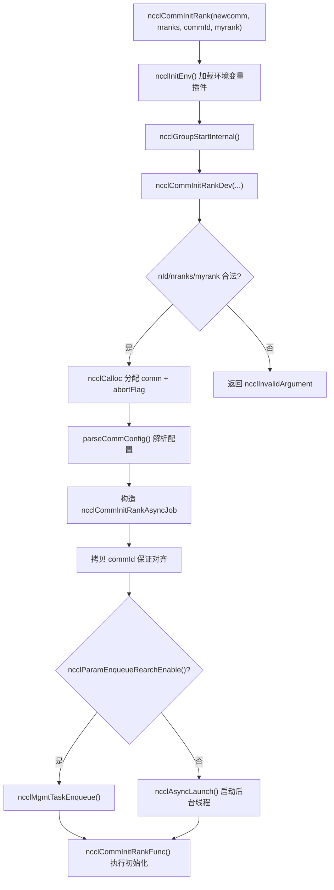
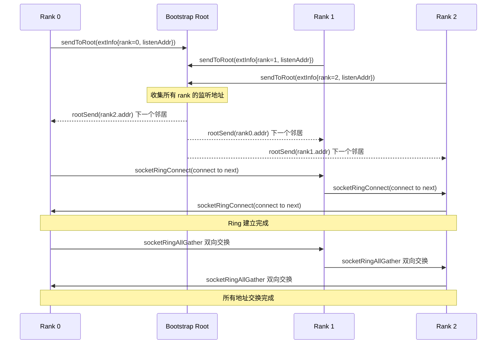
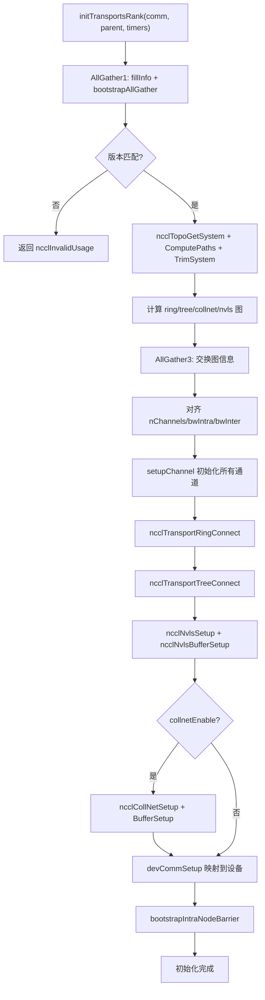

# 第 3 章：初始化入局：ncclCommInitRank 如何把一群孤立行程建立成通訊域

上一章我們建立了貫穿全書的五個核心抽象：ncclComm、channel、algorithm、protocol 和 transport，它們共同構成了「一次通訊 = 若干 channel × 一個 algorithm × 一個 protocol × 若干 transport」的公共詞彙表。現在，我們要回答一個更根本的問題：這個 ncclComm 物件究竟是如何從無到有構建出來的？當你呼叫 ncclCommInitRank 時，NCCL 需要在幾百毫秒內完成一系列複雜操作：確認所有 rank 到齊、交換裝置資訊、探測機器拓撲、計算資料路徑、分配 GPU 記憶體與主機記憶體，最終將這一切打包成一個 ncclComm 物件。本章將沿著這條呼叫鏈，從 API 入口一路下鑽到 initTransportsRank 的最後一根微血管。

# 3.1 API 入口：ncclCommInitRank 的同步外殼與非同步核心

## 直覺模型

`ncclCommInitRank`表面上是「建一個通訊域」，實際上它做的是「發起一個背景任務，然後（預設情況下）等它完成」。這就像你去餐廳點餐：點餐這個動作（API 呼叫）瞬間返回，但廚房做菜（真正的初始化）是在背景進行的。預設的「阻塞模式」只是讓你在櫃檯前等到菜做好，而「非阻塞模式」則給你一個取餐號，你可以先去幹別的。

如果沒有這層非同步設計，NCCL 在初始化期間就無法與 CUDA Graph 捕獲、多通訊域並行初始化等場景配合——所有初始化都會變成串列的、無法與使用者程式碼重疊的阻塞操作。

## 資料結構與記憶體佈局

先看 API 入口本身。`ncclCommInitRank`是一個極薄的同步外殼：

[FACT:src/init.cc:2946-2970]

它做了四件事：呼叫`ncclInitEnv()`載入環境變數外掛、開啟 NVTX 效能標記、讀取當前 CUDA 裝置號、然後呼叫`ncclGroupStartInternal()`進入 group 語義，最後把實際工作委託給`ncclCommInitRankDev`。

注意`ncclGroupStartInternal()` / `ncclGroupEndInternal()`這一對呼叫——即使你只初始化一個通訊域，NCCL 也把它包在 group 語義裡。這是為了統一處理「使用者在一個 group 裡初始化多個通訊域」的場景，避免為單通訊域和多通訊域寫兩套程式碼路徑。

真正的參數校驗和物件分配在`ncclCommInitRankDev`裡：

[FACT:src/init.cc:2851-2943]

這個函式是整條鏈路的「總排程台」。它先做參數校驗（`nId`範圍、`nranks`/`myrank`合法性），然後分配`ncclComm`結構體本身，以及三個與中止機制相關的欄位：`abortFlag`（主機側原子標誌）、`abortFlagDev`（裝置側可見的固定記憶體副本）、`abortFlagRefCount`（引用計數，因為 split 出來的子通訊域可能共享父通訊域的 abortFlag）。

這裡有一個值得注意的細節——`comm->startMagic = comm->endMagic = NCCL_MAGIC`：

[FACT:src/init.cc:2886-2886]

這對 magic 值像「封條」一樣夾在`ncclComm`結構體的首尾。任何越界寫入或結構體損壞都會破壞這對 magic，後續操作可以透過校驗它們來檢測記憶體踩踏。這是一種廉價但有效的記憶體完整性防護。

## Step-by-Step Walkthrough

當`ncclCommInitRankDev`走到最後，它構造一個`ncclCommInitRankAsyncJob`並啟動非同步任務：

[FACT:src/init.cc:2896-2929]

`job`結構體承載了所有初始化所需的參數。注意`job->commId`是**拷貝**出來的，而不是直接引用使用者傳入的`commId`：

[FACT:src/init.cc:2903-2910]

為什麼要拷貝？原始碼註解給出了答案：`ncclUniqueId`和`ncclBootstrapHandle`的對齊要求不同，使用者傳入的陣列可能沒有正確對齊到`ncclBootstrapHandle`所需的邊界。拷貝到新分配的記憶體可以保證對齊。這是一個典型的「ABI 相容性陷阱」——使用者看到的是`ncclUniqueId`，內部要當`ncclBootstrapHandle`用，兩者大小相同但對齊不同。

最後，根據`ncclParamEnqueueRearchEnable()`的值，任務要麼進入管理佇列，要麼直接透過`ncclAsyncLaunch`啟動：

[FACT:src/init.cc:2922-2929]

`ncclAsyncLaunch`會建立一個新執行緒執行`ncclCommInitRankFunc`。如果是阻塞模式（預設），呼叫方會在`ncclGroupEndInternal()`裡等待這個執行緒完成；如果是非阻塞模式，呼叫方立即返回，使用者後續透過`ncclCommGetAsyncError`輪詢狀態。

## 設計思考

這裡的設計核心是「同步 API + 非同步實作」。為什麼不讓`ncclCommInitRank`直接同步執行所有初始化？因為 NCCL 需要支援`ncclCommInitRankConfig`的非阻塞模式，而非阻塞模式要求初始化在背景執行緒執行。如果同步路徑和非同步路徑是兩套程式碼，維護成本會翻倍。統一走非同步、同步路徑只是「啟動後立即等待」，程式碼只有一份。



# 3.2 Bootstrap：rank 之間的第一條控制通道

## 直覺模型

Bootstrap 是 NCCL 的「會前微信群」。在正式通訊開始之前，所有 rank 需要先建立一條控制通道，用來交換「我是誰、我在哪台機器、我的 GPU 是什麼型號、我的網卡位址是什麼」這些元資料。沒有 bootstrap，rank 之間就是一群互不相識的陌生人，無法協調任何通訊。

如果 bootstrap 失敗或逾時，整個通訊域初始化就會卡死——這是生產環境中最常見的 NCCL 掛起原因之一。

## 資料結構與記憶體佈局

Bootstrap 的核心狀態保存在`bootstrapState`結構體中：

[FACT:src/bootstrap.cc:527-546]

這個結構體有幾個關鍵欄位值得展開：

- `ring`：一個聯合體，要麼是網路設備句柄（`net.sendComm`/`net.recvComm`），要麼是一對 socket（`socket.send`/`socket.recv`）。這對應兩種 bootstrap 模式：基於 socket 的預設模式和基於網路設備的`NCCL_OOB_NET_ENABLE`模式。
- `listen`：監聽端資訊，同樣有網路和 socket 兩種形態。
- `peerP2pAddresses` / `peerProxyAddresses`：所有 rank 的 P2P 位址和 proxy 位址陣列，透過 ring allgather 填充。
- `unexpectedConnections`：一個鏈結串列，快取「收到了但還沒被匹配」的連線。這是 bootstrap 協定的一個關鍵設計——因為接收方無法預知誰會先連過來，所以必須先把不匹配的連線存起來。
- `asyncSendQueue` + `asyncSendLock` + `asyncSendCond`：非同步發送佇列及其同步原語，用於 TLS 加密模式下的並行發送。

`bootstrapState`的分配發生在`bootstrapInit`開頭：

[FACT:src/bootstrap.cc:769-776]

注意`comm->bootstrap = state`這一行——bootstrap 狀態被掛到通訊域上，後續所有 bootstrap 操作都透過`comm->bootstrap`存取。

## Step-by-Step Walkthrough

`bootstrapInit`是 bootstrap 的主幹函式。讓我們按執行順序拆解：

**第一步：確定 magic 值。**magic 是 bootstrap 通訊的「暗號」，只有持有相同 magic 的 rank 才能互相連線。

[FACT:src/bootstrap.cc:778-788]

如果是正常初始化（`handles != NULL`），magic 來自第一個 handle；如果是 split/grow（`parent != NULL`），magic 透過`hashCombine(parent->magic, parent->childCount)`派生。這保證了每個子通訊域有唯一的 magic。

**第二步：建立監聽 socket。**每個 rank 需要兩個監聽端點：一個用於 ring 鄰居連線（`STATE_LISTEN(state, socket)`），一個用於 root 連線（`listenSockRoot`）：

[FACT:src/bootstrap.cc:797-831]

這裡有一個關鍵的分工：ring 監聽 socket 使用`comm->magic`，而 root 監聽 socket 使用`BOOTSTRAP_HANDLE(handles, curr_root)->magic`。為什麼？因為 root 是全域協調者，所有 rank 都要連它，所以它用統一的 magic；而 ring 鄰居是點對點的，用通訊域自己的 magic 就夠了。

**第三步：錯峰連線。**當 rank 數量很大時，所有 rank 同時連 root 會造成連線風暴。NCCL 用`NCCL_UID_STAGGER_RATE`和`NCCL_UID_STAGGER_THRESHOLD`來控制錯峰：

[FACT:src/bootstrap.cc:833-843]

當某個 root 負責的 rank 數超過閾值（預設 256）時，每個 rank 根據自己在 root 下的局部 ID 計算延遲微秒數，然後 sleep。這是一個簡單但有效的「令牌桶」式限流。

**第四步：向 root 發送自己的連線資訊。**每個 rank 把自己的監聽位址發給 root：

[FACT:src/bootstrap.cc:845-867]

root 收到所有 rank 的資訊後，會做一次「環形配對」——把 rank i 的位址發給 rank i-1，把 rank i+1 的位址發給 rank i。這樣每個 rank 就知道了自己 ring 上的前後鄰居。

**第五步：建立 ring 連線。**每個 rank 連線自己的「下一個」鄰居，同時接受「上一個」鄰居的連線：

[FACT:src/bootstrap.cc:885-894]

這裡`socketRingConnect`內部使用了`bootstrapConcurrent`——在 TLS 加密模式下，connect 和 accept 必須並行執行，否則會死鎖（因為 TLS 握手需要雙方同時參與）。非加密模式下則串行執行 connect 再 accept。

**第六步：AllGather 所有位址。**ring 建立後，透過`ringAllInfo`把所有 rank 的 P2P 位址、proxy 位址、UDS 位址做一次 allgather：

[FACT:src/bootstrap.cc:934-938]

`ringAllInfo`內部呼叫`bootstrapAllGather`，後者在 socket 模式下使用`socketRingAllGather`——一個雙向 ring allgather 演算法，N 個 rank 只需要 N/2 步：

[FACT:src/bootstrap.cc:1363-1412]

這個雙向演算法是 bootstrap 效能的關鍵最佳化。傳統的單向 ring allgather 需要 N-1 步，雙向版本把步數減半。每一步同時向兩個方向發送和接收資料，用`socketDoubleSendRecv`把 4 個操作（2 發 2 收）打包成一次系統呼叫。

## 並行控制與底層互動

Bootstrap 的並行控制有幾個層次：

**第一層：abort 檢查。**所有阻塞迴圈都定期檢查 abortFlag：

[FACT:src/bootstrap.cc:150-159]

`BOOTSTRAP_N_CHECK_ABORT`設為 10000，意味著每 10000 次迴圈檢查一次 abort 標誌。這個數字是效能與回應性的折中——檢查太頻繁會影響效能，檢查太少會導致 abort 回應延遲。

**第二層：非同步發送佇列。**在 TLS 加密模式下，`bootstrapSend`不能同步執行（因為 TLS 握手需要接收方也參與），所以 NCCL 把發送操作放到獨立執行緒：

[FACT:src/bootstrap.cc:1161-1217]

這裡有一個精妙的順序保證機制。`bootstrapAsyncSendMain`在發送前會檢查佇列中是否有「更早的、發往同一 (peer, tag) 的發送」：

[FACT:src/bootstrap.cc:1124-1152]

為什麼要保證同一 (peer, tag) 的發送順序？原始碼註解解釋得很清楚：接收方按 (peer, tag) 匹配連接，如果兩個發往同一 (peer, tag) 的訊息到達順序顛倒，接收方會把它們匹配錯。NVLS 初始化期間會多次向同一 peer 用同一 tag 廣播，所以這個順序保證是必須的。

**第三層：意外連接佇列。**接收方無法預知誰會先連過來，所以`socketAccept`會把不匹配的連接存入`unexpectedConnections`鏈結串列：

[FACT:src/bootstrap.cc:1276-1300]

這個設計解決了一個經典的分散式問題：多個 rank 可能同時向你發起連接，但你的`bootstrapRecv`呼叫順序是固定的。如果不匹配的連接被直接丟棄，發送方會逾時；如果阻塞等待，又可能死鎖。存入佇列是最安全的做法。

## 生產避坑指南

**坑一：bootstrap 逾時導致初始化掛起。**如果某個 rank 因為網路問題無法連接到 root，其他所有 rank 都會在`ncclSocketAccept`或`ncclSocketRecv`上無限等待。NCCL 沒有內建的 bootstrap 逾時機制，唯一的逃生通道是 abortFlag。生產環境中建議設定`NCCL_UID_STAGGER_RATE`來緩解大規模叢集的連接風暴。

**坑二：`NCCL_COMM_ID`與多 handle 衝突。**當使用者設定`NCCL_COMM_ID`環境變數時，NCCL 會強制把`nId`降為 1：

[FACT:src/init.cc:2912-2921]

這意味著`ncclCommInitRankScalable`的多 handle 特性會被靜默停用。如果你在用 scalable 初始化又設了`NCCL_COMM_ID`，行為會和你預期的不一樣。

**坑三：TLS 模式下的死鎖。**在 TLS 加密模式下，如果 connect 和 accept 不並行執行，雙方都會卡在 TLS 握手。`bootstrapConcurrent`就是為了解決這個問題：

[FACT:src/bootstrap.cc:648-669]

非加密模式下串行執行（先 send 後 recv），加密模式下啟動一個執行緒處理 send，主執行緒處理 recv。



# 3.3 commAlloc：通訊域物件的記憶體骨架

## 直覺模型

`commAlloc`是通訊域的「毛胚屋交付」——它分配結構體記憶體、初始化所有欄位到安全預設值、建立必要的 CUDA 物件和同步原語，但還沒有填充拓撲資訊、通道配置、傳輸連接這些「精裝修」內容。如果把`ncclComm`比作一棟大樓，`commAlloc`就是打地基和澆築框架，`initTransportsRank`才是內部裝修。

如果沒有`commAlloc`的初始化，後續程式碼存取未初始化的欄位會導致不可預測的行為——比如`comm->channels[c].id`如果是隨機值，通道初始化邏輯就會誤判通道狀態。

## 資料結構與記憶體佈局

`commAlloc`的簽名和開頭校驗：

[FACT:src/init.cc:512-526]

它首先校驗`ndev`和`rank`的合法性，然後建構兩個記憶體堆疊（`memPermanent`和`memScoped`），設定`rank`和`nRanks`。這兩個記憶體堆疊是 NCCL 的記憶體管理基礎設施——`memPermanent`用於生命週期與通訊域相同的分配，`memScoped`用於臨時分配。

接下來是 CUDA 裝置探測：

[FACT:src/init.cc:528-531]

`cudaGetDevice`取得目前裝置號，`ncclCudaCompCap`取得計算能力。原始碼註解說得很直白："Try to create a CUDA object right away. If there is something wrong with the device we're on, better know it early."——儘早暴露裝置問題，避免在初始化後期才發現。

然後是共享資源的分配或繼承：

[FACT:src/init.cc:533-555]

這裡有一個重要的分支：如果`parent == NULL || !parent->shareResources`，就建立新的`ncclSharedResources`；否則繼承父通訊域的共享資源並增加引用計數。`ncclSharedResources`包含裝置流、主機流、啟動事件、scratch 事件等——這些資源在 split 場景下可以被子通訊域複用，避免重複建立。

注意`sharedRes->refCount = 1`這一行——初始引用計數為 1，每次 split 共享時遞增，最後一個引用釋放時才真正銷毀。

接下來是網路、RMA、GIN 的初始化：

[FACT:src/init.cc:547-549]

這三個子系統分別負責網路傳輸、遠端記憶體存取、GPU 發起的網路通訊。它們的初始化順序有講究——`ncclNetInit`必須先於`ncclRmaInit`，因為 RMA 依賴網路外掛。

記憶體管理器的初始化：

[FACT:src/init.cc:567-576]

同樣有共享/新建兩種路徑。`ncclMemManager`負責管理 CUDA 記憶體池和註冊快取。

通道初始化標記：

[FACT:src/init.cc:607-608]

這一行把所有通道的`id`設為 -1，表示「未初始化」。後續`setupChannel`會檢查這個值來決定是否需要初始化。

中斷佇列的建構：

[FACT:src/init.cc:619-632]

NCCL 使用侵入式佇列（intrusive queue）來管理各種任務。這些佇列在`commAlloc`階段全部建構為空，後續任務入佇列時直接使用。

CUDA 記憶體池的建立：

[FACT:src/init.cc:636-652]

如果裝置支援記憶體池（`cudaDevAttrMemoryPoolsSupported`），就建立一個 pinned 類型的記憶體池，並把釋放閾值設為最大值（`~uint64_t(0)`），意思是「永遠不自動釋放」。這是為了避免 CUDA 執行階段在 NCCL 不知情的情況下回收記憶體。

## Step-by-Step Walkthrough

讓我們追蹤一個具體的初始化場景：單機 8 卡，每個行程一個 rank，正常初始化。

1. `commAlloc(comm, NULL, 8, rank)`被呼叫，`parent == NULL`。

2. 校驗通過，`comm->rank = rank`，`comm->nRanks = 8`。

3. `cudaGetDevice`傳回目前裝置號，`comm->compCap`被設定。

4. 建立新的`ncclSharedResources`，引用計數為 1。

5. `ncclNetInit`初始化網路外掛（可能是 Socket 或 IB）。

6. `ncclMemManagerInit`建立記憶體管理器。

7. `getBusId`取得 PCI 匯流排 ID，`ncclNvmlDeviceGetHandleByPciBusId`取得 NVML 控制代碼。

8. `dmaBufSupported`偵測 DMA-BUF 支援。

9. 分配`connectSend` / `connectRecv`位圖陣列。

10. 所有通道`id`設為 -1。

11. 建構所有中斷佇列。

12. 建立 CUDA 記憶體池。

## 設計思考

`commAlloc`中最值得玩味的設計是「儘早失敗」原則。它在函式開頭就呼叫`cudaGetDevice`，而不是等到後面需要裝置資訊時再呼叫。這樣做的好處是：如果裝置有問題（例如被其他行程獨占），錯誤會在初始化早期就暴露，而不是在分配了大量記憶體之後才發現。

另一個設計是`preconnectNext`的初始化：

[FACT:src/init.cc:598-598]

`reinterpret_cast<struct ncclComm*>(0x1)`是一個哨兵值，用於標記「下一個預連接」的狀態。這種用非法指標值作為狀態標記的手法在系統程式設計中很常見——它比額外的布林欄位更省記憶體，但需要小心不要解引用。

# 3.4 initTransportsRank：拓撲探索與通道分配

## 直覺模型

`initTransportsRank`是初始化的「心臟」。它做三件大事：透過兩次 AllGather 交換所有 rank 的裝置資訊和拓撲資訊；根據這些資訊計算 ring/tree/collnet/nvls 等演算法的圖結構；最後建立所有傳輸連線。如果把通訊域比作一個城市的交通系統，`initTransportsRank`就是規劃所有道路、立交橋和公車路線的過程。

如果沒有這一步，NCCL 就不知道資料該走哪條路——它可能讓資料繞遠路，或者根本找不到可達的路徑。

## 資料結構與記憶體佈局

`initTransportsRank`的區域變數非常多，我們挑關鍵的看：

[FACT:src/init.cc:1163-1179]

這裡把`comm->graphs`陣列中的各個圖結構取出來，建立別名。`graphs`陣列按演算法索引，注意`nvlsGraph`被用了兩次（NVLS 和 NVLSTree 共享同一個圖結構）。

兩個關鍵的臨時結構體：

[FACT:src/init.cc:1181-1206]

`graphInfo`儲存單個 rank 對某個演算法的圖資訊（通道數、頻寬、類型等），`allGatherInfo`是 AllGather 的資料單元，包含所有演算法的圖資訊加上拓撲 rank 資訊。

## Step-by-Step Walkthrough

**階段一：AllGather1——交換裝置資訊。**

[FACT:src/init.cc:1234-1239]

每個 rank 呼叫`fillInfo`填充自己的`ncclPeerInfo`，然後透過`bootstrapAllGather`交換。`fillInfo`填充的資訊包括：rank 號、CUDA 裝置號、NVML 裝置號、NCCL 版本、git hash、主機 hash、行程 hash、GPU UUID、匯流排 ID、顯示記憶體大小、驅動版本等。

[FACT:src/init.cc:888-982]

注意`info->hostHash = getHostHash() + commHash`和`info->pidHash = getPidHash() + commHash`——host hash 和 pid hash 都加上了 commHash。這是為了區分同一台機器上的不同通訊域。

AllGather 完成後，每個 rank 走訪所有 peer 的資訊，計算全域屬性：

[FACT:src/init.cc:1250-1303]

這個迴圈做了很多事：偵測版本不符、統計節點數、計算`cuMemSupport`的交集、偵測是否有多個 rank 使用同一個 GPU、計算 GIN 類型遮罩的交集等。注意`nNodes`的統計方式——每當遇到不同 hostHash 就遞增，這假設 rank 是按節點連續排列的。

**階段二：拓撲探索。**

[FACT:src/init.cc:1390-1403]

這六步是拓撲探索的核心流程：`ncclTopoGetSystem`列舉系統裝置建構拓撲圖，`ncclTopoComputePaths`計算 GPU 到 NIC 的路徑，`ncclTopoTrimSystem`移除不可達裝置，再次計算路徑，`ncclTopoSearchInit`初始化搜尋狀態，最後列印拓撲。

**階段三：圖計算。**

[FACT:src/init.cc:1421-1468]

依次計算 ring、tree、collnet chain、collnet direct、nvls 五種圖。每種圖有不同的 pattern 和通道數約束。注意`treeGraph->minChannels = ringGraph->nChannels`——tree 的通道數被約束為與 ring 相同，這是為了保證不同演算法之間的通道對齊。

**階段四：AllGather3——交換圖資訊。**

[FACT:src/init.cc:1490-1533]

每個 rank 把自己的圖資訊填入`allGather3Data[rank]`，然後再次`bootstrapAllGather`。這次交換的資訊包括：每種演算法的 pattern/nChannels/bwIntra/bwInter/typeIntra/typeInter/crossNic、CPU 架構、P2P 通道數、網路裝置數、CollNet 裝置數等。

AllGather3 完成後，每個 rank 走訪所有 peer 的圖資訊，取最小值/最大值來對齊：

[FACT:src/init.cc:1687-1703]

注意這裡的對齊策略：`nChannels`、`sameChannels`、`bwIntra`、`bwInter`取最小值，`typeIntra`、`typeInter`、`crossNic`取最大值。為什麼？因為通道數和頻寬受限於最弱的鏈路，而類型和 crossNic 需要取聯集以確保相容性。

**階段五：建立傳輸連線。**

[FACT:src/init.cc:1811-1892]

這裡有兩個分支：`runtimeConn`為真時只做通道 setup 不做連線（延遲到執行時連線），否則立即建立所有連線。連線順序是：ring → tree → NVLS → PAT → NVLS tree → CollNet。

## 並行控制與硬體互動

`initTransportsRank`中有幾個值得注意的並行/硬體互動點：

**CPU 親和性設定：**

[FACT:src/init.cc:1406-1412]

NCCL 把當前執行緒綁定到 GPU 附近的 CPU 核心，確保主機記憶體分配是本地 NUMA 節點的。這減少了跨 NUMA 存取的延遲。

**NVLS 初始化：**

[FACT:src/init.cc:1419-1419]

`ncclNvlsInit`檢測 NVLink SHARP 支援。NVLS 允許交換器直接執行 reduce 操作，大幅降低 AllReduce 延遲。

**Proxy 執行緒建立：**

[FACT:src/init.cc:1780-1786]

Proxy 執行緒負責非同步推進網路 I/O。它在`initTransportsRank`中被建立，之後所有網路操作都透過 proxy 進行。

## 生產避坑指南

**坑一：網路裝置數不匹配。**如果不同 rank 的本地網卡數量不同，NCCL 會報錯：

[FACT:src/init.cc:1576-1596]

除非設定`NCCL_IGNORE_NET_MISMATCH=1`。這在異構叢集中很常見——有些節點有 8 張網卡，有些只有 4 張。忽略不匹配可能導致效能下降，因為通道數會被最弱的節點限制。

**坑二：多 rank 共用同一 GPU。**如果兩個 rank 的 GPU UUID 相同，NCCL 會拒絕初始化：

[FACT:src/init.cc:1291-1296]

除非設定`NCCL_MULTI_RANK_GPU_ENABLE=1`。這個檢查防止了使用者誤配置導致的效能問題。

**坑三：CollNet 節點數不足。**CollNet 需要至少`NCCL_COLLNET_NODE_THRESHOLD`個節點才能啟用：

[FACT:src/init.cc:1720-1728]

預設閾值是 2。單節點環境下 CollNet 會被自動停用。



# 3.5 NCCL_PARAM：環境變數體系的編譯期魔法

## 直覺模型

`NCCL_PARAM`是 NCCL 的「配置開關工廠」。它用巨集在編譯期生成一個函式，執行時第一次呼叫時讀取環境變數並快取結果。這就像家裡的電燈開關——你撥一下（呼叫函式），燈就亮了（回傳配置值），之後開關狀態被記住，不需要每次都重新撥。

如果沒有這套機制，NCCL 就需要在每個使用配置的地方手動呼叫`getenv`並解析字串，程式碼會變得極其冗長且容易出錯。

## 資料結構與記憶體佈局

`NCCL_PARAM`巨集的定義：

[FACT:src/include/param.h:22-31]

這個巨集展開後生成一個函式`ncclParam##name()`，內部有三個靜態變數：

- `uninitialized = INT64_MIN`：哨兵值，表示「尚未初始化」。
- `noCache`：三態標誌，-1 表示未初始化，0 表示快取，1 表示不快取。
- `cache`：快取的值，初始為`uninitialized`。

函式邏輯是：如果`cache`還是`uninitialized`，呼叫`ncclLoadParam`載入；否則直接回傳`cache`。`COMPILER_EXPECT(..., false)`告訴編譯器這個分支很少走，優化熱路徑。

`ncclLoadParam`的實作：

[FACT:src/misc/param.cc:78-108]

它用互斥鎖保護整個載入過程，先檢查`noCache`策略，再檢查快取是否有效，然後讀取環境變數並解析。解析失敗時使用預設值並列印警告。

## Step-by-Step Walkthrough

以`NCCL_PARAM(BuffSize, "BUFFSIZE", -2)`為例：

[FACT:src/init.cc:1007-1007]

巨集展開後生成：

```cpp
int64_t ncclParamBuffSize() {
  constexpr int64_t uninitialized = INT64_MIN;
  static int8_t noCache = -1;
  static_assert(-2 != uninitialized, "...");
  static int64_t cache = uninitialized;
  if (COMPILER_EXPECT(COMPILER_ATOMIC_LOAD(&cache, std::memory_order_relaxed) == uninitialized, false)) {
    return ncclLoadParam("NCCL_BUFFSIZE", -2, uninitialized, &cache, &noCache);
  }
  return cache;
}
```

第一次呼叫時，`cache == uninitialized`，進入`ncclLoadParam`。它讀取`NCCL_BUFFSIZE`環境變數，如果沒設定就回傳預設值 -2。然後根據`noCache`策略決定是否快取。

`noCache`策略由`ncclParamIsCacheDisabled`決定：

[FACT:src/misc/param.cc:74-76]

如果環境變數名稱匹配某個模式（比如以`_`結尾），就不快取，每次都重新讀取。這允許使用者在執行時動態修改某些配置。

## 設計思考

這套設計的精妙之處在於「零成本抽象」：熱路徑上只有一次原子載入和比較，沒有鎖、沒有字串解析。冷路徑（首次載入）才付出完整代價。`COMPILER_EXPECT`提示編譯器把熱路徑放在指令快取的前面，進一步提高效能。

另一個設計是`noCache`的三態設計。-1 表示「還沒決定」，0 表示「快取」，1 表示「不快取」。這個決定只在首次載入時做一次，之後不再改變。

## 生產避坑指南

**坑一：環境變數拼寫錯誤。**如果使用者寫了`NCCL_BUFSIZE`而不是`NCCL_BUFFSIZE`，NCCL 不會報錯，只會使用預設值。建議用`NCCL_DEBUG=ENV`查看所有被識別的環境變數。

**坑二：`NCCL_CONF_FILE`的載入順序。**NCCL 會依次載入`$NCCL_CONF_FILE`（或`~/.nccl.conf`）和`/etc/nccl.conf`：

[FACT:src/misc/param.cc:52-67]

後載入的檔案會覆蓋先載入的。如果兩個檔案都設定了同一個變數，`/etc/nccl.conf`的值會生效。

**坑三：`noCache`變數的執行緒安全。**原始碼註解說 "noCache is only load/stored within the mutex, no need for atomic"：

[FACT:src/misc/param.cc:74-76]

這意味著`noCache`的讀寫都在互斥鎖保護下，不需要原子操作。但`cache`的讀取是無鎖的（熱路徑），所以用原子載入。

# 3.6 devCommSetup：把通訊域映射到裝置

## 直覺模型

`devCommSetup`是通訊域的「裝置側投影」。GPU kernel 執行在裝置上，無法直接存取主機記憶體中的`ncclComm`結構體。所以 NCCL 需要把通訊域的關鍵欄位複製到裝置可存取的記憶體中，形成`ncclDevComm`。這就像把公司的通訊錄複印一份放到每個員工的工位上——員工不用每次都跑去找櫃檯問同事電話。

如果沒有`devCommSetup`，GPU kernel 就無法知道自己的 rank、通道配置、緩衝區大小等資訊，集合通訊 kernel 根本無法啟動。

## 資料結構與記憶體佈局

`devCommSetup`使用一個臨時結構體`ncclKernelCommAndChannels`來打包要複製到裝置的資料：

[FACT:src/init.cc:712-746]

這個結構體包含`ncclDevComm`（裝置側通訊域）和通道陣列。函式先把主機側的資料填入臨時結構體，然後一次性`cudaMemcpyAsync`到裝置。

關鍵欄位的填充：

[FACT:src/init.cc:734-746]

注意`comm->devComm = &devCommAndChans->comm`——主機側的`comm->devComm`指向裝置記憶體中的`ncclDevComm`。後續 kernel 啟動時會把`comm->devComm`作為參數傳入。

通道資訊的填充：

[FACT:src/init.cc:829-843]

每個通道的 peers、ring、tree、collnetChain、collnetDirect、nvls 指標都被拷貝到裝置側。注意`ring.userRanks`需要額外的一次`cudaMemcpyAsync`，因為它是一個陣列。

## Step-by-Step Walkthrough

1. 取得裝置串流：`ncclStrongStreamAcquire`取得一個強串流（strong stream），確保後續的非同步拷貝有序執行。

2. 分配裝置記憶體：`ncclCudaCallocAsync`分配`devCommAndChans`。

3. 填充主機側暫存結構體：設定 rank、nRanks、node、nNodes、abortFlag、buffSizes 等。

4. 分配並拷貝`rankToLocalRank`陣列。

5. 計算`workFifoBytes`：根據 CC（Confidential Computing）狀態決定。

6. 分配 workFifo 緩衝區：GDR 模式用`ncclGdrCudaCalloc`，否則用`ncclCudaHostCalloc`。

7. 分配 profiler 計數器。

8. 分配進度計數器（如果啟用）。

9. 填充通道資訊。

10. 一次性拷貝到裝置：`ncclCudaMemcpyAsync(devCommAndChans, &tmpCommAndChans, 1, deviceStream)`。

11. 釋放強串流並同步。

## 設計思考

`devCommSetup`中最值得注意的設計是「批次拷貝」。NCCL 沒有為每個欄位單獨呼叫`cudaMemcpy`，而是把所有欄位打包到一個暫存結構體，用一次`cudaMemcpyAsync`完成。這大幅減少了 CUDA API 呼叫次數和同步開銷。

另一個設計是`workFifoBytes`的 CC 處理：

[FACT:src/init.cc:750-763]

在 CC（Confidential Computing）模式下，`workFifoBytes`被設為 0，因為 GDR 拷貝在 CC 模式下不可用。這是一個硬體限制的優雅降級。

## 生產避坑指南

**坑一：`devCommSetup`必須在 barrier 之前呼叫。**原始碼註解解釋了原因：

[FACT:src/init.cc:1950-1952]

如果在 barrier 之後呼叫，可能有執行緒已經開始啟動 NCCL kernel，而此時裝置記憶體還沒分配完，會導致死鎖。

**坑二：`workFifoBytes`必須是 2 的冪。**如果不是，NCCL 會警告並使用預設值：

[FACT:src/init.cc:757-762]

# 本章思考與自測

Q1: 如果將[FACT:src/init.cc:1291-1296]中偵測「多個 rank 使用同一 GPU」的邏輯去掉，在什麼場景下會導致問題？為什麼 NCCL 預設拒絕這種配置？

**參考解析**：

這段程式碼偵測同一主機上兩個 rank 的 GPU UUID 是否相同。如果相同且`NCCL_MULTI_RANK_GPU_ENABLE=0`（預設），就返回`ncclInvalidUsage`。

去掉這個檢查後，多個 rank 會共享同一個 GPU。這會導致：

1. **P2P 傳輸衝突**：NCCL 的 P2P 傳輸假設每個 rank 獨佔一個 GPU。如果兩個 rank 共享 GPU，它們會同時向同一個 GPU 的同一塊緩衝區寫入資料，導致資料競爭和結果錯誤。

2. **通道分配衝突**：`comm->channels`中的通道資源（緩衝區、FIFO）是按 rank 分配的。共享 GPU 的 rank 會爭搶同一份資源。

3. **效能災難**：即使沒有正確性問題，兩個 rank 共享一個 GPU 的算力和顯示記憶體頻寬，效能會急劇下降。

NCCL 預設拒絕這種配置是為了「快速失敗」——與其讓使用者在一個錯誤配置上浪費數小時除錯，不如在初始化時就明確報錯。`NCCL_MULTI_RANK_GPU_ENABLE=1`是給那些明確知道自己在做什麼的使用者（比如 MPS 場景）準備的逃生通道。

Q2: 如果將[FACT:src/bootstrap.cc:1129-1134]中等待「同一 (peer, tag) 的更早發送」的邏輯去掉，在什麼場景下會導致接收方匹配錯誤？

**參考解析**：

這段程式碼在非同步發送執行緒中等待，直到佇列中沒有更早的、發往同一 (peer, tag) 的發送。

去掉這個等待後，兩個發往同一 (peer, tag) 的發送可能並行執行，到達接收方的順序不確定。接收方的`socketAccept`按 (peer, tag) 匹配連線：

[FACT:src/bootstrap.cc:1291-1292]

如果發送方 A 先呼叫`bootstrapSend`但後到達，發送方 B 後呼叫但先到達，接收方會把 B 的訊息當作 A 的回應。這會導致資料錯位——接收方以為收到的是第一個請求的回應，實際上是第二個請求的。

原始碼註解明確指出了這個場景：「NVLS setup broadcasts to the same peers with the same tag several times during init」。NVLS 初始化期間會多次向同一 peer 用同一 tag 廣播，如果順序顛倒，NVLS 配置會完全錯亂。

這個順序保證的代價是：同一 (peer, tag) 的發送被串行化。但不同 (peer, tag) 的發送仍然並行，所以整體吞吐量不受影響。

Q3: 如果將[FACT:src/init.cc:1691-1697]中對齊策略從「nChannels 取 min、typeIntra 取 max」改為「全部取 min」或「全部取 max」，會分別導致什麼問題？

**參考解析**：

當前策略是：`nChannels`、`sameChannels`、`bwIntra`、`bwInter`取 min，`typeIntra`、`typeInter`、`crossNic`取 max。

**如果全部取 min**：`typeIntra`和`typeInter`取 min 會導致某些 rank 的傳輸類型被降級。比如 rank A 支援 P2P（typeIntra=P2P），rank B 只支援 SHM（typeIntra=SHM），取 min 後所有 rank 都用 SHM。但 SHM 的列舉值可能比 P2P 小，取 min 會選到錯誤的類型。實際上`typeIntra`是一個位元遮罩或列舉，取 max 是為了選擇「能力最強」的類型。

**如果全部取 max**：`nChannels`取 max 會導致某些 rank 被分配超過其能力的通道數。比如 rank A 只能支援 4 個通道，rank B 支援 8 個，取 max 後所有 rank 都嘗試用 8 個通道，rank A 會失敗或效能下降。`bwIntra`取 max 會導致頻寬估計過於樂觀，tuning 模組可能選擇不適合的演算法。

這個對齊策略的本質是：**資源約束取交集（min），能力列舉取聯集（max）**。通道數和頻寬是「上限」約束，必須取最保守的值；傳輸類型是「能力」列舉，取最大值確保所有 rank 都能找到相容的傳輸方式。

下一章我們將深入拓撲發現與圖搜尋，看 NCCL 如何列舉機器裡的 GPU、網卡、PCI 交換機，構建出一張完整的拓撲圖，並在這張圖上搜尋最優的 ring 和 tree 結構。本章建立的 bootstrap 通訊、commAlloc 記憶體骨架、initTransportsRank 主幹流程，將在下一章中逐一展開其拓撲細節。

至此，我們已經完整走過了 ncclCommInitRank 的呼叫鏈，看清了 ncclComm 物件從零構建的全過程。但初始化過程中有一個關鍵環節我們只是匆匆掠過：NCCL 是如何探測機器內部的 GPU 和網卡，並據此決定資料該走哪條路的？這正是下一章要深入的主題——拓撲發現與圖搜尋。我們將拆解 src/graph/topo.cc 如何列舉 PCI/NVLink/網卡裝置並構建拓撲圖，src/graph/search.cc 如何在該圖上搜尋最優路徑，以及 src/graph/rings.cc 與 trees.cc 如何將搜尋結果具體化為 Ring 與 Tree 演算法拓撲。理解了這套機制，你就能明白為什麼 NCCL 能在不同機器上自動選到合適的演算法。
