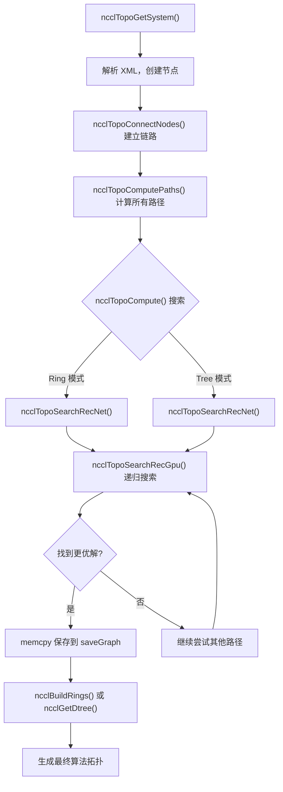
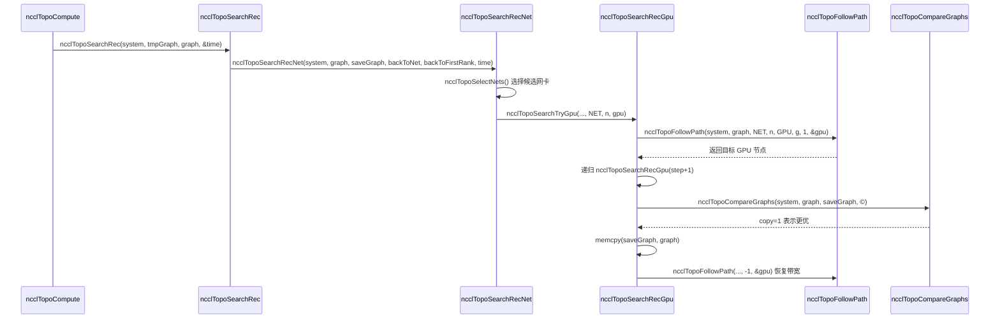

# 第 4 章：拓撲發現與圖搜尋：NCCL 如何「看清」多 GPU 系統的物理互聯

上一章我們沿 ncclCommInitRank 的呼叫鏈逐層下鑽，看到了 comm->topo 欄位被填充的時機，但並未展開它內部的結構。那麼，NCCL 究竟是如何「看見」機器裡的 GPU 和網卡，並將它們組織成可用的拓撲資訊的？本章將拆解這一過程的三個關鍵環節：topo.cc 負責將物理裝置列舉成一張圖，search.cc 在這張圖上搜尋最優路徑，rings.cc 和 trees.cc 則把搜尋結果具體化為 Ring 與 Tree 兩種演算法拓撲。理解這三者的配合，才能明白 NCCL 為何能在不同機器上自動選到合適的演算法。

# 拓撲圖：把機器畫成一張「地鐵線路圖」

## 直覺模型

想像你是一個剛到陌生城市的快遞員。你要把包裹從 A 點送到 B 點，但你不知道哪條路最快。你需要一張地圖——上面標著所有站點（GPU、網卡、CPU、PCI 交換機）以及站點之間的連接（NVLink、PCIe、網路）。NCCL 的拓撲圖就是這張地圖。

如果沒有這張圖，NCCL 只能盲目地假設「所有 GPU 之間頻寬相同」，在 8 卡 NVLink 全互聯的機器上或許還能湊合，但一旦遇到跨 NUMA、跨 PCI 交換機、混合 NVLink + PCIe 的複雜拓撲，就會選錯路徑，把本該走 NVLink 的資料塞進慢速 PCIe，效能直接腰斬。

## 資料結構與記憶體佈局

拓撲圖的核心是`ncclTopoSystem`，它按節點類型分組儲存所有裝置。節點類型定義在`topoNodeTypeStr`陣列裡：

[FACT:src/graph/topo.cc:33-35]

```c
const char* topoNodeTypeStr[] = {"GPU", "PCI", "NVS", "CPU", "NIC", "NET", "GIN", "RMA", "DEV", "CXB"};
const char* topoLinkTypeStr[] = {"LOC", "NVL", "", "C2C", "PCI", "", "", "", "", "SYS", "NET"};
const char* topoPathTypeStr[] = {"LOC", "NVL", "NVB", "C2C", "PIX", "PXB", "P2C", "PXN", "PHB", "SYS", "NET", "DIS"};
```

這三個陣列分別定義了節點類型、鏈路類型和路徑類型的字串表示。注意`topoPathTypeStr`的順序——它同時充當了路徑品質的排序：索引越小，路徑越快。`LOC`（本地）最快，`DIS`（斷開）最慢。這個順序在後續搜尋中會被反覆用來比較路徑優劣。

每個節點由`ncclTopoNode`表示，建立時根據類型初始化不同的欄位。以 GPU 節點為例：

[FACT:src/graph/topo.cc:105-141]

```c
ncclResult_t ncclTopoCreateNode(struct ncclTopoSystem* system, struct ncclTopoNode** node, int type, uint64_t id) {
  if (system->nodes[type].count == NCCL_TOPO_MAX_NODES) {
    WARN("Error : tried to create too many nodes of type %d", type);
    return ncclInternalError;
  }
  struct ncclTopoNode* n = system->nodes[type].nodes + system->nodes[type].count;
  system->nodes[type].count++;
  n->type = type;
  n->id = id;
  if (type == GPU) {
    n->gpu.dev = NCCL_TOPO_UNDEF;
    n->gpu.rank = NCCL_TOPO_UNDEF;
    n->gpu.cudaCompCap = NCCL_TOPO_UNDEF;
    n->gpu.mloPart = NCCL_TOPO_UNDEF;
  } else if (type == CPU) {
    ...
```

這裡有幾個關鍵設計點。第一，節點儲存在一個預先分配的陣列中（`system->nodes[type].nodes`），而不是鏈結串列。這意味著節點在記憶體中是連續排列的，遍歷時快取友好。第二，`NCCL_TOPO_MAX_NODES`是一個硬上限，超過就報錯——這是為了防止拓撲異常時無限增長。第三，每個節點有一個`id`欄位，它是一個 64 位元整數，高 32 位元是 systemId（標識哪台主機），低 32 位元是 localId（主機內的裝置編號）。

節點之間的連接由`ncclTopoLink`表示。`ncclTopoConnectNodes`負責建立雙向連接：

[FACT:src/graph/topo.cc:179-204]

```c
ncclResult_t ncclTopoConnectNodes(struct ncclTopoNode* node, struct ncclTopoNode* remNode, int type, float bw) {
  // Aggregate links into higher bw for NVLink
  struct ncclTopoLink* link;
  for (link = node->links; link - node->links != NCCL_TOPO_MAX_LINKS && link->remNode; link++) {
    if (link->remNode == remNode && link->type == type) break;
  }
  if (link - node->links == NCCL_TOPO_MAX_LINKS) {
    WARN("Error : too many Topo links (max %d)", NCCL_TOPO_MAX_LINKS);
    return ncclInternalError;
  }
  if (link->remNode == NULL) node->nlinks++;
  link->type = type;
  link->remNode = remNode;
  link->bw += bw;

  // Sort links in BW descending order
  struct ncclTopoLink linkSave;
  memcpy(&linkSave, link, sizeof(struct ncclTopoLink));
  while (link != node->links) {
    if ((link - 1)->bw >= linkSave.bw) break;
    memcpy(link, link - 1, sizeof(struct ncclTopoLink));
    link--;
  }
  memcpy(link, &linkSave, sizeof(struct ncclTopoLink));
  return ncclSuccess;
}
```

這個函式做了三件事。第一，查找是否已存在到同一目標、同一類型的鏈路——如果存在，就把頻寬累加（`link->bw += bw`）。這處理的是多條 NVLink 連到同一個 GPU 的情況：4 條 NVLink 各 25 GB/s，聚合後就是 100 GB/s。第二，如果沒找到，就新增一條鏈路。第三，插入後按頻寬降序排列，這樣後續遍歷時優先看到高頻寬鏈路。

> **[Design Inference & Architectural Trade-offs]**
> 頻寬降序排列的設計動機是讓搜尋演算法儘早發現高頻寬路徑，從而更快收斂到較優解。搜尋有逾時限制（後面會看到`NCCL_SEARCH_TIMEOUT`），排序能讓有限的時間預算花在更有希望的路徑上。

## 場景驅動的 Step-by-Step Walkthrough

現在代入一個具體場景：一台 8 卡 A100 伺服器，每張卡透過 NVLink 全互聯，另有 4 張 Mellanox ConnectX-6 網路卡插在 PCIe 插槽上。NCCL 初始化時，`ncclTopoGetSystem`被呼叫，它從 XML 檔案（由`nvidia-topologyd`或 NCCL 自己生成）讀取裝置資訊，然後構建拓撲圖。

第一步，解析 CPU 節點。`ncclTopoAddCpu`從 XML 中讀取 CPU 的架構、廠商、型號，並建立 CPU 節點：

[FACT:src/graph/topo.cc:806-875]

```c
ncclResult_t ncclTopoAddCpu(struct ncclXmlNode* xmlCpu, struct ncclTopoSystem* system) {
  int numaId;
  NCCLCHECK(xmlGetAttrInt(xmlCpu, "numaid", &numaId));
  int systemId;
  NCCLCHECK(ncclGetSystemId(system, xmlCpu, &systemId));
  struct ncclTopoNode* cpu;
  NCCLCHECK(ncclTopoCreateNode(system, &cpu, CPU, NCCL_TOPO_ID(systemId, numaId)));
  ...
  for (int s = 0; s nSubs; s++) {
    struct ncclXmlNode* node = xmlCpu->subs[s];
    if (strcmp(node->name, "pci") == 0) NCCLCHECK(ncclTopoAddPci(node, system, cpu, systemId, numaId));
    if (strcmp(node->name, "nic") == 0) {
      ...
    }
  }
  return ncclSuccess;
}
```

CPU 節點是拓撲樹的根。每個 CPU 下面掛著 PCI 子樹和 NIC 節點。`ncclTopoAddPci`遞迴處理 PCI 樹，遇到 GPU 就建立 GPU 節點，遇到 NIC 就建立 NIC 節點。

第二步，新增 NVLink 連接。注意`ncclTopoAddGpu`只讀取 GPU 的基本屬性，註解明確說 "Do not go any further, nvlinks will be added in a second pass"：

[FACT:src/graph/topo.cc:590-598]

```c
ncclResult_t ncclTopoAddGpu(struct ncclXmlNode* xmlGpu, struct ncclTopoSystem* system, struct ncclTopoNode* gpu) {
  NCCLCHECK(xmlGetAttrInt(xmlGpu, "rank", &gpu->gpu.rank));
  NCCLCHECK(xmlGetAttrInt(xmlGpu, "sm", &gpu->gpu.cudaCompCap));
  NCCLCHECK(xmlGetAttrInt(xmlGpu, "dev", &gpu->gpu.dev));
  NCCLCHECK(xmlGetAttrInt(xmlGpu, "gdr", &gpu->gpu.gdrSupport));
  NCCLCHECK(xmlGetAttrIntDefault(xmlGpu, "mlopart", &gpu->gpu.mlopart, NCCL_TOPO_UNDEF));
  // Do not go any further, nvlinks will be added in a second pass
  return ncclSuccess;
}
```

為什麼要分兩遍？因為 NVLink 是 GPU 之間的連接，需要兩端 GPU 節點都已存在才能建立鏈路。第一遍建立所有節點，第二遍`ncclTopoAddNvLinks`再連接它們。

第三步，處理網路裝置。`ncclTopoAddNic`遍歷 NIC 下的 net/gin/rma 子節點，分別呼叫對應的新增函式。以`ncclTopoAddNet`為例：

[FACT:src/graph/topo.cc:461-503]

```c
static ncclResult_t ncclTopoAddNet(struct ncclXmlNode* xmlNet, struct ncclXmlNode* parent,
                                   struct ncclTopoSystem* system, struct ncclTopoNode* nic, int systemId) {
  int dev;
  NCCLCHECK(xmlGetAttrInt(xmlNet, "dev", &dev));
  int64_t netId = NCCL_TOPO_ID(systemId, dev);
  struct ncclTopoNode* net;
  NCCLCHECK(ncclTopoCreateNode(system, &net, NET, netId));
  net->net.dev = dev;
  int mbps;
  NCCLCHECKNOWARN(xmlGetAttrIntDefault(xmlNet, "speed", &mbps, 0), NCCL_GRAPH);
  if (mbps net.bw = mbps / 8000.0;
  ...
  NCCLCHECK(ncclTopoConnectNodes(nic, net, LINK_NET, net->net.bw));
  NCCLCHECK(ncclTopoConnectNodes(net, nic, LINK_NET, net->net.bw));
  return ncclSuccess;
}
```

注意`mbps / 8000.0`這個轉換：mbps 是兆位元每秒，除以 8000 得到 GB/s（因為 1 GB/s = 8000 Mbps）。如果網路卡報告 speed = -1（某些虛擬網路卡會這樣），就預設 10000 Mbps = 1.25 GB/s。

第四步，收尾處理。`ncclTopoGetSystemFromXml`在完成所有節點和鏈路新增後，還會做幾件清理工作：

[FACT:src/graph/topo.cc:1080-1088]

```c
  NCCLCHECK(ncclTopoAddNvLinks(topNode, *topoSystem, NULL, 0));
  NCCLCHECK(ncclTopoAddC2c(topNode, *topoSystem, NULL, 0));
  NCCLCHECK(ncclTopoAddPciLinks(topNode, *topoSystem, NULL, 0));

  NCCLCHECK(ncclTopoFlattenBcmSwitches(*topoSystem));
  NCCLCHECK(ncclTopoConnectCpus(*topoSystem));
  NCCLCHECK(ncclTopoSortSystem(*topoSystem));
```

`ncclTopoFlattenBcmSwitches`處理 Broadcom Gen4 PCIe 交換機的特殊情況——它們把自己呈現為兩層交換機，但實際是全頻寬的，需要「壓平」以避免搜尋演算法被誤導。`ncclTopoConnectCpus`把所有 CPU 節點互相連接（跨 NUMA 存取走 SYS 鏈路）。`ncclTopoSortSystem`對鏈路排序，讓 PCI 下行鏈路排在前面，方便遍歷。

## 設計思考與生產踩坑

> **[Design Inference & Architectural Trade-offs]**
> **為什麼用 XML 作為中間格式？**因為拓撲發現需要跨行程共享——每個 rank 只探測自己管理的 GPU，然後透過 bootstrap 交換 XML，最後融合成完整拓撲。XML 是自描述的文字格式，便於除錯（可以 dump 出來看）和版本相容。

**坑點一：`ncclTopoGetNode`找不到節點時不報錯。**看這個函式：

[FACT:src/graph/topo.cc:95-103]

```c
ncclResult_t ncclTopoGetNode(struct ncclTopoSystem* system, struct ncclTopoNode** node, int type, uint64_t id) {
  for (int i = 0; i nodes[type].count; i++) {
    if (system->nodes[type].nodes[i].id == id) {
      *node = system->nodes[type].nodes + i;
      return ncclSuccess;
    }
  }
  return ncclSuccess;
}
```

如果沒找到，它回傳`ncclSuccess`但`*node`保持不變（呼叫者通常初始化為 NULL）。呼叫者必須自己檢查`*node == NULL`。這種設計容易漏檢——如果呼叫者忘了檢查，後續解引用就會崩潰。

**坑點二：`ncclTopoConnectNodes`的頻寬累加可能導致溢位。**如果同一對節點之間有大量鏈路（比如 NVSwitch 場景），`link->bw += bw`可能累加到很大。雖然 float 的精度足夠，但如果鏈路數量異常多，排序邏輯可能出問題。

**坑點三：`ncclTopoRemoveNode`的指標修正。**刪除節點時，所有指向被刪節點的鏈路都要移除，且指向被刪節點之後節點的指標要前移：

[FACT:src/graph/topo.cc:143-177]

```c
ncclResult_t ncclTopoRemoveNode(struct ncclTopoSystem* system, int type, int index) {
  struct ncclTopoNode* delNode = system->nodes[type].nodes + index;
  for (int t = 0; t paths[t] != nullptr) {
      WARN("Cannot remove topology node %d/%lx while paths are computed", type, delNode->id);
      return ncclInternalError;
    }
    for (int n = 0; n nodes[t].count; n++) {
      struct ncclTopoNode* node = system->nodes[t].nodes + n;
      if (node == delNode) continue;
      for (int l = 0; l nlinks; l++) {
        while (l nlinks && node->links[l].remNode == delNode) {
          memmove(node->links + l, node->links + l + 1, (node->nlinks - l - 1) * sizeof(struct ncclTopoLink));
          node->nlinks--;
        }
        if (l nlinks && node->links[l].remNode->type == type && node->links[l].remNode >= delNode) {
          node->links[l].remNode--;
        }
      }
    }
  }
  ...
```

這裡有個微妙之處：`node->links[l].remNode--`是在修正指標。因為節點儲存在連續陣列中，刪除一個節點後，後面的節點位址都會前移一個`sizeof(struct ncclTopoNode)`。所以所有指向被刪節點之後節點的指標都要減一。這個操作在`memmove`之前執行，順序很關鍵。

# 路徑搜尋：在圖上找「最優路線」

## 直覺模型

有了地圖還不夠，你還需要一個導航演算法。NCCL 的路徑搜尋分兩層：第一層是預處理，計算所有節點對之間的最短路徑（BFS）；第二層是圖搜尋，在預處理結果上嘗試不同的 Ring/Tree 結構，找到頻寬最高的那個。

如果沒有路徑搜尋，NCCL 只能硬編碼「GPU 0 連 GPU 1 連 GPU 2...」這種固定順序，在非均勻拓撲上會選到慢速路徑。

## 資料結構與記憶體佈局

路徑搜尋的核心資料結構是`ncclTopoLinkList`，它儲存從某個源節點到某個目標節點的完整路徑：

```c
struct ncclTopoLinkList {
  struct ncclTopoLink* list[NCCL_TOPO_MAX_HOPS];  // 路径上的链路
  int count;      // 跳数
  float bw;       // 瓶颈带宽
  int type;       // 路径类型（PATH_LOC, PATH_NVL, ...）
  int capacity;   // list 数组的容量
};
```

每個節點有一個`paths[type]`陣列，儲存到所有該類型節點的路徑。比如 GPU 節點的`paths[NET]`儲存到所有網卡的路徑。

路徑計算由`ncclTopoSetPaths`完成，它是一個 BFS：

[FACT:src/graph/paths.cc:52-147]

```c
static ncclResult_t ncclTopoSetPaths(struct ncclTopoNode* baseNode, struct ncclTopoSystem* system) {
  if (baseNode->paths[baseNode->type] == NULL) {
    NCCLCHECK(ncclCalloc(baseNode->paths + baseNode->type, system->nodes[baseNode->type].count));
    for (int i = 0; i nodes[baseNode->type].count; i++) baseNode->paths[baseNode->type][i].type = PATH_DIS;
  }

  // breadth-first search to set all paths to that node in the system
  struct ncclTopoNodeList nodeList;
  struct ncclTopoNodeList nextNodeList = {{0}, 0};
  nodeList.count = 1;
  nodeList.list[0] = baseNode;
  ...
  while (nodeList.count) {
    nextNodeList.count = 0;
    for (int n = 0; n type, baseNode->id, &path));
      for (int l = 0; l nlinks; l++) {
        struct ncclTopoLink* link = node->links + l;
        struct ncclTopoNode* remNode = link->remNode;
        ...
        float bw = std::min(path->bw, link->bw);
        ...
        // Update if better path type, OR same type with higher bw, OR same type/bw with strickly fewer hops.
        if (newType type || (newType == remPath->type && remPath->bw type && remPath->bw == bw && remPath->count > (path->count + 1))) {
          ...
          remPath->bw = bw;
          remPath->type = newType;
          ...
        }
      }
    }
    memcpy(&nodeList, &nextNodeList, sizeof(nodeList));
  }
  return ncclSuccess;
}
```

BFS 從`baseNode`出發，逐層擴展。每到達一個新節點，就計算路徑的瓶頸頻寬（`std::min(path->bw, link->bw)`）和路徑類型。路徑類型的計算有幾個特殊規則：

- 如果經過兩個 PCI 交換器，類型升級為`PATH_PXB`
- 如果經過 CPU，類型升級為`PATH_PHB`
- 如果經過 DEV 節點且是 NVLink，類型升級為`PATH_NVB`

更新條件是「更優路徑」：類型更好，或類型相同但頻寬更高，或類型頻寬相同但跳數更少。

## 場景驅動的 Step-by-Step Walkthrough

現在看第二層搜尋。`ncclTopoCompute`是入口，它嘗試不同的參數組合，呼叫`ncclTopoSearchRec`進行搜尋。

搜尋的核心是遞迴函式`ncclTopoSearchRecGpu`。它從某個 GPU 出發，嘗試走到下一個 GPU，直到走完所有 GPU 形成一條路徑：

[FACT:src/graph/search.cc:639-756]

```c
ncclResult_t ncclTopoSearchRecGpu(struct ncclTopoSystem* system, struct ncclTopoGraph* graph,
                                  struct ncclTopoGraph* saveGraph, struct ncclTopoNode* gpu, int step, int backToNet,
                                  int backToFirstRank, int forcedOrder, int* time) {
  if ((*time) nChannels++;
    NCCLCHECKGOTO(ncclTopoCompareGraphs(system, graph, saveGraph, ©), ret, exit);
    if (copy) {
      memcpy(saveGraph, graph, sizeof(struct ncclTopoGraph));
      if (graph->nChannels == graph->maxChannels) *time = -1;
    }
    if (graph->nChannels maxChannels) {
      NCCLCHECKGOTO(ncclTopoSearchRec(system, graph, saveGraph, time), ret, exit);
    }
    graph->nChannels--;
    ret = ncclSuccess;
    goto exit;
  }
  graph->intra[graph->nChannels * ngpus + step] = gpu->gpu.rank;
  g = gpu - system->nodes[GPU].nodes;
  if (step == backToNet) {
    // first get back to NIC
    ...
  } else if (graph->pattern == NCCL_TOPO_PATTERN_NVLS) {
    ...
  } else if (step nodes[GPU].count - 1) {
    // Go to next GPU
    ...
  } else if (step == backToFirstRank) {
    // Find first GPU and loop back to it
    ...
  } else {
    // Next path
    NCCLCHECKGOTO(ncclTopoSearchRecGpu(system, graph, saveGraph, gpu, ngpus, -1, -1, forcedOrder, time), ret, exit);
  }
  ...
}
```

這個函式有幾個關鍵分支：

1. **`step == ngpus`**：已經走完所有 GPU，形成了一條完整路徑。此時遞增`nChannels`，比較當前圖和儲存的最優圖，如果更好就儲存。然後遞迴呼叫`ncclTopoSearchRec`嘗試搜尋下一個 channel。

2. **`step == backToNet`**：需要回到網卡。這發生在 Ring 模式（最後一個 GPU 要連回起始網卡）或 Tree 模式（第一個 GPU 要連到網卡）。

3. **`step < ngpus - 1`**：繼續走下一個 GPU。這裡會呼叫`ncclTopoSearchNextGpuSort`對候選 GPU 排序。

4. **`step == backToFirstRank`**：Ring 模式下，最後一個 GPU 要連回第一個 GPU。

5. **`else`**：路徑結束，進入下一輪。

`ncclTopoSearchNextGpuSort`決定嘗試下一個 GPU 的順序：

[FACT:src/graph/search.cc:254-327]

```c
ncclResult_t ncclTopoSearchNextGpuSort(struct ncclTopoSystem* system, struct ncclTopoGraph* graph,
                                       struct ncclTopoNode* gpu, int* next, int* countPtr, int sortNet) {
  const uint64_t flag = 1ULL nChannels);
  int ngpus = system->nodes[GPU].count;
  struct ncclTopoLinkList* paths = gpu->paths[GPU];
  ...
  for (int i = 1; i nodes[GPU].nodes[g].used & flag) continue;
    scores[count].g = g;
    scores[count].startIndex = i;
    scores[count].intraNhops = paths[g].count;
    scores[count].intraBw = paths[g].bw;
    if (netPaths) {
      scores[count].interNhops = netPaths[g].count;
      scores[count].interPciBw = gpuPciBw(system->nodes[GPU].nodes + g);
      scores[count].interBw = netPaths[g].bw;
    }
    count++;
  }

  // Sort GPUs
  qsort(scores, count, sizeof(struct ncclGpuScore), cmpScore);
  ...
}
```

它給每個候選 GPU 打分，排序規則是：先比 interBw（到網卡的頻寬），再比 interPciBw，再比 interNhops，再比 intraBw，最後比 intraNhops。這個優先級反映了 NCCL 的優化目標：跨機通訊是瓶頸，所以優先選到網卡頻寬高的 GPU。

## 設計思考與生產踩坑

**為什麼搜尋有超時？**看這些常數：

[FACT:src/graph/search.cc:329-330]

```c
#define NCCL_SEARCH_GLOBAL_TIMEOUT (1ULL count, bw, &step));
  if (step count) goto rewind;
  // Enough bandwidth : return destination node.
  graph->nHops += mult * path->count;
  *node = system->nodes[type2].nodes + index2;
  return ncclSuccess;
rewind:
  // Not enough bandwidth : rewind and exit.
  NCCLCHECK(followPath(path, node1, step, -bw, &step));
  return ncclSuccess;
}
```

`followPath`會修改路徑上每條鏈路的`bw`（扣減已用頻寬）。如果搜尋失敗，必須呼叫`followPath`用`-bw`恢復。這個「扣減-恢復」模式在遞迴搜尋中很容易出錯——如果某個分支忘記恢復，後續搜尋就會看到錯誤的頻寬。

**坑點二：`ncclTopoCompareGraphs`的比較邏輯很微妙。**它優先比較`nChannels * bwIntra`，但還有一堆特殊情況：

[FACT:src/graph/search.cc:446-477]

```c
ncclResult_t ncclTopoCompareGraphs(struct ncclTopoSystem* system, struct ncclTopoGraph* graph,
                                   struct ncclTopoGraph* refGraph, int* copy) {
  // 1. Try to get the same nChannels between Rings and Trees
  if (graph->nChannels minChannels) return ncclSuccess;
  const bool evenReference = refGraph->nChannels > 0 && !(refGraph->nChannels & 1);
  const bool evenReferenceIsBetter = refGraph->nChannels * refGraph->bwIntra >= graph->nChannels * graph->bwIntra;
  // Favor an even number of channels when aggregate bandwidth is equal or better.
  if (graph->pattern != NCCL_TOPO_PATTERN_NVLS && evenReference && (graph->nChannels & 1) &&
      graph->nChannels nodes[NET].count && evenReferenceIsBetter)
    return ncclSuccess;
  ...
```

> **[Design Inference & Architectural Trade-offs]**
> 為什麼要偏好偶數 channel？ 因為 Ring 演算法在偶數 channel 時能更好地配對——每個 channel 可以分成兩半，一半順時針一半逆時針，減少網路壅塞。

# Ring 與 Tree：把搜尋結果變成演算法拓撲

## 直覺模型

搜尋演算法找到的是一組路徑，但演算法需要的是明確的「誰發給誰」的順序。Ring 把所有 rank 串成一個環，每個 rank 從上一個收、發給下一個。Tree 則是一棵樹，資料從根往下流或從葉子往上匯聚。

如果沒有這兩個模組，搜尋演算法就只是找到了一堆路徑，無法告訴 GPU kernel 具體怎麼發資料。

## 資料結構與記憶體佈局

Ring 的構建由`ncclBuildRings`完成：

[FACT:src/graph/rings.cc:29-74]

```c
ncclResult_t ncclBuildRings(int nrings, int* rings, int rank, int nranks, int* prev, int* next) {
  ncclResult_t ret = ncclSuccess;
  uint64_t* rankFound;
  int rankFoundSize = DIVUP(nranks, 64);
  NCCLCHECK(ncclCalloc(&rankFound, rankFoundSize));

  for (int r = 0; r  0 so it has to be our child 1, not 0.
    *d1 = nranks > 1 ? bit >> 1 : -1;
    return ncclSuccess;
  }

  up = (rank ^ bit) | (bit = nranks) up = (rank ^ bit);
  *parentChildType = (rank > 1;
  // down0 is always within bounds
  down0 = lowbit == 0 ? -1 : rank - lowbit;

  down1 = lowbit == 0 ? -1 : rank + lowbit;
  // Make sure down1 is within bounds
  while (down1 >= nranks) {
    down1 = lowbit == 0 ? -1 : rank + lowbit;
    lowbit >>= 1;
  }
  *d0 = down0;
  *d1 = down1;

  return ncclSuccess;
}
```

這個函式用位運算構建二元樹。核心思想是：找到 rank 的最低非零位`bit`，父節點是`(rank ^ bit) | (bit << 1)`，左子是`rank - (bit >> 1)`，右子是`rank + (bit >> 1)`。註解裡的 ASCII 圖很清楚地展示了這個結構。

## 場景驅動的 Step-by-Step Walkthrough

以 8 卡 Ring 為例。假設搜索結果給出了每個 rank 的`next`指標：

```
rank 0 -> rank 1
rank 1 -> rank 2
...
rank 7 -> rank 0
```

`ncclBuildRings`從 rank 0 出發，依次訪問 1, 2, ..., 7，最後回到 0。生成的`rings[0..7] = {0, 1, 2, 3, 4, 5, 6, 7}`。

對於 Tree，`ncclGetBtree`為每個 rank 計算父節點和子節點。以 rank 1 為例：

- `bit`= 1（最低非零位是第 0 位）
- `up = (1 ^ 1) | (1 << 1) = 0 | 2 = 2`
- `up >= nranks`? 2 < 8，所以`up = 2`
- `parentChildType = (1 < 2) ? 0 : 1 = 0`（是父節點的第一個孩子）
- `lowbit = 0`，所以`down0 = -1`
- `down1 = -1`

所以 rank 1 的父節點是 rank 2，沒有子節點。這符合註釋裡的樹結構：rank 1 是葉子。

## 設計思考與生產踩坑

> **[Design Inference & Architectural Trade-offs]**
> **為什麼 Tree 用位運算而不是顯式建樹？**因為每個 rank 只需要知道自己的父節點和子節點，不需要全局樹結構。位運算可以在 O(1) 時間內計算出這些信息，避免了存儲和同步整棵樹的開銷。

**坑點一：`ncclBuildRings`的驗證可能被跳過。**如果`next`數組有環（比如 rank 0 -> rank 1 -> rank 0），循環會在`nranks`次迭代後退出，但`current != rank`檢查會捕獲這個問題。但如果環的長度恰好是`nranks`的因子，且不包含所有 rank，`rankFound`檢查會捕獲。

**坑點二：`ncclGetDtree`的奇數 rank 處理。**對於奇數個 rank，第二棵樹是「移位」而不是「鏡像」：

[FACT:src/graph/trees.cc:90-112]

```c
ncclResult_t ncclGetDtree(int nranks, int rank, int* s0, int* d0_0, int* d0_1, int* parentChildType0, int* s1,
                          int* d1_0, int* d1_1, int* parentChildType1) {
  // First tree ... use a btree
  ncclGetBtree(nranks, rank, s0, d0_0, d0_1, parentChildType0);
  // Second tree ... mirror or shift
  if (nranks % 2 == 1) {
    // shift
    int shiftrank = (rank - 1 + nranks) % nranks;
    ...
  } else {
    // mirror
    int u, d0, d1;
    ncclGetBtree(nranks, nranks - 1 - rank, &u, &d0, &d1, parentChildType1);
    *s1 = u == -1 ? -1 : nranks - 1 - u;
    ...
  }
  return ncclSuccess;
}
```

雙二叉樹（Double Tree）是 NCCL 的 Tree 算法實現——兩棵樹同時工作，一棵負責前半段數據，一棵負責後半段，提高帶寬利用率。奇數 rank 時鏡像會導致 rank 映射不完整，所以改用移位。

# 三者的配合：從拓撲到算法

現在把三個模塊串起來。整個流程可以用一張圖表示：



這張圖展示了從拓撲發現到算法生成的完整流程。注意`ncclTopoSearchRecGpu`是一個遞歸函數，它會不斷嘗試不同的 GPU 順序，直到超時或找到最優解。

再看一個更細粒度的時序圖，展示搜索過程中各模塊的交互：



這個時序圖展示了搜索的核心循環：選擇網卡 -> 嘗試 GPU -> 遞歸搜索 -> 比較結果 -> 恢復帶寬。

# 本章小結

本章拆解了 NCCL 拓撲感知的三個環節：

1. **拓撲發現**（`topo.cc`）：從 XML 讀取設備信息，創建 GPU/CPU/PCI/NIC 節點，建立 NVLink/PCIe/網絡鏈路，形成一張完整的拓撲圖。

2. **路徑搜索**（`search.cc` + `paths.cc`）：先用 BFS 預計算所有節點對之間的最短路徑，再用遞歸搜索嘗試不同的 Ring/Tree 結構，找到帶寬最高的方案。

3. **算法拓撲生成**（`rings.cc` + `trees.cc`）：把搜索結果轉換成具體的 rank 順序，Ring 用`ncclBuildRings`生成環，Tree 用`ncclGetBtree`生成二叉樹。

# 本章思考與自測

Q1: 如果把`ncclTopoConnectNodes`中的帶寬累加`link->bw += bw`改成`link->bw = std::max(link->bw, bw)`，在什麼場景下會導致性能下降？為什麼？

**參考解析**：帶寬累加處理的是多條並行鏈路的情況。以 4 條 NVLink 各 25 GB/s 為例，累加後是 100 GB/s，取 max 後只有 25 GB/s。在`ncclTopoSetPaths`中，路徑帶寬是`std::min(path->bw, link->bw)`，如果鏈路帶寬被低估，整條路徑的帶寬都會被低估。這會導致`ncclTopoCompareGraphs`選擇錯誤的圖——可能選了一個 channel 數更多但每個 channel 帶寬更低的方案，實際性能反而更差。具體場景：8 卡 A100 全 NVLink 互聯，每對 GPU 之間有 4 條 NVLink。累加得到 100 GB/s，取 max 得到 25 GB/s。搜索算法會認為 NVLink 和 PCIe Gen4 x16（約 25 GB/s）帶寬相同，可能選擇走 PCIe 的路徑。

Q2: `ncclTopoSearchRecGpu`中`(*time)--`在函數入口處執行。如果搜索超時（`*time <= 0`），函數直接返回。這個設計在什麼情況下會導致搜索陷入死循環？如何修復？

**參考解析**：`(*time)--`在入口處遞減，如果`*time`初始值為 0 或負數，函數直接返回，不會遞減。但如果`*time`是一個很大的正數，每次遞歸都會遞減，最終會到 0。問題在於：如果某個分支的遞歸深度很大，但每次遞減後`*time`仍然大於 0，搜索會繼續。真正的風險是`ncclTopoSearchRec`中的`goto search`循環——如果`time`在循環中沒有被正確重置，可能無限循環。看`ncclTopoCompute`中的`globalTimeout`邏輯：`globalTimeout -= time`在每次`search`標籤處執行，如果`globalTimeout`變成負數，會`goto done`。但如果`time`被重置為`NCCL_SEARCH_TIMEOUT`，`globalTimeout`可能永遠不會變成負數。修復方法是確保`globalTimeout`在每次搜索後都遞減，且有一個硬上限。

Q3: `ncclTopoFollowPath`在搜索失敗時會調用`followPath(path, node1, step, -bw, &step)`恢復帶寬。如果某個遞歸分支在恢復之前就返回了（比如`NCCLCHECKGOTO`跳轉到`exit`），會發生什麼？如何檢測這種問題？

**參考解析**：如果恢復被跳過，路徑上的鏈路帶寬會保持被扣減的狀態。後續搜索會看到錯誤的帶寬，可能錯過最優解。檢測方法：在`ncclTopoCompute`結束後，遍歷所有鏈路，檢查頻寬是否與初始值一致。如果發現不一致，說明有恢復遺漏。修復方法：使用 RAII 風格的守衛物件，在解構時自動恢復頻寬。或者，在每次搜尋前保存所有鏈路的頻寬快照，搜尋後恢復。NCCL 當前的做法是在每個`ncclTopoFollowPath`呼叫點手動配對正向和反向呼叫，這容易出錯。一個更健壯的設計是把頻寬扣減和恢復封裝成一個函式，確保成對出現。

下一章我們將深入 tuning 模組，看 NCCL 如何根據拓撲搜尋結果和訊息大小，在 Ring、Tree、CollNet 等演算法之間做出最終選擇。本章建立的拓撲圖、路徑搜尋結果和演算法模板，將成為 tuning 模組的輸入。

透過 topo.cc 的圖構建、search.cc 的路徑搜尋以及 rings.cc 和 trees.cc 的拓撲生成，NCCL 實現了用通用圖結構描述任意拓撲、用可配置搜尋演算法找到最優解、用簡單模板生成最終演算法的設計哲學。這套機制讓 NCCL 能在從 2 卡工作站到 10000 卡叢集的各種機器上自動選到合適的演算法。然而，拓撲圖只是提供了演算法的候選路徑，具體到一次通訊該走哪條路、用哪種協定，還需要更精細的決策。下一章我們將聚焦 src/tuning 目錄，看看 tuning 模組如何結合代價模型與演算法估計，在 Ring/Tree/NVLS/PAT 以及 LL/LL128/Simple 之間做出最終選擇。
