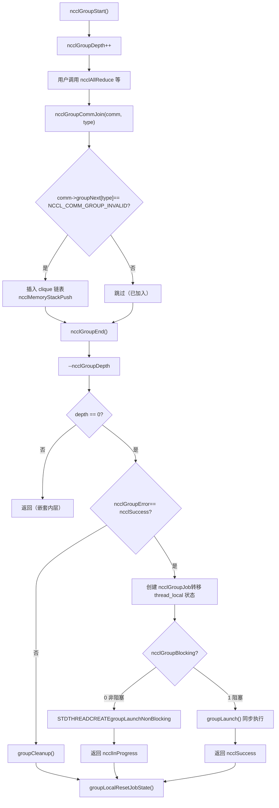
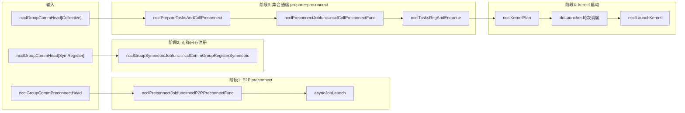

# 第 7 章：任務排程器：task_sched 如何編排多 channel 與 kernel 的執行順序

上一章我們把 ncclAllReduce 一路追到了 ncclTaskColl——任務描述物件已經躺在 comm->planner 裡了。但任務描述只是「工單」，還沒變成 GPU 上真正跑的 kernel。這一章要回答三個問題：多次 API 呼叫怎麼被攢起來一起提交？攢起來的任務怎麼被切到多個 channel 上？多個 kernel 之間的順序和依賴靠什麼保證？先給一個整體心智模型。把 NCCL 想像成一家餐廳：ncclGroupStart/ncclGroupEnd 是「購物車」，使用者把好幾道菜（多次集合通訊呼叫）丟進購物車；ncclGroupEnd 是「下單」，廚房才開始按訂單做菜。而 doLaunches 是「傳菜調度員」，它決定哪幾道菜先上、哪幾道菜可以並行做。沒有 group 語義，每道菜單獨下單，廚房每做一道就要重新點火（啟動 kernel），開銷巨大；沒有 doLaunches 的輪次調度，多 channel 的 kernel 會亂序啟動，導致資料依賴被破壞。

# 一、Group 語義的全域狀態：thread_local 變數與「購物車」模型

## 直覺模型

`ncclGroupStart`和`ncclGroupEnd`之間的所有通訊呼叫，不會立即啟動 kernel，而是被「攢」起來。攢在哪裡？攢在**執行緒局部（thread_local）**的全域變數裡。為什麼是 thread_local？因為 NCCL 假設同一個執行緒內的 group 呼叫是串行的，不同執行緒各自有獨立的購物車，互不干擾。如果這些狀態是全域變數而非 thread_local，兩個執行緒同時呼叫`ncclGroupStart`就會互相踩踏，導致一個執行緒的任務被另一個執行緒的`ncclGroupEnd`提交——這是災難性的。

## 資料結構與記憶體佈局

先看 group 的全域狀態定義。

[FACT:src/group.cc:34-34]

```cpp
thread_local int ncclGroupDepth = 0; // depth of ncclGroupStart nesting
thread_local ncclResult_t ncclGroupError = ncclSuccess;
thread_local struct ncclComm* ncclGroupCommHead[ncclGroupTaskTypeNum] = {nullptr};
thread_local struct ncclComm* ncclGroupCommPreconnectHead = nullptr;
thread_local struct ncclIntruQueue ncclAsyncJobs;
thread_local int ncclGroupBlocking = -1; /* default mode */
```

逐個欄位拆解：

- **`ncclGroupDepth`**：嵌套深度。`ncclGroupStart`可以嵌套呼叫（雖然不常見），每次`ncclGroupStart`加一，`ncclGroupEnd`減一。只有減到 0 時才真正提交。這就像購物車可以嵌套——你在一個購物車裡又開了一個子購物車，只有最外層結算時才真正下單。
- **`ncclGroupError`**：group 內任意一次呼叫出錯，錯誤被記錄在這裡，`ncclGroupEnd`時統一處理。這避免了「一次呼叫失敗後，後續呼叫還在往購物車裡加東西」的不一致狀態。
- **`ncclGroupCommHead[ncclGroupTaskTypeNum]`**：按任務類型分組的通訊域鏈結串列頭。`ncclGroupTaskTypeNum`是任務類型數量（集合通訊、原始任務、管理任務、對稱註冊等）。每個類型一條鏈結串列，鏈結串列節點是`ncclComm`，透過`comm->groupNext[type]`串聯。為什麼按類型分？因為不同類型的任務提交時機和依賴關係不同——集合通訊任務需要先 preconnect，管理任務（如 destroy）需要最後執行。
- **`ncclGroupCommPreconnectHead`**：需要預連接的通訊域鏈結串列。預連接是「提前把網路連接建好」，避免在 kernel 啟動時才建連接導致延遲。
- **`ncclAsyncJobs`**：非同步任務佇列。有些任務（如`ncclCommInitRank`）是非同步的，它們被放進這個佇列，在`ncclGroupEnd`時統一啟動。
- **`ncclGroupBlocking`**：阻塞模式標誌。`-1`表示還沒確定，`0`表示非阻塞，`1`表示阻塞。同一個 group 內不允許混用阻塞和非阻塞通訊域，否則報錯。

這裡有個關鍵設計：`ncclGroupCommHead`是**陣列**，每個元素是一條鏈結串列。鏈結串列節點透過`comm->groupNext[type]`串聯，而不是用獨立的鏈結串列節點結構。這意味著`ncclComm`結構體裡必須預留`groupNext`陣列欄位。這種「侵入式鏈結串列」的設計避免了額外的記憶體分配，但代價是`ncclComm`結構體變大。

## 場景驅動的 Step-by-Step Walkthrough

**場景**：使用者呼叫`ncclGroupStart()`，然後連續呼叫兩次`ncclAllReduce`（分別針對兩個不同的通訊域 commA 和 commB），最後呼叫`ncclGroupEnd()`。

**第一步：`ncclGroupStart`做了什麼？**

[FACT:src/include/group.h:63-66]

```cpp
inline ncclResult_t ncclGroupStartInternal() {
  ncclGroupDepth++;
  return ncclSuccess;
}
```

極其簡單：深度加一。沒有記憶體分配，沒有鎖，沒有系統呼叫。這就是為什麼`ncclGroupStart`幾乎零開銷。

**第二步：`ncclAllReduce`在 group 內被呼叫時發生了什麼？**

`ncclAllReduce`內部會呼叫`ncclGroupCommJoin(comm, ncclGroupTaskTypeCollective)`，把通訊域加入 group 鏈結串列。

[FACT:src/include/group.h:80-116]

```cpp
inline void ncclGroupCommJoin(struct ncclComm* comm, int type) {
  if (comm->groupNext[type] == reinterpret_cast(NCCL_COMM_GROUP_INVALID)) {
    // Insert comm into ncclGroupCommHead adjacent to sibling comms. This preserves
    // the users program order yet insures siblings occur consecutively. This
    // is required by doLaunches() in "group.cc".
    struct ncclComm** pp = &ncclGroupCommHead[type];
    while (*pp != nullptr && comm->intraComm0 != (*pp)->intraComm0) pp = &(*pp)->groupNext[type];

    // didn't find its clique, we need to insert it with ascending order based on commHash
    if (*pp == nullptr) {
      pp = &ncclGroupCommHead[type];
      while (*pp != nullptr && (*pp)->commHash commHash) pp = &(*pp)->groupNext[type];
    }
    comm->groupNext[type] = *pp;
    *pp = comm;
    // Comms gets a new memory stack scope upon joining. Each task batched for
    // this comm is allocated there.
    if (type == ncclGroupTaskTypeCollective || type == ncclGroupTaskTypeRawTask) {
      // Initialize planner
      ncclMemoryStackPush(&comm->memScoped);
      ncclKernelPlanner::Peer* tmp = comm->planner.peers;
      ncclIntruQueue* tmpRmaQueues = comm->planner.rmaTaskQueues;
      int numRmaCtx = comm->config.numRmaCtx;
      memset(&comm->planner, 0, sizeof(comm->planner));
      comm->planner.peers = tmp;
      comm->planner.bcast_info.minBcastPeer = INT_MAX;
      comm->planner.bcast_info.maxBcastPeer = INT_MIN;
      comm->planner.rmaTaskQueues = tmpRmaQueues;
      if (comm->planner.rmaTaskQueues != NULL) {
        for (int i = 0; i planner.rmaTaskQueues[i]);
        }
      }
    }
  }
  ncclGroupBlocking = comm->config.blocking;
}
```

這段程式碼有幾個精妙之處：

1. **冪等性檢查**：`if (comm->groupNext[type] == NCCL_COMM_GROUP_INVALID)`確保同一個通訊域在同一個 group 內只被加入一次。如果使用者對同一個 comm 呼叫了兩次`ncclAllReduce`，第二次不會重複加入鏈結串列，但任務會被追加到`comm->planner`裡。

2. **clique 排序**：`intraComm0`是「全域實體」的標識。多個通訊域如果屬於同一個全域實體（比如透過`ncclCommSplit`分裂出來的），它們的`intraComm0`相同，被稱為一個 clique。程式碼先按`intraComm0`找到 clique，把 comm 插入到同 clique 的兄弟節點旁邊。如果沒找到 clique，就按`commHash`升序插入。這個排序是為了`doLaunches`能正確處理 clique 內的 barrier 同步。

3. **記憶體堆疊作用域**：`ncclMemoryStackPush(&comm->memScoped)`為這個 comm 在 group 內分配一個新的記憶體堆疊作用域。所有為這個 comm 分配的任務（`ncclTaskColl`等）都從這個堆疊上分配。`ncclGroupCommLeave`時會`ncclMemoryStackPop`一次性釋放所有任務記憶體——這是「批量分配、批量釋放」的經典優化，避免了每個任務單獨`malloc/free`的開銷。

4. **planner 重置**：`memset(&comm->planner, 0, sizeof(comm->planner))`清空 planner，但保留了`peers`和`rmaTaskQueues`指標（先存到臨時變數，memset 後再恢復）。為什麼要保留？因為這兩個是預分配的陣列，不需要每次重新分配。`bcast_info`的 min/max 被重置為`INT_MAX/INT_MIN`，用於後續 broadcast 任務的合併優化。

**第三步：`ncclGroupEnd`做了什麼？**

[FACT:src/group.cc:1039-1164]

`ncclGroupEndInternal`是核心。逐段解析：

[FACT:src/group.cc:1048-1061]

```cpp
if (ncclGroupDepth == 0) {
  WARN("ncclGroupEnd: not in a group call.");
  ret = ncclInvalidUsage;
  goto exit;
}
// ...
if ((--ncclGroupDepth) > 0) goto exit;
```

先檢查深度，然後減一。如果減一後還大於 0，說明還在嵌套的內層 group 裡，直接返回，不提交。只有減到 0 才繼續。

[FACT:src/group.cc:1063]

```cpp
if ((ret = ncclGroupError) != ncclSuccess) goto fail;
```

如果 group 內任何一次呼叫出過錯，直接跳到 fail 清理。

[FACT:src/group.cc:1084-1093]

```cpp
NEW_NOTHROW_GOTO(groupJob, ncclGroupJob, ret, fail);
ncclIntruQueueConstruct(&groupJob->asyncJobs);
groupJob->groupRefCount = 0;
groupJob->nonBlockingInit = false;
memcpy(groupJob->groupCommHead, ncclGroupCommHead, sizeof(ncclGroupCommHead));
groupJob->groupCommPreconnectHead = ncclGroupCommPreconnectHead;
groupJob->groupError = ncclSuccess;
groupJob->abortFlag = false;
groupJob->joined = false;
ncclIntruQueueTransfer(&groupJob->asyncJobs, &ncclAsyncJobs);
```

建立一個`ncclGroupJob`，把 thread_local 的 group 狀態「轉移」到 job 物件裡。`ncclIntruQueueTransfer`把`ncclAsyncJobs`佇列整體轉移到`groupJob->asyncJobs`。這一步很關鍵：thread_local 狀態是「臨時」的，job 物件是「持久」的，可以被非同步執行緒持有。

[FACT:src/group.cc:1095-1147]

```cpp
if (hasCommHead || !ncclIntruQueueEmpty(&groupJob->asyncJobs) || ncclGroupCommPreconnectHead != nullptr) {
  /* make sure ncclGroupBlocking has been set. */
  if (ncclGroupBlocking != 0 && ncclGroupBlocking != 1) {
    WARN("Invalid group blocking state %d", ncclGroupBlocking);
    ret = ncclInternalError;
    goto fail;
  }
  if (ncclGroupBlocking == 0) {
    /* nonblocking group */
    // ... 设置 async error 为 ncclInProgress，创建线程执行 groupLaunchNonBlocking
    groupJob->base.func = groupLaunchNonBlocking;
    STDTHREADCREATE_GOTO(groupJob->base.thread, ncclAsyncJobMain, ret, fail, &groupJob->base);
    groupJob->nonBlockingInit = true;
    ret = ncclInProgress;
  } else {
    /* blocking group */
    int savedDev;
    CUDACHECKGOTO(cudaGetDevice(&savedDev), ret, fail);
    NCCLCHECKGOTO(groupLaunch(&groupJob->base, internalSimInfoPtr), ret, fail);
    CUDACHECKGOTO(cudaSetDevice(savedDev), ret, fail);
    if (simInfo) memcpy((void*)simInfo, (void*)internalSimInfoPtr, realSize);
    delete groupJob;
  }
} else {
  // Free when not needed (single rank case)
  delete groupJob;
}
```

阻塞模式：直接在當前執行緒呼叫`groupLaunch`，同步完成。非阻塞模式：建立一個執行緒執行`groupLaunchNonBlocking`，立即返回`ncclInProgress`。使用者後續透過`ncclCommGetAsyncError`查詢進度。

注意`cudaGetDevice`/`cudaSetDevice`的保存和恢復：`groupLaunch`內部會切換 CUDA 裝置（因為不同 comm 可能在不同 GPU 上），執行完後恢復使用者原來的裝置。這是防止「NCCL 內部切換裝置後沒切回來」導致使用者後續 CUDA 呼叫跑錯裝置。

## 設計思考與生產踩坑

**坑 1：阻塞和非阻塞通訊域混用**。`ncclAsyncLaunch`裡有檢查：

[FACT:src/group.cc:55-64]

```cpp
/* check if there are blocking and nonblocking comms at the same time in group. */
if (comm->destroyFlag) {
  ncclGroupBlocking = 1;
} else if (ncclGroupBlocking == -1) {
  /* first met communicator */
  ncclGroupBlocking = comm->config.blocking;
} else if (ncclGroupBlocking != comm->config.blocking) {
  WARN("Blocking and nonblocking communicators are not allowed in the same group.");
  ret = ncclInvalidArgument;
}
```

為什麼不允許混用？因為阻塞 group 在當前執行緒同步執行，非阻塞 group 在獨立執行緒非同步執行。如果混用，無法確定`ncclGroupEnd`應該同步返回還是返回`ncclInProgress`。生產環境中，如果使用者不小心把阻塞和非阻塞 comm 放進同一個 group，會收到`ncclInvalidArgument`，但此時 group 狀態已經被污染，必須重新`ncclGroupStart`。

**坑 2：`ncclGroupError`的傳播**。如果 group 內某次呼叫失敗，`ncclGroupError`被設定，`ncclGroupEnd`會跳到 fail 分支執行`groupCleanup`。`groupCleanup`會遍歷所有 comm，釋放 planner 裡的 plan 記憶體、重置 planner、清理 rawTaskQueue。如果這一步沒做乾淨，下次`ncclGroupStart`時 planner 裡殘留舊資料，會導致任務重複提交或記憶體洩漏。

[FACT:src/group.cc:514-607]

```cpp
static void groupCleanup(struct ncclComm** groupCommHeadPtr,
                         struct ncclIntruQueue* asyncJobsPtr,
                         ncclResult_t error) {
  struct ncclComm* comm;
  for (int type = 0; type groupNext[type];
      (void)ncclGroupCommLeave(comm, type);
      // We don't know if preconnect succeeded or happened at all, so clear
      // the flags that let `taskAppend()` skip over checking if preconnect
      // is needed.
      if (type == ncclGroupTaskTypeCollective || type == ncclGroupTaskTypeRawTask) {
        comm->preconnectNext = reinterpret_cast(0x1);
        for (int i = 0; i nRanks; i++) {
          comm->connectSend[i] = 0UL;
          comm->connectRecv[i] = 0UL;
        }
        // Reclaim abandoned kernel plan memory.
        while (!ncclIntruQueueEmpty(&comm->planner.planQueue)) {
          struct ncclKernelPlan* plan = ncclIntruQueueDequeue(&comm->planner.planQueue);
          if (!plan->persistent) {
            while (!ncclIntruQueueEmpty(&plan->proxyOpQueue)) {
              struct ncclProxyOp* pxop = ncclIntruQueueDequeue(&plan->proxyOpQueue);
              ncclMemoryPoolFree(&comm->memPool_ncclProxyOp, pxop);
            }
            ncclMemoryPoolFree(&comm->memPool_ncclKernelPlan, plan);
          }
        }
        // Reset comm->planner to empty.
        // ...
      }
      // ...
    }
  }
  // ...
}
```

注意`comm->preconnectNext = reinterpret_cast<struct ncclComm*>(0x1)`這一行。這是一個「哨兵值」，表示「這個 comm 需要重新 preconnect」。為什麼？因為 cleanup 時不知道 preconnect 是否成功，所以強制下次重新檢查。`0x1`這個值很巧妙——它不是一個合法的指標，但可以用來做「未初始化」標記。`ncclGroupCommPreconnect`裡檢查`if (comm->preconnectNext == reinterpret_cast<struct ncclComm*>(0x1))`來判斷是否需要加入 preconnect 鏈結串列。

---

# 二、任務準備：`ncclPrepareTasks`如何把任務描述變成可排程單元

## 直覺模型

`ncclPrepareTasks`是「備菜」環節。購物車裡的菜（任務描述）還是生的，需要先洗切配（確定演算法、協議、channel 切分），才能下鍋（啟動 kernel）。如果跳過這一步直接啟動 kernel，kernel 不知道資料怎麼切、走哪條路，會直接崩潰。

## 場景驅動的 Step-by-Step Walkthrough

`ncclPrepareTasks`在`groupLaunchLegacy`裡被呼叫：

[FACT:src/group.cc:705-746]

```cpp
static ncclResult_t ncclPrepareTasksAndCollPreconnect(
  struct ncclComm* comm, ncclSimInfo_t* simInfo,
  struct ncclIntruQueue* asyncCollJobs) {
  if (ncclParamSingleProcMemRegEnable()) {
    // 单进程内存注册模式：把 prepare 和 preconnect 合并成一个异步 job
    struct ncclPrepareTasksAndCollPreconnectJob* job;
    NEW_NOTHROW(job, ncclPrepareTasksAndCollPreconnectJob);
    job->base.func = ncclPrepareTasksAndCollPreconnectFunc;
    // ...
    ncclIntruQueueEnqueue(asyncCollJobs, &job->base);
  } else {
    bool needConnect = false;
    bool algoNeedConnect[NCCL_NUM_ALGORITHMS];
    memset(algoNeedConnect, 0, sizeof(bool) * NCCL_NUM_ALGORITHMS);

    CUDACHECK(cudaSetDevice(comm->cudaDev));
    NCCLCHECK(ncclPrepareTasks(comm, algoNeedConnect, &needConnect, simInfo));

    if (comm->cuMemSupport && needConnect) {
      // 创建 preconnect job
      struct ncclPreconnectJob* job;
      NEW_NOTHROW(job, ncclPreconnectJob);
      job->base.func = ncclCollPreconnectFunc;
      // ...
      ncclIntruQueueEnqueue(asyncCollJobs, &job->base);
    }
  }
  return ncclSuccess;
}
```

`ncclPrepareTasks`的輸出是兩個東西：`algoNeedConnect`陣列（哪些演算法需要建立連線）和`needConnect`旗標（是否需要連線）。如果`needConnect`為真且支援 cuMem，就建立一個 preconnect job 非同步執行。

`ncclPrepareTasks`內部做了什麼？它遍歷`comm->planner`裡的任務，對每個任務確定演算法和協議，然後呼叫`taskAppend`把任務追加到 planner 的 plan 裡。這部分邏輯在上一章已經展開，這裡不再重複。

關鍵點：`ncclPrepareTasks`是**按 comm 逐個呼叫**的，但 preconnect 是**按 clique 批次執行**的。為什麼？看`groupLaunchLegacy`裡的註解：

[FACT:src/group.cc:818-834]

```cpp
do {
  // We need to preconnect connections for collectives clique by clique to avoid
  // race condition for split shared comms which can connect the same connections
  // at the same time.
  comm = cliqueHead;
  do {
    NCCLCHECKGOTO(ncclPrepareTasksAndCollPreconnect(comm, simInfo, &asyncCollJobs), ret, fail);
    comm = comm->groupNext[ncclGroupTaskTypeCollective];
  } while (comm != nullptr && comm->intraComm0 == cliqueHead->intraComm0);
  // connect
  NCCLCHECKGOTO(asyncJobLaunch(&asyncCollJobs, groupAbortFlag), ret, fail);
  // ...
  cliqueHead = comm;
} while (cliqueHead != nullptr);
```

註解說得很清楚：**按 clique 逐個 preconnect，避免 split shared comms 同時連接同一組連線導致競態**。如果兩個 comm 是從同一個父 comm split 出來的，它們可能共享一些連線。如果並行 preconnect，兩個執行緒可能同時嘗試建立同一個連線，導致重複連線或連線狀態不一致。按 clique 串行執行，保證同一時刻只有一個 clique 在建立連線。

## 並發控制與底層互動

`asyncJobLaunch`是非同步任務啟動的核心：

[FACT:src/group.cc:609-678]

```cpp
static ncclResult_t asyncJobLaunch(struct ncclIntruQueue* asyncJobsMain,
                                   volatile bool* groupAbortFlag) {
  ncclResult_t ret = ncclSuccess;
  bool jobsDone = false;
  bool errorJobAbortFlag = false;

  if (!ncclIntruQueueEmpty(asyncJobsMain)) {
    struct ncclAsyncJob* job = ncclIntruQueueHead(asyncJobsMain);
    if (job->next == nullptr) {
      // 只有一个 job，直接在当前线程执行，避免线程创建开销
      job->isThreadMain = true;
      ncclAsyncJobMain(job);
      job->state = ncclGroupJobJoined;
      return job->result;
    }
    // 多个 job，每个创建一个线程
    do {
      STDTHREADCREATE(job->thread, ncclAsyncJobMain, job);
      job = job->next;
    } while (job != nullptr);

    do {
      jobsDone = true;
      job = ncclIntruQueueHead(asyncJobsMain);
      do {
        ncclGroupJobState_t state = COMPILER_ATOMIC_LOAD(&job->state, std::memory_order_acquire);
        if (state == ncclGroupJobRunning) {
          jobsDone = false;
        } else if (state == ncclGroupJobDone) {
          int err;
          if ((err = ncclThreadJoin(job->thread)) != ncclSuccess) {
            WARN("asyncJobLaunch: failed to join thread for job");
            ret = ncclSystemError;
          }
          job->state = ncclGroupJobJoined;
          if (job->result != ncclSuccess && ret == ncclSuccess) {
            ret = job->result;
            errorJobAbortFlag = true;
          }
        } else {
          // safety check
          if (state != ncclGroupJobJoined) {
            WARN("Async job state is %d, expected %d", state, ncclGroupJobJoined);
            if (ret == ncclSuccess) ret = ncclInternalError;
            errorJobAbortFlag = true;
          }
        }

        if (!job->destroyFlag &&
            (COMPILER_ATOMIC_LOAD(groupAbortFlag, std::memory_order_acquire) || errorJobAbortFlag == true)) {
          COMPILER_ATOMIC_STORE(job->abortFlag, uint32_t(1), std::memory_order_release);
          COMPILER_ATOMIC_STORE(job->abortFlagDev, uint32_t(1), std::memory_order_release);
          if (job->childAbortFlag) {
            COMPILER_ATOMIC_STORE(job->childAbortFlag, uint32_t(1), std::memory_order_release);
            COMPILER_ATOMIC_STORE(job->childAbortFlagDev, uint32_t(1), std::memory_order_release);
          }
        }

        job = job->next;
      } while (job != nullptr);
      // Let preconnect threads progress.
      if (jobsDone == false) std::this_thread::sleep_for(std::chrono::microseconds(1));
    } while (jobsDone == false);

    if (ret != ncclSuccess) goto fail;
  }

exit:
  return ret;
fail:
  goto exit;
}
```

這段程式碼有幾個關鍵設計：

1. **單 job 最佳化**：如果佇列裡只有一個 job，不建立執行緒，直接在當前執行緒執行。這避免了執行緒建立和 join 的開銷。對於單 comm 的 group，這是常見情況。

2. **原子狀態機**：`job->state`是一個原子變數，有三個狀態：`ncclGroupJobRunning`、`ncclGroupJobDone`、`ncclGroupJobJoined`。工作執行緒執行完後用`COMPILER_ATOMIC_STORE(..., std::memory_order_release)`設定為`Done`；主執行緒用`COMPILER_ATOMIC_LOAD(..., std::memory_order_acquire)`讀取。release/acquire 配對保證了工作執行緒的所有記憶體寫入對主執行緒可見。

3. **忙等待 + 微睡眠**：主執行緒輪詢所有 job 的狀態，如果還有 job 在跑，`sleep_for(1us)`後繼續輪詢。為什麼用 1 微秒而不是條件變數？因為 preconnect 是短任務（通常幾十微秒到幾毫秒），條件變數的喚醒開銷可能比忙等待還大。1 微秒的睡眠避免了純自旋導致的 CPU 浪費。

4. **錯誤傳播與 abort**：如果任何一個 job 失敗，`errorJobAbortFlag`被設定，後續所有 job 的`abortFlag`被原子設定為 1。工作執行緒在執行過程中會檢查`abortFlag`，如果發現被 abort，提前退出。這是「快速失敗」機制，避免一個 job 失敗後其他 job 還在傻跑。

## Mermaid 圖：group 提交的控制流



---

# 三、`doLaunches`：多 channel 多 kernel 的輪次調度

## 直覺模型

`doLaunches`是「傳菜調度員」。廚房（GPU）有多個灶台（channel），每道菜（kernel plan）需要按順序上。但不同 comm 的菜可能可以並行上，同一個 comm 的菜必須按順序上。調度員要保證：同一個 clique 內的 comm 同步推進（用 barrier），不同 clique 之間可以獨立推進。

## 資料結構與記憶體佈局

`doLaunches`的核心資料結構是`ncclKernelPlan`和`comm->planner.unlaunchedPlansHead`。

[FACT:src/group.cc:427-503]

```cpp
ncclResult_t doLaunches(struct ncclComm* head, int taskType) {
  ncclResult_t result = ncclSuccess;
  struct ncclComm* cliqueHead = head;
  struct ncclComm* cliqueNextHead;
  bool useBarrier = ncclParamLaunchMode == ncclLaunchModeGroup;
  // This outer loop iterates over cliques of comms which are siblings of the
  // same global entity. We calculate a clique as all comms which have the same
  // `intraComm0` value.
  do {
    struct ncclComm* comm = cliqueHead;
    bool capturingYes = false, capturingNo = false;
    do {
      (ncclCudaGraphValid(comm->planner.capturingGraph) ? capturingYes : capturingNo) = true;
      CUDACHECKGOTO(cudaSetDevice(comm->cudaDev), result, failure);
      NCCLCHECKGOTO(ncclLaunchPrepare(comm), result, failure);
      if (useBarrier) ncclCommIntraBarrierIn(comm, 1);
      comm = comm->groupNext[taskType];
    } while (comm != nullptr && comm != reinterpret_cast(NCCL_COMM_GROUP_INVALID) &&
             comm->intraComm0 == cliqueHead->intraComm0);
    cliqueNextHead = comm;

    if (capturingYes && capturingNo) {
      // We have entered barriers but are aborting without leaving them. Thus
      // these comms are permanently trashed. We need a good mechanism for
      // tracking and reporting that.
      WARN("Either none or all communicators in a ncclGroup() can be CUDA graph captured.");
      result = ncclInvalidUsage;
      goto failure;
    }

    while (true) {
      // Iterate rounds of launches for clique.
      bool moreRounds = false;
      comm = cliqueHead;
      do {
        // Iterate clique members.
        struct ncclComm* next = comm->groupNext[taskType];
        if (useBarrier) {
          // Barrier reduction result tells us if this was the final round.
          moreRounds = 0 != ncclCommIntraBarrierOut(comm);
        } else {
          moreRounds |= comm->planner.unlaunchedPlansHead != nullptr;
        }
        if (moreRounds) {
          // Pop next unlaunched kernel
          struct ncclKernelPlan* plan = comm->planner.unlaunchedPlansHead;
          if (plan != nullptr) {
            comm->planner.unlaunchedPlansHead = plan->next;
            CUDACHECKGOTO(cudaSetDevice(comm->cudaDev), result, failure);
            NCCLCHECKGOTO(ncclLaunchKernelBefore_NoUncapturedCuda(comm, plan), result, failure);
            if (plan->isCeColl) {
              NCCLCHECKGOTO(ncclLaunchCeColl(comm, plan), result, failure);
            } else if (plan->isRma) {
              NCCLCHECKGOTO(ncclLaunchRma(comm, plan), result, failure);
            } else {
              NCCLCHECKGOTO(ncclLaunchKernel(comm, plan), result, failure);
            }
          }
          // Barrier reduction input indicates if we require further rounds.
          if (useBarrier) ncclCommIntraBarrierIn(comm, comm->planner.unlaunchedPlansHead != nullptr ? 1 : 0);
          if (plan != nullptr) {
            NCCLCHECKGOTO(ncclLaunchKernelAfter_NoCuda(comm, plan), result, failure);
          }
        } else {
          // Final round.
          CUDACHECKGOTO(cudaSetDevice(comm->cudaDev), result, failure);
          NCCLCHECKGOTO(ncclLaunchFinish(comm), result, failure);
        }
        comm = next;
      } while (comm != reinterpret_cast(NCCL_COMM_GROUP_INVALID) && comm != cliqueNextHead);
      if (!moreRounds) break;
    }
    cliqueHead = cliqueNextHead;
  } while (cliqueHead != nullptr && cliqueHead != reinterpret_cast(NCCL_COMM_GROUP_INVALID));
failure:
  return result;
}
```

## 場景驅動的 Step-by-Step Walkthrough

**場景**：兩個 comm（commA 和 commB）屬於同一個 clique（`intraComm0`相同），每個 comm 有 3 個 kernel plan 待啟動。

**第一層迴圈：遍歷 clique**

外層`do-while`遍歷所有 clique。`cliqueHead`是當前 clique 的第一個 comm。內層`do-while`遍歷 clique 內的所有 comm（`comm->intraComm0 == cliqueHead->intraComm0`）。

對每個 comm：

- `cudaSetDevice(comm->cudaDev)`：切換到該 comm 對應的 GPU。
- `ncclLaunchPrepare(comm)`：準備啟動，包括設定 CUDA 流、檢查資源等。
- `ncclCommIntraBarrierIn(comm, 1)`：進入 barrier，初始值為 1。

**第二層迴圈：輪次調度**

`while (true)`迴圈執行「輪次」。每一輪，clique 內每個 comm 啟動一個 kernel plan。

關鍵在`moreRounds`的計算：

- **有 barrier 模式**（`useBarrier == true`）：`moreRounds = 0 != ncclCommIntraBarrierOut(comm)`。`ncclCommIntraBarrierOut`是一個**跨 comm 的 barrier 歸約操作**。它等待 clique 內所有 comm 都呼叫了`ncclCommIntraBarrierIn`，然後返回所有輸入值的歸約結果（這裡是邏輯或）。如果任何一個 comm 還有未啟動的 plan，歸約結果為 1，`moreRounds`為 true，繼續下一輪。如果所有 comm 都沒有未啟動的 plan，歸約結果為 0，`moreRounds`為 false，進入 final round。
- **無 barrier 模式**：`moreRounds |= comm->planner.unlaunchedPlansHead != nullptr`。直接檢查每個 comm 是否還有未啟動的 plan。注意這裡用的是`|=`，只要有一個 comm 還有 plan，`moreRounds`就為 true。

為什麼需要 barrier？因為 clique 內的 comm 是「兄弟」，它們可能共享 GPU 資源或網路連接。如果一個 comm 啟動了 3 個 kernel，另一個只啟動了 1 個，先啟動完的 comm 會進入`ncclLaunchFinish`，釋放資源，而另一個 comm 還在用這些資源，導致 use-after-free。barrier 保證 clique 內所有 comm 同步推進：要麼都啟動第 N 輪，要麼都進入 final round。

**kernel 啟動分支**

[FACT:src/group.cc:477-483]

```cpp
if (plan->isCeColl) {
  NCCLCHECKGOTO(ncclLaunchCeColl(comm, plan), result, failure);
} else if (plan->isRma) {
  NCCLCHECKGOTO(ncclLaunchRma(comm, plan), result, failure);
} else {
  NCCLCHECKGOTO(ncclLaunchKernel(comm, plan), result, failure);
}
```

三種 plan 類型：

- `isCeColl`：CollNet 集合通訊（用網卡卸載做集合通訊）。
- `isRma`：RMA（Remote Memory Access）任務。
- 預設：普通 GPU kernel。

每種類型的啟動函數不同，但都遵循「Before -> Launch -> After」的模式：

- `ncclLaunchKernelBefore_NoUncapturedCuda`：啟動前準備（設定 kernel 參數、上傳到裝置等）。
- `ncclLaunchKernel`：實際啟動 kernel（`cudaLaunchKernel`）。
- `ncclLaunchKernelAfter_NoCuda`：啟動後清理（更新狀態、釋放臨時資源）。

**Final round**

當`moreRounds`為 false 時，執行`ncclLaunchFinish(comm)`。這一步做最終的清理：釋放 plan 記憶體、更新 comm 狀態、通知 proxy 執行緒等。

## 並發控制與硬體互動

`ncclCommIntraBarrierIn/Out`是 clique 內 comm 的同步原語。它的實作涉及原子操作和自旋等待。`In`把值寫入共享記憶體，`Out`等待所有 comm 都寫入後讀取歸約結果。這個 barrier 是**跨行程**的（如果 comm 在不同行程），底層可能用共享記憶體或網路。

為什麼用 barrier 而不是簡單的「檢查所有 comm 是否還有 plan」？因為「檢查」是非原子的：commA 檢查時 commB 還有 plan，commA 決定繼續；但 commB 在 commA 檢查後立即啟動完最後一個 plan，進入 final round。commA 還在啟動 kernel，commB 已經釋放了共享資源。barrier 把「檢查」和「決定」變成一個原子操作，消除了這個競態。

## 生產避坑指南

**坑 1：CUDA graph capture 混用**。

[FACT:src/group.cc:448-455]

```cpp
if (capturingYes && capturingNo) {
  // We have entered barriers but are aborting without leaving them. Thus
  // these comms are permanently trashed. We need a good mechanism for
  // tracking and reporting that.
  WARN("Either none or all communicators in a ncclGroup() can be CUDA graph captured.");
  result = ncclInvalidUsage;
  goto failure;
}
```

如果 clique 內一部分 comm 在 CUDA graph capture 模式下，另一部分不在，直接報錯。註解說「these comms are permanently trashed」——因為已經進入了 barrier 但沒有退出，這些 comm 的 barrier 狀態永遠不一致，後續無法再使用。這是一個**不可恢復錯誤**，使用者必須重建通訊域。生產環境中，如果使用者混用 graph capture 和非 capture 的 comm，會收到`ncclInvalidUsage`，但更嚴重的是 comm 已經損壞。

**坑 2：`useBarrier`的配置依賴**。`useBarrier = ncclParamLaunchMode == ncclLaunchModeGroup`。如果使用者設定了`NCCL_LAUNCH_MODE=GROUP`，走 barrier 路徑；否則走非 barrier 路徑。非 barrier 路徑下，`moreRounds`用`|=`累積，但每個 comm 獨立判斷。如果 commA 還有 plan 而 commB 沒有，commB 會進入 final round 執行`ncclLaunchFinish`，而 commA 還在啟動 kernel。這在某些場景下是安全的（comm 之間沒有共享資源），但如果共享了 proxy 執行緒或網路連接，可能導致問題。所以預設推薦用 barrier 模式。

---

# 四、`groupLaunchLegacy`的完整執行鏈

## 場景驅動的 Step-by-Step Walkthrough

`groupLaunchLegacy`是阻塞模式下的完整提交流程。按順序執行：

**階段 1：P2P preconnect**

[FACT:src/group.cc:756-774]

```cpp
if (!simInfo && groupCommPreconnectHeadMain != nullptr) {
  struct ncclComm* comm = groupCommPreconnectHeadMain;
  do {
    struct ncclPreconnectJob* job;
    NEW_NOTHROW_GOTO(job, ncclPreconnectJob, ret, fail);
    job->base.func = ncclP2PPreconnectFunc;
    // ...
    ncclIntruQueueEnqueue(asyncJobsMain, (struct ncclAsyncJob*)job);
    struct ncclComm* next = comm->preconnectNext;
    comm->preconnectNext = reinterpret_cast(0x1);
    comm = next;
  } while (comm != nullptr);
}
NCCLCHECKGOTO(asyncJobLaunch(asyncJobsMain, groupAbortFlag), ret, fail);
```

對每個需要 preconnect 的 comm 建立一個`ncclP2PPreconnectFunc`job，然後批量啟動。`ncclP2PPreconnectFunc`內部呼叫`ncclTransportP2pSetup`建立 P2P 連接。

**階段 2：對稱記憶體註冊**

[FACT:src/group.cc:778-808]

```cpp
// only loop through sym alloc and register tasks
for (int type = ncclGroupTaskTypeSymRegister; type destroyFlag && job->comm && !job->comm->config.blocking &&
      groupCommHeadMain[ncclGroupTaskTypeCollective] == nullptr) {
    (void)ncclCommSetAsyncError(job->comm, ret);
  }
  if (job->destructor) job->destructor((void*)job);
}

for (int type = 0; type groupNext[type];
    // Poll for callbacks sent to us from other threads.
    if (comm->reclaimSteps == GROUP_MAX_RECLAIM_STEPS) {
      NCCLCHECKGOTO(ncclCommPollCallbacks(comm, /*waitSome=*/false), ret, fail);
      comm->reclaimSteps = 0;
    } else {
      comm->reclaimSteps++;
    }
    (void)ncclGroupCommLeave(comm, type);
    if (!comm->config.blocking) {
      (void)ncclCommSetAsyncError(comm, ret);
    }
    groupCommHeadMain[type] = next;
  }
}
```

清理非同步 job，然後遍歷所有 comm 呼叫`ncclGroupCommLeave`。注意`reclaimSteps`的計數：每`GROUP_MAX_RECLAIM_STEPS`（10）次 group 呼叫，輪詢一次 callbacks。這是為了避免每次 group 都輪詢 callbacks 的開銷，同時保證 callbacks 不會無限堆積。

## Mermaid 圖：`groupLaunchLegacy`的資料流



---

# 五、`groupLaunchEnqueueRearch`：新架構的排程器

## 直覺模型

`groupLaunchEnqueueRearch`是 NCCL 正在開發的新排程架構。它把任務準備、排程、啟動分成更細的階段，用非同步 job 佇列管理。目前排程器和啟動器模組「尚未實作」，回退到 legacy 的`doLaunches`。

[FACT:src/group.cc:991-996]

```cpp
// Schedule and launch tasks. Scheduler and launcher module of the enqueue framework
// is not yet implemented and falls back to the legacy launcher: a single phased
// doLaunches over the clique, run here on the user's thread.
if (!simInfo && groupCommHeadMain[ncclGroupTaskTypeRawTask] != nullptr) {
  NCCLCHECKGOTO(doLaunches(groupCommHeadMain[ncclGroupTaskTypeRawTask], ncclGroupTaskTypeRawTask), ret, fail);
}
```

新架構的執行流程：

1. **管理任務**：`ncclMgmtTaskJobFunc`處理`mgmtTaskQueue`裡的任務（如 destroy）。

2. **任務準備**：`ncclTaskPrepareJobFunc`呼叫`ncclTaskPrepare`。

3. **排程和啟動**：回退到`doLaunches`。

新架構用`ncclGroupJobLaunch`替代`asyncJobLaunch`，增加了更嚴格的狀態檢查：

[FACT:src/group.cc:113-116]

```cpp
} else {
  /* safety check */
  assert(state == ncclGroupJobJoined);
}
```

legacy 版本用`WARN`而不是`assert`，新架構用`assert`。這說明新架構對狀態機的正確性要求更高。

## 設計思考

新架構的動機是**解耦**：legacy 的`groupLaunchLegacy`把所有階段揉在一個函式裡，難以維護和擴展。新架構把每個階段拆成獨立的 job 類型，透過佇列串聯。但目前排程器和啟動器還沒實作，所以只是「框架先行」。

`ncclParamEnqueueRearchEnable()`控制走新架構還是 legacy：

[FACT:src/group.cc:1031-1033]

```cpp
static ncclResult_t groupLaunch(struct ncclAsyncJob* job_, ncclSimInfo_t* simInfo = NULL) {
  return ncclParamEnqueueRearchEnable() ? groupLaunchEnqueueRearch(job_, simInfo) : groupLaunchLegacy(job_, simInfo);
}
```

使用者可以透過環境變數`NCCL_ENQUEUE_REARCH_ENABLE`切換。生產環境建議保持預設（legacy），因為新架構還在開發中。

---

# 六、非阻塞 group 與非同步錯誤處理

## 場景驅動的 Step-by-Step Walkthrough

非阻塞 group 的核心是`ncclGroupJobComplete`和`ncclGroupJobAbort`：

[FACT:src/group.cc:1166-1190]

```cpp
ncclResult_t ncclGroupJobComplete(struct ncclGroupJob* groupJob) {
  ncclResult_t ret = ncclSuccess;
  if (groupJob && groupJob->nonBlockingInit) {
    if (!COMPILER_ATOMIC_EXCHANGE(&groupJob->joined, true, std::memory_order_acq_rel)) {
      ret = ncclAsyncJobComplete(&groupJob->base);
    }
    if (ncclAtomicRefCountDecrement(&groupJob->groupRefCount) == 0) {
      delete groupJob;
    }
  }
  return ret;
}

ncclResult_t ncclGroupJobAbort(struct ncclGroupJob* groupJob) {
  if (groupJob && groupJob->nonBlockingInit) {
    if (!COMPILER_ATOMIC_EXCHANGE(&groupJob->joined, true, std::memory_order_acq_rel)) {
      COMPILER_ATOMIC_STORE(&groupJob->abortFlag, true, std::memory_order_relaxed);
      ncclAsyncJobComplete(&groupJob->base);
    }
    if (ncclAtomicRefCountDecrement(&groupJob->groupRefCount) == 0) {
      delete groupJob;
    }
  }
  return ncclSuccess;
}
```

關鍵設計：

1. **`joined`原子標誌**：用`COMPILER_ATOMIC_EXCHANGE`保證只有一個執行緒能執行 join 邏輯。如果兩個執行緒同時呼叫`ncclGroupJobComplete`，只有一個會真正 join，另一個直接跳過。這防止了 double-join。

2. **引用計數**：`groupRefCount`記錄有多少個 comm 關聯到這個 group job。每個 comm 在`ncclGroupEndInternal`裡增加引用計數：

[FACT:src/group.cc:1108-1111]

```cpp
if (job->comm->groupJob == NULL) {
  job->comm->groupJob = groupJob;
  groupJob->groupRefCount++;
}
```

只有當所有 comm 都呼叫了`ncclGroupJobComplete`或`ncclGroupJobAbort`，引用計數減到 0，才刪除 group job。這保證了 group job 的生命週期覆蓋所有關聯的 comm。

3. **abort 語意**：`ncclGroupJobAbort`先設定`abortFlag`，然後 join。工作執行緒在執行過程中檢查`abortFlag`，如果發現被 abort，提前退出。這是「協作式取消」——不是強制殺死執行緒，而是讓執行緒自己檢查標誌後退出。

## 生產避坑指南

**坑 3：非阻塞 group 的錯誤查詢**。非阻塞 group 回傳`ncclInProgress`，使用者需要透過`ncclCommGetAsyncError`查詢進度。如果使用者忘記查詢，直接呼叫下一次通訊，可能遇到`ncclInProgress`錯誤。更嚴重的是，如果 group job 還在執行，使用者呼叫了`ncclCommDestroy`，會導致 use-after-free。NCCL 透過`comm->groupJob`指標和引用計數來防止這種情況：`ncclCommDestroy`會先檢查`comm->groupJob`，如果有未完成的 group job，會等待或報錯。

**坑 4：`ncclGroupJobComplete`的回傳值**。如果 group job 執行失敗，`ncclAsyncJobComplete`回傳錯誤碼。但`ncclGroupJobComplete`只在第一次呼叫時回傳這個錯誤碼，後續呼叫回傳`ncclSuccess`（因為`joined`已經是 true）。使用者必須在第一次呼叫時檢查回傳值，否則會遺失錯誤資訊。

---

# 本章小結

這一章我們拆解了 NCCL 從「任務描述」到「kernel 啟動」的完整排程鏈：

1. **Group 語意**：`ncclGroupStart/ncclGroupEnd`透過 thread_local 變數攢任務，`ncclGroupEnd`時統一提交。阻塞模式同步執行，非阻塞模式建立執行緒非同步執行。

2. **任務準備**：`ncclPrepareTasks`確定演算法/協定，`ncclPrepareTasksAndCollPreconnect`按 clique 逐個 preconnect，避免 split comms 的競態。

3. **輪次排程**：`doLaunches`按 clique 分組，用 barrier 同步 clique 內 comm，每輪啟動一個 kernel plan，直到所有 plan 啟動完畢。

4. **非同步任務**：`asyncJobLaunch`用原子狀態機和忙等待管理非同步 job，支援快速失敗和 abort。

5. **新架構**：`groupLaunchEnqueueRearch`是正在開發的新排程框架，目前回退到 legacy 的`doLaunches`。

下一章將進入 kernel 啟動的最後一哩路：`ncclLaunchKernel`如何把`ncclKernelPlan`變成 GPU 上真正執行的 kernel，以及裝置側如何讀取`DevComm`中繼資料。

# 本章思考與自測

Q1: 如果把`ncclGroupCommJoin`中的`ncclMemoryStackPush(&comm->memScoped)`去掉，會發生什麼？在什麼場景下會導致記憶體洩漏或資料損壞？

**參考解析**：`ncclMemoryStackPush`為 comm 在 group

至此，任務描述已經變成了可執行的啟動計畫：group 語意把多次 API 呼叫合併成一次提交，channel 切分把任務分配到多個執行流，doLaunches 的輪次調度則保證了 kernel 之間的順序與依賴。但計畫終究只是計畫，host 側的任務描述如何變成 GPU 上的一個 grid？下一章我們將深入 ncclLaunchKernel，看參數準備、kernel 變體選擇與 cudaLaunchKernel 呼叫，完成從 host 到 device 的最後一躍。
