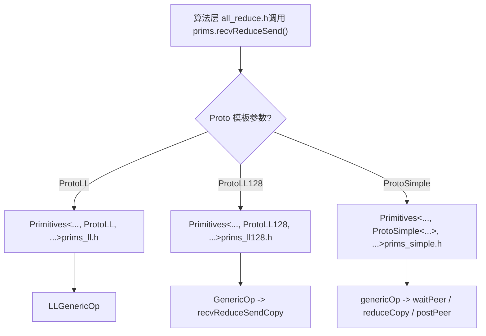
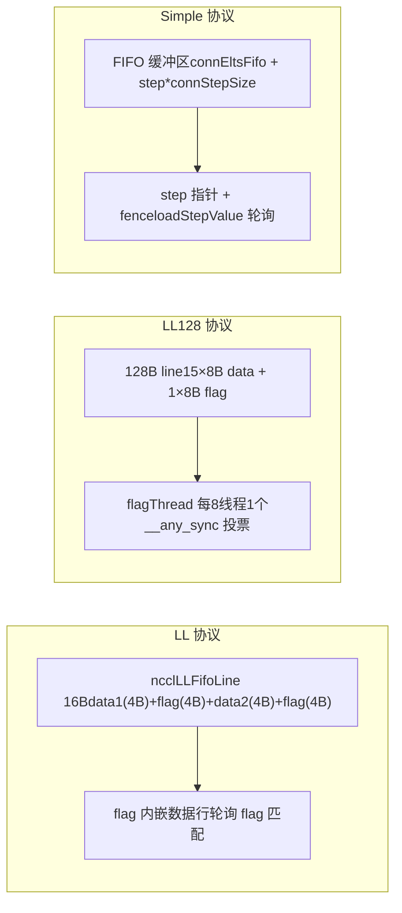

# 第 9 章：裝置端通訊原語：LL、LL128、Simple 三種協定的資料搬運實作

上一章我們追蹤了 host 側如何將一次 AllReduce 翻譯成 __global__ kernel，並看到裝置側入口 ncclKernelMain 根據演算法與協定完成分發。但分發只是選定了工具，真正決定效能的是這些工具如何執行資料搬運。本章深入 src/device 下的三套搬運原語：LL、LL128 和 Simple，逐一剖析它們的資料搬運實作，理解不同協定在延遲與頻寬之間的取捨。

# 為什麼同一份 AllReduce 需要三套搬運原語

先建立一個直覺模型。想像一條流水線工廠：原料（使用者資料）從一端進，成品從另一端出，中間有若干工位（rank）要互相交換半成品。搬運半成品的方式有三種：

- **LL（Low Latency）**：像兩個人面對面遞紙條，遞過去的同時對方就知道「這是給你的」，幾乎零握手開銷。但紙條很小，一次只能遞 8 位元組有效資料。適合小訊息。
- **LL128**：把紙條換成 128 位元組的便條紙，一次遞 120 位元組有效資料，但要求便條紙必須 16 位元組對齊擺放，否則要先在共享記憶體裡「重新排版」。適合中等訊息。
- **Simple**：像快遞櫃，先把包裹放進櫃子（FIFO 緩衝區），再發一條「第 N 號櫃有貨」的通知。握手開銷大，但一次能搬很多。適合大訊息。

> **[Design Inference & Architectural Trade-offs]**
> 如果只有一套原語會怎樣？只用 LL，大訊息會因為「每條訊息都要等對方確認 flag」而把頻寬壓死；只用 Simple，小訊息會因為「寫 FIFO + 發通知 + 等通知」的固定開銷而延遲爆炸。NCCL 的效能曲線之所以在 8KB、128KB 附近有明顯的拐點，根源就在這裡。

三套原語共享同一個模板骨架`Primitives<T, RedOp, Fan, Direct, Proto, P2p, isNetOffload>`，透過`Proto`這個模板參數特化出三個版本[FACT:src/device/primitives.h:117-117]。`ProtoLL`、`ProtoLL128`、`ProtoSimple`三個結構體各自攜帶協定相關的常數與計算方法[FACT:src/device/primitives.h:25-75]，演算法程式碼只呼叫`prims.send()`、`prims.recvReduceSend()`這類統一介面，不關心底層是哪種協定。



這張圖說明了「同一份 AllReduce 邏輯為什麼需要三套搬運原語」：演算法層是協定無關的，協定差異被封裝在`Primitives`的三個特化裡。

# LL：用 flag 內嵌在資料行裡的零握手搬運

## 直覺模型

LL 的核心思想是：**把「資料」和「資料是否就緒」的標記塞進同一個 16 位元組的讀寫單元**。接收方不需要額外的「通知訊息」，只要輪詢資料行裡的 flag 欄位，flag 匹配就說明資料到了。這就像寄信時把「收件人簽名」直接印在信封上，郵遞員一看簽名就知道該不該投遞，不需要另發一張簽收單。

如果沒有這個設計，接收方就得先等一個「資料已寫入」的通知，再回頭讀資料，兩次記憶體往返，延遲翻倍。

## 資料結構與記憶體佈局

LL 的搬運單元是`union ncclLLFifoLine`，從`storeLL`的組譯可以看出它的佈局[FACT:src/device/prims_ll.h:154-158]：

```
st.volatile.global.v4.u32 [%0], {%1,%2,%3,%4};
// 写入 4 个 u32：data1, flag, data2, flag
```

一個`ncclLLFifoLine`是 16 位元組，排布為`[data1(4B) | flag(4B) | data2(4B) | flag(4B)]`。有效資料只有 8 位元組（data1 + data2），另外 8 位元組全是 flag。這就是`ProtoLL::calcBytePerGrain()`回傳`sizeof(uint64_t)`的原因——「One 16-byte line has 8-bytes of data」[FACT:src/device/primitives.h:55-57]。

關鍵欄位（`Primitives`的 LL 特化）[FACT:src/device/prims_ll.h:20-42]：

| 欄位 | 類型 | 作用 |
| --- | --- | --- |
| `recvStep[i]` / `sendStep[i]` | `uint64_t[MaxRecv/MaxSend]` | 每個 peer 的步進計數，決定緩衝區偏移和 flag 值 |
| `recvBuff[i]` / `sendBuff[i]` | `ncclLLFifoLine*` | 指向每個 peer 的 FIFO 緩衝區基址 |
| `recvConnHeadPtr` | `volatile uint64_t*` | 接收側「已消費到第幾步」的全域指標 |
| `sendConnHeadPtr` | `volatile uint64_t*` | 發送側「對端已消費到第幾步」的全域指標 |
| `sendConnHeadCache` | `uint64_t` | 快取上次讀到的 head 值，避免每次都讀全域記憶體 |

緩衝區偏移由`recvOffset(i) = (recvStep[i] % NCCL_STEPS) * stepLines`計算[FACT:src/device/prims_ll.h:44-46]，`NCCL_STEPS`是環形緩衝區的槽位數，`stepLines`是每槽的行數。flag 值由`recvFlag(i) = NCCL_LL_FLAG(recvStep[i] + 1)`計算[FACT:src/device/prims_ll.h:56-58]，注意`+1`——因為 flag 初值是 0，第一步的 flag 必須是 1 才能和「未寫入」區分開。

## 場景驅動 Walkthrough：一次 recvReduceSend

假設 rank 0 在 Ring AllReduce 中執行`recvReduceSend`：從上一個 rank 收資料、和本地資料做 reduce、再發給下一個 rank。呼叫鏈是`recvReduceSend(inpIx, eltN)` → `LLGenericOp<1, 1, Input, -1>(inpIx, -1, eltN, false)` [FACT:src/device/prims_ll.h:403-405]。

**第一步：等待發送緩衝區可用。** `waitSend`檢查`sendConnHeadCache + NCCL_STEPS < sendConnHead + 1` [FACT:src/device/prims_ll.h:73-89]。含義是：如果對端消費進度（head）落後我太多，說明環形緩衝區快滿了，必須等。`NCCL_STEPS`是緩衝區總槽數，`sendConnHead + 1`是我即將佔用的槽位。等待時輪詢`*sendConnHeadPtr`更新快取，並週期性呼叫`checkAbort`檢查是否被 abort[FACT:src/device/prims_ll.h:73-89]。

**第二步：載入本地資料。** `DataLoader::loadBegin`處理對齊問題[FACT:src/device/prims_ll.h:200-216]。當`sizeof(T) <= 2`（比如 half 或 int8），來源位址可能不是 4 位元組對齊，所以先按 4 位元組對齊讀入`u4[0..2]`，記錄`misalign`，然後在`loadFinish`裡用`__funnelshift_r`做位元組級移位拼出正確的 64 位元值[FACT:src/device/prims_ll.h:218-225]。這是一個典型的「對齊讀 + 移位重組」技巧，避免了非對齊存取的效能懲罰。

**第三步：讀對端資料並等 flag。** `readLL`是核心[FACT:src/device/prims_ll.h:108-122]：

```cpp
do {
  asm volatile("ld.volatile.global.v4.u32 {%0,%1,%2,%3}, [%4];" ...);
  if (checkAbort(abort, 1, spins)) break;
} while ((flag1 != flag) || (flag2 != flag));
```

它用`ld.volatile.global.v4.u32`一次性讀 16 位元組（4 個 u32），然後檢查兩個 flag 欄位是否都等於期望值。`volatile`關鍵字確保編譯器不會把這個讀取最佳化掉或快取到暫存器——因為對端可能隨時寫入新資料。兩個 flag 都要匹配，是因為寫入方`storeLL`一次寫 4 個 u32，理論上可能被拆成兩次 8 位元組寫入，兩個 flag 都匹配才能保證 16 位元組完整。

**第四步：reduce 並發送。**收到 peerData 後，`applyReduce(redOp, peerData, data)`做歸約[FACT:src/device/prims_ll.h:279]。然後`storeLL(sendPtr(i) + offset, data, sendFlag(i))`把結果寫入發送緩衝區[FACT:src/device/prims_ll.h:295-296]。注意發送順序：先發`i=1..MaxSend`（通常是網路 peer），最後發`i=0`（通常是本地 peer）[FACT:src/device/prims_ll.h:291-297]。註解寫得很清楚：「Send : inter-node, then intra-node, then local」——先發慢的（網路），讓它在背景飛，再發快的（本地），這樣本地 peer 不會等網路。

**第五步：推進 step 並 post。** `incRecv(i)`遞增接收步進[FACT:src/device/prims_ll.h:91-93]，`postRecv()`把`recvConnHead`寫回全域指標[FACT:src/device/prims_ll.h:94-97]，通知對端「我已經消費了這一步」。發送側`incSend`有個特殊邏輯[FACT:src/device/prims_ll.h:99-106]：

```cpp
if ((sendStep[i] & NCCL_LL_CLEAN_MASK) == NCCL_LL_CLEAN_MASK) {
  for (int o = offset; o  *head) { ... }
}
```

在 sendrecv 的 DirectRead 模式下，發送方必須等接收方讀完資料才能返回。如果接收方因為某種原因沒有推進 tail，發送方會死鎖。這個等待必須在`barrier()`之後做，否則可能和 post 執行緒競爭。

**坑 3：`roundUp`導致的 step 跳躍。** `loadRecvConn`和`loadSendConn`裡都有`step = roundUp(step, SlicePerChunk * StepPerSlice)` [FACT:src/device/prims_simple.h:486, 533]。這會把 step 對齊到 slice 邊界，但如果上一步的 step 不是對齊的，會導致跳過的槽位沒有被正確初始化。程式碼在`loadRecvConn`裡補了一句`*connStepPtr = step`來歸還 credit[FACT:src/device/prims_simple.h:489]。

# 三套原語的對比與選型



| 維度 | LL | LL128 | Simple |
| --- | --- | --- | --- |
| 有效載荷率 | 50% | 93.75% | ~100% |
| 同步方式 | flag 內嵌，輪詢 | flagThread + warp 投票 | step 指標 + fence |
| 對齊要求 | 無（有移位重組） | 16 位元組 | 無 |
| 適用訊息大小 | 小（< 8KB） | 中（8KB ~ 128KB） | 大（> 128KB） |
| 緩衝區佈局 | `ncclLLFifoLine[]` | `uint64_t[]`按 128B line | `T[]` FIFO |
| Direct 支援 | 無（`PrimitivesWithoutDirect`降級） | 無（同左） | 完整支援 |

LL 和 LL128 都繼承`PrimitivesWithoutDirect` [FACT:src/device/prims_ll.h:9-10, src/device/prims_ll128.h:13-14]，因為它們的緩衝區佈局不支援直接讀寫對端記憶體。Simple 則完整實作了 Direct 模式，支援 P2P 直連和 NVLS。

# 設計思考

> **[Design Inference & Architectural Trade-offs]**
> **為什麼 LL 的 flag 要重複兩次？**因為 GPU 的全域記憶體寫入不保證原子性。`storeLL`寫 16 位元組，硬體可能拆成兩次 8 位元組寫。如果只放一個 flag，接收方可能在資料只寫了一半時就認為就緒。兩個 flag 分別位於 16 位元組的前半和後半，只有兩次寫都完成，兩個 flag 才會都匹配。

**為什麼 Simple 要預留一個 warp？** [FACT:src/device/prims_simple.h:625-626]註解說「For send operations, we need an extra warp to overlap the threadfence and the copy」。`fence_acq_rel_sys()`是一個昂貴的操作，如果所有執行緒都等 fence 完成再繼續，會浪費大量時間。預留一個 warp 專門做 fence，其他 warp 可以繼續搬運下一批資料。

> **[Design Inference & Architectural Trade-offs]**
> **為什麼 LL128 的 step 推進在 GenericOp 末尾而不是 recvReduceSendCopy 裡？**因為 LL128 的搬運是 warp 級的，多個 warp 可能並行處理不同的 slice。如果在`recvReduceSendCopy`裡推進 step，每個 warp 都會推進一次，導致 step 被推進多次。放在`GenericOp`末尾統一推進，確保每個 slice 只推進一次。

# 本章小結

本章深入了三套搬運原語的實作：

1. **LL**：用 16 位元組的`ncclLLFifoLine`把 flag 內嵌在資料行裡，接收方輪詢 flag 匹配即可確認資料就緒。有效載荷 50%，適合小訊息。核心是`readLL`的`ld.volatile.global.v4.u32`和`storeLL`的`st.volatile.global.v4.u32`。

2. **LL128**：把 flag 集中到每 128 位元組的最後 8 位元組，有效載荷提升到 93.75%。用`flagThread`（每 8 執行緒 1 個）檢查 flag，`__any_sync`做 warp 投票。非對齊時走共享記憶體重排版。

3. **Simple**：用 FIFO 緩衝區 + step 指標通知實作大訊息高吞吐。`flags`位標誌編碼角色，`waitPeer`輪詢 step，`postPeer`更新 step 並 fence。完整支援 Direct 模式。

三套原語共享同一個模板骨架，透過`Proto`模板參數特化。演算法層只呼叫統一介面，不關心底層協定。這就是「同一份 AllReduce 邏輯為什麼需要三套搬運原語」的答案：不同訊息大小需要不同的同步策略和緩衝區佈局，三套原語分別針對小、中、大訊息最佳化。

# 本章思考與自測

Q1: 如果把`incSend`裡的 cleanup 邏輯（[FACT:src/device/prims_ll.h:99-106]）去掉，在什麼場景下會觸發資料損壞？為什麼？

**參考解析**：cleanup 邏輯在`sendStep[i] & NCCL_LL_CLEAN_MASK == NCCL_LL_CLEAN_MASK`時，把整個 slice 的所有行都用當前 flag 寫一遍（資料填 0）。如果去掉，當 step 迴繞到`NCCL_LL_CLEAN_MASK`邊界時，某些行的 flag 可能還是上一輪的值。如果上一輪的 flag 恰好等於這一輪接收方期望的 flag，接收方會誤以為資料已就緒，讀到上一輪的殘留資料。這是一個典型的 ABA 問題。觸發條件是長時間執行（step 超過`NCCL_LL_CLEAN_MASK`週期）且 flag 恰好迴繞到相同值。這類 bug 極難復現，因為需要精確的 step 對齊。

Q2：Simple 協定的解構函式中，NetRegMode 下的等待（[FACT:src/device/prims_simple.h:794-804]）和 DirectRead 下的等待（[FACT:src/device/prims_simple.h:814-824]）分別在防什麼？如果去掉其中一個，在高併發場景下會發生什麼？

**參考解析**：NetRegMode 等待的是 proxy 執行緒把`connFifo[prevStep].size`設為 -1，表示網卡已完成發送。如果去掉，下一個 kernel 可能覆蓋正在被網卡 DMA 讀取的發送緩衝區，導致網卡讀到髒資料。DirectRead 等待的是接收方推進 tail（`*tail > *head`），表示接收方已讀完直接緩衝區。如果去掉，發送方可能在接收方還沒讀完時就覆蓋了緩衝區，導致接收方讀到新資料而非舊資料。在高併發場景下，這兩個等待都是必須的，去掉任何一個都會導致資料競爭。區別是 NetRegMode 防的是「網卡讀」，DirectRead 防的是「對端 GPU 讀」。

Q3：LL128 的`loadRegsBegin`在非對齊時走共享記憶體重排版（[FACT:src/device/prims_ll128.h:115-141]），這個路徑比對齊路徑慢多少？為什麼 NCCL 不直接要求使用者緩衝區必須 16 位元組對齊？

**參考解析**：非對齊路徑多了三步：寫共享記憶體、`__syncwarp()`、從共享記憶體讀。共享記憶體的頻寬雖然高，但`__syncwarp()`是一個同步點，會阻塞 warp 直到所有執行緒完成寫入。粗略估計，非對齊路徑比對齊路徑慢 20-40%，具體取決於共享記憶體 bank 衝突情況。NCCL 不強制要求對齊，是因為使用者可能傳入任意偏移的緩衝區（比如 tensor 切片），強制對齊會限制 API 的靈活性。NCCL 的策略是「對齊時走快路徑，非對齊時走慢路徑但保證正確性」。生產環境建議使用者盡量按 16 位元組對齊分配緩衝區，以走快路徑。

至此，我們已經掌握了 LL、LL128、Simple 三種原語的資料搬運機制，它們為上層演算法提供了靈活的效能調節手段。下一章將深入集合通訊演算法核心，看 AllReduce、AllGather、ReduceScatter 等如何呼叫這些原語，以及 Ring、Tree、CollNet 等演算法如何組織資料流，最終完成端到端的集合通訊。
