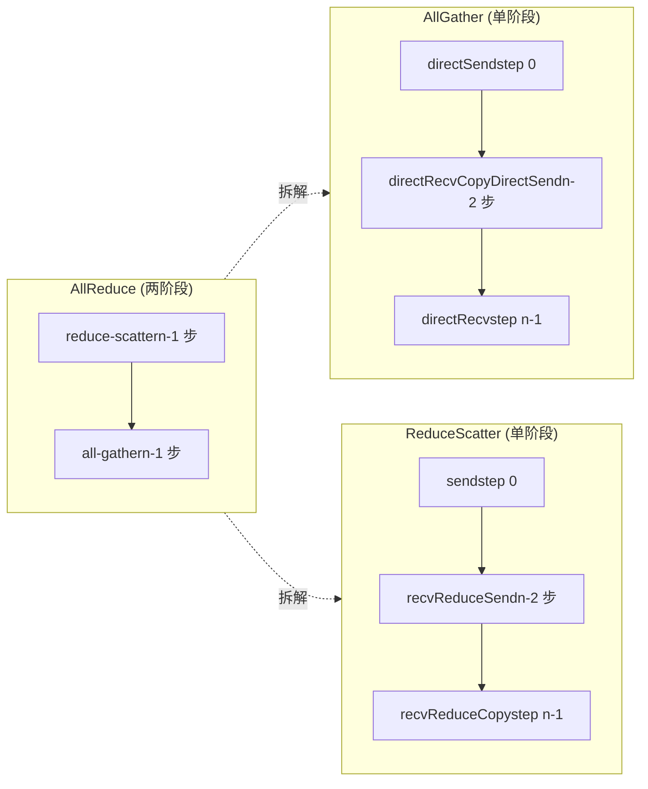
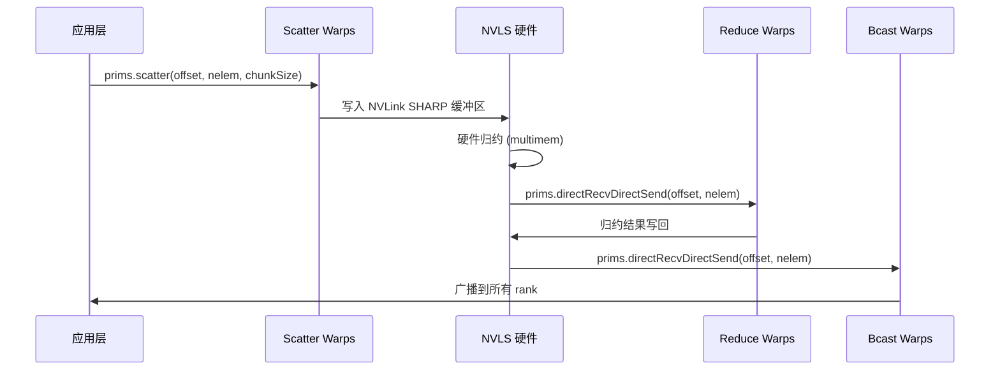

# 第 10 章：集體通訊演算法核心：AllReduce、AllGather、ReduceScatter 的裝置端實作

上一章拆解了 LL、LL128、Simple 三種協定原語，它們是資料搬運的「發動機」，但發動機本身不知道要搬什麼、往哪搬、按什麼順序搬。本章要看的 src/device 下這一組演算法核心檔案，就是「變速箱」——它們把 AllReduce、AllGather、ReduceScatter 這些集合通訊語義，翻譯成一連串 prims.directSend、prims.directRecvReduceDirectSend 這樣的原語呼叫。一句話概括本章的核心矛盾：同一個 AllReduce，為什麼需要 Ring、Tree、CollNet、NVLS 四套完全不同的裝置側實作？答案藏在「資料流拓撲」與「硬體能力」的匹配裡。Ring 用最少的網路頻寬做兩階段流水，Tree 用樹形歸約把延遲壓到 log(n)，CollNet/NVLS 則把歸約卸載到網卡或 NVLink 交換機上。本章逐個拆開看。

# 10.1 Ring AllReduce：兩階段流水如何在 kernel 內落地

## 直覺模型：環形流水線上的「接力賽」

想像 n 個工人站成一圈，每人手裡有一箱原料。AllReduce 的目標是讓每個人最終都拿到「所有原料混合後的成品」。Ring 演算法的做法分兩階段：第一階段（reduce-scatter）每人把箱子沿環傳遞，每傳一站就混入自己的原料，轉 n-1 站後每個人手裡恰好有一份「完整混合」的成品，但只有 1/n 的份額；第二階段（all-gather）這些成品份額再沿環傳一圈，每人補齊所有份額。

若沒有 Ring，最樸素的做法是每個 rank 把資料發給 root，root 歸約後再廣播——root 的網路頻寬成為瓶頸，n 越大越慢。Ring 的精妙在於：**每個 rank 的發送量和接收量都是 2(n-1)/n 倍資料量，與 n 無關地攤平到所有鏈路**。

## 資料結構與記憶體佈局

Ring 演算法的核心狀態在`ncclRing`結構裡（定義在 device.h，本章不展開），`runRing`只取其中兩個欄位：

- `ring->index`：本 rank 在環中的邏輯位置，用於計算「第 j 步該處理哪個 chunk」。
- `ring->prev` / `ring->next`：前驅和後繼 rank 編號，作為`Primitives`建構函式的 recv/send peer 參數。

關鍵的分塊參數由`ncclCollCbdPart`計算（[FACT:src/device/all_reduce.h:21-22]）：

```
ncclCollCbdPart(work, ncclShmem.channelId, Proto::Id, sizeof(T), (ssize_t*)nullptr, &gridOffset, &channelCount, &chunkCount);
```

這個函式把整個通訊域的資料按 channel 切分，輸出三個值：`gridOffset`（本 channel 負責的資料在整個 buffer 中的起始偏移）、`channelCount`（本 channel 負責的元素總數）、`chunkCount`（每個 rank 分到的 chunk 元素數）。`chunkCount`是 Ring 演算法的粒度——每一步搬運一個 chunk。

`loopCount = nranks * chunkCount`（[FACT:src/device/all_reduce.h:23]）表示「轉一整圈」處理的資料量。外層迴圈`for (elemOffset = 0; elemOffset < channelCount; elemOffset += loopCount)`（[FACT:src/device/all_reduce.h:34]）意味著：如果 channel 資料量超過一圈能處理的量，就分多圈跑。

## Step-by-Step Walkthrough：一次 Ring AllReduce 的完整呼叫流

代入場景：4 個 rank（nranks=4），本 rank 的`ringIx=0`，`chunkCount=100`，`channelCount=400`（正好一圈）。

**第 0 步：把「自己的 chunk」推給下一個 GPU**（[FACT:src/device/all_reduce.h:42-47]）

```
chunk = modRanks(ringIx + nranks - 1);   // = 3
chunkOffset = chunk * chunkCount;         // = 300
offset = gridOffset + elemOffset + chunkOffset;
nelem = min(chunkCount, remCount - chunkOffset);
prims.directSend(offset, offset, nelem);
```

`modRanks`是個 lambda，做模 nranks 的減法（[FACT:src/device/all_reduce.h:40]）。`ringIx + nranks - 1`表示「本 rank 的前一個 chunk 編號」。為什麼第 0 步發的是 chunk 3？因為 Ring 的 reduce-scatter 階段，每個 rank 先把自己「不該保留」的那份資料（即前驅 rank 的 chunk）發出去。`directSend`只發不接，因為此時還沒收到任何資料。

**第 1 到 nranks-2 步：邊收邊歸約邊轉發**（[FACT:src/device/all_reduce.h:50-56]）

```
for (int j = 2; j 计算 chunkCount/loopCount"] --> loop{"elemOffset |否| done["返回"]
    loop -->|是| s0["step 0: directSendchunk = ringIx-1"]
    s0 --> mid{"j 从 2 到 nranks-1?"}
    mid -->|是| s1["directRecvReduceDirectSendchunk = ringIx-j"]
    s1 --> mid
    mid -->|否| s2["step nranks-1directRecvReduceCopyDirectSendpostOp=true"]
    s2 --> ag{"j 从 1 到 nranks-2?"}
    ag -->|是| s3["directRecvCopyDirectSend纯转发"]
    s3 --> ag
    ag -->|否| s4["directRecv收最后一块"]
    s4 --> loop
```

## 設計思考：為什麼 Ring 的 chunk 順序是「倒著走」的

注意 chunk 編號的規律：第 0 步發`ringIx-1`，第 j 步處理`ringIx-j`，最後一步處理`ringIx+0`。這是**逆時針**推進。為什麼？因為 Ring 的每個 rank 只保留「自己負責歸約的那個 chunk」（即`ringIx+0`），其餘 chunk 都是路過。逆時針推進保證：當某個 chunk 轉完一圈回到起點時，恰好完成了 nranks 次歸約，產生最終結果。如果順時針推進，chunk 會在錯誤的 rank 上完成歸約。

## 生產踩坑：`remCount < loopCount`時的對齊陷阱

[FACT:src/device/all_reduce.h:38]有一行容易被忽略的程式碼：

```
if (remCount = 256) nthreadsSplit += 64;
} else {
  nthreadsSplit = (nthreads * 7 / (10 * WARP_SIZE)) * WARP_SIZE;
}
```

Simple 協議對半分；LL/LL128 協議按 7:3 分，因為「從 3 個來源收資料做歸約」比「發給 3 個目標」計算密集，所以歸約組多分執行緒。

然後`tid < nthreadsSplit`的執行緒做歸約上推（[FACT:src/device/all_reduce.h:175-202]），其餘執行緒做廣播下推（[FACT:src/device/all_reduce.h:203-224]）。兩組透過`Proto::MaxGroupWidth`偏移量區分各自的通訊組（[FACT:src/device/all_reduce.h:189]的`0 * Proto::MaxGroupWidth`和[FACT:src/device/all_reduce.h:210]的`1 * Proto::MaxGroupWidth`）。

## 設計思考：為什麼 Tree 的根節點要特殊處理

樹形歸約的根節點是「匯聚點」，它的接收量是子節點數倍，發送量為零（歸約階段）。如果根節點也走通用的`directRecvReduceDirectSend`，會嘗試往`tree->up`（-1）發送，導致越界。所以必須用`if (tree->up == -1)`分支單獨處理。同理葉子節點的`tree->down[0] == -1`判斷。

## 生產踩坑：Tree 演算法的「熱點根」問題

Tree 的根節點承擔了所有歸約流量，如果根節點所在 GPU 恰好是慢節點（比如 PCIe 頻寬受限），整個 AllReduce 會被拖慢。NCCL 的應對是：**每個 channel 選不同的根**，把根節點的負載分散到多個 rank。這就是為什麼`runTreeSplit`裡根節點分支用`FanSymmetric<NCCL_MAX_TREE_ARITY_TOP>`（[FACT:src/device/all_reduce.h:168]）——它要同時處理多個子節點的歸約。生產環境如果發現 Tree AllReduce 效能不均，檢查 channel 的根節點分佈是否均勻。

# 10.3 AllGather 與 ReduceScatter：Ring 的「半程」變體

## 直覺模型：AllReduce 拆成兩半

AllGather 和 ReduceScatter 本質上是 AllReduce 的兩個階段各自獨立成 API。AllGather 只做「收集」——每個 rank 貢獻一份資料，最終所有人拿到全部資料。ReduceScatter 只做「歸約+分散」——所有人貢獻資料，歸約後每人拿到一份。

若沒有這兩個獨立 API，使用者做「先歸約再收集」或「先收集再歸約」時只能調 AllReduce 再手動切片，浪費一半頻寬。

## AllGather 的 Ring 實現

`all_gather.h`的`runRing`（[FACT:src/device/all_gather.h:14-88]）比 AllReduce 簡單：沒有歸約，只有複製轉發。

**第 0 步：把自己的資料推給下一個 GPU**（[FACT:src/device/all_gather.h:51-60]）

```
rankDest = ringRanks[0];
offset = dataOffset + rankDest * count;
if ((inputBuf + dataOffset == outputBuf + offset) || isNetOffload) {
  prims.directSend(dataOffset, offset, nelem);
} else {
  prims.directCopySend(dataOffset, offset, nelem);
}
```

這裡有個 in-place 判斷：如果`inputBuf + dataOffset == outputBuf + offset`，說明輸入輸出是同一塊記憶體（in-place AllGather），直接`directSend`；否則要`directCopySend`（先拷貝到輸出再發）。

**中間 nranks-2 步：純轉發**（[FACT:src/device/all_gather.h:62-67]）

```
prims.directRecvCopyDirectSend(offset, offset, nelem);
```

**最後一步：收下最後一塊**（[FACT:src/device/all_gather.h:69-74]）

```
prims.directRecv(offset, nelem);
```

## isNetOffload：單 warp 驅動網路 + 多 warp 並行拷貝

[FACT:src/device/all_gather.h:28-36]有個特殊分支：

```
if (isNetOffload) {
  workNthreads = WARP_SIZE;
  chunkCount = NCCL_MAX_NET_SIZE;
} else {
  workNthreads = nthreads;
}
```

當`isNetOffload=true`（單 RPN + 網路註冊模式）時，只用 1 個 warp 驅動 Ring 通訊，其餘 warp 並行做「源資料拷貝到目標 buffer」（[FACT:src/device/all_gather.h:76-82]）。這是為了在非 in-place AllGather 時，把拷貝開銷和通訊開銷重疊。

最後有個`barrier_sync(14, nthreads)`（[FACT:src/device/all_gather.h:87]），註解解釋得很清楚：必須等所有 warp 完成，否則下一個 work 可能複用 outputBuf 導致競爭。用 barrier 14 是為了避開 prims 自己的 barrier 和`__syncthreads()`。

## ReduceScatter 的 Ring 實現

`reduce_scatter.h`的`runRing`（[FACT:src/device/reduce_scatter.h:14-56]）是 AllReduce 的 reduce-scatter 階段單獨抽出：

**第 0 步：把自己的資料推給下一個 GPU**（[FACT:src/device/reduce_scatter.h:39-42]）

```
rankDest = ringRanks[nranks - 1];
offset = dataOffset + rankDest * count;
prims.send(offset, nelem);
```

**中間 nranks-2 步：邊收邊歸約邊轉發**（[FACT:src/device/reduce_scatter.h:44-49]）

```
prims.recvReduceSend(offset, nelem);
```

**最後一步：收下並歸約，產生最終結果**（[FACT:src/device/reduce_scatter.h:61-64]）

```
prims.recvReduceCopy(offset, dataOffset, nelem, /*postOp=*/true);
```

注意最後一步的`recvReduceCopy`有兩個 offset：`offset`（接收源）和`dataOffset`（本地輸入），歸約結果寫入`dataOffset`。

## 資料流對比圖



## 生產踩坑：in-place 判斷的邊界

[FACT:src/device/all_gather.h:55]的 in-place 判斷`inputBuf + dataOffset == outputBuf + offset`依賴指標精確相等。如果使用者傳入的 sendbuff 和 recvbuff 有偏移但邏輯上是同一塊記憶體，這個判斷會失效，導致走`directCopySend`路徑——雖然正確但多一次拷貝。生產環境建議 in-place AllGather 時確保 sendbuff 和 recvbuff 完全一致。

# 10.4 CollNet 與 NVLS：把歸約卸載到硬體

## 直覺模型：讓「交換機」幫忙算

Ring 和 Tree 都是「GPU 自己算歸約」。CollNet 和 NVLS 換了個思路：把歸約操作卸載到網卡（CollNet）或 NVLink 交換機（NVLS）上。GPU 只負責把資料發出去，硬體完成歸約後再廣播回來。這就像從「每個工人自己混合原料」變成「把原料送到中央攪拌機，攪拌機混好再分發」。

若沒有硬體卸載，歸約操作會佔用 GPU 的 SM 資源，且歸約延遲無法隱藏。

## CollNet Direct 的執行緒分工

`RunWorkColl<ncclFuncAllReduce, ..., NCCL_ALGO_COLLNET_DIRECT, ...>`的`run`（[FACT:src/device/all_reduce.h:249-386]）把執行緒分成四組：

```
const int nThreadsScatter = WARP_SIZE + ((hasUp && hasDn) ? COLLNET_COPY_THREADS : ...);
const int nThreadsGather = ((hasUp && hasDn) ? COLLNET_COPY_THREADS : ...);
const int nThreadsBcast = WARP_SIZE + ((hasUp && hasDn) ? COLLNET_COPY_THREADS : ...);
const int nThreadsReduce = work->nWarps * WARP_SIZE - nThreadsScatter - nThreadsGather - nThreadsBcast;
```

四組執行緒分別負責：Scatter（把資料分散到各 rail）、Reduce（歸約後發給網路）、Gather（從各 rail 收集）、Bcast（從網路收到後廣播）。`COLLNET_COPY_THREADS = 96`（[FACT:src/device/all_reduce.h:250]）是固定的拷貝執行緒數。

## netRegUsed：網路註冊模式下的緩衝區佈局

[FACT:src/device/all_reduce.h:280-288]有個關鍵分支：

```
if (work->netRegUsed) {
  offsetBase = bid * chunkSize;
  maxNelems = size;
  peerOffset = nChannels * chunkSize;
} else {
  offsetBase = bid * direct->nHeads * chunkSize;
  maxNelems = direct->nHeads * chunkSize;
  peerOffset = chunkSize;
}
```

`netRegUsed`模式下，緩衝區按 channel 連續排列（`bid * chunkSize`），peer 偏移是`nChannels * chunkSize`；非註冊模式下，按 head 排列（`bid * nHeads * chunkSize`），peer 偏移是`chunkSize`。這個差異源於網路註冊模式要求緩衝區連續，以便網卡 DMA。

## NVLS 的 warp 分配

`RunWorkColl<ncclFuncAllReduce, ..., NCCL_ALGO_NVLS, ...>`的`run`（[FACT:src/device/all_reduce.h:391-523]）用更精細的 warp 分配：

```
const int bcastWarps = hasOut ? (work->regUsed ? ((totalWarps - 2) >> 1) - 1 : 2) : 0;
const int reduceWarps = work->regUsed ? (totalWarps - bcastWarps - 2) : (hasOut ? 3 : nranks regUsed ? 1 : (totalWarps - reduceWarps - bcastWarps + 1) >> 1;
const int gatherWarps = work->regUsed ? 1 : (totalWarps - reduceWarps - bcastWarps) >> 1;
```

`regUsed`模式下，scatter/gather 各只佔 1 warp（因為 NVLS 硬體直接操作註冊記憶體），reduce 佔大頭；非註冊模式下，scatter/gather 各佔約一半，reduce 根據 rank 數調整（≤6 用 7 warp，否則 5 warp）。

## 時序互動圖



## 生產踩坑：CollNet 的`direct->out == -1`陷阱

[FACT:src/device/reduce_scatter.h:521]有一行：

```
if (direct->out == -1) __trap();
```

如果 CollNet 的 out 連接未建立（-1），直接`__trap()`讓 kernel 崩潰。這是防禦性編程——CollNet 依賴網卡，如果網卡初始化失敗，out 會是 -1，此時繼續執行會導致未定義行為。生產環境如果看到 kernel trap，檢查 CollNet 網卡是否正常初始化。

# 10.5 Broadcast 與 Reduce：最簡單的兩個集合操作

## Broadcast：從 root 扇出

`broadcast.h`的`runRing`（[FACT:src/device/broadcast.h:14-64]）邏輯很直接：root 節點發資料，其他節點轉發，最後一個節點只收。

```
if (rank == root) {
  if (inputBuf == outputBuf || isNetOffload) {
    prims.directSend(offset, offset, nelem);
  } else {
    prims.directCopySend(offset, offset, nelem);
  }
} else if (nextRank == root) {
  prims.directRecv(offset, nelem);
} else {
  prims.directRecvCopyDirectSend(offset, offset, nelem);
}
```

三個分支：root 發、root 的前驅收、中間節點轉發。注意`nextRank == root`判斷的是「本節點的下一個是 root」，即本節點是環上最後一個——它只收不發。

## Reduce：向 root 匯聚

`reduce.h`的`runRing`（[FACT:src/device/reduce.h:14-53]）是 Broadcast 的逆操作：

```
if (prevRank == root) {
  prims.send(offset, nelem);
} else if (rank == root) {
  prims.recvReduceCopy(offset, offset, nelem, /*postOp=*/true);
} else {
  prims.recvReduceSend(offset, nelem);
}
```

`prevRank == root`的節點只發（它是 root 的前驅），root 只收並歸約，中間節點邊收邊歸約邊轉發。

## 設計思考：為什麼 Broadcast/Reduce 也用 Ring

Broadcast 和 Reduce 理論上可以用 Tree 實現更低延遲，但 NCCL 選擇 Ring 是因為：**這兩個操作的資料量通常較小，Ring 的實現更簡單，且能複用 AllReduce 的 Ring 程式碼路徑**。Tree 的複雜度（根節點選擇、執行緒拆分）在小訊息場景下收益不明顯。

## 生產踩坑：Broadcast 的 root 節點頻寬瓶頸

Broadcast 的 root 節點要發送全部資料，如果 root 是慢節點，整個 Broadcast 被拖慢。NCCL 的應對是：**Broadcast 也支援多 channel，每個 channel 的 root 可以不同**。但注意`work->root`是全局的，所有 channel 共享同一個 root——這是 Broadcast 的語義決定的（只有一個源）。生產環境如果 Broadcast 慢，檢查 root 節點的網路頻寬。

# 10.6 演算法選擇矩陣：RunWorkColl 模板特化

所有演算法核心透過`RunWorkColl`模板特化註冊（[FACT:src/device/all_reduce.h:228-788]）。每個特化對應「函數 × 演算法 × 協議」的組合：

| 函數 | 演算法 | 協議 | 特化位置 |
| --- | --- | --- | --- |
| AllReduce | RING | SIMPLE | [FACT:src/device/all_reduce.h:230-233] |
| AllReduce | TREE | SIMPLE | [FACT:src/device/all_reduce.h:238-244] |
| AllReduce | COLLNET_DIRECT | SIMPLE | [FACT:src/device/all_reduce.h:249-386] |
| AllReduce | NVLS | SIMPLE | [FACT:src/device/all_reduce.h:391-523] |
| AllReduce | NVLS_TREE | SIMPLE | [FACT:src/device/all_reduce.h:528-634] |
| AllReduce | COLLNET_CHAIN | SIMPLE | [FACT:src/device/all_reduce.h:639-759] |
| AllReduce | RING | LL | [FACT:src/device/all_reduce.h:764-766] |
| AllReduce | TREE | LL | [FACT:src/device/all_reduce.h:771-773] |
| AllReduce | RING | LL128 | [FACT:src/device/all_reduce.h:778-780] |
| AllReduce | TREE | LL128 | [FACT:src/device/all_reduce.h:785-787] |

注意：**CollNet 和 NVLS 只支援 SIMPLE 協定**。因為這兩種演算法依賴硬體卸載，而 LL/LL128 的低延遲同步機制與硬體卸載不相容——硬體歸約的延遲遠大於 LL 的 flag 輪詢，用 LL 反而增加開銷。

## 協定選擇的內在邏輯

- **LL**：小訊息（< 8KB），低延遲優先。Ring 和 Tree 都支援。
- **LL128**：中等訊息（8KB - 1MB），128 位元組對齊。Ring 和 Tree 都支援。
- **SIMPLE**：大訊息（> 1MB），頻寬優先。所有演算法都支援。

## 生產踩坑：協定與演算法的組合限制

如果使用者強制指定`NCCL_PROTO=LL`但演算法是 CollNet，NCCL 會在 tuning 階段回退到 SIMPLE。生產環境如果發現協定設定不生效，檢查演算法是否支援該協定。

# 設計思考：為什麼同一份 AllReduce 邏輯需要這麼多實作

回顧本章，AllReduce 有 Ring、Tree、CollNet Direct、CollNet Chain、NVLS、NVLS Tree 六種演算法實作。這不是冗餘，而是**針對不同硬體拓撲和訊息大小的最佳解**：

- **Ring**：通用，適合大訊息，頻寬利用率最高。
- **Tree**：適合大規模叢集，延遲 O(log n)。
- **CollNet**：適合有支援歸約的網卡的叢集，卸載 GPU 計算。
- **NVLS**：適合單節點 NVLink 全連接，硬體多播歸約。

NCCL 的 tuning 模組（第 5 章）會根據訊息大小、rank 數、拓撲自動選擇。裝置側的實作只需要保證「每種組合都正確」，選擇邏輯在 host 側。

# 本章小結

本章拆解了`src/device`下的六個演算法核心檔案：

1. **Ring AllReduce**（[FACT:src/device/all_reduce.h:14-83]）：兩階段流水，reduce-scatter + all-gather，每階段 n-1 步。

2. **Tree AllReduce**（[FACT:src/device/all_reduce.h:86-225]）：樹形歸約，延遲 O(log n)，`runTreeSplit`用執行緒拆分實現歸約-廣播流水。

3. **AllGather**（[FACT:src/device/all_gather.h:14-88]）：Ring 單階段，支援 in-place 和 netOffload。

4. **ReduceScatter**（[FACT:src/device/reduce_scatter.h:14-56]）：Ring 單階段，是 AllReduce 的 reduce-scatter 階段。

5. **Broadcast/Reduce**（[FACT:src/device/broadcast.h:14-64]、[FACT:src/device/reduce.h:14-53]）：最簡單的 Ring 變體。

6. **CollNet/NVLS**（[FACT:src/device/all_reduce.h:247-635]）：硬體卸載，只支援 SIMPLE 協定。

# 本章思考與自測

Q1: 在 Ring AllReduce 的 reduce-scatter 階段，第 0 步用`directSend`，中間步用`directRecvReduceDirectSend`，最後一步用`directRecvReduceCopyDirectSend`。如果去掉最後一步的`postOp=true`，在什麼場景下會產生錯誤結果？

**參考解析**：`postOp=true`觸發後置操作（如求平均時的除法）。以`ncclAvg`為例，歸約是求和，postOp 是除以 nranks。如果去掉`postOp`，最後一步只做歸約不做除法，recvbuff 裡存的是「和」而非「平均」。在 reduce-scatter 階段，每個 rank 只保留一個 chunk 的最終結果，這個 chunk 恰好是`ringIx+0`（[FACT:src/device/all_reduce.h:60]）。如果 postOp 缺失，這個 chunk 的和沒有除以 nranks，後續 all-gather 階段會把這個錯誤的「和」傳播給所有 rank。注意：只有最後一步需要 postOp，因為只有這一步產生「完整歸約」的結果；中間步的歸約是部分和，不需要 postOp。生產環境如果發現 AllReduce 結果偏大 nranks 倍，檢查 postOp 是否正確傳遞。

Q2: `runTreeSplit`在 LL/LL128 協定下把執行緒按 7:3 拆分（[FACT:src/device/all_reduce.h:163]），而 Simple 協定下按 1:1 拆分（[FACT:src/device/all_reduce.h:157]）。如果強行把 LL 協定也改成 1:1，會發生什麼？

**參考解析**：LL/LL128 的歸約組要從最多 3 個子節點收資料並做歸約（[FACT:src/device/all_reduce.h:187]的`FanAsymmetric<NCCL_MAX_TREE_ARITY, 1>`），計算密集；廣播組只做複製轉發（[FACT:src/device/all_reduce.h:208]的`FanAsymmetric<1, NCCL_MAX_TREE_ARITY>`），計算輕。7:3 拆分讓歸約組有足夠執行緒處理 3 路歸約，廣播組執行緒少但夠用。如果改成 1:1，歸約組執行緒不足，歸約成為瓶頸；廣播組執行緒過剩，浪費。更嚴重的是，LL 協定的 flag 輪詢是忙等待，執行緒多了會增加 flag 競爭。生產環境如果發現 Tree AllReduce 在 LL 協定下效能異常，檢查`nthreadsSplit`的計算是否被修改。

Q3: AllGather 的`isNetOffload`模式下，只用 1 個 warp 驅動 Ring 通訊（[FACT:src/device/all_gather.h:32]），其餘 warp 並行拷貝（[FACT:src/device/all_gather.h:76-82]）。如果去掉最後的`barrier_sync(14, nthreads)`（[FACT:src/device/all_gather.h:87]），在什麼場景下會導致資料競爭？

**參考解析**：`barrier_sync`保證所有 warp（包括通訊 warp 和拷貝 warp）都完成本 work 後才進入下一個 work。如果去掉，通訊 warp 可能在拷貝 warp 還沒寫完 outputBuf 時就開始下一個 work 的通訊，而下一個 work 可能復用同一塊 outputBuf。具體場景：連續兩次 AllGather，第一次的拷貝 warp 還在寫 outputBuf 的尾部，第二次的通訊 warp 已經開始往 outputBuf 寫新數據，導致第一次的數據被覆蓋。註釋裡說得很清楚：「otherwise, we can have contention if next work will use the outputBuf in this work」。用 barrier 14 而非默認 barrier，是為了避開 prims 內部的 barrier 和`__syncthreads()`，防止死鎖。生產環境如果發現 AllGather 結果偶發錯誤，檢查`isNetOffload`路徑的 barrier 是否被優化掉。

至此，我們已經看完了設備側算法內核如何組織數據流。每種算法都通過`Primitives`調用上一章的原語，算法層只關心「誰發給誰、發哪個 chunk、歸約還是複製」。下一章將深入傳輸層抽象，看 P2P、SHM、NET、NVLS 如何統一成一套接口，以及 host 側的 proxy 線程如何與設備側 kernel 協作完成跨機通信。

核心規律：所有算法都通過 Primitives 模板類調用原語，算法只負責「數據流拓撲」，原語負責「數據搬運」。這種分層讓新增算法只需實現拓撲邏輯，無需關心底層同步。但無論拓撲如何變化，數據最終都要通過物理鏈路傳輸。下一章將深入 src/transport 目錄，看 NCCL 如何用統一的 transport 接口屏蔽 P2P、SHM、NET、NVLS 的差異，以及每種 transport 的 setup/connect/send/recv 語義。這是理解跨機通信的基礎。
