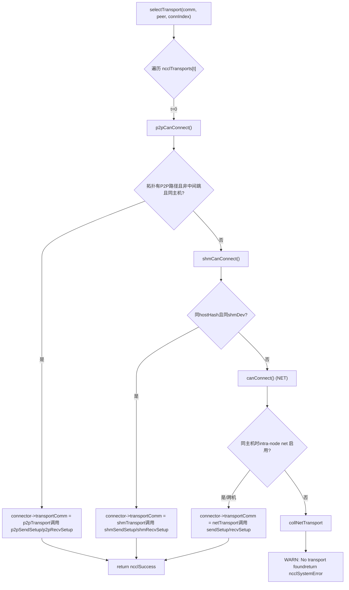
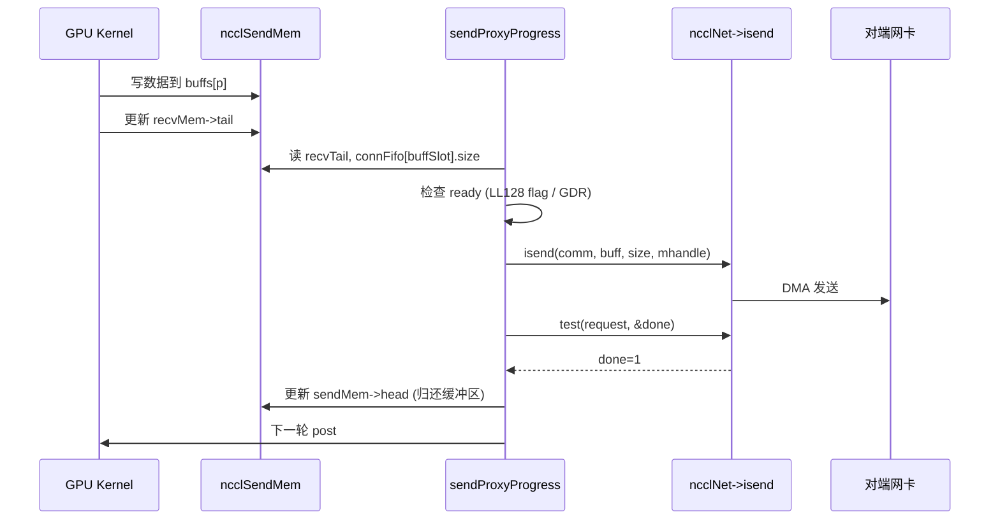

# 第 11 章：傳輸層抽象：P2P、SHM、NET、NVLS 如何統一在同一套接口下

上一章我們深入算法內核，看到 Ring AllReduce 如何將數據切分後兩階段歸約，Tree AllReduce 又如何借助樹形結構壓低延遲——但這些算法只定義了「誰發給誰、發哪個 chunk」的邏輯視圖。數據最終必須穿過真實的物理鏈路：NVLink、PCIe、共享內存或網卡。本章拆解 src/transport 目錄，看 NCCL 如何用一套統一的 ncclTransport 接口，把 P2P、SHM、NET、NVLS 四種物理通道屏蔽成同一副面孔，完成從算法拓撲到物理傳輸的最後一公里。

# 一、統一接口：ncclTransport 如何屏蔽四種物理通道

## 直覺模型

想像一家物流公司：無論客戶寄的是同城快遞（P2P）、樓內傳遞（SHM）、跨省運輸（NET）還是專線直達（NVLS），前台只填一張「運單」。這張運單就是`ncclTransport`結構體——它規定了每種運輸方式必須提供`canConnect`、`setup`、`connect`、`free`等固定動作。若沒有這層抽象，上層算法就得寫四套`if-else`判斷走哪條鏈路，新增一種硬件就要改遍所有算法。

## 數據結構與內存佈局

NCCL 用一個全局數組登記所有 transport，順序即優先級：

[FACT:src/transport.cc:15-20]

```c
struct ncclTransport* ncclTransports[NTRANSPORTS] = {
  &p2pTransport,
  &shmTransport,
  &netTransport,
  &collNetTransport,
};
```

數組順序決定選擇順序：P2P 優先，其次 SHM，再次 NET，最後 CollNet。每種 transport 由`ncclTransport`結構體描述，它包含一個`canConnect`函數指針和兩個`ncclTransportComm`（send/recv 各一個）。以 P2P 為例：

[FACT:src/transport/p2p.cc:1493-1498]

```c
struct ncclTransport p2pTransport = {"P2P",
                                     p2pCanConnect,
                                     {p2pSendSetup, p2pSendConnect, p2pSendFree, NULL, p2pSendProxySetup, NULL,
                                      p2pSendProxyFree, NULL, p2pProxyRegister, p2pProxyDeregister},
                                     {p2pRecvSetup, p2pRecvConnect, p2pRecvFree, NULL, p2pRecvProxySetup, NULL,
                                      p2pRecvProxyFree, NULL, p2pProxyRegister, p2pProxyDeregister}};
```

`ncclTransportComm`的字段順序是固定的「生命週期槽位」：`setup`（準備資源）、`connect`（交換連接信息）、`free`（釋放）、`proxySharedInit`（代理共享初始化）、`proxySetup`、`proxyConnect`、`proxyFree`、`proxyProgress`、`proxyRegister`、`proxyDeregister`。注意 P2P 的`proxyProgress`槽位是`NULL`——因為 P2P 走的是 GPU 直接讀寫對端顯存，不需要 host 代理線程搬運數據；而 NET 的`proxyProgress`是`sendProxyProgress`/`recvProxyProgress`，因為網卡 I/O 必須由 host 線程驅動。

## 場景驅動 Walkthrough：一次連接如何選中 transport

當 NCCL 需要為某個 channel 的某個 peer 建立連接時，調用`selectTransport`：

[FACT:src/transport.cc:23-44]

```c
template 
static ncclResult_t selectTransport(struct ncclComm* comm, struct ncclTopoGraph* graph, struct ncclConnect* connect,
                                    int channelId, int peer, int connIndex, int* transportType) {
  struct ncclPeerInfo* myInfo = comm->peerInfo + comm->rank;
  struct ncclPeerInfo* peerInfo = comm->peerInfo + peer;
  struct ncclConnector* connector = (type == 1) ? comm->channels[channelId].peers[peer]->send + connIndex :
                                                  comm->channels[channelId].peers[peer]->recv + connIndex;
  for (int t = 0; t send : &transport->recv;
    int ret = 0;
    NCCLCHECK(transport->canConnect(&ret, comm, graph, myInfo, peerInfo));
    if (ret) {
      connector->transportComm = transportComm;
      NCCLCHECK(transportComm->setup(comm, graph, myInfo, peerInfo, connect, connector, channelId, connIndex));
      if (transportType) *transportType = t;
      return ncclSuccess;
    }
  }
  WARN("No transport found for rank %d[%lx] -> rank %d[%lx]", myInfo->rank, myInfo->busId, peerInfo->rank,
       peerInfo->busId);
  return ncclSystemError;
}
```

`type==1`表示 send 方向，`type==0`表示 recv 方向。迴圈依次詢問每種 transport 的`canConnect`：回傳`ret=1`表示「我能幹這活」，立刻把`connector->transportComm`指向該 transport 的對應方向，並呼叫其`setup`。若所有 transport 都回傳 0，列印警告並回傳`ncclSystemError`。

`canConnect`的判定邏輯體現了各 transport 的「領地邊界」。以 P2P 為例：

[FACT:src/transport/p2p.cc:129-157]

```c
ncclResult_t p2pCanConnect(int* ret, struct ncclComm* comm, struct ncclTopoGraph* graph, struct ncclPeerInfo* info1,
                           struct ncclPeerInfo* info2) {
  initCeOperation();
  int intermediateRank;
  int isCrossClique;
  NCCLCHECK(ncclTopoCheckP2p(comm, comm->topo, info1->rank, info2->rank, ret, NULL, &intermediateRank, NULL,
                             &isCrossClique));
  if (*ret == 0) return ncclSuccess;
  if (intermediateRank != -1) {
    if (useMemcpy) *ret = 0;
    return ncclSuccess;
  }
  if (!isCrossClique) {
    int useNet = 0;
    NCCLCHECK(ncclTopoCheckNet(comm->topo, info1->rank, info2->rank, &useNet));
    if (useNet) {
      *ret = 0;
      return ncclSuccess;
    }
  }
  if (info1->hostHash != comm->peerInfo[comm->rank].hostHash || info1->hostHash != info2->hostHash) {
    return ncclSuccess;
  }
  ...
```

P2P 的判定鏈：先問拓撲「兩個 rank 之間有沒有 P2P 路徑」；如果有中間跳（`intermediateRank != -1`）且啟用了 CE memcpy，則放棄 P2P 讓給 SHM/NET；如果拓撲建議走網路（`useNet`），也放棄；最後檢查是否同主機。SHM 的判定更簡單：

[FACT:src/transport/shm.cc:61-83]

```c
static ncclResult_t shmCanConnect(int* ret, struct ncclComm* comm, struct ncclTopoGraph* graph,
                                  struct ncclPeerInfo* info1, struct ncclPeerInfo* info2) {
  *ret = 0;
  initShmLocality();
  if (ncclParamShmDisable() == 1) return ncclSuccess;
  int useNet = 0;
  NCCLCHECK(ncclTopoCheckNet(comm->topo, info1->rank, info2->rank, &useNet));
  if (useNet) return ncclSuccess;
  if (info1->hostHash != info2->hostHash) return ncclSuccess;
  if (info1->shmDev != info2->shmDev) return ncclSuccess;
  *ret = 1;
  return ncclSuccess;
}
```

SHM 要求同主機（`hostHash`相同）且共享同一塊`/dev/shm`（`shmDev`相同，用於容器間通訊）。NET 則幾乎總是回傳 1，只在同主機時檢查 intra-node net 是否被禁用：

[FACT:src/transport/net.cc:160-168]

```c
static ncclResult_t canConnect(int* ret, struct ncclComm* comm, struct ncclTopoGraph* graph, struct ncclPeerInfo* info1,
                               struct ncclPeerInfo* info2) {
  *ret = 1;
  if (info1->hostHash == info2->hostHash) {
    NCCLCHECK(ncclTopoCheckNet(comm->topo, info1->rank, info2->rank, ret));
  }
  return ncclSuccess;
}
```

NET 是「兜底」——只要前面沒人接，它就接。NVLS 的`canConnect`直接回傳 0：

[FACT:src/transport/nvls.cc:21-26]

```c
ncclResult_t nvlsCanConnect(int* ret, struct ncclComm* comm, struct ncclTopoGraph* graph, struct ncclPeerInfo* info1,
                            struct ncclPeerInfo* info2) {
  // This transport cannot be used for p2p
  *ret = 0;
  return ncclSuccess;
}
```

NVLS 不走常規的 peer-to-peer 連接路徑，它透過`ncclNvlsSetup`單獨建立多播組，所以`canConnect`永遠回傳 0。



## 設計思考

> **[Design Inference & Architectural Trade-offs]**
> 為什麼用「陣列順序 + canConnect 投票」而不是顯式路由表？ 因為拓撲是動態的：同一台機器可能因`NCCL_P2P_DISABLE`、容器隔離、CUDA IPC 可用性等因素導致 P2P 不可用，此時自動降級到 SHM 或 NET。投票機制讓每種 transport 自己判斷「我能不能幹」，新增 transport 只需在陣列裡加一項，無需改動選擇邏輯。這正是開閉原則在系統程式設計中的體現。

# 二、P2P：同機 GPU 直連的四種形態

## 直覺模型

P2P 是「鄰居之間直接遞東西」——GPU 0 直接讀寫 GPU 1 的顯存，不經過 CPU 或網卡。若沒有 P2P，同機多卡通訊就得繞道 host 記憶體，延遲翻倍、頻寬腰斬。

## 資料結構與記憶體佈局

P2P 內部有四種形態，由`enum p2pType`區分：

[FACT:src/transport/p2p.cc:19-24]

```c
enum p2pType {
  P2P_DIRECT,
  P2P_INTERMEDIATE,
  P2P_IPC,
  P2P_CUMEM
};
```

- `P2P_DIRECT`：同進程內不同 GPU，直接用指標存取（最快）。
- `P2P_INTERMEDIATE`：兩 GPU 之間沒有直連，需經中間 GPU 轉發。
- `P2P_IPC`：跨進程，用傳統`cudaIpcOpenMemHandle`匯入對端顯存。
- `P2P_CUMEM`：跨進程，用 cuMem API（`cuMemExportToShareableHandle`）匯入，支援更細粒度的記憶體管理。

核心資源結構體：

[FACT:src/transport/p2p.cc:79-94]

```c
struct p2pResources {
  enum p2pType type;
  union {
    struct ncclSendMem* sendDevMem;
    struct ncclRecvMem* recvDevMem;
  };
  void* sendMemIpc;
  int sendMemSameProc;
  void* recvMemIpc;
  int recvMemSameProc;
  // CE memcpy support
  struct p2pShmProxyInfo proxyInfo;
  struct p2pShm* shm;
  struct p2pShm* devShm;
  ncclShmIpcDesc_t desc;
};
```

`sendDevMem`/`recvDevMem`是 union——發送方只關心`sendDevMem`，接收方只關心`recvDevMem`，共用一塊記憶體。`sendMemIpc`/`recvMemIpc`保存匯入的對端記憶體句柄，`sendMemSameProc`/`recvMemSameProc`標記是否同進程（決定釋放時用`ncclCuMemFreeAddr`還是`cudaIpcCloseMemHandle`）。

連接資訊結構體`p2pConnectInfo`透過 bootstrap 交換：

[FACT:src/transport/p2p.cc:38-44]

```c
struct p2pConnectInfo {
  int rank;
  int read;
  struct ncclP2pBuff p2pBuff;
  // Used by CE memcpy
  ncclShmIpcDesc_t desc;
};
static_assert(sizeof(struct p2pConnectInfo) transportResources = resources;
  int useRead, intermediateRank;
  NCCLCHECK(p2pGetInfo(comm, myInfo, peerInfo, &useRead, &intermediateRank));
  if (useMemcpy) useRead = 0;
  ...
  int sendSize = sizeof(struct ncclSendMem);
  if (info->read) sendSize += comm->buffSizes[NCCL_PROTO_SIMPLE];
  ALIGN_SIZE(sendSize, CUDA_IPC_MIN);
  ...
```

關鍵點：`sendSize`在 P2P Read 模式下要額外加上 SIMPLE 協定緩衝區大小——因為讀模式下發送方的 SIMPLE buffer 被接收方直接讀取，必須和`ncclSendMem`一起分配在同一塊可共享記憶體裡。`ALIGN_SIZE(sendSize, CUDA_IPC_MIN)`保證大小對齊到 CUDA IPC 最小粒度。

接著根據`intermediateRank`和進程關係選擇形態：

[FACT:src/transport/p2p.cc:416-437]

```c
  if (intermediateRank == -1) {
    info->rank = myInfo->rank;
    if (P2P_SAME_PID(myInfo, peerInfo) && ncclParamP2pDirectDisable() == 0 && useMemcpy == 0) {
      resources->type = P2P_DIRECT;
      ...
    } else {
      if (ncclCuMemEnable()) {
        resources->type = P2P_CUMEM;
        ...
      } else {
        resources->type = P2P_IPC;
        ...
      }
    }
    send->conn.flags |= info->read ? NCCL_P2P_READ : NCCL_P2P_WRITE;
  } else {
    resources->type = P2P_INTERMEDIATE;
    info->rank = intermediateRank;
    ...
  }
```

`P2P_SAME_PID`巨集判斷同主機同進程：

[FACT:src/transport/p2p.cc:334-335]

```c
#define P2P_SAME_PID(MYINFO, PEERINFO) \
  ((MYINFO->hostHash == PEERINFO->hostHash) && (MYINFO->pidHash == PEERINFO->pidHash))
```

同進程且未禁用 direct 且未啟用 memcpy，就是最快的`P2P_DIRECT`——直接拿對端指標。否則走 IPC/CUMEM。

隨後透過代理執行緒分配可共享緩衝區：

[FACT:src/transport/p2p.cc:457-468]

```c
  NCCLCHECK(ncclProxyConnect(comm, TRANSPORT_P2P, 1, info->rank, &send->proxyConn));
  if (useMemcpy) {
    NCCLCHECK(ncclProxyCallBlocking(comm, &send->proxyConn, ncclProxyMsgSetup, NULL, 0, &resources->proxyInfo,
                                    sizeof(struct p2pShmProxyInfo)));
    memcpy(&info->desc, &resources->proxyInfo.desc, sizeof(ncclShmIpcDesc_t));
  } else {
    NCCLCHECK(ncclProxyCallBlocking(comm, &send->proxyConn, ncclProxyMsgSetup, &req, sizeof(struct ncclP2pRequest),
                                    &info->p2pBuff, sizeof(struct ncclP2pBuff)));
    NCCLCHECK(p2pMap(comm, &send->proxyConn, myInfo, comm->peerInfo + info->rank, &info->p2pBuff,
                     (void**)&resources->sendDevMem, &resources->sendMemIpc));
    resources->sendMemSameProc = P2P_SAME_PID(myInfo, (comm->peerInfo + info->rank));
  }
```

`ncclProxyCallBlocking`是同步 RPC：host 執行緒發訊息給代理執行緒，代理執行緒呼叫`p2pSendProxySetup`分配可共享緩衝區，把`ncclP2pBuff`（含 IPC 句柄）回傳。然後`p2pMap`把對端緩衝區映射到本地位址空間。

`p2pMap`是核心映射函式：

[FACT:src/transport/p2p.cc:349-390]

```c
static ncclResult_t p2pMap(struct ncclComm* comm, struct ncclProxyConnector* proxyConn, struct ncclPeerInfo* myInfo,
                           struct ncclPeerInfo* peerInfo, struct ncclP2pBuff* p2pBuff, void** devMem, void** ipcPtr) {
  if (P2P_SAME_PID(myInfo, peerInfo)) {
    if (peerInfo->cudaDev != myInfo->cudaDev) {
      cudaError_t err = cudaDeviceEnablePeerAccess(peerInfo->cudaDev, 0);
      ...
      if (ncclCuMemEnable()) {
        NCCLCHECK(ncclCuMemAllocAddr(devMem, &p2pBuff->ipcDesc.memHandle, p2pBuff->size));
        CUCHECK(cuMemRelease(p2pBuff->ipcDesc.memHandle));
        *ipcPtr = *devMem;
        ...
      } else {
        *devMem = p2pBuff->directPtr;
        *ipcPtr = NULL;
      }
    } else {
      *devMem = p2pBuff->directPtr;
      *ipcPtr = NULL;
    }
  } else {
    NCCLCHECK(ncclP2pImportShareableBuffer(comm, peerInfo->rank, p2pBuff->size, &p2pBuff->ipcDesc, devMem,
                                           p2pBuff->directPtr, ncclMemOffload));
    *ipcPtr = *devMem;
  }
  return ncclSuccess;
}
```

同進程不同 GPU：先`cudaDeviceEnablePeerAccess`打開 P2P 通道，然後直接用`directPtr`（因為同進程位址空間共享）。跨進程：呼叫`ncclP2pImportShareableBuffer`匯入對端記憶體句柄。

## 並發控制與硬體互動

P2P 的同步靠`ncclSendMem`/`ncclRecvMem`裡的`head`/`tail`指標。發送方寫`head`告訴接收方「我寫到哪了」，接收方寫`tail`告訴發送方「我讀到哪了」。這是典型的無鎖生產者-消費者：

[FACT:src/transport/p2p.cc:571-576]

```c
  } else {
    send->conn.tail = &remDevMem->tail;
    send->conn.head = &resources->sendDevMem->head;
    send->conn.ptrExchange = &resources->sendDevMem->ptrExchange;
    send->conn.redOpArgExchange = resources->sendDevMem->redOpArgExchange;
  }
```

`head`指向本地`sendDevMem`，`tail`指向對端`remDevMem`。GPU kernel 透過讀寫這兩個指標實現跨 GPU 同步，無需 CPU 介入。

## 生產避坑指南

**坑 1：P2P Read 與 memcpy 互斥。**看`p2pSendConnect`：

[FACT:src/transport/p2p.cc:551-559]

```c
  for (int p = 0; p read && p == NCCL_PROTO_SIMPLE) {
      /* For P2P Read the SIMPLE buffer is local (ncclSendMem) */
      if (resources->sendDevMem == NULL) return ncclInternalError; // We should not use read + memcpy
      send->conn.buffs[p] = (char*)(resources->sendDevMem + 1);
    } else {
      send->conn.buffs[p] = buff;
      buff += comm->buffSizes[p];
    }
  }
```

如果`read=1`但`sendDevMem==NULL`，直接回傳`ncclInternalError`。生產環境若看到這個錯誤，檢查是否同時設定了`NCCL_P2P_READ_ENABLE=1`和`NCCL_P2P_USE_CUDA_MEMCPY=1`——這兩者語義衝突。

**坑 2：跨進程釋放順序。** `p2pSendFree`根據`sendMemSameProc`決定釋放方式：

[FACT:src/transport/p2p.cc:624-651]

```c
ncclResult_t p2pSendFree(struct ncclComm* comm, struct ncclConnector* send) {
  struct p2pResources* resources = (struct p2pResources*)send->transportResources;
  if (resources) {
    if (ncclCuMemEnable()) {
      if (resources->sendMemIpc) {
        if (resources->sendMemSameProc) {
          NCCLCHECK(ncclCuMemFreeAddr(resources->sendMemIpc, comm->memManager));
        } else {
          NCCLCHECK(ncclCudaFree(resources->sendMemIpc, comm->memManager));
        }
      }
      ...
```

同進程用`ncclCuMemFreeAddr`（只釋放位址映射，不釋放實體記憶體），跨進程用`ncclCudaFree`（釋放實體記憶體）。搞反會導致記憶體洩漏或 use-after-free。

# 三、SHM：共享記憶體的「誰出記憶體」之爭

## 直覺模型

SHM 是「兩個行程共用一塊白板」——發送方寫，接收方讀。但白板放誰家？放發送方家（sender-side），接收方跑過來讀；還是放接收方家（receiver-side），發送方跑過去寫？這就是`NCCL_SHM_LOCALITY`參數要解決的問題。

## 資料結構與記憶體佈局

[FACT:src/transport/shm.cc:28-34]

```c
struct shmSendResources {
  struct ncclRecvMem* remHostMem;
  struct ncclRecvMem* devRemHostMem;
  ncclShmIpcDesc_t remDesc;
  struct ncclSendMem* hostMem;
  struct ncclSendMem* devHostMem;
};

struct shmRecvResources {
  struct ncclSendMem* remHostMem;
  struct ncclSendMem* devRemHostMem;
  ncclShmIpcDesc_t remDesc;
  struct ncclRecvMem* hostMem;
  struct ncclRecvMem* devHostMem;
};
```

注意`hostMem`和`devHostMem`成對出現：`hostMem`是 host 側指標，`devHostMem`是裝置側指標（透過 UVA 或 cuMem 映射）。`remHostMem`/`devRemHostMem`是對端共享記憶體的本地映射。

## 場景驅動 Walkthrough：SHM 的 locality 選擇

`shmSendSetup`根據 locality 決定分配多大記憶體：

[FACT:src/transport/shm.cc:88-119]

```c
static ncclResult_t shmSendSetup(struct ncclComm* comm, struct ncclTopoGraph* graph, struct ncclPeerInfo* myInfo,
                                 struct ncclPeerInfo* peerInfo, struct ncclConnect* connectInfo,
                                 struct ncclConnector* send, int channelId, int connIndex) {
  struct shmSendResources* resources;
  struct shmConnectInfo* info = (struct shmConnectInfo*)connectInfo;
  size_t shmSize = sizeof(struct ncclSendMem);
  struct shmRequest req;

  NCCLCHECK(ncclCalloc(&resources, 1));
  send->transportResources = resources;

  if (shmLocality == SHM_SEND_SIDE) {
    for (int p = 0; p buffSizes[p];
  }
  req.size = shmSize;
  if (myInfo->hostHash == peerInfo->hostHash && myInfo->pidHash == peerInfo->pidHash) req.legacy = true;
  else req.legacy = false;

  NCCLCHECK(ncclProxyConnect(comm, TRANSPORT_SHM, 1, myInfo->rank, &send->proxyConn));
  NCCLCHECK(ncclProxyCallBlocking(comm, &send->proxyConn, ncclProxyMsgSetup, (void*)&req, sizeof(struct shmRequest),
                                  (void*)info, sizeof(struct shmConnectInfo)));

  info->rank = comm->rank;
  resources->hostMem = (struct ncclSendMem*)info->buf.hptr;
  resources->devHostMem = (struct ncclSendMem*)info->buf.dptr;
  ...
```

`shmLocality == SHM_SEND_SIDE`時，發送方分配資料緩衝區（`shmSize`加上所有協定緩衝區）；否則只分配`ncclSendMem`控制結構。`req.legacy`標記是否同行程——同行程可以用傳統`mmap`，跨行程需要 cuMem 或`/dev/shm`檔案。

`shmSendConnect`裡根據 locality 決定`buffs`指向本地還是對端：

[FACT:src/transport/shm.cc:153-176]

```c
static ncclResult_t shmSendConnect(struct ncclComm* comm, struct ncclConnect* connectInfo, int nranks, int rank,
                                   struct ncclConnector* send) {
  struct shmConnectInfo* info = (struct shmConnectInfo*)connectInfo;
  struct shmSendResources* resources = (struct shmSendResources*)send->transportResources;
  char* buff;

  NCCLCHECK(ncclShmImportShareableBuffer(comm, info->rank, &info->desc, (void**)&resources->remHostMem,
                                         (void**)&resources->devRemHostMem, &resources->remDesc));

  buff = shmLocality == SHM_SEND_SIDE ? (char*)(resources->devHostMem + 1) : (char*)(resources->devRemHostMem + 1);
  for (int p = 0; p conn.buffs[p] = buff;
    buff += comm->buffSizes[p];
  }
  send->conn.tail = &resources->devRemHostMem->tail;
  send->conn.head = &resources->devHostMem->head;
  send->conn.stepSize = comm->buffSizes[NCCL_PROTO_SIMPLE] / NCCL_STEPS;
  ...
```

`SHM_SEND_SIDE`：`buffs`指向本地`devHostMem`（發送方寫自己的記憶體）；`SHM_RECV_SIDE`：`buffs`指向對端`devRemHostMem`（發送方寫接收方的記憶體）。`head`永遠指向本地，`tail`永遠指向對端——因為發送方更新`head`，接收方更新`tail`。

## 設計思考

> **[Design Inference & Architectural Trade-offs]**
> 為什麼預設`SHM_RECV_SIDE`？ 因為接收方通常需要把資料從共享記憶體拷貝到自己的 GPU 顯存，如果共享記憶體在接收方本地，拷貝路徑更短（本地記憶體 → 本地 GPU），避免跨 NUMA 存取。發送方寫遠端記憶體雖然多一次跨節點寫，但發送方通常是計算密集的 GPU，寫操作可以非同步進行。

## 生產避坑指南

**坑：容器間`/dev/shm`不共享。** `shmCanConnect`檢查`info1->shmDev != info2->shmDev`：

[FACT:src/transport/shm.cc:76-78]

```c
  TRACE(NCCL_INIT | NCCL_SHM, "peer1 shmDev %lx peer2 shmDev %lx", info1->shmDev, info2->shmDev);
  if (info1->shmDev != info2->shmDev) return ncclSuccess;
```

如果兩個容器掛載了不同的`/dev/shm`，`shmDev`不同，SHM 自動降級到 NET。生產環境若發現同主機通訊卻走了網路，檢查容器的`/dev/shm`掛載是否一致。

# 四、NET：網路傳輸的映射表與代理進度

## 直覺模型

NET 是「跨城快遞」——資料打包交給網卡，網卡透過光纖送到對端。但網卡不認識 GPU 顯存位址，需要一張「位址映射表」把 GPU 虛擬位址翻譯成網卡能理解的實體位址。這張表就是`connectMap`。

## 資料結構與記憶體佈局

[FACT:src/transport/net.cc:73-86]

```c
struct connectMapMem {
  char* gpuPtr;
  char* cpuPtr;
  ssize_t size;
  ncclIpcDesc ipcDesc;
  ncclShmIpcDesc_t attachDesc;
  ncclShmIpcDesc_t createDesc;
};

struct connectMap {
  int sameProcess;
  int shared;
  int cudaDev;
  // First 3 bits of offsets determine the mem bank. 001 is host mem, 011 is dev mem, 101 is shared host mem and 111
  // is shared dev mem.
  struct connectMapMem mems[NCCL_NET_MAP_MEMS];
  // Offsets. 3 MSBs indicate mem bank, 111 indicates NULL.
  struct {
    uint32_t sendMem;
    uint32_t recvMem;
    uint32_t buffs[NCCL_NUM_PROTOCOLS];
  } offsets;
};
```

`connectMap`是一個「記憶體銀行」系統：`mems`陣列有 5 個槽位（`NCCL_NET_MAP_MEMS=5`），分別對應 host mem、dev mem、shared host mem、shared dev mem、GDC mem。`offsets`裡的每個欄位是一個 32 位元整數，高 3 位元編碼「哪個銀行」，低 29 位元編碼「銀行內偏移」。

解碼巨集：

[FACT:src/transport/net.cc:36-46]

```c
#define NCCL_NET_MAP_OFFSET_BANK(mapStruct, offsetName) ((mapStruct)->offsets.offsetName >> 30)

#define NCCL_NET_MAP_OFFSET_NULL(mapStruct, offsetName) (((mapStruct)->offsets.offsetName >> 29) == 0)

#define NCCL_NET_MAP_GET_POINTER(mapStruct, cpuOrGpu, offsetName) \
  (NCCL_NET_MAP_OFFSET_NULL(mapStruct, offsetName) ? \
     NULL : \
     (mapStruct)->mems[NCCL_NET_MAP_OFFSET_BANK(mapStruct, offsetName)].cpuOrGpu##Ptr + \
       ((mapStruct)->offsets.offsetName & NCCL_NET_MAP_MASK_OFFSET))

#define NCCL_NET_MAP_DEV_MEM(mapStruct, offsetName) (((mapStruct)->offsets.offsetName & NCCL_NET_MAP_MASK_DEVMEM) != 0)
```

`NCCL_NET_MAP_GET_POINTER(map, gpu, sendMem)`展開後：取`offsets.sendMem`的高 2 位元作為 bank 索引，從`mems[bank].gpuPtr`加上低 29 位元偏移，得到實際指標。這套編碼把「哪個記憶體區域 + 區域內偏移」壓縮進一個 32 位元整數，節省了`connectMap`的傳輸大小。

## 場景驅動 Walkthrough：sendProxyConnect 的映射建立

`sendProxyConnect`是 NET 最複雜的函式，負責建立網卡連線、分配緩衝區、註冊記憶體：

[FACT:src/transport/net.cc:858-1041]

```c
static ncclResult_t sendProxyConnect(struct ncclProxyConnection* connection, struct ncclProxyState* proxyState,
                                     void* reqBuff, int reqSize, void* respBuff, int respSize, int* done) {
  struct sendNetResources* resources = (struct sendNetResources*)(connection->transportResources);
  ...
  if (resources->shared) {
    // Shared buffers
    ...
    if (resources->maxRecvs > 1 && ncclParamNetSharedComms()) {
      // Connect or reuse connection for a netdev/remote rank.
      ...
      if (comms->sendComm[resources->channelId] == NULL &&
          comms->activeConnect[resources->channelId] == (resources->tpLocalRank + 1)) {
        ret = proxyState->ncclNet->connect(proxyState->netContext, resources->netDev, req->handle,
                                           comms->sendComm + resources->channelId, &resources->netDeviceHandle);
      }
      ...
```

`maxRecvs > 1`時啟用「共享連線」：多個 channel 復用同一個網卡連線，減少連線數。`activeConnect`陣列保證只有一個 local rank 發起連線，避免重複。

接著分配緩衝區並註冊：

[FACT:src/transport/net.cc:933-956]

```c
  if (resources->shared == 0) {
    // Only allocate dedicated buffers for ring/tree, not for p2p
    for (int p = 0; p useGdr ? 1 : 0, proxyState->buffSizes[p],
                               buffs[p]);
      resources->buffSizes[p] = proxyState->buffSizes[p];
    }
  } else {
    // Get shared buffers
    int bank = resources->useGdr ? NCCL_NET_MAP_SHARED_DEVMEM : NCCL_NET_MAP_SHARED_HOSTMEM;
    struct connectMapMem* mapMem = map->mems + bank;
    NCCLCHECK(sharedNetBuffersInit(proxyState, resources->useGdr, resources->tpLocalRank, 0, map->sameProcess,
                                   proxyState->p2pnChannels, &mapMem->gpuPtr, &mapMem->cpuPtr, &mapMem->size,
                                   &mapMem->ipcDesc));
    resources->buffSizes[NCCL_PROTO_SIMPLE] = mapMem->size;
    ...
```

`NCCL_NET_MAP_ADD_POINTER`巨集把緩衝區登記到`connectMap`：

[FACT:src/transport/net.cc:48-62]

```c
#define NCCL_NET_MAP_ADD_POINTER(mapStruct, shared, dev, memSize, offsetName) \
  do { \
    int bank = NCCL_NET_MAP_MASK_USED + (dev) * NCCL_NET_MAP_MASK_DEVMEM + (shared) * NCCL_NET_MAP_MASK_SHARED; \
    if ((shared) == 0) { \
      if (dev) { \
        (mapStruct)->offsets.offsetName = bank + (mapStruct)->mems[NCCL_NET_MAP_DEVMEM].size; \
        (mapStruct)->mems[NCCL_NET_MAP_DEVMEM].size += memSize; \
      } else { \
        (mapStruct)->offsets.offsetName = bank + (mapStruct)->mems[NCCL_NET_MAP_HOSTMEM].size; \
        (mapStruct)->mems[NCCL_NET_MAP_HOSTMEM].size += memSize; \
      } \
    } else { \
      (mapStruct)->offsets.offsetName = bank; \
    } \
  } while (0);
```

非共享緩衝區：把當前 bank 的`size`作為偏移寫入`offsets`，然後`size += memSize`——這是 bump allocator。共享緩衝區：直接寫 bank 編號，偏移為 0（因為共享緩衝區整塊就是一個 bank）。

最後註冊記憶體給網卡：

[FACT:src/transport/net.cc:1004-1035]

```c
  for (int p = 0; p buffers[p] = NCCL_NET_MAP_GET_POINTER(map, cpu, buffs[p]);
    if (resources->buffers[p]) {
#if CUDA_VERSION >= 11070
      int type = NCCL_NET_MAP_DEV_MEM(map, buffs[p]) ? NCCL_PTR_CUDA : NCCL_PTR_HOST;
      if (type == NCCL_PTR_CUDA && resources->useDmaBuf) {
        int dmabuf_fd;
        size_t dmaBufSize = resources->buffSizes[p];
        ALIGN_SIZE(dmaBufSize, ncclOsGetPageSize());
        CUCHECK(cuMemGetHandleForAddressRange((void*)&dmabuf_fd, (CUdeviceptr)resources->buffers[p], dmaBufSize,
                                              CU_MEM_RANGE_HANDLE_TYPE_DMA_BUF_FD,
                                              getHandleForAddressRangeFlags(resources->useGdr)));
        NCCLCHECK(proxyState->ncclNet->regMrDmaBuf(resources->netSendComm, resources->buffers[p],
                                                   resources->buffSizes[p], type, 0ULL, dmabuf_fd,
                                                   &resources->mhandles[p]));
        (void)close(dmabuf_fd);
      } else
#endif
      {
        NCCLCHECK(proxyState->ncclNet->regMr(resources->netSendComm, resources->buffers[p], resources->buffSizes[p],
                                             NCCL_NET_MAP_DEV_MEM(map, buffs[p]) ? NCCL_PTR_CUDA : NCCL_PTR_HOST,
                                             &resources->mhandles[p]));
      }
      ...
```

優先走 DMA-BUF 路徑（`cuMemGetHandleForAddressRange`拿到 fd，傳給網卡外掛），失敗則回退到`regMr`（傳統 nv_peermem GDR）。

## 並發控制與硬體互動：sendProxyProgress 的三段式流水線

`sendProxyProgress`是 NET 的資料搬運引擎，採用「post → transmit → done」三段式：

[FACT:src/transport/net.cc:1324-1491]

```c
static ncclResult_t sendProxyProgress(struct ncclProxyState* proxyState, struct ncclProxyArgs* args) {
  ...
  if (args->state == ncclProxyOpProgress) {
    int p = args->protocol;
    int maxDepth = std::min(NCCL_STEPS, NCCL_SHARED_STEPS / args->nsubs);
    for (int s = 0; s nsubs; s++) {
      struct ncclProxySubArgs* sub = args->subs + s;
      ...
      // Post buffers to the GPU
      if (sub->posted nsteps && sub->posted done + maxDepth) {
        ...
        if (resources->shared) {
          ...
          volatile uint64_t* sendHead = resources->gdcSync ? resources->gdcSync : &resources->sendMem->head;
          sub->posted += args->sliceSteps;
          *sendHead = sub->base + sub->posted - NCCL_STEPS;
          if (resources->gdcSync) wc_store_fence(); // Flush out WC write
        } else {
          sub->posted += args->sliceSteps;
        }
        ...
        continue;
      }
      // Check whether we received data from the GPU and send it to the network
      if (sub->transmitted posted && sub->transmitted done + NCCL_STEPS) {
        ...
        if (connFifo[buffSlot].size != -1 && (*recvTail > tail || p == NCCL_PROTO_LL)) {
          ...
          if (ready) {
            ...
            NCCLCHECK(proxyState->ncclNet->isend(resources->netSendComm, buff, size, resources->tpRank,
                                                 sub->sendMhandle, phandle, sub->requests + buffSlot));
            ...
```

- **post**：代理執行緒更新`sendMem->head`，告訴 GPU「緩衝區已就緒，可以寫資料」。
- **transmit**：檢查`recvMem->tail`是否推進（GPU 已寫完），檢查`connFifo[buffSlot].size != -1`（資料大小已填），然後呼叫`ncclNet->isend`發起非同步發送。
- **done**：呼叫`ncclNet->test`檢查發送完成，更新`sendMem->head`歸還緩衝區。

`wc_store_fence()`是寫合併屏障——GDRCopy 場景下，CPU 寫`gdcSync`後必須重新整理寫合併緩衝區，否則 GPU 看不到更新。

## 生產避坑指南

**坑 1：LL128 協定的 flag 校驗。**當資料在 sysmem（非 GDR）時，代理執行緒必須逐行檢查 LL128 flag：

[FACT:src/transport/net.cc:1388-1403]

```c
          if (p == NCCL_PROTO_LL128) {
            ready = resources->useGdr;
            if (!ready) {
              uint64_t flag = sub->base + sub->transmitted + 1;
              int nFifoLines = DIVUP(connFifo[buffSlot].size, sizeof(uint64_t) * NCCL_LL128_LINEELEMS);
              volatile uint64_t* lines = (volatile uint64_t*)buff;
              ready = 1;
              for (int i = 0; i  0 && p == NCCL_PROTO_SIMPLE && needFlush) {
            struct recvNetResources* resources = (struct recvNetResources*)(subGroup->connection->transportResources);
            if (resources->gdcFlush) {
#if defined(__x86_64__)
              asm volatile("mfence" ::: "memory");
              asm volatile("mov (%0), %%eax" ::"l"(resources->gdcFlush) : "%eax", "memory");
#else
              std::atomic_thread_fence(std::memory_order_seq_cst);
              uint64_t dummy;
              NCCLCHECK(ncclGdrCudaRead(resources->gdrDesc, &dummy, resources->gdcFlush, sizeof(dummy)));
#endif
            }
```

`mfence`保證 CQE poll 的讀不會重排到 flush 讀之前；`mov (%0), %%eax`強制發起一次 PCIe 讀，讓 CPU 停頓直到所有先前的 PCIe posted write（包括網卡 DMA）都提交。這是 GDRCopy 場景下防止「網卡說寫完了但資料還在 PCIe 緩衝區」的關鍵。去掉這段，接收方可能讀到舊資料。



# 五、NVLS：多播組與 UC/MC 記憶體綁定

## 直覺模型

NVLS 是「廣播電台」——一個 rank 把資料寫到多播組，硬體自動複製給所有訂閱者。傳統 AllReduce 需要 N-1 次點對點傳輸，NVLS 只需 1 次多播寫 + 1 次多播讀。若沒有 NVLS，大規模 AllReduce 的延遲隨 rank 數線性增長。

## 資料結構與記憶體佈局

NVLS 的核心是「UC（單播）記憶體」和「MC（多播）記憶體」的綁定。`nvlsAllocBindUc`分配 UC 記憶體並綁定到 MC 組：

[FACT:src/transport/nvls.cc:225-277]

```c
static ncclResult_t nvlsAllocBindUc(struct ncclComm* comm, const struct ncclMcPartition* partition, size_t size,
                                    struct ncclNvlsUcSegment* outUc) {
  CUmemAllocationProp ucprop;
  ...
  ucprop.type = CU_MEM_ALLOCATION_TYPE_PINNED;
  ucprop.location.type = CU_MEM_LOCATION_TYPE_DEVICE;
  ucprop.location.id = comm->cudaDev;
  ucprop.requestedHandleTypes = ncclCuMemHandleType;
  CUCHECKGOTO(cuMemGetAllocationGranularity(&ucgran, &ucprop, CU_MEM_ALLOC_GRANULARITY_RECOMMENDED), ret, fail);
  ALIGN_SIZE(ucsize, ucgran);
  CUCHECKGOTO(cuMemAddressReserve((CUdeviceptr*)&ucptr, ucsize, ucgran, 0U, 0), ret, fail);
  CUCHECKGOTO(cuMemCreate(&ucHandle, ucsize, &ucprop, 0), ret, fail1);
  CUCHECKGOTO(cuMemMap((CUdeviceptr)ucptr, ucsize, 0, ucHandle, 0), ret, fail2);
  CUCHECKGOTO(cuMemSetAccess((CUdeviceptr)ucptr, ucsize, &comm->nvlsResources->accessDesc, 1), ret, fail3);
  CUDACHECKGOTO(cudaMemset(ucptr, 0, ucsize), ret, fail3);
  NCCLCHECKGOTO(ncclMemTrack(comm->memManager, ucptr, ucsize, ucHandle, ncclCuMemHandleType, ncclMemPersist), ret,
                fail3);
  NCCLCHECKGOTO(bootstrapIntraNodeBarrier(comm->bootstrap, comm->localRankToRank, comm->localRank, comm->localRanks,
                                          comm->localRankToRank[0]),
                ret, fail3);
  NCCLCHECKGOTO(ncclMcPartitionBindMem(partition, 0 /*offsetInPartition*/, ucHandle, 0 /*memOffset*/, ucsize), ret,
                fail3);
  ...
```

流程：`cuMemCreate`分配實體記憶體 →`cuMemMap`映射到虛擬位址 →`cuMemSetAccess`設定 GPU 存取權限 →`ncclMcPartitionBindMem`把 UC 實體記憶體綁定到 MC 組的指定偏移。綁定後，任何 rank 寫 MC 位址，硬體會把資料複製到所有綁定的 UC 記憶體。

注意`bootstrapIntraNodeBarrier`在`cuMulticastBindMem`之前——註解說這是為了「mitigate the possible hang in cuMulticastBindMem during abort」。這是硬體層面的防禦：如果某個 rank 在綁定過程中 abort，其他 rank 可能在`cuMulticastBindMem`裡掛起。

## 場景驅動 Walkthrough：ncclNvlsBufferSetup 的緩衝區佈局

[FACT:src/transport/nvls.cc:279-368]

```c
ncclResult_t ncclNvlsBufferSetup(struct ncclComm* comm) {
  ...
  nvlsStepSize = comm->nvlsChunkSize;
  buffSize = nvlsStepSize * NCCL_STEPS;
  nvlsPerRankSize = nChannels * 2 * buffSize;
  nvlsTotalSize = nvlsPerRankSize * nHeads;
  ...
  if (resources->dataUc.ptr == NULL) {
    NCCLCHECKGOTO(nvlsAllocBindUc(comm, &resources->dataPartition, nvlsTotalSize, &resources->dataUc), res, fail);
  }
  ...
  for (int h = 0; h nRanks + 1 + h;
    for (int c = 0; c channels + c;
      struct ncclChannelPeer* peer = channel->peers[nvlsPeer];

      // Reduce UC -> MC
      peer->send[1].conn.buffs[NCCL_PROTO_SIMPLE] = (char*)resources->dataUc.ptr + (h * 2 * nChannels + c) * buffSize;
      peer->recv[0].conn.buffs[NCCL_PROTO_SIMPLE] =
        (char*)resources->dataPartition.ptr + (h * 2 * nChannels + c) * buffSize;

      // Broadcast MC -> UC
      peer->recv[1].conn.buffs[NCCL_PROTO_SIMPLE] =
        (char*)resources->dataUc.ptr + ((h * 2 + 1) * nChannels + c) * buffSize;
      peer->send[0].conn.buffs[NCCL_PROTO_SIMPLE] =
        (char*)resources->dataPartition.ptr + ((h * 2 + 1) * nChannels + c) * buffSize;
      ...
```

緩衝區佈局：每個 head 有`2 * nChannels`個 buffer（一半用於 reduce，一半用於 broadcast）。`send[1]`和`recv[0]`是 reduce 方向（UC → MC），`recv[1]`和`send[0]`是 broadcast 方向（MC → UC）。`dataUc.ptr`是本地 UC 記憶體，`dataPartition.ptr`是 MC 組映射位址。

## 設計思考

> **[Design Inference & Architectural Trade-offs]**
> 為什麼 NVLS 的`canConnect`返回 0？ 因為 NVLS 不是點對點傳輸——它是「一對多」的多播模型。`selectTransport`的迴圈是為點對點連接設計的，NVLS 的連接建立走`ncclNvlsSetup`獨立路徑。把 NVLS 放進`ncclTransports`陣列只是為了統一`free`介面（`nvlsSendFree`/`nvlsRecvFree`），實際連接邏輯完全獨立。

## 生產避坑指南

**坑：MNNVL 不支援 NVLS buffer 註冊。**看`ncclNvlsSetup`：

至此，NCCL 透過 ncclTransport 抽象層，成功將 P2P、SHM、NET、NVLS 四種異構通道統一為一致的介面，算法內核無需關心底層是 NVLink 還是網卡。但傳輸層只解決了「通道如何抽象」，尚未回答「資料如何被異步驅動」。下一章我們將聚焦 src/proxy.cc 與 src/include/proxy.h，看 proxy 執行緒如何在 host 側異步推進網路收發，與 GPU kernel 形成生產者-消費者關係，揭開 NCCL 異步性的關鍵機制。
