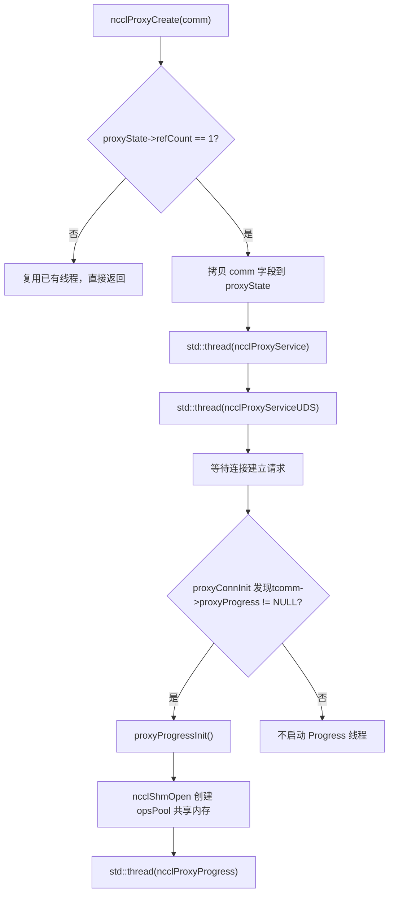
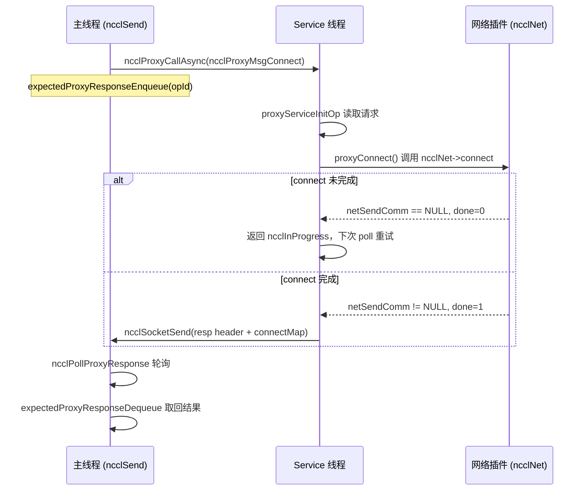
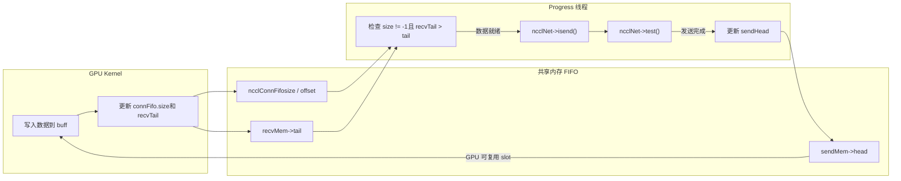

# 第 12 章：代理執行緒異步調度：proxy.cc 如何解耦 I/O 與 kernel 執行

上一章拆解了 transport 抽象層，看到 NCCL 如何用統一介面屏蔽 P2P/SHM/NET/NVLS 的差異。但傳輸層只回答了「資料走哪條通道」，尚未回答「資料如何被異步驅動」。GPU kernel 若直接阻塞在網路等待上，計算單元就會被 I/O 拖死。本章聚焦`src/proxy.cc`與`src/include/proxy.h`，看 NCCL 如何用獨立的 host 執行緒把網路 I/O 從 kernel 執行路徑中剝離出來，與 GPU 形成生產者-消費者關係。

# 12.1 為什麼需要代理執行緒：從「誰等網路」說起

## 直覺模型

想像一家餐廳：廚房（GPU kernel）只負責做菜，傳菜員（proxy 執行緒）負責把菜端給客人（網路對端）。如果讓廚師親自端菜，他每端一趟就得停下炒菜，出餐速度暴跌。NCCL 的 proxy 就是那個專職傳菜員——kernel 只管往共享緩衝區裡寫資料、從緩衝區裡讀資料，網路收發的髒活累活全交給 host 側的 proxy 執行緒。

> **[Design Inference & Architectural Trade-offs]**
> 若沒有 proxy，系統會面臨什麼災難？ GPU kernel 是 SIMT 大規模並行的，一個 warp 阻塞在網路輪詢上會浪費整個 SM 的算力；更致命的是，網路收發涉及 socket 系統呼叫、verbs 輪詢、DMA 描述符提交，這些操作根本無法在 device 程式碼裡執行。因此 NCCL 必須把網路 I/O 搬到 host，讓 kernel 與 proxy 透過共享記憶體中的 FIFO 交換「資料就緒」訊號。

## 兩類執行緒的分工

NCCL 在 host 側啟動了兩類 proxy 執行緒，職責截然不同：

- **Service 執行緒**（`ncclProxyService`）：處理控制面請求——連線建立、記憶體註冊、FD 查詢。它監聽一個 socket，接收來自本地 rank 的 RPC 請求，非同步推進 setup/connect 等操作。
- **Progress 執行緒**（`ncclProxyProgress`）：處理資料面——真正驅動網路收發。它從共享記憶體池裡取 proxy op，呼叫 transport 的`proxyProgress`回呼推進資料搬運。

[FACT:src/include/proxy.h:343-345]顯示`ncclProxyState`同時持有`thread`（Service）和`threadUDS`（UDS 服務），而 Progress 執行緒的句柄藏在`progressState.thread`裡[FACT:src/include/proxy.h:261-261]。

## 生產者-消費者關係的建立

[FACT:src/proxy.cc:2130-2166]的`ncclProxyCreate`是執行緒誕生的地方：當`refCount == 1`（首個 comm 建立）時，它把 comm 的關鍵欄位拷貝進`proxyState`，然後啟動 Service 執行緒和 UDS 執行緒。注意 Progress 執行緒不在這裡啟動——它由`proxyProgressInit`在首次需要 proxy progress 的連線建立時才懶啟動[FACT:src/proxy.cc:1523-1524]。



這張圖錨定了執行緒啟動的真實分支：只有`tcomm->proxyProgress`非空（即該 transport 需要資料面推進）時，Progress 執行緒才會被建立。

# 12.2 資料結構與記憶體佈局：共享記憶體池與 op 池

## 核心結構體全景

proxy 的並發模型建立在兩塊共享記憶體之上，理解它們的記憶體佈局是理解整個機制的前提。

**第一塊：`ncclProxyOpsPool`**（[FACT:src/include/proxy.h:218-226]）。這是主執行緒與 Progress 執行緒之間的「任務投遞箱」，透過`/dev/shm`跨行程共享。

| 欄位 | 類型 | 作用 |
| --- | --- | --- |
| `ops[]` | `ncclProxyOp[]` | 預分配的 op 陣列，大小`MAX_OPS_PER_PEER * NCCL_MAX_LOCAL_RANKS` |
| `nextOps` | `volatile int` | 待處理 op 鏈結串列頭索引，-1 表示空 |
| `nextOpsEnd` | `volatile int` | 待處理 op 鏈結串列尾索引 |
| `freeOps[]` | `volatile int[]` | 每個 local rank 的空閒 op 鏈結串列頭 |
| `syncObjectsInitialized` | `int` | 標記 mutex/cond 是否已初始化 |
| `mutex` / `cond` | `std::mutex` / `std::condition_variable` | 跨行程同步原語 |

`MAX_OPS_PER_PEER`的定義[FACT:src/include/proxy.h:218-226]是`2 * MAXCHANNELS * 2 * NCCL_MAX_DEV_WORK_P2P_PER_BATCH`。註解解釋了為什麼是 2 倍：每個 p2p work 包含一個 send 和一個 recv proxy op，所以要乘 2；再乘 2 是為了能存兩輪完整操作，否則無法「投遞一半、釋放一半」。

**第二塊：`ncclProxyArgs`**（[FACT:src/include/proxy.h:174-209]）。這是 Progress 執行緒內部使用的「執行時 op 描述」，從`ncclProxyPool`裡分配，不跨行程共享。

關鍵欄位：

- `subs[NCCL_PROXY_MAX_SUBS]`：子操作陣列，`NCCL_PROXY_MAX_SUBS = MAXCHANNELS` [FACT:src/include/proxy.h:55-55]。多個 channel 的同類操作會被聚合到一個 args 的多個 sub 裡。
- `progress`：函式指標，指向 transport 的`proxyProgress`回呼[FACT:src/include/proxy.h:176-176]。
- `next` / `nextPeer` / `proxyAppendPtr`：三根鏈結串列指標，構成複雜的 op 組織關係。
- `state`：`ncclProxyOpNone` / `ncclProxyOpReady` / `ncclProxyOpProgress`三態[FACT:src/include/proxy.h:48-52]。

## 記憶體池的分層設計

`ncclProxyPool` [FACT:src/proxy.cc:50-53]是一個批次分配單元，每個 pool 含`PROXYARGS_ALLOCATE_SIZE`（即`NCCL_MAX_OPS`）個`ncclProxyArgs`。`allocateArgs` [FACT:src/proxy.cc:207-231]的分配邏輯值得細看：

```c
if (state->pool == NULL) {
    struct ncclProxyPool* newPool;
    NCCLCHECK(ncclCalloc(&newPool, 1));
    struct ncclProxyArgs* newElems = newPool->elems;
    for (int i = 0; i pool = newElems;
    newPool->next = state->pools;
    state->pools = newPool;
}
elem = state->pool;
state->pool = state->pool->next;
```

[FACT:src/proxy.cc:207-231]

> **[Design Inference & Architectural Trade-offs]**
> 這裡的設計動機是 ：`ncclProxyArgs`結構體很大（含`subs[MAXCHANNELS]`陣列，每個 sub 又有`requests[NCCL_STEPS]`），如果每個 op 單獨 malloc，會造成嚴重的記憶體碎片和分配開銷。批次分配 + 空閒鏈結串列複用，把分配成本攤薄到幾乎為零。註解「Make sure we allocate the memory close to the network thread」暗示這是為了 NUMA 親和性——pool 在 Progress 執行緒首次分配時建立，天然靠近該執行緒運行的 CPU。

## 偽共享與原子變數

`ncclProxyOpsPool`裡的`nextOps`、`nextOpsEnd`、`freeOps[]`都是`volatile int`。它們被主執行緒和 Progress 執行緒同時讀寫，但 NCCL 沒有用鎖保護所有存取——而是用原子操作 + 記憶體序來保證正確性。

看`ncclLocalOpAppend`裡從 freeOps 取空閒 op 的邏輯[FACT:src/proxy.cc:503-513]：

```c
int freeOp = -1;
while (freeOp == -1) {
  freeOp = COMPILER_ATOMIC_EXCHANGE(&pool->freeOps[tpLocalRank], -1, std::memory_order_acquire);
  if (freeOp == -1) std::this_thread::yield();
}
```

主執行緒用`atomic_exchange`把`freeOps[tpLocalRank]`置為 -1 並取回舊值——這是一個「搶佔式取用」：誰先 exchange 成功誰拿到整條空閒鏈結串列。Progress 執行緒歸還 op 時用 CAS 迴圈[FACT:src/proxy.cc:898-907]：

```c
oldFree = COMPILER_ATOMIC_LOAD(&pool->freeOps[i], std::memory_order_acquire);
do {
  pool->ops[freeOpEnd[i]].next = oldFree;
} while (!COMPILER_ATOMIC_COMPARE_EXCHANGE(&pool->freeOps[i], &oldFree, newFree,
                                           std::memory_order_release,
                                           std::memory_order_acquire));
```

> **[Design Inference & Architectural Trade-offs]**
> 這裡用 acquire/release 而非 seq_cst，是因為只需要保證「鏈結串列節點的 next 指標寫入」對取用方可見，不需要全域順序。`freeOps[]`陣列每個元素對應一個 local rank，天然分散在不同快取行附近，減少了偽共享。

# 12.3 控制面：連線建立與 RPC 機制

## 直覺模型

> **[Design Inference & Architectural Trade-offs]**
> Service 執行緒像一個「前台接待」：本地 rank 要建立網路連線時，不是自己直接去連，而是發一個 RPC 請求給 Service 執行緒，由它代為執行 setup/connect。為什麼要這樣？ 因為網路連線建立（尤其是 verbs 的 QP 建立、記憶體註冊）可能阻塞，而且某些資源（如 listen socket）必須由單一執行緒持有。把控制面集中到 Service 執行緒，主執行緒就能非阻塞地繼續做別的事。

## RPC 請求的編碼

`ncclProxyCallAsync` [FACT:src/proxy.cc:1369-1394]是 RPC 的發送端。它透過 socket 依次發送：type、connection 指標、reqSize、respSize、reqBuff、opId。

```c
NCCLCHECKGOTO(ncclSocketSend(sock, &type, sizeof(int)), ret, error);
NCCLCHECKGOTO(ncclSocketSend(sock, &proxyConn->connection, sizeof(void*)), ret, error);
NCCLCHECKGOTO(ncclSocketSend(sock, &reqSize, sizeof(int)), ret, error);
NCCLCHECKGOTO(ncclSocketSend(sock, &respSize, sizeof(int)), ret, error);
if (reqSize) NCCLCHECKGOTO(ncclSocketSend(sock, reqBuff, reqSize), ret, error);
NCCLCHECKGOTO(ncclSocketSend(sock, &opId, sizeof(opId)), ret, error);
NCCLCHECK(expectedProxyResponseEnqueue(sharedProxyState, opId, respSize));
```

[FACT:src/proxy.cc:1369-1394]

注意最後一步：發送完請求後，立刻把 opId 登記到`expectedResponses`佇列。這是非同步 RPC 的關鍵——呼叫方不等回覆，而是先登記「我期待這個 opId 的回應」，之後用`ncclPollProxyResponse`輪詢。

## 回應佇列的鏈結串列實作

`expectedProxyResponseEnqueue` [FACT:src/proxy.cc:97-117]用單向鏈結串列儲存待回應的 op。`expectedProxyResponseStore` [FACT:src/proxy.cc:67-95]在收到回應時按 opId 匹配，把回應資料 memcpy 進預先分配的`respBuff`，標記`done = true`。`expectedProxyResponseDequeue` [FACT:src/proxy.cc:119-141]在輪詢時查找已完成的回應並摘除。

這裡有個細節：`expectedProxyResponseStore`檢查`respSize`是否匹配[FACT:src/proxy.cc:72-75]，不匹配就報`ncclInternalError`。這是防禦性編程——如果請求方和回應方對回應大小的理解不一致，說明協議錯亂，必須立即失敗而非靜默繼續。

## Service 執行緒的主迴圈

`ncclProxyService` [FACT:src/proxy.cc:1789-2016]的核心是一個 poll 迴圈。它用`pollfds`陣列管理所有連線，包括 listen socket 和每個 peer 的 socket。

```c
while (stop == PROXY_RUNNING || npeers > 0) {
    if (COMPILER_ATOMIC_LOAD(proxyState->abortFlag, std::memory_order_acquire) != 0) stop = PROXY_ABORT;
    int ret = 0;
    const int timeout = asyncOpCount ? 0 : 500;
    ...
    ret = poll(activePollfds, nfds_to_poll, timeout);
```

[FACT:src/proxy.cc:1842-1863]

`timeout`的選擇很講究：如果有非同步 op 在推進（`asyncOpCount > 0`），timeout 設為 0（非阻塞輪詢），因為需要頻繁呼叫`proxyProgressAsync`推進它們；否則設 500ms，避免空轉燒 CPU。註解「never let proxy service thread blocks in poll, or it cannot receive abortFlag」[FACT:src/proxy.cc:1847-1847]點明了為什麼不能無限阻塞——必須週期性醒來檢查 abortFlag。

## 非同步 op 的推進

`proxyProgressAsync` [FACT:src/proxy.cc:1626-1700]是 Service 執行緒推進非同步操作的核心。它根據 op 類型分發到不同的 transport 回呼：

```c
if (op->type == ncclProxyMsgSetup) {
    res = op->connection->tcomm->proxySetup(op->connection, proxyState, op->reqBuff, op->reqSize, op->respBuff,
                                            op->respSize, &done);
} else if (op->type == ncclProxyMsgConnect) {
    res = op->connection->tcomm->proxyConnect(...);
} else if (op->type == ncclProxyMsgInit) {
    res = proxyConnInit(peer, connectionPool, proxyState, ...);
}
```

[FACT:src/proxy.cc:1631-1664]

每個回呼都帶一個`done`輸出參數。如果`done == 0`，說明操作還沒完成（比如網路連線還在三次握手），返回`ncclInProgress`，下次迴圈繼續推進。如果`done == 1`，則發送回應標頭 + 回應主體給請求方[FACT:src/proxy.cc:1681-1689]。



這張時序圖錨定了`sendProxyConnect`裡`*done = 0; return ncclInProgress`的真實分支[FACT:src/transport/net.cc:913-916]。

# 12.4 資料面：Progress 執行緒如何驅動網路收發

## 直覺模型

Progress 執行緒是「傳送帶操作員」：它盯著共享緩衝區裡的 FIFO，一旦 GPU 寫好了資料（FIFO 裡 size != -1），就立刻呼叫`isend`把資料發出去；一旦網路收完了資料，就更新 recvTail 通知 GPU 可以讀了。整個過程 GPU 和 proxy 透過 FIFO 裡的 head/tail 指標同步，不需要任何鎖。

## op 的投遞：從主執行緒到 Progress 執行緒

主執行緒在`ncclProxySaveOp` [FACT:src/proxy.cc:591-761]裡根據 pattern 決定需要哪些 proxy op，然後透過`SaveProxy` → `ncclLocalOpAppend`把 op 寫入共享記憶體池。

`ncclLocalOpAppend` [FACT:src/proxy.cc:488-554]的流程：

1. 從`proxyOps->freeOp`或`pool->freeOps[tpLocalRank]`取一個空閒 op 槽位。

2. `memcpy(op, proxyOp, sizeof(struct ncclProxyOp))`把 op 內容拷進共享記憶體[FACT:src/proxy.cc:515-515]。

3. 把 op 掛到`proxyOps->nextOps`鏈結串列尾部。

4. 如果累積的 op 數達到`MAX_OPS_PER_PEER`，觸發一次批次投遞[FACT:src/proxy.cc:525-551]。

批次投遞的邏輯很微妙：它不能簡單地把所有 op 都發出去，因為「同一個 opCount 的多個 op 必須一起投遞，否則會破壞 proxyArgs 的 sub 聚合」。所以它找到最後一個 opCount 變化的邊界，只投遞到那裡[FACT:src/proxy.cc:529-548]。

投遞透過`ncclProxyPost` [FACT:src/proxy.cc:476-486]完成，它加鎖、更新`pool->nextOps`、`notify_one`喚醒 Progress 執行緒。

## Progress 執行緒的主迴圈

`ncclProxyProgress` [FACT:src/proxy.cc:951-1011]的結構：

```c
do {
    int idle = 1;
    ncclResult_t ret = progressOps(proxyState, state, state->active, &idle);
    ...
    if (idle || !state->active || (++proxyOpAppendCounter == ncclParamProgressAppendOpFreq())) {
      int added = 0;
      proxyOpAppendCounter = 0;
      ret = ncclProxyGetPostedOps(proxyState, &added);
      ...
    }
    lastIdle = idle;
    stopv = state->stop.load(std::memory_order_acquire);
} while ((stopv == 0 || (stopv == 1 && state->active)) &&
         COMPILER_ATOMIC_LOAD(proxyState->abortFlag, std::memory_order_acquire) == 0);
```

[FACT:src/proxy.cc:976-1009]

這裡有個效能優化值得注意：`proxyOpAppendCounter`計數器[FACT:src/proxy.cc:974-974]。註解解釋[FACT:src/proxy.cc:969-973]：太頻繁呼叫`ncclProxyGetPostedOps`會導致小訊息通訊效能回退，所以每推進`ProgressAppendOpFreq`（預設 8）次才去取一次新 op。

## op 的聚合：ProxyAppend

`ProxyAppend` [FACT:src/proxy.cc:437-474]決定一個 op 是「追加到已有 args 的 sub 裡」還是「新建一個 args」。判斷依據是`connection->shared && args->opCount == op->opCount` [FACT:src/proxy.cc:443-443]——同一連線、同一 opCount 的多個 channel 操作會被聚合。

> **[Design Inference & Architectural Trade-offs]**
> 聚合的價值 ：多個 channel 的同類操作合併成一個 args，Progress 執行緒一次迴圈就能推進所有 channel，減少了函式呼叫開銷和快取失效。`ncclProxyOpToArgs` [FACT:src/proxy.cc:368-435]在追加 sub 時會校驗`sliceSteps`、`chunkSteps`、`protocol`、`dtype`、`redOp`、`coll`是否一致[FACT:src/proxy.cc:401-406]，不一致就報錯——這是防止錯誤聚合的防線。

## sendProxyProgress：發送側的四階段狀態機

`sendProxyProgress` [FACT:src/transport/net.cc:1324-1491]是發送側的核心。它按 sub 逐個推進，每個 sub 有四個計數器：`posted`、`transmitted`、`done`。

**階段一：Ready 初始化** [FACT:src/transport/net.cc:1326-1339]

```c
sub->base = ROUNDUP(resources->step, args->chunkSteps);
resources->step = sub->base + sub->nsteps;
sub->posted = sub->transmitted = sub->done = 0;
```

`base`是 step 的起始編號，`ROUNDUP`保證對齊到`chunkSteps`。`resources->step`累加，為下一個 op 預留空間。

**階段二：Post 緩衝區給 GPU** [FACT:src/transport/net.cc:1355-1376]

```c
if (sub->posted nsteps && sub->posted done + maxDepth) {
    int buffSlot = (sub->base + sub->posted) % NCCL_STEPS;
    if (resources->shared) {
        ...
        *sendHead = sub->base + sub->posted - NCCL_STEPS;
    } else {
        sub->posted += args->sliceSteps;
    }
}
```

`maxDepth`是流水線深度[FACT:src/transport/net.cc:1343-1343]，限制同時 in-flight 的 step 數。shared 模式下，proxy 透過更新`sendHead`告訴 GPU「這個 slot 可以寫了」。

**階段三：檢查 GPU 是否寫好，發起 isend** [FACT:src/transport/net.cc:1378-1452]

```c
if (sub->transmitted posted && sub->transmitted done + NCCL_STEPS) {
    int buffSlot = (sub->base + sub->transmitted) % NCCL_STEPS;
    volatile uint64_t* recvTail = &resources->recvMem->tail;
    uint64_t tail = sub->base + sub->transmitted;
    if (connFifo[buffSlot].size != -1 && (*recvTail > tail || p == NCCL_PROTO_LL)) {
        int size = connFifo[buffSlot].size;
        ...
        NCCLCHECK(proxyState->ncclNet->isend(resources->netSendComm, buff, size, resources->tpRank,
                                             sub->sendMhandle, phandle, sub->requests + buffSlot));
        if (sub->requests[buffSlot] != NULL) {
            sub->transmitted += args->sliceSteps;
        }
    }
}
```

這裡的關鍵判斷是`connFifo[buffSlot].size != -1 && *recvTail > tail`——GPU 寫好資料後會更新 FIFO 的 size 和 recvTail，proxy 看到這兩個條件滿足才發起 isend。對於 LL 協議，因為它是「零拷貝」語意，不需要等 recvTail。

**階段四：檢查發送完成，更新 sendHead** [FACT:src/transport/net.cc:1455-1481]

```c
if (sub->done transmitted) {
    int buffSlot = (sub->base + sub->done) % NCCL_STEPS;
    NCCLCHECK(proxyState->ncclNet->test(sub->requests[buffSlot], &done, &size));
    if (done) {
        connFifo[buffSlot].size = -1;
        std::atomic_thread_fence(std::memory_order_seq_cst);
        sub->done += args->sliceSteps;
        if (resources->shared == 0) {
            volatile uint64_t* sendHead = resources->gdcSync ? resources->gdcSync : &resources->sendMem->head;
            *sendHead = sub->base + sub->done;
        }
    }
}
```

`test`返回 done 後，先把 FIFO size 重置為 -1，插入一個 seq_cst fence，再更新 sendHead 通知 GPU「這個 slot 可以複用了」。fence 的作用是防止 size 重置和 head 更新的重排序——如果 head 先更新，GPU 可能在 size 還是舊值時就開始寫。

## recvProxyProgress：接收側的四階段

`recvProxyProgress` [FACT:src/transport/net.cc:1493-1788]更複雜，因為它涉及 sub 分組（多個 sub 共享同一個 recvComm 時用 multirecv）。

**階段一：Ready 時按 recvComm 分組** [FACT:src/transport/net.cc:1495-1538]

```c
for (int s = 0; s nsubs; s++) {
    ...
    if (groupSize == maxRecvs) {
        groupSize = 0;
    } else if (s > 0) {
        int next;
        for (next = s; next nsubs; next++) {
            struct recvNetResources* nextRes = ...;
            if (nextRes->netRecvComm == recvComm) break;
        }
        if (next == args->nsubs) {
            groupSize = 0;
        } else if (s != next) {
            // swap subs
        }
    }
    groupSize++;
    ...
    for (int i = 0; i  **[Design Inference & Architectural Trade-offs]**
> 這段程式碼把使用同一`recvComm`的 sub 排到一起，並記錄`groupSize`。為什麼要分組？ 因為`irecv`支援一次接收多個 buffer（multirecv），把同 comm 的請求合併成一次呼叫能顯著降低外掛開銷。

**階段二：發起 irecv** [FACT:src/transport/net.cc:1543-1631]

```c
if (subCount) {
    uint64_t step = subGroup->posted;
    void** requestPtr = subGroup->requests + (step % NCCL_STEPS);
    bool ignoreCompletion = ncclParamNetOptionalRecvCompletion() &&
                            ((args->protocol == NCCL_PROTO_LL128) || (args->protocol == NCCL_PROTO_LL)) &&
                            (subCount == 1);
    if (ignoreCompletion) *requestPtr = (void*)NCCL_NET_OPTIONAL_RECV_COMPLETION;
    NCCLCHECK(proxyState->ncclNet->irecv(resources->netRecvComm, subCount, ptrs, sizes, tags, mhandles, phandles,
                                         requestPtr));
    if (*requestPtr) {
        subGroup->recvRequestsCache[step % NCCL_STEPS] = *requestPtr;
        subGroup->recvRequestsSubCount = subCount;
        for (int i = 0; i groupSize; i++) {
            sub->posted += args->sliceSteps;
        }
    }
}
```

`ignoreCompletion`優化[FACT:src/transport/net.cc:1608-1610]：對於 LL/LL128 協議的單 buffer 接收，完成通知是可選的（因為資料本身帶 flag），可以跳過 completion 檢查。

**階段三：檢查接收完成，更新 recvTail** [FACT:src/transport/net.cc:1634-1743]

```c
NCCLCHECK(proxyState->ncclNet->test(subGroup->requests[step % NCCL_STEPS], &done, sizes));
if (done) {
    for (int i = 0; i groupSize; i++) {
        struct ncclProxySubArgs* sub = subGroup + i;
        int buffSlot = (sub->base + sub->received) % NCCL_STEPS;
        connFifo[buffSlot].size = -1;
        sub->received += args->sliceSteps;
    }
    ...
}
```

接收完成後，重置 FIFO size，然後進入 flush 階段（GDRDMA 場景需要 flush 保證資料可見性）。

**階段四：等待 GPU 消費，更新 done** [FACT:src/transport/net.cc:1745-1779]

```c
if (sub->transmitted > sub->done) {
    volatile uint64_t* sendHead = &resources->sendMem->head;
    uint64_t done = *sendHead;
    while (done > sub->base + sub->done && sub->transmitted > sub->done) {
        if (subGroup->recvRequestsCache[sub->done % NCCL_STEPS]) {
            if (proxyState->ncclNet->irecvConsumed) {
                NCCLCHECK(proxyState->ncclNet->irecvConsumed(resources->netRecvComm, subGroup->recvRequestsSubCount,
                                                             subGroup->recvRequestsCache[sub->done % NCCL_STEPS]));
            }
            subGroup->recvRequestsCache[sub->done % NCCL_STEPS] = NULL;
        }
        sub->done += args->sliceSteps;
    }
}
```

這裡透過讀`sendHead`判斷 GPU 是否已經消費了資料。`irecvConsumed`是給外掛的回呼，告訴它「這個接收請求的 buffer 已經被消費，可以複用了」。

## 資料流全景



這張資料流圖展示了 GPU 與 proxy 透過 FIFO 和 head/tail 指標形成的閉環：GPU 寫資料 → 更新 tail → proxy 檢測到並發 isend → test 確認完成 → 更新 head → GPU 複用 slot。

# 12.5 並發控制、記憶體屏障與硬體互動

## 無鎖 FIFO 的記憶體序

proxy 與 GPU 之間的同步完全依賴`ncclConnFifo`和 head/tail 指標，沒有任何鎖。這要求極其謹慎的記憶體序控制。

發送側，proxy 在`test`返回 done 後[FACT:src/transport/net.cc:1460-1473]：

```c
connFifo[buffSlot].size = -1;
std::atomic_thread_fence(std::memory_order_seq_cst);
...
*sendHead = sub->base + sub->done;
```

seq_cst fence 保證 size 重置對 GPU 可見後，head 更新才可見。如果順序反了，GPU 可能看到新 head 但舊 size，誤以為 slot 裡有資料。

接收側，proxy 在更新 recvTail 前[FACT:src/transport/net.cc:1731-1736]：

```c
if (step nsteps) {
    std::atomic_thread_fence(std::memory_order_seq_cst);
    volatile uint64_t* recvTail = resources->gdcSync ? resources->gdcSync : &resources->recvMem->tail;
    *recvTail = sub->base + sub->transmitted;
}
```

同樣的道理：先 fence 保證資料寫入可見，再更新 tail 通知 GPU 可以讀。

## GDRCOPY 的 flush 機制

當使用 GDRDMA 時，NIC 直接寫 GPU 顯存，但寫操作可能還在 PCIe 總線上未提交。proxy 需要主動 flush 才能保證資料可見。看`recvProxyProgress`裡的 flush 邏輯[FACT:src/transport/net.cc:1664-1709]：

```c
if (totalSize > 0 && p == NCCL_PROTO_SIMPLE && needFlush) {
    if (resources->gdcFlush) {
#if defined(__x86_64__)
        asm volatile("mfence" ::: "memory");
        asm volatile("mov (%0), %%eax" ::"l"(resources->gdcFlush) : "%eax", "memory");
#else
        std::atomic_thread_fence(std::memory_order_seq_cst);
        uint64_t dummy;
        NCCLCHECK(ncclGdrCudaRead(resources->gdrDesc, &dummy, resources->gdcFlush, sizeof(dummy)));
#endif
    } else {
        // iflush 路径
        NCCLCHECK(proxyState->ncclNet->iflush(resources->netRecvComm, subCount, ptrs, sizes, mhandles,
                                              subGroup->requests + (step % NCCL_STEPS)));
    }
}
```

x86 路徑的註解非常精彩[FACT:src/transport/net.cc:1668-1674]：`mfence`阻止 CQE-poll 的 load 被重排到 flush load 之前；`mov (%0), %%eax`強制一次 PCIe 讀，讓 CPU 停頓直到所有先前的 PCIe posted write（包括 NIC DMA）提交到端點。這是硬體級別的記憶體序控制，比任何軟體 fence 都硬核。

## 原子變數與 stop/abort 的協作

Progress 執行緒的退出條件[FACT:src/proxy.cc:1007-1009]：

```c
stopv = state->stop.load(std::memory_order_acquire);
} while ((stopv == 0 || (stopv == 1 && state->active)) &&
         COMPILER_ATOMIC_LOAD(proxyState->abortFlag, std::memory_order_acquire) == 0);
```

`stop == 1`但`state->active != NULL`時繼續運行——這是為了「優雅停止」：已經投遞的 op 必須推進完，否則 GPU 會永遠等不到資料。只有`stop == 2`（abort）或`abortFlag != 0`才強制退出。

`ncclProxyProgressDestroy` [FACT:src/proxy.cc:1039-1065]的停止流程：

```c
std::lock_guard lock(state->opsPool->mutex);
state->stop.store(1, std::memory_order_release);
state->opsPool->cond.notify_one();
state->thread.join();
```

先加鎖再 store stop，然後 notify——這是防止 lost wakeup 的標準模式。Progress 執行緒在`pool->cond.wait`時持有鎖並檢查謂詞[FACT:src/proxy.cc:850-851]，保證不會錯過喚醒。

# 12.6 生產避坑指南與故障恢復鏈

## 坑一：連線洩漏導致 Service 執行緒無法退出

`ncclProxyService`的主迴圈條件是`stop == PROXY_RUNNING || npeers > 0` [FACT:src/proxy.cc:1842-1842]。註解解釋[FACT:src/proxy.cc:1843-1845]：即使本地 comm abort，只要還有 peer 連線，proxy 執行緒就不能退出，否則可能段錯誤。

**排查場景**：如果某個 rank 崩潰但沒通知對端，對端的 Service 執行緒會一直卡在`npeers > 0`的迴圈裡。此時需要依賴`abortFlag`或逾時機制。生產環境中如果看到行程 hang 在`ncclProxyService`，先檢查是否有對端 rank 異常退出。

## 坑二：回應佇列不匹配導致記憶體洩漏

`expectedProxyResponseStore`在 opId 不匹配時返回`ncclInternalError` [FACT:src/proxy.cc:93-94]。但如果回應到達時請求方已經放棄（比如逾時），這個回應會永遠留在佇列裡，`respBuff`洩漏。

**防禦措施**：`expectedProxyResponseFree` [FACT:src/proxy.cc:55-65]在`ncclProxyDestroy`時清理整個佇列[FACT:src/proxy.cc:2226-2226]。但這是最後兜底，正常運行中不應該有殘留。

## 坑三：shared 模式下 head 初始化為負值

`sendProxyConnect`裡[FACT:src/transport/net.cc:999-1000]：

```c
// Don't give credits yet in shared mode.
(resources->gdcSync ? *resources->gdcSync : resources->sendMem->head) = (map->shared ? -NCCL_STEPS : 0);
```

shared 模式下 head 初始化為`-NCCL_STEPS`，意味著 GPU 一開始沒有 credit 可寫。proxy 需要在 post 階段逐步增加 head 來「發放 credit」。如果忘記這個初始化，GPU 會誤以為有 credit 而寫入未就緒的 slot，導致資料錯亂。

## 坑四：LL128 協議的 flag 校驗

`sendProxyProgress`裡 LL128 的 ready 判斷[FACT:src/transport/net.cc:1388-1403]：

```c
if (p == NCCL_PROTO_LL128) {
    ready = resources->useGdr;
    if (!ready) {
        uint64_t flag = sub->base + sub->transmitted + 1;
        int nFifoLines = DIVUP(connFifo[buffSlot].size, sizeof(uint64_t) * NCCL_LL128_LINEELEMS);
        volatile uint64_t* lines = (volatile uint64_t*)buff;
        ready = 1;
        for (int i = 0; i Q1: 如果把`sendProxyProgress`中`sub->done == sub->nsteps`時更新`sendHead`的邏輯去掉（即不通知 GPU slot 已釋放），在什麼場景下會觸發死鎖？為什麼？

**參考解析**：`sendHead`是 GPU 判斷「哪些 slot 可以複用」的唯一依據。看[FACT:src/transport/net.cc:1469-1473]：

```c
if (resources->shared == 0) {
    volatile uint64_t* sendHead = resources->gdcSync ? resources->gdcSync : &resources->sendMem->head;
    *sendHead = sub->base + sub->done;
}
```

如果去掉這段，GPU 的 head 永遠停在初始值（shared 模式下是`-NCCL_STEPS`，非 shared 是 0）。GPU kernel 在`waitSend`時會檢查`head + NCCL_STEPS > step`才認為有 credit 可寫。head 不推進，GPU 寫滿`NCCL_STEPS`個 slot 後就永遠阻塞在等待 credit 上，而 proxy 又在等 GPU 寫新資料才能 isend——經典的生產者-消費者死鎖。在 shared 模式下更嚴重，因為初始 head 是負值，GPU 一開始就沒有 credit。

Q2: `ncclLocalOpAppend`在累積 op 達到`MAX_OPS_PER_PEER`時會觸發批量投遞，但程式碼特意「不投遞最後一個 opCount 的所有 op」。如果改成簡單地把所有 op 都投遞，會破壞什麼機制？

**參考解析**：看[FACT:src/proxy.cc:525-548]的註釋和邏輯：

```c
// Do not post last operations as we could have more coming with the same opCount, and posting
// them in different batches would break proxyArgs aggregation with subs.
uint64_t lastOpCount = pool->ops[proxyOps->nextOpsEnd].opCount;
int lastOp = -1;
...
for (int op = proxyOps->nextOps; op != proxyOps->nextOpsEnd; op = pool->ops[op].next) {
    ops++;
    if (pool->ops[op].opCount != lastOpCount) {
        lastOp = op;
        toSend = ops;
    }
}
```

`ProxyAppend`的聚合邏輯[FACT:src/proxy.cc:443-443]依賴`args->opCount == op->opCount`來判斷是否追加 sub。如果同一個 opCount 的多個 channel op 被拆到兩個批次投遞，第一批會建立一個 args，第二批到達時`args->opCount`已經不等於新 op 的 opCount（因為 args 可能已經被推進），導致本應聚合的 sub 被拆成獨立的 args。這不僅降低效能，還可能破壞`ncclProxyOpToArgs`裡的`nChannels`/`nPeers`取 min 的邏輯[FACT:src/proxy.cc:399-400]，導致錯誤的通道數計算。

Q3: `recvProxyProgress`的 Ready 階段會按`recvComm`對 sub 重新排序分組。如果去掉這個分組邏輯，讓每個 sub 獨立呼叫`irecv`，在`maxRecvs > 1`的網卡上會有什麼後果？

**參考解析**：看[FACT:src/transport/net.cc:1495-1538]的分組邏輯和[FACT:src/transport/net.cc:1613-1614]的 multirecv 呼叫：

```c
NCCLCHECK(proxyState->ncclNet->irecv(resources->netRecvComm, subCount, ptrs, sizes, tags, mhandles, phandles,
                                     requestPtr));
```

`maxRecvs`是網卡插件宣告的「單次 irecv 能接收的最大 buffer 數」[FACT:src/transport/net.cc:1525-1525]。當`maxRecvs > 1`時，插件（如 IB）支援一次 WQE 接收多個 buffer，能顯著降低 doorbell 開銷和 CQE 處理成本。如果去掉分組，每個 sub 單獨 irecv，`subCount`永遠是 1，插件退化為單 buffer 模式，吞吐量會下降。更關鍵的是，`recvRequestsCache`和`irecvConsumed`機制[FACT:src/transport/net.cc:1616-1617]是為 multirecv 設計的——單 buffer 模式下這些快取邏輯會失效，可能導致請求洩漏。

至此，我們理解了 proxy 執行緒如何將網路 I/O 與 kernel 執行解耦，讓 GPU 計算與通訊真正並行。但 proxy 只是驅動者，底層網路傳輸的具體實現仍待揭曉。下一章我們將深入`net_ib`，看 NCCL 如何封裝 verbs API 實現 InfiniBand 傳輸，以及 GPUDirect RDMA 如何讓網卡直接讀寫 GPU 顯存。
