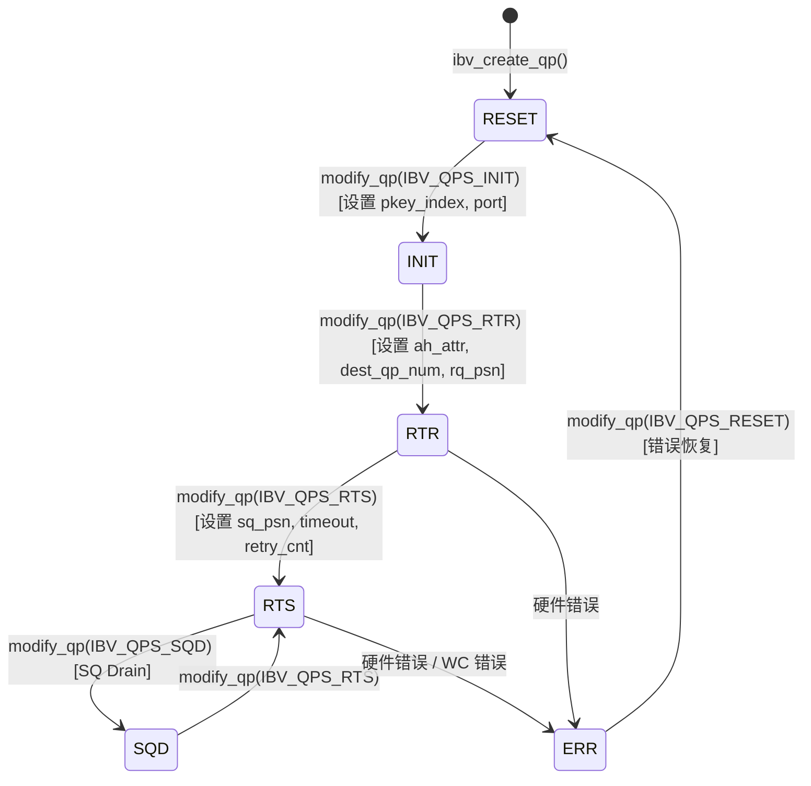

# 第 13 章：InfiniBand 網路傳輸：net_ib 如何封裝 verbs 與 GPUDirect RDMA

上一章我們看到 proxy 執行緒如何把網路 I/O 從 GPU kernel 中剝離出來，讓計算與通訊真正並行。但 proxy 只是一個「驅動者」——它呼叫 ncclNet->isend/irecv 這些抽象介面，卻不知道底下到底是 TCP、InfiniBand 還是別的什麼。本章我們掀開這層抽象，進入 src/transport/net_ib 與 src/misc/ibvwrap.cc，看 NCCL 如何把 libibverbs 這套 C 庫封裝成可插拔的符號表，如何建立 Queue Pair（QP），以及 GPUDirect RDMA 如何讓網卡繞過 host 記憶體直接讀寫 GPU 顯存。

# 13.1 為什麼 NCCL 不直接呼叫 libibverbs

## 直覺模型：符號表就是「可插拔的電源插座」

想像你買了一台進口電器，插頭形狀和家裡插座不匹配。你有兩個選擇：要麼把電器拆開改線（直接`#include <infiniband/verbs.h>`並連結`-libverbs`），要麼買一個萬能轉換插頭（執行時動態載入符號）。NCCL 選擇了後者。

> **[Design Inference & Architectural Trade-offs]**
> 這個選擇的核心動機是**部署靈活性**：NCCL 作為一個庫被 PyTorch、TensorFlow 等上層框架載入，它無法假設執行環境一定裝了`libibverbs.so`。如果編譯期硬連結，那麼在沒有 InfiniBand 驅動的機器上，整個 NCCL 庫都無法載入——哪怕你只想用 NVLink 做單機通訊。透過執行時`dlopen`+ 符號解析，NCCL 可以在沒有 IB 的機器上優雅降級。

如果缺少這一層封裝，系統會面臨的災難是：**一個純 NVLink 的單機訓練任務，因為機器上沒裝 IB 驅動而直接崩潰**。這在雲環境、開發機上極其常見。

## 資料結構與記憶體佈局：符號表容器

核心資料結構是`ncclIbvSymbols`，定義在`ibvsymbols.h`中（本章材料未包含該檔案，但從使用方式可推斷其結構）。它是一個純函式指標容器，每個欄位對應一個 libibverbs 函式：

```c
struct ncclIbvSymbols {
  int (*ibv_internal_fork_init)(void);
  struct ibv_device** (*ibv_internal_get_device_list)(int* num_devices);
  int (*ibv_internal_modify_qp)(struct ibv_qp*, struct ibv_qp_attr*, int);
  // ... 数十个函数指针
};
```

全域只有一個實例，配合`std::once_flag`保證執行緒安全初始化：

[FACT:src/misc/ibvwrap.cc:26-29]

```c
static std::once_flag initOnceFlag;
static ncclResult_t initResult;
struct ncclIbvSymbols ibvSymbols;
```

這裡的設計非常克制：`initOnceFlag`是`std::once_flag`，`initResult`快取初始化結果，`ibvSymbols`是全域符號表。三者都是靜態儲存期，生命週期貫穿整個行程。

> **[Design Inference & Architectural Trade-offs]**
> 為什麼用`std::once_flag`而不是`pthread_once`？因為 NCCL 的 C++ 程式碼已經依賴`<mutex>`和`<thread>`，用標準函式庫更一致。`call_once`的語意是：無論多少執行緒同時呼叫`wrap_ibv_symbols()`，lambda 只執行一次，其餘執行緒阻塞等待，然後都拿到同一個`initResult`。這比手寫雙重檢查鎖定（DCLP）安全得多——DCLP 在 C++ 記憶體模型下有著名的重排序陷阱。

## Step-by-Step：符號解析的完整流程

當 NCCL 第一次需要 IB 傳輸時，會呼叫`wrap_ibv_symbols()`：

[FACT:src/misc/ibvwrap.cc:26-29]

```c
ncclResult_t wrap_ibv_symbols(void) {
  std::call_once(initOnceFlag, []() { initResult = buildIbvSymbols(&ibvSymbols); });
  return initResult;
}
```

`buildIbvSymbols`定義在`ibvsymbols.cc`（本章未包含），它的工作是用`dlopen("libibverbs.so")`開啟函式庫，然後對每個函式名稱呼叫`dlsym`填充指標。如果某個符號找不到，對應欄位保持 NULL。

這個「允許 NULL」的設計貫穿整個封裝層。看`CHECK_NOT_NULL`巨集：

[FACT:src/misc/ibvwrap.cc:26-29]

```c
#define CHECK_NOT_NULL(container, internal_name) \
  if (container.internal_name == NULL) { \
    WARN("lib wrapper not initialized."); \
    return ncclInternalError; \
  }
```

每個封裝函式在呼叫前都會檢查對應符號是否非空。這意味著：**如果某個舊版本 libibverbs 缺少某個新函式，NCCL 不會在載入時崩潰，而是在真正用到該函式時才報錯**。這是漸進式降級的關鍵。

## 設計思考：巨集封裝的三重職責

`ibvwrap.cc`裡定義了 7 個巨集，它們不是簡單的語法糖，而是承擔了三重職責：

1. **空指標防護**：`CHECK_NOT_NULL`攔截未初始化

2. **錯誤碼正規化**：把 libibverbs 的多種錯誤約定（回傳 -1、回傳 errno、回傳 NULL 指標）統一翻譯成`ncclResult_t`

3. **日誌埋點**：失敗時`WARN`列印函式名稱和 errno

看`IBV_PTR_CHECK_ERRNO`這個最複雜的巨集：

[FACT:src/misc/ibvwrap.cc:38-45]

```c
#define IBV_PTR_CHECK_ERRNO(container, internal_name, call, retval, error_retval, name) \
  CHECK_NOT_NULL(container, internal_name); \
  retval = container.call; \
  if (retval == error_retval) { \
    WARN("Call to " name " failed with error %s", strerror(errno)); \
    return ncclSystemError; \
  } \
  return ncclSuccess;
```

它展開後做四件事：檢查符號非空、執行呼叫、把回傳值寫入`retval`（通常是透過指標參數回傳的`ibv_pd*`等）、判斷是否等於錯誤值。注意`strerror(errno)`——libibverbs 的指標回傳型函式（如`ibv_alloc_pd`）失敗時回傳 NULL 並設定`errno`，所以這裡讀`errno`是對的。

而`IBV_INT_CHECK`用於回傳 int 的函式：

[FACT:src/misc/ibvwrap.cc:84-91]

```c
#define IBV_INT_CHECK(container, internal_name, call, error_retval, name) \
  CHECK_NOT_NULL(container, internal_name); \
  int ret = container.call; \
  if (ret == error_retval) { \
    WARN("Call to " name " failed"); \
    return ncclSystemError; \
  } \
  return ncclSuccess;
```

這裡不讀`errno`，因為這類函式（如`ibv_fork_init`）直接回傳 -1 表示失敗，錯誤資訊已經遺失。

> **[Design Inference & Architectural Trade-offs]**
> 這種「每個函式用不同巨集」的做法看起來繁瑣，但它是必要的：libibverbs 的 API 錯誤約定極不統一，有的回傳 0/-1，有的回傳 errno 值，有的回傳指標。如果強行統一，反而會遺失錯誤資訊。NCCL 選擇「如實翻譯」，把複雜性留在封裝層，讓上層`net_ib.cc`只需判斷`ncclSuccess`。

# 13.2 ibvcore.h：不依賴標頭檔的 ABI 契約

## 直覺模型：自帶字典的翻譯官

`ibvcore.h`是一個奇特的檔案——它把 libibverbs 的核心結構體、列舉、常數**重新定義了一遍**。為什麼？因為 NCCL 要在不`#include <infiniband/verbs.h>`的前提下使用這些型別。

> **[Design Inference & Architectural Trade-offs]**
> 這解決了一個真實的工程問題：`infiniband/verbs.h`在不同發行版、不同驅動版本下內容不同。如果 NCCL 直接包含它，編譯期就綁定了某個版本。而透過自己定義一份「最小必要子集」，NCCL 可以在編譯時不需要 IB 標頭檔，執行時透過`dlopen`載入任意版本的函式庫。

如果缺少這層，災難是：**在沒裝`libibverbs-dev`的機器上無法編譯 NCCL**。而實際上執行時可能透過`rdma-core`提供了函式庫檔案。

## 關鍵結構體的記憶體佈局

我們挑幾個對理解 RDMA 最關鍵的結構體剖析。

**`ibv_gid`：全域識別碼**

[FACT:src/include/ibvcore.h:58-64]

```c
union ibv_gid {
	uint8_t			raw[16];
	struct {
		uint64_t	subnet_prefix;
		uint64_t	interface_id;
	} global;
};
```

GID 是 InfiniBand 的「IP 位址」，16 位元組。它既可作為 16 位元組陣列存取，也可作為兩個 64 位元整數存取。RoCE（RDMA over Converged Ethernet）場景下，GID 實際上就是 IPv6 位址——這也是為什麼`ibvGetGidStr`用`inet_ntop(AF_INET6, ...)`來格式化：

[FACT:src/include/ibvwrap.h:102-108]

```c
static inline const char* ibvGetGidStr(union ibv_gid* gid, char* gidStr, size_t strLen) {
  static_assert(sizeof(union ibv_gid) == sizeof(struct in6_addr),
                "the sizeof struct ibv_gid must be the size of struct in6_addr");
  return inet_ntop(AF_INET6, gid->raw, gidStr, strLen);
}
```

`static_assert`在編譯期保證`ibv_gid`和`in6_addr`大小一致，這樣`inet_ntop`才能正確解釋這 16 位元組。

**`ibv_mr`：記憶體註冊句柄**

[FACT:src/include/ibvcore.h:402-410]

```c
struct ibv_mr {
	struct ibv_context     *context;
	struct ibv_pd	       *pd;
	void		       *addr;
	size_t			length;
	uint32_t		handle;
	uint32_t		lkey;
	uint32_t		rkey;
};
```

這是 GPUDirect RDMA 的核心。`addr`是註冊的記憶體起始位址（可以是 host 記憶體，也可以是 GPU 顯示記憶體映射到 host 的位址），`length`是長度。`lkey`（local key）和`rkey`（remote key）是網卡用來驗證存取權限的「鑰匙」——傳送方在 WQE 裡帶上`lkey`，接收方用`rkey`校驗。

> **[Design Inference & Architectural Trade-offs]**
> 為什麼需要註冊？因為網卡做 DMA 時用的是實體位址，而`addr`是虛擬位址。註冊過程讓驅動把這段虛擬位址的分頁表「釘住」（pin），建立 IOMMU 映射，並回傳`lkey/rkey`作為後續引用的句柄。註冊是昂貴的（涉及分頁表遍歷和 IOMMU 程式設計），所以 NCCL 會快取 MR，避免每次傳輸都註冊。

**`ibv_send_wr`：傳送工作請求**

[FACT:src/include/ibvcore.h:704-738]

```c
struct ibv_send_wr {
	uint64_t		wr_id;
	struct ibv_send_wr     *next;
	struct ibv_sge	       *sg_list;
	int			num_sge;
	enum ibv_wr_opcode	opcode;
	int			send_flags;
	uint32_t		imm_data;
	union {
		struct {
			uint64_t	remote_addr;
			uint32_t	rkey;
		} rdma;
		// ...
	} wr;
};
```

這是「我要網卡做什麼」的描述。`wr_id`是使用者自訂的標籤（完成時會原樣回傳），`sg_list`是散列表（scatter-gather list），`opcode`決定操作類型（RDMA_WRITE、SEND 等），`wr.rdma.remote_addr`和`wr.rdma.rkey`指定對端的目標位址和存取密鑰。

`ibv_sge`描述一段本地記憶體：

[FACT:src/include/ibvcore.h:698-702]

```c
struct ibv_sge {
	uint64_t		addr;
	uint32_t		length;
	uint32_t		lkey;
};
```

注意`addr`是`uint64_t`而非指標——因為 WQE 會被網卡硬體讀取，必須是固定的 64 位格式。

## 內聯函式：繞過符號表的快路徑

有些函式 NCCL 選擇內聯實作，而不是走符號表。比如`ibv_post_send`：

[FACT:src/include/ibvcore.h:1099-1101]

```c
static inline int ibv_post_send(struct ibv_qp *qp, struct ibv_send_wr *wr, struct ibv_send_wr **bad_wr) {
  return qp->context->ops.post_send(qp, wr, bad_wr);
}
```

它直接透過`qp->context->ops.post_send`函式指標呼叫。這是 libibverbs 的經典設計：`ibv_context`裡有一個`ops`結構體，包含所有操作函式指標，由具體驅動填充。

> **[Design Inference & Architectural Trade-offs]**
> 為什麼`post_send`走`ops`而不走符號表？因為`post_send`是**資料路徑**上的熱函式，每次發送都要呼叫。如果走`dlsym`解析的全域符號表，會多一次間接定址。而透過`qp->context->ops`，編譯器可以做更好的最佳化，且這個指標在 QP 建立時就固定了。相比之下，`ibv_modify_qp`是控制路徑函式，呼叫頻率低，走符號表無所謂。

NCCL 的封裝`wrap_ibv_post_send`也是內聯的：

[FACT:src/include/ibvwrap.h:77-85]

```c
static inline ncclResult_t wrap_ibv_post_send(struct ibv_qp* qp, struct ibv_send_wr* wr, struct ibv_send_wr** bad_wr) {
  int ret = qp->context->ops.post_send(
    qp, wr, bad_wr);
  if (ret != IBV_SUCCESS) {
    WARN("ibv_post_send() failed with error %s, Bad WR %p, First WR %p", strerror(ret), wr, *bad_wr);
    return ncclSystemError;
  }
  return ncclSuccess;
}
```

注意`IBV_SUCCESS`定義為 0：

[FACT:src/include/ibvwrap.h:23-25]

```c
typedef enum ibv_return_enum {
  IBV_SUCCESS = 0,
} ibv_return_t;
```

## 設計思考：ABI 相容性的「版本探測」

`ibvcore.h`裡有一段精妙的 ABI 版本探測程式碼：

[FACT:src/include/ibvcore.h:81]

```c
static void *__VERBS_ABI_IS_EXTENDED = ((uint8_t *)NULL) - 1;
```

這是一個「魔法指標」——值為`(uint8_t*)0 - 1`，即`0xFFFFFFFFFFFFFFFF`。它被用作`ibv_context.abi_compat`欄位的標記值：

[FACT:src/include/ibvcore.h:1072-1081]

```c
static inline struct verbs_context *verbs_get_ctx(struct ibv_context *ctx)
{
	if (ctx->abi_compat != __VERBS_ABI_IS_EXTENDED)
		return NULL;
	return (struct verbs_context *)(((uintptr_t)ctx) -
					offsetof(struct verbs_context,
						 context));
}
```

如果`abi_compat`等於這個魔法值，說明底層函式庫支援擴充 ABI，此時可以透過`container_of`技巧從`ibv_context`反推出外層的`verbs_context`。`verbs_context`的最後一個欄位就是`ibv_context`：

[FACT:src/include/ibvcore.h:1068-1069]

```c
	size_t   sz;			/* Must be immediately before struct ibv_context */
	struct ibv_context context;	/* Must be last field in the struct */
```

> **[Design Inference & Architectural Trade-offs]**
> 這是 C 語言實作「繼承」的經典手法：`verbs_context`「繼承」了`ibv_context`，透過把基類放在末尾，可以用`container_of`從基類指標反推衍生類指標。`sz`欄位記錄結構體大小，用於版本相容——新版本函式庫可以擴充結構體，老版本程式碼透過檢查`sz`判斷某個欄位是否存在。

`verbs_get_ctx_op`巨集進一步封裝了這個檢查：

[FACT:src/include/ibvcore.h:1083-1086]

```c
#define verbs_get_ctx_op(ctx, op) ({ \
	struct verbs_context *__vctx = verbs_get_ctx(ctx); \
	(!__vctx || (__vctx->sz op) ? NULL : __vctx; })
```

它檢查三件事：是否是擴充 ABI、結構體是否足夠大包含該欄位、該欄位是否非空。只有全部滿足才回傳有效指標。這就是`ibv_query_port_ex`能安全呼叫的基礎：

[FACT:src/include/ibvcore.h:1121-1132]

```c
static inline int ibv_query_port_ex(struct ibv_context *context,
				    uint8_t port_num,
				    struct ibv_port_attr *port_attr)
{
	struct verbs_context *vctx = verbs_get_ctx_op(context, query_port);
        if (vctx) {
          return vctx->query_port(context, port_num, port_attr, sizeof(*port_attr));
        }
        return -1;
}
```

如果底層函式庫不支援擴充`query_port`，回傳 -1，呼叫方`wrap_ibv_query_port`會回退到老 API：

[FACT:src/misc/ibvwrap.cc:156-171]

```c
ncclResult_t wrap_ibv_query_port(struct ibv_context* context, uint8_t port_num, struct ibv_port_attr* port_attr) {
#ifndef NCCL_BUILD_RDMA_CORE
  // First try and query the extended port attributes (e.g. active_speed_ex)
  if (ibv_query_port_ex(context, port_num, port_attr) != 0) {
    // Fall back to the original attribute API call, but zero all members first
    memset(port_attr, 0, sizeof(*port_attr));
    IBV_INT_CHECK_RET_ERRNO(ibvSymbols, ibv_internal_query_port, ibv_internal_query_port(context, port_num, port_attr),
                            0, "ibv_query_port");
  }
#else
  IBV_INT_CHECK_RET_ERRNO(ibvSymbols, ibv_internal_query_port, ibv_internal_query_port(context, port_num, port_attr), 0,
                          "ibv_query_port");
#endif
  return ncclSuccess;
}
```

注意`memset(port_attr, 0, sizeof(*port_attr))`——回退前先清零，因為老 API 不會填充`active_speed_ex`等新欄位，如果不清零會讀到堆疊上的垃圾值。

# 13.3 QP 狀態機與 modify_qp 的重試藝術

## 直覺模型：QP 是「打電話」的完整流程

Queue Pair（QP）是 RDMA 通訊的基本單位，它包含發送佇列（SQ）和接收佇列（RQ）。建立一條 QP 就像打電話：先撥號（RESET→INIT），等對方接聽（INIT→RTR），確認雙方都能聽見（RTR→RTS），然後才能通話。

如果 QP 狀態機出錯，災難是：**網卡無法建立連線，所有跨機通訊失敗，訓練任務卡死或崩潰**。而 QP 狀態轉換恰恰是最容易出問題的地方——網路抖動、GID 變化、跨 rail 連線錯誤都會導致`ibv_modify_qp`失敗。

## 狀態列舉與轉換

[FACT:src/include/ibvcore.h:636-645]

```c
enum ibv_qp_state {
	IBV_QPS_RESET,
	IBV_QPS_INIT,
	IBV_QPS_RTR,
	IBV_QPS_RTS,
	IBV_QPS_SQD,
	IBV_QPS_SQE,
	IBV_QPS_ERR,
	IBV_QPS_UNKNOWN
};
```

這是標準的 RDMA QP 狀態機。NCCL 的`ibvQpStateName`把列舉翻譯成可讀字串用於日誌：

[FACT:src/misc/ibvwrap.cc:263-293]

```c
static void ibvQpStateName(enum ibv_qp_state state, char* msg, const size_t len) {
  switch (state) {
  case (IBV_QPS_RESET):
    snprintf(msg, len, "RESET");
    break;
  case (IBV_QPS_INIT):
    snprintf(msg, len, "INIT");
    break;
  // ...
  }
}
```

下面這張狀態圖精確對應原始碼中的列舉與轉換語意：



> **[Design Inference & Architectural Trade-offs]**
> 注意`IBV_QPS_SQD`（SQ Drained）和`IBV_QPS_SQE`（SQ Error）這兩個狀態。SQD 用於優雅關閉——排空發送佇列後再轉換。SQE 表示發送佇列出錯。NCCL 在正常路徑上不會主動進入這兩個狀態，但錯誤處理時需要識別它們。

## Step-by-Step：modify_qp 的重試邏輯

`wrap_ibv_modify_qp`是本章最複雜的函式，它實作了一套完整的重試機制：

[FACT:src/misc/ibvwrap.cc:360-385]

```c
ncclResult_t wrap_ibv_modify_qp(struct ibv_qp* qp, struct ibv_qp_attr* attr, int attr_mask) {
  char qpMsg[1024];
  int ret = 0, attempts = 0;
  int maxCnt = (int)ncclParamIbMQpRetryCnt() + 1; // number of attempts = number of retry + 1
  int timeOut = (int)ncclParamIbMQpRetryTimeout();
  CHECK_NOT_NULL(ibvSymbols, ibv_internal_modify_qp);
  do {
    if (attempts > 0) {
      unsigned int sleepTime = timeOut * attempts;
      ibvModifyQpLog(qp, attr->qp_state, attr, attr_mask, qpMsg, sizeof(qpMsg));
      INFO(NCCL_NET, "Call to ibv_modify_qp failed with %d %s, %s, retrying %d/%d after %u msec of sleep", ret,
           strerror(ret), qpMsg, attempts, maxCnt, sleepTime);
      // sleep before retrying
      std::this_thread::sleep_for(std::chrono::milliseconds(sleepTime));
    }
    ret = ibvSymbols.ibv_internal_modify_qp(qp, attr, attr_mask);
    attempts++;
  } while (IBV_MQP_RETRY_ERRNO_ALL(ret) && attempts qp_state, attr, attr_mask, qpMsg, sizeof(qpMsg));
    WARN("Call to ibv_modify_qp failed with %d %s, %s", ret, strerror(ret), qpMsg);
    printIbModifyQpHint(ret);
    return ncclSystemError;
  }
  return ncclSuccess;
}
```

逐步拆解：

**第一步：讀取參數**。`maxCnt = IbMQpRetryCnt() + 1`，預設重試 34 次，所以最多嘗試 35 次。`timeOut`預設 100 毫秒。

**第二步：進入重試迴圈**。第一次`attempts == 0`，不 sleep，直接呼叫。之後每次失敗，`sleepTime = timeOut * attempts`——這是**線性退避**，第 1 次重試等 100ms，第 2 次等 200ms，第 34 次等 3400ms。

**第三步：判斷是否重試**。`IBV_MQP_RETRY_ERRNO_ALL(ret)`決定是否繼續：

[FACT:src/misc/ibvwrap.cc:107-109]

```c
#define IBV_ERR_EQ(e, code) (e == code || e == (-code))
#define IBV_MQP_RETRY_ERRNO(e) (IBV_ERR_EQ(e, ETIMEDOUT))
#define IBV_MQP_RETRY_ERRNO_ALL(e) (ncclParamIbMQpRetryAll() ? (e != 0) : IBV_MQP_RETRY_ERRNO(e))
```

預設只對`ETIMEDOUT`重試。`IBV_ERR_EQ`同時匹配正負值，因為不同驅動可能回傳`ETIMEDOUT`或`-ETIMEDOUT`。如果設定了`NCCL_IB_MQP_RETRY_ALL=1`，則對任何非零錯誤都重試。

**第四步：失敗時列印診斷資訊**。`ibvModifyQpLog`收集裝置名、埠號、當前狀態、目標狀態、本地/遠端 GID：

[FACT:src/misc/ibvwrap.cc:297-339]

```c
static void ibvModifyQpLog(struct ibv_qp* qp, enum ibv_qp_state qpState, struct ibv_qp_attr* userAttr, int userFlag,
                           char* msg, size_t msgLen) {
  // ...
  char nextState[32], currState[32];
  ibvQpStateName(qp->state, currState, sizeof(currState));
  ibvQpStateName(qpState, nextState, sizeof(nextState));
  char devName[IBV_SYSFS_NAME_MAX] = "";
  snprintf(devName, sizeof(devName), "%s",
           (qp->pd->context) ? wrap_ibv_get_device_name(qp->pd->context->device) : "N/A");
  // ...
}
```

注意`QP_ATTR`巨集的巧妙設計：

[FACT:src/misc/ibvwrap.cc:295]

```c
#define QP_ATTR(attr, userAttr, userFlag, mask) ((userFlag & mask) ? (userAttr) : (attr))
```

它優先使用使用者傳入的屬性（如果`attr_mask`裡設定了對應位），否則回退到`query_qp`查到的當前屬性。這樣即使`query_qp`失敗，也能從使用者參數裡拿到部分資訊。

**第五步：失敗時給出提示**。`printIbModifyQpHint`針對常見錯誤碼給出排查建議：

[FACT:src/misc/ibvwrap.cc:341-358]

```c
static void printIbModifyQpHint(int status) {
  switch (status) {
  case ETIMEDOUT:
    INFO(NCCL_NET, "HINT: In many cases this error indicates that the NICs are not cross-rail connected.");
    INFO(NCCL_NET, "HINT: To confirm, set NCCL_CROSS_NIC=0 to disable cross-rail communication ...");
    return;
  case EINVAL:
    INFO(NCCL_NET, "HINT: In many cases this error indicates that an incorrect GID index is forced by "
                   "NCCL_IB_GID_INDEX, or that a NIC's GID changed mid-run.");
    // ...
  }
}
```

> **[Design Inference & Architectural Trade-offs]**
> 這段提示是生產經驗的結晶。`ETIMEDOUT`最常見的原因是跨 rail 連線問題——在多 rail 網路裡，如果 rank A 的 NIC 0 試圖連接 rank B 的 NIC 1，而它們不在同一 rail，就會逾時。`EINVAL`通常是 GID 索引配置錯誤，或者執行中 GID 發生變化（比如網卡重置）。

## 並發控制與硬體互動

`wrap_ibv_modify_qp`本身沒有加鎖——它假設呼叫者保證同一個 QP 不會被多執行緒同時修改。這在 NCCL 裡是成立的：QP 建立發生在初始化階段，由單個執行緒完成。

> **[Design Inference & Architectural Trade-offs]**
> 但重試迴圈裡的`std::this_thread::sleep_for`值得注意。它會讓出 CPU，但不釋放任何鎖（因為本來就沒持鎖）。 在 proxy 執行緒裡呼叫這個函式時，sleep 會阻塞 proxy 的進度推進——如果 QP 建立卡住，整個通訊會停滯。這就是為什麼預設重試次數是 34 次、總時間約 60 秒——足夠覆蓋短暫的網路抖動，但不會無限等待。

# 13.4 記憶體註冊：GPUDirect RDMA 的入口

## 直覺模型：給網卡發一張「門禁卡」

網卡要直接讀寫記憶體，必須先「認識」這塊記憶體。記憶體註冊（`ibv_reg_mr`）就是給網卡發一張門禁卡——告訴它這塊記憶體的實體位址範圍，並回傳一個`lkey`（本地鑰匙）和`rkey`（遠端鑰匙）。之後網卡做 DMA 時，就憑這把鑰匙存取。

如果缺少記憶體註冊，災難是：**網卡無法存取任何記憶體，RDMA 完全無法工作**。更隱蔽的問題是：如果註冊了 host 記憶體但想存取 GPU 顯存，網卡會讀到錯誤的資料或觸發保護錯誤。

## 三種註冊路徑

NCCL 封裝了三種記憶體註冊函式，對應不同的使用場景：

**路徑一：普通註冊**

[FACT:src/misc/ibvwrap.cc:198-201]

```c
ncclResult_t wrap_ibv_reg_mr(struct ibv_mr** ret, struct ibv_pd* pd, void* addr, size_t length, int access) {
  IBV_PTR_CHECK_ERRNO(ibvSymbols, ibv_internal_reg_mr, ibv_internal_reg_mr(pd, addr, length, access), *ret, NULL,
                      "ibv_reg_mr");
}
```

這是標準路徑，`addr`是虛擬位址，`access`是存取權限標誌（`IBV_ACCESS_LOCAL_WRITE | IBV_ACCESS_REMOTE_WRITE`等）。

**路徑二：指定 IOVA 註冊**

[FACT:src/misc/ibvwrap.cc:211-219]

```c
ncclResult_t wrap_ibv_reg_mr_iova2(struct ibv_mr** ret, struct ibv_pd* pd, void* addr, size_t length, uint64_t iova,
                                   int access) {
  if (ibvSymbols.ibv_internal_reg_mr_iova2 == NULL) {
    return ncclInternalError;
  }
  if (ret == NULL) return ncclSuccess; // Assume dummy call
  IBV_PTR_CHECK_ERRNO(ibvSymbols, ibv_internal_reg_mr_iova2, ibv_internal_reg_mr_iova2(pd, addr, length, iova, access),
                      *ret, NULL, "ibv_reg_mr_iova2");
}
```

`iova`（I/O Virtual Address）允許指定網卡看到的位址。這在需要固定位址映射的場景有用。注意`ret == NULL`時直接回傳成功——這是「探測呼叫」，只檢查函式是否存在，不真正註冊。

**路徑三：DMA-BUF 註冊（GPUDirect RDMA 的關鍵）**

[FACT:src/misc/ibvwrap.cc:222-227]

```c
ncclResult_t wrap_ibv_reg_dmabuf_mr(struct ibv_mr** ret, struct ibv_pd* pd, uint64_t offset, size_t length,
                                    uint64_t iova, int fd, int access) {
  IBV_PTR_CHECK_ERRNO(ibvSymbols, ibv_internal_reg_dmabuf_mr,
                      ibv_internal_reg_dmabuf_mr(pd, offset, length, iova, fd, access), *ret, NULL,
                      "ibv_reg_dmabuf_mr");
}
```

這是 GPUDirect RDMA 的核心。`fd`是一個 DMA-BUF 檔案描述符——它代表一塊 GPU 顯存。NCCL 透過`cuMemGetHandleForAddressRange`之類的 CUDA API 拿到這個 fd，然後傳給`ibv_reg_dmabuf_mr`。網卡驅動透過 DMA-BUF 機制直接映射 GPU 顯存，無需經過 host 記憶體拷貝。

> **[Design Inference & Architectural Trade-offs]**
> DMA-BUF 是 Linux 核心的緩衝區共享框架。GPU 驅動（如 NVIDIA 的 nvidia.ko）把顯存匯出為 DMA-BUF，網卡驅動（如 mlx5）匯入它，建立 IOMMU 映射。整個過程在核心完成，使用者態只傳遞一個 fd。這就是「網卡直接讀寫 GPU 顯存」的底層機制。

## 直接註冊 vs 封裝註冊

注意有兩個「direct」版本：

[FACT:src/misc/ibvwrap.cc:203-209]

```c
struct ibv_mr* wrap_direct_ibv_reg_mr(struct ibv_pd* pd, void* addr, size_t length, int access) {
  if (ibvSymbols.ibv_internal_reg_mr == NULL) {
    WARN("lib wrapper not initialized.");
    return NULL;
  }
  return ibvSymbols.ibv_internal_reg_mr(pd, addr, length, access);
}
```

[FACT:src/misc/ibvwrap.cc:229-236]

```c
struct ibv_mr* wrap_direct_ibv_reg_dmabuf_mr(struct ibv_pd* pd, uint64_t offset, size_t length, uint64_t iova, int fd,
                                             int access) {
  if (ibvSymbols.ibv_internal_reg_dmabuf_mr == NULL) {
    errno = EOPNOTSUPP; // ncclIbDmaBufSupport() requires this errno being set
    return NULL;
  }
  return ibvSymbols.ibv_internal_reg_dmabuf_mr(pd, offset, length, iova, fd, access);
}
```

它們直接回傳`ibv_mr*`而非`ncclResult_t`，且不列印 WARN 日誌。為什麼？

> **[Design Inference & Architectural Trade-offs]**
> 因為這兩個函式被用於**能力探測**。`ncclIbDmaBufSupport()`會呼叫`wrap_direct_ibv_reg_dmabuf_mr`試探網卡是否支援 DMA-BUF。如果失敗，它期望拿到`errno == EOPNOTSUPP`來判斷「不支援」而非「出錯」。如果這裡列印 WARN，會在不支援 DMA-BUF 的機器上刷屏。所以 direct 版本把錯誤處理的責任交給呼叫者。

## 存取權限標誌

[FACT:src/include/ibvcore.h:365-372]

```c
enum ibv_access_flags {
	IBV_ACCESS_LOCAL_WRITE		= 1,
	IBV_ACCESS_REMOTE_WRITE		= (1(device ptr)"]
    end
    subgraph Host["Host 进程"]
        dmabuf["DMA-BUF fd(cuMemGetHandleForAddressRange)"]
        mr["ibv_mr{addr, lkey, rkey}"]
        wr["ibv_send_wr{opcode=RDMA_WRITE,sg_list, wr.rdma.remote_addr, rkey}"]
    end
    subgraph NIC["网卡 mlx5"]
        qp["ibv_qp(SQ + RQ)"]
        wqe["WQE(硬件工作队列元素)"]
    end
    buf -->|导出| dmabuf
    dmabuf -->|ibv_reg_dmabuf_mr| mr
    mr -->|填充 sge.lkey| wr
    wr -->|ibv_post_send| qp
    qp -->|DMA 读取| wqe
    wqe -->|PCIe P2P| buf
    wqe -->|网络| remote["对端 GPU 显存(remote_addr + rkey)"]
```

圖中每個節點都對應原始碼中的真實型別：`ibv_mr`來自[FACT:src/include/ibvcore.h:402-410]，`ibv_send_wr`來自[FACT:src/include/ibvcore.h:704-738]，`ibv_qp`來自[FACT:src/include/ibvcore.h:787-802]。

# 13.5 工作完成與錯誤診斷

## 直覺模型：快遞簽收單

RDMA 是非同步的——你`post_send`之後不會立即知道結果。網卡完成操作後，會在 Completion Queue（CQ）裡放一個 Work Completion（WC），就像快遞員把簽收單放進你的信箱。你需要主動`poll_cq`去取。

如果缺少 WC 診斷，災難是：**通訊失敗時你只知道「失敗了」，不知道「為什麼失敗」**。RDMA 的錯誤碼有 20 多種，每種對應不同的根因。

## WC 結構體

[FACT:src/include/ibvcore.h:349-363]

```c
struct ibv_wc {
	uint64_t		wr_id;
	enum ibv_wc_status	status;
	enum ibv_wc_opcode	opcode;
	uint32_t		vendor_err;
	uint32_t		byte_len;
	uint32_t		imm_data;	/* in network byte order */
	uint32_t		qp_num;
	uint32_t		src_qp;
	int			wc_flags;
	uint16_t		pkey_index;
	uint16_t		slid;
	uint8_t			sl;
	uint8_t			dlid_path_bits;
};
```

`wr_id`是你 post 時填的標籤，`status`是完成狀態，`opcode`是操作型別，`byte_len`是實際傳輸位元組數。`qp_num`和`src_qp`用於多 QP 場景下識別是哪個 QP 完成的。

## 狀態碼翻譯

`ibvWcStatusStr`把狀態列舉翻譯成字串：

[FACT:src/misc/ibvwrap.cc:415-464]

```c
const char* ibvWcStatusStr(enum ibv_wc_status status) {
  switch (status) {
  case IBV_WC_SUCCESS:
    return "IBV_WC_SUCCESS";
  case IBV_WC_LOC_LEN_ERR:
    return "IBV_WC_LOC_LEN_ERR";
  // ... 20 多个 case
  default:
    return "UNKNOWN_STATUS";
  }
}
```

這些狀態碼的含義：

| 狀態碼 | 含義 | 常見根因 |
| --- | --- | --- |
| `IBV_WC_SUCCESS` | 成功 | — |
| `IBV_WC_LOC_LEN_ERR` | 本地長度錯誤 | SGE 長度超過 MR 範圍 |
| `IBV_WC_LOC_ACCESS_ERR` | 本地存取錯誤 | lkey 無效或權限不足 |
| `IBV_WC_REM_ACCESS_ERR` | 遠端存取錯誤 | rkey 無效或對端 MR 已註銷 |
| `IBV_WC_RETRY_EXC_ERR` | 重試耗盡 | 網路不通或對端 QP 未就緒 |
| `IBV_WC_RNR_RETRY_EXC_ERR` | RNR 重試耗盡 | 對端沒有 post recv |
| `IBV_WC_RESP_TIMEOUT_ERR` | 回應逾時 | 對端無回應 |

> **[Design Inference & Architectural Trade-offs]**
> `IBV_WC_RNR_RETRY_EXC_ERR`（Receiver Not Ready）是生產環境最常見的問題之一。它意味著發送方發了資料，但接收方沒有預先 post 足夠的 recv buffer。在 NCCL 裡，這通常發生在連線建立階段——雙方 QP 狀態不同步，一方已經開始發送，另一方還沒準備好接收。

## opcode 翻譯

`ibvWcOpcodeStr`和`ibvWrOpcodeStr`分別翻譯完成 opcode 和請求 opcode：

[FACT:src/misc/ibvwrap.cc:467-488]

```c
const char* ibvWcOpcodeStr(enum ibv_wc_opcode opcode) {
  switch (opcode) {
  case IBV_WC_SEND:
    return "IBV_WC_SEND";
  case IBV_WC_RDMA_WRITE:
    return "IBV_WC_RDMA_WRITE";
  case IBV_WC_RDMA_READ:
    return "IBV_WC_RDMA_READ";
  // ...
  }
}
```

注意`IBV_WC_RECV`的值是`1 << 7`：

[FACT:src/include/ibvcore.h:329-342]

```c
enum ibv_wc_opcode {
	IBV_WC_SEND,
	IBV_WC_RDMA_WRITE,
	IBV_WC_RDMA_READ,
	IBV_WC_COMP_SWAP,
	IBV_WC_FETCH_ADD,
	IBV_WC_BIND_MW,
	IBV_WC_RECV			= 1  **[Design Inference & Architectural Trade-offs]**
> 為什麼`IBV_WC_RECV`是`1 << 7`而不是順序值？因為接收完成和發送完成是兩類不同的操作，用高位區分可以讓程式碼用`opcode & IBV_WC_RECV`快速判斷「這是不是一個接收完成」。這是 libibverbs 的 API 設計約定。

## 輪詢 CQ

`wrap_ibv_poll_cq`是內聯的：

[FACT:src/include/ibvwrap.h:60-69]

```c
static inline ncclResult_t wrap_ibv_poll_cq(struct ibv_cq* cq, int num_entries, struct ibv_wc* wc, int* num_done) {
  int done = cq->context->ops.poll_cq(cq, num_entries,
                                      wc);
  if (done  **[Design Inference & Architectural Trade-offs]**
> `poll_cq`是**忙輪詢**——它不阻塞，立即回傳。NCCL 的 proxy 執行緒會在迴圈裡反覆呼叫它，直到拿到完成事件。這是低延遲的關鍵：相比中斷驅動，忙輪詢避免了中斷上下文切換的開銷。代價是 CPU 佔用高，但在高效能運算場景下這是可接受的。

# 13.6 生產避坑指南

## 坑一：跨 rail 連線逾時

**現象**：`ibv_modify_qp`回傳`ETIMEDOUT`，重試 34 次後失敗。

**根因**：在多 rail 網路裡，每個 GPU 通常綁定到特定的 NIC。如果 rank A 的 GPU 0 綁定了 NIC 0，rank B 的 GPU 0 綁定了 NIC 1，而 NIC 0 和 NIC 1 不在同一 rail（即它們連接不同的交換器），那麼 QP 建立會逾時。

**排查**：原始碼已經給出了提示：

[FACT:src/misc/ibvwrap.cc:343-347]

```c
  case ETIMEDOUT:
    INFO(NCCL_NET, "HINT: In many cases this error indicates that the NICs are not cross-rail connected.");
    INFO(NCCL_NET, "HINT: To confirm, set NCCL_CROSS_NIC=0 to disable cross-rail communication ...");
    return;
```

設定`NCCL_CROSS_NIC=0`可以強制同 rail 通訊。如果這樣能解決，說明確實是跨 rail 問題。

**恢復鏈**：NCCL 的重試機制（34 次、線性退避）給了網路足夠時間恢復。但如果根因是拓撲配置錯誤，重試無用，必須修正`NCCL_IB_HCA`或`NCCL_CROSS_NIC`配置。

## 坑二：GID 索引錯誤

**現象**：`ibv_modify_qp`回傳`EINVAL`。

**根因**：`NCCL_IB_GID_INDEX`強制指定了一個不存在的 GID 索引，或者執行中網卡的 GID 發生了變化（比如 RoCE 網卡重新取得 IP）。

**排查**：

[FACT:src/misc/ibvwrap.cc:341-358]

```c
  case EINVAL:
    INFO(NCCL_NET, "HINT: In many cases this error indicates an incorrect GID index is forced by "
                   "NCCL_IB_GID_INDEX, or that a NIC's GID changed mid-run.");
    INFO(NCCL_NET, "HINT: To confirm, set NCCL_IB_GID_INDEX=-1 to enable automatic detection and check "
                   "'dmesg | grep -i gid' for GID changes ...");
    return;
```

設定`NCCL_IB_GID_INDEX=-1`啟用自動偵測。同時檢查`dmesg`裡是否有 GID 變化事件。

## 坑三：DMA-BUF 不支援導致回退到 host 複製

**現象**：GPUDirect RDMA 沒有生效，效能低於預期。

**根因**：網卡驅動或核心不支援 DMA-BUF，`wrap_direct_ibv_reg_dmabuf_mr`回傳 NULL 並設定`errno = EOPNOTSUPP`：

[FACT:src/misc/ibvwrap.cc:229-236]

```c
struct ibv_mr* wrap_direct_ibv_reg_dmabuf_mr(struct ibv_pd* pd, uint64_t offset, size_t length, uint64_t iova, int fd,
                                             int access) {
  if (ibvSymbols.ibv_internal_reg_dmabuf_mr == NULL) {
    errno = EOPNOTSUPP; // ncclIbDmaBufSupport() requires this errno being set
    return NULL;
  }
  return ibvSymbols.ibv_internal_reg_dmabuf_mr(pd, offset, length, iova, fd, access);
}
```

注意註解：`ncclIbDmaBufSupport()`依賴這個`errno`來判斷是否支援。如果這裡不設定`EOPNOTSUPP`，上層會誤判為「出錯」而非「不支援」。

**排查**：檢查核心版本（需要 5.12+）、網卡驅動版本、以及`nvidia-peermem`模組是否載入。如果確實不支援，NCCL 會回退到 host 記憶體中轉，效能會下降但功能正常。

## 坑四：MR 快取與記憶體洩漏

> **[Design Inference & Architectural Trade-offs]**
> 記憶體註冊是昂貴的操作（涉及 IOMMU 編程），NCCL 會快取`ibv_mr`。但如果快取策略不當，會導致兩個問題：一是記憶體洩漏（MR 一直不註銷），二是快取失效（記憶體被釋放但 MR 還指向舊位址）。

`wrap_ibv_dereg_mr`是註銷入口：

[FACT:src/misc/ibvwrap.cc:238-241]

```c
ncclResult_t wrap_ibv_dereg_mr(
  struct ibv_mr* mr) {
  IBV_INT_CHECK_RET_ERRNO(ibvSymbols, ibv_internal_dereg_mr, ibv_internal_dereg_mr(mr), 0, "ibv_dereg_mr");
}
```

> **[Design Inference & Architectural Trade-offs]**
> 生產環境中，如果訓練任務頻繁建立/銷毀通訊域，而 MR 沒有正確註銷，會導致 IOMMU 映射表膨脹，最終觸發`ibv_reg_mr`失敗（回傳`ENOMEM`）。排查方法是監控`/sys/kernel/debug/iommu`下的映射數量。

# 設計思考：為什麼封裝層如此「厚」

回顧本章，`ibvwrap.cc`有 509 行，`ibvcore.h`有 1134 行。對於一個「只是呼叫 libibverbs」的封裝層，這個體量相當大。為什麼？

> **[Design Inference & Architectural Trade-offs]**
> 三個原因：

**第一，錯誤處理的複雜性**。libibverbs 的 API 錯誤約定極不統一，NCCL 需要為每種約定寫一個巨集，並在每個函式裡正確使用。這不是過度設計，而是「如實翻譯」的必要成本。

**第二，ABI 相容性的負擔**。`ibvcore.h`重新定義了所有結構體，還要處理`verbs_context`的版本探測。這是為了在編譯期不依賴 IB 標頭檔，執行時相容任意版本。

**第三，診斷資訊的價值**。`ibvModifyQpLog`、`printIbModifyQpHint`、`ibvWcStatusStr`這些函式在正常路徑上不會被呼叫，但在故障排查時價值巨大。NCCL 選擇把診斷資訊「預埋」在封裝層，而不是等到出錯時再臨時收集。

這種「厚封裝」的代價是程式碼量大、維護成本高。但收益是：上層`net_ib.cc`可以用統一的`ncclResult_t`介面編寫，不必關心 libibverbs 的各種怪癖。這是典型的「複雜性隔離」設計。

# 本章小結

本章我們深入了 NCCL 的 InfiniBand 傳輸封裝層，核心要點：

1. **符號表封裝**：`ncclIbvSymbols`透過`dlopen` + `dlsym`執行時載入 libibverbs，配合`std::once_flag`保證執行緒安全初始化。這讓 NCCL 在沒有 IB 驅動的機器上也能載入。

2. **ABI 契約**：`ibvcore.h`重新定義了 libibverbs 的核心類型，透過`__VERBS_ABI_IS_EXTENDED`魔法指標和`verbs_context`的`container_of`技巧實現版本探測。

3. **QP 狀態機**：`wrap_ibv_modify_qp`實現了 34 次線性退避重試，針對`ETIMEDOUT`和`EINVAL`給出診斷提示。

4. **GPUDirect RDMA**：`wrap_ibv_reg_dmabuf_mr`透過 DMA-BUF 機制讓網卡直接映射 GPU 顯存，`wrap_direct_ibv_reg_dmabuf_mr`用於能力探測。

5. **錯誤診斷**：`ibvWcStatusStr`、`ibvWcOpcodeStr`、`ibvWrOpcodeStr`把硬體錯誤碼翻譯成可讀字串，是生產排查的關鍵工具。

# 本章思考與自測

Q1: 如果把`wrap_ibv_symbols`裡的`std::call_once`換成普通的`if (initResult == ncclSuccess) return initResult;`雙檢鎖，在什麼並發場景下會出問題？

**參考解析**：看[FACT:src/misc/ibvwrap.cc:26-29]：

```c
ncclResult_t wrap_ibv_symbols(void) {
  std::call_once(initOnceFlag, []() { initResult = buildIbvSymbols(&ibvSymbols); });
  return initResult;
}
```

如果換成樸素的雙檢鎖，問題在於**記憶體重排序**。`buildIbvSymbols`會填充`ibvSymbols`的各個欄位，然後寫入`initResult`。在沒有記憶體屏障的情況下，CPU 或編譯器可能把`initResult = ncclSuccess`重排到 `

至此，我們看清了 NCCL 如何透過 net_ib 將 libibverbs 封裝為可插拔的傳輸層，並利用 GPUDirect RDMA 實現網卡對 GPU 顯存的直接存取。這套機制解決了跨機通訊的延遲與頻寬瓶頸。但機內通訊同樣關鍵——下一章我們將進入對稱記憶體與 NVLS，看 NCCL 如何利用 NVLink 多播實現硬體加速的集合通訊。屆時你會發現，本章的 RDMA 機制與 NVLS 形成互補：前者負責跨機，後者負責機內。
