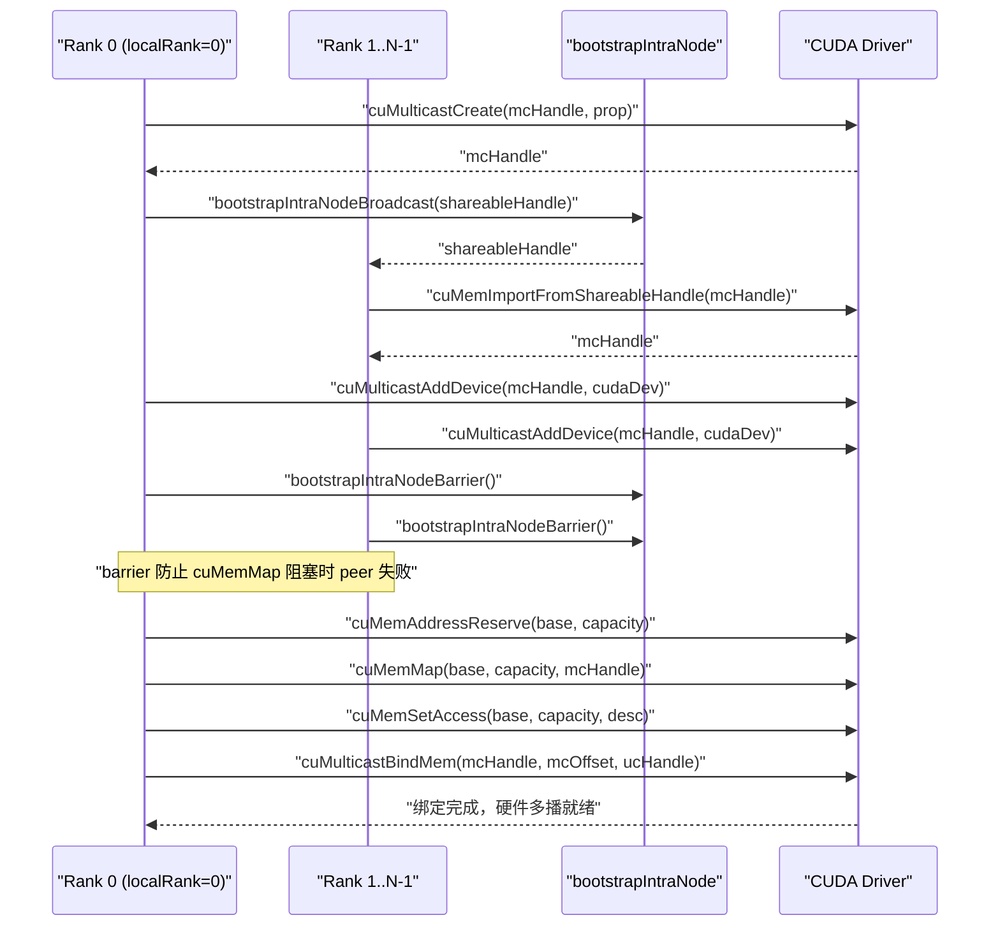
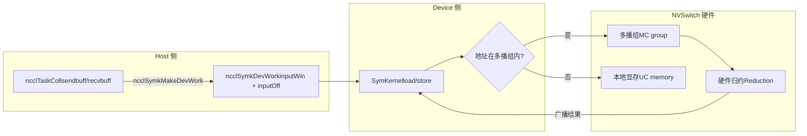

# 第 14 章：對稱記憶體與 NVLS：多播加速與 LSA 裝置端直接定址

上一章我們跟隨一次跨機 AllReduce，看資料如何從 GPU 顯存經網卡到達對端 GPU，那條路徑解決的是機器之間的通訊。但現代 AI 叢集裡，同一台機器甚至同一個 NVLink 域內部的 GPU 間通訊量同樣巨大——資料並行訓練中的梯度同步、張量並行中的激活值交換，絕大多數都發生在機內。如果機內通訊仍走 GPU→顯存→網卡→對端網卡→顯存→GPU 這套跨機流程，就相當於同城寄快遞非要走航空件，延遲白白浪費。本章要拆解的，正是 NCCL 為機內通訊準備的兩把利器：對稱記憶體與 NVLS。前者讓每個 rank 用同一套虛擬位址存取所有 rank 的緩衝區，後者利用 NVSwitch 硬體的多播能力做歸約。兩者結合，能把小訊息集合通訊的延遲壓到接近硬體極限。

# 14.1 對稱記憶體：讓「第 3 排第 5 座」在每個人家里都指同一個位置

## 直覺模型

想像一個班級要交換作業本。傳統做法是：每個人把自己的本子編號，然後喊「張三，我的第 5 本給你；李四，我的第 8 本給你」——每個人都要記住「誰的本子放在哪、第幾本」。這就是普通通訊：位址是**相對的、私有的**，你要存取對端資料，得先知道對端的位址映射。

對稱記憶體換了個思路：全班約定「第 3 排第 5 座」這個座標，在每個人家里都指向同一個實體位置。於是張三要拿李四的第 5 本，直接說「李四家第 3 排第 5 座」就行，不需要任何位址轉譯。這就是對稱記憶體的核心：**每個 rank 的緩衝區在所有 rank 的位址空間裡映射到相同的虛擬位址**。

> **[Design Inference & Architectural Trade-offs]**
> 如果沒有對稱記憶體，機內集合通訊會面臨什麼災難？ 每個 rank 存取對端緩衝區時，都要經過一次「位址轉譯」——查表、計算偏移、可能還要跨行程通訊確認映射關係。對於小訊息（幾 KB），這次轉譯的開銷可能比資料本身傳輸還大。對稱記憶體把這個開銷徹底消除，這正是它「顯著降低小訊息延遲」的根本原因。

## 資料結構與記憶體佈局

對稱記憶體的註冊類型由`ncclSymRegType_t`描述，`ncclGetSymRegType`根據 send/recv 視窗是否帶`NCCL_WIN_COLL_SYMMETRIC`標誌，把註冊狀態分成四類。

[FACT:src/sym_kernels.cc:395-412]

```c
ncclResult_t ncclGetSymRegType(struct ncclDevrWindow* sendWin, struct ncclDevrWindow* recvWin,
                               ncclSymRegType_t* winRegType) {
  bool isSendSymmReg = false;
  bool isRecvSymmReg = false;
  if (sendWin && (sendWin->winFlags & NCCL_WIN_COLL_SYMMETRIC)) isSendSymmReg = true;
  if (recvWin && (recvWin->winFlags & NCCL_WIN_COLL_SYMMETRIC)) isRecvSymmReg = true;
  // determine the registration type
  if (!isSendSymmReg && !isRecvSymmReg) {
    *winRegType = ncclSymSendNonregRecvNonreg;
  } else if (isSendSymmReg && !isRecvSymmReg) {
    *winRegType = ncclSymSendRegRecvNonreg;
  } else if (!isSendSymmReg && isRecvSymmReg) {
    *winRegType = ncclSymSendNonregRecvReg;
  } else if (isSendSymmReg && is isRecvSymmReg) {
    *winRegType = ncclSymSendRegRecvReg;
  }
  return ncclSuccess;
}
```

這四個狀態決定了後續 kernel 走哪條路徑：全對稱註冊（`SendRegRecvReg`）走最快的 LSA 路徑，全非註冊（`SendNonregRecvNonreg`）走普通路徑，混合狀態則要特殊處理。`winFlags`裡的`NCCL_WIN_COLL_SYMMETRIC`位就是「這個視窗是否已做對稱註冊」的標記。

對稱記憶體的初始化入口是`ncclSymkInitOnce`，它做了一件關鍵的事：判斷當前通訊域是否支援 LSA 多播（`hasLsaMultimem`）。

[FACT:src/sym_kernels.cc:185-196]

```c
ncclResult_t ncclSymkInitOnce(struct ncclComm* comm) {
  // ncclTeamLsa() below calls this internally but drops the error code so we do it here.
  NCCLCHECK(ncclDevrInitOnce(comm));

  struct ncclSymkState* symk = &comm->symkState;
  if (!symk->initialized) {
    symk->initialized = true;
    struct ncclDevCommRequirements reqs = NCCL_DEV_COMM_REQUIREMENTS_INITIALIZER;
    // Disable LSA multicast for cross-clique since NVLS isn't available across cliques
    symk->hasLsaMultimem =
      ncclNvlsSymmetricMultimemEnabled(comm) && ncclTeamLsa(comm).nRanks > 2 && !comm->p2pCrossClique;
    reqs.lsaMultimem = symk->hasLsaMultimem;
```

`hasLsaMultimem`的三個條件缺一不可：NVLS 對稱多播已啟用、LSA 團隊 rank 數大於 2（兩個 rank 直接點對點更快，不需要多播）、且不跨 clique（跨 clique 時 NVSwitch 多播不可用）。這個判斷直接決定了`reqs.lsaMultimem`是否置位，進而影響裝置側通訊器的資源分配。

## 場景驅動的 Step-by-Step Walkthrough

假設我們發起一次 AllReduce，訊息大小 4KB，8 個 rank 在同一 NVLink 域內。`ncclSymkMask`會決定哪些 kernel 可用。

[FACT:src/sym_kernels.cc:304-352]

```c
uint32_t ncclSymkMask(struct ncclComm* comm, ncclFunc_t coll, int /*ncclDevRedOp_t*/ red, ncclDataType_t ty,
                      size_t nElts, bool symAligned16B) {
  uint32_t kmask = kernelMask_coll(coll);

  bool hasSTMC = comm->symkState.hasLsaMultimem;
  bool hasLDMC = false;
  if (comm->symkState.hasLsaMultimem) {
    switch (ty) {
    case ncclInt32:
    ...
      hasLDMC = red == ncclDevSum || red == ncclDevMinMax || red == ncclDevSumPostDiv;
      break;
    ...
    }
  }
  if (!hasSTMC) kmask &= ~kernelMask_STMC;
  if (!hasLDMC) kmask &= ~kernelMask_LDMC;
```

第一步：`kernelMask_coll`根據集合類型（AllReduce）取出候選 kernel 集合`kernelMask_AR`。第二步：檢查`hasLsaMultimem`，如果支援多播，則進一步判斷資料類型和歸約操作是否支援 LDMC（Load-Multicast）。第三步：用位元遮罩清除不支援的特性——`kmask &= ~kernelMask_STMC`把不支援 STMC 的 kernel 全部剔除。

接著是大小限制：

[FACT:src/sym_kernels.cc:336-342]

```c
  size_t nBytes = alignUp(nElts * ncclTypeSize(ty), NCCL_SYM_KERNEL_CELL_SIZE);
  size_t nBusBytes = (coll == ncclFuncAllReduce ? 1 : comm->nRanks) * nBytes;
  // LL kernels use 32-bit ints to track element counts and indices.
  if (nBusBytes >= (size_t(2) = 32 * (size_t(2) nRanks;
  kmask &= needGin ? kernelMask_Gin : ~kernelMask_Gin;
  return kmask;
```

TMA 需要 SMEM 容量達標（`ncclSymkTmaAvailable`檢查`maxSharedMemOptin`）且 16 位元組對齊。GIN 則只在「LSA 團隊 rank 數小於總 rank 數」時才需要——也就是說，只有當通訊域跨越了 LSA 邊界（需要走網路）時，GIN 才有意義。如果整個通訊域都在 LSA 內，GIN kernel 被剔除。

## 並發控制與硬體互動

對稱記憶體的位址解析最終落到裝置側。`ncclSymkMakeDevWork`把 host 側的任務描述翻譯成裝置側可讀的工作項。

[FACT:src/sym_kernels.cc:380-393]

```c
ncclResult_t ncclSymkMakeDevWork(struct ncclComm* comm, struct ncclTaskColl* task, struct ncclSymkDevWork* outDevWork) {
  outDevWork->rootRank = task->root;
  outDevWork->redOpArg = task->opDev.scalarArg;
  outDevWork->nElts = task->count;
  outDevWork->inputWin = task->sendWin ? task->sendWin->vidmem : nullptr;
  outDevWork->inputOff =
    task->sendWin ? (uint8_t*)task->sendbuff - (uint8_t*)task->sendWin->userPtr : (size_t)task->sendbuff;
  outDevWork->outputWin = task->recvWin ? task->recvWin->vidmem : nullptr;
  outDevWork->outputOff =
    task->recvWin ? (uint8_t*)task->recvbuff - (uint8_t*)task->recvWin->userPtr : (size_t)task->recvbuff;
  outDevWork->sChannelId = 0xffff;
  outDevWork->nChannels = 0;
  return ncclSuccess;
}
```

注意`inputOff`的計算：如果 sendWin 存在（對稱註冊視窗），偏移是`sendbuff - sendWin->userPtr`——這是**視窗內偏移**，裝置側拿到`inputWin`（視窗基址）加上`inputOff`就能算出實際位址。如果 sendWin 不存在，偏移直接是`sendbuff`的絕對位址。這個設計讓裝置側 kernel 用同一套邏輯處理註冊和非註冊緩衝區。

`ncclSymkInitOnce`裡還初始化了 GIN 相關的資源需求，包括 inbox、outbox、accumulation buffer 和 rail signal。

[FACT:src/sym_kernels.cc:208-251]

```c
    struct ncclDevResourceRequirements ginInboxRailReq = {};
    struct ncclDevResourceRequirements ginOutboxReq = {};
    struct ncclDevResourceRequirements rsGinAccumReq = {};
    struct ncclDevResourceRequirements railSignalReq = {};
    if (ncclParamSymGinKernelsEnable() && ncclTeamLsa(comm).nRanks nRanks) {
      int maxBlocks;
      size_t bufSize;
      getRequirements_gin(comm, &maxBlocks, &bufSize);

      maxBlocks = std::max(maxBlocks, comm->config.minCTAs);
      maxBlocks = std::min(maxBlocks, comm->config.maxCTAs);
      if (ncclParamSymCTAs() >= 1) maxBlocks = ncclParamSymCTAs();
      maxBlocks = std::min(maxBlocks, ncclSymkMaxBlocks);
      symk->maxGinInboxBlocks = maxBlocks;
      symk->kcomm.rsGinAccumBytesPerBlock = ncclSymkRsGinAccumBytesPerBlock();

      rsGinAccumReq.bufferSize = (size_t)maxBlocks * symk->kcomm.rsGinAccumBytesPerBlock;
      rsGinAccumReq.bufferAlign = 128;
      rsGinAccumReq.outBufferHandle = &symk->kcomm.rsGinAccumBuf;
      ...
      uint32_t railSignalCount = ncclTeamRail(comm).nRanks * ncclSymkMaxBlocks;
      ...
      reqs.barrierCount = ncclSymkMaxBlocks;
      reqs.ginConnectionType = NCCL_GIN_CONNECTION_RAIL;
      reqs.ginStrongSignalsRequired = true;
      reqs.ginVaSignalsRequired = true;
    }
```

`getRequirements_gin`用調優模型算出需要的 block 數和緩衝區大小，然後被 clamp 到`[minCTAs, maxCTAs]`區間。`rsGinAccumBytesPerBlock`是每個 block 的累加緩衝區大小，對齊到 128 位元組——這是快取行大小，避免偽共享。

```mermaid
flowchart TD
    start["ncclSymkMask(comm, coll, red, ty, nElts)"] --> coll{"集合类型?"}
    coll -->|AllGather| mask_ag["kmask = kernelMask_AG"]
    coll -->|AllReduce| mask_ar["kmask = kernelMask_AR"]
    coll -->|ReduceScatter| mask_rs["kmask = kernelMask_RS"]
    mask_ag --> check_stmc{"hasLsaMultimem?"}
    mask_ar --> check_stmc
    mask_rs --> check_stmc
    check_stmc -->|否| clear_stmc["kmask &= ~kernelMask_STMC"]
    check_stmc -->|是| check_ldmc{"数据类型+归约支持LDMC?"}
    clear_stmc --> size_check
    check_ldmc -->|否| clear_ldmc["kmask &= ~kernelMask_LDMC"]
    check_ldmc -->|是| size_check
    clear_ldmc --> size_check
    size_check{"nBusBytes >= 2GB?"} -->|是| clear_ll["kmask &= ~kernelMask_LL"]
    size_check -->|否| tma_check
    clear_ll --> tma_check{"TMA可用且16B对齐?"}
    tma_check -->|否| clear_tma["kmask &= ~kernelMask_Tma"]
    tma_check -->|是| gin_check
    clear_tma --> gin_check{"需要GIN? LSA rank |否| clear_gin["kmask &= ~kernelMask_Gin"]
    gin_check -->|是| done
    clear_gin --> done["返回 kmask"]
```

這張圖完整刻畫了`ncclSymkMask`的決策鏈：從集合類型出發，依次經過多播支援、資料類型、大小邊界、TMA 可用性、GIN 需求五道過濾，最終返回一個位元遮罩。每一道過濾都可能把一批 kernel 剔除，這正是 NCCL「按場景選最優 kernel」的體現。

## 生產避坑指南

**坑 1：跨 clique 時多播靜默失效。** `hasLsaMultimem`的第三個條件是`!comm->p2pCrossClique`。如果你的叢集配置了 MNNVL（Multi-Node NVLink），但某些 rank 跨了 clique，多播會被禁用，效能悄悄退化到普通路徑。排查時看`ncclNvlsSymmetricMultimemEnabled`的日誌輸出。

**坑 2：16 位元組對齊的隱性要求。** `ncclSymkMask`裡`if (!symAligned16B) kmask &= ~kernelMask_Tma;`——如果使用者緩衝區不是 16 位元組對齊，TMA kernel 被剔除。TMA 是 Hopper/Blackwell 上最快的拷貝引擎，失去它意味著效能下降。生產環境裡，使用者傳入的 buffer 往往來自`cudaMalloc`，天然對齊；但如果來自自訂 allocator 或切片，就可能踩坑。

**坑 3：2GB 邊界。**LL kernel 用 32 位元索引，超過 2GB 匯流排位元組數就被剔除。對於大模型訓練，單次 AllReduce 的梯度可能超過這個值，此時 NCCL 會自動切到 STMC 或 Simple 協議。這不是 bug，但如果你手動指定了 LL 協議，會得到`ncclInvalidArgument`。

---

# 14.2 NVLS：讓 NVSwitch 硬體替你做歸約

## 直覺模型

傳統 AllReduce 是「軟體歸約」：每個 GPU 把資料發給鄰居，鄰居做加法，再轉發——資料在 GPU 之間來回搬運，加法在 SM 上執行。這就像 8 個人傳紙條算總和，每個人都要讀一遍、加一遍、再傳出去。

NVLS 換了個思路：NVSwitch 晶片內建了**多播（multicast）和歸約（reduction）能力**。你把資料往多播位址一寫，NVSwitch 自動把它廣播給所有成員，並在硬體裡完成加法。這就像 8 個人把數字寫在同一塊白板上，白板自動顯示總和——GPU 只寫一次、讀一次，中間的搬運和加法全由交換器硬體完成。

如果沒有 NVLS，機內 AllReduce 的頻寬會被 GPU 之間的點對點鏈路限制，且 SM 要花大量週期做加法。NVLS 把這兩件事都卸載到硬體，SM 可以去做別的計算。

## 資料結構與記憶體佈局

NVLS 的核心是**多播組（MC group）**。`ncclMcGroup`結構體描述了一個多播組的全部狀態。

[FACT:src/transport/multicast.cc:72-77]

```c
struct ncclMcGroup {
  CUmemGenericAllocationHandle handle;  // the MC object
  char* base;                          // mapped MC VA base
  size_t capacity;                      // total mapped VA size
  int dev;                           // local device, for unbind
};
```

四個欄位：`handle`是 CUDA 多播物件的句柄，`base`是多播虛擬位址的基址，`capacity`是總映射大小，`dev`是本地裝置號（用於解綁）。注意這裡沒有鎖——多播組的建立和銷毀都在初始化/銷毀階段，不在熱路徑上。

多播組被切分成多個**分區（partition）**，每個分區是一個不可變的切片。`ncclMcPartition`描述一個分區。

[FACT:src/transport/multicast.cc:162-170]

```c
  // A partition is self-sufficient for binds: it carries the group's handle, device and
  // bind granularity alongside its own extent.
  for (int i = 0; i base + outPartitions[i].offset;
    outPartitions[i].mcHandle = mcHandle;
    outPartitions[i].minGranularity = minGran;
    outPartitions[i].dev = comm->cudaDev;
  }
```

每個分區攜帶自己的`offset`、`size`、`ptr`，以及所屬組的`mcHandle`、`minGranularity`、`dev`。這種「自給自足」的設計讓分區可以獨立傳遞給綁定函式，不需要再查組資訊。

## 場景驅動的 Step-by-Step Walkthrough

假設 8 個 rank 要建立一個 NVLS 域。`ncclMcGroupBuildPartitions`負責建立多播組並切分分區。

[FACT:src/transport/multicast.cc:79-121]

```c
ncclResult_t ncclMcGroupBuildPartitions(struct ncclComm* comm, const struct ncclMcRequest* requests, int nRequests,
                                        struct ncclMcGroup** outGroup, struct ncclMcPartition* outPartitions) {
  ...
  mcprop.numDevices = comm->localRanks;
  mcprop.handleTypes = ncclCuMemHandleType;
  mcprop.flags = 0;
  mcprop.size = 0;
  for (int i = 0; i  recGran ? requests[i].alignment : recGran;
    ALIGN_SIZE(capacity, align);
    size_t slice = requests[i].size;
    ALIGN_SIZE(slice, recGran);
    outPartitions[i].offset = capacity;
    outPartitions[i].size = slice;
    capacity += slice;
  }
```

第一步：累加所有請求的大小，得到多播組總大小。第二步：查詢 CUDA 的推薦粒度和最小粒度——這是硬體約束，多播物件的位址和大小必須是粒度的整數倍。第三步：bump 分配——每個請求切一塊，偏移和大小都對齊到推薦粒度。`ALIGN_SIZE(capacity, align)`確保每個切片的起始偏移是合法的綁定偏移。

接下來是跨 rank 的建立與匯入：

[FACT:src/transport/multicast.cc:125-146]

```c
  if (comm->localRank == 0) {
    NCCLCHECKGOTO(ncclMcCreate(comm, &mcprop, comm->localRank, comm->localRanks, &mcHandle, shareableHandle), ret,
                  fail);
    mcCreated = 1;
    NCCLCHECKGOTO(bootstrapIntraNodeBroadcast(comm->bootstrap, comm->localRankToRank, comm->localRank, comm->localRanks,
                                              0, shareableHandle, NVLS_HANDLE_SIZE),
                  ret, fail);
  } else {
    NCCLCHECKGOTO(bootstrapIntraNodeBroadcast(comm->bootstrap, comm->localRankToRank, comm->localRank, comm->localRanks,
                                              0, shareableHandle, NVLS_HANDLE_SIZE),
                  ret, fail);
    NCCLCHECKGOTO(ncclMcImport(comm, shareableHandle, comm->localRankToRank[0], &mcHandle), ret, fail);
    mcCreated = 1;
  }
  CUCHECKGOTO(cuMulticastAddDevice(mcHandle, comm->cudaDev), ret, fail);

  // cuMemMap of an MC object blocks until every device has been added. This
  // abort-aware barrier makes a peer failing before cuMulticastAddDevice trip the
  // abort flag here instead of stranding survivors in the blocking cuMemMap.
  NCCLCHECKGOTO(bootstrapIntraNodeBarrier(comm->bootstrap, comm->localRankToRank, comm->localRank, comm->localRanks,
                                          comm->localRankToRank[0]),
                ret, fail);
```

localRank 0 建立多播物件，然後透過 bootstrap 廣播 shareable handle；其他 rank 接收 handle 並匯入。`cuMulticastAddDevice`把本地裝置加入多播組。注意那個 barrier——註解說得很清楚：`cuMemMap`會阻塞直到所有裝置都加入，如果某個 peer 在`cuMulticastAddDevice`之前失敗，倖存者會卡死在`cuMemMap`裡。這個 barrier 讓失敗在阻塞前就被 abort 標誌捕獲。

最後是映射和存取權限設定：

[FACT:src/transport/multicast.cc:148-155]

```c
  // Reserve and map the whole MC VA once; each consumer slice is a view into it.
  CUCHECKGOTO(cuMemAddressReserve(&base, capacity, recGran, 0U, 0), ret, fail);
  CUCHECKGOTO(cuMemMap(base, capacity, 0, mcHandle, 0), ret, fail);
  mapped = 1;
  desc.flags = CU_MEM_ACCESS_FLAGS_PROT_READWRITE;
  desc.location.type = CU_MEM_LOCATION_TYPE_DEVICE;
  desc.location.id = comm->cudaDev;
  CUCHECKGOTO(cuMemSetAccess(base, capacity, &desc, 1), ret, fail);
```

整個多播 VA 只保留和映射一次，每個消費者切片是這個 VA 的一個視圖。這是「一次映射、多次切片」的設計——比每個消費者單獨建立多播物件省資源。

## 並行控制與硬體互動

綁定是 NVLS 最關鍵的操作。`ncclMcPartitionBindMem`把一個 UC（單播）記憶體句柄綁定到多播組的某個偏移。

[FACT:src/transport/multicast.cc:200-225]

```c
ncclResult_t ncclMcPartitionBindMem(const struct ncclMcPartition* partition, size_t offsetInPartition,
                                    CUmemGenericAllocationHandle mem, size_t memOffset, size_t bindSize) {
  // A bind overrunning its partition would corrupt the next consumer's partition; fail
  // cleanly instead (possible when UC rounding exceeds the MC-rounded partition).
  if (offsetInPartition + bindSize > partition->size) {
    WARN("NVLS MC bind of size %zu at slice offset %zu exceeds slice size %zu (UC/MC granularity mismatch)", bindSize,
         offsetInPartition, partition->size);
    return ncclInternalError;
  }
  size_t mcOffset = partition->offset + offsetInPartition;
  ...
  CUresult err = CUPFN(cuMulticastBindMem(partition->mcHandle, mcOffset, mem, memOffset, bindSize, 0 /*flags*/));
  if (err != CUDA_SUCCESS) {
    ...
    WARN("Failed to bind NVLink SHARP (NVLS) Multicast memory of size %zu at MC group %llx offset %zu : CUDA error %d "
         "'%s'.\nThis is usually caused by a system or configuration error in the Fabric Manager or NVSwitches.\n"
         "Disable NVLS (NCCL_NVLS_ENABLE=0) if you wish to avoid this error in the future.",
         bindSize, partition->mcHandle, mcOffset, err, errStr);
    return ncclUnhandledCudaError;
  }
  return ncclSuccess;
}
```

第一道防線是邊界檢查：`offsetInPartition + bindSize > partition->size`就報錯。註解解釋了原因——UC 記憶體的粒度可能比 MC 分區大，如果 UC 對齊後超出了 MC 分區的邊界，會踩到下一個消費者的分區。這是典型的「兩種粒度不匹配」陷阱。

`cuMulticastBindMem`是硬體呼叫，註解說它「blocks until all ranks have been added to the group」——這是 NVLS 最容易出問題的地方。如果 Fabric Manager 配置錯誤或 NVSwitch 韌體有問題，這裡會掛起或返回錯誤。錯誤訊息裡直接建議使用者`NCCL_NVLS_ENABLE=0`，這是生產環境的標準逃生艙。

還有一個「嘗試綁定」的變體，用於使用者緩衝區註冊：

[FACT:src/transport/multicast.cc:237-268]

```c
ncclResult_t ncclMcPartitionTryBindAddr(const struct ncclMcPartition* partition, size_t offsetInPartition,
                                        CUdeviceptr address, size_t bindSize, enum ncclMcBindStatus* outStatus) {
  const char* errStr = NULL;

  *outStatus = ncclMcBindStatusTransient;
  if (offsetInPartition + bindSize > partition->size) {
    ...
    return ncclInternalError;
  }
  size_t mcOffset = partition->offset + offsetInPartition;
  CUresult err = CUPFN(cuMulticastBindAddr(partition->mcHandle, mcOffset, address, bindSize, 0 /*flags*/));
  if (err == CUDA_SUCCESS) {
    *outStatus = ncclMcBindStatusOk;
    return ncclSuccess;
  }

  (void)pfn_cuGetErrorString(err, &errStr);
  // Only an outright rejection of the input is a property of the buffer. Anything else,
  // notably OUT_OF_MEMORY, may succeed later, so it must not be reported as permanent.
  if (err == CUDA_ERROR_INVALID_VALUE || err == CUDA_ERROR_NOT_SUPPORTED || err == CUDA_ERROR_NOT_PERMITTED) {
    *outStatus = ncclMcBindStatusNoSupport;
    ...
  } else {
    WARN("NVLS Multicast bind of size %zu at MC group %llx offset %zu dev %d failed transiently: CUDA error %d '%s'.\n"
         "The buffer is left unregistered for this operation and will be retried; repeated occurrences indicate "
         "sustained resource pressure.",
         bindSize, partition->mcHandle, mcOffset, partition->dev, err, errStr);
  }
  return ncclSuccess;
}
```

這裡有個精妙的錯誤分類：`CUDA_ERROR_INVALID_VALUE`、`NOT_SUPPORTED`、`NOT_PERMITTED`被歸類為`ncclMcBindStatusNoSupport`——這是**永久性失敗**，說明這個 buffer 本身不支援多播綁定。而其他錯誤（尤其是`OUT_OF_MEMORY`）被歸類為`ncclMcBindStatusTransient`——這是**臨時性失敗**，可以重試。這個區分至關重要：如果把 OOM 當成永久失敗，會錯誤地放棄一個本可以成功的註冊；如果把參數錯誤當成臨時失敗，會無限重試。

## 生產避坑指南

**坑 1：Fabric Manager 配置錯誤導致`cuMulticastBindMem`掛起。**這是 NVLS 最經典的生產故障。錯誤訊息裡明確指向 Fabric Manager 或 NVSwitch。排查步驟：先`NCCL_NVLS_ENABLE=0`確認問題消失，然後檢查 Fabric Manager 日誌和 NVSwitch 韌體版本。

**坑 2：UC/MC 粒度不匹配。** `ncclMcPartitionBindMem`的邊界檢查會捕獲這個問題，但如果你看到 "UC/MC granularity mismatch" 警告，說明某個請求的 UC 大小對齊後超出了 MC 分區。這通常發生在請求大小接近粒度邊界時。

**坑 3：多播組建立失敗後的資源洩漏。** `ncclMcGroupBuildPartitions`的 fail 路徑用了`CUCALL`（best-effort）而不是`CUCHECK`：

[FACT:src/transport/multicast.cc:179-184]

```c
fail:
  // Best-effort (CUCALL) so a failing cleanup op cannot skip releasing the MC handle.
  if (mapped) CUCALL(cuMemUnmap(base, capacity));
  if (base) CUCALL(cuMemAddressFree(base, capacity));
  if (mcCreated) CUCALL(cuMemRelease(mcHandle));
  return ret;
```

註解解釋了原因：如果 cleanup 操作本身失敗，不能因此跳過釋放 MC handle——MC slot 是稀缺資源，洩漏會導致後續建立失敗。這是「清理路徑必須盡力而為」的典型設計。



這張時序圖刻畫了多播群組從建立到綁定的完整流程。關鍵點是那個 barrier——它把「peer 失敗」和「cuMemMap 阻塞」解耦，避免倖存者卡死。

---

# 14.3 對稱記憶體與 NVLS 的合體：LSA 指標如何在裝置側解析

## 直覺模型

對稱記憶體解決了「位址一致」問題，NVLS 解決了「硬體歸約」問題。但兩者要真正協同，還需要一個關鍵機制：**裝置側如何知道某個位址是對稱的、可以走多播路徑？**

答案在 LSA（Load-Store Accessible）指標。LSA 是「可載入-儲存存取」的縮寫，意思是這個指標指向的記憶體，GPU 可以直接用普通的 load/store 指令存取——不管它實體上在本地還是遠端。如果位址落在多播群組內，load/store 會被 NVSwitch 硬體攔截並廣播。

## 資料結構與記憶體佈局

`ncclSymkDevWork`是裝置側的工作描述符，它攜帶了對稱記憶體的關鍵資訊。

[FACT:src/sym_kernels.cc:380-393]

```c
ncclResult_t ncclSymkMakeDevWork(struct ncclComm* comm, struct ncclTaskColl* task, struct ncclSymkDevWork* outDevWork) {
  outDevWork->rootRank = task->root;
  outDevWork->redOpArg = task->opDev.scalarArg;
  outDevWork->nElts = task->count;
  outDevWork->inputWin = task->sendWin ? task->sendWin->vidmem : nullptr;
  outDevWork->inputOff =
    task->sendWin ? (uint8_t*)task->sendbuff - (uint8_t*)task->sendWin->userPtr : (size_t)task->sendbuff;
  outDevWork->outputWin = task->recvWin ? task->recvWin->vidmem : nullptr;
  outDevWork->outputOff =
    task->recvWin ? (uint8_t*)task->recvbuff - (uint8_t*)task->recvWin->userPtr : (size_t)task->recvbuff;
  outDevWork->sChannelId = 0xffff;
  outDevWork->nChannels = 0;
  return ncclSuccess;
}
```

`inputWin`是視窗的裝置側虛擬位址（`vidmem`），`inputOff`是緩衝區在視窗內的偏移。裝置側 kernel 拿到這兩個值後，計算`inputWin + inputOff`就得到實際位址。如果這個位址落在多播群組內，硬體會自動處理廣播。

`ncclSymkInitOnce`裡還設定了 LSA barrier 和 LLA2A（Low-Latency All-to-All）資源。

[FACT:src/sym_kernels.cc:197-206]

```c
    reqs.lsaBarrierCount = ncclSymkMaxBlocks;
    reqs.ginStrongSignalsRequired = false;
    reqs.ginVaSignalsRequired = false;

    struct ncclDevResourceRequirements lla2aReq;
    ncclLLA2ACreateRequirement(ncclSymkMaxBlocks,
                               ncclLLA2ACalcSlots(ncclTeamLsa(comm).nRanks * ncclSymkMaxThreads, ncclSymkLLMaxEltSize),
                               &symk->kcomm.lsaLLA2A, &lla2aReq);
    lla2aReq.next = reqs.resourceRequirementsList;
    reqs.resourceRequirementsList = &lla2aReq;
```

`lsaBarrierCount`設為`ncclSymkMaxBlocks`——每個 block 一個 barrier 槽位。LLA2A 是低延遲 all-to-all 的縮寫，用於在 LSA 域內做快速資料交換。`ncclLLA2ACalcSlots`根據 rank 數、執行緒數和最大元素大小算出需要的槽位數。

## 場景驅動的 Step-by-Step Walkthrough

假設一次 AllReduce 使用`AllReduce_AGxLLMC_R`kernel（AllGather + LL + MC + Reduce）。這個 kernel 的工作流程是：

1. **AllGather 階段**：每個 rank 把自己的資料寫入多播群組，NVSwitch 硬體廣播給所有 rank。

2. **Reduce 階段**：每個 rank 從多播群組讀取所有 rank 的資料，在本地做歸約。

`ncclSymkMask`會檢查這個 kernel 是否可用。`kernelMask_LL`包含`AllReduce_AGxLLMC_R`，但前提是`hasLsaMultimem`為真（否則`kernelMask_STMC`被清除，而`AllReduce_AGxLLMC_R`屬於 STMC 集合）。

等等，這裡有個細節：`kernelMask_STMC`包含`AllReduce_AGxLLMC_R`嗎？看原始碼：

[FACT:src/sym_kernels.cc:17-21]

```c
constexpr uint32_t kernelMask_STMC =
  1 nvlsChannels;
    size_t creditSize = nChannels * 2 * memSize * nHeads;
    int nvlsStepSize = comm->nvlsChunkSize;

    NCCLCHECKGOTO(ncclCalloc(&comm->nvlsResources, 1), res, fail);
    comm->nvlsResources->inited = false;
    comm->nvlsResources->refCount = 1;
    comm->nvlsResources->nChannels = nChannels;
    comm->nvlsResources->nHeads = nHeads;
    comm->nvlsResources->chunkSize = comm->nvlsChunkSize;
    comm->nvlsResources->treeMaxChunkSize = comm->nvlsTreeMaxChunkSize;
    resources = comm->nvlsResources;

    for (int c = 0; c accessDesc, 0, sizeof(resources->accessDesc));
    resources->accessDesc.flags = CU_MEM_ACCESS_FLAGS_PROT_READWRITE;
    resources->accessDesc.location.type = CU_MEM_LOCATION_TYPE_DEVICE;
    resources->accessDesc.location.id = comm->cudaDev;
    resources->dev = comm->cudaDev;

    // Build the single shared MC group for this NVLS domain. The data slice is
    // reserved here but bound later by ncclNvlsBufferSetup.
    {
      size_t buffSize = nvlsStepSize * NCCL_STEPS;
      size_t dataSize = nChannels * 2 * buffSize * nHeads;
      size_t ubSize = ncclNvlsUbSize(comm);
      struct ncclMcRequest requests[3] = {{creditSize, 0}, {dataSize, 0}, {ubSize, 0}};
      struct ncclMcPartition partitions[3];
      NCCLCHECKGOTO(ncclMcGroupBuildPartitions(comm, requests, 3, &resources->mcGroup, partitions), res, fail);
      resources->creditPartition = partitions[0];
      resources->dataPartition = partitions[1];
      if (ubSize) {
        resources->ubPartition = partitions[2];
        NCCLCHECKGOTO(ncclMcArenaInit(comm, &resources->ubArena, &resources->ubPartition), res, fail);
        resources->ubEnabled = true;
      }
      NCCLCHECKGOTO(nvlsAllocBindUc(comm, &resources->creditPartition, creditSize, &resources->creditUc), res, fail);
    }
```

多播群組被切成三個分區：`creditPartition`（信用）、`dataPartition`（資料）、`ubPartition`（使用者緩衝區）。credit 分區用於同步——每個 channel 有獨立的 head/tail 指標，透過多播群組共享。

credit 的初始化在後面的迴圈裡：

[FACT:src/transport/nvls.cc:456-491]

```c
    for (int h = 0; h nRanks + 1 + h;
      for (int c = 0; c channels + c;
        char* mem = NULL;
        struct ncclChannelPeer* peer = channel->peers[nvlsPeer];

        // Reduce UC -> MC
        mem = (char*)resources->creditUc.ptr + (h * 2 * nChannels + c) * memSize;
        peer->send[1].transportComm = &nvlsTransport.send;
        peer->send[1].conn.buffs[NCCL_PROTO_SIMPLE] = NULL;
        peer->send[1].conn.head = (uint64_t*)mem;
        peer->send[1].conn.tail = (uint64_t*)(mem + memSize / 2);
        peer->send[1].conn.stepSize = nvlsStepSize;
        mem = (char*)resources->creditPartition.ptr + (h * 2 * nChannels + c) * memSize;
        peer->recv[0].transportComm = &nvlsTransport.recv;
        peer->recv[0].conn.buffs[NCCL_PROTO_SIMPLE] = NULL;
        peer->recv[0].conn.head = (uint64_t*)mem;
        peer->recv[0].conn.tail = (uint64_t*)(mem + memSize / 2);
        peer->recv[0].conn.stepSize = nvlsStepSize;
        peer->recv[0].conn.flags |= NCCL_NVLS_MIN_POLL;
```

每個 head 和 channel 組合都有獨立的 credit 區域。`head`和`tail`是 64 位元指標，`memSize`是 64 位元組（`size_t memSize = 64;`），所以 head 和 tail 各佔 32 位元組——正好半個快取行。`NCCL_NVLS_MIN_POLL`標誌讓接收方用最小輪詢模式，減少 CPU 開銷。

## 生產避坑指南

**坑 1：credit 分區的 head/tail 競爭。**多個 channel 共享同一個多播群組，但每個 channel 有獨立的 credit 區域。如果 channel 數配置不當（比如`nvlsCTAs`設得太大），credit 區域會膨脹，佔用寶貴的多播位址空間。`ncclNvlsChannels`會根據 GPU 架構和節點數自動調整 channel 數：

[FACT:src/transport/nvls.cc:100-133]

```c
  if (comm->config.nvlsCTAs != NCCL_CONFIG_UNDEF_INT) {
    channels = comm->config.nvlsCTAs;
  } else if (channels == 0 && comm->compCap >= 100) {
    // Use a reduced number of channels for single node/MNNVL domain on Blackwell and above.
    // comm->nNodes is not yet initialized at this point so we need to use local information.
    bool multiNode = false;
    if (comm->MNNVL) {
      multiNode = (comm->clique.size nRanks);
    } else {
      int i;
      for (i = 1; i nRanks; i++) {
        if (comm->peerInfo[i].hostHash != comm->peerInfo[0].hostHash) break;
      }
      multiNode = (i nRanks);
    }
    if (multiNode) {
      channels = RUBIN_AND_LATER(comm->compCap) ? /*RUBIN=*/64 : /*SM100=*/32;
    } else {
      channels = RUBIN_AND_LATER(comm->compCap) ? /*RUBIN=*/48 : /*SM100=*/24;
    }
  } else if (channels == 0) {
    channels = /*SM90=*/16;
  }
```

注意`comm->nNodes`在這個階段還沒初始化，所以程式碼用`peerInfo[i].hostHash`手動判斷是否多節點。這是初始化順序的經典陷阱——你不能依賴還沒算出來的欄位。

**坑 2：MNNVL 不支援 NVLS buffer 註冊。** [FACT:src/transport/nvls.cc:516-517]

```c
  // MNNVL does not support NVLS buffer registration
  if (!comm->MNNVL && comm->nvlsResources->nvlsShmemHandle == NULL) {
```

MNNVL（Multi-Node NVLink）環境下，使用者緩衝區註冊被跳過。如果你的叢集是 MNNVL 且依賴 UB 註冊來提升效能，會發現註冊沒生效。這是硬體限制，不是 bug。

**坑 3：共享資源的引用計數。** `ncclNvlsSetup`支援父子通訊域共享 NVLS 資源：

[FACT:src/transport/nvls.cc:380-392]

```c
  if (nvlsShare) {
    /* reuse NVLS resources */
    comm->nvlsChannels = std::min(comm->nvlsChannels, parent->nvlsResources->nChannels);
    /* Inherit chunk sizes from the shared resource since we're reusing the parent's
     * NVLS buffers, which were allocated and laid out based on these values. */
    comm->nvlsChunkSize = parent->nvlsResources->chunkSize;
    comm->nvlsTreeMaxChunkSize = parent->nvlsResources->treeMaxChunkSize;
    for (int c = 0; c nvlsChannels; c++) {
      NCCLCHECKGOTO(initNvlsChannel(comm, c, parent, true), res, fail);
    }

    comm->nvlsResources = parent->nvlsResources;
    ncclAtomicRefCountIncrement(&parent->nvlsResources->refCount);
  }
```

子通訊域復用父通訊域的資源，引用計數加一。`ncclNvlsFree`裡引用計數減到零才真正釋放。如果引用計數管理出錯，會導致資源提前釋放或洩漏。注意`nvlsChunkSize`和`nvlsTreeMaxChunkSize`必須繼承父通訊域的值——因為緩衝區是按這些值佈局的，改了會導致位址計算錯誤。



這張資料流圖展示了從 host 側任務到裝置側執行的完整鏈路。關鍵分支是`lsa{"地址在多播组内?"}`——如果是，走 NVSwitch 硬體多播和歸約；如果否，走本地顯存。這個判斷由硬體根據位址範圍自動完成，不需要軟體干預。

---

# 14.4 設計思考：為什麼對稱記憶體能降低小訊息延遲

回到本章開頭的核心問題：為什麼對稱記憶體能顯著降低小訊息延遲？

**第一，消除了位址轉譯開銷。**傳統通訊裡，每個 rank 存取對端緩衝區都要查表、計算偏移。對稱記憶體讓所有 rank 用同一套位址，裝置側 kernel 直接算`base + offset`就行。對於小訊息，這次轉譯的開銷佔比很高。

**第二，消除了控制訊息往返。**傳統通訊需要交換「我要寫你的哪個緩衝區」這類控制資訊。對稱記憶體下，位址是預先約定好的，不需要執行時協商。

**第三，讓硬體多播成為可能。**只有當位址對稱時，NVSwitch 才能用同一套位址做多播。如果每個 rank 的位址不同，硬體無法知道該廣播到哪裡。

**第四，減少了 SM 的歸約負擔。**NVLS 把加法卸載到 NVSwitch，SM 只需要發起一次寫、一次讀。對於小訊息，SM 的指令開銷是延遲的主要來源。

這四個因素疊加，讓小訊息延遲從「微秒級」降到「亞微秒級」。

> **[Design Inference & Architectural Trade-offs]**
> 從工程角度看，對稱記憶體的設計體現了 NCCL 的一個核心哲學：**把複雜性推到初始化階段，讓熱路徑盡可能簡單**。位址協商、多播組建立、credit 分配都在初始化時完成，執行時 kernel 只需要做最簡單的位址計算和 load/store。這種「初始化重、執行時輕」的設計，是高效能通訊庫的通用模式。

---

# 本章小結

本章拆解了 NCCL 機內通訊的兩大支柱：

1. **對稱記憶體**：透過`ncclSymkInitOnce`和`ncclSymkMask`建立位址一致的緩衝區，讓每個 rank 用同一套位址存取所有 rank 的資料。`ncclSymkMakeDevWork`把 host 側任務轉譯成裝置側工作項，`inputWin + inputOff`是位址解析的核心公式。

2. **NVLS 多播**：透過`ncclMcGroupBuildPartitions`建立多播組，`ncclMcPartitionBindMem`把 UC 記憶體綁定到多播組，`cuMulticastBindMem`是硬體呼叫。多播組被切成 credit、data、ub 三個分區，分別用於同步、資料傳輸和使用者緩衝區註冊。

3. **LSA 指標解析**：裝置側根據位址範圍自動判斷是否走多播路徑，不需要軟體轉譯。`NCCL_NVLS_MIN_POLL`標誌優化輪詢開銷。

4. **錯誤處理**：`ncclMcPartitionTryBindAddr`區分永久性失敗和臨時性失敗，`ncclMcGroupBuildPartitions`的 fail 路徑用`CUCALL`確保資源釋放。

# 本章思考與自測

Q1: 如果把`ncclMcPartitionBindMem`裡的邊界檢查`if (offsetInPartition + bindSize > partition->size)`去掉，在什麼場景下會觸發記憶體越界？為什麼這個檢查不能用「UC 和 MC 粒度相同」來替代？

**參考解析**：看[FACT:src/transport/multicast.cc:200-208]：
