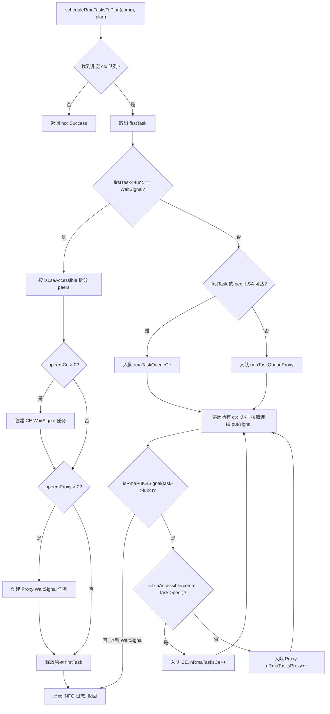
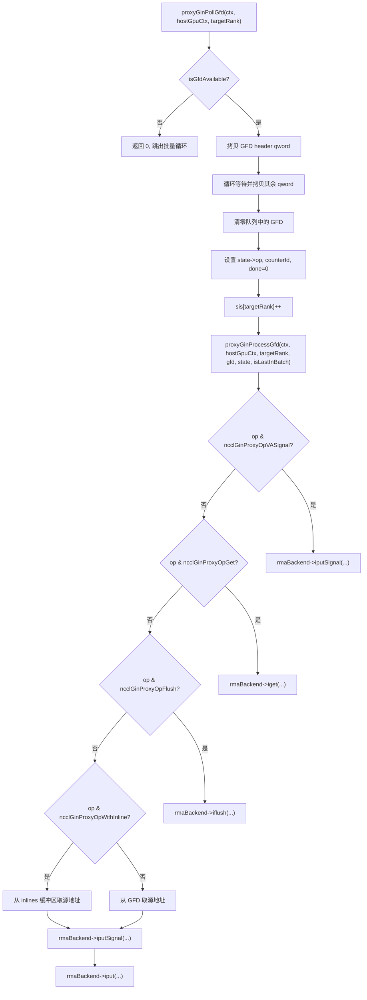

# 第 15 章：RMA 與 GIN：遠端記憶體存取與 GPU 直連通訊的演進

上一章我們看到，對稱記憶體讓每個 rank 用同一套位址存取所有 rank 的緩衝區，NVLS 則藉助 NVSwitch 的多播能力把硬體加速歸約推向極致。但集合通訊並非全部——當應用需要點對點遠端記憶體操作，或希望 GPU kernel 直接發起網路請求時，就需要 RMA 與 GIN 登場。RMA 提供 put/get 語意的遠端記憶體存取，GIN 則讓 GPU 繞過 host proxy 執行緒直接與網路互動。本章按「先 RMA 後 GIN」的順序，逐層拆解這兩套機制的資料結構、排程邏輯、並發控制與生產陷阱。

# RMA 的雙通道模型：CE 與 Proxy 的分工

## 直覺模型

想像一個跨國快遞系統：同城快遞（LSA 可達的 rank）可以直接由本地配送車送達，而跨城快遞（非 LSA 可達的 rank）必須交給航空貨運代理。NCCL 的 RMA 正是這個模型——同一個 put 操作，根據目標 rank 是否在 LSA（Load-Store Accessible）團隊內，被路由到兩條完全不同的執行路徑：CE（Copy Engine，拷貝引擎）路徑和 Proxy（代理執行緒）路徑。

如果沒有這個分流機制，所有 RMA 操作都走 proxy 執行緒，那麼同機內的 put 也要經過 host 執行緒中轉，白白增加一次 host-device 往返延遲。反之，如果所有操作都走 CE，跨機操作就無法利用網路外掛的異步能力。

## 資料結構與記憶體佈局

RMA 的核心調度結構是`ncclRmaArgs`，它記錄了一個 plan 中 RMA 任務的分流結果。關鍵欄位包括：

| 欄位 | 含義 |
| --- | --- |
| `func` | 操作類型（PutSignal / Signal / WaitSignal） |
| `nRmaTasks` | 總任務數 |
| `nRmaTasksProxy` | 走 proxy 路徑的任務數 |
| `nRmaTasksCe` | 走 CE 路徑的任務數 |

每個 plan 內部維護兩個侵入式佇列：`rmaTaskQueueCe`和`rmaTaskQueueProxy`，分別存放兩條路徑的任務。[FACT:src/rma/rma.cc:166-171]

判斷一個 rank 是否 LSA 可達的邏輯很直接——遍歷`lsaRankList`陣列做線性查找。[FACT:src/rma/rma.cc:34-41]這個查找在任務調度時對每個 peer 執行一次，複雜度 O(lsaSize)，對於典型的小規模 LSA 團隊（通常 2-8 個 rank）開銷可忽略。

## Step-by-Step 調度流程

當應用呼叫一次 RMA put 操作後，任務進入`planner->rmaTaskQueues[ctx]`。`scheduleRmaTasksToPlan`負責把佇列中的任務分配到 plan 中。[FACT:src/rma/rma.cc:141-296]

第一步：找到第一個非空的 context 佇列。NCCL 支援多個 RMA context（由`numRmaCtx`配置），每個 context 有獨立的佇列。[FACT:src/rma/rma.cc:148-155]

第二步：取出第一個任務，判斷操作類型。如果是 WaitSignal，走特殊的分裂邏輯；如果是 Put/Signal，走批量合併邏輯。[FACT:src/rma/rma.cc:163-168]

對於 WaitSignal 任務，調度器需要把 peers 列表按 LSA 可達性拆分成兩組：CE 組和 Proxy 組。[FACT:src/rma/rma.cc:187-204]拆分後分別建立兩個新的`ncclTaskRma`結構，各自持有對應組的 peers 陣列。[FACT:src/rma/rma.cc:207-246]原始任務被釋放。[FACT:src/rma/rma.cc:251]

對於 Put/Signal 任務，邏輯更複雜——調度器會遍歷所有 context 的佇列，把連續的 put/signal 任務全部拉入同一個 plan，直到遇到 WaitSignal 才停止。[FACT:src/rma/rma.cc:279-295]這個設計的目的在註解中寫得很清楚：讓一次 kernel launch 覆蓋所有 context 的 put/signal，proxy 可以在任何阻塞操作之前一次性發起所有異步請求，CE 路徑則把所有 context 的拷貝和信號批量提交。[FACT:src/rma/rma.cc:270-278]

## 並行執行與流同步

調度完成後，`ncclLaunchRma`根據`func`欄位分發到`ncclRmaPut`或`ncclRmaWaitSignal`。[FACT:src/rma/rma.cc:109-131]

以`ncclRmaPut`為例，當 plan 中同時存在 proxy 和 CE 任務時，兩條路徑需要並行執行。NCCL 的做法是：在輸入流上記錄一個 event，讓 CE 流等待這個 event，然後同時在兩條流上啟動操作，最後在 CE 流上再記錄一個 event，讓輸入流等待它。[FACT:src/rma/rma.cc:80-96]這個 event 鏈確保了：CE 操作不會在輸入流的依賴就緒前開始，輸入流的後續操作也不會在 CE 完成前開始。

如果只有 proxy 任務或只有 CE 任務，則直接在輸入流上啟動對應操作，無需額外的流同步。[FACT:src/rma/rma.cc:97-101]

## 設計思考與生產陷阱

**陷阱一：LSA 可達性判斷的靜態性。** `isLsaAccessible`在調度時查詢`comm->devrState.lsaRankList`，這個列表在通訊域初始化後就不再變化。如果運行過程中拓撲發生變化（比如 NVLink 故障降級），LSA 列表不會自動更新，可能導致本應走 proxy 的操作仍然走 CE 路徑，觸發不可恢復的錯誤。

**陷阱二：批量合併的 FIFO 保證。**批量合併邏輯只拉取連續的 put/signal 任務，遇到 WaitSignal 就停止。[FACT:src/rma/rma.cc:283]這保證了每個 context 內的 FIFO 順序，但跨 context 的任務可能被合併到同一個 plan 中。如果應用依賴跨 context 的操作順序，需要顯式使用 WaitSignal 來建立屏障。

**陷阱三：記憶體洩漏路徑。**在 WaitSignal 分支中，如果`npeersProxy == 0`，程式碼會釋放`peersProxy`、`nsignalsProxy`、`signalIdxsProxy`三個陣列。[FACT:src/rma/rma.cc:239-244]但如果`npeersCe == 0`且`npeersProxy > 0`，`peersCe`等陣列是透過`ncclMemoryStackAlloc`分配的，不需要手動釋放（棧式分配器統一回收）。[FACT:src/rma/rma.cc:176-178]這個不對稱性容易讓讀者困惑，但實際上是正確的——棧分配的記憶體由`comm->memScoped`統一管理。

# RMA Proxy 上下文：訊號、佇列與無鎖環形緩衝

## 直覺模型

Proxy 上下文就像一個「郵局分揀中心」：GPU 把要發送的包裹（put 請求）放進收件箱（環形緩衝），proxy 執行緒從收件箱取出包裹，交給快遞公司（網路外掛），快遞公司送達後在回執單（訊號）上蓋章。整個過程中，GPU 和 proxy 執行緒透過無鎖資料結構通訊，避免昂貴的鎖競爭。

## 資料結構與記憶體佈局

`ncclRmaProxyCtx`是 proxy 上下文的宿主結構，其核心欄位包括：

**訊號區（signalsDev）**：在 GPU 上分配的一塊記憶體，大小為`nRanks * numRmaSig * sizeof(uint64_t)`。[FACT:src/rma/rma_proxy.cc:120-123]每個 rank 有`numRmaSig`個訊號槽，用於接收來自該 rank 的訊號。這塊記憶體註冊到網路外掛時帶有`NCCL_NET_MR_FLAG_FORCE_SO`（強制強序）和`NCCL_NET_MR_FLAG_SIGNAL_NEVER_RESET`（訊號永不重置）標誌。[FACT:src/rma/rma_proxy.cc:125-127]強序標誌確保 put 和 signal 之間的順序關係——如果 put 先於 signal 發出，網路必須保證 signal 在 put 資料到達後才寫入。

**序列號區（opSeqs/readySeqs/doneSeqs）**：每個 rank 一組，透過`allocMemCPUAccessible`分配，可能是 GDR（GPU Direct RDMA）記憶體或普通 host 記憶體。[FACT:src/rma/rma_proxy.cc:132-137]這三個序列號分別追蹤：已提交的操作序號、已就緒的操作序號、已完成的操作序號。

**無鎖環形緩衝（circularBuffers）**：大小為`nRanks * queueSize`的指標陣列，每個 rank 一個獨立的環形佇列。[FACT:src/rma/rma_proxy.cc:163-164]配套的`pis`（Producer Index）和`cis`（Consumer Index）陣列各`nRanks`個元素。[FACT:src/rma/rma_proxy.cc:165-166]佇列大小必須是 2 的冪，這樣索引回繞可以用位與運算`& (queueSize - 1)`代替取模。[FACT:src/rma/rma_proxy.cc:156-160]

**InProgress 佇列**：每個 peer 一個侵入式鏈結串列，存放已提交給網路外掛但尚未完成的描述符。[FACT:src/rma/rma_proxy.cc:170-175]這是單消費者佇列，只有 proxy 執行緒存取，無需原子操作。

## Step-by-Step：從上下文建立到進度推進

**上下文建立**：`ncclRmaProxyCreateContext`首先透過 RMA 外掛建立網路上下文。[FACT:src/rma/rma_proxy.cc:229]然後呼叫`ncclRmaProxyCtxAlloc`分配訊號、序列號、環形緩衝等資源。[FACT:src/rma/rma_proxy.cc:231]接著呼叫`ncclRmaProxyCtxAllocGraph`分配圖捕獲模式所需的資源——CPU 可存取的訊號、flush 緩衝、持久化佇列。[FACT:src/rma/rma_proxy.cc:232]

圖捕獲模式的存在是因為 CUDA Graph 要求所有操作可重放。在普通模式下，訊號在 GPU 記憶體中，proxy 透過 GDR 讀取；在圖捕獲模式下，訊號在 CPU 可存取記憶體中，proxy 可以直接讀寫，避免 GDR 的不確定性。[FACT:src/rma/rma_proxy.cc:184-190]

**進度執行緒**：`ncclRmaProxyProgressThread`是 proxy 的主迴圈。[FACT:src/rma/rma_proxy.cc:354-389]它根據`rmaProgress`狀態字決定行為：

- `rmaProgress == 1`：正常推進模式，遍歷所有 proxy 上下文呼叫`ncclRmaProxyProgress`。[FACT:src/rma/rma_proxy.cc:361-372]
- `rmaProgress == 2`：暫停模式，用於資源回收。執行緒確認暫停後等待條件變數。[FACT:src/rma/rma_proxy.cc:373-378]
- `rmaProgress == -1`：退出訊號，執行緒返回。[FACT:src/rma/rma_proxy.cc:379-380]
- `rmaProgress == 0`：空閒等待。[FACT:src/rma/rma_proxy.cc:381-382]

如果`ncclRmaProxyProgress`返回錯誤，執行緒把錯誤碼寫入`asyncResult`，設定`rmaProgress = -2`，然後退出。[FACT:src/rma/rma_proxy.cc:365-369]這個錯誤碼會被主執行緒在後續的`ncclCommGetAsyncError`呼叫中讀取。

## 並發控制與記憶體序

RMA proxy 的並發模型是「單生產者-單消費者」：GPU kernel 是生產者，proxy 執行緒是消費者。環形緩衝的 PI 由 GPU 更新，CI 由 proxy 更新。由於是單生產者單消費者，不需要 CAS 操作，只需要正確的記憶體序。

訊號區的強序標誌`NCCL_NET_MR_FLAG_FORCE_SO`是關鍵。[FACT:src/rma/rma_proxy.cc:127]沒有這個標誌，網路外掛可能重排 put 和 signal 的順序，導致接收方在資料到達前就看到訊號，讀取到髒資料。

`NCCL_NET_MR_FLAG_SIGNAL_NEVER_RESET`標誌告訴網路外掛：訊號一旦寫入就不會被重置。[FACT:src/rma/rma_proxy.cc:127]這允許外掛優化訊號的寫入路徑——不需要每次寫入前清零。

## 生產陷阱

**陷阱一：佇列大小不是 2 的冪。**如果使用者透過`NCCL_RMA_PROXY_QUEUE_SIZE`設定了一個非 2 的冪的值，程式碼會回退到預設值並列印 INFO 日誌。[FACT:src/rma/rma_proxy.cc:156-159]這個回退是靜默的（只有 INFO 級別），在生產環境中容易被忽略。如果使用者期望更大的佇列來吸收突發流量，實際使用的卻是預設值，可能導致背壓。

**陷阱二：DMA-BUF 註冊失敗的回退鏈。** `ncclRmaProxyRegMrSym`對 CUDA 記憶體的註冊有三層回退：先嘗試 DataDirect 模式的 DMA-BUF，失敗後嘗試非 DataDirect 的 DMA-BUF，再失敗才回退到普通`regMrSym`。[FACT:src/rma/rma_proxy.cc:76-108]註解中特別警告：如果一個 MR 進入了非 DataDirect 路徑，所有其他 MR 也必須如此，混合使用會破壞 GIN 的順序保證。[FACT:src/gin/gin_host_proxy.cc:429-430]這個約束在 RMA 路徑中沒有顯式檢查，是一個潛在的隱患。

**陷阱三：進度執行緒的錯誤傳播延遲。**當`ncclRmaProxyProgress`返回錯誤時，執行緒設定`asyncResult`並退出。[FACT:src/rma/rma_proxy.cc:366-369]但主執行緒可能正在執行一個長時間的 kernel，不會立即檢查`asyncResult`。在這段時間內，後續的 RMA 操作會繼續入隊但不會被處理，直到主執行緒發現錯誤。這是非同步錯誤傳播的固有延遲，應用需要定期呼叫`ncclCommGetAsyncError`來縮短這個窗口。

# GIN 架構：GPU 直接發起網路請求

## 直覺模型

傳統模式下，GPU 要發送網路資料，必須經過「GPU → host 記憶體 → proxy 執行緒 → 網卡」的路徑。GIN（GPU-Initiated Networking）的目標是讓 GPU 直接寫網卡的發送佇列，就像 CPU 直接寫網卡的 MMIO 暫存器一樣。這需要網卡支援 GPU 發起的 doorbell 寫入，以及一套 GPU 和 proxy 執行緒之間的通訊協定。

## 資料結構與記憶體佈局

GIN 的核心資料結構是`ginProxyHostGpuCtx`，它代表一個 GPU-host 通訊上下文：

| 欄位 | 類型 | 含義 |
| --- | --- | --- |
| `queues` | `ncclGinProxyGfd_t*` | GFD 佇列，大小`nRanks * queueSize` |
| `pis` | `uint32_t*` | 生產者索引（GPU 寫） |
| `cis` | `uint32_t*` | 消費者索引（proxy 寫） |
| `cisShadow` | `uint32_t*` | CI 的影子副本（proxy 本地） |
| `sis` | `uint32_t*` | 已見索引（proxy 本地） |
| `states` | `ginProxyGfdState*` | 每個 GFD 槽的狀態 |
| `inlines` | `uint64_t*` | 內聯資料緩衝區 |

GFD（GIN Forwarding Descriptor）是 GPU 寫給 proxy 的請求描述符。每個 GFD 由多個 qword 組成，包含操作類型、來源位址、目標位址、大小、信號資訊等。[FACT:src/gin/gin_host_proxy.cc:158-163]

`queues`陣列的記憶體分配有一個關鍵細節：它透過`allocMemCPUAccessible`分配，但傳入了`forceHost=true`參數。[FACT:src/gin/gin_host_proxy.cc:564]這意味著佇列本身在 host 記憶體中，GPU 透過 PCIe 寫入。而`cis`陣列則分配在 GPU 可存取記憶體中（可能是 GDR），因為 proxy 需要頻繁更新它。[FACT:src/gin/gin_host_proxy.cc:565-566]

`cisShadow`和`sis`是 proxy 執行緒的本地副本，避免每次都讀取可能位於 GPU 記憶體的`cis`。[FACT:src/gin/gin_host_proxy.cc:44-47]只有當`cisShadow`前進時，才批量更新`cis`。

## Step-by-Step：GFD 的輪詢與處理

`ncclGinProxyProgress`是 GIN proxy 的主迴圈。[FACT:src/gin/gin_host_proxy.cc:648-669]

第一步：對每個 context，先呼叫`proxyGinPollCompletions`檢查已提交請求的完成狀態。[FACT:src/gin/gin_host_proxy.cc:653]

第二步：對每個 target rank，批量輪詢 GFD。`pollBatch`控制每次最多處理多少個 GFD。[FACT:src/gin/gin_host_proxy.cc:654-655]

第三步：`proxyGinPollGfd`檢查佇列頭部是否有新的 GFD。判斷依據是 GFD 頭部的 flag 位是否非零。[FACT:src/gin/gin_host_proxy.cc:176-182]如果有，先拷貝第一個 qword（頭部），然後等待其餘 qword 就緒。[FACT:src/gin/gin_host_proxy.cc:194-202]拷貝完成後，把佇列中的 GFD 清零，防止重複處理。[FACT:src/gin/gin_host_proxy.cc:206-208]

第四步：`proxyGinProcessGfd`根據操作類型分發到不同的處理路徑。[FACT:src/gin/gin_host_proxy.cc:246-340]

## 完成輪詢與計數器更新

`proxyGinPollCompletions`負責檢查已提交請求的完成狀態。[FACT:src/gin/gin_host_proxy.cc:113-156]

對每個 target rank，從`cisShadow`到`sis`遍歷所有已見但未消費的 GFD 狀態。[FACT:src/gin/gin_host_proxy.cc:117]如果狀態未完成，呼叫`rmaBackend->test`檢查。[FACT:src/gin/gin_host_proxy.cc:122]如果完成且操作帶有計數器標誌，更新計數器值。[FACT:src/gin/gin_host_proxy.cc:132-141]

計數器更新使用原子載入和原子存儲，但註釋解釋了為什麼不需要原子加法：GPU kernel 不允許在有未完成操作時重置計數器，因此不存在競爭。[FACT:src/gin/gin_host_proxy.cc:133-135]

CI 的更新有一個「允許空洞」的機制：只有當`state->done && i == cisShadow[targetRank]`時才推進 CI。[FACT:src/gin/gin_host_proxy.cc:145-151]這確保了 CI 是單調遞增的，即使某些 GFD 先完成，也不會跳過未完成的 GFD。

## 並發控制與記憶體屏障

GIN proxy 的並發模型比 RMA proxy 更複雜，因為存在多個 proxy 執行緒（由`GIN_PROXY_NTHREADS`控制）。[FACT:src/gin/gin_host.cc:90]

`ncclGinProgress`中，每個執行緒負責一組連接：執行緒 t 處理連接 t, t+proxyNthreads, t+2*proxyNthreads, ...。[FACT:src/gin/gin_host.cc:72]這個分配方式確保了每個連接只被一個執行緒處理，避免了連接級別的競爭。

devComms 鏈表的修改需要寫鎖保護。`ginProgressWriteLock`先設置`writePending`標誌，然後獲取寫鎖。[FACT:src/gin/gin_host.cc:43-47]進度執行緒在每次迴圈開始時檢查`writePending`，如果為真則讓出 CPU。[FACT:src/gin/gin_host.cc:63-66]這個設計避免了進度執行緒在持有讀鎖時被寫鎖阻塞。

`writePending`使用`std::atomic<bool>`，但註釋指出這個邏輯假設只有一個寫者。[FACT:src/gin/gin_host.cc:43-47]在 NCCL 的使用場景中，只有主執行緒會修改 devComms 鏈表，所以這個假設成立。

## 生產陷阱

**陷阱一：GFD 佇列的記憶體位置。** `queues`被強制分配在 host 記憶體中（`forceHost=true`），[FACT:src/gin/gin_host_proxy.cc:564]這意味著 GPU 寫入 GFD 需要經過 PCIe 總線。如果 GFD 寫入頻率很高（小訊息場景），PCIe 頻寬可能成為瓶頸。相比之下，`cis`分配在 GPU 可存取記憶體中，因為 proxy 需要頻繁更新它。[FACT:src/gin/gin_host_proxy.cc:565-566]

**陷阱二：內聯資料的重建。**當 GFD 帶有內聯資料時，proxy 需要從多個 qword 中重建內聯值。[FACT:src/gin/gin_host_proxy.cc:298-305]重建邏輯根據 size 決定讀取哪些 qword：size ≤ 4 只讀低 32 位，size > 4 讀低 64 位，size > 6 再讀高 16 位。這個分段邏輯與 GPU 側的寫入邏輯必須嚴格對應，任何不一致都會導致資料損毀。

**陷阱三：多執行緒進度與連線分配。**如果不同 rank 設定了不同的`GIN_PROXY_NTHREADS`，經過 AllGather 取最小值後，某些執行緒可能沒有分配到任何連線。[FACT:src/gin/gin_host.cc:181-183]註解指出這些執行緒會在 stride 迴圈中空轉，不會造成正確性問題，但會浪費 CPU 資源。

# GIN 後端選擇與版本相容

## 直覺模型

GIN 支援多種後端：Proxy（基於 RMA 外掛的軟體模擬）、GDAKI（GPU Direct Async Kernel Initiated）、GPI（GPU-Initiated）、EFA GDA（AWS EFA 的 GPU Direct Async）。這就像同一個 API 可以有多種實作——軟體模擬版相容性最好但效能一般，硬體卸載版效能最好但需要特定網卡支援。

## 後端版本矩陣

每種後端有一個版本相容陣列，索引是後端版本號，值是該版本要求的最低 NCCL 版本。[FACT:src/gin/gin_host.cc:27-33]

| 後端 | 版本 0 | 版本 1 | 版本 2 | 版本 3 |
| --- | --- | --- | --- | --- |
| Proxy | 0 | 2.30.3 | 2.30.5 | 2.32.0 |
| GDAKI | 0 | 2.30.3 | 2.30.5 | - |
| GPI | 0 | 2.30.5 | - | - |
| EFA GDA | 0 | 2.31.0 | 2.32.0 | - |

版本選擇邏輯：遍歷版本陣列，找到第一個要求版本高於當前裝置程式碼版本的條目，前一個版本即為可用版本。[FACT:src/gin/gin_host.cc:300-304]

## 後端選擇流程

`ncclGinDevCommSetup`遍歷所有活躍後端，嘗試用每個後端建立 DevComm。[FACT:src/gin/gin_host.cc:427-442]選擇條件包括：請求的 GIN 類型匹配（或未指定）、訊號能力滿足要求。[FACT:src/gin/gin_host.cc:430-435]

`ncclGinValidateSignalRequest`檢查兩個能力：強訊號（`supportsStrongSignals`）和 VA 訊號（`supportsVASignals`）。[FACT:src/gin/gin_host.cc:230-243]如果請求要求強訊號但後端不支援，跳過該後端。

## 連線建立與 stride 計算

`ncclGinConnectOnce`建立 GIN 連線。[FACT:src/gin/gin_host.cc:92-228]

連線類型決定 stride：FULL 模式下 stride 為 1（連接所有 rank），RAIL 模式下 stride 為`contiguousRanksPerHost`（只連接同一 rail 的 rank）。[FACT:src/gin/gin_host.cc:139-145]

在`ginDevCommSetupWithBackend`中，stride 的校驗邏輯很嚴格：

- 請求的 stride 不能為 0。[FACT:src/gin/gin_host.cc:318-323]
- 請求的 stride 不能大於 rail team 的 stride。[FACT:src/gin/gin_host.cc:324-330]
- 請求的 stride 必須是已連接 stride 的倍數。[FACT:src/gin/gin_host.cc:331-337]

這些約束的動機是：分層屏障假設 GIN 至少是 RAIL 連接的。[FACT:src/gin/gin_host.cc:325]如果 stride 不滿足這些條件，某些 rank 之間的通訊路徑可能不存在。

## 生產陷阱

**陷阱一：後端版本不匹配。**如果裝置程式碼版本低於後端要求的最低版本，`backendVersion`會停留在較低值。[FACT:src/gin/gin_host.cc:301-303]這可能導致某些新特性不可用（比如訊號永不重置），但不會導致錯誤。然而，如果裝置程式碼版本高於所有已知版本，`backendVersion`會取最大值，可能觸發未定義行為。

**陷阱二：stride 校驗的邊界。**如果`requestedStride % connectedStride != 0`，建立失敗。[FACT:src/gin/gin_host.cc:331-337]這個檢查假設 connectedStride 是 2 的冪（FULL 模式為 1，RAIL 模式為`contiguousRanksPerHost`）。如果`contiguousRanksPerHost`不是 2 的冪（比如 3），倍數檢查可能拒絕合法的 stride。

# 本章思考與自測

Q1: 在`scheduleRmaTasksToPlan`的 WaitSignal 分支中，如果去掉`plan->rmaArgs->nRmaTasks = (npeersCe > 0 ? 1 : 0) + (npeersProxy > 0 ? 1 : 0)`這一行，改為直接設為 1，在什麼場景下會導致問題？

**參考解析**：看[FACT:src/rma/rma.cc:248]。`nRmaTasks`記錄的是實際入列的任務數。如果所有 peers 都是 LSA 可達的（`npeersProxy == 0`），實際只有 1 個 CE 任務入列，`nRmaTasks`應該為 1。如果所有 peers 都不可達（`npeersCe == 0`），實際只有 1 個 Proxy 任務入列，`nRmaTasks`也應該為 1。但如果 peers 混合分布，兩個任務都入列，`nRmaTasks`應該為 2。

如果把這一行改為`plan->rmaArgs->nRmaTasks = 1`，在混合分布場景下，`nRmaTasks`會低估實際任務數。後續`ncclRmaWaitSignal`中的判斷`plan->rmaArgs->nRmaTasksProxy > 0 && plan->rmaArgs->nRmaTasksCe > 0`仍然能正確工作（因為用的是`nRmaTasksProxy`和`nRmaTasksCe`），[FACT:src/rma/rma.cc:47]但任何依賴`nRmaTasks`做資源估算或日誌統計的程式碼會得到錯誤結果。更嚴重的是，如果後續程式碼用`nRmaTasks`來分配陣列或計算迴圈次數，可能導致緩衝區溢位或任務遺漏。

Q2: 在`proxyGinPollGfd`中，如果把`hostGpuCtx->sis[targetRank]++`移到`proxyGinProcessGfd`呼叫之後，在什麼並發場景下會導致 GFD 被重複處理？

**參考解析**：看[FACT:src/gin/gin_host_proxy.cc:228]。`sis`是「已見索引」，表示 proxy 已經看到並開始處理的 GFD 數量。`proxyGinPollGfd`在拷貝完 GFD 後立即遞增`sis`，然後返回 1 表示成功。呼叫者`ncclGinProxyProgress`在迴圈中呼叫`proxyGinPollGfd`，如果返回 1 則繼續處理下一個 GFD。[FACT:src/gin/gin_host_proxy.cc:648-669]

如果把`sis++`移到`proxyGinProcessGfd`之後，那麼在`proxyGinProcessGfd`執行期間（可能涉及網路外掛的非同步呼叫），`sis`仍然指向當前 GFD。如果此時 GPU 寫入了一個新的 GFD 到同一個槽位（因為佇列是環形的，`pis`可能已經回繞），`proxyGinPollGfd`會再次看到這個槽位，但`sis`沒有前進，導致重複處理同一個槽位。

更危險的是，`proxyGinPollGfd`在拷貝 GFD 後會清零隊列中的 GFD。[FACT:src/gin/gin_host_proxy.cc:206-208]如果`sis`沒有前進，下一次輪詢會看到清零後的 GFD（flag 為 0），`isGfdAvailable`返回 false，導致 GFD 丟失。這會造成 GPU 側等待一個永遠不會被處理的請求，最終死鎖。

Q3: 在`ncclRmaProxyProgressThread`中，如果`rmaProgress == 2`分支中忘記調用`rmaProxyState->cond.notify_one()`，在什麼場景下會導致主線程永久阻塞？

**參考解析**：看[FACT:src/rma/rma_proxy.cc:373-378]。`rmaProgress == 2`是「暫停請求」狀態，用於資源回收。主線程設置`rmaProgress = 2`後，會等待進度線程確認暫停。進度線程在`cond.wait(lock)`中等待，主線程需要調用`cond.notify_one()`來喚醒它。[FACT:src/rma/rma_proxy.cc:377]

如果進度線程在設置`rmaProgress = 0`後忘記`notify_one()`，主線程會一直等待條件變量。但更關鍵的是，進度線程在`cond.wait(lock)`中等待時，主線程需要先獲取鎖才能設置`rmaProgress = 2`。如果進度線程在`wait`之前沒有釋放鎖，主線程無法獲取鎖，形成死鎖。

正確的順序是：進度線程設置`rmaProgress = 0`，調用`notify_one()`喚醒主線程，然後調用`cond.wait(lock)`釋放鎖並等待。主線程被喚醒後獲取鎖，設置`rmaProgress = 2`，調用`notify_one()`喚醒進度線程，然後等待進度線程確認。進度線程被喚醒後，設置`rmaProgress = 0`，再次`notify_one()`，然後`wait`。這個握手協議中任何一步的`notify_one()`缺失都會導致永久阻塞。

從 RMA 的 put/get 語義到 GIN 的 GPU 發起網絡通信，我們走完了 NCCL 向通用遠程內存訪問引擎演進的關鍵一步。但無論機制多麼精巧，最終都要通過插件體系與外部網絡後端、調優策略和性能採集器對接。下一章將進入插件世界，看 NCCL 如何在不修改核心代碼的前提下，動態加載 net、tuner、profiler、env 等擴展，並以 google-fastsocket 和 google-CoMMA 為例揭示生態擴展性的實現要點。
