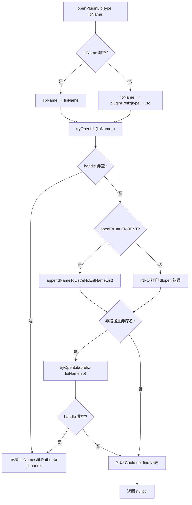
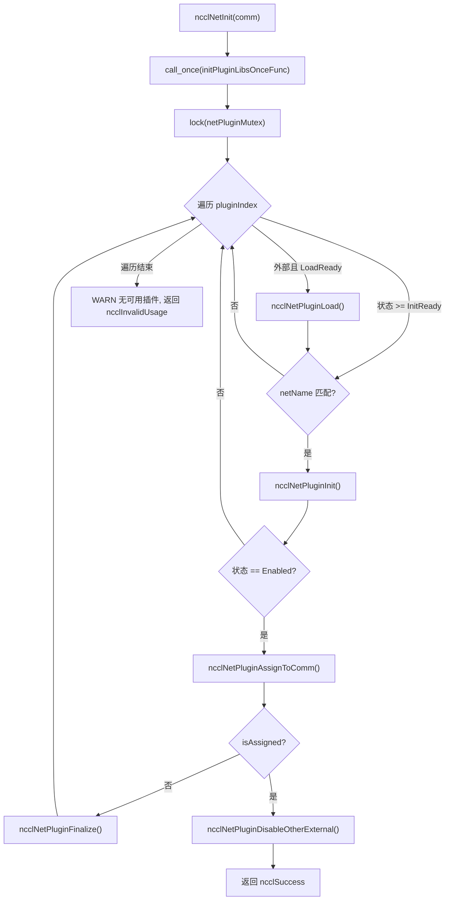
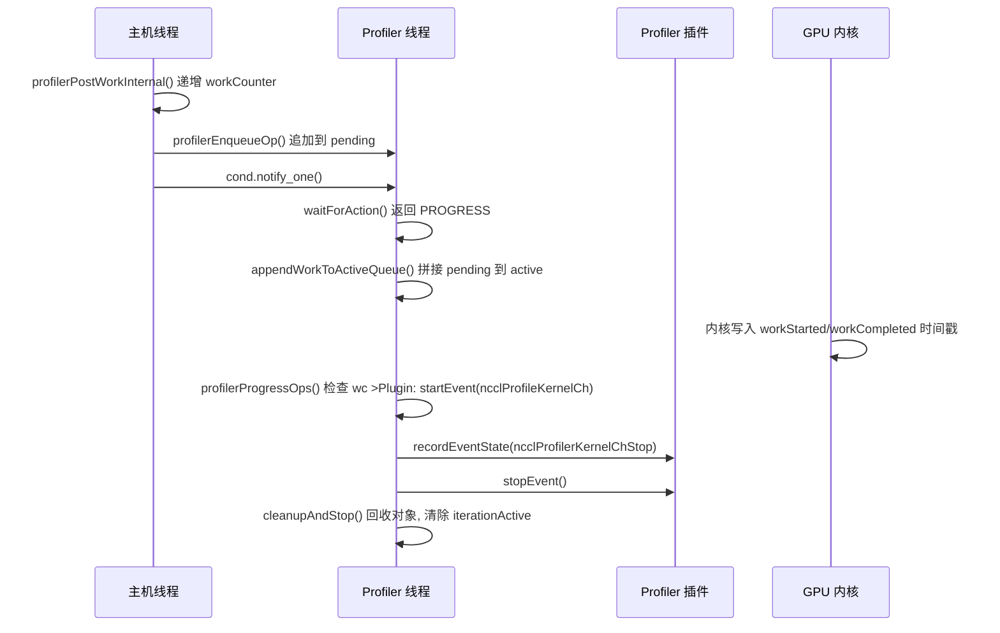

# 第 16 章：插件生態與環境變量：net、tuner、profiler、env 如何擴展 NCCL 行為

上一章我們看到 NCCL 如何通過 RMA 與 GIN 將通信能力從集合操作延伸到點對點遠程訪問，甚至讓 GPU 直接發起網絡請求。這種向新硬件與低延遲場景的演進，對通信引擎的靈活性提出了更高要求：如果每次適配新網絡、新調優策略或新採集工具都要重新編譯核心代碼，NCCL 將難以跟上生態變化。本章拆解 src/plugin 與 plugins 目錄，回答一個核心問題：NCCL 如何在不重新編譯核心代碼的前提下，替換網絡後端、調優策略、性能採集器與配置來源。

# 16.1 插件加載器：plugin_open.cc 如何把 .so 變成可用的後端

## 直覺模型

把`plugin_open.cc`想像成 NCCL 的「招聘中介」：它手裡有一份崗位清單（NET、GIN、RMA、TUNER、PROFILER、ENV），每個崗位對應一個候選庫名。當 NCCL 需要某個崗位的人時，中介按固定順序去人才市場（動態鏈接器）找人，找到就簽合同（`dlopen`），找不到就記錄「這個人不存在」，最後交回一個句柄。若沒有這層中介，NCCL 就只能把網絡後端硬編碼進二進制，任何網卡廠商想接入都得改 NCCL 源碼——這正是插件體系要消滅的災難。

## 數據結構與內存佈局

加載器的全部狀態就是六個並行數組，索引即插件類型枚舉：

```
static char* libNames[NUM_LIBS];              // 已加载库的名字
char* ncclPluginLibPaths[NUM_LIBS];           // 库的绝对路径
static void* libHandles[NUM_LIBS];            // dlopen 返回的句柄
static const char* pluginNames[NUM_LIBS];     // 日志用的人类可读名
static const char* pluginPrefix[NUM_LIBS];    // 库名前缀
static const char* pluginFallback[NUM_LIBS];  // 找不到时的提示
static unsigned long subsys[NUM_LIBS];        // 日志子系统位掩码
```

這七個數組的下標必須嚴格對齊，`pluginNames[type]`、`pluginPrefix[type]`、`subsys[type]`描述的是同一個插件類型。[FACT:src/plugin/plugin_open.cc:18-29]定義了`NUM_LIBS = 6`，類型順序為`{"NET", "GIN", "RMA", "TUNER", "PROFILER", "ENV"}`，前綴為`{"libnccl-net", "libnccl-gin", "libnccl-rma", "libnccl-tuner", "libnccl-profiler", "libnccl-env"}`。

> **[Design Inference & Architectural Trade-offs]**
> 這裡用並行數組而非結構體數組，是為了讓`openPluginLib`這個單一函數能同時服務六種插件——類型只作為下標，邏輯完全復用。代價是新增插件類型時必須同步修改六個數組，編譯器無法幫你檢查漏改。

`subsys`數組決定日誌歸屬：NET/GIN/RMA 都掛`NCCL_INIT | NCCL_NET`，TUNER 掛`NCCL_INIT | NCCL_TUNING`，PROFILER 只掛`NCCL_INIT`，ENV 掛`NCCL_INIT | NCCL_ENV`。[FACT:src/plugin/plugin_open.cc:26-29]這樣`NCCL_DEBUG_SUBSYS=NET`時只會看到網絡插件的日誌，不會淹沒在調優日誌裡。

## Step-by-Step Walkthrough：一次`ncclOpenNetPluginLib("mlx5")`的完整旅程

假設用戶設置`NCCL_NET_PLUGIN=mlx5`，NCCL 初始化時調用`ncclOpenNetPluginLib("mlx5")`，它直接轉發到`openPluginLib(ncclPluginTypeNet, "mlx5")`。[FACT:src/plugin/plugin_open.cc:132-134]

**第一步：構造候選庫名。**因為傳入了非空`libName`，走`snprintf(libName_, MAX_STR_LEN, "%s", libName)`分支，`libName_`變成`"mlx5"`。[FACT:src/plugin/plugin_open.cc:85-89]注意此時它還不是一個合法的庫文件名——沒有前綴也沒有`.so`後綴。

**第二步：第一次嘗試打開。** `tryOpenLib("mlx5", ...)`被調用。[FACT:src/plugin/plugin_open.cc:91]進入`tryOpenLib`後，先檢查`name`是否為空或長度為零，然後有一個特殊分支：如果名字以`STATIC_PLUGIN`開頭，就把`name`置為`nullptr`。[FACT:src/plugin/plugin_open.cc:37-39]這是給靜態連結進 NCCL 的插件用的哨兵——`dlopen(nullptr)`在 Linux 上返回主程式句柄，從而讓`dlsym`能在主程式符號表裡找到插件符號。

接著呼叫`ncclOsDlopen(name)`。[FACT:src/plugin/plugin_open.cc:41]因為`"mlx5"`既不是路徑也不是合法庫名，`dlopen`會失敗。失敗後程式碼取`ncclOsDlerror()`的錯誤串，並做一個精細判斷：如果錯誤串裡同時包含`name`和`"No such file or directory"`，就把`*err`設為`ENOENT`。[FACT:src/plugin/plugin_open.cc:42-55]這個判斷的意義在於區分「檔案根本不存在」和「檔案存在但載入失敗」——前者只是候選名不對，應該靜默嘗試下一個候選名；後者是真實錯誤，應該打日誌。

**第三步：第一次失敗後的處理。**回到`openPluginLib`，`libHandles[type]`為空，且`openErr == ENOENT`，於是把`"mlx5"`追加到`eNoEntNameList`。[FACT:src/plugin/plugin_open.cc:97-101]這個列表最終會拼成一句「Could not find: mlx5 libnccl-net-mlx5.so」的日誌。

**第四步：第二次嘗試——加前綴。**程式碼檢查`libName`是否既不是路徑（不含`/`）也不是庫名（不以`lib`開頭、不以`.so`結尾）。[FACT:src/plugin/plugin_open.cc:105-107] `"mlx5"`滿足條件，於是拼出`"libnccl-net-mlx5.so"`再次嘗試。[FACT:src/plugin/plugin_open.cc:108]這一次`dlopen`成功，`libHandles[type]`被賦值，`libNames[type]`記錄庫名，`ncclPluginLibPaths[type]`透過`getLibPath`拿到絕對路徑，函式返回句柄。[FACT:src/plugin/plugin_open.cc:110-115]

**第五步：拿到絕對路徑。** `getLibPath`在 Linux 上用`dlinfo(handle, RTLD_DI_LINKMAP, &lm)`取出`link_map`，再`strdup(lm->l_name)`。[FACT:src/plugin/plugin_open.cc:65-69]這個路徑會出現在後續所有日誌裡，讓使用者一眼看出到底載入了哪個檔案——生產環境排查「為什麼載入了錯誤的插件」時，這行日誌是第一現場。

整個決策流如下：



## 設計思考與生產踩坑

> **[Design Inference & Architectural Trade-offs]**
> **候選名順序即優先級。**先試使用者給的裸名，再試加前綴的名字。這意味著如果當前目錄恰好有一個叫`mlx5`的檔案，它會被優先載入—— 這是一個潛在的安全面，生產環境應避免在`LD_LIBRARY_PATH`裡放入與插件同名的可執行檔。

**`STATIC_PLUGIN`的語義。**當`NCCL_NET_PLUGIN=STATIC_PLUGIN`時，`tryOpenLib`把名字置空，`dlopen(nullptr)`打開主程式，`dlsym`從主程式符號表找`ncclNet_v12`等符號。[FACT:src/plugin/plugin_open.cc:37-39]這允許把插件靜態連結進 NCCL 二進位檔，省去部署`.so`的麻煩，代價是失去執行時替換能力。

**引用計數與卸載。** `ncclClosePluginLib`只在`libHandles[type] == handle`時才真正`dlclose`，並清空路徑和名字。[FACT:src/plugin/plugin_open.cc:176-186]這個相等判斷防止誤關一個已經被替換的句柄。GIN 和 RMA 插件透過`ncclGetGinPluginLib`/`ncclGetNetPluginLib`復用 NET 庫的句柄，實現方式是再次`dlopen`同一個庫名來增加引用計數。[FACT:src/plugin/plugin_open.cc:156-164]這是`dlopen`的引用計數語義——同一個庫被打開兩次，需要`dlclose`兩次才真正卸載。

# 16.2 net.cc：網路插件的狀態機與生命週期

## 直覺模型

`net.cc`是網路插件的「調度中心」。它維護一個插件庫陣列，每個庫有自己的狀態（未載入、載入失敗、待載入、待初始化、已啟用）。當一個新的通訊域（communicator）誕生時，調度中心遍歷所有候選插件，逐個嘗試初始化，第一個成功的就被「分配」給這個通訊域，其餘外部插件全部禁用。若沒有這層狀態機，NCCL 就無法處理「插件載入了但裝置不可用」「多個插件共存時選哪個」「通訊域銷毀時如何安全卸載」這些現實問題。

## 資料結構與記憶體佈局

核心結構是`netPluginLib_t`：

| 欄位 | 類型 | 含義 |
| --- | --- | --- |
| `name` | `char[255]` | 插件庫名 |
| `dlHandle` | `void*` | dlopen 句柄 |
| `ncclNet` | `ncclNet_t*` | 網路函式表 |
| `ncclNetVer` | `int` | 網路 API 版本號 |
| `ncclCollNet` | `ncclCollNet_t*` | 集合通訊卸載函式表 |
| `ncclNetPluginState` | 列舉 | 網路插件狀態 |
| `ncclCollNetPluginState` | 列舉 | CollNet 插件狀態 |
| `ncclNetPluginRefCount` | `int` | 引用計數 |
| `netPhysDevs`/`netVirtDevs` | `int` | 物理/虛擬裝置數 |
| `collNetPhysDevs`/`collNetVirtDevs` | `int` | CollNet 裝置數 |

[FACT:src/plugin/net.cc:63-76]定義了這些欄位。注意`ncclNet`和`ncclCollNet`是分開的兩個函式表，狀態也是分開的兩個列舉——一個插件可以提供網路功能但不提供 CollNet 卸載。

狀態列舉有五個值：`Disabled = -2`（初始化失敗）、`LoadFailed = -1`（載入失敗）、`LoadReady = 0`（待載入）、`InitReady = 1`（已載入待初始化）、`Enabled = 2`（已啟用）。[FACT:src/plugin/net.cc:54-60]用負數表示失敗態，使得「狀態 >= InitReady」這樣的比較能自然表達「至少已載入」。

全域狀態是三個變數：`pluginCount`記錄插件總數，`netPluginLibs[NCCL_NET_MAX_PLUGINS]`是插件陣列，`netPluginMutex`保護並發存取，`initPluginLibsOnceFlag`保證初始化只做一次。[FACT:src/plugin/net.cc:78-81]

## Step-by-Step Walkthrough：一次`ncclNetInit(comm)`的完整旅程

**第一步：一次性初始化。** `std::call_once(initPluginLibsOnceFlag, initPluginLibsOnceFunc)`保證插件列表只構建一次。[FACT:src/plugin/net.cc:360] `initPluginLibsOnceFunc`讀取`NCCL_NET_PLUGIN`環境變數，若未設定則預設加入`"libnccl-net.so"`，然後註冊兩個內建插件`ncclNetIb`和`ncclNetSocket`。[FACT:src/plugin/net.cc:288-340]

環境變數解析用`strtok_r`按逗號切分，支援多個插件名。[FACT:src/plugin/net.cc:303-324]有一個容量檢查：外部插件數量不能超過`NCCL_NET_MAX_PLUGINS - NCCL_NET_NUM_INTERNAL_PLUGINS`，超出部分被忽略並打日誌。[FACT:src/plugin/net.cc:307-311]內建插件固定為 2 個（IB 和 Socket），所以外部插件最多`NCCL_NET_MAX_PLUGINS - 2`個。

**第二步：加鎖遍歷。** `std::lock_guard<std::mutex> lock(netPluginMutex)`保護整個遍歷過程。[FACT:src/plugin/net.cc:361]對每個插件索引，先判斷它是否是外部插件且處於`LoadReady`狀態，若是則呼叫`ncclNetPluginLoad`。[FACT:src/plugin/net.cc:364-367]

**第三步：載入插件。** `ncclNetPluginLoad`呼叫`ncclOpenNetPluginLib`拿到句柄，然後從高版本到低版本依次嘗試`getNcclNet_v12`到`getNcclNet_v6`，第一個返回非空的版本被採用。[FACT:src/plugin/net.cc:103-112]版本陣列`ncclNetVersion`和函式指標陣列`getNcclNet`按降序排列，保證優先使用最新 API。[FACT:src/plugin/net.cc:41-43]

如果所有版本都拿不到`ncclNet`，說明這個庫不是合法的網路插件。此時檢查`NCCL_NET_PLUGIN`是否被顯式設定：若設定了，用`ATTN`級別告警（使用者明確要求卻失敗）；若沒設定，用`INFO`級別（只是預設嘗試失敗）。[FACT:src/plugin/net.cc:115-125]這個區分很重要——使用者顯式配置失敗必須讓他看見。

**第四步：初始化外掛。**回到`ncclNetInit`，對狀態`>= InitReady`且名字匹配`comm->config.netName`的外掛呼叫`ncclNetPluginInit`。[FACT:src/plugin/net.cc:369-372] `ncclNetPluginInit`做兩件事：呼叫外掛的`init`函式建立通訊域上下文，以及首次初始化時呼叫`devices`探測裝置數。[FACT:src/plugin/net.cc:186-236]

注意`init`的呼叫條件：`pluginLib->ncclNetPluginState >= ncclNetPluginStateInitReady`。[FACT:src/plugin/net.cc:190]註解明確說明「每個新通訊域都必須呼叫 init 來設定正確的上下文」。[FACT:src/plugin/net.cc:189]但裝置探測只在`== InitReady`時做一次。[FACT:src/plugin/net.cc:201]這個「init 每次呼叫，devices 只調一次」的區分是效能最佳化——裝置探測可能很慢，但上下文必須每個通訊域獨立。

**第五步：分配與停用。**初始化成功後呼叫`ncclNetPluginAssignToComm`，它把外掛的`ncclNet`賦給`comm->ncclNet`，遞增引用計數，設定`comm->netPluginIndex`。[FACT:src/plugin/net.cc:238-255]分配成功後立即呼叫`ncclNetPluginDisableOtherExternal`停用其他所有外部外掛。[FACT:src/plugin/net.cc:377-380]

> **[Design Inference & Architectural Trade-offs]**
> 停用邏輯有個關鍵判斷：只有當被分配的外掛是外部外掛（`pluginIndex >= pluginCount - NCCL_NET_NUM_INTERNAL_PLUGINS`）時才停用其他外部外掛。[FACT:src/plugin/net.cc:257-259]如果分配的是內建 IB 外掛，外部外掛保持原狀——這為後續通訊域留了選擇空間。



## 並行控制與硬體互動

`netPluginMutex`保護所有對`netPluginLibs`的讀寫。`ncclNetInit`、`ncclNetFinalize`都加鎖。[FACT:src/plugin/net.cc:361][FACT:src/plugin/net.cc:411-416]但`ncclNetGetDevCount`等函式註解說「不需要鎖，因為呼叫者已在`ncclTopoGetSystem`的鎖內」。[FACT:src/plugin/net.cc:418-429]這是一種「鎖由上层持有」的約定，減少了巢狀鎖的開銷，代價是呼叫者必須遵守約定。

`ncclGpuGdrSupport`展示了外掛與硬體的直接互動：它分配 2MB GPU 緩衝，透過外掛的`listen`/`connect`/`accept`建立回環連線，然後嘗試`regMr`註冊 GPU 記憶體。[FACT:src/plugin/net.cc:464-535]如果註冊成功，說明網卡支援 GPUDirect RDMA。這個探測結果快取在`gdrSupportMatrix[32]`裡，按 CUDA 裝置號索引。[FACT:src/plugin/net.cc:478-480]

> **[Design Inference & Architectural Trade-offs]**
> 注意`gdrSupportMatrix`是`static`的，跨通訊域共享。[FACT:src/plugin/net.cc:478]這意味著同一行程內多個通訊域會複用探測結果，避免重複的昂貴探測。但陣列大小硬編碼為 32，超過 32 個 GPU 的機器會越界——這是一個隱含的上限假設。

## 生產避坑指南

**坑一：外掛載入成功但裝置數為零。** `ncclNetPluginInit`檢查`devices(&ndev) != ncclSuccess || ndev <= 0`就跳轉到失敗分支。[FACT:src/plugin/net.cc:202]失敗後呼叫`finalize`清理已建立的上下文，把裝置數重置為`NCCL_UNDEF_DEV_COUNT`，狀態設為`Disabled`。[FACT:src/plugin/net.cc:229-234]如果不做這個清理，後續通訊域會看到一個「已初始化但無裝置」的外掛，導致難以診斷的錯誤。

> **[Design Inference & Architectural Trade-offs]**
> **坑二：`init`成功但`devices`失敗。**程式碼用`initCompleted`標誌追蹤`init`是否成功。[FACT:src/plugin/net.cc:178-184][FACT:src/plugin/net.cc:198]失敗分支裡只有`initCompleted`為真才呼叫`finalize`。[FACT:src/plugin/net.cc:230]這防止對未初始化的上下文呼叫`finalize`——很多外掛的`finalize`不檢查空指標，誤呼叫會崩潰。

**坑三：通訊域銷毀時的引用計數。** `ncclNetPluginFinalize`先呼叫外掛的`finalize`，再遞減引用計數，最後在引用計數歸零且是外部外掛時卸載庫。[FACT:src/plugin/net.cc:342-355] `ncclNetPluginUnload`檢查`dlHandle`非空且引用計數為零才真正`dlclose`。[FACT:src/plugin/net.cc:84-101]卸載後重置欄位但保留`name`，以便重新載入時複用。[FACT:src/plugin/net.cc:84-101]

# 16.3 tuner.cc 與 profiler.cc：策略外掛與觀測外掛的不同契約

## 直覺模型

Tuner 外掛像「導航軟體的路線偏好設定」——它不改變車怎麼開，只改變選哪條路。Profiler 外掛像「行車記錄器」——它不干預駕駛，只記錄發生了什麼。兩者的共同點是都透過函式表接入，區別在於 Tuner 是「每個通訊域一個實例」的輕量策略物件，而 Profiler 需要一個獨立執行緒來非同步消費 GPU 產生的事件。

## tuner.cc：極簡的全域單例

Tuner 的狀態極其簡單：一個互斥鎖、一個引用計數、一個庫控制代碼、一個符號指標、一個狀態變數。[FACT:src/plugin/tuner.cc:24-37]沒有外掛陣列，沒有多外掛共存——全域只有一個 tuner。

`ncclTunerPluginLoad`的邏輯是「首次載入，後續複用」：如果狀態是`LoadSuccess`，直接把符號賦給`comm->tuner`並遞增引用計數。[FACT:src/plugin/tuner.cc:53-57]否則讀取`NCCL_TUNER_PLUGIN`環境變數，若為`"none"`則直接失敗。[FACT:src/plugin/tuner.cc:59-63]

> **[Design Inference & Architectural Trade-offs]**
> 版本協商從 v6 降到 v2，逐個嘗試。[FACT:src/plugin/tuner.cc:75-87]注意這裡沒有 v1——tuner API 從 v2 開始才有穩定的函式表結構。

> **[Design Inference & Architectural Trade-offs]**
> 一個有趣的細節：如果`ncclOpenTunerPluginLib`傳回空，程式碼嘗試`ncclGetNetPluginLib(ncclPluginTypeTuner)`。[FACT:src/plugin/tuner.cc:65-70]這意味著 tuner 可以打包在 net 外掛庫裡——這降低了部署複雜度，一個`.so`同時提供網路和調優功能。

## profiler.cc：非同步事件消費執行緒

Profiler 是本章最複雜的外掛，因為它需要處理 GPU 非同步產生的事件。核心結構是`ncclProfilerThread`：

| 欄位 | 類型 | 作用 |
| --- | --- | --- |
| `thread` | `std::thread` | 消費執行緒 |
| `mutex` | `std::mutex` | 保護佇列 |
| `cond` | `condition_variable` | 有新工作時喚醒 |
| `condIterationInactive` | `condition_variable` | 等待迭代結束 |
| `stop` | `int` | 停止標誌 |
| `refCount` | `int` | 通訊域引用計數 |
| `cudaDev` | `int` | 綁定的 CUDA 裝置 |
| `abortFlag` | `volatile uint32_t*` | 中止標誌 |
| `iterationActive` | `bool` | 是否正在迭代 |
| `pending`/`pendingTail` | 鏈結串列 | 待處理工作 |
| `active`/`activeTail` | 鏈結串列 | 處理中工作 |
| `opStack`/`opPool` | 記憶體池 | 工作物件分配 |
| `inflight`/`maxInflightSeen`/`maxInflight` | `size_t` | 背壓觀測 |
| `droppedOps` | `uint64_t` | 分配失敗計數 |

[FACT:src/plugin/profiler.cc:38-69]定義了這個結構。注意`pending`和`active`是兩個獨立鏈結串列：生產者往`pending`追加，消費執行緒在鎖內把`pending`拼接到`active`，然後在鎖外遍歷`active`。[FACT:src/plugin/profiler.cc:56-59]

`iterationActive`標誌是並行正確性的關鍵：消費執行緒在鎖內設為`true`後釋放鎖去呼叫外掛回呼，銷毀執行緒必須等這個標誌變回`false`才能拆除通訊域狀態。[FACT:src/plugin/profiler.cc:52-55]

## Step-by-Step Walkthrough：一次 KernelCh 事件的產生與消費

**第一步：主機側入隊。**當內核計劃（kernel plan）被提交時，`ncclProfilerPostPlanWork`遍歷計劃裡的集合任務，對每個啟用了`ncclProfileKernelCh`的任務，按通道範圍調用`profilerPostWorkInternal`。[FACT:src/plugin/profiler.cc:1315-1331]

`profilerPostWorkInternal`先遞增`comm->profiler.workCounter[channelId]`，然後調用`profilerEnqueueOp`。[FACT:src/plugin/profiler.cc:1259-1266]註釋強調這個遞增必須「每次調用恰好一次，即使分配失敗」，以保持與設備內核的同步。[FACT:src/plugin/profiler.cc:1259-1266]

**第二步：分配工作對象。** `profilerEnqueueOp`在鎖內從內存池分配`ncclProfilerWorkOp`，填充通道號、工作計數器、激活掩碼、任務事件句柄、通訊域上下文等字段。[FACT:src/plugin/profiler.cc:1199-1223]分配失敗時遞增`droppedOps`並記錄日誌，但**不**回退`workCounter`——這是保持與設備同步的關鍵。[FACT:src/plugin/profiler.cc:1202-1207]

分配成功後把對象追加到`pending`鏈表尾部，遞增`inflight`，更新`maxInflightSeen`，喚醒消費線程。[FACT:src/plugin/profiler.cc:1225-1239]

**第三步：消費線程等待。** `ncclProfilerThreadFunc`循環調用`waitForAction`。[FACT:src/plugin/profiler.cc:1074-1077] `waitForAction`在鎖內等待條件變量，直到`pending`或`active`非空，或收到停止/中止信號。[FACT:src/plugin/profiler.cc:1017-1031]

被喚醒後，它調用`appendWorkToActiveQueue`把`pending`拼接到`active`尾部，設置`iterationActive = true`，返回`NCCL_PROFILER_THREAD_PROGRESS`。[FACT:src/plugin/profiler.cc:1017-1031]

**第四步：處理工作。** `profilerProgressOps`在**鎖外**遍歷`active`鏈表。[FACT:src/plugin/profiler.cc:958-999]對每個工作對象，檢查設備是否已經寫入了啟動時間戳：`wc <= op->workStarted[ch].data[slot].counter`。[FACT:src/plugin/profiler.cc:972]注意用的是`<=`而非`==`，因為設備會環繞`MAX_PROFILER_EVENTS_PER_CHANNEL`個槽位，主機落後時設備可能已經覆蓋了該槽位。[FACT:src/plugin/profiler.cc:969-971]

如果啟動條件滿足，調用`ncclProfilerStartKernelChEvent`通知插件。[FACT:src/plugin/profiler.cc:973]然後檢查完成條件，若滿足則先觸發階段事件，再調用`ncclProfilerStopKernelChEvent`。[FACT:src/plugin/profiler.cc:978-985]

完成的工作對象被摘出鏈表，收集到`recycled`列表。[FACT:src/plugin/profiler.cc:987-991]

**第五步：回收與發布。** `cleanupAndStop`在鎖內回收`recycled`列表，發布新的`activeTail`，清除`iterationActive`並通知等待者。[FACT:src/plugin/profiler.cc:1036-1050]



## 並發控制與背壓

`NCCL_PROFILER_DEFAULT_MAX_INFLIGHT`定義為`MAXCHANNELS * MAX_PROFILER_EVENTS_PER_CHANNEL * 4`。[FACT:src/plugin/profiler.cc:32-32]這是一個「軟上限」——超過它不會阻止入隊，只會打日誌。[FACT:src/plugin/profiler.cc:1233-1238]註釋說明保持入隊是為了讓 KernelCh 事件與其父任務事件配對。[FACT:src/plugin/profiler.cc:32-32]

日誌用 2 的冪次觸發：`(pt->inflight & (pt->inflight - 1)) == 0`。[FACT:src/plugin/profiler.cc:1233]這保證只在 inflight 為 1、2、4、8... 時打日誌，避免刷屏。

消費線程的退避策略在`updateProgressInterval`裡：有進展時立即重試，無進展時從 1 微秒開始翻倍，上限 10 微秒。[FACT:src/plugin/profiler.cc:1054-1057]這個設計平衡了延遲和 CPU 佔用。

## 生產避坑指南

**坑一：銷毀時的工作洩漏。** `ncclProfilerThreadDestroy`先等待`iterationActive`變假，然後調用`profilerPurgeByContext`清除所有引用該通訊域上下文的待處理工作。[FACT:src/plugin/profiler.cc:1162-1169]如果不做這個清除，插件回調會拿到已銷毀的上下文指針，導致 use-after-free。

**坑二：停止時的排空。**當收到停止信號但`active`非空時，返回`NCCL_PROFILER_THREAD_CLEANUP_AND_STOP`，`cleanupAndStop`的`drainStuck`參數為真，直接回收所有剩餘工作。[FACT:src/plugin/profiler.cc:1029][FACT:src/plugin/profiler.cc:1036-1050]註釋說這些工作的內核永遠不會運行，所以直接丟棄。[FACT:src/plugin/profiler.cc:1034-1035]

**坑三：CUDA 設備綁定。**消費線程啟動時調用`cudaSetDevice(pt->cudaDev)`。[FACT:src/plugin/profiler.cc:1054-1057]註釋解釋：線程本身只讀主機固定內存，但插件可能做依賴上下文的驅動調用，所以防禦性綁定。[FACT:src/plugin/profiler.cc:1054-1057]綁定失敗只打日誌不中止，因為線程本身不依賴 CUDA。[FACT:src/plugin/profiler.cc:1065-1070]

# 16.4 官方示例：google-fastsocket 與 google-CoMMA 的實現要點

## 直覺模型

官方示例是插件 API 的「參考實現」。`google-fastsocket`展示如何用用戶態網絡棧替換內核 TCP；`google-CoMMA`展示如何實現一個 profiler 插件來採集通信性能。它們的存在證明插件 API 足夠表達真實需求。

## google-fastsocket：替換網絡後端

> **[Design Inference & Architectural Trade-offs]**
> FastSocket 是 Google 開源的用戶態網絡棧，通過`AF_FABRIC`地址族繞過內核 TCP/IP 棧。作為 NCCL net 插件，它需要實現`ncclNet_t`的全部函數：`init`、`devices`、`getProperties`、`listen`、`connect`、`accept`、`regMr`、`isend`、`irecv`、`test`、`closeSend`等。

關鍵實現點在於`getProperties`返回的`ptrSupport`：如果 FastSocket 支持 GPUDirect RDMA，應設為`NCCL_PTR_HOST|NCCL_PTR_CUDA`；否則只能設為`NCCL_PTR_HOST`，NCCL 會在發送前把 GPU 數據拷到主機內存。[FACT:plugins/net/README.md:245-245]

`connect`和`accept`的「非阻塞」契約是插件實現的核心難點：它們必須立即返回，把`sendComm`/`recvComm`設為`NULL`，讓 NCCL 反覆調用直到成功。[FACT:plugins/net/README.md:299-311]這要求插件內部維護連接狀態機，把耗時的握手放在後台。

## google-CoMMA：實現 profiler 插件

> **[Design Inference & Architectural Trade-offs]**
> CoMMA（Collective Memory Monitoring Agent）是 Google 的通信性能採集器。作為 profiler 插件，它實現`ncclProfiler_t`函數表：`init`、`finalize`、`startEvent`、`stopEvent`、`recordEventState`。

`init`接收`ncclProfilerEventMask`指針，插件通過寫入這個掩碼來選擇訂閱哪些事件。[FACT:src/plugin/profiler.cc:341]NCCL 支持的事件類型包括 Group、Coll、P2p、ProxyOp、ProxyStep、ProxyCtrl、KernelCh、KernelPhase、NetPlugin 等。[FACT:src/plugin/profiler.cc:285-307]

`startEvent`返回一個事件句柄，後續`stopEvent`和`recordEventState`用這個句柄關聯事件。[FACT:src/plugin/profiler.cc:392][FACT:src/plugin/profiler.cc:400-407]插件可以用句柄存儲自己的狀態，實現事件配對和耗時統計。

## 設計思考

**為什麼 net 插件有版本協商而 tuner/profiler 沒有？**因為 net API 涉及裝置側程式碼（`ncclNetDeviceHandle`），版本不匹配會導致核心崩潰；而 tuner/profiler 是純主機側，版本不匹配最多是功能缺失。[FACT:src/plugin/net.cc:153-176]展示了`ncclNetCheckDeviceVersion`如何檢查裝置類型和版本，不匹配時返回`ncclInternalError`。

**為什麼 profiler 需要獨立執行緒？**因為 profiler 回呼可能阻塞（比如寫檔案、發網路請求），如果在主機執行緒呼叫會拖慢通訊。[FACT:src/plugin/profiler.cc:950-952]註解明確說「外掛回呼可能阻塞，所以不能在持鎖時呼叫」。

# 16.5 生產避坑指南與故障恢復鏈

## 坑一：外掛版本不匹配導致核心崩潰

`ncclNetCheckDeviceVersion`檢查`props.netDeviceType`和`props.netDeviceVersion`。[FACT:src/plugin/net.cc:153-176]如果外掛報告的`NCCL_NET_DEVICE_UNPACK`版本與 NCCL 編譯時的`NCCL_NET_DEVICE_UNPACK_VERSION`不一致，返回`ncclInternalError`並告警。[FACT:src/plugin/net.cc:153-176]這個檢查在`ncclNetPluginAssignToComm`裡被呼叫，失敗時外掛不會被分配給通訊域。[FACT:src/plugin/net.cc:241]

**恢復鏈**：版本不匹配 →`ncclNetCheckDeviceVersion`返回錯誤 →`ncclNetPluginAssignToComm`返回`isAssigned = false` → `ncclNetInit`繼續嘗試下一個外掛 → 最終可能回退到內建 Socket 外掛。

## 坑二：profiler 執行緒無法退出

如果 profiler 外掛在`stopEvent`裡阻塞，消費執行緒會卡在`profilerProgressOps`裡，`iterationActive`永遠為真，`ncclProfilerThreadDestroy`會永久等待。[FACT:src/plugin/profiler.cc:1166]這是一個真實的死鎖風險。

> **[Design Inference & Architectural Trade-offs]**
> **恢復鏈**：`comm->abortFlag`被設定 →`waitForAction`偵測到中止 → 返回`CLEANUP_AND_STOP` → `cleanupAndStop`排空佇列。[FACT:src/plugin/profiler.cc:1017-1031]但如果執行緒已經卡在外掛回呼裡，中止標誌無法打斷它—— 這是外掛實作者的責任，回呼必須有逾時。

## 坑三：tuner 外掛的引用計數洩漏

`ncclTunerPluginLoad`在成功時遞增`tunerPluginRefCount`。[FACT:src/plugin/tuner.cc:98] `ncclTunerPluginUnload`在`comm->tunerPluginLoaded`為真時遞減。[FACT:src/plugin/tuner.cc:111-123]如果某個通訊域載入了 tuner 但銷毀時`tunerPluginLoaded`被意外清零，引用計數永遠不會歸零，外掛程式庫永遠不會卸載。

# 本章思考與自測

Q1: 如果把`ncclNetPluginLoad`裡「從高版本到低版本嘗試」的迴圈改成「只嘗試最高版本」，在什麼場景下會導致原本可用的外掛無法載入？

**參考解析**：看[FACT:src/plugin/net.cc:108-112]。迴圈遍歷`NCCL_NET_VERSION_COUNT`個版本，從 v12 降到 v6，第一個返回非空的被採用。如果只嘗試 v12，那麼一個只實作了 v11 的舊外掛會載入失敗。

> **[Design Inference & Architectural Trade-offs]**
> 這個設計是為了向後相容：NCCL 核心升級到支援 v12 後，仍然能載入只提供 v11 的外掛。外掛作者被鼓勵提供多個版本的符號（見[FACT:plugins/net/README.md:35-37]），這樣同一個`.so`能服務多個 NCCL 版本。

如果去掉降級嘗試，使用者升級 NCCL 後舊外掛會突然不可用，只能回退到內建 Socket 外掛，效能大幅下降。這正是版本協商存在的意義。

Q2: 在`profilerProgressOps`裡，如果把`wc <= op->workStarted[ch].data[slot].counter`改成`wc == op->workStarted[ch].data[slot].counter`，在什麼高併發場景下會導致事件永遠不觸發？

**參考解析**：看[FACT:src/plugin/profiler.cc:969-972]。註解明確說明裝置會環繞`MAX_PROFILER_EVENTS_PER_CHANNEL`個槽位。如果主機消費速度落後於裝置生產速度，裝置可能已經用計數器`wc + N`覆蓋了槽位`wc % MAX_PROFILER_EVENTS_PER_CHANNEL`。

此時`op->workStarted[ch].data[slot].counter`的值是`wc + N`，而`op->workCounter`是`wc`。用`==`判斷會失敗，事件永遠不會觸發，工作物件永遠留在`active`鏈結串列裡，`inflight`只增不減，最終耗盡記憶體池。

用`<=`則能正確處理這種情況：只要裝置寫入的計數器不小於期望值，就認為事件已就緒。這是一個典型的「生產者-消費者環繞緩衝區」的正確性條件。

Q3: 如果`ncclProfilerThreadDestroy`裡去掉等待`iterationActive`變假的迴圈，在什麼時序下會導致 profiler 外掛存取已釋放的通訊域上下文？

**參考解析**：看[FACT:src/plugin/profiler.cc:1162-1166]。註解說明`ncclProfilerPluginFinalize`會在`ncclProfilerThreadDestroy`返回後立即銷毀通訊域的`profilerContext`。

消費執行緒在`profilerProgressOps`裡呼叫外掛回呼時，傳入的是`op->profilerContext`。[FACT:src/plugin/profiler.cc:938]如果銷毀執行緒不等待`iterationActive`變假就返回，`ncclProfilerPluginFinalize`會釋放上下文，而消費執行緒可能正在用這個上下文呼叫外掛——use-after-free。

`iterationActive`的握手協定是：消費執行緒在鎖內置為`true`後釋放鎖去呼叫外掛，銷毀執行緒在鎖內等待它變回`false`。[FACT:src/plugin/profiler.cc:1028][FACT:src/plugin/profiler.cc:1054-1057]這個協定保證外掛回呼期間上下文始終有效。

去掉等待後，銷毀執行緒可能在消費執行緒剛進入外掛回呼時就返回，導致外掛拿到懸空指標。這是一個典型的「生命週期與併發存取」競態。

外掛體系讓 NCCL 從封閉走向開放：網路後端、調優策略、效能採集器、配置來源都可以在不改核心程式碼的前提下替換。但外掛也引入了新的故障面——版本不匹配、生命週期競態、引用計數洩漏。下一章我們將進入 RAS 與診斷子系統，看 NCCL 如何偵測故障、監控進度並在長時間訓練任務中實現自癒。

外掛體系讓 NCCL 的核心通訊路徑與可替換元件之間劃出了清晰邊界，net、tuner、profiler、env 四類外掛各自透過註冊與引用計數機制安全地介入執行時行為。但一個可擴展的通訊引擎不僅要能靈活替換元件，更要在長時間訓練中穩定運行——當網卡或 GPU 出現故障時，NCCL 如何偵測、監控並觸發恢復？下一章我們將進入 RAS 與診斷機制，看生產環境下的可靠性如何被系統性地保障。
