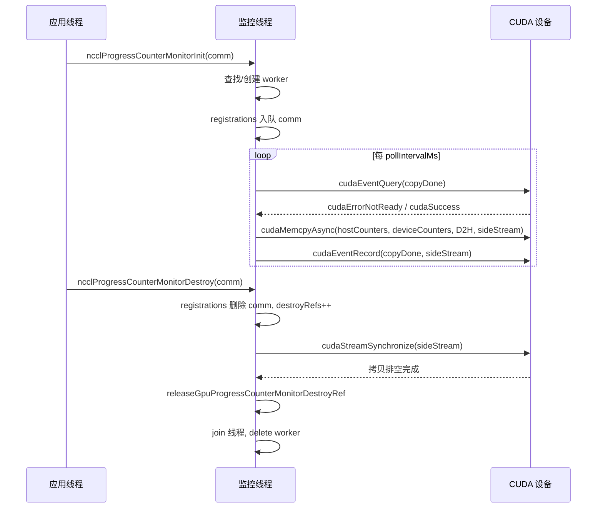
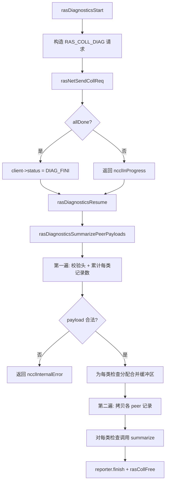

# 第 17 章：RAS 機制與容錯：鏈路故障偵測、心跳與優雅降級

上一章我們看到外掛體系如何讓核心通訊路徑與可替換元件劃清邊界，從而在不修改核心程式碼的前提下替換網路後端、調優策略和效能採集器。但可擴展性只是生產可用的一個維度，另一個同樣硬核的問題是：當一次 AllReduce 已經跑了 72 小時，某台機器的網卡悄悄掛了，NCCL 憑什麼能發現、能隔離、能繼續？RAS 子系統正是 NCCL 從「能跑通」走向「生產可用」的分水嶺，本章將拆解故障偵測、進度監控與自癒機制背後的設計。

# 17.1 RAS 總控：一個行程一個 RAS 執行緒的全域協調者

## 直覺模型

把 RAS 想像成整個作業的「值班室」。每個 NCCL 行程（每個 rank）在初始化時都會開一間值班室，裡面坐著一個專職執行緒。所有通訊域（communicator）的建立、銷毀、診斷請求，都要先向值班室登記；值班室之間再透過一條獨立的 RAS 網路互相通報「誰還活著、誰已經死了」。

如果沒有這間值班室，NCCL 就只能靠通訊路徑本身的逾時來感知故障——而通訊路徑上的逾時既慢又容易誤判（一次網路抖動就可能被當成節點死亡）。RAS 把「故障感知」從資料面剝離到控制面，用獨立的輕量心跳和診斷通道來判定健康狀態。

## 資料結構與記憶體佈局

RAS 的核心狀態散落在`ras.cc`的全域變數裡，我們逐一拆解：

| 變數 | 類型 | 作用 |
| --- | --- | --- |
| `rasInitMutex` | `std::mutex` | 保護 RAS 單例初始化 |
| `rasInitialized` | `bool` | 是否已初始化 |
| `rasInitRefCount` | `int` | 引用計數，等於活躍 comm 數 |
| `rasNetListeningSocket` | `struct ncclSocket` | RAS 網路監聽套接字 |
| `rasNotificationPipe[2]` | `ncclSocketPairDescriptor` | 本地執行緒 → RAS 執行緒的通知管道 |
| `rasPfds` | `struct pollfd*` | 主事件迴圈的 poll 陣列 |
| `ncclComms` | `struct ncclComm**` | 所有通訊域指標陣列 |

[FACT:src/ras/ras.cc:49-61]定義了這些全域狀態。注意`rasInitRefCount`用`ncclAtomicRefCountIncrement`增減[FACT:src/ras/ras.cc:129]，而`rasInitialized`用普通 bool 加雙重檢查鎖保護[FACT:src/ras/ras.cc:103-105]——這是典型的「初始化一次、之後唯讀」模式。

`ncclComms`陣列的分配策略值得注意：它不是按需增長，而是每次擴容`RAS_INCREMENT * 8`（即 32 個槽位）[FACT:src/ras/ras.cc:139-140]。陣列裡允許出現`nullptr`空洞（comm 銷毀時置空），新 comm 會複用第一個空洞[FACT:src/ras/ras.cc:135-137]。

## 場景驅動 Walkthrough：從 comm 初始化到 RAS 執行緒啟動

**第一步：`ncclRasCommInit`被呼叫。**這是每個 comm 初始化時第一個呼叫的 RAS 函式[FACT:src/ras/ras.cc:101]。它先檢查`rasInitialized`，若未初始化則進入臨界區：

1. 用 bootstrap 網路介面位址初始化`rasNetListeningSocket`，埠設為 0 讓核心隨機分配[FACT:src/ras/ras.cc:108-109]

2. 監聽該套接字[FACT:src/ras/ras.cc:113]

3. 建立本地通知管道[FACT:src/ras/ras.cc:118]

4. 初始化診斷子系統[FACT:src/ras/ras.cc:120]

5. 啟動`rasThreadMain`執行緒[FACT:src/ras/ras.cc:121]

6. 註冊`atexit(rasTerminate)`保證行程退出時清理[FACT:src/ras/ras.cc:126]

**第二步：登記 comm。**無論是否首次初始化，都會把`comm`指標寫入`ncclComms`陣列[FACT:src/ras/ras.cc:142]，並把`ncclCommsSorted`置 false[FACT:src/ras/ras.cc:143]——因為陣列順序變了，之前的排序失效。

**第三步：回填埠。**函式最後把`rasNetListeningSocket.addr`（含核心分配的埠）拷回`myRank->addr` [FACT:src/ras/ras.cc:146]，這樣呼叫方就能知道 RAS 網路監聽在哪個埠。

## 主事件迴圈：poll 驅動的多路複用

`rasThreadMain`是 RAS 執行緒的心臟[FACT:src/ras/ras.cc:633]。它先註冊三個固定 fd：通知管道、RAS 網路監聽套接字、客戶端監聽套接字[FACT:src/ras/ras.cc:641-652]。然後進入無限迴圈：

```
for (int64_t nextWakeup = 0;;) {
  // 计算超时
  timeoutMs = min(..., 1000);
  nEvents = poll(rasPfds, nRasPfds, timeoutMs);
  // 处理事件
  for (pollIdx...) { ... }
  // 处理各类超时
  rasSocksHandleTimeouts(now, &nextWakeup);
  rasConnsHandleTimeouts(now, &nextWakeup);
  rasNetHandleTimeouts(now, &nextWakeup);
  rasCollsHandleTimeouts(now, &nextWakeup);
}
```

[FACT:src/ras/ras.cc:655-728]展示了這個迴圈。注意`timeoutMs`被硬性限制在 1000ms 以內[FACT:src/ras/ras.cc:664]——即使`nextWakeup`很遠，也要每秒醒一次，保證逾時檢查的及時性。

事件分發邏輯用 fd 值做路由[FACT:src/ras/ras.cc:684-715]：如果是通知管道就調`rasLocalHandle`；如果是監聽套接字就 accept；否則遍歷`rasSocketsHead`和`rasClientsHead`鏈結串列找到對應的 socket 處理。

## 本地通知機制：管道 + 定長結構

本地 NCCL 執行緒與 RAS 執行緒透過一個 socketpair 通訊。通知結構`rasNotification`是定長的[FACT:src/ras/ras.cc:35-46]，並用`static_assert`保證不超過`PIPE_BUF` [FACT:src/ras/ras.cc:47]——這是為了確保寫入的原子性（POSIX 保證小於 PIPE_BUF 的寫入是原子的）。

發送端`rasLocalNotify`用`rasNotificationMutex`序列化多個使用者執行緒的寫入[FACT:src/ras/ras.cc:224-237]，然後迴圈寫直到全部寫完[FACT:src/ras/ras.cc:224-237]。接收端`rasLocalHandle`同樣迴圈讀滿整個結構[FACT:src/ras/ras.cc:247-256]，讀到 EOF 返回`ncclSystemError` [FACT:src/ras/ras.cc:251-253]。

三種通知類型：`RAS_ADD_RANKS`（新 rank 加入）、`RAS_RUN_DIAG`（執行診斷）、`RAS_TERMINATE`（終止）[FACT:src/ras/ras.cc:28-32]。

## 訊息收發：長度前綴 + 增量進度

RAS 訊息的線格式是「4 位元組長度 + 訊息體」[FACT:src/ras/ras_internal.h:110-117]。發送時`rasConnSendMsg`先發長度再發訊息體[FACT:src/ras/ras.cc:362-390]，用`meta->offset`記錄進度，支援部分發送後下次繼續。接收時`rasMsgRecv`先收長度、按長度分配緩衝區、再收訊息體[FACT:src/ras/ras.cc:393-412]。

這裡有個細節：`rasMsgAlloc`分配的是`rasMsgMeta`結構，`msg`欄位在結構末尾，透過`offsetof`計算偏移[FACT:src/ras/ras.cc:313-319]。釋放時反向計算[FACT:src/ras/ras.cc:323-328]。這種「元資料前置」的佈局讓訊息可以攜帶發送進度、入隊時間等本地資訊，而不佔用線格式。

## 設計思考

> **[Design Inference & Architectural Trade-offs]**
> **為什麼用 poll 而不是 epoll？**poll 的 O(n) 複雜度在 RAS 場景下可接受——RAS 連線數遠小於資料面連線數，且 RAS 執行緒本身不是效能關鍵路徑。poll 的跨平台性也更好（Windows 相容）。

> **[Design Inference & Architectural Trade-offs]**
> **為什麼通知用管道而不是條件變數？**管道可以無縫整合進 poll 迴圈，讓 RAS 執行緒用統一的`poll`等待所有事件源。如果用條件變數，就需要額外的機制來喚醒 poll。

```mermaid
flowchart TD
    start["rasThreadMain 启动"] --> reg_pipe["注册通知管道 fd"]
    reg_pipe --> reg_net["注册 RAS 网络监听 fd"]
    reg_net --> reg_client["注册客户端监听 fd"]
    reg_client --> poll["poll(rasPfds, timeout check{"nEvents == -1?"}
    check -->|"是且非 EINTR"| log_err["记录 poll 错误并继续"]
    check -->|"否"| dispatch["遍历 revents 分发事件"]
    log_err --> dispatch
    dispatch --> is_pipe{"fd == 通知管道?"}
    is_pipe -->|"是"| local_handle["rasLocalHandle()"]
    is_pipe -->|"否"| is_net{"fd == RAS 监听?"}
    is_net -->|"是"| accept_net["rasNetAcceptNewSocket()"]
    is_net -->|"否"| is_client{"fd == 客户端监听?"}
    is_client -->|"是"| accept_client["rasClientAcceptNewSocket()"]
    is_client -->|"否"| find_sock["遍历 rasSocketsHead 找匹配 socket"]
    find_sock --> sock_loop["rasSockEventLoop(sock, pollIdx)"]
    local_handle --> terminate{"terminate?"}
    terminate -->|"是"| cleanup["rasThreadCleanup() 并退出"]
    terminate -->|"否"| timeouts
    sock_loop --> timeouts["rasSocksHandleTimeouts / rasConnsHandleTimeouts / rasNetHandleTimeouts / rasCollsHandleTimeouts"]
    accept_net --> timeouts
    accept_client --> timeouts
    timeouts --> poll
```

# 17.2 進度監控：用 DMA 把 GPU 計數器搬到主機

## 直覺模型

進度監控像汽車儀表板上的「引擎轉速表」。它不參與駕駛（不參與通訊），但持續把 GPU 內部的進度計數器抄到主機記憶體，讓主機能判斷「這個通訊域是不是卡住了」。如果沒有它，一次 AllReduce 卡死時你只能看到「程式不返回」，卻不知道是 GPU 在算、在等網路、還是徹底死鎖。

## 資料結構與記憶體佈局

每個 CUDA 裝置對應一個`ncclGpuProgressCounterMonitor`工作執行緒[FACT:src/ras/progress_monitor.cc:35-52]：

| 欄位 | 類型 | 作用 |
| --- | --- | --- |
| `cudaDev` | `int` | 綁定的 CUDA 裝置號 |
| `thread` | `std::thread` | 工作執行緒 |
| `mutex` / `cv` | `std::mutex` / `condition_variable` | 保護可變狀態與喚醒 |
| `running` / `shouldStop` | `bool` | 執行緒生命週期標誌 |
| `copyInFlight` | `bool` | 是否有 DMA 拷貝在途 |
| `copyStallWarned` | `bool` | 是否已對本次卡頓告警 |
| `copyStartNs` | `uint64_t` | 本次拷貝開始時間 |
| `sideStream` | `cudaStream_t` | 專用非阻塞流 |
| `copyDone` | `cudaEvent_t` | 拷貝完成事件 |
| `warningMutex` | `std::mutex` | 保護告警時間戳 |
| `lastStaleWarnNs` / `lastErrorWarnNs` | `uint64_t` | 限流時間戳 |
| `destroyRefs` | `int` | 銷毀引用計數 |
| `registrations` | 侵入式佇列 | 註冊到本裝置的 comm 列表 |

[FACT:src/ras/progress_monitor.cc:59-62]明確了鎖順序：`gpuProgressCounterMonitorsMu`先於`ncclGpuProgressCounterMonitor::mutex`。這是避免死鎖的關鍵約定。

全域陣列`gpuProgressCounterMonitors[kRasMaxCudaDevices]`按裝置號索引[FACT:src/ras/progress_monitor.cc:59-62]。

## 場景驅動 Walkthrough：一次計數器拷貝

**第一步：註冊。** `ncclProgressCounterMonitorInit`被呼叫[FACT:src/ras/progress_monitor.cc:319]。若`deviceCountersBlock`為空則直接返回（該 comm 不參與監控）[FACT:src/ras/progress_monitor.cc:323]。否則在全域鎖內查找或建立該裝置的 worker[FACT:src/ras/progress_monitor.cc:328-335]，然後把 comm 入隊到`registrations` [FACT:src/ras/progress_monitor.cc:339]。

**第二步：工作執行緒啟動。** `createGpuProgressCounterMonitor`建立 worker，設定`cudaSetDevice`、建立`sideStream`（`cudaStreamNonBlocking`）和`copyDone`事件[FACT:src/ras/progress_monitor.cc:280-282]，啟動執行緒後等待最多 2000ms 確認`running`變 true[FACT:src/ras/progress_monitor.cc:287-303]。

**第三步：迴圈拷貝。** `progressCounterMonitorLoop`先綁定裝置、設定 relaxed 流捕獲模式（避免干擾應用的 graph capture）[FACT:src/ras/progress_monitor.cc:97-121]，然後進入主迴圈：

1. 等待`pollIntervalMs`（預設 1000ms）[FACT:src/ras/progress_monitor.cc:132-136]

2. 若上次拷貝還在途，用`cudaEventQuery`檢查[FACT:src/ras/progress_monitor.cc:140]。若`cudaErrorNotReady`且超過 stale 閾值（預設 5000ms），發出限流告警[FACT:src/ras/progress_monitor.cc:141-154]

3. 遍歷所有註冊的 comm，對每個呼叫`cudaMemcpyAsync`把`deviceCountersBlock`拷到`hostCountersBlock` [FACT:src/ras/progress_monitor.cc:170-185]

4. 若有任何拷貝成功，記錄`copyDone`事件並置`copyInFlight` [FACT:src/ras/progress_monitor.cc:194-202]

## 並發控制與限流

告警限流由`progressCounterMonitorShouldWarn`實現[FACT:src/ras/progress_monitor.cc:78-87]：在`warningMutex`保護下檢查距上次告警是否超過`warnIntervalNs`，超過才更新並返回 true。預設`staleWarnSec`是 600 秒[FACT:src/ras/progress_monitor.cc:27]，即同一類告警最多每 10 分鐘一條。

參數有下限鉗制：poll 間隔最小 50ms[FACT:src/ras/progress_monitor.cc:29]，stale 閾值最小 1000ms[FACT:src/ras/progress_monitor.cc:30]。這防止使用者配置過激導致 CPU 空轉。

## 銷毀：引用計數 + 流同步

`ncclProgressCounterMonitorDestroy`的銷毀邏輯是本章最精妙的並發設計之一[FACT:src/ras/progress_monitor.cc:352-354]：

1. 在全域鎖 + worker 鎖內從`registrations`刪除 comm[FACT:src/ras/progress_monitor.cc:368]

2. 若刪除成功，`destroyRefs++`並置`haveDestroyRef` [FACT:src/ras/progress_monitor.cc:371-372]

3. 若註冊列表變空，從全域陣列摘除並置`shouldStop` [FACT:src/ras/progress_monitor.cc:373-376]

4. 釋放鎖後，`cudaStreamSynchronize(g->sideStream)`排空可能仍引用該 comm 緩衝區的拷貝[FACT:src/ras/progress_monitor.cc:393]

5. 最後`releaseGpuProgressCounterMonitorDestroyRef`遞減引用計數，歸零且佇列空時 join 執行緒並刪除[FACT:src/ras/progress_monitor.cc:219-246]

> **[Design Inference & Architectural Trade-offs]**
> **為什麼需要`destroyRefs`？**因為`cudaStreamSynchronize`在鎖外執行，期間可能有另一個執行緒也在銷毀同一個 worker。引用計數保證只有最後一個銷毀者才真正 join 和 delete。



## 生產避坑

**坑 1：`cudaSetDevice`失敗導致監控靜默失效。**若執行緒啟動時`cudaSetDevice`失敗，worker 會置`shouldStop`並退出[FACT:src/ras/progress_monitor.cc:97-107]，但註冊它的 comm 仍然認為監控在跑。此時計數器鏡像會一直陳舊，直到 Init 階段暴露失敗。排查時要看`NCCL_RAS`日誌裡是否有 "progress-counter mirrors will remain stale"。

**坑 2：graph capture 衝突。**監控執行緒呼叫 CUDA API 時若應用正在做 stream capture，會污染捕獲圖。程式碼用`cudaThreadExchangeStreamCaptureMode(cudaStreamCaptureModeRelaxed)`規避[FACT:src/ras/progress_monitor.cc:110-111]，這是必須的防護。

# 17.3 診斷框架：表驅動的檢查分發

## 直覺模型

診斷框架像醫院的「體檢套餐」。每個檢查項（GPU 型號、ECC 狀態、NVLink 健康、XID 錯誤等）是一個獨立的「檢查科室」，框架負責把各 rank 的檢查結果收集起來、彙總成一份報告。沒有它，維運只能靠`nvidia-smi`逐台機器手工排查，在千卡叢集上完全不可行。

## 資料結構：檢查分發表

核心是一張靜態分發表`rasDiagnosticsChecks` [FACT:src/ras/diagnostics.cc:63-77]，每個條目綁定一個檢查 ID 和兩個回呼：`collectLocal`（本地採集）和`summarize`（彙總）。共 11 項檢查：GPU 型號、CUDA 驅動版本、ECC、NVLink、NCCL 環境、RDMA 拓撲、IOMMU 模式、ATS、XID/SXID、NVIDIA 驅動版本、路徑。

`rasDiagnosticsGetCheck`做三重校驗：ID 範圍、表項 ID 匹配、回調非空[FACT:src/ras/diagnostics.cc:104-128]。這是防禦性編程——防止表項被錯誤修改導致調用空指針。

## 場景驅動 Walkthrough：一次診斷的完整生命週期

**第一步：構建本地 payload。** `rasDiagnosticsCollectLocalPeerPayload`先寫入 peer 頭[FACT:src/ras/diagnostics.cc:226-227]，然後遍歷分發表，對每項調用`rasDiagnosticsAppendCheckPayload` [FACT:src/ras/diagnostics.cc:229-231]。

`rasDiagnosticsAppendCheckPayload`調用`collectLocal`拿到`rasDiagnosticsLocalData`，用`ncclUniquePtr`接管 records 所有權[FACT:src/ras/diagnostics.cc:191-192]，校驗元數據[FACT:src/ras/diagnostics.cc:193]，若記錄數為 0 則跳過[FACT:src/ras/diagnostics.cc:194]，否則寫入檢查頭 + 記錄數據[FACT:src/ras/diagnostics.cc:196-201]。

**第二步：發起集合通信。** `rasDiagnosticsStart`構造`RAS_COLL_DIAG`請求[FACT:src/ras/diagnostics.cc:532-537]，通過`rasNetSendCollReq`發出[FACT:src/ras/diagnostics.cc:539]，客戶端狀態置為`RAS_CLIENT_DIAG_FINI` [FACT:src/ras/diagnostics.cc:541]。

**第三步：合併響應。** `rasCollDiagMerge`把各 peer 的 payload 追加到集合緩衝區[FACT:src/ras/diagnostics.cc:310-337]。注意它做了大量溢出檢查：peer 數上限[FACT:src/ras/diagnostics.cc:320-324]、總大小上限[FACT:src/ras/diagnostics.cc:325-328]。

**第四步：彙總。** `rasDiagnosticsSummarizePeerPayloads`是兩遍掃描[FACT:src/ras/diagnostics.cc:399]：

- 第一遍：校驗每個 peer 頭和檢查頭，累計每類檢查的記錄數和字節數[FACT:src/ras/diagnostics.cc:418-470]
- 分配每類檢查的合併緩衝區[FACT:src/ras/diagnostics.cc:472-476]
- 第二遍：把各 peer 的記錄拷貝到對應緩衝區[FACT:src/ras/diagnostics.cc:479-497]
- 最後對每類檢查調用`summarize` [FACT:src/ras/diagnostics.cc:499-506]

## 客戶端狀態與取消

診斷狀態存在`rasDiagnosticsClientState`裡[FACT:src/ras/diagnostics.cc:242-245]，掛在`rasClient->diagnostics`上。`rasDiagnosticsCancelTarget`在客戶端 socket 關閉時把 reporter 換成 noop[FACT:src/ras/diagnostics.cc:286-293]，防止異步診斷完成後向已關閉的 socket 寫入[FACT:src/ras/diagnostics.cc:48-52]。

## 設計思考

> **[Design Inference & Architectural Trade-offs]**
> **為什麼用兩遍掃描？**因為 payload 是變長的，第一遍才能算出每類檢查需要多大緩衝區。一遍掃描要麼動態增長（多次 realloc），要麼預分配過大。兩遍掃描用一次精確分配換取確定性。

**為什麼檢查頭裡帶`recordStride`？** [FACT:src/ras/diagnostics.cc:197]因為不同檢查的記錄結構大小不同，彙總時需要知道步長才能正確拷貝和校驗。`rasDiagnosticsAccountCheckRecords`強制同一檢查的 stride 一致[FACT:src/ras/diagnostics.cc:381-385]。



# 17.4 對等體管理：排序數組 + 哈希同步

## 直覺模型

`peers.cc`維護的是「全班同學名單」。每個 RAS 線程都保存一份完全相同的名單，記錄每個 NCCL 進程的地址、PID、管理的 GPU。當有新同學加入或有人「失聯」時，通過 RAS 網絡把變更廣播出去。名單用哈希值做版本號，避免每次全量同步。

## 數據結構與內存佈局

兩個核心數組：

- `rasPeers`：所有已知 peer，按地址排序[FACT:src/ras/peers.cc:18-19]。包含已死 peer。
- `rasDeadPeers`：已死 peer 地址，單獨存放[FACT:src/ras/peers.cc:37-38]。

**為什麼死 peer 單獨存？** [FACT:src/ras/peers.cc:25-28]的註釋解釋得很清楚：`rasPeers`在大規模下基本靜態且很大，而`rasDeadPeers`動態且小得多。分開存避免每次同步都傳輸龐大的`rasPeers`數組。

`rasPeerInfo`結構[FACT:src/ras/ras_internal.h:110-117]：

| 字段 | 類型 | 說明 |
| --- | --- | --- |
| `addr` | `ncclSocketAddress` | 網絡地址（排序鍵） |
| `pid` | `ncclPid_t` | 進程 ID |
| `cudaDevs` | `uint64_t` | CUDA 設備位掩碼（受 CUDA_VISIBLE_DEVICES 影響） |
| `nvmlDevs` | `uint64_t` | NVML 設備位掩碼（不受影響） |
| `hostHash` / `pidHash` | `uint64_t` | 從 comm 提取，減去 commHash 使其與通信域無關 |

兩個哈希`rasPeersHash`和`rasDeadPeersHash`是同步的核心[FACT:src/ras/peers.cc:21][FACT:src/ras/peers.cc:37-38]。

## 場景驅動 Walkthrough：新 rank 加入

**第一步：轉換。** `rasRanksConvertToPeers`把`rasRankInit`數組轉成`rasPeerInfo` [FACT:src/ras/peers.cc:104]。先按地址 + cudaDev 排序[FACT:src/ras/peers.cc:114]，跳過空地址[FACT:src/ras/peers.cc:127-130]，合併同地址的多 GPU 進程（位掩碼 OR）[FACT:src/ras/peers.cc:134-139]。

**第二步：更新本地數組。** `rasPeersUpdate`是本章最複雜的合併算法[FACT:src/ras/peers.cc:197]。它先計算新數組大小[FACT:src/ras/peers.cc:202-229]，然後歸併兩個有序數組[FACT:src/ras/peers.cc:244-361]。關鍵點：合併過程中把`rankPeers`改造成「差異」——只保留真正新增的 GPU 位[FACT:src/ras/peers.cc:301-308]，最後清除無貢獻的條目[FACT:src/ras/peers.cc:393-402]。這樣廣播的數據量最小。

**第三步：傳播。** `rasNetUpdatePeers`沿`rasNextLink`和`rasPrevLink`兩個方向傳播[FACT:src/ras/peers.cc:430-450]，然後重建連接[FACT:src/ras/peers.cc:443-444]。

**第四步：發送更新。** `rasConnSendPeersUpdate`先檢查哈希[FACT:src/ras/peers.cc:500-508]：若對端已知當前哈希則跳過。消息裡帶`peersHash`和`deadPeersHash` [FACT:src/ras/peers.cc:521-524]，接收方合併後若哈希仍不匹配則回發[FACT:src/ras/peers.cc:608-653]。

## 死 peer 的聲明與傳播

`rasPeerDeclareDead`把地址加入`rasDeadPeers`，排序後重算哈希[FACT:src/ras/peers.cc:793-812]。`rasMsgHandleBCDeadPeer`處理廣播的死 peer 消息[FACT:src/ras/ras.cc:578-591]：若本地未知則斷開連接並聲明死亡，否則標記`*pDone = true`停止重廣播。

`rasDeadPeersUpdate`用歸併排序合併新舊死 peer 列表[FACT:src/ras/peers.cc:838-893]。注意它用`memmove`而非`memcpy` [FACT:src/ras/peers.cc:855]，因為源和目標可能重疊。

## 連接重建：避免重複連接競態

`rasLinkReinitConns`在 peer 更新後重建鏈路連接[FACT:src/ras/peers.cc:680]。核心策略：從地址較小的一方發起連接[FACT:src/ras/peers.cc:706-711]，避免雙方同時發起導致重複。

`rasLinkCalculatePeer`計算下一個 peer 索引，跳過死 peer[FACT:src/ras/peers.cc:743-785]。對 fallback 還有額外優化：跳過與前一 fallback 同節點的 peer[FACT:src/ras/peers.cc:743-785]，避免整節點宕機時逐個等待。

## 生產避坑

**坑 1：地址比較的字節序陷阱。** `ncclSocketsCompare`按地址族 → 地址 → 端口排序[FACT:src/ras/peers.cc:960-990]。註釋指出不能簡單`memcmp`整個結構，因為內存佈局順序與期望排序順序不同[FACT:src/ras/peers.cc:957-959]。IPv4 地址和端口在網絡字節序下可以逐字節比較，但地址族字段不行。

**坑 2：`myPeerIdx`失效。**陣列增長時`myPeerIdx`會變[FACT:src/ras/peers.cc:22-23]。`rasPeersUpdate`在合併過程中同步更新它[FACT:src/ras/peers.cc:312][FACT:src/ras/peers.cc:358]，若更新失敗則回退到二分查找[FACT:src/ras/peers.cc:374-388]。

> **[Design Inference & Architectural Trade-offs]**
> **坑 3：雜湊碰撞導致同步遺漏。**雜湊只用於「是否需要同步」的判斷，不用於正確性 。即使雜湊碰撞導致跳過同步，後續 keep-alive 交換仍會帶上雜湊，最終收斂。

```mermaid
flowchart LR
    subgraph 输入
        ranks["rasRankInit[]"]
    end
    subgraph 转换
        convert["rasRanksConvertToPeers: 排序+合并同地址"]
        rankPeers["rasPeerInfo[] (rankPeers)"]
    end
    subgraph 合并
        update["rasPeersUpdate: 归并到 rasPeers"]
        diff["rankPeers 改造为差异"]
        hash["重算 rasPeersHash"]
    end
    subgraph 传播
        send["rasConnSendPeersUpdate: 带哈希"]
        recv["rasMsgHandlePeersUpdate: 合并+回发"]
        reinit["rasLinkReinitConns: 重建连接"]
    end
    ranks --> convert --> rankPeers --> update
    update --> diff --> hash
    hash --> send --> recv --> reinit
```



# 17.5 設計思考：RAS 與主通訊路徑的邊界

RAS 子系統最核心的設計決策是**與資料面完全解耦**。RAS 執行緒不參與任何集合通訊的資料搬運，它只做三件事：維護 peer 名單、檢測連線健康、執行診斷。這種解耦帶來幾個好處：

1. **故障隔離**：RAS 執行緒崩潰不會直接導致通訊失敗（雖然會失去故障感知能力）

2. **效能無損**：RAS 的心跳和同步流量走獨立網路，不佔用資料面頻寬

3. **可觀測性**：診斷和監控可以在通訊進行時並行執行

代價是**狀態一致性**的挑戰：RAS 看到的 comm 狀態可能滯後於資料面。`ncclRasCommInit`和`ncclRasCommFini`透過`ncclCommsMutex`保護[FACT:src/ras/ras.cc:77-77]，但 RAS 執行緒讀取時只做快照，不做強一致保證。

另一個關鍵設計是**超時分層**。`ras_internal.h`定義了一整套超時常量[FACT:src/ras/ras_internal.h:214-249]：keep-alive 間隔 1 秒、警告閾值 5 秒、錯誤閾值 20 秒、peer 死亡閾值 60 秒。這種分層讓系統能在不同嚴重程度下採取不同動作——先警告、再嘗試備用連線、最後才宣告死亡。

# 17.6 本章小結

本章拆解了 NCCL RAS 子系統的四個核心模組：

- **`ras.cc`**：單例 RAS 執行緒 + poll 事件迴圈，透過管道接收本地通知、透過獨立網路與其他 rank 交換訊息
- **`progress_monitor.cc`**：每裝置一個工作執行緒，用 DMA 把 GPU 進度計數器搬到主機，帶限流告警和引用計數銷毀
- **`diagnostics.cc`**：表驅動的檢查分發框架，兩遍掃描彙總各 rank 的診斷 payload
- **`peers.cc`**：排序陣列 + 雜湊同步的 peer 名單管理，死 peer 單獨存放以節省頻寬

# 本章思考與自測

Q1：`rasLocalNotify`用`rasNotificationMutex`串行化寫入，但`rasLocalHandle`讀取時沒有對應的鎖。為什麼這樣是安全的？如果把`static_assert(sizeof(struct rasNotification) <= PIPE_BUF)`去掉，在什麼場景下會出問題？

**參考解析**：安全性來自 POSIX 對管道寫入原子性的保證——小於`PIPE_BUF`的寫入是原子的[FACT:src/ras/ras.cc:47]。`rasLocalNotify`的迴圈寫[FACT:src/ras/ras.cc:224-237]在單次寫入就能完成時不會與其他寫入交錯。`rasLocalHandle`的迴圈讀[FACT:src/ras/ras.cc:247-256]可能讀到部分資料，但由於寫入是原子的，讀到的必然是完整訊息的前綴，下次讀補齊即可。

去掉`static_assert`後，若`rasNotification`超過`PIPE_BUF`，寫入可能被拆成多次非原子寫。兩個執行緒並發寫時，它們的位元組可能交錯，導致 RAS 執行緒讀到拼接了兩次通知的畸形資料。`msg.type`可能來自執行緒 A 而`msg.addRanks.ranks`來自執行緒 B，觸發`rasLocalHandle`的未知類型分支[FACT:src/ras/ras.cc:267-269]或更糟的野指標解引用。

Q2：`ncclProgressCounterMonitorDestroy`在釋放鎖後才執行`cudaStreamSynchronize` [FACT:src/ras/progress_monitor.cc:381-400]。如果在同步期間另一個執行緒也呼叫 Destroy 銷毀同一個 comm，會發生什麼？`destroyRefs`如何防止問題？

**參考解析**：`destroyRefs`是防止 worker 被過早刪除的引用計數。第一個執行緒刪除 comm 後`destroyRefs++` [FACT:src/ras/progress_monitor.cc:371]，此時`haveDestroyRef = true`。第二個執行緒嘗試刪除同一 comm 時，`ncclIntruQueueDelete`返回 nullptr（已被刪），`haveDestroyRef`保持 false[FACT:src/ras/progress_monitor.cc:368]，直接跳過同步和釋放。

第一個執行緒完成`cudaStreamSynchronize`後呼叫`releaseGpuProgressCounterMonitorDestroyRef` [FACT:src/ras/progress_monitor.cc:402]，遞減`destroyRefs`到 0，且註冊佇列為空，才真正 join 執行緒並 delete[FACT:src/ras/progress_monitor.cc:225]。

若沒有`destroyRefs`，第一個執行緒可能在同步期間被第二個執行緒的`delete g`釋放 worker，導致 use-after-free。注意`releaseGpuProgressCounterMonitorDestroyRef`在全局鎖 + worker 鎖內遞減[FACT:src/ras/progress_monitor.cc:222-225]，保證檢查`registrations`為空和`destroyRefs == 0`的原子性。

Q3：`rasDiagnosticsSummarizePeerPayloads`第一遍掃描時校驗`checkHeader->payloadBytes != checkHeader->nRecords * checkHeader->recordStride` [FACT:src/ras/diagnostics.cc:451-454]。如果某個惡意或損壞的 peer 發送`recordStride = 0`且`nRecords = 0`，這個校驗會通過嗎？後續會發生什麼？

**參考解析**：`recordStride <= 0`會被第一個條件攔截[FACT:src/ras/diagnostics.cc:451]，返回`ncclInternalError`。所以`recordStride = 0`不會通過。

但若`recordStride > 0`且`nRecords = 0`，則`payloadBytes = 0`，校驗通過。`rasDiagnosticsAccountCheckRecords`對`nRecords == 0`直接返回成功[FACT:src/ras/diagnostics.cc:378]，不更新`combined`。後續分配時`recordsBytes == 0`不分配[FACT:src/ras/diagnostics.cc:473]，拷貝時`payloadBytes > 0`為假跳過[FACT:src/ras/diagnostics.cc:490]。最終`summarize`收到`records = nullptr, recordsBytes = 0`，各檢查的 summarize 實作需要處理空輸入。

真正的風險在`nRecords > INT_MAX / recordStride`的檢查[FACT:src/ras/diagnostics.cc:453]——這防止`nRecords * recordStride`整數溢位繞過相等校驗。若去掉這個檢查，攻擊者可以構造`nRecords = 2^31, recordStride = 2`，乘積溢位為 0，與`payloadBytes = 0`相等，通過校驗後`rasDiagnosticsAccountCheckRecords`會累計一個巨大的`nRecords`，導致後續分配或拷貝越界。

RAS 讓 NCCL 在長時間訓練中具備了故障感知與自癒能力，但它依賴的是一套獨立於資料面的控制網路。下一章我們將進入記憶體管理子系統，看 NCCL 如何透過 allocator、註冊快取和使用者緩衝區註冊來優化顯存分配與 RDMA 註冊開銷——這是效能與可靠性之外的第三個支柱。

貫穿全章的設計原則是：控制面與數據面解耦、狀態用哈希做版本、超時分層處理、併發用引用計數保護生命週期。這些原則讓 RAS 能在不拖累通信性能的前提下實現故障發現與自癒。而通信性能的另一個關鍵支撐點——內存管理，同樣需要精細的工程權衡：為什麼 NCCL 通信前需要註冊內存？註冊緩存如何影響性能？下一章我們將深入 allocator、註冊緩存與用戶緩衝區註冊，揭開這些問題的答案。
