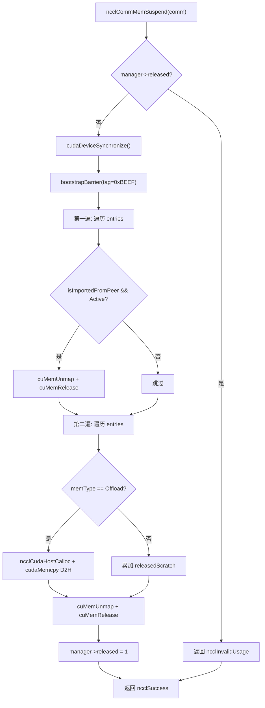
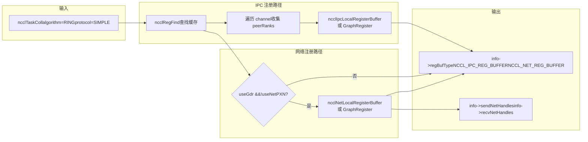
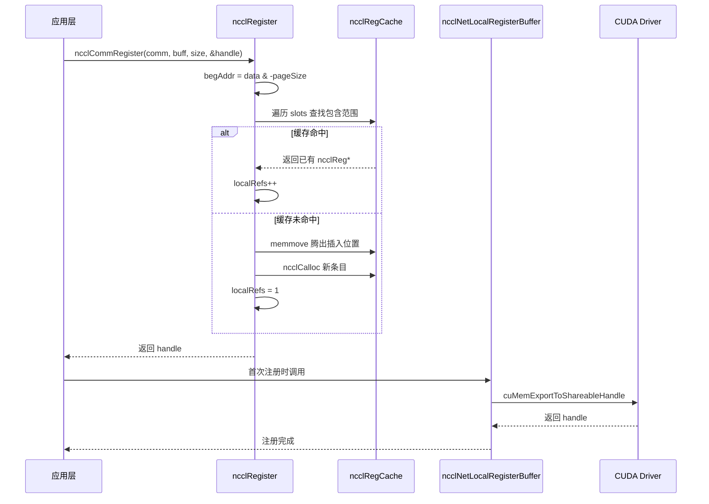

# 第 18 章：內存分配與顯存管理：allocator、註冊緩存與用戶註冊內存優化

上一章我們看到 RAS 子系統如何在控制面上獨立於數據面運行，用哈希做版本、用引用計數保護生命週期。本章進入 NCCL 的第三個支柱——內存管理。通信性能的上限，往往不取決於算法本身，而取決於「數據能不能被網卡直接讀寫」。NCCL 為此構建了三層機制：底層用`ncclSpace`和`ncclShadowPool`管理地址空間與影子對象，中層用`ncclMemManager`跟蹤動態內存的導入導出與掛起恢復，上層用`ncclCommRegister`把用戶緩衝區註冊進緩存，避免每次通信都重複 pin 內存。本章將逐層拆解這三套機制，回答「為什麼 NCCL 通信前需要註冊內存」以及「註冊緩存如何影響性能」。

# 18.1 ncclSpace：把地址空間切成滿/空交替的段

## 直覺模型

想像一條無限長的停車位編號線，從 0 開始向右延伸。有些車位停了車（已分配），有些空著（未分配）。`ncclSpace`就是這條編號線的「車位狀態記錄本」——它不記錄每個車位，只記錄「狀態發生翻轉的邊界點」。若沒有它，NCCL 在管理對稱內存的虛擬地址區間時，就得為每個字節維護一個標記位，內存開銷與地址空間成正比，完全不可接受。

## 數據結構與內存佈局

`ncclSpace`的定義極簡[FACT:src/include/allocator.h:20-24]：

```c
struct ncclSpace {
  int count;        // cuts[] 中有效元素个数
  int capacity;     // cuts[] 已分配容量
  int64_t* cuts;    // 升序排列的边界点数组
};
```

核心洞察在源碼註釋裡寫得很清楚[FACT:src/allocator.cc:151-153]：`cuts[]`把非負整數軸切成「滿」和「空」交替的段，切割點升序排列，最後一個切割點之後的段必然是空的（未分配前沿）。由此可以推導出判斷第`i`段是否已滿的公式：

```
isFull(i) = (i%2 != ncuts%2)
```

這個公式的含義是：段的滿/空狀態由「段索引奇偶性」和「切割點總數的奇偶性」共同決定。當`ncuts`為偶數時，第 0 段（`cuts[0]`之前）是空的；當`ncuts`為奇數時，第 0 段是滿的。這個不變量貫穿整個模塊。

## Step-by-Step Walkthrough：一次分配如何改變 cuts[]

代入場景：初始`ncclSpace`為空（`count=0`），調用`ncclSpaceTryAlloc(a, limit=1000, size=100, align=1, &outOffset)`。

**第一步：定位第一個空段** [FACT:src/allocator.cc:209]。`i = a->count % 2`，此時`count=0`，所以`i=0`，從第 0 段開始掃描。

**第二步：計算段邊界** [FACT:src/allocator.cc:212-213]。`i==0`時`lo=0`；`i==a->count`時`hi=limit=1000`。所以空段是`[0, 1000)`。

**第三步：對齊並檢查容量** [FACT:src/allocator.cc:214-215]。`off = alignUp(0, 1) = 0`，`0 + 100 <= 1000`成立，分配成功。

**第四步：插入切割點** [FACT:src/allocator.cc:217-223]。因為`i==0`（在頭部插入），走慢路徑`insertSegment(a, 0, 0, 100)`。`insertSegment`在`index=0`處插入兩個切割點`lo=0, hi=100` [FACT:src/allocator.cc:172-174]，然後執行「相鄰重複值過濾」[FACT:src/allocator.cc:185-203]。過濾邏輯很精妙：它用讀寫雙游標掃描，遇到重複值就回退寫游標，把成對的重複值刪掉——因為成對重複意味著一個空段被夾在兩個滿段之間，可以合併。但前導零是特例，可以單獨刪除[FACT:src/allocator.cc:182-184]。

分配後`cuts = [0, 100]`，`count=2`。此時`isFull(0) = (0%2 != 2%2) = false`，第 0 段（`[0,0)`，空）為空；第 1 段（`[0,100)`）為滿。正確。

**第五步：釋放** [FACT:src/allocator.cc:239-267]。調用`ncclSpaceFree(a, 0, 100)`。先檢查`cuts[count-1] <= offset`是否成立[FACT:src/allocator.cc:231-237]，即`100 <= 0`為假，繼續。定位第一個滿段`i = 1 - count%2 = 1 - 0 = 1` [FACT:src/allocator.cc:246]，`cuts[1]=100 > 0`，所以`i=1`。`lo = cuts[0] = 0`，`hi = cuts[1] = 100`。檢查`offset < lo || hi < offset+size` [FACT:src/allocator.cc:252]，`0<0`假，`100<100`假，通過。因為`lo==offset`且`offset+size==hi`，兩個快速路徑都不滿足（第一個要求`offset+size != hi`，第二個要求`lo != offset`），走慢路徑`insertSegment(a, 1, 0, 100)` [FACT:src/allocator.cc:264]。插入後`cuts = [0, 0, 100, 100]`，過濾後變成`[]`，`count=0`。回到初始狀態。

這個「插入後過濾」的設計避免了在分配/釋放時做複雜的段合併邏輯，把複雜度集中在`insertSegment`一處。

## 設計思考與生產踩坑

**為什麼用 int64_t 而不是 size_t？**因為`ncclSpace`管理的是「偏移量」而非「指針」，偏移量可能為負（雖然實際使用中不會），且需要與 CUDA 的`CUdeviceptr`寬度一致。用有符號類型便於在調試時發現越界。

**性能陷阱**：`ncclSpaceFree`的註釋直言「This could be binary search, but since allocate is linear there's no point」[FACT:src/allocator.cc:245]。這意味著分配和釋放都是 O(n) 掃描。如果某個通信域頻繁分配釋放大量小段，`cuts[]`會膨脹，每次操作都變慢。生產環境中應盡量復用已註冊的緩衝區，而不是反覆註冊/註銷。

**對齊溢出風險**：`alignUp(lo, align)`在`lo`接近`INT64_MAX`且`align`較大時可能溢出。源碼沒有顯式檢查，因為`limit`由調用方保證在合理範圍內。

# 18.2 ncclShadowPool：裝置物件與主機影子的配對管理

## 直覺模型

GPU kernel 執行在裝置上，無法直接存取主機記憶體中的 C++ 物件（比如`ncclDevComm`裡的元資料）。`ncclShadowPool`就像一個「翻譯官」：它為每個裝置側物件分配一塊顯存，同時在主機側分配一塊對應的「影子」記憶體，並維護「裝置位址 → 主機位址」的映射表。當 host 需要修改某個裝置物件的配置時，先改主機影子，再拷貝到裝置。若沒有它，每次 kernel 要讀元資料都得透過`cudaMemcpy`從 host 拉取，延遲高得無法接受。

## 資料結構與記憶體佈局

兩個核心結構體[FACT:src/allocator.cc:272-277]：

```c
struct ncclShadowPage {   // 最多 64 个对象的连续块
  struct ncclShadowPage* next;
  int objSize;
  uint64_t freeMask;      // 位图，1=空闲，0=已占用
  void* devObjs;
};
struct ncclShadowObject {
  struct ncclShadowObject* next;
  void* devObj;
  void* hostObj;
  struct ncclShadowPage* page;  // null 表示直接分配在 CUDA mempool
};
```

`ncclShadowPool`本身[FACT:src/include/allocator.h:42-47]：

```c
struct ncclShadowPool {
  int count, hbits;                       // 对象数、哈希位数
  struct ncclShadowObject** table;        // 哈希桶数组
  cudaMemPool_t memPool;                  // 可选的 CUDA 内存池
  struct ncclShadowPage* pages;           // 页链表
};
```

**關鍵設計點：`freeMask`是 uint64_t**，所以每頁最多 64 個物件。這不是隨意選的——64 位正好是一個快取行的寬度，`popFirstOneBit`可以用單條`__builtin_ctzll`指令找到第一個空閒槽位，無需迴圈。

**雜湊表增長策略**：原始碼註解「Maintain 2:1 object:bucket ratio」[FACT:src/allocator.cc:368]，即物件數超過桶數兩倍時擴容。初始`hbits=4`（16 個桶）[FACT:src/allocator.cc:363]，每次翻倍。

## Step-by-Step Walkthrough：一次分配如何選擇頁或直連

代入場景：`ncclShadowPoolAlloc(pool, size=1024, &devObj, &hostObj, stream)`。

**第一步：惰性初始化** [FACT:src/allocator.cc:347-366]。若`hbits==0`，先查詢裝置是否支援記憶體池[FACT:src/allocator.cc:352]，支援則建立`cudaMemPool_t`，設定`maxSize`為參數`SHADOW_MEMPOOL_MAX_SIZE`（預設 1GB）[FACT:src/allocator.cc:359]。然後分配 16 個桶的雜湊表。

**第二步：檢查是否需要擴容** [FACT:src/allocator.cc:369-386]。若`count+1 > 2<<hbits`，分配雙倍桶陣列，遍歷舊表重新插入（`hashInsert`用`ncclHashPointer`計算桶索引[FACT:src/allocator.cc:333-337]），釋放舊表。

**第三步：決定走頁路徑還是直連路徑** [FACT:src/allocator.cc:390]。判斷條件`(64<<10)/size >= 3`，即`size <= 21845`時走頁路徑。對於`size=1024`，`65536/1024=64 >= 3`，走頁路徑。

**第四步：計算頁內物件大小** [FACT:src/allocator.cc:391-392]。`shift = max(0, log2Down(1024)+1-4) = max(0, 10+1-4) = 7`。`pageObjSize = ((1024 + 127) >> 7) << 7 = 1024`。即頁內物件大小按 2 的冪對齊到 128 位元組的倍數。

**第五步：查找或建立頁** [FACT:src/allocator.cc:393-415]。遍歷`pool->pages`鏈表，找`objSize == pageObjSize`的頁。若沒有，建立新頁：`pageSize = min(65536, 64*1024) = 65536`，`freeMask = uint64_t(-1) >> (64 - 65536/1024) = uint64_t(-1) >> 0 = 全 1`（64 個槽位全空）[FACT:src/allocator.cc:400]。用`cudaMallocFromPoolAsync`或`cudaMalloc`分配顯存[FACT:src/allocator.cc:403-404]，並`cudaMemsetAsync`清零[FACT:src/allocator.cc:405]。

**第六步：從頁中取槽位** [FACT:src/allocator.cc:408-412]。`popFirstOneBit(&page->freeMask)`找到第一個空閒位，`devObj = page->devObjs + slot * pageObjSize`。若`freeMask`變為 0（頁滿），把頁從空閒鏈表移除[FACT:src/allocator.cc:411]。

**第七步：分配主機影子物件** [FACT:src/allocator.cc:423-428]。`malloc(sizeof(ncclShadowObject) + alignof(max_align_t)-1 + size)`，注意這裡多分配了`alignof(max_align_t)-1`位元組用於對齊填充。`hostObj = alignUp((char*)(obj+1), alignof(max_align_t))`，即物件頭之後對齊到最大對齊邊界。然後`memset(hostObj, 0, size)`清零。

**第八步：插入雜湊表並更新計數** [FACT:src/allocator.cc:429-430]。

## 併發控制與硬體互動

`ncclShadowPool`本身**沒有鎖**。這意味著它只能在單執行緒上下文中使用，或者由呼叫方保證互斥。從 NCCL 的實際使用看，它主要在通訊域初始化階段被呼叫，此時是單執行緒的。

`cudaMallocFromPoolAsync`和`cudaFreeAsync`是非同步操作，依賴`stream`參數保證順序[FACT:src/allocator.cc:403,459]。`ncclShadowPoolDestruct`在釋放所有資源後呼叫`cudaStreamSynchronize(stream)` [FACT:src/allocator.cc:333-337]，確保所有非同步釋放完成後再銷毀記憶體池。

## 生產避坑指南

**坑 1：頁內物件大小對齊導致的記憶體浪費**。`pageObjSize`按 2 的冪對齊，若`size=1000`，`shift = log2Down(1000)+1-4 = 9+1-4 = 6`，`pageObjSize = ((1000+63)>>6)<<6 = 1024`。每個物件浪費 24 位元組，頁內 64 個物件浪費 1536 位元組。對於大量小物件，這個開銷不可忽視。

**坑 2：`ncclShadowPoolFree`找不到物件時的行為** [FACT:src/allocator.cc:442-445]。它返回`ncclInternalError`並列印警告，但**不釋放任何資源**。如果呼叫方忽略返回值，會導致記憶體洩漏。生產程式碼必須檢查返回值。

**坑 3：`ncclShadowPoolDestruct`中`freeMask==0`的頁被回收** [FACT:src/allocator.cc:301-306]。注意這裡把`freeMask`設為 1（而非全 1），意味著只標記第一個槽位為空。這是為了把「滿頁」重新放入`pool->pages`鏈表，但頁內其他槽位仍然被佔用——實際上這些物件即將被釋放，所以這個操作是安全的。但如果解構過程中存在併發存取，會讀到不一致狀態。

# 18.3 ncclMemManager：動態記憶體的引用計數與掛起恢復

## 直覺模型

訓練任務可能運行數天，期間 GPU 可能被其他任務搶佔，或者需要做檢查點。`ncclMemManager`就像一個「記憶體管家」：它記錄所有動態分配的記憶體（scratch/offload），在需要時把 GPU 記憶體「掛起」（unmap 物理頁，保留虛擬位址），把資料備份到 CPU，等恢復時再重新分配物理頁、重新映射、恢復資料。若沒有它，任務被搶佔後只能從頭開始，浪費數小時訓練進度。

## 資料結構與記憶體佈局

`ncclMemManager`的核心欄位（從初始化程式碼推斷）[FACT:src/mem_manager.cc:32-60]：

| 欄位 | 類型 | 含義 |
| --- | --- | --- |
| `entries` | `ncclDynMemEntry*` | 動態記憶體條目鏈表頭 |
| `numEntries` | `int` | 鏈表長度 |
| `released` | `int` | 0=活躍，1=已掛起 |
| `refCount` | `int` | 引用計數（多個 comm 可共享） |
| `totalPersist` | `size_t` | 持久記憶體總量（原子） |
| `totalScratch` | `size_t` | scratch 記憶體總量（原子） |
| `totalOffload` | `size_t` | offload 記憶體總量（原子） |
| `cpuBackupUsage` | `size_t` | CPU 備份記憶體總量 |
| `lock` | `std::mutex` | 保護 entries 鏈表 |
| `initialized` | `int` | 原子標誌，防止存取已銷毀的 mutex |

**記憶體佈局的關鍵設計**：`lock`是一個`std::mutex`，但`ncclMemManager`是用`ncclCalloc`分配的（C 風格），所以必須用 placement new 顯式建構[FACT:src/mem_manager.cc:39]，解構時顯式呼叫`~mutex()` [FACT:src/mem_manager.cc:120]。這是 C/C++ 混合編程的經典陷阱。

**原子變數與鎖的分工**：統計欄位（`totalPersist`等）用原子操作更新，不需要鎖；`entries`鏈表用`lock`保護。這樣統計查詢（`ncclCommMemStats`）可以無鎖讀取[FACT:src/mem_manager.cc:1117-1130]，而鏈表操作必須持鎖。

## Step-by-Step Walkthrough：掛起與恢復的完整流程

**掛起流程** `ncclCommMemSuspend` [FACT:src/mem_manager.cc:418-540]：

**第一步：前置檢查** [FACT:src/mem_manager.cc:419-430]。檢查記憶體管理器是否禁用、comm 是否為空、是否已經掛起。

**第二步：裝置同步與 barrier** [FACT:src/mem_manager.cc:440-441]。`cudaDeviceSynchronize()`確保所有 GPU 操作完成，然後`bootstrapBarrier`確保所有 rank 同步。barrier tag 是`0xBEEF`。

**第三步：第一遍掃描——unmap 所有 peer 匯入的緩衝區** [FACT:src/mem_manager.cc:444-465]。對每個`isImportedFromPeer && state==Active`的條目，呼叫`cuMemUnmap`解除映射[FACT:src/mem_manager.cc:451]，釋放 handle[FACT:src/mem_manager.cc:456]，狀態改為`Released`。

**第四步：第二遍掃描——offload 本地記憶體** [FACT:src/mem_manager.cc:468-526]。跳過 peer 匯入和已釋放的條目。對`ncclMemOffload`類型，先分配 CPU 備份[FACT:src/mem_manager.cc:484]，然後`cudaMemcpy`從 GPU 拷貝到 CPU[FACT:src/mem_manager.cc:492]。對`ncclMemScratch`類型，只累加統計。然後關閉 shareable FD[FACT:src/mem_manager.cc:508-513]，`cuMemUnmap` [FACT:src/mem_manager.cc:516]，`cuMemRelease` [FACT:src/mem_manager.cc:519]，狀態改為`Released`。

**第五步：標記已掛起** [FACT:src/mem_manager.cc:528]。

**恢復流程** `ncclCommMemResume` [FACT:src/mem_manager.cc:550-942]：

**第一步：恢復本地記憶體** [FACT:src/mem_manager.cc:577-668]。對每個`!isImportedFromPeer && state==Released`的條目，重新`cuMemCreate` [FACT:src/mem_manager.cc:599]，`ncclCuMemMapAndSetAccess`映射到相同虛擬位址[FACT:src/mem_manager.cc:602]，恢復 peer 存取權限[FACT:src/mem_manager.cc:610-626]，對 offload 類型從 CPU 備份恢復資料[FACT:src/mem_manager.cc:632-643]，重新匯出 FABRIC handle[FACT:src/mem_manager.cc:646-658]。

**第二步：barrier 同步** [FACT:src/mem_manager.cc:671-679]。tag 仍是`0xBEEF`。

**第三步：交換新 handle 資訊** [FACT:src/mem_manager.cc:688-816]。統計每個 rank 有多少本地緩衝區需要廣播[FACT:src/mem_manager.cc:689-696]，用`bootstrapAllGather`交換計數[FACT:src/mem_manager.cc:710]，計算偏移[FACT:src/mem_manager.cc:724-728]，然後先`bootstrapSend`再`bootstrapRecv`（註解明確「send first, then receive to avoid deadlock」[FACT:src/mem_manager.cc:783]）。

**第四步：重新匯入 peer 緩衝區** [FACT:src/mem_manager.cc:822-911]。對每個`isImportedFromPeer && state==Released`的條目，在交換結果中查找匹配的 handle 資訊[FACT:src/mem_manager.cc:829-835]。POSIX FD 類型需要檢查 hostHash 是否相同[FACT:src/mem_manager.cc:853-859]，然後透過 proxy 取得 FD[FACT:src/mem_manager.cc:866]，`cuMemImportFromShareableHandle`匯入[FACT:src/mem_manager.cc:873]。FABRIC 類型直接匯入[FACT:src/mem_manager.cc:878]。然後`ncclCuMemMapAndSetAccess`重新映射[FACT:src/mem_manager.cc:893]。

**第五步：最終 barrier** [FACT:src/mem_manager.cc:916-928]。tag 是`0xCAFE`，與前面的`0xBEEF`區分。

## 並發控制與硬體互動

**引用計數保護生命週期**：`ncclMemManagerDestroy`先遞減`refCount` [FACT:src/mem_manager.cc:76]，若仍大於 0 則只清除當前 comm 的指標[FACT:src/mem_manager.cc:81]，不釋放資源。這允許多個 comm 共享同一個記憶體管理器（比如 split_share 場景）。

**原子 initialized 標誌**：所有操作前都檢查`COMPILER_ATOMIC_LOAD(&manager->initialized, memory_order_acquire)` [FACT:src/mem_manager.cc:136,242,338,358]，防止存取已銷毀的 mutex。銷毀時用`memory_order_release`儲存 0[FACT:src/mem_manager.cc:87]，確保之前的寫操作對其他執行緒可見。

**CUDA VMM API 的使用**：`cuMemCreate`/`cuMemMap`/`cuMemUnmap`/`cuMemRelease`是 CUDA 虛擬記憶體管理 API，允許實體記憶體和虛擬位址分離。這是掛起/恢復的基礎——掛起時 unmap 實體頁但保留虛擬位址，恢復時重新映射到相同虛擬位址，這樣所有已建立的指標關係都不需要修改。

## 生產避坑指南

**坑 1：split_share 通訊域不支援掛起** [FACT:src/mem_manager.cc:1014-1018]。若`refCount > 1`，直接返回`ncclInvalidUsage`。因為多個 comm 共享記憶體管理器時，掛起一個 comm 會影響其他 comm 的記憶體。

**坑 2：POSIX FD 跨節點失效** [FACT:src/mem_manager.cc:853-859]。POSIX 檔案描述符只在同一節點內有效，跨節點恢復時必須跳過。原始碼用`hostHash`比較判斷是否同節點。

**坑 3：offload 資料恢復失敗時保留備份** [FACT:src/mem_manager.cc:635]。若`cudaMemcpy`從 CPU 恢復到 GPU 失敗，原始碼列印警告並保留`cpuBackup`，不釋放。這是為了給呼叫方一個重試的機會，但如果不重試就會洩漏 CPU 記憶體。

**坑 4：`ncclMemUntrackDynamic`中的 use-after-free 風險**。原始碼在持鎖狀態下找到條目、儲存必要資訊、釋放條目[FACT:src/mem_manager.cc:302]，然後在鎖外更新統計[FACT:src/mem_manager.cc:311-327]。這個順序是正確的，但如果`info`指標指向呼叫方的堆疊記憶體，且呼叫方在鎖外讀取，需要確保`info`的生命週期覆蓋整個函式。



上圖展示了掛起流程的控制流。注意兩個關鍵分支：第一遍只處理 peer 匯入的緩衝區，第二遍只處理本地緩衝區，順序不能顛倒——必須先解除對 peer 記憶體的引用，再釋放本地記憶體。

# 18.4 註冊快取：ncclRegister 如何避免重複 pin

## 直覺模型

網卡要直接讀寫 GPU 顯存（GPUDirect RDMA），必須先「註冊」這塊記憶體——告訴網卡「這塊位址你可以直接存取」。註冊過程涉及 pin 頁、建立 IOMMU 映射，開銷很大（毫秒級）。如果每次 AllReduce 都重新註冊，小訊息通訊的延遲會被註冊開銷完全淹沒。`ncclRegister`就是一個「註冊快取」：它把已註冊的位址範圍記錄在有序陣列裡，下次遇到相同或包含的緩衝區，直接複用，不重複註冊。

## 資料結構與記憶體佈局

`ncclRegCache`的核心是一個有序陣列`slots`，每個元素是`ncclReg*`。`ncclReg`的關鍵欄位（從使用推斷）：

| 欄位 | 類型 | 含義 |
| --- | --- | --- |
| `begAddr` | `uintptr_t` | 頁對齊的起始位址 |
| `endAddr` | `uintptr_t` | 頁對齊的結束位址 |
| `localRefs` | `int` | 本地引用計數 |
| `graphRefs` | `int` | 圖引用計數 |
| `state` | `int` | 註冊狀態位（NET/NVLS/COLLNET/IPC） |
| `netHandleHead` | `ncclRegNetHandles*` | 網路 handle 鏈結串列 |
| `ipcInfos` | `ncclIpcInfo**` | IPC 資訊陣列 |

**頁對齊**：`begAddr = (uintptr_t)data & -pageSize` [FACT:src/register/register.cc:31]，`endAddr = ((uintptr_t)data + size + pageSize - 1) & -pageSize` [FACT:src/register/register.cc:32]。`-pageSize`是`pageSize`的二進位補碼，等價於「向下對齊到 pageSize 的倍數」。這樣做的原因是：註冊的最小粒度是頁，即使只註冊 1 位元組，也要註冊整頁。

## Step-by-Step Walkthrough：一次註冊如何命中快取

代入場景：`ncclCommRegister(comm, buff=0x7f0000001000, size=4096, &handle)`。

**第一步：參數檢查與頁對齊** [FACT:src/register/register.cc:18-24]。`CommCheck`驗證 comm 有效性。假設`pageSize=4096`，`begAddr = 0x7f0000001000 & -4096 = 0x7f0000001000`，`endAddr = (0x7f0000001000 + 4096 + 4095) & -4096 = 0x7f0000002000`。

**第二步：系統記憶體檢查** [FACT:src/register/register.cc:36-64]。若`ncclCuMemEnable()`，查詢位址範圍和記憶體類型。若`memType == CU_MEMORYTYPE_HOST`，說明是 CPU 記憶體，跳過註冊[FACT:src/register/register.cc:58-61]。否則檢查是否有 Sysmem 段[FACT:src/register/register.cc:50-55]。

**第三步：遍歷快取尋找插入位置** [FACT:src/register/register.cc:66-89]。迴圈`slot`從 0 開始：

- 若`slot == population`（到達末尾）或`begAddr < slots[slot]->begAddr`（當前位址在快取條目之前），說明需要新建條目[FACT:src/register/register.cc:67]。
- 若`slots[slot]->begAddr <= begAddr && slots[slot]->endAddr >= endAddr`，說明當前緩衝區被已有條目完全包含，直接增加引用計數[FACT:src/register/register.cc:83-87]。

**第四步：新建條目** [FACT:src/register/register.cc:68-82]。若快取滿，擴容（初始 32，之後翻倍）[FACT:src/register/register.cc:70]。用`memmove`在`slot`位置騰出空間[FACT:src/register/register.cc:73]，`ncclCalloc`分配新條目[FACT:src/register/register.cc:74]，設定`begAddr`/`endAddr`，根據`isGraph`設定`graphRefs`或`localRefs`為 1[FACT:src/register/register.cc:78-79]，`population++`，返回 handle。

**第五步：註銷** [FACT:src/register/register.cc:172-195]。`commDeregister`先找到 handle 對應的 slot[FACT:src/register/register.cc:180]，遞減引用計數[FACT:src/register/register.cc:185-186]。若仍有引用，直接返回[FACT:src/register/register.cc:187]。否則呼叫`regCleanup`清理所有底層註冊[FACT:src/register/register.cc:188]，釋放條目，用`memmove`填補空洞[FACT:src/register/register.cc:190]，`population--`。

## 設計思考與生產踩坑

**為什麼用有序陣列而不是雜湊表？**因為註冊查詢是「範圍包含」查詢，不是精確匹配。有序陣列支援二分查找（雖然原始碼用線性掃描），且記憶體局部性好。雜湊表無法高效處理「這個位址是否被某個更大的範圍包含」這類查詢。

**`regCleanup`的狀態位設計** [FACT:src/register/register.cc:95-134]。`state`是一個位元遮罩，每個位對應一種註冊類型（NET/NVLS/COLLNET/IPC）。清理時逐位檢查，只清理已完成的註冊。這種設計允許部分註冊成功、部分失敗的情況——比如網路註冊成功但 IPC 註冊失敗，清理時只清理網路部分。

**生產陷阱：註冊快取不感知記憶體釋放**。如果使用者註冊了一塊緩衝區，然後在未註銷的情況下`cudaFree`了它，快取中仍然保留著這個條目。下次分配可能復用同一位址，導致快取命中但實際記憶體已失效。NCCL 的約定是：註冊和註銷必須配對，使用者負責保證註冊期間記憶體不被釋放。

**`ncclCommRegister`的跳過條件** [FACT:src/register/register.cc:150-159]。若`LocalRegister=0`或`P2pUsesMemcpy=1`，直接返回`NULL`handle。這意味著在某些配置下（比如 P2P 走 memcpy 而非 RDMA），註冊被完全跳過。呼叫方必須檢查 handle 是否為 NULL。

# 18.5 集合通訊註冊：coll_reg 如何為不同演算法選擇註冊策略

## 直覺模型

不同的集合通訊演算法走不同的傳輸路徑：NVLS 走 NVLink SHARP，Ring 走 P2P 或網路，Tree 走樹形拓撲。每條路徑需要不同的註冊方式：NVLS 需要註冊到 NVLS 硬體，網路需要註冊到網卡，IPC 需要註冊到對端 GPU。`coll_reg.cc`就是「註冊策略路由器」：它根據演算法、協定、緩衝區類型，決定呼叫哪些註冊函式。若沒有它，每種演算法都得自己實作註冊邏輯，程式碼重複且容易出錯。

## Step-by-Step Walkthrough：Ring 演算法的註冊決策

代入場景：`ncclRegisterCollBuffers(comm, info, outRegBufSend, outRegBufRecv, cleanupQueue, regNeedConnect)`，其中`info->algorithm == NCCL_ALGO_RING`，`info->protocol == NCCL_PROTO_SIMPLE`。

**第一步：前置檢查** [FACT:src/register/coll_reg.cc:155-157]。設定`regBufType = NCCL_REGULAR_BUFFER`，`regNeedConnect = true`。若`LocalRegister=0`且非持久圖註冊，直接退出。

**第二步：進入 Ring 分支** [FACT:src/register/coll_reg.cc:338]。初始化`recvRegRecord`/`sendRegRecord`為 NULL，分配`sendNetConns`/`sendNetHandles`/`recvNetConns`/`recvNetHandles`/`srecvNetHandles`陣列[FACT:src/register/coll_reg.cc:356-360]。

**第三步：查找已有註冊記錄** [FACT:src/register/coll_reg.cc:351-355]。`ncclRegFind`在快取中查找 recv/send 緩衝區。若 recv 未找到且非持久圖註冊，退出[FACT:src/register/coll_reg.cc:352]。若跨節點且 send 未找到且非持久圖註冊，退出[FACT:src/register/coll_reg.cc:354]。

**第四步：遍歷所有 channel 收集 peer** [FACT:src/register/coll_reg.cc:362-393]。對每個 channel，檢查`ring.prev`和`ring.next`。若連接標誌包含`NCCL_DIRECT_NIC`，記錄到`recvNetConns`/`sendNetConns` [FACT:src/register/coll_reg.cc:370-379]。若包含`NCCL_P2P_READ | NCCL_P2P_WRITE`，把 peer 加入`peerRanks`陣列[FACT:src/register/coll_reg.cc:382-391]。

**第五步：IPC 註冊** [FACT:src/register/coll_reg.cc:394-407]。若`nPeers > 0 && comm->isAllDirectP2p`，先嘗試圖註冊[FACT:src/register/coll_reg.cc:395-399]，失敗則嘗試本地註冊[FACT:src/register/coll_reg.cc:400-403]。若成功，設定`regBufType = NCCL_IPC_REG_BUFFER` [FACT:src/register/coll_reg.cc:406]。

**第六步：網路註冊** [FACT:src/register/coll_reg.cc:409-457]。檢查`!comm->useNetPXN && comm->useGdr && netDeviceType != UNPACK`且非 AllReduce 的 PreMulSum/SumPostDiv[FACT:src/register/coll_reg.cc:415-418]。先嘗試圖註冊[FACT:src/register/coll_reg.cc:419-430]，失敗則本地註冊[FACT:src/register/coll_reg.cc:431-442]。若成功，設定`regBufType |= NCCL_NET_REG_BUFFER`，保存 handle 陣列[FACT:src/register/coll_reg.cc:445-452]。

**第七步：調整通道數** [FACT:src/register/coll_reg.cc:551-554]。若只有 IPC 註冊且單節點且通道數在 17-24 之間，降到 16。這是為了匹配 IPC 註冊後的頻寬特性。

## 設計思考與生產踩坑

**為什麼 NVLS 和 Ring 的註冊順序相反？**NVLS 分支先嘗試圖註冊再本地註冊[FACT:src/register/coll_reg.cc:86-94]，而 Ring 分支先本地再圖[FACT:src/register/coll_reg.cc:395-403]。這是因為 NVLS 的圖註冊更可能成功（NVLS 硬體對持久緩衝區有優化），而 Ring 的本地註冊更輕量。

**`isMloPartBufRdmaCapable`的全域決策** [FACT:src/register/coll_reg.cc:14-37]。註解強調「Registration decision must be global, using communicator-wide guarantees」[FACT:src/register/coll_reg.cc:20]。這意味著即使某個 rank 的緩衝區支援 RDMA，只要通訊域內有一個 rank 不支援，整個通訊域都不註冊。這是為了避免部分 rank 註冊、部分不註冊導致的不一致。

**生產陷阱：註冊失敗時的靜默降級**。`ncclRegisterCollBuffers`在註冊失敗時不會報錯，只是不設定`regBufType`的對應位。這意味著通訊仍然能工作，只是效能下降。生產環境中如果發現效能不達預期，應該檢查`NCCL_REG`日誌確認註冊是否成功。



上圖展示了 Ring 演算法下兩條並行的註冊路徑：IPC 路徑處理同節點 P2P 連接，網路路徑處理跨節點 RDMA 連接。兩條路徑獨立執行，最終都彙總到`info->regBufType`。

# 18.6 生產避坑與故障恢復鏈

## 坑 1：註冊快取與記憶體池的互動

當使用`ncclMemAlloc`分配記憶體時，底層走 CUDA VMM API[FACT:src/allocator.cc:38-94]。這種分配方式建立的實體記憶體帶有`gpuDirectRDMACapable`標誌[FACT:src/allocator.cc:54]，意味著它天然支援 RDMA。但`ncclMemFree`釋放時，如果記憶體管理器已銷毀，會走`cudaFree`回退路徑[FACT:src/allocator.cc:130-132]。這可能導致 VMM 分配的記憶體被錯誤地用`cudaFree`釋放。生產環境中必須確保`ncclMemAlloc`/`ncclMemFree`配對使用，且不要在記憶體管理器銷毀後釋放。

## 坑 2：掛起期間的通訊請求

`ncclCommMemSuspend`執行期間，如果有新的通訊請求到達，會怎樣？原始碼在掛起前呼叫`cudaDeviceSynchronize()` [FACT:src/mem_manager.cc:440]，確保所有已入隊的 GPU 操作完成。但如果有 host 側的通訊請求正在入隊，沒有顯式保護。生產環境中應該在掛起前停止所有通訊執行緒，或者使用 group 語意確保掛起操作與其他操作串行。

## 坑 3：FABRIC handle 的相容性

`ncclMemAlloc`在 CUDA 12.3+ 上會嘗試使用 FABRIC handle[FACT:src/allocator.cc:60-71]。如果`cuMemCreate`返回`CUDA_ERROR_NOT_PERMITTED`或`CUDA_ERROR_NOT_SUPPORTED`，會回退到 POSIX FD[FACT:src/allocator.cc:63-65]。但恢復時，如果 handle 類型是 FABRIC 但匯出失敗，會直接報錯並 unmap[FACT:src/mem_manager.cc:649-655]。這意味著在混合環境中（部分 GPU 支援 FABRIC，部分不支援），掛起/恢復可能失敗。

## 坑 4：引用計數洩漏

`ncclRegister`每次命中快取都會增加引用計數[FACT:src/register/register.cc:84-85]。如果呼叫方註冊了 N 次但只註銷了 M 次（M < N），引用計數永遠不會歸零，`regCleanup`永遠不會被呼叫，底層註冊資源洩漏。生產程式碼必須嚴格配對`ncclCommRegister`/`ncclCommDeregister`。



# 本章思考與自測

Q1: 若將`ncclSpaceFree`中的`if (a->count == 0 || a->cuts[a->count - 1] <= offset)`檢查[FACT:src/allocator.cc:231-237]去掉，在什麼場景下會觸發越界存取？

**參考解析**：這個檢查有兩個作用。第一，`a->count == 0`防止空陣列存取`cuts[-1]`。第二，`a->cuts[a->count-1] <= offset`防止`offset`超出已分配範圍。如果去掉，當`count == 0`時，`a->cuts[a->count - 1]`會讀取`cuts[-1]`，這是未定義行為，可能讀到堆元資料或觸發段錯誤。更隱蔽的是，即使`count > 0`，如果`offset`大於最後一個切割點，後續的`while (a->cuts[i] <= offset) i += 2`迴圈[FACT:src/allocator.cc:247]會一直遞增`i`直到越界，因為`cuts[]`中不存在大於`offset`的元素。這在生產中的觸發場景是：呼叫方傳入了一個從未分配過的偏移量（比如緩衝區被外部釋放後再次呼叫 free），或者`ncclSpace`被並行修改導致狀態不一致。修復方式是保留這個檢查，並在返回錯誤時列印`offset`和`count`便於排查。

Q2: `ncclMemManagerDestroy`中，如果`refCount`遞減後仍大於 0，只清除當前 comm 的指標而不釋放資源[FACT:src/mem_manager.cc:78-83]。如果此時另一個 comm 正在呼叫`ncclMemTrack`，會發生什麼？

**參考解析**：`ncclMemTrack`首先檢查`manager->initialized` [FACT:src/mem_manager.cc:136]。由於`refCount > 0`時不會設定`initialized = 0`，所以檢查通過。然後它會取得`manager->lock`並修改`entries`鏈結串列[FACT:src/mem_manager.cc:188-192]。這是安全的，因為`refCount > 0`意味著至少還有一個 comm 持有引用，記憶體管理器不會被銷毀。真正的風險在於：如果最後一個 comm 呼叫`ncclMemManagerDestroy`時，`refCount`遞減到 0，它會設定`initialized = 0` [FACT:src/mem_manager.cc:87]並釋放所有資源。如果此時另一個執行緒正在`ncclMemTrack`中已經通過了`initialized`檢查但還沒取得鎖，它會存取已釋放的`manager->lock`，導致 use-after-free。原始碼透過`memory_order_acquire`/`release`配對來緩解這個問題，但嚴格來說仍存在競態視窗。生產環境中應該確保所有通訊執行緒在銷毀記憶體管理器前已停止。

Q3: 在`ncclCommMemResume`中，POSIX FD 類型的 peer 緩衝區在跨節點時被跳過[FACT:src/mem_manager.cc:853-859]。如果所有 peer 緩衝區都被跳過，`restoredPeerCount`為 0，但`manager->released`仍被設為 0[FACT:src/mem_manager.cc:913]。這會導致什麼後果？

**參考解析**：`manager->released = 0`表示記憶體管理器認為恢復已完成。但如果有 peer 緩衝區被跳過，它們的`state`仍然是`ncclDynMemStateReleased`，`handle`仍然是 0。後續通訊如果存取這些緩衝區，會觸發 CUDA 錯誤（存取未映射的虛擬位址）。更嚴重的是，`ncclCommMemStats`查詢`ncclStatGpuMemSuspended`會返回 0（活躍）[FACT:src/mem_manager.cc:1130]，但實際有部分記憶體未恢復。這個問題的根源是：跨節點 POSIX FD 本身就不應該被匯入——在掛起前，這些緩衝區就不應該存在於`entries`中。正確的做法是在掛起時就把跨節點的 POSIX FD 條目標記為不可恢復，或者在恢復時返回錯誤而非靜默跳過。生產環境中，如果使用 POSIX FD 且跨節點，應該改用 FABRIC handle 或確保掛起/恢復只在單節點內進行。

記憶體管理是 NCCL 效能的隱形支柱：`ncclSpace`用極簡的切割點陣列管理位址空間，`ncclShadowPool`用 64 位元位圖和雜湊表管理裝置/主機物件配對，`ncclMemManager`用引用計數和 CUDA VMM API 實現掛起恢復，`ncclRegister`用有序陣列快取註冊結果避免重複 pin。這四層機制共同支撐起「通訊前不需要重新註冊記憶體」這一關鍵效能保證。下一章我們將進入裝置側通訊器與 ABI 相容，看`devcomm`如何把這些 host 側的記憶體佈局映射到 GPU kernel 可存取的結構中。

上圖展示了註冊的時序：快取命中時只增加引用計數，不呼叫底層註冊；快取未命中時才建立新條目並觸發底層註冊。至此，host 側的記憶體管理機制已經清晰。但通訊最終發生在 GPU 上，kernel 需要直接存取對端 rank 的位址和連線狀態。下一章將進入裝置側通訊器與 ABI 相容，看 devcomm 如何把 host 側 ncclComm 的元資料映射到裝置側可存取的結構，以及版本化 ABI 如何保證新舊 kernel 與函式庫的相容。
