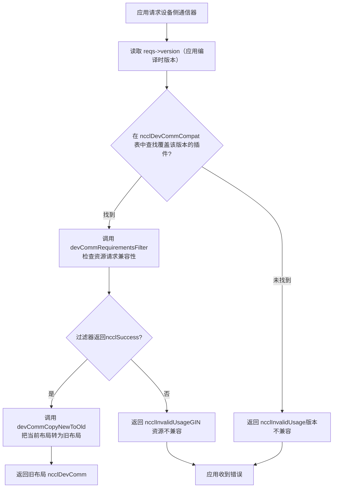
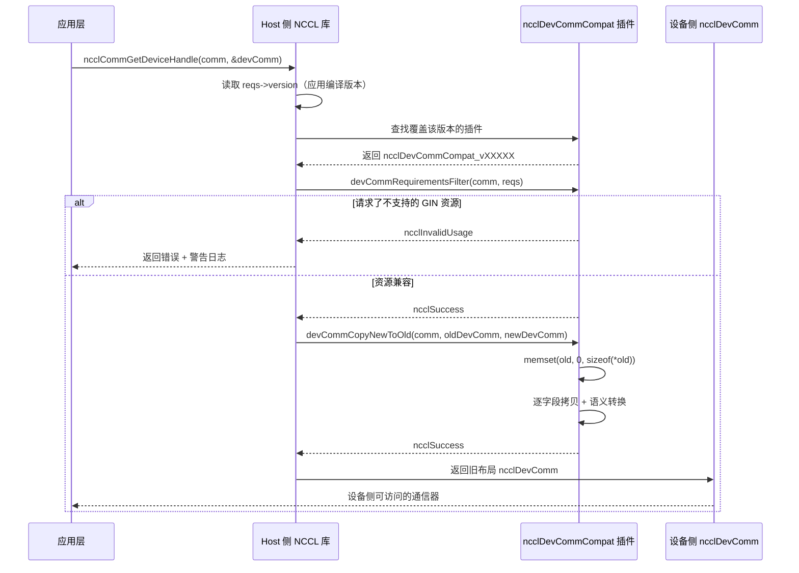

# 第 19 章：裝置端通訊域與 ABI 相容：devcomm 與 kernel 的通訊契約

上一章我們看到，host 側的 ncclMemManager 用引用計數和 CUDA VMM API 管理著通訊緩衝區的生命週期。但通訊真正發生的地方是 GPU kernel——kernel 裡的執行緒需要知道：我是哪個 rank？對端 rank 的緩衝區在哪個虛擬位址？連線是否就緒？這些資訊在 host 側的 ncclComm 結構裡，但 kernel 不能直接解引用 host 指標。如果 NCCL 讓 kernel 每次都透過參數傳遞或全域記憶體查詢來取得這些元資料，那麼每次通訊都要付出額外的延遲和頻寬開銷。更糟糕的是，kernel 程式碼一旦編譯，其存取的欄位偏移就固定了——如果函式庫升級後 ncclComm 的佈局變了，舊 kernel 就會讀到錯誤的資料。這就是 devcomm 要解決的核心問題：把 host 側通訊域的關鍵元資料，以穩定的、版本化的記憶體佈局，映射到裝置側可存取的結構中。src/devcomm 目錄下的 devcomm_v22902.cc、devcomm_v22907.cc、devcomm_v23000.cc、devcomm_v23100.cc 就是這套版本化 ABI 的具體實現。每個檔案對應一個 NCCL 版本區間，定義了該區間內 ncclDevComm 的精確記憶體佈局，以及新舊版本之間的欄位拷貝邏輯。本章將依次拆解：裝置側通訊器的核心資料結構長什麼樣、版本化 ABI 的註冊與匹配機制如何運作、新舊版本之間如何做欄位級轉換、以及這套機制在生產環境中的邊界與陷阱。

# 一、裝置側通訊器的核心結構：ncclDevComm 的記憶體佈局

## 直覺模型

把`ncclDevComm`想像成一張「工位卡」：每個 GPU kernel 啟動時，都會拿到一張卡片，上面印著「你是 3 號 rank，總共 8 個 rank，你的 LSA 組裡有 4 個 rank，對端緩衝區基底位址在 0x7f...」。這張卡片必須足夠小（能塞進 kernel 參數），又必須包含所有關鍵資訊。如果這張卡片不存在，kernel 就只能靠 host 側反覆傳遞參數，每次通訊都要重新組裝——延遲高、易出錯。

## 資料結構與記憶體佈局

以`ncclDevComm_v23000`為例，它的完整定義在[FACT:src/devcomm/devcomm_v23000.cc:25-62]：

```c
struct ncclDevComm_v23000 {
  unsigned int magic;          // 偏移 0，魔数校验
  unsigned int version;        // 偏移 4，版本号

  int rank, nRanks;            // 偏移 8, 12
  uint32_t nRanks_rcp32;       // 偏移 16，nRanks 的倒数（定点数）
  int lsaRank, lsaSize;        // 偏移 20, 24
  uint32_t lsaSize_rcp32;      // 偏移 28

  ncclDevCommWindowTable_t windowTable;  // 偏移 32
  ncclWindow_t resourceWindow;           // 偏移 40
  ncclResourceWindow_vidmem_v23000_t resourceWindow_inlined;  // 偏移 48
  ncclGinBarrierHandle_t hybridWorldGinBarrier;  // 偏移 112
  ...
};
```

[FACT:src/devcomm/devcomm_v23000.cc:64-93]用一連串`static_assert`把每個欄位的偏移釘死。這不是裝飾——它是 ABI 相容性的編譯期契約。如果某個欄位的偏移因為編譯器對齊策略變化而移動，編譯就會失敗，而不是在執行時產生難以除錯的記憶體錯位。

幾個關鍵欄位的設計動機：

> **[Design Inference & Architectural Trade-offs]**
> **`nRanks_rcp32`和`lsaSize_rcp32`**：這是`nRanks`和`lsaSize`的倒數，用 32 位定點數表示。 kernel 裡做 rank 到 buffer 偏移的除法運算時，GPU 的整數除法很慢，用乘以倒數再移位的方式可以顯著加速。這是典型的「用空間換時間」——多存 4 位元組，省掉每次除法的幾十個時脈週期。

**`resourceWindow_inlined`**：這是一個內聯的視窗描述符，類型為`ncclResourceWindow_vidmem_v23000_t`。注意[FACT:src/devcomm/devcomm_v23000.cc:11-18]中它的定義：

```c
typedef struct ncclResourceWindow_vidmem_v23000 {
  char reserved1[8];
  char* lsaFlatBase;
  char reserved2[8];
  uint32_t stride4G;
  uint32_t mcOffset4K;
  char reserved3[32];  // NOTE: shrunk from 40 in 2.30u1 to reclaim 8 bytes
} ncclResourceWindow_vidmem_v23000_t;
```

這裡的`reserved1`、`reserved2`、`reserved3`是**填充欄位**，用來佔位。為什麼需要填充？因為`ncclDevComm_v23000`的佈局必須與某個「基準版本」保持偏移一致，即使某些欄位在當前版本中不再使用，也要保留佔位以保證後續欄位的偏移不變。[FACT:src/devcomm/devcomm_v23000.cc:11-18]的註解明確說明：2.30u1 把`reserved3`從 40 位元組縮小到 32 位元組，騰出 8 位元組給`hybridWorldGinBarrier`。這是一次**佈局重排**——透過縮小填充區，在不改變整體大小的前提下塞入新欄位。

[FACT:src/devcomm/devcomm_v23000.cc:11-18]的`static_assert`進一步驗證：`lsaFlatBase`、`stride4G`、`mcOffset4K`三個欄位的偏移必須與「當前版本」的`ncclWindow_vidmem`一致，且整個結構體大小為 64 位元組。這意味著`resourceWindow_inlined`在 v23000 和當前版本之間是**二進位相容**的——可以直接 memcpy。

## 版本化結構體的家族

對比`ncclDevComm_v22902` [FACT:src/devcomm/devcomm_v22902.cc:38-62]和`ncclDevComm_v22907` [FACT:src/devcomm/devcomm_v22907.cc:13-41]，可以看到欄位的演化：

| 欄位 | v22902 | v22907 | v23000 |
| --- | --- | --- | --- |
| `magic`/`version` | 無 | 無 | 有（偏移 0/4） |
| `ginContextCount` | uint8_t | uint32_t | uint32_t |
| `ginNetDeviceTypes` | `[4]` | `[NCCL_GIN_MAX_CONNECTIONS]` | `[NCCL_GIN_MAX_CONNECTIONS]` |
| `ginIsRailed` | 無 | bool | 拆分為`ginConnectionsRailed` + `ginContextsRailed` |
| `hybridWorldGinBarrier` | 無 | 無 | 有（偏移 112） |
| 結構體大小 | 200 | 224 | 240 |

> **[Design Inference & Architectural Trade-offs]**
> 這個演化路徑揭示了 NCCL 的版本策略：**只在必要時增加欄位，且盡量利用填充區**。v22902 到 v22907 增加了`ginSignalBase`、`ginCounterBase`、`ginContextBase`、`ginIsRailed`等 GIN 相關欄位；v22907 到 v23000 增加了`magic`/`version`校驗欄位和`hybridWorldGinBarrier`，同時把`ginIsRailed`拆成兩個更精確的標誌位。

---

# 二、版本化 ABI 的註冊與匹配：ncclDevCommCompat 結構

## 直覺模型

把版本化 ABI 想像成一套「翻譯外掛」：當應用程式用 NCCL 2.29.2 編譯，但執行時連結的是 2.31.0 的函式庫，函式庫需要知道「2.29.2 的 kernel 期望什麼樣的`ncclDevComm`佈局」，然後把當前版本的`ncclDevComm`翻譯成舊佈局。每個版本區間對應一個翻譯外掛，註冊在一個全域表中。

## 核心結構：ncclDevCommCompat

每個`devcomm_vXXXXX.cc`檔案末尾都定義了一個`ncclDevCommCompat`結構體。以 v23000 為例[FACT:src/devcomm/devcomm_v23000.cc:192-199]：

```c
struct ncclDevCommCompat ncclDevCommCompat_v23000 = {
  NCCL_VERSION(2, 30, 0),               // minVersion
  NCCL_VERSION(2, 30, 7),               // maxVersion
  nullptr,                              // commPropertiesFilter
  ncclDevCommRequirementsFilter_v23000, // devCommRequirementsFilter
  ncclDevCommCopyNewToOld_v23000,       // devCommCopyNewToOld
  ncclDevCommCopyOldToNew_v23000,       // devCommCopyOldToNew
};
```

六個欄位的含義：

1. **`minVersion` / `maxVersion`**：這個外掛負責的版本區間。v23000 覆蓋 2.30.0 到 2.30.7。

2. **`commPropertiesFilter`**：可選的過濾器，用於調整`ncclCommProperties`中暴露給舊版本的能力標誌。v23000 設為`nullptr`，表示不需要過濾。

3. **`devCommRequirementsFilter`**：檢查應用程式請求的裝置側資源是否與舊版本相容。v23000 的實現[FACT:src/devcomm/devcomm_v23000.cc:95-98]只是把`ginType`從`comm->sharedRes`複製到`reqs`。

4. **`devCommCopyNewToOld`**：把當前版本的`ncclDevComm`拷貝到舊版本佈局。

5. **`devCommCopyOldToNew`**：把舊版本佈局拷貝回當前版本。

## 版本區間的劃分

四個檔案的版本區間：

| 檔案 | minVersion | maxVersion | 備註 |
| --- | --- | --- | --- |
| `devcomm_v22902.cc` | 2.29.2 | 2.29.3 | 最早的版本化實現 |
| `devcomm_v22907.cc` | 2.29.5 | 2.29.7 | 增加 GIN 欄位，但不提供 GIN 向後相容 |
| `devcomm_v23000.cc` | 2.30.0 | 2.30.7 | 增加 magic/version 校驗 |
| `devcomm_v23100.cc` | 2.31.0 | 當前版本 | 所有過濾器為 nullptr，表示完全相容 |

[FACT:src/devcomm/devcomm_v23100.cc:10-17]的 v23100 外掛所有回呼都是`nullptr`，這意味著從 2.31.0 開始，`ncclDevComm`的佈局已經穩定，不需要任何轉換。

> **[Design Inference & Architectural Trade-offs]**
> 注意 v22902 和 v22907 之間的版本區間有「空隙」（2.29.4 和 2.29.6 沒有對應的外掛）。這可能是因為這些版本沒有發布，或者它們的佈局與相鄰版本完全一致，可以複用。

## 匹配流程

當應用程式呼叫`ncclCommGetDeviceHandle`或類似 API 時，NCCL 需要：

1. 讀取應用程式編譯時嵌入的 NCCL 版本號（透過`reqs->version`）。

2. 在全域的`ncclDevCommCompat`表中查找覆蓋該版本的外掛。

3. 如果找到，呼叫外掛的`devCommCopyNewToOld`把當前佈局轉換為舊佈局。

4. 如果沒找到，返回錯誤或使用預設行為。

下面的流程圖展示了這個匹配與轉換過程：



---

# 三、欄位級轉換：新舊佈局如何互轉

## 直覺模型

版本轉換就像「翻譯」：新版本的`ncclDevComm`是一篇現代漢語文章，舊版本的佈局是一篇文章文。翻譯器需要逐欄位對應——有些欄位直接對應（`rank`對`rank`），有些欄位需要「意譯」（`ginConnectionStride > 1`翻譯成`ginConnectionsRailed = true`），有些欄位在舊版本中不存在（直接丟棄）。

## NewToOld 轉換：從當前版本到舊版本

以`ncclDevCommCopyNewToOld_v23000`為例[FACT:src/devcomm/devcomm_v23000.cc:114-152]：

```c
static ncclResult_t ncclDevCommCopyNewToOld_v23000(ncclComm_t comm, void* oldDevComm,
                                                   struct ncclDevComm const* newDevComm) {
  struct ncclDevComm_v23000* old = (struct ncclDevComm_v23000*)oldDevComm;

  memset(old, '\0', sizeof(*old));  // 先清零，防止未初始化字段泄露
  old->magic = newDevComm->magic;
  old->version = newDevComm->version;
  old->rank = newDevComm->rank;
  ...
  old->ginConnectionsRailed = (newDevComm->ginConnectionStride > 1);
  old->ginStrongLegacySignals = newDevComm->ginStrongLegacySignals;
  old->ginContextsRailed = (newDevComm->ginContextStride > 1);
  ...
}
```

關鍵步驟：

1. **`memset`清零** [FACT:src/devcomm/devcomm_v23000.cc:118]：這是安全防護——舊結構體中可能有新版本不存在的欄位，清零可以防止未初始化記憶體洩露到裝置側。

2. **直接欄位拷貝**：`rank`、`nRanks`、`lsaRank`等直接賦值。

3. **內聯視窗轉換**：呼叫`ncclDevCommCopyResourceWindowNewToOld_v23000` [FACT:src/devcomm/devcomm_v23000.cc:100-105]，逐欄位拷貝`lsaFlatBase`、`stride4G`、`mcOffset4K`。

4. **語意轉換**：`ginConnectionsRailed = (newDevComm->ginConnectionStride > 1)` [FACT:src/devcomm/devcomm_v23000.cc:142]。新版本用`ginConnectionStride`（一個整數步長）表示是否 railed，舊版本用布林值。當步長大於 1 時，說明連接是 railed 的。

5. **陣列拷貝**：`memcpy`拷貝`ginNetDeviceTypes`和`ginHandles`陣列[FACT:src/devcomm/devcomm_v23000.cc:135-136]。

## OldToNew 轉換：從舊版本到當前版本

反向轉換在[FACT:src/devcomm/devcomm_v23000.cc:154-190]：

```c
static ncclResult_t ncclDevCommCopyOldToNew_v23000(ncclComm_t comm, struct ncclDevComm* newDevComm,
                                                   void const* oldDevComm) {
  struct ncclDevComm_v23000 const* old = (struct ncclDevComm_v23000 const*)oldDevComm;

  newDevComm->magic = old->magic;
  ...
  newDevComm->ginConnectionStride = old->ginConnectionsRailed ? old->lsaSize : 1;
  newDevComm->ginContextStride = old->ginContextsRailed ? old->lsaSize : 1;
  ...
}
```

> **[Design Inference & Architectural Trade-offs]**
> 注意[FACT:src/devcomm/devcomm_v23000.cc:180-181]的語意轉換：如果舊版本中`ginConnectionsRailed`為真，則新版本的`ginConnectionStride`設為`lsaSize`；否則設為 1。這裡用`lsaSize`作為步長，是因為 railed 模式下每個 LSA 組內的 rank 共享一個 GIN 連接，步長等於 LSA 組的大小。

## v22902 的特殊處理

`ncclDevCommCopyOldToNew_v22902` [FACT:src/devcomm/devcomm_v22902.cc:149-167]有一個重要註解：

```c
// Note: this callback will be used with v22907 as well because, prior to 2.30.0, ncclDevComm was unversioned,
// so v22902 and v22907 variants are indistinguishable.
```

> **[Design Inference & Architectural Trade-offs]**
> 這意味著在 2.30.0 之前，`ncclDevComm`沒有`magic`/`version`欄位，所以函式庫無法區分一個舊結構體到底是 v22902 還是 v22907。因此，v22907 的`devCommCopyOldToNew`被設為`nullptr` [FACT:src/devcomm/devcomm_v22907.cc:128]，實際使用的是 v22902 的版本。由於兩者都不支援 GIN 向後相容，GIN 相關欄位的差異不影響正確性。

## 資源視窗的版本化

`ncclWindow_vidmem_v22902`的定義在`devcomm_v22902.h`中（本章未提供該檔案內容），但從[FACT:src/devcomm/devcomm_v22902.cc:141]和[FACT:src/devcomm/devcomm_v22902.cc:164]可以看到，v22902 使用`ncclDevCommCopyResourceWindow_v22902`進行視窗轉換。這個函式在`devcomm_v22902.h`中宣告，具體實作未在本章原始碼中展示。

[FACT:src/devcomm/devcomm_v23000.cc:11-18]的`static_assert`驗證了 v23000 的視窗佈局與當前版本一致，所以 v23000 的轉換函式可以直接逐欄位拷貝。

---

# 四、能力過濾與資源檢查：防止舊 kernel 存取不支援的特性

## 直覺模型

版本轉換不只是「欄位搬家」——還需要檢查舊版本是否支援應用程式請求的特性。比如，一個用 2.29.2 編譯的 kernel 請求 GIN 資源，但 2.29.2 的`ncclDevComm`佈局中 GIN 欄位不完整，直接轉換會導致 kernel 讀到垃圾資料。所以需要一個「過濾器」在轉換前攔截這種請求。

## commPropertiesFilter：能力旗標過濾

`ncclCommPropertiesFilter_v22907` [FACT:src/devcomm/devcomm_v22907.cc:69-77]：

```c
static ncclResult_t ncclCommPropertiesFilter_v22907(ncclComm_t comm, struct ncclCommProperties* props) {
  // We don't provide backwards compatibility for GIN with 2.29.7.  If a communicator needs it, we indicate that
  // the Device API is not available.
  props->deviceApiSupport = (props->deviceApiSupport && ncclTeamLsa(comm).nRanks == comm->nRanks);
  props->ginType = NCCL_GIN_TYPE_NONE;
  props->railedGinType = NCCL_GIN_TYPE_NONE;
  return ncclSuccess;
}
```

三個操作：

1. **`deviceApiSupport`降級**：如果 LSA 組的 rank 數不等於總 rank 數（即存在跨節點通訊），則停用裝置 API。這是因為 2.29.7 的 GIN 不支援跨節點。

2. **`ginType`設為 NONE**：明確告訴應用程式「這個版本不支援 GIN」。

3. **`railedGinType`設為 NONE**：同上。

`ncclCommPropertiesFilter_v22902` [FACT:src/devcomm/devcomm_v22902.cc:86-96]類似，但多了一個細節：

```c
// v22902 ncclCommProperties is _almost_ compatible with newer ones, with the exception of ginType, which in that
// version was based on uint_8, not an int.
((struct ncclCommProperties_v22902*)props)->ginType = NCCL_GIN_TYPE_NONE_v22902;
```

[FACT:src/devcomm/devcomm_v22902.cc:13-17]定義了 v22902 的 GIN 類型列舉：

```c
typedef enum : uint8_t {
  NCCL_GIN_TYPE_NONE_v22902 = 0,
  NCCL_GIN_TYPE_PROXY_v22902 = 2,
  NCCL_GIN_TYPE_GDAKI_v22902 = 3,
} ncclGinType_t_v22902;
```

注意這是`uint8_t`類型，而新版本中`ginType`是`int`。所以 v22902 的過濾器需要把`props`強制轉換為`ncclCommProperties_v22902*`，然後寫入`uint8_t`類型的`ginType`。[FACT:src/devcomm/devcomm_v22902.cc:35-36]的`static_assert`驗證了`ginType`在偏移 34，結構體大小為 40 位元組。

## devCommRequirementsFilter：資源請求檢查

`ncclDevCommRequirementsFilter_v22907` [FACT:src/devcomm/devcomm_v22907.cc:79-98]檢查應用程式是否請求了 GIN 資源：

```c
static ncclResult_t ncclDevCommRequirementsFilter_v22907(ncclComm_t comm, ncclDevCommRequirements_t* reqs) {
  bool requestedGinResources =
    reqs->ginSignalCount > 0 || reqs->ginCounterCount > 0 || reqs->barrierCount > 0 || reqs->railGinBarrierCount > 0;
  struct ncclDevResourceRequirements* node = reqs->resourceRequirementsList;
  while (!requestedGinResources && node != nullptr) {
    requestedGinResources = node->ginSignalCount > 0 || node->ginCounterCount > 0;
    node = node->next;
  }
  if (requestedGinResources && (reqs->ginConnectionType != NCCL_GIN_CONNECTION_NONE || reqs->ginForceEnable)) {
    // 打印警告并返回错误
    return ncclInvalidUsage;
  }
  return ncclSuccess;
}
```

邏輯分兩步：

1. **檢查頂層請求**：`reqs->ginSignalCount`、`ginCounterCount`、`barrierCount`、`railGinBarrierCount`任一大於 0，說明請求了 GIN 資源。

2. **遍歷資源需求鏈結串列**：如果頂層沒有請求，繼續遍歷`resourceRequirementsList`鏈結串列，檢查每個節點的`ginSignalCount`和`ginCounterCount`。

如果確實請求了 GIN 資源，且`ginConnectionType`不是`NONE`或`ginForceEnable`為真，則傳回`ncclInvalidUsage`並列印警告，提示應用程式需要重新編譯。

`ncclDevCommRequirementsFilter_v22902` [FACT:src/devcomm/devcomm_v22902.cc:98-126]更複雜，除了 GIN 檢查外，還處理了`barrierCount`的語意變化：

```c
// Prior to 2.29.4, a non-zero barrierCount did not imply GIN, but it does since.
if (reqs->barrierCount) {
  reqs->lsaBarrierCount = std::max(reqs->lsaBarrierCount, reqs->barrierCount);
  reqs->barrierCount = 0;
}
// Strangely, neither did railGinBarrierCount.
reqs->railGinBarrierCount = 0;
```

> **[Design Inference & Architectural Trade-offs]**
> 在 2.29.4 之前，`barrierCount`只表示 LSA barrier，不隱含 GIN 需求。從 2.29.4 開始，`barrierCount`隱含 GIN 需求。為了相容舊版本，過濾器把`barrierCount`轉換為`lsaBarrierCount`，並清零`barrierCount`和`railGinBarrierCount`。

下面的時序圖展示了從應用程式請求到版本轉換的完整互動：



---

# 五、生產避坑指南與故障復原鏈

## 陷阱一：GIN 資源請求與舊版本 kernel 的衝突

**場景**：應用程式用 NCCL 2.29.2 編譯，但執行時連結了 2.31.0 的函式庫。應用程式在 kernel 中呼叫了 GIN 相關的裝置側 API（如`ncclGinPut`）。

**會發生什麼**：`ncclDevCommRequirementsFilter_v22902` [FACT:src/devcomm/devcomm_v22902.cc:98-126]偵測到`ginForceEnable`或`ginSignalCount > 0`，傳回`ncclInvalidUsage`，並列印警告：

```
The application was compiled with too old version of NCCL. It was compiled with NCCL version 2.29.2, but is
running with NCCL library version 2.31.0. Because of its use of GIN device kernels, it needs to be recompiled,
preferably with the same NCCL version that it will be running with.
```

**根因**：2.29.2 的`ncclDevComm_v22902`佈局中，GIN 欄位（`ginContextCount`、`ginNetDeviceTypes`、`ginHandles`等）與 2.31.0 的佈局不相容。如果強行轉換，kernel 會讀到錯誤的偏移，導致未定義行為。

**正確做法**：應用程式必須用與執行時函式庫相同（或相容）的 NCCL 版本重新編譯。如果無法重新編譯，應避免在 kernel 中使用 GIN API。

## 陷阱二：跨節點通訊時裝置 API 被靜默停用

**場景**：應用程式用 2.29.7 編譯，通訊域包含跨節點 rank（`ncclTeamLsa(comm).nRanks != comm->nRanks`）。

**會發生什麼**：`ncclCommPropertiesFilter_v22907` [FACT:src/devcomm/devcomm_v22907.cc:69-77]把`props->deviceApiSupport`設為`false`。應用程式如果檢查了這個旗標，會知道裝置 API 不可用；但如果不檢查，直接呼叫裝置側 API，會得到未定義行為。

**根因**：2.29.7 的 GIN 不支援跨節點。LSA（Local SHARP Aggregation）組內的 rank 才能使用裝置側 API。

**正確做法**：應用程式應在初始化後檢查`ncclCommProperties.deviceApiSupport`，如果為`false`，回退到 host 側 API。

## 陷阱三：memset 清零與未初始化欄位洩漏

**場景**：`ncclDevCommCopyNewToOld_v23000` [FACT:src/devcomm/devcomm_v23000.cc:118]在拷貝前執行`memset(old, '\0', sizeof(*old))`。

**為什麼需要**：舊結構體中可能有新版本不存在的欄位（如 v22902 中的`ginSignalBase`、`ginCounterBase`）。如果不清零，這些欄位會保留堆疊上的垃圾值，可能被 kernel 誤讀為有效資料。

**踩坑點**：如果開發者手動實作版本轉換而忘記清零，可能導致 kernel 讀到隨機值，表現為間歇性錯誤——難以復現和除錯。

**正確做法**：始終在轉換前清零整個目標結構體。NCCL 的所有`CopyNewToOld`實作都遵循這個模式[FACT:src/devcomm/devcomm_v22902.cc:132] [FACT:src/devcomm/devcomm_v22907.cc:104] [FACT:src/devcomm/devcomm_v23000.cc:118]。

## 陷阱四：版本區間空隙導致的匹配失敗

**場景**：應用程式用 NCCL 2.29.4 編譯。查看版本區間表：

| 檔案 | minVersion | maxVersion |
| --- | --- | --- |
| v22902 | 2.29.2 | 2.29.3 |
| v22907 | 2.29.5 | 2.29.7 |

2.29.4 沒有對應的插件。

> **[Design Inference & Architectural Trade-offs]**
> **會發生什麼**： 如果匹配邏輯嚴格按區間查找，2.29.4 會匹配失敗，返回錯誤。但實際實作中，可能有一個「最近匹配」策略——2.29.4 可能被路由到 v22902 或 v22907 的插件。

**正確做法**：應用程式應盡量使用與執行時庫相同的主版本號。如果必須跨版本，應測試目標版本區間是否有對應的相容插件。

## 故障恢復鏈

當版本轉換失敗時，NCCL 的錯誤恢復鏈：

1. **過濾器返回錯誤**：`devCommRequirementsFilter`返回`ncclInvalidUsage`。

2. **上層 API 捕獲錯誤**：`ncclCommGetDeviceHandle`檢查返回值，如果非`ncclSuccess`，不填充`devComm`結構。

3. **應用程式處理**：應用程式應檢查返回值，如果失敗，回退到 host 側 API 或終止通訊。

4. **日誌記錄**：NCCL 列印`WARN`級別的日誌，包含編譯版本和執行時版本，幫助定位問題。

> **[Design Inference & Architectural Trade-offs]**
> 目前 NCCL 沒有提供「自動降級」機制——如果版本轉換失敗，不會自動回退到 host 側 API。應用程式需要自己實作回退邏輯。

---

# 設計思考

**為什麼用版本化結構體而不是「穩定 ABI」？**

> **[Design Inference & Architectural Trade-offs]**
> 一個替代方案是設計一個「永不改變」的`ncclDevComm`佈局，所有新欄位都通過間接指標訪問。但這會帶來兩個問題：一是間接訪問增加延遲（kernel 需要額外解引用），二是無法利用填充區優化佈局。NCCL 選擇版本化結構體，是在「效能」和「相容性」之間的權衡——每個版本區間內的 kernel 獲得最優佈局，跨版本時通過轉換層保證相容。

**為什麼 v22907 的`devCommCopyOldToNew`設為 nullptr？**

[FACT:src/devcomm/devcomm_v22902.cc:153-155]的註釋解釋了原因：2.30.0 之前`ncclDevComm`沒有版本欄位，所以 v22902 和 v22907 的舊佈局無法區分。由於兩者都不支援 GIN 向後相容，GIN 欄位的差異不影響正確性，所以複用 v22902 的轉換函數。

**為什麼`nRanks_rcp32`用定點數而不是浮點數？**

> **[Design Inference & Architectural Trade-offs]**
> GPU 的浮點除法精度可能不足以精確表示`1/nRanks`，特別是當`nRanks`不是 2 的冪時。定點數（32 位整數表示的小數）可以提供足夠的精度，且整數乘法比浮點乘法更快。

---

# 本章小結

本章拆解了`src/devcomm`目錄下的版本化 ABI 實作：

1. **`ncclDevComm`的記憶體佈局**：每個版本有精確的欄位偏移，用`static_assert`在編譯期驗證。關鍵欄位包括`rank`、`nRanks`、`nRanks_rcp32`、`lsaRank`、`lsaSize`、`windowTable`、`resourceWindow`等。

2. **版本化 ABI 的註冊**：每個版本區間對應一個`ncclDevCommCompat`結構體，包含`minVersion`、`maxVersion`、過濾器函數和轉換函數。

3. **欄位級轉換**：`CopyNewToOld`和`CopyOldToNew`逐欄位拷貝，並處理語義變化（如`ginConnectionStride > 1`轉換為`ginConnectionsRailed = true`）。

4. **能力過濾**：`commPropertiesFilter`調整暴露給舊版本的能力標誌，`devCommRequirementsFilter`檢查資源請求是否與舊版本相容。

5. **生產陷阱**：GIN 資源請求與舊版本 kernel 的衝突、跨節點通訊時裝置 API 被禁用、memset 清零的必要性、版本區間空隙導致的匹配失敗。

下一章我們將進入裝置側 API 與內核融合，看`nccl_device`標頭檔如何組織裝置側函數，以及 kernel fusion 如何把多個集合通訊操作合併到一個 kernel 中執行。

# 本章思考與自測

Q1: 如果將`ncclDevCommCopyNewToOld_v23000`中的`memset(old, '\0', sizeof(*old))`去掉，在什麼場景下會導致 kernel 讀到錯誤資料？請結合 v22902 和 v23000 的欄位差異分析。

**參考解析**：

`ncclDevComm_v22902`的結構體大小為 200 位元組[FACT:src/devcomm/devcomm_v22902.cc:84]，而`ncclDevComm_v23000`為 240 位元組[FACT:src/devcomm/devcomm_v23000.cc:95-98]。v22902 中有`ginSignalBase`（偏移 176）、`ginCounterBase`（偏移 184）、`ginContextBase`（偏移 204）等欄位，這些欄位在 v23000 中不存在或語義不同。

如果去掉`memset`，當從 v23000 轉換到 v22902 時，`old`結構體中 v23000 不存在的欄位（如`ginSignalBase`、`ginCounterBase`）會保留堆疊上的垃圾值。如果 kernel 恰好讀取了這些欄位（例如舊 kernel 的 GIN 程式碼路徑），會得到隨機值，導致：

- 訊號基底位址錯誤，GIN 操作寫入錯誤的記憶體位置。
- 計數器基底位址錯誤，導致計數器溢位或下溢。
- 在極端情況下，可能觸發非法記憶體存取，導致 kernel 崩潰。

`memset`清零確保所有未顯式賦值的欄位都是 0，這是一個安全的預設值。NCCL 的所有`CopyNewToOld`實作都包含這個步驟[FACT:src/devcomm/devcomm_v22902.cc:132] [FACT:src/devcomm/devcomm_v22907.cc:104] [FACT:src/devcomm/devcomm_v23000.cc:118]。

Q2: 假設應用程式用 NCCL 2.29.4 編譯，執行時連結 2.31.0 的庫。根據本章的版本區間表，2.29.4 沒有對應的`ncclDevCommCompat`插件。請分析 NCCL 可能如何處理這種情況，以及應用程式應該如何規避。

**參考解析**：

版本區間表：

- v22902：2.29.2 - 2.29.3
- v22907：2.29.5 - 2.29.7
- v23000：2.30.0 - 2.30.7
- v23100：2.31.0 - 當前

2.29.4 落在 v22902 和 v22907 之間的空隙。可能的處理方式：

1. **最近匹配**：NCCL 可能選擇小於等於請求版本的最大區間，即 v22902。但 v22902 的`maxVersion`是 2.29.3，嚴格來說不覆蓋 2.29.4。

2. **返回錯誤**：如果匹配邏輯嚴格按區間，2.29.4 會匹配失敗，返回`ncclInvalidUsage`。

3. **向上匹配**：選擇大於等於請求版本的最小區間，即 v22907。但 v22907 的`minVersion`是 2.29.5，也不覆蓋 2.29.4。

> **[Design Inference & Architectural Trade-offs]**
> 實際實作中，NCCL 可能有一個「容錯」策略——如果找不到精確匹配，嘗試使用相鄰區間的插件。但這不是可靠的保證。

應用程式的規避方法：

- 使用與執行時程式庫相同的主版本號（如 2.31.x）。
- 如果必須跨版本，測試目標版本區間是否有對應的相容插件。
- 在初始化後檢查`ncclCommProperties.deviceApiSupport`，如果為`false`，回退到 host 側 API。

Q3: `ncclDevCommRequirementsFilter_v22902`中有一段邏輯：`if (reqs->barrierCount) { reqs->lsaBarrierCount = std::max(reqs->lsaBarrierCount, reqs->barrierCount); reqs->barrierCount = 0; }`。請解釋為什麼需要這個轉換，以及如果不轉換會發生什麼。

**參考解析**：

[FACT:src/devcomm/devcomm_v22902.cc:117-121]的註解說明：「Prior to 2.29.4, a non-zero barrierCount did not imply GIN, but it does since.」

在 2.29.4 之前，`barrierCount`只表示 LSA barrier 的數量，不隱含 GIN 需求。從 2.29.4 開始，`barrierCount`隱含 GIN 需求（即請求 barrier 就意味著需要 GIN 資源）。

當應用程式用 2.29.2 編譯時，它可能設定了`barrierCount > 0`來表示 LSA barrier 需求，但並不知道這會隱含 GIN 需求。如果 NCCL 程式庫（2.31.0）直接按新語意處理，會認為應用程式請求了 GIN 資源，然後`ncclDevCommRequirementsFilter_v22902`會偵測到 GIN 請求並返回`ncclInvalidUsage`——這是一個誤報。

轉換邏輯把`barrierCount`轉換為`lsaBarrierCount`（取兩者最大值），並清零`barrierCount`。這樣：

- `lsaBarrierCount`保留了應用程式的 barrier 需求。
- `barrierCount = 0`避免了誤報 GIN 需求。
- `railGinBarrierCount = 0`同理，因為舊版本中它也不隱含 GIN 需求。

如果不轉換，應用程式用 2.29.2 編譯且設定了`barrierCount > 0`時，會被錯誤地拒絕，無法使用裝置 API。

至此，我們看清了 devcomm 如何透過版本化 ABI 把 host 側通訊域的關鍵元資料安全地映射到裝置側，讓 kernel 無需 host 指標也能取得 rank、位址和連線狀態。這套機制解決了 kernel 存取通訊域的基本問題，但裝置側的能力遠不止於此。當使用者希望在自己的 kernel 中直接呼叫通訊原語，甚至將通訊與計算融合到同一個 kernel 時，就需要更上層的裝置側 API 和核心融合技術。下一章將深入 nccl_device 目錄與相關範例，探索 ncclBarrier、ncclLsaBarrier、ncclGinBarrier 等裝置側 API 如何讓使用者 kernel 參與通訊，以及核心融合如何減少啟動開銷，從而將 NCCL 從程式庫推向程式設計模型。
