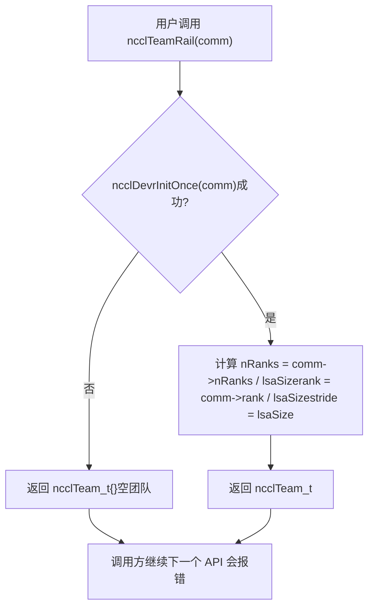
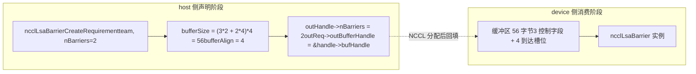
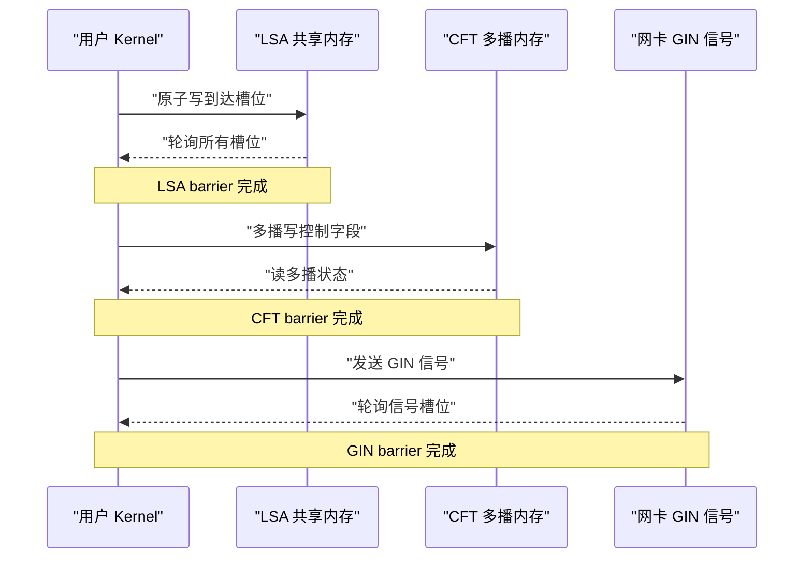
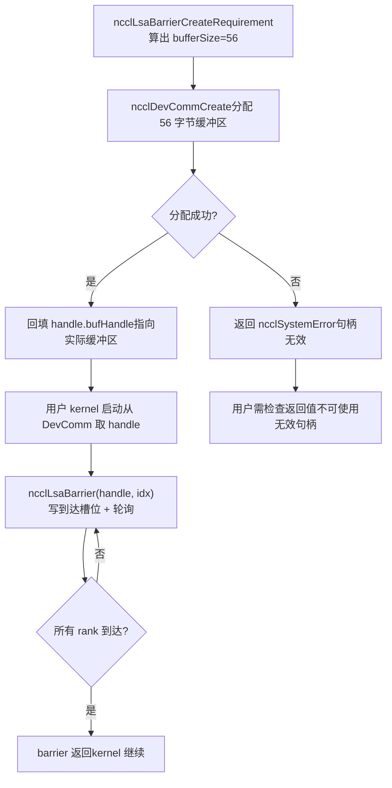
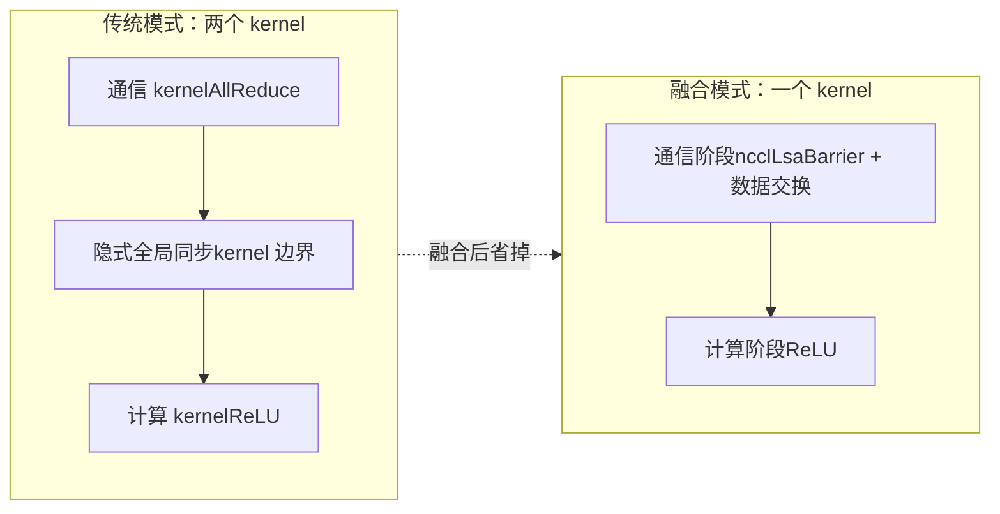

# 第 20 章：裝置端原生 API 與算子融合：nccl_device 與 kernel fusion 實踐

上一章我們看清了 devcomm 如何把 host 側 ncclComm 的元資料版本化地映射到裝置側，讓 kernel 能讀到 rank、位址和連線狀態。但「能讀到元資料」和「能發起通訊」是兩回事。如果只有元資料，使用者 kernel 頂多能自己算算位址、自己寫寫標誌位，一旦涉及跨 rank 的同步、跨機的訊號傳遞，還是得回到 host 側呼叫 ncclAllReduce 之類的集合 API——而每一次這樣的呼叫都意味著一次 kernel 啟動、一次 host-device 往返。本章要拆解的 src/nccl_device 目錄，正是 NCCL 從「一個被呼叫的函式庫」走向「一套可被程式設計的模型」的關鍵。它提供的不是新的集合通訊演算法，而是一組裝置側原語：讓使用者自己的 kernel 內部就能呼叫 ncclBarrier、ncclLsaBarrier、ncclGinBarrier 這類同步操作，從而把「通訊」和「計算」塞進同一個 kernel，省掉中間的啟動開銷。本章原始碼材料聚焦於這組原語在 host 側的需求宣告（CreateRequirement）與團隊（Team）抽象，這正是裝置側 API 的入口。理解本章的一個關鍵前提：裝置側 API 的設計哲學是「host 側宣告資源需求，device 側消費資源」。host 側不直接建立 barrier，而是告訴 NCCL「我需要 nBarriers 個 barrier，團隊有 team.nRanks 個成員」，NCCL 據此算出需要多少緩衝區、多少 GIN 訊號，然後在 device 側把這些資源實例化。這種「宣告-消費」分離，是裝置側程式碼能在沒有 host 指標的情況下運作的根本原因。

# 一、Team 抽象：裝置側 API 的座標系

## 直覺模型

想像一個跨國公司的組織架構。你要發一封郵件，首先得知道「發給誰」——是發給全公司（World）、發給同一個辦公室的同事（LSA）、還是發給同一條業務線的跨辦公室團隊（Rail）。`ncclTeam_t`就是這套「收件人範圍」的描述符。若沒有 Team 抽象，每個裝置側 API 都得自己重新計算「我在這個通訊域裡排第幾、一共有幾個人」，程式碼會重複且極易出錯。

## 資料結構與記憶體佈局

`ncclTeam_t`是裝置側 API 的座標系，它的三個欄位定義了一個**等差數列**：

| 欄位 | 含義 | 類比 |
| --- | --- | --- |
| `nRanks` | 團隊內成員總數 | 群裡有多少人 |
| `rank` | 當前 rank 在團隊內的編號 | 我在群裡的序號 |
| `stride` | 團隊內相鄰成員在 world 中的步長 | 群裡相鄰兩人學號差多少 |

`stride`是最容易被忽略但最關鍵的欄位。World 團隊裡`stride = 1`，因為所有 rank 連續排列；但 Rail 團隊裡`stride = lsaSize`，因為同一個 rail 上的 rank 在 world 中每隔`lsaSize`個才出現一次。

[FACT:src/nccl_device/core.cc:13-19]展示了 World 團隊的建構：直接取`comm->nRanks`和`comm->rank`，`stride`固定為 1。這是唯一不需要`ncclDevrInitOnce`的團隊，因為它的資訊全在 host 側`comm`裡。

[FACT:src/nccl_device/core.cc:22-33]是 LSA 團隊。注意 L26 的`ncclDevrInitOnce(comm)`——這是裝置側資源初始化的冪等入口。L23-25 的註解非常關鍵：**這裡故意忽略錯誤**，因為如果初始化失敗，返回的 team 是「垃圾值」，但下一個真正需要資源的 API 呼叫會再次觸發`ncclDevrInitOnce`並報告錯誤。這是一種「延遲報錯」策略，避免在團隊查詢這種輕量操作上拋出重錯誤。

## 場景驅動 Walkthrough：從 World 到 Rail 的座標變換

假設一個 8 卡機器，`lsaSize = 4`（每 4 卡一個 LSA 域），`nRanks = 8`。我們來看`ncclTeamRail`如何建構：

[FACT:src/nccl_device/core.cc:70-79]中，`nRanks = 8 / 4 = 2`，`rank = comm->rank / 4`，`stride = 4`。如果當前 rank 是 5，那麼它在 Rail 團隊裡的`rank = 5 / 4 = 1`，`stride = 4`，意味著 Rail 團隊的成員是 world 中的 rank 1 和 rank 5。

再看`ncclTeamRankToWorld`的換算公式：

[FACT:src/nccl_device/core.cc:82-84]的`comm->rank + (rank - team.rank) * team.stride`是一個**相對偏移**計算：先算出目標 rank 相對於當前 rank 在團隊內的偏移`(rank - team.rank)`，再乘以步長`stride`，加上當前 rank 的 world 編號。這個公式對所有團隊通用，因為`stride`已經編碼了團隊的排列規律。

`ncclTeamRankToLsa`則不同：

[FACT:src/nccl_device/core.cc:87-92]用的是`comm->devrState.lsaSelf + (rank - team.rank) * team.stride`。注意這裡用的是`lsaSelf`而不是`comm->rank`——因為 LSA 編號是裝置側資源初始化後才知道的，可能與 world rank 不同。

這張圖揭示了「延遲報錯」策略的執行路徑：初始化失敗時返回空團隊，但不中斷呼叫方；錯誤會在下一個真正需要資源的 API（如`ncclLsaBarrierCreateRequirement`）處暴露。

## 設計思考與踩坑

**為什麼`ncclTeamWorld`不呼叫`ncclDevrInitOnce`？**因為 World 團隊的資訊完全來自 host 側`comm`，不需要任何裝置側資源。如果強行呼叫，會讓一個純 host 查詢操作依賴裝置側初始化，增加不必要的失敗點。

**踩坑點**：`ncclTeamRankToLsa`在初始化失敗時返回`-1`（[FACT:src/nccl_device/core.cc:87-92]），而`ncclTeamRankToWorld`永遠不會失敗。呼叫方如果混用這兩個函式且不檢查返回值，可能在 LSA 初始化失敗時拿到`-1`當作合法 rank 使用，導致越界存取。生產程式碼中應當把`ncclTeamRankToLsa`的返回值當作可能失敗的操作處理。

---

# 二、Barrier 需求宣告：host 側如何「預訂」裝置資源

## 直覺模型

裝置側 API 的資源分配像**預訂會議室**：你不能直接衝進會議室開會，得先向前台（host 側`CreateRequirement`）提交申請——「我要開 3 場會，每場 8 個人參加」。前台據此算出需要多大的場地（`bufferSize`）、需要多少把椅子（`ginSignalCount`），然後把場地編號（`outBufferHandle`）給你。若沒有這套預訂機制，裝置側 kernel 就不知道自己的 barrier 緩衝區在哪裡、有多大，無法安全地讀寫。

## 資料結構與記憶體佈局

三個 barrier 的`CreateRequirement`函式共享同一個模式：**清零需求結構體 → 填充緩衝區大小/對齊 → 填充輸出句柄指標**。但它們的資源類型不同：

| Barrier 類型 | 資源類型 | 大小公式 | 對齊 |
| --- | --- | --- | --- |
| LSA Barrier | 緩衝區 | `(3*n + n*team.nRanks) * sizeof(uint32_t)` | `alignof(uint32_t)` |
| CFT Barrier | 緩衝區 | `(3*n + n*team.nRanks) * NCCL_CFT_BARRIER_GRAN` | `NCCL_CFT_BARRIER_ALIGN` |
| GIN Barrier | GIN 信號 | `n * team.nRanks`個信號 | 不涉及緩衝區 |

先看 LSA Barrier 的大小公式：

[FACT:src/nccl_device/lsa_barrier.cc:14-22]的`(3 * nBarriers + nBarriers * team.nRanks) * sizeof(uint32_t)`可以拆解為兩部分：

- `3 * nBarriers`：每個 barrier 需要 3 個`uint32_t`的控制欄位（[INFERENCE] 通常是「到達計數」「輪次」「狀態標誌」）。
- `nBarriers * team.nRanks`：每個 barrier 需要為團隊內每個成員預留一個`uint32_t`的到達槽位。

所以單個 barrier 的總大小是`3 + team.nRanks`個`uint32_t`。這個公式在 LSA 和 CFT 中完全一致，只是 CFT 用`NCCL_CFT_BARRIER_GRAN`作為粒度單位（可能是為了對齊到更大的邊界）。

GIN Barrier 則完全不同：

[FACT:src/nccl_device/gin_barrier.cc:14-20]不分配緩衝區，而是設定`ginSignalCount = nBarriers * team.nRanks`，並把`outGinSignalStart`指向句柄裡的`signal0`。這是因為 GIN barrier 走的是網路信號路徑，不需要共享記憶體緩衝區，而是需要網卡能識別的信號槽位。

## 場景驅動 Walkthrough：一次 LSA Barrier 的完整預訂

假設使用者要在一個 4 卡 LSA 團隊上建立 2 個 barrier：

1. **呼叫** `ncclLsaBarrierCreateRequirement(team, 2, &handle, &req)`。

2. **清零**：`memset(outReq, 0, sizeof(*outReq))`（[FACT:src/nccl_device/lsa_barrier.cc:14-22]）——保證未設定的欄位是確定值，避免呼叫方讀到堆疊上的垃圾。

3. **記錄 barrier 數量**：`outHandle->nBarriers = 2`（[FACT:src/nccl_device/lsa_barrier.cc:14-22]）。

4. **計算緩衝區大小**：`(3*2 + 2*4) * 4 = (6 + 8) * 4 = 56`位元組（[FACT:src/nccl_device/lsa_barrier.cc:14-22]）。

5. **設定對齊**：`alignof(uint32_t) = 4`（[FACT:src/nccl_device/lsa_barrier.cc:14-22]）。

6. **回填句柄指標**：`outReq->outBufferHandle = &outHandle->bufHandle`（[FACT:src/nccl_device/lsa_barrier.cc:14-22]）——讓 NCCL 在真正分配緩衝區後，把位址寫回句柄。

這張資料流圖展示了「宣告」與「消費」的分離：host 側只算出大小和指標，真正的緩衝區分配和實例化發生在 NCCL 內部，device 側 kernel 拿到的是已經填充好的句柄。

## 設計思考與踩坑

**為什麼用`memset`清零整個`outReq`？**因為`ncclDevResourceRequirements_t`是一個多欄位結構體，不同 barrier 類型只填充其中一部分欄位。清零保證未使用的欄位（如 LSA barrier 不用的`ginSignalCount`）是 0，NCCL 內部據此判斷「這個資源不需要」。如果不清零，堆疊上的隨機值可能被誤認為「需要 GIN 資源」，觸發上一章提到的誤報問題。

**踩坑點**：`outReq->outBufferHandle = &outHandle->bufHandle`把句柄內部欄位的位址交給了 NCCL。這意味著`outHandle`必須在 NCCL 完成緩衝區分配之前保持有效（不能被堆疊回收或移動）。如果使用者把`outHandle`放在一個會被提前釋放的作用域裡，NCCL 回填時就會寫入野指標。

> **[Design Inference & Architectural Trade-offs]**
> **CFT Barrier 的粒度差異**：[FACT:src/nccl_device/cft_barrier.cc:13-21]用`NCCL_CFT_BARRIER_GRAN`和`NCCL_CFT_BARRIER_ALIGN`替代了 LSA 的`sizeof(uint32_t)`和`alignof(uint32_t)`。這說明 CFT（ 可能是 Cross-Fabric Team 或類似的跨域團隊）的 barrier 需要更大的對齊粒度，可能因為要跨多播記憶體區域，硬體對位址對齊有更嚴格的要求。

---

# 三、三種 Barrier 的語意分工：LSA、CFT、GIN 各管什麼

## 直覺模型

三種 barrier 像三種不同範圍的「集合哨」：

- **LSA Barrier**：同一個辦公室內的同事集合，走共享記憶體，最快。
- **CFT Barrier**：跨辦公室但同一棟樓內的集合，走多播記憶體，中等。
- **GIN Barrier**：跨城市甚至跨國的集合，走網路信號，最慢但覆蓋最廣。

選錯 barrier 類型不會導致錯誤，但會帶來巨大的效能損失——用 GIN barrier 做同辦公室同步，等於用國際快遞送隔壁工位的文件。

## 資料結構與記憶體佈局對比

從 host 側需求宣告看，三者的資源需求截然不同：

| 維度 | LSA Barrier | CFT Barrier | GIN Barrier |
| --- | --- | --- | --- |
| 需要`comm`參數 | 否 | 否 | 是 |
| 緩衝區 | 有 | 有 | 無 |
| GIN 信號 | 無 | 無 | 有 |
| 大小單位 | `uint32_t` | `NCCL_CFT_BARRIER_GRAN` | 信號個數 |
| 輸出句柄欄位 | `bufHandle` | `bufHandle` | `signal0` |

注意 GIN Barrier 是唯一需要`comm`參數的：

[FACT:src/nccl_device/gin_barrier.cc:14-20]的函式簽名包含`ncclComm_t comm`，而 LSA 和 CFT 的簽名只有`ncclTeam_t team`。這是因為 GIN 訊號需要綁定到具體的網路連線，而網路連線資訊在`comm`裡。

## 場景驅動 Walkthrough：GIN Barrier 的訊號分配

[FACT:src/nccl_device/gin_barrier.cc:14-20]的邏輯比 LSA 更簡單，但語意更微妙：

1. **清零**：`memset(outReq, 0, sizeof(*outReq))`（L16）。

2. **設定訊號數**：`outReq->ginSignalCount = nBarriers * team.nRanks`（L17）——每個 barrier 需要為團隊內每個成員分配一個訊號槽。

3. **回填訊號起始指標**：`outReq->outGinSignalStart = &outHandle->signal0`（L18）——注意這裡沒有設定`bufferSize`，因為 GIN barrier 不用共享記憶體緩衝區。

> **[Design Inference & Architectural Trade-offs]**
> `signal0`這個名字暗示句柄裡可能有一組連續的訊號欄位（`signal0`, `signal1`, ...），`outGinSignalStart`指向第一個，NCCL 據此知道從哪裡開始分配`nBarriers * team.nRanks`個訊號。

## 並發控制與硬體互動

三種 barrier 的並發控制機制完全不同：

- **LSA Barrier**：基於共享記憶體的原子操作。`3 + team.nRanks`個`uint32_t`中，到達槽位用原子加或原子寫來標記「我到了」，控制欄位用原子讀來檢查「是否所有人都到了」。這是純 GPU 內的同步，不涉及網路。
- **CFT Barrier**：基於多播記憶體（multimem）。[INFERENCE] 多播記憶體允許一次寫操作同時更新多個 rank 的視圖，所以 CFT barrier 可能用更少的控制欄位實現更廣的同步。
- **GIN Barrier**：基於網路訊號。`ginSignalCount`個訊號透過網卡發送，接收方輪詢訊號槽位。這是唯一涉及跨機硬體的 barrier。

這張時序圖展示了三種 barrier 的硬體互動層次：從純 GPU 內同步，到多播記憶體，再到網卡訊號，延遲依次遞增，覆蓋範圍也依次擴大。

## 設計思考與踩坑

**為什麼 LSA 和 CFT 不需要`comm`參數？**因為它們的資源（共享記憶體、多播記憶體）已經在`ncclDevrInitOnce`階段綁定到了團隊上，`team`本身就隱含了資源位置資訊。而 GIN 訊號需要動態分配網路資源，必須透過`comm`存取網路連線狀態。

**踩坑點**：GIN Barrier 的`ginSignalCount`是`nBarriers * team.nRanks`，如果團隊很大（如 1024 個 rank）且 barrier 很多（如 100 個），訊號總數會達到 102400。網卡的訊號槽位是有限資源，超量申請可能導致`ncclDevrInitOnce`失敗。生產程式碼應當根據實際需要的最小 barrier 數量申請，而不是一次性申請大量備用。

---

# 四、從需求宣告到裝置側消費：完整生命週期

## 直覺模型

`CreateRequirement`只是「下單」，真正的「發貨」和「收貨」發生在 NCCL 內部和裝置側 kernel 裡。整個生命週期像**網購**：你下單（CreateRequirement）→ 商家備貨（NCCL 分配資源）→ 快遞送達（資源綁定到 DevComm）→ 你簽收使用（device 側 kernel 呼叫 barrier）。

## 資料結構與記憶體佈局：句柄的欄位演化

以`ncclLsaBarrierHandle_t`為例，它在生命週期中經歷三個階段：

| 階段 | `nBarriers` | `bufHandle` | 其他欄位 |
| --- | --- | --- | --- |
| CreateRequirement 後 | 已設定 | 位址已回填，但內容未分配 | 未設定 |
| NCCL 分配後 | 已設定 | 指向實際緩衝區 | 已設定 |
| Device 側使用 | 唯讀 | 唯讀 | 唯讀 |

[FACT:src/nccl_device/lsa_barrier.cc:14-22]設定`nBarriers`，[FACT:src/nccl_device/lsa_barrier.cc:14-22]回填`bufHandle`的位址。這兩個操作之間，NCCL 內部會完成緩衝區的實際分配。

## 場景驅動 Walkthrough：一次完整的 barrier 使用

1. **Host 側宣告**：使用者呼叫`ncclLsaBarrierCreateRequirement(team, 2, &handle, &req)`，得到`req.bufferSize = 56`。

2. **Host 側提交**：使用者把`req`交給`ncclDevCommCreate`（上一章的內容），NCCL 分配 56 位元組緩衝區，把位址寫入`handle.bufHandle`。

3. **Device 側初始化**：使用者 kernel 啟動時，從 DevComm 裡取出`handle`，用`bufHandle`定位緩衝區。

4. **Device 側同步**：kernel 呼叫`ncclLsaBarrier(handle, barrierIndex)`，在緩衝區的對應槽位寫入到達標記，輪詢其他槽位。

5. **Device 側完成**：所有 rank 到達後，barrier 返回，kernel 繼續執行。

這張決策圖展示了從宣告到使用的完整路徑，以及分配失敗時的錯誤分支。注意`ncclLsaBarrierCreateRequirement`本身永遠返回`ncclSuccess`（[FACT:src/nccl_device/lsa_barrier.cc:14-22]），真正的失敗發生在後續的資源分配階段。

## 並發控制與硬體互動

裝置側 barrier 的並發控制核心是**原子操作 + 記憶體屏障**。以 LSA barrier 為例：

- **到達階段**：每個 rank 用原子寫（或原子加）更新自己的到達槽位。這一步必須用 release 語意，保證 barrier 之前的所有記憶體操作對其他 rank 可見。
- **輪詢階段**：每個 rank 用原子讀（或 volatile 讀）檢查所有槽位。這一步必須用 acquire 語意，保證看到「所有人都到了」之後，能讀到其他人 barrier 之前寫入的資料。
- **重置階段**：barrier 完成後，需要重置槽位供下次使用。這一步的並發控制最微妙——如果重置太快，可能覆蓋還沒讀到的 rank 的標記。

> **[Design Inference & Architectural Trade-offs]**
> `3 * nBarriers`個控制欄位很可能就是用來處理這種「輪次」問題的：一個欄位記錄當前輪次，一個欄位記錄到達計數，一個欄位作為重置標誌。這樣多個 barrier 可以複用同一組槽位而不會混淆輪次。

## 生產避坑指南

**坑 1：句柄生命週期管理**。`outReq->outBufferHandle = &outHandle->bufHandle`把句柄內部欄位的位址交給了 NCCL。如果使用者在`ncclDevCommCreate`返回之前就銷毀了`outHandle`，NCCL 回填時會寫入已釋放的記憶體。正確做法是把`outHandle`的生命週期綁定到 DevComm，而不是綁定到建立它的函式作用域。

**坑 2：barrier 數量與團隊大小的乘積**。`bufferSize = (3*n + n*team.nRanks) * sizeof(uint32_t)`中，`n*team.nRanks`項在大團隊時會主導大小。1024 個 rank、100 個 barrier 需要`100*1024*4 = 409600`位元組，約 400KB。如果每個 rank 都申請這麼多，顯存壓力不可忽視。應當按實際並行使用的 barrier 數量申請，而不是按總 barrier 數量。

**坑 3：GIN barrier 的訊號耗盡**。GIN 訊號是網卡資源，數量有限。如果多個 DevComm 同時申請大量 GIN 訊號，可能耗盡網卡槽位。生產程式碼應當在 DevComm 建立失敗時檢查是否是 GIN 訊號不足，並考慮減少`nBarriers`或改用 LSA barrier。

**坑 4：初始化失敗的延遲暴露**。`ncclTeamLsa`等函式在`ncclDevrInitOnce`失敗時返回空團隊（[FACT:src/nccl_device/core.cc:22-33]），不報錯。如果使用者程式碼不檢查後續 API 的回傳值，可能在空團隊上繼續操作，導致難以定位的錯誤。建議在第一次使用裝置側 API 時顯式檢查團隊的有效性（如`team.nRanks > 0`）。

---

# 五、核心融合：為什麼要把通訊和計算塞進一個 kernel

## 直覺模型

傳統模式下，一次「AllReduce + 激活函式」需要兩個 kernel：一個做通訊，一個做計算。兩個 kernel 之間有一次隱式的全域同步——通訊 kernel 必須完全結束，計算 kernel 才能開始。這就像**接力賽**：第一棒跑完必須把棒交給第二棒，交接瞬間兩人都在等。核心融合則是讓同一個 kernel 既跑通訊又跑計算，像**一個人邊跑邊換鞋**，省掉了交接的等待。

## 資料結構與記憶體佈局

核心融合的關鍵在於：通訊原語（如 barrier）和計算邏輯共享同一個 kernel 的暫存器和共享記憶體。這意味著：

- **暫存器壓力**：通訊原語的原子操作和輪詢迴圈會佔用暫存器，擠壓計算邏輯的暫存器預算。
- **共享記憶體競爭**：LSA barrier 的緩衝區如果放在共享記憶體裡，會和計算邏輯的共享記憶體需求競爭。
- **Occupancy 影響**：融合 kernel 的 occupancy 通常低於純計算 kernel，因為通訊原語需要額外的資源。

> **[Design Inference & Architectural Trade-offs]**
> 裝置側 API 的設計（host 側宣告資源、device 側消費）正是為了緩解這些壓力：資源在 host 側預先分配好，device 側 kernel 只需要讀寫，不需要動態申請，減少了暫存器佔用。

## 場景驅動 Walkthrough：融合 kernel 的執行流

假設使用者要寫一個「AllReduce + ReLU」的融合 kernel：

1. **Host 側準備**：呼叫`ncclLsaBarrierCreateRequirement`申請 barrier，呼叫`ncclDevCommCreate`分配資源。

2. **Kernel 啟動**：使用者 kernel 接收 DevComm 和 barrier 句柄作為參數。

3. **通訊階段**：kernel 內呼叫`ncclLsaBarrier`同步所有 rank，然後各 rank 交換資料（透過對稱記憶體直接讀寫）。

4. **計算階段**：同步完成後，kernel 直接對本地資料做 ReLU，不需要額外的 kernel 啟動。

5. **完成**：kernel 退出，host 側無需等待額外的通訊 kernel。

這張對比圖展示了融合的核心收益：省掉 kernel 邊界處的隱式全域同步。在傳統模式下，這個同步的代價是兩次 kernel 啟動的延遲加上 GPU 流水線的排空。

## 設計思考與踩坑

**為什麼裝置側 API 不直接提供「融合 AllReduce」？**因為融合的具體形式取決於使用者的計算邏輯。NCCL 提供的是**原語**（barrier、訊號、對稱記憶體存取），而不是**成品**（融合的 AllReduce+ReLU）。使用者需要自己組合這些原語，才能實現符合自己需求的融合 kernel。這是「程式設計模型」而非「函式庫」的本質區別。

**踩坑點**：融合 kernel 的除錯難度遠高於分離 kernel。如果 barrier 邏輯有 bug，可能導致 kernel 掛起（死鎖），而 GPU kernel 掛起不像 host 程序掛起那樣容易診斷。建議在融合 kernel 中加超時機制，或者先用小規模團隊驗證 barrier 邏輯。

**踩坑點**：融合 kernel 的 occupancy 下降可能導致計算性能損失超過通信節省的收益。在決定融合之前，應當測量融合前後的端到端時間，而不是只看通信延遲的降低。

# 本章思考與自測

Q1：如果把`ncclTeamLsa`中 L26 的`ncclDevrInitOnce`調用去掉，直接返回`comm->devrState.lsaSize`和`lsaSelf`，在什麼場景下會導致設備側 kernel 讀到錯誤的團隊信息？

**參考解析**：`ncclDevrInitOnce`是設備側資源初始化的冪等入口。如果去掉它，`comm->devrState.lsaSize`和`lsaSelf`可能還是初始值（通常是 0 或未定義）。在首次使用設備側 API 的場景下，用戶調用`ncclTeamLsa`會拿到`nRanks = 0`的空團隊。後續如果用戶不檢查團隊有效性，直接用這個團隊調用`ncclLsaBarrierCreateRequirement`，會算出`bufferSize = (3*n + n*0) * 4 = 12n`字節——比實際需要的小，因為`n*team.nRanks`項變成了 0。這會導致緩衝區溢出：barrier 運行時試圖寫入`team.nRanks`個到達槽位，但緩衝區只分配了`3n`個`uint32_t`的空間。更隱蔽的是，如果`lsaSelf`也是 0，`ncclTeamRankToLsa`會返回錯誤的 rank 編號，導致 barrier 的到達槽位寫錯位置，可能永遠等不到所有 rank 到達，造成 kernel 掛起。這正是 L23-25 註釋所說的「返回垃圾值，下一個 API 報錯」策略要防止的情況——但前提是下一個 API 確實會報錯，而不是靜默地使用錯誤的大小。

Q2：`ncclLsaBarrierCreateRequirement`的大小公式是`(3*nBarriers + nBarriers*team.nRanks) * sizeof(uint32_t)`。如果團隊有 8 個 rank，用戶申請 1 個 barrier，緩衝區是 44 字節。假設 barrier 實現中「3 個控制字段」分別是「到達計數」「輪次」「重置標誌」，請推演：當 8 個 rank 同時到達時，如果「到達計數」用非原子的`++`操作，會發生什麼？

**參考解析**：非原子的`++`在 GPU 上是「讀-改-寫」三步，不是原子操作。8 個 rank 同時執行`count++`時，可能出現多個 rank 讀到相同的舊值（如都讀到 0），然後都寫回 1。最終`count`只增加了 1 而不是 8，導致 barrier 永遠認為「還沒到齊」，所有 rank 在輪詢階段死循環。這就是為什麼 LSA barrier 的到達槽位必須用原子操作（如`atomicAdd`）或每個 rank 寫自己的獨立槽位（`nBarriers * team.nRanks`項正是為每個 rank 預留獨立槽位）。如果採用「每個 rank 寫自己的槽位」方案，就不需要原子加，只需要原子寫 + 內存屏障，因為每個槽位只有一個寫入者。這也解釋了為什麼大小公式裡有`nBarriers * team.nRanks`項——它是用空間換原子性，避免多寫者競爭。

Q3：`ncclGinBarrierCreateRequirement`需要`comm`參數而`ncclLsaBarrierCreateRequirement`不需要。如果強行給 LSA barrier 也加上`comm`參數（假設為了統一接口），會引入什麼設計問題？反過來，如果給 GIN barrier 去掉`comm`參數，在什麼場景下會失敗？

**參考解析**：給 LSA barrier 加`comm`參數的問題是引入了不必要的依賴。LSA barrier 的資源（共享內存）已經在`ncclDevrInitOnce`階段綁定到團隊上，`team`本身就隱含了資源位置。加`comm`會讓一個純團隊操作依賴通信域狀態，增加失敗點（如`comm`無效時 LSA barrier 也無法創建），且違反「最小權限」原則。反過來，給 GIN barrier 去掉`comm`參數會失敗，因為 GIN 信號需要綁定到具體的網絡連接。`ncclGinBarrierCreateRequirement`的`ginSignalCount`需要知道往哪個網卡、哪個 QP（Queue Pair）發送信號，這些信息在`comm`的網絡傳輸層狀態裡。沒有`comm`，NCCL 無法確定信號應該分配到哪個網卡的槽位，也無法保證信號能正確路由到目標 rank。這體現了設備側 API 的一個設計原則：**資源需求聲明只依賴它真正需要的上下文**——LSA 只需要團隊拓撲，GIN 需要網絡連接。

---

設備側 API 和內核融合把 NCCL 從「一個你調用的庫」變成了「一套你編程的模型」。`ncclTeam_t`提供了坐標系，`CreateRequirement`提供了資源預訂機制，三種 barrier 覆蓋了從共享內存到網絡信號的全部同步範圍。但聲明了資源、寫好了融合 kernel，並不等於性能就好——barrier 的數量、團隊的大小、融合的粒度，每一個選擇都會影響端到端性能。下一章我們將進入性能調優實戰，看看 tuning 參數如何影響算法選擇，以及如何用真實 benchmark 驗證調優效果。

至此，我們已經走完了從 devcomm 元資料映射到 nccl_device 裝置側原語的全過程，看到了 NCCL 如何透過「host 宣告、device 消費」的模型，讓使用者 kernel 直接呼叫 barrier 類同步操作，把通訊與計算融合進同一個 kernel。但掌握了這些機制之後，一個更實際的問題自然浮現：當真實訓練任務效能不達標時，我們該如何判斷是演算法選擇不當、協定不匹配，還是通道數配置不合理？下一章將把前 20 章的機制串成一套可操作的調優方法論，結合效能報告、代價模型與環境變數，給出從現象到根因的排查路徑。
