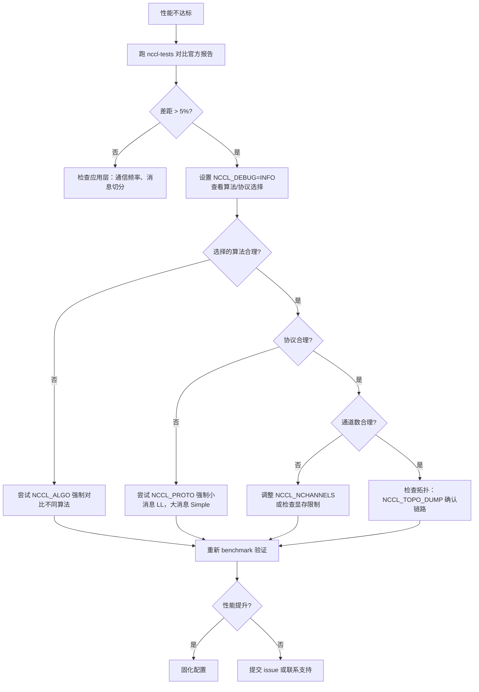

# 第 21 章：效能調優實戰：tuning 實操、benchmark 工具與調優方法論

上一章我們看到，使用者自訂 kernel 如何透過裝置側 API 與 NCCL 通訊原語協作，甚至將通訊與計算融合進同一個 kernel。這打開了 NCCL 作為程式設計模型的可能性，但也帶來一個現實問題：當通訊效能不如預期時，該從哪裡入手？NCCL 暴露了上百個 NCCL_PARAM，但真正決定一次集合通訊走哪條路的，其實只有三個旋鈕：演算法（Algo）、協定（Proto）、通道數（nChannels）。本章把前 20 章的機制串成一條可操作的排查路徑——先看效能報告定位現象，再讀代價模型理解 NCCL 自己怎麼選，最後用環境變數和 benchmark 驗證你的假設。

# 21.1 效能報告：先建立「正常」的基準線

調優的第一步不是改參數，而是知道「正常」長什麼樣。如果你連當前系統的峰值頻寬是多少都不清楚，任何調參都是盲猜。

NCCL 官方在`docs/perf`下發布參考效能資料，它的定位非常明確——不是產品級保證，而是對齊預期的參照點。

[FACT:docs/perf/README.md:3-14]

```
NCCL publishes reference performance data to:

1. Provide reference points that help users align performance expectations.
2. Help users validate their system setup.
3. Reduce repeated requests to the NCCL team for basic performance numbers.

These results are references, and NOT product-level guarantees that the same
performance is achievable on every system. Performance depends on a complex
combination of software versions, system configuration, hardware, and operating
conditions, including factors outside NCCL's control. A difference within 5% is
generally considered acceptable variance due to differences in the underlying
systems.
```

這裡有兩個關鍵資訊，小白容易忽略：

第一，**5% 以內的差異屬於正常波動**。這意味著你測出比官方低 3% 時，不要急著調參——先確認是不是量測雜訊、GPU 時脈抖動、或者鄰居任務干擾。

第二，**官方只發布峰值頻寬，不發布延遲**。

[FACT:docs/perf/README.md:24-24]

```
We publish peak bandwidth for a selection of commonly used platforms. We do not
currently publish latency because it is typically more sensitive to factors
outside NCCL's control.
```

> **[Design Inference & Architectural Trade-offs]**
> 為什麼延遲不發布？因為延遲對系統狀態極度敏感——CPU 頻率、PCIe 鏈路狀態、網卡韌體版本、甚至 BIOS 的電源策略都會影響它。頻寬在大訊息下趨於飽和，相對穩定；延遲在小訊息下由無數個微小環節疊加而成，任何一環抖動都會放大。所以調優時，**大訊息看頻寬，小訊息看延遲**，這是兩條不同的排查路徑。

[FACT:docs/perf/README.md:24-24]

```
If your workload differs significantly from the published results, open an
issue in the [NCCL repository](https://github.com/NVIDIA/nccl/issues) or contact
NVIDIA Support. We will try our best to help.
```

**排查順序的第一條**：先跑一個標準 benchmark（如`nccl-tests`的`all_reduce_perf`），把結果和官方報告對比。如果差距在 5% 以內，說明系統配置沒問題，效能瓶頸在你的應用層（比如通訊頻率、訊息切分方式）；如果差距顯著，才進入 NCCL 參數調優。

# 21.2 代價模型：NCCL 自己怎麼選演算法和協定

要調參，先得理解 NCCL 預設是怎麼選的。它內部有一套「代價模型」（cost model），本質是一張查表 + 公式計算：給定訊息大小、拓撲類型、rank 數，估算每種「演算法 × 協定」組合的耗時，選最小的那個。

## 直覺模型

把代價模型想像成導航軟體。你輸入起點終點（訊息大小、拓撲），它內部對每條路線（演算法/協定組合）估算時間，然後推薦最快的那條。導航的估算基於歷史資料和道路等級，NCCL 的估算基於一張硬編碼的延遲/頻寬參數表。

如果沒有這個模型，NCCL 就只能對所有場景用同一個固定演算法——小訊息會因啟動開銷過大而變慢，大訊息會因頻寬利用不足而變慢，系統會在兩個極端都表現糟糕。

## 資料結構：模型表與調優上下文

代價模型的核心是`modelMap`陣列，每個元素對應一種「演算法/協定/對稱核心」組合。

[FACT:src/tuning/cost_model.cc:230-277]

```
static struct ncclTuningModelEntry_t modelMap[] = {
    /*
Initialize default, static models here
{mod_init, mod_sim, mod_final, enabled}
Enable order: Broadcast, Reduce, AllGather, ReduceScatter, AllReduce
*/
  {ncclTuningTreeModelInit, ncclTuningTreeModelSim, nullptr, {0, 0, 0, 0, 1}},       // Tree/LL
  {ncclTuningTreeModelInit, ncclTuningTreeModelSim, nullptr, {0, 0, 0, 0, 1}},       // Tree/LL128
  {ncclTuningTreeModelInit, ncclTuningTreeModelSim, nullptr, {0, 0, 0, 0, 1}},       // Tree/Simple
  {ncclTuningRingModelInit, ncclTuningRingModelSim, nullptr, {1, 1, 1, 1, 1}},       // Ring/LL
  ...
```

每個條目有四個欄位：`mod_init`（初始化函式）、`mod_sim`（模擬函式）、`mod_final`（清理函式）、`enabled`（5 個函式各自的啟用標誌）。`enabled`陣列的順序是`{Broadcast, Reduce, AllGather, ReduceScatter, AllReduce}`——注意這個順序，後面讀程式碼時會反覆用到。

> **[Design Inference & Architectural Trade-offs]**
> 關鍵觀察：**Tree 只在 AllReduce 上啟用**（`{0,0,0,0,1}`），而 Ring 在所有函式上都啟用（`{1,1,1,1,1}`）。這是因為 Tree 演算法的優勢在於 AllReduce 的規約階段可以平行，但對 AllGather/ReduceScatter 這類本質是環形流水的操作，Ring 更自然。

模型的具體參數存在`ncclTunerConstants_t`裡，包含各拓撲下的基礎延遲和頻寬。

[FACT:src/tuning/cost_model.cc:142-152]

```
static const ncclTunerConstants_t ncclTunerConstantsDefaults = {
    // baseLatencies
  {
    {6.8, 14.0, 8.4},  // Tree
    {6.6, 14.0, 8.4},  // Ring
    {0, 0, 0},         // Collnet Direct
    {0, 0, 0},         // Collnet Chain
    {0, 0, 0},         // NVLS
    {0, 0, 0},         // NVLS Tree
    {8.0, 8.0, 8.0}    // PAT
  },
```

每個演算法有三個基礎延遲值，對應 LL / LL128 / Simple 三種協定。比如 Ring 的`{6.6, 14.0, 8.4}`意味著：LL 協定基礎延遲 6.6 微秒，LL128 是 14.0，Simple 是 8.4。這些數字是 NVIDIA 在真實硬體上測出來的經驗值。

硬體延遲則按拓撲類型（NVLink / PCI / NET）分別給出。

[FACT:src/tuning/cost_model.cc:153-184]

```
    // hwLatencies
  {
    /* NVLINK */
    {
      {0.6, 1.25, 4.0}, // Tree (LL/LL128/Simple)
      {0.6, 1.9, 3.4},  // Ring (LL/LL128/Simple)
      ...
    },
    /* PCI */
    {
      {1.0, 1.9, 4.0}, // Tree (LL/LL128/Simple)
      {1.0, 2.5, 5.7}, // Ring (LL/LL128/Simple)
      ...
    },
    /* NET */
    {
      {5.0, 8.5, 14},   // Tree (LL/LL128/Simple)
      {2.7, 4.0, 14.0}, // Ring (LL/LL128/Simple)
      ...
    },
  },
```

對比一下就能看出拓撲差異：NVLink 上 Ring/Simple 的每跳延遲是 3.4 微秒，PCI 上是 5.7，NET 上是 14.0。這就是為什麼跨機通訊慢——每一跳都要多花 10 微秒。

頻寬參數按 GPU 架構分代給出。

[FACT:src/tuning/cost_model.cc:183-183]

```
    // llMaxBws
  {
    {39.0, 39.0, 20.4}, /* Volta-N1/Intel-N2/Intel-N4) */
    {87.7, 22.5 /*avg of ring & tree*/, 19.0}, /* Ampere-N1/AMD-N2/AMD-N4) */
    {141.0, 45.0 /*avg of ring & tree*/, 35.0}, /* Hopper-N1/AMD-N2/AMD-N4) */
    {2 * 141.2, 2 * 45.0 /*avg of ring & tree*/, 2 * 35.0}, /* Blackwell-N1/AMD-N2/AMD-N4) */
  },
```

每行對應一代架構，三個值分別是單機（N1）、雙機（N2）、四機（N4）場景下的 LL 協定最大頻寬。Hopper 單機 141 GB/s，Blackwell 翻倍到 282 GB/s——這解釋了為什麼新卡上同樣的演算法表現會好很多。

## 調優上下文：per-comm 的狀態

每個通訊域（communicator）持有一份`ncclTuningContext_t`，保存這個 comm 的調優狀態。

[FACT:src/include/tuning.h:81-95]

```
struct ncclTuningContext_t {
  // Persistant tuning parameters tied to a communicator.
  ncclTunerConstants_t tuningConstants;
  // State of the tuning models
  // Forced function is set via env var
  int forced[NCCL_NUM_FUNCTIONS];
  // Disabled tuning models are not execute and excluded from implemetation selection.
  int enabled[NCCL_TUNING_COUNT][NCCL_NUM_FUNCTIONS];
  // Store of model contexts per communicator.
  float generalLatencies[NCCL_NUM_FUNCTIONS][NCCL_NUM_ALGORITHMS][NCCL_NUM_PROTOCOLS];
  float generalBandwidths[NCCL_NUM_FUNCTIONS][NCCL_NUM_ALGORITHMS][NCCL_NUM_PROTOCOLS];

  ssize_t threadThresholds[NCCL_NUM_ALGORITHMS][NCCL_NUM_PROTOCOLS];
  int maxThreads[NCCL_NUM_ALGORITHMS][NCCL_NUM_PROTOCOLS];
};
```

四個關鍵欄位：

- `forced[NCCL_NUM_FUNCTIONS]`：標記哪些函數被環境變數強制指定了演算法/協定。這是`NCCL_ALGO`/`NCCL_PROTO`生效的落點。
- `enabled[NCCL_TUNING_COUNT][NCCL_NUM_FUNCTIONS]`：二維布林表，標記某個模型對某個函數是否啟用。被禁用的模型不參與選擇。
- `generalLatencies` / `generalBandwidths`：三維陣列，按「函數 × 演算法 × 協定」儲存估算的延遲和頻寬。這是`ncclTuningInit`列印那張大表的來源。
- `threadThresholds` / `maxThreads`：執行緒數相關的閾值，決定每個 block 用多少執行緒。

## 場景驅動 Walkthrough：一次 AllReduce 的演算法選擇

假設你呼叫`ncclAllReduce`，訊息大小 1MB，8 卡單機 NVLink。NCCL 內部會建構一個`ncclTuningInput_t`，然後呼叫`ncclTuningCompute`。

[FACT:src/tuning/tuning.cc:180-202]

```
ncclResult_t ncclTuningCompute(struct ncclTuningInput_t* const input, struct ncclTuningResult_t* const result) {
  ncclResult_t ret = ncclSuccess;
  TRACE(NCCL_TUNING, ...);
  struct ncclTuningResultList_t tunings;
  tunings.head = nullptr;
  struct ncclTuningResult_t bestTuning = NCCL_TUNING_RESULT_INIT;
  // Set tuning to Ring/Simple for single rank case
  if (input->comm->nRanks tuningMask & (1ULL forced = input->comm->tuningContext.forced[input->func];
  NCCLCHECKGOTO(getModelEntry(id, &model), ret, not_valid);
  if (model == nullptr) {
    ret = ncclInternalError;
    goto not_valid;
  }
  if (input->comm->tuningContext.enabled[id][input->func] == 0) {
    goto not_valid;
  }
  if (model->model != nullptr) {
    NCCLCHECKGOTO(model->model(input, result), ret, not_valid);
    if (result->timeUs timeUs = NCCL_TUNING_IGNORE;
  result->valid = 0;
  goto exit;
}
```

注意`not_valid`標籤的處理：任何一步失敗（模型不存在、被禁用、模擬返回非正時間），都會把`timeUs`設為`NCCL_TUNING_IGNORE`、`valid`設為 0。這個候選就被排除在後續選擇之外。

第四步：從所有有效候選中選耗時最小的。

[FACT:src/tuning/tuning.cc:155-173]

```
static ncclResult_t ncclTuningSelectBestTuning(struct ncclTuningResultList_t* tunings,
                                               struct ncclTuningResult_t* const bestTuning) {
  bestTuning->timeUs = FLT_MAX;
  float bestSelectionTimeUs = FLT_MAX;
  struct ncclTuningResultListNode* node = tunings->head;
  while (node != nullptr) {
    const struct ncclTuningResult_t& tuning = node->result;
    float selectionTimeUs = tuning.selectionTimeUs > 0.0f ? tuning.selectionTimeUs : tuning.timeUs;
    TRACE(NCCL_TUNING, "A/P/S %s/%s/%s, time: %f, selection time: %f", ...);
    if (selectionTimeUs next;
  }
  return ncclSuccess;
}
```

這裡有個細節：選擇用的是`selectionTimeUs`，如果它大於 0 就用它，否則回退到`timeUs`。`selectionTimeUs`是「選擇時間」，可能包含了額外的懲罰項（比如某些演算法在特定場景下要額外開銷）。這給了代價模型一個「估算時間」和「選擇時間」分離的能力。

## 流程圖

```mermaid
flowchart TD
    start["ncclTuningCompute(input, result)"] --> check_ranks{"comm->nRanks |是| single["bestTuning = Ring/SimplenChannels = 0"]
    check_ranks -->|否| all["ncclTuningComputeAllTunings()"]
    all --> loop{"遍历 i in NCCL_TUNING_COUNT"}
    loop -->|mask 未命中| skip["tuning.valid = 0continue"]
    loop -->|mask 命中| expand["ncclTuningExpandId(i, ...)"]
    expand --> sim["ncclTuningComputeTuning()→ ncclTuningCostModelSimModel()"]
    sim --> sim_check{"enabled[id][func] != 0且 model->model != nullptr?"}
    sim_check -->|否| invalid["timeUs = NCCL_TUNING_IGNOREvalid = 0"]
    sim_check -->|是| push["ncclTuningResultListPushFront()"]
    skip --> loop
    invalid --> loop
    push --> loop
    loop -->|遍历结束| tuner_check{"comm->tuner != NULL?"}
    tuner_check -->|是| plugin["tuner->getCollInfo()覆盖 generalTable"]
    tuner_check -->|否| select["ncclTuningSelectBestTuning()"]
    plugin --> select
    select --> channels["ncclTuningGetChannels()"]
    channels --> eff{"CTAPolicy & EFFICIENCY且 NCCL_ALGO/NCCL_PROTO 未设置?"}
    eff -->|是| nvls["尝试 NVLS 覆盖ncclNvlsRegResourcesQuery()"]
    eff -->|否| done["*result = bestTuning"]
    nvls --> done
    single --> done
```

這張圖完整畫出了從入口到最終結果的決策路徑，包括單 rank 短路、遮罩過濾、模型禁用、tuner 外掛介入、CTAPolicy 覆蓋等所有分支。

# 21.3 環境變數：真正影響效能的三個旋鈕

理解了代價模型，就知道環境變數是怎麼介入的。`NCCL_ALGO`、`NCCL_PROTO`、`NCCL_SYM_KERNEL`這三個變數透過`parseList`解析後，直接修改`enabled`表，把不符合使用者意圖的候選全部禁用。

## 解析語法

`parseList`支援的語法比大多數人想像的複雜。

[FACT:src/tuning/cost_model.cc:14-32]

```
// Parse a map of prefixes to a list of elements. The first prefix is
// optional and, if not present, the list of elements will be applied
// to all prefixes. Only the first list of elements can lack a
// prefix. Prefixes (if present) are followed by a colon. Lists of
// elements are comma delimited. Mappings of prefix to the lists of
// elements are semi-colon delimited.
//
// For example:
//
//     NCCL_ALGO="ring,collnetdirect;allreduce:tree,collnetdirect;broadcast:ring"
// Enable ring and collnetdirect for all functions, then select tree
// and collnetdirect for allreduce and ring for broadcast.
//
//     NCCL_PROTO="LL,Simple;allreduce:^LL"
// Enable LL and Simple for all functions, but everything except LL
// for allreduce.
//
//     NCCL_PROTO="^LL128;allreduce:LL128"
// Enable everything but LL128, but only LL128 for allreduce.
```

三種用法：

1. **全域列表**：`NCCL_ALGO="ring,tree"`—— 所有函數只用 ring 和 tree。

2. **按函數前綴**：`NCCL_ALGO="ring;allreduce:tree"`—— 預設 ring，但 allreduce 用 tree。

3. **排除語法**：`NCCL_PROTO="^LL128"`—— 除了 LL128 其他都啟用。

`^`前綴是關鍵——它表示「unset」，即從預設全啟用中排除某個選項。

[FACT:src/tuning/cost_model.cc:59-67]

```
    int unset, set;
    if (elemList[0] == '^') {
      unset = 1;
      set = 0;
      elemList++;
    } else {
      unset = 0;
      set = 1;
    }
```

解析到`^`時，`unset=1`、`set=0`。隨後對匹配的 prefix，先把整個列表填成`unset`（全排除），再把列出的元素設為`set`。

[FACT:src/tuning/cost_model.cc:69-96]

```
    bool foundPrefix = false;
    for (int p = 0; p minCompCap, comm->maxCompCap, comm->graphs[algo].typeInter,
                          comm->graphs[algo].typeIntra, comm->nRanks, f, algo, comm->minDriverVersion)) {
        comm->tuningContext.enabled[i][f] = 0;
      }
      //  Check the user env vars only for functions that have a forced configuration and not already disabled.
      if (comm->tuningContext.forced[f] == 0 || comm->tuningContext.enabled[i][f] == 0) continue;
      comm->tuningContext.enabled[i][f] = 0;
      TRACE(NCCL_TUNING, "a/p/s %s/%s/%s enabled %d/%d/%d", ...);
      if (((algo != NCCL_ALGO_UNDEF && algoEnable[f * NCCL_NUM_ALGORITHMS + algo] != 0) &&
           (proto != NCCL_PROTO_UNDEF && protoEnable[f * NCCL_NUM_PROTOCOLS + proto] != 0)) ||
          (symKernelId != ncclSymkKernelId_Count && symKernelIdEnable[f * ncclSymkKernelId_Count + symKernelId] != 0)) {
        comm->tuningContext.enabled[i][f] = 1;
      }
    }
```

這段邏輯的順序很重要：

1. **先處理 LL128 平台能力**：如果平台不支援 LL128（`isLL128Enabled`返回 0）且使用者沒顯式要求（`protoEnable == 2`），直接禁用。

2. **再處理使用者強制**：如果這個函數被強制了（`forced[f] != 0`），先把它禁用（`enabled[i][f] = 0`），然後檢查使用者是否允許這個組合——允許就重新啟用。

`protoEnable`的值有三種：0（使用者排除）、1（使用者啟用）、2（使用者未提及，預設啟用）。這個三態設計讓「使用者顯式要求」和「平台預設」能區分開。

## 環境變數讀取的快取機制

所有`NCCL_PARAM`巨集最終都走`ncclLoadParam`。

[FACT:src/misc/param.cc:78-108]

```
int64_t ncclLoadParam(char const* env, int64_t deftVal, int64_t uninitialized, int64_t* cache, int8_t* noCache) {
  static std::mutex mutex;
  std::lock_guard lock(mutex);

  // noCache is only load/stored within the mutex, no need for atomic
  if (*noCache == /*uninitialized*/ -1) ncclGetCachePolicy(env, noCache);

  if (COMPILER_ATOMIC_LOAD(cache, std::memory_order_relaxed) != uninitialized) {
    return COMPILER_ATOMIC_LOAD(cache, std::memory_order_relaxed);
  }

  // Read the environment variable
  const char* str = ncclGetEnv(env);
  int64_t value = deftVal;

  if (str && strlen(str) > 0) {
    errno = 0;
    char* end = nullptr;
    value = strtoll(str, &end, 0);
    // Preserve numeric-prefix parsing while rejecting non-numeric values.
    if (errno || end == str) {
      value = deftVal;
      ATTN("Invalid value %s for %s, using default %lld.", str, env, (long long)deftVal);
    } else {
      INFO(NCCL_ENV, "%s set by environment to %lld.", env, (long long)value);
    }
  }

  if (*noCache == /*cache*/ 0) COMPILER_ATOMIC_STORE(cache, value, std::memory_order_relaxed);
  return value;
}
```

這段程式碼有幾個值得注意的設計：

**全域互斥鎖**：`static std::mutex mutex`保護整個讀取過程。這意味著所有參數的首次讀取是串行的。為什麼用鎖而不是無鎖？因為參數讀取只在初始化階段發生，不在熱路徑上，鎖的開銷可以忽略，而正確性更重要。

**雙重檢查**：先原子讀`cache`，如果已初始化就直接返回。這避免了每次讀參數都進鎖——雖然鎖本身在初始化後幾乎不競爭，但原子讀更快。

**快取策略**：`noCache`標誌決定是否把讀到的值寫回`cache`。某些參數（如需要動態回應的）可能停用快取，每次都重新讀環境變數。

**錯誤處理**：`strtoll`解析失敗時用預設值，並列印`ATTN`警告。注意`end == str`的判斷——如果字串開頭就不是數字，`end`會等於`str`，說明完全沒解析出數字。

## 設定檔支援

環境變數不一定要從 shell 設定，NCCL 支援從設定檔讀取。

[FACT:src/misc/param.cc:52-67]

```
static void initEnvFunc() {
  char confFilePath[1024];
  const char* userFile = std::getenv("NCCL_CONF_FILE");
  if (userFile && strlen(userFile) > 0) {
    snprintf(confFilePath, sizeof(confFilePath), "%s", userFile);
    setEnvFile(confFilePath);
  } else {
    const char* userDir = userHomeDir();
    if (userDir) {
      snprintf(confFilePath, sizeof(confFilePath), "%s/.nccl.conf", userDir);
      setEnvFile(confFilePath);
    }
  }
  snprintf(confFilePath, sizeof(confFilePath), "/etc/nccl.conf");
  setEnvFile(confFilePath);
}
```

載入順序：`NCCL_CONF_FILE`指定的檔案（如果設定了）→`~/.nccl.conf` → `/etc/nccl.conf`。後載入的會覆蓋先載入的（因為`setEnvFile`呼叫`ncclOsSetEnv`）。

[FACT:src/misc/param.cc:69-72]

```
void initEnv() {
  static std::once_flag once;
  std::call_once(once, initEnvFunc);
}
```

`std::call_once`保證設定檔只載入一次，即使多個執行緒同時首次呼叫`ncclGetEnv`。

# 21.4 通道數：被低估的效能旋鈕

演算法和協定決定「怎麼走」，通道數決定「開幾條路」。很多人調優時只關注前兩個，忽略了通道數——但在大訊息場景下，通道數往往是決定頻寬利用率的關鍵。

## 通道數從哪來

`ncclTuningCompute`在選出最佳演算法/協定後，會呼叫`ncclTuningGetChannels`計算通道數。

[FACT:src/tuning/tuning.cc:233-235]

```
  if (bestTuning.algo != NCCL_ALGO_UNDEF && bestTuning.proto != NCCL_PROTO_UNDEF) {
    NCCLCHECKGOTO(ncclTuningGetChannels(input, &bestTuning), ret, exit);
  }
```

通道數的計算邏輯不在本章原始碼材料中，但可以從`ncclTuningResult_t`的欄位看出它的作用。

[FACT:src/include/tuning.h:42-55]

```
struct ncclTuningResult_t {
  int id;
  int valid;
  float timeUs;
  float selectionTimeUs;
  int algo;
  int proto;
  int symKernelId;
  int ceMethodId;
  int nChannels;
  int maxChannels;
  int nWarps;
  int forced;
};
```

`nChannels`是最終使用的通道數，`maxChannels`是上限。`nWarps`是每個 block 的 warp 數。

## CTAPolicy 對通道數的覆蓋

有一段特殊邏輯處理`NCCL_CTA_POLICY_EFFICIENCY`策略。

[FACT:src/tuning/tuning.cc:236-257]

```
  // NCCL_CTA_POLICY_EFFICIENCY requires user (non-symmetric) buffer registration (currently unsupported with MNNVL).
  // Run after GetChannels so bestTuning.nChannels is valid. Skip when a tuner plugin owns selection
  // (same as pre-rearch). The NVLS-bit guard keeps this bias inside the candidate set: a per-call
  // algSelection may have narrowed tuningMask, so EFFICIENCY must not resurrect NVLS when excluded.
  if (input->comm->tuner == NULL && (input->CTAPolicy & NCCL_CTA_POLICY_EFFICIENCY) &&
      ncclGetEnv("NCCL_ALGO") == NULL && ncclGetEnv("NCCL_PROTO") == NULL && !input->comm->MNNVL &&
      (input->tuningMask & (1ull regBuff && (input->func == ncclFuncAllGather || input->func == ncclFuncReduceScatter)) {
      if ((input->comm->nNodes > 1 && input->collNetSupport && input->nvlsSupport) ||
          (input->comm->nNodes == 1 && input->nvlsSupport)) {
        int recChannels;
        NCCLCHECKGOTO(ncclNvlsRegResourcesQuery(input->comm, input->func, &recChannels), ret, exit);
        if (recChannels comm->tuningContext.maxThreads[bestTuning.algo][bestTuning.proto] / WARP_SIZE;
        }
      }
    }
  }
```

這段程式碼的守衛條件非常密集，值得逐條解讀：

1. `input->comm->tuner == NULL`：沒有 tuner 外掛時才走這段。外掛擁有選擇權時，NCCL 不干預。

2. `input->CTAPolicy & NCCL_CTA_POLICY_EFFICIENCY`：使用者設定了效率優先策略。

3. `ncclGetEnv("NCCL_ALGO") == NULL && ncclGetEnv("NCCL_PROTO") == NULL`：使用者沒有強制演算法/協定。如果強制了，尊重使用者選擇。

4. `!input->comm->MNNVL`：MNNVL 場景不支援。

5. `input->tuningMask & (1ull << (NCCL_ALGO_NVLS * NCCL_NUM_PROTOCOLS + NCCL_PROTO_SIMPLE))`：NVLS/Simple 在候選集內。這個守衛防止「復活」被排除的選項。

滿足條件後，查詢 NVLS 註冊資源能支援的通道數，如果不超過當前選擇，就切換到 NVLS 演算法。

> **[Design Inference & Architectural Trade-offs]**
> 為什麼 EFFICIENCY 策略偏向 NVLS？因為 NVLS（NVLink SHARP）利用交換器硬體做規約，能減少 GPU 的計算和通訊開銷，在 AllGather/ReduceScatter 這類操作上效率更高。但它的通道數受限於硬體資源，所以需要`ncclNvlsRegResourcesQuery`查詢實際可用量。

## 對稱核心的回退邏輯

對稱核心（symmetric kernel）是較新的特性，當它不可用時需要回退到通用核心。

[FACT:src/tuning/tuning.cc:258-298]

```
  if ((bestTuning.symKernelId != ncclSymkKernelId_Count ||
       (input->tuningMask & NCCL_TUNING_MASK_SYM_KERNELS && bestTuning.symKernelId == ncclSymkKernelId_Count)) &&
      bestTuning.algo == NCCL_ALGO_UNDEF && bestTuning.proto == NCCL_PROTO_UNDEF) {
    bool isLLKernel = (1 comm->intraRanks > 1 && !ncclParamSingleProcMemRegEnable();
    bool needFallback = bestTuning.symKernelId != ncclSymkKernelId_Count ? false : true;

    // General kernel tuning structs if fallback is needed
    struct ncclTuningResult_t generalTuning = NCCL_TUNING_RESULT_INIT;
    struct ncclTuningInput_t generalInput = *input;
    generalInput.tuningMask = NCCL_TUNING_MASK_GENERAL_KERNELS;

    // Fallback logic for symmetric LL kernels:
    // - If both src and dst are registered, we don't fall back if a symmetric kernel is available.
    // - Otherwise, we have to fall back to generl kernel if running the selected symmetric LL kernel is
    //   not possible (if the buffers are not registered and we manage multiple GPUs).
    // - If the user forced a symmetric kernel via NCCL_SYM_KERNEL or requested preference for using
    //   symmetric kernels even without symmetric buffers via NCCL_SYM_NOWIN_ENABLE, we respect that.
    // - Otherwise, we query the general cost model and if it selects a non-LL proto, we pick that.
    if (bestTuning.symKernelId != ncclSymkKernelId_Count) {
      if (input->winRegType == ncclSymSendRegRecvReg) {
        needFallback = false;
      } else if (isLLKernel) {
        needFallback = isOneThreadMultiGpus && input->winRegType == ncclSymSendNonregRecvNonreg;
        if (!needFallback && !result->forced) {
          needFallback = !ncclParamSymNoWinEnable() && input->winRegType == ncclSymSendNonregRecvNonreg;
          if (!needFallback) {
            NOWARN(ncclTuningCompute(&generalInput, &generalTuning), NCCL_TUNING);
            needFallback = (generalTuning.proto != NCCL_PROTO_LL);
          }
        }
      }
    }
```

回退決策樹：

- 如果傳送和接收緩衝區都註冊了（`ncclSymSendRegRecvReg`），不回退。
- 如果是 LL 核心且單執行緒管理多 GPU 且緩衝區未註冊，回退。
- 如果使用者沒設定`NCCL_SYM_NOWIN_ENABLE`且緩衝區未註冊，回退。
- 否則，查詢通用代價模型，如果它選了非 LL 協定，回退。

> **[Design Inference & Architectural Trade-offs]**
> 這個邏輯的核心是：對稱 LL 核心需要緩衝區註冊才能發揮優勢。未註冊時，LL 核心的優勢（低延遲）可能被額外的位址轉換開銷抵消，所以回退到通用核心更划算。

## 無可用組合時的錯誤處理

如果所有候選都被排除，NCCL 會報錯並給出診斷資訊。

[FACT:src/tuning/tuning.cc:308-329]

```
  if ((bestTuning.algo == NCCL_ALGO_UNDEF || bestTuning.proto == NCCL_PROTO_UNDEF) &&
      bestTuning.symKernelId == ncclSymkKernelId_Count && bestTuning.ceMethodId == ncclCeMethodId_Count) {
    char ncclAlgoEnvStr[1024] = "";
    char ncclProtoEnvStr[1024] = "";
    char ncclSymKernelIdEnvStr[1024] = "";
    const char* symKernelIdEnv = ncclGetEnv("NCCL_SYM_KERNEL");
    if (symKernelIdEnv) {
      snprintf(ncclSymKernelIdEnvStr, 1023, " NCCL_SYM_KERNEL was set to %s.", symKernelIdEnv);
    }
    const char* algoEnv = ncclGetEnv("NCCL_ALGO");
    if (algoEnv) {
      snprintf(ncclAlgoEnvStr, 1023, " NCCL_ALGO was set to %s.", algoEnv);
    }
    const char* protoEnv = ncclGetEnv("NCCL_PROTO");
    if (protoEnv) {
      snprintf(ncclProtoEnvStr, 1023, " NCCL_PROTO was set to %s.", protoEnv);
    }
    WARN("No algorithm/protocol nor symKernelId available for function %s with datatype %s.%s%s%s",
         ncclFuncToString(input->func), ncclDatatypeToString(input->datatype), ncclAlgoEnvStr, ncclProtoEnvStr,
         ncclSymKernelIdEnvStr);
    ret = (algoEnv || protoEnv || symKernelIdEnv) ? ncclInvalidUsage : ncclInternalError;
  }
```

錯誤碼的選擇有講究：如果使用者設定了環境變數（`algoEnv || protoEnv || symKernelIdEnv`），返回`ncclInvalidUsage`——這是使用者的配置問題；否則返回`ncclInternalError`——這是 NCCL 內部的問題（所有候選都被意外排除了）。

# 21.5 生產避坑指南

## 坑一：環境變數拼寫錯誤導致靜默回退

`parseList`遇到無法識別的 token 會返回`ncclInvalidUsage`，但如果你寫的是`NCCL_ALGO=RING`（大寫），`strcasecmp`會正確匹配。真正危險的是拼寫錯誤，比如`NCCL_ALGO=rnig`。

[FACT:src/tuning/cost_model.cc:87-91]

```
        if (e == nelems) {
          WARN("Unrecognized element token \"%s\" when parsing \"%s\"", elem, str);
          ret = ncclInvalidUsage;
          goto fail;
        }
```

這裡會列印 WARN 並返回錯誤。但如果你沒開`NCCL_DEBUG=WARN`，可能看不到這條警告。**建議**：調優時始終設定`NCCL_DEBUG=WARN`或`NCCL_DEBUG=INFO`，確保能看到配置解析的結果。

## 坑二：NCCL_ALGO 和 NCCL_PROTO 的互動

如果你設定`NCCL_ALGO=tree`但沒設定`NCCL_PROTO`，NCCL 會在 Tree 演算法下選擇最佳協定。但如果你同時設定`NCCL_ALGO=tree`和`NCCL_PROTO=LL`，而 Tree/LL 組合在某些函式上被停用（比如 Tree 只在 AllReduce 啟用），就會觸發「無可用組合」錯誤。

[FACT:src/tuning/cost_model.cc:379-383]

```
      if (((algo != NCCL_ALGO_UNDEF && algoEnable[f * NCCL_NUM_ALGORITHMS + algo] != 0) &&
           (proto != NCCL_PROTO_UNDEF && protoEnable[f * NCCL_NUM_PROTOCOLS + proto] != 0)) ||
          (symKernelId != ncclSymkKernelId_Count && symKernelIdEnable[f * ncclSymkKernelId_Count + symKernelId] != 0)) {
        comm->tuningContext.enabled[i][f] = 1;
      }
```

只有當演算法和協定**同時**被允許時，組合才啟用。這是 AND 邏輯，不是 OR。

## 坑三：LL128 的平台限制

LL128 不是所有平台都支援。`isLL128Enabled`檢查了計算能力、驅動版本、連接類型。

[FACT:src/tuning/cost_model.cc:119-139]

```
static int isLL128Enabled(int minCompCap, int maxCompCap, int interType, int intraType, int nRanks, int func, int algo,
                          int minDriverVersion) {
  int ret = 1;
  if (ncclParamLl128C2c() && minCompCap >= 90 && (!RUBIN_AND_LATER(minCompCap) || minDriverVersion >= 13030)) {
    // Rubin, Blackwell, and Hopper: Enable LL128 for all P2C and PXN if CUDA supports it.
    ret &= (interType = 90)
      INFO(
        NCCL_GRAPH | NCCL_TUNING,
        "Disabling LL128 over all PxN connections (PXB and C2C). This ensures that no C2C link will be used by LL128.");
  }
  ret &= (intraType = 90);
  ret &= !(minCompCap comm, input->func, &recChannels), ret, exit);
        if (recChannels comm->tuningContext.maxThreads[bestTuning.algo][bestTuning.proto] / WARP_SIZE;
        }
```

NVLS 的通道數由`ncclNvlsRegResourcesQuery`查詢硬體資源決定，不是隨意設定的。如果硬體資源不足，通道數會被限制。

# 21.6 調優決策流程

把前面的內容串起來，得到一個可操作的排查流程。



這個流程的核心思想是：**先定位，再調參，最後驗證**。不要一上來就亂設環境變數。

# 本章小結

本章把 NCCL 的調優路徑拆成了四個層次：

1. **基準線**：用官方性能報告建立預期，5% 以內是正常波動，大消息看頻寬、小消息看延遲。

2. **代價模型**：NCCL 內部用`modelMap`表 + 延遲/頻寬參數估算每種組合的耗時，選最小的。理解這個模型是調參的前提。

3. **環境變數**：`NCCL_ALGO`、`NCCL_PROTO`、`NCCL_SYM_KERNEL`透過`parseList`解析後修改`enabled`表，強制或排除特定組合。語法支援全域、按函數、排除三種模式。

4. **通道數**：由`ncclTuningGetChannels`計算，受硬體資源和 CTAPolicy 影響。

# 本章思考與自測

Q1: 如果把`ncclTuningCompute`中單 rank 短路邏輯（`input->comm->nRanks <= 1`分支）去掉，會發生什麼？在什麼場景下會導致問題？

**參考解析**：

單 rank 短路在[FACT:src/tuning/tuning.cc:191-200]：

```cpp
  // Set tuning to Ring/Simple for single rank case
  if (input->comm->nRanks 
Q2: `parseList`中`forced[p] = 1`這行程式碼（[FACT:src/tuning/cost_model.cc:83]）的作用是什麼？如果去掉它，`NCCL_ALGO=ring`的行為會有什麼變化？

**參考解析**：

`forced[p] = 1`在[FACT:src/tuning/cost_model.cc:80-85]：

```cpp
        for (e = 0; e
