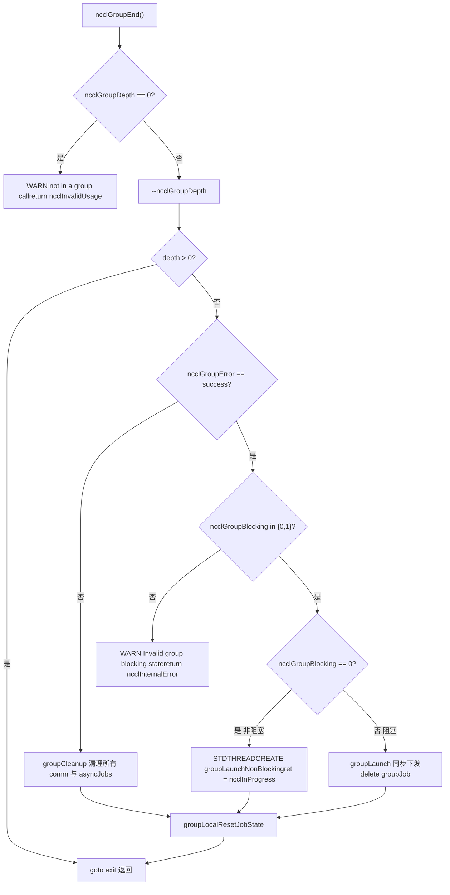

# 第 22 章：生產排障與踩坑：常見死鎖、超時、版本不匹配與排查方案

上一章我們梳理了效能調優的排查順序與關鍵旋鈕，但生產環境中的 NCCL 故障往往不是效能不達標，而是程式直接掛起或崩潰。這些故障的根源通常不是某個函數寫錯了，而是呼叫順序、生命週期或版本契約被破壞。本章聚焦四類最典型的踩坑：group 語意誤用導致的死鎖、參數校驗缺失導致的靜默錯誤、ABI 版本不匹配、以及超時與重試的邊界。我們會沿著 src/group.cc、src/misc/argcheck.cc、src/include/checks.h 和 contrib/nccl_ep/nccl_ep.cc 四條線索，看清 NCCL 內部是如何在錯誤發生前就把它擋住的。

# Group 語意誤用：為什麼「少寫一個 GroupEnd」會掛死

## 直覺模型：Group 是「購物車」，不是「加速開關」

把`ncclGroupStart()` / `ncclGroupEnd()`想像成網購的購物車：你把多件商品（多次通訊呼叫）放進購物車，最後一次性結算（`ncclGroupEnd`）。如果只放不結算，購物車永遠懸在半空——NCCL 內部維護的`ncclGroupDepth`計數器就不會歸零，後續所有通訊呼叫都會以為「還在攢單」，永遠不真正下發 kernel，於是整個行程掛死。

> **[Design Inference & Architectural Trade-offs]**
> 這是生產中最常見的死鎖形態：程式碼在某個異常分支裡`return`了，跳過了`ncclGroupEnd`，而`ncclGroupDepth`是`thread_local`的，不會因為函式返回而自動清理。

## 資料結構：thread_local 的 group 狀態

NCCL 把 group 狀態全部放在執行緒區域儲存裡，這是理解死鎖的關鍵。

[FACT:src/group.cc:34-34]

```cpp
thread_local int ncclGroupDepth = 0; // depth of ncclGroupStart nesting
thread_local ncclResult_t ncclGroupError = ncclSuccess;
thread_local struct ncclComm* ncclGroupCommHead[ncclGroupTaskTypeNum] = {nullptr};
thread_local struct ncclComm* ncclGroupCommPreconnectHead = nullptr;
thread_local struct ncclIntruQueue ncclAsyncJobs;
thread_local int ncclGroupBlocking = -1; /* default mode */
```

逐欄位解讀：

- `ncclGroupDepth`：巢狀深度。`ncclGroupStart`遞增，`ncclGroupEnd`遞減，只有減到 0 才真正觸發下發。支援巢狀是設計上的便利，但也意味著「漏掉一個 End」會讓深度永遠停在 1。
- `ncclGroupError`：本執行緒累積的 group 錯誤。一旦某次呼叫失敗，後續`ncclGroupEnd`會直接走失敗路徑。
- `ncclGroupCommHead[]`：按任務類型（collective / rawTask / mgmtTask / symRegister）分組的通訊域鏈結串列頭。
- `ncclAsyncJobs`：待執行的非同步任務佇列（比如 preconnect、symmetric register）。
- `ncclGroupBlocking`：`-1`表示「還沒遇到任何通訊域」，`0`表示非阻塞，`1`表示阻塞。這個欄位是後面「阻塞與非阻塞混用」檢測的核心。

> **[Design Inference & Architectural Trade-offs]**
> 用`thread_local`而非全域變數的動機很直接：NCCL 允許多執行緒各自持有獨立的 group 上下文，互不干擾。代價是——執行緒退出時這些狀態不會自動清理，如果執行緒在 group 中途退出，狀態就洩漏了。

## Step-by-Step：一次 GroupEnd 的完整校驗鏈

代入場景：應用呼叫`ncclGroupEnd()`，此時`ncclGroupDepth`為 1。

第一步，檢查是否真的在 group 裡：

[FACT:src/group.cc:1048-1052]

```cpp
  if (ncclGroupDepth == 0) {
    WARN("ncclGroupEnd: not in a group call.");
    ret = ncclInvalidUsage;
    goto exit;
  }
```

如果使用者沒呼叫`ncclGroupStart`就直接`ncclGroupEnd`，這裡會列印 "not in a group call" 並返回`ncclInvalidUsage`。這是最友善的錯誤——立刻報錯，不會掛死。

第二步，遞減深度，判斷是否是最外層：

[FACT:src/group.cc:1061-1063]

```cpp
  if ((--ncclGroupDepth) > 0) goto exit;

  if ((ret = ncclGroupError) != ncclSuccess) goto fail;
```

如果巢狀了多層，內層的`End`只是遞減深度就返回，不觸發下發。只有最外層才繼續。同時檢查累積錯誤。

第三步，校驗阻塞模式一致性。這是「阻塞與非阻塞混用」的檢測點：

[FACT:src/group.cc:1095-1101]

```cpp
  if (hasCommHead || !ncclIntruQueueEmpty(&groupJob->asyncJobs) || ncclGroupCommPreconnectHead != nullptr) {
    /* make sure ncclGroupBlocking has been set. */
    if (ncclGroupBlocking != 0 && ncclGroupBlocking != 1) {
      WARN("Invalid group blocking state %d", ncclGroupBlocking);
      ret = ncclInternalError;
      goto fail;
    }
```

`ncclGroupBlocking`必須在`{0, 1}`之間。如果它還是`-1`，說明 group 裡既沒有通訊域也沒有非同步任務，邏輯上不該走到這裡。

第四步，根據阻塞模式分叉。非阻塞走執行緒非同步下發，阻塞走同步下發：

[FACT:src/group.cc:1102-1134]

```cpp
    if (ncclGroupBlocking == 0) {
      /* nonblocking group */
      if (!ncclIntruQueueEmpty(&groupJob->asyncJobs)) {
        ncclAsyncJob* job = ncclIntruQueueHead(&groupJob->asyncJobs);
        do {
          NCCLCHECKGOTO(ncclCommSetAsyncError(job->comm, ncclInProgress), ret, fail);
          if (job->comm->groupJob == NULL) {
            job->comm->groupJob = groupJob;
            groupJob->groupRefCount++;
          }
          job = job->next;
        } while (job);
      }
      ...
      groupJob->base.func = groupLaunchNonBlocking;
      STDTHREADCREATE_GOTO(groupJob->base.thread, ncclAsyncJobMain, ret, fail, &groupJob->base);
      groupJob->nonBlockingInit = true;
      ret = ncclInProgress;
    }
```

注意`groupRefCount++`和`ret = ncclInProgress`：非阻塞模式下，`ncclGroupEnd`立刻返回`ncclInProgress`，真正的下發在背景執行緒裡跑。呼叫方必須後續用`ncclCommGetAsyncError`輪詢，或者用`ncclGroupJobComplete`等待。

## 阻塞與非阻塞混用：為什麼被禁止

回到`ncclAsyncLaunch`，看混用檢測：

[FACT:src/group.cc:55-64]

```cpp
    /* check if there are blocking and nonblocking comms at the same time in group. */
    if (comm->destroyFlag) {
      ncclGroupBlocking = 1;
    } else if (ncclGroupBlocking == -1) {
      /* first met communicator */
      ncclGroupBlocking = comm->config.blocking;
    } else if (ncclGroupBlocking != comm->config.blocking) {
      WARN("Blocking and nonblocking communicators are not allowed in the same group.");
      ret = ncclInvalidArgument;
    }
```

> **[Design Inference & Architectural Trade-offs]**
> 為什麼禁止混用？因為阻塞通訊域的下發語義是「呼叫返回時 kernel 已提交」，而非阻塞是「呼叫返回時任務已入佇列但未提交」。如果兩者在同一個 group 裡，`ncclGroupEnd`無法給出統一的返回語義——到底是等還是不等？NCCL 選擇直接拒絕，把問題暴露在 API 邊界。

## 生產踩坑：三個真實場景

**場景一：異常分支漏掉 GroupEnd。**程式碼在`ncclGroupStart`和`ncclGroupEnd`之間拋異常或提前`return`，`ncclGroupDepth`停在 1。後續所有通訊呼叫都進入「攢單」狀態，永遠不下發。排查方法：在`ncclGroupEnd`前列印`ncclGroupDepth`，或者用`gdb`觀察該 thread_local 變數。

**場景二：跨執行緒使用同一個 comm。**因為 group 狀態是`thread_local`，執行緒 A 呼叫`ncclGroupStart`後，執行緒 B 呼叫`ncclAllReduce`不會進入 A 的 group。如果 A 和 B 操作同一個 comm，會出現「部分呼叫在 group 內、部分在 group 外」的錯亂。NCCL 不檢測這種情況，因為它假設一個 comm 在任一時刻只被一個執行緒操作。

**場景三：CUDA graph capture 與 group 的互動。**看`doLaunches`裡的檢測：

[FACT:src/group.cc:448-455]

```cpp
    if (capturingYes && capturingNo) {
      // We have entered barriers but are aborting without leaving them. Thus
      // these comms are permanently trashed. We need a good mechanism for
      // tracking and reporting that.
      WARN("Either none or all communicators in a ncclGroup() can be CUDA graph captured.");
      result = ncclInvalidUsage;
      goto failure;
    }
```

註解說得很直白：一旦進入 barrier 又中途放棄，這些 comm 就被「永久損壞」了。所以規則是——一個 group 裡的所有通訊域，要麼全部在 capture 中，要麼全部不在。混用會導致 comm 狀態不一致，且 NCCL 目前沒有好的恢復機制。



# 參數校驗與靜默錯誤：ArgCheck 如何擋住「看起來正常」的呼叫

## 直覺模型：ArgCheck 是「機場安檢」

參數校驗就像機場安檢：它不負責讓你飛得更快，但能擋住那些「看起來是行李、實際是危險品」的東西。沒有它，一個傳錯裝置的指標會讓 GPU kernel 讀到垃圾資料，或者更糟——靜默寫壞別人的顯存。

## 資料結構：校驗模式與全域檢查佇列

NCCL 的參數校驗不是「每次都全查」，而是分模式。核心是`comm->checkMode`：

[FACT:src/misc/argcheck.cc:227-251]

```cpp
  if (info->comm->checkMode != ncclCheckModeDefault) {
    if ((info->coll == ncclFuncSend || info->coll == ncclFuncRecv)) {
      if (info->count > 0) NCCLCHECK(CudaPtrCheck(info->recvbuff, info->comm, "buff", info->opName));
    } else if (info->coll == ncclFuncPutSignal || info->coll == ncclFuncSignal || info->coll == ncclFuncWaitSignal) {
      // One-sided RMA ops specify the remote destination via peerWin, not sendbuff/recvbuff,
      // so the standard CUDA pointer checks do not apply here.
      INFO(NCCL_COLL, "%s : skipping sendbuff/recvbuff pointer check (one-sided RMA uses peerWin)", info->opName);
    } else {
      // Check CUDA device pointers
      if (info->coll != ncclFuncBroadcast || info->comm->rank == info->root) {
        NCCLCHECK(CudaPtrCheck(info->sendbuff, info->comm, "sendbuff", info->opName));
      }
      if (info->coll != ncclFuncReduce || info->comm->rank == info->root) {
        NCCLCHECK(CudaPtrCheck(info->recvbuff, info->comm, "recvbuff", info->opName));
      }
    }

    if (info->comm->checkMode == ncclCheckModeDebugGlobal) {
      struct ncclArgsInfo* argsInfo;
      NCCLCHECK(ncclCalloc(&argsInfo, 1));
      argsInfo->info = *info;
      argsInfo->next = NULL;
      ncclIntruQueueEnqueue(&info->comm->argsInfoQueue, argsInfo);
    }
  }
```

三種模式：

- `ncclCheckModeDefault`：只做最便宜的檢查（root 範圍、datatype 範圍、op 範圍），不碰 CUDA API。
- 非預設模式：呼叫`CudaPtrCheck`，這會真正呼叫`cudaPointerGetAttributes`，有效能開銷。
- `ncclCheckModeDebugGlobal`：除了本地檢查，還把`ncclInfo`塞進`argsInfoQueue`，等 group 結束時做跨 rank 的全局一致性檢查。

> **[Design Inference & Architectural Trade-offs]**
> 這個設計是效能與正確性的權衡：`cudaPointerGetAttributes`是同步 CUDA 呼叫，在熱路徑上每次通訊都調會顯著拖慢小訊息。所以預設模式只做「零成本」檢查，把昂貴的指標校驗留給除錯模式。

## Step-by-Step：CudaPtrCheck 的三層防線

代入場景：使用者傳入一個`sendbuff`，NCCL 在除錯模式下校驗它。

第一層，指標是否有效：

[FACT:src/misc/argcheck.cc:12-18]

```cpp
ncclResult_t CudaPtrCheck(const void* pointer, struct ncclComm* comm, const char* ptrname, const char* opname) {
  cudaPointerAttributes attr;
  cudaError_t err = cudaPointerGetAttributes(&attr, pointer);
  if (err != cudaSuccess || attr.devicePointer == NULL) {
    WARN("%s : %s %p is not a valid pointer", opname, ptrname, pointer);
    return ncclInvalidArgument;
  }
```

`cudaPointerGetAttributes`對無效指標會傳回錯誤，或者`devicePointer`為 NULL。這擋住了「傳了個 host 堆疊位址」或「傳了個已釋放的指標」。

第二層，裝置是否匹配：

[FACT:src/misc/argcheck.cc:19-26]

```cpp
#if CUDART_VERSION >= 10000
  if (attr.type == cudaMemoryTypeDevice && attr.device != comm->cudaDev) {
#else
  if (attr.memoryType == cudaMemoryTypeDevice && attr.device != comm->cudaDev) {
#endif
    WARN("%s : %s allocated on device %d mismatchs with NCCL device %d", opname, ptrname, attr.device, comm->cudaDev);
    return ncclInvalidArgument;
  }
```

這是最隱蔽的坑：指標是有效的 GPU 指標，但屬於另一塊 GPU。在多卡機器上，如果使用者忘了`cudaSetDevice`，很容易傳錯。NCCL 在這裡明確拒絕。

第三層，通訊域物件完整性：

[FACT:src/misc/argcheck.cc:38-45]

```cpp
ncclResult_t CommCheck(struct ncclComm* comm, const char* opname, const char* ptrname) {
  NCCLCHECK(PtrCheck(comm, opname, ptrname));
  if (comm->startMagic != NCCL_MAGIC || comm->endMagic != NCCL_MAGIC) {
    WARN("Error: corrupted comm object detected");
    return ncclInvalidArgument;
  }
  return ncclSuccess;
}
```

`startMagic` / `endMagic`是放在`ncclComm`結構體首尾的哨兵值。如果使用者傳了個野指標、或者 comm 已被釋放，magic 就對不上。這是「記憶體損壞偵測」的經典手法——用兩個哨兵夾住結構體，任何越界寫都可能破壞其中一個。

## 全局一致性檢查：registrationCheck 的跨 rank 校驗

這是 NCCL 裡最「重」的校驗，只在`ncclCheckModeDebugGlobal`下觸發。它檢查的是——所有 rank 的對稱記憶體註冊狀態是否一致。

[FACT:src/misc/argcheck.cc:95-111]

```cpp
  NCCLCHECKGOTO(bootstrapAllGather(comm->bootstrap, bufInfo, sizeof(struct symBufInfo) * 2), ret, fail);

  cmpBufInfo[0] = bufInfo[0];
  cmpBufInfo[1] = bufInfo[1];
  for (int r = 1; r nRanks; r++) {
    int infoIdx = r * 2;
    if (cmpBufInfo[0].isSymRegistered != bufInfo[infoIdx].isSymRegistered ||
        cmpBufInfo[1].isSymRegistered != bufInfo[infoIdx + 1].isSymRegistered) {
      if (comm->rank == 0) {
        WARN("Coll %s size %ld symmetric registration check failed on rank %d: sendReg %d recvReg %d mismatch with "
             "rank 0 sendReg %d recvReg %d",
             info->opName, size, r, bufInfo[infoIdx].isSymRegistered, bufInfo[infoIdx + 1].isSymRegistered,
             cmpBufInfo[0].isSymRegistered, cmpBufInfo[1].isSymRegistered);
      }
      ret = ncclInvalidArgument;
      goto fail;
    }
```

它透過 bootstrap 的`allGather`把每個 rank 的`(isSymRegistered, bigOffset, userOffset)`收集起來，然後逐 rank 比對。如果 rank 0 的 send buffer 註冊了對稱記憶體，而 rank 3 沒註冊，這裡就會報錯。

> **[Design Inference & Architectural Trade-offs]**
> 為什麼這個檢查重要？對稱記憶體（symmetric memory）要求所有 rank 用同一套虛擬位址存取緩衝區。如果某個 rank 的 buffer 沒註冊，kernel 裡算出來的位址就是錯的，會讀到垃圾或越界。這種錯誤在執行時表現為「結果偶爾不對」，極難排查。NCCL 選擇在 API 邊界用一次 allGather 的代價把它擋住。

## 生產踩坑

**坑一：預設模式下指標錯誤不報。**如果使用者沒開除錯模式，傳了個錯誤裝置的指標，NCCL 不會在`ArgsCheck`階段報錯，而是等到 kernel 執行時才發現——此時可能已經寫壞了別的 rank 的顯存。建議在開發階段用`NCCL_DEBUG=WARN`加`checkMode`除錯。

**坑二：`ncclCheckModeDebugGlobal`的 allGather 開銷。**每次通訊都做一次 bootstrap allGather，在小訊息高頻場景下會成為瓶頸。這個模式只適合除錯，不能上生產。

**坑三：userRedOp 的生命週期。**看這段：

[FACT:src/misc/argcheck.cc:220-225]

```cpp
  int opIx = int(ncclUserRedOpMangle(info->comm, info->op)) - int(ncclNumOps);
  if (ncclNumOps op &&
      (info->comm->userRedOpCapacity comm->userRedOps[opIx].freeNext != -1)) {
    WARN("%s : reduction operation %d unknown to this communicator", info->opName, info->op);
    return ncclInvalidArgument;
  }
```

使用者自訂的 reduction op 是註冊在 comm 上的。如果使用者傳了一個「曾經註冊過但已被釋放」的 op，`freeNext != -1`會偵測到它已被回收。這是防止「懸空 op 句柄」的檢查。

# 錯誤傳播巨集：NCCLCHECK 家族如何保證「錯誤不丟」

## 直覺模型：錯誤傳播巨集是「接力棒」

NCCL 的錯誤處理靠一組巨集接力：底層函式傳回`ncclResult_t`，上層用`NCCLCHECK`檢查，非成功就立刻傳回。這就像接力賽——棒子（錯誤碼）必須一路傳到底，任何一棒掉了，整個鏈條就斷了。

## 資料結構：巨集家族全貌

[FACT:src/include/checks.h:148-166]

```cpp
#define NCCLCHECK(call) \
  do { \
    ncclResult_t RES = call; \
    if (RES != ncclSuccess && RES != ncclInProgress) { \
      /* Print the back trace*/ \
      if (ncclDebugNoWarn == 0) INFO_LOC(NCCL_ALL, "-> %d", RES); \
      return RES; \
    } \
  } while (0)

#define NCCLCHECKGOTO(call, RES, label) \
  do { \
    RES = call; \
    if (RES != ncclSuccess && RES != ncclInProgress) { \
      /* Print the back trace*/ \
      if (ncclDebugNoWarn == 0) INFO_LOC(NCCL_ALL, "-> %d", RES); \
      goto label; \
    } \
  } while (0)
```

關鍵細節：`ncclInProgress`被視為「非錯誤」。這是非阻塞通訊的核心——`ncclGroupEnd`傳回`ncclInProgress`表示「任務已提交，還沒完成」，呼叫方應該繼續輪詢而不是當錯誤處理。

`NCCLCHECK`直接`return`，`NCCLCHECKGOTO`跳到`label`。後者用於需要清理資源的場景。

## 清理路徑：NCCLCHECKIGNORE 保留首個錯誤

[FACT:src/include/checks.h:168-177]

```cpp
// Report failure but continue - useful for cleanup paths where we want to
// attempt all cleanup steps. Preserves the first error in RES.
#define NCCLCHECKIGNORE(call, RES) \
  do { \
    ncclResult_t TMPRES = call; \
    if (TMPRES != ncclSuccess && TMPRES != ncclInProgress) { \
      if (ncclDebugNoWarn == 0) INFO_LOC(NCCL_ALL, "-> %d", TMPRES); \
      if (RES == ncclSuccess) RES = TMPRES; \
    } \
  } while (0)
```

註解說得很清楚：清理路徑上要「嘗試所有清理步驟」，不能被第一個錯誤打斷。但錯誤碼要保留第一個——因為第一個錯誤通常是最有診斷價值的根因。

## 等待與中止：NCCLWAIT 的 abortFlag 檢查

[FACT:src/include/checks.h:196-205]

```cpp
#define NCCLWAIT(call, cond, abortFlagPtr) \
  do { \
    uint32_t* tmpAbortFlag = (abortFlagPtr); \
    ncclResult_t RES = call; \
    if (RES != ncclSuccess && RES != ncclInProgress) { \
      if (ncclDebugNoWarn == 0) INFO_LOC(NCCL_ALL, "-> %d", RES); \
      return ncclInternalError; \
    } \
    if (COMPILER_ATOMIC_LOAD(tmpAbortFlag, std::memory_order_acquire)) NEQCHECK(*tmpAbortFlag, 0); \
  } while (!(cond))
```

這是輪詢等待的模板：每次迴圈呼叫`call`（推進進度），檢查`cond`（是否滿足），同時檢查`abortFlag`（是否被中止）。`abortFlag`用`memory_order_acquire`載入，保證看到其他執行緒寫入的中止訊號。

> **[Design Inference & Architectural Trade-offs]**
> 這個設計解決了一個經典問題：當某個 rank 出錯時，其他 rank 可能還在死等它的資料。`abortFlag`是跨 rank 傳播中止訊號的機制——一旦設定，所有等待迴圈都會退出。

## 執行緒建立與記憶體分配的安全巨集

[FACT:src/include/checks.h:237-256]

```cpp
#define STDTHREADCREATE_IMPL(var, func, error_action, ...) \
  do { \
    try { \
      (var) = std::thread(func, __VA_ARGS__); \
    } catch (const std::exception& e) { \
      WARN("Thread creation failed: %s", e.what()); \
      error_action; \
    } \
  } while (0)

#define STDTHREADCREATE(var, func, ...) STDTHREADCREATE_IMPL(var, func, return ncclSystemError, __VA_ARGS__)

#define STDTHREADCREATE_GOTO(var, func, RES, label, ...) \
  STDTHREADCREATE_IMPL( \
    var, func, \
    do { \
      RES = ncclSystemError; \
      goto label; \
    } while (0), \
    __VA_ARGS__)
```

`std::thread`建構失敗會拋異常（比如執行緒數超限）。這個巨集把異常轉成`ncclSystemError`，避免異常穿透 C API 邊界。

[FACT:src/include/checks.h:258-275]

```cpp
#define NEW_NOTHROW(var, x) \
  do { \
    (var) = new (std::nothrow) x{}; \
    if (!(var)) { \
      WARN("Allocation failed"); \
      return ncclSystemError; \
    } \
  } while (0)
```

`new (std::nothrow)`在分配失敗時傳回 nullptr 而非拋異常。這是 C++ 程式碼在 C API 邊界上的標準做法。

## 生產踩坑

**坑一：`ncclInProgress`被誤當成功。**有些使用者程式碼寫`if (ret == ncclSuccess)`判斷成功，但非阻塞模式下傳回的是`ncclInProgress`。正確做法是`if (ret == ncclSuccess || ret == ncclInProgress)`，或者用`ncclCommGetAsyncError`查詢。

**坑二：`NCCLCHECK`在解構函式裡用。**如果解構函式裡用`NCCLCHECK`，錯誤會直接`return`，跳過後續清理。應該用`NCCLCHECKIGNORE`。

# ABI 版本不匹配：nccl_ep 的 size-based 設計

## 直覺模型：ABI 是「插座標準」

ABI（應用二進位介面）就像電源插座標準：如果函式庫和呼叫方對「結構體長什麼樣」的理解不一致，就會像把美標插頭插進歐標插座——輕則不工作，重則燒毀。`contrib/nccl_ep`用了一個巧妙的設計：每個跨邊界結構體都以`size`欄位開頭。

## 資料結構：size + magic 雙重校驗

[FACT:contrib/nccl_ep/nccl_ep.cc:70-76]

```cpp
// Size-based ABI versioning: every cross-boundary struct starts with a `size`
// field set by the caller to sizeof(struct). The library checks that against
// its own known size; any mismatch means caller and library are from different
// releases. Strict equality for now — see nccl_ep.h for the planned future
// relaxation (all-zero-trailing-bytes escape hatch).
// Immediately after `size` there is a `magic` field pre-filled by NCCL_EP_*_INIT
// to catch unininitialized structures.
```

設計要點：

- `size`欄位由呼叫方填`sizeof(struct)`，函式庫檢查它是否等於自己認識的 size。
- `magic`欄位由`NCCL_EP_*_INIT`巨集預填，用來捕獲「未初始化」的結構體。
- 當前是嚴格相等，未來計劃支援「尾部全零則允許 size 更小」的寬鬆模式。

## Step-by-Step：EP_REQUIRE_STRUCT 的校驗流程

[FACT:contrib/nccl_ep/nccl_ep.cc:77-80]

```cpp
#define EP_REQUIRE_STRUCT(ptr) \
    do { \
        assert( \
            (ptr) != nullptr && (ptr)->size == sizeof(*(ptr)) && \
```

這個巨集在`ncclEpDispatch`、`ncclEpCombine`等入口處呼叫：

[FACT:contrib/nccl_ep/nccl_ep.cc:2827-2830]

```cpp
    EP_REQUIRE_STRUCT(inputs);
    EP_REQUIRE_STRUCT(outputs);
    EP_OPTIONAL_LAYOUT_INFO(layout_info);
    EP_OPTIONAL_STRUCT(config);
```

`inputs`和`outputs`是必需參數，用`EP_REQUIRE_STRUCT`；`layout_info`和`config`是選用參數，用`EP_OPTIONAL_*`。

## 版本安全的欄位讀取：layoutInfoRecvTopkIdxKind

這是最精妙的部分——如何在「呼叫方結構體可能更小」的情況下安全讀取欄位。

[FACT:contrib/nccl_ep/nccl_ep.cc:139-144]

```cpp
// Safe field reader for ncclEpLayoutInfo_t::recv_topk_idx_kind. Returns AUTO
// when the caller's struct (size) does not cover the field, preserving the
// pre-flag default.
static inline ncclEpExpertIdKind_t layoutInfoRecvTopkIdxKind(const ncclEpLayoutInfo_t* lip) {
    if (lip == nullptr) return NCCL_EP_EXPERT_ID_AUTO;
    constexpr size_t field_end = offsetof(ncclEpLayoutInfo_t, recv_topk_idx_kind) + sizeof(ncclEpExpertIdKind_t);
    if (lip->size recv_topk_idx_kind;
}
```

邏輯是：如果呼叫方的`size`小於「該欄位結束的偏移」，說明呼叫方用的是舊版本結構體，這個欄位不存在，回傳預設值`AUTO`。否則正常讀取。

> **[Design Inference & Architectural Trade-offs]**
> 這是 ABI 相容的標準手法：新欄位只能加在結構體末尾，讀取時用`size`判斷欄位是否存在。這樣舊呼叫方用舊結構體，新函式庫也能正確處理。

## 版本號檢查：軟警告而非硬拒絕

[FACT:contrib/nccl_ep/nccl_ep.cc:1393-1400]

```cpp
    if (in_config->version != NCCL_EP_API_VERSION) {
        fprintf(
            stderr,
            "NCCL EP WARN: ncclEpGroupConfig_t.version=%u, library API_VERSION=%u; "
            "behavior may differ across versions.\n",
            in_config->version,
            (unsigned)NCCL_EP_API_VERSION);
    }
```

注意這裡是`WARN`而非`return error`。版本號不匹配只是警告，因為`size`檢查已經保證了記憶體佈局安全。版本號更多是「行為可能不同」的提示。

## 生產踩坑

**坑一：忘記用 INIT 巨集初始化。**如果使用者手動`memset`結構體為 0，`magic`就是 0，`EP_REQUIRE_STRUCT`會失敗。必須用`NCCL_EP_*_INIT`巨集。

**坑二：跨版本混用動態函式庫。**如果應用連結的是新版`libnccl_ep.so`，但標頭檔是舊版，`sizeof(struct)`會不一致，`EP_REQUIRE_STRUCT`會立刻報錯。這是設計意圖——快速失敗優於靜默錯誤。

**坑三：`EP_OPTIONAL_LAYOUT_INFO`的範圍檢查。**看這段：

[FACT:contrib/nccl_ep/nccl_ep.cc:114-123]

```cpp
            if ((ptr)->size size > sizeof(*(ptr))) { \
                fprintf( \
                    stderr, \
                    "NCCL EP: ncclEpLayoutInfo_t size out of supported range: " \
                    "got %u, expected [%zu, %zu]\n", \
                    (ptr)->size, \
                    kNcclEpLayoutInfoMinSize, \
                    sizeof(*(ptr))); \
                return ncclInvalidArgument; \
            } \
```

`layout_info`允許 size 在`[min, sizeof]`範圍內，這比`EP_REQUIRE_STRUCT`的嚴格相等更寬鬆。原因是`layout_info`是選用參數，且歷史上欄位有增減。

```mermaid
flowchart TD
    entry["ncclEpDispatch(inputs, outputs, layout_info, config)"] --> req_inputs{"EP_REQUIRE_STRUCT(inputs)size == sizeof?"}
    req_inputs -->|否| err_size["assert 失败 / 返回错误"]
    req_inputs -->|是| req_outputs{"EP_REQUIRE_STRUCT(outputs)"}
    req_outputs -->|否| err_size
    req_outputs -->|是| opt_layout{"layout_info != nullptr?"}
    opt_layout -->|否| skip_layout["跳过 layout 校验"]
    opt_layout -->|是| range_check{"size in [min, sizeof]?"}
    range_check -->|否| err_range["fprintf size out of rangereturn ncclInvalidArgument"]
    range_check -->|是| magic_check{"magic == NCCL_EP_MAGIC?"}
    magic_check -->|否| err_magic["fprintf magic mismatchreturn ncclInvalidArgument"]
    magic_check -->|是| read_field["layoutInfoRecvTopkIdxKindsize  read_field
    read_field --> proceed["继续执行 dispatch 逻辑"]
```

# 逾時、重試與中止：從 NCCLWAIT 到 nccl_ep 的 timeout_cycles

## 直覺模型：逾時是「保險絲」

分散式通訊裡，一個 rank 卡住會導致所有 rank 死等。逾時機制就像保險絲：正常情況下不動作，一旦電流異常就熔斷，避免整個系統燒毀。

## 資料結構：abortFlag 與 timeout_cycles

NCCL 核心用`abortFlag`傳播中止訊號。看`ncclAsyncLaunch`裡的傳遞：

[FACT:src/group.cc:49-52]

```cpp
    job->abortFlag = comm->abortFlag;
    job->abortFlagDev = comm->abortFlagDev;
    job->childAbortFlag = comm->childAbortFlag;
    job->childAbortFlagDev = comm->childAbortFlagDev;
```

每個 job 持有 comm 的 abortFlag 指標。當 group 偵測到錯誤時：

[FACT:src/group.cc:118-126]

```cpp
        if (!job->destroyFlag &&
            (COMPILER_ATOMIC_LOAD(groupAbortFlag, std::memory_order_acquire) || errorJobAbortFlag == true)) {
          COMPILER_ATOMIC_STORE(job->abortFlag, uint32_t(1), std::memory_order_release);
          COMPILER_ATOMIC_STORE(job->abortFlagDev, uint32_t(1), std::memory_order_release);
          if (job->childAbortFlag) {
            COMPILER_ATOMIC_STORE(job->childAbortFlag, uint32_t(1), std::memory_order_release);
            COMPILER_ATOMIC_STORE(job->childAbortFlagDev, uint32_t(1), std::memory_order_release);
          }
        }
```

一旦`groupAbortFlag`或`errorJobAbortFlag`為真，所有 job 的 abortFlag 都被設為 1。`memory_order_release`保證之前的寫操作對其他執行緒可見。

## nccl_ep 的逾時設計：GPU 時鐘週期

`nccl_ep`用了更精細的逾時——以 GPU 時鐘週期為單位。

[FACT:contrib/nccl_ep/nccl_ep.cc:1558-1591]

```cpp
    // Resolve timeout_cycles: env var > config field > compile-time default
    {
        int dev;
        int clock_khz_int;
        CUDA_CHECK(cudaGetDevice(&dev));
        CUDA_CHECK(cudaDeviceGetAttribute(&clock_khz_int, cudaDevAttrClockRate, dev));
        uint64_t clock_khz = static_cast(clock_khz_int);

        uint64_t resolved = NUM_TIMEOUT_CYCLES;
        const char* source = "compile-time default";
        const uint64_t env_ms = static_cast(ep_group->env.timeout_ms.value.ul);
        // Only a positive timeout overrides the default.
        const bool have_env_ms = ep_group->env.timeout_ms.is_set && env_ms > 0;

        if (have_env_ms) {
            resolved = clock_khz * 1000ULL * env_ms / 1000ULL;
            source = "NCCL_EP_TIMEOUT_MS env var";
            ...
        } else if (ep_group->config.timeout_ns != 0) {
            resolved = clock_khz * 1000ULL * (ep_group->config.timeout_ns / 1000000ULL) / 1000ULL;
            source = "config.timeout_ns";
        }

        ep_group->timeout_cycles = resolved;
```

優先級是：環境變數`NCCL_EP_TIMEOUT_MS`> 配置欄位`timeout_ns`> 編譯期預設值。轉換公式是`clock_khz * 1000 * ms / 1000`，即把毫秒轉成時鐘週期。

> **[Design Inference & Architectural Trade-offs]**
> 為什麼用時鐘週期而非毫秒？因為 GPU kernel 裡的等待迴圈無法呼叫系統時間 API，只能讀`clock64()`暫存器。用時鐘週期做逾時判斷，kernel 裡可以直接比較，無需 host 介入。

## 非同步錯誤標誌：host-pinned 記憶體

[FACT:contrib/nccl_ep/nccl_ep.cc:1767-1778]

```cpp
    // Allocate mask buffer and async error flag for active-mask support
    if (ep_group->config.enable_mask && ep_group->config.algorithm == NCCL_EP_ALGO_LOW_LATENCY) {
        size_t mask_bytes = ep_group->nRanks * sizeof(int);
        CUDA_CHECK(cudaMalloc(reinterpret_cast(&ep_group->mask_buffer), mask_bytes));
        // Initialize all ranks as active (1 = active, 0 = masked/failed)
        std::vector all_active(ep_group->nRanks, 1);
        CUDA_CHECK(
            cudaMemcpyAsync(ep_group->mask_buffer, all_active.data(), mask_bytes, cudaMemcpyHostToDevice, stream));
        CUDA_CHECK(
            cudaHostAlloc(reinterpret_cast(&ep_group->async_error_flag), sizeof(int), cudaHostAllocMapped));
        *ep_group->async_error_flag = 0;
    }
```

`async_error_flag`用`cudaHostAllocMapped`分配，這是 host-pinned 且映射到裝置位址空間的記憶體。GPU kernel 可以寫它，host 可以讀它，無需顯式拷貝。

## 讀取非同步錯誤：原子載入

[FACT:contrib/nccl_ep/nccl_ep.cc:4312-4321]

```cpp
ncclResult_t ncclEpGetAsyncError(ncclEpGroup_t ep_group, int* error_out) {
    EP_HOST_ASSERT(ep_group != nullptr);
    if (!ep_group->config.enable_mask) {
        return ncclInvalidUsage;
    }
    EP_HOST_ASSERT(ep_group->async_error_flag != nullptr && "ncclEpGetAsyncError: enable_mask must be true");
    EP_HOST_ASSERT(error_out != nullptr);
    *error_out = __atomic_load_n(ep_group->async_error_flag, __ATOMIC_ACQUIRE);
    return ncclSuccess;
}
```

用`__atomic_load_n`加`__ATOMIC_ACQUIRE`，保證讀到的是 GPU 寫入的最新值，而不是快取的舊值。

## 生產踩坑

**坑一：逾時設定過短導致誤報。**如果`NCCL_EP_TIMEOUT_MS`設得太小，正常的網路抖動會被誤判為逾時。建議根據實際網路 RTT 設定，一般不小於 10 秒。

**坑二：abortFlag 設定後未清理。**一旦 abortFlag 被設為 1，comm 就進入「中止」狀態。如果使用者想繼續用這個 comm，必須先清理 abortFlag。NCCL 的`ncclCommAbort`會做這個清理。

**坑三：`ncclEpMaskClean`的前置條件。**看這段：

[FACT:contrib/nccl_ep/nccl_ep.cc:4262-4266]

```cpp
    EP_HOST_ASSERT(ep_group->config.algorithm == NCCL_EP_ALGO_LOW_LATENCY);
    EP_HOST_ASSERT(
        ep_group->rdma_buffer != nullptr &&
        "ncclEpMaskClean: rdma_buffer not yet allocated; create at least one LL handle first");
    EP_HOST_ASSERT(ep_group->sync_buffer != nullptr && ep_group->sync_window != nullptr);
```

`ncclEpMaskClean`要求`rdma_buffer`已分配。如果使用者建立了 group 但還沒建立任何 LL handle，`rdma_buffer`是 nullptr（因為 LL 是懶分配），這裡會 assert 失敗。

# 本章小結

本章串起了四類生產踩坑：

1. **Group 語意誤用**：`ncclGroupDepth`是 thread_local，漏掉`ncclGroupEnd`會導致永久掛死；阻塞與非阻塞通信域不能混用；CUDA graph capture 必須全有或全無。

2. **參數校驗**：`ArgsCheck`分模式校驗，預設模式只做零成本檢查；`CudaPtrCheck`三層防線擋住無效指標、錯誤裝置、損壞的 comm；`registrationCheck`做跨 rank 的對稱記憶體一致性檢查。

3. **錯誤傳播**：`NCCLCHECK`家族保證錯誤不丟；`ncclInProgress`不是錯誤；`NCCLCHECKIGNORE`用於清理路徑保留首個錯誤；`NCCLWAIT`在輪詢中檢查 abortFlag。

4. **ABI 版本**：`nccl_ep`用 size-based 設計，每個跨邊界結構體以`size`開頭，配合`magic`捕獲未初始化；新欄位只能加在末尾，讀取時用`size`判斷是否存在。

5. **超時與中止**：核心用`abortFlag`傳播中止；`nccl_ep`用 GPU 時鐘週期做超時，`async_error_flag`用 host-pinned 記憶體實現 GPU→host 異步通知。

# 本章思考與自測

Q1: 如果把`ncclGroupEndInternal`中`if ((--ncclGroupDepth) > 0) goto exit;`（[FACT:src/group.cc:1061]）改成`if (ncclGroupDepth > 0) goto exit;`（不遞減），會發生什麼？在嵌套 group 場景下會有什麼後果？

**參考解析**：

原代碼`--ncclGroupDepth`先遞減再判斷。如果改成不遞減：

```cpp
if (ncclGroupDepth > 0) goto exit;  // 错误版本
```

那麼每次`ncclGroupEnd`都不會減少深度。假設用戶寫了：

```cpp
ncclGroupStart();  // depth = 1
ncclGroupStart();  // depth = 2
ncclAllReduce(...);
ncclGroupEnd();    // 原版: depth = 1, 返回; 错误版: depth = 2, 返回
ncclGroupEnd();    // 原版: depth = 0, 触发下发; 错误版: depth = 2, 返回
```

錯誤版本下，第二次`ncclGroupEnd`時`ncclGroupDepth`仍是 2，`> 0`成立，直接`goto exit`，永遠不觸發下發。所有通信調用都停留在「攢單」狀態，進程掛死。

更隱蔽的是：`ncclGroupDepth`是 thread_local，不會因為函數返回而重置。即使後續代碼不再調用 group API，這個線程上的所有通信都會失效。

這個改動還會破壞`ncclGroupStart`的配對語義——`ncclGroupStart`遞增、`ncclGroupEnd`不遞減，深度只增不減，最終溢出（雖然 int 溢出需要 20 億次調用，實際更可能是邏輯掛死）。

Q2: `CudaPtrCheck`中`attr.type == cudaMemoryTypeDevice && attr.device != comm->cudaDev`（[FACT:src/misc/argcheck.cc:20]）這個檢查，如果去掉`attr.type == cudaMemoryTypeDevice`這個條件，會有什麼問題？在什麼場景下會誤報？

**參考答案**：

`cudaPointerAttributes.type`有三個可能值：`cudaMemoryTypeDevice`（裝置記憶體）、`cudaMemoryTypeHost`（主機記憶體）、`cudaMemoryTypeManaged`（統一記憶體）。

如果去掉`attr.type == cudaMemoryTypeDevice`條件，變成：

```cpp
if (attr.device != comm->cudaDev) {  // 错误版本
```

那麼對於 host 記憶體或 managed 記憶體，`attr.device`可能是 -1 或 0，與`comm->cudaDev`不匹配，會誤報「裝置不匹配」。

具體場景：用戶傳入一個`cudaMallocManaged`分配的指標。managed 記憶體的`attr.device`通常是分配時的裝置，但如果記憶體被遷移到其他裝置，`attr.device`可能變化。更常見的是 host 記憶體（比如`cudaHostAlloc`分配的 pinned 記憶體），`attr.device`為 -1，與任何`cudaDev`都不等，會誤報。

NCCL 允許 host 記憶體作為通信緩衝區（通過`cudaMemcpy`中轉），所以必須區分「裝置記憶體但裝置不對」和「非裝置記憶體」。前者是錯誤，後者是合法的。

Q3: `layoutInfoRecvTopkIdxKind`（[FACT:contrib/nccl_ep/nccl_ep.cc:139-144]）用`lip->size < field_end`判斷欄位是否存在。如果新版本在結構體中間插入了一個欄位（而非末尾），這個判斷會怎樣失效？為什麼 ABI 設計規定新欄位只能加在末尾？

**參考解析**：

假設原結構體是：

```c
struct ncclEpLayoutInfo_t {
    unsigned int size;
    unsigned int magic;
    ncclEpExpertIdKind_t recv_topk_idx_kind;  // offset = 8
};
```

`field_end = offsetof(recv_topk_idx_kind) + sizeof(...) = 8 + 4 = 12`。

如果新版本在`magic`和`recv_topk_idx_kind`之間插入一個欄位：

```c
struct ncclEpLayoutInfo_t {
    unsigned int size;
    unsigned int magic;
    unsigned int new_field;                    // 新插入
    ncclEpExpertIdKind_t recv_topk_idx_kind;  // offset 变成 12
};
```

此時`field_end = 12 + 4 = 16`。舊調用方的`size`是 12（舊結構體大小），`12 < 16`成立，函數返回`AUTO`——但舊調用方其實是有`recv_topk_idx_kind`欄位的，只是偏移不同。這會導致舊調用方設置的`recv_topk_idx_kind`被忽略。

更糟的是，如果舊調用方按舊偏移（8）寫入了`recv_topk_idx_kind`，新庫按新偏移（12）讀取，會讀到`new_field`的值，完全錯亂。

所以 ABI 設計的鐵律是：**新欄位只能加在結構體末尾**。這樣舊調用方的`size`小於新欄位的`field_end`，函數正確返回預設值；新調用方的`size`覆蓋新欄位，正常讀取。中間插入欄位會破壞所有基於`offsetof`的版本判斷。

本章剖析了生產環境中四類典型踩坑及其內部防禦機制，這些邊界條件提醒我們，NCCL 的穩定運行不僅依賴核心實現，也離不開周邊生態的適配與擴展。下一章我們將轉向生態與擴展，看看 nccl4py、nccl4rust、nccl_ep、nccl_ubx 這些周邊項目如何把 NCCL 的能力帶給更廣泛的用戶。
