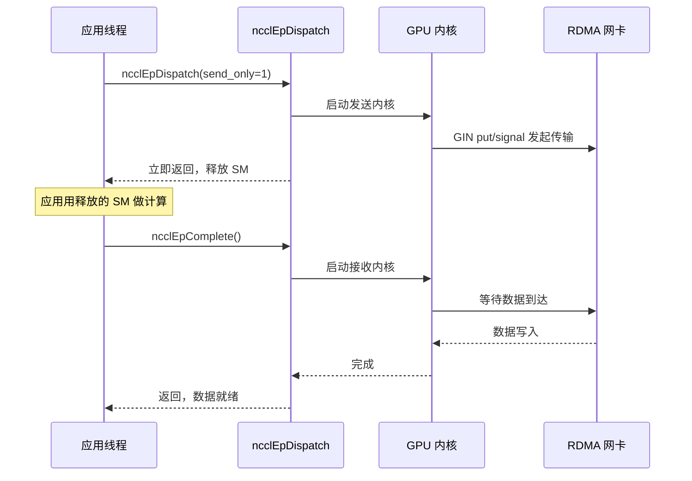
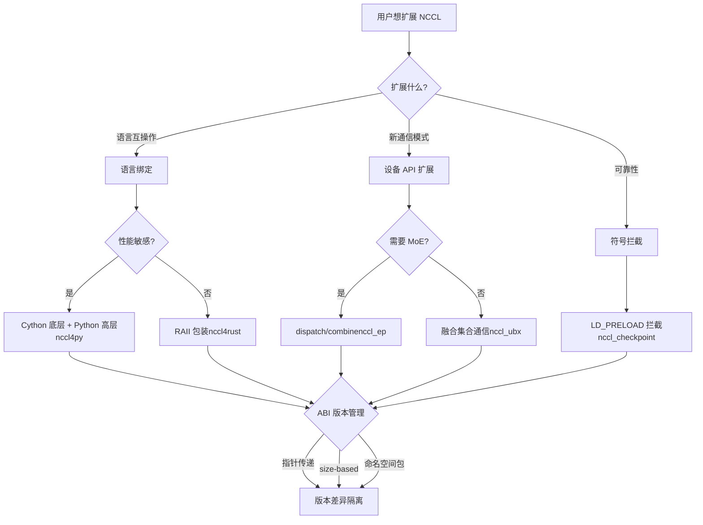

# 第 23 章：生態擴展：nccl4py、nccl4rust、nccl_ep、nccl_ubx 等周邊項目

上一章我們排查了 NCCL 在生產環境中的典型故障——group 語意誤用、rank 數不匹配、stream 互動、ABI 版本衝突以及網路逾時。這些問題大多發生在直接使用 C ABI 的場景中，而現代大模型訓練框架往往不直接呼叫 C ABI，而是透過 Python、Rust 等語言綁定，或借助針對 MoE、超頻寬通訊等場景的擴充專案來複用 NCCL 的能力。這些周邊專案放在 bindings/ 和 contrib/ 目錄下，定位是實驗性、社群維護，不繼承核心函式庫的發布品質保證。本章逐一剖析 nccl4py、nccl4rust、nccl_ep、nccl_ubx 和 nccl_checkpoint，看它們如何透過語言綁定、裝置 API 擴充和符號攔截三條路徑，在核心之外建構起豐富的生態。

# nccl4py：Cython 綁定與命名空間套件設計

## 直覺模型：把 C ABI 翻譯成 Python 能懂的話

想像 NCCL 核心是一個只會說 C 語言的外交官，而 Python 訓練腳本是一個只會說 Python 的實習生。nccl4py 就是那個翻譯官——它不改變外交官說的話（NCCL 的行為），只是把「`ncclAllReduce(sendbuff, recvbuff, count, ...)`」翻譯成「`nccl.all_reduce(tensor)`」。如果沒有這層翻譯，每個 Python 框架都得自己寫 ctypes 綁定，重複勞動且容易出錯。

## 分層結構：Cython 底層 + Python 高層

nccl4py 的設計是兩層：底層是 Cython 綁定（`nccl/bindings/cynccl.pxd`），高層是 Python API（`nccl.core`）。README 裡明確說了這個分層[FACT:bindings/nccl4py/README.md:4-4]：

> `nccl4py provides low-level Cython bindings and a high-level Python API`

Cython 綁定以`.pxd`檔案形式隨 wheel 分發，供其他 Cython 擴充直接`cimport` [FACT:bindings/nccl4py/README.md:39-43]：

```cython
from nccl.bindings cimport cynccl
```

> **[Design Inference & Architectural Trade-offs]**
> 為什麼要暴露 Cython 層而不只是 Python 層？因為有些框架（比如 DeepSpeed、Megatron）的核心迴圈在 Cython 裡，每次呼叫都走 Python 直譯器開銷太大。直接`cimport cynccl`可以讓 Cython 擴充以接近 C 的零開銷呼叫 NCCL 函式。這是「分層暴露」的典型設計——高層給普通使用者，底層給效能敏感場景。

## 命名空間套件：多個發行版共享`nccl`前綴

這是 nccl4py 最巧妙的設計。`nccl`是一個 PEP 420 隱式命名空間套件[FACT:bindings/nccl4py/README.md:50-51]：

> `nccl` is a PEP 420 implicit namespace package. nccl4py provides `nccl.bindings` and `nccl.core`; other NCCL extension distributions can provide additional `nccl.*` subpackages.

> **[Design Inference & Architectural Trade-offs]**
> 傳統 Python 套件裡，`nccl/__init__.py`會「擁有」整個`nccl`命名空間。如果 nccl4py 和 nccl_ep 的 Python 綁定都想提供`nccl.xxx`，就會衝突——誰先安裝誰贏。PEP 420 命名空間套件解決了這個問題：沒有`__init__.py`，多個發行版可以各自往`nccl/`目錄裡放子套件，Python 匯入系統會把它們合併。所以 nccl4py 提供`nccl.bindings`和`nccl.core`，nccl_ep 提供`nccl.ep`，兩者可以共存[FACT:contrib/nccl_ep/README.md:80-82]。

這個設計對生態擴充至關重要：未來任何第三方想加`nccl.monitoring`、`nccl.profiling`，都不需要改 nccl4py 的程式碼。

## CUDA 版本選擇：extra 機制

安裝時用`nccl4py[cu12]`或`nccl4py[cu13]`選擇 CUDA 大版本[FACT:bindings/nccl4py/README.md:13-17]。README 解釋了原因：extras 會安裝對應的 NCCL runtime 和 CUDA Python 依賴[FACT:bindings/nccl4py/README.md:19]。已發布的 wheel 不需要`CUDA_HOME`或本地 CUDA Toolkit，但從原始碼編譯需要[FACT:bindings/nccl4py/README.md:20-21]。

> **[Design Inference & Architectural Trade-offs]**
> 這是 Python 生態處理 CUDA 版本碎片化的標準做法。CUDA 12 和 13 的 ABI 不相容，不能用一個 wheel 通吃。用 extra 讓 pip 根據使用者環境選擇正確的二進位依賴，避免了執行時才發現版本不匹配。

## 生產避坑

**坑一：命名空間套件與`__init__.py`衝突。**如果某個第三方套件在`nccl/`下放了`__init__.py`，PEP 420 命名空間套件機制會被破壞，導致`nccl.core`匯入失敗。排查方法：`python -c "import nccl; print(nccl.__path__)"`，如果報`AttributeError`說明`nccl`不是命名空間套件。

**坑二：Cython ABI 版本漂移。** `cynccl.pxd`是實驗性 API[FACT:bindings/nccl4py/README.md:32-32]，NCCL 升級時`.pxd`可能變。依賴`cimport cynccl`的 Cython 擴充必須和 nccl4py 版本嚴格匹配，否則編譯期符號解析失敗。

# nccl4rust：RAII 所有權與裝置側邊界

## 直覺模型：讓編譯器幫你管生命週期

C 語言裡，你`ncclCommInitRank`拿到一個 communicator，用完必須`ncclCommDestroy`。忘了銷毀就洩漏，提前銷毀就崩潰。Rust 的 RAII（Resource Acquisition Is Initialization）機制讓編譯器在變數離開作用域時自動呼叫解構函式——就像飯店房卡，你退房時系統自動結算，不用手動去櫃檯。

nccl4rust 的核心價值就是把這套所有權語意套在 NCCL 的 C ABI 上。

## 分層結構：五個 crate 各司其職

README 的 Layout 表格列出了五個 crate[FACT:contrib/nccl4rust/README.md:20-28]：

| Path | Purpose |
| --- | --- |
| `crates/nccl-sys` | bindgen 生成的原始 host ABI |
| `crates/nccl` | Rust 風格 host 包裝 + RAII 所有權 |
| `crates/nccl-device-sys` | `no_std`CUDA-Oxide 裝置宣告 |
| `crates/nccl-device` | 型別化`DevComm`、`Team`、`Window`包裝 |
| `shim/` | 純 C-ABI 墊片，只用公開標頭檔 |

> **[Design Inference & Architectural Trade-offs]**
> 這個拆分是刻意的。README 解釋了動機[FACT:contrib/nccl4rust/README.md:30-32]：host 應用可以只用`nccl`而不需要 Rust GPU 編譯器；CUDA-Oxide 核心用`nccl-device`；需要原始 ABI 的消費者可以選`-sys`crate。這種「按需分層」讓不同使用者只付自己需要的編譯成本。

## 關鍵設計：用指標而非值傳遞裝置通訊器

這是 nccl4rust 最值得學習的設計決策。README 的 Host/device ownership boundary 一節[FACT:contrib/nccl4rust/README.md:211-219]：

> `ncclDevCommCreate` produces a versioned public structure in host memory. The host `DeviceCommunicator` wrapper owns that structure and destroys it before its parent communicator. CUDA-Oxide remains responsible for allocating device memory, copying those bytes, and keeping the copy alive while kernels execute. Kernels construct `nccl_device::DevComm` from a pointer to that device copy. Using a pointer rather than a by-value Rust mirror keeps the versioned C struct layout out of the kernel argument ABI.

> **[Design Inference & Architectural Trade-offs]**
> 為什麼不用 Rust 結構體鏡像 C 結構體？因為`ncclDevComm_t`是版本化的——不同 NCCL 版本欄位可能不同。如果核心參數按值傳遞 Rust 鏡像，那麼核心 ABI 就綁定了特定 NCCL 版本的結構體佈局。一旦 NCCL 升級結構體，所有已編譯的核心都要重編。用指標傳遞則只傳一個位址，核心透過指標存取，佈局變化不影響 ABI。這和上一章講的`ncclEpLayoutInfo_t`的 size-based ABI 是同一個思路——**把版本差異隔離在指標背後**。

## 安全邊界：哪些是 unsafe 的

README 的 Current API contracts 一節列了六條契約[FACT:contrib/nccl4rust/README.md:230-249]，其中關鍵幾條：

- 原始`-sys`crate 只鏡像 C ABI，不加所有權或生命週期校驗[FACT:contrib/nccl4rust/README.md:232-233]
- 當前集合通訊和點對點包裝接受原始裝置指標，宣告為`unsafe` [FACT:contrib/nccl4rust/README.md:42-45]
- 指標翻譯方法回傳原始裝置指標，無法校驗偏移邊界、對齊、peer 成員關係、別名或視窗生命週期[FACT:contrib/nccl4rust/README.md:242-244]

> **[Design Inference & Architectural Trade-offs]**
> 這是 Rust 綁定 NCCL 的根本困難：NCCL 的很多 API 契約是「緩衝區必須在 CUDA stream 完成前保持有效」，但 Rust 的型別系統無法表達「stream 完成」這個非同步事件。所以這些方法只能是`unsafe`，把責任交回呼叫者。README 也指出了改進方向[FACT:contrib/nccl4rust/README.md:44-45]：一個 stream-aware 的緩衝區抽象可以把這些要求編碼進安全 API。這是未來工作。

## 裝置側：CUDA-Oxide 與 LTOIR 墊片

裝置側的核心挑戰是：NCCL 的裝置 API 是 C++ 模板，而 Rust 裝置程式碼（CUDA-Oxide）需要 C ABI。解決方案是一個 C++ 墊片[FACT:contrib/nccl4rust/README.md:26]：

> `shim/` — CUDA C++ C-ABI shim built exclusively from public `nccl.h` and `nccl_device.h`

墊片編譯成 LTOIR（LLVM 中間表示），和 Rust PTX 一起連結成 cubin[FACT:contrib/nccl4rust/README.md:165-167]。README 說明了建置流程[FACT:contrib/nccl4rust/README.md:158-163]：

```bash
make device \
  NCCL_INCLUDE_DIR="$NCCL_INCLUDE_DIR" \
  CUDA_HOME="$CUDA_HOME" \
  ARCH=90
```

> **[Design Inference & Architectural Trade-offs]**
> LTOIR 是 NVIDIA 的連結時優化中間格式。用 LTOIR 而非直接編譯成 cubin，是為了讓墊片和 Rust 核心在連結期做跨語言優化——比如內聯墊片函式到 Rust 核心裡。這是「C++ 模板 + Rust 核心」混合編程的關鍵技術。

## 生產避坑

**坑一：NCCL 版本必須精確匹配。**README 明確要求`Matching NCCL 2.31 headers and runtime` [FACT:contrib/nccl4rust/README.md:80-81]，因為原型直接初始化了早期 NCCL 裝置 API 版本中不同的欄位。標頭檔和`libnccl.so`版本不一致會導致裝置通訊器欄位錯位。

**坑二：CUDA graph 與裝置通訊器。**裝置通訊器是 host 記憶體裡的版本化結構，拷貝到裝置後核心透過指標存取。如果 CUDA graph 捕獲時把裝置指標烘焙進核心參數，之後重新建立通訊器會導致 graph 裡的指標失效。這和 nccl_ep 的 RDMA buffer 重分配問題同源。

**坑三：安全初始化不能和原始 group 混用。**README 警告[FACT:contrib/nccl4rust/README.md:238-239]：安全初始化和產生輸出的管理呼叫不能和原始`nccl-sys`group 狀態混用，因為包裝層觀察不到原始 group 狀態。混用會導致包裝層的輪詢邏輯和原始 group 語意衝突。

# nccl_ep：專家並行的 dispatch/combine 原語

## 直覺模型：MoE 的「分揀中心」

MoE（Mixture of Experts）模型裡，每個 token 要被路由到 top-k 個專家。專家分佈在不同 GPU 上，所以 token 需要跨 GPU 傳輸——這就是 dispatch。專家算完後，結果要送回原 token 所在的 GPU——這就是 combine。nccl_ep 就是這套「分揀中心」的通信引擎。

如果沒有它，每個 MoE 框架都得自己實現 dispatch/combine 的通信邏輯，重複且難以優化。nccl_ep 把它做成 NCCL 生態裡的標準原語。

## 兩種算法：LL 與 HT

README 說明了兩種算法[FACT:contrib/nccl_ep/README.md:36-40]：

- **Low-Latency (LL)**：小 batch、延遲敏感（LLM 推理）。用直接點對點 all-to-all 通信。
- **High-Throughput (HT)**：大 batch 訓練和推理預填充。用分層通信——節點內 NVLink 聚合，節點間 RDMA。利用 Hopper 的 warp-specialized pipeline 和 TMA。

> **[Design Inference & Architectural Trade-offs]**
> 這兩種算法的分野反映了 MoE 推理和訓練的不同瓶頸。推理時 batch 小，延遲是主要矛盾，所以 LL 用直接點對點避免聚合開銷。訓練時 batch 大，帶寬是主要矛盾，所以 HT 用分層聚合減少跨節點流量。這是典型的「按工作負載特徵選算法」設計。

## 核心數據結構：ncclEpGroupConfig_t

這是 EP 的配置結構，字段很多[FACT:contrib/nccl_ep/README.md:339-362]。關鍵字段：

- `size`和`version`：ABI 版本檢查，和上一章講的 size-based ABI 同源[FACT:contrib/nccl_ep/README.md:340-341]
- `algorithm`：HT 或 LL[FACT:contrib/nccl_ep/README.md:342]
- `max_dispatch_tokens_per_rank`：單 rank 最多 dispatch 的 token 數[FACT:contrib/nccl_ep/README.md:344]
- `rdma_buffer_size`：LL 模式的 RDMA 緩衝區大小[FACT:contrib/nccl_ep/README.md:356-356]
- `alloc`：自定義設備內存分配器[FACT:contrib/nccl_ep/README.md:359]

> **[Design Inference & Architectural Trade-offs]**
> `rdma_buffer_size`的`NCCL_EP_AUTO`語義值得深挖。README 解釋[FACT:contrib/nccl_ep/README.md:396-406]：AUTO 模式下緩衝區不在`ncclEpCreateGroup`時分配，而是第一次`ncclEpInitHandle`時按實際`(layout, num_topk)`分配。後續 handle 需要更大緩衝區時會集體重分配。這個「惰性分配」設計避免了用戶猜測緩衝區大小，但引入了三個約束[FACT:contrib/nccl_ep/README.md:396-406]：

1. 所有 rank 必須用相同`(layout, num_topk)`同步調用`ncclEpInitHandle`

2. 重分配會丟棄舊緩衝區內容，`send_only`暫存的數據會丟失

3. CUDA graph 捕獲會烘焙 RDMA 基址指針，重分配後必須重新捕獲

**這是本章最重要的生產陷阱之一。**惰性分配換來了易用性，但把「何時重分配」的複雜度轉嫁給了用戶。

## 張量描述符：靜態與動態兩種形態

`ncclEpTensor_t`是輕量值類型[FACT:contrib/nccl_ep/README.md:310-332]。README 展示了兩種用法：

**靜態描述符**（棧上，`NCCL_EP_TENSOR_INIT_INLINE`）[FACT:contrib/nccl_ep/README.md:806-809]：

```c
ncclEpTensor_t expert_counters = { NCCL_EP_TENSOR_INIT_INLINE,
                                   .ndim = 1, .datatype = ncclInt32,
                                   .data = expert_counters_data,
                                   .sizes = expert_counters_dims };
```

**動態描述符**（堆上，`ncclEpTensorAlloc`）[FACT:contrib/nccl_ep/README.md:793-798]：

```c
ncclEpTensor_t* topk_idx = nullptr;
{
    size_t dims[2] = { num_tokens, top_k };
    ncclEpTensorAlloc(&topk_idx, 2, ncclInt64, dims, /*config=*/NULL);
    cudaMalloc(&topk_idx->data, num_tokens * top_k * sizeof(int64_t));
}
```

> **[Design Inference & Architectural Trade-offs]**
> 兩種形態的區別在`sizes`數組的所有權。靜態描述符的`sizes`是調用者擁有的棧數組，必須活得比描述符久[FACT:contrib/nccl_ep/README.md:325-326]。動態描述符的`sizes`是庫擁有的堆拷貝，由`ncclEpTensorDestroy`釋放[FACT:contrib/nccl_ep/README.md:514-514]。公共結構體持有`ncclEpTensor_t*`指針，所以兩種形態可以在同一個調用裡混用[FACT:contrib/nccl_ep/README.md:514-514]。這個設計讓簡單場景零堆分配，複雜場景有庫管理便利。

## 執行模式：同步與分階段

README 的 Execution Modes 一節[FACT:contrib/nccl_ep/README.md:701-741]說明了兩種模式：

**同步模式**（默認）：整個操作期間佔用 GPU 資源，包括等待數據接收的時間[FACT:contrib/nccl_ep/README.md:705-709]。

**分階段模式**（僅 LL）：操作拆成 send 和 receive 兩階段[FACT:contrib/nccl_ep/README.md:718-726]。用`send_only = 1`發起，數據傳輸啟動後釋放 GPU 資源，應用可以用這些資源做計算，最後用`ncclEpComplete`完成[FACT:contrib/nccl_ep/README.md:728-741]。



這張時序圖展示了分階段模式的核心價值：`send_only`發起後立即返回，SM 資源被釋放給計算，等應用做完其他工作再調`ncclEpComplete`等待接收完成。這是「計算-通信重疊」的經典模式。

## 生產避坑

**坑一：`ncclEpInitHandle`的條件集體性。**AUTO 模式下，`ncclEpInitHandle`是條件集體調用[FACT:contrib/nccl_ep/README.md:396-406]。如果某個 rank 因為 layout 不同觸發了重分配，其他 rank 必須同步參與。不同步會導致死鎖或數據錯亂。

**坑二：CUDA graph 捕獲期間禁止`ncclEpInitHandle`。**README 明確警告[FACT:contrib/nccl_ep/README.md:396-406]：AUTO 模式下不能在`cudaStreamBeginCapture`和`cudaStreamEndCapture`之間調用`ncclEpInitHandle`。因為重分配會改變 RDMA 基址，而 graph 捕獲已經烘焙了舊指針。

**坑三：guard 開銷。**README 提到[FACT:contrib/nccl_ep/README.md:299-303]：EP 默認給內部通信緩衝區加 guard，防止相鄰 dispatch/combine 調用互相破壞數據。高級用戶如果已保證連續操作不會競爭，可以用`NCCL_EP_DISABLE_GUARD=1`關閉以回收開銷。但關錯了會導致數據靜默損壞。

# nccl_ubx：融合集合通信與對稱分配器

## 直覺模型：把「搬家前後的打包拆包」也交給搬家公司

普通集合通訊只負責搬資料。但實際模型裡，AllReduce 之前往往要做殘差加法，之後要做 RMSNorm。如果這些操作分開做，資料要在顯存裡多走幾趟。nccl_ubx 的思路是：把殘差加法、RMSNorm、mxfp8 量化都融合進集合通訊內核[FACT:contrib/nccl_ubx/README.md:6-9]。就像搬家公司不僅搬箱子，還幫你打包和拆包，一趟搞定。

## 硬體前提：必須有 NVLink 多播

README 明確要求 SM 9.0+（Hopper/Blackwell），且 MC 內核路徑需要 NVLink 多播硬體[FACT:contrib/nccl_ubx/README.md:24-24]。SM 8.0（A100）不支援，因為 Ampere 沒有 NVLink 多播硬體，`multimem.*`內聯 PTX 無法為 arch 8.0 彙編[FACT:contrib/nccl_ubx/README.md:24-24]。

> **[Design Inference & Architectural Trade-offs]**
> 這解釋了為什麼 ubx 是「實驗性」的——它依賴 Hopper 才引入的 NVLink 多播能力。`multimem.*`指令允許一個 GPU 用一條指令把資料寫到多個 GPU 的對稱位址，這是硬體加速的集合通訊基礎。沒有這個硬體，ubx 的核心優化就不成立。

## 對稱分配器：讓 PyTorch 張量變成 NCCL 視窗

ubx 的核心是自訂對稱分配器[FACT:contrib/nccl_ubx/README.md:11-14]：

> A central piece of the design is a custom symmetric allocator that provides zero-copy collective input/output buffers while remaining easy to plug into existing PyTorch code: tensors are ordinary `torch.Tensor` instances backed by an NCCL-managed symmetric window.

> **[Design Inference & Architectural Trade-offs]**
> 這是 ubx 最巧妙的地方。NCCL 的對稱記憶體要求所有 rank 用同一套虛擬位址存取緩衝區（第 14 章講過）。但 PyTorch 使用者習慣用`torch.Tensor`。ubx 讓`torch.Tensor`的底層儲存直接是 NCCL 對稱視窗，這樣使用者程式碼不用改，但集合通訊可以零拷貝——輸入輸出緩衝區就是對稱記憶體本身，不需要額外的拷貝。

## 集合通訊變體與自動選擇

README 的 Available collectives 表格[FACT:contrib/nccl_ubx/README.md:90-90]：

| Op | Variants | Auto-select |
| --- | --- | --- |
| AllReduce | `mc`, `uc`, `lamport`, `auto` | Lamport ≤ 0.25 MB, else MC |
| AllToAll | `uc`, `lamport`, `auto` | Lamport ≤ 0.25 MB, else UC |
| AllGather | `mc` | — |

> **[Design Inference & Architectural Trade-offs]**
> 三種變體的區別：`mc`用 NVLink 多播硬體，`uc`用普通單播，`lamport`是低延遲演算法。自動選擇按 0.25 MB 分界——小訊息用 Lamport 低延遲，大訊息用 MC/UC 高頻寬。這個閾值和 NCCL 核心的 tuning 邏輯類似，但 ubx 簡化成了固定閾值。

## 融合操作：residual + RMSNorm

README 提到[FACT:contrib/nccl_ubx/README.md:103-103]：

> `SymmAllocator.allreduce_mc()` and `allreduce_lamport()` accept optional `gamma`/`residual_in` parameters to fuse residual addition + RMSNorm into the same kernel.

> **[Design Inference & Architectural Trade-offs]**
> 這是 ubx 的核心賣點。傳統流程是：AllReduce → 殘差加法 → RMSNorm，三次顯存讀寫。融合後一次內核完成，顯存頻寬節省 2/3。對頻寬受限的大模型訓練，這是實打實的加速。

## MoE token dispatch + mxfp8 量化

README 描述了`a2av_token_bf16_mxfp8` [FACT:contrib/nccl_ubx/README.md:103-103]：

> a single GPU kernel that routes bf16 tokens to remote ranks while quantizing them to mxfp8 (E8M0 scale per 32 elements) on the fly.

> **[Design Inference & Architectural Trade-offs]**
> 這個內核把「路由 + 量化」融合。bf16 是 16 位，mxfp8 是 8 位，量化後資料量減半，跨節點傳輸頻寬需求減半。在傳輸前量化比傳輸後量化更優——省的是網路頻寬而非顯存頻寬。這是 MoE 推理的關鍵優化。

## 生產避坑

**坑一：`TORCH_CUDA_ARCH_LIST`必須帶`a`後綴。**README 強調[FACT:contrib/nccl_ubx/README.md:47-56]：用`a`後綴確保存取完整`multimem.*`指令集。有些加速專用變體在普通`9.0`/`10.0`上不可用，未來內核用這些變體會靜默降性能或彙編失敗。

**坑二：`UBX_BUILD_TIMEOUT`的執行時開銷。**README 說明[FACT:contrib/nccl_ubx/README.md:47-56]：設為 1 會在內核側編譯進 spinloop 逾時，增加執行時開銷（額外的`clock64()`檢查和逾時時的`printf`）。只在排查掛死時開啟。

**坑三：`NCCL_NVLS_ENABLE=0`的降級。**README 列出這個環境變數[FACT:contrib/nccl_ubx/README.md:202]：設為 0 可以在沒有 NVLink 多播的情況下運行。但 MC 內核路徑會失效，只剩 UC/Lamport 變體，性能大幅下降。

# nccl_checkpoint：LD_PRELOAD 攔截與狀態重放

## 直覺模型：給通訊域拍快照

訓練任務跑了幾小時，突然要遷移到另一台機器，或者要保存狀態以便恢復。普通檢查點只保存模型權重和優化器狀態，但 NCCL 通訊域的狀態（rank 編號、連接、緩衝區）沒法直接序列化。nccl_checkpoint 的思路是：攔截所有 NCCL 呼叫，記錄初始化步驟，恢復時重放這些步驟[FACT:contrib/nccl_checkpoint/README.md:3-7]。

就像錄下你組裝家具的每一步，搬家後按錄影重新組裝，而不是試圖把組裝好的家具整體搬走。

## 核心機制：LD_PRELOAD 符號攔截

README 的 Design 一節[FACT:contrib/nccl_checkpoint/README.md:17-20]：

> The application is launched with `LD_PRELOAD=/path/to/libnccl-checkpoint-shim.so` in the environment. This allows the library to intercept all calls to NCCL functions to capture all resource initialization steps.

> **[Design Inference & Architectural Trade-offs]**
> `LD_PRELOAD`是 Linux 動態連結器的機制：在應用正常載入共享庫之前先載入指定的`.so`。如果這個`.so`裡定義了和 NCCL 同名的符號（比如`ncclCommInitRank`），動態連結器會優先用的`.so`裡的版本。這樣 shim 就能攔截所有 NCCL 呼叫，記錄參數，然後在恢復時重放。

## 檢查點流程

README 的 Python 範例[FACT:contrib/nccl_checkpoint/README.md:44-58]展示了完整流程：

```python
nccl_checkpoint.checkpoint_prepare()
drv.cuCheckpointProcessLock(os.getpid(), None)
drv.cuCheckpointProcessCheckpoint(os.getpid(), None)
# CRIU dump happens here.
drv.cuCheckpointProcessRestore(os.getpid(), None)
drv.cuCheckpointProcessUnlock(os.getpid(), None)
nccl_checkpoint.checkpoint_restore()
```

> **[Design Inference & Architectural Trade-offs]**
> 流程分四步：

1. `checkpoint_prepare()`：銷毀所有 communicator，讓 CUDA Checkpoint 和 CRIU 能安全 dump 進程狀態[FACT:contrib/nccl_checkpoint/README.md:25-27]

2. `cuCheckpointProcessLock/Checkpoint`：CUDA 驅動鎖定進程並做檢查點

3. CRIU dump：外部工具把進程記憶體和檔案描述符 dump 到磁碟

4. `cuCheckpointProcessRestore/Unlock` + `checkpoint_restore()`：恢復進程，重放 NCCL 配置[FACT:contrib/nccl_checkpoint/README.md:29-31]

## Redis KVS：跨機器 rendezvous

README 解釋了為什麼需要 Redis[FACT:contrib/nccl_checkpoint/README.md:33-38]：

> Because it is useful to restore on different hardware, IP addresses may have changed. There is no convenient way to directly inform the NCCL Checkpoint library of all peer addresses during the restore process, so the library depends on a temporary Redis Key-Value store to be made available.

> **[Design Inference & Architectural Trade-offs]**
> 恢復時可能換機器，IP 變了。NCCL 通訊域重建需要知道所有 peer 的新位址。但 shim 沒法直接知道這些位址，所以用一個 Redis KVS 做 rendezvous——所有進程把新位址寫到 KVS，從 KVS 讀其他進程的位址。這就像搬家後大家約定在一個公共留言板上交換新位址。

README 說明 Redis 只在恢復引導階段需要[FACT:contrib/nccl_checkpoint/README.md:221-221]，`checkpoint_restore()`返回後就可以停掉。

## 限制：三個不支援

README 的 Limitations 一節[FACT:contrib/nccl_checkpoint/README.md:119-129]列了三個限制：

1. `ncclWinGetUserPtr()`返回的指標在恢復後無效[FACT:contrib/nccl_checkpoint/README.md:125-126]

2. 不支援 CUDA graph 捕獲[FACT:contrib/nccl_checkpoint/README.md:136-136]

3. 不支援裝置 API——`ncclDevComm`物件和裝置可見的`ncclWindow_t`值無法恢復[FACT:contrib/nccl_checkpoint/README.md:136-136]

> **[Design Inference & Architectural Trade-offs]**
> 第三個限制最嚴重。裝置 API 是 NCCL 新方向（第 19 章講的 DevComm），但 checkpoint 不支援。這意味著用裝置 API 的應用（比如 nccl_ep、nccl_ubx）無法用 checkpoint 恢復。這是生態碎片化的體現——新特性跑得快，但可靠性工具跟不上。

## 生產避坑

**坑一：`NCCL_CHECKPOINT_KVS_PATH`在檢查點前設置，恢復時不可改。**README 警告[FACT:contrib/nccl_checkpoint/README.md:221-221]：這個環境變數在檢查點準備階段不用，但會被捕獲進檢查點，恢復時無法輕易修改。所以必須在檢查點前就設好，且恢復環境裡 Redis 位址要匹配。

**坑二：`NCCL_CHECKPOINT_KVS_TIMEOUT`只覆蓋 shim 的 Redis rendezvous。**README 說明[FACT:contrib/nccl_checkpoint/README.md:221-221]：預設 300 秒。一旦 communicator 重放進入 NCCL 傳輸建立階段，底層 NCCL 傳輸呼叫用它們自己的行為，可能需要傳輸特定的診斷。也就是說，逾時只保護 Redis 階段，傳輸建立階段掛死要靠`NCCL_DEBUG`排查。

**坑三：NCCL 版本必須匹配。**README 要求 NCCL 2.31.0 或更新[FACT:contrib/nccl_checkpoint/README.md:158]，且建議`NCCL_SRC`路徑裡的 NCCL 版本精確匹配執行時 NCCL 函式庫版本[FACT:contrib/nccl_checkpoint/README.md:156-158]。版本不匹配會導致重放時結構體佈局錯位。

# 設計思考：生態擴展的三種模式

回顧這五個專案，可以歸納出 NCCL 生態擴展的三種模式：

**模式一：語言綁定（nccl4py、nccl4rust）。**核心挑戰是所有權和生命週期。C 的 ABI 沒有所有權語義，綁定層要自己補。nccl4py 用 Cython 分層，nccl4rust 用 RAII +`unsafe`邊界。共同點是：**把版本差異隔離在指標背後**——nccl4rust 用指標傳 DevComm，nccl4py 用命名空間套件隔離版本。

**模式二：裝置 API 擴展（nccl_ep、nccl_ubx）。**核心挑戰是 ABI 版本管理和資源生命週期。nccl_ep 用 size-based ABI（上一章詳述），nccl_ubx 用對稱分配器。共同點是：**惰性分配 + 集體重分配**——nccl_ep 的 RDMA buffer 和 nccl_ubx 的對稱池都是按需分配，但重分配需要所有 rank 同步。

**模式三：符號攔截（nccl_checkpoint）。**核心挑戰是狀態捕獲和重放。用`LD_PRELOAD`攔截所有 NCCL 呼叫，記錄初始化步驟，恢復時重放。這種模式不改 NCCL 核心，但能透明地給現有應用加檢查點能力。

> **[Design Inference & Architectural Trade-offs]**
> 三種模式的共同約束是**NCCL 版本相容性**。所有專案都要求精確匹配的 NCCL 版本，因為 NCCL 的 ABI 在演進。這反映了 NCCL 生態的一個根本張力：核心快速迭代，但周邊專案需要穩定性。size-based ABI、指標傳遞、命名空間套件都是緩解這個張力的技術手段。



這張決策圖展示了擴展 NCCL 的選擇路徑。無論走哪條路，最終都要面對 ABI 版本管理這個核心問題，而三種技術手段（指標傳遞、size-based ABI、命名空間套件）都是把版本差異隔離在穩定介面背後。

# 本章小結

本章剖析了 NCCL 生態的五個周邊專案：

- **nccl4py**用 Cython 分層 + PEP 420 命名空間包，讓 Python 生態能零衝突地擴展`nccl.*`子包。
- **nccl4rust**用 RAII 所有權 + 指標傳遞設備通訊器，把版本化 C 結構體佈局隔離在內核 ABI 之外。
- **nccl_ep**用 LL/HT 雙演算法 + 惰性 RDMA 緩衝區分配，為 MoE 提供 dispatch/combine 原語，但引入了條件集體調用和 CUDA graph 失效的約束。
- **nccl_ubx**用對稱分配器 + 內核融合，把殘差加法、RMSNorm、mxfp8 量化折進集合通信內核，但依賴 Hopper+ 的 NVLink 多播硬體。
- **nccl_checkpoint**用`LD_PRELOAD`符號攔截 + Redis rendezvous，實現跨機器通信域檢查點，但不支持設備 API 和 CUDA graph。

# 本章思考與自測

Q1: nccl_ep 的`rdma_buffer_size = NCCL_EP_AUTO`模式下，如果 rank 0 先調用了`ncclEpInitHandle`且觸發了緩衝區重分配，而 rank 1 因為 layout 不同沒有觸發重分配，會發生什麼？請結合[FACT:contrib/nccl_ep/README.md:396-406]的約束分析。

**參考解析**：README 明確說明[FACT:contrib/nccl_ep/README.md:396-406]：`All ranks must call ncclEpInitHandle in lockstep with the same (layout, num_topk)`。AUTO 模式下`ncclEpInitHandle`是條件集體調用——是否觸發重分配取決於該 handle 的`(layout, num_topk)`是否需要比當前緩衝區更大的空間。

如果 rank 0 的 layout 需要更大緩衝區觸發重分配，而 rank 1 的 layout 不需要，那麼 rank 0 會執行「deregister window → free → ncclMemAlloc → register」這套集體操作[FACT:contrib/nccl_ep/README.md:396-406]，而 rank 1 不會。這導致兩個問題：

1. **集合操作不匹配**：NCCL 的 window deregister/register 是集合操作，需要所有 rank 參與。rank 0 單方面執行會導致 rank 1 在後續通信中引用舊的窗口句柄，而 rank 0 已經換了新窗口，通信失敗或數據錯亂。

2. **基址不一致**：重分配後 rank 0 的 RDMA 基址變了，rank 1 沒變。雖然 README 說「recorded layout offsets on every live handle are pure offsets relative to the group's rdma_buffer and resolve correctly against the new base」[FACT:contrib/nccl_ep/README.md:396-406]，但這只在所有 rank 都重分配的前提下成立。rank 1 的基址沒變，rank 0 的變了，跨 rank 的地址解析會錯位。

正確做法是：所有 rank 用相同的`(layout, num_topk)`同步調用`ncclEpInitHandle`，確保重分配決策一致。如果無法保證，應該用顯式`rdma_buffer_size > 0`模式，在`ncclEpCreateGroup`時一次性分配足夠大的緩衝區，避免運行期重分配[FACT:contrib/nccl_ep/README.md:396-406]。

Q2: nccl4rust 為什麼用指標而非值傳遞`ncclDevComm_t`給設備內核？如果改成值傳遞，在 NCCL 升級結構體佈局後會發生什麼？請結合[FACT:contrib/nccl4rust/README.md:211-219]分析。

**參考解析**：README 明確說明[FACT:contrib/nccl4rust/README.md:217-219]：`Kernels construct nccl_device::DevComm from a pointer to that device copy. Using a pointer rather than a by-value Rust mirror keeps the versioned C struct layout out of the kernel argument ABI.`

`ncclDevComm_t`是版本化的公共結構體，不同 NCCL 版本字段可能不同。如果用值傳遞：

1. **內核 ABI 綁定結構體佈局**：內核參數按值傳遞時，編譯器會把整個結構體的位元組佈局烘焙進內核的調用約定。NCCL 升級結構體（加字段、改字段順序、改對齊）後，已編譯的內核仍然按舊佈局解析參數，導致字段錯位。

2. **必須重編所有內核**：每次 NCCL 升級都要重新編譯所有使用設備通訊器的內核。對於部署在大量機器上的訓練任務，這是巨大的運維負擔。

3. **跨版本不兼容**：如果 host 側用新 NCCL 創建通訊器，設備側內核用舊 NCCL 編譯，值傳遞會導致內核讀到錯誤字段。

用指標傳遞則只傳一個 8 位元組地址，內核通過指標訪問結構體。NCCL 升級結構體佈局時，只要 host 側用新版本創建通訊器、拷貝到設備，內核通過指標訪問的就是新佈局。內核本身不需要重編，因為它的參數只是一個地址。這把版本差異隔離在了指標背後——**指標是穩定的，指標指向的內容可以變**。

這和 nccl_ep 的 size-based ABI 是同一個設計哲學：用一層間接把易變的版本細節隔離在穩定接口背後。

Q3: nccl_checkpoint 用`LD_PRELOAD`攔截 NCCL 調用，但如果應用同時鏈接了 nccl4py 和 nccl_checkpoint，nccl4py 的 Cython 綁定直接調用`libnccl.so`的符號，`LD_PRELOAD`能攔截到嗎？請分析符號解析順序。

**參考解析**：這取決於符號解析順序。`LD_PRELOAD`的機制是：動態連結器在載入應用正常依賴的共享函式庫之前，先載入`LD_PRELOAD`指定的`.so`。當應用（或它依賴的函式庫）引用一個符號時，動態連結器按「先載入先解析」的順序查找——`LD_PRELOAD`的`.so`優先於`libnccl.so`。

所以理論上，nccl4py 的 Cython 綁定呼叫`ncclCommInitRank`時，動態連結器會先找到`libnccl-checkpoint-shim.so`裡的同名符號，攔截成功。

但有幾個邊界情況：

1. **直接`dlopen` + `dlsym`**：如果 nccl4py 用`dlopen("libnccl.so")`然後`dlsym`拿函式指標，`LD_PRELOAD`攔截不到，因為`dlsym`直接在指定的`.so`裡找符號，不走全域符號表。README 提到 C 應用用`dlsym`解析`ncclCheckpointPrepare` [FACT:contrib/nccl_checkpoint/README.md:109-109]，但那是解析 checkpoint 自己的符號，不是 NCCL 符號。

2. **符號綁定時機**：如果 nccl4py 在`LD_PRELOAD`生效前就綁定了 NCCL 符號（比如在`__attribute__((constructor))`裡），攔截可能失效。但正常情況`LD_PRELOAD`在行程啟動時就生效，早於任何使用者程式碼。

3. **`RTLD_DEEPBIND`**：如果 nccl4py 用`dlopen`時指定`RTLD_DEEPBIND`，符號查找會優先在`libnccl.so`內部解析，繞過`LD_PRELOAD`。這是常見的坑。

4. **靜態連結**：如果 nccl4py 靜態連結了 NCCL，`LD_PRELOAD`完全無效，因為符號已經在編譯期解析。

所以結論是：**正常動態連結場景下`LD_PRELOAD`能攔截 nccl4py 的呼叫**，但如果 nccl4py 用了`dlopen` + `RTLD_DEEPBIND`或靜態連結，攔截會失效。生產使用時應該用`LD_DEBUG=bindings`驗證符號綁定，確認 NCCL 呼叫被 shim 攔截。

下一章我們將轉向架構演進與未來方向，看看 NCCL 如何從集合通訊庫演進為可程式化通訊引擎。

這些周邊專案透過語言綁定、裝置 API 擴展和符號攔截，展示了 NCCL 核心能力在不同場景下的復用方式。而貫穿所有專案的核心約束是 NCCL ABI 版本相容性——size-based ABI、指標傳遞、命名空間包都是把版本差異隔離在穩定介面背後的技術手段。理解這些手段，是安全使用這些周邊專案的前提。當這些擴展專案不斷試探核心的邊界，NCCL 自身也在悄然演進：從固定集合操作走向可程式化通訊引擎，從 host proxy 走向 GPU 直發，從註冊緩衝區走向對稱記憶體。下一章我們將基於原始碼中的演進痕跡，探討這些變化將如何重塑上層框架的通訊方式。
