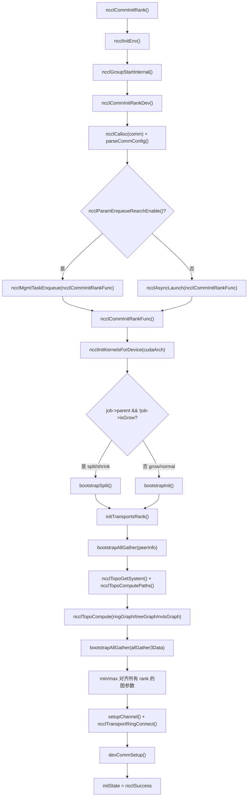
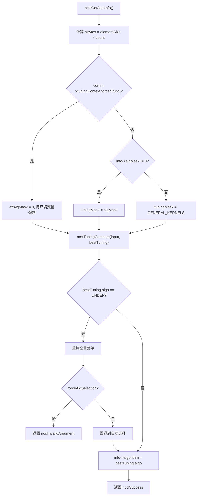
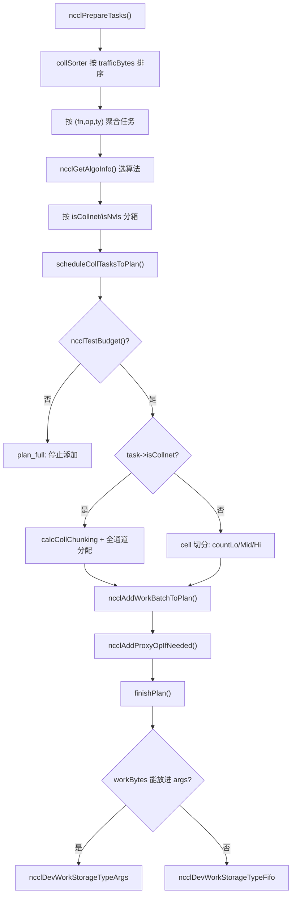

# 第 25 章：全景回顧與思考：一個 AllReduce 的終極旅程與設計精髓

上一章我們基於原始碼中的演進痕跡，展望了 NCCL 從固定集合操作走向可編程、從 host proxy 走向 GPU 直發、從註冊緩衝區走向對稱記憶體的架構趨勢。現在，是時候把這些趨勢放回一個具體的執行流中檢驗了。這一章不引入任何新程式碼，而是將第 3 章到第 10 章的端到端鏈路重新串聯起來——從 ncclAllReduce 這一行呼叫開始，一路走到結果寫回顯存。讀完之後，你應該能清晰地回答：一次 AllReduce 究竟經過了哪些函式？每個函式在哪個檔案、哪一行？遇到問題時該翻哪一章？

# 一、初始化：通訊域是怎麼「長」出來的

## 直覺模型

把通訊域想像成一個「群聊」。你調`ncclCommInitRank`就是「申請加入群聊」，NCCL 要在這時候把群成員名單（peerInfo）、誰和誰走哪條線（拓撲圖）、每條線開幾條流水線（channel）全部確定下來。**如果這一步錯了，後面所有通訊都是錯的**——就像群聊裡有人沒被拉進來，你發的訊息永遠少一個人收到。

## 資料結構與記憶體佈局

通訊域的核心結構是`ncclComm`，它的初始化分兩段：`commAlloc`負責「分配骨架」，`initTransportsRank`負責「填充血肉」。

`commAlloc`裡最值得注意的是**共享資源引用計數**的設計。當子通訊域（split/shrink 產生）複用父通訊域資源時，不是拷貝一份，而是共享同一個`ncclSharedResources`並遞增引用計數：

[FACT:src/init.cc:533-555]

```cpp
if (parent == NULL || !parent->shareResources) {
    struct ncclSharedResources* sharedRes;
    NEW_NOTHROW(sharedRes, ncclSharedResources);
    sharedRes->owner = comm;
    ...
    comm->sharedRes = sharedRes;
    sharedRes->refCount = 1;
    NCCLCHECK(ncclNetInit(comm));
    NCCLCHECK(ncclRmaInit(comm));
    NCCLCHECK(ncclGinInit(comm));
} else {
    comm->sharedRes = parent->sharedRes;
    ncclAtomicRefCountIncrement(&parent->sharedRes->refCount);
    NCCLCHECK(ncclNetInitFromParent(comm, parent));
    NCCLCHECK(ncclRmaInitFromParent(comm, parent));
}
```

這段程式碼的意圖很清晰：網路外掛、RMA、GIN 這些「重資源」只初始化一次，子通訊域直接借用。`refCount`用原子操作遞增，保證多執行緒下不會重複釋放。

另一個關鍵點是`commAlloc`裡對**通道的初始化**。所有通道先被標記為「未初始化」（`id = -1`），後續`setupChannel`才會真正填內容：

[FACT:src/init.cc:607-608]

```cpp
// Mark channels as non initialized.
for (int c = 0; c channels[c].id = -1;
```

這個`-1`是個哨兵值。任何程式碼如果誤用了未初始化的通道，`id == -1`會立刻暴露問題，而不是讀到一堆隨機記憶體。

## Step-by-Step：從 ncclCommInitRank 到 initTransportsRank

使用者呼叫`ncclCommInitRank`後，實際執行流是這樣的：

1. `ncclCommInitRank`先調`ncclInitEnv`載入環境外掛，再調`ncclGroupStartInternal`進入 group 語義（這是為了支援「一次 group 裡初始化多個通訊域」）。

2. 接著調`ncclCommInitRankDev`，它做參數校驗、分配`comm`結構、解析 config，然後**把真正的初始化工作丟給一個非同步 job**：

[FACT:src/init.cc:2923-2929]

```cpp
if (ncclParamEnqueueRearchEnable()) {
    NCCLCHECKGOTO(ncclMgmtTaskEnqueue((struct ncclAsyncJob*)job, ncclCommInitRankFunc, ncclCommInitJobFree, comm), res, fail);
} else {
    NCCLCHECKGOTO(ncclAsyncLaunch((struct ncclAsyncJob*)job, ncclCommInitRankFunc, NULL, ncclCommInitJobFree, comm), res, fail);
}
```

注意這裡的`ncclParamEnqueueRearchEnable()`分支——這是 NCCL 正在進行的「enqueue 重構」的痕跡。預設走`ncclAsyncLaunch`，開啟重構後走`ncclMgmtTaskEnqueue`。兩條路徑最終都會呼叫`ncclCommInitRankFunc`。

3. `ncclCommInitRankFunc`是初始化的主函式。它先設裝置、查 GPU 屬性、初始化 kernel：

[FACT:src/init.cc:2119-2127]

```cpp
timers[TIMER_INIT_TOTAL] = clockNano();
CUDACHECKGOTO(cudaSetDevice(cudaDev), res, fail);
CUDACHECKGOTO(cudaDeviceGetAttribute(&maxSharedMem, cudaDevAttrMaxSharedMemoryPerBlockOptin, cudaDev), res, fail);
CUDACHECKGOTO(cudaDeviceGetAttribute(&archMajor, cudaDevAttrComputeCapabilityMajor, cudaDev), res, fail);
CUDACHECKGOTO(cudaDeviceGetAttribute(&archMinor, cudaDevAttrComputeCapabilityMinor, cudaDev), res, fail);
cudaArch = 100 * archMajor + 10 * archMinor;

timers[TIMER_INIT_KERNELS] = clockNano();
NCCLCHECKGOTO(ncclInitKernelsForDevice(cudaArch, maxSharedMem, &maxLocalSizeBytes), res, fail);
```

`cudaArch = 100 * archMajor + 10 * archMinor`這個編碼方式很實用：sm90 變成 900，sm100 變成 1000，方便後續用整數比較判斷架構代際。

4. 然後根據是普通初始化還是 split/shrink/grow，走不同的 bootstrap 路徑：

[FACT:src/init.cc:2136-2191]

```cpp
if (job->parent && !job->isGrow) {
    // SPLIT/SHRINK: use bootstrapSplit
    ...
    NCCLCHECKGOTO(bootstrapSplit(comm->commHash, comm, job->parent, job->color, job->key, parentRanks), res, fail);
} else {
    // GROW or NORMAL INIT: use bootstrapInit
    ...
    NCCLCHECKGOTO(bootstrapInit(job->nId, (struct ncclBootstrapHandle*)job->commId, comm, job->parent), res, fail);
}
```

5. 最後調`initTransportsRank`，這是整個初始化裡最重的函式（約 800 行）。它內部做了兩次 AllGather：

- **AllGather1**：交換`ncclPeerInfo`（每個 rank 的裝置資訊、host hash、pid hash、GPU UUID 等）：

[FACT:src/init.cc:1236-1239]

```cpp
NCCLCHECKGOTO(ncclCalloc(&comm->peerInfo, nranks + 1), ret, fail); // Extra rank to represent CollNet root
NCCLCHECKGOTO(fillInfo(comm, comm->peerInfo + rank, comm->commHash), ret, fail);
NCCLCHECKGOTO(bootstrapAllGather(comm->bootstrap, comm->peerInfo, sizeof(struct ncclPeerInfo)), ret, fail);
COMPILER_ATOMIC_STORE(&comm->peerInfoValid, true, std::memory_order_release);
```

注意`nranks + 1`這個分配——多出來的一個位置是給 CollNet root 用的。`peerInfoValid`用 release 語意儲存，保證其他執行緒看到這個標誌時，peerInfo 的內容已經可見。

- **AllGather3**：交換拓撲計算結果（每個 rank 算出的 ring/tree 結構、頻寬、通道數等），然後取所有 rank 的**最小值**來對齊：

[FACT:src/init.cc:1687-1703]

```cpp
for (int i = 0; i nChannels = std::min(allGather3Data[i].graphInfo[a].nChannels, graphs[a]->nChannels);
        graphs[a]->sameChannels = std::min(allGather3Data[i].graphInfo[a].sameChannels, graphs[a]->sameChannels);
        graphs[a]->bwIntra = std::min(allGather3Data[i].graphInfo[a].bwIntra, graphs[a]->bwIntra);
        graphs[a]->bwInter = std::min(allGather3Data[i].graphInfo[a].bwInter, graphs[a]->bwInter);
        graphs[a]->typeIntra = std::max(allGather3Data[i].graphInfo[a].typeIntra, graphs[a]->typeIntra);
        graphs[a]->typeInter = std::max(allGather3Data[i].graphInfo[a].typeInter, graphs[a]->typeInter);
        graphs[a]->crossNic = std::max(allGather3Data[i].graphInfo[a].crossNic, graphs[a]->crossNic);
    }
    ...
}
```

頻寬取 min、類型取 max，這是「木桶原理」：整個通訊域的效能由最慢的那個 rank 決定。如果不對齊，不同 rank 可能算出不同的演算法選擇，導致通訊死鎖。

## 初始化流程圖



## 設計思考與踩坑

**為什麼初始化要非同步？**因為多 rank 初始化需要跨行程同步（bootstrap），如果同步執行會阻塞呼叫執行緒。非同步化後，使用者可以在 group 裡同時初始化多個通訊域，並行推進。

**踩坑點**：`initTransportsRank`末尾有一個 intra-node barrier：

[FACT:src/init.cc:1968-1971]

```cpp
/* Local intra-node barrier */
NCCLCHECKGOTO(bootstrapIntraNodeBarrier(comm->bootstrap, comm->localRankToRank, comm->localRank, comm->localRanks, comm->localRankToRank[0]), ret, fail);
```

這個 barrier 保證同機所有 rank 都完成了資源分配才繼續。如果某個 rank 卡在`devCommSetup`裡（比如顯示記憶體不足），其他 rank 會在這裡等死。生產環境遇到「初始化 hang 住」，第一件事就是看是不是某個 rank 的`devCommSetup`失敗了。

# 二、任務入隊：從 API 呼叫到內部任務物件

## 直覺模型

使用者調`ncclAllReduce`就像在餐廳點菜。`ncclEnqueueCheck`是服務生，它把你的訂單翻譯成廚房能看懂的「工單」（`ncclTaskColl`），放進`comm->planner`這個「訂單池」裡。**如果沒有這一層，NCCL 就沒法把多次呼叫合併成一次 kernel 啟動**——每次點菜都單獨開火，效率極低。

## 資料結構與記憶體佈局

任務入隊的核心是`ncclKernelPlanner`，它掛在`comm->planner`上。關鍵欄位包括：

- `collSorter`：按流量大小排序的集合通訊任務佇列
- `collTaskQueue`：最終排好序的任務佇列
- `peers[]`：每個 peer 的 send/recv 佇列（P2P 用）
- `wipPlan`：正在構建的 kernel plan

任務物件`ncclTaskColl`的關鍵欄位在`collTaskAppend`裡填充：

[FACT:src/enqueue/enqueue.cc:2800-2847]

```cpp
struct ncclTaskColl* t = ncclMemoryPoolAlloc(&comm->memPool_ncclTaskColl, &comm->memPermanent);
t->func = info->coll;
t->sendbuff = info->sendbuff;
t->recvbuff = info->recvbuff;
t->count = info->count;
t->root = info->root;
t->datatype = info->datatype;
size_t elementSize = ncclTypeSize(t->datatype);
if (t->func == ncclFuncAllGather || t->func == ncclFuncBroadcast) {
    t->count *= elementSize;
    t->datatype = ncclInt8;
    elementSize = 1;
}
t->trafficBytes = t->count * elementSize * ncclFuncTrafficPerByte(t->func, comm->nRanks);
...
t->aggIsolate = ncclCollConfigNeedAggIsolate(&info->collConfig) || info->collConfig.CTAPolicy != comm->config.CTAPolicy;
NCCL_CONFIG_SET(t, minCTAs, ncclParamMinCTAs(), info->collConfig.minCTAs, comm->config.minCTAs, 1, MAXCHANNELS);
NCCL_CONFIG_SET(t, maxCTAs, ncclParamMaxCTAs(), (std::min(info->collConfig.maxCTAs, comm->config.maxCTAs)), comm->config.maxCTAs, 1, MAXCHANNELS);
...
planner->nTasksColl += 1;
ncclTaskCollSorterInsert(&planner->collSorter, t, t->trafficBytes);
```

注意幾個細節：

1. **AllGather/Broadcast 的特殊處理**：把 count 乘以元素大小，datatype 改成`ncclInt8`。這是因為這兩個操作的語意是「搬運位元組」，不需要關心原始類型。

2. **`trafficBytes`的計算**：`ncclFuncTrafficPerByte`回傳每個位元組需要傳輸幾次。AllReduce 回傳 2（reduce + broadcast），AllGather 回傳 nRanks：

[FACT:src/enqueue/enqueue.cc:123-134]

```cpp
static inline int ncclFuncTrafficPerByte(ncclFunc_t func, int nRanks) {
  switch (func) {
  case ncclFuncAllReduce:
    return 2;
  case ncclFuncAllGather:
    return nRanks;
  case ncclFuncReduceScatter:
    return nRanks;
  default:
    return 1;
  }
}
```

3. **`NCCL_CONFIG_SET`巨集**：這是「env > per-call > comm」三級配置解析。環境變數優先級最高，其次是單次呼叫的 config，最後是通訊域級別的預設值。

## Step-by-Step：ncclAllReduce 的入隊路徑

1. `ncclEnqueueCheck`先做通訊域校驗和 group 進入：

[FACT:src/enqueue/enqueue.cc:3478-3495]

```cpp
ncclResult_t ncclEnqueueCheck(struct ncclInfo* info) {
  ncclResult_t ret = CommCheck(info->comm, info->opName, "comm");
  if (ret != ncclSuccess) return ncclGroupErrCheck(ret);
  if (info->comm->revokedFlag) {
    WARN("%s: communicator was revoked", info->opName);
    return ncclGroupErrCheck(ncclInvalidUsage);
  }
  ...
  NCCLCHECK(ncclGroupStartInternal());
  ret = ncclSuccess;
  int devOld = -1;
  NCCLCHECKGOTO(ncclCommEnsureReady(info->comm), ret, fail);
```

2. 然後調`taskAppend`，它根據操作類型分派：

[FACT:src/enqueue/enqueue.cc:3337-3348]

```cpp
static ncclResult_t taskAppend(struct ncclComm* comm, struct ncclInfo* info) {
  ncclFunc_t collAPI = info->coll;
  bool hasLaunchCompletionEvent = ncclInfoHasLaunchCompletionEvent(info);

  if (ncclParamEnqueueRearchEnable()) {
    NCCLCHECK(rawTaskAppend(comm, info));
  } else if (info->coll == ncclFuncSend || info->coll == ncclFuncRecv) {
    NCCLCHECK(p2pTaskAppend(comm, info, info->coll, collAPI, (void*)info->recvbuff, info->count, info->datatype, info->root, true));
  } else if (info->coll == ncclFuncPutSignal || info->coll == ncclFuncSignal || info->coll == ncclFuncWaitSignal) {
    NCCLCHECK(rmaTaskAppend(comm, info));
  } else {
    ...
  }
}
```

對於 AllReduce，走的是最後的`else`分支，最終調`collTaskAppend`。

3. `collTaskAppend`把任務插入`collSorter`，按`trafficBytes`排序。排序的目的是讓排程器優先處理大任務，避免小任務碎片化通道資源。

## 任務入隊資料流

```mermaid
flowchart LR
    api["ncclAllReduce()"] --> info["ncclInfo 填充"]
    info --> enq["ncclEnqueueCheck()"]
    enq --> check["CommCheck + ncclCommEnsureReady()"]
    check --> append["taskAppend()"]
    append --> coll["collTaskAppend()"]
    coll --> task["ncclTaskColl 分配"]
    task --> sorter["ncclTaskCollSorterInsert(collSorter)"]
    sorter --> prepare["ncclPrepareTasks()"]
    prepare --> algo["ncclGetAlgoInfo() 选算法"]
    algo --> schedule["scheduleCollTasksToPlan()"]
    schedule --> plan["ncclKernelPlan"]
```



## 設計思考與踩坑

**為什麼用`ncclMemoryPoolAlloc`而不是`malloc`？**因為任務物件生命週期短、分配頻繁。記憶體池避免了每次`malloc/free`的系統呼叫開銷。注意`ncclMemoryPoolAlloc`的第二個參數是`&comm->memPermanent`——這意味著任務物件在通訊域銷毀時才統一釋放，而不是每個任務單獨釋放。

**踩坑點**：`ncclPrepareTasks`裡有一個「聚合」邏輯，把大小相近（4 倍以內）的任務合併：

[FACT:src/enqueue/enqueue.cc:506-512]

```cpp
// We aggregate operations that are within 4X size of each other.
while (aggEnd != nullptr && aggEnd->trafficBytes trafficBytes && !aggBeg->aggIsolate && !aggEnd->aggIsolate) {
    agg.count += aggEnd->count;
    agg.trafficBytes += aggEnd->trafficBytes;
    aggEnd = aggEnd->next;
}
```

這個聚合是為了讓演算法選擇更穩定——如果每個小任務單獨選演算法，可能選出一堆不同的演算法，導致 kernel 碎片化。但`aggIsolate`標誌會阻止聚合，用於那些「必須單獨排程」的任務（比如帶 per-call config 的）。

# 三、演算法選型：代價模型怎麼挑出最佳解

## 直覺模型

演算法選型就像導航軟體選路線。NCCL 的「代價模型」（tuning 模組）會估算每種演算法/協定組合在給定訊息大小和拓撲下的耗時，然後選最快的那個。**如果沒有代價模型，NCCL 只能寫死一套演算法，在小訊息上浪費頻寬、在大訊息上浪費延遲**。

## 資料結構與記憶體佈局

演算法選型的入口是`ncclGetAlgoInfo`：

[FACT:src/enqueue/enqueue.cc:2159-2185]

```cpp
ncclResult_t ncclGetAlgoInfo(struct ncclComm* comm, struct ncclTaskColl* info, int collNetSupport, int nvlsSupport,
                             int numPipeOps, ncclSimInfo_t* simInfo) {
  size_t elementSize = ncclTypeSize(info->datatype);
  size_t nBytes = elementSize * ncclFuncMaxSendRecvCount(info->func, comm->nRanks, info->count);
  info->algorithm = NCCL_ALGO_UNDEF;
  info->protocol = NCCL_PROTO_UNDEF;
  struct ncclTuningInput_t input;
  input.comm = comm;
  input.tuningMask = NCCL_TUNING_MASK_GENERAL_KERNELS;
  uint64_t effAlgMask = comm->tuningContext.forced[info->func] ? 0 : info->algMask;
  if (effAlgMask != 0) {
    input.tuningMask = effAlgMask & NCCL_TUNING_MASK_GENERAL_KERNELS;
  }
  input.CTAPolicy = info->CTAPolicy;
  input.func = info->func;
  input.redOp = info->opHost;
  input.devRedOp = info->opDev.op;
  input.datatype = info->datatype;
  input.nBytes = nBytes;
  input.numPipeOps = numPipeOps;
  input.collNetSupport = collNetSupport;
  input.nvlsSupport = nvlsSupport;
  input.count = info->count;
  NCCLCHECK(ncclGetRegBuff(comm, info, &input.regBuff));
  ...
}
```

注意`effAlgMask`的邏輯：如果環境變數強制指定了演算法（`comm->tuningContext.forced[info->func]`非零），則忽略使用者的`algMask`，用環境變數的。這是「env > per-call」優先級的體現。

然後調`ncclTuningCompute`得到最佳結果：

[FACT:src/enqueue/enqueue.cc:2213-2224]

```cpp
} else {
    NCCLCHECK(ncclTuningCompute(&input, &bestTuning));
}
INFO(NCCL_TUNING, "Best tuning, algorithm, %s, protocol, %s", ncclAlgoToString(bestTuning.algo), ncclProtoToString(bestTuning.proto));
info->algorithm = bestTuning.algo;
info->protocol = bestTuning.proto;
info->nWarps = bestTuning.nWarps;
if (simInfo) simInfo->estimatedTime = bestTuning.timeUs;
TRACE(NCCL_COLL, "%ld Bytes -> Algo %d proto %d time %f", nBytes, info->algorithm, info->protocol, bestTuning.timeUs);
info->nMaxChannels = bestTuning.maxChannels == 0 ? info->nMaxChannels : bestTuning.maxChannels;
```

## Step-by-Step：一次 AllReduce 的演算法選擇

假設 8 卡單機、訊息大小 1MB、AllReduce：

1. `nBytes = 1MB`，`numPipeOps`是當前 plan 裡已有的任務數。

2. `collNetSupport`和`nvlsSupport`由`ncclGetCollNetSupport`和`ncclNvlsTransportEnabled`決定。

3. `ncclTuningCompute`遍歷所有可用的 (algo, proto) 組合，用代價模型估算時間。

4. 對於 1MB 單機場景，通常 NVLS 或 Tree+LL128 會勝出。

5. 結果寫回`info->algorithm`、`info->protocol`、`info->nWarps`。

## 演算法選擇決策圖



## 設計思考與踩坑

**為什麼演算法選擇要「跨 rank 對齊」？**因為不同 rank 如果選了不同演算法，通訊模式就不匹配，會死鎖。所以`initTransportsRank`裡用 min/max 對齊了所有圖參數，保證每個 rank 的代價模型輸入一致。

**踩坑點**：`ncclGetAlgoInfo`裡有一個「重算」邏輯——如果使用者指定了`algMask`但沒有任何演算法匹配，會先靜默重算全量選單，再判斷是硬錯誤還是軟回退：

[FACT:src/enqueue/enqueue.cc:2192-2208]

```cpp
NOWARN(ncclTuningCompute(&input, &bestTuning), NCCL_TUNING);
if (bestTuning.algo == NCCL_ALGO_UNDEF) {
    input.tuningMask = NCCL_TUNING_MASK_GENERAL_KERNELS;
    bestTuning = NCCL_TUNING_RESULT_INIT;
    bestTuning.maxChannels = 0;
    NCCLCHECK(ncclTuningCompute(&input, &bestTuning));
    if (info->forceAlgSelection) {
        WARN("algSelection: no algorithm in the selected set is available for %s", ncclFuncToString(info->func));
        return ncclInvalidArgument;
    }
    INFO(NCCL_TUNING, "algSelection: selected set unavailable for %s; falling back to automatic selection", ncclFuncToString(info->func));
}
```

`NOWARN`巨集臨時抑制警告，因為「沒有演算法匹配」可能是正常情況（使用者選的集合確實不可用）。只有`forceAlgSelection`為真時才報錯。

# 四、任務排程與 kernel plan 構建

## 直覺模型

任務排程就像把一堆訂單分配到幾條流水線上。`scheduleCollTasksToPlan`決定每個任務用幾條通道、每條通道處理多少資料，最終生成一個`ncclKernelPlan`——這就是要傳給 GPU 的「工單」。

## 資料結構與記憶體佈局

`ncclKernelPlan`的核心欄位：

- `channelMask`：這個 plan 用到哪些通道（位圖）
- `workBytes`：所有 work 結構的總位元組數
- `nWorkBatches`：work batch 數量
- `kernelArgs`：kernel 啟動參數
- `workStorageType`：work 資料存哪裡（args/fifo/persistent）

`finishPlan`決定 work 資料的儲存位置：

[FACT:src/enqueue/enqueue.cc:244-255]

```cpp
// If we can fit everything into the kernel args we do so.
if (sizeof(ncclDevKernelArgs) + batchBytes + workBytes workArgsBytes) {
    plan->workStorageType = ncclDevWorkStorageTypeArgs;
}
plan->kernelArgsSize = sizeof(struct ncclDevKernelArgs) + batchBytes;
plan->kernelArgsSize += (plan->workStorageType == ncclDevWorkStorageTypeArgs) ? workBytes : 0;
plan->kernelArgsSize = alignUp(plan->kernelArgsSize, 16);
plan->kernelArgs = (struct ncclDevKernelArgs*)ncclMemoryStackAlloc(&comm->memScoped, plan->kernelArgsSize, /*align=*/16);
plan->kernelArgs->comm = comm->devComm;
plan->kernelArgs->channelMask = plan->channelMask;
plan->kernelArgs->workStorageType = plan->workStorageType;
```

三種儲存類型的權衡：

- **Args**：最快，但 kernel 參數大小有限（通常 4KB）
- **Fifo**：環形緩衝區，適合中等大小
- **Persistent**：獨立顯存分配，適合 CUDA Graph 場景

## Step-by-Step：scheduleCollTasksToPlan 的通道分配

1. 先估算這個 plan 能裝多少任務：

[FACT:src/enqueue/enqueue.cc:654-687]

```cpp
do {
    size_t workBytes = 0;
    struct ncclTaskColl* task = ncclIntruQueueHead(&planner->collTaskQueue);
    struct ncclWorkList* workNode = ncclIntruQueueHead(&planner->collWorkQueue);
    while (task != nullptr) {
        int nBatches = divUp(nPlanColls, 4); // Rough guess: 4 colls per batch.
        if (!ncclTestBudget(budget, nBatches, workBytes + workNode->size)) goto plan_full;
        bool taskAggIsolate = task->aggIsolate;
        if (taskAggIsolate && nPlanColls > 0) goto plan_full;
        nPlanColls += 1;
        workBytes += workNode->size;
        int kind = 2 * task->isCollnet + task->isNvls;
        trafficBytes[kind] += std::max(MinTrafficPerChannel, task->trafficBytes);
        ...
    }
plan_full:;
} while (0);
```

2. 然後按流量把通道分配給任務。對於非 CollNet 任務，用「cell」為單位切分：

[FACT:src/enqueue/enqueue.cc:742-759]

```cpp
int trafficPerByte = ncclFuncTrafficPerByte(task->func, comm->nRanks);
if (task->protocol == NCCL_PROTO_LL) trafficPerByte *= 4;
size_t cellSize = divUp(divUp(MinTrafficPerChannel, (size_t)trafficPerByte), 16) * 16;
int elementsPerCell = cellSize / elementSize;
size_t cells = divUp(task->count * elementSize, cellSize);
size_t trafficPerElement = elementSize * trafficPerByte;
size_t trafficPerCell = cellSize * trafficPerByte;
size_t cellsPerChannel = std::min(cells, divUp(trafficPerChannel, trafficPerCell));
size_t cellsLo;
if (channelId + 1 == nMaxChannels[kind]) {
    cellsLo = cells;
} else {
    cellsLo = std::min(cells, divUp((trafficPerChannel - currentTraffic), trafficPerCell));
}
int nMidChannels = (cells - cellsLo) / cellsPerChannel;
size_t cellsHi = (cells - cellsLo) % cellsPerChannel;
int nChannels = (cellsLo != 0 ? 1 : 0) + nMidChannels + (cellsHi != 0 ? 1 : 0);
```

這段程式碼把資料切成「低/中/高」三段：`countLo`、`countMid`、`countHi`。低段和高段是邊界通道，中段是中間通道。這樣切分是為了讓每條通道處理的資料量盡量均勻。

3. 最後調`calcCollChunking`計算每條通道的 chunk 大小：

[FACT:src/enqueue/enqueue.cc:2228-2275]

```cpp
static ncclResult_t calcCollChunking(struct ncclComm* comm, struct ncclTaskColl* info, int nChannels, size_t nBytes,
                                     uint32_t* outChunkSize, uint32_t* outDirectFlags, struct ncclProxyOp* proxyOp) {
  ncclPattern_t pattern;
  size_t grainSize = ncclProtoGrainSize(info->protocol);
  switch (info->func) {
  case ncclFuncAllReduce:
    pattern = info->algorithm == NCCL_ALGO_NVLS           ? ncclPatternNvls :
              info->algorithm == NCCL_ALGO_NVLS_TREE      ? ncclPatternNvlsTree :
              info->algorithm == NCCL_ALGO_COLLNET_DIRECT ? ncclPatternCollnetDirect :
              info->algorithm == NCCL_ALGO_COLLNET_CHAIN  ? ncclPatternCollnetChain :
              info->algorithm == NCCL_ALGO_TREE           ? ncclPatternTreeUpDown :
                                                            ncclPatternRingTwice;
    break;
  ...
  }
  int stepSize = comm->buffSizes[info->protocol] / NCCL_STEPS;
  int chunkSteps = (info->protocol == NCCL_PROTO_SIMPLE && info->algorithm == NCCL_ALGO_RING) ? info->chunkSteps : 1;
  int sliceSteps = (info->protocol == NCCL_PROTO_SIMPLE && info->algorithm == NCCL_ALGO_RING) ? info->sliceSteps : 1;
  int chunkSize = stepSize * chunkSteps;
  if (info->protocol == NCCL_PROTO_LL) chunkSize /= 2;
  if (info->protocol == NCCL_PROTO_LL128) chunkSize = (chunkSize / NCCL_LL128_LINEELEMS) * NCCL_LL128_DATAELEMS;
  ...
}
```

## 排程流程圖



## 設計思考與踩坑

**為什麼 CollNet 任務單獨處理？**因為 CollNet 用的是網路交換器做歸約，通道分配邏輯和普通 ring/tree 完全不同。CollNet 任務直接佔用所有可用通道，而普通任務需要按流量切分。

**踩坑點**：`ncclTestBudget`的估算用了一個粗略公式`nBatches = divUp(nPlanColls, 4)`——假設每 4 個集合操作產生一個 batch。這個估算可能不準，所以後面還有精確檢查：

[FACT:src/enqueue/enqueue.cc:711-714]

```cpp
// Ensure room for worst case of one new batch per channel
if (!ncclTestBudget(budget, plan->nWorkBatches + nChannels, plan->workBytes + workNode->size)) {
    return ncclSuccess;
}
```

如果精確檢查失敗，直接返回（不報錯），讓上層再開一個新 plan。

# 五、Kernel 啟動與裝置側執行

## 直覺模型

Kernel 啟動就像把工單交給工廠。`ncclLaunchKernel`把`ncclKernelPlan`翻譯成 CUDA kernel 啟動參數，然後調`cuLaunchKernelEx`。裝置側 kernel 收到工單後，按演算法執行資料搬運。

## 資料結構與記憶體佈局

`ncclLaunchKernel`的關鍵步驟：

[FACT:src/enqueue/enqueue.cc:1886-1909]

```cpp
ncclResult_t ncclLaunchKernel(struct ncclComm* comm, struct ncclKernelPlan* plan) {
  ncclResult_t ret = ncclSuccess;
  struct ncclKernelPlanner* planner = &comm->planner;
  int nChannels = countOneBits(plan->channelMask);
  void* sym = plan->kernelFn;
  dim3 grid = {(unsigned)nChannels, 1, 1};
  dim3 block = {(unsigned)plan->threadPerBlock, 1, 1};
  int smem = plan->isSymColl ? plan->kernelDynSmem : ncclShmemDynamicSize(comm->cudaArch);
  cudaStream_t launchStream = planner->streams->stream;
  ...
  void* extra[] = {CU_LAUNCH_PARAM_BUFFER_POINTER, plan->kernelArgs, CU_LAUNCH_PARAM_BUFFER_SIZE, &plan->kernelArgsSize, CU_LAUNCH_PARAM_END};
  ...
  CUfunction fn;
  CUDACHECKGOTO(cudaGetFuncBySymbol(&fn, sym), ret, do_return);
```

注意`grid.x = nChannels`——每個通道一個 block。`block.x = plan->threadPerBlock`——每個 block 的執行緒數由任務決定。

## Step-by-Step：從 plan 到 kernel 啟動

1. 先調`uploadWork`把 work 資料寫到目標位置（args/fifo/persistent）：

[FACT:src/enqueue/enqueue.cc:1365-1407]

```cpp
static ncclResult_t uploadWork(struct ncclComm* comm, struct ncclKernelPlan* plan) {
  if (plan->isSymColl || plan->isCeColl || plan->isRma) return ncclSuccess;
  size_t workBytes = plan->workBytes;
  size_t batchBytes = plan->nWorkBatches * sizeof(struct ncclDevWorkBatch);
  void* fifoBufHost;
  uint32_t fifoCursor, fifoMask;
  switch (plan->workStorageType) {
  case ncclDevWorkStorageTypeArgs:
    plan->kernelArgs->workBuf = nullptr;
    fifoBufHost = (void*)plan->kernelArgs;
    fifoCursor = sizeof(ncclDevKernelArgs) + batchBytes;
    fifoMask = ~0u;
    break;
  case ncclDevWorkStorageTypeFifo:
    fifoBufHost = comm->workFifoBuf;
    fifoCursor = comm->workFifoProduced;
    fifoMask = comm->workFifoBytes - 1;
    NCCLCHECK(waitWorkFifoAvailable(comm, fifoCursor + workBytes));
    plan->kernelArgs->workBuf = comm->workFifoBufDev;
    break;
  ...
  }
}
```

2. 然後構造 CUDA launch 屬性。對於 sm90+，會設定 cluster 維度：

[FACT:src/enqueue/enqueue.cc:1929-1936]

```cpp
if (clusterSize) {
    // Grid dimension must be divisible by clusterSize
    if (grid.x % clusterSize) clusterSize = 1;
    launchAttrs[attrs].id = CU_LAUNCH_ATTRIBUTE_CLUSTER_DIMENSION;
    launchAttrs[attrs++].value.clusterDim = {clusterSize, 1, 1};
    launchAttrs[attrs].id = CU_LAUNCH_ATTRIBUTE_CLUSTER_SCHEDULING_POLICY_PREFERENCE;
    launchAttrs[attrs++].value.clusterSchedulingPolicyPreference = CU_CLUSTER_SCHEDULING_POLICY_SPREAD;
}
```

3. 最後調`cuLaunchKernelEx`：

[FACT:src/enqueue/enqueue.cc:1992]

```cpp
CUCHECKGOTO(cuLaunchKernelEx(&launchConfig, fn, nullptr, extra), ret, do_return);
```

## 裝置側：runRing 的執行

裝置側 kernel 收到工單後，根據演算法呼叫對應的`RunWorkColl`特化。以 Ring AllReduce 為例：

[FACT:src/device/all_reduce.h:14-83]

```cpp
template 
__device__ __forceinline__ void runRing(int tid, int nthreads, struct ncclDevWorkColl* work) {
  ncclRing* ring = &ncclShmem.channel.ring;
  int ringIx = ring->index;
  const int nranks = ncclShmem.comm.nRanks;
  ssize_t gridOffset;
  ssize_t channelCount;
  ssize_t chunkCount;
  ncclCollCbdPart(work, ncclShmem.channelId, Proto::Id, sizeof(T), (ssize_t*)nullptr, &gridOffset, &channelCount, &chunkCount);
  const ssize_t loopCount = nranks * chunkCount;
  ...
  Primitives, 1, Proto, 0> prims(tid, nthreads, &ring->prev, &ring->next, work->sendbuff, work->recvbuff, work->redOpArg, 0, 0, 0, work);

  for (ssize_t elemOffset = 0; elemOffset  int { return r - (r >= nranks ? nranks : 0); };

    // step 0: push data to next GPU
    chunk = modRanks(ringIx + nranks - 1);
    chunkOffset = chunk * chunkCount;
    offset = gridOffset + elemOffset + chunkOffset;
    nelem = (int)min(chunkCount, remCount - chunkOffset);
    prims.directSend(offset, offset, nelem);

    // k-2 steps: reduce and copy to next GPU
    for (int j = 2; j >Plan: ncclLaunchPrepare()
    Plan->>Plan: scheduleCollTasksToPlan()
    Plan->>Plan: finishPlan() 分配 kernelArgs
    Host->>Plan: ncclLaunchKernelBefore_NoUncapturedCuda()
    Plan->>Plan: uploadWork() 写 work 数据
    Host->>CUDA: cuLaunchKernelEx(fn, grid, block, smem)
    CUDA->>Kernel: 启动 nChannels 个 block
    Kernel->>Kernel: runRing() 执行 Ring AllReduce
    Host->>Plan: ncclLaunchKernelAfter_NoCuda()
    Plan->>Proxy: hostStreamPlanTask() + uploadProxyOps()
    Proxy->>Proxy: ncclProxyStart() 推进网络 I/O
    Kernel-->>Host: kernel 完成
    Host->>Plan: ncclLaunchFinish()
    Plan->>Plan: reclaimPlan() 释放资源
```

## 設計思考與踩坑

**為什麼用`cuLaunchKernelEx`而不是`cudaLaunchKernel`？**因為需要設定 launch 屬性（cluster 維度、mem sync domain、launch completion event）。這些屬性在 CUDA 12.0+ 才支援。

**踩坑點**：`uploadWork`裡對 persistent 模式的處理很複雜——它需要分配顯存、拷貝數據、記錄事件，還要在 CUDA Graph 捕獲模式下正確工作：

[FACT:src/enqueue/enqueue.cc:1445-1478]

```cpp
CUDACHECKGOTO(cudaThreadExchangeStreamCaptureMode(&mode), result, fail);
NCCLCHECKGOTO(ncclStrongStreamAcquire(ncclCudaGraphNone(comm->config.graphUsageMode), &comm->sharedRes->deviceStream, /*concurrent=*/false, &deviceStream), result, fail);
if (comm->memPool) {
    CUDACHECKGOTO(cudaMallocAsync(&fifoBufDev, workBytes, comm->memPool, deviceStream), result, fail);
} else {
    CUDACHECKGOTO(cudaMalloc(&fifoBufDev, workBytes), result, fail);
}
plan->workBufPersistent = fifoBufDev;
plan->kernelArgs->workBuf = fifoBufDev;
CUDACHECKGOTO(cudaMemcpyAsync(fifoBufDev, fifoBufHost, workBytes, cudaMemcpyDefault, deviceStream), result, fail);
cudaEvent_t memcpyDone;
CUDACHECKGOTO(cudaEventCreateWithFlags(&memcpyDone, cudaEventDisableTiming), result, fail);
CUDACHECKGOTO(cudaEventRecord(memcpyDone, deviceStream), result, fail);
```

`cudaThreadExchangeStreamCaptureMode`是為了在捕獲模式下臨時切換到 relaxed 模式，允許分配顯存。拷貝完成後記錄事件，後續通過`ncclCommPollEventCallbacks`回收。

# 六、生產避坑指南

## 坑 1：初始化 hang 住

**現象**：`ncclCommInitRank`卡住不返回。

**排查**：看`NCCL_DEBUG=INFO`日誌，找到最後一個打印的 rank。如果所有 rank 都打印了 "Init START" 但沒有 "Init COMPLETE"，說明卡在`initTransportsRank`裡。

**常見原因**：

- 某個 rank 的`devCommSetup`失敗（顯存不足、CUDA 錯誤）
- bootstrap 網絡不通（防火牆、端口佔用）
- 不同 rank 的 NCCL 版本不一致

**源碼依據**：`initTransportsRank`末尾的 intra-node barrier 會等待所有本機 rank：

[FACT:src/init.cc:1968-1971]

```cpp
/* Local intra-node barrier */
NCCLCHECKGOTO(bootstrapIntraNodeBarrier(comm->bootstrap, comm->localRankToRank, comm->localRank, comm->localRanks, comm->localRankToRank[0]), ret, fail);
```

## 坑 2：work FIFO 溢出

**現象**：kernel 啟動後 hang 住，或者報`ncclInternalError`。

**原因**：`waitWorkFifoAvailable`在等 FIFO 空間，但消費端（kernel）沒有推進。

[FACT:src/enqueue/enqueue.cc:1333-1349]

```cpp
static ncclResult_t waitWorkFifoAvailable(struct ncclComm* comm, uint32_t desiredProduced) {
  bool hasRoom = (desiredProduced - comm->workFifoConsumed) workFifoBytes;
  if (!hasRoom) {
    while (true) {
      // Check abort flag to break deadlock when abort is signaled
      if (COMPILER_ATOMIC_LOAD(comm->abortFlag, std::memory_order_acquire)) {
        return ncclInternalError;
      }
      NCCLCHECK(ncclCommPollEventCallbacks(comm, /*waitSome=*/true));
      hasRoom = (desiredProduced - comm->workFifoConsumed) workFifoBytes;
      if (hasRoom) break;
      std::this_thread::yield();
    }
  }
  return ncclSuccess;
}
```

注意 abort flag 檢查——這是唯一的逃生通道。如果 abort 也沒設，就會死循環。

**避坑**：調大`NCCL_WORK_FIFO_BYTES`，或者減少單次 group 裡的操作數。

## 坑 3：CUDA Graph 捕獲失敗

**現象**：在 CUDA Graph 捕獲期間調 NCCL，報 "operation not permitted"。

**原因**：捕獲模式下不能做某些 CUDA 操作（如`cudaMalloc`）。NCCL 用`cudaThreadExchangeStreamCaptureMode`臨時切換模式，但不是所有操作都能繞過。

**源碼依據**：`uploadWork`的 persistent 分支：

[FACT:src/enqueue/enqueue.cc:1445]

```cpp
CUDACHECKGOTO(cudaThreadExchangeStreamCaptureMode(&mode), result, fail);
```

**避坑**：用`NCCL_GRAPH_MIXING_SUPPORT=1`開啟 graph 混合模式，或者預分配 work buffer。

# 本章小結

這一章我們把一次 AllReduce 的完整鏈路重新走了一遍：

1. **初始化**：`ncclCommInitRank` → `ncclCommInitRankFunc` → `initTransportsRank`，建立通信域、搜索拓撲、對齊圖參數。

2. **任務入隊**：`ncclEnqueueCheck` → `taskAppend` → `collTaskAppend`，把 API 調用翻譯成`ncclTaskColl`。

3. **算法選型**：`ncclGetAlgoInfo` → `ncclTuningCompute`，用代價模型選出最優 (algo, proto)。

4. **任務調度**：`ncclPrepareTasks` → `scheduleCollTasksToPlan` → `finishPlan`，把任務分配到通道，生成`ncclKernelPlan`。

5. **Kernel 啟動**：`ncclLaunchKernel` → `cuLaunchKernelEx`，把 plan 翻譯成 CUDA 啟動參數。

6. **設備側執行**：`runRing` / `runTreeUpDown` / `runNvls`，按算法執行數據搬運。

# 本章思考與自測

Q1: 如果把`initTransportsRank`裡 AllGather3 之後的 min/max 對齊邏輯（L1690-L1698）去掉，在什麼場景下會導致通信死鎖？為什麼？

**參考解析**：這段邏輯保證所有 rank 對每個算法的`nChannels`、`bwIntra`、`bwInter`等參數達成一致。如果去掉，每個 rank 會用自己的本地拓撲計算結果。考慮一個異構集群：rank 0 在 8 卡 NVLink 機器上，rank 8 在 4 卡 PCIe 機器上。rank 0 算出 ring 有 8 條通道，rank 8 算出 4 條。當它們執行 Ring AllReduce 時，rank 0 會等 rank 8 在 8 條通道上發數據，但 rank

至此，我們完成了對一次 AllReduce 完整鏈路的回顧。從初始化、拓撲搜索、算法選擇、任務入隊、kernel 啟動，到設備側執行與網絡傳輸，每個環節都對應著前面章節的深入剖析。這份鏈路圖不僅是理解 NCCL 的骨架，也是排查問題的索引：初始化失敗查第 3、4 章，算法選錯查第 5 章，任務入隊報錯查第 6、7 章，kernel 啟動失敗查第 8 章，設備側 hang 查第 9、10 章，網絡問題查第 12、13 章。隨著 NCCL 向可編程通信、GPU 直發和對稱內存演進，這條鏈路還將繼續延伸——而你已經掌握了追蹤它的方法。
