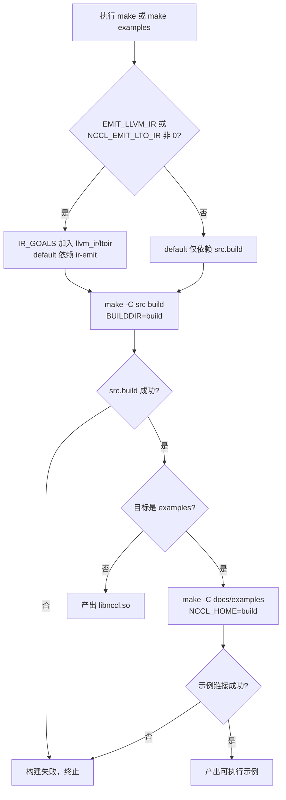
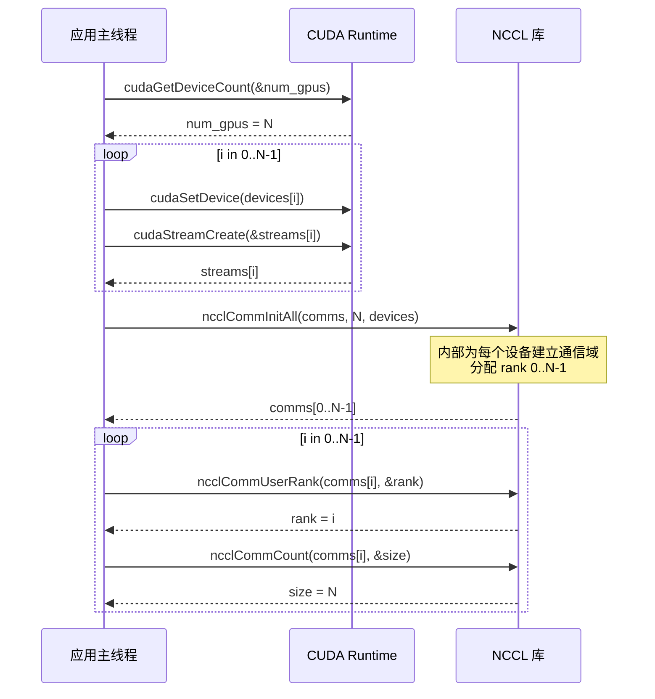
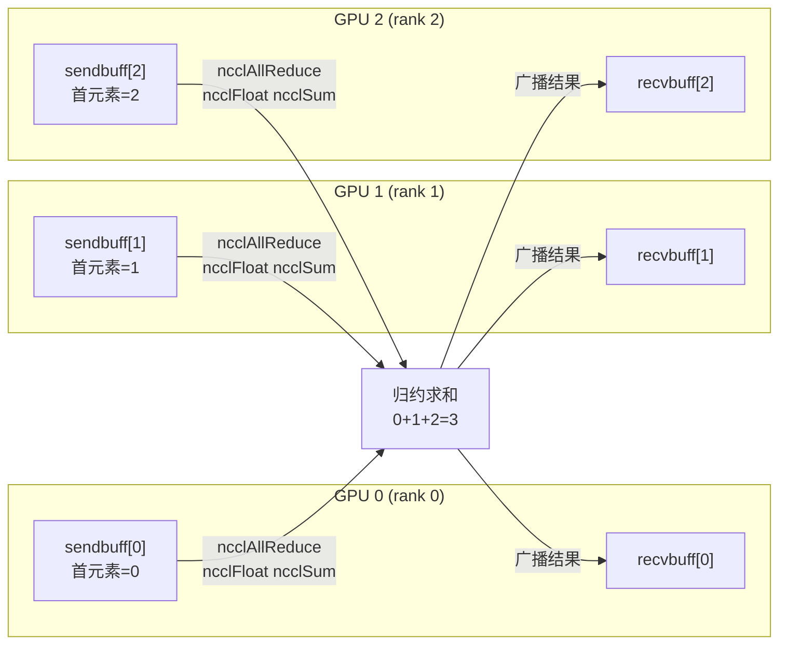
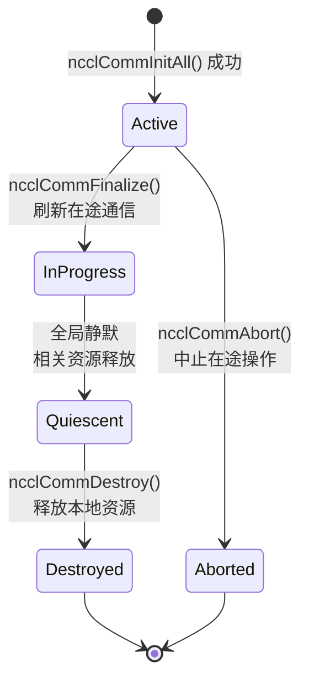

# 第 1 章：运行与现象：从一个 AllReduce 开始看外部行为

在深入任何内核代码之前，我们先把 NCCL 跑起来，观察它对外暴露的行为。这一章不读内核，只做一件事：建立一个可验证的参照系——任何后续的内部机制分析，最终都要能解释这里看到的外部行为。

## 1.1 从构建入口看 NCCL 的工程结构

### 直觉模型

构建系统就像一栋大楼的施工图纸：它不决定楼里住谁，但决定了有哪些房间、门朝哪开。如果构建入口混乱，你连"跑起来"这第一步都迈不出去。NCCL 同时提供 Makefile 和 CMake 两套构建入口，理解它们的差异，是理解这个项目工程组织的第一步。

### 两套构建入口的结构

顶层 `Makefile` 是一个极薄的调度层，它本身不编译任何源文件，而是把工作转发给各个子目录的 Makefile。

[FACT:Makefile:44-45](https://github.com/NVIDIA/nccl/blob/12df1a11afad322be5a204a2db890161cbf8131d/Makefile#L44-L45) 定义了 `src.%` 模式规则，把 `src.build`、`src.install` 等目标转发给 `src/Makefile`：

```
src.%:
	${MAKE} -C src $* BUILDDIR=${ABSBUILDDIR}
```

[FACT:Makefile:47-48](https://github.com/NVIDIA/nccl/blob/12df1a11afad322be5a204a2db890161cbf8131d/Makefile#L47-L48) 定义了 `examples` 目标，它依赖 `src.build`，然后进入 `docs/examples` 目录构建示例：

```
examples: src.build
	${MAKE} -C docs/examples NCCL_HOME=${ABSBUILDDIR}
```

注意这里的依赖关系：示例的构建依赖 `src.build` 先完成，因为示例需要链接 NCCL 库，而 `NCCL_HOME` 环境变量把构建产物目录传给示例的 Makefile。这就是"先有库，再有示例"的构建顺序约束。

[FACT:Makefile:29](https://github.com/NVIDIA/nccl/blob/12df1a11afad322be5a204a2db890161cbf8131d/Makefile#L29) 列出了所有可清理的目标集合：

```
TARGETS := src pkg nccl4py ir
```

[FACT:Makefile:30](https://github.com/NVIDIA/nccl/blob/12df1a11afad322be5a204a2db890161cbf8131d/Makefile#L30) 用 GNU Make 的替换引用语法 `${TARGETS:%=%.clean}` 把 `src pkg nccl4py ir` 展开成 `src.clean pkg.clean nccl4py.clean ir.clean`，一次性定义所有清理目标。这是 Makefile 里常见的"用数据驱动规则"技巧——新增一个模块只需往 `TARGETS` 里加一个词。

### CMake 入口：版本号从哪来

CMake 入口比 Makefile 复杂得多，因为它要处理跨平台、CUDA 版本探测、架构选择等。我们只关注与"跑起来"直接相关的部分。

[FACT:CMakeLists.txt:5-11](https://github.com/NVIDIA/nccl/blob/12df1a11afad322be5a204a2db890161cbf8131d/CMakeLists.txt#L5-L11) 展示了版本号的来源——它不是硬编码在 CMakeLists.txt 里，而是从 `makefiles/version.mk` 读取后用正则提取：

```cmake
file(READ ${CMAKE_SOURCE_DIR}/makefiles/version.mk VERSION_CONTENT)
string(REGEX REPLACE ".*NCCL_MAJOR[ ]*:=[ ]*([0-9]+).*" "\\1" NCCL_MAJOR "${VERSION_CONTENT}")
...
math(EXPR NCCL_VERSION_CODE "(${NCCL_MAJOR} * 10000) + (${NCCL_MINOR} * 100) + ${NCCL_PATCH}")
```

[INFERENCE] 把版本号集中放在 `version.mk` 里，让 Makefile 和 CMake 两套构建系统共享同一个版本源，避免"两套构建系统版本号不一致"这个经典工程陷阱。`NCCL_VERSION_CODE` 的计算公式 `MAJOR*10000 + MINOR*100 + PATCH` 与头文件里的 `NCCL_VERSION` 宏保持一致。

[FACT:CMakeLists.txt:14-20](https://github.com/NVIDIA/nccl/blob/12df1a11afad322be5a204a2db890161cbf8131d/CMakeLists.txt#L14-L20) 把这些版本号通过 `add_compile_definitions` 注入到所有 C++ 源文件：

```cmake
add_compile_definitions(
    NCCL_USE_CMAKE
    NCCL_MAJOR=${NCCL_MAJOR}
    NCCL_MINOR=${NCCL_MINOR}
    NCCL_PATCH=${NCCL_PATCH}
    NCCL_VERSION_CODE=${NCCL_VERSION_CODE}
)
```

[FACT:CMakeLists.txt:24-25](https://github.com/NVIDIA/nccl/blob/12df1a11afad322be5a204a2db890161cbf8131d/CMakeLists.txt#L24-L25) 声明了项目语言为 CUDA、CXX、C：

```cmake
project(NCCL VERSION ${NCCL_MAJOR}.${NCCL_MINOR}.${NCCL_PATCH}
        LANGUAGES CUDA CXX C)
```

### CUDA 架构选择：为什么默认值这么复杂

[FACT:CMakeLists.txt:140-171](https://github.com/NVIDIA/nccl/blob/12df1a11afad322be5a204a2db890161cbf8131d/CMakeLists.txt#L140-L171) 是一大段根据 CUDA 版本决定 `CMAKE_CUDA_ARCHITECTURES` 的逻辑。以 CUDA 12.8 及以上为例：

```cmake
elseif(${CUDA_MAJOR} EQUAL 12)
    if(${CUDA_MINOR} LESS 8)
        set(CMAKE_CUDA_ARCHITECTURES "50;60;61;70;80;90")
    else()
        set(CMAKE_CUDA_ARCHITECTURES "50;60;61;70;80;90;100;120")
    endif()
```

[INFERENCE] 这段逻辑的设计动机是：新架构（如 100、120）的 PTX 只有较新的 CUDA 工具链才认识，如果对老 CUDA 强行指定新架构，编译会直接失败。所以默认架构列表必须随 CUDA 版本动态调整。对读者而言，这意味着：**如果你不显式设置 `CMAKE_CUDA_ARCHITECTURES`，编译产物会包含一长串架构的 fatbin，编译时间会显著变长**。生产环境通常显式指定目标架构来加速构建。

### 构建流程决策图

下面这张图展示了从执行 `make` 到产出可运行示例的完整决策路径：



这张图的关键分支在于 `IR_GOALS` 是否非空——它决定了默认构建是否额外触发 LLVM IR 生成。对只想"跑起来"的读者，保持 `EMIT_LLVM_IR=0` 即可走最短路径。

## 1.2 最小可运行程序的前置条件

### 直觉模型

写一个 NCCL 程序，就像组织一场多方电话会议。你需要先确认：有几个人参加（设备数）、每个人是谁（rank）、用什么线路通话（stream）。缺任何一样，会议都开不起来。这一节我们通过 `01_communicators` 示例，看清楚这三个前置条件在代码里长什么样。

### 数据结构：三个数组承载全部状态

[FACT:docs/examples/01_communicators/01_multiple_devices_single_process/c/main.cc:88-92](https://github.com/NVIDIA/nccl/blob/12df1a11afad322be5a204a2db890161cbf8131d/docs/examples/01_communicators/01_multiple_devices_single_process/c/main.cc#L88-L92) 定义了示例的核心变量：

```c
int num_gpus;                 // Number of available CUDA devices
ncclComm_t *comms = NULL;     // Array of NCCL communicators (one per GPU)
cudaStream_t *streams = NULL; // Array of CUDA streams (one per GPU)
int *devices = NULL;          // Array of device IDs to use
```

这里体现了 NCCL 单进程多卡编程模型的核心：**每个 GPU 一个通信域、一个 stream、一个设备号**。三个数组的长度都是 `num_gpus`，下标 `i` 对应第 `i` 个 GPU。

`ncclComm_t` 在头文件里被定义为不透明指针。[FACT:src/nccl.h.in:36](https://github.com/NVIDIA/nccl/blob/12df1a11afad322be5a204a2db890161cbf8131d/src/nccl.h.in#L36) 给出了它的真实类型：

```c
typedef struct ncclComm* ncclComm_t;
```

[INFERENCE] "不透明指针"（opaque pointer）是 C 语言里实现信息隐藏的经典手法：头文件只暴露 `struct ncclComm*` 这个指针类型，用户代码无法访问结构体内部字段，所有操作必须通过 API 函数完成。这样 NCCL 就能在不破坏 ABI 的前提下自由修改 `ncclComm` 的内部布局。对小白读者，可以理解为"你拿到的是一个黑盒句柄，只能通过官方接口操作它"。

### Step-by-Step：从设备探测到通信域创建

**第一步：探测设备数。** [FACT:docs/examples/01_communicators/01_multiple_devices_single_process/c/main.cc:96-104](https://github.com/NVIDIA/nccl/blob/12df1a11afad322be5a204a2db890161cbf8131d/docs/examples/01_communicators/01_multiple_devices_single_process/c/main.cc#L96-L104) 调用 `cudaGetDeviceCount` 并检查是否为 0：

```c
CUDACHECK(cudaGetDeviceCount(&num_gpus));

if (num_gpus == 0) {
    fprintf(stderr, "ERROR: No CUDA devices found on this system\n");
    ...
    return 1;
}
```

这一步在干什么：向 CUDA 运行时询问"这台机器上有几张 GPU"。如果返回 0，说明没有可用设备，程序直接退出——这是最前置的守卫条件。

**第二步：分配宿主内存并填充设备列表。** [FACT:docs/examples/01_communicators/01_multiple_devices_single_process/c/main.cc:114-121](https://github.com/NVIDIA/nccl/blob/12df1a11afad322be5a204a2db890161cbf8131d/docs/examples/01_communicators/01_multiple_devices_single_process/c/main.cc#L114-L121) 分配三个数组并检查分配是否成功：

```c
devices = (int *)malloc(num_gpus * sizeof(int));
comms = (ncclComm_t *)malloc(num_gpus * sizeof(ncclComm_t));
streams = (cudaStream_t *)malloc(num_gpus * sizeof(cudaStream_t));

if (!devices || !comms || !streams) {
    fprintf(stderr, "ERROR: Failed to allocate memory for device arrays\n");
    return 1;
}
```

[FACT:docs/examples/01_communicators/01_multiple_devices_single_process/c/main.cc:126-136](https://github.com/NVIDIA/nccl/blob/12df1a11afad322be5a204a2db890161cbf8131d/docs/examples/01_communicators/01_multiple_devices_single_process/c/main.cc#L126-L136) 用循环填充 `devices[i] = i`，并打印每个设备的属性：

```c
for (int i = 0; i < num_gpus; i++) {
    devices[i] = i; // Use device i for communicator i
    cudaDeviceProp prop;
    CUDACHECK(cudaGetDeviceProperties(&prop, devices[i]));
    printf("  GPU %d: %s (CUDA Device %d)\n", i, prop.name, devices[i]);
    ...
}
```

**第三步：为每个 GPU 创建 stream。** [FACT:docs/examples/01_communicators/01_multiple_devices_single_process/c/main.cc:140-145](https://github.com/NVIDIA/nccl/blob/12df1a11afad322be5a204a2db890161cbf8131d/docs/examples/01_communicators/01_multiple_devices_single_process/c/main.cc#L140-L145) 是关键：

```c
for (int i = 0; i < num_gpus; i++) {
    CUDACHECK(cudaSetDevice(devices[i]));
    CUDACHECK(cudaStreamCreate(&streams[i]));
}
```

注意 `cudaSetDevice` 必须在 `cudaStreamCreate` 之前调用。这是 CUDA 编程的基本规则：**stream 属于当前活跃设备**，如果不先切换设备，stream 会创建在错误的 GPU 上。这是新手最容易踩的坑之一。

**第四步：创建通信域。** [FACT:docs/examples/01_communicators/01_multiple_devices_single_process/c/main.cc:169](https://github.com/NVIDIA/nccl/blob/12df1a11afad322be5a204a2db890161cbf8131d/docs/examples/01_communicators/01_multiple_devices_single_process/c/main.cc#L169) 是整个示例的核心调用：

```c
NCCLCHECK(ncclCommInitAll(comms, num_gpus, devices));
```

`ncclCommInitAll` 是单进程多卡场景的便捷入口。头文件 [FACT:src/nccl.h.in:301-301](https://github.com/NVIDIA/nccl/blob/12df1a11afad322be5a204a2db890161cbf8131d/src/nccl.h.in#L301-L301) 给出了它的契约：

```c
/* Creates a clique of communicators (single process version).
 * This is a convenience function to create a single-process communicator clique.
 * Returns an array of ndev newly initialized communicators in comm.
 * comm should be pre-allocated with size at least ndev*sizeof(ncclComm_t).
 * If devlist is NULL, the first ndev CUDA devices are used.
 * Order of devlist defines user-order of processors within the communicator. */
ncclResult_t  ncclCommInitAll(ncclComm_t* comm, int ndev, const int* devlist);
```

三个参数的含义：`comm` 是预分配的通信域数组，`ndev` 是设备数，`devlist` 是设备号列表（传 NULL 则用前 `ndev` 个设备）。调用返回后，`comms[i]` 就是第 `i` 个设备的通信域，其 rank 为 `i`。

**第五步：验证通信域属性。** [FACT:docs/examples/01_communicators/01_multiple_devices_single_process/c/main.cc:185-189](https://github.com/NVIDIA/nccl/blob/12df1a11afad322be5a204a2db890161cbf8131d/docs/examples/01_communicators/01_multiple_devices_single_process/c/main.cc#L185-L189) 用三个查询 API 验证：

```c
NCCLCHECK(ncclCommUserRank(comms[i], &rank));
NCCLCHECK(ncclCommCount(comms[i], &size));
NCCLCHECK(ncclCommCuDevice(comms[i], &device));
```

这三个 API 在头文件里的定义分别是 [FACT:src/nccl.h.in:396](https://github.com/NVIDIA/nccl/blob/12df1a11afad322be5a204a2db890161cbf8131d/src/nccl.h.in#L396)、[FACT:src/nccl.h.in:400](https://github.com/NVIDIA/nccl/blob/12df1a11afad322be5a204a2db890161cbf8131d/src/nccl.h.in#L400)、[FACT:src/nccl.h.in:404](https://github.com/NVIDIA/nccl/blob/12df1a11afad322be5a204a2db890161cbf8131d/src/nccl.h.in#L404)。它们分别回答三个问题：我是谁（rank）、一共有几个人（size）、我在哪张卡上（device）。

### 通信域创建流程时序图



这张时序图揭示了关键点：`ncclCommInitAll` 是一个**同步阻塞调用**，它内部会完成所有设备间的协调，返回时所有通信域都已就绪。

### 设计思考：为什么需要 ncclCommInitAll

[INFERENCE] 多进程场景下，每个进程只管理一张 GPU，用 `ncclCommInitRank` 各自初始化即可。但单进程多卡场景下，如果让用户手动为每张卡调用 `ncclCommInitRank`，就必须处理"多个 rank 之间的同步"——而单进程里只有一个线程，无法同时推进多个 rank 的初始化，会死锁。`ncclCommInitAll` 把这种协调封装在库内部，用内部机制（通常是多线程或状态机）完成所有 rank 的同步初始化，对用户暴露成一个简单的同步调用。这就是"便捷函数"存在的根本原因。

## 1.3 一次 AllReduce 的完整外部行为

### 直觉模型

AllReduce 是集合通信里最常用的操作：每个参与者贡献一份数据，所有人拿到所有数据的总和。就像小组作业算总分——每个人报上自己的分数，最后每个人手里都有一份全班总分。这一节我们追踪 `03_collectives/01_allreduce` 示例，看一次 AllReduce 从调用到结果验证的完整外部行为。

### 数据结构：数据缓冲区与初始化

[FACT:docs/examples/03_collectives/01_allreduce/c/main.cc:59-63](https://github.com/NVIDIA/nccl/blob/12df1a11afad322be5a204a2db890161cbf8131d/docs/examples/03_collectives/01_allreduce/c/main.cc#L59-L63) 定义了核心变量：

```c
int num_gpus = 0;
ncclComm_t *comms;
cudaStream_t *streams;
float **sendbuff;
float **recvbuff;
```

注意 `sendbuff` 和 `recvbuff` 是 `float**`——指向指针数组的指针。每个 `sendbuff[i]` 是第 `i` 张 GPU 上的设备内存地址。

[FACT:docs/examples/03_collectives/01_allreduce/c/main.cc:99](https://github.com/NVIDIA/nccl/blob/12df1a11afad322be5a204a2db890161cbf8131d/docs/examples/03_collectives/01_allreduce/c/main.cc#L99) 定义了数据规模：

```c
const size_t size = 32 * 1024 * 1024; // 32M floats for demonstration
```

32M 个 float，每个 4 字节，即 128 MB 的发送缓冲和 128 MB 的接收缓冲，每张卡各一份。

[FACT:docs/examples/03_collectives/01_allreduce/c/main.cc:101-120](https://github.com/NVIDIA/nccl/blob/12df1a11afad322be5a204a2db890161cbf8131d/docs/examples/03_collectives/01_allreduce/c/main.cc#L101-L120) 是每个设备的初始化循环：

```c
for (int i = 0; i < num_gpus; i++) {
    CUDACHECK(cudaSetDevice(i));
    CUDACHECK(cudaStreamCreate(&streams[i]));
    CUDACHECK(cudaMalloc((void **)&sendbuff[i], size * sizeof(float)));
    CUDACHECK(cudaMalloc((void **)&recvbuff[i], size * sizeof(float)));
    CUDACHECK(cudaMemset(sendbuff[i], 0, size * sizeof(float)));
    float rank_value = (float)i;
    CUDACHECK(cudaMemcpy(sendbuff[i], &rank_value, sizeof(float),
                         cudaMemcpyHostToDevice));
    printf("  Device %d initialized with data value %d\n", i, i);
}
```

这段代码的巧妙之处：先把整个发送缓冲区清零，然后只把**第一个元素**设为 `i`（该设备的 rank 值）。这样 AllReduce 求和后，第一个元素的结果就是 `0 + 1 + 2 + ... + (num_gpus-1)`，而其余元素都是 0。验证时只需检查第一个元素，就能确认 AllReduce 是否正确。

### Step-by-Step：AllReduce 调用与验证

**第一步：Group 包裹。** [FACT:docs/examples/03_collectives/01_allreduce/c/main.cc:130-136](https://github.com/NVIDIA/nccl/blob/12df1a11afad322be5a204a2db890161cbf8131d/docs/examples/03_collectives/01_allreduce/c/main.cc#L130-L136) 是核心调用：

```c
NCCLCHECK(ncclGroupStart());
for (int i = 0; i < num_gpus; i++) {
    NCCLCHECK(ncclAllReduce(sendbuff[i], recvbuff[i], size, ncclFloat, ncclSum,
                            comms[i], streams[i]));
}
NCCLCHECK(ncclGroupEnd());
```

这里有一个**极其重要的细节**：注释 [FACT:docs/examples/03_collectives/01_allreduce/c/main.cc:128-129](https://github.com/NVIDIA/nccl/blob/12df1a11afad322be5a204a2db890161cbf8131d/docs/examples/03_collectives/01_allreduce/c/main.cc#L128-L129) 明确说明：

```c
// NOTE: ncclGroupStart and ncclGroupEnd are essential to avoid
// deadlock when using ncclCommInitAll and multiple communication calls.
```

为什么必须用 Group？头文件 [FACT:src/nccl.h.in:844-864](https://github.com/NVIDIA/nccl/blob/12df1a11afad322be5a204a2db890161cbf8131d/src/nccl.h.in#L844-L864) 给出了解释：

```c
/* Group semantics
 *
 * When managing multiple GPUs from a single thread, and since NCCL collective
 * calls may perform inter-CPU synchronization, we need to "group" calls for
 * different ranks/devices into a single call.
 * ...
 * Both collective communication and ncclCommInitRank can be used in conjunction
 * of ncclGroupStart/ncclGroupEnd, but not together.
 */
```

[INFERENCE] 核心矛盾在于：集合通信需要所有 rank 同时参与，但单线程里你只能一个一个调用 `ncclAllReduce`。如果第一个 `ncclAllReduce` 调用就阻塞等待其他 rank，而其他 rank 的调用还没发出，就会死锁。Group 机制的作用是：`ncclGroupStart` 之后的所有调用只做"登记"，不实际启动；`ncclGroupEnd` 时才把所有登记的操作一起提交，让它们能并发推进。这就像点外卖时先把所有菜加进购物车，最后一起结算，而不是一道菜一道菜地下单。

**第二步：同步 stream。** [FACT:docs/examples/03_collectives/01_allreduce/c/main.cc:139-142](https://github.com/NVIDIA/nccl/blob/12df1a11afad322be5a204a2db890161cbf8131d/docs/examples/03_collectives/01_allreduce/c/main.cc#L139-L142)：

```c
for (int i = 0; i < num_gpus; i++) {
    CUDACHECK(cudaSetDevice(i));
    CUDACHECK(cudaStreamSynchronize(streams[i]));
}
```

头文件 [FACT:src/nccl.h.in:854-856](https://github.com/NVIDIA/nccl/blob/12df1a11afad322be5a204a2db890161cbf8131d/src/nccl.h.in#L854-L856) 强调：`ncclGroupEnd` 只保证操作被**入队到 stream**，不保证操作**完成**。所以必须显式同步 stream，才能安全读取结果。

**第三步：验证结果。** [FACT:docs/examples/03_collectives/01_allreduce/c/main.cc:152-169](https://github.com/NVIDIA/nccl/blob/12df1a11afad322be5a204a2db890161cbf8131d/docs/examples/03_collectives/01_allreduce/c/main.cc#L152-L169)：

```c
float expected = (float)(num_gpus * (num_gpus - 1) / 2);
...
for (int i = 0; i < num_gpus; i++) {
    float result;
    CUDACHECK(cudaSetDevice(i));
    CUDACHECK(cudaMemcpy(&result, recvbuff[i], sizeof(float),
                         cudaMemcpyDeviceToHost));
    if (result != expected) {
        printf("  Device %d received incorrect result: %.0f (expected %.0f)\n", i,
               result, expected);
        success = false;
    } else {
        printf("  Device %d correctly received sum: %.0f\n", i, result);
    }
}
```

期望值是等差数列求和 `0 + 1 + ... + (N-1) = N*(N-1)/2`。每张卡都应该收到相同的值——这正是 AllReduce 的定义。

### AllReduce 数据流图



这张图展示了 AllReduce 的两个阶段：先归约（reduce），再广播（broadcast）。每个 rank 的 `recvbuff` 最终都得到相同的结果。

### 设计思考：为什么用 Group 而不是逐个调用

[INFERENCE] 如果去掉 `ncclGroupStart`/`ncclGroupEnd`，代码会变成：

```c
for (int i = 0; i < num_gpus; i++) {
    ncclAllReduce(sendbuff[i], recvbuff[i], size, ncclFloat, ncclSum,
                  comms[i], streams[i]);
}
```

在单线程里，第一次迭代调用 `ncclAllReduce` 时，NCCL 需要等待所有 rank 都发起 AllReduce 才能推进。但其他 rank 的调用还在循环里没执行到，于是第一次调用永远等不到其他 rank，死锁。Group 机制把"发起"和"执行"分离，让所有 rank 的调用先全部登记，再一起执行，从根本上避免了单线程死锁。

## 1.4 通信域的生命周期与资源清理

### 直觉模型

通信域就像一场会议。开会前要签到（初始化），开完会要散会（销毁）。如果散会顺序不对——比如人还没走就把会议室锁了——就会出问题。这一节我们看 NCCL 通信域的销毁顺序，以及为什么这个顺序不能颠倒。

### 销毁的两个阶段：Finalize 与 Destroy

[FACT:docs/examples/03_collectives/01_allreduce/c/main.cc:176-183](https://github.com/NVIDIA/nccl/blob/12df1a11afad322be5a204a2db890161cbf8131d/docs/examples/03_collectives/01_allreduce/c/main.cc#L176-L183) 展示了标准的销毁流程：

```c
NCCLCHECK(ncclGroupStart());
for (int i = 0; i < num_gpus; i++) {
    NCCLCHECK(ncclCommFinalize(comms[i]));
}
NCCLCHECK(ncclGroupEnd());
for (int i = 0; i < num_gpus; i++) {
    NCCLCHECK(ncclCommDestroy(comms[i]));
}
```

头文件 [FACT:src/nccl.h.in:309-309](https://github.com/NVIDIA/nccl/blob/12df1a11afad322be5a204a2db890161cbf8131d/src/nccl.h.in#L309-L309) 解释了 `ncclCommFinalize` 的语义：

```c
/* Finalize a communicator. ncclCommFinalize flushes all issued communications,
 * and marks communicator state as ncclInProgress. The state will change to ncclSuccess
 * when the communicator is globally quiescent and related resources are freed; then,
 * calling ncclCommDestroy can locally free the rest of the resources (e.g. communicator
 * itself) without blocking. */
ncclResult_t  ncclCommFinalize(ncclComm_t comm);
```

[FACT:src/nccl.h.in:313-313](https://github.com/NVIDIA/nccl/blob/12df1a11afad322be5a204a2db890161cbf8131d/src/nccl.h.in#L313-L313) 解释了 `ncclCommDestroy`：

```c
/* Frees local resources associated with communicator object. */
ncclResult_t  ncclCommDestroy(ncclComm_t comm);
```

[INFERENCE] 为什么销毁要分两步？`ncclCommFinalize` 是**全局操作**——它需要所有 rank 都参与，确保没有在途的通信。`ncclCommDestroy` 是**本地操作**——它只释放本进程的资源，不阻塞。这个设计让"等待所有 rank 静默"和"释放本地资源"解耦：前者可能耗时较长（要等网络对端），后者是纯本地操作。如果只有一个 `ncclCommDestroy`，它就必须同时承担这两个职责，要么阻塞太久，要么无法保证全局静默。

### 销毁顺序的完整链条

[FACT:docs/examples/01_communicators/01_multiple_devices_single_process/c/main.cc:221-249](https://github.com/NVIDIA/nccl/blob/12df1a11afad322be5a204a2db890161cbf8131d/docs/examples/01_communicators/01_multiple_devices_single_process/c/main.cc#L221-L249) 展示了完整的清理顺序，注释 [FACT:docs/examples/01_communicators/01_multiple_devices_single_process/c/main.cc:218-219](https://github.com/NVIDIA/nccl/blob/12df1a11afad322be5a204a2db890161cbf8131d/docs/examples/01_communicators/01_multiple_devices_single_process/c/main.cc#L218-L219) 强调：

```c
// IMPORTANT: Proper cleanup is critical for NCCL applications
// Resources must be cleaned up in the correct order to avoid issues
```

顺序是：
1. 同步所有 stream（[FACT:docs/examples/01_communicators/01_multiple_devices_single_process/c/main.cc:224-227](https://github.com/NVIDIA/nccl/blob/12df1a11afad322be5a204a2db890161cbf8131d/docs/examples/01_communicators/01_multiple_devices_single_process/c/main.cc#L224-L227)）
2. Finalize + Destroy 通信域（[FACT:docs/examples/01_communicators/01_multiple_devices_single_process/c/main.cc:233-240](https://github.com/NVIDIA/nccl/blob/12df1a11afad322be5a204a2db890161cbf8131d/docs/examples/01_communicators/01_multiple_devices_single_process/c/main.cc#L233-L240)）
3. 销毁 CUDA stream（[FACT:docs/examples/01_communicators/01_multiple_devices_single_process/c/main.cc:246-249](https://github.com/NVIDIA/nccl/blob/12df1a11afad322be5a204a2db890161cbf8131d/docs/examples/01_communicators/01_multiple_devices_single_process/c/main.cc#L246-L249)）
4. 释放宿主内存（[FACT:docs/examples/01_communicators/01_multiple_devices_single_process/c/main.cc:253-255](https://github.com/NVIDIA/nccl/blob/12df1a11afad322be5a204a2db890161cbf8131d/docs/examples/01_communicators/01_multiple_devices_single_process/c/main.cc#L253-L255)）

### 通信域状态机

`ncclCommFinalize` 的文档明确提到了状态转换，这符合状态机的准入条件：



这个状态机的关键转换是 `InProgress -> Quiescent`：它由"全局静默"这个事件触发，而不是由某个函数调用直接触发。这意味着 `ncclCommFinalize` 返回后，通信域可能还处于 `InProgress` 状态，需要轮询 `ncclCommGetAsyncError` 才能知道何时进入 `Quiescent`。

### 设计思考：为什么销毁顺序不能颠倒

[INFERENCE] 如果先销毁 CUDA stream 再销毁通信域，会出什么问题？通信域内部可能持有对 stream 的引用（比如用于异步操作的完成通知）。如果 stream 先被销毁，通信域在 Finalize 时访问已销毁的 stream，会导致未定义行为。同理，如果先释放宿主内存（`comms` 数组）再销毁通信域，`ncclCommDestroy` 就拿到了野指针。这就是为什么顺序必须是"先同步、再销毁通信域、再销毁 stream、最后释放宿主内存"——**依赖关系决定了销毁顺序必须与创建顺序相反**。

## 1.5 生产避坑指南

### 坑一：忘记 Group 导致死锁

这是新手最常踩的坑。在单进程多卡场景下，如果直接循环调用 `ncclAllReduce` 而不加 Group，程序会在第一次调用时死锁。症状是：程序卡住不动，CPU 占用率接近 0，没有任何输出。

排查方法：用 `gdb` attach 到进程，看堆栈是否停在 NCCL 内部的等待逻辑上。如果是，检查是否遗漏了 `ncclGroupStart`/`ncclGroupEnd`。

### 坑二：忘记同步 stream 就读结果

[FACT:src/nccl.h.in:854-856](https://github.com/NVIDIA/nccl/blob/12df1a11afad322be5a204a2db890161cbf8131d/src/nccl.h.in#L854-L856) 明确说明 `ncclGroupEnd` 只保证入队，不保证完成。如果省略 [FACT:docs/examples/03_collectives/01_allreduce/c/main.cc:139-142](https://github.com/NVIDIA/nccl/blob/12df1a11afad322be5a204a2db890161cbf8131d/docs/examples/03_collectives/01_allreduce/c/main.cc#L139-L142) 的 stream 同步，直接读取 `recvbuff`，会读到未完成的数据。

症状是：结果时对时错，或者读到全 0。这是因为 `cudaMemcpy` 默认是同步的，但它同步的是**当前 stream**，而 AllReduce 可能在其他 stream 上执行。排查方法：在读取结果前加 `cudaStreamSynchronize`，如果问题消失，就是这个坑。

### 坑三：销毁顺序错误导致段错误

如果在 `ncclCommDestroy` 之前就 `cudaFree` 了 `sendbuff`/`recvbuff`，通信域在 Finalize 时可能还在访问这些缓冲区，导致段错误或数据损坏。

症状是：程序在退出阶段崩溃，或者偶发地读到垃圾数据。排查方法：检查清理代码的顺序，确保通信域销毁在所有 CUDA 资源释放之前。

### 坑四：设备号与 rank 混淆

[FACT:docs/examples/01_communicators/01_multiple_devices_single_process/c/main.cc:198-200](https://github.com/NVIDIA/nccl/blob/12df1a11afad322be5a204a2db890161cbf8131d/docs/examples/01_communicators/01_multiple_devices_single_process/c/main.cc#L198-L200) 有一个验证：

```c
if (device != devices[i]) {
    printf(" [WARNING: Expected device %d]", devices[i]);
}
```

[INFERENCE] rank 和 device 是两个不同的概念。rank 是通信域内的逻辑编号（0 到 nRanks-1），device 是物理 GPU 编号。在 `ncclCommInitAll` 的默认用法里，`devices[i] = i`，所以 rank 和 device 恰好相等。但如果传入自定义的 `devlist`（比如 `{2, 0, 1}`），rank 0 就对应 device 2。混淆这两个概念会导致数据发到错误的 GPU 上。

## 本章小结

本章我们完成了三件事：

1. **构建入口**：理解了 Makefile 的转发机制和 CMake 的版本号来源、CUDA 架构选择逻辑。关键结论是 `make examples` 会先构建库再构建示例，`NCCL_HOME` 把构建产物目录传给示例。

2. **最小可运行程序的三要素**：设备数（`cudaGetDeviceCount`）、rank（由 `ncclCommInitAll` 自动分配）、stream（每个 GPU 一个）。`ncclCommInitAll` 是单进程多卡的便捷入口，它把多 rank 同步初始化封装在库内部。

3. **一次 AllReduce 的完整外部行为**：从 `ncclGroupStart` 包裹多个 `ncclAllReduce` 调用，到 `ncclGroupEnd` 提交，再到 `cudaStreamSynchronize` 等待完成，最后验证结果。Group 机制是单线程多卡场景避免死锁的关键。

4. **通信域生命周期**：`ncclCommFinalize`（全局静默）+ `ncclCommDestroy`（本地释放）的两阶段销毁，以及"先同步、再销毁通信域、再销毁 stream、最后释放宿主内存"的顺序约束。

## 本章思考与自测

<details><summary>Q1: 如果把 [FACT:docs/examples/03_collectives/01_allreduce/c/main.cc:130-136](https://github.com/NVIDIA/nccl/blob/12df1a11afad322be5a204a2db890161cbf8131d/docs/examples/03_collectives/01_allreduce/c/main.cc#L130-L136) 的 ncclGroupStart/ncclGroupEnd 去掉，改成直接循环调用 ncclAllReduce，在单进程多卡场景下会发生什么？为什么？</summary>

**参考解析**：会发生死锁。头文件 [FACT:src/nccl.h.in:844-864](https://github.com/NVIDIA/nccl/blob/12df1a11afad322be5a204a2db890161cbf8131d/src/nccl.h.in#L844-L864) 解释了原因：集合通信调用可能执行 inter-CPU 同步，需要所有 rank 同时参与。在单线程里，第一次循环迭代调用 `ncclAllReduce(comms[0], ...)` 时，NCCL 需要等待其他 rank 也发起 AllReduce 才能推进。但其他 rank 的调用还在循环里没执行到（因为当前线程被阻塞在第一次调用上），于是第一次调用永远等不到其他 rank，死锁。

Group 机制的作用是把"发起"和"执行"分离：`ncclGroupStart` 之后的所有调用只做登记，`ncclGroupEnd` 时才把所有登记的操作一起提交，让它们能并发推进。这从根本上避免了单线程死锁。

验证方法：去掉 Group 后运行程序，用 `gdb` attach 看堆栈，会停在 NCCL 内部的等待逻辑上，CPU 占用率接近 0。

</details>

<details><summary>Q2: [FACT:docs/examples/03_collectives/01_allreduce/c/main.cc:139-142](https://github.com/NVIDIA/nccl/blob/12df1a11afad322be5a204a2db890161cbf8131d/docs/examples/03_collectives/01_allreduce/c/main.cc#L139-L142) 的 cudaStreamSynchronize 能否用 cudaDeviceSynchronize 替代？两者在语义上有什么区别？在什么场景下这个替代会出问题？</summary>

**参考解析**：可以用 `cudaDeviceSynchronize` 替代，但语义不同。`cudaStreamSynchronize(streams[i])` 只等待指定 stream 上的操作完成；`cudaDeviceSynchronize` 等待当前设备上**所有** stream 的操作完成。

在单进程多卡场景下，`cudaDeviceSynchronize` 只同步当前设备（由 `cudaSetDevice` 决定），所以需要配合 `cudaSetDevice(i)` 循环使用。如果省略 `cudaSetDevice`，`cudaDeviceSynchronize` 只会同步默认设备（通常是 device 0），其他设备的 AllReduce 可能还没完成。

头文件 [FACT:src/nccl.h.in:854-856](https://github.com/NVIDIA/nccl/blob/12df1a11afad322be5a204a2db890161cbf8131d/src/nccl.h.in#L854-L856) 强调 `ncclGroupEnd` 只保证入队不保证完成，所以同步是必须的。用 `cudaStreamSynchronize` 更精确，因为它只等待相关 stream，不会误等无关操作。用 `cudaDeviceSynchronize` 的问题是：如果设备上有其他无关的长时间运行 kernel，会被误等，降低性能。

</details>

<details><summary>Q3: [FACT:docs/examples/01_communicators/01_multiple_devices_single_process/c/main.cc:233-240](https://github.com/NVIDIA/nccl/blob/12df1a11afad322be5a204a2db890161cbf8131d/docs/examples/01_communicators/01_multiple_devices_single_process/c/main.cc#L233-L240) 的销毁顺序是"先 Finalize 所有通信域，再 Destroy 所有通信域"。如果改成"对每个通信域先 Finalize 再 Destroy"（即在一个循环里完成两个操作），会有什么问题？</summary>

**参考解析**：会破坏 Group 语义。当前的写法是：

```c
ncclGroupStart();
for (i) ncclCommFinalize(comms[i]);
ncclGroupEnd();
for (i) ncclCommDestroy(comms[i]);
```

`ncclCommFinalize` 被 Group 包裹，意味着所有通信域的 Finalize 会一起提交，能并发推进。如果改成：

```c
for (i) {
    ncclCommFinalize(comms[i]);
    ncclCommDestroy(comms[i]);
}
```

第一次迭代的 `ncclCommFinalize(comms[0])` 会阻塞等待所有 rank 静默，但其他通信域的 Finalize 还没发起，导致死锁——这与 Q1 的死锁是同一类问题。

另外，头文件 [FACT:src/nccl.h.in:309-309](https://github.com/NVIDIA/nccl/blob/12df1a11afad322be5a204a2db890161cbf8131d/src/nccl.h.in#L309-L309) 说明 `ncclCommFinalize` 返回时通信域可能还处于 `ncclInProgress` 状态，需要等待全局静默才能进入 `ncclSuccess`。如果紧接着就 `ncclCommDestroy`，可能在通信域还没完全静默时就释放本地资源，导致未定义行为。正确做法是 Finalize 后轮询 `ncclCommGetAsyncError` 确认状态，再 Destroy。

</details>

这些外部行为构成了后续所有源码分析的参照系。第 2 章我们将建立核心心智模型：通信域、通道、算法、协议、传输层这五件套，看看 NCCL 内部是如何组织这些概念的。